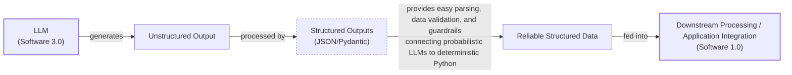

# Lesson 4: Structured Outputs

In our previous lessons, we laid the groundwork for AI Engineering. We explored the AI agent landscape, looked at the difference between rule-based LLM workflows and autonomous AI agents, and covered context engineering: the art of feeding the right information to an LLM. In this lesson, we will tackle a fundamental challenge: getting structured and reliable information *out* of an LLM.

LLMs operate in a world of unstructured data and probabilities, where we input instructions in plain English and get results as plain text. This subdomain of engineering is often called "Software 3.0". Our application, however, relies on deterministic code and predictable data structures, which is known as "Software 1.0". Structured outputs are the bridge between these two worlds, a fundamental technique for forcing LLMs to return consistent, machine-readable data. Mastering this is essential for any AI engineer building production-grade systems.

## Understanding why structured outputs are critical

Before we start coding, it is important to understand why structured outputs are foundational to building reliable AI applications. When an LLM returns a free-form string, you face the messy task of parsing it. This often involves fragile regular expressions or string-splitting logic [[1]](https://dev.to/pockit_tools/llm-structured-output-in-2026-stop-parsing-json-with-regex-and-do-it-right-34pk). This is an old problem in a new domain; for years, developers used similar methods like CSS selectors to scrape websites, only to have their tools break with the slightest redesign [[2]](https://bytetunnels.com/posts/llm-powered-data-extraction-schema-driven-scraping-with-structured-output). These methods easily break if the model changes its phrasing even slightly [[3]](https://pmc.ncbi.nlm.nih.gov/articles/PMC11751965/), [[4]](https://arxiv.org/html/2506.21585v1). Structured outputs solve this by forcing the model’s response into a predictable format like JSON.

This approach offers several key benefits. First, structured outputs are easy to parse, manipulate, and debug. Instead of wrestling with raw text, you work with clean Python objects like dictionaries or, even better, Pydantic models. This makes your code cleaner and more predictable. Second, using libraries like Pydantic adds a layer of data and type validation [[5]](https://www.speakeasy.com/blog/pydantic-vs-dataclasses), [[6]](https://codetain.com/blog/validators-approach-in-python-pydantic-vs-dataclasses/). If the LLM returns a string where an integer is expected, your application raises a clear validation error immediately, preventing bad data from propagating.

Structured outputs create a formal contract between the LLM and your application code. This is useful for extracting entities like names and dates to build knowledge graphs or for formatting the LLM output for downstream processing [[7]](https://www.prompts.ai/en/blog-details/automating-knowledge-graphs-with-llm-outputs), [[8]](https://humanloop.com/blog/structured-outputs). In regulated fields like finance and healthcare, this precision is not just a convenience but a requirement for compliance and reliability [[9]](https://www.leewayhertz.com/structured-outputs-in-llms).


Image 1: A flowchart illustrating the process of formatting LLM output into a predefined data structure for downstream processing.

Ultimately, structured outputs are the standard method for modeling domain objects in AI engineering, connecting the probabilistic nature of LLMs with deterministic code. To see how this works in practice, we will explore three implementation methods: from scratch with JSON, from scratch with Pydantic, and natively with the Gemini API.

## Implementing structured outputs from scratch using JSON

To understand what modern LLM APIs offer, we will first implement structured outputs from scratch. This manual approach, which relies on carefully crafted prompts, is often humorously described as a negotiation with the model, involving everything from polite requests to stern directives to get the desired format [[10]](https://medium.com/google-cloud/structured-output-with-gemini-models-begging-borrowing-and-json-ing-f70ffd60eae6). Our goal is to prompt a model to return a JSON object and then parse it into a Python dictionary. We will demonstrate this by extracting key details from a financial document.

<aside>
💡

You can find the code for this lesson in the notebook of Lesson 4 in the GitHub repository of the course.

</aside>

1. We begin by setting up our environment. This involves initializing the Gemini client and defining the model we will use. For our examples, we will use `gemini-3.5-flash`, which is fast and cost-effective.

    ```python
    import json
    
    from google import genai
    
    client = genai.Client()
    
    MODEL_ID = "gemini-3.5-flash"
    ```

2. Next, we define a sample document for analysis.

    ```python
    DOCUMENT = """
    # Q3 2023 Financial Performance Analysis
    
    The Q3 earnings report shows a 20% increase in revenue and a 15% growth in user engagement, 
    beating market expectations. These impressive results reflect our successful product strategy 
    and strong market positioning.
    
    Our core business segments demonstrated remarkable resilience, with digital services leading 
    the growth at 25% year-over-year. The expansion into new markets has proven particularly 
    successful, contributing to 30% of the total revenue increase.
    
    Customer acquisition costs decreased by 10% while retention rates improved to 92%, 
    marking our best performance to date. These metrics, combined with our healthy cash flow 
    position, provide a strong foundation for continued growth into Q4 and beyond.
    """
    ```

3. We craft a prompt that instructs the LLM to extract metadata and format it as JSON. We provide a clear example of the desired structure and use XML tags like `<document>` and `<json>` to separate the input from instructions. This is an effective prompt engineering technique for improving clarity and guiding the model’s output [[11]](https://help.openai.com/en/articles/6654000-best-practices-for-prompt-engineering-with-the-openai-api), [[12]](https://aws.amazon.com/blogs/machine-learning/structured-data-response-with-amazon-bedrock-prompt-engineering-and-tool-use/). Always include a concrete example in your prompt and use explicit phrasing like "raw JSON format only" to discourage extra formatting [[13]](https://python.plainenglish.io/getting-structured-json-responses-from-llms-a-simple-solution-f819fc389ebc).

    ```python
    prompt = f"""
    Analyze the following document and extract metadata from it. 
    The output must be a single, valid JSON object with the following structure:
    <json>
    {{ 
        "summary": "A concise summary of the article.", 
        "tags": ["list", "of", "relevant", "tags"], 
        "keywords": ["list", "of", "key", "concepts"],
        "quarter": "Q...",
        "growth_rate": "...%",
    }}
    </json>
    
    Here is the document:
    <document>
    {DOCUMENT}
    </document>
    """
    ```

4. We send the prompt to the model. As expected, it returns a JSON object, often wrapped in Markdown code blocks.

    ```python
    response = client.models.generate_content(model=MODEL_ID, contents=prompt)
    ```

    It outputs:

    ```text
    ```json
    {
        "summary": "The Q3 2023 financial report highlights a strong performance with a 20% increase in revenue and 15% growth in user engagement, surpassing market expectations. This success is attributed to a robust product strategy, effective market positioning, and successful expansion into new markets, leading to improved customer retention and reduced acquisition costs.",
        "tags": [
            "financials",
            "earnings report",
            "business performance",
            "revenue growth",
            "market expansion",
            "Q3 2023"
        ],
        "keywords": [
            "Q3 2023",
            "revenue",
            "user engagement",
            "market expectations",
            "product strategy",
            "market positioning",
            "digital services",
            "new markets",
            "customer acquisition costs",
            "retention rates",
            "cash flow"
        ],
        "quarter": "Q3 2023",
        "growth_rate": "20%"
    }
    ```
    ```

5. To handle this, we create a helper function to strip the Markdown and XML tags, leaving a clean JSON string.

    ```python
    def extract_json_from_response(response: str) -> dict:
        """
        Extracts JSON from a response string that is wrapped in <json> or ```json tags.
        """
    
        response = response.replace("<json>", "").replace("</json>", "")
        response = response.replace("```json", "").replace("```", "")
    
        return json.loads(response)
    ```

6. Finally, we parse the string into a Python dictionary, which can now be used in our application.

    ```python
    parsed_response = extract_json_from_response(response.text)
    ```

    It outputs:

    ```json
    {
      "summary": "The Q3 2023 financial report highlights a strong performance with a 20% increase in revenue and 15% growth in user engagement, surpassing market expectations. This success is attributed to a robust product strategy, effective market positioning, and successful expansion into new markets, leading to improved customer retention and reduced acquisition costs.",
      "tags": [
        "financials",
        "earnings report",
        "business performance",
        "revenue growth",
        "market expansion",
        "Q3 2023"
      ],
      "keywords": [
        "Q3 2023",
        "revenue",
        "user engagement",
        "market expectations",
        "product strategy",
        "market positioning",
        "digital services",
        "new markets",
        "customer acquisition costs",
        "retention rates",
        "cash flow"
      ],
      "quarter": "Q3 2023",
      "growth_rate": "20%"
    }
    ```

This manual method works, but it relies on post-processing and lacks data validation. Its fragility comes from the probabilistic nature of LLMs; they are text generators, not data structure creators [[1]](https://dev.to/pockit_tools/llm-structured-output-in-2026-stop-parsing-json-with-regex-and-do-it-right-34pk). The model might add explanatory text, use incorrect types, or even change key names, causing the `extract_json_from_response` function or the `json.loads` call to fail [[14]](https://tetrate.io/learn/ai/llm-output-parsing-structured-generation). If the LLM makes a mistake, our application will fail. Next, we will see how Pydantic provides a much more robust solution.

## Implementing structured outputs from scratch using Pydantic

Forcing JSON output is an improvement, but it still leaves you with a plain Python dictionary. You cannot be sure about its contents, keys, or value types. This uncertainty can lead to bugs. Pydantic is a data validation library that solves this by enforcing structure and type hints at runtime, ensuring data integrity [[5]](https://www.speakeasy.com/blog/pydantic-vs-dataclasses).

When an LLM produces output that does not match your Pydantic model, the library raises a `ValidationError` that clearly explains what went wrong. This "fail-fast" behavior is essential for building reliable systems, preventing bad data from causing hard-to-debug errors later. Common failures include the LLM returning incorrect field names, missing required fields, or using the wrong data types, all of which Pydantic catches immediately [[15]](https://mlpills.substack.com/p/issue-128-structured-llm-outputs).

Let's refactor our previous example to use Pydantic.

1. We define our desired data structure as a Pydantic class. This class acts as a single source of truth for the output format. We use standard Python type hints to define the expected type for each field. Pydantic works with Python’s `typing` module, but since Python 3.9, you can use built-in types like `list` directly. For example, `tags: list[str]` is now preferred over importing `List` from `typing`.

    ```python
    from pydantic import BaseModel, Field
    
    class DocumentMetadata(BaseModel):
        """A class to hold structured metadata for a document."""
    
        summary: str = Field(description="A concise, 1-2 sentence summary of the document.")
        tags: list[str] = Field(description="A list of 3-5 high-level tags relevant to the document.")
        keywords: list[str] = Field(description="A list of specific keywords or concepts mentioned.")
        quarter: str = Field(description="The quarter of the financial year described in the document (e.g, Q3 2023).")
        growth_rate: str = Field(description="The growth rate of the company described in the document (e.g, 10%).")
    ```

    The `description` parameter in `Field` serves a dual purpose: it is not only documentation for developers but also an instruction injected directly into the prompt for the LLM [[15]](https://mlpills.substack.com/p/issue-128-structured-llm-outputs). This effectively turns your schema definition into a form of prompt engineering, where clear documentation directly guides the model’s behavior. Precise descriptions significantly improve the quality and consistency of the model's output.

2. You can also nest Pydantic models to represent more complex, hierarchical data. This helps organize your data logically.

    ```python
    class Summary(BaseModel):
        text: str
        sentiment: float
    
    class Tag(BaseModel):
        label: str
        relevance: float
    
    class ComplexDocumentMetadata(BaseModel):
        summary: Summary
        tags: list[Tag]
    ```

    However, it is good practice to keep schemas as simple as possible, as complex nested structures can confuse the LLM and lead to errors [[16]](https://dev.to/mechcloud_academy/going-deeper-with-pydantic-nested-models-and-data-structures-4e24). Furthermore, every constraint you add increases the model's processing time. A highly complex schema with many nested objects, constrained fields, and long descriptions can significantly increase latency. This trade-off, sometimes called the 'schema complexity tax', means you must balance the need for precise validation against performance requirements [[1]](https://dev.to/pockit_tools/llm-structured-output-in-2026-stop-parsing-json-with-regex-and-do-it-right-34pk).

3. With our Pydantic model defined, we can automatically generate a JSON Schema from it. A schema is the standard for defining the structure and constraints of your data, acting as a formal contract between your application and the LLM [[17]](https://pydantic.dev/articles/llm-intro). This is similar to the technique used internally by APIs like Gemini and OpenAI to enforce a specific output format [[18]](https://ai.google.dev/gemini-api/docs/structured-output).

    ```python
    schema = DocumentMetadata.model_json_schema()
    ```

    The generated schema is detailed and includes descriptions from the `Field` definitions to guide the generation process.

    ```json
    {'description': 'A class to hold structured metadata for a document.',
     'properties': {'summary': {'description': 'A concise, 1-2 sentence summary of the document.',
       'title': 'Summary',
       'type': 'string'},
      'tags': {'description': 'A list of 3-5 high-level tags relevant to the document.',
       'items': {'type': 'string'},
       'title': 'Tags',
       'type': 'array'},
      'keywords': {'description': 'A list of specific keywords or concepts mentioned.',
       'items': {'type': 'string'},
       'title': 'Keywords',
       'type': 'array'},
      'quarter': {'description': 'The quarter of the financial year described in the document (e.g, Q3 2023).',
       'title': 'Quarter',
       'type': 'string'},
      'growth_rate': {'description': 'The growth rate of the company described in the document (e.g, 10%).',
       'title': 'Growth Rate',
       'type': 'string'}},
     'required': ['summary', 'tags', 'keywords', 'quarter', 'growth_rate'],
     'title': 'DocumentMetadata',
     'type': 'object'}
    ```

4. We update our prompt to include this JSON Schema.

    ```python
    prompt = f"""
    Please analyze the following document and extract metadata from it. 
    The output must be a single, valid JSON object that conforms to the following JSON Schema:
    <json>
    {json.dumps(schema, indent=2)}
    </json>
    
    Here is the document:
    <document>
    {DOCUMENT}
    </document>
    """
    ```

5. We call the model and extract the JSON string as before.

    ```python
    response = client.models.generate_content(model=MODEL_ID, contents=prompt)
    
    parsed_response = extract_json_from_response(response.text)
    ```

    It outputs:

    ```json
    {
        "summary": "The Q3 2023 earnings report indicates strong financial performance with a 20% increase in revenue and 15% growth in user engagement, driven by successful product strategy, market expansion, and improved customer retention.",
        "tags": [
            "Financial Performance",
            "Earnings Report",
            "Business Growth",
            "Market Expansion",
            "Customer Metrics"
        ],
        "keywords": [
            "Q3 2023",
            "revenue increase",
            "user engagement",
            "digital services",
            "new markets",
            "customer acquisition costs",
            "retention rates",
            "cash flow"
        ],
        "quarter": "Q3 2023",
        "growth_rate": "20%"
    }
    ```

6. Now, the biggest difference is that we can load the output dictionary into our Pydantic model and validate it.

    ```python
    try:
        document_metadata = DocumentMetadata.model_validate(parsed_response)
        print("\nValidation successful!")
    
    except Exception as e:
        print(f"\nValidation failed: {e}")
    ```

    It outputs:

    ```text
    Validation successful!
    ```

The `document_metadata` Pydantic object can now be safely used throughout your application. This is the main advantage: you move from unclear dictionaries to clean, predictable Python objects. If validation fails, one advanced pattern is to catch the `ValidationError`, feed the error message back to the LLM in a new prompt, and ask it to correct its output. This creates a self-correcting loop that makes the system more resilient to minor model errors without requiring manual intervention [[19]](https://machinelearningmastery.com/the-complete-guide-to-using-pydantic-for-validating-llm-outputs). Another common pitfall is that LLMs often avoid returning empty lists, sometimes hallucinating data to fill them. You can mitigate this by explicitly allowing empty lists and instructing the model to return `[]` if no relevant data is found [[1]](https://dev.to/pockit_tools/llm-structured-output-in-2026-stop-parsing-json-with-regex-and-do-it-right-34pk).

While Python’s built-in `dataclasses` or `TypedDict` can define structure, they only provide type hints for static analysis and do not perform runtime validation [[5]](https://www.speakeasy.com/blog/pydantic-vs-dataclasses), [[6]](https://codetain.com/blog/validators-approach-in-python-pydantic-vs-dataclasses/). If the LLM returns a string where an integer is expected, a `dataclass` would happily accept `age='10'` and cause a `TypeError` only when you later try to perform arithmetic on it [[17]](https://pydantic.dev/articles/llm-intro). This lack of runtime enforcement means you are simply postponing the error, not preventing it. `TypedDict` is even more limited, offering no runtime checks at all; it is purely for static analysis tools like `mypy` [[20]](https://www.packetcoders.io/typeddict-vs-pydantic). Pydantic's runtime validation, type constraints, and clear schema definitions make it our favorite way for structuring and validating domain data structures from our AI apps.

## Implementing structured outputs using Gemini and Pydantic

While Pydantic brings structure, we still had to construct prompts and handle responses manually. When working with modern APIs like Gemini and OpenAI, the recommended way to generate structured outputs is by using their native features. This approach is simpler, more accurate, and often more cost-effective than manual prompt engineering. Native support is not a tacked-on feature; it is baked into the model's architecture, which allows for more reliable performance [[10]](https://medium.com/google-cloud/structured-output-with-gemini-models-begging-borrowing-and-json-ing-f70ffd60eae6). The vendor will always handle the optimization on top of their models better than your manual prompting [[18]](https://ai.google.dev/gemini-api/docs/structured-output), [[21]](https://platform.openai.com/docs/guides/structured-outputs), [[22]](https://python.langchain.com/docs/how_to/structured_output/).

Let’s see how to achieve the same result using the Gemini API’s native capabilities.

1. We define a `GenerateContentConfig` object, instructing the Gemini API to set the `response_mime_type` to `"application/json"` and the `response_schema` to our `DocumentMetadata` Pydantic model. This configures the model to output JSON that is then automatically converted to the given Pydantic model.

    ```python
    from google.genai import types

    config = types.GenerateContentConfig(response_mime_type="application/json", response_schema=DocumentMetadata)
    ```

    This single configuration step replaces the manual schema injection and parsing we did earlier. It is important to distinguish this from function calling, which is used to give an agent the ability to take action during a conversation, whereas structured output is used to format the final response for the user [[23]](https://ai.google.dev/gemini-api/docs/structured-output).

2. This configuration makes our prompt significantly shorter and cleaner, as the output format is guided directly by the config.

    ```python
    prompt = f"""
    Analyze the following document and extract its metadata.
    
    Here is the document:
    <document>
    {DOCUMENT}
    </document>
    """
    ```

3. We call the model, passing our simplified prompt and the new configuration object.

    ```python
    response = client.models.generate_content(model=MODEL_ID, contents=prompt, config=config)
    ```

4. The Gemini client automatically parses the output. By accessing the `response.parsed` attribute, we receive a ready-to-use instance of our `DocumentMetadata` Pydantic model.

    ```python
    print(f"Type of the response: `{type(response.parsed)}`")
    ```

    It outputs:

    ```text
    Type of the response: `<class '__main__.DocumentMetadata'>`
    ```

This native approach is robust, efficient, and requires less code. While it is the recommended way for closed-source APIs, the “from scratch” method remains useful for open-source models that may not have this built-in functionality.

## Structured Outputs Are Everywhere

Structured outputs are a fundamental pattern in AI engineering, connecting the probabilistic nature of LLMs with the deterministic world of software. Whether you are building a simple summarization workflow or a complex research agent, you will use structured outputs to ensure reliability and control. This pattern is so foundational that it is becoming the basis for standardized agent-to-agent communication protocols, allowing different AI systems to interact and collaborate in a predictable, machine-readable way [[24]](https://arxiv.org/html/2504.16736v2).

This pattern will be a recurring theme throughout this course. In our next lesson, we will explore the basic ingredients of LLM workflows, where we will see how structured data flows between different components. Later, when we build agents that can take action or reason about the world, structured outputs will be how they parse information and decide what to do next. Mastering this technique is a key step toward building powerful and predictable AI systems.

## References

- [1] LLM Structured Output in 2026: Stop Parsing JSON with Regex and Do It Right. (n.d.). DEV Community. [https://dev.to/pockit_tools/llm-structured-output-in-2026-stop-parsing-json-with-regex-and-do-it-right-34pk](https://dev.to/pockit_tools/llm-structured-output-in-2026-stop-parsing-json-with-regex-and-do-it-right-34pk)
- [2] Schema-Driven LLM Data Extraction. (n.d.). Byte Tunnels. [https://bytetunnels.com/posts/llm-powered-data-extraction-schema-driven-scraping-with-structured-output](https://bytetunnels.com/posts/llm-powered-data-extraction-schema-driven-scraping-with-structured-output)
- [3] Ntinopoulos, V., Biefer, H. R. C., Tudorache, I., Papadopoulos, N., Odavic, D., Risteski, P., Haeussler, A., & Dzemali, O. (2024). Large language models for data extraction from unstructured and semi-structured electronic health records: a multiple model performance evaluation. BMJ Health & Care Informatics, 32(1), e101139. [https://pmc.ncbi.nlm.nih.gov/articles/PMC11751965/](https://pmc.ncbi.nlm.nih.gov/articles/PMC11751965/)
- [4] Evaluation of LLM-based Strategies for the Extraction of Food Product Information from Online Shops. (n.d.). arXiv. [https://arxiv.org/html/2506.21585v1](https://arxiv.org/html/2506.21585v1)
- [5] Type Safety in Python: Pydantic vs. Data Classes vs. Annotations vs. TypedDicts. (2024, August 29). Speakeasy. [https://www.speakeasy.com/blog/pydantic-vs-dataclasses](https://www.speakeasy.com/blog/pydantic-vs-dataclasses)
- [6] Validators approach in Python - Pydantic vs. Dataclasses. (n.d.). Codetain. [https://codetain.com/blog/validators-approach-in-python-pydantic-vs-dataclasses/](https://codetain.com/blog/validators-approach-in-python-pydantic-vs-dataclasses/)
- [7] Automating Knowledge Graphs with LLM Outputs. (n.d.). Prompts.ai. [https://www.prompts.ai/en/blog-details/automating-knowledge-graphs-with-llm-outputs](https://www.prompts.ai/en/blog-details/automating-knowledge-graphs-with-llm-outputs)
- [8] Structured Outputs: everything you should know. (2024, February 13). Humanloop. [https://humanloop.com/blog/structured-outputs](https://humanloop.com/blog/structured-outputs)
- [9] What are Structured Outputs in LLMs? (n.d.). LeewayHertz. [https://www.leewayhertz.com/structured-outputs-in-llms](https://www.leewayhertz.com/structured-outputs-in-llms)
- [10] Structured Output with Gemini Models: Begging, Threatening, and JSON-ing. (2025, April 8). Medium. [https://medium.com/google-cloud/structured-output-with-gemini-models-begging-borrowing-and-json-ing-f70ffd60eae6](https://medium.com/google-cloud/structured-output-with-gemini-models-begging-borrowing-and-json-ing-f70ffd60eae6)
- [11] Best practices for prompt engineering with the OpenAI API. (n.d.). OpenAI Help Center. [https://help.openai.com/en/articles/6654000-best-practices-for-prompt-engineering-with-the-openai-api](https://help.openai.com/en/articles/6654000-best-practices-for-prompt-engineering-with-the-openai-api)
- [12] Structured data response with Amazon Bedrock: Prompt Engineering and Tool Use. (2024, June 26). Amazon Web Services. [https://aws.amazon.com/blogs/machine-learning/structured-data-response-with-amazon-bedrock-prompt-engineering-and-tool-use/](https://aws.amazon.com/blogs/machine-learning/structured-data-response-with-amazon-bedrock-prompt-engineering-and-tool-use/)
- [13] Getting Structured JSON Responses from LLMs: A Simple Solution. (2025, July 21). Python in Plain English. [https://python.plainenglish.io/getting-structured-json-responses-from-llms-a-simple-solution-f819fc389ebc](https://python.plainenglish.io/getting-structured-json-responses-from-llms-a-simple-solution-f819fc389ebc)
- [14] LLM Output Parsing and Structured Generation. (n.d.). Tetrate. [https://tetrate.io/learn/ai/llm-output-parsing-structured-generation](https://tetrate.io/learn/ai/llm-output-parsing-structured-generation)
- [15] Issue #128 - Structured LLM Outputs with Pydantic. (n.d.). ML Pills. [https://mlpills.substack.com/p/issue-128-structured-llm-outputs](https://mlpills.substack.com/p/issue-128-structured-llm-outputs)
- [16] Going Deeper with Pydantic: Nested Models and Data Structures. (n.d.). DEV Community. [https://dev.to/mechcloud_academy/going-deeper-with-pydantic-nested-models-and-data-structures-4e24](https://dev.to/mechcloud_academy/going-deeper-with-pydantic-nested-models-and-data-structures-4e24)
- [17] Steering Large Language Models with Pydantic. (2024, January 4). Pydantic. [https://pydantic.dev/articles/llm-intro](https://pydantic.dev/articles/llm-intro)
- [18] Structured output. (n.d.). Google AI for Developers. [https://ai.google.dev/gemini-api/docs/structured-output](https://ai.google.dev/gemini-api/docs/structured-output)
- [19] The Complete Guide to Using Pydantic for Validating LLM Outputs. (n.d.). MachineLearningMastery.com. [https://machinelearningmastery.com/the-complete-guide-to-using-pydantic-for-validating-llm-outputs](https://machinelearningmastery.com/the-complete-guide-to-using-pydantic-for-validating-llm-outputs)
- [20] TypedDict vs Pydantic. (n.d.). Packet Coders. [https://www.packetcoders.io/typeddict-vs-pydantic](https://www.packetcoders.io/typeddict-vs-pydantic)
- [21] Structured Outputs with OpenAI. (n.d.). OpenAI Platform. [https://platform.openai.com/docs/guides/structured-outputs](https://platform.openai.com/docs/guides/structured-outputs)
- [22] How to return structured data from a model. (n.d.). LangChain. [https://python.langchain.com/docs/how_to/structured_output/](https://python.langchain.com/docs/how_to/structured_output/)
- [23] Structured output. (n.d.). Google AI for Developers. [https://ai.google.dev/gemini-api/docs/structured-output](https://ai.google.dev/gemini-api/docs/structured-output)
- [24] Agora: A Protocol for LLM-based Agent-to-Agent Communication. (2025). arXiv. [https://arxiv.org/html/2504.16736v2](https://arxiv.org/html/2504.16736v2)