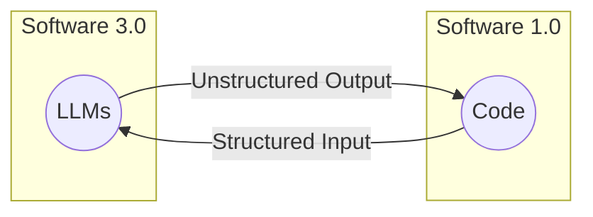

# Lesson 4: Structured Outputs

In our previous lessons, we laid the groundwork for AI Engineering. We explored the AI agent landscape, looked at the difference between rule-based LLM workflows and autonomous AI agents, and covered context engineering: the art of feeding the right information to an LLM. In this lesson, we will tackle a fundamental challenge: getting structured and reliable information *out* of an LLM.

LLMs operate in a world of unstructured data and probabilities, where we input instructions in plain English and get results as plain text. This subdomain of engineering is often called "Software 3.0". Our application, however, relies on deterministic code and predictable data structures, which is known as "Software 1.0". Structured outputs are the bridge between these two worlds, a fundamental technique for forcing LLMs to return consistent, machine-readable data. Mastering this is essential for any AI engineer building production-grade systems.

## Understanding why structured outputs are critical

Before we start coding, it is crucial to understand why structured outputs are foundational to building reliable AI applications. When an LLM returns a free-form string, you face the messy task of parsing it. This often involves fragile regular expressions or string-splitting logic. These methods easily break if the model changes its phrasing even slightly [[1]](https://dev.to/pockit_tools/llm-structured-output-in-2026-stop-parsing-json-with-regex-and-do-it-right-34pk), [[2]](https://www.linkedin.com/posts/pauliusztin_if-you-use-regex-and-string-splits-to-parse-activity-7386740617294282752-QHgP). Structured outputs solve this by forcing the model’s response into a predictable format like JSON.

This approach offers several key benefits. First, structured outputs are easy to parse, manipulate, and debug. Instead of wrestling with raw text, you work with clean Python objects like dictionaries or, even better, Pydantic models. This allows you to programmatically access the data you need without guesswork, making your code cleaner and more predictable.

Second, using libraries like Pydantic adds a layer of data and type validation [[3]](https://shazaali.substack.com/p/type-safety-in-langgraph-when-to), [[4]](https://www.packetcoders.io/typeddict-vs-pydantic). If the LLM returns a string where an integer is expected, your application will not crash silently with a `TypeError` or `KeyError` down the line. Instead, it will raise a clear validation error immediately. This "fail-fast" behavior is essential for building reliable systems and preventing bad data from propagating through your application.

Structured outputs create a formal contract between the LLM and your application code, making it easier to pass data around the system. Engineers use this pattern everywhere to pass the right subset of information to the next LLM step or other downstream systems like databases, user interfaces, or APIs. For example, a popular use case is to extract properties like names, tags, and dates to build knowledge graphs for advanced RAG [[5]](https://www.decodingai.com/p/llm-structured-outputs-the-only-way).


Image 1: The goal of structured outputs is to fill in the gap between Software 3.0 (LLM workflows & AI Agents) and Software 1.0 (Traditional Applications).

To understand how structured outputs work in practice, we will explore three ways to implement them: from scratch with JSON, from scratch with Pydantic, and natively with the Gemini API.

## Implementing Structured Outputs From Scratch Using JSON

We will first implement structured outputs from scratch, guiding an LLM to generate them. This will help you build an intuition for what modern LLM APIs offer.

<aside>
💡

You can find the code for this lesson in the notebook of Lesson 4, in the GitHub repository of the course.

</aside>

Our goal is to prompt the model to return a JSON object and then parse it into a Python dictionary. We will demonstrate this with a simple example where we extract key details, such as a summary, tags, and keywords from a financial document.

1.  We begin by setting up our environment. This involves initializing the Gemini client and defining the model we will use. For our examples, we will use `gemini-3.5-flash`, which is fast and cost-effective.
    ```python
    import json
    
    from google import genai
    from utils import env
    
    env.load(required_env_vars=["GOOGLE_API_KEY"])
    
    client = genai.Client()
    
    MODEL_ID = "gemini-3.5-flash"
    ```

2.  Next, we define a sample document for analysis.
    ```python
    DOCUMENT = """
    # Q3 2023 Financial Performance Analysis

    The Q3 earnings report shows a 20% increase in revenue and a 15% growth in user engagement, 
    beating market expectations. These impressive results reflect our successful product strategy 
    and strong market positioning.

    Our core business segments demonstrated remarkable resilience, with digital services leading 
    the growth at 25% year-over-year. The expansion into new markets has proven particularly 
    successful, contributing to 30% of the total revenue increase.

    Customer acquisition costs decreased by 10% while retention rates improved to 92%, 
    marking our best performance to date. These metrics, combined with our healthy cash flow 
    position, provide a strong foundation for continued growth into Q4 and beyond.
    """
    ```

3.  Now, we craft a prompt that instructs the LLM to extract metadata and format it as JSON. Notice how we provide a clear example of the desired structure and use XML tags like `<document>` and `<json>` to separate the input data from the formatting instructions. This is a common and effective prompt engineering technique to improve clarity and guide the model's output [[6]](https://developer.dataiku.com/latest/tutorials/genai/agents-and-tools/json-output/index.html).
    ```python
    prompt = f"""
    Analyze the following document and extract metadata from it. 
    The output must be a single, valid JSON object with the following structure:
    <json>
    {{ 
        "summary": "A concise summary of the article.", 
        "tags": ["list", "of", "relevant", "tags"], 
        "keywords": ["list", "of", "key", "concepts"],
        "quarter": "Q...",
        "growth_rate": "...%",
    }}
    </json>

    Here is the document:
    <document>
    {DOCUMENT}
    </document>
    """
    ```

4.  We send the prompt to the model and inspect the raw response. As expected, the model returns a JSON object, but it is often wrapped in Markdown code blocks.
    ```python
    response = client.models.generate_content(model=MODEL_ID, contents=prompt)
    ```
    It outputs:
    ```json
       ```json
     {
         "summary": "The Q3 2023 financial report highlights a strong performance with a 20% increase in revenue and 15% growth in user engagement, surpassing market expectations. This success is attributed to a robust product strategy, effective market positioning, and successful expansion into new markets, leading to improved customer retention and reduced acquisition costs.",
         "tags": [
             "financials",
             "earnings report",
             "business performance",
             "revenue growth",
             "market expansion",
             "Q3 2023"
         ],
         "keywords": [
             "Q3 2023",
             "revenue",
             "user engagement",
             "market expectations",
             "product strategy",
             "market positioning",
             "digital services",
             "new markets",
             "customer acquisition costs",
             "retention rates",
             "cash flow"
         ],
         "quarter": "Q3 2023",
         "growth_rate": "20%"
     }
     ```
    ```

5.  To parse the generated output, we create a simple helper function to strip the Markdown and XML tags, leaving us with a clean JSON string.
    ```python
    def extract_json_from_response(response: str) -> dict:
        """
        Extracts JSON from a response string that is wrapped in <json> or ```json tags.
        """
    
        response = response.replace("<json>", "").replace("</json>", "")
        response = response.replace("```json", "").replace("```", "")
    
        return json.loads(response)
    ```

6.  Finally, we parse the string into a Python dictionary, which can now be used in your application.
    ```python
    parsed_response = extract_json_from_response(response.text)
    ```
    It outputs:
    ```json
    {
    "summary": "The Q3 2023 financial report highlights a strong performance with a 20% increase in revenue and 15% growth in user engagement, surpassing market expectations. This success is attributed to a robust product strategy, effective market positioning, and successful expansion into new markets, leading to improved customer retention and reduced acquisition costs.",
    "tags": [
      "financials",
      "earnings report",
      "business performance",
      "revenue growth",
      "market expansion",
      "Q3 2023"
    ],
    "keywords": [
      "Q3 2023",
      "revenue",
      "user engagement",
      "market expectations",
      "product strategy",
      "market positioning",
      "digital services",
      "new markets",
      "customer acquisition costs",
      "retention rates",
      "cash flow"
    ],
    "quarter": "Q3 2023",
    "growth_rate": "20%"
    }
    ```

This "from scratch" method works, but it relies on manual parsing and lacks data validation. If the LLM makes a mistake, such as outputting an integer instead of a string, our application will fail. Next, we will see how Pydantic solves this problem.

## Implementing Structured Outputs From Scratch Using Pydantic

While forcing JSON output is an improvement over parsing raw text, it still leaves you with a plain Python dictionary. You cannot be sure what is inside that dictionary, if the keys are correct, or if the values have the right type. This uncertainty can lead to bugs and make your code difficult to maintain. This is where Pydantic helps. Pydantic is a data validation library that enforces structure and type hints at runtime, ensuring data integrity from the moment data enters your application [[7]](https://www.freecodecamp.org/news/how-to-keep-llm-outputs-predictable-using-pydantic-validation). It provides a single, clear source of truth for your data structure and can automatically generate a JSON Schema from your Python class.

When an LLM produces output that does not match the structure and types defined in your Pydantic model, the library raises a `ValidationError`. This error clearly explains what went wrong, allowing you to quickly identify and fix issues. This "fail-fast" behavior is essential for building reliable systems, preventing bad data from moving through your application and causing hard-to-debug errors later.

Let's refactor our previous example to use Pydantic.

1.  We define our desired data structure as a Pydantic class. This class acts as a single source of truth for your output format. We use standard Python type hints to define the expected type for each field. Pydantic works with Python’s `typing` module. However, since Python 3.9, you can use built-in types like `list` directly. For example, `tags: list[str]` is now preferred over importing `List` from `typing`.
    ```python
    from pydantic import BaseModel, Field
    
    class DocumentMetadata(BaseModel):
        """A class to hold structured metadata for a document."""
    
        summary: str = Field(description="A concise, 1-2 sentence summary of the document.")
        tags: list[str] = Field(description="A list of 3-5 high-level tags relevant to the document.")
        keywords: list[str] = Field(description="A list of specific keywords or concepts mentioned.")
        quarter: str = Field(description="The quarter of the financial year described in the document (e.g, Q3 2023).")
        growth_rate: str = Field(description="The growth rate of the company described in the document (e.g, 10%).")
    ```
    You can also nest Pydantic models to represent more complex, hierarchical data. This allows you to define intricate relationships between different pieces of information, such as a `DocumentMetadata` model containing a `Summary` object and a list of `Tag` objects [[8]](https://dev.to/mechcloud_academy/going-deeper-with-pydantic-nested-models-and-data-structures-4e24). However, it is a good practice to keep schemas from becoming overly complex, as this can confuse the LLM and lead to errors. For example:
    ```python
    class Summary(BaseModel):
        text: str
        sentiment: float

    class Tag(BaseModel):
        label: str
        relevance: float

    class ComplexDocumentMetadata(BaseModel):
        summary: Summary
        tags: list[Tag]
    ```

2.  With our Pydantic model defined, we can automatically generate a JSON Schema from it. The standard term for defining the structure and constraints of your data is a `schema` or `contract`. It precisely dictates the expected fields, their types, and any validation rules. We provide this generated schema to the LLM to guide its output, giving the model a clear blueprint for its response. This is similar to the technique used internally by APIs like Gemini and OpenAI to enforce a specific output format [[9]](https://ai.google.dev/gemini-api/docs/structured-output), [[10]](https://platform.openai.com/docs/guides/structured-outputs).
    ```python
    schema = DocumentMetadata.model_json_schema()
    ```
    The generated schema looks like this. Notice how the `description` defined in the `Field` type descriptor is present in the schema, which helps guide the generation process.
    ```json
    {
       "description": "A class to hold structured metadata for a document.",
       "properties": {
          "summary": {
             "description": "A concise, 1-2 sentence summary of the document.",
             "title": "Summary",
             "type": "string"
          },
          "tags": {
             "description": "A list of 3-5 high-level tags relevant to the document.",
             "items": {
                "type": "string"
             },
             "title": "Tags",
             "type": "array"
          },
          "keywords": {
             "description": "A list of specific keywords or concepts mentioned.",
             "items": {
                "type": "string"
             },
             "title": "Keywords",
             "type": "array"
          },
          "quarter": {
             "description": "The quarter of the financial year described in the document (e.g, Q3 2023).",
             "title": "Quarter",
             "type": "string"
          },
          "growth_rate": {
             "description": "The growth rate of the company described in the document (e.g, 10%).",
             "title": "Growth Rate",
             "type": "string"
          }
       },
       "required": [
          "summary",
          "tags",
          "keywords",
          "quarter",
          "growth_rate"
       ],
       "title": "DocumentMetadata",
       "type": "object"
    }
    ```

3.  We update our prompt to include this JSON Schema. This gives the model a much more precise set of instructions than our previous plain-text example.
    ```python
    prompt = f"""
    Please analyze the following document and extract metadata from it. 
    The output must be a single, valid JSON object that conforms to the following JSON Schema:
    <json>
    {json.dumps(schema, indent=2)}
    </json>

    Here is the document:
    <document>
    {DOCUMENT}
    </document>
    """
    ```

4.  Now we call the model and extract the JSON string, as in the previous example.
    ```python
    response = client.models.generate_content(model=MODEL_ID, contents=prompt)
    parsed_response = extract_json_from_response(response.text)
    ```
    It outputs:
    ```json
    {
        "summary": "The Q3 2023 earnings report indicates strong financial performance with a 20% increase in revenue and 15% growth in user engagement, driven by successful product strategy, market expansion, and improved customer retention.",
        "tags": [
            "Financial Performance",
            "Earnings Report",
            "Business Growth",
            "Market Expansion",
            "Customer Metrics"
        ],
        "keywords": [
            "Q3 2023",
            "revenue increase",
            "user engagement",
            "digital services",
            "new markets",
            "customer acquisition costs",
            "retention rates",
            "cash flow"
        ],
        "quarter": "Q3 2023",
        "growth_rate": "20%"
    }
    ```

5.  Ultimately, we validate and parse it directly into our `DocumentMetadata` object.
    ```python
    try:
        document_metadata = DocumentMetadata.model_validate(parsed_response)
        print("\nValidation successful!")
    except Exception as e:
        print(f"\nValidation failed: {e}")
    ```
    It outputs:
    ```text
    Validation successful!
    ```
    The `document_metadata` Pydantic object can now be safely used throughout your application, with full type-hinting and attribute access. This is the main advantage: you move away from unclear dictionaries to clean, predictable Python objects. For example, if the `tags` attribute was a simple string instead of a list of strings, Pydantic's validation would have failed.

Python’s built-in `dataclasses` or `TypedDict` can define structure, but they only provide type hints for static analysis tools [[3]](https://shazaali.substack.com/p/type-safety-in-langgraph-when-to), [[4]](https://www.packetcoders.io/typeddict-vs-pydantic). They do not perform runtime validation. This means if the LLM returns a string where an integer is expected, these tools will not catch the error. Pydantic’s runtime validation, type constraints, and clear schema definitions make it a strong option for structuring and validating data in LLM workflows.

## Implementing Structured Outputs Using Gemini and Pydantic

While Pydantic brings structure and validation, we still had to construct prompts and handle responses manually. When working with modern APIs such as Gemini and OpenAI, the recommended way to generate structured outputs is by using their native features. This approach is simpler, more accurate, and often more cost-effective than manual prompt engineering, as the vendor will always handle the optimization on top of their models better than you can [[9]](https://ai.google.dev/gemini-api/docs/structured-output), [[11]](https://python.langchain.com/docs/how_to/structured_output/), [[12]](https://agenta.ai/blog/the-guide-to-structured-outputs-and-function-calling-with-llms).

Let’s see how to achieve the same result using the Gemini API's native capabilities.

1.  We define a `GenerateContentConfig` object, instructing the Gemini API to set the `response_mime_type` to `"application/json"` and the `response_schema` to our `DocumentMetadata` Pydantic model. This configures the model to output JSON that is then automatically converted to the given Pydantic model.
    ```python
    from google.genai import types
    
    config = types.GenerateContentConfig(response_mime_type="application/json", response_schema=DocumentMetadata)
    ```

2.  This configuration makes our prompt significantly shorter and cleaner, eliminating the need to manually inject any schema. We simply ask the model to perform the task, as the output format is guided directly by the config.
    ```python
    prompt = f"""
    Analyze the following document and extract its metadata.

    Here is the document:
    <document>
    {DOCUMENT}
    </document>
    """
    ```

3.  Now, we call the model, passing our simplified prompt and the new configuration object. The API handles the rest.
    ```python
    response = client.models.generate_content(model=MODEL_ID, contents=prompt, config=config)
    ```

4.  The Gemini client automatically parses the output for us. By accessing the `response.parsed` attribute, we receive a ready-to-use instance of our `DocumentMetadata` Pydantic model.
    ```python
    document_metadata = response.parsed
    print(f"Type of the response: `{type(document_metadata)}`")
    ```
    It outputs:
    ```text
    Type of the response: `<class '__main__.DocumentMetadata'>`
    ```
This native approach is robust, efficient, and requires less code, allowing you to focus on your application's logic instead of data wrangling.

## Structured Outputs Are Everywhere

We have covered the why and how of structured outputs, from manual prompting to native API integration. This technique is a fundamental pattern in AI engineering, connecting the probabilistic nature of LLMs with the deterministic world of software. Whether you are building a simple summarization workflow or a complex research agent, you will use structured outputs to ensure reliability and control.

This pattern will be a recurring theme throughout this course. In our next lesson, we will explore the basic ingredients of LLM workflows, where we will see how structured data flows between components. Later, when we build agents that can take action (Lesson 6) or reason about the world (Lesson 7), structured outputs will be how they parse information and decide what to do next. Mastering this technique is a key step toward building powerful and predictable AI systems.

## References

- [1] [LLM Structured Output in 2026: Stop Parsing JSON with Regex and Do It Right](https://dev.to/pockit_tools/llm-structured-output-in-2026-stop-parsing-json-with-regex-and-do-it-right-34pk)
- [2] [If you use regex and string splits to parse your LLM outputs, read this...](https://www.linkedin.com/posts/pauliusztin_if-you-use-regex-and-string-splits-to-parse-activity-7386740617294282752-QHgP)
- [3] [Type Safety in LangGraph: When to Use TypedDict vs. Pydantic](https://shazaali.substack.com/p/type-safety-in-langgraph-when-to)
- [4] [TypedDict vs Pydantic](https://www.packetcoders.io/typeddict-vs-pydantic)
- [5] [Structured Outputs: The Silent Hero of Production AI](https://www.decodingai.com/p/llm-structured-outputs-the-only-way)
- [6] [Getting structured JSON responses from LLMs: A simple solution](https://python.plainenglish.io/getting-structured-json-responses-from-llms-a-simple-solution-f819fc389ebc)
- [7] [How to Keep LLM Outputs Predictable Using Pydantic Validation](https://www.freecodecamp.org/news/how-to-keep-llm-outputs-predictable-using-pydantic-validation)
- [8] [Going Deeper with Pydantic: Nested Models and Data Structures](https://dev.to/mechcloud_academy/going-deeper-with-pydantic-nested-models-and-data-structures-4e24)
- [9] [Structured output](https://ai.google.dev/gemini-api/docs/structured-output)
- [10] [Structured Outputs with OpenAI](https://platform.openai.com/docs/guides/structured-outputs)
- [11] [How to return structured data from a model](https://python.langchain.com/docs/how_to/structured_output/)
- [12] [The guide to structured outputs and function calling with LLMs](https://agenta.ai/blog/the-guide-to-structured-outputs-and-function-calling-with-llms)