# Lesson 4: Structured Outputs

In previous lessons, you learned the groundwork for AI Engineering. We explored the AI agent landscape, looked at the difference between rule-based LLM workflows and autonomous AI agents, and covered context engineering: the art of feeding the right information to an LLM. In this lesson, we will tackle a fundamental challenge: getting structured and reliable information *out* of an LLM.

LLMs operate in a world of unstructured data and probabilities, where we input instructions in plain English and get results as plain text. This subdomain of engineering is often called "Software 3.0". Our application, however, relies on deterministic code and predictable data structures, which is known as "Software 1.0". Structured outputs are the bridge between these two worlds, a fundamental technique for forcing LLMs to return consistent, machine-readable data. Mastering this is essential for any AI engineer building production-grade systems.

## Understanding why structured outputs are critical

Before we start coding, it is crucial to understand why structured outputs are foundational to building reliable AI applications. When an LLM returns a free-form string, you face the messy task of parsing it. It is important to remember that even when prompted for JSON, LLMs are still just generating text that *looks* like a valid data structure. The output can have incorrect field names, wrong data types, or extra text wrapped around the actual data [[1]](https://machinelearningmastery.com/the-complete-guide-to-using-pydantic-for-validating-llm-outputs). This often involves fragile regular expressions or string-splitting logic that can easily break if the model’s phrasing changes even slightly [[2]](https://pmc.ncbi.nlm.nih.gov/articles/PMC11751965/), [[3]](https://arxiv.org/html/2506.21585v1). Structured outputs solve this by forcing the model’s response into a predictable format like JSON.

This approach offers several key benefits. First, structured outputs are easy to parse, manipulate, and debug. Instead of wrestling with raw text, you work with clean Python objects, making your code more predictable. Using libraries like Pydantic adds a layer of data and type validation [[4]](https://www.speakeasy.com/blog/pydantic-vs-dataclasses), [[5]](https://codetain.com/blog/validators-approach-in-python-pydantic-vs-dataclasses/). If the LLM returns a string where an integer is expected, your application raises a clear validation error immediately, preventing bad data from propagating.

Structured outputs create a formal contract between the LLM and your application code. They are the standard method for modeling domain objects in AI engineering. This makes it easier to pass data between steps in a workflow or to downstream systems like a database or API [[6]](https://www.prompts.ai/en/blog-details/automating-knowledge-graphs-with-llm-outputs), [[7]](https://humanloop.com/blog/structured-outputs). For example, you can extract entities like names and dates to build knowledge graphs for advanced RAG, or format the LLM output into a predefined data structure for further processing.

```mermaid
flowchart LR
  %% Start: Unstructured LLM Output
  LLM_Output["LLM Output<br/>(Messy Strings, Uncontrolled Outputs from Software 3.0)"]

  %% Bridge: Structured Outputs (JSON/Pydantic)
  subgraph "Structured Outputs (JSON/Pydantic)"
    subgraph "Pydantic Validation Layer"
      JSON_Extract["JSON Extraction"]
      Schema_Validate["Schema Validation<br/>(Validation errors for incorrect types or missing fields)"]
      Custom_Validate["Custom Validators"]

      JSON_Extract -- "validates against schema" --> Schema_Validate
      Schema_Validate -- "applies custom logic" --> Custom_Validate
    end
  end

  %% Output of the Bridge
  Reliable_Data["Reliable Structured Data<br/>(Safe, Typed, Schema-Validated)"]

  %% End: Application Integration
  Application_Integration["Application Integration / Downstream Processing<br/>(Software 1.0)"]

  %% Primary Data Flow
  LLM_Output -- "transforms into" --> JSON_Extract
  Custom_Validate -- "produces" --> Reliable_Data
  Reliable_Data -- "consumed by" --> Application_Integration

  %% Visual Grouping
  classDef source_node stroke-dasharray:3,3
  classDef process_node stroke-width:2px
  classDef data_artifact stroke-dasharray:5,5

  class LLM_Output source_node
  class JSON_Extract,Schema_Validate,Custom_Validate process_node
  class Reliable_Data data_artifact
  class Application_Integration process_node
```


Image 1: A flowchart illustrating the process of transforming unstructured LLM output into reliable, structured data for seamless integration with Python applications.

To understand how structured outputs work in practice, we will explore three ways to implement them: from scratch with JSON, from scratch with Pydantic, and natively with the Gemini API.

## Implementing structured outputs from scratch using JSON

To understand what happens behind the scenes in modern LLM APIs, we will first implement structured outputs from scratch by prompting a model to return a JSON object. We will demonstrate this by extracting key details from a financial document.

<aside>
💡

You can find the code for this lesson in the notebook for Lesson 4 in the course's GitHub repository.

</aside>

1. First, we set up our environment by initializing the Gemini client and defining the model we will use. For our examples, we will use `gemini-3.5-flash`, which is fast and cost-effective.
    ```python
    import json
    
    from google import genai
    from lessons.utils import env
    
    env.load(required_env_vars=["GOOGLE_API_KEY"])
    
    client = genai.Client()
    
    MODEL_ID = "gemini-3.5-flash"
    ```

2. Next, we define a sample document for analysis.
    ```python
    DOCUMENT = """
    # Q3 2023 Financial Performance Analysis
    
    The Q3 earnings report shows a 20% increase in revenue and a 15% growth in user engagement, 
    beating market expectations. These impressive results reflect our successful product strategy 
    and strong market positioning.
    
    Our core business segments demonstrated remarkable resilience, with digital services leading 
    the growth at 25% year-over-year. The expansion into new markets has proven particularly 
    successful, contributing to 30% of the total revenue increase.
    
    Customer acquisition costs decreased by 10% while retention rates improved to 92%, 
    marking our best performance to date. These metrics, combined with our healthy cash flow 
    position, provide a strong foundation for continued growth into Q4 and beyond.
    """
    ```

3. We craft a prompt that instructs the LLM to extract metadata and format it as JSON. The key to good prompt engineering is providing a clear example of how the output should look. We also use XML tags like `<document>` and `<json>` to separate the input data from the formatting instructions. This is an effective technique to improve clarity and guide the model’s output [[8]](https://help.openai.com/en/articles/6654000-best-practices-for-prompt-engineering-with-the-openai-api), [[9]](https://aws.amazon.com/blogs/machine-learning/structured-data-response-with-amazon-bedrock-prompt-engineering-and-tool-use/).
    ```python
    prompt = f"""
    Analyze the following document and extract metadata from it. 
    The output must be a single, valid JSON object with the following structure:
    <json>
    {{ 
        "summary": "A concise summary of the article.", 
        "tags": ["list", "of", "relevant", "tags"], 
        "keywords": ["list", "of", "key", "concepts"],
        "quarter": "Q...",
        "growth_rate": "...%",
    }}
    </json>
    
    Here is the document:
    <document>
    {DOCUMENT}
    </document>
    """
    ```

4. We send the prompt to the model. The output looks clean, but LLMs are notoriously "chatty" [[10]](https://python.plainenglish.io/getting-structured-json-responses-from-llms-a-simple-solution-f819fc389ebc). They often wrap the desired JSON in conversational fluff, explanations, or disclaimers. For instance, a response might start with "Sure, here is the JSON you requested:" and end with "I hope this helps!". This is why a simple `json.loads()` on the raw response text will almost certainly fail in a production system [[11]](https://dev.to/pockit_tools/llm-structured-output-in-2026-stop-parsing-json-with-regex-and-do-it-right-34pk).
    ```python
    response = client.models.generate_content(model=MODEL_ID, contents=prompt)
    ```
    It outputs:
    ```text
    ```json
    { 
        "summary": "The Q3 2023 financial report highlights a strong performance with a 20% increase in revenue and 15% growth in user engagement, surpassing market expectations. This success is attributed to a robust product strategy, effective market positioning, and successful expansion into new markets, leading to improved customer retention and reduced acquisition costs.",
        "tags": [
            "financials",
            "earnings report",
            "business performance",
            "revenue growth",
            "market expansion",
            "Q3 2023"
        ],
        "keywords": [
            "Q3 2023",
            "revenue",
            "user engagement",
            "market expectations",
            "product strategy",
            "market positioning",
            "digital services",
            "new markets",
            "customer acquisition costs",
            "retention rates",
            "cash flow"
        ],
        "quarter": "Q3 2023",
        "growth_rate": "20%"
    }
    ```
    ```

5. To handle this, we need a way to isolate the JSON block from the surrounding text. A common but fragile approach is to use string manipulation or regular expressions to find and extract the content between the JSON delimiters. Our helper function does exactly this, stripping the Markdown tags to produce a clean JSON string. While this works for our specific case, it is a brittle solution that might fail if the model changes its output format, for example, by stopping the use of ````json` or adding extra text inside the code block.
    ```python
    def extract_json_from_response(response: str) -> dict:
        """
        Extracts JSON from a response string that is wrapped in <json> or ```json tags.
        """
    
        response = response.replace("<json>", "").replace("</json>", "")
        response = response.replace("```json", "").replace("```", "")
    
        return json.loads(response)
    ```

6. Finally, we parse the string into a Python dictionary, which can now be used in our application.
    ```python
    parsed_response = extract_json_from_response(response.text)
    ```
    It outputs:
    ```text
    {
      'summary': 'The Q3 2023 financial report highlights a strong performance with a 20% increase in revenue and 15% growth in user engagement, surpassing market expectations. This success is attributed to a robust product strategy, effective market positioning, and successful expansion into new markets, leading to improved customer retention and reduced acquisition costs.',
      'tags': ['financials', 'earnings report', 'business performance', 'revenue growth', 'market expansion', 'Q3 2023'],
      'keywords': ['Q3 2023', 'revenue', 'user engagement', 'market expectations', 'product strategy', 'market positioning', 'digital services', 'new markets', 'customer acquisition costs', 'retention rates', 'cash flow'],
      'quarter': 'Q3 2023',
      'growth_rate': '20%'
    }
    ```

This manual method works, but it relies on post-processing and lacks data validation. If the LLM makes a mistake, such as outputting a string instead of an integer or missing a dictionary key, our application will fail. Next, we will see how Pydantic provides a much more robust solution to this problem.

## Implementing structured outputs from scratch using Pydantic

Forcing JSON output is an improvement, but it still leaves you with a plain Python dictionary. You cannot be sure what is inside it, whether the keys are correct, or if the values have the right type. Pydantic solves this problem by enforcing structure and type hints at runtime, ensuring data integrity from the moment it enters your application [[4]](https://www.speakeasy.com/blog/pydantic-vs-dataclasses).

When an LLM produces output that does not match your Pydantic model, the library raises a `ValidationError` that clearly explains what went wrong. For example, if the LLM returns a string instead of an integer for a field, Pydantic will catch it immediately. This "fail-fast" behavior is essential for building reliable systems, preventing bad data from causing hard-to-debug errors later.

Let's refactor our previous example to use Pydantic.

1. We define our desired data structure as a Pydantic class. This class acts as a single source of truth for your output format. We use standard Python type hints to define the expected type for each field. Pydantic works with Python’s `typing` module, but starting with Python 3.9, you can use built-in types like `list` directly. For example, `tags: list[str]` is now preferred over importing `List` from `typing`.
    ```python
    from pydantic import BaseModel, Field
    
    class DocumentMetadata(BaseModel):
        """A class to hold structured metadata for a document."""
    
        summary: str = Field(description="A concise, 1-2 sentence summary of the document.")
        tags: list[str] = Field(description="A list of 3-5 high-level tags relevant to the document.")
        keywords: list[str] = Field(description="A list of specific keywords or concepts mentioned.")
        quarter: str = Field(description="The quarter of the financial year described in the document (e.g, Q3 2023).")
        growth_rate: str = Field(description="The growth rate of the company described in the document (e.g, 10%).")
    ```

2. You can also nest Pydantic models to represent more complex, hierarchical data. This allows you to define intricate relationships between different pieces of information. However, it is good practice to keep schemas as simple as possible, as complex nested structures can confuse the LLM and lead to syntax, structural, or value errors [[12]](https://dev.to/klement_gunndu/stop-parsing-json-by-hand-structured-llm-outputs-with-pydantic-1pg0).
    ```python
    class Summary(BaseModel):
        text: str
        sentiment: float
    
    class Tag(BaseModel):
        label: str
        relevance: float
    
    class ComplexDocumentMetadata(BaseModel):
        summary: Summary
        tags: list[Tag]
    ```

3. With our Pydantic model defined, we can automatically generate a JSON Schema from it. A schema is the standard for defining the structure and constraints of your data, acting as a formal contract between your application and the LLM. This is similar to the technique used internally by APIs like Gemini and OpenAI to enforce a specific output format. These systems often use grammar-based decoding, where the schema restricts the model's possible next tokens at each step of generation, providing mathematical guarantees about the output structure [[13]](https://ai.google.dev/gemini-api/docs/structured-output), [[14]](https://arxiv.org/html/2606.09395v1).
    ```python
    schema = DocumentMetadata.model_json_schema()
    ```
    The generated schema is detailed and includes descriptions from the `Field` definitions to guide the generation process.
    ```text
    {'description': 'A class to hold structured metadata for a document.',
     'properties': {'summary': {'description': 'A concise, 1-2 sentence summary of the document.', 'title': 'Summary', 'type': 'string'},
      'tags': {'description': 'A list of 3-5 high-level tags relevant to the document.', 'items': {'type': 'string'}, 'title': 'Tags', 'type': 'array'},
      'keywords': {'description': 'A list of specific keywords or concepts mentioned.', 'items': {'type': 'string'}, 'title': 'Keywords', 'type': 'array'},
      'quarter': {'description': 'The quarter of the financial year described in the document (e.g, Q3 2023).', 'title': 'Quarter', 'type': 'string'},
      'growth_rate': {'description': 'The growth rate of the company described in the document (e.g, 10%).', 'title': 'Growth Rate', 'type': 'string'}},
     'required': ['summary', 'tags', 'keywords', 'quarter', 'growth_rate'],
     'title': 'DocumentMetadata',
     'type': 'object'}
    ```

4. We update our prompt to include this JSON Schema, giving the model a much more precise set of instructions.
    ```python
    prompt = f"""
    Please analyze the following document and extract metadata from it. 
    The output must be a single, valid JSON object that conforms to the following JSON Schema:
    <json>
    {json.dumps(schema, indent=2)}
    </json>
    
    Here is the document:
    <document>
    {DOCUMENT}
    </document>
    """
    ```

5. We call the model and extract the JSON string as before.
    ```python
    response = client.models.generate_content(model=MODEL_ID, contents=prompt)
    parsed_response = extract_json_from_response(response.text)
    ```
    It outputs:
    ```text
    {
      "summary": "The Q3 2023 earnings report indicates strong financial performance with a 20% increase in revenue and 15% growth in user engagement, driven by successful product strategy, market expansion, and improved customer retention.",
      "tags": [
        "Financial Performance",
        "Earnings Report",
        "Business Growth",
        "Market Expansion",
        "Customer Metrics"
      ],
      "keywords": [
        "Q3 2023",
        "revenue increase",
        "user engagement",
        "digital services",
        "new markets",
        "customer acquisition costs",
        "retention rates",
        "cash flow"
      ],
      "quarter": "Q3 2023",
      "growth_rate": "20%"
    }
    ```

6. Now, the biggest difference is that we can load the output dictionary into our Pydantic model and validate it. A powerful pattern for handling validation failures is to implement a retry loop. If parsing fails, you can automatically send a new request to the LLM that includes the original text plus the Pydantic validation error, asking it to correct its mistake. This feedback loop, where the model learns from its own errors in real-time, can significantly improve the reliability of data extraction in production systems [[1]](https://machinelearningmastery.com/the-complete-guide-to-using-pydantic-for-validating-llm-outputs).
    ```python
    try:
        document_metadata = DocumentMetadata.model_validate(parsed_response)
        print("\nValidation successful!")
    except Exception as e:
        print(f"\nValidation failed: {e}")
    ```
    It outputs:
    ```text
    Validation successful!
    ```

The `document_metadata` Pydantic object can now be safely used throughout your application. This is the main advantage: you move from unclear dictionaries to clean, predictable Python objects.

### Pydantic vs. Dataclasses and TypedDict

Python’s built-in `dataclasses` or `TypedDict` can define structure, but they only provide type hints for static analysis tools like MyPy [[4]](https://www.speakeasy.com/blog/pydantic-vs-dataclasses), [[5]](https://codetain.com/blog/validators-approach-in-python-pydantic-vs-dataclasses/). They do not perform runtime validation. This means if the LLM returns a string where an integer is expected, or if a required field is missing, these tools will not catch the error immediately. The type mismatch would go unnoticed until it causes a `TypeError` or `AttributeError` during execution, leading to difficult-to-debug issues later [[15]](https://dev.to/hevalhazalkurt/dataclasses-vs-pydantic-vs-typeddict-vs-namedtuple-in-python-41gg). Pydantic, on the other hand, validates the data as it's parsed, providing an immediate and robust safety net. While `TypedDict` can be faster for simple cases without validation, Pydantic's overhead is minimal for the robust data integrity it provides, especially since the LLM call is almost always the main bottleneck. Pydantic’s runtime validation, type constraints, and clear schema definitions make it a strong option for structuring and validating data in LLM workflows.

## Implementing structured outputs using Gemini and Pydantic

While Pydantic brings structure and validation, we still had to construct the prompts and handle responses manually. When working with modern APIs such as Gemini and OpenAI, the recommended way to generate structured outputs is by using their native features. This approach is simpler, more accurate, and often more cost-effective than manual prompt engineering [[13]](https://ai.google.dev/gemini-api/docs/structured-output), [[16]](https://www.vellum.ai/blog/when-should-i-use-function-calling-structured-outputs-or-json-mode), [[17]](https://medium.com/google-cloud/structured-output-with-gemini-models-begging-borrowing-and-json-ing-f70ffd60eae6).

The vendor has optimized this process for their specific models, handling the complex prompt engineering internally. This offloads the burden from the developer and reduces the risk of prompt-based methods failing due to model updates. Native features are typically powered by the same grammar-based decoding techniques we discussed earlier, but they are highly optimized for the specific model architecture, ensuring higher reliability [[13]](https://ai.google.dev/gemini-api/docs/structured-output), [[16]](https://www.vellum.ai/blog/when-should-i-use-function-calling-structured-outputs-or-json-mode), [[18]](https://www.googlecloudcommunity.com/gc/AI-ML/Structured-Output-in-vertexAI-BatchPredictionJob/m-p/866640).

Let’s see how to achieve the same result using the Gemini API’s native capabilities.

1. We define a `GenerateContentConfig` object, instructing the Gemini API to set the `response_mime_type` to `"application/json"` and the `response_schema` to our `DocumentMetadata` Pydantic model. This configures the model to output JSON that is then automatically converted to the given Pydantic model.
    ```python
    from google.genai import types
    
    config = types.GenerateContentConfig(response_mime_type="application/json", response_schema=DocumentMetadata)
    ```

2. This configuration makes our prompt significantly shorter and cleaner, eliminating the need to manually inject any type of schema. We simply ask the model to perform the task, as the output format is guided directly by the config.
    ```python
    prompt = f"""
    Analyze the following document and extract its metadata.
    
    Here is the document:
    <document>
    {DOCUMENT}
    </document>
    """
    ```

3. Now, we call the model, passing our simplified prompt and the new configuration object. The API handles the rest, ensuring the output adheres to the schema.
    ```python
    response = client.models.generate_content(model=MODEL_ID, contents=prompt, config=config)
    ```

4. The Gemini client automatically parses the output for us. By accessing the `response.parsed` attribute, we receive a ready-to-use instance of our `DocumentMetadata` Pydantic model.
    ```python
    document_metadata = response.parsed
    print(f"Type of the response: `{type(document_metadata)}`")
    ```
    It outputs:
    ```text
    Type of the response: `<class '__main__.DocumentMetadata'>`
    ```
    The `document_metadata` object is a fully-validated Pydantic instance. We can inspect its contents:
    ```python
    print(document_metadata.model_dump_json(indent=2))
    ```
    It outputs:
    ```text
    {
      "summary": "The Q3 2023 earnings report shows a 20% increase in revenue and 15% growth in user engagement, exceeding market expectations due to successful product strategy and market expansion. Customer acquisition costs decreased by 10% and retention improved to 92%, indicating a strong foundation for continued growth.",
      "tags": [
        "Financial Performance",
        "Earnings Report",
        "Revenue Growth",
        "Market Expansion",
        "User Engagement"
      ],
      "keywords": [
        "Q3 2023",
        "revenue increase",
        "user engagement",
        "product strategy",
        "market positioning",
        "digital services",
        "new markets",
        "customer acquisition costs",
        "retention rates",
        "cash flow"
      ],
      "quarter": "Q3 2023",
      "growth_rate": "20%"
    }
    ```

This native approach is robust, efficient, and requires less code. It is the recommended way for closed-source APIs or AI frameworks.

## Structured Outputs Are Everywhere

Structured outputs are a fundamental pattern in AI engineering, connecting the probabilistic nature of LLMs with the deterministic world of software. Whether you are building a simple summarization workflow or a complex research agent, you will use structured outputs to ensure reliability and control. This technique is essential for any application that programmatically uses information from an LLM, from data extraction and classification to powering agentic workflows.

This pattern will be a recurring theme throughout this course. In our next lesson, we will explore the basic ingredients of LLM workflows, where we will see how structured data flows between different components. Later, when we build agents that can take action (Lesson 6) or reason about the world (Lesson 7), structured outputs will be how they parse information and decide what to do next. Mastering this technique is a key step toward building powerful and predictable AI systems.

## References

- [1] [https://machinelearningmastery.com/the-complete-guide-to-using-pydantic-for-validating-llm-outputs](https://machinelearningmastery.com/the-complete-guide-to-using-pydantic-for-validating-llm-outputs)
- [2] [https://pmc.ncbi.nlm.nih.gov/articles/PMC11751965/](https://pmc.ncbi.nlm.nih.gov/articles/PMC11751965/)
- [3] [https://arxiv.org/html/2506.21585v1](https://arxiv.org/html/2506.21585v1)
- [4] [https://www.speakeasy.com/blog/pydantic-vs-dataclasses](https://www.speakeasy.com/blog/pydantic-vs-dataclasses)
- [5] [https://codetain.com/blog/validators-approach-in-python-pydantic-vs-dataclasses/](https://codetain.com/blog/validators-approach-in-python-pydantic-vs-dataclasses/)
- [6] [https://www.prompts.ai/en/blog-details/automating-knowledge-graphs-with-llm-outputs](https://www.prompts.ai/en/blog-details/automating-knowledge-graphs-with-llm-outputs)
- [7] [https://humanloop.com/blog/structured-outputs](https://humanloop.com/blog/structured-outputs)
- [8] [https://help.openai.com/en/articles/6654000-best-practices-for-prompt-engineering-with-the-openai-api](https://help.openai.com/en/articles/6654000-best-practices-for-prompt-engineering-with-the-openai-api)
- [9] [https://aws.amazon.com/blogs/machine-learning/structured-data-response-with-amazon-bedrock-prompt-engineering-and-tool-use/](https://aws.amazon.com/blogs/machine-learning/structured-data-response-with-amazon-bedrock-prompt-engineering-and-tool-use/)
- [10] [https://python.plainenglish.io/getting-structured-json-responses-from-llms-a-simple-solution-f819fc389ebc](https://python.plainenglish.io/getting-structured-json-responses-from-llms-a-simple-solution-f819fc389ebc)
- [11] [https://dev.to/pockit_tools/llm-structured-output-in-2026-stop-parsing-json-with-regex-and-do-it-right-34pk](https://dev.to/pockit_tools/llm-structured-output-in-2026-stop-parsing-json-with-regex-and-do-it-right-34pk)
- [12] [https://dev.to/klement_gunndu/stop-parsing-json-by-hand-structured-llm-outputs-with-pydantic-1pg0](https://dev.to/klement_gunndu/stop-parsing-json-by-hand-structured-llm-outputs-with-pydantic-1pg0)
- [13] [https://ai.google.dev/gemini-api/docs/structured-output](https://ai.google.dev/gemini-api/docs/structured-output)
- [14] [https://arxiv.org/html/2606.09395v1](https://arxiv.org/html/2606.09395v1)
- [15] [https://dev.to/hevalhazalkurt/dataclasses-vs-pydantic-vs-typeddict-vs-namedtuple-in-python-41gg](https://dev.to/hevalhazalkurt/dataclasses-vs-pydantic-vs-typeddict-vs-namedtuple-in-python-41gg)
- [16] [https://www.vellum.ai/blog/when-should-i-use-function-calling-structured-outputs-or-json-mode](https://www.vellum.ai/blog/when-should-i-use-function-calling-structured-outputs-or-json-mode)
- [17] [https://medium.com/google-cloud/structured-output-with-gemini-models-begging-borrowing-and-json-ing-f70ffd60eae6](https://medium.com/google-cloud/structured-output-with-gemini-models-begging-borrowing-and-json-ing-f70ffd60eae6)
- [18] [https://www.googlecloudcommunity.com/gc/AI-ML/Structured-Output-in-vertexAI-BatchPredictionJob/m-p/866640](https://www.googlecloudcommunity.com/gc/AI-ML/Structured-Output-in-vertexAI-BatchPredictionJob/m-p/866640)