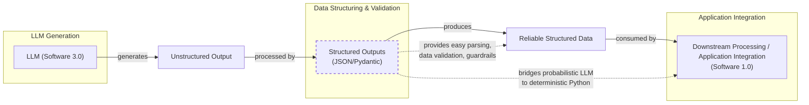

# Lesson 4: Structured Outputs

In our previous lessons, we laid the groundwork for AI Engineering. We explored the AI agent landscape, looked at the difference between rule-based LLM workflows and autonomous AI agents, and covered context engineering: the art of feeding the right information to an LLM. In this lesson, we will tackle a fundamental challenge: getting structured and reliable information *out* of an LLM.

LLMs operate in a world of unstructured data and probabilities, where we input instructions in plain English and get results as plain text. This subdomain of engineering is often called "Software 3.0". Our application, however, relies on deterministic code and predictable data structures, which is known as "Software 1.0". Structured outputs are the bridge between these two worlds, a fundamental technique for forcing LLMs to return consistent, machine-readable data. Mastering this is essential for any AI engineer building production-grade systems.

## Understanding why structured outputs are critical

Before we start coding, it is important to understand why structured outputs are foundational to building reliable AI applications. When an LLM returns a free-form string, you face the messy task of parsing it. This often involves fragile regular expressions or string-splitting logic that can easily break if the model changes its phrasing even slightly [[1]](https://dev.to/pockit_tools/llm-structured-output-in-2026-stop-parsing-json-with-regex-and-do-it-right-34pk). This approach is a major improvement over older web scraping techniques that relied on brittle CSS selectors or XPath expressions [[2]](https://bytetunnels.com/posts/llm-powered-data-extraction-schema-driven-scraping-with-structured-output). Instead of post-processing a response and hoping for the best, modern APIs can enforce structure during generation itself through a process called constrained decoding, guaranteeing a syntactically valid output [[1]](https://dev.to/pockit_tools/llm-structured-output-in-2026-stop-parsing-json-with-regex-and-do-it-right-34pk).

This approach offers several key benefits. First, structured outputs are easy to parse, manipulate, and debug. Instead of wrestling with raw text, you work with clean Python objects like dictionaries or, even better, Pydantic models. This allows you to programmatically access the data you need without guesswork, making your code cleaner and more predictable. Second, using libraries like Pydantic adds a layer of data and type validation [[3]](https://www.freecodecamp.org/news/how-to-keep-llm-outputs-predictable-using-pydantic-validation). If the LLM returns a string where an integer is expected, your application raises a clear validation error immediately, preventing bad data from propagating.

Engineers use this pattern everywhere. We leverage structured outputs to extract entities like names and tags for building knowledge graphs, format data for downstream systems like databases and APIs, or ensure compliance in regulated domains like finance and healthcare where precision is mandatory [[4]](https://www.leewayhertz.com/structured-outputs-in-llms), [[5]](https://www.matt-adams.co.uk/2025/02/12/structured-data-generation.html). Structured outputs create a formal contract between the LLM and your application code. They are the standard method for modeling domain objects in AI engineering, connecting the probabilistic nature of LLMs with deterministic code.


Image 1: A flowchart illustrating the process of formatting LLM output into a predefined data structure for downstream processing.

To understand how structured outputs work in practice, we will explore three ways to implement them: from scratch with JSON, from scratch with Pydantic, and natively with the Gemini API.

## Implementing structured outputs from scratch using JSON

We will first implement structured outputs from scratch to build an intuition of what modern LLM APIs offer. Our goal is to prompt a model to return a JSON object and then parse it into a Python dictionary. We will demonstrate this by extracting key details from a financial document.

<aside>
💡

You can find the code of this lesson in the notebook of Lesson 4, in the GitHub repository of the course.

</aside>

### Setting Up the Environment

We begin by setting up our environment and initializing the Gemini client. We will use `gemini-2.5-flash`, which is fast and cost-effective for simple tasks. The `DOCUMENT` variable holds the unstructured text we want to analyze.
```python
import json

from google import genai
from utils import env

env.load(required_env_vars=["GOOGLE_API_KEY"])

client = genai.Client()

MODEL_ID = "gemini-2.5-flash"

DOCUMENT = """
# Q3 2023 Financial Performance Analysis

The Q3 earnings report shows a 20% increase in revenue and a 15% growth in user engagement, 
beating market expectations. These impressive results reflect our successful product strategy 
and strong market positioning.

Our core business segments demonstrated remarkable resilience, with digital services leading 
the growth at 25% year-over-year. The expansion into new markets has proven particularly 
successful, contributing to 30% of the total revenue increase.

Customer acquisition costs decreased by 10% while retention rates improved to 92%, 
marking our best performance to date. These metrics, combined with our healthy cash flow 
position, provide a strong foundation for continued growth into Q4 and beyond.
"""
```

### Crafting the Prompt

Now, we craft a prompt that instructs the LLM to extract metadata and format it as JSON. We provide a clear example of the desired structure and use XML tags like `<document>` and `<json>` to separate inputs from instructions. This is an effective prompt engineering technique for improving clarity and guiding the model’s output [[6]](https://help.openai.com/en/articles/6654000-best-practices-for-prompt-engineering-with-the-openai-api), [[7]](https://aws.amazon.com/blogs/machine-learning/structured-data-response-with-amazon-bedrock-prompt-engineering-and-tool-use/).
```python
prompt = f"""
Analyze the following document and extract metadata from it. 
The output must be a single, valid JSON object with the following structure:
<json>
{{ 
    "summary": "A concise summary of the article.", 
    "tags": ["list", "of", "relevant", "tags"], 
    "keywords": ["list", "of", "key", "concepts"],
    "quarter": "Q...",
    "growth_rate": "...%",
}}
</json>

Here is the document:
<document>
{DOCUMENT}
</document>
"""
```
We then send the prompt to the model.
```python
response = client.models.generate_content(model=MODEL_ID, contents=prompt)
```
As expected, the model returns a JSON object, but it is often wrapped in Markdown code blocks, which is a common behavior.
It outputs:
```json
  {
      "summary": "The Q3 2023 financial report highlights a strong performance with a 20% increase in revenue and 15% growth in user engagement, surpassing market expectations. This success is attributed to a robust product strategy, effective market positioning, and successful expansion into new markets, leading to improved customer retention and reduced acquisition costs.",
      "tags": [
          "financials",
          "earnings report",
          "business performance",
          "revenue growth",
          "market expansion",
          "Q3 2023"
      ],
      "keywords": [
          "Q3 2023",
          "revenue",
          "user engagement",
          "market expectations",
          "product strategy",
          "market positioning",
          "digital services",
          "new markets",
          "customer acquisition costs",
          "retention rates",
          "cash flow"
      ],
      "quarter": "Q3 2023",
      "growth_rate": "20%"
  }
```

### Parsing the Response

To handle this, we create a helper function to strip the Markdown tags, leaving a clean JSON string that can be safely parsed [[8]](https://stackoverflow.com/questions/77407632/how-can-i-get-llm-to-only-respond-in-json-strings), [[9]](https://python.plainenglish.io/getting-structured-json-responses-from-llms-a-simple-solution-f819fc389ebc).
```python
def extract_json_from_response(response: str) -> dict:
    """
    Extracts JSON from a response string that is wrapped in <json> or ```json tags.
    """

    response = response.replace("<json>", "").replace("</json>", "")
    response = response.replace("```json", "").replace("```", "")

    return json.loads(response)
```
We use our function to parse the raw text response and get a clean Python dictionary.
```python
parsed_response = extract_json_from_response(response.text)
```
It outputs:
```json
{
  "summary": "The Q3 2023 financial report highlights a strong performance with a 20% increase in revenue and 15% growth in user engagement, surpassing market expectations. This success is attributed to a robust product strategy, effective market positioning, and successful expansion into new markets, leading to improved customer retention and reduced acquisition costs.",
  "tags": [
    "financials",
    "earnings report",
    "business performance",
    "revenue growth",
    "market expansion",
    "Q3 2023"
  ],
  "keywords": [
    "Q3 2023",
    "revenue",
    "user engagement",
    "market expectations",
    "product strategy",
    "market positioning",
    "digital services",
    "new markets",
    "customer acquisition costs",
    "retention rates",
    "cash flow"
  ],
  "quarter": "Q3 2023",
  "growth_rate": "20%"
}
```
This "from scratch" method works, but it relies on manual parsing and lacks data validation. In practice, this approach is prone to several failure modes: the LLM might wrap the JSON in markdown, add explanatory text, rename keys, or return a string where a number is expected [[10]](https://tetrate.io/learn/ai/llm-output-parsing-structured-generation). If the LLM makes a mistake, our application will fail. Next, we will see how Pydantic provides a more effective solution.

## Implementing structured outputs from scratch using Pydantic

While forcing JSON output is an improvement, it still leaves you with a plain Python dictionary. You cannot be sure about the keys or value types, which can lead to bugs. Pydantic is a data validation library that enforces structure and type hints at runtime, ensuring data integrity [[11]](https://www.speakeasy.com/blog/pydantic-vs-dataclasses). When an LLM's output does not match your Pydantic model, the library raises a `ValidationError` that clearly explains what went wrong. This "fail-fast" behavior is essential for building reliable systems.

### Defining the Pydantic Model

We start by defining our desired data structure as a Pydantic class. This class acts as a single source of truth for the output format. We use standard Python type hints to define the expected type for each field.
```python
from pydantic import BaseModel, Field

class DocumentMetadata(BaseModel):
    """A class to hold structured metadata for a document."""

    summary: str = Field(description="A concise, 1-2 sentence summary of the document.")
    tags: list[str] = Field(description="A list of 3-5 high-level tags relevant to the document.")
    keywords: list[str] = Field(description="A list of specific keywords or concepts mentioned.")
    quarter: str = Field(description="The quarter of the financial year described in the document (e.g, Q3 2023).")
    growth_rate: str = Field(description="The growth rate of the company described in the document (e.g, 10%).")
```
Pydantic works with Python’s standard `typing` module. Since Python 3.9, you can use built-in types like `list` directly, making the code cleaner. For example, `tags: list[str]` is now preferred over importing `List` from `typing` and writing `tags: List[str]`.

### Nesting Pydantic Models

You can also nest Pydantic models to represent more complex, hierarchical data. This allows you to define intricate relationships between different pieces of information [[12]](https://dev.to/mechcloud_academy/going-deeper-with-pydantic-nested-models-and-data-structures-4e24). For example, a `DocumentMetadata` model could contain a `Summary` object and a list of `Tag` objects. However, keeping schemas from becoming overly complex is good practice, as it can confuse the LLM [[12]](https://dev.to/mechcloud_academy/going-deeper-with-pydantic-nested-models-and-data-structures-4e24).
```python
class Summary(BaseModel):
    text: str
    sentiment: float

class Tag(BaseModel):
    label: str
    relevance: float

class ComplexDocumentMetadata(BaseModel):
    summary: Summary
    tags: list[Tag]
```

### Generating the JSON Schema

With our Pydantic model defined, we can automatically generate a JSON Schema from it. A schema is the standard term for defining the structure and constraints of your data. Think of it as a formal contract between your application and the LLM [[13]](https://ai.google.dev/gemini-api/docs/structured-output).
```python
schema = DocumentMetadata.model_json_schema()
```
The generated schema is detailed and includes descriptions from the `Field` definitions to guide the generation process. This makes Pydantic the perfect tool for defining your schemas, as the `description` parameter acts as a direct instruction to the LLM for that specific field [[14]](https://mlpills.substack.com/p/issue-128-structured-llm-outputs). This is similar to the technique used internally by APIs like Gemini and OpenAI to enforce a specific output format [[13]](https://ai.google.dev/gemini-api/docs/structured-output).
It outputs:
```json
{'description': 'A class to hold structured metadata for a document.',
 'properties': {'summary': {'description': 'A concise, 1-2 sentence summary of the document.',
   'title': 'Summary',
   'type': 'string'},
  'tags': {'description': 'A list of 3-5 high-level tags relevant to the document.',
   'items': {'type': 'string'},
   'title': 'Tags',
   'type': 'array'},
  'keywords': {'description': 'A list of specific keywords or concepts mentioned.',
   'items': {'type': 'string'},
   'title': 'Keywords',
   'type': 'array'},
  'quarter': {'description': 'The quarter of the financial year described in the document (e.g, Q3 2023).',
   'title': 'Quarter',
   'type': 'string'},
  'growth_rate': {'description': 'The growth rate of the company described in the document (e.g, 10%).',
   'title': 'Growth Rate',
   'type': 'string'}},
 'required': ['summary', 'tags', 'keywords', 'quarter', 'growth_rate'],
 'title': 'DocumentMetadata',
 'type': 'object'}
```

### Updating the Prompt and Validating

We update our prompt to include this JSON Schema, giving the model a more precise set of instructions.
```python
prompt = f"""
Please analyze the following document and extract metadata from it. 
The output must be a single, valid JSON object that conforms to the following JSON Schema:
<json>
{json.dumps(schema, indent=2)}
</json>

Here is the document:
<document>
{DOCUMENT}
</document>
"""
```
We call the model and extract the JSON string as before.
```python
response = client.models.generate_content(model=MODEL_ID, contents=prompt)
parsed_response = extract_json_from_response(response.text)
```
It outputs:
```json
{
    "summary": "The Q3 2023 earnings report indicates strong financial performance with a 20% increase in revenue and 15% growth in user engagement, driven by successful product strategy, market expansion, and improved customer retention.",
    "tags": [
        "Financial Performance",
        "Earnings Report",
        "Business Growth",
        "Market Expansion",
        "Customer Metrics"
    ],
    "keywords": [
        "Q3 2023",
        "revenue increase",
        "user engagement",
        "digital services",
        "new markets",
        "customer acquisition costs",
        "retention rates",
        "cash flow"
    ],
    "quarter": "Q3 2023",
    "growth_rate": "20%"
}
```
Finally, we validate and parse it directly into our `DocumentMetadata` object. It is good practice to catch `JSONDecodeError` for malformed JSON and `ValidationError` for schema mismatches separately, allowing for more granular error handling and logging [[15]](https://machinelearningmastery.com/the-complete-guide-to-using-pydantic-for-validating-llm-outputs).
```python
try:
    document_metadata = DocumentMetadata.model_validate(parsed_response)
    print("\nValidation successful!")
except Exception as e:
    print(f"\nValidation failed: {e}")
```
It outputs:
```
Validation successful!
```
The `document_metadata` Pydantic object can now be safely used throughout your application. This is the main advantage: you move from unclear dictionaries to clean, predictable Python objects.

Python’s built-in `dataclasses` or `TypedDict` can define structure, but they only provide type hints for static analysis tools [[11]](https://www.speakeasy.com/blog/pydantic-vs-dataclasses), [[16]](https://shazaali.substack.com/p/type-safety-in-langgraph-when-to). They do not perform runtime validation. This means if the LLM returns a string where an integer is expected, a `dataclass` or `TypedDict` will not catch this error immediately. While `TypedDict` can be faster for simple cases without validation, Pydantic's overhead is minimal for the data integrity it provides [[17]](https://www.packetcoders.io/typeddict-vs-pydantic), [[18]](https://softwarelogic.co/en/blog/pydantic-vs-dataclasses-which-excels-at-python-data-validation). Pydantic’s runtime validation, type constraints, and clear schema definitions make it the superior choice for structuring and validating data in AI applications.

## Implementing structured outputs using Gemini and Pydantic

While Pydantic brings structure and validation, we still had to construct prompts and handle responses manually. When working with modern APIs like Gemini and OpenAI, the recommended way to generate structured outputs is by leveraging their native features. This approach is simpler, more accurate, and often more cost-effective than manual prompt engineering, as the vendor will always handle the optimization on top of their models better than you can with prompt-engineering shenanigans [[13]](https://ai.google.dev/gemini-api/docs/structured-output), [[19]](https://www.glukhov.org/llm-performance/benchmarks/structured-output-comparison-popular-llm-providers), [[20]](https://medium.com/google-cloud/structured-output-with-gemini-models-begging-borrowing-and-json-ing-f70ffd60eae6). For example, OpenAI reported reliability for specific formats jumped from ~36% to nearly 100% with native support [[21]](https://humanloop.com/blog/structured-outputs). While native enforcement is generally more effective, some studies show that a well-crafted JSON example in a prompt can perform comparably on certain tasks, suggesting both methods have their place [[22]](https://dylancastillo.co/posts/gemini-structured-outputs.html).

Let’s see how to achieve the same result using the Gemini API’s native capabilities.

1.  We define a `GenerateContentConfig` object, instructing the Gemini API to set the `response_mime_type` to `"application/json"` and the `response_schema` to our `DocumentMetadata` Pydantic model. This configures the model to output JSON that is then automatically converted to the given Pydantic model.
    ```python
    from google.genai import types
    
    config = types.GenerateContentConfig(response_mime_type="application/json", response_schema=DocumentMetadata)
    ```

2.  This configuration makes our prompt significantly shorter and cleaner, eliminating the need to manually inject schemas. We simply ask the model to perform the task.
    ```python
    prompt = f"""
    Analyze the following document and extract its metadata.
    
    Here is the document:
    <document>
    {DOCUMENT}
    </document>
    """
    ```

3.  Now, we call the model, passing our simplified prompt and the new configuration object. The API handles the rest.
    ```python
    response = client.models.generate_content(model=MODEL_ID, contents=prompt, config=config)
    ```

4.  The Gemini client automatically parses the output for us. By accessing the `response.parsed` attribute, we receive a ready-to-use instance of our `DocumentMetadata` Pydantic model. In production, it is important to also check if the model refused to generate content, which can happen if the input triggers safety filters [[1]](https://dev.to/pockit_tools/llm-structured-output-in-2026-stop-parsing-json-with-regex-and-do-it-right-34pk).
    ```python
    document_metadata = response.parsed
    print(f"Type of the response: `{type(document_metadata)}`")
    ```
    It outputs:
    ```
    Type of the response: `<class '__main__.DocumentMetadata'>`
    ```
This native approach is the recommended way to generate structured outputs. It is efficient, requires less code, and allows you to focus on your application's logic instead of data wrangling.

## Structured Outputs Are Everywhere

We have covered the why and how of structured outputs, from manual prompting to native API integration. This technique is a fundamental pattern in AI engineering, bridging the probabilistic nature of LLMs with the deterministic world of software. Whether building a simple summarization workflow or a complex research agent, you will use structured outputs to ensure reliability and control. This pattern will be a recurring theme throughout this course. In our next lesson, we will explore the basic ingredients of LLM workflows, seeing how structured data flows between components. Later, when we build agents that take action (Lesson 6) or reason about the world (Lesson 7), structured outputs will be how they parse information and decide what to do next. Mastering this technique is a key step toward building powerful and predictable AI systems.

## References

- [1] LLM Structured Output in 2026: Stop Parsing JSON with Regex and Do It Right. (https://dev.to/pockit_tools/llm-structured-output-in-2026-stop-parsing-json-with-regex-and-do-it-right-34pk)
- [2] Schema-Driven Scraping With Structured Output. (https://bytetunnels.com/posts/llm-powered-data-extraction-schema-driven-scraping-with-structured-output)
- [3] How to Keep LLM Outputs Predictable Using Pydantic Validation. (https://www.freecodecamp.org/news/how-to-keep-llm-outputs-predictable-using-pydantic-validation)
- [4] Structured Outputs in LLMs. (https://www.leewayhertz.com/structured-outputs-in-llms)
- [5] Structured Data Generation. (https://www.matt-adams.co.uk/2025/02/12/structured-data-generation.html)
- [6] Best practices for prompt engineering with the OpenAI API. (https://help.openai.com/en/articles/6654000-best-practices-for-prompt-engineering-with-the-openai-api)
- [7] Structured data response with Amazon Bedrock: Prompt Engineering and Tool Use. (https://aws.amazon.com/blogs/machine-learning/structured-data-response-with-amazon-bedrock-prompt-engineering-and-tool-use/)
- [8] How can I get LLM to only respond in JSON strings. (https://stackoverflow.com/questions/77407632/how-can-i-get-llm-to-only-respond-in-json-strings)
- [9] Getting Structured JSON Responses from LLMs: A Simple Solution. (https://python.plainenglish.io/getting-structured-json-responses-from-llms-a-simple-solution-f819fc389ebc)
- [10] LLM Output Parsing and Structured Generation. (https://tetrate.io/learn/ai/llm-output-parsing-structured-generation)
- [11] Type Safety in Python: Pydantic vs. Data Classes vs. Annotations vs. TypedDicts. (https://www.speakeasy.com/blog/pydantic-vs-dataclasses)
- [12] Going Deeper with Pydantic: Nested Models and Data Structures. (https://dev.to/mechcloud_academy/going-deeper-with-pydantic-nested-models-and-data-structures-4e24)
- [13] Structured output. (https://ai.google.dev/gemini-api/docs/structured-output)
- [14] Issue #128 - Structured LLM Outputs with Pydantic. (https://mlpills.substack.com/p/issue-128-structured-llm-outputs)
- [15] The Complete Guide to Using Pydantic for Validating LLM Outputs. (https://machinelearningmastery.com/the-complete-guide-to-using-pydantic-for-validating-llm-outputs)
- [16] Type Safety in LangGraph: When to use Pydantic vs. TypedDict. (https://shazaali.substack.com/p/type-safety-in-langgraph-when-to)
- [17] TypedDict vs Pydantic. (https://www.packetcoders.io/typeddict-vs-pydantic)
- [18] Pydantic vs Dataclasses: Which Excels at Python Data Validation? (https://softwarelogic.co/en/blog/pydantic-vs-dataclasses-which-excels-at-python-data-validation)
- [19] Structured Output Comparison: Popular LLM Providers. (https://www.glukhov.org/llm-performance/benchmarks/structured-output-comparison-popular-llm-providers)
- [20] Structured Output with Gemini Models: Begging, Borrowing, and JSON-ing. (https://medium.com/google-cloud/structured-output-with-gemini-models-begging-borrowing-and-json-ing-f70ffd60eae6)
- [21] Structured Outputs: everything you should know. (https://humanloop.com/blog/structured-outputs)
- [22] Gemini Structured Outputs. (https://dylancastillo.co/posts/gemini-structured-outputs.html)
- [23] Agora: A Multi-Agent Communication Protocol for LLMs. (https://arxiv.org/html/2504.16736v2)