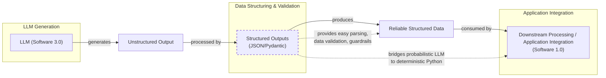

# Lesson 4: Structured Outputs

In our previous lessons, we laid the groundwork for AI Engineering. We explored the AI agent landscape, looked at the difference between rule-based LLM workflows and autonomous AI agents, and covered context engineering: the art of feeding the right information to an LLM. In this lesson, we will tackle a fundamental challenge: getting structured and reliable information *out* of an LLM.

LLMs operate in a world of unstructured data and probabilities, where we input instructions in plain English and get results as plain text. This subdomain of engineering is often called "Software 3.0". Our application, however, relies on deterministic code and predictable data structures, which is known as "Software 1.0". Structured outputs are the bridge between these two worlds, a fundamental technique for forcing LLMs to return consistent, machine-readable data. Mastering this is essential for any AI engineer building production-grade systems.

## Understanding why structured outputs are critical

Before we start coding, it is crucial to understand why structured outputs are foundational to building reliable AI applications. When an LLM returns a free-form string, you face the messy task of parsing it. This often involves fragile regular expressions or string-splitting logic that can easily break if the model changes its phrasing even slightly [[1]](https://pmc.ncbi.nlm.nih.gov/articles/PMC11751965/), [[2]](https://arxiv.org/html/2506.21585v1). This approach is a significant improvement over older web scraping techniques that relied on brittle CSS selectors or XPath expressions [[43]](https://bytetunnels.com/posts/llm-powered-data-extraction-schema-driven-scraping-with-structured-output). Instead of post-processing a response and hoping for the best, modern APIs can enforce structure during generation itself through a process called constrained decoding, guaranteeing a syntactically valid output [[44]](https://dev.to/pockit_tools/llm-structured-output-in-2026-stop-parsing-json-with-regex-and-do-it-right-34pk).

This approach offers several key benefits. First, structured outputs are easy to parse, manipulate, and debug. Instead of wrestling with raw text, you work with clean Python objects like dictionaries or, even better, Pydantic models. This allows you to programmatically access the data you need without guesswork, making your code cleaner and more predictable. Second, using libraries like Pydantic adds a layer of data and type validation [[3]](https://www.speakeasy.com/blog/pydantic-vs-dataclasses), [[4]](https://codetain.com/blog/validators-approach-in-python-pydantic-vs-dataclasses/). If the LLM returns a string where an integer is expected, your application raises a clear validation error immediately, preventing bad data from propagating.

Engineers use this pattern everywhere. We leverage structured outputs to extract entities like names and tags for building knowledge graphs, format data for downstream systems like databases and APIs, or ensure compliance in regulated domains like finance and healthcare where precision is mandatory [[5]](https://www.prompts.ai/en/blog-details/automating-knowledge-graphs-with-llm-outputs), [[6]](https://humanloop.com/blog/structured-outputs), [[45]](https://www.leewayhertz.com/structured-outputs-in-llms). Structured outputs create a formal contract between the LLM and your application code. They are the standard method for modeling domain objects in AI engineering, connecting the probabilistic nature of LLMs with deterministic code.


Image 1: A flowchart illustrating the process of formatting LLM output into a predefined data structure for downstream processing.

To understand how structured outputs work in practice, we will explore three ways to implement them: from scratch with JSON, from scratch with Pydantic, and natively with the Gemini API.

## Implementing structured outputs from scratch using JSON

We will first implement structured outputs from scratch to build an intuition of what modern LLM APIs offer. Our goal is to prompt a model to return a JSON object and then parse it into a Python dictionary. We will demonstrate this by extracting key details from a financial document.

<aside>
💡

You can find the code of this lesson in the notebook of Lesson 4, in the GitHub repository of the course.

</aside>

1.  We begin by setting up our environment and initializing the Gemini client. We will use `gemini-2.5-flash`, which is fast and cost-effective for simple tasks.
    ```python
    import json
    
    from google import genai
    from utils import env
    
    env.load(required_env_vars=["GOOGLE_API_KEY"])
    
    client = genai.Client()
    
    MODEL_ID = "gemini-2.5-flash"
    ```

2.  Next, we define a sample document for analysis.
    ```python
    DOCUMENT = """
    # Q3 2023 Financial Performance Analysis
    
    The Q3 earnings report shows a 20% increase in revenue and a 15% growth in user engagement, 
    beating market expectations. These impressive results reflect our successful product strategy 
    and strong market positioning.
    
    Our core business segments demonstrated remarkable resilience, with digital services leading 
    the growth at 25% year-over-year. The expansion into new markets has proven particularly 
    successful, contributing to 30% of the total revenue increase.
    
    Customer acquisition costs decreased by 10% while retention rates improved to 92%, 
    marking our best performance to date. These metrics, combined with our healthy cash flow 
    position, provide a strong foundation for continued growth into Q4 and beyond.
    """
    ```

3.  Now, we craft a prompt that instructs the LLM to extract metadata and format it as JSON. We provide a clear example of the desired structure and use XML tags like `<document>` and `<json>` to separate inputs from instructions. This is an effective prompt engineering technique for improving clarity and guiding the model’s output [[22]](https://help.openai.com/en/articles/6654000-best-practices-for-prompt-engineering-with-the-openai-api), [[23]](https://aws.amazon.com/blogs/machine-learning/structured-data-response-with-amazon-bedrock-prompt-engineering-and-tool-use/).
    ```python
    prompt = f"""
    Analyze the following document and extract metadata from it. 
    The output must be a single, valid JSON object with the following structure:
    <json>
    {{ 
        "summary": "A concise summary of the article.", 
        "tags": ["list", "of", "relevant", "tags"], 
        "keywords": ["list", "of", "key", "concepts"],
        "quarter": "Q...",
        "growth_rate": "...%",
    }}
    </json>
    
    Here is the document:
    <document>
    {DOCUMENT}
    </document>
    """
    ```

4.  We send the prompt to the model. As expected, it returns a JSON object, often wrapped in Markdown code blocks.
    ```python
    response = client.models.generate_content(model=MODEL_ID, contents=prompt)
    ```
    It outputs:
    ```json
      {
          "summary": "The Q3 2023 financial report highlights a strong performance with a 20% increase in revenue and 15% growth in user engagement, surpassing market expectations. This success is attributed to a robust product strategy, effective market positioning, and successful expansion into new markets, leading to improved customer retention and reduced acquisition costs.",
          "tags": [
              "financials",
              "earnings report",
              "business performance",
              "revenue growth",
              "market expansion",
              "Q3 2023"
          ],
          "keywords": [
              "Q3 2023",
              "revenue",
              "user engagement",
              "market expectations",
              "product strategy",
              "market positioning",
              "digital services",
              "new markets",
              "customer acquisition costs",
              "retention rates",
              "cash flow"
          ],
          "quarter": "Q3 2023",
          "growth_rate": "20%"
      }
    ```

5.  To parse this, we create a helper function to strip the Markdown tags.
    ```python
    def extract_json_from_response(response: str) -> dict:
        """
        Extracts JSON from a response string that is wrapped in <json> or ```json tags.
        """
    
        response = response.replace("<json>", "").replace("</json>", "")
        response = response.replace("```json", "").replace("```", "")
    
        return json.loads(response)
    ```

6.  Finally, we parse the string into a Python dictionary.
    ```python
    parsed_response = extract_json_from_response(response.text)
    ```
    It outputs:
    ```json
    {
      "summary": "The Q3 2023 financial report highlights a strong performance with a 20% increase in revenue and 15% growth in user engagement, surpassing market expectations. This success is attributed to a robust product strategy, effective market positioning, and successful expansion into new markets, leading to improved customer retention and reduced acquisition costs.",
      "tags": [
        "financials",
        "earnings report",
        "business performance",
        "revenue growth",
        "market expansion",
        "Q3 2023"
      ],
      "keywords": [
        "Q3 2023",
        "revenue",
        "user engagement",
        "market expectations",
        "product strategy",
        "market positioning",
        "digital services",
        "new markets",
        "customer acquisition costs",
        "retention rates",
        "cash flow"
      ],
      "quarter": "Q3 2023",
      "growth_rate": "20%"
    }
    ```
This method works but relies on manual parsing and lacks data validation. In practice, this approach is prone to several failure modes: the LLM might wrap the JSON in markdown, add explanatory text, rename keys, or return a string where a number is expected [[46]](https://tetrate.io/learn/ai/llm-output-parsing-structured-generation). If the LLM makes a mistake, our application will fail. Next, we will see how Pydantic provides a much more robust solution.

## Implementing structured outputs from scratch using Pydantic

While forcing JSON output is an improvement, it still leaves you with a plain Python dictionary. You cannot be sure about the keys or value types, which can lead to bugs. Pydantic is a data validation library that enforces structure and type hints at runtime, ensuring data integrity [[3]](https://www.speakeasy.com/blog/pydantic-vs-dataclasses). When an LLM's output does not match your Pydantic model, the library raises a `ValidationError` that clearly explains what went wrong. This "fail-fast" behavior is essential for building reliable systems.

1.  We start by defining our desired data structure as a Pydantic class. This class acts as a single source of truth for the output format. Pydantic uses standard Python type hints; since Python 3.9, you can use built-in types like `list[str]` directly.
    ```python
    from pydantic import BaseModel, Field
    
    class DocumentMetadata(BaseModel):
        """A class to hold structured metadata for a document."""
    
        summary: str = Field(description="A concise, 1-2 sentence summary of the document.")
        tags: list[str] = Field(description="A list of 3-5 high-level tags relevant to the document.")
        keywords: list[str] = Field(description="A list of specific keywords or concepts mentioned.")
        quarter: str = Field(description="The quarter of the financial year described in the document (e.g, Q3 2023).")
        growth_rate: str = Field(description="The growth rate of the company described in the document (e.g, 10%).")
    ```
    The `description` parameter in `Field` is particularly important. It is not just documentation for your code; this text is included in the JSON Schema provided to the LLM, acting as a direct instruction to guide the model's output for that specific field [[47]](https://mlpills.substack.com/p/issue-128-structured-llm-outputs).
    You can also nest Pydantic models to represent more complex, hierarchical data. For example, a `DocumentMetadata` model could contain a `Summary` object and a list of `Tag` objects. However, keeping schemas from becoming overly complex is good practice, as it can confuse the LLM [[16]](https://dev.to/mechcloud_academy/going-deeper-with-pydantic-nested-models-and-data-structures-4e24).
    ```python
    class Summary(BaseModel):
        text: str
        sentiment: float
    
    class Tag(BaseModel):
        label: str
        relevance: float
    
    class ComplexDocumentMetadata(BaseModel):
        summary: Summary
        tags: list[Tag]
    ```

2.  With our Pydantic model defined, we can automatically generate a JSON Schema from it. A schema is the standard for defining the structure and constraints of your data, acting as a formal contract between your application and the LLM [[17]](https://ai.google.dev/gemini-api/docs/structured-output). We provide this schema to the LLM to guide its output. This is similar to the technique used internally by APIs like Gemini and OpenAI to enforce a specific output format [[17]](https://ai.google.dev/gemini-api/docs/structured-output).
    ```python
    schema = DocumentMetadata.model_json_schema()
    ```
    The generated schema is detailed and includes descriptions from the `Field` definitions to guide the generation process.
    ```json
    {'description': 'A class to hold structured metadata for a document.',
     'properties': {'summary': {'description': 'A concise, 1-2 sentence summary of the document.',
       'title': 'Summary',
       'type': 'string'},
      'tags': {'description': 'A list of 3-5 high-level tags relevant to the document.',
       'items': {'type': 'string'},
       'title': 'Tags',
       'type': 'array'},
      'keywords': {'description': 'A list of specific keywords or concepts mentioned.',
       'items': {'type': 'string'},
       'title': 'Keywords',
       'type': 'array'},
      'quarter': {'description': 'The quarter of the financial year described in the document (e.g, Q3 2023).',
       'title': 'Quarter',
       'type': 'string'},
      'growth_rate': {'description': 'The growth rate of the company described in the document (e.g, 10%).',
       'title': 'Growth Rate',
       'type': 'string'}},
     'required': ['summary', 'tags', 'keywords', 'quarter', 'growth_rate'],
     'title': 'DocumentMetadata',
     'type': 'object'}
    ```

3.  We update our prompt to include this JSON Schema, giving the model a more precise set of instructions.
    ```python
    prompt = f"""
    Please analyze the following document and extract metadata from it. 
    The output must be a single, valid JSON object that conforms to the following JSON Schema:
    <json>
    {json.dumps(schema, indent=2)}
    </json>
    
    Here is the document:
    <document>
    {DOCUMENT}
    </document>
    """
    ```

4.  We call the model and extract the JSON string as before.
    ```python
    response = client.models.generate_content(model=MODEL_ID, contents=prompt)
    parsed_response = extract_json_from_response(response.text)
    ```
    It outputs:
    ```json
    {
      "summary": "The Q3 2023 earnings report indicates strong financial performance with a 20% increase in revenue and 15% growth in user engagement, driven by successful product strategy, market expansion, and improved customer retention.",
      "tags": [
        "Financial Performance",
        "Earnings Report",
        "Business Growth",
        "Market Expansion",
        "Customer Metrics"
      ],
      "keywords": [
        "Q3 2023",
        "revenue increase",
        "user engagement",
        "digital services",
        "new markets",
        "customer acquisition costs",
        "retention rates",
        "cash flow"
      ],
      "quarter": "Q3 2023",
      "growth_rate": "20%"
    }
    ```

5.  Finally, we validate the output with Pydantic. If the LLM returned a string for `tags` instead of a list, Pydantic would raise a `ValidationError`, catching the error early. It is good practice to catch `JSONDecodeError` for malformed JSON and `ValidationError` for schema mismatches separately, allowing for more granular error handling and logging [[48]](https://machinelearningmastery.com/the-complete-guide-to-using-pydantic-for-validating-llm-outputs).
    ```python
    try:
        document_metadata = DocumentMetadata.model_validate(parsed_response)
        print("\nValidation successful!")
    except Exception as e:
        print(f"\nValidation failed: {e}")
    ```
    It outputs:
    ```
    Validation successful!
    ```
    The `document_metadata` Pydantic object can now be safely used throughout your application. This is the main advantage: you move from unclear dictionaries to clean, predictable Python objects.

However, even with Pydantic, several production pitfalls can arise. For instance, LLMs often struggle to return empty lists, sometimes hallucinating an entry to avoid it—a known issue called the "empty array trap" [[44]](https://dev.to/pockit_tools/llm-structured-output-in-2026-stop-parsing-json-with-regex-and-do-it-right-34pk). More complex schemas also increase latency and token costs, as the full schema is injected into the prompt. Schema versioning is another concern; as your application evolves, you must handle outputs generated from prompts that reference older schema versions [[44]](https://dev.to/pockit_tools/llm-structured-output-in-2026-stop-parsing-json-with-regex-and-do-it-right-34pk). A robust strategy is to implement a retry mechanism. If validation fails, you can automatically send a new request to the LLM that includes the Pydantic error message, giving the model a chance to self-correct its output [[48]](https://machinelearningmastery.com/the-complete-guide-to-using-pydantic-for-validating-llm-outputs).

While Python’s built-in `dataclasses` or `TypedDict` can define structure, they only provide type hints for static analysis and do not perform runtime validation [[3]](https://www.speakeasy.com/blog/pydantic-vs-dataclasses), [[4]](https://codetain.com/blog/validators-approach-in-python-pydantic-vs-dataclasses/), [[36]](https://shazaali.substack.com/p/type-safety-in-langgraph-when-to). If the LLM returns a string where an integer is expected, these tools will not catch the error. Pydantic’s runtime validation, type constraints, and clear schema definitions make it the superior choice for structuring and validating data in AI applications.

## Implementing structured outputs using Gemini and Pydantic

While Pydantic brings structure and validation, we still had to construct prompts and handle responses manually. When working with modern APIs like Gemini and OpenAI, the recommended way to generate structured outputs is by using their native features. This approach is simpler, more accurate, and often more cost-effective than manual prompt engineering, as the vendor will always handle the optimization on top of their models better than you can with prompt-engineering shenanigans [[17]](https://ai.google.dev/gemini-api/docs/structured-output), [[31]](https://www.glukhov.org/llm-performance/benchmarks/structured-output-comparison-popular-llm-providers), [[32]](https://medium.com/google-cloud/structured-output-with-gemini-models-begging-borrowing-and-json-ing-f70ffd60eae6), [[49]](https://medium.com/google-cloud/structured-output-with-gemini-models-begging-borrowing-and-json-ing-f70ffd60eae6). For example, OpenAI reported reliability for specific formats jumped from ~36% to nearly 100% with native support [[50]](https://humanloop.com/blog/structured-outputs). While native enforcement is generally more robust, some studies show that a well-crafted JSON example in a prompt can perform comparably on certain tasks, suggesting both methods have their place [[51]](https://dylancastillo.co/posts/gemini-structured-outputs.html).

Let’s see how to achieve the same result using the Gemini API’s native capabilities.

1.  We define a `GenerateContentConfig` object, instructing the Gemini API to set the `response_mime_type` to `"application/json"` and the `response_schema` to our `DocumentMetadata` Pydantic model. This configures the model to output JSON that is then automatically converted to the given Pydantic model.
    ```python
    from google.genai import types
    
    config = types.GenerateContentConfig(response_mime_type="application/json", response_schema=DocumentMetadata)
    ```

2.  This configuration makes our prompt significantly shorter and cleaner, eliminating the need to manually inject schemas. We simply ask the model to perform the task.
    ```python
    prompt = f"""
    Analyze the following document and extract its metadata.
    
    Here is the document:
    <document>
    {DOCUMENT}
    </document>
    """
    ```

3.  Now, we call the model, passing our simplified prompt and the new configuration object. The API handles the rest.
    ```python
    response = client.models.generate_content(model=MODEL_ID, contents=prompt, config=config)
    ```

4.  The Gemini client automatically parses the output for us. By accessing the `response.parsed` attribute, we receive a ready-to-use instance of our `DocumentMetadata` Pydantic model. In production, it is important to also check if the model refused to generate content, which can happen if the input triggers safety filters [[44]](https://dev.to/pockit_tools/llm-structured-output-in-2026-stop-parsing-json-with-regex-and-do-it-right-34pk).
    ```python
    document_metadata = response.parsed
    ```
    It outputs:
    ```
    Type of the response: `<class '__main__.DocumentMetadata'>`
    ```
This native approach is robust, efficient, and requires less code. It is the recommended way for modern LLM APIs.

## Structured Outputs Are Everywhere

We have covered the why and how of structured outputs, from manual prompting to native API integration. This technique is a fundamental pattern in AI engineering. It is the essential bridge connecting the probabilistic, free-form nature of LLMs with the deterministic, structured world of software applications. Whether you are building a simple workflow to summarize articles or a complex agent that analyzes financial data, you will use structured outputs to ensure reliability and control.

This pattern will be a recurring theme throughout this course. In our next lesson, we will explore the basic ingredients of LLM workflows, where we will see how structured data flows between different components. Later, when we build agents that can take action (Lesson 6) or reason about the world (Lesson 7), structured outputs will be how they parse information and decide what to do next. This becomes even more critical in multi-agent systems, where standardized data schemas act as communication protocols, allowing different agents to interact reliably [[52]](https://arxiv.org/html/2504.16736v2). Mastering this technique is a key step toward building powerful and predictable AI systems.

## References

- [1] Ntinopoulos, V., Biefer, H. R. C., Tudorache, I., Papadopoulos, N., Odavic, D., Risteski, P., Haeussler, A., & Dzemali, O. (2024). Large language models for data extraction from unstructured and semi-structured electronic health records: a multiple model performance evaluation. BMJ Health & Care Informatics, 32(1), e101139. [https://pmc.ncbi.nlm.nih.gov/articles/PMC11751965/](https://pmc.ncbi.nlm.nih.gov/articles/PMC11751965/)
- [2] (n.d.). Evaluation of LLM-based Strategies for the Extraction of Food Product Information from Online Shops. arXiv. [https://arxiv.org/html/2506.21585v1](https://arxiv.org/html/2506.21585v1)
- [3] Speakeasy Team. (2024, August 29). Type Safety in Python: Pydantic vs. Data Classes vs. Annotations vs. TypedDicts. Speakeasy. [https://www.speakeasy.com/blog/pydantic-vs-dataclasses](https://www.speakeasy.com/blog/pydantic-vs-dataclasses)
- [4] (n.d.). Validators approach in Python - Pydantic vs. Dataclasses. Codetain. [https://codetain.com/blog/validators-approach-in-python-pydantic-vs-dataclasses/](https://codetain.com/blog/validators-approach-in-python-pydantic-vs-dataclasses/)
- [5] (n.d.). Automating Knowledge Graphs with LLM Outputs. Prompts.ai. [https://www.prompts.ai/en/blog-details/automating-knowledge-graphs-with-llm-outputs](https://www.prompts.ai/en/blog-details/automating-knowledge-graphs-with-llm-outputs)
- [6] Kelly, C. (2024, February 13). Structured Outputs: everything you should know. Humanloop. [https://humanloop.com/blog/structured-outputs](https://humanloop.com/blog/structured-outputs)
- [7] Getting Structured JSON Responses from LLMs: A Simple Solution. (n.d.). [https://python.plainenglish.io/getting-structured-json-responses-from-llms-a-simple-solution-f819fc389ebc](https://python.plainenglish.io/getting-structured-json-responses-from-llms-a-simple-solution-f819fc389ebc)
- [8] Structured Outputs: The Silent Hero of Production AI. (n.d.). [https://www.decodingai.com/p/llm-structured-outputs-the-only-way](https://www.decodingai.com/p/llm-structured-outputs-the-only-way)
- [9] How to return structured data from a model. (n.d.). [https://python.langchain.com/docs/how_to/structured_output/](https://python.langchain.com/docs/how_to/structured_output/)
- [10] Structured Outputs with OpenAI. (n.d.). [https://platform.openai.com/docs/guides/structured-outputs](https://platform.openai.com/docs/guides/structured-outputs)
- [11] Steering Large Language Models with Pydantic. (n.d.). [https://pydantic.dev/articles/llm-intro](https://pydantic.dev/articles/llm-intro)
- [12] Structured Outputs with Pydantic & OpenAI Function Calling. (n.d.). [https://www.youtube.com/watch?v=NGEZsqEUpC0](https://www.youtube.com/watch?v=NGEZsqEUpC0)
- [13] YAML vs. JSON: Which Is More Efficient for Language Models? (n.d.). [https://betterprogramming.pub/yaml-vs-json-which-is-more-efficient-for-language-models-5bc11dd0f6df](https://betterprogramming.pub/yaml-vs-json-which-is-more-efficient-for-language-models-5bc11dd0f6df)
- [14] Why do structured outputs create a contract between LLM and rigid Python code? (n.d.). [https://www.leewayhertz.com/structured-outputs-in-llms](https://www.leewayhertz.com/structured-outputs-in-llms)
- [15] How does Pydantic provide out-of-the-box data quality checks for LLM outputs? (n.d.). [https://www.freecodecamp.org/news/how-to-keep-llm-outputs-predictable-using-pydantic-validation](https://www.freecodecamp.org/news/how-to-keep-llm-outputs-predictable-using-pydantic-validation)
- [16] going-deeper-with-pydantic-nested-models-and-data-structures. (n.d.). [https://dev.to/mechcloud_academy/going-deeper-with-pydantic-nested-models-and-data-structures-4e24](https://dev.to/mechcloud_academy/going-deeper-with-pydantic-nested-models-and-data-structures-4e24)
- [17] Gemini API Structured Output. (n.d.). [https://ai.google.dev/gemini-api/docs/structured-output](https://ai.google.dev/gemini-api/docs/structured-output)
- [18] Why do structured outputs create a contract between LLM and rigid Python code? (n.d.). [https://developer.hpe.com/blog/using-structured-outputs-in-vllm](https://developer.hpe.com/blog/using-structured-outputs-in-vllm)
- [19] Why do structured outputs create a contract between LLM and rigid Python code? (n.d.). [https://www.timlrx.com/blog/generating-structured-output-from-llms](https://www.timlrx.com/blog/generating-structured-output-from-llms)
- [20] How does Pydantic provide out-of-the-box data quality checks for LLM outputs? (n.d.). [https://machinelearningmastery.com/the-complete-guide-to-using-pydantic-for-validating-llm-outputs](https://machinelearningmastery.com/the-complete-guide-to-using-pydantic-for-validating-llm-outputs)
- [21] How does Pydantic provide out-of-the-box data quality checks for LLM outputs? (n.d.). [https://medium.com/@aminulpalash506/pydantic-for-agentic-ai-ensuring-reliable-data-validation-in-large-language-model-workflows-ad5eae915713](https://medium.com/@aminulpalash506/pydantic-for-agentic-ai-ensuring-reliable-data-validation-in-large-language-model-workflows-ad5eae915713)
- [22] (n.d.). Best practices for prompt engineering with the OpenAI API. OpenAI Help Center. [https://help.openai.com/en/articles/6654000-best-practices-for-prompt-engineering-with-the-openai-api](https://help.openai.com/en/articles/6654000-best-practices-for-prompt-engineering-with-the-openai-api)
- [23] (2024, June 26). Structured data response with Amazon Bedrock: Prompt Engineering and Tool Use. Amazon Web Services. [https://aws.amazon.com/blogs/machine-learning/structured-data-response-with-amazon-bedrock-prompt-engineering-and-tool-use/](https://aws.amazon.com/blogs/machine-learning/structured-data-response-with-amazon-bedrock-prompt-engineering-and-tool-use/)
- [24] How to implement extract_json_from_response function for parsing LLM JSON? (n.d.). [https://stackoverflow.com/questions/77407632/how-can-i-get-llm-to-only-respond-in-json-strings](https://stackoverflow.com/questions/77407632/how-can-i-get-llm-to-only-respond-in-json-strings)
- [25] How to implement extract_json_from_response function for parsing LLM JSON? (n.d.). [https://genai.stackexchange.com/questions/202/how-to-generate-structured-data-like-json-with-llm-models](https://genai.stackexchange.com/questions/202/how-to-generate-structured-data-like-json-with-llm-models)
- [26] How to nest Pydantic models like Summary and Tag for complex LLM structures? (n.d.). [https://mlpills.substack.com/p/issue-128-structured-llm-outputs](https://mlpills.substack.com/p/issue-128-structured-llm-outputs)
- [27] How to nest Pydantic models like Summary and Tag for complex LLM structures? (n.d.). [https://codesignal.com/learn/courses/working-with-data-models-in-fastapi/lessons/nested-models-for-complex-data-structures](https://codesignal.com/learn/courses/working-with-data-models-in-fastapi/lessons/nested-models-for-complex-data-structures)
- [28] How to nest Pydantic models like Summary and Tag for complex LLM structures? (n.d.). [https://pydantic.dev/docs/validation/latest/concepts/models](https://pydantic.dev/docs/validation/latest/concepts/models)
- [29] How does Gemini GenerateContentConfig enforce Pydantic structured outputs? (n.d.). [https://pydantic.dev/docs/ai/core-concepts/output](https://pydantic.dev/docs/ai/core-concepts/output)
- [30] How does Gemini GenerateContentConfig enforce Pydantic structured outputs? (n.d.). [https://discuss.ai.google.dev/t/gemini-2-0-use-a-list-of-pydantic-objects-at-response-schema/55935](https://discuss.ai.google.dev/t/gemini-2-0-use-a-list-of-pydantic-objects-at-response-schema/55935)
- [31] Why prefer Gemini native structured outputs over prompt-based methods? (n.d.). [https://www.glukhov.org/llm-performance/benchmarks/structured-output-comparison-popular-llm-providers](https://www.glukhov.org/llm-performance/benchmarks/structured-output-comparison-popular-llm-providers)
- [32] Why prefer Gemini native structured outputs over prompt-based methods? (n.d.). [https://medium.com/google-cloud/structured-output-with-gemini-models-begging-borrowing-and-json-ing-f70ffd60eae6](https://medium.com/google-cloud/structured-output-with-gemini-models-begging-borrowing-and-json-ing-f70ffd60eae6)
- [33] Why prefer Gemini native structured outputs over prompt-based methods? (n.d.). [https://agenta.ai/blog/the-guide-to-structured-outputs-and-function-calling-with-llms](https://agenta.ai/blog/the-guide-to-structured-outputs-and-function-calling-with-llms)
- [34] How do structured outputs eliminate fragile regex parsing for LLM responses? (n.d.). [https://dev.to/pockit_tools/llm-structured-output-in-2026-stop-parsing-json-with-regex-and-do-it-right-34pk](https://dev.to/pockit_tools/llm-structured-output-in-2026-stop-parsing-json-with-regex-and-do-it-right-34pk)
- [35] How do structured outputs eliminate fragile regex parsing for LLM responses? (n.d.). [https://www.linkedin.com/posts/pauliusztin_if-you-use-regex-and-string-splits-to-parse-activity-7386740617294282752-QHgP](https://www.linkedin.com/posts/pauliusztin_if-you-use-regex-and-string-splits-to-parse-activity-7386740617294282752-QHgP)
- [36] How do TypedDict and dataclasses compare to Pydantic for LLM validation? (n.d.). [https://shazaali.substack.com/p/type-safety-in-langgraph-when-to](https://shazaali.substack.com/p/type-safety-in-langgraph-when-to)
- [37] How do TypedDict and dataclasses compare to Pydantic for LLM validation? (n.d.). [https://dev.to/hevalhazalkurt/dataclasses-vs-pydantic-vs-typeddict-vs-namedtuple-in-python-41gg](https://dev.to/hevalhazalkurt/dataclasses-vs-pydantic-vs-typeddict-vs-namedtuple-in-python-41gg)
- [38] How do TypedDict and dataclasses compare to Pydantic for LLM validation? (n.d.). [https://www.packetcoders.io/typeddict-vs-pydantic](https://www.packetcoders.io/typeddict-vs-pydantic)
- [39] How do TypedDict and dataclasses compare to Pydantic for LLM validation? (n.d.). [https://softwarelogic.co/en/blog/pydantic-vs-dataclasses-which-excels-at-python-data-validation](https://softwarelogic.co/en/blog/pydantic-vs-dataclasses-which-excels-at-python-data-validation)
- [40] How to diagram LLM output formatting for downstream tasks with Mermaid? (n.d.). [https://www.matt-adams.co.uk/2025/02/12/structured-data-generation.html](https://www.matt-adams.co.uk/2025/02/12/structured-data-generation.html)
- [41] How to diagram LLM output formatting for downstream tasks with Mermaid? (n.d.). [https://arxiv.org/html/2511.14967v1](https://arxiv.org/html/2511.14967v1)
- [42] How to diagram LLM output formatting for downstream tasks with Mermaid? (n.d.). [https://microsoft.github.io/genaiscript/blog/mermaids](https://microsoft.github.io/genaiscript/blog/mermaids)
- [43] Schema-Driven Scraping With Structured Output. (n.d.). [https://bytetunnels.com/posts/llm-powered-data-extraction-schema-driven-scraping-with-structured-output](https://bytetunnels.com/posts/llm-powered-data-extraction-schema-driven-scraping-with-structured-output)
- [44] LLM Structured Output in 2026: Stop Parsing JSON with Regex and Do It Right. (n.d.). [https://dev.to/pockit_tools/llm-structured-output-in-2026-stop-parsing-json-with-regex-and-do-it-right-34pk](https://dev.to/pockit_tools/llm-structured-output-in-2026-stop-parsing-json-with-regex-and-do-it-right-34pk)
- [45] Structured Outputs in LLMs. (n.d.). [https://www.leewayhertz.com/structured-outputs-in-llms](https://www.leewayhertz.com/structured-outputs-in-llms)
- [46] LLM Output Parsing and Structured Generation. (n.d.). [https://tetrate.io/learn/ai/llm-output-parsing-structured-generation](https://tetrate.io/learn/ai/llm-output-parsing-structured-generation)
- [47] Issue #128 - Structured LLM Outputs with Pydantic. (n.d.). [https://mlpills.substack.com/p/issue-128-structured-llm-outputs](https://mlpills.substack.com/p/issue-128-structured-llm-outputs)
- [48] The Complete Guide to Using Pydantic for Validating LLM Outputs. (n.d.). [https://machinelearningmastery.com/the-complete-guide-to-using-pydantic-for-validating-llm-outputs](https://machinelearningmastery.com/the-complete-guide-to-using-pydantic-for-validating-llm-outputs)
- [49] Structured Output with Gemini Models: Begging, Threatening, and JSON-ing. (n.d.). [https://medium.com/google-cloud/structured-output-with-gemini-models-begging-borrowing-and-json-ing-f70ffd60eae6](https://medium.com/google-cloud/structured-output-with-gemini-models-begging-borrowing-and-json-ing-f70ffd60eae6)
- [50] Structured Outputs: everything you should know. (n.d.). [https://humanloop.com/blog/structured-outputs](https://humanloop.com/blog/structured-outputs)
- [51] Gemini Structured Outputs. (n.d.). [https://dylancastillo.co/posts/gemini-structured-outputs.html](https://dylancastillo.co/posts/gemini-structured-outputs.html)
- [52] Agora: A Multi-Agent Communication Protocol for LLMs. (n.d.). [https://arxiv.org/html/2504.16736v2](https://arxiv.org/html/2504.16736v2)