In our previous lessons, we laid the groundwork for AI Engineering. We explored the AI agent landscape, looked at the difference between rule-based LLM workflows and autonomous AI agents, and covered context engineering: the art of feeding the right information to an LLM. In this lesson, we will tackle a fundamental challenge: getting structured and reliable information *out* of an LLM.

LLMs operate in a world of unstructured data and probabilities, where we input instructions in plain English and get results as plain text. This subdomain of engineering is often called "Software 3.0". Our application, however, relies on deterministic code and predictable data structures, which is known as "Software 1.0". Structured outputs are the bridge between these two worlds, a fundamental technique for forcing LLMs to return consistent, machine-readable data. Mastering this is essential for any AI engineer building production-grade systems.

## Understanding why structured outputs are critical

Before we start coding, it is crucial to understand why structured outputs are foundational to building reliable AI applications. When an LLM returns a free-form string, you face the messy task of parsing it. This often involves fragile regular expressions or string-splitting logic. These methods easily break if the model changes its phrasing even slightly [[1]](https://pmc.ncbi.nlm.nih.gov/articles/PMC11751965/), [[2]](https://arxiv.org/html/2506.21585v1). Structured outputs solve this by forcing the model’s response into a predictable format like JSON.

This approach offers several key benefits. First, structured outputs are easy to parse, manipulate, and debug. Instead of wrestling with raw text, you work with clean Python objects like dictionaries or, even better, Pydantic models. This allows you to programmatically access the data you need without guesswork.

Second, using libraries like Pydantic adds a layer of data and type validation [[3]](https://www.speakeasy.com/blog/pydantic-vs-dataclasses), [[4]](https://codetain.com/blog/validators-approach-in-python-pydantic-vs-dataclasses/). If the LLM returns a string where an integer is expected, your application will not crash silently down the line. Instead, it will raise a clear validation error immediately. This "fail-fast" behavior is essential for building reliable systems.

Structured outputs create a formal contract between the LLM and your application code. The analogy to traditional API contracts, like OpenAPI, is strong. Just as an API contract guarantees a response shape, a structured output schema prevents the LLM's variability from breaking downstream systems [[12]](https://tianpan.co/blog/2026-04-12-llm-output-as-api-contract-versioning-structured-responses). This pattern is used everywhere to pass the right information to the next LLM step or to downstream systems like databases or APIs. For example, a popular use case is to extract entities like names and dates to build knowledge graphs for advanced RAG [[5]](https://www.prompts.ai/en/blog-details/automating-knowledge-graphs-with-llm-outputs), [[6]](https://humanloop.com/blog/structured-outputs).

```mermaid
flowchart LR
  %% Input Stage
  LLM_Output["LLM Output<br/>(Messy, Unpredictable Text)"]

  %% Pydantic Validation Layer
  subgraph "Pydantic Validation Layer"
    JSON_Extract["JSON Extraction"]
    Schema_Validate["Schema Validation"]
    Custom_Validate["Custom Validators"]

    JSON_Extract -- "extracted JSON" --> Schema_Validate
    Schema_Validate -- "validated data" --> Custom_Validate
  end

  %% Output Stage
  Structured_Data["Reliable Structured Data<br/>(Quality, Type-Safe)"]

  %% Downstream Usage
  App_Integration["Application Integration"]
  Downstream_Process["Downstream Processing"]

  %% Primary Data Flows
  LLM_Output -- "unstructured input" --> JSON_Extract
  Custom_Validate -- "structured output" --> Structured_Data

  Structured_Data -- "feeds into" --> App_Integration
  Structured_Data -- "enables" --> Downstream_Process

  %% Emphasize the bridge aspect
  %% Reliable Structured Data acts as a bridge between LLM (Software 3.0) and Python (Software 1.0) worlds,
  %% ensuring data quality, type safety, and ease of manipulation for subsequent tasks.

  %% Visual grouping (without custom colors)
  classDef input_node stroke-width:2px
  classDef process_node stroke-dasharray:3,3
  classDef output_node stroke-width:2px
  classDef usage_node stroke-dasharray:5,5

  class LLM_Output input_node
  class JSON_Extract,Schema_Validate,Custom_Validate process_node
  class Structured_Data output_node
  class App_Integration,Downstream_Process usage_node
```


Image 1: A flowchart illustrating the process of transforming unstructured LLM output into reliable, structured data using Pydantic for downstream processing and application integration.

However, this reliability can come with a trade-off. Some research suggests that strict format constraints may slightly reduce an LLM’s reasoning performance compared to free-form generation, a factor to consider in complex tasks [[13]](https://www.llmwatch.com/p/the-downsides-of-structured-outputs). To understand how structured outputs work in practice, we will explore three ways to implement them: from scratch with JSON, from scratch with Pydantic, and natively with the Gemini API.

## Implementing structured outputs from scratch using JSON

To understand what happens behind the scenes, we will first implement structured outputs from scratch by prompting the model to output JSON structures.

<aside>
💡

You can find the code for this lesson in the notebook of Lesson 4, in the GitHub repository of the course.

</aside>

1.  We begin by setting up our environment. This involves initializing the Gemini client and defining the model we will use. For our examples, we will use `gemini-3.5-flash`, which is fast and cost-effective.
    ```python
    import json
    
    from google import genai
    from utils import env
    
    env.load(required_env_vars=["GOOGLE_API_KEY"])
    
    client = genai.Client()
    
    MODEL_ID = "gemini-3.5-flash"
    ```

2.  Next, we define a sample financial document for analysis.
    ```python
    DOCUMENT = """
    # Q3 2023 Financial Performance Analysis
    
    The Q3 earnings report shows a 20% increase in revenue and a 15% growth in user engagement, 
    beating market expectations. These impressive results reflect our successful product strategy 
    and strong market positioning.
    
    Our core business segments demonstrated remarkable resilience, with digital services leading 
    the growth at 25% year-over-year. The expansion into new markets has proven particularly 
    successful, contributing to 30% of the total revenue increase.
    
    Customer acquisition costs decreased by 10% while retention rates improved to 92%, 
    marking our best performance to date. These metrics, combined with our healthy cash flow 
    position, provide a strong foundation for continued growth into Q4 and beyond.
    """
    ```

3.  Now, we craft a prompt that instructs the LLM to extract metadata and format it as JSON. We provide a clear example of the desired structure and use XML tags like `<document>` and `<json>` to separate the input data from the formatting instructions. This is a common and effective prompt engineering technique [[7]](https://help.openai.com/en/articles/6654000-best-practices-for-prompt-engineering-with-the-openai-api), [[8]](https://aws.amazon.com/blogs/machine-learning/structured-data-response-with-amazon-bedrock-prompt-engineering-and-tool-use/).
    ```python
    prompt = f"""
    Analyze the following document and extract metadata from it. 
    The output must be a single, valid JSON object with the following structure:
    <json>
    {{ 
        "summary": "A concise summary of the article.", 
        "tags": ["list", "of", "relevant", "tags"], 
        "keywords": ["list", "of", "key", "concepts"],
        "quarter": "Q...",
        "growth_rate": "...%",
    }}
    </json>
    
    Here is the document:
    <document>
    {DOCUMENT}
    </document>
    """
    ```

4.  We send the prompt to the model and inspect the raw response. As expected, the model returns a JSON object, but it is often wrapped in Markdown code blocks.
    ```python
    response = client.models.generate_content(model=MODEL_ID, contents=prompt)
    ```
    It outputs:
    ```text
      ```json
    {
        "summary": "The Q3 2023 financial report highlights a strong performance with a 20% increase in revenue and 15% growth in user engagement, surpassing market expectations. This success is attributed to a robust product strategy, effective market positioning, and successful expansion into new markets, leading to improved customer retention and reduced acquisition costs.",
        "tags": [
            "financials",
            "earnings report",
            "business performance",
            "revenue growth",
            "market expansion",
            "Q3 2023"
        ],
        "keywords": [
            "Q3 2023",
            "revenue",
            "user engagement",
            "market expectations",
            "product strategy",
            "market positioning",
            "digital services",
            "new markets",
            "customer acquisition costs",
            "retention rates",
            "cash flow"
        ],
        "quarter": "Q3 2023",
        "growth_rate": "20%"
    }
    ```
    ```

5.  To parse the generated output, we create a simple helper function to strip the Markdown and XML tags, leaving us with a clean JSON string.
    ```python
    def extract_json_from_response(response: str) -> dict:
        """
        Extracts JSON from a response string that is wrapped in <json> or ```json tags.
        """
    
        response = response.replace("<json>", "").replace("</json>", "")
        response = response.replace("```json", "").replace("```", "")
    
        return json.loads(response)
    ```

6.  Finally, we parse the string into a Python dictionary, which can now be used in your application.
    ```python
    parsed_response = extract_json_from_response(response.text)
    ```
    It outputs:
    ```json
    {
      "summary": "The Q3 2023 financial report highlights a strong performance with a 20% increase in revenue and 15% growth in user engagement, surpassing market expectations. This success is attributed to a robust product strategy, effective market positioning, and successful expansion into new markets, leading to improved customer retention and reduced acquisition costs.",
      "tags": [
        "financials",
        "earnings report",
        "business performance",
        "revenue growth",
        "market expansion",
        "Q3 2023"
      ],
      "keywords": [
        "Q3 2023",
        "revenue",
        "user engagement",
        "market expectations",
        "product strategy",
        "market positioning",
        "digital services",
        "new markets",
        "customer acquisition costs",
        "retention rates",
        "cash flow"
      ],
      "quarter": "Q3 2023",
      "growth_rate": "20%"
    }
    ```

This "from scratch" method works, but it relies on manual parsing and lacks data validation. If the LLM makes a mistake, such as outputting an integer instead of a string, our application will fail. Next, we will see how Pydantic solves this problem.

## Implementing structured outputs from scratch using Pydantic

While forcing JSON output is an improvement, it still leaves you with a plain Python dictionary. You cannot be sure what is inside it, if the keys are correct, or if the values have the right type. Pydantic is a data validation library that enforces structure and type hints at runtime, ensuring data integrity from the moment it enters your application [[3]](https://www.speakeasy.com/blog/pydantic-vs-dataclasses). When an LLM produces output that does not match your Pydantic model, the library raises a `ValidationError` that clearly explains what went wrong. Common failure modes include type mismatches (e.g., returning a confidence score as a string instead of a float), missing required fields, or malformed nested objects. Pydantic catches all of these, preventing corrupted data from propagating through your system [[14]](https://www.leocon.dev/blog/2024/11/from-chaos-to-control-mastering-llm-outputs-with-langchain-and-pydantic).

Let's refactor our previous example to use Pydantic.

1.  We define our desired data structure as a Pydantic class. This class acts as a single source of truth for your output format. Pydantic works with Python’s `typing` module, but since Python 3.9, you can use built-in types like `list` directly. For example, `tags: list[str]` is now preferred over importing `List` from `typing`.
    ```python
    from pydantic import BaseModel, Field
    
    class DocumentMetadata(BaseModel):
        """A class to hold structured metadata for a document."""
    
        summary: str = Field(description="A concise, 1-2 sentence summary of the document.")
        tags: list[str] = Field(description="A list of 3-5 high-level tags relevant to the document.")
        keywords: list[str] = Field(description="A list of specific keywords or concepts mentioned.")
        quarter: str = Field(description="The quarter of the financial year described in the document (e.g, Q3 2023).")
        growth_rate: str = Field(description="The growth rate of the company described in the document (e.g, 10%).")
    ```
    You can also nest Pydantic models to represent more complex, hierarchical data. However, it is a good practice to keep schemas from becoming overly complex, as it can confuse the LLM and lead to errors.
    ```python
    class Summary(BaseModel):
        text: str
        sentiment: float
    
    class Tag(BaseModel):
        label: str
        relevance: float
    
    class ComplexDocumentMetadata(BaseModel):
        summary: Summary
        tags: list[Tag]
    ```

2.  With our Pydantic model defined, we can automatically generate a JSON Schema from it. A schema is the standard term for defining the structure and constraints of your data, acting as a formal contract between your application and the LLM. We provide this schema to the LLM to guide its output. This is similar to the technique used internally by APIs like Gemini and OpenAI to enforce a specific output format [[9]](https://ai.google.dev/gemini-api/docs/structured-output).
    ```python
    schema = DocumentMetadata.model_json_schema()
    ```
    The generated schema looks like this. Notice how the `description` from the `Field` definition is present to guide the generation process.
    ```json
    {'description': 'A class to hold structured metadata for a document.',
     'properties': {'summary': {'description': 'A concise, 1-2 sentence summary of the document.',
       'title': 'Summary',
       'type': 'string'},
      'tags': {'description': 'A list of 3-5 high-level tags relevant to the document.',
       'items': {'type': 'string'},
       'title': 'Tags',
       'type': 'array'},
      'keywords': {'description': 'A list of specific keywords or concepts mentioned.',
       'items': {'type': 'string'},
       'title': 'Keywords',
       'type': 'array'},
      'quarter': {'description': 'The quarter of the financial year described in the document (e.g, Q3 2023).',
       'title': 'Quarter',
       'type': 'string'},
      'growth_rate': {'description': 'The growth rate of the company described in the document (e.g, 10%).',
       'title': 'Growth Rate',
       'type': 'string'}},
     'required': ['summary', 'tags', 'keywords', 'quarter', 'growth_rate'],
     'title': 'DocumentMetadata',
     'type': 'object'}
    ```

3.  We update our prompt to include this JSON Schema, giving the model a more precise set of instructions.
    ```python
    prompt = f"""
    Please analyze the following document and extract metadata from it. 
    The output must be a single, valid JSON object that conforms to the following JSON Schema:
    <json>
    {json.dumps(schema, indent=2)}
    </json>
    
    Here is the document:
    <document>
    {DOCUMENT}
    </document>
    """
    ```

4.  Now we call the model and extract the JSON string, as in the previous example.
    ```python
    response = client.models.generate_content(model=MODEL_ID, contents=prompt)
    
    parsed_response = extract_json_from_response(response.text)
    ```
    It outputs:
    ```json
    {
      "summary": "The Q3 2023 earnings report indicates strong financial performance with a 20% increase in revenue and 15% growth in user engagement, driven by successful product strategy, market expansion, and improved customer retention.",
      "tags": [
        "Financial Performance",
        "Earnings Report",
        "Business Growth",
        "Market Expansion",
        "Customer Metrics"
      ],
      "keywords": [
        "Q3 2023",
        "revenue increase",
        "user engagement",
        "digital services",
        "new markets",
        "customer acquisition costs",
        "retention rates",
        "cash flow"
      ],
      "quarter": "Q3 2023",
      "growth_rate": "20%"
    }
    ```

5.  Finally, we validate and parse it directly into our `DocumentMetadata` object.
    ```python
    try:
        document_metadata = DocumentMetadata.model_validate(parsed_response)
        print("\nValidation successful!")
    
    except Exception as e:
        print(f"\nValidation failed: {e}")
    ```
    It outputs:
    ```text
    
    Validation successful!
    ```
    The `document_metadata` Pydantic object can now be safely used throughout your application. This is the main advantage: you move away from unclear dictionaries to clean, predictable Python objects. If the LLM returned an incorrect type or missed a field, Pydantic would have raised a `ValidationError`. For production systems, you can build on this by creating a retry loop. If a `ValidationError` occurs, you can automatically send another request to the LLM, including the specific error message in the new prompt. This feedback helps the model correct its mistake on the next attempt. For example, a prompt could be augmented with: `"Previous attempt failed with error: {e}. Please fix the format and try again."` This self-correcting pattern makes your application more resilient to occasional LLM errors [[15]](https://machinelearningmastery.com/the-complete-guide-to-using-pydantic-for-validating-llm-outputs).

Python’s built-in `dataclasses` or `TypedDict` can define structure, but they only provide type hints for static analysis and do not perform runtime validation [[3]](https://www.speakeasy.com/blog/pydantic-vs-dataclasses), [[4]](https://codetain.com/blog/validators-approach-in-python-pydantic-vs-dataclasses/). Pydantic's runtime validation, type constraints, and clear schema definitions make it a strong option for structuring and validating data in AI applications.

## Implementing structured outputs using Gemini and Pydantic

When working with modern APIs like Gemini and OpenAI, the recommended way to generate structured outputs is by leveraging their native features. This approach is simpler, more accurate, and often more cost-effective than manual prompt engineering, as the vendor handles the optimization [[9]](https://ai.google.dev/gemini-api/docs/structured-output), [[10]](https://www.vellum.ai/blog/when-should-i-use-function-calling-structured-outputs-or-json-mode), [[11]](https://www.googlecloudcommunity.com/gc/AI-ML/Structured-Output-in-vertexAI-BatchPredictionJob/m-p/866640). This increased accuracy comes from a technique called constrained decoding. The API uses the provided schema to apply logit biases during token generation, permitting only tokens that conform to the required format and preventing syntax errors [[16]](https://www.bentoml.com/blog/structured-decoding-in-vllm-a-gentle-introduction).

Let’s see how to achieve the same result using the Gemini API's native capabilities.

1.  We define a `GenerateContentConfig` object, instructing the Gemini API to set the `response_mime_type` to `"application/json"` and the `response_schema` to our `DocumentMetadata` Pydantic model. This configures the model to output JSON that is then automatically converted to the given Pydantic model.
    ```python
    from google.genai import types
    
    config = types.GenerateContentConfig(response_mime_type="application/json", response_schema=DocumentMetadata)
    ```

2.  This configuration makes our prompt significantly shorter and cleaner, eliminating the need to manually inject schemas.
    ```python
    prompt = f"""
    Analyze the following document and extract its metadata.
    
    Here is the document:
    <document>
    {DOCUMENT}
    </document>
    """
    ```

3.  Now, we call the model, passing our simplified prompt and the new configuration object.
    ```python
    response = client.models.generate_content(model=MODEL_ID, contents=prompt, config=config)
    ```

4.  The Gemini client automatically parses the output for us. By accessing the `response.parsed` attribute, we receive a ready-to-use instance of our `DocumentMetadata` Pydantic model.
    ```python
    document_metadata = response.parsed
    print(f"Type of the response: `{type(response.parsed)}`")
    ```
    It outputs:
    ```text
    Type of the response: `<class '__main__.DocumentMetadata'>`
    ```
This native approach is robust, efficient, and requires less code, allowing you to focus on your application's logic instead of data wrangling. This approach has trade-offs. The first API call with a new schema may have higher latency as the service caches it [[17]](https://community.openai.com/t/introducing-structured-outputs/896022). Also, be aware that some benchmarks show heavily constrained decoding can be sensitive to implementation details like the ordering of keys in the schema [[18]](https://dylancastillo.co/posts/gemini-structured-outputs.html).

## Structured Outputs Are Everywhere

We have covered the why and how of structured outputs, from manual prompting to native API integration. This technique is a fundamental pattern in AI engineering, connecting the probabilistic nature of LLMs with the deterministic world of software. Whether you are building a simple summarization workflow or a complex research agent, you will use structured outputs to ensure reliability and control. In high-stakes domains like medicine, for example, structured outputs are used to extract clinical notes from records and ensure regulatory compliance information is correctly formatted, where errors could have serious consequences [[19]](https://pmc.ncbi.nlm.nih.gov/articles/PMC12189880), [[20]](https://ebiquity.umbc.edu/get/a/publication/1476.pdf).

This pattern will be a recurring theme throughout this course. In our next lesson, we will explore the basic ingredients of LLM workflows, where we will see how structured data flows between components. Later, when we build agents that can take action, as we will see in Lesson 6, structured outputs will be how they parse information and decide what to do next. Mastering this technique is a key step toward building powerful and predictable AI systems.

## References

- [1] Ntinopoulos, V., Biefer, H. R. C., Tudorache, I., Papadopoulos, N., Odavic, D., Risteski, P., Haeussler, A., & Dzemali, O. (2024). Large language models for data extraction from unstructured and semi-structured electronic health records: a multiple model performance evaluation. BMJ Health & Care Informatics, 32(1), e101139. https://pmc.ncbi.nlm.nih.gov/articles/PMC11751965/
- [2] (n.d.). Evaluation of LLM-based Strategies for the Extraction of Food Product Information from Online Shops. arXiv. https://arxiv.org/html/2506.21585v1
- [3] Speakeasy Team. (2024, August 29). Type Safety in Python: Pydantic vs. Data Classes vs. Annotations vs. TypedDicts. Speakeasy. https://www.speakeasy.com/blog/pydantic-vs-dataclasses
- [4] (n.d.). Validators approach in Python - Pydantic vs. Dataclasses. Codetain. https://codetain.com/blog/validators-approach-in-python-pydantic-vs-dataclasses/
- [5] (n.d.). Automating Knowledge Graphs with LLM Outputs. Prompts.ai. https://www.prompts.ai/en/blog-details/automating-knowledge-graphs-with-llm-outputs
- [6] Kelly, C. (2024, February 13). Structured Outputs: everything you should know. Humanloop. https://humanloop.com/blog/structured-outputs
- [7] (n.d.). Best practices for prompt engineering with the OpenAI API. OpenAI Help Center. https://help.openai.com/en/articles/6654000-best-practices-for-prompt-engineering-with-the-openai-api
- [8] (2024, June 26). Structured data response with Amazon Bedrock: Prompt Engineering and Tool Use. Amazon Web Services. https://aws.amazon.com/blogs/machine-learning/structured-data-response-with-amazon-bedrock-prompt-engineering-and-tool-use/
- [9] (n.d.). Structured output. Google AI for Developers. https://ai.google.dev/gemini-api/docs/structured-output
- [10] Sharma, A. (2024, October 10). When should I use function calling, structured outputs or JSON mode? Vellum AI Blog. https://www.vellum.ai/blog/when-should-i-use-function-calling-structured-outputs-or-json-mode
- [11] (n.d.). Structured Output in vertexAI BatchPredictionJob. Google Cloud Community. https://www.googlecloudcommunity.com/gc/AI-ML/Structured-Output-in-vertexAI-BatchPredictionJob/m-p/866640
- [12] Pan, T. (2026, April 12). LLM Output as API Contract: Versioning Structured Responses. Tian Pan. https://tianpan.co/blog/2026-04-12-llm-output-as-api-contract-versioning-structured-responses
- [13] Biese, P. (2024, August 9). The Downsides of Structured Outputs. LLM Watch. https://www.llmwatch.com/p/the-downsides-of-structured-outputs
- [14] Li, Z., et al. (2026). Let Me Speak Freely? A Study on the Impact of Format Restrictions on Performance of Large Language Models. In Findings of the Association for Computational Linguistics: EACL 2026. https://aclanthology.org/2026.findings-eacl.91.pdf
- [15] Gannon, L. (2024, November). From Chaos to Control: Mastering LLM Outputs with LangChain and Pydantic. Leo Gannon's Blog. https://www.leocon.dev/blog/2024/11/from-chaos-to-control-mastering-llm-outputs-with-langchain-and-pydantic
- [16] Priya C, B. (2025, December 4). The Complete Guide to Using Pydantic for Validating LLM Outputs. Machine Learning Mastery. https://machinelearningmastery.com/the-complete-guide-to-using-pydantic-for-validating-llm-outputs
- [17] (2024, February 21). Structured Decoding in vLLM: A Gentle Introduction. BentoML. https://www.bentoml.com/blog/structured-decoding-in-vllm-a-gentle-introduction
- [18] Castillo, D. (n.d.). The good, the bad, and the ugly of Gemini’s structured outputs. Dylan Castillo. https://dylancastillo.co/posts/gemini-structured-outputs.html
- [19] (2024, July 18). Introducing Structured Outputs in the API. OpenAI. https://community.openai.com/t/introducing-structured-outputs/896022
- [20] (n.d.). LLM-based Knowledge Graph Approach for Automated Medical Device Regulatory Compliance. UMBC ebiquity. https://ebiquity.umbc.edu/get/a/publication/1476.pdf
- [21] Kim, G. H., et al. (2024). Applications of Large Language Models in Healthcare Quality Management within the European Regulatory Environment. Journal of Medical Internet Research. https://pmc.ncbi.nlm.nih.gov/articles/PMC13062252