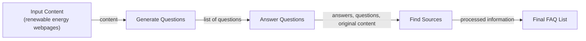
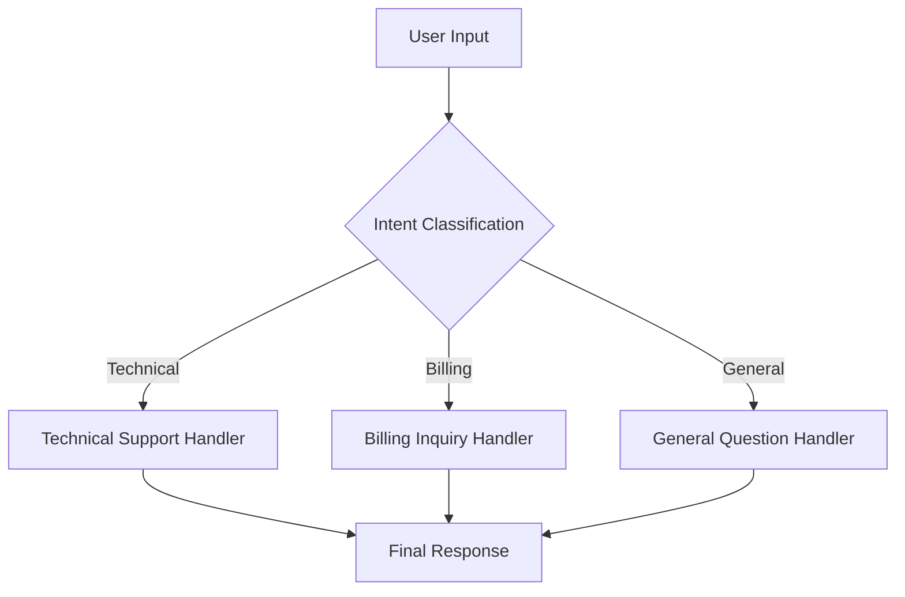
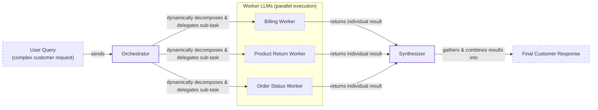

# Stop Building Complex AI Prompts: Use These Workflow Patterns Instead

In our last lesson, we covered context engineering, the art of feeding the right information to an LLM. Now, we will tackle the other side of the equation: getting structured and reliable information *out* of an LLM. When we started building AI applications, we fell into a common trap. We tried to solve complex, multi-step problems with a single, massive prompt, thinking a powerful model could handle it all. The result was an unpredictable system that was difficult to debug and failed silently in production.

This experience taught us an important lesson: monolithic prompts don’t scale. Just as in traditional software development, reliability comes from modularity. Instead of one giant, do-it-all prompt, we need to break down tasks into smaller, manageable steps. This is the core idea behind LLM workflows.

In this lesson, we will explore the fundamental patterns for building robust LLM workflows: chaining, parallelization, routing, and the orchestrator-worker pattern. We will move from theory to practice, showing you how to implement these patterns from scratch using Google's Gemini API. By the end, you will understand how to design systems that are not only powerful but also reliable, debuggable, and ready for production.

## The Challenge with Complex Single LLM Calls

A common starting point for many developers is to craft a single, comprehensive prompt that asks an LLM to perform multiple tasks at once. The intuition is that a powerful model should be able to handle a complex set of instructions. However, this approach often leads to a host of problems in production systems, turning what seems like an efficient solution into a source of unreliability and maintenance headaches.

### The Problem with Monolithic Prompts

One of the biggest issues with a single, complex prompt is the difficulty in debugging. When a monolithic prompt fails, it is hard to pinpoint exactly which instruction or part of the logic caused the error. For example, imagine an FAQ generation prompt that occasionally fails to cite a source. With a single prompt, you cannot know if the model failed to *find* the source, failed to *correlate* it with the answer, or simply failed to *format* the citation correctly. The entire process is a black box, making troubleshooting a matter of guesswork. This lack of modularity also makes the system difficult to maintain. If you need to update one part of the logic, like changing the citation format, you risk unintentionally breaking another part of the prompt, turning simple updates into a high-stakes endeavor [[1]](https://www.decodingai.com/p/stop-building-ai-agents-use-these).

Furthermore, long, complex prompts are susceptible to the "lost in the middle" problem. Research from Stanford and UC Berkeley has shown that LLMs exhibit a U-shaped performance curve when processing long contexts. They pay the most attention to information at the beginning and end of the prompt, while details in the middle are often overlooked [[2]](https://dev.to/thousand_miles_ai/the-lost-in-the-middle-problem-why-llms-ignore-the-middle-of-your-context-window-3al2). This bias is not a sign of carelessness; it is a structural artifact of the Transformer architecture. Two main factors are at play:
1.  **Causal Attention Masking**: In a standard Transformer, each token can only attend to tokens that came before it. This means tokens at the beginning of the context are seen by every subsequent token, accumulating more attention weight. Middle tokens, however, are only seen by the tokens that follow them, receiving less attention overall.
2.  **Positional Encoding Decay**: Modern LLMs use techniques like Rotary Position Embeddings (RoPE) to understand word order. These systems naturally reduce attention scores between tokens that are far apart. Middle tokens are in a "dead zone"—too far from the beginning to benefit from the primacy effect and too far from the end to benefit from recency.

This mirrors the "serial position effect" in human psychology, where we remember items at the beginning and end of a list better than those in the middle. Overstuffing the context window not only risks losing information but can also lead to outright truncation, where the model silently ignores parts of your prompt that exceed its limit.

Finally, a single complex prompt can be less reliable and more sensitive to minor changes in the input. Studies have shown that slight variations in wording or format can lead to very different outputs, making the system unpredictable [[3]](https://aclanthology.org/2025.ommm-1.4.pdf). While it might seem counterintuitive, a single large prompt can also lead to higher token consumption. To handle the combined complexity, the model might generate a lengthy internal chain of thought or verbose reasoning, which consumes more tokens than a series of focused, concise calls would. Research on underspecified prompts confirms that as the number of requirements in a single prompt increases, model accuracy drops, with some models seeing a performance decrease of over 10% when moving from one to nineteen requirements [[4]](https://arxiv.org/html/2505.13360v1).

### A Practical Example of a Complex Prompt

Let's look at a practical example. We will try to generate a Frequently Asked Questions (FAQ) page from a few documents about renewable energy, asking the model to generate questions, find answers, and cite sources all in one go.

1.  First, we set up our environment by importing the necessary packages and initializing the Gemini client. We will use the `gemini-2.5-flash` model, which is fast and cost-effective for this kind of task.
    ```python
    import asyncio
    from enum import Enum
    import random
    import time
    
    from pydantic import BaseModel, Field
    from google import genai
    from google.genai import types
    
    from lessons.utils import env
    from lessons.utils import pretty_print
    
    env.load(required_env_vars=["GOOGLE_API_KEY"])
    
    client = genai.Client()
    
    MODEL_ID = "gemini-2.5-flash"
    ```
    It outputs:
    ```text
    Trying to load environment variables from /path/to/your/project/.env
    Environment variables loaded successfully.
    Both GOOGLE_API_KEY and GEMINI_API_KEY are set. Using GOOGLE_API_KEY.
    ```

2.  Next, we define our source content—three mock webpages on renewable energy.
    ```python
    webpage_1 = {
        "title": "The Benefits of Solar Energy",
        "content": """
        Solar energy is a renewable powerhouse, offering numerous environmental and economic benefits.
        By converting sunlight into electricity through photovoltaic (PV) panels, it reduces reliance on fossil fuels,
        thereby cutting down greenhouse gas emissions. Homeowners who install solar panels can significantly
        lower their monthly electricity bills, and in some cases, sell excess power back to the grid.
        While the initial installation cost can be high, government incentives and long-term savings make
        it a financially viable option for many. Solar power is also a key component in achieving energy
        independence for nations worldwide.
        """,
    }
    
    webpage_2 = {
        "title": "Understanding Wind Turbines",
        "content": """
        Wind turbines are towering structures that capture kinetic energy from the wind and convert it into
        electrical power. They are a critical part of the global shift towards sustainable energy.
        Turbines can be installed both onshore and offshore, with offshore wind farms generally producing more
        consistent power due to stronger, more reliable winds. The main challenge for wind energy is its
        intermittency. It only generates power when the wind blows. This necessitates the use of energy
        storage solutions, like large-scale batteries, to ensure a steady supply of electricity.
        """,
    }
    
    webpage_3 = {
        "title": "Energy Storage Solutions",
        "content": """
        Effective energy storage is the key to unlocking the full potential of renewable sources like solar
        and wind. Because these sources are intermittent, storing excess energy when it's plentiful and
        releasing it when it's needed is crucial for a stable power grid. The most common form of
        large-scale storage is pumped-hydro storage, but battery technologies, particularly lithium-ion,
        are rapidly becoming more affordable and widespread. These batteries can be used in homes, businesses,
        and at the utility scale to balance energy supply and demand, making our energy system more
        resilient and reliable.
        """,
    }
    
    all_sources = [webpage_1, webpage_2, webpage_3]
    
    # We'll combine the content for the LLM to process
    combined_content = "\n\n".join(
        [f"Source Title: {source['title']}\nContent: {source['content']}" for source in all_sources]
    )
    ```

3.  Here is the complex prompt that tries to do everything at once. We also define Pydantic models to ask for a structured JSON output, a concept we covered in Lesson 4.
    ```python
    # This prompt tries to do everything at once: generate questions, find answers,
    # and cite sources. This complexity can often confuse the model.
    n_questions = 10
    prompt_complex = f"""
    Based on the provided content from three webpages, generate a list of exactly {n_questions} frequently asked questions (FAQs).
    For each question, provide a concise answer derived ONLY from the text.
    After each answer, you MUST include a list of the 'Source Title's that were used to formulate that answer.
    
    <provided_content>
    {combined_content}
    </provided_content>
    """.strip()
    
    # Pydantic classes for structured outputs
    class FAQ(BaseModel):
        """A FAQ is a question and answer pair, with a list of sources used to answer the question."""
        question: str = Field(description="The question to be answered")
        answer: str = Field(description="The answer to the question")
        sources: list[str] = Field(description="The sources used to answer the question")
    
    class FAQList(BaseModel):
        """A list of FAQs"""
        faqs: list[FAQ] = Field(description="A list of FAQs")
    
    # Generate FAQs
    config = types.GenerateContentConfig(
        response_mime_type="application/json",
        response_schema=FAQList
    )
    response_complex = client.models.generate_content(
        model=MODEL_ID,
        contents=prompt_complex,
        config=config
    )
    result_complex = response_complex.parsed
    ```
    It outputs:
    ```text
    [
      {
        "question": "What is solar energy and how does it work?",
        "answer": "Solar energy is a renewable powerhouse that converts sunlight into electricity through photovoltaic (PV) panels.",
        "sources": [
          "The Benefits of Solar Energy"
        ]
      },
      ...
      {
        "question": "Why is energy storage crucial for renewable energy sources like solar and wind?",
        "answer": "Effective energy storage is key to unlocking the full potential of renewable sources because it allows storing excess energy when plentiful and releasing it when needed, which is crucial for a stable power grid.",
        "sources": [
          "Energy Storage Solutions",
          "Understanding Wind Turbines"
        ]
      }
    ]
    ```

While the output seems reasonable at first glance, this approach is fragile. For more complex tasks, the model might fail to follow the format, hallucinate sources, or generate answers that blend information incorrectly. For instance, the last question's answer is derived from two sources, but a single complex prompt might miss this nuance and only cite one. The more instructions we add, the higher the chance of failure.

## The Power of Modularity: Why Chain LLM Calls?

To build more reliable systems, we need to adopt a modular approach. This is where prompt chaining comes in. Prompt chaining is the practice of breaking a complex task into a sequence of smaller, simpler sub-tasks. The output of one LLM call becomes the input for the next, creating a workflow or "chain" [[5]](https://medium.com/@fabiolalli/a-practical-guide-to-prompt-engineering-techniques-and-their-use-cases-5f8574e2cd9a). This "divide and conquer" strategy is fundamental to building robust and maintainable AI applications.

### The "Divide and Conquer" Strategy

The primary benefit of chaining is improved modularity. Each step in the chain is a self-contained component with a single responsibility. This makes the system far easier to test and debug. If a workflow fails, you can inspect the input and output of each step to isolate the exact point of failure. For example, consider a financial analysis workflow that extracts data from a report, performs a calculation, and generates a summary. If the final summary contains an incorrect number, a monolithic prompt leaves you guessing. In a chained workflow, you can check the output of the data extraction step. If you find a parsing error there, you have located the bug in minutes. This level of observability is essential for production systems. Acxiom, a data marketing company, faced this exact challenge when building an audience segmentation system. By implementing LangSmith for observability, they gained visibility into their multi-agent interactions, allowing them to debug complex workflows and optimize token usage effectively [[6]](https://www.zenml.io/blog/llmops-in-production-457-case-studies-of-what-actually-works).

This modularity also enhances accuracy. A simpler, more focused prompt reduces the cognitive load on the LLM, leading to more reliable and consistent outputs for each sub-task [[7]](https://mlpills.substack.com/p/issue-110-llm-workflow-patterns). This flexibility is another key advantage. You can swap out, update, or optimize individual components without affecting the rest of the chain. For instance, you might use a fast, cost-effective model like Gemini Flash for a simple classification step, and a more powerful model like Gemini Pro for complex content generation.

### Benefits and Downsides of Chaining

However, prompt chaining is not without its downsides. One challenge is that some instructions lose their meaning when split. A prompt asking to "write a summary in a formal tone, ensuring it includes all key financial metrics" combines a content requirement (metrics) with a style requirement (formal tone). If you split this into "extract metrics" and then "write summary from metrics," the second prompt might not inherit the "formal tone" instruction.

Another risk is information loss between steps. As data is passed from one call to the next, critical context from early stages can be diluted or dropped entirely, a form of context decay [[8]](https://futureagi.substack.com/p/how-tool-chaining-fails-in-production). A real-world failure mode of this is an agent forgetting a currency constraint. A user might ask for revenue in USD, but after three tool calls, the agent loses that detail and presents figures in EUR. The output is technically valid but factually wrong. This is a form of compounding error, where a small mistake in an early step can cascade and lead to a completely wrong final output [[9]](https://wand.ai/blog/compounding-error-effect-in-large-language-models-a-growing-challenge). There is also an engineering overhead in writing the "glue code" to manage the state and data flow between each call. Finally, chaining multiple LLM calls increases both latency and cost.

Despite these challenges, the control, reliability, and debuggability offered by prompt chaining make it an essential pattern for production AI systems.

## Building a Sequential Workflow: FAQ Generation Pipeline

Let's refactor our FAQ generation task into a clean, sequential workflow. Instead of one complex prompt, we will create a three-step chain:
1.  **Generate Questions**: An LLM call to create a list of questions based on the source content.
2.  **Answer Questions**: A separate LLM call to answer each question individually.
3.  **Find Sources**: A final LLM call to identify the sources used for each answer.

This modular approach allows us to control and validate each stage of the process, leading to a more reliable outcome. The entire process is deterministic and easy to follow, much like an assembly line in a factory.

Image 1: A flowchart illustrating the sequential FAQ generation pipeline.


The implementation begins by defining a function for each step in the chain. Each function is responsible for a single, well-defined task, taking specific inputs and producing a well-defined output. This separation of concerns is a core principle of good software design and is equally applicable to AI engineering.

### Step 1: Generating Questions

First, we create a function to generate a list of questions. The prompt is focused solely on this task, asking for a specific number of relevant questions. We use the `QuestionList` Pydantic model to ensure the output is a structured list of strings. This isolates the creative task of identifying interesting questions from the more analytical tasks of answering and sourcing. By giving the LLM a single, clear objective, we increase the likelihood of getting a high-quality, relevant list of questions that accurately reflect the provided content.

```python
class QuestionList(BaseModel):
    """A list of questions"""
    questions: list[str] = Field(description="A list of questions")

prompt_generate_questions = """
Based on the content below, generate a list of {n_questions} relevant and distinct questions that a user might have.

<provided_content>
{combined_content}
</provided_content>
""".strip()

def generate_questions(content: str, n_questions: int = 10) -> list[str]:
    """
    Generate a list of questions based on the provided content.

    Args:
        content: The combined content from all sources

    Returns:
        list: A list of generated questions
    """
    config = types.GenerateContentConfig(
        response_mime_type="application/json",
        response_schema=QuestionList
    )
    response_questions = client.models.generate_content(
        model=MODEL_ID,
        contents=prompt_generate_questions.format(n_questions=n_questions, combined_content=content),
        config=config
    )

    return response_questions.parsed.questions

# Test the question generation function
questions = generate_questions(combined_content, n_questions=10)
```
It outputs:
```text
- What are the primary environmental and economic benefits of solar energy?
- How do homeowners financially benefit from installing solar panels?
- What is the main process by which wind turbines generate electricity?
...
```

### Step 2: Answering Questions

Next, we define a function to answer a single question. This prompt is carefully engineered to use *only* the provided content, a technique known as grounding. By explicitly forbidding the model from using outside knowledge, we reduce the risk of hallucinations and ensure the answers are directly traceable to our source documents. This step is performed for each question generated in the previous step, ensuring that each answer is focused and directly relevant to the question asked.

```python
prompt_answer_question = """
Using ONLY the provided content below, answer the following question.
The answer should be concise and directly address the question.

<question>
{question}
</question>

<provided_content>
{combined_content}
</provided_content>
""".strip()

def answer_question(question: str, content: str) -> str:
    """
    Generate an answer for a specific question using only the provided content.

    Args:
        question: The question to answer
        content: The combined content from all sources

    Returns:
        str: The generated answer
    """
    answer_response = client.models.generate_content(
        model=MODEL_ID,
        contents=prompt_answer_question.format(question=question, combined_content=content),
    )
    return answer_response.text
```

### Step 3: Finding Sources

Our third function is responsible for identifying the sources for a given question-and-answer pair. This acts as a verification or attribution step. By separating it, we ensure that citation is a deliberate process rather than an afterthought. The model is asked to review the answer and cross-reference it with the original documents to identify the correct sources. This step adds a layer of traceability and trust to our final output, which is important for any application that presents factual information to users.

```python
class SourceList(BaseModel):
    """A list of source titles that were used to answer the question"""
    sources: list[str] = Field(description="A list of source titles that were used to answer the question")

prompt_find_sources = """
You will be given a question and an answer that was generated from a set of documents.
Your task is to identify which of the original documents were used to create the answer.

<question>
{question}
</question>

<answer>
{answer}
</answer>

<provided_content>
{combined_content}
</provided_content>
""".strip()

def find_sources(question: str, answer: str, content: str) -> list[str]:
    """
    Identify which sources were used to generate an answer.

    Args:
        question: The original question
        answer: The generated answer
        content: The combined content from all sources

    Returns:
        list: A list of source titles that were used
    """
    config = types.GenerateContentConfig(
        response_mime_type="application/json",
        response_schema=SourceList
    )
    sources_response = client.models.generate_content(
        model=MODEL_ID,
        contents=prompt_find_sources.format(question=question, answer=answer, combined_content=content),
        config=config
    )
    return sources_response.parsed.sources
```

### Executing the Full Chain

Finally, we combine these functions into a sequential workflow. The `sequential_workflow` function orchestrates the entire process. It first generates all the questions, then iterates through them one by one, calling the answer and source-finding functions for each. The results are collected into a list of `FAQ` objects. This orchestration logic, or "glue code," is what connects our modular components into a functioning application.

```python
def sequential_workflow(content, n_questions=10) -> list[FAQ]:
    """
    Execute the complete sequential workflow for FAQ generation.

    Args:
        content: The combined content from all sources

    Returns:
        list: A list of FAQs with questions, answers, and sources
    """
    # Generate questions
    questions = generate_questions(content, n_questions)

    # Answer and find sources for each question sequentially
    final_faqs = []
    for question in questions:
        # Generate an answer for the current question
        answer = answer_question(question, content)

        # Identify the sources for the generated answer
        sources = find_sources(question, answer, content)

        faq = FAQ(
            question=question,
            answer=answer,
            sources=sources
        )
        final_faqs.append(faq)

    return final_faqs

# Execute the sequential workflow (measure time for comparison)
start_time = time.monotonic()
sequential_faqs = sequential_workflow(combined_content, n_questions=4)
end_time = time.monotonic()
print(f"Sequential processing completed in {end_time - start_time:.2f} seconds")
```
It outputs:
```text
Sequential processing completed in 22.20 seconds

[
  {
    "question": "What are the primary financial benefits of installing solar panels for homeowners, and are there any initial costs to consider?",
    "answer": "The primary financial benefits of installing solar panels for homeowners are significantly lowered monthly electricity bills and, in some cases, the ability to sell excess power back to the grid. The initial installation cost can be high.",
    "sources": [
      "The Benefits of Solar Energy"
    ]
  },
  ...
]
```

This chained workflow took around 22 seconds to process four questions. Each step is clear, and if a source is missed or an answer is incorrect, we can easily inspect the intermediate outputs to find the problem. This level of control and traceability is essential for building production-grade applications that you can trust.

## Optimizing Sequential Workflows With Parallel Processing

The sequential workflow is reliable but slow. Since the processing for each question is independent of the others, we do not need to wait for one to finish before starting the next. We can speed up the process by running these tasks in parallel. This is a common optimization pattern for I/O-bound operations like making API calls to an LLM.

### The Need for Speed

The trade-offs are straightforward. Sequential processing is predictable and simple to debug, but it is slow as tasks execute one by one. Parallel processing reduces the total execution time by running independent tasks concurrently. However, it introduces complexity in managing the concurrent operations and handling potential errors. For I/O-bound tasks like LLM API calls, `asyncio` is generally faster than threading because it uses an event loop to manage concurrency within a single thread, avoiding the overhead of creating and switching between multiple OS threads [[10]](https://testdriven.io/blog/python-concurrency-parallelism/). This pattern is highly effective for batch processing or any scenario where you have multiple independent tasks to perform.

### Handling Rate Limits in Production

A major real-world consideration when running parallel calls is API rate limiting. Services like Google Gemini or OpenAI impose limits on the number of requests per minute (RPM) and tokens you can process per minute (TPM) [[11]](https://discuss.ai.google.dev/t/challenges-with-rate-limiting-and-handling-api-responses-in-high-volume-requests/61903). Aggressively parallelizing without managing these limits will result in `429` errors and failed requests [[12]](https://stackoverflow.com/questions/79924021/429-on-vertex-ai-api-how-to-send-5-20-parallel-gemini-api-requests-without-hitt). Production-grade systems must implement robust strategies to handle this.

-   **Exponential backoff with jitter** is a standard technique where the client waits for a progressively longer, randomized time after each failure. The "jitter" (randomness) is important to prevent a "thundering herd" of clients retrying at the exact same time.
-   **Retry budgets** (e.g., total retries should not exceed 10% of total requests) prevent a failing service from overwhelming the system.
-   **Circuit breakers** temporarily halt requests to a service that is consistently failing, giving it time to recover.
-   For more advanced control, you can implement a **client-side request queue** with a **token bucket algorithm** to smooth out bursty traffic and ensure you stay within the API's rate limits [[13]](https://tianpan.co/blog/2026-03-11-llm-api-resilience-production).

For our example, we will use Python's `asyncio` library to run the "answer" and "find sources" steps in parallel for each question.

### Implementing Parallelism with Asyncio

1.  We start by creating asynchronous versions of our `answer_question` and `find_sources` functions. These `async` functions can be run concurrently by an event loop, allowing the program to work on other tasks while waiting for the API responses.
    ```python
    async def answer_question_async(question: str, content: str) -> str:
        """
        Async version of answer_question function.
        """
        prompt = prompt_answer_question.format(question=question, combined_content=content)
        response = await client.aio.models.generate_content(
            model=MODEL_ID,
            contents=prompt
        )
        return response.text
    
    async def find_sources_async(question: str, answer: str, content: str) -> list[str]:
        """
        Async version of find_sources function.
        """
        prompt = prompt_find_sources.format(question=question, answer=answer, combined_content=content)
        config = types.GenerateContentConfig(
            response_mime_type="application/json",
            response_schema=SourceList
        )
        response = await client.aio.models.generate_content(
            model=MODEL_ID,
            contents=prompt,
            config=config
        )
        return response.parsed.sources
    ```

2.  Next, we create a function `process_question_parallel` that generates an answer and finds sources for a single question.
    ```python
    async def process_question_parallel(question: str, content: str) -> FAQ:
        """
        Process a single question by generating answer and finding sources in parallel.
        """
        answer = await answer_question_async(question, content)
        sources = await find_sources_async(question, answer, content)
        return FAQ(
            question=question,
            answer=answer,
            sources=sources
        )
    ```

3.  Finally, our parallel workflow first generates the list of questions synchronously and then uses `asyncio.gather` to execute `process_question_parallel` for all questions concurrently. This function collects all the asynchronous tasks and runs them at the same time, waiting for all to complete.
    ```python
    async def parallel_workflow(content: str, n_questions: int = 10) -> list[FAQ]:
        """
        Execute the complete parallel workflow for FAQ generation.
    
        Args:
            content: The combined content from all sources
    
        Returns:
            list: A list of FAQs with questions, answers, and sources
        """
        # Generate questions (this step remains synchronous)
        questions = generate_questions(content, n_questions)
    
        # Process all questions in parallel
        tasks = [process_question_parallel(question, content) for question in questions]
        parallel_faqs = await asyncio.gather(*tasks)
    
        return parallel_faqs
    
    # Execute the parallel workflow (measure time for comparison)
    start_time = time.monotonic()
    parallel_faqs = await parallel_workflow(combined_content, n_questions=4)
    end_time = time.monotonic()
    print(f"Parallel processing completed in {end_time - start_time:.2f} seconds")
    ```
    It outputs:
    ```text
    Parallel processing completed in 8.98 seconds
    
    [
      {
        "question": "What are the primary environmental and economic benefits of using solar energy?",
        "answer": "The primary environmental benefit of solar energy is cutting down greenhouse gas emissions by reducing reliance on fossil fuels.\n\nThe primary economic benefits include significantly lower monthly electricity bills, the ability to sell excess power back to the grid, long-term savings, and contributing to energy independence for nations.",
        "sources": [
          "The Benefits of Solar Gnergy"
        ]
      },
      ...
    ]
    ```

By running the tasks in parallel, we reduced the execution time from 22 seconds to just 9 seconds. This demonstrates the significant performance gains that parallelization can offer, especially for batch processing tasks where multiple independent operations can be executed at the same time.

## Introducing Dynamic Behavior: Routing and Conditional Logic

Sequential and parallel workflows are powerful, but they follow a fixed path. Real-world applications often require dynamic behavior, where the workflow adapts based on the user's input or intermediate results. This is where routing comes in. Routing uses conditional logic to direct a task down different paths, enabling you to build more intelligent and responsive systems.

### From Fixed Paths to Smart Decisions

The core idea is to use an LLM as a classifier or a "dispatcher" agent. This first LLM call analyzes the input and determines which specialized handler or sub-workflow is best suited to handle it. This is another application of the "divide and conquer" principle. Instead of a single, monolithic prompt that tries to handle every possible user intent, you create specialized prompts for each case (e.g., technical support, billing inquiry, general question). This keeps each prompt focused and optimized for a single responsibility, which generally leads to higher accuracy and easier maintenance [[1]](https://www.decodingai.com/p/stop-building-ai-agents-use-these).

Routing is essential for tasks where the required processing varies widely based on the input. In customer support, a query about a billing error requires a completely different set of actions and information than a technical troubleshooting question. Trying to handle both in a single prompt would make it bloated and prone to error. Routing allows you to create a clear, precise taxonomy of intents and handle each one with a dedicated, optimized prompt. This dynamic branching is a key building block for creating more sophisticated, agent-like behaviors, moving from static data processing to intelligent decision-making. For example, a content moderation system might route text with potentially harmful content to a specialized safety model, while routing benign text to a standard summarization model.

## Building a Basic Routing Workflow

Let's build a simple routing workflow for a customer service system. The goal is to classify an incoming user query into one of three intents—`Technical Support`, `Billing Inquiry`, or `General Question`—and then route it to a specialized handler that generates an appropriate first response.

### A Customer Service Router

This two-stage architecture—classify then handle—is a robust pattern for improving precision. The classification step creates a clear, structured taxonomy of intents, which is important for handling diverse user requests reliably [[14]](https://www.emergentmind.com/topics/llm-based-prompt-routing). For even higher precision in production, some systems use a more advanced two-stage classification. An initial, faster model might retrieve a few candidate intents, and a second, more powerful LLM makes the final selection. This cascade approach, sometimes called post-generation routing, balances speed and accuracy by using lightweight models for initial filtering and reserving more capable models for ambiguous or high-stakes decisions [[15]](https://aws.amazon.com/blogs/machine-learning/multi-llm-routing-strategies-for-generative-ai-applications-on-aws/).

Image 2: A flowchart illustrating a basic routing workflow for customer service.


Our implementation will follow this pattern, starting with a clear definition of our intents.

### Step 1: Intent Classification

First, we define our intent classification system. We use an `Enum` and a Pydantic model to create a strict schema for our classifier. This acts as a contract, ensuring the LLM's output is predictable. The prompt asks the LLM to categorize the user's query based on the provided list of intents, forcing it to choose one of the predefined categories. This structured approach is far more reliable than trying to parse a free-text classification from the model.

```python
class IntentEnum(str, Enum):
    """
    Defines the allowed values for the 'intent' field.
    Inheriting from 'str' ensures that the values are treated as strings.
    """
    TECHNICAL_SUPPORT = "Technical Support"
    BILLING_INQUIRY = "Billing Inquiry"
    GENERAL_QUESTION = "General Question"

class UserIntent(BaseModel):
    """
    Defines the expected response schema for the intent classification.
    """
    intent: IntentEnum = Field(description="The intent of the user's query")

prompt_classification = """
Classify the user's query into one of the following categories.

<categories>
{categories}
</categories>

<user_query>
{user_query}
</user_query>
""".strip()


def classify_intent(user_query: str) -> IntentEnum:
    """Uses an LLM to classify a user query."""
    prompt = prompt_classification.format(
        user_query=user_query,
        categories=[intent.value for intent in IntentEnum]
    )
    config = types.GenerateContentConfig(
        response_mime_type="application/json",
        response_schema=UserIntent
    )
    response = client.models.generate_content(
        model=MODEL_ID,
        contents=prompt,
        config=config
    )
    return response.parsed.intent


query_1 = "My internet connection is not working."
query_2 = "I think there is a mistake on my last invoice."
query_3 = "What are your opening hours?"

intent_1 = classify_intent(query_1)
intent_2 = classify_intent(query_2)
intent_3 = classify_intent(query_3)
```
It outputs:
```text
Query: My internet connection is not working. -> Intent: IntentEnum.TECHNICAL_SUPPORT
Query: I think there is a mistake on my last invoice. -> Intent: IntentEnum.BILLING_INQUIRY
Query: What are your opening hours? -> Intent: IntentEnum.GENERAL_QUESTION
```

### Step 2: Specialized Handlers

Next, we define our specialized handlers. Each handler has a prompt tailored to its specific role, giving it a clear persona and set of instructions. The `handle_query` function acts as our router. It takes the user query and the classified intent, and then uses a simple `if/elif/else` block to execute the correct prompt. It is also good practice to include a default or "catch-all" route to handle any unexpected or misclassified intents gracefully. This ensures the system can always provide a response, even if it is just to ask for clarification.

```python
prompt_technical_support = """
You are a helpful technical support agent.

Here's the user's query:
<user_query>
{user_query}
</user_query>

Provide a helpful first response, asking for more details like what troubleshooting steps they have already tried.
""".strip()

prompt_billing_inquiry = """
You are a helpful billing support agent.

Here's the user's query:
<user_query>
{user_query}
</user_query>

Acknowledge their concern and inform them that you will need to look up their account, asking for their account number.
""".strip()

prompt_general_question = """
You are a general assistant.

Here's the user's query:
<user_query>
{user_query}
</user_query>

Apologize that you are not sure how to help.
""".strip()


def handle_query(user_query: str, intent: str) -> str:
    """Routes a query to the correct handler based on its classified intent."""
    if intent == IntentEnum.TECHNICAL_SUPPORT:
        prompt = prompt_technical_support.format(user_query=user_query)
    elif intent == IntentEnum.BILLING_INQUIRY:
        prompt = prompt_billing_inquiry.format(user_query=user_query)
    elif intent == IntentEnum.GENERAL_QUESTION:
        prompt = prompt_general_question.format(user_query=user_query)
    else:
        prompt = prompt_general_question.format(user_query=user_query)
    response = client.models.generate_content(
        model=MODEL_ID,
        contents=prompt
    )
    return response.text


response_1 = handle_query(query_1, intent_1)
```
It outputs:
```text
Hello there! I'm sorry to hear you're having trouble with your internet connection. That can definitely be frustrating.

To help me understand what's going on and assist you best, could you please provide a few more details?
...
```

This routing pattern allows you to build complex, multi-path workflows while keeping each individual component simple and maintainable. It is a foundational technique for creating systems that can handle a wide variety of tasks and user inputs in a structured and reliable way.

## Orchestrator-Worker Pattern: Dynamic Task Decomposition

The orchestrator-worker pattern takes dynamic workflows a step further. Instead of a fixed set of branches, a central "orchestrator" LLM dynamically breaks down a complex query into a series of sub-tasks. It then delegates these sub-tasks to specialized "worker" LLMs or tools, which can run in parallel. Finally, a "synthesizer" LLM gathers the results from the workers and combines them into a single, coherent response [[16]](https://agents.kour.me/orchestrator-worker/).

### The Ultimate Flexibility: Orchestrator-Worker

This pattern is exceptionally well-suited for complex problems where the necessary steps cannot be predicted in advance [[17]](https://platform.claude.com/cookbook/patterns-agents-orchestrator-workers). For example, a request to "plan a marketing campaign" could involve sub-tasks for market research, content creation, and social media scheduling—tasks that an orchestrator can identify and delegate at runtime. The key difference from simple parallelization is this flexibility; the orchestrator determines the sub-tasks on the fly based on the specific input [[18]](https://www.anthropic.com/engineering/building-effective-agents).

Image 3: A flowchart depicting the orchestrator-worker pattern for dynamic task decomposition.


### Production Challenges and Mitigations

However, this pattern introduces its own challenges. The orchestrator can become a bottleneck, and if it fails to decompose the task correctly, the entire workflow can go off track. A common failure mode is incomplete decomposition, where the orchestrator misses a necessary sub-task. To mitigate this, you can prompt the orchestrator to review its own plan or even use an iterative refinement loop.

Another challenge arises when workers produce conflicting or inconsistent outputs. The synthesizer must be designed to handle these conflicts. Strategies include:
*   **Voting Mechanisms**: If multiple workers perform the same task for redundancy, the synthesizer can take the majority vote.
*   **Human-in-the-Loop**: For high-stakes decisions, flag inconsistencies for human review.
*   **Conflict Resolution Prompts**: Prompt the synthesizer with explicit instructions to prioritize one source over another, or to ask the orchestrator for clarification. A multi-agent customer support framework at Socure uses an "Answer Evaluation" node that scores parallel agent outputs on accuracy, relevance, and confidence, selecting the best one to present to the user [[19]](https://www.socure.com/tech-blog/build-advanced-customer-support-llm-multi-agent-workflow).

Using robust input/output schemas, like Pydantic models, is essential for ensuring clear communication between the orchestrator and workers and preventing misrouted tasks.

### A Practical Implementation

Let's implement this pattern for our customer service example, handling a complex query that involves a billing issue, a product return, and an order status request all at once.

1.  The orchestrator's job is to parse the user's query and break it down into a list of structured tasks. We define a schema for the possible tasks and prompt the LLM to identify all the necessary sub-tasks and their parameters from the user's free-form text.
    ```python
    class QueryTypeEnum(str, Enum):
        """The type of query to be handled."""
        BILLING_INQUIRY = "BillingInquiry"
        PRODUCT_RETURN = "ProductReturn"
        STATUS_UPDATE = "StatusUpdate"
    
    class Task(BaseModel):
        """A task to be performed."""
        query_type: QueryTypeEnum = Field(description="The type of query to be handled.")
        invoice_number: str | None = Field(description="The invoice number to be used for the billing inquiry.", default=None)
        product_name: str | None = Field(description="The name of the product to be returned.", default=None)
        reason_for_return: str | None = Field(description="The reason for returning the product.", default=None)
        order_id: str | None = Field(description="The order ID to be used for the status update.", default=None)
    
    class TaskList(BaseModel):
        """A list of tasks to be performed."""
        tasks: list[Task] = Field(description="A list of tasks to be performed.")
    
    prompt_orchestrator = f"""
    You are a master orchestrator. Your job is to break down a complex user query into a list of sub-tasks.
    Each sub-task must have a "query_type" and its necessary parameters.
    
    The possible "query_type" values and their required parameters are:
    1. "{QueryTypeEnum.BILLING_INQUIRY.value}": Requires "invoice_number".
    2. "{QueryTypeEnum.PRODUCT_RETURN.value}": Requires "product_name" and "reason_for_return".
    3. "{QueryTypeEnum.STATUS_UPDATE.value}": Requires "order_id".
    
    Here's the user's query.
    
    <user_query>
    {{query}}
    </user_query>
    """.strip()
    
    
    def orchestrator(query: str) -> list[Task]:
        """Breaks down a complex query into a list of tasks."""
        prompt = prompt_orchestrator.format(query=query)
        config = types.GenerateContentConfig(
            response_mime_type="application/json",
            response_schema=TaskList
        )
        response = client.models.generate_content(
            model=MODEL_ID,
            contents=prompt,
            config=config
        )
        return response.parsed.tasks
    ```

2.  We then define our worker functions. Each worker is a specialist that handles one type of task. The `handle_billing_worker` simulates opening an investigation, the `handle_return_worker` generates a return authorization, and the `handle_status_worker` fetches order details. In a real application, these workers would interact with external APIs or databases.
    ```python
    # Billing Worker Implementation
    class BillingTask(BaseModel): ...
    def handle_billing_worker(invoice_number: str, original_user_query: str) -> BillingTask: ...
    
    # Product Return Worker
    class ReturnTask(BaseModel): ...
    def handle_return_worker(product_name: str, reason_for_return: str) -> ReturnTask: ...
    
    # Order Status Worker
    class StatusTask(BaseModel): ...
    def handle_status_worker(order_id: str) -> StatusTask: ...
    ```

3.  The synthesizer's role is to take the structured outputs from all the workers and compose a single, user-friendly message. Its prompt explicitly instructs it to combine the distinct pieces of information into one cohesive response, maintaining a helpful and professional tone.
    ```python
    prompt_synthesizer = """
    You are a master communicator. Combine several distinct pieces of information from our support team into a single, well-formatted, and friendly email to a customer.
    
    Here are the points to include, based on the actions taken for their query:
    <points>
    {formatted_results}
    </points>
    
    Combine these points into one cohesive response.
    Start with a friendly greeting (e.g., "Dear Customer," or "Hi there,") and end with a polite closing (e.g., "Sincerely," or "Best regards,").
    Ensure the tone is helpful and professional.
    """.strip()
    
    
    def synthesizer(results: list[Task]) -> str: ...
    ```

4.  Finally, we tie everything together in our main pipeline function, `process_user_query`. This function calls the orchestrator, dispatches tasks to the appropriate workers (which could be run in parallel for efficiency), and then uses the synthesizer to generate the final response.
    ```python
    def process_user_query(user_query):
        """Processes a query using the Orchestrator-Worker-Synthesizer pattern."""
    
        pretty_print.wrapped(
            text=user_query,
            title="User query"
        )
    
        # 1. Run orchestrator
        tasks_list = orchestrator(user_query)
        ...
    
        # 2. Run workers
        worker_results = []
        if tasks_list:
            for task in tasks_list:
                if task.query_type == QueryTypeEnum.BILLING_INQUIRY:
                    worker_results.append(handle_billing_worker(task.invoice_number, user_query))
                ...
    
        # 3. Run synthesizer
        if worker_results:
            final_user_message = synthesizer(worker_results)
            ...
    
    complex_customer_query = """
    Hi, I'm writing to you because I have a question about invoice #INV-7890. It seems higher than I expected.
    Also, I would like to return the 'SuperWidget 5000' I bought because it's not compatible with my system.
    Finally, can you give me an update on my order #A-12345?
    """.strip()
    
    process_user_query(complex_customer_query)
    ```
    First, the orchestrator deconstructs the query into three distinct tasks:
    ```text
    Deconstructed task 1:
    {
      "query_type": "BillingInquiry",
      "invoice_number": "INV-7890",
      ...
    }
    
    Deconstructed task 2:
    {
      "query_type": "ProductReturn",
      "product_name": "SuperWidget 5000",
      ...
    }
    
    Deconstructed task 3:
    {
      "query_type": "StatusUpdate",
      "order_id": "A-12345",
      ...
    }
    ```
    Then, each worker processes its assigned task and returns a structured result. For example, the billing worker returns:
    ```text
    Worker result 1:
    {
      "query_type": "BillingInquiry",
      "invoice_number": "INV-7890",
      "user_concern": "The invoice seems higher than expected.",
      "action_taken": "An investigation (Case ID: INV_CASE_6301) has been opened regarding your concern.",
      "resolution_eta": "2 business days"
    }
    ```
    Finally, the synthesizer combines all worker results into a single, helpful email to the customer:
    ```text
    Final synthesized response:
    Dear Customer,
    
    Thank you for reaching out to us. Here's an update on your requests:
    
    Regarding your BillingInquiry:
      - Invoice Number: INV-7890
      - Your Stated Concern: "The invoice seems higher than expected."
      - Our Action: An investigation (Case ID: INV_CASE_6301) has been opened regarding your concern.
      - Expected Resolution: We will get back to you within 2 business days.
    
    Regarding your ProductReturn:
      - Product: SuperWidget 5000
      - Reason for Return: "it's not compatible with my system"
      ...
    
    Regarding your StatusUpdate:
      - Order ID: A-12345
      - Current Status: Shipped
      ...
    
    We hope this information is helpful. Please let us know if you have any other questions.
    
    Best regards,
    Support Team
    ```

This pattern demonstrates how to build a sophisticated system that can dynamically handle complex, multi-part queries in a structured and scalable way.

## Conclusion

We have journeyed from the pitfalls of monolithic prompts to the power of modular workflows. By breaking down complex problems into smaller, manageable steps, we can build AI systems that are more reliable, debuggable, and easier to maintain. We have seen how sequential chaining provides control, parallelization offers speed, routing enables dynamic behavior, and the orchestrator-worker pattern delivers flexibility for unpredictable tasks.

These patterns are not just theoretical concepts; they are the essential building blocks for virtually any production-grade LLM application. They represent a fundamental shift from simple prompt engineering to a more systematic approach to AI engineering. As you continue your journey, you will find yourself combining these patterns to create sophisticated, multi-agent systems. In our upcoming lessons, we will build upon this foundation, exploring how to give your workflows the ability to use tools, plan their actions, and remember past interactions.

## References

- [1]  [Stop Building AI Agents. Use These Workflow Patterns Instead.](https://www.decodingai.com/p/stop-building-ai-agents-use-these)
- [2]  [The "Lost in the Middle" Problem — Why LLMs Ignore the Middle of Your Context Window](https://dev.to/thousand_miles_ai/the-lost-in-the-middle-problem-why-llms-ignore-the-middle-of-your-context-window-3al2)
- [3]  [FLARE: A Framework for Large-Scale Agent-Based Reasoning and Evaluation](https://aclanthology.org/2025.ommm-1.4.pdf)
- [4]  [Underspecification in Language Models: A Study of Prompt Robustness](https://arxiv.org/html/2505.13360v1)
- [5]  [A Practical Guide to Prompt Engineering Techniques and Their Use Cases](https://medium.com/@fabiolalli/a-practical-guide-to-prompt-engineering-techniques-and-their-use-cases-5f8574e2cd9a)
- [6]  [LLMOps in Production: 457 Case Studies of What Actually Works](https://www.zenml.io/blog/llmops-in-production-457-case-studies-of-what-actually-works)
- [7]  [Issue 110: LLM Workflow Patterns](https://mlpills.substack.com/p/issue-110-llm-workflow-patterns)
- [8]  [How Tool Chaining Fails in Production LLM Agents and How to Fix It](https://futureagi.substack.com/p/how-tool-chaining-fails-in-production)
- [9]  [The Compounding Error Effect in Large Language Models: A Growing Challenge](https://wand.ai/blog/compounding-error-effect-in-large-language-models-a-growing-challenge)
- [10]  [Python Concurrency and Parallelism by Example](https://testdriven.io/blog/python-concurrency-parallelism/)
- [11]  [Challenges with rate limiting and handling API responses in high volume requests](https://discuss.ai.google.dev/t/challenges-with-rate-limiting-and-handling-api-responses-in-high-volume-requests/61903)
- [12]  [429 on Vertex AI API - How to send 5-20 parallel Gemini API requests without hitting rate limits?](https://stackoverflow.com/questions/79924021/429-on-vertex-ai-api-how-to-send-5-20-parallel-gemini-api-requests-without-hitt)
- [13]  [LLM API Resilience in Production: Rate Limits, Failover, and the Hidden Costs of Naive Retry Logic](https://tianpan.co/blog/2026-03-11-llm-api-resilience-production)
- [14]  [LLM-Based Prompt Routing](https://www.emergentmind.com/topics/llm-based-prompt-routing)
- [15]  [Multi-LLM routing strategies for generative AI applications on AWS](https://aws.amazon.com/blogs/machine-learning/multi-llm-routing-strategies-for-generative-ai-applications-on-aws/)
- [16]  [Orchestrator-Worker Pattern](https://agents.kour.me/orchestrator-worker/)
- [17]  [Orchestrator-Workers Pattern Cookbook](https://platform.claude.com/cookbook/patterns-agents-orchestrator-workers)
- [18]  [Building Effective Agents](https://www.anthropic.com/engineering/building-effective-agents)
- [19]  [How to Build an Advanced Customer Support LLM Multi-Agent Workflow](https://www.socure.com/tech-blog/build-advanced-customer-support-llm-multi-agent-workflow)