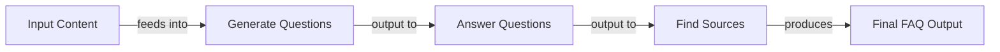
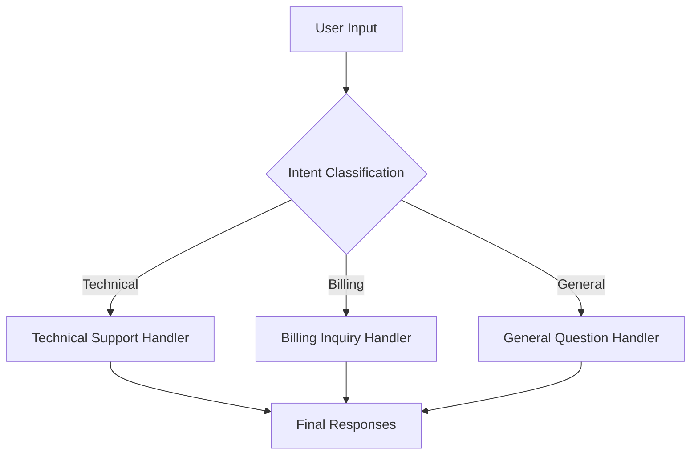
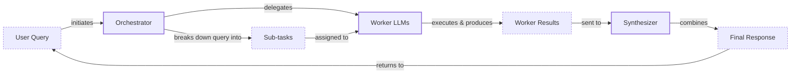

# Stop Building Monolithic LLM Apps. Use These Workflow Patterns Instead.

When we first started building with LLMs, the approach was simple: write one big, complex prompt and hope for the best. We’ve all been there. On a recent project, we tried to build an FAQ generation system this way. We wrote a massive prompt asking the model to generate questions from multiple documents, find the answers, and cite the sources—all in a single call. The result was a mess. The model missed sources, hallucinated answers, and the output was so inconsistent we couldn't use it in a production system.

This experience taught us an important lesson: monolithic prompts don’t scale. They are difficult to debug, impossible to maintain, and often produce unreliable results. As AI engineers, we need to move beyond simple prompting and start thinking in terms of systems and workflows.

In our previous lessons, we’ve covered the agent landscape, the difference between workflows and agents, context engineering, and structured outputs. Now, we’ll dive into the fundamental building blocks of reliable LLM applications: modular workflow patterns. These patterns allow you to break down complex tasks into smaller, manageable steps, creating systems that are more accurate, efficient, and easier to debug.

We will explore four foundational patterns:
- **Sequential Chaining:** Executing tasks in a step-by-step assembly line.
- **Parallelization:** Running independent tasks simultaneously to save time.
- **Routing:** Using conditional logic to direct tasks down different paths.
- **Orchestrator-Worker:** Dynamically decomposing complex problems into subtasks.

By the end of this lesson, you will know how to design and implement these patterns to build robust, production-grade AI workflows.

## The Challenge with Complex Single LLM Calls

Attempting to solve a multi-step problem with a single, complex LLM call is a common mistake. While it might seem efficient, this monolithic approach introduces several engineering challenges that make it unsuitable for production systems.

The core issue is a lack of control and visibility. When a single prompt fails, it’s incredibly difficult to pinpoint the exact cause. Imagine our FAQ generator returns malformed JSON. Was the model confused by the question-generation instruction, the answering instruction, or the source-citation rule? With everything bundled into one call, debugging becomes a frustrating guessing game. This lack of modularity also makes the system brittle. If you want to improve the quality of the answers, you risk breaking the question generation or source formatting. Iterative improvement becomes nearly impossible because you cannot test or version individual components; you are forced to re-evaluate the entire monolithic system for every minor adjustment.

One of the most well-documented failure modes is the "lost-in-the-middle" problem. Research from Stanford and UC Berkeley has consistently shown that LLMs pay the most attention to the beginning and end of their context window. This creates a U-shaped performance curve where information at the start and end of the prompt is recalled accurately, but information in the middle is often ignored. This bias stems from architectural features like causal attention masking, where early tokens get more cumulative attention, and positional encoding decay, which weakens the signal for tokens in the middle. As you stuff more instructions and data into a single prompt, you increase the risk that key details will fall into this attentional valley and be overlooked. Even with massive context windows, performance degrades long before the physical limit is reached because of this architectural bias [[1]](https://dev.to/thousand_miles_ai/the-lost-in-the-middle-problem-why-llms-ignore-the-middle-of-your-context-window-3al2).

Furthermore, complex prompts are more sensitive to minor variations in input, leading to inconsistent and unreliable outputs. They also risk overstuffing the context window, which can lead to unexpected truncation, higher token consumption, and increased latency. Research has shown that complex, multi-example prompts can increase parsing failures by up to 70.8% compared to simpler, zero-shot prompts [[2]](https://aclanthology.org/2025.ommm-1.4.pdf). This happens because prompts with high syntactic complexity are more likely to be misinterpreted by the model. Research confirms that simpler, more direct prompt structures allow models to retrieve and process information more consistently, reducing the risk of erroneous outputs [[3]](https://www.mdpi.com/2079-9292/13/23/4712).

Let's look at a practical example. We will use the `google-genai` library to interact with Google's Gemini models.

1.  First, we set up our environment by initializing the Gemini client and defining our model ID. We will use `gemini-2.5-flash`, which is fast and cost-effective for these examples.
    ```python
    import asyncio
    from enum import Enum
    import random
    import time
    
    from pydantic import BaseModel, Field
    from google import genai
    from google.genai import types
    
    from lessons.utils import env
    
    env.load(required_env_vars=["GOOGLE_API_KEY"])
    
    client = genai.Client()
    
    MODEL_ID = "gemini-2.5-flash"
    ```
2.  Next, we create mock content from three webpages about renewable energy.
    ```python
    webpage_1 = {
        "title": "The Benefits of Solar Energy",
        "content": """
        Solar energy is a renewable powerhouse, offering numerous environmental and economic benefits.
        By converting sunlight into electricity through photovoltaic (PV) panels, it reduces reliance on fossil fuels,
        thereby cutting down greenhouse gas emissions. Homeowners who install solar panels can significantly
        lower their monthly electricity bills, and in some cases, sell excess power back to the grid.
        While the initial installation cost can be high, government incentives and long-term savings make
        it a financially viable option for many. Solar power is also a key component in achieving energy
        independence for nations worldwide.
        """,
    }
    
    webpage_2 = {
        "title": "Understanding Wind Turbines",
        "content": """
        Wind turbines are towering structures that capture kinetic energy from the wind and convert it into
        electrical power. They are a critical part of the global shift towards sustainable energy.
        Turbines can be installed both onshore and offshore, with offshore wind farms generally producing more
        consistent power due to stronger, more reliable winds. The main challenge for wind energy is its
        intermittency. It only generates power when the wind blows. This necessitates the use of energy
        storage solutions, like large-scale batteries, to ensure a steady supply of electricity.
        """,
    }
    
    webpage_3 = {
        "title": "Energy Storage Solutions",
        "content": """
        Effective energy storage is the key to unlocking the full potential of renewable sources like solar
        and wind. Because these sources are intermittent, storing excess energy when it's plentiful and
        releasing it when it's needed is crucial for a stable power grid. The most common form of
        large-scale storage is pumped-hydro storage, but battery technologies, particularly lithium-ion,
        are rapidly becoming more affordable and widespread. These batteries can be used in homes, businesses,
        and at the utility scale to balance energy supply and demand, making our energy system more
        resilient and reliable.
        """,
    }
    
    all_sources = [webpage_1, webpage_2, webpage_3]
    
    combined_content = "\n\n".join(
        [f"Source Title: {source['title']}\nContent: {source['content']}" for source in all_sources]
    )
    ```
3.  Now, we use a single, complex prompt to generate questions, find answers, and cite sources. We will use Pydantic models, which we covered in Lesson 4, to define the structured output we expect.
    ```python
    class FAQ(BaseModel):
        """A FAQ is a question and answer pair, with a list of sources used to answer the question."""
        question: str = Field(description="The question to be answered")
        answer: str = Field(description="The answer to the question")
        sources: list[str] = Field(description="The sources used to answer the question")
    
    class FAQList(BaseModel):
        """A list of FAQs"""
        faqs: list[FAQ] = Field(description="A list of FAQs")
    
    n_questions = 10
    prompt_complex = f"""
    Based on the provided content from three webpages, generate a list of exactly {n_questions} frequently asked questions (FAQs).
    For each question, provide a concise answer derived ONLY from the text.
    After each answer, you MUST include a list of the 'Source Title's that were used to formulate that answer.
    
    <provided_content>
    {combined_content}
    </provided_content>
    """.strip()
    
    config = types.GenerateContentConfig(
        response_mime_type="application/json",
        response_schema=FAQList
    )
    response_complex = client.models.generate_content(
        model=MODEL_ID,
        contents=prompt_complex,
        config=config
    )
    result_complex = response_complex.parsed
    ```
    It outputs:
    ```json
    {
      "question": "Why is energy storage crucial for renewable energy sources like solar and wind?",
      "answer": "Effective energy storage is key to unlocking the full potential of renewable sources because it allows storing excess energy when plentiful and releasing it when needed, which is crucial for a stable power grid.",
      "sources": [
        "Energy Storage Solutions",
        "Understanding Wind Turbines"
      ]
    }
    ```
While the output seems reasonable, this approach is fragile. If the model fails to cite a source correctly or generates a slightly malformed answer, the entire output's integrity is compromised, and it is difficult to know which part of the prompt caused the error.

## The Power of Modularity: Why Chain LLM Calls?

The solution to the unreliability of monolithic prompts is modularity. Prompt chaining is a fundamental workflow pattern that breaks down a complex task into a sequence of smaller, simpler LLM calls. The output of one step becomes the input for the next, creating an "assembly line" for data processing. This divide-and-conquer strategy is the first step toward building robust and maintainable AI systems [[4]](https://www.decodingai.com/p/stop-building-ai-agents-use-these), [[5]](https://medium.com/@fabiolalli/a-practical-guide-to-prompt-engineering-techniques-and-their-use-cases-5f8574e2cd9a). This mirrors how humans approach complex problems. We rarely solve multi-step challenges at once; instead, we break them down into a sequence of logical steps. Prompt chaining guides the LLM to do the same, aligning its processing with this more natural, sequential method of reasoning [[6]](https://invisibletech.ai/blog/how-to-teach-chain-of-thought-reasoning-to-your-llm).

The primary benefit of chaining is improved reliability. Each LLM call in the chain has a single, focused responsibility. A simpler, more targeted prompt reduces the cognitive load on the model, leading to higher accuracy and more consistent outputs [[7]](https://blog.udemy.com/prompt-chaining/). This modularity also makes the system far easier to debug. If a step fails, you can isolate the problematic prompt and its corresponding input/output, rather than trying to untangle a single, massive call. This is a real-world practice; Acxiom, a marketing analytics company, implemented LangSmith for observability to gain visibility into their multi-agent workflows, which allowed them to debug complex chains, optimize token usage, and effectively scale their system [[8]](https://www.zenml.io/blog/llmops-in-production-457-case-studies-of-what-actually-works). This modular approach also enables independent testing and versioning for each component, treating prompts like code.

This design also enhances flexibility. You can swap, update, or optimize individual components of the chain without affecting the others. For instance, you could use a fast, cost-effective model like Gemini Flash for a simple classification step and a more powerful model like Gemini Pro for a complex generation step. This allows you to balance performance and cost effectively.

However, chaining is not without its trade-offs. The most significant downside is increased latency and cost, as each step involves a separate API call. There is also a risk of information loss between steps [[9]](https://futureagi.substack.com/p/how-tool-chaining-fails-in-production). If an early step in the chain produces an incomplete or slightly inaccurate summary, that error can propagate and be amplified in subsequent steps. This is known as a cascading failure. It is also important to note that the superiority of single-task prompts is not a universal rule. Recent studies show that performance is highly model-dependent, with some architectures like LLama 3.1 actually performing better on certain multitask prompts. This suggests that while modularity is a strong default principle, the optimal strategy may require empirical testing with your specific model and use case [[3]](https://www.mdpi.com/2079-9292/13/23/4712).

Mitigating these risks requires careful prompt design and, as we discussed in Lesson 3 on Context Engineering, robust state management to ensure important context is preserved throughout the workflow. The engineering overhead of managing these interconnected prompts and the "glue code" between them is real. Frameworks like LangGraph provide explicit state management to make context durable and inspectable across steps, helping to manage this complexity [[9]](https://futureagi.substack.com/p/how-tool-chaining-fails-in-production).

## Building a Sequential Workflow: FAQ Generation Pipeline

Let's refactor our complex FAQ generation task into a clean, three-step sequential workflow. By breaking the problem down, we gain control and reliability. The pipeline will work as follows: first, we generate a list of questions; second, for each question, we generate an answer; and third, we identify the sources for that answer. This approach allows us to validate the output at each stage and easily pinpoint where things go wrong.

Image 1: A flowchart illustrating the sequential FAQ generation pipeline.

This diagram shows the clear, linear flow of our assembly line. Each step is a distinct LLM call with a single responsibility, making the entire process transparent and manageable. This modularity is key; by inspecting the intermediate outputs at each stage, we can ensure quality and catch errors early. For example, if the generated questions are irrelevant, we can halt the process and debug the first step without wasting time and money on the subsequent calls. This level of control is impossible with a monolithic prompt.

1.  First, we create a function dedicated solely to generating questions from the provided content. The design choice here is to keep the prompt simple and focused. We instruct the model to generate a specific number of "relevant and distinct" questions to guide its output and prevent redundant or low-quality results. By using a Pydantic model `QuestionList`, as we learned in Lesson 4, we enforce a structured output, ensuring we get a clean list of strings that can be easily passed to the next step in our chain.
    ```python
    class QuestionList(BaseModel):
        """A list of questions"""
        questions: list[str] = Field(description="A list of questions")
    
    prompt_generate_questions = """
    Based on the content below, generate a list of {n_questions} relevant and distinct questions that a user might have.
    
    <provided_content>
    {combined_content}
    </provided_content>
    """.strip()
    
    def generate_questions(content: str, n_questions: int = 10) -> list[str]:
        """
        Generate a list of questions based on the provided content.
    
        Args:
            content: The combined content from all sources
    
        Returns:
            list: A list of generated questions
        """
        config = types.GenerateContentConfig(
            response_mime_type="application/json",
            response_schema=QuestionList
        )
        response_questions = client.models.generate_content(
            model=MODEL_ID,
            contents=prompt_generate_questions.format(n_questions=n_questions, combined_content=content),
            config=config
        )
    
        return response_questions.parsed.questions
    ```
    It outputs:
    ```text
    What are the primary environmental and economic benefits of solar energy?
    ```

2.  Next, we define a function to answer a given question. This function receives the question and the source content, and its only job is to produce a concise answer. The critical instruction here is `Using ONLY the provided content`. This is a powerful technique for grounding the model's response in the given context, which significantly reduces the risk of hallucinations. By isolating this step, we ensure the model focuses entirely on extracting and synthesizing information to generate a high-quality answer, making the output more traceable and reliable.
    ```python
    prompt_answer_question = """
    Using ONLY the provided content below, answer the following question.
    The answer should be concise and directly address the question.
    
    <question>
    {question}
    </question>
    
    <provided_content>
    {combined_content}
    </provided_content>
    """.strip()
    
    def answer_question(question: str, content: str) -> str:
        """
        Generate an answer for a specific question using only the provided content.
    
        Args:
            question: The question to answer
            content: The combined content from all sources
    
        Returns:
            str: The generated answer
        """
        answer_response = client.models.generate_content(
            model=MODEL_ID,
            contents=prompt_answer_question.format(question=question, combined_content=content),
        )
        return answer_response.text
    ```
    It outputs:
    ```text
    The primary environmental benefit of solar energy is cutting down greenhouse gas emissions by reducing reliance on fossil fuels. Economically, it allows homeowners to significantly lower their monthly electricity bills and potentially sell excess power back to the grid.
    ```

3.  The final step in our chain is a function to identify the sources. This LLM call receives the question and the generated answer and determines which of the original documents were used. This separation makes the attribution far more accurate than in the monolithic approach. It acts as a verification step, ensuring that the answer is properly grounded in the provided context. This makes the entire workflow more transparent and trustworthy, as we can trace every piece of information back to its origin.
    ```python
    class SourceList(BaseModel):
        """A list of source titles that were used to answer the question"""
        sources: list[str] = Field(description="A list of source titles that were used to answer the question")
    
    prompt_find_sources = """
    You will be given a question and an answer that was generated from a set of documents.
    Your task is to identify which of the original documents were used to create the answer.
    
    <question>
    {question}
    </question>
    
    <answer>
    {answer}
    </answer>
    
    <provided_content>
    {combined_content}
    </provided_content>
    """.strip()
    
    def find_sources(question: str, answer: str, content: str) -> list[str]:
        """
        Identify which sources were used to generate an answer.
    
        Args:
            question: The original question
            answer: The generated answer
            content: The combined content from all sources
    
        Returns:
            list: A list of source titles that were used
        """
        config = types.GenerateContentConfig(
            response_mime_type="application/json",
            response_schema=SourceList
        )
        sources_response = client.models.generate_content(
            model=MODEL_ID,
            contents=prompt_find_sources.format(question=question, answer=answer, combined_content=content),
            config=config
        )
        return sources_response.parsed.sources
    ```
    It outputs:
    ```text
    ['The Benefits of Solar Energy']
    ```

4.  Finally, we assemble these functions into a single sequential workflow. We iterate through the generated questions, calling the `answer_question` and `find_sources` functions for each one. This loop represents the "chain" itself, where the output of one function (the question) becomes the input for the next. This step-by-step execution allows for clear, intermediate results that can be logged and monitored, making the entire system more robust for production.
    ```python
    def sequential_workflow(content, n_questions=10) -> list[FAQ]:
        """
        Execute the complete sequential workflow for FAQ generation.
    
        Args:
            content: The combined content from all sources
    
        Returns:
            list: A list of FAQs with questions, answers, and sources
        """
        # Generate questions
        questions = generate_questions(content, n_questions)
    
        # Answer and find sources for each question sequentially
        final_faqs = []
        for question in questions:
            # Generate an answer for the current question
            answer = answer_question(question, content)
    
            # Identify the sources for the generated answer
            sources = find_sources(question, answer, content)
    
            faq = FAQ(
                question=question,
                answer=answer,
                sources=sources
            )
            final_faqs.append(faq)
    
        return final_faqs
    
    start_time = time.monotonic()
    sequential_faqs = sequential_workflow(combined_content, n_questions=4)
    end_time = time.monotonic()
    print(f"Sequential processing completed in {end_time - start_time:.2f} seconds")
    ```
    It outputs:
    ```text
    Sequential processing completed in 22.20 seconds
    ```
    And the final result for one of the FAQs is:
    ```json
    {
      "question": "What are the main differences between onshore and offshore wind farms, and what is the biggest challenge associated with wind energy generation?",
      "answer": "Offshore wind farms generally produce more consistent power than onshore wind farms due to stronger, more reliable winds. The biggest challenge associated with wind energy generation is its intermittency, as it only generates power when the wind blows.",
      "sources": [
        "Understanding Wind Turbines"
      ]
    }
    ```
By breaking the task into a chain, we have created a workflow that is more reliable, easier to debug, and simpler to maintain. Each step has a clear purpose, and we can inspect the intermediate outputs to ensure quality at every stage. This modular approach is a cornerstone of production-grade AI engineering.

## Optimizing Sequential Workflows With Parallel Processing

Our sequential workflow is reliable, but it can be slow. Since answering each question is an independent task, we do not need to process them one by one. We can significantly speed up the workflow by executing these independent steps in parallel. This is particularly useful when you need to process batches of items or when latency is a concern [[10]](https://mlpills.substack.com/p/issue-110-llm-workflow-patterns).

The main trade-off is increased complexity in implementation and error handling. However, the performance gains are often substantial. For I/O-bound tasks like making API calls to an LLM, Python's `asyncio` library is an excellent choice for managing concurrency. It allows the program to switch to other tasks while waiting for a network response, which is much more efficient than traditional threading for this type of workload [[11]](https://medium.com/@sizanmahmud08/python-concurrency-showdown-asyncio-vs-threading-vs-multiprocessing-which-should-you-choose-in-31205161899a), [[12]](https://testdriven.io/blog/python-concurrency-parallelism/).

One important consideration when running parallel calls is API rate limiting. Most LLM providers, especially on free tiers, impose limits on both requests per minute (RPM) and tokens per minute (TPM). A naive parallel implementation can easily overwhelm these limits, leading to a cascade of `429` errors. Production-grade applications must implement sophisticated resilience patterns. For example, **exponential backoff with full jitter** is a critical strategy. Instead of retrying immediately, this pattern waits for a random duration within an exponentially increasing window (`sleep = random_between(0, min(cap, base * 2^attempt))`), preventing clients from retrying in synchronized waves [[13]](https://tianpan.co/blog/2026-03-11-llm-api-resilience-production).

Beyond retries, robust systems often use a **request queue** to smooth out bursty traffic and a **retry budget** (e.g., total retries cannot exceed 10% of total requests) to prevent a single failing service from consuming all resources. For even greater resilience, a **circuit breaker** pattern can be implemented. This mechanism monitors the failure rate and, if it exceeds a threshold (e.g., 20% of requests fail in 60 seconds), it "trips," causing subsequent requests to fail immediately without hitting the overloaded API. This gives the downstream service time to recover and prevents a localized failure from cascading through the entire system [[13]](https://tianpan.co/blog/2026-03-11-llm-api-resilience-production). In production, this is often handled by a broader software stack. Containerization technologies like Docker package the model dependencies, while orchestration frameworks such as Kubernetes provide auto-scaling, fault tolerance, and service discovery. This modular design allows for scalable and resilient deployment of parallel LLM workflows [[14]](https://arxiv.org/html/2604.17227v1).

1.  Let's implement a parallel version of our FAQ workflow. We start by creating `async` versions of our `answer_question` and `find_sources` functions. These will use the `google-genai` library's asynchronous client, which allows for non-blocking API calls.
    ```python
    async def answer_question_async(question: str, content: str) -> str:
        """
        Async version of answer_question function.
        """
        prompt = prompt_answer_question.format(question=question, combined_content=content)
        response = await client.aio.models.generate_content(
            model=MODEL_ID,
            contents=prompt
        )
        return response.text
    
    async def find_sources_async(question: str, answer: str, content: str) -> list[str]:
        """
        Async version of find_sources function.
        """
        prompt = prompt_find_sources.format(question=question, answer=answer, combined_content=content)
        config = types.GenerateContentConfig(
            response_mime_type="application/json",
            response_schema=SourceList
        )
        response = await client.aio.models.generate_content(
            model=MODEL_ID,
            contents=prompt,
            config=config
        )
        return response.parsed.sources
    ```

2.  Next, we create a function `process_question_parallel` that takes a single question and orchestrates the answering and source-finding calls for it. This function encapsulates the logic for processing one item in our batch.
    ```python
    async def process_question_parallel(question: str, content: str) -> FAQ:
        """
        Process a single question by generating answer and finding sources in parallel.
        """
        answer = await answer_question_async(question, content)
        sources = await find_sources_async(question, answer, content)
        return FAQ(
            question=question,
            answer=answer,
            sources=sources
        )
    ```

3.  Finally, we define our main `parallel_workflow`. This function first generates the list of questions synchronously. Then, it creates a list of asynchronous tasks—one for each question—and uses `asyncio.gather` to run them all concurrently. This is where the magic happens: `gather` schedules all the tasks on the asyncio event loop, which executes them concurrently, overlapping the I/O wait times.
    ```python
    async def parallel_workflow(content: str, n_questions: int = 10) -> list[FAQ]:
        """
        Execute the complete parallel workflow for FAQ generation.
    
        Args:
            content: The combined content from all sources
    
        Returns:
            list: A list of FAQs with questions, answers, and sources
        """
        # Generate questions (this step remains synchronous)
        questions = generate_questions(content, n_questions)
    
        # Process all questions in parallel
        tasks = [process_question_parallel(question, content) for question in questions]
        parallel_faqs = await asyncio.gather(*tasks)
    
        return parallel_faqs
    
    start_time = time.monotonic()
    parallel_faqs = await parallel_workflow(combined_content, n_questions=4)
    end_time = time.monotonic()
    print(f"Parallel processing completed in {end_time - start_time:.2f} seconds")
    ```
    It outputs:
    ```text
    Parallel processing completed in 8.98 seconds
    ```
    The parallel workflow completed in just 8.98 seconds, compared to 22.20 seconds for the sequential version. This is a significant performance improvement, demonstrating the power of parallelization for I/O-bound workflows. While the implementation is more complex, the speed gain is often a necessary trade-off for production applications.

## Introducing Dynamic Behavior: Routing and Conditional Logic

Sequential and parallel workflows are powerful, but they are fixed. They follow a predetermined path regardless of the input. To build more intelligent and adaptive systems, we need to introduce dynamic behavior. Routing is a workflow pattern that uses conditional logic to direct an input down different processing paths based on its content or characteristics [[4]](https://www.decodingai.com/p/stop-building-ai-agents-use-these). This approach shares its core principles with microservices architecture in traditional software engineering. Just as microservices are built around business capabilities with clear boundaries, routing creates specialized, single-responsibility handlers. Applying principles like Domain-Driven Design (DDD) helps define these boundaries, ensuring each routed workflow is focused, maintainable, and decoupled from the others [[15]](https://wjaets.com/sites/default/files/fulltext_pdf/WJAETS-2025-1078.pdf), [[16]](https://konghq.com/blog/learning-center/what-are-microservices).

This pattern is essential for applications that handle diverse types of requests, such as a customer support system or a content moderation pipeline that routes content to different policy checkers. Instead of a single, monolithic prompt trying to handle every possible query, routing allows you to create specialized handlers for different intents like "Technical Support," "Billing Inquiry," or "General Question."

An LLM can act as the classification step in this workflow. By providing it with a clear taxonomy of intents and the user's query, the model can determine the most appropriate category. This classification then dictates which specialized prompt or sub-workflow should be executed. This "divide and conquer" approach keeps each prompt focused on a single responsibility, which, as we have seen, improves accuracy and maintainability.

The key is to design a precise and comprehensive taxonomy of intents. Ambiguous or overlapping categories can lead to misclassification, a common failure mode. Providing high-quality, representative examples for each intent, especially for edge cases and negative examples (queries that *don't* fit an intent), can significantly improve the reliability of the LLM-based classifier. For instance, in a customer support system, you might provide few-shot examples like `"My bill is wrong" -> "Billing"` and `"I can't log in" -> "Technical Support"` to guide the model.

## Building a Basic Routing Workflow

Let's build a simple routing workflow for a customer service use case. The system will first classify a user's query into one of three intents—`Technical Support`, `Billing Inquiry`, or `General Question`—and then route it to a specialized handler that generates an appropriate response. This two-stage architecture, where an initial model classifies intent before a specialized handler takes over, is a common pattern for improving precision in production systems. For example, Amazon Bedrock's Intelligent Prompt Routing uses this pattern to optimize for cost and quality, routing simple queries to cheaper models and complex ones to more powerful models [[17]](https://aws.amazon.com/blogs/machine-learning/multi-llm-routing-strategies-for-generative-ai-applications-on-aws/).

Image 2: A flowchart illustrating a basic routing workflow for customer service.

Designing the intent taxonomy is the most critical step. It should be **Mutually Exclusive and Collectively Exhaustive (MECE)**, meaning each query fits into one and only one category, and all possible queries are covered. This prevents ambiguity and ensures the classifier can make a clear decision. A "fallback" or "other" category is essential for handling queries that do not fit neatly into the defined intents.

1.  First, we define our intents using a Python `Enum` and a Pydantic model to structure the classifier's output. The prompt asks the LLM to classify the user query into one of the predefined categories. This structured approach ensures the classifier's output is predictable and can be reliably used for routing.
    ```python
    class IntentEnum(str, Enum):
        """
        Defines the allowed values for the 'intent' field.
        Inheriting from 'str' ensures that the values are treated as strings.
        """
        TECHNICAL_SUPPORT = "Technical Support"
        BILLING_INQUIRY = "Billing Inquiry"
        GENERAL_QUESTION = "General Question"
    
    class UserIntent(BaseModel):
        """
        Defines the expected response schema for the intent classification.
        """
        intent: IntentEnum = Field(description="The intent of the user's query")
    
    prompt_classification = """
    Classify the user's query into one of the following categories.
    
    <categories>
    {categories}
    </categories>
    
    <user_query>
    {user_query}
    </user_query>
    """.strip()
    
    
    def classify_intent(user_query: str) -> IntentEnum:
        """Uses an LLM to classify a user query."""
        prompt = prompt_classification.format(
            user_query=user_query,
            categories=[intent.value for intent in IntentEnum]
        )
        config = types.GenerateContentConfig(
            response_mime_type="application/json",
            response_schema=UserIntent
        )
        response = client.models.generate_content(
            model=MODEL_ID,
            contents=prompt,
            config=config
        )
        return response.parsed.intent
    ```
    For the query `"My internet connection is not working."`, the classifier correctly identifies the intent:
    ```text
    IntentEnum.TECHNICAL_SUPPORT
    ```

2.  Next, we define specialized prompts for each intent. The `Technical Support` prompt asks for more details, the `Billing Inquiry` prompt requests an account number, and the `General Question` prompt provides a polite fallback. Each prompt is tailored to its specific task, making it more effective than a single, generic prompt.
    ```python
    prompt_technical_support = """
    You are a helpful technical support agent.
    
    Here's the user's query:
    <user_query>
    {user_query}
    </user_query>
    
    Provide a helpful first response, asking for more details like what troubleshooting steps they have already tried.
    """.strip()
    
    prompt_billing_inquiry = """
    You are a helpful billing support agent.
    
    Here's the user's query:
    <user_query>
    {user_query}
    </user_query>
    
    Acknowledge their concern and inform them that you will need to look up their account, asking for their account number.
    """.strip()
    
    prompt_general_question = """
    You are a general assistant.
    
    Here's the user's query:
    <user_query>
    {user_query}
    </user_query>
    
    Apologize that you are not sure how to help.
    """.strip()
    ```

3.  The `handle_query` function implements the routing logic. It takes the user's query and the classified intent, then calls the appropriate LLM with the specialized prompt. This function acts as the "router" in our workflow.
    ```python
    def handle_query(user_query: str, intent: str) -> str:
        """Routes a query to the correct handler based on its classified intent."""
        if intent == IntentEnum.TECHNICAL_SUPPORT:
            prompt = prompt_technical_support.format(user_query=user_query)
        elif intent == IntentEnum.BILLING_INQUIRY:
            prompt = prompt_billing_inquiry.format(user_query=user_query)
        elif intent == IntentEnum.GENERAL_QUESTION:
            prompt = prompt_general_question.format(user_query=user_query)
        else:
            prompt = prompt_general_question.format(user_query=user_query)
        response = client.models.generate_content(
            model=MODEL_ID,
            contents=prompt
        )
        return response.text
    ```
    For the technical support query, it outputs a helpful, detailed response:
    ```text
    Hello there! I'm sorry to hear you're having trouble with your internet connection. That can definitely be frustrating.
    
    To help me understand what's going on and assist you best, could you please provide a few more details?
    
    1.  **What exactly are you experiencing?** For example, are you not seeing your Wi-Fi network, is your Wi-Fi connected but no websites are loading, or are there any specific error messages?
    2.  **What device are you trying to connect with?** (e.g., a laptop, phone, desktop PC)
    3.  **Have you already tried any troubleshooting steps yourself?** For instance, have you tried:
        *   Restarting your computer or device?
        *   Restarting your Wi-Fi router and modem (unplugging them for 30 seconds and plugging them back in)?
        *   Checking if other devices can connect to the internet?
    
    Once I have a bit more information, I'll be happy to guide you through some potential solutions.
    ```
This routing pattern allows us to build a more sophisticated and reliable customer service system. Each handler can be developed and tested independently, and we can easily add new intents and handlers as the application grows.

## Orchestrator-Worker Pattern: Dynamic Task Decomposition

The patterns we have discussed so far—chaining, parallelization, and routing—are powerful but largely deterministic. The orchestrator-worker pattern introduces a higher level of dynamic behavior. In this model, a central "orchestrator" LLM analyzes a complex query and dynamically breaks it down into smaller subtasks. These subtasks are then delegated to specialized "worker" LLMs, which can execute in parallel. Finally, a "synthesizer" LLM combines the results into a single, coherent response [[18]](https://agents.kour.me/orchestrator-worker/), [[19]](https://platform.claude.com/cookbook/patterns-agents-orchestrator-workers).

This pattern is ideal for unpredictable, multifaceted tasks where the necessary steps cannot be predetermined, such as open-ended research, multi-modal content generation, or complex data analysis requiring iterative steps. Unlike simple parallelization with a fixed set of tasks, the orchestrator decides the plan at runtime based on the specific input [[19]](https://platform.claude.com/cookbook/patterns-agents-orchestrator-workers). This allows for incredible flexibility and adaptability. For example, a research agent could use an orchestrator to dynamically spawn workers to search different databases, analyze various sources, and summarize findings based on an open-ended query.

Image 3: A flowchart illustrating the orchestrator-worker pattern.

However, this pattern introduces significant reliability challenges. The orchestrator can become a bottleneck, and ensuring it performs a complete decomposition of the task is difficult. To mitigate this, you can use asynchronous task delegation, allowing the orchestrator to dispatch independent tasks concurrently. More critically, coordination breakdowns are common. One major failure mode is **conflicting outputs**, where workers produce contradictory results with no mechanism to resolve the disagreement [[20]](https://qat.com/orchestration-pattern-ai/). Another is **cascading error**, where an ambiguous delegation from the orchestrator is misinterpreted by one worker, and that flawed output is passed to downstream workers, compounding the error [[21]](https://galileo.ai/blog/multi-agent-ai-failures-prevention). This highlights how reliability compounds poorly; if you chain five agents that are each 95% reliable, the total system reliability drops to just 77% [[22]](https://www.mindstudio.ai/blog/multi-agent-orchestration-patterns/).

To mitigate these issues, it is essential to establish clear boundaries and consistent data schemas (using Pydantic or JSON Schema) for communication between the orchestrator and workers. The synthesizer also needs careful prompting to handle diverse or even conflicting inputs. Strategies for conflict resolution include simple voting mechanisms, using another LLM as a judge to select the best output, or flagging the conflict for human-in-the-loop review. In a production customer support system, a supervisor node might evaluate parallel agent outputs and select the best one based on confidence scores and relevance [[23]](https://www.socure.com/tech-blog/build-advanced-customer-support-llm-multi-agent-workflow).

Let's implement this pattern for our customer service example.

1.  The orchestrator's job is to parse a complex user query into a list of structured tasks. Its role is purely decomposition. The prompt defines the possible `query_type` values and their required parameters, which provides a clear schema for the orchestrator to follow.
    ```python
    class QueryTypeEnum(str, Enum):
        """The type of query to be handled."""
        BILLING_INQUIRY = "BillingInquiry"
        PRODUCT_RETURN = "ProductReturn"
        STATUS_UPDATE = "StatusUpdate"
    
    class Task(BaseModel):
        """A task to be performed."""
        query_type: QueryTypeEnum = Field(description="The type of query to be handled.")
        invoice_number: str | None = Field(description="The invoice number to be used for the billing inquiry.", default=None)
        product_name: str | None = Field(description="The name of the product to be returned.", default=None)
        reason_for_return: str | None = Field(description="The reason for returning the product.", default=None)
        order_id: str | None = Field(description="The order ID to be used for the status update.", default=None)
    
    class TaskList(BaseModel):
        """A list of tasks to be performed."""
        tasks: list[Task] = Field(description="A list of tasks to be performed.")
    
    prompt_orchestrator = f"""
    You are a master orchestrator. Your job is to break down a complex user query into a list of sub-tasks.
    Each sub-task must have a "query_type" and its necessary parameters.
    
    The possible "query_type" values and their required parameters are:
    1. "{QueryTypeEnum.BILLING_INQUIRY.value}": Requires "invoice_number".
    2. "{QueryTypeEnum.PRODUCT_RETURN.value}": Requires "product_name" and "reason_for_return".
    3. "{QueryTypeEnum.STATUS_UPDATE.value}": Requires "order_id".
    
    Here's the user's query.
    
    <user_query>
    {{query}}
    </user_query>
    """.strip()
    
    
    def orchestrator(query: str) -> list[Task]:
        """Breaks down a complex query into a list of tasks."""
        prompt = prompt_orchestrator.format(query=query)
        config = types.GenerateContentConfig(
            response_mime_type="application/json",
            response_schema=TaskList
        )
        response = client.models.generate_content(
            model=MODEL_ID,
            contents=prompt,
            config=config
        )
        return response.parsed.tasks
    ```

2.  We then define our worker functions. These are the specialized agents that execute the subtasks. For this example, these functions simulate backend actions (e.g., opening an investigation, generating a Return Merchandise Authorization (RMA) number, fetching order status) rather than making additional LLM calls. In a real-world scenario, these workers could be complex sub-workflows themselves.
    ```python
    # Billing Worker
    def handle_billing_worker(invoice_number: str, original_user_query: str) -> BillingTask:
        # ... implementation uses an LLM to extract concern and simulates opening a case ...
        pass
    
    # Product Return Worker
    def handle_return_worker(product_name: str, reason_for_return: str) -> ReturnTask:
        # ... implementation simulates generating an RMA and instructions ...
        pass
    
    # Order Status Worker
    def handle_status_worker(order_id: str) -> StatusTask:
        # ... implementation simulates fetching order status from a backend ...
        pass
    ```

3.  The synthesizer's role is to take the structured outputs from all the workers and compose a single, user-friendly response. This step is important for presenting a unified front to the user, even though multiple independent processes ran in the background. It formats the results into bullet points and uses an LLM to generate a natural-sounding email.
    ```python
    prompt_synthesizer = """
    You are a master communicator. Combine several distinct pieces of information from our support team into a single, well-formatted, and friendly email to a customer.
    
    Here are the points to include, based on the actions taken for their query:
    <points>
    {formatted_results}
    </points>
    
    Combine these points into one cohesive response.
    Start with a friendly greeting (e.g., "Dear Customer," or "Hi there,") and end with a polite closing (e.g., "Sincerely," or "Best regards,").
    Ensure the tone is helpful and professional.
    """.strip()
    
    
    def synthesizer(results: list[Task]) -> str:
        # ... implementation formats worker results and calls the LLM ...
        pass
    ```

4.  Finally, we tie everything together in the main processing pipeline. Let's test it with a complex query that requires all three workers.
    ```python
    def process_user_query(user_query):
        """Processes a query using the Orchestrator-Worker-Synthesizer pattern."""
        # 1. Run orchestrator
        tasks_list = orchestrator(user_query)
        # 2. Run workers
        worker_results = []
        # ... dispatch logic to call appropriate workers ...
        # 3. Run synthesizer
        final_user_message = synthesizer(worker_results)
    
    complex_customer_query = """
    Hi, I'm writing to you because I have a question about invoice #INV-7890. It seems higher than I expected.
    Also, I would like to return the 'SuperWidget 5000' I bought because it's not compatible with my system.
    Finally, can you give me an update on my order #A-12345?
    """.strip()
    
    process_user_query(complex_customer_query)
    ```
    The orchestrator correctly deconstructs the query into three distinct tasks:
    ```json
    {
      "query_type": "BillingInquiry",
      "invoice_number": "INV-7890",
      "product_name": null,
      "reason_for_return": null,
      "order_id": null
    }
    {
      "query_type": "ProductReturn",
      "invoice_number": null,
      "product_name": "SuperWidget 5000",
      "reason_for_return": "it's not compatible with my system",
      "order_id": null
    }
    {
      "query_type": "StatusUpdate",
      "invoice_number": null,
      "product_name": null,
      "reason_for_return": null,
      "order_id": "A-12345"
    }
    ```
    The workers execute and produce structured results, which the synthesizer then combines into a final, helpful response for the customer:
    ```text
    Hi there,
    
    Thank you for reaching out. I've looked into your query and here are the actions we've taken:
    
    Regarding your BillingInquiry:
      - Invoice Number: INV-7890
      - Your Stated Concern: "It seems higher than I expected."
      - Our Action: An investigation (Case ID: INV_CASE_5693) has been opened regarding your concern.
      - Expected Resolution: We will get back to you within 2 business days.
    
    Regarding your ProductReturn:
      - Product: SuperWidget 5000
      - Reason for Return: "it's not compatible with my system"
      - Return Authorization (RMA): RMA-61985
      - Instructions: Please pack the 'SuperWidget 5000' securely in its original packaging if possible. Include all accessories and manuals. Write the RMA number (RMA-61985) clearly on the outside of the package. Ship to: Returns Department, 123 Automation Lane, Tech City, TC 98765.
    
    Regarding your StatusUpdate:
      - Order ID: A-12345
      - Current Status: Delivered
      - Carrier: Local Courier
      - Tracking Number: LC35952
      - Delivery Estimate: Delivered yesterday
    
    If you have any other questions, please let us know.
    
    Best regards,
    The Support Team
    ```
This example demonstrates how the orchestrator-worker pattern can handle complex, multi-part queries with a flexible and scalable architecture.

## Conclusion

We have moved from the limitations of monolithic prompts to the power of modular AI workflows. By breaking down complex tasks into smaller, focused steps, we gain reliability, debuggability, and control. We started with sequential chaining, creating a dependable "assembly line" for our FAQ generation task. Then, we optimized it with parallel processing, trading a bit of complexity for a significant boost in speed. Finally, we introduced dynamic behavior with routing and the orchestrator-worker pattern, building systems that can adapt their logic at runtime.

These patterns—chaining, parallelization, routing, and orchestration—are not just theoretical concepts; they are the fundamental building blocks for almost any production-grade LLM application. Mastering them is an important step on your journey as an AI Engineer. In our next lesson, we will build on this foundation by giving our workflows the ability to interact with the outside world through tools and function calling.

## References

- [1] Liu, N. F., Lin, K., Hewitt, J., Paranjape, A., Bevilacqua, M., Petroni, F., & Liang, P. (2023). Lost in the Middle: How Language Models Use Long Contexts. [https://dev.to/thousand_miles_ai/the-lost-in-the-middle-problem-why-llms-ignore-the-middle-of-your-context-window-3al2](https://dev.to/thousand_miles_ai/the-lost-in-the-middle-problem-why-llms-ignore-the-middle-of-your-context-window-3al2)
- [2] van der Linden, S., Pan, A., & D'Ambra, P. (2025). FLARE: A Framework for Large-Scale Analysis and Remediation of Errors in Few-Shot Prompts. [https://aclanthology.org/2025.ommm-1.4.pdf](https://aclanthology.org/2025.ommm-1.4.pdf)
- [3] Gozzi, M., & Di Maio, F. (2024). Comparative Analysis of Prompt Strategies for Large Language Models: Single-Task vs. Multitask Prompts. Electronics, 13(23), 4712. [https://www.mdpi.com/2079-9292/13/23/4712](https://www.mdpi.com/2079-9292/13/23/4712)
- [4] Iusztin, P. (n.d.). Stop Building AI Agents. Use These 6 Patterns Instead. [https://www.decodingai.com/p/stop-building-ai-agents-use-these](https://www.decodingai.com/p/stop-building-ai-agents-use-these)
- [5] Lalli, F. (n.d.). A practical guide to prompt engineering techniques and their use cases. [https://medium.com/@fabiolalli/a-practical-guide-to-prompt-engineering-techniques-and-their-use-cases-5f8574e2cd9a](https://medium.com/@fabiolalli/a-practical-guide-to-prompt-engineering-techniques-and-their-use-cases-5f8574e2cd9a)
- [6] Invisible Technologies. (n.d.). How to Teach Chain-of-Thought Reasoning to Your LLM. [https://invisibletech.ai/blog/how-to-teach-chain-of-thought-reasoning-to-your-llm](https://invisibletech.ai/blog/how-to-teach-chain-of-thought-reasoning-to-your-llm)
- [7] Udemy. (n.d.). Prompt Chaining. [https://blog.udemy.com/prompt-chaining/](https://blog.udemy.com/prompt-chaining/)
- [8] ZenML. (2025). LLMOps in Production: 457 Case Studies of What Actually Works. [https://www.zenml.io/blog/llmops-in-production-457-case-studies-of-what-actually-works](https://www.zenml.io/blog/llmops-in-production-457-case-studies-of-what-actually-works)
- [9] FutureAGI. (n.d.). How Tool Chaining Fails in Production LLM Agents and How to Fix It. [https://futureagi.substack.com/p/how-tool-chaining-fails-in-production](https://futureagi.substack.com/p/how-tool-chaining-fails-in-production)
- [10] ML Pills. (n.d.). Issue #110: LLM Workflow Patterns. [https://mlpills.substack.com/p/issue-110-llm-workflow-patterns](https://mlpills.substack.com/p/issue-110-llm-workflow-patterns)
- [11] Mahmud, S. (n.d.). Python Concurrency Showdown: Asyncio vs. Threading vs. Multiprocessing. [https://medium.com/@sizanmahmud08/python-concurrency-showdown-asyncio-vs-threading-vs-multiprocessing-which-should-you-choose-in-31205161899a](https://medium.com/@sizanmahmud08/python-concurrency-showdown-asyncio-vs-threading-vs-multiprocessing-which-should-you-choose-in-31205161899a)
- [12] TestDriven.io. (n.d.). Python Concurrency and Parallelism. [https://testdriven.io/blog/python-concurrency-parallelism/](https://testdriven.io/blog/python-concurrency-parallelism/)
- [13] Tian, P. (2026). LLM API Resilience in Production: Rate Limits, Failover, and the Hidden Costs of Naive Retry Logic. [https://tianpan.co/blog/2026-03-11-llm-api-resilience-production](https://tianpan.co/blog/2026-03-11-llm-api-resilience-production)
- [14] Wu, Z., Chen, X., Yang, W., Dong, C., Wang, Z., & Chen, G. (2026). A Survey on Large Language Model (LLM) Serving. [https://arxiv.org/html/2604.17227v1](https://arxiv.org/html/2604.17227v1)
- [15] WJAETS. (2025). Integration of Large Language Models into Microservices Architecture for Logistics Enterprises. [https://wjaets.com/sites/default/files/fulltext_pdf/WJAETS-2025-1078.pdf](https://wjaets.com/sites/default/files/fulltext_pdf/WJAETS-2025-1078.pdf)
- [16] Kong. (n.d.). What Are Microservices? [https://konghq.com/blog/learning-center/what-are-microservices](https://konghq.com/blog/learning-center/what-are-microservices)
- [17] Kour, G. (n.d.). Orchestrator-Worker. [https://agents.kour.me/orchestrator-worker/](https://agents.kour.me/orchestrator-worker/)
- [18] Anthropic. (n.d.). Orchestrator-Workers Workflow. [https://platform.claude.com/cookbook/patterns-agents-orchestrator-workers](https://platform.claude.com/cookbook/patterns-agents-orchestrator-workers)
- [19] QAT. (n.d.). The Orchestration Pattern in AI. [https://qat.com/orchestration-pattern-ai/](https://qat.com/orchestration-pattern-ai/)
- [20] Galileo. (n.d.). How to Prevent Multi-Agent AI Failures. [https://galileo.ai/blog/multi-agent-ai-failures-prevention](https://galileo.ai/blog/multi-agent-ai-failures-prevention)
- [21] MindStudio. (n.d.). Multi-Agent Orchestration Patterns for Building LLM Applications. [https://www.mindstudio.ai/blog/multi-agent-orchestration-patterns/](https://www.mindstudio.ai/blog/multi-agent-orchestration-patterns/)
- [22] ML Pills. (n.d.). DIY #17: Orchestrator-Worker LLM Agent. [https://mlpills.substack.com/p/diy-17-orchestrator-worker-llm-agent](https://mlpills.substack.com/p/diy-17-orchestrator-worker-llm-agent)
- [23] Socure. (n.d.). Build Advanced Customer Support with a Multi-Agent LLM Workflow. [https://www.socure.com/tech-blog/build-advanced-customer-support-llm-multi-agent-workflow](https://www.socure.com/tech-blog/build-advanced-customer-support-llm-multi-agent-workflow)
- [24] Anthropic. (n.d.). Building Effective Agents. [https://www.anthropic.com/engineering/building-effective-agents](https://www.anthropic.com/engineering/building-effective-agents)
- [25] Prompting Guide. (n.d.). Prompt Chaining. [https://www.promptingguide.ai/techniques/prompt_chaining](https://www.promptingguide.ai/techniques/prompt_chaining)
- [26] Bowne, H. (n.d.). Basic Multi-LLM Workflows. [https://github.com/hugobowne/building-with-ai/blob/main/notebooks/01-agentic-continuum.ipynb](https://github.com/hugobowne/building-with-ai/blob/main/notebooks/01-agentic-continuum.ipynb)
- [27] Google. (n.d.). Developer’s guide to multi-agent patterns in ADK. [https://developers.googleblog.com/developers-guide-to-multi-agent-patterns-in-adk/](https://developers.googleblog.com/developers-guide-to-multi-agent-patterns-in-adk/)