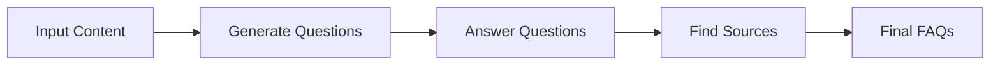
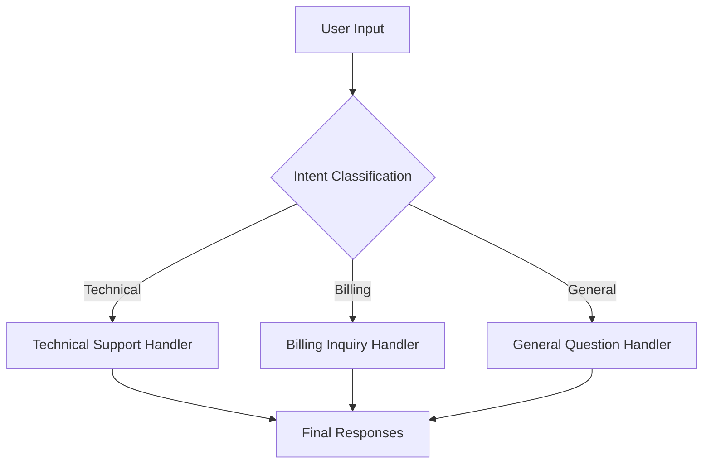
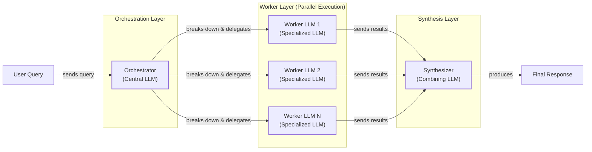

# Lesson 5: Basic Workflow Patterns

In the last lesson, we covered context engineering, the art of feeding the right information to an LLM. Before that, we explored the difference between rule-based LLM workflows and autonomous AI agents and laid the groundwork for AI Engineering. Now, we will tackle a fundamental challenge: getting structured and reliable information *out* of an LLM.

A single, complex prompt that tries to do everything at once is a common anti-pattern for production systems. It’s like asking a junior developer to build an entire application in one go without breaking it down. The result is often a mess—unreliable, hard to debug, and impossible to maintain. We have seen this firsthand. On a project, we tried to build a content generation pipeline with a single, massive prompt. The output was inconsistent, the error rate was high, and every time we needed to make a small change, we had to rewrite the entire thing.

The solution is modularity. Instead of one monolithic prompt, we build systems using a set of simple, interconnected patterns. These patterns are the foundational building blocks of AI engineering, allowing us to construct sophisticated applications that are reliable, maintainable, and scalable.

This lesson explores these fundamental patterns: chaining multiple LLM calls, running them in parallel, implementing conditional routing, and using the orchestrator-worker pattern. We will explain why breaking down complex tasks is more effective than relying on a single LLM call and show you how to build these workflows from scratch using Google Gemini.

## The Challenge with Complex Single LLM Calls

Trying to solve a complex, multi-step task with a single, large LLM call is a recipe for failure in production. While it might work for a quick demo, it creates a system that is brittle and difficult to manage.

The core issues with this monolithic approach are:
-   **Difficulty in Debugging:** When a single, large prompt fails, it is almost impossible to pinpoint the exact cause. The LLM’s reasoning is a black box, and you are left guessing which part of the instruction it misunderstood. A modular approach, however, allows you to isolate the failure to a specific, smaller step, making debugging much more manageable.
-   **Lack of Modularity and Maintainability:** A monolithic prompt is a single block of logic. If you need to update one part of the task, you risk breaking everything else. For example, changing the desired output format for one field might cause the model to hallucinate or ignore other instructions. This makes iterative improvement and maintenance a nightmare.
-   **The "Lost in the Middle" Problem:** LLMs pay more attention to information at the beginning and end of their context window. When you stuff a long, complex prompt with multiple instructions and a large amount of data, the information in the middle often gets ignored [[1]](https://dev.to/thousand_miles_ai/the-lost-in-the-middle-problem-why-llms-ignore-the-middle-of-your-context-window-3al2). This "lost-in-the-middle" effect is a well-documented architectural bias in transformers, leading to a significant drop in accuracy long before the context window limit is reached.
-   **Higher Token Consumption and Cost:** While it might seem counterintuitive, a single complex prompt can sometimes consume more tokens than a series of smaller, focused ones. The model may generate lengthy reasoning steps to try and unpack the complex instructions, leading to unnecessary token usage. In contrast, a well-designed chain uses smaller, more efficient prompts for each sub-task.
-   **Unreliable and Inconsistent Outputs:** The more instructions you pack into a single prompt, the higher the chance the model will misunderstand, forget, or simply ignore some of them. Research has shown that as the number of requirements in a prompt increases, model accuracy drops significantly [[2]](https://arxiv.org/html/2505.13360v1). This leads to outputs that are inconsistent and unreliable for production use.

To see this in practice, let's try to generate a Frequently Asked Questions (FAQ) section from a set of documents about renewable energy using a single, complex prompt.

1.  First, we set up our environment by initializing the Gemini client and defining our model. We will use `gemini-2.5-flash` for its speed and cost-effectiveness.
    ```python
    import asyncio
    from enum import Enum
    import random
    import time
    
    from pydantic import BaseModel, Field
    from google import genai
    from google.genai import types
    
    from lessons.utils import env, pretty_print
    
    env.load(required_env_vars=["GOOGLE_API_KEY"])
    
    client = genai.Client()
    
    MODEL_ID = "gemini-2.5-flash"
    ```
2.  Next, we define our mock source content. We have three simple webpages about solar energy, wind turbines, and energy storage.
    ```python
    webpage_1 = {
        "title": "The Benefits of Solar Energy",
        "content": """
        Solar energy is a renewable powerhouse...
        """,
    }
    
    webpage_2 = {
        "title": "Understanding Wind Turbines",
        "content": """
        Wind turbines are towering structures that capture kinetic energy...
        """,
    }
    
    webpage_3 = {
        "title": "Energy Storage Solutions",
        "content": """
        Effective energy storage is the key to unlocking the full potential...
        """,
    }
    
    all_sources = [webpage_1, webpage_2, webpage_3]
    
    combined_content = "\n\n".join(
        [f"Source Title: {source['title']}\nContent: {source['content']}" for source in all_sources]
    )
    ```
3.  Now, we create a complex prompt that asks the LLM to do three things at once: generate questions, provide answers, and cite the sources used.
    ```python
    class FAQ(BaseModel):
        """A FAQ is a question and answer pair, with a list of sources used to answer the question."""
        question: str = Field(description="The question to be answered")
        answer: str = Field(description="The answer to the question")
        sources: list[str] = Field(description="The sources used to answer the question")
    
    class FAQList(BaseModel):
        """A list of FAQs"""
        faqs: list[FAQ] = Field(description="A list of FAQs")

    n_questions = 10
    prompt_complex = f"""
    Based on the provided content from three webpages, generate a list of exactly {n_questions} frequently asked questions (FAQs).
    For each question, provide a concise answer derived ONLY from the text.
    After each answer, you MUST include a list of the 'Source Title's that were used to formulate that answer.
    
    <provided_content>
    {combined_content}
    </provided_content>
    """.strip()
    
    config = types.GenerateContentConfig(
        response_mime_type="application/json",
        response_schema=FAQList
    )
    response_complex = client.models.generate_content(
        model=MODEL_ID,
        contents=prompt_complex,
        config=config
    )
    result_complex = response_complex.parsed
    ```
    It outputs:
    ```text
    {
      "question": "Why is energy storage crucial for renewable energy sources like solar and wind?",
      "answer": "Effective energy storage is key to unlocking the full potential of renewable sources because it allows storing excess energy when plentiful and releasing it when needed, which is crucial for a stable power grid.",
      "sources": [
        "Energy Storage Solutions",
        "Understanding Wind Turbines"
      ]
    }
    ```
While the result seems reasonable, this approach is fragile. For instance, the model might correctly identify that an answer comes from two sources, as seen above. However, with slightly more complex content, it often misses one, citing only the most obvious source. The more instructions we add, the more likely it is that the model will fail to follow all of them perfectly. This unreliability makes the monolithic approach unsuitable for production.

## The Power of Modularity: Why Chain LLM Calls?

The solution to the unreliability of complex prompts is prompt chaining. This technique breaks down a large task into a sequence of smaller, more manageable sub-tasks. Each step in the chain is a separate LLM call with a simple, focused prompt. The output of one step becomes the input for the next, creating a workflow that is modular, transparent, and easier to control. This is the "divide-and-conquer" strategy applied to AI engineering [[3]](https://medium.com/@fabiolalli/a-practical-guide-to-prompt-engineering-techniques-and-their-use-cases-5f8574e2cd9a). This approach also aligns with fundamental software engineering practices: breaking down a system into components with clear responsibilities and well-defined interfaces allows for more robust, scalable, and maintainable applications [[5]](https://www.getmaxim.ai/articles/prompt-chaining-for-ai-engineers-a-practical-guide-to-improving-llm-output-quality/).

The benefits of this approach are significant:
-   **Improved Modularity and Maintainability:** Each step in the chain is an independent component that can be tested, versioned, and updated without affecting the rest of the system. This makes the entire workflow easier to maintain and improve over time. For example, AppFolio, a property management software company, uses LangGraph to manage complex workflows, which allows them to debug and monitor individual components, leading to a performance boost from 40% to 80% in their text-to-data features [[4]](https://www.zenml.io/blog/llmops-in-production-457-case-studies-of-what-actually-works).
-   **Enhanced Accuracy:** Simple, targeted prompts reduce the cognitive load on the LLM. Instead of trying to juggle multiple instructions at once, the model can focus on a single, well-defined task. This leads to more accurate and reliable outputs at each step, improving the quality of the final result.
-   **Easier Debugging:** When a chained workflow fails, you can trace the execution step-by-step to pinpoint exactly where the error occurred, boosting the transparency of the entire system [[6]](https://www.promptingguide.ai/techniques/prompt_chaining). This is far more effective than trying to debug a single, monolithic prompt. Companies like Acxiom leverage tools like LangSmith to gain visibility into multi-agent interactions, which helps them optimize token usage and debug complex workflows effectively [[7]](https://www.zenml.io/blog/llmops-in-production-287-more-case-studies-of-what-actually-works).
-   **Increased Flexibility and Optimization:** A modular design allows you to mix and match components. You can swap out one step for another or even use different models for different parts of the chain. For a simple classification task, you might use a fast, cheap model like Gemini Flash, while for a complex generation step, you could switch to a more powerful model like Gemini Pro. This flexibility allows you to optimize for cost, latency, and performance.

However, prompt chaining is not without its trade-offs. One of the main challenges is the risk of information loss between steps [[8]](https://futureagi.substack.com/p/how-tool-chaining-fails-in-production). If an early step in the chain produces a summary, for example, important details might be lost before they reach a later step. To mitigate this, it is essential to pass structured state objects between steps instead of raw text and keep chains as short as possible.

Another downside is the increased engineering overhead. Managing multiple prompts and the "glue code" that connects them can be more complex than writing a single prompt. This is where workflow orchestration libraries like LangGraph become useful, as they provide a framework for managing state and transitions in a more structured way. Finally, making multiple sequential API calls will naturally increase latency and cost compared to a single call.

Despite these challenges, the benefits of modularity, reliability, and debuggability make prompt chaining a fundamental pattern for building production-grade AI systems.

## Building a Sequential Workflow: FAQ Generation Pipeline

Let's put the theory into practice by refactoring our FAQ generation example into a three-step sequential workflow. Instead of one complex prompt, we will use three simple ones:
1.  **Generate Questions**: Takes the source content and generates a list of questions.
2.  **Answer Question**: Takes a single question and the source content to generate a concise answer.
3.  **Find Sources**: Takes a question-answer pair and identifies the source documents used.


Image 1: A flowchart illustrating the sequential FAQ generation pipeline.

This approach breaks the problem down, allowing each LLM call to focus on a single, well-defined task.

1.  First, we create a function to generate a list of questions from the provided content. This function is only responsible for creating relevant questions.
    ```python
    class QuestionList(BaseModel):
        """A list of questions"""
        questions: list[str] = Field(description="A list of questions")
    
    prompt_generate_questions = """
    Based on the content below, generate a list of {n_questions} relevant and distinct questions that a user might have.
    
    <provided_content>
    {combined_content}
    </provided_content>
    """.strip()
    
    def generate_questions(content: str, n_questions: int = 10) -> list[str]:
        """
        Generate a list of questions based on the provided content.
        """
        config = types.GenerateContentConfig(
            response_mime_type="application/json",
            response_schema=QuestionList
        )
        response_questions = client.models.generate_content(
            model=MODEL_ID,
            contents=prompt_generate_questions.format(n_questions=n_questions, combined_content=content),
            config=config
        )
    
        return response_questions.parsed.questions
    ```
    It outputs a list of questions:
    ```text
    ['What are the primary environmental and economic benefits of solar energy?', 'How do homeowners financially benefit from installing solar panels?', ...]
    ```
2.  Next, we define a function to answer a single question. This prompt is instructed to use *only* the provided content, which helps ground the model and reduce hallucinations.
    ```python
    prompt_answer_question = """
    Using ONLY the provided content below, answer the following question.
    The answer should be concise and directly address the question.
    
    <question>
    {question}
    </question>
    
    <provided_content>
    {combined_content}
    </provided_content>
    """.strip()
    
    def answer_question(question: str, content: str) -> str:
        """
        Generate an answer for a specific question using only the provided content.
        """
        answer_response = client.models.generate_content(
            model=MODEL_ID,
            contents=prompt_answer_question.format(question=question, combined_content=content),
        )
        return answer_response.text
    ```
3.  The third function in our chain is responsible for identifying the sources for a given question and answer. This separation makes the citation process more explicit and reliable.
    ```python
    class SourceList(BaseModel):
        """A list of source titles that were used to answer the question"""
        sources: list[str] = Field(description="A list of source titles that were used to answer the question")
    
    prompt_find_sources = """
    You will be given a question and an answer that was generated from a set of documents.
    Your task is to identify which of the original documents were used to create the answer.
    
    <question>
    {question}
    </question>
    
    <answer>
    {answer}
    </answer>
    
    <provided_content>
    {combined_content}
    </provided_content>
    """.strip()
    
    def find_sources(question: str, answer: str, content: str) -> list[str]:
        """
        Identify which sources were used to generate an answer.
        """
        config = types.GenerateContentConfig(
            response_mime_type="application/json",
            response_schema=SourceList
        )
        sources_response = client.models.generate_content(
            model=MODEL_ID,
            contents=prompt_find_sources.format(question=question, answer=answer, combined_content=content),
            config=config
        )
        return sources_response.parsed.sources
    ```
4.  Finally, we combine these functions into a sequential workflow. We first generate all the questions, then loop through each one to generate an answer and find its sources.
    ```python
    def sequential_workflow(content, n_questions=10) -> list[FAQ]:
        """
        Execute the complete sequential workflow for FAQ generation.
        """
        questions = generate_questions(content, n_questions)
    
        final_faqs = []
        for question in questions:
            answer = answer_question(question, content)
            sources = find_sources(question, answer, content)
    
            faq = FAQ(
                question=question,
                answer=answer,
                sources=sources
            )
            final_faqs.append(faq)
    
        return final_faqs
    
    start_time = time.monotonic()
    sequential_faqs = sequential_workflow(combined_content, n_questions=4)
    end_time = time.monotonic()
    print(f"Sequential processing completed in {end_time - start_time:.2f} seconds")
    ```
    It outputs:
    ```text
    Sequential processing completed in 22.20 seconds
    
    {
      "question": "What are the primary financial benefits of installing solar panels for homeowners, and are there any initial costs to consider?",
      "answer": "The primary financial benefits of installing solar panels for homeowners are significantly lowered monthly electricity bills and, in some cases, the ability to sell excess power back to the grid. The initial installation cost can be high.",
      "sources": [
        "The Benefits of Solar Energy"
      ]
    }
    ...
    ```
By breaking the task into a clear, three-step chain, we gain control and visibility. Each step is simple, focused, and produces a predictable output. While this sequential process took over 20 seconds for just four questions, the improvement in reliability is worth the trade-off in many applications. Next, we will see how to optimize this for speed.

## Optimizing Sequential Workflows With Parallel Processing

The sequential workflow improves reliability, but it can be slow. Since the processing of each question is independent of the others, we can run these tasks in parallel to significantly reduce the total execution time. This is a common optimization strategy for tasks that can be broken down into independent sub-problems. This pattern is analogous to the "Map-Reduce" paradigm in distributed computing, where a "map" step processes elements in parallel (answering each question) and a "reduce" step aggregates the results (collecting the FAQs). Research frameworks like SkyAPI are designed to orchestrate these kinds of parallel workflows in multi-agent systems [[9]](https://www.ideals.illinois.edu/items/139597/bitstreams/450749/data.pdf).

We will use Python's `asyncio` library to run the `answer_question` and `find_sources` calls concurrently for all generated questions. This allows us to overlap the I/O-bound waiting time for the API responses, leading to a much faster overall workflow.

1.  First, we need to create asynchronous versions of our `answer_question` and `find_sources` functions. The `google-genai` library provides an `aio` client for this purpose.
    ```python
    async def answer_question_async(question: str, content: str) -> str:
        """
        Async version of answer_question function.
        """
        prompt = prompt_answer_question.format(question=question, combined_content=content)
        response = await client.aio.models.generate_content(
            model=MODEL_ID,
            contents=prompt
        )
        return response.text
    
    async def find_sources_async(question: str, answer: str, content:str) -> list[str]:
        """
        Async version of find_sources function.
        """
        prompt = prompt_find_sources.format(question=question, answer=answer, combined_content=content)
        config = types.GenerateContentConfig(
            response_mime_type="application/json",
            response_schema=SourceList
        )
        response = await client.aio.models.generate_content(
            model=MODEL_ID,
            contents=prompt,
            config=config
        )
        return response.parsed.sources
    ```
2.  Next, we create a function that processes a single question by running its sub-steps in parallel. Inside `process_question_parallel`, we generate the answer and find the sources for a single question.
    ```python
    async def process_question_parallel(question: str, content: str) -> FAQ:
        """
        Process a single question by generating answer and finding sources in parallel.
        """
        answer = await answer_question_async(question, content)
        sources = await find_sources_async(question, answer, content)
        return FAQ(
            question=question,
            answer=answer,
            sources=sources
        )
    ```
3.  Finally, we define our parallel workflow. It starts by generating the questions synchronously, then uses `asyncio.gather` to execute `process_question_parallel` for all questions concurrently.
    ```python
    async def parallel_workflow(content: str, n_questions: int = 10) -> list[FAQ]:
        """
        Execute the complete parallel workflow for FAQ generation.
        """
        questions = generate_questions(content, n_questions)
    
        tasks = [process_question_parallel(question, content) for question in questions]
        parallel_faqs = await asyncio.gather(*tasks)
    
        return parallel_faqs
    
    start_time = time.monotonic()
    parallel_faqs = await parallel_workflow(combined_content, n_questions=4)
    end_time = time.monotonic()
    print(f"Parallel processing completed in {end_time - start_time:.2f} seconds")
    ```
    It outputs:
    ```text
    Parallel processing completed in 8.98 seconds
    
    {
      "question": "What are the primary environmental and economic benefits of using solar energy?",
      "answer": "The primary environmental benefit of solar energy is cutting down greenhouse gas emissions...",
      "sources": [
        "The Benefits of Solar Energy"
      ]
    }
    ...
    ```
The parallel workflow completed in just under 9 seconds, more than twice as fast as the sequential version. This demonstrates the power of parallelization for optimizing I/O-bound workflows.

However, running many parallel requests comes with a critical caveat: API rate limits. Most API providers, including Google, limit the number of requests per minute (RPM) and tokens per minute (TPM). If you exceed these limits, your requests will fail. In a production system, you must implement strategies like exponential backoff with jitter to handle rate limit errors gracefully, or use a request queue to smooth out bursts of traffic [[10]](https://tianpan.co/blog/2026-03-11-llm-api-resilience-production). While parallelization optimizes for speed, both sequential and parallel workflows follow a pre-defined structure. But what if the path needs to change based on the input?

## Introducing Dynamic Behavior: Routing and Conditional Logic

Sequential and parallel workflows are powerful, but they follow a fixed path. Many real-world applications require dynamic behavior, where the workflow adapts based on the input. This is where routing comes in. Routing uses conditional logic to direct an input down different paths, each with its own specialized prompts and tools.

This architecture mirrors patterns seen in event-driven microservices, where an event (the user query) is published and a router directs it to the appropriate consumer service (the specialized handler) based on its content [[11]](https://medium.com/@nemagan/event-driven-microservices-patterns-and-use-cases-1de0d9473fa1). The goal is the same: decouple components and allow them to evolve independently.

The core idea behind routing is to use an LLM as a classification step. The model analyzes the user's input to determine their intent and then "routes" the request to the appropriate handler. This is another application of the "divide-and-conquer" principle. Instead of a single, complex prompt that tries to handle every possible user query, you create a set of smaller, specialized prompts, each optimized for a specific intent. This approach is widely used in customer support systems to direct queries to the right department, such as technical support, billing, or general inquiries [[12]](https://www.decodingai.com/p/stop-building-ai-agents-use-these).

This pattern improves modularity and makes the system easier to maintain. When you need to update the logic for handling billing questions, you can modify the billing handler without touching the logic for technical support. It also enhances accuracy, as each prompt is fine-tuned for a single task.

## Building a Basic Routing Workflow

Let's build a simple routing workflow for a customer service chatbot. The system will first classify the user's intent and then route the query to a specialized handler.


Image 2: A flowchart illustrating a basic routing workflow for customer service.

1.  First, we define the possible intents and create a Pydantic model to structure the classification output. Using an `Enum` and Pydantic ensures that the classifier's output is always one of the expected values.
    ```python
    class IntentEnum(str, Enum):
        TECHNICAL_SUPPORT = "Technical Support"
        BILLING_INQUIRY = "Billing Inquiry"
        GENERAL_QUESTION = "General Question"
    
    class UserIntent(BaseModel):
        intent: IntentEnum = Field(description="The intent of the user's query")
    
    prompt_classification = """
    Classify the user's query into one of the following categories.
    
    <categories>
    {categories}
    </categories>
    
    <user_query>
    {user_query}
    </user_query>
    """.strip()
    
    
    def classify_intent(user_query: str) -> IntentEnum:
        """Uses an LLM to classify a user query."""
        prompt = prompt_classification.format(
            user_query=user_query,
            categories=[intent.value for intent in IntentEnum]
        )
        config = types.GenerateContentConfig(
            response_mime_type="application/json",
            response_schema=UserIntent
        )
        response = client.models.generate_content(
            model=MODEL_ID,
            contents=prompt,
            config=config
        )
        return response.parsed.intent
    ```
2.  Next, we define specialized prompts for each intent. Each prompt gives the LLM a specific persona and instructions for how to respond. A default or "catch-all" route is crucial for handling queries that do not fit neatly into any category.
    ```python
    prompt_technical_support = """
    You are a helpful technical support agent...
    Provide a helpful first response, asking for more details...
    """.strip()
    
    prompt_billing_inquiry = """
    You are a helpful billing support agent...
    Acknowledge their concern and inform them that you will need to look up their account...
    """.strip()
    
    prompt_general_question = """
    You are a general assistant...
    Apologize that you are not sure how to help.
    """.strip()
    ```
3.  The `handle_query` function acts as our router. It takes the user's query and the classified intent, then calls the appropriate handler.
    ```python
    def handle_query(user_query: str, intent: str) -> str:
        """Routes a query to the correct handler based on its classified intent."""
        if intent == IntentEnum.TECHNICAL_SUPPORT:
            prompt = prompt_technical_support.format(user_query=user_query)
        elif intent == IntentEnum.BILLING_INQUIRY:
            prompt = prompt_billing_inquiry.format(user_query=user_query)
        else:
            prompt = prompt_general_question.format(user_query=user_query)
        
        response = client.models.generate_content(
            model=MODEL_ID,
            contents=prompt
        )
        return response.text
    ```
4.  Let's test the complete workflow with a few different queries.
    ```python
    query_1 = "My internet connection is not working."
    intent_1 = classify_intent(query_1)
    response_1 = handle_query(query_1, intent_1)
    ```
    The query "My internet connection is not working" is classified as `Technical Support`, and the system provides a helpful first response:
    ```text
    Hello there! I'm sorry to hear you're having trouble with your internet connection... To help me understand what's going on... could you please provide a few more details?
    ```
    A query about an invoice is correctly routed to the billing handler, which asks for an account number. A general question is routed to the fallback handler. This simple routing pattern makes the system more robust and easier to extend.

In production, this pattern is often implemented using a dedicated routing layer. For example, the open-source library LiteLLM provides a router that can direct requests based on various strategies, including weighted load balancing across different models, prioritized fallbacks, and conditional routing based on request metadata. This allows for sophisticated traffic management, A/B testing, and cost control without hardcoding logic into the application itself [[13]](https://www.truefoundry.com/routing).

## Orchestrator-Worker Pattern: Dynamic Task Decomposition

The patterns we have seen so far—chaining, parallelization, and routing—are powerful, but they rely on pre-defined paths. The orchestrator-worker pattern takes this a step further by introducing dynamic task decomposition. In this workflow, a central "orchestrator" LLM analyzes a complex query and breaks it down into a series of sub-tasks at runtime. These sub-tasks are then delegated to specialized "worker" LLMs, which can execute in parallel [[14]](https://platform.claude.com/cookbook/patterns-agents-orchestrator-workers). The pattern is analogous to a manufacturing assembly line, where a project manager (the orchestrator) breaks down a complex product into smaller components and delegates the construction of each to a specialized workstation (the workers) [[15]](https://beam.ai/agentic-insights/multi-agent-orchestration-patterns-production).


Image 3: A flowchart illustrating the orchestrator-worker pattern with a user query, orchestrator, parallel worker LLMs, a synthesizer, and a final response.

The key advantage of this pattern is its flexibility. It excels at complex, unpredictable tasks where the exact steps cannot be determined in advance [[16]](https://agents.kour.me/orchestrator-worker/). For example, a request to "plan a trip to Paris" could involve dozens of potential sub-tasks, from booking flights to finding restaurants. An orchestrator can analyze the user's specific needs and generate a custom plan of action on the fly.

Let's build an orchestrator-worker system to handle a complex customer service query that involves multiple, distinct actions.

1.  First, we define the `orchestrator`. Its job is to parse a user's query and break it down into a list of structured tasks. We use Pydantic models to define the exact schema for these tasks, ensuring the orchestrator's output is predictable.
    ```python
    class QueryTypeEnum(str, Enum):
        BILLING_INQUIRY = "BillingInquiry"
        PRODUCT_RETURN = "ProductReturn"
        STATUS_UPDATE = "StatusUpdate"
    
    class Task(BaseModel):
        query_type: QueryTypeEnum
        invoice_number: str | None = None
        product_name: str | None = None
        reason_for_return: str | None = None
        order_id: str | None = None
    
    class TaskList(BaseModel):
        tasks: list[Task]
    
    prompt_orchestrator = f"""
    You are a master orchestrator... Your job is to break down a complex user query into a list of sub-tasks.
    Each sub-task must have a "query_type" and its necessary parameters...
    
    Here's the user's query:
    <user_query>
    {{query}}
    </user_query>
    """.strip()
    
    def orchestrator(query: str) -> list[Task]:
        """Breaks down a complex query into a list of tasks."""
        # ... LLM call with response_schema=TaskList
        pass
    ```
2.  Next, we implement our specialized workers. Each worker is a function designed to handle one specific `query_type`. For this example, we will simulate the backend actions, like looking up an order or generating a return authorization.
    ```python
    def handle_billing_worker(invoice_number: str, original_user_query: str) -> BillingTask:
        # ... uses an LLM to extract user's concern, simulates opening an investigation
        pass
    
    def handle_return_worker(product_name: str, reason_for_return: str) -> ReturnTask:
        # ... simulates generating an RMA number and return instructions
        pass
    
    def handle_status_worker(order_id: str) -> StatusTask:
        # ... simulates fetching order status from a backend
        pass
    ```
3.  After the workers have processed their tasks, a `synthesizer` LLM combines their structured outputs into a single, coherent, and user-friendly response.
    ```python
    prompt_synthesizer = """
    You are a master communicator. Combine several distinct pieces of information from our support team into a single, well-formatted, and friendly email to a customer.
    
    Here are the points to include...
    <points>
    {formatted_results}
    </points>
    
    Combine these points into one cohesive response.
    """.strip()
    
    def synthesizer(results: list[Task]) -> str:
        """Combines structured results from workers into a single user-facing message."""
        # ... formats worker results and calls the LLM
        pass
    ```
4.  Finally, we tie everything together in a main processing function. This function calls the orchestrator, dispatches tasks to the appropriate workers, and then uses the synthesizer to generate the final response.
    ```python
    def process_user_query(user_query):
        """Processes a query using the Orchestrator-Worker-Synthesizer pattern."""
        tasks_list = orchestrator(user_query)
    
        worker_results = []
        for task in tasks_list:
            if task.query_type == QueryTypeEnum.BILLING_INQUIRY:
                worker_results.append(handle_billing_worker(task.invoice_number, user_query))
            elif task.query_type == QueryTypeEnum.PRODUCT_RETURN:
                worker_results.append(handle_return_worker(task.product_name, task.reason_for_return))
            elif task.query_type == QueryTypeEnum.STATUS_UPDATE:
                worker_results.append(handle_status_worker(task.order_id))
    
        final_user_message = synthesizer(worker_results)
        pretty_print.wrapped(
            text=final_user_message,
            title="Final synthesized response"
        )
    
    complex_customer_query = """
    Hi, I'm writing to you because I have a question about invoice #INV-7890. It seems higher than I expected.
    Also, I would like to return the 'SuperWidget 5000' I bought because it's not compatible with my system.
    Finally, can you give me an update on my order #A-12345?
    """.strip()
    
    process_user_query(complex_customer_query)
    ```
    The orchestrator correctly identifies three separate tasks. Each task is then handled by the corresponding worker, and the synthesizer combines their outputs into a single, helpful email:
    ```text
    Dear Customer,
    
    Thank you for reaching out to us. Here is a summary of the actions we've taken regarding your query:
    
    Regarding your BillingInquiry:
      - Invoice Number: INV-7890
      - Your Stated Concern: "It seems higher than I expected."
      - Our Action: An investigation (Case ID: INV_CASE_5532) has been opened regarding your concern.
      - Expected Resolution: We will get back to you within 2 business days.
    
    Regarding your ProductReturn:
      - Product: SuperWidget 5000
      - Reason for Return: "it's not compatible with my system"
      - Return Authorization (RMA): RMA-68403
      - Instructions: Please pack the 'SuperWidget 5000' securely...
    
    Regarding your StatusUpdate:
      - Order ID: A-12345
      - Current Status: Shipped
      - Carrier: SuperFast Shipping
      - Tracking Number: SF252993
      - Delivery Estimate: Tomorrow
    
    We hope this information is helpful. Please let us know if you have any other questions.
    
    Best regards,
    The Support Team
    ```
This pattern provides a scalable and maintainable way to build complex, multi-step AI systems. The parallel execution of independent tasks can lead to speed improvements of 5 to 20 times compared to a purely sequential approach [[17]](https://online.stevens.edu/blog/building-self-healing-ai-orchestrator-reflexion-patterns/). At scale, this has a major business impact. For example, Wells Fargo uses this pattern to give thousands of bankers access to internal procedures, reducing query time from ten minutes to thirty seconds. The pattern also enables cost optimization by allowing the orchestrator to be a powerful model while delegating tasks to smaller, cheaper, specialized worker models [[15]](https://beam.ai/agentic-insights/multi-agent-orchestration-patterns-production).

However, this dynamic approach introduces new failure modes. The orchestrator can become a bottleneck, and ensuring it correctly decomposes every possible query is a significant prompt engineering task. Errors can compound in unexpected ways; a minor, transient error in a worker can trigger a "loop-of-loops," where each layer of the system retries independently, causing a single blip to result in dozens of unnecessary LLM calls [[18]](https://dev.to/gabrielanhaia/the-5-failure-modes-of-multi-agent-systems-nobody-warns-you-about-2fml). Research on orchestration frameworks like LangGraph has identified common issues like routing failures, where the LLM misclassifies an input, and decision ambiguity, where multiple paths seem valid [[19]](https://arxiv.org/html/2604.27891v1). To mitigate this non-determinism, production systems often use Finite State Machines (FSMs) as guardrails, enforcing a strict set of valid states and transitions that the probabilistic LLM cannot violate [[20]](https://online.stevens.edu/blog/building-self-healing-ai-orchestrator-reflexion-patterns/). Despite these complexities, the orchestrator-worker pattern is a powerful tool for building sophisticated and adaptable AI applications.

## Conclusion

We have explored the foundational patterns for building reliable LLM workflows. We started by understanding the limitations of monolithic prompts and saw how breaking down tasks into smaller, focused steps improves reliability and maintainability. We implemented a sequential workflow for FAQ generation, then optimized it for speed using parallel processing. Finally, we introduced dynamic behavior with routing and the orchestrator-worker pattern.

These patterns—chaining, parallelization, routing, and orchestration—are not just theoretical concepts; they are the essential building blocks for almost any production-grade AI system. They provide the control, modularity, and predictability needed to move beyond simple prototypes. As you continue your journey as an AI engineer, you will find yourself combining these patterns in creative ways to solve increasingly complex problems.

In our next lesson, we will build on this foundation by giving our workflows the ability to interact with the outside world. We will dive into agent tools and function calling, learning how to empower LLMs to take action and affect their environment.

## References

- [1] https://dev.to/thousand_miles_ai/the-lost-in-the-middle-problem-why-llms-ignore-the-middle-of-your-context-window-3al2
- [2] https://arxiv.org/html/2505.13360v1
- [3] https://medium.com/@fabiolalli/a-practical-guide-to-prompt-engineering-techniques-and-their-use-cases-5f8574e2cd9a
- [4] https://www.zenml.io/blog/llmops-in-production-457-case-studies-of-what-actually-works
- [5] https://www.getmaxim.ai/articles/prompt-chaining-for-ai-engineers-a-practical-guide-to-improving-llm-output-quality/
- [6] https://www.promptingguide.ai/techniques/prompt_chaining
- [7] https://www.zenml.io/blog/llmops-in-production-287-more-case-studies-of-what-actually-works
- [8] https://futureagi.substack.com/p/how-tool-chaining-fails-in-production
- [9] https://www.ideals.illinois.edu/items/139597/bitstreams/450749/data.pdf
- [10] https://tianpan.co/blog/2026-03-11-llm-api-resilience-production
- [11] https://medium.com/@nemagan/event-driven-microservices-patterns-and-use-cases-1de0d9473fa1
- [12] https://www.decodingai.com/p/stop-building-ai-agents-use-these
- [13] https://www.truefoundry.com/routing
- [14] https://platform.claude.com/cookbook/patterns-agents-orchestrator-workers
- [15] https://beam.ai/agentic-insights/multi-agent-orchestration-patterns-production
- [16] https://agents.kour.me/orchestrator-worker/
- [17] https://online.stevens.edu/blog/building-self-healing-ai-orchestrator-reflexion-patterns/
- [18] https://dev.to/gabrielanhaia/the-5-failure-modes-of-multi-agent-systems-nobody-warns-you-about-2fml
- [19] https://arxiv.org/html/2604.27891v1
- [20] https://online.stevens.edu/blog/building-self-healing-ai-orchestrator-reflexion-patterns/