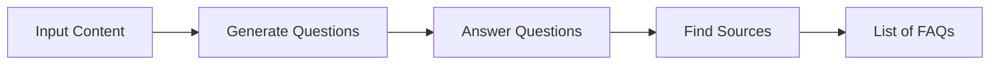
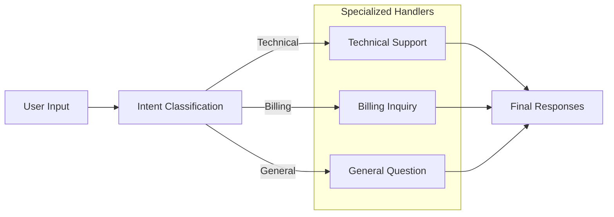
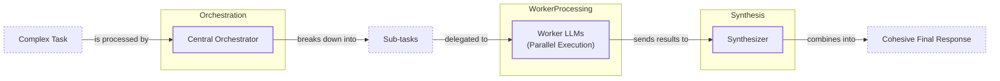

# Lesson 5: Basic Workflow Patterns

In our previous lessons, we laid the groundwork for AI Engineering. We explored the agent landscape, differentiated between rule-based LLM workflows and autonomous AI agents, and covered context engineering. In this lesson, we will tackle a fundamental challenge: building reliable, multi-step applications.

I remember one of our first major projects: an AI assistant designed to generate comprehensive research reports. Our initial approach was to build a single, massive prompt. We fed it a complex set of instructions, a dozen source documents, and a detailed output schema, expecting a perfect report. The first iteration worked—it could generate articles. But it was slow, expensive, and the user experience was poor. The model would often get confused, miss key details buried in the middle of the context, or fail to follow the formatting instructions precisely. Debugging was a nightmare.

This experience taught us a critical lesson: monolithic prompts are a recipe for unreliable systems. The solution was to break the problem down. Instead of one giant leap, we took a series of small, deliberate steps. This is the core idea behind LLM workflows.

We will explore the foundational components for building these workflows: chaining, parallelization, routing, and the orchestrator-worker pattern. We will explain why breaking down complex tasks is often more effective than relying on a single, large LLM call. Practical demonstrations will show you how to build these workflows from scratch using the Google Gemini library.

By the end of this lesson, you will understand:
- The problems with complex, single-prompt LLM calls.
- How to build sequential workflows by chaining simple prompts.
- How to speed up workflows with parallel processing.
- How to implement dynamic routing for conditional logic.
- How to use the orchestrator-worker pattern for dynamic task decomposition.

## The Challenge with Complex Single LLM Calls

When you first start building with LLMs, it’s tempting to solve complex problems with a single, massive prompt. You describe the entire task, provide all the context, and hope the model figures it out. This approach, however, is brittle and fails to scale in production for several reasons.

One of the most significant issues is the "lost-in-the-middle" problem. Research from Stanford and UC Berkeley has shown that LLMs exhibit a U-shaped performance curve when processing long contexts. They pay the most attention to information at the beginning and end of the prompt, while details in the middle are often overlooked [[2]](https://dev.to/thousand_miles_ai/the-lost-in-the-middle-problem-why-llms-ignore-the-middle-of-your-context-window-3al2). This isn't just a random quirk; it's a structural bias baked into the transformer architecture. Causal attention masking means early tokens get more cumulative attention, while positional encoding decay creates a "dead zone" for middle tokens, making them less likely to influence the final output. As context windows grow, this problem can get worse, not better, because there is more "middle" for information to get lost in.

Monolithic prompts are also highly sensitive to minor changes. Studies have shown that slight variations in prompt wording or even the format of examples can cause accuracy to plummet. For instance, one study found that simply changing the format of few-shot examples in a classification task increased the error rate by nearly 40 times due to parsing failures [[3]](https://aclanthology.org/2025.ommm-1.4.pdf). Another benchmark showed that minor reformats in a multi-problem prompt led to a 32% drop in accuracy [[4]](https://aclanthology.org/2025.gem-1.14.pdf). This brittleness makes it difficult to build reproducible and reliable systems.

Furthermore, as you add more requirements to a single prompt, the model's ability to follow instructions degrades. Research on prompt underspecification shows a clear drop in accuracy as the number of constraints increases. For GPT-4o, accuracy fell from 98.7% with one requirement to 85% with nineteen requirements [[5]](https://arxiv.org/html/2505.13360v1). This is because the model struggles to handle conflicting or complex instructions, often ignoring some to satisfy others. This also leads to token inefficiency. While it might seem like a single call is cheaper, a long, complex prompt often requires the model to do more "thinking" and can be less token-efficient than a series of shorter, focused calls. Requirement-aware optimizers have been shown to reduce token usage by up to 43% compared to unoptimized complex prompts [[5]](https://arxiv.org/html/2505.13360v1).

Finally, trying to cram too many instructions into one prompt makes debugging a nightmare. If the output is wrong, where did it fail? Was it the reasoning? The formatting? The source attribution? With a single prompt, it's nearly impossible to isolate the point of failure. This lack of modularity means a small change to one instruction can have unpredictable effects on the entire output, making the system difficult to maintain and improve.

Let's look at a practical example. Our goal is to generate a Frequently Asked Questions (FAQ) page from a few documents about renewable energy.

1.  First, we set up our environment by initializing the Gemini client and defining our model. We will use `gemini-2.5-flash`, which is fast and cost-effective for these tasks.
    ```python
    import asyncio
    from enum import Enum
    import random
    import time
    
    from pydantic import BaseModel, Field
    from google import genai
    from google.genai import types
    
    from lessons.utils import env, pretty_print
    
    env.load(required_env_vars=["GOOGLE_API_KEY"])
    
    client = genai.Client()
    
    MODEL_ID = "gemini-2.5-flash"
    ```
2.  Next, we define our source documents.
    ```python
    webpage_1 = {
        "title": "The Benefits of Solar Energy",
        "content": """
        Solar energy is a renewable powerhouse, offering numerous environmental and economic benefits.
        By converting sunlight into electricity through photovoltaic (PV) panels, it reduces reliance on fossil fuels,
        thereby cutting down greenhouse gas emissions. Homeowners who install solar panels can significantly
        lower their monthly electricity bills, and in some cases, sell excess power back to the grid.
        While the initial installation cost can be high, government incentives and long-term savings make
        it a financially viable option for many. Solar power is also a key component in achieving energy
        independence for nations worldwide.
        """,
    }
    
    webpage_2 = {
        "title": "Understanding Wind Turbines",
        "content": """
        Wind turbines are towering structures that capture kinetic energy from the wind and convert it into
        electrical power. They are a critical part of the global shift towards sustainable energy.
        Turbines can be installed both onshore and offshore, with offshore wind farms generally producing more
        consistent power due to stronger, more reliable winds. The main challenge for wind energy is its
        intermittency—it only generates power when the wind blows. This necessitates the use of energy
        storage solutions, like large-scale batteries, to ensure a steady supply of electricity.
        """,
    }
    
    webpage_3 = {
        "title": "Energy Storage Solutions",
        "content": """
        Effective energy storage is the key to unlocking the full potential of renewable sources like solar
        and wind. Because these sources are intermittent, storing excess energy when it's plentiful and
        releasing it when it's needed is crucial for a stable power grid. The most common form of
        large-scale storage is pumped-hydro storage, but battery technologies, particularly lithium-ion,
        are rapidly becoming more affordable and widespread. These batteries can be used in homes, businesses,
        and at the utility scale to balance energy supply and demand, making our energy system more
        resilient and reliable.
        """,
    }
    
    all_sources = [webpage_1, webpage_2, webpage_3]
    
    combined_content = "\n\n".join(
        [f"Source Title: {source['title']}\nContent: {source['content']}" for source in all_sources]
    )
    ```
3.  Now, we create a complex prompt that asks the model to generate questions, find answers, and cite sources all at once. We also define Pydantic models to ask for a structured JSON output, a technique we covered in Lesson 4.
    ```python
    # Pydantic classes for structured outputs
    class FAQ(BaseModel):
        """A FAQ is a question and answer pair, with a list of sources used to answer the question."""
        question: str = Field(description="The question to be answered")
        answer: str = Field(description="The answer to the question")
        sources: list[str] = Field(description="The sources used to answer the question")
    
    class FAQList(BaseModel):
        """A list of FAQs"""
        faqs: list[FAQ] = Field(description="A list of FAQs")
    
    n_questions = 10
    prompt_complex = f"""
    Based on the provided content from three webpages, generate a list of exactly {n_questions} frequently asked questions (FAQs).
    For each question, provide a concise answer derived ONLY from the text.
    After each answer, you MUST include a list of the 'Source Title's that were used to formulate that answer.
    
    <provided_content>
    {combined_content}
    </provided_content>
    """.strip()
    
    # Generate FAQs
    config = types.GenerateContentConfig(
        response_mime_type="application/json",
        response_schema=FAQList
    )
    response_complex = client.models.generate_content(
        model=MODEL_ID,
        contents=prompt_complex,
        config=config
    )
    result_complex = response_complex.parsed
    ```
    It outputs:
    ```json
    [
      {
        "question": "What is solar energy and how does it work?",
        "answer": "Solar energy is a renewable powerhouse that converts sunlight into electricity through photovoltaic (PV) panels.",
        "sources": [
          "The Benefits of Solar Energy"
        ]
      },
      {
        "question": "What are the environmental benefits of using solar energy?",
        "answer": "Solar energy reduces reliance on fossil fuels, thereby cutting down greenhouse gas emissions.",
        "sources": [
          "The Benefits of Solar Energy"
        ]
      }
    ]
    ```

While the output might look acceptable, this approach is fragile. The more complex the instructions, the more likely the model is to make mistakes, such as hallucinating sources or generating answers that blend information incorrectly. For example, the model might cite only a single source even when the answer is synthesized from multiple documents. This is a real-world failure mode that makes monolithic prompts a risky choice for production systems [[1]](https://www.mdpi.com/2079-9292/13/23/4712).

## The Power of Modularity: Why Chain LLM Calls?

Instead of relying on a single, complex prompt, we can break down the task into a series of smaller, more focused steps. This technique is known as prompt chaining. It's a "divide-and-conquer" strategy where the output of one LLM call becomes the input for the next, creating a sequential workflow [[10]](https://www.promptingguide.ai/techniques/prompt_chaining), [[11]](https://docs.anthropic.com/en/docs/build-with-claude/prompt-engineering/chain-prompts).

This modular approach offers several key advantages over monolithic prompts.

First, it improves accuracy and reliability. By giving the LLM a single, well-defined task at each step, you reduce its cognitive load. A prompt that only asks to generate questions is much simpler for the model to execute correctly than a prompt that asks it to generate questions, find answers, and cite sources simultaneously. This focus leads to more consistent and higher-quality outputs at each stage of the workflow [[12]](https://www.decodingai.com/p/stop-building-ai-agents-use-these). Research has shown that simpler, direct prompt structures are more effective for knowledge retrieval, minimizing the risk of misinterpretation that can occur with complex, multi-part instructions [[18]](https://www.mdpi.com/2079-9292/13/23/4712).

Second, modularity makes your system easier to debug, maintain, and test. When a chained workflow fails, you can pinpoint exactly which step caused the error. This isolation allows you to fix or optimize individual components without affecting the rest of the system. You can version prompts for each step independently and reuse them across different workflows. You can even use different models for different steps—for instance, a fast, cheap model for a simple classification task and a more powerful, expensive model for complex content generation [[12]](https://www.decodingai.com/p/stop-building-ai-agents-use-these). This modularity is also a key defense against compounding errors. In a monolithic prompt, a small error in an early reasoning step can derail the entire process. With a chained workflow, you can validate the output at each step, preventing errors from propagating downstream [[19]](https://tomtunguz.com/compounding-error-llms/). In fact, formal analysis shows that for any agent with an error rate above zero, the reliability of a sequential chain degrades exponentially with its length. This makes short, verifiable chains a fundamental design constraint for building robust systems [[20]](https://www.zartis.com/multi-agent-system-failure-modes-in-production-the-distributed-systems-problem/).

However, chaining is not without its trade-offs. It introduces a higher engineering overhead, as you need to write "glue code" to connect the different steps. This can be managed with workflow orchestration libraries like LangGraph, but it adds a layer of complexity compared to a single API call. It can also increase latency and cost, since you are making multiple API calls instead of one. Furthermore, there is a risk of information loss between steps. For example, if an early step summarizes a document, crucial details might be lost before a later step attempts to translate that summary [[10]](https://www.promptingguide.ai/techniques/prompt_chaining), [[13]](https://futureagi.substack.com/p/how-tool-chaining-fails-in-production). Mitigating this requires careful prompt design and state management, often using structured state objects instead of raw text to pass data between calls [[13]](https://futureagi.substack.com/p/how-tool-chaining-fails-in-production). Sometimes, instructions only make sense together and lose their meaning when split apart, requiring careful thought about how to decompose the task.

Despite these challenges, the benefits of reliability and maintainability often outweigh the drawbacks, making chaining a foundational pattern for production-grade AI applications.

## Building a Sequential Workflow: FAQ Generation Pipeline

Let's refactor our FAQ generation task into a three-step sequential workflow. This approach will give us more control and produce more reliable results. The pipeline will consist of three distinct stages:
1.  Generate a list of questions from the source content.
2.  For each question, generate a concise answer.
3.  For each question-answer pair, identify the sources used.

Image 1: A sequential FAQ generation pipeline showing the flow from input content to a list of FAQs.


This process mirrors how a human would approach the task: first, figure out what to ask, then find the answers, and finally, note down the sources. Let's implement each step.

1.  First, we create a function to generate a list of questions. This prompt focuses only on question generation, making the task clear and specific for the LLM. We use a Pydantic model `QuestionList` to ensure the output is a structured list of strings.
    ```python
    class QuestionList(BaseModel):
        """A list of questions"""
        questions: list[str] = Field(description="A list of questions")
    
    prompt_generate_questions = """
    Based on the content below, generate a list of {n_questions} relevant and distinct questions that a user might have.
    
    <provided_content>
    {combined_content}
    </provided_content>
    """.strip()
    
    def generate_questions(content: str, n_questions: int = 10) -> list[str]:
        """
        Generate a list of questions based on the provided content.
    
        Args:
            content: The combined content from all sources
    
        Returns:
            list: A list of generated questions
        """
        config = types.GenerateContentConfig(
            response_mime_type="application/json",
            response_schema=QuestionList
        )
        response_questions = client.models.generate_content(
            model=MODEL_ID,
            contents=prompt_generate_questions.format(n_questions=n_questions, combined_content=content),
            config=config
        )
    
        return response_questions.parsed.questions
    
    # Test the question generation function
    questions = generate_questions(combined_content, n_questions=10)
    ```
    It outputs:
    ```text
    ['What are the primary environmental and economic benefits of solar energy?', 'How do homeowners financially benefit from installing solar panels?', 'What is the main process by which wind turbines generate electricity?', 'What is the primary challenge of wind energy, and how is it addressed?', 'Why is effective energy storage crucial for renewable energy sources like solar and wind?', 'What are some common large-scale energy storage methods mentioned?', 'Are there government incentives available for solar panel installation?', 'What is the difference in power consistency between onshore and offshore wind farms?', 'How do energy storage solutions make the energy system more resilient and reliable?', 'Can excess solar power generated by homeowners be sold back to the grid?']
    ```

2.  Next, we define a function to answer a single question. This prompt instructs the model to use only the provided content, which helps ground the answer and reduce hallucinations.
    ```python
    prompt_answer_question = """
    Using ONLY the provided content below, answer the following question.
    The answer should be concise and directly address the question.
    
    <question>
    {question}
    </question>
    
    <provided_content>
    {combined_content}
    </provided_content>
    """.strip()
    
    def answer_question(question: str, content: str) -> str:
        """
        Generate an answer for a specific question using only the provided content.
    
        Args:
            question: The question to answer
            content: The combined content from all sources
    
        Returns:
            str: The generated answer
        """
        answer_response = client.models.generate_content(
            model=MODEL_ID,
            contents=prompt_answer_question.format(question=question, combined_content=content),
        )
        return answer_response.text
    
    # Test the answer generation function
    test_question = questions[0]
    test_answer = answer_question(test_question, combined_content)
    ```
    For the question "What are the primary environmental and economic benefits of solar energy?", it outputs:
    ```text
    The primary environmental benefit of solar energy is cutting down greenhouse gas emissions by reducing reliance on fossil fuels. Economically, it allows homeowners to significantly lower their monthly electricity bills and potentially sell excess power back to the grid.
    ```

3.  Third, we create a function to find the sources for a given question and answer. This step acts as a verification layer, ensuring that our answers are traceable back to the original documents.
    ```python
    class SourceList(BaseModel):
        """A list of source titles that were used to answer the question"""
        sources: list[str] = Field(description="A list of source titles that were used to answer the question")
    
    prompt_find_sources = """
    You will be given a question and an answer that was generated from a set of documents.
    Your task is to identify which of the original documents were used to create the answer.
    
    <question>
    {question}
    </question>
    
    <answer>
    {answer}
    </answer>
    
    <provided_content>
    {combined_content}
    </provided_content>
    """.strip()
    
    def find_sources(question: str, answer: str, content: str) -> list[str]:
        """
        Identify which sources were used to generate an answer.
    
        Args:
            question: The original question
            answer: The generated answer
            content: The combined content from all sources
    
        Returns:
            list: A list of source titles that were used
        """
        config = types.GenerateContentConfig(
            response_mime_type="application/json",
            response_schema=SourceList
        )
        sources_response = client.models.generate_content(
            model=MODEL_ID,
            contents=prompt_find_sources.format(question=question, answer=answer, combined_content=content),
            config=config
        )
        return sources_response.parsed.sources
    
    # Test the source finding function
    test_sources = find_sources(test_question, test_answer, combined_content)
    ```
    It correctly identifies the source:
    ```text
    ['The Benefits of Solar Energy']
    ```

4.  Finally, we combine these functions into a sequential workflow. We iterate through the generated questions, answering each one and finding its sources before moving to the next.
    ```python
    def sequential_workflow(content, n_questions=10) -> list[FAQ]:
        """
        Execute the complete sequential workflow for FAQ generation.
    
        Args:
            content: The combined content from all sources
    
        Returns:
            list: A list of FAQs with questions, answers, and sources
        """
        # Generate questions
        questions = generate_questions(content, n_questions)
    
        # Answer and find sources for each question sequentially
        final_faqs = []
        for question in questions:
            # Generate an answer for the current question
            answer = answer_question(question, content)
    
            # Identify the sources for the generated answer
            sources = find_sources(question, answer, content)
    
            faq = FAQ(
                question=question,
                answer=answer,
                sources=sources
            )
            final_faqs.append(faq)
    
        return final_faqs
    
    # Execute the sequential workflow (measure time for comparison)
    start_time = time.monotonic()
    sequential_faqs = sequential_workflow(combined_content, n_questions=4)
    end_time = time.monotonic()
    print(f"Sequential processing completed in {end_time - start_time:.2f} seconds")
    ```
    It outputs:
    ```text
    Sequential processing completed in 22.20 seconds
    ```
    The final result is a structured list of FAQs, where each entry is generated and verified through a clear, traceable process. This modular approach is far more robust than our initial monolithic prompt.

## Optimizing Sequential Workflows With Parallel Processing

The sequential workflow improves reliability, but it can be slow. Each step in the chain for each question runs one after another, leading to a total execution time that is the sum of all individual calls. For our example with four questions, it took over 20 seconds. If we had 20 questions, this could take minutes.

We can significantly speed this up by parallelizing the independent steps. In our FAQ pipeline, once the questions are generated, the process of answering and finding sources for each question is independent of the others. We can process all of them concurrently. This pattern is highly effective for I/O-bound tasks like LLM API calls, where the program spends most of its time waiting for a network response [[26]](https://santhalakshminarayana.github.io/blog/concurrency-patterns-python).

To implement this, we will use Python's `asyncio` library for asynchronous programming. This allows us to make multiple API calls at the same time and wait for them all to complete, rather than waiting for each one individually. While we use `asyncio` here, production systems often use higher-level orchestration frameworks. For example, LangGraph provides a graph-based state machine that simplifies building complex, stateful workflows with branching and looping, offering more control than raw `asyncio` for agentic systems [[28]](https://langchain-ai.github.io/langgraphjs/tutorials/workflows).

1.  First, we create asynchronous versions of our `answer_question` and `find_sources` functions using the `client.aio` module.
    ```python
    async def answer_question_async(question: str, content: str) -> str:
        """
        Async version of answer_question function.
        """
        prompt = prompt_answer_question.format(question=question, combined_content=content)
        response = await client.aio.models.generate_content(
            model=MODEL_ID,
            contents=prompt
        )
        return response.text
    
    async def find_sources_async(question: str, answer: str, content: str) -> list[str]:
        """
        Async version of find_sources function.
        """
        prompt = prompt_find_sources.format(question=question, answer=answer, combined_content=content)
        config = types.GenerateContentConfig(
            response_mime_type="application/json",
            response_schema=SourceList
        )
        response = await client.aio.models.generate_content(
            model=MODEL_ID,
            contents=prompt,
            config=config
        )
        return response.parsed.sources
    ```

2.  Next, we define a function that processes a single question by calling the answer and source-finding functions. Notice that we are still chaining these two calls, but we will run this function in parallel for each question.
    ```python
    async def process_question_parallel(question: str, content: str) -> FAQ:
        """
        Process a single question by generating answer and finding sources in parallel.
        """
        answer = await answer_question_async(question, content)
        sources = await find_sources_async(question, answer, content)
        return FAQ(
            question=question,
            answer=answer,
            sources=sources
        )
    ```

3.  Finally, we create our parallel workflow. It first generates the questions synchronously, then uses `asyncio.gather` to execute `process_question_parallel` for all questions concurrently.
    ```python
    async def parallel_workflow(content: str, n_questions: int = 10) -> list[FAQ]:
        """
        Execute the complete parallel workflow for FAQ generation.
    
        Args:
            content: The combined content from all sources
    
        Returns:
            list: A list of FAQs with questions, answers, and sources
        """
        # Generate questions (this step remains synchronous)
        questions = generate_questions(content, n_questions)
    
        # Process all questions in parallel
        tasks = [process_question_parallel(question, content) for question in questions]
        parallel_faqs = await asyncio.gather(*tasks)
    
        return parallel_faqs
    
    # Execute the parallel workflow (measure time for comparison)
    start_time = time.monotonic()
    parallel_faqs = await parallel_workflow(combined_content, n_questions=4)
    end_time = time.monotonic()
    print(f"Parallel processing completed in {end_time - start_time:.2f} seconds")
    ```
    It outputs:
    ```text
    Parallel processing completed in 8.98 seconds
    ```

The parallel workflow completed in just under 9 seconds—more than twice as fast as the sequential version. This demonstrates the power of parallelization for optimizing I/O-bound tasks.

However, a critical consideration in production is API rate limiting. Sending too many requests at once can trigger `429 RESOURCE_EXHAUSTED` errors [[8]](https://stackoverflow.com/questions/79924021/429-on-vertex-ai-api-how-to-send-5-20-parallel-gemini-api-requests-without-hitt). Real-world systems must implement a hierarchy of resilience patterns borrowed from microservices architecture. This includes setting explicit timeouts (e.g., 30-60 seconds) for each API call and using retries with **exponential backoff and full jitter**. Jitter adds a random delay to retries, preventing a "thundering herd" of clients from retrying simultaneously and overwhelming the API again [[9]](https://tianpan.co/blog/2026-03-11-llm-api-resilience-production). For more advanced control, you can implement a client-side token bucket algorithm to smooth out bursty traffic or use a request queue with a system like Redis or Kafka. Finally, deploying circuit breakers that automatically halt requests to a temporarily failing endpoint can prevent system-wide slowdowns [[9]](https://tianpan.co/blog/2026-03-11-llm-api-resilience-production), [[21]](https://gurusup.com/blog/multi-agent-orchestration-guide).

## Introducing Dynamic Behavior: Routing and Conditional Logic

Sequential and parallel workflows are powerful, but they follow a fixed path. Every input goes through the same set of steps. In many applications, we need dynamic behavior where the workflow adapts based on the input. This is where routing comes in.

Routing uses conditional logic to direct an input down a specific path. A common pattern is to use an initial LLM call as a classifier to determine the user's intent. Based on that intent, the workflow then routes the request to a specialized handler or a different sub-workflow [[14]](https://www.vellum.ai/blog/how-to-build-intent-detection-for-your-chatbot). This is essential in scenarios where a fixed workflow would fail, such as a customer support bot that must handle queries about billing, technical issues, and product information. A single, rigid workflow cannot effectively address such diverse needs.

This is another application of the "divide-and-conquer" principle. Instead of creating one massive, complex prompt that tries to handle every possible user query, we create multiple smaller, specialized prompts. Each prompt is optimized for a single task, such as handling a billing inquiry or a technical support question. This separation of concerns makes the system more modular, accurate, and easier to maintain [[12]](https://www.decodingai.com/p/stop-building-ai-agents-use-these). The prompt engineering for the classification step is critical; it requires a clear taxonomy of intents, few-shot examples for each, and negative examples to handle ambiguity [[14]](https://www.vellum.ai/blog/how-to-build-intent-detection-for-your-chatbot).

This approach is grounded in principles from cognitive science. According to Cognitive Load Theory, a monolithic prompt that handles many different cases creates a high "extraneous load," forcing the model to waste effort interpreting the user's true intent. By routing to a specialized prompt, you reduce this extraneous load, allowing the model to dedicate its resources to the core task [[22]](https://lemonlearning.com/blog/cognitive-load-theory-types-and-principles-for-reduction). This is analogous to modern data engineering, where ETL pipelines often route jobs to different specialized models or services based on cost, capability, and performance requirements [[23]](https://www.cloverdx.com/blog/using-llms-in-etl-pipelines-production-scale-best-practices).

## Building a Basic Routing Workflow

Let's build a simple routing workflow for a customer service system. The system will first classify a user's query into one of three intents: "Technical Support," "Billing Inquiry," or "General Question." Then, it will route the query to a specialized handler that provides an appropriate response.

Image 2: A routing workflow for customer service, showing user input, intent classification, specialized handlers, and final responses.


Designing the classification step is the most critical part. You need to create a clear and comprehensive taxonomy of intents based on real user interactions and FAQs. For each intent, provide high-quality, representative examples, especially for edge cases, to guide the LLM. A robust design also includes a fallback or "Other" category to gracefully handle queries that do not fit any predefined intent [[14]](https://www.vellum.ai/blog/how-to-build-intent-detection-for-your-chatbot). For more complex systems, a two-stage architecture can improve precision. An initial, cheaper model or a semantic search can retrieve a few candidate intents, and a second, more powerful LLM can then make the final selection.

1.  First, we define our intents and create a classification function. We use Pydantic and an `Enum` to ensure the model's output is constrained to one of our predefined categories.
    ```python
    class IntentEnum(str, Enum):
        """
        Defines the allowed values for the 'intent' field.
        Inheriting from 'str' ensures that the values are treated as strings.
        """
        TECHNICAL_SUPPORT = "Technical Support"
        BILLING_INQUIRY = "Billing Inquiry"
        GENERAL_QUESTION = "General Question"
    
    class UserIntent(BaseModel):
        """
        Defines the expected response schema for the intent classification.
        """
        intent: IntentEnum = Field(description="The intent of the user's query")
    
    prompt_classification = """
    Classify the user's query into one of the following categories.
    
    <categories>
    {categories}
    </categories>
    
    <user_query>
    {user_query}
    </user_query>
    """.strip()
    
    
    def classify_intent(user_query: str) -> IntentEnum:
        """Uses an LLM to classify a user query."""
        prompt = prompt_classification.format(
            user_query=user_query,
            categories=[intent.value for intent in IntentEnum]
        )
        config = types.GenerateContentConfig(
            response_mime_type="application/json",
            response_schema=UserIntent
        )
        response = client.models.generate_content(
            model=MODEL_ID,
            contents=prompt,
            config=config
        )
        return response.parsed.intent
    
    # Example queries
    query_1 = "My internet connection is not working."
    intent_1 = classify_intent(query_1)
    ```
    For the query "My internet connection is not working.", the model correctly classifies the intent as `TECHNICAL_SUPPORT`.

2.  Next, we define specialized prompts for each intent. Each prompt gives the LLM a specific persona and instructions for how to respond.
    ```python
    prompt_technical_support = """
    You are a helpful technical support agent.
    
    Here's the user's query:
    <user_query>
    {user_query}
    </user_query>
    
    Provide a helpful first response, asking for more details like what troubleshooting steps they have already tried.
    """.strip()
    
    prompt_billing_inquiry = """
    You are a helpful billing support agent.
    
    Here's the user's query:
    <user_query>
    {user_query}
    </user_query>
    
    Acknowledge their concern and inform them that you will need to look up their account, asking for their account number.
    """.strip()
    
    prompt_general_question = """
    You are a general assistant.
    
    Here's the user's query:
    <user_query>
    {user_query}
    </user_query>
    
    Apologize that you are not sure how to help.
    """.strip()
    ```

3.  Finally, we create a `handle_query` function that acts as our router. It takes the user's query and the classified intent, and then calls the appropriate LLM with the specialized prompt.
    ```python
    def handle_query(user_query: str, intent: str) -> str:
        """Routes a query to the correct handler based on its classified intent."""
        if intent == IntentEnum.TECHNICAL_SUPPORT:
            prompt = prompt_technical_support.format(user_query=user_query)
        elif intent == IntentEnum.BILLING_INQUIRY:
            prompt = prompt_billing_inquiry.format(user_query=user_query)
        else: # Default to general question
            prompt = prompt_general_question.format(user_query=user_query)
        
        response = client.models.generate_content(
            model=MODEL_ID,
            contents=prompt
        )
        return response.text
    
    # Get the response
    response_1 = handle_query(query_1, intent_1)
    ```
    It outputs:
    ```text
    Hello there! I'm sorry to hear you're having trouble with your internet connection. That can definitely be frustrating.
    
    To help me understand what's going on and assist you best, could you please provide a few more details?
    ...
    ```
This routing workflow ensures that each query is handled by a prompt specifically designed for it, leading to more accurate and contextually appropriate responses.

## Orchestrator-Worker Pattern: Dynamic Task Decomposition

The previous patterns follow predefined paths. The orchestrator-worker pattern is more dynamic: a central "orchestrator" LLM breaks down a complex task into subtasks at runtime [[15]](https://agents.kour.me/orchestrator-worker/). It then delegates these subtasks to specialized "worker" LLMs and synthesizes their results into a final response [[11]](https://docs.anthropic.com/en/docs/build-with-claude/prompt-engineering/chain-prompts).

Image 3: A flowchart illustrating the orchestrator-worker pattern.


This pattern is ideal for unpredictable tasks where the steps are not known in advance, such as generating a research report, writing code, or analyzing multi-faceted data [[16]](https://platform.claude.com/cookbook/patterns-agents-orchestrator-workers). Unlike simple parallelization, the subtasks are determined dynamically by the orchestrator based on the input, not a hardcoded plan [[17]](https://mlpills.substack.com/p/diy-17-orchestrator-worker-llm-agent).

However, this flexibility introduces challenges. The orchestrator can become a bottleneck if it handles too much logic. The task decomposition might be incomplete, or workers might produce conflicting outputs that are difficult for the synthesizer to reconcile [[25]](https://zencoder.ai/blog/multi-agent-orchestration-patterns), [[26]](https://paulserban.eu/blog/post/multi-agent-orchestration-5-design-patterns-for-enterprise-scaling/). To mitigate these issues, it is essential to enforce clear boundaries and consistent schemas (using Pydantic or JSON Schema) for communication between the orchestrator and workers. The synthesizer prompt must also be carefully designed to handle diverse, structured inputs and produce a coherent final message.

Let's build a customer support system using this pattern. A user might submit a single query that involves multiple, distinct requests.

1.  First, we define the `orchestrator` function. Its job is to analyze the user's query and decompose it into a structured list of tasks using Pydantic.
    ```python
    class QueryTypeEnum(str, Enum):
        """The type of query to be handled."""
        BILLING_INQUIRY = "BillingInquiry"
        PRODUCT_RETURN = "ProductReturn"
        STATUS_UPDATE = "StatusUpdate"
    
    class Task(BaseModel):
        """A task to be performed."""
        query_type: QueryTypeEnum = Field(description="The type of query to be handled.")
        invoice_number: str | None = Field(description="The invoice number to be used for the billing inquiry.", default=None)
        product_name: str | None = Field(description="The name of the product to be returned.", default=None)
        reason_for_return: str | None = Field(description="The reason for returning the product.", default=None)
        order_id: str | None = Field(description="The order ID to be used for the status update.", default=None)
    
    class TaskList(BaseModel):
        """A list of tasks to be performed."""
        tasks: list[Task] = Field(description="A list of tasks to be performed.")
    
    prompt_orchestrator = f"""
    You are a master orchestrator. Your job is to break down a complex user query into a list of sub-tasks.
    Each sub-task must have a "query_type" and its necessary parameters.
    
    The possible "query_type" values and their required parameters are:
    1. "{QueryTypeEnum.BILLING_INQUIRY.value}": Requires "invoice_number".
    2. "{QueryTypeEnum.PRODUCT_RETURN.value}": Requires "product_name" and "reason_for_return".
    3. "{QueryTypeEnum.STATUS_UPDATE.value}": Requires "order_id".
    
    Here's the user's query.
    
    <user_query>
    {{query}}
    </user_query>
    """.strip()
    
    
    def orchestrator(query: str) -> list[Task]:
        """Breaks down a complex query into a list of tasks."""
        prompt = prompt_orchestrator.format(query=query)
        config = types.GenerateContentConfig(
            response_mime_type="application/json",
            response_schema=TaskList
        )
        response = client.models.generate_content(
            model=MODEL_ID,
            contents=prompt,
            config=config
        )
        return response.parsed.tasks
    ```

2.  Next, we implement our specialized workers. Each worker is a Python function that handles a specific task type. For the product return worker, we will define the acronym for Return Merchandise Authorization (RMA) to ensure clarity.
    ```python
    # Billing Worker
    class BillingTask(BaseModel):
        query_type: QueryTypeEnum = Field(default=QueryTypeEnum.BILLING_INQUIRY)
        invoice_number: str
        user_concern: str
        action_taken: str
        resolution_eta: str
    
    def handle_billing_worker(invoice_number: str, original_user_query: str) -> BillingTask:
        # ... (implementation from notebook)
    
    # Product Return Worker
    class ReturnTask(BaseModel):
        query_type: QueryTypeEnum = Field(default=QueryTypeEnum.PRODUCT_RETURN)
        product_name: str
        reason_for_return: str
        rma_number: str
        shipping_instructions: str
    
    def handle_return_worker(product_name: str, reason_for_return: str) -> ReturnTask:
        """
        Handles a product return request, generating a Return Merchandise Authorization (RMA) number.
        """
        rma_number = f"RMA-{random.randint(10000, 99999)}"
        shipping_instructions = (
            f"Please pack the '{product_name}' securely. "
            f"Write the RMA number ({rma_number}) clearly on the outside of the package. "
            "Ship to: Returns Department, 123 Automation Lane, Tech City, TC 98765."
        )
        return ReturnTask(
            product_name=product_name,
            reason_for_return=reason_for_return,
            rma_number=rma_number,
            shipping_instructions=shipping_instructions,
        )
    
    # Order Status Worker
    class StatusTask(BaseModel):
        query_type: QueryTypeEnum = Field(default=QueryTypeEnum.STATUS_UPDATE)
        order_id: str
        current_status: str
        carrier: str
        tracking_number: str
        expected_delivery: str
    
    def handle_status_worker(order_id: str) -> StatusTask:
        # ... (implementation from notebook)
    ```

3.  After the workers have processed their tasks, the `synthesizer` LLM takes their structured outputs and combines them into a single, user-friendly response.
    ```python
    prompt_synthesizer = """
    You are a master communicator. Combine several distinct pieces of information from our support team into a single, well-formatted, and friendly email to a customer.
    
    Here are the points to include, based on the actions taken for their query:
    <points>
    {formatted_results}
    </points>
    
    Combine these points into one cohesive response.
    Start with a friendly greeting (e.g., "Dear Customer," or "Hi there,") and end with a polite closing (e.g., "Sincerely," or "Best regards,").
    Ensure the tone is helpful and professional.
    """.strip()
    
    
    def synthesizer(results: list[BaseModel]) -> str:
        """Combines structured results from workers into a single user-facing message."""
        # ... (implementation from notebook to format results)
        prompt = prompt_synthesizer.format(formatted_results=formatted_results)
        response = client.models.generate_content(model=MODEL_ID, contents=prompt)
        return response.text
    ```

4.  Now, let's process a complex query that requires all three workers.
    ```python
    complex_customer_query = """
    Hi, I'm writing to you because I have a question about invoice #INV-7890. It seems higher than I expected.
    Also, I would like to return the 'SuperWidget 5000' I bought because it's not compatible with my system.
    Finally, can you give me an update on my order #A-12345?
    """.strip()
    
    def process_user_query(user_query):
        """Processes a query using the Orchestrator-Worker-Synthesizer pattern."""
        # 1. Run orchestrator
        tasks_list = orchestrator(user_query)
    
        # 2. Run workers
        worker_results = []
        for task in tasks_list:
            if task.query_type == QueryTypeEnum.BILLING_INQUIRY:
                worker_results.append(handle_billing_worker(task.invoice_number, user_query))
            elif task.query_type == QueryTypeEnum.PRODUCT_RETURN:
                worker_results.append(handle_return_worker(task.product_name, task.reason_for_return))
            elif task.query_type == QueryTypeEnum.STATUS_UPDATE:
                worker_results.append(handle_status_worker(task.order_id))
    
        # 3. Run synthesizer
        final_user_message = synthesizer(worker_results)
        pretty_print.wrapped(
            text=final_user_message,
            title="Final synthesized response",
            header_color=pretty_print.Color.GREEN
        )
    
    process_user_query(complex_customer_query)
    ```
    The orchestrator first deconstructs the query into three distinct tasks. The workers then execute these tasks, and the synthesizer compiles the results into a single, helpful email.
    
    It outputs:
    ```text
    Dear Customer,
    
    Thank you for reaching out. Here's an update on your recent requests:
    
    Regarding your BillingInquiry:
      - Invoice Number: INV-7890
      - Your Stated Concern: "It seems higher than I expected."
      - Our Action: An investigation (Case ID: INV_CASE_2097) has been opened regarding your concern.
      - Expected Resolution: We will get back to you within 2 business days.
    
    Regarding your ProductReturn:
      - Product: SuperWidget 5000
      - Reason for Return: "it's not compatible with my system"
      - Return Authorization (RMA): RMA-65134
      - Instructions: Please pack the 'SuperWidget 5000' securely in its original packaging if possible. Include all accessories and manuals. Write the RMA number (RMA-65134) clearly on the outside of the package. Ship to: Returns Department, 123 Automation Lane, Tech City, TC 98765.
    
    Regarding your StatusUpdate:
      - Order ID: A-12345
      - Current Status: Delivered
      - Carrier: Local Courier
      - Tracking Number: LC35955
      - Delivery Estimate: Delivered yesterday
    
    If you have any other questions, please don't hesitate to ask.
    
    Best regards,
    The Support Team
    ```
While powerful, the orchestrator-worker pattern introduces complexities similar to those in distributed microservices [[24]](https://www.softwareseni.com/the-microservices-moment-for-artificial-intelligence-and-how-multi-agent-orchestration-changes-everything/). A real-world failure story illustrates the risks: a financial assistant with a recursive agent loop racked up a $47,000 bill in eleven days because its retry logic kept hammering the API without a circuit breaker [[9]](https://tianpan.co/blog/2026-03-11-llm-api-resilience-production). Production failures often stem from system design, not the LLM. Common issues include ambiguous agent roles, context loss between workers, and the difficulty of synthesizing conflicting outputs [[20]](https://www.zartis.com/multi-agent-system-failure-modes-in-production-the-distributed-systems-problem/), [[25]](https://zencoder.ai/blog/multi-agent-orchestration-patterns). To build reliable systems, engineers adopt patterns from distributed computing. **Checkpointing** allows long-running workflows to resume after a failure instead of restarting from scratch. For tasks involving external APIs, the **Saga pattern** ensures data consistency by defining "compensating actions" that can undo previous steps if a later step fails [[27]](https://oneuptime.com/blog/post/2026-01-30-microservices-orchestration-pattern/view). Adopting these disciplines is key to making these systems robust enough for production.

## Conclusion

In this lesson, we moved beyond single, monolithic prompts and explored the fundamental workflow patterns that power reliable and scalable LLM applications. We learned that breaking down complex tasks into smaller, manageable steps is a core principle of AI Engineering.

We started by implementing a sequential workflow, or prompt chain, which improves reliability and debugging by assigning a single responsibility to each LLM call. We then optimized this workflow with parallel processing, dramatically reducing latency for independent tasks. We introduced dynamic behavior with routing, using an LLM to classify user intent and direct requests to specialized handlers. Finally, we explored the orchestrator-worker pattern, a powerful architecture for dynamically decomposing and delegating unpredictable tasks.

These patterns—chaining, parallelization, routing, and orchestration—are not just theoretical concepts; they are the building blocks you will use every day to solve real-world problems. They provide the control and modularity needed to move from simple prototypes to production-ready systems.

In our next lesson, we will build on this foundation by giving our workflows the ability to interact with the outside world. We will dive into agent tools and function calling, unlocking the power for LLMs to take action.

## References

- [1] Gozzi, M., & Di Maio, F. (2024). Comparative Analysis of Prompt Strategies for Large Language Models: Single-Task vs. Multitask Prompts. *Electronics*, *13*(23), 4712. https://www.mdpi.com/2079-9292/13/23/4712
- [2] The "Lost in the Middle" Problem — Why LLMs Ignore the Middle of Your Context Window. (2024). DEV Community. https://dev.to/thousand_miles_ai/the-lost-in-the-middle-problem-why-llms-ignore-the-middle-of-your-context-window-3al2
- [3] FLARE: A Framework for Large-Scale Analysis and Remediation of Errors in Election Misinformation Classification. (2025). ACL Anthology. https://aclanthology.org/2025.ommm-1.4.pdf
- [4] ZeMPE: A Comprehensive Benchmark for Zero-Shot Multi-Problem Prompting Evaluation. (2025). ACL Anthology. https://aclanthology.org/2025.gem-1.14.pdf
- [5] On the Underspecification of Prompts. (2025). arXiv. https://arxiv.org/html/2505.13360v1
- [6] Challenges with rate limiting and handling API responses in high volume requests. (2024). Google for Developers. https://discuss.ai.google.dev/t/challenges-with-rate-limiting-and-handling-api-responses-in-high-volume-requests/61903
- [7] Universal Model Routing via Mixture of Task-Correctness Experts. (2025). arXiv. https://arxiv.org/html/2502.08773v1
- [8] 429 on Vertex AI API - how to send 5-20 parallel gemini api requests without hitting rate limits? (2024). Stack Overflow. https://stackoverflow.com/questions/79924021/429-on-vertex-ai-api-how-to-send-5-20-parallel-gemini-api-requests-without-hitt
- [9] LLM API Resilience in Production: Rate Limits, Failover, and the Hidden Costs of Naive Retry Logic. (2026). Tian Pan. https://tianpan.co/blog/2026-03-11-llm-api-resilience-production
- [10] Introduction to Prompt Chaining. (n.d.). Prompting Guide. https://www.promptingguide.ai/techniques/prompt_chaining
- [11] Building effective agents. (2024). Anthropic. https://www.anthropic.com/engineering/building-effective-agents
- [12] Stop Building AI Agents. Use These 3 Patterns Instead. (2024). Decoding AI. https://www.decodingai.com/p/stop-building-ai-agents-use-these
- [13] How Tool Chaining Fails in Production LLM Agents and How to Fix It. (2026). FutureAGI. https://futureagi.substack.com/p/how-tool-chaining-fails-in-production
- [14] A Beginner's Guide to LLM Intent Classification for Chatbots. (2024). Vellum. https://www.vellum.ai/blog/how-to-build-intent-detection-for-your-chatbot
- [15] Orchestrator-Worker. (n.d.). Kour. https://agents.kour.me/orchestrator-worker/
- [16] Orchestrator-Workers. (n.d.). Claude Cookbook. https://platform.claude.com/cookbook/patterns-agents-orchestrator-workers
- [17] DIY #17: Orchestrator-Worker LLM Agent. (2024). mlpills. https://mlpills.substack.com/p/diy-17-orchestrator-worker-llm-agent
- [18] Linzbach, S., et al. (2024). Comparative Analysis of Prompt Strategies for Large Language Models. *Electronics*. https://www.mdpi.com/2079-9292/13/23/4712
- [19] Tunguz, T. (n.d.). The Compounding Error Rate of LLMs. https://tomtunguz.com/compounding-error-llms/
- [20] Multi-Agent System Failure Modes in Production. (2026). Zartis. https://www.zartis.com/multi-agent-system-failure-modes-in-production-the-distributed-systems-problem/
- [21] Multi-Agent Orchestration Guide. (n.d.). GurusUp. https://gurusup.com/blog/multi-agent-orchestration-guide
- [22] Cognitive Load Theory: Definition, Types, and Principles for Reduction. (n.d.). Lemon Learning. https://lemonlearning.com/blog/cognitive-load-theory-types-and-principles-for-reduction
- [23] Using LLMs in ETL Pipelines: Production-Scale Best Practices. (n.d.). CloverDX. https://www.cloverdx.com/blog/using-llms-in-etl-pipelines-production-scale-best-practices
- [24] The Microservices Moment for Artificial Intelligence. (n.d.). SoftwareSeni. https://www.softwareseni.com/the-microservices-moment-for-artificial-intelligence-and-how-multi-agent-orchestration-changes-everything/
- [25] Multi-Agent Orchestration Patterns. (n.d.). Zencoder. https://zencoder.ai/blog/multi-agent-orchestration-patterns
- [26] Multi-Agent Orchestration: 5 Design Patterns for Enterprise Scaling. (n.d.). Paul Serban. https://paulserban.eu/blog/post/multi-agent-orchestration-5-design-patterns-for-enterprise-scaling/
- [27] The Microservices Orchestration Pattern Explained. (2026). OneUptime. https://oneuptime.com/blog/post/2026-01-30-microservices-orchestration-pattern/view
- [28] LangGraph Workflows. (n.d.). LangChain. https://langchain-ai.github.io/langgraphjs/tutorials/workflows
- [29] Concurrency patterns in Python. (n.d.). Santhana Lakshminarayana. https://santhalakshminarayana.github.io/blog/concurrency-patterns-python
- [30] LLMOps in Production: 457 Case Studies of What Actually Works. (2025). ZenML. https://www.zenml.io/blog/llmops-in-production-457-case-studies-of-what-actually-works
- [31] Building a self-healing AI orchestrator with Reflexion patterns. (n.d.). Stevens Institute of Technology. https://online.stevens.edu/blog/building-self-healing-ai-orchestrator-reflexion-patterns/
- [32] Multi-LLM Routing Strategies for Generative AI applications on AWS. (2024). AWS Machine Learning Blog. https://aws.amazon.com/blogs/machine-learning/multi-llm-routing-strategies-for-generative-ai-applications-on-aws/
- [33] Top 5 LLM Routing Techniques. (n.d.). Maxim.ai. https://www.getmaxim.ai/articles/top-5-llm-routing-techniques/
- [34] Building a Production-Ready Multi-Agent Coding Assistant. (n.d.). Replit. https://www.zenml.io/llmops-database/building-a-production-ready-multi-agent-coding-assistant
- [35] Building a reliable AI quote generation assistant with LangGraph. (n.d.). ZenML. https://www.zenml.io/llmops-database/building-a-reliable-ai-quote-generation-assistant-with-langgraph
- [36] Building and scaling production-ready AI agents: Lessons from Agent Force. (n.d.). ZenML. https://www.zenml.io/llmops-database/building-and-scaling-production-ready-ai-agents-lessons-from-agent-force
- [37] Building an enterprise-wide generative AI platform for HR and payroll services. (n.d.). ZenML. https://www.zenml.io/llmops-database/building-an-enterprise-wide-generative-ai-platform-for-hr-and-payroll-services
- [38] Building a property management AI copilot with LangGraph and LangSmith. (n.d.). ZenML. https://www.zenml.io/llmops-database/building-a-property-management-ai-copilot-with-langgraph-and-langsmith
- [39] Optimizing research report generation with LangChain stack and LLM observability. (n.d.). ZenML. https://www.zenml.io/llmops-database/optimizing-research-report-generation-with-langchain-stack-and-llm-observability
- [40] Building and debugging web automation agents with LangChain ecosystem. (n.d.). ZenML. https://www.zenml.io/llmops-database/building-and-debugging-web-automation-agents-with-langchain-ecosystem
- [41] LLMOps in Production: 287 More Case Studies of What Actually Works. (n.d.). ZenML. https://www.zenml.io/blog/llmops-in-production-287-more-case-studies-of-what-actually-works
- [42] ChainRAG: A Progressive Retrieval Framework for Complex Question Answering. (2025). ACL Anthology. https://aclanthology.org/2025.acl-long.1089.pdf
- [43] Keeping AI Agents Grounded: Context Engineering Strategies That Prevent Context Rot Using Milvus. (n.d.). Milvus. https://milvus.io/blog/keeping-ai-agents-grounded-context-engineering-strategies-that-prevent-context-rot-using-milvus.md
- [44] Python Concurrency Showdown: Asyncio vs. Threading vs. Multiprocessing. (2024). Medium. https://medium.com/@sizanmahmud08/python-concurrency-showdown-asyncio-vs-threading-vs-multiprocessing-which-should-you-choose-in-31205161899a
- [45] Python Concurrency and Parallelism In 2024. (2024). TestDriven.io. https://testdriven.io/blog/python-concurrency-parallelism/
- [46] Concurrency and Parallelism in Python. (2024). DEV Community. https://dev.to/nkpydev/concurrency-and-parallelism-in-python-threads-multiprocessing-and-async-programming-64d
- [47] Concurrency in async/await and threading. (2025). JetBrains. https://blog.jetbrains.com/pycharm/2025/06/concurrency-in-async-await-and-threading/
- [48] Build an Advanced Customer Support LLM with a Multi-Agent Workflow. (2024). Socure. https://www.socure.com/tech-blog/build-advanced-customer-support-llm-multi-agent-workflow
- [49] AI Prompt Orchestration: Techniques and Tools You Need. (n.d.). Scoutos. https://www.scoutos.com/blog/ai-prompt-orchestration-techniques-and-tools-you-need
- [50] Orchestrating Multi-Step LLM Chains: Best Practices. (n.d.). Deepchecks. https://deepchecks.com/orchestrating-multi-step-llm-chains-best-practices/
- [51] Issue #110: LLM Workflow Patterns. (2024). mlpills. https://mlpills.substack.com/p/issue-110-llm-workflow-patterns
- [52] The Compounding Error Effect in Large Language Models. (n.d.). Wand.ai. https://wand.ai/blog/compounding-error-effect-in-large-language-models-a-growing-challenge
- [53] SPRINT: A Framework for Interleaved Planning and Parallel Execution in Language Models. (2024). Stanford University. https://scalingintelligence.stanford.edu/pubs/sprint.pdf
- [54] A Developer’s Guide to Multi-Agent Patterns in the ADK. (2024). Google for Developers Blog. https://developers.googleblog.com/developers-guide-to-multi-agent-patterns-in-adk/
- [55] Agentic AI Design Patterns. (2024). LinkedIn. https://www.linkedin.com/posts/chiragsubramanian_agentic-ai-design-patterns-my-practical-activity-7416830806939230208-nRFc
- [56] Five proven prompt engineering techniques. (2024). Lenny's Newsletter. https://www.lennysnewsletter.com/p/five-proven-prompt-engineering-techniques
- [57] A Practical Guide to Prompt Engineering Techniques and Their Use Cases. (2024). Medium. https://medium.com/@fabiolalli/a-practical-guide-to-prompt-engineering-techniques-and-their-use-cases-5f8574e2cd9a
- [58] 10 Prompt Engineering Techniques (Super Simple Explanation). (2024). Scrum.org. https://www.scrum.org/resources/blog/10-prompt-engineering-techniques-super-simple-explanation
- [59] Prompt Engineering Techniques. (n.d.). K2View. https://www.k2view.com/blog/prompt-engineering-techniques/
- [60] Design Pattern: Prompt Chaining - Building Reliable LLM Workflows. (2024). Data Learning Science. https://datalearningscience.com/p/design-pattern-prompt-chaining-building
- [61] Prompt Chaining: The Ultimate Guide. (2024). Udemy Blog. https://blog.udemy.com/prompt-chaining/
- [62] Prompt Chaining. (n.d.). Agentic Design. https://agentic-design.ai/patterns/prompt-chaining
- [63] AI Agent Orchestration Patterns. (n.d.). Product School. https://productschool.com/blog/artificial-intelligence/ai-agent-orchestration-patterns
- [64] Choosing the Right Orchestration Pattern for Multi-Agent Systems. (n.d.). Kore.ai. https://www.kore.ai/blog/choosing-the-right-orchestration-pattern-for-multi-agent-systems
</article>