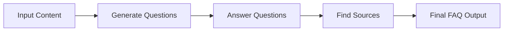
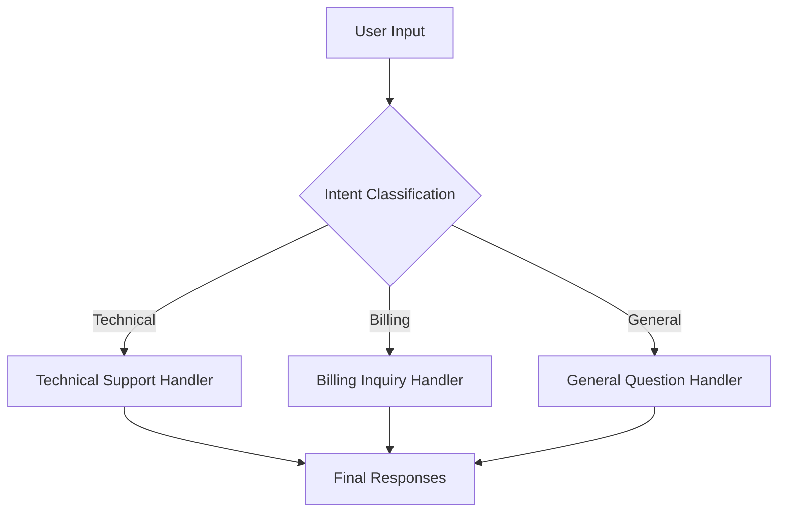
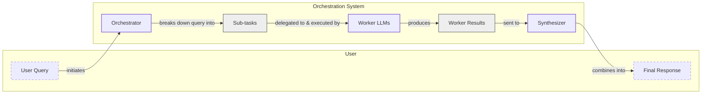

# Stop Building Monolithic LLM Calls. Use These Workflow Patterns Instead.

When we first started building with LLMs, we all made the same mistake. We would craft a single, massive prompt, trying to get the model to do everything at once. This included researching a topic, drafting an article, finding sources, and formatting it perfectly. The first few attempts looked promising, but as soon as we moved to production, the system would crumble. It was slow, expensive, and wildly unpredictable.

This is the classic pitfall of treating an LLM like a magic box. In our last lesson, we covered context engineering, the art of feeding the right information *into* an LLM. Now, we will tackle the other side of the equation: how to orchestrate multiple LLM calls to build reliable and maintainable systems.

A single, complex prompt is a monolith. It is a black box that is difficult to debug, impossible to test in isolation, and prone to failure. When it breaks, you have no idea which part of the instruction the model failed to follow. The solution is to stop building monolithic prompts and start thinking in terms of modular workflows.

In this lesson, we will explore the fundamental patterns for building robust LLM applications: sequential chaining to break down tasks into linear steps, parallelization to run independent tasks concurrently, routing to direct inputs with conditional logic, and the orchestrator-worker pattern to dynamically decompose complex tasks. By mastering these patterns, you will learn how to move from brittle prototypes to production-grade AI systems that are reliable, scalable, and easier to maintain.

## The Challenge with Complex Single LLM Calls

A common approach for complex, multi-step tasks is to write a single, detailed prompt that asks the LLM to perform all steps at once. While this can work for simple demos, it quickly becomes a bottleneck in production systems for several reasons.

First, monolithic prompts are incredibly difficult to debug. When a single, large prompt fails, it is nearly impossible to pinpoint which specific instruction or part of the context caused the error. You are left guessing whether the model misinterpreted a step, failed to find the right information, or simply generated a malformed output. This lack of visibility makes iterative improvement a slow and frustrating process [[36]](https://www.decodingai.com/p/stop-building-ai-agents-use-these). In contrast, a modular workflow with distinct steps allows you to isolate failures quickly. For instance, companies like AppFolio and Acxiom use frameworks like LangGraph and observability tools like LangSmith precisely to gain visibility into multi-agent interactions and debug complex chains step-by-step [[20]](https://www.zenml.io/blog/llmops-in-production-457-case-studies-of-what-actually-works), [[21]](https://www.zenml.io/blog/llmops-in-production-287-more-case-studies-of-what-actually-works).

Second, this approach lacks modularity, which is a core principle of good software engineering. A monolithic prompt is a single, tightly-coupled block of logic. You cannot easily update one part of the task without risking unintended consequences elsewhere. This makes the system brittle and hard to maintain over time. A modular design, on the other hand, allows you to test, version, and reuse individual components independently [[46]](https://mlpills.substack.com/p/issue-110-llm-workflow-patterns).

Third, complex prompts are highly sensitive to minor changes, making them difficult to reproduce reliably. Research has shown that even small variations in prompt wording or the inclusion of few-shot examples can dramatically increase error rates. One study found that few-shot prompting caused a 52.9% error rate, primarily due to parsing failures, as the examples overwhelmed the model without clear structural guidance [[3]](https://aclanthology.org/2025.ommm-1.4.pdf). Another analysis showed that as the number of requirements in a prompt increases from 1 to 19, a model's accuracy can drop by over 13%, highlighting the limits of instruction-following capabilities in a single call [[5]](https://arxiv.org/html/2505.13360v1).

Fourth, overstuffing the context window leads to performance degradation long before you hit the technical token limit. This is due to the "lost-in-the-middle" problem, where LLMs exhibit a U-shaped performance curve. They pay most attention to information at the beginning and end of the context while often ignoring details in the middle [[2]](https://dev.to/thousand_miles_ai/the-lost-in-the-middle-problem-why-llms-ignore-the-middle-of-your-context-window-3al2). This bias, caused by architectural factors like causal attention masking, means that as your prompt grows, important instructions can get lost, leading to inaccurate or incomplete outputs. Furthermore, if the context exceeds the model's limit, the input will be truncated, meaning the model will not even see all the information, leading to silent failures.

Finally, while it seems counterintuitive, a single complex prompt can sometimes consume more tokens and be less efficient than a series of smaller, focused calls. This is because the model may need to re-process the entire context for each sub-task it performs internally. Furthermore, the sheer complexity of the instructions can lead to higher error rates, as each additional requirement or constraint increases the chance of the model failing to follow instructions [[5]](https://arxiv.org/html/2505.13360v1).

Let's illustrate this with a practical example. We will start with our setup.

1.  We begin by setting up our environment, which involves initializing the Gemini client from the `google-genai` Python package and defining the model we will use.
    ```python
    import asyncio
    from enum import Enum
    import random
    import time
    
    from pydantic import BaseModel, Field
    from google import genai
    from google.genai import types
    
    from lessons.utils import env
    
    env.load(required_env_vars=["GOOGLE_API_KEY"])
    
    client = genai.Client()
    
    MODEL_ID = "gemini-2.5-flash"
    ```
2.  Next, we define three mock webpages about renewable energy that will serve as our source content.
    ```python
    webpage_1 = {
        "title": "The Benefits of Solar Energy",
        "content": """
        Solar energy is a renewable powerhouse, offering numerous environmental and economic benefits.
        By converting sunlight into electricity through photovoltaic (PV) panels, it reduces reliance on fossil fuels,
        thereby cutting down greenhouse gas emissions. Homeowners who install solar panels can significantly
        lower their monthly electricity bills, and in some cases, sell excess power back to the grid.
        While the initial installation cost can be high, government incentives and long-term savings make
        it a financially viable option for many. Solar power is also a key component in achieving energy
        independence for nations worldwide.
        """,
    }
    
    webpage_2 = {
        "title": "Understanding Wind Turbines",
        "content": """
        Wind turbines are towering structures that capture kinetic energy from the wind and convert it into
        electrical power. They are a critical part of the global shift towards sustainable energy.
        Turbines can be installed both onshore and offshore, with offshore wind farms generally producing more
        consistent power due to stronger, more reliable winds. The main challenge for wind energy is its
        intermittency. It only generates power when the wind blows. This necessitates the use of energy
        storage solutions, like large-scale batteries, to ensure a steady supply of electricity.
        """,
    }
    
    webpage_3 = {
        "title": "Energy Storage Solutions",
        "content": """
        Effective energy storage is the key to unlocking the full potential of renewable sources like solar
        and wind. Because these sources are intermittent, storing excess energy when it's plentiful and
        releasing it when it's needed is crucial for a stable power grid. The most common form of
        large-scale storage is pumped-hydro storage, but battery technologies, particularly lithium-ion,
        are rapidly becoming more affordable and widespread. These batteries can be used in homes, businesses,
        and at the utility scale to balance energy supply and demand, making our energy system more
        resilient and reliable.
        """,
    }
    
    all_sources = [webpage_1, webpage_2, webpage_3]
    
    # We'll combine the content for the LLM to process
    combined_content = "\n\n".join(
        [f"Source Title: {source['title']}\nContent: {source['content']}" for source in all_sources]
    )
    ```
3.  Here is a complex prompt that tries to generate questions, find answers, and cite sources all in one call.
    ```python
    # This prompt tries to do everything at once: generate questions, find answers,
    # and cite sources. This complexity can often confuse the model.
    n_questions = 10
    prompt_complex = f"""
    Based on the provided content from three webpages, generate a list of exactly {n_questions} frequently asked questions (FAQs).
    For each question, provide a concise answer derived ONLY from the text.
    After each answer, you MUST include a list of the 'Source Title's that were used to formulate that answer.
    
    <provided_content>
    {combined_content}
    </provided_content>
    """.strip()
    
    # Pydantic classes for structured outputs
    class FAQ(BaseModel):
        """A FAQ is a question and answer pair, with a list of sources used to answer the question."""
        question: str = Field(description="The question to be answered")
        answer: str = Field(description="The answer to the question")
        sources: list[str] = Field(description="The sources used to answer the question")
    
    class FAQList(BaseModel):
        """A list of FAQs"""
        faqs: list[FAQ] = Field(description="A list of FAQs")
    
    # Generate FAQs
    config = types.GenerateContentConfig(
        response_mime_type="application/json",
        response_schema=FAQList
    )
    response_complex = client.models.generate_content(
        model=MODEL_ID,
        contents=prompt_complex,
        config=config
    )
    result_complex = response_complex.parsed
    ```
    It outputs:
    ```json
    {
      "question": "Why is energy storage crucial for renewable energy sources like solar and wind?",
      "answer": "Effective energy storage is key to unlocking the full potential of renewable sources because it allows storing excess energy when plentiful and releasing it when needed, which is crucial for a stable power grid.",
      "sources": [
        "Energy Storage Solutions",
        "Understanding Wind Turbines"
      ]
    }
    ```
While the output may seem acceptable at first glance, this approach is fragile. For instance, the model might correctly identify one source but miss another, or it might hallucinate a source entirely. As the number of instructions and the complexity of the task increase, the probability of such errors grows. This is why a modular approach is essential for building reliable systems.

## The Power of Modularity: Why Chain LLM Calls?

The solution to the unreliability of monolithic prompts is modularity, a concept we borrow from traditional software engineering. Instead of asking an LLM to perform a complex task in a single step, we break it down into a series of smaller, more manageable sub-tasks. This technique is known as prompt chaining, where the output of one LLM call becomes the input for the next, forming a sequential workflow [[41]](https://medium.com/@fabiolalli/a-practical-guide-to-prompt-engineering-techniques-and-their-use-cases-5f8574e2cd9a), [[42]](https://www.scrum.org/resources/blog/10-prompt-engineering-techniques-super-simple-explanation). This approach aligns with cognitive principles like Chain-of-Thought (CoT) prompting, which improves performance on complex tasks by guiding the model to break them down into a series of intermediate, logical steps, much like human reasoning [[62]](https://invisibletech.ai/blog/how-to-teach-chain-of-thought-reasoning-to-your-llm), [[63]](https://www.ibm.com/think/topics/chain-of-thoughts).

This "divide-and-conquer" strategy offers several powerful advantages for building production-grade AI applications.

**Improved modularity** is the most immediate benefit. Each step in the chain becomes a self-contained component with a single responsibility. This makes your system easier to test, version, and maintain. You can develop and validate each prompt in isolation, ensuring it performs its specific function reliably before integrating it into the larger workflow [[46]](https://mlpills.substack.com/p/issue-110-llm-workflow-patterns). This is a core principle we teach throughout our AI agent course series, as it moves us from building prototypes to shipping real products [[56]](https://www.decodingai.com/p/stop-building-ai-agents-use-these). For example, AppFolio's property management AI copilot, Realm-X Assistant, uses LangGraph to manage complex, multi-step workflows, which allowed them to boost performance in text-to-data tasks from 40% to 80% by isolating and optimizing specific steps in the chain [[20]](https://www.zenml.io/blog/llmops-in-production-457-case-studies-of-what-actually-works).

**Enhanced accuracy** is another key outcome. A complex, multi-part prompt places a high cognitive load on the LLM. By breaking the task into simpler, targeted steps, you reduce ambiguity and allow the model to focus on one thing at a time. A prompt designed solely to extract questions is more likely to succeed than one that must simultaneously generate questions, find answers, and cite sources. This focused approach consistently leads to more reliable and higher-quality outputs [[60]](https://agentic-design.ai/patterns/prompt-chaining).

**Easier debugging** naturally follows from modularity. When a chained workflow fails, you can inspect the input and output of each step to pinpoint exactly where the error occurred. This is a great improvement over the guesswork required to debug a monolithic prompt. This traceability is important in production systems, where quick identification and resolution of issues are paramount [[36]](https://www.decodingai.com/p/stop-building-ai-agents-use-these).

**Increased flexibility** allows you to optimize your workflow more effectively. You can swap out individual components, experiment with different prompts, or even use different models for different steps. For example, you might use a fast, cost-effective model like Gemini Flash for a simple classification task, and a more powerful model like Gemini Pro for a complex generation step. This ability to mix and match components lets you balance performance, cost, and quality across your application [[36]](https://www.decodingai.com/p/stop-building-ai-agents-use-these). While frameworks like LangChain are popular for composing linear chains, more advanced tools like LangGraph are better suited for production workloads with branching logic or parallel calls, offering greater control over the execution flow [[22]](https://futureagi.substack.com/p/how-tool-chaining-fails-in-production).

However, chaining is not a silver bullet. One of the main challenges is **information loss** between steps. As data is passed from one prompt to the next, important context can be diluted or lost, a form of context decay we discussed in Lesson 3. For example, a summarization step might inadvertently remove a nuance that is important for a subsequent analysis step [[22]](https://futureagi.substack.com/p/how-tool-chaining-fails-in-production). Mitigating this requires careful design, such as using structured state objects to pass data and ensuring that each prompt explicitly carries forward essential context.

Furthermore, chaining introduces higher latency and cost. Each additional LLM call adds to the total execution time and incurs token costs [[41]](https://medium.com/@fabiolalli/a-practical-guide-to-prompt-engineering-techniques-and-their-use-cases-5f8574e2cd9a). There is also a risk of **compounding errors**, where a small mistake in an early step cascades and grows through the chain. Because LLMs generate outputs token-by-token based on prior outputs, a single inaccurate token can derail the entire sequence. For complex problems broken into multiple steps, the probability of a final error grows exponentially with each step, making long chains inherently more error-prone [[47]](https://wand.ai/blog/compounding-error-effect-in-large-language-models-a-growing-challenge). Finally, managing a sequence of interconnected prompts and the "glue code" that connects them adds engineering overhead. This is where workflow orchestration libraries and explicit state management frameworks like LangGraph become valuable, as they provide the structure needed to manage stateful, branching workflows reliably [[22]](https://futureagi.substack.com/p/how-tool-chaining-fails-in-production).

## Building a Sequential Workflow: FAQ Generation Pipeline

Let's put theory into practice by refactoring our FAQ generation example into a sequential, three-step workflow. Instead of a single complex prompt, we will create a chain of three distinct LLM calls:
1.  **Generate Questions**: The first step takes the raw content and generates a list of relevant questions.
2.  **Answer Questions**: The second step takes a single question and the original content to generate a concise answer.
3.  **Find Sources**: The final step takes the question and its generated answer to identify the source documents.

This modular approach allows us to ensure each part of the process works correctly and gives us clear, traceable outputs at every stage.

Image 1: A flowchart illustrating the sequential FAQ generation pipeline.


This workflow is a classic example of an "assembly line" approach, perfect for data pipelines, parsing, and summarization tasks where the process is linear and deterministic [[49]](https://developers.googleblog.com/developers-guide-to-multi-agent-patterns-in-adk/). This pattern is widely used in production. For instance, Athena Intelligence developed a platform called Olympus that generates enterprise research reports by orchestrating a multi-agent workflow. This system uses a sequential process that involves data extraction, analysis, report generation, and source citation, all managed through LangGraph to ensure a reliable and traceable pipeline [[20]](https://www.zenml.io/blog/llmops-in-production-457-case-studies-of-what-actually-works).

The main benefit of this modularity is the ability to debug and test each component in isolation. In our FAQ pipeline, if the final output is missing sources, we can immediately check the `find_sources` step. We can examine its inputs (the question and answer) and its output to see if it failed to identify the correct documents. This level of granularity is impossible with a monolithic prompt, where a failure in source citation could be caused by any part of the complex instruction.

Another advantage is the ability to refine each step independently. Suppose we find that the generated answers are too verbose. We can simply adjust the prompt for the `answer_question` function without touching the logic for question generation or source finding. This separation of concerns makes the entire system more maintainable and adaptable to changing requirements. Using structured outputs, as we do with our Pydantic models, is an essential part of this process. It creates a formal contract between each step, ensuring that the data passed along the chain is consistent and valid, which prevents errors from propagating silently.

Let's walk through the implementation.

1.  First, we create a function to generate a list of questions from the combined content. This function is solely focused on creating relevant questions. We use a Pydantic model, `QuestionList`, to ensure the output is a structured list of strings.
    ```python
    class QuestionList(BaseModel):
        """A list of questions"""
        questions: list[str] = Field(description="A list of questions")
    
    prompt_generate_questions = """
    Based on the content below, generate a list of {n_questions} relevant and distinct questions that a user might have.
    
    <provided_content>
    {combined_content}
    </provided_content>
    """.strip()
    
    def generate_questions(content: str, n_questions: int = 10) -> list[str]:
        """
        Generate a list of questions based on the provided content.
    
        Args:
            content: The combined content from all sources
    
        Returns:
            list: A list of generated questions
        """
        config = types.GenerateContentConfig(
            response_mime_type="application/json",
            response_schema=QuestionList
        )
        response_questions = client.models.generate_content(
            model=MODEL_ID,
            contents=prompt_generate_questions.format(n_questions=n_questions, combined_content=content),
            config=config
        )
    
        return response_questions.parsed.questions
    ```
    When we run this function, it produces a clean list of questions based on our source material.
    It outputs:
    ```text
    - What are the primary environmental and economic benefits of solar energy?
    - How do homeowners financially benefit from installing solar panels?
    - What is the main process by which wind turbines generate electricity?
    - What is the primary challenge of wind energy, and how is it addressed?
    ```
2.  Next, we define a function that takes a single question and the source content to generate a focused answer. This prompt is simple and direct, reducing the chance of the model getting confused.
    ```python
    prompt_answer_question = """
    Using ONLY the provided content below, answer the following question.
    The answer should be concise and directly address the question.
    
    <question>
    {question}
    </question>
    
    <provided_content>
    {combined_content}
    </provided_content>
    """.strip()
    
    def answer_question(question: str, content: str) -> str:
        """
        Generate an answer for a specific question using only the provided content.
    
        Args:
            question: The question to answer
            content: The combined content from all sources
    
        Returns:
            str: The generated answer
        """
        answer_response = client.models.generate_content(
            model=MODEL_ID,
            contents=prompt_answer_question.format(question=question, combined_content=content),
        )
        return answer_response.text
    ```
    For the question "What are the primary environmental and economic benefits of solar energy?", it outputs:
    ```text
    The primary environmental benefit of solar energy is cutting down greenhouse gas emissions by reducing reliance on fossil fuels. Economically, it allows homeowners to significantly lower their monthly electricity bills and potentially sell excess power back to the grid.
    ```
3.  The third function identifies which source titles were used to formulate a given answer. This step is important for traceability and fact-checking, as it forces the model to ground its response in the provided context.
    ```python
    class SourceList(BaseModel):
        """A list of source titles that were used to answer the question"""
        sources: list[str] = Field(description="A list of source titles that were used to answer the question")
    
    prompt_find_sources = """
    You will be given a question and an answer that was generated from a set of documents.
    Your task is to identify which of the original documents were used to create the answer.
    
    <question>
    {question}
    </question>
    
    <answer>
    {answer}
    </answer>
    
    <provided_content>
    {combined_content}
    </provided_content>
    """.strip()
    
    def find_sources(question: str, answer: str, content: str) -> list[str]:
        """
        Identify which sources were used to generate an answer.
    
        Args:
            question: The original question
            answer: The generated answer
            content: The combined content from all sources
    
        Returns:
            list: A list of source titles that were used
        """
        config = types.GenerateContentConfig(
            response_mime_type="application/json",
            response_schema=SourceList
        )
        sources_response = client.models.generate_content(
            model=MODEL_ID,
            contents=prompt_find_sources.format(question=question, answer=answer, combined_content=content),
            config=config
        )
        return sources_response.parsed.sources
    ```
    For our example question and answer, it correctly identifies the source:
    ```text
    ['The Benefits of Solar Energy']
    ```
4.  Finally, we combine these functions into a complete sequential workflow. We first generate all questions, then iterate through each one to generate an answer and find its sources. This function encapsulates the entire chain of logic.
    ```python
    def sequential_workflow(content, n_questions=10) -> list[FAQ]:
        """
        Execute the complete sequential workflow for FAQ generation.
    
        Args:
            content: The combined content from all sources
    
        Returns:
            list: A list of FAQs with questions, answers, and sources
        """
        # Generate questions
        questions = generate_questions(content, n_questions)
    
        # Answer and find sources for each question sequentially
        final_faqs = []
        for question in questions:
            # Generate an answer for the current question
            answer = answer_question(question, content)
    
            # Identify the sources for the generated answer
            sources = find_sources(question, answer, content)
    
            faq = FAQ(
                question=question,
                answer=answer,
                sources=sources
            )
            final_faqs.append(faq)
    
        return final_faqs
    
    # Execute the sequential workflow (measure time for comparison)
    start_time = time.monotonic()
    sequential_faqs = sequential_workflow(combined_content, n_questions=4)
    end_time = time.monotonic()
    print(f"Sequential processing completed in {end_time - start_time:.2f} seconds")
    ```
    This process took **22.20 seconds** to complete for four questions. While this approach is reliable, the total time increases linearly with the number of questions. This leads us to our next optimization: parallelization.

## Optimizing Sequential Workflows With Parallel Processing

The sequential workflow is robust but slow. Since the processing for each question (answering and source-finding) is independent of the others, we can execute these tasks concurrently. This is the parallelization pattern, a common technique to reduce latency by running multiple independent tasks at the same time [[46]](https://mlpills.substack.com/p/issue-110-llm-workflow-patterns). This is ideal for tasks like automated code review, where a security auditor, style enforcer, and performance analyst can all run simultaneously [[49]](https://developers.googleblog.com/developers-guide-to-multi-agent-patterns-in-adk/).

For I/O-bound tasks like making API calls to an LLM, `asyncio` is the preferred method in Python. It uses an event loop to manage multiple operations within a single thread, avoiding the overhead of creating and managing multiple OS threads. This makes it highly efficient for handling thousands of concurrent connections with minimal memory usage [[27]](https://medium.com/@sizanmahmud08/python-concurrency-showdown-asyncio-vs-threading-vs-multiprocessing-which-should-you-choose-in-31205161899a), [[28]](https://testdriven.io/blog/python-concurrency-parallelism/). An alternative for libraries that do not support `asyncio` is to use a `ThreadPoolExecutor` from the `concurrent.futures` module, which manages a pool of worker threads. However, for high-concurrency network requests, `asyncio` generally outperforms threading due to lower context-switching overhead [[28]](https://testdriven.io/blog/python-concurrency-parallelism/).

However, parallel execution introduces a new production challenge: API rate limits. A real-world failure mode occurred in mid-2025 when a team building a multi-agent financial assistant saw their API costs spiral from $127 to $47,000 per week. A recursive agent loop, combined with naive retry logic that hammered the API after every timeout, caused a runaway cost explosion [[9]](https://tianpan.co/blog/2026-03-11-llm-api-resilience-production). This highlights the danger of implementing parallel calls without robust resilience patterns.

### Robust Strategies for Managing API Rate Limits

Most LLM providers, including Google Gemini, impose limits on both Requests Per Minute (RPM) and Tokens Per Minute (TPM). Firing off too many requests at once can lead to `429` errors, causing your workflow to fail. A robust implementation must include strategies to handle these limits gracefully.

**Exponential backoff with jitter** is the foundational technique. Instead of retrying a failed request immediately, you wait for an exponentially increasing amount of time. Adding "jitter" (a small, random delay) to this wait time is important. It prevents a "thundering herd" of clients from retrying at the exact same moment and overwhelming the API again [[9]](https://tianpan.co/blog/2026-03-11-llm-api-resilience-production).

For more advanced control, you can implement a **client-side request queue** with a **token bucket algorithm**. This pattern smooths out bursty traffic by placing outgoing requests in a queue and processing them at a steady rate that respects the API's RPM and TPM limits. This prevents you from ever hitting the rate limit in the first place.

Another powerful pattern is the **circuit breaker**. This component monitors the failure rate of API calls. If the rate exceeds a certain threshold, the circuit "trips" and immediately fails all subsequent requests for a cooldown period. This prevents your application from repeatedly calling a degraded or unavailable service, allowing it time to recover and preventing cascading failures in your own system [[9]](https://tianpan.co/blog/2026-03-11-llm-api-resilience-production).

In large-scale production systems, managing concurrency and rate limits requires more than just client-side logic. A robust infrastructure stack is essential. This often involves using containerization to package dependencies and orchestration frameworks like Kubernetes to handle auto-scaling, fault tolerance, and service discovery. Such systems can manage thousands of parallel requests efficiently while respecting API limits, ensuring the entire workflow remains scalable and resilient [[71]](https://arxiv.org/html/2604.17227v1).

For our example, we will use Python’s `asyncio` library to run the answer generation and source-finding steps in parallel for each question.

1.  First, we create asynchronous versions of our `answer_question` and `find_sources` functions. These `async` functions can be run concurrently by an event loop.
    ```python
    async def answer_question_async(question: str, content: str) -> str:
        """
        Async version of answer_question function.
        """
        prompt = prompt_answer_question.format(question=question, combined_content=content)
        response = await client.aio.models.generate_content(
            model=MODEL_ID,
            contents=prompt
        )
        return response.text
    
    async def find_sources_async(question: str, answer: str, content: str) -> list[str]:
        """
        Async version of find_sources function.
        """
        prompt = prompt_find_sources.format(question=question, answer=answer, combined_content=content)
        config = types.GenerateContentConfig(
            response_mime_type="application/json",
            response_schema=SourceList
        )
        response = await client.aio.models.generate_content(
            model=MODEL_ID,
            contents=prompt,
            config=config
        )
        return response.parsed.sources
    ```
2.  Next, we define a function to process a single question by running its sub-tasks in parallel. Notice that even within this function, we process the steps sequentially (`answer` is needed for `find_sources`), but the function itself is asynchronous.
    ```python
    async def process_question_parallel(question: str, content: str) -> FAQ:
        """
        Process a single question by generating answer and finding sources in parallel.
        """
        answer = await answer_question_async(question, content)
        sources = await find_sources_async(question, answer, content)
        return FAQ(
            question=question,
            answer=answer,
            sources=sources
        )
    ```
3.  Finally, we build the main parallel workflow. After generating the initial list of questions, we use `asyncio.gather` to execute the `process_question_parallel` function for all questions at the same time.
    ```python
    async def parallel_workflow(content: str, n_questions: int = 10) -> list[FAQ]:
        """
        Execute the complete parallel workflow for FAQ generation.
    
        Args:
            content: The combined content from all sources
    
        Returns:
            list: A list of FAQs with questions, answers, and sources
        """
        # Generate questions (this step remains synchronous)
        questions = generate_questions(content, n_questions)
    
        # Process all questions in parallel
        tasks = [process_question_parallel(question, content) for question in questions]
        parallel_faqs = await asyncio.gather(*tasks)
    
        return parallel_faqs
    
    # Execute the parallel workflow (measure time for comparison)
    start_time = time.monotonic()
    parallel_faqs = await parallel_workflow(combined_content, n_questions=4)
    end_time = time.monotonic()
    print(f"Parallel processing completed in {end_time - start_time:.2f} seconds")
    ```
    The parallel workflow completed in just **8.98 seconds**, a great improvement over the 22.20 seconds required for the sequential approach. This demonstrates the power of parallelization for I/O-bound tasks like making API calls. While sequential processing is predictable and easier to debug, the speed gains from parallel execution are often essential for production applications that require low latency [[45]](https://deepchecks.com/orchestrating-multi-step-llm-chains-best-practices/), [[27]](https://medium.com/@sizanmahmud08/python-concurrency-showdown-asyncio-vs-threading-vs-multiprocessing-which-should-you-choose-in-31205161899a). But speed is not the only factor. Real-world applications also need to adapt to different inputs, which requires more than a linear execution path.

## Introducing Dynamic Behavior: Routing and Conditional Logic

So far, our workflows have been linear, following a fixed sequence of steps. However, many real-world applications require dynamic behavior, where the path of execution changes based on the input. This is where routing, or conditional logic, comes in.

This pattern of creating specialized, independent handlers is directly analogous to the microservices architecture in software engineering. By defining clear service boundaries and having each component adhere to the single-responsibility principle, you create a system that is more modular, scalable, and easier to maintain [[65]](https://wjaets.com/sites/default/files/fulltext_pdf/WJAETS-2025-1078.pdf).

Routing uses a classification step to analyze an input and direct it to a specialized handler. This is another application of the "divide-and-conquer" principle. Instead of creating a single, complex prompt that tries to handle every possible scenario, we create multiple, focused prompts, each designed for a specific type of input. An initial LLM call acts as a "dispatcher," determining which specialized prompt is best suited for the task [[51]](https://www.decodingai.com/p/stop-building-ai-agents-use-these).

This pattern is extremely common in customer service applications. For example, a support bot needs to distinguish between a billing inquiry, a technical support request, and a general question. Each of these intents requires a different response and may involve different downstream actions or tools. Routing allows the system to direct the user's query to the appropriate specialist agent, ensuring a more accurate and efficient response [[49]](https://developers.googleblog.com/developers-guide-to-multi-agent-patterns-in-adk/). In a production context, Amazon Bedrock's Intelligent Prompt Routing uses this pattern to optimize for cost and quality, directing simple queries to cheaper models and complex ones to more powerful models [[15]](https://aws.amazon.com/blogs/machine-learning/multi-llm-routing-strategies-for-generative-ai-applications-on-aws/).

The core of a routing workflow is the classification step. Engineering a robust classifier is key. This involves defining a clear and comprehensive taxonomy of intents and providing high-quality examples for each, especially for edge cases. For more complex scenarios, a two-stage architecture can improve precision, where an initial model retrieves candidate intents and a second, more powerful LLM makes the final selection [[15]](https://aws.amazon.com/blogs/machine-learning/multi-llm-routing-strategies-for-generative-ai-applications-on-aws/).

## Building a Basic Routing Workflow

Let's build a simple routing workflow for a customer service system. The goal is to classify a user's query into one of three categories—Technical Support, Billing Inquiry, or General Question—and then route it to a specialized handler that generates an appropriate first response.

Structuring our handlers around clear business capabilities like "Technical Support" or "Billing Inquiry" is an application of Domain-Driven Design (DDD), a key principle used in microservices architecture to create maintainable and well-defined service boundaries [[66]](https://konghq.com/blog/learning-center/what-are-microservices).

Image 2: A flowchart illustrating a basic routing workflow for customer service.


### Designing the Classification Step

The reliability of a routing workflow depends entirely on the accuracy of its classification step. A misclassified intent sends the user down the wrong path, leading to a frustrating experience. To build a robust classifier, you must first define a clear, precise, and comprehensive taxonomy of intents. Each category should be mutually exclusive and cover all expected user queries. It is also important to include a "fallback" or "general" category for queries that do not fit neatly into any other bucket [[12]](https://www.vellum.ai/blog/how-to-build-intent-detection-for-your-chatbot).

Once the taxonomy is defined, the next step is to provide the LLM with high-quality, representative examples for each intent. This is often done using few-shot prompting, where you include examples directly in the prompt to guide the model's classification. These examples should cover a range of phrasings and edge cases to help the model generalize effectively.

### Two-Stage Architecture for Intent Classification

For high-stakes applications where precision is important, a simple classification call may not be enough. A more advanced pattern is a two-stage, or hybrid, architecture. This approach combines different techniques to improve accuracy. For example, a semantic router might first use embeddings to find the most similar predefined intents from a knowledge base. Then, a second LLM-based classifier takes these top candidates and makes the final decision based on the nuanced context of the user's query [[15]](https://aws.amazon.com/blogs/machine-learning/multi-llm-routing-strategies-for-generative-ai-applications-on-aws/). This hybrid approach can improve routing accuracy by leveraging both the speed of semantic search and the reasoning power of a large language model [[11]](https://www.emergentmind.com/topics/llm-based-prompt-routing).

Let's implement our basic router.

1.  First, we define our intents and create a classification function. We use Pydantic `Enum` and `BaseModel` to define the schema, ensuring the LLM's classification output is structured and valid.
    ```python
    class IntentEnum(str, Enum):
        """
        Defines the allowed values for the 'intent' field.
        Inheriting from 'str' ensures that the values are treated as strings.
        """
        TECHNICAL_SUPPORT = "Technical Support"
        BILLING_INQUIRY = "Billing Inquiry"
        GENERAL_QUESTION = "General Question"
    
    class UserIntent(BaseModel):
        """
        Defines the expected response schema for the intent classification.
        """
        intent: IntentEnum = Field(description="The intent of the user's query")
    
    prompt_classification = """
    Classify the user's query into one of the following categories.
    
    <categories>
    {categories}
    </categories>
    
    <user_query>
    {user_query}
    </user_query>
    """.strip()
    
    
    def classify_intent(user_query: str) -> IntentEnum:
        """Uses an LLM to classify a user query."""
        prompt = prompt_classification.format(
            user_query=user_query,
            categories=[intent.value for intent in IntentEnum]
        )
        config = types.GenerateContentConfig(
            response_mime_type="application/json",
            response_schema=UserIntent
        )
        response = client.models.generate_content(
            model=MODEL_ID,
            contents=prompt,
            config=config
        )
        return response.parsed.intent
    ```
2.  Next, we define specialized prompts for each intent. Each prompt gives the LLM a specific role (e.g., "helpful technical support agent") and guides it to generate a response tailored to that context.
    ```python
    prompt_technical_support = """
    You are a helpful technical support agent.
    
    Here's the user's query:
    <user_query>
    {user_query}
    </user_query>
    
    Provide a helpful first response, asking for more details like what troubleshooting steps they have already tried.
    """.strip()
    
    prompt_billing_inquiry = """
    You are a helpful billing support agent.
    
    Here's the user's query:
    <user_query>
    {user_query}
    </user_query>
    
    Acknowledge their concern and inform them that you will need to look up their account, asking for their account number.
    """.strip()
    
    prompt_general_question = """
    You are a general assistant.
    
    Here's the user's query:
    <user_query>
    {user_query}
    </user_query>
    
    Apologize that you are not sure how to help.
    """.strip()
    ```
3.  Finally, we create the `handle_query` function, which acts as our router. It takes the user's query and the classified intent, then uses simple conditional logic to select the correct prompt and generate the final response.
    ```python
    def handle_query(user_query: str, intent: str) -> str:
        """Routes a query to the correct handler based on its classified intent."""
        if intent == IntentEnum.TECHNICAL_SUPPORT:
            prompt = prompt_technical_support.format(user_query=user_query)
        elif intent == IntentEnum.BILLING_INQUIRY:
            prompt = prompt_billing_inquiry.format(user_query=user_query)
        elif intent == IntentEnum.GENERAL_QUESTION:
            prompt = prompt_general_question.format(user_query=user_query)
        else:
            prompt = prompt_general_question.format(user_query=user_query)
        response = client.models.generate_content(
            model=MODEL_ID,
            contents=prompt
        )
        return response.text
    ```
4.  Let's test this with a few different queries. For the query `"My internet connection is not working."`, the system correctly classifies the intent as `TECHNICAL_SUPPORT` and generates a helpful response.
    ```text
    Hello there! I'm sorry to hear you're having trouble with your internet connection. That can definitely be frustrating.
    
    To help me understand what's going on and assist you best, could you please provide a few more details?
    ...
    Have you already tried any troubleshooting steps yourself?
    ```
    Similarly, for `"I think there is a mistake on my last invoice."`, the intent is `BILLING_INQUIRY`, and the response is tailored accordingly:
    ```text
    I'm sorry to hear you think there might be a mistake on your last invoice. I can definitely help you look into that!
    
    To access your account and investigate the charges, could you please provide your account number?
    ```
This simple routing pattern demonstrates how to build more dynamic and intelligent systems by breaking down a problem and directing inputs to specialized components.

## Orchestrator-Worker Pattern: Dynamic Task Decomposition

The final pattern we will explore is the orchestrator-worker model. This is a more advanced workflow where a central "orchestrator" LLM dynamically breaks down a complex task into smaller sub-tasks. It then delegates these sub-tasks to specialized "worker" components, which can be other LLM calls or external tools. Finally, a "synthesizer" LLM often combines the results from the workers into a single, coherent response [[32]](https://mlpills.substack.com/p/diy-17-orchestrator-worker-llm-agent).

This pattern is ideal for complex, unpredictable tasks where the exact sequence of steps cannot be determined in advance [[16]](https://agents.kour.me/orchestrator-worker/). The key difference from simple parallelization is its flexibility. Instead of having a fixed set of parallel tasks, the orchestrator analyzes the specific input at runtime and decides what sub-tasks are needed [[53]](https://platform.claude.com/cookbook/patterns-agents-orchestrator-workers). This allows for highly adaptive and intelligent systems that can handle a wide variety of queries.

Image 3: A flowchart illustrating the orchestrator-worker pattern, showing the flow from a user query through orchestration, sub-task delegation to worker LLMs, result synthesis, and final response generation.


### Production Challenges with the Orchestrator-Worker Pattern

While powerful, this pattern introduces reliability challenges in production. The orchestrator can become a single point of failure or a performance bottleneck. Asynchronous task delegation and caching common sub-task results can help mitigate this. Coordination breakdowns between workers are also common, leading to deadlocks or duplicated effort [[67]](https://galileo.ai/blog/multi-agent-ai-failures-prevention), [[70]](https://galileo.ai/blog/why-multi-agent-systems-fail).

A more insidious problem is compounding error rates: if a single worker is 95% reliable, a chain of five such workers is only 77% reliable, and a chain of ten drops to 60% [[68]](https://www.mindstudio.ai/blog/multi-agent-orchestration-patterns/). The orchestrator must also perform a complete decomposition of the task; if it misses a necessary sub-task, the final result will be incomplete. Prompting for completeness and using iterative refinement can help ensure all necessary steps are identified.

Conflicting outputs from different workers can corrupt the final result or lead to invalid states. For example, one agent might assign a support ticket while another simultaneously closes it, breaking the workflow logic [[69]](https://www.getmaxim.ai/articles/multi-agent-system-reliability-failure-patterns-root-causes-and-production-validation-strategies/). The synthesizer must be sophisticated enough to reconcile these disagreements, handle missing information, and maintain a consistent tone. Strategies for conflict resolution include voting mechanisms, re-querying conflicting workers, or involving a human-in-the-loop for final approval [[34]](https://www.socure.com/tech-blog/build-advanced-customer-support-llm-multi-agent-workflow).

Mitigating these failures requires robust engineering. This includes using clear input/output schemas like Pydantic to ensure reliable communication between components, implementing validation at every step, and designing sophisticated synthesis strategies that can handle ambiguity and conflict.

Let's build an orchestrator-worker system to handle a complex customer service query that involves multiple, distinct actions.

1.  The orchestrator's job is to analyze the user's query and break it down into a list of structured tasks. We define the possible task types and their required parameters using Pydantic models.
    ```python
    class QueryTypeEnum(str, Enum):
        """The type of query to be handled."""
        BILLING_INQUIRY = "BillingInquiry"
        PRODUCT_RETURN = "ProductReturn"
        STATUS_UPDATE = "StatusUpdate"
    
    class Task(BaseModel):
        """A task to be performed."""
        query_type: QueryTypeEnum = Field(description="The type of query to be handled.")
        invoice_number: str | None = Field(description="The invoice number to be used for the billing inquiry.", default=None)
        product_name: str | None = Field(description="The name of the product to be returned.", default=None)
        reason_for_return: str | None = Field(description="The reason for returning the product.", default=None)
        order_id: str | None = Field(description="The order ID to be used for the status update.", default=None)
    
    class TaskList(BaseModel):
        """A list of tasks to be performed."""
        tasks: list[Task] = Field(description="A list of tasks to be performed.")
    
    prompt_orchestrator = f"""
    You are a master orchestrator. Your job is to break down a complex user query into a list of sub-tasks.
    Each sub-task must have a "query_type" and its necessary parameters.
    
    The possible "query_type" values and their required parameters are:
    1. "{QueryTypeEnum.BILLING_INQUIRY.value}": Requires "invoice_number".
    2. "{QueryTypeEnum.PRODUCT_RETURN.value}": Requires "product_name" and "reason_for_return".
    3. "{QueryTypeEnum.STATUS_UPDATE.value}": Requires "order_id".
    
    Here's the user's query.
    
    <user_query>
    {{query}}
    </user_query>
    """.strip()
    
    
    def orchestrator(query: str) -> list[Task]:
        """Breaks down a complex query into a list of tasks."""
        prompt = prompt_orchestrator.format(query=query)
        config = types.GenerateContentConfig(
            response_mime_type="application/json",
            response_schema=TaskList
        )
        response = client.models.generate_content(
            model=MODEL_ID,
            contents=prompt,
            config=config
        )
        return response.parsed.tasks
    ```
2.  We then define our specialized workers. Each worker is a Python function that handles a specific task type. For this example, we simulate backend interactions, like creating an investigation case or generating an RMA number.
    ```python
    # Billing Worker
    def handle_billing_worker(invoice_number: str, original_user_query: str) -> BillingTask:
        # ... implementation ...
    
    # Product Return Worker
    def handle_return_worker(product_name: str, reason_for_return: str) -> ReturnTask:
        # ... implementation ...
    
    # Order Status Worker
    def handle_status_worker(order_id: str) -> StatusTask:
        # ... implementation ...
    ```
3.  The synthesizer's role is to take the structured outputs from all the workers and compose a single, user-friendly response. It uses a prompt to combine the various pieces of information into a cohesive email.
    ```python
    prompt_synthesizer = """
    You are a master communicator. Combine several distinct pieces of information from our support team into a single, well-formatted, and friendly email to a customer.
    
    Here are the points to include, based on the actions taken for their query:
    <points>
    {formatted_results}
    </points>
    
    Combine these points into one cohesive response.
    Start with a friendly greeting (e.g., "Dear Customer," or "Hi there,") and end with a polite closing (e.g., "Sincerely," or "Best regards,").
    Ensure the tone is helpful and professional.
    """.strip()
    
    
    def synthesizer(results: list[Task]) -> str:
        # ... implementation to format results and call the LLM ...
    ```
4.  Finally, we tie everything together in our main pipeline function. This function calls the orchestrator, dispatches tasks to the appropriate workers, and then uses the synthesizer to generate the final response.
    ```python
    def process_user_query(user_query):
        """Processes a query using the Orchestrator-Worker-Synthesizer pattern."""
    
        # 1. Run orchestrator
        tasks_list = orchestrator(user_query)
    
        # 2. Run workers
        worker_results = []
        if tasks_list:
            for task in tasks_list:
                if task.query_type == QueryTypeEnum.BILLING_INQUIRY:
                    worker_results.append(handle_billing_worker(task.invoice_number, user_query))
                # ... other workers
    
        # 3. Run synthesizer
        if worker_results:
            final_user_message = synthesizer(worker_results)
            # ... print final message
    ```
5.  Let's test it with a complex query: `"Hi, I have a question about invoice #INV-7890. It seems higher than I expected. Also, I would like to return the 'SuperWidget 5000' because it's not compatible with my system. Finally, can you give me an update on my order #A-12345?"`

    The orchestrator correctly breaks this down into three distinct tasks: a `BillingInquiry`, a `ProductReturn`, and a `StatusUpdate`. Each worker processes its assigned task, generating structured data. The synthesizer then combines these results into a single, helpful email to the customer:
    ```text
    Hi there,
    
    Thank you for reaching out. Here is an update on your requests:
    
    Regarding your BillingInquiry:
      - Invoice Number: INV-7890
      - Your Stated Concern: "It seems higher than I expected."
      - Our Action: An investigation (Case ID: INV_CASE_5327) has been opened regarding your concern.
      - Expected Resolution: We will get back to you within 2 business days.
    
    Regarding your ProductReturn:
      - Product: SuperWidget 5000
      - Reason for Return: "it's not compatible with my system"
      - Return Authorization (RMA): RMA-68480
      - Instructions: Please pack the 'SuperWidget 5000' securely in its original packaging if possible. Include all accessories and manuals. Write the RMA number (RMA-68480) clearly on the outside of the package. Ship to: Returns Department, 123 Automation Lane, Tech City, TC 98765.
    
    Regarding your StatusUpdate:
      - Order ID: A-12345
      - Current Status: Shipped
      - Carrier: SuperFast Shipping
      - Tracking Number: SF204481
      - Delivery Estimate: Tomorrow
    
    Please let us know if you have any other questions.
    
    Best regards,
    The Support Team
    ```
This example showcases how the orchestrator-worker pattern can handle complex, multi-part queries by dynamically decomposing the problem and coordinating a team of specialized components.

## Conclusion

We have explored the fundamental workflow patterns that form the backbone of reliable LLM applications. We started by understanding the limitations of monolithic prompts and embraced the power of modularity. By breaking down complex tasks into smaller, manageable steps, we gain control, improve accuracy, and make our systems easier to debug and maintain.

We have seen how to implement sequential chains for ordered tasks, use parallelization to optimize for speed, and apply routing for dynamic, conditional logic. Finally, we explored the orchestrator-worker pattern, a powerful approach for dynamically decomposing unpredictable tasks. These patterns are not just theoretical concepts; they are the practical building blocks you will use every day as an AI Engineer to solve real-world problems.

These workflows are the foundation upon which more complex agentic systems are built. In our upcoming lessons, we will expand on these ideas, introducing concepts like agent tools (Lesson 6) and planning and reasoning with patterns like ReAct (Lessons 7 and 8). By mastering these foundational patterns, you are well on your way to architecting AI systems that are not only intelligent but also robust, efficient, and ready for production.

## References

- [1] Ntinopoulos, V., Biefer, H. R. C., Tudorache, I., Papadopoulos, N., Odavic, D., Risteski, P., Haeussler, A., & Dzemali, O. (2025). Large language models for data extraction from unstructured and semi-structured electronic health records: a multiple model performance evaluation. BMJ Health & Care Informatics, 32(1), e101139. [https://pmc.ncbi.nlm.nih.gov/articles/PMC11751965/](https://pmc.ncbi.nlm.nih.gov/articles/PMC11751965/)
- [2] The "Lost in the Middle" Problem — Why LLMs Ignore the Middle of Your Context Window. (2026, March 11). DEV Community. [https://dev.to/thousand_miles_ai/the-lost-in-the-middle-problem-why-llms-ignore-the-middle-of-your-context-window-3al2](https://dev.to/thousand_miles_ai/the-lost-in-the-middle-problem-why-llms-ignore-the-middle-of-your-context-window-3al2)
- [3] FLARE: A Framework for Large Language Model-based Automatic E-mail Response Generation. (2025). ACLanthology. [https://aclanthology.org/2025.ommm-1.4.pdf](https://aclanthology.org/2025.ommm-1.4.pdf)
- [4] Zero-shot Multi-Problem-Solving with Large Language Models. (2025). ACLanthology. [https://aclanthology.org/2025.gem-1.14.pdf](https://aclanthology.org/2025.gem-1.14.pdf)
- [5] Don't Trust, Verify: On the Efficacy of Requirement-Aware Self-Correction in LLMs. (2025, May 22). arXiv.org. [https://arxiv.org/html/2505.13360v1](https://arxiv.org/html/2505.13360v1)
- [6] Prompt Chaining Guide. (n.d.). Prompting Guide. [https://www.promptingguide.ai/techniques/prompt_chaining](https://www.promptingguide.ai/techniques/prompt_chaining)
- [7] Building Effective Agents. (n.d.). Anthropic. [https://www.anthropic.com/engineering/building-effective-agents](https://www.anthropic.com/engineering/building-effective-agents)
- [8] Claude 4 Best Practices. (n.d.). Anthropic. [https://docs.anthropic.com/en/docs/build-with-claude/prompt-engineering/claude-4-best-practices](https://docs.anthropic.com/en/docs/build-with-claude/prompt-engineering/claude-4-best-practices)
- [9] LLM API Resilience in Production: Rate Limits, Failover, and the Hidden Costs of Naive Retry Logic. (2026, March 11). Tian Pan. [https://tianpan.co/blog/2026-03-11-llm-api-resilience-production](https://tianpan.co/blog/2026-03-11-llm-api-resilience-production)
- [10] LangGraph Workflows. (n.d.). LangChain. [https://langchain-ai.github.io/langgraphjs/tutorials/workflows](https://langchain-ai.github.io/langgraphjs/tutorials/workflows)
- [11] LLM-Based Prompt Routing. (n.d.). Emergent Mind. [https://www.emergentmind.com/topics/llm-based-prompt-routing](https://www.emergentmind.com/topics/llm-based-prompt-routing)
- [12] How to Build Intent Detection For Your Chatbot. (n.d.). Vellum AI Blog. [https://www.vellum.ai/blog/how-to-build-intent-detection-for-your-chatbot](https://www.vellum.ai/blog/how-to-build-intent-detection-for-your-chatbot)
- [13] Top 5 LLM Routing Techniques. (n.d.). Maxim. [https://www.getmaxim.ai/articles/top-5-llm-routing-techniques/](https://www.getmaxim.ai/articles/top-5-llm-routing-techniques/)
- [14] Universal Model Routing. (2025, February 19). arXiv.org. [https://arxiv.org/html/2502.08773v1](https://arxiv.org/html/2502.08773v1)
- [15] Multi-LLM routing strategies for generative AI applications on AWS. (2025, July 17). AWS Machine Learning Blog. [https://aws.amazon.com/blogs/machine-learning/multi-llm-routing-strategies-for-generative-ai-applications-on-aws/](https://aws.amazon.com/blogs/machine-learning/multi-llm-routing-strategies-for-generative-ai-applications-on-aws/)
- [16] Orchestrator-Worker. (n.d.). Kour. [https://agents.kour.me/orchestrator-worker/](https://agents.kour.me/orchestrator-worker/)
- [17] DIY #17: Orchestrator-Worker LLM Agent. (2025, April 1). ML Pills. [https://mlpills.substack.com/p/diy-17-orchestrator-worker-llm-agent](https://mlpills.substack.com/p/diy-17-orchestrator-worker-llm-agent)
- [18] Building a Self-Healing AI Orchestrator with Reflexion Patterns. (2025, June 17). Stevens Institute of Technology. [https://online.stevens.edu/blog/building-self-healing-ai-orchestrator-reflexion-patterns/](https://online.stevens.edu/blog/building-self-healing-ai-orchestrator-reflexion-patterns/)
- [19] Orchestrator-Workers Workflow. (n.d.). Anthropic. [https://platform.claude.com/cookbook/patterns-agents-orchestrator-workers](https://platform.claude.com/cookbook/patterns-agents-orchestrator-workers)
- [20] LLMOps in Production: 457 Case Studies of What Actually Works. (2025, January 20). ZenML. [https://www.zenml.io/blog/llmops-in-production-457-case-studies-of-what-actually-works](https://www.zenml.io/blog/llmops-in-production-457-case-studies-of-what-actually-works)
- [21] LLMOps in Production: 287 More Case Studies of What Actually Works. (2024, August 29). ZenML. [https://www.zenml.io/blog/llmops-in-production-287-more-case-studies-of-what-actually-works](https://www.zenml.io/blog/llmops-in-production-287-more-case-studies-of-what-actually-works)
- [22] How Tool Chaining Fails in Production LLM Agents and How to Fix It. (2026, January 29). FutureAGI. [https://futureagi.substack.com/p/how-tool-chaining-fails-in-production](https://futureagi.substack.com/p/how-tool-chaining-fails-in-production)
- [23] ChainRAG: A Progressive Retrieval Framework for Large Language Models. (2025). ACLanthology. [https://aclanthology.org/2025.acl-long.1089.pdf](https://aclanthology.org/2025.acl-long.1089.pdf)
- [24] Keeping AI Agents Grounded: Context Engineering Strategies that Prevent Context Rot Using Milvus. (n.d.). Milvus. [https://milvus.io/blog/keeping-ai-agents-grounded-context-engineering-strategies-that-prevent-context-rot-using-milvus.md](https://milvus.io/blog/keeping-ai-agents-grounded-context-engineering-strategies-that-prevent-context-rot-using-milvus.md)
- [25] Context Rot is a Disease of Large Context Windows. (n.d.). Morph. [https://www.morphllm.com/context-rot](https://www.morphllm.com/context-rot)
- [26] Concurrency Patterns in Python. (n.d.). SanthanaLakshmi Narayana. [https://santhalakshminarayana.github.io/blog/concurrency-patterns-python](https://santhalakshminarayana.github.io/blog/concurrency-patterns-python)
- [27] Python Concurrency Showdown: Asyncio vs. Threading vs. Multiprocessing. (2024, May 22). Medium. [https://medium.com/@sizanmahmud08/python-concurrency-showdown-asyncio-vs-threading-vs-multiprocessing-which-should-you-choose-in-31205161899a](https://medium.com/@sizanmahmud08/python-concurrency-showdown-asyncio-vs-threading-vs-multiprocessing-which-should-you-choose-in-31205161899a)
- [28] Concurrency and Parallelism in Python. (n.d.). TestDriven.io. [https://testdriven.io/blog/python-concurrency-parallelism/](https://testdriven.io/blog/python-concurrency-parallelism/)
- [29] Concurrency and Parallelism in Python. (2024, February 21). DEV Community. [https://dev.to/nkpydev/concurrency-and-parallelism-in-python-threads-multiprocessing-and-async-programming-64d](https://dev.to/nkpydev/concurrency-and-parallelism-in-python-threads-multiprocessing-and-async-programming-64d)
- [30] Concurrency in Async/Await and Threading. (2025, June 12). PyCharm Blog. [https://blog.jetbrains.com/pycharm/2025/06/concurrency-in-async-await-and-threading/](https://blog.jetbrains.com/pycharm/2025/06/concurrency-in-async-await-and-threading/)
- [31] Orchestrator-Workers Workflow. (n.d.). Anthropic. [https://platform.claude.com/cookbook/patterns-agents-orchestrator-workers](https://platform.claude.com/cookbook/patterns-agents-orchestrator-workers)
- [32] DIY #17: Orchestrator-Worker LLM Agent. (2025, April 1). ML Pills. [https://mlpills.substack.com/p/diy-17-orchestrator-worker-llm-agent](https://mlpills.substack.com/p/diy-17-orchestrator-worker-llm-agent)
- [33] LLM Orchestration: The Key to Scalable AI. (n.d.). Master of Code. [https://masterofcode.com/blog/llm-orchestration](https://masterofcode.com/blog/llm-orchestration)
- [34] Build an Advanced Customer Support LLM Multi-Agent Workflow. (n.d.). Socure. [https://www.socure.com/tech-blog/build-advanced-customer-support-llm-multi-agent-workflow](https://www.socure.com/tech-blog/build-advanced-customer-support-llm-multi-agent-workflow)
- [35] AI Agent Orchestration Patterns. (n.d.). Product School. [https://productschool.com/blog/artificial-intelligence/ai-agent-orchestration-patterns](https://productschool.com/blog/artificial-intelligence/ai-agent-orchestration-patterns)
- [36] Stop Building AI Agents. Use These Workflow Patterns Instead. (n.d.). Decoding AI. [https://www.decodingai.com/p/stop-building-ai-agents-use-these](https://www.decodingai.com/p/stop-building-ai-agents-use-these)
- [37] What is an AI Orchestration Platform? (n.d.). Faye. [https://fayedigital.com/blog/ai-orchestration-platform/](https://fayedigital.com/blog/ai-orchestration-platform/)
- [38] Choosing the Right Orchestration Pattern for Multi-Agent Systems. (n.d.). Kore.ai. [https://www.kore.ai/blog/choosing-the-right-orchestration-pattern-for-multi-agent-systems](https://www.kore.ai/blog/choosing-the-right-orchestration-pattern-for-multi-agent-systems)
- [39] Building a Self-Healing AI Orchestrator with Reflexion Patterns. (2025, June 17). Stevens Institute of Technology. [https://online.stevens.edu/blog/building-self-healing-ai-orchestrator-reflexion-patterns/](https://online.stevens.edu/blog/building-self-healing-ai-orchestrator-reflexion-patterns/)
- [40] Five proven prompt engineering techniques. (n.d.). Lenny's Newsletter. [https://www.lennysnewsletter.com/p/five-proven-prompt-engineering-techniques](https://www.lennysnewsletter.com/p/five-proven-prompt-engineering-techniques)
- [41] A Practical Guide to Prompt Engineering Techniques. (2024, May 27). Medium. [https://medium.com/@fabiolalli/a-practical-guide-to-prompt-engineering-techniques-and-their-use-cases-5f8574e2cd9a](https://medium.com/@fabiolalli/a-practical-guide-to-prompt-engineering-techniques-and-their-use-cases-5f8574e2cd9a)
- [42] 10 Prompt Engineering Techniques. (n.d.). Scrum.org. [https://www.scrum.org/resources/blog/10-prompt-engineering-techniques-super-simple-explanation](https://www.scrum.org/resources/blog/10-prompt-engineering-techniques-super-simple-explanation)
- [43] Basic Multi-LLM Workflows. (n.d.). GitHub. [https://github.com/hugobowne/building-with-ai/blob/main/notebooks/01-agentic-continuum.ipynb](https://github.com/hugobowne/building-with-ai/blob/main/notebooks/01-agentic-continuum.ipynb)
- [44] Prompt Engineering Techniques. (n.d.). K2View. [https://www.k2view.com/blog/prompt-engineering-techniques/](https://www.k2view.com/blog/prompt-engineering-techniques/)
- [45] Orchestrating Multi-Step LLM Chains: Best Practices. (n.d.). Deepchecks. [https://deepchecks.com/orchestrating-multi-step-llm-chains-best-practices/](https://deepchecks.com/orchestrating-multi-step-llm-chains-best-practices/)
- [46] Issue #110 - LLM Workflow Patterns. (2025, March 25). ML Pills. [https://mlpills.substack.com/p/issue-110-llm-workflow-patterns](https://mlpills.substack.com/p/issue-110-llm-workflow-patterns)
- [47] Compounding Error Effect in Large Language Models. (n.d.). Wand.ai. [https://wand.ai/blog/compounding-error-effect-in-large-language-models-a-growing-challenge](https://wand.ai/blog/compounding-error-effect-in-large-language-models-a-growing-challenge)
- [48] SPRINT: A Framework for Interleaved Planning and Parallel Execution in Language Models. (n.d.). Stanford University. [https://scalingintelligence.stanford.edu/pubs/sprint.pdf](https://scalingintelligence.stanford.edu/pubs/sprint.pdf)
- [49] Developer’s guide to multi-agent patterns in ADK. (2025, December 16). Google for Developers Blog. [https://developers.googleblog.com/developers-guide-to-multi-agent-patterns-in-adk/](https://developers.googleblog.com/developers-guide-to-multi-agent-patterns-in-adk/)
- [50] Agentic AI Design Patterns. (n.d.). LinkedIn. [https://www.linkedin.com/posts/chiragsubramanian_agentic-ai-design-patterns-my-practical-activity-7416830806939230208-nRFc](https://www.linkedin.com/posts/chiragsubramanian_agentic-ai-design-patterns-my-practical-activity-7416830806939230208-nRFc)
- [51] Stop Building AI Agents. Use These Workflow Patterns Instead. (n.d.). Decoding AI. [https://www.decodingai.com/p/stop-building-ai-agents-use-these](https://www.decodingai.com/p/stop-building-ai-agents-use-these)
- [52] Issue #110 - LLM Workflow Patterns. (2025, March 25). ML Pills. [https://mlpills.substack.com/p/issue-110-llm-workflow-patterns](https://mlpills.substack.com/p/issue-110-llm-workflow-patterns)
- [53] Orchestrator-Workers Workflow. (n.d.). Anthropic. [https://platform.claude.com/cookbook/patterns-agents-orchestrator-workers](https://platform.claude.com/cookbook/patterns-agents-orchestrator-workers)
- [54] Building effective agents. (n.d.). Anthropic. [https://www.anthropic.com/engineering/building-effective-agents????__hstc=43401018.9b17c4d3051a2af3f924a8d9f62fbbee.1757203200284.1757203200285.1757203200286.1&__hssc=43401018.1.1757203200287&__hsfp=2825657416](https://www.anthropic.com/engineering/building-effective-agents????__hstc=43401018.9b17c4d3051a2af3f924a8d9f62fbbee.1757203200284.1757203200285.1757203200286.1&__hssc=43401018.1.1757203200287&__hsfp=2825657416)
- [55] AI Prompt Orchestration Techniques and Tools. (n.d.). Scoutos. [https://www.scoutos.com/blog/ai-prompt-orchestration-techniques-and-tools-you-need](https://www.scoutos.com/blog/ai-prompt-orchestration-techniques-and-tools-you-need)
- [56] Stop Building AI Agents. Use These Workflow Patterns Instead. (n.d.). Decoding AI. [https://www.decodingai.com/p/stop-building-ai-agents-use-these](https://www.decodingai.com/p/stop-building-ai-agents-use-these)
- [57] Issue #110 - LLM Workflow Patterns. (2025, March 25). ML Pills. [https://mlpills.substack.com/p/issue-110-llm-workflow-patterns](https://mlpills.substack.com/p/issue-110-llm-workflow-patterns)
- [58] Design Pattern: Prompt Chaining. (n.d.). Data Learning Science. [https://datalearningscience.com/p/design-pattern-prompt-chaining-building](https://datalearningscience.com/p/design-pattern-prompt-chaining-building)
- [59] Prompt Chaining. (n.d.). Udemy. [https://blog.udemy.com/prompt-chaining/](https://blog.udemy.com/prompt-chaining/)
- [60] Prompt Chaining. (n.d.). Agentic Design. [https://agentic-design.ai/patterns/prompt-chaining](https://agentic-design.ai/patterns/prompt-chaining)
- [61] Gozzi, M., & Di Maio, F. (2024). Comparative Analysis of Prompt Strategies for Large Language Models: Single-Task vs. Multitask Prompts. Electronics. [https://www.mdpi.com/2079-9292/13/23/4712](https://www.mdpi.com/2079-9292/13/23/4712)
- [62] How to Teach Chain-of-Thought Reasoning to Your LLM. (n.d.). Invisible Technologies. [https://invisibletech.ai/blog/how-to-teach-chain-of-thought-reasoning-to-your-llm](https://invisibletech.ai/blog/how-to-teach-chain-of-thought-reasoning-to-your-llm)
- [63] What is chain of thought prompting? (n.d.). IBM. [https://www.ibm.com/think/topics/chain-of-thoughts](https://www.ibm.com/think/topics/chain-of-thoughts)
- [64] Comparative Analysis of Prompt Strategies for Large Language Models: Single-Task vs. Multitask Prompts. (2024). MDPI. [https://www.mdpi.com/2079-9292/13/23/4712](https://www.mdpi.com/2079-9292/13/23/4712)
- [65] Design Principles for Integrating Large Language Models into Microservices Architecture. (2025). World Journal of Advanced Engineering and Technology. [https://wjaets.com/sites/default/files/fulltext_pdf/WJAETS-2025-1078.pdf](https://wjaets.com/sites/default/files/fulltext_pdf/WJAETS-2025-1078.pdf)
- [66] What Are Microservices? (n.d.). Kong Inc. [https://konghq.com/blog/learning-center/what-are-microservices](https://konghq.com/blog/learning-center/what-are-microservices)
- [67] Multi-Agent AI Failures & How to Prevent Them. (n.d.). Galileo. [https://galileo.ai/blog/multi-agent-ai-failures-prevention](https://galileo.ai/blog/multi-agent-ai-failures-prevention)
- [68] Multi-Agent Orchestration Patterns. (n.d.). MindStudio. [https://www.mindstudio.ai/blog/multi-agent-orchestration-patterns/](https://www.mindstudio.ai/blog/multi-agent-orchestration-patterns/)
- [69] Multi-Agent System Reliability. (n.d.). Maxim. [https://www.getmaxim.ai/articles/multi-agent-system-reliability-failure-patterns-root-causes-and-production-validation-strategies/](https://www.getmaxim.ai/articles/multi-agent-system-reliability-failure-patterns-root-causes-and-production-validation-strategies/)
- [70] Why Multi-Agent Systems Fail. (n.d.). Galileo. [https://galileo.ai/blog/why-multi-agent-systems-fail](https://galileo.ai/blog/why-multi-agent-systems-fail)
- [71] The Landscape of Large Language Model (LLM) Service. (2026). arXiv.org. [https://arxiv.org/html/2604.17227v1](https://arxiv.org/html/2604.17227v1)