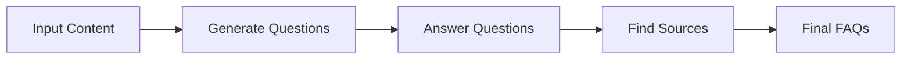
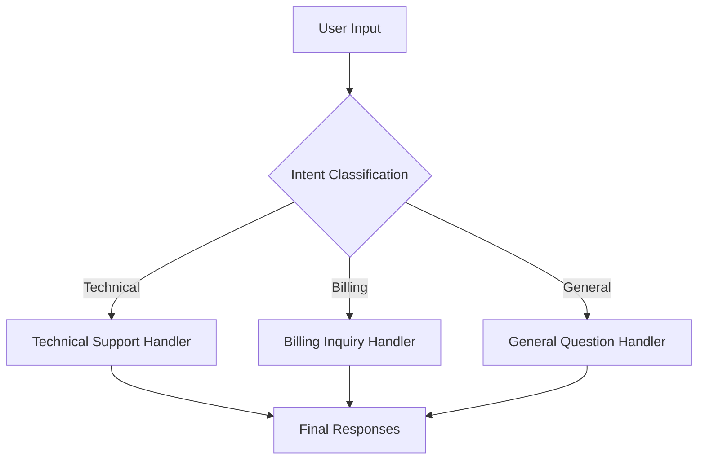
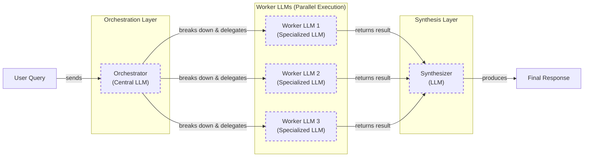

# Lesson 5: Basic Workflow Ingredients

In our previous lessons, we laid the groundwork for AI Engineering. We explored the AI agent landscape, looked at the difference between rule-based LLM workflows and autonomous AI agents, covered context engineering, and saw how to get reliable structured outputs from LLMs. Now, we will build on that foundation by assembling these components into robust systems.

We will tackle a fundamental challenge in AI engineering: moving from simple, single-prompt applications to complex, multi-step workflows. A single, monolithic prompt that tries to do everything at once is an unreliable approach. It is hard to debug, difficult to maintain, and often produces inconsistent results. The solution is to think like a software engineer and embrace modularity.

This lesson explores the building blocks of LLM workflows: chaining multiple LLM calls, running them in parallel, implementing conditional routing, and using the orchestrator-worker pattern. We will explain why breaking down complex tasks is more effective than relying on a single, large LLM call. Through practical examples using the Google Gemini library, you will learn how to build a sequential workflow for FAQ generation and a routing workflow for customer service. These patterns will give you the foundational skills to construct sophisticated and reliable LLM applications.

## The Challenge with Complex Single LLM Calls

When you first start building with LLMs, the temptation is to write a single, massive prompt that does everything. You ask the model to generate questions, find answers, and cite sources all in one go. Sometimes, it even works. But as soon as you move from a simple demo to a production application, this approach falls apart.

A single, complex LLM call is a black box. When it fails, you are left with a giant, messy string and no clear idea of what went wrong. Debugging becomes a nightmare of trial-and-error prompt tweaking. This lack of modularity also makes the system brittle; if you want to improve just one part of the task, like the answer generation, you risk breaking everything else. Studies confirm this: as the number of requirements in a single prompt increases, model accuracy drops significantly. For example, GPT-4o's accuracy falls from 98.7% with one requirement to 85% with nineteen, as it struggles to follow all instructions [[5]](https://arxiv.org/html/2505.13360v1).

This approach also runs headfirst into a well-documented architectural limitation of LLMs: the "lost in the middle" problem. Research from Stanford and UC Berkeley has shown that LLMs exhibit a U-shaped performance curve when processing long contexts [[1]](https://arxiv.org/abs/2307.03172). They pay close attention to information at the beginning and the end of the prompt but tend to ignore what is in the middle. This happens due to architectural quirks like causal attention masking, where early tokens get more cumulative attention, and positional encoding decay, which weakens the signal for tokens far from the start or end [[2]](https://dev.to/thousand_miles_ai/the-lost-in-the-middle-problem-why-llms-ignore-the-middle-of-your-context-window-3al2). Stuffing more information into a single prompt just creates a bigger "middle" for the model to get lost in.

Furthermore, monolithic prompts are highly sensitive to minor changes. A slight rephrasing of an instruction or a small variation in the input data can cause the output to change drastically and unpredictably. This lack of reproducibility makes it nearly impossible to build a reliable system. The complexity also leads to overstuffed context windows. Every tool call, function parameter, and response payload consumes tokens. In a long, single-pass operation, critical context from early on can be pushed out of the window or diluted by intermediate results, leading to silent failures where the model "forgets" a key constraint [[22]](https://futureagi.substack.com/p/how-tool-chaining-fails-in-production).

Finally, monolithic prompts are often inefficient. A single, complex prompt can sometimes consume more tokens than a series of smaller, focused ones, leading to higher costs and latency. The model wastes resources trying to juggle multiple instructions at once.

Let's see this in practice. We will start with the usual setup, then build a complex prompt to generate a Frequently Asked Questions (FAQ) list from a few documents on renewable energy.

1.  First, we set up our environment by importing the necessary libraries, loading our API key, and initializing the Gemini client. We will use the `gemini-2.5-flash` model, which is fast and cost-effective for these tasks.
    ```python
    import asyncio
    from enum import Enum
    import random
    import time
    
    from pydantic import BaseModel, Field
    from google import genai
    from google.genai import types
    
    from lessons.utils import env
    from lessons.utils import pretty_print
    
    env.load(required_env_vars=["GOOGLE_API_KEY"])
    
    client = genai.Client()
    
    MODEL_ID = "gemini-2.5-flash"
    ```
    It outputs:
    ```text
    Trying to load environment variables from /.../.env
    Environment variables loaded successfully.
    Both GOOGLE_API_KEY and GEMINI_API_KEY are set. Using GOOGLE_API_KEY.
    ```

2.  Next, we define our source content: three mock web pages about solar energy, wind turbines, and energy storage.
    ```python
    webpage_1 = {
        "title": "The Benefits of Solar Energy",
        "content": """
        Solar energy is a renewable powerhouse, offering numerous environmental and economic benefits.
        By converting sunlight into electricity through photovoltaic (PV) panels, it reduces reliance on fossil fuels,
        thereby cutting down greenhouse gas emissions. Homeowners who install solar panels can significantly
        lower their monthly electricity bills, and in some cases, sell excess power back to the grid.
        While the initial installation cost can be high, government incentives and long-term savings make
        it a financially viable option for many. Solar power is also a key component in achieving energy
        independence for nations worldwide.
        """,
    }
    
    webpage_2 = {
        "title": "Understanding Wind Turbines",
        "content": """
        Wind turbines are towering structures that capture kinetic energy from the wind and convert it into
        electrical power. They are a critical part of the global shift towards sustainable energy.
        Turbines can be installed both onshore and offshore, with offshore wind farms generally producing more
        consistent power due to stronger, more reliable winds. The main challenge for wind energy is its
        intermittency—it only generates power when the wind blows. This necessitates the use of energy
        storage solutions, like large-scale batteries, to ensure a steady supply of electricity.
        """,
    }
    
    webpage_3 = {
        "title": "Energy Storage Solutions",
        "content": """
        Effective energy storage is the key to unlocking the full potential of renewable sources like solar
        and wind. Because these sources are intermittent, storing excess energy when it's plentiful and
        releasing it when it's needed is crucial for a stable power grid. The most common form of
        large-scale storage is pumped-hydro storage, but battery technologies, particularly lithium-ion,
        are rapidly becoming more affordable and widespread. These batteries can be used in homes, businesses,
        and at the utility scale to balance energy supply and demand, making our energy system more
        resilient and reliable.
        """,
    }
    
    all_sources = [webpage_1, webpage_2, webpage_3]
    
    combined_content = "\n\n".join(
        [f"Source Title: {source['title']}\nContent: {source['content']}" for source in all_sources]
    )
    ```

3.  Now, let's create a single, complex prompt that asks the LLM to generate questions, find answers, and cite sources all at once. We will use Pydantic models, as we learned in Lesson 4, to ask for a structured JSON output.
    ```python
    class FAQ(BaseModel):
        """A FAQ is a question and answer pair, with a list of sources used to answer the question."""
        question: str = Field(description="The question to be answered")
        answer: str = Field(description="The answer to the question")
        sources: list[str] = Field(description="The sources used to answer the question")
    
    class FAQList(BaseModel):
        """A list of FAQs"""
        faqs: list[FAQ] = Field(description="A list of FAQs")
    
    n_questions = 10
    prompt_complex = f"""
    Based on the provided content from three webpages, generate a list of exactly {n_questions} frequently asked questions (FAQs).
    For each question, provide a concise answer derived ONLY from the text.
    After each answer, you MUST include a list of the 'Source Title's that were used to formulate that answer.
    
    <provided_content>
    {combined_content}
    </provided_content>
    """.strip()
    
    config = types.GenerateContentConfig(
        response_mime_type="application/json",
        response_schema=FAQList
    )
    response_complex = client.models.generate_content(
        model=MODEL_ID,
        contents=prompt_complex,
        config=config
    )
    result_complex = response_complex.parsed
    ```
    It outputs:
    ```text
    {
      "question": "What is solar energy and how does it work?",
      "answer": "Solar energy is a renewable powerhouse that converts sunlight into electricity through photovoltaic (PV) panels.",
      "sources": [
        "The Benefits of Solar Energy"
      ]
    }
    ...
    {
      "question": "Why is energy storage crucial for renewable energy sources like solar and wind?",
      "answer": "Effective energy storage is key to unlocking the full potential of renewable sources because it allows storing excess energy when plentiful and releasing it when needed, which is crucial for a stable power grid.",
      "sources": [
        "Energy Storage Solutions",
        "Understanding Wind Turbines"
      ]
    }
    ...
    ```

While this output looks reasonable, it hides potential issues. For instance, some answers might draw from multiple sources, but the model may only cite one. The more complex the instructions, the higher the chance of subtle inaccuracies. This single-prompt approach is a good starting point, but to build a truly reliable system, we need to break the problem down.

## The Power of Modularity: Why Chain LLM Calls?

The solution to the chaos of monolithic prompts is a principle that has guided software engineering for decades: modularity. Instead of one giant function, we write many small, focused ones. In AI engineering, the equivalent is **prompt chaining**: connecting multiple LLM calls sequentially, where the output of one step becomes the input for the next. This approach, which evolved from reasoning techniques like Chain-of-Thought [[35]](https://huggingface.co/blog/dcarpintero/design-patterns-for-building-agentic-workflows), shares its foundations with other decomposition strategies like least-to-most prompting and self-consistency, which also improve performance by breaking down complexity [[36]](https://www.getmaxim.ai/articles/prompt-chaining-for-ai-engineers-a-practical-guide-to-improving-llm-output-quality/). This divide-and-conquer strategy is the key to building reliable and maintainable LLM applications.

The benefits are immediate and substantial.

**Improved modularity** is the most obvious advantage. Each LLM call in a chain handles a specific, well-defined sub-task. This makes individual components easier to test, version, and reuse. For example, a content creation pipeline might chain a text generation step with separate steps for title suggestion and SEO metadata, allowing each to be optimized independently [[26]](https://www.decodingai.com/p/stop-building-ai-agents-use-these). For instance, AppFolio uses LangGraph to manage complex AI copilot workflows, demonstrating how modular components can be orchestrated effectively [[20]](https://www.zenml.io/blog/llmops-in-production-457-case-studies-of-what-actually-works).

This modularity leads to **enhanced accuracy**. Simpler, targeted prompts reduce the cognitive load on the LLM. Instead of trying to follow a dozen instructions at once, the model can focus on doing one thing well. Research has shown that complex, multi-example prompts can dramatically increase error rates. One study found that few-shot prompts caused a 52.9% error rate, 38 times higher than simpler zero-shot prompts, largely due to parsing failures from overwhelming the model [[3]](https://aclanthology.org/2025.ommm-1.4.pdf).

**Easier debugging** is another critical win. When a chained workflow fails, you can pinpoint exactly which step broke. You have the inputs and outputs for each stage, allowing you to isolate the problem quickly. This is a stark contrast to the black box of a single prompt. Companies like Acxiom have turned to observability tools like LangSmith to gain visibility into their multi-agent interactions and debug complex workflows [[20]](https://www.zenml.io/blog/llmops-in-production-457-case-studies-of-what-actually-works).

Finally, chaining offers **increased flexibility and optimization**. You can swap out, update, or fine-tune individual components without re-engineering the entire system. A powerful pattern is to use different models for different steps. You might use a cheap, fast model like Gemini Flash for a simple classification task, and a more powerful but expensive model like Gemini Pro for a complex generation task. This hybrid approach can lead to significant cost savings, as demonstrated by benchmarks that show token savings of 30-82% by sharing instructions across batched tasks [[4]](https://aclanthology.org/2025.gem-1.14.pdf).

However, chaining is not a silver bullet. One of the biggest production risks is **cascading failures**. When one tool in the chain produces an incorrect or partial result, that error flows downstream and compounds at every subsequent step. Unlike traditional software where errors throw exceptions, LLM tool chains often fail silently. A 2025 study found that error propagation was the most common failure pattern in LLM agent trajectories [[22]](https://futureagi.substack.com/p/how-tool-chaining-fails-in-production). To mitigate this, engineers validate the output at every step using Pydantic or JSON Schema and implement circuit breakers to isolate failing components [[22]](https://futureagi.substack.com/p/how-tool-chaining-fails-in-production).

Chaining also introduces more API calls, which can increase latency and cost. There is also the engineering overhead of writing the "glue code" to connect the steps. While frameworks like LangChain can simplify this, they also add layers of abstraction that can make debugging more difficult if you do not understand what is happening under the hood [[26]](https://www.decodingai.com/p/stop-building-ai-agents-use-these).

## Building a Sequential Workflow: FAQ Generation Pipeline

Let's refactor our complex FAQ generation prompt into a reliable, three-step sequential workflow. By breaking the task into `Generate Questions` → `Answer Questions` → `Find Sources`, we gain control and predictability at each stage. This hands-on example will demonstrate how to build a simple yet robust pipeline from scratch, showing how each focused component contributes to a more reliable final output. This modular approach is not just good practice; it is essential for building systems that are easy to debug, maintain, and improve over time.

Image 1: A flowchart illustrating the sequential FAQ generation pipeline.


1.  First, we create a function to generate a list of questions. This initial step is crucial as it sets the scope for the rest of the workflow. The LLM call is focused on a single task: identifying relevant and distinct questions from the provided content. By isolating this step, we ensure that the quality of the questions is high before moving on. We use a Pydantic model, `QuestionList`, to enforce a structured output, guaranteeing that we receive a clean list of strings that can be easily passed to the next stage of the pipeline.
    ```python
    class QuestionList(BaseModel):
        """A list of questions"""
        questions: list[str] = Field(description="A list of questions")
    
    prompt_generate_questions = """
    Based on the content below, generate a list of {n_questions} relevant and distinct questions that a user might have.
    
    <provided_content>
    {combined_content}
    </provided_content>
    """.strip()
    
    def generate_questions(content: str, n_questions: int = 10) -> list[str]:
        """
        Generate a list of questions based on the provided content.
        """
        config = types.GenerateContentConfig(
            response_mime_type="application/json",
            response_schema=QuestionList
        )
        response_questions = client.models.generate_content(
            model=MODEL_ID,
            contents=prompt_generate_questions.format(n_questions=n_questions, combined_content=content),
            config=config
        )
    
        return response_questions.parsed.questions
    ```
    Let's test this function to see the kind of questions it generates. This gives us a tangible output to inspect before we proceed.
    ```python
    questions = generate_questions(combined_content, n_questions=10)
    ```
    It outputs:
    ```text
    What are the primary environmental and economic benefits of solar energy?
    ...
    Can excess solar power generated by homeowners be sold back to the grid?
    ```

2.  Next, we define a function dedicated to answering a single question. The prompt for this function is carefully crafted: it instructs the model to use *only* the provided content and to keep the answer concise. This is a critical constraint for building a grounded and factual system. By isolating the answering task, we significantly reduce the risk of the model hallucinating or pulling in external information, which is a common failure mode in less-structured systems.
    ```python
    prompt_answer_question = """
    Using ONLY the provided content below, answer the following question.
    The answer should be concise and directly address the question.
    
    <question>
    {question}
    </question>
    
    <provided_content>
    {combined_content}
    </provided_content>
    """.strip()
    
    def answer_question(question: str, content: str) -> str:
        """
        Generate an answer for a specific question using only the provided content.
        """
        answer_response = client.models.generate_content(
            model=MODEL_ID,
            contents=prompt_answer_question.format(question=question, combined_content=content),
        )
        return answer_response.text
    ```
    We can test this with one of the questions generated in the previous step to verify its performance in isolation.
    ```python
    test_question = questions[0]
    test_answer = answer_question(test_question, combined_content)
    ```
    It outputs:
    ```text
    The primary environmental benefit of solar energy is cutting down greenhouse gas emissions by reducing reliance on fossil fuels. Economically, it allows homeowners to significantly lower their monthly electricity bills and potentially sell excess power back to the grid.
    ```

3.  Finally, we create a function to find the sources for a given question-answer pair. This step adds a layer of traceability and verifiability to our system, which is crucial for production applications. The LLM acts as a verifier, cross-referencing the generated answer against the original documents to identify the exact sources used. This is far more reliable than asking the model to generate an answer and cite sources simultaneously, as it separates the creative task (answering) from the analytical task (sourcing).
    ```python
    class SourceList(BaseModel):
        """A list of source titles that were used to answer the question"""
        sources: list[str] = Field(description="A list of source titles that were used to answer the question")
    
    prompt_find_sources = """
    You will be given a question and an answer that was generated from a set of documents.
    Your task is to identify which of the original documents were used to create the answer.
    
    <question>
    {question}
    </question>
    
    <answer>
    {answer}
    </answer>
    
    <provided_content>
    {combined_content}
    </provided_content>
    """.strip()
    
    def find_sources(question: str, answer: str, content: str) -> list[str]:
        """
        Identify which sources were used to generate an answer.
        """
        config = types.GenerateContentConfig(
            response_mime_type="application/json",
            response_schema=SourceList
        )
        sources_response = client.models.generate_content(
            model=MODEL_ID,
            contents=prompt_find_sources.format(question=question, answer=answer, combined_content=content),
            config=config
        )
        return sources_response.parsed.sources
    ```
    Testing this final step confirms that the model can accurately trace the answer back to its origin.
    ```python
    test_sources = find_sources(test_question, test_answer, combined_content)
    ```
    It outputs:
    ```text
    ['The Benefits of Solar Energy']
    ```

4.  Now, we assemble these three functions into a single sequential workflow. The code iterates through each generated question, calls the `answer_question` function, then the `find_sources` function, and compiles the results into a final list of `FAQ` objects. This step-by-step process ensures that each part of the task is completed correctly before moving to the next, resulting in a highly reliable and transparent pipeline.
    ```python
    def sequential_workflow(content, n_questions=10) -> list[FAQ]:
        """
        Execute the complete sequential workflow for FAQ generation.
        """
        questions = generate_questions(content, n_questions)
    
        final_faqs = []
        for question in questions:
            answer = answer_question(question, content)
            sources = find_sources(question, answer, content)
            faq = FAQ(question=question, answer=answer, sources=sources)
            final_faqs.append(faq)
    
        return final_faqs
    
    start_time = time.monotonic()
    sequential_faqs = sequential_workflow(combined_content, n_questions=4)
    end_time = time.monotonic()
    print(f"Sequential processing completed in {end_time - start_time:.2f} seconds")
    ```
    It outputs:
    ```text
    Sequential processing completed in 22.20 seconds
    ...
    {
      "question": "What are the primary financial benefits of installing solar panels for homeowners, and are there any initial costs to consider?",
      "answer": "The primary financial benefits of installing solar panels for homeowners are significantly lowered monthly electricity bills and, in some cases, the ability to sell excess power back to the grid. The initial installation cost can be high.",
      "sources": [
        "The Benefits of Solar Energy"
      ]
    }
    ...
    ```

This sequential workflow took over 20 seconds to process just four questions. While it is far more reliable and debuggable than our original monolithic prompt, the latency is high because each of the eight LLM calls (four for answers, four for sources) runs one after another. In the next section, we will see how to fix this.

## Optimizing Sequential Workflows With Parallel Processing

Our sequential workflow is reliable but slow. The bottleneck is clear: we are processing each question one by one, even though the tasks for each question (answering and finding sources) are completely independent of each other. This is a perfect scenario for parallelization. By running these independent tasks concurrently, we can dramatically reduce the total processing time without sacrificing the modularity we gained from chaining.

This approach is sometimes referred to as a "Map-Reduce-style" workflow, where a task is mapped across multiple parallel workers and their results are then reduced into a final output. A key benefit is mitigating the "straggler effect," where one unusually slow task in a sequence holds up the entire process. By running tasks in parallel, the overall latency is determined by the slowest single task, not the sum of all task times [[37]](https://www.ideals.illinois.edu/items/139597/bitstreams/450749/data.pdf).

For I/O-bound operations like making API calls to an LLM, Python’s `asyncio` library is the ideal tool. Instead of waiting for one API call to finish before starting the next, `asyncio` allows us to initiate multiple calls at once and process the results as they come in. This overlaps the waiting time for network responses, leading to significant speedups. Benchmarks show `asyncio` can be nearly 20 times faster than sequential execution for network requests, outperforming traditional threading due to lower overhead [[27]](https://medium.com/@sizanmahmud08/python-concurrency-showdown-asyncio-vs-threading-vs-multiprocessing-which-should-you-choose-in-31205161899a). For developers working with libraries that do not support `asyncio`, Python's `ThreadPoolExecutor` offers a suitable alternative, though with slightly higher context-switching overhead [[28]](https://testdriven.io/blog/python-concurrency-parallelism/).

However, running many requests in parallel introduces a new challenge: rate limits. LLM APIs restrict the number of requests per minute (RPM) and tokens per minute (TPM) [[9]](https://tianpan.co/blog/2026-03-11-llm-api-resilience-production). A naive parallel implementation can easily overwhelm these limits, causing API calls to fail. Production-grade systems must implement robust resilience patterns. The standard is **exponential backoff with full jitter**, which intelligently retries failed requests with increasing, randomized delays. This prevents a "thundering herd" of synchronized retries from overwhelming the server. It is also critical to implement a **retry budget** (e.g., total retries should not exceed 10% of total requests) and to only retry at the outermost layer of your application to avoid a retry storm, where retries at multiple layers multiply into a massive number of backend calls [[9]](https://tianpan.co/blog/2026-03-11-llm-api-resilience-production).

Let's implement a parallel version of our FAQ workflow using `asyncio`.

1.  First, we create asynchronous versions of our `answer_question` and `find_sources` functions using `async def`. The `google-genai` library provides an async client (`client.aio`) that we can `await`.
    ```python
    async def answer_question_async(question: str, content: str) -> str:
        """
        Async version of answer_question function.
        """
        prompt = prompt_answer_question.format(question=question, combined_content=content)
        response = await client.aio.models.generate_content(
            model=MODEL_ID,
            contents=prompt
        )
        return response.text
    
    async def find_sources_async(question: str, answer: str, content: str) -> list[str]:
        """
        Async version of find_sources function.
        """
        prompt = prompt_find_sources.format(question=question, answer=answer, combined_content=content)
        config = types.GenerateContentConfig(
            response_mime_type="application/json",
            response_schema=SourceList
        )
        response = await client.aio.models.generate_content(
            model=MODEL_ID,
            contents=prompt,
            config=config
        )
        return response.parsed.sources
    ```

2.  Next, we create a function that processes a single question by running the answer generation and source finding steps concurrently.
    ```python
    async def process_question_parallel(question: str, content: str) -> FAQ:
        """
        Process a single question by generating answer and finding sources in parallel.
        """
        answer = await answer_question_async(question, content)
        sources = await find_sources_async(question, answer, content)
        return FAQ(
            question=question,
            answer=answer,
            sources=sources
        )
    ```

3.  Finally, we define the main parallel workflow. After generating the initial list of questions synchronously, we create a list of `asyncio` tasks—one for each question. `asyncio.gather` runs all these tasks concurrently and waits for them to complete.
    ```python
    async def parallel_workflow(content: str, n_questions: int = 10) -> list[FAQ]:
        """
        Execute the complete parallel workflow for FAQ generation.
        """
        # Generate questions (this step remains synchronous)
        questions = generate_questions(content, n_questions)
    
        # Process all questions in parallel
        tasks = [process_question_parallel(question, content) for question in questions]
        parallel_faqs = await asyncio.gather(*tasks)
    
        return parallel_faqs
    
    start_time = time.monotonic()
    parallel_faqs = await parallel_workflow(combined_content, n_questions=4)
    end_time = time.monotonic()
    print(f"Parallel processing completed in {end_time - start_time:.2f} seconds")
    ```
    It outputs:
    ```text
    Parallel processing completed in 8.98 seconds
    ...
    {
      "question": "What are the primary environmental and economic benefits of using solar energy?",
      "answer": "The primary environmental benefit of solar energy is cutting down greenhouse gas emissions by reducing reliance on fossil fuels.\n\nThe primary economic benefits include significantly lower monthly electricity bills, the ability to sell excess power back to the grid, long-term savings, and contributing to energy independence for nations.",
      "sources": [
        "The Benefits of Solar Energy"
      ]
    }
    ...
    ```

The parallel workflow completed in just under 9 seconds, more than twice as fast as the sequential version. This demonstrates the power of parallelization for optimizing workflows with independent steps.

## Introducing Dynamic Behavior: Routing and Conditional Logic

So far, our workflows have been linear, following a fixed path from start to finish. But real-world applications often require dynamic behavior. We need a way to make decisions and branch the workflow based on the user's input or the state of the system. This is where routing comes in.

Routing uses conditional logic to direct a workflow down different paths. This mirrors patterns from event-driven microservices, where a central router, or "producer," publishes an event (like a user query) and specialized "consumer" services subscribe to the events they are designed to handle [[38]](https://medium.com/@nemagan/event-driven-microservices-patterns-and-use-cases-1de0d9473fa1). It is another application of the "divide-and-conquer" principle, allowing us to create specialized prompts and handlers for different types of tasks instead of trying to build one-size-fits-all logic. A powerful pattern is to use an LLM call itself as the classification step, effectively creating an intelligent dispatcher.

This is particularly useful in customer service applications. Instead of a single, monolithic prompt trying to handle every possible query, a router can first classify the user's intent—is this a billing issue, a technical problem, or a general question? Based on that classification, the query is sent to a specialized agent with the right tools and context to handle it effectively. This is often called the Coordinator/Dispatcher pattern [[30]](https://developers.googleblog.com/developers-guide-to-multi-agent-patterns-in-adk/).

Prompt engineering for this classification step is critical. The prompt must clearly define the possible intents and provide enough context for the LLM to make an accurate decision. A common failure mode is misclassification due to ambiguous user queries. To build a robust classifier, it is essential to include a fallback or "Other" category for unclear inputs and to use few-shot examples to guide the model on edge cases [[12]](https://www.vellum.ai/blog/how-to-build-intent-detection-for-your-chatbot).

By branching the workflow, we keep each path focused and optimized. The prompt for a billing agent does not need to know anything about troubleshooting technical issues, and vice versa. This separation of concerns makes the system more robust, easier to maintain, and allows for more accurate and context-aware responses.

## Building a Basic Routing Workflow

Let's build a simple routing workflow for a customer service system. The goal is to classify a user's query into one of three intents—Technical Support, Billing Inquiry, or General Question—and then route it to a specialized handler that generates an appropriate first response.

Image 2: A flowchart illustrating a basic routing workflow for customer service.


Designing the classification step requires a clear and comprehensive taxonomy of intents. You should identify the main reasons users interact with your system and group them into distinct categories, using insights from existing customer interactions or FAQs. It is also crucial to include a fallback intent to handle queries that do not fit neatly into any category [[12]](https://www.vellum.ai/blog/how-to-build-intent-detection-for-your-chatbot). For more complex systems, a two-stage architecture can improve precision. For example, an initial, cheaper model or a semantic search (embedding-based) router can retrieve a set of candidate intents, and a more powerful LLM can then select the best match from that narrowed-down list [[15]](https://aws.amazon.com/blogs/machine-learning/multi-llm-routing-strategies-for-generative-ai-applications-on-aws/).

1.  First, we define the possible intents using a Python `Enum` and a Pydantic model to structure the classifier's output. The prompt asks the LLM to categorize the user's query based on a provided list of categories. This classification step is the core of our router.
    ```python
    class IntentEnum(str, Enum):
        TECHNICAL_SUPPORT = "Technical Support"
        BILLING_INQUIRY = "Billing Inquiry"
        GENERAL_QUESTION = "General Question"
    
    class UserIntent(BaseModel):
        intent: IntentEnum = Field(description="The intent of the user's query")
    
    prompt_classification = """
    Classify the user's query into one of the following categories.
    
    <categories>
    {categories}
    </categories>
    
    <user_query>
    {user_query}
    </user_query>
    """.strip()
    
    def classify_intent(user_query: str) -> IntentEnum:
        """Uses an LLM to classify a user query."""
        prompt = prompt_classification.format(
            user_query=user_query,
            categories=[intent.value for intent in IntentEnum]
        )
        config = types.GenerateContentConfig(
            response_mime_type="application/json",
            response_schema=UserIntent
        )
        response = client.models.generate_content(
            model=MODEL_ID,
            contents=prompt,
            config=config
        )
        return response.parsed.intent
    ```
    Let's test the classifier with a few different queries:
    ```python
    query_1 = "My internet connection is not working."
    intent_1 = classify_intent(query_1)
    # intent_1 is IntentEnum.TECHNICAL_SUPPORT
    
    query_2 = "I think there is a mistake on my last invoice."
    intent_2 = classify_intent(query_2)
    # intent_2 is IntentEnum.BILLING_INQUIRY
    ```

2.  Next, we define specialized prompts for each intent. The technical support prompt asks for troubleshooting details, the billing prompt asks for an account number, and the general question prompt provides a fallback response. Each prompt is tailored to its specific task.
    ```python
    prompt_technical_support = """
    You are a helpful technical support agent.
    Provide a helpful first response, asking for more details like what troubleshooting steps they have already tried.
    ...
    """.strip()
    
    prompt_billing_inquiry = """
    You are a helpful billing support agent.
    Acknowledge their concern and inform them that you will need to look up their account, asking for their account number.
    ...
    """.strip()
    
    prompt_general_question = """
    You are a general assistant.
    Apologize that you are not sure how to help.
    ...
    """.strip()
    ```

3.  Finally, we create the `handle_query` function, which acts as our router. It takes the user's query and the classified intent, and uses a simple `if/elif/else` block to select the correct prompt and generate a response.
    ```python
    def handle_query(user_query: str, intent: str) -> str:
        """Routes a query to the correct handler based on its classified intent."""
        if intent == IntentEnum.TECHNICAL_SUPPORT:
            prompt = prompt_technical_support.format(user_query=user_query)
        elif intent == IntentEnum.BILLING_INQUIRY:
            prompt = prompt_billing_inquiry.format(user_query=user_query)
        else:
            prompt = prompt_general_question.format(user_query=user_query)
        
        response = client.models.generate_content(
            model=MODEL_ID,
            contents=prompt
        )
        return response.text
    
    response_1 = handle_query(query_1, intent_1)
    ```
    The response for the technical support query is:
    ```text
    Hello there! I'm sorry to hear you're having trouble with your internet connection. That can definitely be frustrating.
    
    To help me understand what's going on and assist you best, could you please provide a few more details?
    
    1.  **What exactly are you experiencing?** For example, are you not seeing your Wi-Fi network, is your Wi-Fi connected but no websites are loading, or are there any specific error messages?
    2.  **What device are you trying to connect with?** (e.g., a laptop, phone, desktop PC)
    3.  **Have you already tried any troubleshooting steps yourself?** For instance, have you tried:
        *   Restarting your computer or device?
        *   Restarting your Wi-Fi router and modem (unplugging them for 30 seconds and plugging them back in)?
        *   Checking if other devices can connect to the internet?
    
    Once I have a bit more information, I'll be happy to guide you through some potential solutions.
    ```

This simple routing workflow demonstrates how to build more intelligent and adaptable systems. By classifying intent first, we can provide more accurate and helpful responses, creating a better user experience and a more maintainable application. Production routing systems often add more sophisticated logic. For example, open-source libraries like LiteLLM provide a routing layer that can select models based on priority (fallback), distribute load (weighted load balancing), or use conditional logic based on request metadata. This allows for dynamic routing to the cheapest or fastest available model that can handle a given task, adding another layer of optimization and resilience [[39]](https://www.truefoundry.com/routing).

## Orchestrator-Worker Pattern: Dynamic Task Decomposition

Routing is powerful when you have a set of pre-defined paths for your workflow. But what happens when the task is so complex that you cannot predict the necessary steps in advance? This is where the **orchestrator-worker** pattern comes in. Also known as the "planner-executor" pattern [[40]](https://productschool.com/blog/artificial-intelligence/ai-agent-orchestration-patterns), it functions like a manufacturing assembly line [[41]](https://beam.ai/agentic-insights/multi-agent-orchestration-patterns-production). A central "orchestrator" LLM acts as a project manager, analyzing a complex query and dynamically breaking it down into smaller subtasks. These are delegated to specialized "worker" components, which can run in parallel. A final "synthesizer" LLM assembles the results into a single, coherent response.

This pattern sees heavy use in enterprise applications. For example, Wells Fargo uses it to help bankers navigate thousands of internal procedures, and Salesforce implements it in their Atlas Reasoning Engine [[41]](https://beam.ai/agentic-insights/multi-agent-orchestration-patterns-production). The key difference from simple parallelization is its flexibility. The subtasks are not hard-coded; they are determined at runtime by the orchestrator based on the specific input. This pattern is ideal for unpredictable, multifaceted problems that require intelligent coordination, such as planning a project, conducting research, or handling a complex customer service request [[16]](https://agents.kour.me/orchestrator-worker/).

However, this pattern introduces its own set of production challenges, with potential speed improvements of 5-20x over sequential processing being offset by new failure modes [[18]](https://online.stevens.edu/blog/building-self-healing-ai-orchestrator-reflexion-patterns/). The orchestrator can become a bottleneck, but more subtle issues arise from the LLM-based coordination itself. A common failure mode is the "loop-of-loops," where a minor, transient error triggers a cascade of retries across multiple layers of the system. For example, a flaky API call might cause a planner agent to retry, which in turn causes a worker agent to retry, which then causes the LLM call itself to retry. One blip can result in 27 LLM calls, leading to runaway costs and system instability. The mitigation is to enforce a single, shared retry policy with a step budget that is decremented by every agent in the chain [[42]](https://dev.to/gabrielanhaia/the-5-failure-modes-of-multi-agent-systems-nobody-warns-you-about-2fml).

Other challenges include:

*   **Poor Decomposition:** The orchestrator might create subtasks that are too broad, too granular, or cannot be reintegrated correctly [[43]](https://orq.ai/blog/why-do-multi-agent-llm-systems-fail).
*   **Routing and Ambiguity:** An LLM orchestrator can misclassify the state of the workflow, sending a task down the wrong path or getting stuck when multiple paths seem valid [[44]](https://arxiv.org/html/2604.27891v1).
*   **Uncoordinated Outputs:** Workers might produce outputs in incompatible formats (e.g., one returns YAML while the synthesizer expects JSON), causing the entire workflow to crash [[43]](https://orq.ai/blog/why-do-multi-agent-llm-systems-fail).
*   **System Drift:** Without a strong central controller, autonomous negotiation between LLMs can lead to degraded context and inconsistent reasoning, causing the system to drift into chaos rather than converge on a solution [[34]](https://huggingface.co/blog/Musamolla/multi-agent-llm-systems-failure).

Ensuring clear schemas and contracts between the orchestrator, workers, and synthesizer is critical for mitigating these risks [[19]](https://platform.claude.com/cookbook/patterns-agents-orchestrator-workers).

Let's build an orchestrator-worker system to handle a multi-part customer query.

Image 3: A flowchart illustrating the orchestrator-worker pattern with a central orchestrator delegating tasks to parallel worker LLMs and a synthesizer combining results.


1.  First, we define the orchestrator. Its job is to parse a user query and break it down into a list of structured `Task` objects. We provide the orchestrator with a clear schema defining the possible task types (`BillingInquiry`, `ProductReturn`, `StatusUpdate`) and their required parameters.
    ```python
    class QueryTypeEnum(str, Enum):
        BILLING_INQUIRY = "BillingInquiry"
        PRODUCT_RETURN = "ProductReturn"
        STATUS_UPDATE = "StatusUpdate"
    
    class Task(BaseModel):
        query_type: QueryTypeEnum
        invoice_number: str | None = None
        product_name: str | None = None
        reason_for_return: str | None = None
        order_id: str | None = None
    
    class TaskList(BaseModel):
        tasks: list[Task]
    
    prompt_orchestrator = f"""
    You are a master orchestrator. Your job is to break down a complex user query into a list of sub-tasks.
    Each sub-task must have a "query_type" and its necessary parameters.
    
    The possible "query_type" values and their required parameters are:
    1. "{QueryTypeEnum.BILLING_INQUIRY.value}": Requires "invoice_number".
    2. "{QueryTypeEnum.PRODUCT_RETURN.value}": Requires "product_name" and "reason_for_return".
    3. "{QueryTypeEnum.STATUS_UPDATE.value}": Requires "order_id".
    
    <user_query>
    {{query}}
    </user_query>
    """.strip()
    
    def orchestrator(query: str) -> list[Task]:
        """Breaks down a complex query into a list of tasks."""
        # ... (LLM call with prompt_orchestrator) ...
    ```

2.  Next, we implement the specialized workers. For this example, our workers will be simple Python functions that simulate backend actions, but in a real system, they could be other LLM calls or API integrations. We have a worker for billing, one for returns, and one for order status. Each worker returns a structured Pydantic object.
    ```python
    class BillingTask(BaseModel):
        # ... fields for billing result ...
    
    def handle_billing_worker(invoice_number: str, original_user_query: str) -> BillingTask:
        # ... (simulates opening an investigation) ...
    
    class ReturnTask(BaseModel):
        # ... fields for return result ...
    
    def handle_return_worker(product_name: str, reason_for_return: str) -> ReturnTask:
        # ... (simulates generating an RMA) ...
    
    class StatusTask(BaseModel):
        # ... fields for status result ...
    
    def handle_status_worker(order_id: str) -> StatusTask:
        # ... (simulates fetching order status) ...
    ```

3.  The synthesizer's role is to take the structured outputs from all the workers and compose a single, user-friendly message. Its prompt instructs it to combine the various pieces of information into one cohesive email.
    ```python
    prompt_synthesizer = """
    You are a master communicator. Combine several distinct pieces of information from our support team into a single, well-formatted, and friendly email to a customer.
    
    <points>
    {formatted_results}
    </points>
    
    Combine these points into one cohesive response.
    """.strip()
    
    def synthesizer(results: list[Task]) -> str:
        """Combines structured results from workers into a single user-facing message."""
        # ... (formats worker results and calls LLM with prompt_synthesizer) ...
    ```

4.  Finally, we tie everything together in a main processing function and test it with a complex query that involves all three task types.
    ```python
    def process_user_query(user_query):
        """Processes a query using the Orchestrator-Worker-Synthesizer pattern."""
        tasks_list = orchestrator(user_query)
        # ... (dispatch tasks to workers) ...
        worker_results = [] # ... collect results
        final_user_message = synthesizer(worker_results)
        # ... (print results) ...
    
    complex_customer_query = """
    Hi, I'm writing to you because I have a question about invoice #INV-7890. It seems higher than I expected.
    Also, I would like to return the 'SuperWidget 5000' I bought because it's not compatible with my system.
    Finally, can you give me an update on my order #A-12345?
    """.strip()
    
    process_user_query(complex_customer_query)
    ```
    The orchestrator first deconstructs the query into three distinct tasks. Then, the appropriate workers handle each task, producing structured results. Finally, the synthesizer combines these results into a single, helpful email to the customer:
    ```text
    Dear Customer,
    
    Thank you for reaching out to us. Here is an update on your recent inquiries:
    
    Regarding your BillingInquiry:
      - Invoice Number: INV-7890
      - Your Stated Concern: "It seems higher than I expected."
      - Our Action: An investigation (Case ID: INV_CASE_5631) has been opened regarding your concern.
      - Expected Resolution: We will get back to you within 2 business days.
    
    Regarding your ProductReturn:
      - Product: SuperWidget 5000
      - Reason for Return: "it's not compatible with my system"
      - Return Authorization (RMA): RMA-68427
      - Instructions: Please pack the 'SuperWidget 5000' securely in its original packaging if possible. Include all accessories and manuals. Write the RMA number (RMA-68427) clearly on the outside of the package. Ship to: Returns Department, 123 Automation Lane, Tech City, TC 98765.
    
    Regarding your StatusUpdate:
      - Order ID: A-12345
      - Current Status: Shipped
      - Carrier: SuperFast Shipping
      - Tracking Number: SF259163
      - Delivery Estimate: Tomorrow
    
    We hope this information is helpful. Please let us know if you have any other questions.
    
    Best regards,
    The Support Team
    ```

This example showcases the power of the orchestrator-worker pattern to handle complex, unpredictable tasks by dynamically decomposing them into manageable steps, processing them with specialized components, and synthesizing a comprehensive final output.

## Conclusion

In this lesson, we have moved from the unreliable world of monolithic prompts to the structured, modular domain of LLM workflows. We have seen that breaking down complex tasks into smaller, focused steps is the key to building robust and maintainable AI applications. We started with sequential prompt chaining, which gives us reliability and debuggability. Then, we accelerated our workflow with parallel processing, learning how to handle independent tasks concurrently for a significant speed boost. We introduced dynamic behavior with routing, using an LLM to classify intent and direct traffic to specialized handlers. Finally, we explored the orchestrator-worker pattern, a powerful technique for dynamically decomposing unpredictable tasks at runtime.

These patterns—chaining, parallelization, routing, and orchestration—are not just theoretical concepts; they are the fundamental ingredients you will use to build almost any production-grade LLM system. They provide the control, flexibility, and reliability that single-prompt solutions lack.

As you move forward, remember that the goal is not to build the most complex system, but the simplest one that works reliably. Start with a simple chain, and only add complexity like parallelization or routing when you have a clear need. These patterns are the building blocks. In our next lesson, we will take a major step forward by giving our workflows the ability to interact with the outside world through tools and function calling, turning them from simple data processors into active agents that can take action.

## References

- [1] N. Liu, K. Lin, D. Hewitt, A. Paranjape, M. Bevilacqua, F. Petroni, and P. Liang. (2023). Lost in the Middle: How Language Models Use Long Contexts. arXiv. https://arxiv.org/abs/2307.03172
- [2] The "Lost in the Middle" Problem — Why LLMs Ignore the Middle of Your Context Window. (2026, September 12). DEV Community. https://dev.to/thousand_miles_ai/the-lost-in-the-middle-problem-why-llms-ignore-the-middle-of-your-context-window-3al2
- [3] FLARE: A Framework for Large-Scale, Low-Resource, and Fair Evaluation of Election Misinformation Classifiers. (2025). ACL Anthology. https://aclanthology.org/2025.ommm-1.4.pdf
- [4] ZeMPE: A Comprehensive Benchmark for Zero-Shot Generalization of Multi-Problem Prompts. (2025). ACL Anthology. https://aclanthology.org/2025.gem-1.14.pdf
- [5] Underspecification in Instruction-Following. (2025). arXiv. https://arxiv.org/html/2505.13360v1
- [6] LLM-Based Prompt Routing. (n.d.). Emergent Mind. https://www.emergentmind.com/topics/llm-based-prompt-routing
- [7] Universal Model Routing. (2025). arXiv. https://arxiv.org/html/2502.08773v1
- [8] LangGraph Workflows. (n.d.). LangChain. https://langchain-ai.github.io/langgraphjs/tutorials/workflows
- [9] Tian, P. (2026, March 11). LLM API Resilience in Production: Rate Limits, Failover, and the Hidden Costs of Naive Retry Logic. https://tianpan.co/blog/2026-03-11-llm-api-resilience-production
- [10] Building Effective Agents. (n.d.). Anthropic. https://www.anthropic.com/engineering/building-effective-agents
- [11] Basic Multi-LLM Workflows. (n.d.). GitHub. https://github.com/hugobowne/building-with-ai/blob/main/notebooks/01-agentic-continuum.ipynb
- [12] A Beginner's Guide to LLM Intent Classification for Chatbots. (n.d.). Vellum. https://www.vellum.ai/blog/how-to-build-intent-detection-for-your-chatbot
- [13] Why LLMs Ignore the Middle of Your Context Window. (n.d.). GitHub. https://github.com/user-attachments/assets/1174092b-8a82-45e0-b6f7-c2084c8a8d13
- [14] Top 5 LLM Routing Techniques. (n.d.). Maxim. https://www.getmaxim.ai/articles/top-5-llm-routing-techniques/
- [15] Multi-LLM routing strategies for generative AI applications on AWS. (n.d.). AWS. https://aws.amazon.com/blogs/machine-learning/multi-llm-routing-strategies-for-generative-ai-applications-on-aws/
- [16] The Orchestrator-Worker Pattern. (n.d.). Kour. https://agents.kour.me/orchestrator-worker/
- [17] DIY #17: Orchestrator-Worker LLM Agent Pattern. (n.d.). ML Pills. https://mlpills.substack.com/p/diy-17-orchestrator-worker-llm-agent
- [18] Building a Self-Healing AI Orchestrator with Reflexion Patterns. (n.d.). Stevens Institute of Technology. https://online.stevens.edu/blog/building-self-healing-ai-orchestrator-reflexion-patterns/
- [19] Orchestrator-Workers Workflow. (n.d.). Claude Cookbook. https://platform.claude.com/cookbook/patterns-agents-orchestrator-workers
- [20] LLMOps in Production: 457 Case Studies of What Actually Works. (2025, January 20). ZenML. https://www.zenml.io/blog/llmops-in-production-457-case-studies-of-what-actually-works
- [21] LLMOps in Production: 287 More Case Studies of What Actually Works. (n.d.). ZenML. https://www.zenml.io/blog/llmops-in-production-287-more-case-studies-of-what-actually-works
- [22] How Tool Chaining Fails in Production LLM Agents and How to Fix It. (n.d.). futureagi.substack.com. https://futureagi.substack.com/p/how-tool-chaining-fails-in-production
- [23] ChainRAG: A Progressive Retrieval Framework for Complex Question Answering. (2025). ACL Anthology. https://aclanthology.org/2025.acl-long.1089.pdf
- [24] Keeping AI Agents Grounded: Context Engineering Strategies That Prevent Context Rot. (n.d.). Milvus. https://milvus.io/blog/keeping-ai-agents-grounded-context-engineering-strategies-that-prevent-context-rot-using-milvus.md
- [25] Context Rot Isn’t a Bug. It’s a Feature. (n.d.). Morph. https://www.morphllm.com/context-rot
- [26] Stop Building AI Agents. Use These 6 Patterns Instead. (2025, July 1). Decoding AI. https://www.decodingai.com/p/stop-building-ai-agents-use-these
- [27] Python Concurrency Showdown: Asyncio vs. Threading vs. Multiprocessing. (2024, May 8). Medium. https://medium.com/@sizanmahmud08/python-concurrency-showdown-asyncio-vs-threading-vs-multiprocessing-which-should-you-choose-in-31205161899a
- [28] Concurrency and Parallelism in Python. (n.d.). TestDriven.io. https://testdriven.io/blog/python-concurrency-parallelism/
- [29] Concurrency and Parallelism in Python: Threads, Multiprocessing, and Async Programming. (2023, August 28). DEV Community. https://dev.to/nkpydev/concurrency-and-parallelism-in-python-threads-multiprocessing-and-async-programming-64d
- [30] Developer’s guide to multi-agent patterns in ADK. (2025, December 16). Google for Developers. https://developers.googleblog.com/developers-guide-to-multi-agent-patterns-in-adk/
- [31] Agentic AI Design Patterns. (n.d.). LinkedIn. https://www.linkedin.com/posts/chiragsubramanian_agentic-ai-design-patterns-my-practical-activity-7416830806939230208-nRFc
- [32] LLM Orchestration: The Key to Unlocking AI’s Full Potential. (n.d.). Master of Code. https://masterofcode.com/blog/llm-orchestration
- [33] How to Build an Advanced Customer Support LLM with a Multi-Agent Workflow. (n.d.). Socure. https://www.socure.com/tech-blog/build-advanced-customer-support-llm-multi-agent-workflow
- [34] The 9 Reasons Why Multi-Agent LLM Systems Fail in Production. (n.d.). Hugging Face. https://huggingface.co/blog/Musamolla/multi-agent-llm-systems-failure
- [35] Design Patterns for Building Agentic Workflows. (n.d.). Hugging Face. https://huggingface.co/blog/dcarpintero/design-patterns-for-building-agentic-workflows
- [36] Prompt Chaining for AI Engineers: A Practical Guide to Improving LLM Output Quality. (n.d.). Maxim. https://www.getmaxim.ai/articles/prompt-chaining-for-ai-engineers-a-practical-guide-to-improving-llm-output-quality/
- [37] SkyAPI: A Structure-Aware API Routing Framework for Real-time, Cost-Efficient Multi-Agent Systems. (n.d.). Illinois Digital Environment for Access to Learning and Scholarship. https://www.ideals.illinois.edu/items/139597/bitstreams/450749/data.pdf
- [38] Event-Driven Microservices: Patterns and Use Cases. (n.d.). Medium. https://medium.com/@nemagan/event-driven-microservices-patterns-and-use-cases-1de0d9473fa1
- [39] Routing. (n.d.). TrueFoundry. https://www.truefoundry.com/routing
- [40] AI Agent Orchestration Patterns. (n.d.). Product School. https://productschool.com/blog/artificial-intelligence/ai-agent-orchestration-patterns
- [41] Multi-Agent Orchestration Patterns in Production. (n.d.). Beam. https://beam.ai/agentic-insights/multi-agent-orchestration-patterns-production
- [42] The 5 Failure Modes of Multi-Agent Systems Nobody Warns You About. (n.d.). DEV Community. https://dev.to/gabrielanhaia/the-5-failure-modes-of-multi-agent-systems-nobody-warns-you-about-2fml
- [43] Why Do Multi-Agent LLM Systems Fail? (n.d.). Orq.ai. https://orq.ai/blog/why-do-multi-agent-llm-systems-fail
- [44] Orchestration of an In-Context Agent. (n.d.). arXiv. https://arxiv.org/html/2604.27891v1