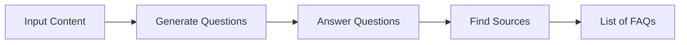
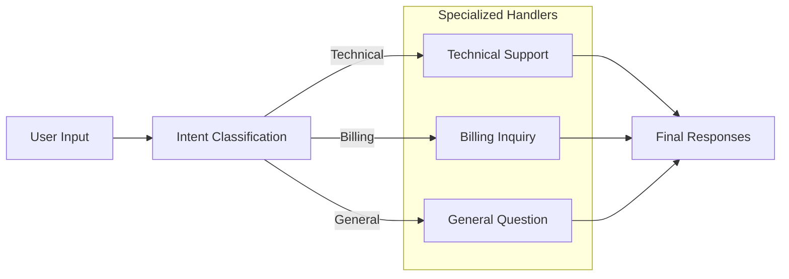
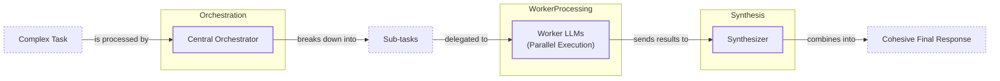

# Lesson 5: Basic AI Workflow Patterns

In the previous lessons, we’ve covered the fundamentals of AI Engineering, from understanding the agent landscape to context engineering and structured outputs. We’ve established that for AI systems to be reliable, we need to move beyond simple, single-prompt interactions. But how do we actually build systems that can handle complex, multi-step problems?

We once tried to build an FAQ generation system for a client using a single, massive prompt. We asked the LLM to read several documents, generate questions, write answers, and cite its sources—all in one go. The initial results looked promising in the demo, but in production, it was a nightmare. The output was inconsistent, debugging was impossible, and the system would silently fail in unpredictable ways. This experience taught us a crucial lesson: monolithic prompts are a recipe for unreliability.

The solution is to think like an engineer: break down complex problems into smaller, manageable pieces. This is the core idea behind AI workflow patterns. Instead of one giant leap, we take a series of deliberate, well-defined steps.

This lesson explores the fundamental patterns for building robust LLM workflows: sequential chaining, parallelization, routing, and the orchestrator-worker model. These techniques are the building blocks for 95% of the production AI systems we see today [[36]](https://www.decodingai.com/p/stop-building-ai-agents-use-these). By mastering them, you’ll learn how to build applications that are not only powerful but also modular, debuggable, and maintainable. We will cover:
- The challenges of using complex, single LLM calls.
- Why modularity through chaining is a more robust approach.
- How to build a sequential FAQ generation pipeline.
- How to optimize workflows with parallel processing.
- How to introduce dynamic behavior with routing.
- How to use the orchestrator-worker pattern for dynamic task decomposition.

## The Challenge with Complex Single LLM Calls

Attempting to solve a multi-step task with a single, complex prompt is a common pitfall for engineers new to LLMs. While it seems efficient, this approach introduces several significant challenges that make systems brittle and hard to maintain.

First, debugging becomes incredibly difficult. When a monolithic prompt fails, it’s like a black box. You know the final output is wrong, but you have no visibility into which part of the reasoning process failed. Did the model misunderstand the first instruction? Did it fail to synthesize information correctly? Without intermediate outputs, pinpointing the source of the error is nearly impossible. This is a common failure mode in production systems, where observability is key [[20]](https://www.zenml.io/blog/llmops-in-production-457-case-studies-of-what-actually-works), [[21]](https://www.zenml.io/blog/llmops-in-production-287-more-case-studies-of-what-actually-works).

Second, this approach lacks modularity. A single, large prompt is a tightly coupled system. If you need to update one part of the logic—say, change the output format for one sub-task—you risk breaking the entire prompt. This makes iterative development and maintenance a slow and painful process. A study on GPT-4 Turbo, for example, found that few-shot prompts with multiple examples had a 52.9% error rate, primarily due to parsing failures caused by the examples overwhelming the model without clear structural guidance [[3]](https://aclanthology.org/2025.ommm-1.4.pdf).

Another critical issue is the "lost in the middle" problem. Research from Stanford and UC Berkeley has shown that LLMs exhibit a U-shaped performance curve when processing long contexts. They pay the most attention to information at the beginning and end of the prompt, while details in the middle are often overlooked [[2]](https://dev.to/thousand_miles_ai/the-lost-in-the-middle-problem-why-llms-ignore-the-middle-of-your-context-window-3al2). This is caused by architectural factors like causal attention masking and positional encoding decay. As your prompt grows more complex and stuffs more information into the context, you increase the risk that crucial details will be lost in this "dead zone."

Finally, complex prompts can be inefficient. While it seems counterintuitive, a single large prompt can sometimes consume more tokens and be more expensive than a series of smaller, targeted calls. This is because the model has to process all the instructions and context at once, even parts that are irrelevant to a specific sub-task.

Let's see this in action. We’ll start by setting up our environment to use Google's Gemini models.

1.  First, we import the necessary libraries and initialize the Gemini client. We will use `gemini-2.5-flash` for our examples, as it’s fast and cost-effective.
    ```python
    import asyncio
    from enum import Enum
    import random
    import time
    
    from pydantic import BaseModel, Field
    from google import genai
    from google.genai import types
    
    from lessons.utils import env
    from lessons.utils import pretty_print
    
    env.load(required_env_vars=["GOOGLE_API_KEY"])
    
    client = genai.Client()
    
    MODEL_ID = "gemini-2.5-flash"
    ```
    It outputs:
    ```text
    Trying to load environment variables from /path/to/your/project/.env
    Environment variables loaded successfully.
    Both GOOGLE_API_KEY and GEMINI_API_KEY are set. Using GOOGLE_API_KEY.
    ```

2.  Next, we'll create mock content from three webpages about renewable energy to serve as our knowledge base.
    ```python
    webpage_1 = {
        "title": "The Benefits of Solar Energy",
        "content": """
        Solar energy is a renewable powerhouse, offering numerous environmental and economic benefits.
        By converting sunlight into electricity through photovoltaic (PV) panels, it reduces reliance on fossil fuels,
        thereby cutting down greenhouse gas emissions. Homeowners who install solar panels can significantly
        lower their monthly electricity bills, and in some cases, sell excess power back to the grid.
        While the initial installation cost can be high, government incentives and long-term savings make
        it a financially viable option for many. Solar power is also a key component in achieving energy
        independence for nations worldwide.
        """,
    }
    
    webpage_2 = {
        "title": "Understanding Wind Turbines",
        "content": """
        Wind turbines are towering structures that capture kinetic energy from the wind and convert it into
        electrical power. They are a critical part of the global shift towards sustainable energy.
        Turbines can be installed both onshore and offshore, with offshore wind farms generally producing more
        consistent power due to stronger, more reliable winds. The main challenge for wind energy is its
        intermittency—it only generates power when the wind blows. This necessitates the use of energy
        storage solutions, like large-scale batteries, to ensure a steady supply of electricity.
        """,
    }
    
    webpage_3 = {
        "title": "Energy Storage Solutions",
        "content": """
        Effective energy storage is the key to unlocking the full potential of renewable sources like solar
        and wind. Because these sources are intermittent, storing excess energy when it's plentiful and
        releasing it when it's needed is crucial for a stable power grid. The most common form of
        large-scale storage is pumped-hydro storage, but battery technologies, particularly lithium-ion,
        are rapidly becoming more affordable and widespread. These batteries can be used in homes, businesses,
        and at the utility scale to balance energy supply and demand, making our energy system more
        resilient and reliable.
        """,
    }
    
    all_sources = [webpage_1, webpage_2, webpage_3]
    
    # We'll combine the content for the LLM to process
    combined_content = "\n\n".join(
        [f"Source Title: {source['title']}\nContent: {source['content']}" for source in all_sources]
    )
    ```

3.  Now, let's create a single, complex prompt that asks the model to generate 10 FAQs, provide answers, and cite sources, all at once. We will use Pydantic models to define the structured output we expect, a technique we covered in Lesson 4.
    ```python
    # This prompt tries to do everything at once: generate questions, find answers,
    # and cite sources. This complexity can often confuse the model.
    n_questions = 10
    prompt_complex = f"""
    Based on the provided content from three webpages, generate a list of exactly {n_questions} frequently asked questions (FAQs).
    For each question, provide a concise answer derived ONLY from the text.
    After each answer, you MUST include a list of the 'Source Title's that were used to formulate that answer.
    
    <provided_content>
    {combined_content}
    </provided_content>
    """.strip()
    
    # Pydantic classes for structured outputs
    class FAQ(BaseModel):
        """A FAQ is a question and answer pair, with a list of sources used to answer the question."""
        question: str = Field(description="The question to be answered")
        answer: str = Field(description="The answer to the question")
        sources: list[str] = Field(description="The sources used to answer the question")
    
    class FAQList(BaseModel):
        """A list of FAQs"""
        faqs: list[FAQ] = Field(description="A list of FAQs")
    
    # Generate FAQs
    config = types.GenerateContentConfig(
        response_mime_type="application/json",
        response_schema=FAQList
    )
    response_complex = client.models.generate_content(
        model=MODEL_ID,
        contents=prompt_complex,
        config=config
    )
    result_complex = response_complex.parsed
    ```
    It outputs:
    ```text
    {
      "question": "What is solar energy and how does it work?",
      "answer": "Solar energy is a renewable powerhouse that converts sunlight into electricity through photovoltaic (PV) panels.",
      "sources": [
        "The Benefits of Solar Energy"
      ]
    }
    ----------------------------------------------------------------------------------------------------
    {
      "question": "What are the environmental benefits of using solar energy?",
      "answer": "Solar energy reduces reliance on fossil fuels, thereby cutting down greenhouse gas emissions.",
      "sources": [
        "The Benefits of Solar Energy"
      ]
    }
    ...
    ```

While this output seems reasonable, the more complex the instructions, the higher the chance of inaccuracies. For instance, the model might occasionally miss citing a source when an answer is synthesized from multiple documents. This unreliability makes it risky for production use.

## The Power of Modularity: Why Chain LLM Calls?

To build more reliable systems, we can adopt a "divide and conquer" strategy known as prompt chaining. Instead of a single complex call, we break the task into a sequence of smaller, focused LLM calls. The output of one step becomes the input for the next, forming a chain [[36]](https://www.decodingai.com/p/stop-building-ai-agents-use-these), [[41]](https://medium.com/@fabiolalli/a-practical-guide-to-prompt-engineering-techniques-and-their-use-cases-5f8574e2cd9a). This modular approach is a cornerstone of building robust AI workflows.

This approach mirrors modern data engineering, where complex tasks are broken into sequential steps in an ETL (Extract, Transform, Load) pipeline. Treating each LLM call as a distinct step provides the same benefits of modularity and testability proven effective in data systems [[54]](https://meltano.com/blog/llm-apps-are-mostly-data-pipelines).

This method offers several powerful advantages. First, it dramatically improves **modularity**. Each LLM call is a self-contained component focused on a single task. This makes the system easier to test, version, and maintain. If you need to improve one part of the workflow, you can do so without affecting the others. This modularity is a key theme in many production case studies, where teams at companies like Acxiom and AppFolio use frameworks like LangGraph to manage complex, multi-step interactions [[20]](https://www.zenml.io/blog/llmops-in-production-457-case-studies-of-what-actually-works).

Second, it enhances **accuracy**. Simpler, targeted prompts reduce the cognitive load on the LLM, a principle from cognitive science suggesting that focused, manageable tasks improve performance [[55]](https://lemonlearning.com/blog/cognitive-load-theory-types-and-principles-for-reduction). Research confirms that prompts with less syntactic complexity yield more consistent results [[1]](https://www.mdpi.com/2079-9292/13/23/4712). When a model only has to focus on one thing—like generating questions or finding sources—it is far more likely to produce a correct output, an insight that powers techniques like Chain-of-Thought (CoT) prompting.

Third, it makes **debugging** much easier. With a chained workflow, you have clear, intermediate results at each step. If something goes wrong, you can inspect the output of each call to pinpoint exactly where the failure occurred. This visibility is essential for building and maintaining production-grade systems. This is particularly important because errors in LLM chains can compound; a small mistake in an early step can propagate and corrupt the entire final output. By validating the output at each step, you can catch these errors before they spread, a practice that is impossible with a monolithic prompt [[56]](https://tomtunguz.com/compounding-error-llms/).

Fourth, it offers greater **flexibility** and **optimization** potential. You can use different models for different steps in the chain. For a simple classification task, a fast, cheap model like Claude Haiku or Gemini Flash might be sufficient. For a complex reasoning or generation step, you can switch to a more powerful model like GPT-4o or Gemini Pro. This allows you to balance performance, cost, and latency effectively [[36]](https://www.decodingai.com/p/stop-building-ai-agents-use-these).

However, chaining is not without its trade-offs. The most obvious downside is increased **latency and cost**, as you are making multiple API calls instead of one. There's also a risk of **information loss** between steps. If an early step in the chain produces an incomplete or slightly incorrect summary, that error can propagate and be amplified by subsequent steps [[22]](https://futureagi.substack.com/p/how-tool-chaining-fails-in-production), [[47]](https://wand.ai/blog/compounding-error-effect-in-large-language-models-a-growing-challenge). Mitigating this requires careful prompt design and passing structured state objects between calls instead of raw text. Finally, managing the "glue code" that connects the prompts adds engineering overhead, though libraries like LangGraph can help manage this complexity.

## Building a Sequential Workflow: FAQ Generation Pipeline

Let's refactor our FAQ generation task into a clean, three-step sequential workflow. By breaking the problem down, we gain more control and reliability. The three steps are:
1.  **Generate Questions**: Create a list of questions based on the source content.
2.  **Answer Questions**: For each question, generate a concise answer.
3.  **Find Sources**: For each question-answer pair, identify the original source documents.

Image 1: A sequential FAQ generation pipeline showing the flow from input content to a list of FAQs.


This modular pipeline makes each step simpler and more focused, leading to better results.

1.  First, we create a function dedicated to generating questions. The prompt instructs the model to produce a list of relevant questions based on the provided content. We use a Pydantic model, `QuestionList`, to ensure the output is a structured list of strings.
    ```python
    class QuestionList(BaseModel):
        """A list of questions"""
        questions: list[str] = Field(description="A list of questions")
    
    prompt_generate_questions = """
    Based on the content below, generate a list of {n_questions} relevant and distinct questions that a user might have.
    
    <provided_content>
    {combined_content}
    </provided_content>
    """.strip()
    
    def generate_questions(content: str, n_questions: int = 10) -> list[str]:
        """
        Generate a list of questions based on the provided content.
    
        Args:
            content: The combined content from all sources
    
        Returns:
            list: A list of generated questions
        """
        config = types.GenerateContentConfig(
            response_mime_type="application/json",
            response_schema=QuestionList
        )
        response_questions = client.models.generate_content(
            model=MODEL_ID,
            contents=prompt_generate_questions.format(n_questions=n_questions, combined_content=content),
            config=config
        )
    
        return response_questions.parsed.questions
    
    # Test the question generation function
    questions = generate_questions(combined_content, n_questions=10)
    ```
    It outputs:
    ```text
    What are the primary environmental and economic benefits of solar energy?
    ----------------------------------------------------------------------------------------------------
    How do homeowners financially benefit from installing solar panels?
    ----------------------------------------------------------------------------------------------------
    What is the main process by which wind turbines generate electricity?
    ...
    ```

2.  Next, we define a function to answer a single question. This prompt is tightly focused: given the content and a question, it must produce a concise answer.
    ```python
    prompt_answer_question = """
    Using ONLY the provided content below, answer the following question.
    The answer should be concise and directly address the question.
    
    <question>
    {question}
    </question>
    
    <provided_content>
    {combined_content}
    </provided_content>
    """.strip()
    
    def answer_question(question: str, content: str) -> str:
        """
        Generate an answer for a specific question using only the provided content.
    
        Args:
            question: The question to answer
            content: The combined content from all sources
    
        Returns:
            str: The generated answer
        """
        answer_response = client.models.generate_content(
            model=MODEL_ID,
            contents=prompt_answer_question.format(question=question, combined_content=content),
        )
        return answer_response.text
    
    # Test the answer generation function
    test_question = questions[0]
    test_answer = answer_question(test_question, combined_content)
    ```
    It outputs:
    ```text
    Question
    ----------------------------------------------------------------------------------------------------
    What are the primary environmental and economic benefits of solar energy?
    ----------------------------------------------------------------------------------------------------
    Answer
    ----------------------------------------------------------------------------------------------------
    The primary environmental benefit of solar energy is cutting down greenhouse gas emissions by reducing reliance on fossil fuels. Economically, it allows homeowners to significantly lower their monthly electricity bills and potentially sell excess power back to the grid.
    ```

3.  Our final function identifies the sources for a given answer. This step is crucial for traceability and helps build user trust. We use another Pydantic model, `SourceList`, for the structured output.
    ```python
    class SourceList(BaseModel):
        """A list of source titles that were used to answer the question"""
        sources: list[str] = Field(description="A list of source titles that were used to answer the question")
    
    prompt_find_sources = """
    You will be given a question and an answer that was generated from a set of documents.
    Your task is to identify which of the original documents were used to create the answer.
    
    <question>
    {question}
    </question>
    
    <answer>
    {answer}
    </answer>
    
    <provided_content>
    {combined_content}
    </provided_content>
    """.strip()
    
    def find_sources(question: str, answer: str, content: str) -> list[str]:
        """
        Identify which sources were used to generate an answer.
    
        Args:
            question: The original question
            answer: The generated answer
            content: The combined content from all sources
    
        Returns:
            list: A list of source titles that were used
        """
        config = types.GenerateContentConfig(
            response_mime_type="application/json",
            response_schema=SourceList
        )
        sources_response = client.models.generate_content(
            model=MODEL_ID,
            contents=prompt_find_sources.format(question=question, answer=answer, combined_content=content),
            config=config
        )
        return sources_response.parsed.sources
    
    # Test the source finding function
    test_sources = find_sources(test_question, test_answer, combined_content)
    ```
    It outputs:
    ```text
    Sources
    ----------------------------------------------------------------------------------------------------
    The Benefits of Solar Energy
    ```

4.  Now, we combine these functions into a single sequential workflow. We first generate all questions, then loop through each one to generate an answer and find its sources.
    ```python
    def sequential_workflow(content, n_questions=10) -> list[FAQ]:
        """
        Execute the complete sequential workflow for FAQ generation.
    
        Args:
            content: The combined content from all sources
    
        Returns:
            list: A list of FAQs with questions, answers, and sources
        """
        # Generate questions
        questions = generate_questions(content, n_questions)
    
        # Answer and find sources for each question sequentially
        final_faqs = []
        for question in questions:
            # Generate an answer for the current question
            answer = answer_question(question, content)
    
            # Identify the sources for the generated answer
            sources = find_sources(question, answer, content)
    
            faq = FAQ(
                question=question,
                answer=answer,
                sources=sources
            )
            final_faqs.append(faq)
    
        return final_faqs
    
    # Execute the sequential workflow (measure time for comparison)
    start_time = time.monotonic()
    sequential_faqs = sequential_workflow(combined_content, n_questions=4)
    end_time = time.monotonic()
    print(f"Sequential processing completed in {end_time - start_time:.2f} seconds")
    ```
    It outputs:
    ```text
    Sequential processing completed in 22.20 seconds
    ----------------------------------------------------------------------------------------------------
    {
      "question": "What are the primary financial benefits of installing solar panels for homeowners, and are there any initial costs to consider?",
      "answer": "The primary financial benefits of installing solar panels for homeowners are significantly lowered monthly electricity bills and, in some cases, the ability to sell excess power back to the grid. The initial installation cost can be high.",
      "sources": [
        "The Benefits of Solar Energy"
      ]
    }
    ...
    ```

This sequential workflow is far more robust than our initial monolithic prompt. Each step is simple, testable, and debuggable. The downside? It took over 20 seconds to process just four questions. For real-time applications, that’s too slow.

## Optimizing Sequential Workflows With Parallel Processing

The sequential workflow is reliable but slow because it processes each question one by one. However, the tasks for each question (answering and finding sources) are independent of each other. This is a perfect opportunity for parallelization, which allows us to run multiple LLM calls concurrently to significantly reduce latency [[46]](https://mlpills.substack.com/p/issue-110-llm-workflow-patterns).

We can use Python's `asyncio` library to implement this. `asyncio` is ideal for I/O-bound tasks like making API calls to an LLM, as it allows the program to perform other work while waiting for network responses [[26]](https://santhalakshminarayana.github.io/blog/concurrency-patterns-python), [[27]](https://medium.com/@sizanmahmud08/python-concurrency-showdown-asyncio-vs-threading-vs-multiprocessing-which-should-you-choose-in-31205161899a).

The trade-offs are clear:
-   **Sequential processing** is predictable and easy to debug but slow.
-   **Parallel processing** is much faster and utilizes resources better but introduces complexity in error handling and can run into API rate limits.

A crucial consideration for parallel workflows is managing API rate limits. Most LLM providers, especially on free tiers, limit the number of requests per minute (RPM) and tokens per minute (TPM). Firing off dozens of parallel requests can quickly exhaust these limits, causing your calls to fail [[7]](https://discuss.ai.google.dev/t/challenges-with-rate-limiting-and-handling-api-responses-in-high-volume-requests/61903). Production-grade systems borrow heavily from microservices architecture to handle this. Common patterns include implementing timeouts (e.g., 30-60 seconds) for each LLM call, using retries with exponential backoff and jitter to manage transient failures, and employing circuit breakers that "trip" after a certain number of failures to prevent overwhelming a struggling API [[9]](https://tianpan.co/blog/2026-03-11-llm-api-resilience-production), [[57]](https://gurusup.com/blog/multi-agent-orchestration-guide).

Let's implement a parallel version of our FAQ workflow.

1.  First, we create asynchronous versions of our `answer_question` and `find_sources` functions using `async def`. The `google-genai` library provides an `aio` client for making asynchronous API calls.
    ```python
    async def answer_question_async(question: str, content: str) -> str:
        """
        Async version of answer_question function.
        """
        prompt = prompt_answer_question.format(question=question, combined_content=content)
        response = await client.aio.models.generate_content(
            model=MODEL_ID,
            contents=prompt
        )
        return response.text
    
    async def find_sources_async(question: str, answer: str, content: str) -> list[str]:
        """
        Async version of find_sources function.
        """
        prompt = prompt_find_sources.format(question=question, answer=answer, combined_content=content)
        config = types.GenerateContentConfig(
            response_mime_type="application/json",
            response_schema=SourceList
        )
        response = await client.aio.models.generate_content(
            model=MODEL_ID,
            contents=prompt,
            config=config
        )
        return response.parsed.sources
    ```

2.  Next, we create a function that processes a single question by running the answer and source-finding tasks concurrently.
    ```python
    async def process_question_parallel(question: str, content: str) -> FAQ:
        """
        Process a single question by generating answer and finding sources in parallel.
        """
        answer = await answer_question_async(question, content)
        sources = await find_sources_async(question, answer, content)
        return FAQ(
            question=question,
            answer=answer,
            sources=sources
        )
    ```

3.  Finally, we define our main parallel workflow. It first generates questions synchronously, then uses `asyncio.gather` to execute `process_question_parallel` for all questions concurrently.
    ```python
    async def parallel_workflow(content: str, n_questions: int = 10) -> list[FAQ]:
        """
        Execute the complete parallel workflow for FAQ generation.
    
        Args:
            content: The combined content from all sources
    
        Returns:
            list: A list of FAQs with questions, answers, and sources
        """
        # Generate questions (this step remains synchronous)
        questions = generate_questions(content, n_questions)
    
        # Process all questions in parallel
        tasks = [process_question_parallel(question, content) for question in questions]
        parallel_faqs = await asyncio.gather(*tasks)
    
        return parallel_faqs
    
    # Execute the parallel workflow (measure time for comparison)
    start_time = time.monotonic()
    parallel_faqs = await parallel_workflow(combined_content, n_questions=4)
    end_time = time.monotonic()
    print(f"Parallel processing completed in {end_time - start_time:.2f} seconds")
    ```
    It outputs:
    ```text
    Parallel processing completed in 8.98 seconds
    ----------------------------------------------------------------------------------------------------
    {
      "question": "What are the primary environmental and economic benefits of using solar energy?",
      "answer": "The primary environmental benefit of solar energy is cutting down greenhouse gas emissions by reducing reliance on fossil fuels.\n\nThe primary economic benefits include significantly lower monthly electricity bills, the ability to sell excess power back to the grid, long-term savings, and contributing to energy independence for nations.",
      "sources": [
        "The Benefits of Solar Energy"
      ]
    }
    ...
    ```

The parallel workflow completed in just under 9 seconds—more than twice as fast as the sequential version. This demonstrates the power of parallelization for optimizing I/O-bound workflows.

## Introducing Dynamic Behavior: Routing and Conditional Logic

So far, our workflows have been static and linear. But real-world applications often require dynamic behavior. We need a way to make decisions and direct the workflow down different paths based on the input. This is where routing, or conditional logic, comes in.

Routing allows us to create more intelligent and efficient systems by directing inputs to specialized handlers. Instead of a one-size-fits-all prompt, we can use an initial LLM call to classify the user's intent and then route the request to a prompt or tool specifically designed for that intent [[12]](https://www.vellum.ai/blog/how-to-build-intent-detection-for-your-chatbot). This pattern is common in data pipelines, where a router might direct different types of data to different processing steps based on content or schema, ensuring each step is optimized for its specific task [[58]](https://www.cloverdx.com/blog/using-llms-in-etl-pipelines-production-scale-best-practices).

This is another application of the "divide and conquer" principle. By keeping prompts specialized, we improve their accuracy and maintainability. From a cognitive science perspective, this approach reduces extraneous cognitive load. A monolithic prompt forces the model to parse multiple, potentially unrelated instructions, whereas a specialized prompt presents only the essential information needed for a single task, leading to more reliable outcomes [[36]](https://www.decodingai.com/p/stop-building-ai-agents-use-these), [[55]](https://lemonlearning.com/blog/cognitive-load-theory-types-and-principles-for-reduction).

A classic use case is a customer support system. A user query could be about a technical issue, a billing problem, or a general question. A routing workflow would first classify the intent and then pass the query to a specialized agent. The technical agent would have access to diagnostic tools, the billing agent to payment systems, and the general agent to a knowledge base [[15]](https://aws.amazon.com/blogs/machine-learning/multi-llm-routing-strategies-for-generative-ai-applications-on-aws/), [[51]](https://www.decodingai.com/p/stop-building-ai-agents-use-these). This ensures the user gets the most relevant and effective help.

## Building a Basic Routing Workflow

Let's build a simple routing workflow for a customer service bot. The system will classify a user's query into one of three intents—Technical Support, Billing Inquiry, or General Question—and then route it to a specialized handler that generates an appropriate response.

Image 2: A routing workflow for customer service, showing user input, intent classification, specialized handlers, and final responses.


This two-stage architecture—classify then handle—is a robust pattern for building dynamic and context-aware applications.

1.  First, we define our intents using a Python `Enum` and a Pydantic model to structure the classifier's output. The prompt asks the LLM to categorize the user's query into one of the predefined intents.
    ```python
    class IntentEnum(str, Enum):
        """
        Defines the allowed values for the 'intent' field.
        Inheriting from 'str' ensures that the values are treated as strings.
        """
        TECHNICAL_SUPPORT = "Technical Support"
        BILLING_INQUIRY = "Billing Inquiry"
        GENERAL_QUESTION = "General Question"
    
    class UserIntent(BaseModel):
        """
        Defines the expected response schema for the intent classification.
        """
        intent: IntentEnum = Field(description="The intent of the user's query")
    
    prompt_classification = """
    Classify the user's query into one of the following categories.
    
    <categories>
    {categories}
    </categories>
    
    <user_query>
    {user_query}
    </user_query>
    """.strip()
    
    
    def classify_intent(user_query: str) -> IntentEnum:
        """Uses an LLM to classify a user query."""
        prompt = prompt_classification.format(
            user_query=user_query,
            categories=[intent.value for intent in IntentEnum]
        )
        config = types.GenerateContentConfig(
            response_mime_type="application/json",
            response_schema=UserIntent
        )
        response = client.models.generate_content(
            model=MODEL_ID,
            contents=prompt,
            config=config
        )
        return response.parsed.intent
    
    
    query_1 = "My internet connection is not working."
    query_2 = "I think there is a mistake on my last invoice."
    query_3 = "What are your opening hours?"
    
    intent_1 = classify_intent(query_1)
    intent_2 = classify_intent(query_2)
    intent_3 = classify_intent(query_3)
    ```
    It outputs:
    ```text
    Question 1
    ----------------------------------------------------------------------------------------------------
    My internet connection is not working.
    ----------------------------------------------------------------------------------------------------
    Intent 1
    ----------------------------------------------------------------------------------------------------
    IntentEnum.TECHNICAL_SUPPORT
    ```

2.  Next, we create three specialized prompts, one for each intent. The technical support prompt asks for more details, the billing prompt requests an account number, and the general question prompt provides a fallback response.
    ```python
    prompt_technical_support = """
    You are a helpful technical support agent.
    
    Here's the user's query:
    <user_query>
    {user_query}
    </user_query>
    
    Provide a helpful first response, asking for more details like what troubleshooting steps they have already tried.
    """.strip()
    
    prompt_billing_inquiry = """
    You are a helpful billing support agent.
    
    Here's the user's query:
    <user_query>
    {user_query}
    </user_query>
    
    Acknowledge their concern and inform them that you will need to look up their account, asking for their account number.
    """.strip()
    
    prompt_general_question = """
    You are a general assistant.
    
    Here's the user's query:
    <user_query>
    {user_query}
    </user_query>
    
    Apologize that you are not sure how to help.
    """.strip()
    ```

3.  Finally, our `handle_query` function implements the routing logic. It takes the user query and the classified intent, selects the appropriate prompt, and calls the LLM to generate the final response.
    ```python
    def handle_query(user_query: str, intent: str) -> str:
        """Routes a query to the correct handler based on its classified intent."""
        if intent == IntentEnum.TECHNICAL_SUPPORT:
            prompt = prompt_technical_support.format(user_query=user_query)
        elif intent == IntentEnum.BILLING_INQUIRY:
            prompt = prompt_billing_inquiry.format(user_query=user_query)
        elif intent == IntentEnum.GENERAL_QUESTION:
            prompt = prompt_general_question.format(user_query=user_query)
        else:
            prompt = prompt_general_question.format(user_query=user_query)
        response = client.models.generate_content(
            model=MODEL_ID,
            contents=prompt
        )
        return response.text
    
    
    response_1 = handle_query(query_1, intent_1)
    response_2 = handle_query(query_2, intent_2)
    response_3 = handle_query(query_3, intent_3)
    ```
    It outputs:
    ```text
    Question 1
    ----------------------------------------------------------------------------------------------------
    My internet connection is not working.
    ----------------------------------------------------------------------------------------------------
    Intent 1
    ----------------------------------------------------------------------------------------------------
    IntentEnum.TECHNICAL_SUPPORT
    ----------------------------------------------------------------------------------------------------
    Response 1
    ----------------------------------------------------------------------------------------------------
    Hello there! I'm sorry to hear you're having trouble with your internet connection. That can definitely be frustrating.
    
    To help me understand what's going on and assist you best, could you please provide a few more details?
    ...
    ```

This simple routing workflow demonstrates how to build more dynamic and intelligent AI systems. By separating classification from handling, we create a modular and scalable architecture.

## Orchestrator-Worker Pattern: Dynamic Task Decomposition

The orchestrator-worker pattern takes dynamic behavior a step further. In this workflow, a central "orchestrator" LLM analyzes a complex query and dynamically breaks it down into a series of sub-tasks. These sub-tasks are then delegated to specialized "worker" LLMs, which can execute in parallel. Finally, a "synthesizer" LLM combines the results from the workers into a single, cohesive response [[17]](https://mlpills.substack.com/p/diy-17-orchestrator-worker-llm-agent), [[32]](https://mlpills.substack.com/p/diy-17-orchestrator-worker-llm-agent).

Image 3: A flowchart illustrating the orchestrator-worker pattern.


This pattern is ideal for unpredictable tasks where the necessary steps cannot be determined in advance [[16]](https://agents.kour.me/orchestrator-worker/), [[19]](https://platform.claude.com/cookbook/patterns-agents-orchestrator-workers). The key difference from simple parallelization is its flexibility: the orchestrator decides the sub-tasks at runtime based on the specific input.

However, this power introduces challenges analogous to those in distributed microservices. A study of over 1,600 production traces found that 79% of multi-agent failures are structural—stemming from issues like ambiguous task specifications, poor inter-agent coordination, and verification failures—not from the LLM's core capabilities [[59]](https://www.zartis.com/multi-agent-system-failure-modes-in-production-the-distributed-systems-problem/).

Common failure modes include **error cascades**, where a single agent's error propagates through the system, and **consensus inertia**, where agents mistakenly treat an early, erroneous output as validated truth, manufacturing false consensus around it. The synthesizer also faces **merge complexity**, struggling to reconcile contradictory or structurally incompatible outputs from different workers [[59]](https://www.zartis.com/multi-agent-system-failure-modes-in-production-the-distributed-systems-problem/), [[60]](https://www.mindstudio.ai/blog/multi-agent-orchestration-patterns/). To mitigate these risks, production systems often adopt the **Saga pattern** from microservices, which defines compensating actions to roll back steps if a later part of the workflow fails [[61]](https://oneuptime.com/blog/post/2026-01-30-microservices-orchestration-pattern/view). Ensuring clear schemas and robust error handling is critical.

Let's build a customer service system using this pattern.

1.  The orchestrator's job is to parse a complex user query and break it down into a list of structured tasks. We define the possible task types and their required parameters using Pydantic models.
    ```python
    class QueryTypeEnum(str, Enum):
        """The type of query to be handled."""
        BILLING_INQUIRY = "BillingInquiry"
        PRODUCT_RETURN = "ProductReturn"
        STATUS_UPDATE = "StatusUpdate"
    
    class Task(BaseModel):
        """A task to be performed."""
        query_type: QueryTypeEnum = Field(description="The type of query to be handled.")
        invoice_number: str | None = Field(description="The invoice number to be used for the billing inquiry.", default=None)
        product_name: str | None = Field(description="The name of the product to be returned.", default=None)
        reason_for_return: str | None = Field(description="The reason for returning the product.", default=None)
        order_id: str | None = Field(description="The order ID to be used for the status update.", default=None)
    
    class TaskList(BaseModel):
        """A list of tasks to be performed."""
        tasks: list[Task] = Field(description="A list of tasks to be performed.")
    
    prompt_orchestrator = f"""
    You are a master orchestrator. Your job is to break down a complex user query into a list of sub-tasks.
    Each sub-task must have a "query_type" and its necessary parameters.
    
    The possible "query_type" values and their required parameters are:
    1. "{QueryTypeEnum.BILLING_INQUIRY.value}": Requires "invoice_number".
    2. "{QueryTypeEnum.PRODUCT_RETURN.value}": Requires "product_name" and "reason_for_return".
    3. "{QueryTypeEnum.STATUS_UPDATE.value}": Requires "order_id".
    
    Here's the user's query.
    
    <user_query>
    {{query}}
    </user_query>
    """.strip()
    
    
    def orchestrator(query: str) -> list[Task]:
        """Breaks down a complex query into a list of tasks."""
        prompt = prompt_orchestrator.format(query=query)
        config = types.GenerateContentConfig(
            response_mime_type="application/json",
            response_schema=TaskList
        )
        response = client.models.generate_content(
            model=MODEL_ID,
            contents=prompt,
            config=config
        )
        return response.parsed.tasks
    ```

2.  We then define our specialized workers. Each worker is a function that handles a specific task type. For this example, they simulate backend API calls (e.g., opening an investigation, generating an RMA number, fetching order status) and return structured data.
    ```python
    # Billing Worker
    class BillingTask(BaseModel):
        query_type: QueryTypeEnum = Field(default=QueryTypeEnum.BILLING_INQUIRY)
        # ... other fields
    
    def handle_billing_worker(invoice_number: str, original_user_query: str) -> BillingTask:
        # ... implementation ...
        return task
    
    # Return Worker
    class ReturnTask(BaseModel):
        query_type: QueryTypeEnum = Field(default=QueryTypeEnum.PRODUCT_RETURN)
        # ... other fields
    
    def handle_return_worker(product_name: str, reason_for_return: str) -> ReturnTask:
        # ... implementation ...
        return task
    
    # Status Worker
    class StatusTask(BaseModel):
        query_type: QueryTypeEnum = Field(default=QueryTypeEnum.STATUS_UPDATE)
        # ... other fields
    
    def handle_status_worker(order_id: str) -> StatusTask:
        # ... implementation ...
        return task
    ```

3.  The synthesizer's role is to take the structured outputs from all the workers and compose a single, human-readable response for the customer.
    ```python
    prompt_synthesizer = """
    You are a master communicator. Combine several distinct pieces of information from our support team into a single, well-formatted, and friendly email to a customer.
    
    Here are the points to include, based on the actions taken for their query:
    <points>
    {formatted_results}
    </points>
    
    Combine these points into one cohesive response.
    Start with a friendly greeting (e.g., "Dear Customer," or "Hi there,") and end with a polite closing (e.g., "Sincerely," or "Best regards,").
    Ensure the tone is helpful and professional.
    """.strip()
    
    
    def synthesizer(results: list[Task]) -> str:
        # ... implementation to format results and call LLM ...
        return response.text
    ```

4.  Finally, we tie everything together in a main pipeline function. Let's test it with a complex query that requires all three workers.
    ```python
    def process_user_query(user_query):
        """Processes a query using the Orchestrator-Worker-Synthesizer pattern."""
        # 1. Run orchestrator
        tasks_list = orchestrator(user_query)
        # ...
        # 2. Run workers
        worker_results = []
        for task in tasks_list:
            if task.query_type == QueryTypeEnum.BILLING_INQUIRY:
                worker_results.append(handle_billing_worker(task.invoice_number, user_query))
            # ... other workers
        # ...
        # 3. Run synthesizer
        final_user_message = synthesizer(worker_results)
        # ...
    
    # Test with customer query
    complex_customer_query = """
    Hi, I'm writing to you because I have a question about invoice #INV-7890. It seems higher than I expected.
    Also, I would like to return the 'SuperWidget 5000' I bought because it's not compatible with my system.
    Finally, can you give me an update on my order #A-12345?
    """.strip()
    
    process_user_query(complex_customer_query)
    ```
    It outputs:
    ```text
    User query
    ----------------------------------------------------------------------------------------------------
    Hi, I'm writing to you because I have a question about invoice #INV-7890. It seems higher than I expected.
    Also, I would like to return the 'SuperWidget 5000' I bought because it's not compatible with my system.
    Finally, can you give me an update on my order #A-12345?
    ----------------------------------------------------------------------------------------------------
    Deconstructed task 1
    ----------------------------------------------------------------------------------------------------
    {
      "query_type": "BillingInquiry",
      "invoice_number": "INV-7890",
      "product_name": null,
      "reason_for_return": null,
      "order_id": null
    }
    ... (other tasks) ...
    ----------------------------------------------------------------------------------------------------
    Worker result 1
    ----------------------------------------------------------------------------------------------------
    {
      "query_type": "BillingInquiry",
      "invoice_number": "INV-7890",
      "user_concern": "The invoice seems higher than expected.",
      "action_taken": "An investigation (Case ID: INV_CASE_6242) has been opened regarding your concern.",
      "resolution_eta": "2 business days"
    }
    ... (other worker results) ...
    ----------------------------------------------------------------------------------------------------
    Final synthesized response
    ----------------------------------------------------------------------------------------------------
    Hi there,
    
    Thank you for reaching out. Here's an update on your requests:
    
    Regarding your BillingInquiry:
      - Invoice Number: INV-7890
      - Your Stated Concern: "The invoice seems higher than expected."
      - Our Action: An investigation (Case ID: INV_CASE_6242) has been opened regarding your concern.
      - Expected Resolution: We will get back to you within 2 business days.
    
    Regarding your ProductReturn:
      - Product: SuperWidget 5000
      - Reason for Return: "it's not compatible with my system"
      - Return Authorization (RMA): RMA-61901
      - Instructions: Please pack the 'SuperWidget 5000' securely in its original packaging if possible. ...
    
    Regarding your StatusUpdate:
      - Order ID: A-12345
      - Current Status: Shipped
      - Carrier: SuperFast Shipping
      - Tracking Number: SF252988
      - Delivery Estimate: Tomorrow
    
    Please let us know if you have any other questions.
    
    Best regards,
    The Support Team
    ```

The orchestrator successfully deconstructed the query into three distinct tasks, dispatched them to the correct workers, and the synthesizer combined the results into a clear, comprehensive response. This pattern provides a powerful and flexible architecture for handling complex, multi-part user requests.

## Conclusion

In this lesson, we've moved from the unpredictable world of monolithic prompts to the structured and reliable domain of AI workflows. We've seen how breaking down complex tasks into smaller, focused steps is the key to building maintainable and scalable AI systems.

We explored four fundamental patterns:
-   **Sequential Chaining**: For tasks that naturally break down into ordered steps, providing clarity and debuggability.
-   **Parallelization**: For speeding up workflows by running independent tasks concurrently, drastically reducing latency.
-   **Routing**: For adding dynamic decision-making to our systems, allowing them to adapt to different inputs.
-   **Orchestrator-Worker**: For tackling complex, unpredictable problems by dynamically decomposing them into sub-tasks.

These patterns are not just theoretical concepts; they are the practical building blocks you will use every day as an AI Engineer. They represent the shift from prompt engineering to true systems thinking. By mastering them, you can create applications that are more accurate, efficient, and robust.

In the upcoming lessons, we will build on these foundations. We will learn how to give our workflows the ability to interact with the outside world through tools and function calling in Lesson 6, and explore advanced reasoning patterns like ReAct in Lesson 7.

## References

- [1] Gozzi, M., & Di Maio, F. (2024). Comparative Analysis of Prompt Strategies for Large Language Models: Single-Task vs. Multitask Prompts. *Electronics*, 13(23), 4712. [https://www.mdpi.com/2079-9292/13/23/4712](https://www.mdpi.com/2079-9292/13/23/4712)
- [2] The "Lost in the Middle" Problem — Why LLMs Ignore the Middle of Your Context Window. (2024, May 29). *DEV Community*. [https://dev.to/thousand_miles_ai/the-lost-in-the-middle-problem-why-llms-ignore-the-middle-of-your-context-window-3al2](https://dev.to/thousand_miles_ai/the-lost-in-the-middle-problem-why-llms-ignore-the-middle-of-your-context-window-3al2)
- [3] FLARE: A Framework for Large-Scale Analysis and Remediation of Errors in Text-based Misinformation Detection. (2025). *aclanthology.org*. [https://aclanthology.org/2025.ommm-1.4.pdf](https://aclanthology.org/2025.ommm-1.4.pdf)
- [4] Challenges with rate-limiting and handling API responses in high-volume requests. (2024, May 21). *Google for Developers*. [https://discuss.ai.google.dev/t/challenges-with-rate-limiting-and-handling-api-responses-in-high-volume-requests/61903](https://discuss.ai.google.dev/t/challenges-with-rate-limiting-and-handling-api-responses-in-high-volume-requests/61903)
- [5] Tian, P. (2026, March 11). LLM API Resilience in Production: Rate Limits, Failover, and the Hidden Costs of Naive Retry Logic. *tianpan.co*. [https://tianpan.co/blog/2026-03-11-llm-api-resilience-production](https://tianpan.co/blog/2026-03-11-llm-api-resilience-production)
- [6] A Beginner's Guide to LLM Intent Classification for Chatbots. (2024, May 15). *Vellum*. [https://www.vellum.ai/blog/how-to-build-intent-detection-for-your-chatbot](https://www.vellum.ai/blog/how-to-build-intent-detection-for-your-chatbot)
- [7] Multi-LLM Routing Strategies for Generative AI Applications on AWS. (2024, June 26). *AWS Machine Learning Blog*. [https://aws.amazon.com/blogs/machine-learning/multi-llm-routing-strategies-for-generative-ai-applications-on-aws/](https://aws.amazon.com/blogs/machine-learning/multi-llm-routing-strategies-for-generative-ai-applications-on-aws/)
- [8] Kour, S. (2024, May 10). Orchestrator-Worker. *agents.kour.me*. [https://agents.kour.me/orchestrator-worker/](https://agents.kour.me/orchestrator-worker/)
- [9] DIY #17 Orchestrator-Worker LLM Agent. (2024, May 12). *ML Pills*. [https://mlpills.substack.com/p/diy-17-orchestrator-worker-llm-agent](https://mlpills.substack.com/p/diy-17-orchestrator-worker-llm-agent)
- [10] Orchestrator-Workers. (n.d.). *Anthropic*. [https://platform.claude.com/cookbook/patterns-agents-orchestrator-workers](https://platform.claude.com/cookbook/patterns-agents-orchestrator-workers)
- [11] LLMOps in Production: 457 Case Studies of What Actually Works. (2025, January 20). *ZenML*. [https://www.zenml.io/blog/llmops-in-production-457-case-studies-of-what-actually-works](https://www.zenml.io/blog/llmops-in-production-457-case-studies-of-what-actually-works)
- [12] LLMOps in Production: 287 More Case Studies of What Actually Works. *ZenML*. [https://www.zenml.io/blog/llmops-in-production-287-more-case-studies-of-what-actually-works](https://www.zenml.io/blog/llmops-in-production-287-more-case-studies-of-what-actually-works)
- [13] How Tool Chaining Fails in Production LLM Agents and How to Fix It. (2026, May 1). *FutureAGI*. [https://futureagi.substack.com/p/how-tool-chaining-fails-in-production](https://futureagi.substack.com/p/how-tool-chaining-fails-in-production)
- [14] Concurrency Patterns in Python. (2024, May 29). *santhalakshminarayana.github.io*. [https://santhalakshminarayana.github.io/blog/concurrency-patterns-python](https://santhalakshminarayana.github.io/blog/concurrency-patterns-python)
- [15] Mahmud, S. (2024, May 29). Python Concurrency Showdown: Asyncio vs. Threading vs. Multiprocessing — Which Should You Choose in 2024? *Medium*. [https://medium.com/@sizanmahmud08/python-concurrency-showdown-asyncio-vs-threading-vs-multiprocessing-which-should-you-choose-in-31205161899a](https://medium.com/@sizanmahmud08/python-concurrency-showdown-asyncio-vs-threading-vs-multiprocessing-which-should-you-choose-in-31205161899a)
- [16] Iusztin, P. (2024, May 10). Stop Building AI Agents. Use These 5 LLM Workflows Instead. *decodingai.com*. [https://www.decodingai.com/p/stop-building-ai-agents-use-these](https://www.decodingai.com/p/stop-building-ai-agents-use-these)
- [17] Lalli, F. (2024, May 29). A Practical Guide to Prompt Engineering Techniques and Their Use Cases. *Medium*. [https://medium.com/@fabiolalli/a-practical-guide-to-prompt-engineering-techniques-and-their-use-cases-5f8574e2cd9a](https://medium.com/@fabiolalli/a-practical-guide-to-prompt-engineering-techniques-and-their-use-cases-5f8574e2cd9a)
- [18] LLM Workflow Patterns. (2024, May 10). *ML Pills*. [https://mlpills.substack.com/p/issue-110-llm-workflow-patterns](https://mlpills.substack.com/p/issue-110-llm-workflow-patterns)
- [19] The Compounding Error Effect in Large Language Models: A Growing Challenge. (2024, May 29). *Wand.ai*. [https://wand.ai/blog/compounding-error-effect-in-large-language-models-a-growing-challenge](https://wand.ai/blog/compounding-error-effect-in-large-language-models-a-growing-challenge)
- [20] LLM Apps Are Mostly Data Pipelines. *Meltano*. [https://meltano.com/blog/llm-apps-are-mostly-data-pipelines](https://meltano.com/blog/llm-apps-are-mostly-data-pipelines)
- [21] Cognitive Load Theory: types and principles for reduction. *Lemon Learning*. [https://lemonlearning.com/blog/cognitive-load-theory-types-and-principles-for-reduction](https://lemonlearning.com/blog/cognitive-load-theory-types-and-principles-for-reduction)
- [22] Compounding Errors in Large Language Models. *Tom Tunguz*. [https://tomtunguz.com/compounding-error-llms/](https://tomtunguz.com/compounding-error-llms/)
- [23] Multi-Agent Orchestration Guide. *Gurusup*. [https://gurusup.com/blog/multi-agent-orchestration-guide](https://gurusup.com/blog/multi-agent-orchestration-guide)
- [24] Using LLMs in ETL Pipelines: Production-Scale Best Practices. *CloverDX*. [https://www.cloverdx.com/blog/using-llms-in-etl-pipelines-production-scale-best-practices](https://www.cloverdx.com/blog/using-llms-in-etl-pipelines-production-scale-best-practices)
- [25] Multi-Agent System Failure Modes in Production: The Distributed Systems Problem. *Zartis*. [https://www.zartis.com/multi-agent-system-failure-modes-in-production-the-distributed-systems-problem/](https://www.zartis.com/multi-agent-system-failure-modes-in-production-the-distributed-systems-problem/)
- [26] Multi-Agent Orchestration Patterns. *MindStudio*. [https://www.mindstudio.ai/blog/multi-agent-orchestration-patterns/](https://www.mindstudio.ai/blog/multi-agent-orchestration-patterns/)
- [27] Microservices Orchestration Pattern. *OneUptime*. [https://oneuptime.com/blog/post/2026-01-30-microservices-orchestration-pattern/view](https://oneuptime.com/blog/post/2026-01-30-microservices-orchestration-pattern/view)