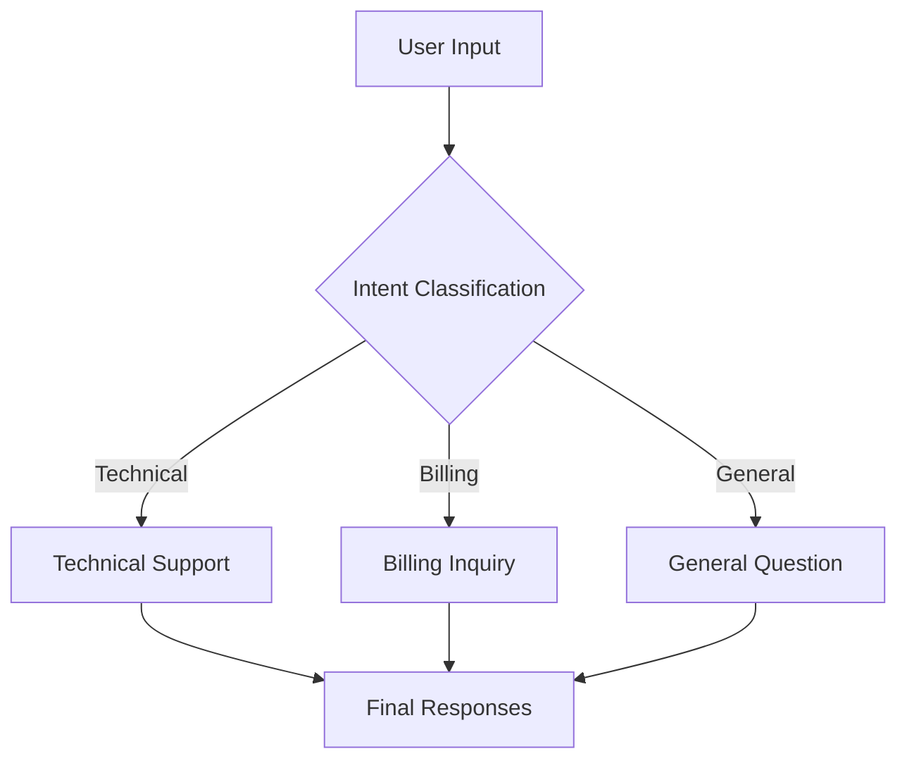
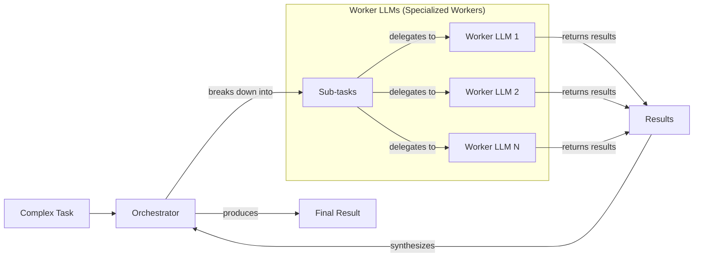

In the last few lessons, we've laid the foundations of AI Engineering. We explored the agent landscape, distinguished between rule-based LLM workflows and autonomous agents, and covered context engineering and structured outputs. Now, we will build on that foundation by exploring the fundamental patterns for creating multi-step LLM workflows.

This lesson tackles a core challenge: moving beyond single, monolithic LLM calls to build robust, modular, and dynamic systems. We will explore chaining, parallelization, routing, and the orchestrator-worker pattern. By the end, you will understand how to break down complex problems into manageable steps, a crucial skill for shipping reliable AI applications.

## The Challenge with Complex Single LLM Calls

When you start building with LLMs, it’s tempting to create a single, complex prompt that does everything at once. You give the model a long list of instructions—generate this, analyze that, format the output—and hope for the best. While this can work for simple demos, it quickly falls apart in production.

A single, large LLM call is problematic for several reasons. First, it’s a black box; when something goes wrong, it is difficult to pinpoint the source of the error. Second, it lacks modularity, making it hard to update or improve one part of the logic without affecting everything else. Complex prompts are also more likely to suffer from "lost-in-the-middle" issues, where the model ignores instructions buried in a long context [[2]](https://dev.to/thousand_miles_ai/the-lost-in-the-middle-problem-why-llms-ignore-the-middle-of-your-context-window-3al2). This often leads to higher token costs and less reliable outputs [[1]](https://www.mdpi.com/2079-9292/13/23/4712).

Let's look at a practical example. Suppose we want to generate a Frequently Asked Questions (FAQ) page from a few documents about renewable energy.

1.  First, we set up our environment and define our model. We will use Google's Gemini API throughout this lesson.
    ```python
    from lessons.utils import env
    from google import genai

    env.load(required_env_vars=["GOOGLE_API_KEY"])

    client = genai.Client()
    MODEL_ID = "gemini-2.5-flash"
    ```

2.  We have three mock webpages on solar, wind, and energy storage. We combine their content into a single string for the LLM to process.
    ```python
    webpage_1 = {
        "title": "The Benefits of Solar Energy",
        "content": "Solar energy is a renewable powerhouse...",
    }
    # ... (webpage_2 and webpage_3 are defined similarly)

    all_sources = [webpage_1, webpage_2, webpage_3]
    combined_content = "\n\n".join(
        [f"Source Title: {source['title']}\nContent: {source['content']}" for source in all_sources]
    )
    ```

3.  Now, we create a complex prompt that asks the model to generate questions, find answers, and cite sources all in one go.
    ```python
    n_questions = 10
    prompt_complex = f"""
    Based on the provided content from three webpages, generate a list of exactly {n_questions} frequently asked questions (FAQs).
    For each question, provide a concise answer derived ONLY from the text.
    After each answer, you MUST include a list of the 'Source Title's that were used to formulate that answer.

    <provided_content>
    {combined_content}
    </provided_content>
    """.strip()

    response_complex = client.models.generate_content(
        model=MODEL_ID,
        contents=prompt_complex,
        # ... (config for structured output)
    )
    ```
    It outputs:
    ```json
    {
        "question": "What is solar energy and how does it work?",
        "answer": "Solar energy is a renewable powerhouse that converts sunlight into electricity through photovoltaic (PV) panels.",
        "sources": [
          "The Benefits of Solar Energy"
        ]
    }
    ```

While this output looks reasonable, a single prompt struggles as complexity grows. For instance, the model might fail to identify all relevant sources for an answer drawn from multiple documents. This is a classic failure mode. The more instructions you pack into one prompt, the higher the chance of inaccuracies.

## The Power of Modularity: Why Chain LLM Calls?

A more reliable approach is to break the task down using prompt chaining. This involves connecting multiple LLM calls sequentially, where the output of one step becomes the input for the next [[17]](https://www.promptingguide.ai/techniques/prompt_chaining). It’s a simple "divide-and-conquer" strategy that makes complex tasks more manageable.

This modular approach offers several benefits:
-   **Improved Modularity:** Each LLM call focuses on a specific, well-defined sub-task, making the system easier to build and maintain [[36]](https://www.decodingai.com/p/stop-building-ai-agents-use-these).
-   **Enhanced Accuracy:** Simpler, targeted prompts generally lead to more reliable outputs.
-   **Easier Debugging:** You can isolate issues to a specific link in the chain instead of trying to debug one giant prompt.
-   **Increased Flexibility:** Individual components can be swapped or optimized independently. For example, you could use a fast, cheap model for a simple classification step and a more powerful model for content generation.

However, chaining is not a silver bullet. It introduces higher latency because you are making multiple sequential API calls. It can also increase costs and create a risk of information loss, as context from early steps can get diluted or distorted by the time it reaches the end of the chain [[22]](https://futureagi.substack.com/p/how-tool-chaining-fails-in-production).

## Building a Sequential Workflow: FAQ Generation Pipeline

Let's apply prompt chaining to our FAQ generation task. We will split it into a three-step workflow:
1.  Generate a list of questions.
2.  For each question, generate an answer.
3.  For each question-answer pair, identify the sources.

Image 1: A flowchart illustrating a sequential FAQ generation pipeline.
```mermaid
flowchart LR
  "Input Content" --> "Generate Questions"
  "Generate Questions" --> "Answer Questions"
  "Answer Questions" --> "Find Sources"
```

1.  First, we create a function dedicated to generating questions from the source content.
    ```python
    def generate_questions(content: str, n_questions: int = 10) -> list[str]:
        """
        Generate a list of questions based on the provided content.
        """
        prompt_generate_questions = f"""
        Based on the content below, generate a list of {n_questions} relevant and distinct questions that a user might have.

        <provided_content>
        {content}
        </provided_content>
        """.strip()
        # ... (API call with structured output config for QuestionList)
        return response_questions.parsed.questions
    ```

2.  Next, a function to answer a single question based on the content.
    ```python
    def answer_question(question: str, content: str) -> str:
        """
        Generate an answer for a specific question using only the provided content.
        """
        prompt_answer_question = f"""
        Using ONLY the provided content below, answer the following question.
        The answer should be concise and directly address the question.

        <question>
        {question}
        </question>

        <provided_content>
        {content}
        </provided_content>
        """.strip()
        # ... (API call)
        return answer_response.text
    ```

3.  Finally, a function to identify which sources were used for a given answer.
    ```python
    def find_sources(question: str, answer: str, content: str) -> list[str]:
        """
        Identify which sources were used to generate an answer.
        """
        prompt_find_sources = f"""
        You will be given a question and an answer that was generated from a set of documents.
        Your task is to identify which of the original documents were used to create the answer.

        <question>
        {question}
        </question>

        <answer>
        {answer}
        </answer>

        <provided_content>
        {content}
        </provided_content>
        """.strip()
        # ... (API call with structured output config for SourceList)
        return sources_response.parsed.sources
    ```

4.  We combine these functions into a sequential workflow.
    ```python
    def sequential_workflow(content, n_questions=4) -> list:
        """
        Execute the complete sequential workflow for FAQ generation.
        """
        questions = generate_questions(content, n_questions)
        final_faqs = []
        for question in questions:
            answer = answer_question(question, content)
            sources = find_sources(question, answer, content)
            final_faqs.append({"question": question, "answer": answer, "sources": sources})
        return final_faqs

    # Execute the sequential workflow
    import time
    start_time = time.monotonic()
    sequential_faqs = sequential_workflow(combined_content)
    end_time = time.monotonic()
    ```
    It outputs:
    ```text
    Sequential processing completed in 22.20 seconds
    ```

This chained approach gives us more control and visibility at each step. While it took over 20 seconds to run, the modularity makes it more robust than the single-prompt method.

## Optimizing Sequential Workflows With Parallel Processing

The sequential workflow is reliable but slow. Since the processing for each question is independent of the others, we can run these steps in parallel to significantly reduce latency [[45]](https://deepchecks.com/orchestrating-multi-step-llm-chains-best-practices/).

We can refactor our workflow using Python's `asyncio` library to process the questions concurrently. LLM API calls are I/O-bound tasks, making them perfect candidates for asynchronous execution [[26]](https://santhalakshminarayana.github.io/blog/concurrency-patterns-python), [[27]](https://medium.com/@sizanmahmud08/python-concurrency-showdown-asyncio-vs-threading-vs-multiprocessing-which-should-you-choose-in-31205161899a).

1.  First, we define an asynchronous function that processes a single question by generating its answer and finding its sources.
    ```python
    async def process_question_parallel(question: str, content: str) -> dict:
        """
        Process a single question by generating answer and finding sources in parallel.
        """
        answer = await answer_question_async(question, content) # async version of answer_question
        sources = await find_sources_async(question, answer, content) # async version of find_sources
        return {"question": question, "answer": answer, "sources": sources}
    ```

2.  Then, we create a parallel workflow that generates all questions first and then processes them concurrently using `asyncio.gather`.
    ```python
    async def parallel_workflow(content: str, n_questions: int = 4) -> list:
        """
        Execute the complete parallel workflow for FAQ generation.
        """
        questions = generate_questions(content, n_questions)
        tasks = [process_question_parallel(question, content) for question in questions]
        parallel_faqs = await asyncio.gather(*tasks)
        return parallel_faqs

    # Execute the parallel workflow
    start_time = time.monotonic()
    parallel_faqs = await parallel_workflow(combined_content)
    end_time = time.monotonic()
    ```
    It outputs:
    ```text
    Parallel processing completed in 8.98 seconds
    ```

By running the tasks in parallel, we cut the execution time from 22 seconds to just 9 seconds. This demonstrates the trade-off: parallel processing is faster and utilizes resources better, but it adds complexity to error handling. Furthermore, making many concurrent calls can trigger API rate limits, a critical consideration for production systems [[7]](https://discuss.ai.google.dev/t/challenges-with-rate-limiting-and-handling-api-responses-in-high-volume-requests/61903).

## Introducing Dynamic Behavior: Routing and Conditional Logic

So far, our workflows have been static. Every input goes through the same sequence of steps. But what if the required processing path needs to change based on the input? This is where routing comes in.

Routing uses conditional logic to direct an input down a specialized path [[36]](https://www.decodingai.com/p/stop-building-ai-agents-use-these). Instead of a single, monolithic prompt trying to handle every possible scenario, you create specialized prompts for different cases. An LLM itself can act as a classifier, analyzing the input and deciding which path to take. This is another application of the "divide-and-conquer" principle, ensuring each component in your system has a single, focused responsibility.

## Building a Basic Routing Workflow

A classic use case for routing is a customer service system. Queries about billing, technical issues, and general questions all require different responses and actions. We can build a simple router that first classifies the user's intent and then directs the query to a specialized handler.

Image 2: A flowchart illustrating a routing workflow for customer service intent classification.


1.  First, we define a function that uses the LLM to classify the user's intent. We provide a list of possible categories to guide the model.
    ```python
    def classify_intent(user_query: str) -> str:
        """Uses an LLM to classify a user query."""
        categories = ["Technical Support", "Billing Inquiry", "General Question"]
        prompt = f"""
        Classify the user's query into one of the following categories.

        <categories>
        {categories}
        </categories>

        <user_query>
        {user_query}
        </user_query>
        """.strip()
        # ... (API call with structured output for UserIntent)
        return response.parsed.intent
    ```

2.  Next, we define specialized prompts for each intent.
    ```python
    prompt_technical_support = "You are a helpful technical support agent..."
    prompt_billing_inquiry = "You are a helpful billing support agent..."
    prompt_general_question = "You are a general assistant..."
    ```

3.  Finally, we create a handler function that routes the query based on the classified intent.
    ```python
    def handle_query(user_query: str, intent: str) -> str:
        """Routes a query to the correct handler based on its classified intent."""
        if intent == "Technical Support":
            prompt = prompt_technical_support.format(user_query=user_query)
        elif intent == "Billing Inquiry":
            prompt = prompt_billing_inquiry.format(user_query=user_query)
        else: # Default/fallback
            prompt = prompt_general_question.format(user_query=user_query)
        
        response = client.models.generate_content(model=MODEL_ID, contents=prompt)
        return response.text
    ```
    For a query like "My internet connection is not working," the system first classifies the intent as "Technical Support" and then uses the specialized technical support prompt to generate a helpful first response. This keeps each part of the system simple and focused.

## Orchestrator-Worker Pattern: Dynamic Task Decomposition

The patterns we've seen so far—chaining, parallelization, and routing—are powerful, but they often rely on pre-defined steps. The orchestrator-worker pattern takes this a step further by introducing a central LLM, the "orchestrator," that dynamically breaks down a complex task into subtasks and delegates them to specialized "worker" LLMs [[16]](https://agents.kour.me/orchestrator-worker/).

This workflow is perfect for complex problems where the required steps are unpredictable [[54]](https://www.anthropic.com/engineering/building-effective-agents????__hstc=43401018.9b17c4d3051a2af3f924a8d9f62fbbee.1757203200284.1757203200285.1757203200286.1&__hssc=43401018.1.1757203200287&__hsfp=2825657416). The key difference from simple parallelization is its flexibility: the orchestrator determines the subtasks at runtime based on the specific input. After the workers complete their tasks, a "synthesizer" can combine their outputs into a single, coherent response.

Image 3: A flowchart illustrating the orchestrator-worker pattern.


Let's illustrate this with a complex customer service query that requires multiple actions.

1.  A user sends a query that involves a billing question, a product return, and an order status update.
    ```python
    complex_customer_query = """
    Hi, I have a question about invoice #INV-7890. It seems higher than I expected.
    Also, I would like to return the 'SuperWidget 5000' because it's not compatible with my system.
    Finally, can you give me an update on my order #A-12345?
    """.strip()
    ```

2.  The orchestrator LLM analyzes this query and breaks it down into a structured list of tasks for the workers.
    ```python
    def orchestrator(query: str) -> list:
        """Breaks down a complex query into a list of tasks."""
        # ... (prompt instructs the LLM to identify sub-tasks and parameters)
        # ... (API call with structured output for TaskList)
        return response.parsed.tasks
    
    tasks_list = orchestrator(complex_customer_query)
    ```
    The orchestrator identifies three distinct tasks: a `BillingInquiry`, a `ProductReturn`, and a `StatusUpdate`, each with the necessary parameters extracted from the query.

3.  Each task is then dispatched to a specialized worker function (`handle_billing_worker`, `handle_return_worker`, `handle_status_worker`). These workers simulate interacting with backend systems (e.g., opening an investigation, generating an RMA number, fetching order status) and return structured results.

4.  Finally, the synthesizer LLM takes the structured outputs from all workers and composes a single, user-friendly email that addresses all parts of the original query.
    ```python
    def synthesizer(results: list) -> str:
        """Combines structured results from workers into a single user-facing message."""
        # ... (prompt combines worker results into a cohesive summary)
        # ... (API call)
        return response.text
    
    final_user_message = synthesizer(worker_results)
    ```
    The final response consolidates all actions into one clear message, demonstrating how the orchestrator-worker pattern can handle multifaceted and unpredictable requests in a structured and scalable way.

## Conclusion

In this lesson, we moved from the limitations of single, complex prompts to the power of modular LLM workflows. We've seen how to build more reliable and efficient systems by breaking down tasks using four fundamental patterns:

1.  **Prompt Chaining:** For tasks with clear, sequential steps.
2.  **Parallelization:** To speed up the processing of independent subtasks.
3.  **Routing:** To direct inputs to specialized handlers based on conditional logic.
4.  **Orchestrator-Worker:** For dynamically decomposing complex, unpredictable tasks.

These patterns are not just theoretical concepts; they are the practical building blocks for almost any production-grade AI application. They provide the control, reliability, and modularity needed to move beyond simple demos.

As you continue your journey as an AI Engineer, you will find yourself combining these patterns to create sophisticated systems. In our next lesson, we will take another big step forward by learning how to give our workflows the ability to interact with the outside world using tools and function calling.

## References

- [1] M. Gozzi and F. Di Maio, “Comparative Analysis of Prompt Strategies for Large Language Models: Single-Task vs. Multitask Prompts,” Electronics, vol. 13, no. 23, p. 4712, Nov. 2024. [https://www.mdpi.com/2079-9292/13/23/4712](https://www.mdpi.com/2079-9292/13/23/4712)
- [2] The "Lost in the Middle" Problem — Why LLMs Ignore the Middle of Your Context Window. (2026). dev.to. [https://dev.to/thousand_miles_ai/the-lost-in-the-middle-problem-why-llms-ignore-the-middle-of-your-context-window-3al2](https://dev.to/thousand_miles_ai/the-lost-in-the-middle-problem-why-llms-ignore-the-middle-of-your-context-window-3al2)
- [3] FLARE: A Framework for Large-scale Agent-based Reasoning and Evaluation. (2025). aclanthology.org. [https://aclanthology.org/2025.ommm-1.4.pdf](https://aclanthology.org/2025.ommm-1.4.pdf)
- [4] S. Falconer, “Four design patterns for Event-Driven, Multi-Agent systems,” Confluent. [https://www.confluent.io/blog/event-driven-multi-agent-systems/](https://www.confluent.io/blog/event-driven-multi-agent-systems/)
- [5] Underspecification in Instruction-Following. (2025). arxiv.org. [https://arxiv.org/html/2505.13360v1](https://arxiv.org/html/2505.13360v1)
- [6] ZeMPE: A Comprehensive Benchmark for Zero-Shot Generalization of Multi-Problem Prompts in Large Language Models. (2025). aclanthology.org. [https://aclanthology.org/2025.gem-1.14.pdf](https://aclanthology.org/2025.gem-1.14.pdf)
- [7] “Challenges with rate limiting and handling API responses in high volume requests,” Google AI Community, 2024. [https://discuss.ai.google.dev/t/challenges-with-rate-limiting-and-handling-api-responses-in-high-volume-requests/61903](https://discuss.ai.google.dev/t/challenges-with-rate-limiting-and-handling-api-responses-in-high-volume-requests/61903)
- [8] “429 on Vertex AI API - how to send 5-20 parallel gemini api requests without hitting the rate limit?” Stack Overflow, 2024. [https://stackoverflow.com/questions/79924021/429-on-vertex-ai-api-how-to-send-5-20-parallel-gemini-api-requests-without-hitt](https://stackoverflow.com/questions/79924021/429-on-vertex-ai-api-how-to-send-5-20-parallel-gemini-api-requests-without-hitt)
- [9] T. Pan, “LLM API Resilience in Production: Rate Limits, Failover, and the Hidden Costs of Naive Retry Logic,” 2026. [https://tianpan.co/blog/2026-03-11-llm-api-resilience-production](https://tianpan.co/blog/2026-03-11-llm-api-resilience-production)
- [10] “LLM-Based Prompt Routing,” emergentmind.com. [https://www.emergentmind.com/topics/llm-based-prompt-routing](https://www.emergentmind.com/topics/llm-based-prompt-routing)
- [11] Multi-LLM Routing Strategies for Generative AI Applications on AWS. (2024). aws.amazon.com. [https://aws.amazon.com/blogs/machine-learning/multi-llm-routing-strategies-for-generative-ai-applications-on-aws/](https://aws.amazon.com/blogs/machine-learning/multi-llm-routing-strategies-for-generative-ai-applications-on-aws/)
- [12] A Beginner's Guide to LLM Intent Classification for Chatbots. (2024). vellum.ai. [https://www.vellum.ai/blog/how-to-build-intent-detection-for-your-chatbot](https://www.vellum.ai/blog/how-to-build-intent-detection-for-your-chatbot)
- [13] “Top 5 LLM Routing Techniques,” getmaxim.ai. [https://www.getmaxim.ai/articles/top-5-llm-routing-techniques/](https://www.getmaxim.ai/articles/top-5-llm-routing-techniques/)
- [14] Universal Model Routing via Correctness Vectors. (2025). arxiv.org. [https://arxiv.org/html/2502.08773v1](https://arxiv.org/html/2502.08773v1)
- [15] Building self-healing AI orchestrators with Reflexion patterns. (2024). stevens.edu. [https://online.stevens.edu/blog/building-self-healing-ai-orchestrator-reflexion-patterns/](https://online.stevens.edu/blog/building-self-healing-ai-orchestrator-reflexion-patterns/)
- [16] Pattern: Orchestrator-Worker (Coordinator). (2024). agents.kour.me. [https://agents.kour.me/orchestrator-worker/](https://agents.kour.me/orchestrator-worker/)
- [17] Prompt Chaining Guide. (2024). promptingguide.ai. [https://www.promptingguide.ai/techniques/prompt_chaining](https://www.promptingguide.ai/techniques/prompt_chaining)
- [18] “DIY #17: Orchestrator-Worker LLM Agent Pattern,” mlpills.substack.com, 2024. [https://mlpills.substack.com/p/diy-17-orchestrator-worker-llm-agent](https://mlpills.substack.com/p/diy-17-orchestrator-worker-llm-agent)
- [19] “Orchestrator-Workers,” claude.com. [https://platform.claude.com/cookbook/patterns-agents-orchestrator-workers](https://platform.claude.com/cookbook/patterns-agents-orchestrator-workers)
- [20] ChainRAG: A Progressive Retrieval Framework for Large Language Models. (2025). aclanthology.org. [https://aclanthology.org/2025.acl-long.1089.pdf](https://aclanthology.org/2025.acl-long.1089.pdf)
- [21] “Keeping AI Agents Grounded: Context Engineering Strategies that Prevent Context Rot Using Milvus,” milvus.io. [https://milvus.io/blog/keeping-ai-agents-grounded-context-engineering-strategies-that-prevent-context-rot-using-milvus.md](https://milvus.io/blog/keeping-ai-agents-grounded-context-engineering-strategies-that-prevent-context-rot-using-milvus.md)
- [22] How Tool Chaining Fails in Production LLM Agents and How to Fix It. (2026). futureagi.substack.com. [https://futureagi.substack.com/p/how-tool-chaining-fails-in-production](https://futureagi.substack.com/p/how-tool-chaining-fails-in-production)
- [23] “Asynchronous or Concurrency Patterns in Python with Asyncio,” santhalakshminarayana.github.io, 2024. [https://santhalakshminarayana.github.io/blog/concurrency-patterns-python](https://santhalakshminarayana.github.io/blog/concurrency-patterns-python)
- [24] “Python Concurrency Showdown: Asyncio vs. Threading vs. Multiprocessing,” medium.com, 2024. [https://medium.com/@sizanmahmud08/python-concurrency-showdown-asyncio-vs-threading-vs-multiprocessing-which-should-you-choose-in-31205161899a](https://medium.com/@sizanmahmud08/python-concurrency-showdown-asyncio-vs-threading-vs-multiprocessing-which-should-you-choose-in-31205161899a)
- [25] “Concurrency and Parallelism in Python,” testdriven.io, 2024. [https://testdriven.io/blog/python-concurrency-parallelism/](https://testdriven.io/blog/python-concurrency-parallelism/)
- [26] Asynchronous or Concurrency Patterns in Python with Asyncio. (2024). santhalakshminarayana.github.io. [https://santhalakshminarayana.github.io/blog/concurrency-patterns-python](https://santhalakshminarayana.github.io/blog/concurrency-patterns-python)
- [27] Python Concurrency Showdown: Asyncio vs. Threading vs. Multiprocessing. (2024). medium.com. [https://medium.com/@sizanmahmud08/python-concurrency-showdown-asyncio-vs-threading-vs-multiprocessing-which-should-you-choose-in-31205161899a](https://medium.com/@sizanmahmud08/python-concurrency-showdown-asyncio-vs-threading-vs-multiprocessing-which-should-you-choose-in-31205161899a)
- [28] “Concurrency and Parallelism in Python: Threads, Multiprocessing, and Async Programming,” dev.to, 2024. [https://dev.to/nkpydev/concurrency-and-parallelism-in-python-threads-multiprocessing-and-async-programming-64d](https://dev.to/nkpydev/concurrency-and-parallelism-in-python-threads-multiprocessing-and-async-programming-64d)
- [29] “Concurrency in async/await and threading,” jetbrains.com, 2025. [https://blog.jetbrains.com/pycharm/2025/06/concurrency-in-async-await-and-threading/](https://blog.jetbrains.com/pycharm/2025/06/concurrency-in-async-await-and-threading/)
- [30] “The Coordinator/Dispatcher Pattern,” developers.googleblog.com, 2024. [https://developers.googleblog.com/developers-guide-to-multi-agent-patterns-in-adk/](https://developers.googleblog.com/developers-guide-to-multi-agent-patterns-in-adk/)
- [31] “Agentic AI Design Patterns,” linkedin.com, 2024. [https://www.linkedin.com/posts/chiragsubramanian_agentic-ai-design-patterns-my-practical-activity-7416830806939230208-nRFc](https://www.linkedin.com/posts/chiragsubramanian_agentic-ai-design-patterns-my-practical-activity-7416830806939230208-nRFc)
- [32] “AI Prompt Orchestration Techniques And Tools You Need,” scoutos.com, 2024. [https://www.scoutos.com/blog/ai-prompt-orchestration-techniques-and-tools-you-need](https://www.scoutos.com/blog/ai-prompt-orchestration-techniques-and-tools-you-need)
- [33] Five Proven Prompt Engineering Techniques. (2024). lennysnewsletter.com. [https://www.lennysnewsletter.com/p/five-proven-prompt-engineering-techniques](https://www.lennysnewsletter.com/p/five-proven-prompt-engineering-techniques)
- [34] A Practical Guide to Prompt Engineering Techniques and their Use Cases. (2024). medium.com. [https://medium.com/@fabiolalli/a-practical-guide-to-prompt-engineering-techniques-and-their-use-cases-5f8574e2cd9a](https://medium.com/@fabiolalli/a-practical-guide-to-prompt-engineering-techniques-and-their-use-cases-5f8574e2cd9a)
- [35] 10 Prompt Engineering Techniques: A Super Simple Explanation. (2024). scrum.org. [https://www.scrum.org/resources/blog/10-prompt-engineering-techniques-super-simple-explanation](https://www.scrum.org/resources/blog/10-prompt-engineering-techniques-super-simple-explanation)
- [36] Stop Building AI Agents. Use These Workflow Patterns Instead. (2024). decodingai.com. [https://www.decodingai.com/p/stop-building-ai-agents-use-these](https://www.decodingai.com/p/stop-building-ai-agents-use-these)
- [37] Prompt Engineering Techniques. (2024). nmu.libguides.com. [https://nmu.libguides.com/c.php?g=1474877&p=10982145](https://nmu.libguides.com/c.php?g=1474877&p=10982145)
- [38] Prompt Engineering Techniques. (2024). k2view.com. [https://www.k2view.com/blog/prompt-engineering-techniques/](https://www.k2view.com/blog/prompt-engineering-techniques/)
- [39] “Orchestrating Multi-Step LLM Chains: Best Practices,” deepchecks.com, 2024. [https://deepchecks.com/orchestrating-multi-step-llm-chains-best-practices/](https://deepchecks.com/orchestrating-multi-step-llm-chains-best-practices/)
- [40] “Issue 110: LLM Workflow Patterns,” mlpills.substack.com, 2024. [https://mlpills.substack.com/p/issue-110-llm-workflow-patterns](https://mlpills.substack.com/p/issue-110-llm-workflow-patterns)
- [41] “Compounding Error Effect in Large Language Models: A Growing Challenge,” wand.ai, 2024. [https://wand.ai/blog/compounding-error-effect-in-large-language-models-a-growing-challenge](https://wand.ai/blog/compounding-error-effect-in-large-language-models-a-growing-challenge)
- [42] SPRINT: A Framework for Interleaved Planning and Parallel Execution in Language Models. (2024). stanford.edu. [https://scalingintelligence.stanford.edu/pubs/sprint.pdf](https://scalingintelligence.stanford.edu/pubs/sprint.pdf)
- [43] “AI Agent Orchestration Patterns,” productschool.com, 2024. [https://productschool.com/blog/artificial-intelligence/ai-agent-orchestration-patterns](https://productschool.com/blog/artificial-intelligence/ai-agent-orchestration-patterns)
- [44] “What is an AI Orchestration Platform?” fayedigital.com, 2024. [https://fayedigital.com/blog/ai-orchestration-platform/](https://fayedigital.com/blog/ai-orchestration-platform/)
- [45] Orchestrating Multi-Step LLM Chains: Best Practices. (2024). deepchecks.com. [https://deepchecks.com/orchestrating-multi-step-llm-chains-best-practices/](https://deepchecks.com/orchestrating-multi-step-llm-chains-best-practices/)
- [46] “Choosing the Right Orchestration Pattern for Multi-Agent Systems,” kore.ai, 2024. [https://www.kore.ai/blog/choosing-the-right-orchestration-pattern-for-multi-agent-systems](https://www.kore.ai/blog/choosing-the-right-orchestration-pattern-for-multi-agent-systems)
- [47] Compounding Error Effect in Large Language Models: A Growing Challenge. (2024). wand.ai. [https://wand.ai/blog/compounding-error-effect-in-large-language-models-a-growing-challenge](https://wand.ai/blog/compounding-error-effect-in-large-language-models-a-growing-challenge)
- [48] “Issue 110: LLM Workflow Patterns,” mlpills.substack.com, 2024. [https://mlpills.substack.com/p/issue-110-llm-workflow-patterns](https://mlpills.substack.com/p/issue-110-llm-workflow-patterns)
- [49] “Design Pattern: Prompt Chaining for Building Reliable LLM Applications,” datalearningscience.com, 2024. [https://datalearningscience.com/p/design-pattern-prompt-chaining-building](https://datalearningscience.com/p/design-pattern-prompt-chaining-building)
- [50] “Prompt Chaining: How It Works and How to Use It,” udemy.com, 2024. [https://blog.udemy.com/prompt-chaining/](https://blog.udemy.com/prompt-chaining/)
- [51] Stop Building AI Agents. Use These Workflow Patterns Instead. (2024). decodingai.com. [https://www.decodingai.com/p/stop-building-ai-agents-use-these](https://www.decodingai.com/p/stop-building-ai-agents-use-these)
- [52] “Prompt Chaining,” agentic-design.ai, 2024. [https://agentic-design.ai/patterns/prompt-chaining](https://agentic-design.ai/patterns/prompt-chaining)
- [53] Orchestrator-Workers. (2024). claude.com. [https://platform.claude.com/cookbook/patterns-agents-orchestrator-workers](https://platform.claude.com/cookbook/patterns-agents-orchestrator-workers)
- [54] Building effective agents. (2024). anthropic.com. [https://www.anthropic.com/engineering/building-effective-agents](https://www.anthropic.com/engineering/building-effective-agents)