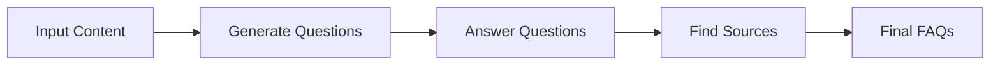
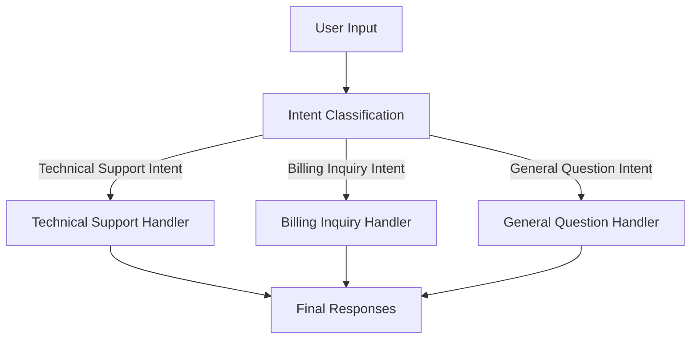

# Basic AI Workflow Patterns

In our previous lessons, we built a solid foundation for AI Engineering. We explored the agent landscape, distinguished between rule-based LLM workflows and autonomous agents, and covered context engineering. We also saw how to get reliable, structured data out of an LLM. Now, we will build on that by exploring the fundamental patterns for creating multi-step LLM workflows.

We will cover four essential patterns: prompt chaining, parallelization, routing, and the orchestrator-worker model. These techniques are the building blocks for constructing sophisticated and reliable AI applications. By mastering them, you will learn how to move beyond simple, single-prompt applications and start engineering robust systems that can handle real-world complexity.

In this lesson, we will cover:
- The challenges of using a single, complex LLM call.
- How to build sequential workflows by chaining multiple LLM calls.
- How to speed up workflows by running tasks in parallel.
- How to create dynamic systems using routing and conditional logic.
- How to use the orchestrator-worker pattern for dynamic task decomposition.

## The Challenge with Complex Single LLM Calls

When you start building with LLMs, it’s tempting to create a single, massive prompt that does everything at once. You might ask the model to analyze a document, extract information, summarize it, and format the output all in one go. While this can work for simple demos, it quickly becomes a liability in production.

Complex, single-prompt systems are difficult to debug. When the output is wrong, it’s hard to know which part of the instruction the model misunderstood. They are also less reliable. As the context gets longer, models can suffer from the "lost-in-the-middle" problem, where they pay less attention to information in the middle of the prompt [[2]](https://dev.to/thousand_miles_ai/the-lost-in-the-middle-problem-why-llms-ignore-the-middle-of-your-context-window-3al2). This makes the output inconsistent and hard to control.

Let's look at a practical example. Suppose we want to generate a list of Frequently Asked Questions (FAQs) from a few documents about renewable energy.

1.  First, we set up our environment by initializing the Gemini client. We will use `gemini-2.5-flash` for these examples, as it is fast and cost-effective.
    ```python
    from lessons.utils import env
    from google import genai
    
    env.load(required_env_vars=["GOOGLE_API_KEY"])
    
    client = genai.Client()
    MODEL_ID = "gemini-2.5-flash"
    ```
2.  We define our source documents.
    ```python
    webpage_1 = {
        "title": "The Benefits of Solar Energy",
        "content": "..."
    }
    webpage_2 = {
        "title": "Understanding Wind Turbines",
        "content": "..."
    }
    webpage_3 = {
        "title": "Energy Storage Solutions",
        "content": "..."
    }
    all_sources = [webpage_1, webpage_2, webpage_3]
    combined_content = "\n\n".join(
        [f"Source Title: {source['title']}\nContent: {source['content']}" for source in all_sources]
    )
    ```
3.  Now, we create a single, complex prompt that asks the LLM to generate questions, find answers, and cite sources all at once.
    ```python
    n_questions = 10
    prompt_complex = f"""
    Based on the provided content from three webpages, generate a list of exactly {n_questions} frequently asked questions (FAQs).
    For each question, provide a concise answer derived ONLY from the text.
    After each answer, you MUST include a list of the 'Source Title's that were used to formulate that answer.
    
    <provided_content>
    {combined_content}
    </provided_content>
    """.strip()
    
    # Pydantic classes for structured outputs
    class FAQ(BaseModel):
        question: str
        answer: str
        sources: list[str]
    
    class FAQList(BaseModel):
        faqs: list[FAQ]
    
    config = types.GenerateContentConfig(
        response_mime_type="application/json",
        response_schema=FAQList
    )
    response_complex = client.models.generate_content(
        model=MODEL_ID,
        contents=prompt_complex,
        config=config
    )
    result_complex = response_complex.parsed
    ```
    It outputs:
    ```json
    {
        "question": "What is solar energy and how does it work?",
        "answer": "Solar energy is a renewable powerhouse that converts sunlight into electricity through photovoltaic (PV) panels.",
        "sources": [
          "The Benefits of Solar Energy"
        ]
    }
    ...
    ```

While the output might look acceptable, this approach is fragile. The more complex the instructions, the higher the chance of inaccuracies. For example, the model might fail to cite all relevant sources for an answer or generate a question that isn't covered in the text. This is where modularity becomes powerful.

## The Power of Modularity: Why Chain LLM Calls?

Instead of a single, monolithic prompt, we can break down a task into a series of smaller, focused steps called prompt chaining, where the output of one LLM call becomes the input for the next [[36]](https://www.decodingai.com/p/stop-building-ai-agents-use-these), [[41]](https://medium.com/@fabiolalli/a-practical-guide-to-prompt-engineering-techniques-and-their-use-cases-5f8574e2cd9a). This mitigates issues like attention dilution, where a model’s focus on any single piece of information diminishes as context grows [[57]](https://www.morphllm.com/context-rot). It is a "divide-and-conquer" strategy that brings several benefits.

Each step in the chain is simpler, which generally leads to more accurate and reliable outputs. Debugging becomes much easier, as you can isolate the specific step where an error occurred. This modularity also gives you flexibility. You can swap out or optimize individual components without affecting the rest of the workflow. For instance, you could use a fast, cheap model for a simple classification task and a more powerful model for a complex generation task.

However, this approach has trade-offs. Chaining multiple calls increases latency, as you have to wait for each step to complete. It can also be more expensive due to higher token usage across multiple prompts. Furthermore, there is a risk of information loss; critical details from an early step might be diluted or lost by the time the chain finishes [[22]](https://futureagi.substack.com/p/how-tool-chaining-fails-in-production).

## Building a Sequential Workflow: FAQ Generation Pipeline

Let's apply prompt chaining to our FAQ generation task. We will split it into a three-step sequential workflow:
1.  **Generate Questions**: Create a list of relevant questions from the source documents.
2.  **Answer Questions**: For each question, generate a concise answer.
3.  **Find Sources**: For each answer, identify the source documents used.

This approach gives us more control and produces more reliable results.


Image 1: A flowchart illustrating the sequential FAQ generation pipeline.

1.  First, we create a function that focuses only on generating questions.
    ```python
    class QuestionList(BaseModel):
        questions: list[str]
    
    prompt_generate_questions = """
    Based on the content below, generate a list of {n_questions} relevant and distinct questions that a user might have.
    
    <provided_content>
    {combined_content}
    </provided_content>
    """.strip()
    
    def generate_questions(content: str, n_questions: int = 10) -> list[str]:
        # ... function implementation
        return response_questions.parsed.questions
    ```
2.  Next, a function to answer a given question based on the content.
    ```python
    prompt_answer_question = """
    Using ONLY the provided content below, answer the following question.
    The answer should be concise and directly address the question.
    
    <question>
    {question}
    </question>
    
    <provided_content>
    {combined_content}
    </provided_content>
    """.strip()
    
    def answer_question(question: str, content: str) -> str:
        # ... function implementation
        return answer_response.text
    ```
3.  Finally, a function to identify the sources for a given question-answer pair.
    ```python
    class SourceList(BaseModel):
        sources: list[str]
    
    prompt_find_sources = """
    You will be given a question and an answer that was generated from a set of documents.
    Your task is to identify which of the original documents were used to create the answer.
    
    <question>
    {question}
    </question>
    
    <answer>
    {answer}
    </answer>
    
    <provided_content>
    {combined_content}
    </provided_content>
    """.strip()
    
    def find_sources(question: str, answer: str, content: str) -> list[str]:
        # ... function implementation
        return sources_response.parsed.sources
    ```
4.  We combine these functions into a sequential workflow.
    ```python
    def sequential_workflow(content, n_questions=10) -> list[FAQ]:
        questions = generate_questions(content, n_questions)
        final_faqs = []
        for question in questions:
            answer = answer_question(question, content)
            sources = find_sources(question, answer, content)
            faq = FAQ(question=question, answer=answer, sources=sources)
            final_faqs.append(faq)
        return final_faqs
    
    start_time = time.monotonic()
    sequential_faqs = sequential_workflow(combined_content, n_questions=4)
    end_time = time.monotonic()
    print(f"Sequential processing completed in {end_time - start_time:.2f} seconds")
    ```
    It outputs:
    ```text
    Sequential processing completed in 22.20 seconds
    ```

This sequential process is more robust, but it is also slow. Each step for each question runs one after another. Next, we will see how to speed this up.

## Optimizing Sequential Workflows With Parallel Processing

While the sequential workflow improves reliability, its total execution time is the sum of all its steps. We can significantly reduce this time by running independent tasks in parallel. This approach, known as the Scatter-Gather pattern in distributed systems, involves scattering a task to multiple workers and then gathering their results [[58]](https://www.linkedin.com/top-content/artificial-intelligence/understanding-ai-systems/deep-dive-into-llm-system-architecture/). In our FAQ example, answering each question is an independent task that can be processed concurrently.

We can implement this using Python's `asyncio` library, which is ideal for I/O-bound tasks like making API calls to an LLM [[26]](https://santhalakshminarayana.github.io/blog/concurrency-patterns-python), [[27]](https://medium.com/@sizanmahmud08/python-concurrency-showdown-asyncio-vs-threading-vs-multiprocessing-which-should-you-choose-in-31205161899a).

1.  First, we create asynchronous versions of our `answer_question` and `find_sources` functions.
    ```python
    async def answer_question_async(question: str, content: str) -> str:
        # ... async implementation
    
    async def find_sources_async(question: str, answer: str, content: str) -> list[str]:
        # ... async implementation
    
    async def process_question_parallel(question: str, content: str) -> FAQ:
        answer = await answer_question_async(question, content)
        sources = await find_sources_async(question, answer, content)
        return FAQ(question=question, answer=answer, sources=sources)
    ```
2.  Now, we can build a parallel workflow that generates the questions and then processes each one concurrently.
    ```python
    async def parallel_workflow(content: str, n_questions: int = 10) -> list[FAQ]:
        questions = generate_questions(content, n_questions)
        tasks = [process_question_parallel(question, content) for question in questions]
        parallel_faqs = await asyncio.gather(*tasks)
        return parallel_faqs
    
    start_time = time.monotonic()
    parallel_faqs = await parallel_workflow(combined_content, n_questions=4)
    end_time = time.monotonic()
    print(f"Parallel processing completed in {end_time - start_time:.2f} seconds")
    ```
    It outputs:
    ```text
    Parallel processing completed in 8.98 seconds
    ```
As you can see, parallel processing cut the execution time by more than half. While faster, this approach has its own challenges. Making many concurrent API calls can trigger rate limits, so you need to implement strategies like exponential backoff to handle potential errors [[9]](https://tianpan.co/blog/2026-03-11-llm-api-resilience-production). Sequential processing is predictable and easier to debug, while parallel processing offers speed at the cost of complexity.

## Introducing Dynamic Behavior: Routing and Conditional Logic

So far, our workflows have been linear. But real-world applications often require dynamic behavior. We need a way to direct the workflow down different paths based on the input. This is where routing comes in.

Routing uses conditional logic to send an input to a specialized handler. This is another application of the "divide-and-conquer" principle, analogous to the Dynamic Dispatch software pattern [[58]](https://www.linkedin.com/top-content/artificial-intelligence/understanding-ai-systems/deep-dive-into-llm-system-architecture/). Instead of a single, complex prompt that tries to handle all possible inputs, we create multiple, specialized prompts and use a classifier to choose the right one [[36]](https://www.decodingai.com/p/stop-building-ai-agents-use-these). An LLM itself can act as this classifier, analyzing the input and deciding which path to take. This keeps each component focused and easier to maintain.

## Building a Basic Routing Workflow

Let's build a simple routing system for a customer service chatbot. The goal is to classify a user's query and route it to the correct department: Technical Support, Billing, or General Questions.


Image 2: A flowchart illustrating the routing workflow for customer service intent classification.

1.  First, we define a function to classify the user's intent. We use a Pydantic model with an `Enum` to ensure the output is one of our predefined categories [[12]](https://www.vellum.ai/blog/how-to-build-intent-detection-for-your-chatbot).
    ```python
    class IntentEnum(str, Enum):
        TECHNICAL_SUPPORT = "Technical Support"
        BILLING_INQUIRY = "Billing Inquiry"
        GENERAL_QUESTION = "General Question"
    
    class UserIntent(BaseModel):
        intent: IntentEnum
    
    def classify_intent(user_query: str) -> IntentEnum:
        # ... function implementation
        return response.parsed.intent
    ```
2.  Next, we create specialized prompts for each intent.
    ```python
    prompt_technical_support = """
    You are a helpful technical support agent...
    """
    prompt_billing_inquiry = """
    You are a helpful billing support agent...
    """
    prompt_general_question = """
    You are a general assistant...
    """
    ```
3.  Finally, we create a `handle_query` function that routes the user query to the appropriate handler based on the classified intent.
    ```python
    def handle_query(user_query: str, intent: str) -> str:
        if intent == IntentEnum.TECHNICAL_SUPPORT:
            prompt = prompt_technical_support.format(user_query=user_query)
        elif intent == IntentEnum.BILLING_INQUIRY:
            prompt = prompt_billing_inquiry.format(user_query=user_query)
        # ... and so on
        response = client.models.generate_content(model=MODEL_ID, contents=prompt)
        return response.text
    
    # Example usage
    query_1 = "My internet connection is not working."
    intent_1 = classify_intent(query_1)
    response_1 = handle_query(query_1, intent_1)
    ```
    It outputs:
    ```text
    Hello there! I'm sorry to hear you're having trouble with your internet connection...
    ```

This routing pattern allows you to build much more sophisticated and adaptable applications by directing different types of requests to specialized logic.

## Orchestrator-Worker Pattern: Dynamic Task Decomposition

The final pattern we will explore is the orchestrator-worker model. This is a more advanced workflow where a central "orchestrator" LLM acts like a project manager, dynamically breaking down a complex task into smaller subtasks. It then delegates these subtasks to specialized "worker" LLMs and synthesizes their results into a final, coherent response [[16]](https://agents.kour.me/orchestrator-worker/), [[36]](https://www.decodingai.com/p/stop-building-ai-agents-use-these).

This pattern is perfect for complex problems where the exact steps are not known in advance. The key difference from simple parallelization is its flexibility. The subtasks are not pre-defined; the orchestrator determines them at runtime based on the specific input.

However, this flexibility comes with trade-offs. The orchestrator can become a single point of failure, and the multiple LLM calls increase latency, typically 2-5 seconds per task [[59]](https://gurusup.com/blog/agent-orchestration-patterns). This pattern is best used for tasks that require multiple, distinct approaches where the optimal subtasks depend on the input. It is less suitable for simple, predictable tasks or latency-critical applications [[60]](https://platform.claude.com/cookbook/patterns-agents-orchestrator-workers). Production systems often add resilience with timeouts for each worker (typically 30-60 seconds) and retries for transient errors [[61]](https://gurusup.com/blog/multi-agent-orchestration-guide).

```mermaid
flowchart LR
  %% Start of the process
  A["User Query"]

  %% Orchestration Layer
  subgraph Orchestration
    B["Orchestrator"]
    C["Sub-tasks"]
  end

  %% Worker Layer
  subgraph Worker_Execution["Worker LLMs"]
    D["Specialized Worker LLMs"]
  end

  %% Synthesis Layer
  subgraph Synthesis
    E["Worker Results"]
    F["Synthesizer"]
  end

  %% Final Output
  G["Final Coherent Response"]

  %% Flow of information and control
  A -- "receives" --> B
  B -- "breaks down into" --> C
  C -- "delegates" --> D
  D -- "produces" --> E
  E -- "combines" --> F
  F -- "generates" --> G

  %% Visual grouping
  classDef process stroke-width:2px
  classDef data stroke-dasharray:3,3
  class B,D,F process
  class C,E data
```


Image 3: A flowchart illustrating the orchestrator-worker pattern, showing the flow from user query to final response through orchestration, specialized worker LLMs, and synthesis.

Let's implement a customer support system using this pattern.

1.  The orchestrator receives a complex user query and breaks it down into a list of structured tasks.
    ```python
    def orchestrator(query: str) -> list[Task]:
        """Breaks down a complex query into a list of tasks."""
        # ... LLM call to identify subtasks
        return response.parsed.tasks
    ```
2.  We define specialized worker functions to handle each type of subtask (e.g., billing, product returns, order status). These workers often simulate calls to backend systems.
    ```python
    def handle_billing_worker(invoice_number: str, original_user_query: str) -> BillingTask:
        # ... worker logic
    
    def handle_return_worker(product_name: str, reason_for_return: str) -> ReturnTask:
        # ... worker logic
    
    def handle_status_worker(order_id: str) -> StatusTask:
        # ... worker logic
    ```
3.  A synthesizer LLM takes the structured outputs from all the workers and combines them into a single, user-friendly response.
    ```python
    def synthesizer(results: list[Task]) -> str:
        """Combines structured results from workers into a single user-facing message."""
        # ... LLM call to generate a cohesive response
        return response.text
    ```
4.  Finally, we tie everything together in a main processing pipeline.
    ```python
    complex_customer_query = """
    Hi, I'm writing to you because I have a question about invoice #INV-7890. It seems higher than I expected.
    Also, I would like to return the 'SuperWidget 5000' I bought because it's not compatible with my system.
    Finally, can you give me an update on my order #A-12345?
    """.strip()
    
    # 1. Run orchestrator to get tasks
    tasks_list = orchestrator(complex_customer_query)
    
    # 2. Run workers for each task
    worker_results = []
    for task in tasks_list:
        if task.query_type == QueryTypeEnum.BILLING_INQUIRY:
            worker_results.append(handle_billing_worker(task.invoice_number, complex_customer_query))
        # ... and so on for other task types
    
    # 3. Run synthesizer to generate final response
    final_user_message = synthesizer(worker_results)
    ```
    The final synthesized response combines all actions into one email:
    ```text
    Dear Customer,
    
    Thank you for reaching out to us. Here's an update on your recent requests:
    
    Regarding your BillingInquiry:
      - Invoice Number: INV-7890
      - Your Stated Concern: "It seems higher than I expected."
      - Our Action: An investigation (Case ID: INV_CASE_2025) has been opened regarding your concern.
      - Expected Resolution: We will get back to you within 2 business days.
    
    Regarding your ProductReturn:
      - Product: SuperWidget 5000
      - Reason for Return: "it's not compatible with my system"
      - Return Authorization (RMA): RMA-65021
      - Instructions: Please pack the 'SuperWidget 5000' securely...
    
    Regarding your StatusUpdate:
      - Order ID: A-12345
      - Current Status: Shipped
      - Carrier: SuperFast Shipping
      - Tracking Number: SF252994
      - Delivery Estimate: Tomorrow
    
    We hope this information is helpful. Please let us know if you have any other questions.
    
    Best regards,
    The Support Team
    ```

The orchestrator-worker pattern provides a powerful and flexible way to build systems that can handle complex, unpredictable tasks by dynamically decomposing them and leveraging specialized components.

## Conclusion

In this lesson, we explored four fundamental workflow patterns that are essential for building reliable and sophisticated AI applications. We started with **prompt chaining**, which breaks down complex tasks into manageable sequential steps, improving modularity and debuggability. We then saw how to optimize these chains with **parallelization**, running independent tasks concurrently to significantly reduce latency.

Next, we introduced **routing**, a pattern that adds dynamic behavior to our systems by classifying inputs and directing them to specialized handlers. Finally, we covered the **orchestrator-worker** pattern, a flexible approach where a central coordinator dynamically decomposes complex problems and delegates subtasks to specialized workers. These patterns are not just theoretical concepts; they are the practical building blocks you will use to engineer robust, production-ready AI systems. In our next lesson, we will give our LLMs the ability to take action by exploring tools and function calling.

## References

- [1] https://github.com/towardsai/course-ai-agents/blob/dev/lessons/05_workflow_patterns/notebook.ipynb
- [2] https://dev.to/thousand_miles_ai/the-lost-in-the-middle-problem-why-llms-ignore-the-middle-of-your-context-window-3al2
- [3] https://www.promptingguide.ai/techniques/prompt_chaining
- [4] https://www.anthropic.com/engineering/building-effective-agents
- [5] https://docs.anthropic.com/en/docs/build-with-claude/prompt-engineering/claude-4-best-practices
- [6] https://langchain-ai.github.io/langgraphjs/tutorials/workflows
- [7] https://github.com/hugobowne/building-with-ai/blob/main/notebooks/01-agentic-continuum.ipynb
- [8] https://docs.anthropic.com/en/docs/build-with-claude/prompt-engineering/chain-prompts
- [9] https://tianpan.co/blog/2026-03-11-llm-api-resilience-production
- [11] https://www.emergentmind.com/topics/llm-based-prompt-routing
- [12] https://www.vellum.ai/blog/how-to-build-intent-detection-for-your-chatbot
- [16] https://agents.kour.me/orchestrator-worker/
- [22] https://futureagi.substack.com/p/how-tool-chaining-fails-in-production
- [26] https://santhalakshminarayana.github.io/blog/concurrency-patterns-python
- [27] https://medium.com/@sizanmahmud08/python-concurrency-showdown-asyncio-vs-threading-vs-multiprocessing-which-should-you-choose-in-31205161899a
- [36] https://www.decodingai.com/p/stop-building-ai-agents-use-these
- [41] https://medium.com/@fabiolalli/a-practical-guide-to-prompt-engineering-techniques-and-their-use-cases-5f8574e2cd9a
- [57] https://www.morphllm.com/context-rot
- [58] https://www.linkedin.com/top-content/artificial-intelligence/understanding-ai-systems/deep-dive-into-llm-system-architecture/
- [59] https://gurusup.com/blog/agent-orchestration-patterns
- [60] https://platform.claude.com/cookbook/patterns-agents-orchestrator-workers
- [61] https://gurusup.com/blog/multi-agent-orchestration-guide