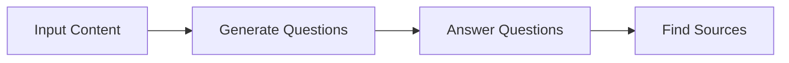
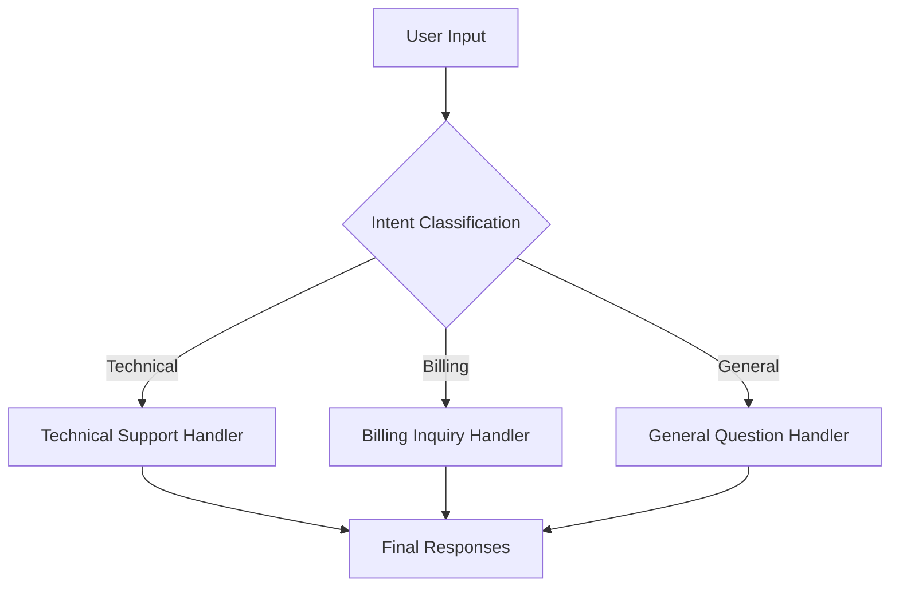
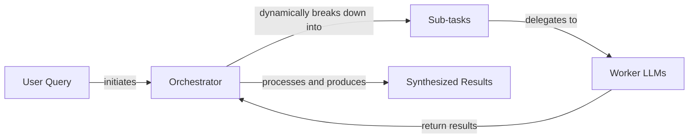

# Lesson 5: Basic Workflow Patterns

In our previous lessons, we covered the agent landscape, the difference between workflows and agents, context engineering, and structured outputs. These are the foundational skills you need as an AI Engineer. Now, we will build on that foundation by exploring the basic patterns for constructing LLM workflows: chaining, parallelization, routing, and the orchestrator-worker pattern.

Mastering these patterns is the first step toward building sophisticated and reliable LLM applications. They provide modularity, improve accuracy, and allow for more controlled processing. These techniques are the building blocks for both the deterministic workflows and the more complex agentic systems we will build later in this course.

## The Challenge with Complex Single LLM Calls

A common mistake when starting with LLMs is to cram too many instructions into a single, complex prompt. The thinking is that a powerful model should be able to handle it all at once. While this might work for simple demos, it quickly breaks down in production.

Trying to make a single LLM call handle a multi-step task leads to several problems. It becomes difficult to pinpoint where an error occurred. The system lacks modularity, making it hard to update or improve specific parts. With long contexts, models often suffer from the "lost in the middle" problem, where they ignore information placed in the middle of the prompt [[1]](https://dev.to/thousand_miles_ai/the-lost-in-the-middle-problem-why-llms-ignore-the-middle-of-your-context-window-3al2). This approach also tends to be less reliable and can consume more tokens than necessary [[2]](https://www.mdpi.com/2079-9292/13/23/4712), [[3]](https://arxiv.org/html/2505.13360v1).

Let's look at a practical example. We will start with our usual setup.

1.  First, we configure the Gemini API client and define the model we will use. We will use `gemini-2.5-flash`, which is fast and cost-effective.
    ```python
    from lessons.utils import env
    import asyncio
    from enum import Enum
    import random
    import time
    
    from pydantic import BaseModel, Field
    from google import genai
    from google.genai import types
    
    env.load(required_env_vars=["GOOGLE_API_KEY"])
    
    client = genai.Client()
    MODEL_ID = "gemini-2.5-flash"
    ```
2.  Next, we will use three mock webpages about renewable energy as our source content.
    ```python
    webpage_1 = {
        "title": "The Benefits of Solar Energy",
        "content": "...",
    }
    
    webpage_2 = {
        "title": "Understanding Wind Turbines",
        "content": "...",
    }
    
    webpage_3 = {
        "title": "Energy Storage Solutions",
        "content": "...",
    }
    
    all_sources = [webpage_1, webpage_2, webpage_3]
    
    combined_content = "\n\n".join(
        [f"Source Title: {source['title']}\nContent: {source['content']}" for source in all_sources]
    )
    ```
3.  Now, we will try to generate a list of Frequently Asked Questions (FAQs), provide answers, and cite sources, all in a single, complex prompt.
    ```python
    n_questions = 10
    prompt_complex = f"""
    Based on the provided content from three webpages, generate a list of exactly {n_questions} frequently asked questions (FAQs).
    For each question, provide a concise answer derived ONLY from the text.
    After each answer, you MUST include a list of the 'Source Title's that were used to formulate that answer.
    
    <provided_content>
    {combined_content}
    </provided_content>
    """.strip()
    
    class FAQ(BaseModel):
        """A FAQ is a question and answer pair, with a list of sources used to answer the question."""
        question: str = Field(description="The question to be answered")
        answer: str = Field(description="The answer to the question")
        sources: list[str] = Field(description="The sources used to answer the question")
    
    class FAQList(BaseModel):
        """A list of FAQs"""
        faqs: list[FAQ] = Field(description="A list of FAQs")
    
    config = types.GenerateContentConfig(
        response_mime_type="application/json",
        response_schema=FAQList
    )
    response_complex = client.models.generate_content(
        model=MODEL_ID,
        contents=prompt_complex,
        config=config
    )
    result_complex = response_complex.parsed
    ```
    It outputs:
    ```text
    {
      "question": "What is solar energy and how does it work?",
      "answer": "Solar energy is a renewable powerhouse that converts sunlight into electricity through photovoltaic (PV) panels.",
      "sources": [
        "The Benefits of Solar Energy"
      ]
    }
    ...
    ```
While the output might look acceptable, this approach is brittle. The more complex the instructions, the higher the chance of inaccuracies. For example, the model might fail to cite all relevant sources or hallucinate an answer.

## The Power of Modularity: Why Chain LLM Calls?

A more robust solution is to break the complex task into smaller, manageable subtasks. This is the core idea behind prompt chaining: connecting multiple LLM calls sequentially, where the output of one step becomes the input for the next [[4]](https://www.decodingai.com/p/stop-building-ai-agents-use-these), [[5]](https://medium.com/@fabiolalli/a-practical-guide-to-prompt-engineering-techniques-and-their-use-cases-5f8574e2cd9a). It is a simple "divide-and-conquer" strategy, often compared to a manufacturing assembly line where each station performs one specialized task [[6]](https://datalearningscience.com/p/design-pattern-prompt-chaining-building).

This modular approach offers several benefits. The core insight is that it is often cheaper and more effective to have several specialized, smaller models work on subtasks than to rely on one giant model for everything [[7]](https://www.together.ai/blog/plan-divide-conquer). Each LLM call focuses on a specific, well-defined task, which generally leads to higher accuracy. It becomes much easier to debug because you can isolate issues to a specific step in the chain. This also gives you flexibility; you can swap, update, or optimize individual components independently [[4]](https://www.decodingai.com/p/stop-building-ai-agents-use-these).

However, chaining is not without downsides. It increases latency and can introduce new points of failure, requiring careful validation between steps to prevent errors from cascading [[8]](https://medium.com/@dev-Oscar-checklive/multi-llm-debugging-workflow-guide-e6df0cdc0747). Information can also be lost or distorted as it passes through the chain, a problem known as context degradation [[9]](https://futureagi.substack.com/p/how-tool-chaining-fails-in-production). We will explore techniques to manage these trade-offs throughout the course.

## Building a Sequential Workflow: FAQ Generation Pipeline

Let's refactor our FAQ generation example into a three-step sequential workflow:
1.  Generate Questions
2.  Answer Questions
3.  Find Sources

This approach gives us more control and produces more consistent results.


Image 1: A flowchart illustrating the sequential FAQ generation pipeline.

1.  First, we create a function that focuses only on generating a list of questions from the provided content.
    ```python
    class QuestionList(BaseModel):
        """A list of questions"""
        questions: list[str] = Field(description="A list of questions")
    
    prompt_generate_questions = """
    Based on the content below, generate a list of {n_questions} relevant and distinct questions that a user might have.
    
    <provided_content>
    {combined_content}
    </provided_content>
    """.strip()
    
    def generate_questions(content: str, n_questions: int = 10) -> list[str]:
        # ... function implementation
        return response_questions.parsed.questions
    ```
2.  Next, a function to answer a single question, using the same content as a knowledge source.
    ```python
    prompt_answer_question = """
    Using ONLY the provided content below, answer the following question.
    The answer should be concise and directly address the question.
    
    <question>
    {question}
    </question>
    
    <provided_content>
    {combined_content}
    </provided_content>
    """.strip()
    
    def answer_question(question: str, content: str) -> str:
        # ... function implementation
        return answer_response.text
    ```
3.  Finally, a function to identify which sources were used to generate a given answer.
    ```python
    class SourceList(BaseModel):
        """A list of source titles that were used to answer the question"""
        sources: list[str] = Field(description="A list of source titles that were used to answer the question")
    
    prompt_find_sources = """
    You will be given a question and an answer that was generated from a set of documents.
    Your task is to identify which of the original documents were used to create the answer.
    
    <question>
    {question}
    </question>
    
    <answer>
    {answer}
    </answer>
    
    <provided_content>
    {combined_content}
    </provided_content>
    """.strip()
    
    def find_sources(question: str, answer: str, content: str) -> list[str]:
        # ... function implementation
        return sources_response.parsed.sources
    ```
4.  We combine these functions into a sequential workflow.
    ```python
    def sequential_workflow(content, n_questions=10) -> list[FAQ]:
        """
        Execute the complete sequential workflow for FAQ generation.
        """
        # Generate questions
        questions = generate_questions(content, n_questions)
    
        # Answer and find sources for each question sequentially
        final_faqs = []
        for question in questions:
            answer = answer_question(question, content)
            sources = find_sources(question, answer, content)
            faq = FAQ(question=question, answer=answer, sources=sources)
            final_faqs.append(faq)
    
        return final_faqs
    
    start_time = time.monotonic()
    sequential_faqs = sequential_workflow(combined_content, n_questions=4)
    end_time = time.monotonic()
    print(f"Sequential processing completed in {end_time - start_time:.2f} seconds")
    ```
    It outputs:
    ```text
    Sequential processing completed in 22.20 seconds
    ```

This chained approach took about 22 seconds. While it is more reliable, the latency is noticeable. This brings us to our next pattern.

## Optimizing Sequential Workflows With Parallel Processing

For subtasks that are independent of each other, we can run them in parallel to significantly reduce the total processing time [[10]](https://deepchecks.com/orchestrating-multi-step-llm-chains-best-practices/). The intuition is simple, like cooking a large meal: instead of preparing each dish one after another, you work on the chicken, potatoes, and salad at the same time so everything is ready faster [[11]](https://mlpills.substack.com/p/diy-17-parallelisation-with-langchain). In our FAQ example, once we have the list of questions, answering each one and finding its sources are independent operations that can be processed concurrently.

We can implement this using Python's `asyncio` library, which is well-suited for I/O-bound tasks like making API calls to an LLM [[12]](https://santhalakshminarayana.github.io/blog/concurrency-patterns-python), [[13]](https://medium.com/@sizanmahmud08/python-concurrency-showdown-asyncio-vs-threading-vs-multiprocessing-which-should-you-choose-in-31205161899a).

1.  We will create asynchronous versions of our `answer_question` and `find_sources` functions. Then, we will create a function to process a single question by running these two steps concurrently.
    ```python
    async def answer_question_async(question: str, content: str) -> str:
        # ... async implementation
    
    async def find_sources_async(question: str, answer: str, content: str) -> list[str]:
        # ... async implementation
    
    async def process_question_parallel(question: str, content: str) -> FAQ:
        """
        Process a single question by generating answer and finding sources in parallel.
        """
        answer = await answer_question_async(question, content)
        sources = await find_sources_async(question, answer, content)
        return FAQ(
            question=question,
            answer=answer,
            sources=sources
        )
    ```
2.  Now, we can build our parallel workflow.
    ```python
    async def parallel_workflow(content: str, n_questions: int = 10) -> list[FAQ]:
        """
        Execute the complete parallel workflow for FAQ generation.
        """
        # Generate questions (this step remains synchronous)
        questions = generate_questions(content, n_questions)
    
        # Process all questions in parallel
        tasks = [process_question_parallel(question, content) for question in questions]
        parallel_faqs = await asyncio.gather(*tasks)
    
        return parallel_faqs
    
    start_time = time.monotonic()
    parallel_faqs = await parallel_workflow(combined_content, n_questions=4)
    end_time = time.monotonic()
    print(f"Parallel processing completed in {end_time - start_time:.2f} seconds")
    ```
    It outputs:
    ```text
    Parallel processing completed in 8.98 seconds
    ```

By running the tasks in parallel, we reduced the processing time from 22 seconds to just 9 seconds. While parallelization offers a significant speedup, it introduces concurrency challenges like race conditions or timeouts [[4]](https://www.decodingai.com/p/stop-building-ai-agents-use-these). You also have to be mindful of API rate limits. Making too many concurrent requests can lead to errors [[14]](https://tianpan.co/blog/2026-03-11-llm-api-resilience-production). In production systems, you would need to implement strategies like exponential backoff or use a request queue to manage the load.

## Introducing Dynamic Behavior: Routing and Conditional Logic

So far, our workflows have been linear. But real-world applications often require dynamic behavior. Routing, or conditional logic, allows a workflow to branch based on the input or an intermediate state [[4]](https://www.decodingai.com/p/stop-building-ai-agents-use-these).

This is another application of the "divide-and-conquer" principle. Instead of creating a single, monolithic prompt, we can use an LLM as a classifier to direct the input to a specialized handler. A common pattern is "cascading routing," where a request is first sent to a cheaper model and only escalated to a more powerful one if the initial response is insufficient [[15]](https://www.getmaxim.ai/articles/top-5-llm-routing-techniques/). For reliability, it is also wise to implement fallback logic, so if one handler fails, the request can be rerouted [[16]](https://blog.logrocket.com/llm-routing-right-model-for-requests/).

## Building a Basic Routing Workflow

Let's build a simple routing system for a customer service chatbot. The system will first classify the user's intent and then route the query to the appropriate specialized handler.


Image 2: A flowchart illustrating a customer service routing workflow.

1.  First, we define the possible intents and create a function to classify a user's query.
    ```python
    class IntentEnum(str, Enum):
        TECHNICAL_SUPPORT = "Technical Support"
        BILLING_INQUIRY = "Billing Inquiry"
        GENERAL_QUESTION = "General Question"
    
    class UserIntent(BaseModel):
        intent: IntentEnum
    
    def classify_intent(user_query: str) -> IntentEnum:
        """Uses an LLM to classify a user query."""
        # ... function implementation
        return response.parsed.intent
    ```
2.  Next, we define specialized prompts for each intent and a `handle_query` function that acts as our router.
    ```python
    prompt_technical_support = "..."
    prompt_billing_inquiry = "..."
    prompt_general_question = "..."
    
    def handle_query(user_query: str, intent: str) -> str:
        """Routes a query to the correct handler based on its classified intent."""
        if intent == IntentEnum.TECHNICAL_SUPPORT:
            prompt = prompt_technical_support.format(user_query=user_query)
        elif intent == IntentEnum.BILLING_INQUIRY:
            prompt = prompt_billing_inquiry.format(user_query=user_query)
        else:
            prompt = prompt_general_question.format(user_query=user_query)
        
        response = client.models.generate_content(model=MODEL_ID, contents=prompt)
        return response.text
    ```
3.  Now we can test the complete routing workflow.
    ```python
    query = "My internet connection is not working."
    intent = classify_intent(query)
    response = handle_query(query, intent)
    ```
    The query is correctly classified as `TECHNICAL_SUPPORT`, and the system provides a helpful, specialized response asking for more details. This modular approach is far more robust and maintainable than a single prompt trying to handle all possible customer issues.

## Orchestrator-Worker Pattern: Dynamic Task Decomposition

The orchestrator-worker pattern, analogous to the master-worker pattern in distributed computing, takes dynamic behavior a step further [[19]](https://www.confluent.io/blog/event-driven-multi-agent-systems/). It is one of the most widely deployed patterns in production AI systems [[20]](https://gurusup.com/blog/agent-orchestration-patterns). A central "orchestrator" LLM dynamically breaks down a complex task into subtasks, delegates them to specialized "worker" LLMs, and synthesizes their results [[17]](https://agents.kour.me/orchestrator-worker/), [[18]](https://mlpills.substack.com/p/diy-17-orchestrator-worker-llm-agent).

This pattern is perfect for complex problems where the required steps cannot be predicted in advance. The key difference from simple parallelization is its flexibility; the orchestrator determines the subtasks at runtime based on the specific input [[21]](https://platform.claude.com/cookbook/patterns-agents-orchestrator-workers). However, this coordination adds latency, so the pattern should be avoided in time-critical applications or when tasks cannot be decomposed without significant information loss [[22]](https://zencoder.ai/blog/multi-agent-orchestration-patterns).


Image 3: A flowchart illustrating the Orchestrator-Worker pattern, showing the flow from a user query to synthesized results via an orchestrator and worker LLMs.

Let's implement a simple customer service system using this pattern.

1.  First, the orchestrator analyzes a complex user query and breaks it down into a list of structured tasks.
    ```python
    def orchestrator(query: str) -> list[Task]:
        """Breaks down a complex query into a list of tasks."""
        # ... function implementation
        return response.parsed.tasks
    ```
2.  We then have specialized worker functions for each task type (`BillingInquiry`, `ProductReturn`, `StatusUpdate`), which simulate interacting with backend systems.
    ```python
    def handle_billing_worker(invoice_number: str, original_user_query: str) -> BillingTask:
        # ... function implementation
    
    def handle_return_worker(product_name: str, reason_for_return: str) -> ReturnTask:
        # ... function implementation
    
    def handle_status_worker(order_id: str) -> StatusTask:
        # ... function implementation
    ```
3.  A synthesizer LLM takes the structured outputs from the workers and composes a single, user-friendly response.
    ```python
    def synthesizer(results: list[Task]) -> str:
        """Combines structured results from workers into a single user-facing message."""
        # ... function implementation
        return response.text
    ```
4.  Finally, we tie everything together in a main processing pipeline.
    ```python
    def process_user_query(user_query):
        # 1. Run orchestrator to get tasks
        tasks_list = orchestrator(user_query)
    
        # 2. Run workers based on tasks
        worker_results = []
        for task in tasks_list:
            if task.query_type == QueryTypeEnum.BILLING_INQUIRY:
                worker_results.append(handle_billing_worker(task.invoice_number, user_query))
            # ... other workers
    
        # 3. Run synthesizer
        final_user_message = synthesizer(worker_results)
        print(final_user_message)
    
    complex_customer_query = """
    Hi, I'm writing to you because I have a question about invoice #INV-7890. It seems higher than I expected.
    Also, I would like to return the 'SuperWidget 5000' I bought because it's not compatible with my system.
    Finally, can you give me an update on my order #A-12345?
    """
    
    process_user_query(complex_customer_query)
    ```
    The orchestrator correctly deconstructs the query into three distinct tasks. Each task is handled by its specialized worker, and the synthesizer combines the results into a single, comprehensive email to the customer. This pattern provides a powerful and scalable way to handle unpredictable, multi-part user requests.

## Conclusion

In this lesson, we explored the fundamental workflow patterns that form the backbone of reliable LLM applications. We saw why breaking down complex problems into smaller, modular steps is superior to relying on a single, monolithic prompt. We implemented sequential chaining, optimized it with parallel processing, and added dynamic behavior with routing. Finally, we introduced the powerful orchestrator-worker pattern for handling unpredictable, multi-step tasks.

These patterns—chaining, parallelization, routing, and orchestration—are not just theoretical concepts. They are the practical tools you will use every day as an AI Engineer to build systems that are more accurate, debuggable, and maintainable. In our next lesson, we will give our workflows the ability to interact with the outside world by introducing tools and function calling.

## References
- [1] https://dev.to/thousand_miles_ai/the-lost-in-the-middle-problem-why-llms-ignore-the-middle-of-your-context-window-3al2
- [2] https://www.mdpi.com/2079-9292/13/23/4712
- [3] https://arxiv.org/html/2505.13360v1
- [4] https://www.decodingai.com/p/stop-building-ai-agents-use-these
- [5] https://medium.com/@fabiolalli/a-practical-guide-to-prompt-engineering-techniques-and-their-use-cases-5f8574e2cd9a
- [6] https://datalearningscience.com/p/design-pattern-prompt-chaining-building
- [7] https://www.together.ai/blog/plan-divide-conquer
- [8] https://medium.com/@dev-Oscar-checklive/multi-llm-debugging-workflow-guide-e6df0cdc0747
- [9] https://futureagi.substack.com/p/how-tool-chaining-fails-in-production
- [10] https://deepchecks.com/orchestrating-multi-step-llm-chains-best-practices/
- [11] https://mlpills.substack.com/p/diy-17-parallelisation-with-langchain
- [12] https://santhalakshminarayana.github.io/blog/concurrency-patterns-python
- [13] https://medium.com/@sizanmahmud08/python-concurrency-showdown-asyncio-vs-threading-vs-multiprocessing-which-should-you-choose-in-31205161899a
- [14] https://tianpan.co/blog/2026-03-11-llm-api-resilience-production
- [15] https://www.getmaxim.ai/articles/top-5-llm-routing-techniques/
- [16] https://blog.logrocket.com/llm-routing-right-model-for-requests/
- [17] https://agents.kour.me/orchestrator-worker/
- [18] https://mlpills.substack.com/p/diy-17-orchestrator-worker-llm-agent
- [19] https://www.confluent.io/blog/event-driven-multi-agent-systems/
- [20] https://gurusup.com/blog/agent-orchestration-patterns
- [21] https://platform.claude.com/cookbook/patterns-agents-orchestrator-workers
- [22] https://zencoder.ai/blog/multi-agent-orchestration-patterns