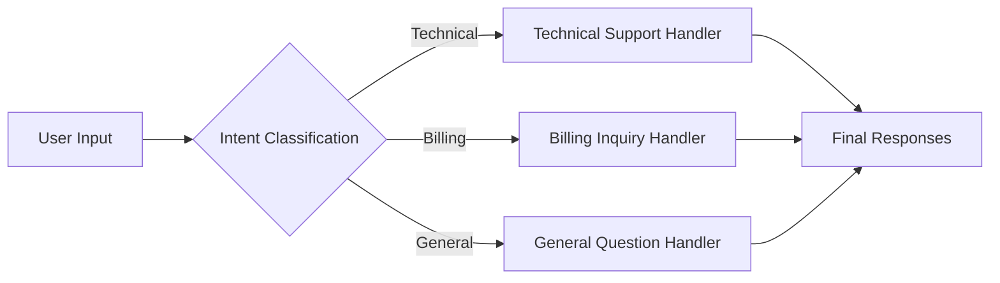
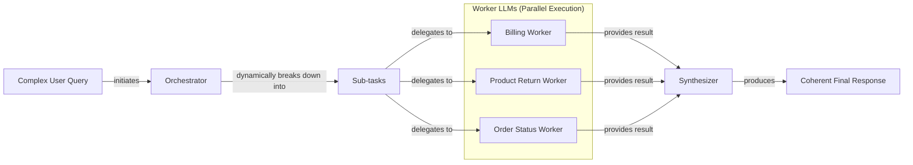

# Lesson 5: Basic Workflow Ingredients

In our previous lessons, we explored the agentic landscape, distinguished between rule-based workflows and autonomous agents, and covered context engineering and structured outputs. These are the foundations. Now, we move from theory to practice. It’s time to build the core components that make AI systems reliable.

You have probably tried stuffing a complex, multi-step task into a single, massive prompt. I have too. The results are often a mess of inconsistent outputs, silent failures, and hours of debugging. This approach treats the LLM as a black box, hoping it figures everything out. That is not engineering; it is gambling.

This lesson will show you how to stop gambling and start engineering. We will break down complex problems into manageable, reliable pieces using fundamental workflow patterns: chaining, parallelization, routing, and the orchestrator-worker model. We will implement these patterns from scratch using Google Gemini, giving you the mental models to build robust AI applications.

## The Challenge with Complex Single LLM Calls

Relying on a single, complex LLM call for a multi-step task is a common mistake. It seems efficient, but it introduces a host of problems that make systems brittle in production.

First, these "mega-prompts" are difficult to debug. When the output is wrong, it is nearly impossible to pinpoint which part of the instruction the model misunderstood. Second, they lack modularity. You cannot update or optimize one part of the task without rewriting the entire prompt, which often breaks other parts.

Perhaps the biggest issue is the "lost-in-the-middle" problem. Research from Stanford and UC Berkeley has shown that LLMs pay the most attention to the beginning and end of their context window, often ignoring information in the middle [[2]]. As your prompt grows with instructions and data, the model's ability to follow every detail degrades, leading to unreliable outputs.

Let's see this in action. We will try to generate a list of Frequently Asked Questions (FAQs) from a few documents on renewable energy, all in a single prompt.

1.  First, we set up our environment and define our source documents. We will use `gemini-2.5-flash`, a fast and cost-effective model suitable for these tasks.
    ```python
    from lessons.utils import env
    import google.genai as genai
    from google.genai import types
    from pydantic import BaseModel, Field

    env.load(required_env_vars=["GOOGLE_API_KEY"])
    client = genai.Client()
    MODEL_ID = "gemini-2.5-flash"

    webpage_1 = {
        "title": "The Benefits of Solar Energy",
        "content": "..."
    }
    webpage_2 = {
        "title": "Understanding Wind Turbines",
        "content": "..."
    }
    webpage_3 = {
        "title": "Energy Storage Solutions",
        "content": "..."
    }
    all_sources = [webpage_1, webpage_2, webpage_3]
    combined_content = "\n\n".join(
        [f"Source Title: {source['title']}\nContent: {source['content']}" for source in all_sources]
    )
    ```

2.  Next, we create a complex prompt that asks the model to generate questions, find answers, and cite sources simultaneously.
    ```python
    class FAQ(BaseModel):
        question: str
        answer: str
        sources: list[str]

    class FAQList(BaseModel):
        faqs: list[FAQ]

    n_questions = 10
    prompt_complex = f"""
    Based on the provided content from three webpages, generate a list of exactly {n_questions} frequently asked questions (FAQs).
    For each question, provide a concise answer derived ONLY from the text.
    After each answer, you MUST include a list of the 'Source Title's that were used to formulate that answer.

    <provided_content>
    {combined_content}
    </provided_content>
    """.strip()

    config = types.GenerateContentConfig(
        response_mime_type="application/json",
        response_schema=FAQList
    )
    response_complex = client.models.generate_content(
        model=MODEL_ID,
        contents=prompt_complex,
        config=config
    )
    result_complex = response_complex.parsed
    ```
    It outputs:
    ```json
    {
        "question": "Why is energy storage crucial for renewable energy sources like solar and wind?",
        "answer": "Effective energy storage is key to unlocking the full potential of renewable sources because it allows storing excess energy when plentiful and releasing it when needed, which is crucial for a stable power grid.",
        "sources": [
            "Energy Storage Solutions",
            "Understanding Wind Turbines"
        ]
    }
    ```
While this output looks reasonable, this approach is fragile. With more complex instructions, the model might start hallucinating sources, generating answers from its own knowledge, or failing to adhere to the JSON format. For example, some answers might be derived from multiple sources, but the model often misses this detail in a single pass. To build something reliable, we need a better way.

## The Power of Modularity: Why Chain LLM Calls?

The solution is to stop treating the LLM as a monolithic oracle and start treating it as a component in a larger system. Prompt chaining is the practice of breaking a complex task into a sequence of smaller, simpler LLM calls. The output of one step becomes the input for the next, creating a workflow.

This "divide-and-conquer" approach offers several advantages [[36]]:

-   **Improved Modularity:** Each LLM call focuses on a single, well-defined sub-task. This makes the system easier to understand, maintain, and update.
-   **Enhanced Accuracy:** Simpler, targeted prompts ground the model in a narrow context, which can reduce hallucinations and lead to more reliable outputs [[37]].
-   **Easier Debugging:** When a failure occurs, you can isolate the exact step in the chain that caused the problem, rather than trying to debug a single, massive prompt.
-   **Increased Flexibility:** You can swap, update, or optimize individual components of the chain independently. You can even use different models for different steps—a fast, cheap model for a simple classification task, and a more powerful one for complex generation.

However, this pattern is not a silver bullet. Chaining introduces its own trade-offs. Each additional LLM call adds latency and cost. There is also a risk of information loss; as data is passed and transformed through the chain, important details from earlier steps can be diluted or lost entirely [[22]]. The key is to design chains that are just long enough to ensure reliability without adding unnecessary complexity.

## Building a Sequential Workflow: FAQ Generation Pipeline

Let's refactor our FAQ generation task into a three-step sequential workflow:
1.  **Generate Questions:** The first LLM call will read the source content and generate a list of potential questions.
2.  **Answer Questions:** For each question, a second LLM call will generate a concise answer based on the content.
3.  **Find Sources:** For each question-answer pair, a third LLM call will identify the source documents used.

This modular approach gives us more control and makes the process more transparent.

```mermaid
flowchart LR
  "Input Content" --> "Generate Questions"
  "Generate Questions" --> "Answer Questions"
  "Answer Questions" --> "Find Sources"
```
Image 1: A flowchart illustrating the sequential FAQ generation pipeline.

1.  First, we define a function to generate only the questions. This prompt is simple and focused.
    ```python
    class QuestionList(BaseModel):
        questions: list[str]

    prompt_generate_questions = """
    Based on the content below, generate a list of {n_questions} relevant and distinct questions that a user might have.

    <provided_content>
    {combined_content}
    </provided_content>
    """.strip()

    def generate_questions(content: str, n_questions: int = 10) -> list[str]:
        config = types.GenerateContentConfig(
            response_mime_type="application/json",
            response_schema=QuestionList
        )
        response_questions = client.models.generate_content(
            model=MODEL_ID,
            contents=prompt_generate_questions.format(n_questions=n_questions, combined_content=content),
            config=config
        )
        return response_questions.parsed.questions
    ```

2.  Next, a function to answer a single question.
    ```python
    prompt_answer_question = """
    Using ONLY the provided content below, answer the following question.
    The answer should be concise and directly address the question.

    <question>
    {question}
    </question>

    <provided_content>
    {combined_content}
    </provided_content>
    """.strip()

    def answer_question(question: str, content: str) -> str:
        answer_response = client.models.generate_content(
            model=MODEL_ID,
            contents=prompt_answer_question.format(question=question, combined_content=content),
        )
        return answer_response.text
    ```

3.  Finally, a function to find the sources for a given answer.
    ```python
    class SourceList(BaseModel):
        sources: list[str]

    prompt_find_sources = """
    You will be given a question and an answer that was generated from a set of documents.
    Your task is to identify which of the original documents were used to create the answer.

    <question>
    {question}
    </question>

    <answer>
    {answer}
    </answer>

    <provided_content>
    {combined_content}
    </provided_content>
    """.strip()

    def find_sources(question: str, answer: str, content: str) -> list[str]:
        config = types.GenerateContentConfig(
            response_mime_type="application/json",
            response_schema=SourceList
        )
        sources_response = client.models.generate_content(
            model=MODEL_ID,
            contents=prompt_find_sources.format(question=question, answer=answer, combined_content=content),
            config=config
        )
        return sources_response.parsed.sources
    ```

4.  We tie it all together in a sequential workflow function.
    ```python
    import time

    def sequential_workflow(content, n_questions=10) -> list[FAQ]:
        questions = generate_questions(content, n_questions)

        final_faqs = []
        for question in questions:
            answer = answer_question(question, content)
            sources = find_sources(question, answer, content)
            faq = FAQ(question=question, answer=answer, sources=sources)
            final_faqs.append(faq)
        return final_faqs

    start_time = time.monotonic()
    sequential_faqs = sequential_workflow(combined_content, n_questions=4)
    end_time = time.monotonic()
    print(f"Sequential processing completed in {end_time - start_time:.2f} seconds")
    ```
    It outputs:
    ```text
    Sequential processing completed in 22.20 seconds
    ```
This workflow is more robust and easier to debug, but it is also slower. Each step runs in sequence, so the total time is the sum of all individual LLM calls. For four questions, this took over 20 seconds. We can do better.

## Optimizing Sequential Workflows With Parallel Processing

In our sequential workflow, the processing for each question is independent of the others. This is a perfect opportunity for parallelization. By running the "answer" and "find sources" steps for all questions concurrently, we can significantly reduce the total execution time.

We will use Python's `asyncio` library to handle these concurrent API calls.

1.  First, we create asynchronous versions of our `answer_question` and `find_sources` functions.
    ```python
    import asyncio

    async def answer_question_async(question: str, content: str) -> str:
        prompt = prompt_answer_question.format(question=question, combined_content=content)
        response = await client.aio.models.generate_content(
            model=MODEL_ID,
            contents=prompt
        )
        return response.text

    async def find_sources_async(question: str, answer: str, content: str) -> list[str]:
        prompt = prompt_find_sources.format(question=question, answer=answer, combined_content=content)
        config = types.GenerateContentConfig(
            response_mime_type="application/json",
            response_schema=SourceList
        )
        response = await client.aio.models.generate_content(
            model=MODEL_ID,
            contents=prompt,
            config=config
        )
        return response.parsed.sources
    ```

2.  Next, we create a function that processes a single question by running its sub-tasks in parallel.
    ```python
    async def process_question_parallel(question: str, content: str) -> FAQ:
        answer = await answer_question_async(question, content)
        sources = await find_sources_async(question, answer, content)
        return FAQ(question=question, answer=answer, sources=sources)
    ```

3.  Finally, we update our main workflow to gather and run all question-processing tasks concurrently.
    ```python
    async def parallel_workflow(content: str, n_questions: int = 10) -> list[FAQ]:
        questions = generate_questions(content, n_questions)

        tasks = [process_question_parallel(question, content) for question in questions]
        parallel_faqs = await asyncio.gather(*tasks)
        return parallel_faqs

    start_time = time.monotonic()
    parallel_faqs = await parallel_workflow(combined_content, n_questions=4)
    end_time = time.monotonic()
    print(f"Parallel processing completed in {end_time - start_time:.2f} seconds")
    ```
    It outputs:
    ```text
    Parallel processing completed in 8.98 seconds
    ```
By running tasks in parallel, we cut the execution time from 22 seconds to just 9. While parallelization is faster, it introduces complexity in error handling and can quickly hit API rate limits if you are not careful [[9]]. For production systems, you need to implement strategies like exponential backoff and request queuing to manage this.

## Introducing Dynamic Behavior: Routing and Conditional Logic

So far, our workflows have been linear. But real-world applications often require dynamic behavior. Not all inputs should be treated the same way. Routing is a pattern that uses an LLM to classify an input and direct it down a specialized path or "branch" of the workflow.

This is another application of the "divide-and-conquer" principle. Instead of creating a single, complex prompt that tries to handle every possible input variation, we create multiple, specialized prompts. A classifier LLM then acts as a dispatcher, choosing the right prompt for the job. This keeps each component simple, focused, and easier to maintain.

## Building a Basic Routing Workflow

Let's build a simple routing system for a customer service chatbot. The system will first classify the user's intent and then route the query to a specialized handler.


Image 2: A flowchart illustrating a routing workflow for customer service intent classification.

1.  First, we define the possible intents and a function to classify a user's query. We use Pydantic models to ensure the LLM's output is structured and valid.
    ```python
    from enum import Enum

    class IntentEnum(str, Enum):
        TECHNICAL_SUPPORT = "Technical Support"
        BILLING_INQUIRY = "Billing Inquiry"
        GENERAL_QUESTION = "General Question"

    class UserIntent(BaseModel):
        intent: IntentEnum

    def classify_intent(user_query: str) -> IntentEnum:
        prompt = f"""
        Classify the user's query into one of the following categories:
        { [intent.value for intent in IntentEnum] }

        <user_query>{user_query}</user_query>
        """.strip()
        config = types.GenerateContentConfig(
            response_mime_type="application/json",
            response_schema=UserIntent
        )
        response = client.models.generate_content(
            model=MODEL_ID, contents=prompt, config=config
        )
        return response.parsed.intent
    ```

2.  Next, we define specialized prompts for each intent.
    ```python
    prompt_technical_support = """You are a helpful technical support agent. Provide a helpful first response, asking for more details..."""
    prompt_billing_inquiry = """You are a helpful billing support agent. Acknowledge their concern and ask for their account number..."""
    prompt_general_question = """You are a general assistant. Apologize that you are not sure how to help..."""
    ```

3.  Finally, we create a `handle_query` function that takes the user's query and the classified intent, and routes it to the correct prompt.
    ```python
    def handle_query(user_query: str, intent: str) -> str:
        if intent == IntentEnum.TECHNICAL_SUPPORT:
            prompt = prompt_technical_support.format(user_query=user_query)
        elif intent == IntentEnum.BILLING_INQUIRY:
            prompt = prompt_billing_inquiry.format(user_query=user_query)
        else:
            prompt = prompt_general_question.format(user_query=user_query)
        
        response = client.models.generate_content(model=MODEL_ID, contents=prompt)
        return response.text
    ```
    Now, a query like "My internet connection is not working" gets classified as `TECHNICAL_SUPPORT` and receives a helpful troubleshooting response, while a query about an invoice is routed to the billing handler. This separation of concerns makes the system much more robust. This `if/elif` logic is a start, but production routers often handle more than just intent. They might route queries to different models based on cost and latency, or use fallback chains that automatically retry a request with a backup model to ensure high reliability [[38]].

## Orchestrator-Worker Pattern: Dynamic Task Decomposition

The orchestrator-worker pattern manages complexity much like a project manager leading a team of specialists [[39]]. A central "orchestrator" LLM analyzes a user's query, dynamically breaks it down into smaller subtasks, and delegates each to a specialized "worker." A final "synthesizer" then combines the workers' outputs into a single, coherent response [[16]].

The key difference from the parallel processing we saw earlier is its dynamic nature. Instead of executing a fixed set of tasks, the orchestrator decides on the subtasks at runtime based on the specific input. This makes the pattern ideal for complex, multifaceted queries where the required steps cannot be predicted in advance [[40]].

This flexibility has trade-offs. The orchestrator can be a single point of failure and a performance bottleneck, with its context window limiting complexity [[41]]. A common optimization is using a powerful model for orchestration and cheaper models for workers [[42]]. Still, if workers return inconsistent outputs, the synthesizer can fail, breaking the entire workflow [[43]].


Image 3: A flowchart illustrating the orchestrator-worker pattern.

In our customer service example, a complex query is broken down:
1. The **orchestrator** generates a plan with three tasks (billing, return, status update).
2. It dispatches each to a specialized **worker** to run in parallel.
3. The **synthesizer** gathers the results and composes a single, comprehensive email addressing all issues.

Here is what the implementation might look like at a high level.

1.  The orchestrator takes a complex query and breaks it into a list of structured tasks.
    ```python
    def orchestrator(query: str) -> list[Task]:
        # ... (prompt defines possible query_types and parameters)
        # LLM call to break down the query into a TaskList
        ...
    ```

2.  We define specialized workers for each task type (`BillingInquiry`, `ProductReturn`, `StatusUpdate`). Each worker might call an internal API or another LLM to perform its function.
    ```python
    def handle_billing_worker(invoice_number: str, original_user_query: str) -> BillingTask:
        # ... (simulates opening an investigation)
        ...

    def handle_return_worker(product_name: str, reason_for_return: str) -> ReturnTask:
        # ... (simulates generating an RMA number)
        ...

    def handle_status_worker(order_id: str) -> StatusTask:
        # ... (simulates fetching order status)
        ...
    ```

3.  The synthesizer takes the structured outputs from all workers and generates a friendly, unified response for the customer.
    ```python
    def synthesizer(results: list[Task]) -> str:
        # ... (prompt combines results into a cohesive email)
        ...
    ```
This pattern provides a powerful and scalable way to handle complex, unpredictable user requests.

## Conclusion

We have moved beyond the limitations of single, complex prompts and into the world of structured AI workflows. You have learned how to build more reliable and modular systems using four fundamental patterns:

-   **Prompt Chaining:** For tasks that break down into clear, sequential steps.
-   **Parallelization:** To speed up workflows with independent subtasks.
-   **Routing:** To dynamically handle different types of inputs with specialized logic.
-   **Orchestrator-Worker:** For complex tasks that require dynamic decomposition and delegation.

These patterns are not just theoretical concepts; they are the practical building blocks for almost any production-grade AI application. They provide the control, reliability, and modularity that single prompts lack.

In our next lessons, we will build on this foundation. We will explore how to give our workflows the ability to take action using tools, how to implement more advanced reasoning patterns, and how to equip our systems with memory.

## References

- [2]  https://dev.to/thousand_miles_ai/the-lost-in-the-middle-problem-why-llms-ignore-the-middle-of-your-context-window-3al2
- [9]  https://tianpan.co/blog/2026-03-11-llm-api-resilience-production
- [16]  https://agents.kour.me/orchestrator-worker/
- [22]  https://futureagi.substack.com/p/how-tool-chaining-fails-in-production
- [36]  https://www.decodingai.com/p/stop-building-ai-agents-use-these
- [37]  https://medium.com/@shivangis2208/from-prompts-to-systems-prompt-chaining-in-agent-design-da493651214d
- [38]  https://www.getmaxim.ai/articles/top-5-llm-routing-techniques/
- [39]  https://online.stevens.edu/blog/building-self-healing-ai-orchestrator-reflexion-patterns/
- [40]  https://platform.claude.com/cookbook/patterns-agents-orchestrator-workers
- [41]  https://gurusup.com/blog/agent-orchestration-patterns
- [42]  https://labelyourdata.com/articles/llm-fine-tuning/llm-orchestration
- [43]  https://orq.ai/blog/why-do-multi-agent-llm-systems-fail