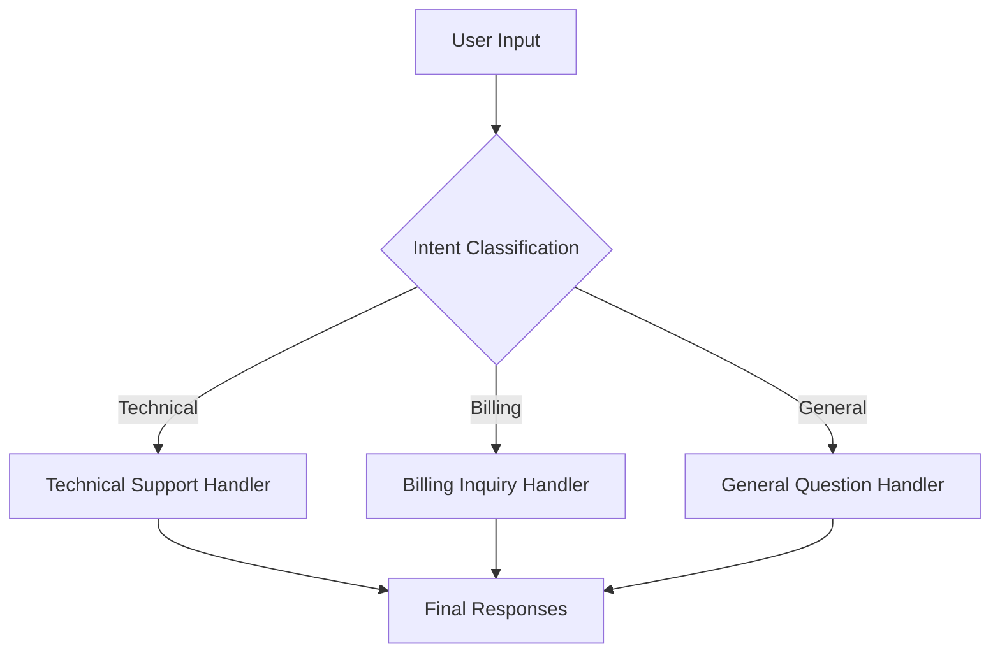
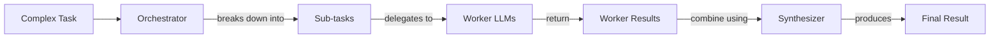

# Basic Workflow Patterns: Your First Step to Reliable AI

In the last lesson, we covered context engineering and the art of feeding the right information to an LLM. Now, we will tackle the other side of the equation: getting structured and reliable information *out* of an LLM. In real-world applications, a single LLM call often falls short. Complex problems, like moderating content or handling customer service, require multiple steps, checks, and decisions.

Relying on one massive, do-it-all prompt often leads to unreliable systems. It’s hard to debug, impossible to maintain, and frequently produces inconsistent results. As AI engineers, we need a more robust approach. The solution is to think in workflows, not just prompts.

This lesson explores the fundamental building blocks for creating these workflows. We will cover chaining multiple LLM calls, running them in parallel, implementing conditional routing, and using the orchestrator-worker pattern. By breaking down complex tasks into smaller, manageable steps, you can build AI systems that are more modular, accurate, and easier to control. We will show you how to implement these patterns from scratch using Google Gemini.

## The Challenge with Complex Single LLM Calls

Stuffing multiple instructions into a single, complex prompt might seem efficient, but it often leads to unreliable and hard-to-debug systems. When a single LLM call is responsible for a multi-step task, a few common problems arise.

First, it's difficult to pinpoint errors. If the output is wrong, you don't know which instruction failed. This lack of modularity makes debugging a guessing game and complicates updates. Second, long prompts suffer from the "lost-in-the-middle" problem, where models ignore details in the middle of the context [[1]]. The more instructions you add, the higher the risk of the model overlooking key information. Finally, trying to do too much at once can lead to higher token consumption and less reliable outputs. The model has to juggle multiple constraints, which can degrade the quality of each sub-task.

Let's demonstrate this with an example. We'll set up our environment and ask the model to generate FAQs from renewable energy content in a single call.

1.  First, we initialize the Gemini client and define our model.
    ```python
    import asyncio
    from enum import Enum
    import random
    import time
    
    from pydantic import BaseModel, Field
    from google import genai
    from google.genai import types
    
    from lessons.utils import env
    
    env.load(required_env_vars=["GOOGLE_API_KEY"])
    
    client = genai.Client()
    
    MODEL_ID = "gemini-2.5-flash"
    ```

2.  Next, we create mock webpages that will serve as our source content.
    ```python
    webpage_1 = {
        "title": "The Benefits of Solar Energy",
        "content": "...",
    }
    
    webpage_2 = {
        "title": "Understanding Wind Turbines",
        "content": "...",
    }
    
    webpage_3 = {
        "title": "Energy Storage Solutions",
        "content": "...",
    }
    
    all_sources = [webpage_1, webpage_2, webpage_3]
    
    combined_content = "\n\n".join(
        [f"Source Title: {source['title']}\nContent: {source['content']}" for source in all_sources]
    )
    ```

3.  Now, let’s try to generate FAQs with questions, answers, and source citations all in one prompt.
    ```python
    # This prompt tries to do everything at once: generate questions, find answers,
    # and cite sources. This complexity can often confuse the model.
    n_questions = 10
    prompt_complex = f"""
    Based on the provided content from three webpages, generate a list of exactly {n_questions} frequently asked questions (FAQs).
    For each question, provide a concise answer derived ONLY from the text.
    After each answer, you MUST include a list of the 'Source Title's that were used to formulate that answer.
    
    <provided_content>
    {combined_content}
    </provided_content>
    """.strip()
    
    # Pydantic classes for structured outputs
    class FAQ(BaseModel):
        """A FAQ is a question and answer pair, with a list of sources used to answer the question."""
        question: str = Field(description="The question to be answered")
        answer: str = Field(description="The answer to the question")
        sources: list[str] = Field(description="The sources used to answer the question")
    
    class FAQList(BaseModel):
        """A list of FAQs"""
        faqs: list[FAQ] = Field(description="A list of FAQs")
    
    # Generate FAQs
    config = types.GenerateContentConfig(
        response_mime_type="application/json",
        response_schema=FAQList
    )
    response_complex = client.models.generate_content(
        model=MODEL_ID,
        contents=prompt_complex,
        config=config
    )
    result_complex = response_complex.parsed
    ```
    It outputs:
    ```text
    {
      "question": "Why is energy storage crucial for renewable energy sources like solar and wind?",
      "answer": "Effective energy storage is key to unlocking the full potential of renewable sources because it allows storing excess energy when plentiful and releasing it when needed, which is crucial for a stable power grid.",
      "sources": [
        "Energy Storage Solutions",
        "Understanding Wind Turbines"
      ]
    }
    ```
While the output might look acceptable, this approach is brittle. The more instructions we add, the more likely we are to get inaccuracies, such as the model missing that an answer comes from multiple sources. A better approach is to break the problem down.

## The Power of Modularity: Why Chain LLM Calls?

Prompt chaining is the practice of connecting multiple LLM calls sequentially, where the output of one step becomes the input for the next. It’s a "divide-and-conquer" strategy that makes complex tasks more manageable and reliable.

This modular approach offers several benefits. Each LLM call can focus on a specific, well-defined sub-task, and simpler, targeted prompts generally lead to more accurate outputs [[2]]. This makes debugging much easier, as you can isolate issues to a specific link in the chain. It also increases flexibility; you can swap, update, or optimize individual components independently. For instance, you could use a fast, cheap model for a simple classification step and a more powerful model for complex content generation.

However, chaining is not without its downsides. Each additional LLM call adds latency, increasing the total time to completion. It can also increase costs due to higher token usage across multiple calls. Furthermore, information can be lost or distorted as it passes through the chain [[3]]. For example, a summarization step followed by a translation step might lose nuances from the original text [[4]].

## Building a Sequential Workflow: FAQ Generation Pipeline

Let's apply prompt chaining to our FAQ generation task. Instead of one complex prompt, we will create a three-step sequential workflow. This approach improves reliability and traceability by breaking the problem into focused, manageable parts. By separating concerns, we can ensure each step performs its function correctly before passing the result to the next. This modularity is key to building robust LLM applications.

The first step, generating questions, allows the model to focus on creating a diverse and relevant set of queries without the added constraint of simultaneously finding answers. This separation often leads to higher-quality questions that cover the source material more comprehensively. The second step, answering each question, benefits from a highly focused prompt that directs the model to find a concise and accurate answer from the provided text. This single-responsibility approach reduces the chances of hallucination or incomplete responses.

Finally, the third step of identifying sources acts as a crucial verification layer. By having a dedicated prompt for source attribution, we can more reliably trace where each piece of information came from. If this step fails to find a source for a given answer, it immediately signals a potential issue in the chain, either with the answer's accuracy or the source-finding logic itself. This makes debugging far more efficient than trying to untangle a single, complex output. This process is illustrated in Image 1.

Image 1: A flowchart illustrating the sequential FAQ generation pipeline.
```mermaid
flowchart LR
  "Input Content" --> "Generate Questions"
  "Generate Questions" --> "Answer Questions"
  "Answer Questions" --> "Find Sources"
```

1.  First, we define a function to generate a list of questions from our content.
    ```python
    class QuestionList(BaseModel):
        """A list of questions"""
        questions: list[str] = Field(description="A list of questions")
    
    prompt_generate_questions = """
    Based on the content below, generate a list of {n_questions} relevant and distinct questions that a user might have.
    
    <provided_content>
    {combined_content}
    </provided_content>
    """.strip()
    
    def generate_questions(content: str, n_questions: int = 10) -> list[str]:
        """
        Generate a list of questions based on the provided content.
        """
        config = types.GenerateContentConfig(
            response_mime_type="application/json",
            response_schema=QuestionList
        )
        response_questions = client.models.generate_content(
            model=MODEL_ID,
            contents=prompt_generate_questions.format(n_questions=n_questions, combined_content=content),
            config=config
        )
    
        return response_questions.parsed.questions
    ```

2.  Next, a function to answer each question individually.
    ```python
    prompt_answer_question = """
    Using ONLY the provided content below, answer the following question.
    The answer should be concise and directly address the question.
    
    <question>
    {question}
    </question>
    
    <provided_content>
    {combined_content}
    </provided_content>
    """.strip()
    
    def answer_question(question: str, content: str) -> str:
        """
        Generate an answer for a specific question using only the provided content.
        """
        answer_response = client.models.generate_content(
            model=MODEL_ID,
            contents=prompt_answer_question.format(question=question, combined_content=content),
        )
        return answer_response.text
    ```

3.  Finally, a function to identify the sources for each answer.
    ```python
    class SourceList(BaseModel):
        """A list of source titles that were used to answer the question"""
        sources: list[str] = Field(description="A list of source titles that were used to answer the question")
    
    prompt_find_sources = """
    You will be given a question and an answer that was generated from a set of documents.
    Your task is to identify which of the original documents were used to create the answer.
    
    <question>
    {question}
    </question>
    
    <answer>
    {answer}
    </answer>
    
    <provided_content>
    {combined_content}
    </provided_content>
    """.strip()
    
    def find_sources(question: str, answer: str, content: str) -> list[str]:
        """
        Identify which sources were used to generate an answer.
        """
        config = types.GenerateContentConfig(
            response_mime_type="application/json",
            response_schema=SourceList
        )
        sources_response = client.models.generate_content(
            model=MODEL_ID,
            contents=prompt_find_sources.format(question=question, answer=answer, combined_content=content),
            config=config
        )
        return sources_response.parsed.sources
    ```

4.  We combine these functions into a sequential workflow that processes each question one by one.
    ```python
    def sequential_workflow(content, n_questions=10) -> list[FAQ]:
        """
        Execute the complete sequential workflow for FAQ generation.
        """
        questions = generate_questions(content, n_questions)
        final_faqs = []
        for question in questions:
            answer = answer_question(question, content)
            sources = find_sources(question, answer, content)
            faq = FAQ(question=question, answer=answer, sources=sources)
            final_faqs.append(faq)
        return final_faqs
    
    start_time = time.monotonic()
    sequential_faqs = sequential_workflow(combined_content, n_questions=4)
    end_time = time.monotonic()
    print(f"Sequential processing completed in {end_time - start_time:.2f} seconds")
    ```
    It outputs:
    ```text
    Sequential processing completed in 22.20 seconds
    ```
This sequential workflow is more reliable and easier to debug, but as you can see from the execution time, it can be slow.

## Optimizing Sequential Workflows With Parallel Processing

We can significantly speed up our workflow by executing independent tasks in parallel. In our FAQ example, the process of answering each question and finding its sources is independent of the others. This means we can process all the questions simultaneously, which is particularly effective for batch processing tasks.

We will use Python’s `asyncio` library to handle these concurrent API calls. This allows our application to make multiple requests to the Gemini API at once, rather than waiting for each one to complete before starting the next. This can dramatically reduce the total processing time, especially for a large number of questions.

While parallel processing offers a significant speed advantage, it introduces its own set of trade-offs. Sequential processing is predictable and easier to debug, as you can trace a clear, linear execution path. Errors are contained within a single sequence, preventing them from affecting other tasks. In contrast, parallel processing makes debugging more complex. Logs from concurrent tasks are interleaved, making it harder to trace a single process. Error handling also becomes more challenging, as you need to manage partial failures where some tasks succeed and others fail. Furthermore, running many calls at once increases the load on the API provider, making it crucial to handle rate limits gracefully to avoid service disruptions [[5], [6], [7]].

1.  First, we create asynchronous versions of our `answer_question` and `find_sources` functions.
    ```python
    async def answer_question_async(question: str, content: str) -> str:
        """
        Async version of answer_question function.
        """
        prompt = prompt_answer_question.format(question=question, combined_content=content)
        response = await client.aio.models.generate_content(
            model=MODEL_ID,
            contents=prompt
        )
        return response.text
    
    async def find_sources_async(question: str, answer: str, content: str) -> list[str]:
        """
        Async version of find_sources function.
        """
        prompt = prompt_find_sources.format(question=question, answer=answer, combined_content=content)
        config = types.GenerateContentConfig(
            response_mime_type="application/json",
            response_schema=SourceList
        )
        response = await client.aio.models.generate_content(
            model=MODEL_ID,
            contents=prompt,
            config=config
        )
        return response.parsed.sources
    
    async def process_question_parallel(question: str, content: str) -> FAQ:
        """
        Process a single question by generating answer and finding sources in parallel.
        """
        answer = await answer_question_async(question, content)
        sources = await find_sources_async(question, answer, content)
        return FAQ(
            question=question,
            answer=answer,
            sources=sources
        )
    ```

2.  Next, we define the parallel workflow.
    ```python
    async def parallel_workflow(content: str, n_questions: int = 10) -> list[FAQ]:
        """
        Execute the complete parallel workflow for FAQ generation.
        """
        questions = generate_questions(content, n_questions)
        tasks = [process_question_parallel(question, content) for question in questions]
        parallel_faqs = await asyncio.gather(*tasks)
        return parallel_faqs
    
    start_time = time.monotonic()
    parallel_faqs = await parallel_workflow(combined_content, n_questions=4)
    end_time = time.monotonic()
    print(f"Parallel processing completed in {end_time - start_time:.2f} seconds")
    ```
    It outputs:
    ```text
    Parallel processing completed in 8.98 seconds
    ```
As you can see, parallel processing completed in less than half the time of the sequential approach.

## Introducing Dynamic Behavior: Routing and Conditional Logic

So far, our workflows have been linear. However, many real-world applications require dynamic behavior, where the path of execution changes based on the input. This is where routing comes in. Routing uses conditional logic to direct an input to a specialized task or prompt. For example, a customer support bot might route a billing question to one handler and a technical issue to another.

We can use an LLM call to make the routing decision itself, for instance, by classifying a user's intent. This allows us to create branching workflows that handle different types of queries with specialized logic. This is another application of the "divide-and-conquer" principle, ensuring that each prompt remains focused on a single responsibility [[2], [8]].

## Building a Basic Routing Workflow

Let's build a simple routing workflow for a customer service system. Imagine a single chatbot trying to handle every type of customer query. It might provide generic, unhelpful answers to specific billing questions or fail to understand technical issues. This poor user experience can be solved with routing.

The goal is to classify a user's query intent and then route it to a specialized handler. The possible categories are Technical Support, Billing Inquiry, or General Question. This process ensures each type of query gets a relevant response from an "expert" prompt, as illustrated in Image 2. By directing inputs to the correct logic path, we avoid creating a single, monolithic prompt that tries to handle every possibility. This makes the system more reliable, maintainable, and effective, as we can update the "billing expert" without affecting the "technical support expert" [[12], [13]].

Image 2: A flowchart illustrating a routing workflow for customer service intent classification.


1.  First, we define a function to classify the user's intent using an LLM.
    ```python
    class IntentEnum(str, Enum):
        TECHNICAL_SUPPORT = "Technical Support"
        BILLING_INQUIRY = "Billing Inquiry"
        GENERAL_QUESTION = "General Question"
    
    class UserIntent(BaseModel):
        intent: IntentEnum = Field(description="The intent of the user's query")
    
    prompt_classification = """
    Classify the user's query into one of the following categories.
    
    <categories>
    {categories}
    </categories>
    
    <user_query>
    {user_query}
    </user_query>
    """.strip()
    
    
    def classify_intent(user_query: str) -> IntentEnum:
        """Uses an LLM to classify a user query."""
        prompt = prompt_classification.format(
            user_query=user_query,
            categories=[intent.value for intent in IntentEnum]
        )
        config = types.GenerateContentConfig(
            response_mime_type="application/json",
            response_schema=UserIntent
        )
        response = client.models.generate_content(
            model=MODEL_ID,
            contents=prompt,
            config=config
        )
        return response.parsed.intent
    ```

2.  Next, we define specialized prompts for each intent and a `handle_query` function that routes the user's query to the correct prompt.
    ```python
    prompt_technical_support = """
    You are a helpful technical support agent...
    """.strip()
    
    prompt_billing_inquiry = """
    You are a helpful billing support agent...
    """.strip()
    
    prompt_general_question = """
    You are a general assistant...
    """.strip()
    
    
    def handle_query(user_query: str, intent: str) -> str:
        """Routes a query to the correct handler based on its classified intent."""
        if intent == IntentEnum.TECHNICAL_SUPPORT:
            prompt = prompt_technical_support.format(user_query=user_query)
        elif intent == IntentEnum.BILLING_INQUIRY:
            prompt = prompt_billing_inquiry.format(user_query=user_query)
        else:
            prompt = prompt_general_question.format(user_query=user_query)
        response = client.models.generate_content(
            model=MODEL_ID,
            contents=prompt
        )
        return response.text
    ```

3.  Let's test it with a few queries.
    ```python
    query_1 = "My internet connection is not working."
    intent_1 = classify_intent(query_1)
    response_1 = handle_query(query_1, intent_1)
    ```
    The query "My internet connection is not working" is classified as `TECHNICAL_SUPPORT`, and the system provides a helpful first response, asking for more details. This routing logic ensures that users receive specialized assistance based on their specific needs.

## Orchestrator-Worker Pattern: Dynamic Task Decomposition

The orchestrator-worker pattern takes dynamic workflows a step further. In this model, a central "orchestrator" LLM breaks down a complex task into smaller, distinct sub-tasks. It then delegates these sub-tasks to specialized "worker" LLMs or functions, which can run in parallel. Finally, a "synthesizer" combines the results from the workers into a single, coherent output [[9], [10], [11]]. This entire process is illustrated in Image 3.

This pattern is ideal for complex problems where the sub-tasks cannot be predicted in advance. Unlike a fixed chain where the steps are predefined, or static parallelization where the tasks are known beforehand, the orchestrator analyzes the high-level goal and dynamically decides on the necessary sub-tasks [[14], [15]]. For example, a coding agent might need to decide which files to modify based on a user's request. The key difference from simple parallelization is its flexibility. Instead of having pre-defined subtasks, the orchestrator determines them at runtime based on the specific input. This allows the system to adapt to a wide range of unpredictable queries, making it a powerful tool for building sophisticated AI applications.

Image 3: A flowchart illustrating the orchestrator-worker pattern.


Let's implement a customer service system using this pattern.

1.  First, the orchestrator analyzes a complex user query and breaks it down into a structured list of tasks.
    ```python
    class QueryTypeEnum(str, Enum):
        BILLING_INQUIRY = "BillingInquiry"
        PRODUCT_RETURN = "ProductReturn"
        STATUS_UPDATE = "StatusUpdate"
    
    class Task(BaseModel):
        query_type: QueryTypeEnum
        invoice_number: str | None = None
        product_name: str | None = None
        reason_for_return: str | None = None
        order_id: str | None = None
    
    class TaskList(BaseModel):
        tasks: list[Task]
    
    prompt_orchestrator = f"""
    You are a master orchestrator...
    """.strip()
    
    def orchestrator(query: str) -> list[Task]:
        """Breaks down a complex query into a list of tasks."""
        prompt = prompt_orchestrator.format(query=query)
        config = types.GenerateContentConfig(
            response_mime_type="application/json",
            response_schema=TaskList
        )
        response = client.models.generate_content(
            model=MODEL_ID,
            contents=prompt,
            config=config
        )
        return response.parsed.tasks
    ```

2.  We then define specialized workers for each task type: `handle_billing_worker`, `handle_return_worker`, and `handle_status_worker`.
    ```python
    def handle_billing_worker(invoice_number: str, original_user_query: str) -> BillingTask:
        # ... implementation ...
    
    def handle_return_worker(product_name: str, reason_for_return: str) -> ReturnTask:
        # ... implementation ...
    
    def handle_status_worker(order_id: str) -> StatusTask:
        # ... implementation ...
    ```

3.  A synthesizer function takes the structured outputs from all workers and combines them into a single, friendly email to the customer.
    ```python
    prompt_synthesizer = """
    You are a master communicator. Combine several distinct pieces of information...
    """.strip()
    
    def synthesizer(results: list[Task]) -> str:
        """Combines structured results from workers into a single user-facing message."""
        # ... implementation ...
    ```

4.  Finally, we tie everything together and test it with a complex query.
    ```python
    def process_user_query(user_query):
        """Processes a query using the Orchestrator-Worker-Synthesizer pattern."""
        tasks_list = orchestrator(user_query)
        worker_results = []
        if tasks_list:
            for task in tasks_list:
                if task.query_type == QueryTypeEnum.BILLING_INQUIRY:
                    worker_results.append(handle_billing_worker(task.invoice_number, user_query))
                elif task.query_type == QueryTypeEnum.PRODUCT_RETURN:
                    worker_results.append(handle_return_worker(task.product_name, task.reason_for_return))
                elif task.query_type == QueryTypeEnum.STATUS_UPDATE:
                    worker_results.append(handle_status_worker(task.order_id))
        
        if worker_results:
            final_user_message = synthesizer(worker_results)
            # ... print final message
    
    complex_customer_query = """
    Hi, I'm writing to you because I have a question about invoice #INV-7890. It seems higher than I expected.
    Also, I would like to return the 'SuperWidget 5000' I bought because it's not compatible with my system.
    Finally, can you give me an update on my order #A-12345?
    """.strip()
    
    process_user_query(complex_customer_query)
    ```
    The orchestrator correctly identifies the three distinct sub-tasks, delegates them to the appropriate workers, and the synthesizer combines their outputs into a single, comprehensive response for the customer. This pattern allows for a highly flexible and scalable way to handle complex, unpredictable user requests.

## Conclusion

In this lesson, we explored the fundamental workflow patterns that form the foundation of reliable AI applications. We saw why breaking down complex tasks is superior to relying on single, monolithic prompts. We implemented sequential chaining, optimized it with parallel processing, and added dynamic behavior with routing. Finally, we looked at the orchestrator-worker pattern for handling unpredictable, multi-step tasks.

These patterns—chaining, parallelization, routing, and orchestration—are not just theoretical concepts; they are the practical building blocks you will use every day as an AI Engineer. They provide the control, modularity, and reliability needed to build production-grade systems.

Mastering these workflows is your first major step toward building sophisticated AI. In our next lessons, we will build on this foundation, exploring how to give your workflows the ability to take action with tools, and how to implement more advanced reasoning patterns.

## References

- [1] [The "Lost in the Middle" Problem — Why LLMs Ignore the Middle of Your Context Window](https://dev.to/thousand_miles_ai/the-lost-in-the-middle-problem-why-llms-ignore-the-middle-of-your-context-window-3al2)
- [2] [Stop Building AI Agents. Use These 5 LLM Workflows Instead](https://www.decodingai.com/p/stop-building-ai-agents-use-these)
- [3] [How Tool Chaining Fails in Production LLM Agents and How to Fix It](https://futureagi.substack.com/p/how-tool-chaining-fails-in-production)
- [4] [Building effective agents](https://www.anthropic.com/engineering/building-effective-agents)
- [5] [Challenges with rate limiting and handling API responses in high volume requests](https://discuss.ai.google.dev/t/challenges-with-rate-limiting-and-handling-api-responses-in-high-volume-requests/61903)
- [6] [429 on Vertex AI API: How to send 5-20 parallel Gemini API requests without hitting rate limits?](https://stackoverflow.com/questions/79924021/429-on-vertex-ai-api-how-to-send-5-20-parallel-gemini-api-requests-without-hitt)
- [7] [LLM API Resilience in Production](https://tianpan.co/blog/2026-03-11-llm-api-resilience-production)
- [8] [Top 5 LLM Routing Techniques](https://www.getmaxim.ai/articles/top-5-llm-routing-techniques/)
- [9] [Pattern: Orchestrator-Worker (Coordinator)](https://agents.kour.me/orchestrator-worker/)
- [10] [DIY #17: Orchestrator-Worker LLM Agent](https://mlpills.substack.com/p/diy-17-orchestrator-worker-llm-agent)
- [11] [Orchestrator-workers](https://platform.claude.com/cookbook/patterns-agents-orchestrator-workers)
- [12] [A Beginner's Guide to LLM Intent Classification for Chatbots](https://www.vellum.ai/blog/how-to-build-intent-detection-for-your-chatbot)
- [13] [Multi-LLM routing strategies for generative AI applications on AWS](https://aws.amazon.com/blogs/machine-learning/multi-llm-routing-strategies-for-generative-ai-applications-on-aws/)
- [14] [Building Self-Healing AI with an Orchestrator and Reflexion Patterns](https://online.stevens.edu/blog/building-self-healing-ai-orchestrator-reflexion-patterns/)
- [15] [DIY #17: Orchestrator-Worker LLM Agent](https://mlpills.substack.com/p/diy-17-orchestrator-worker-llm-agent)