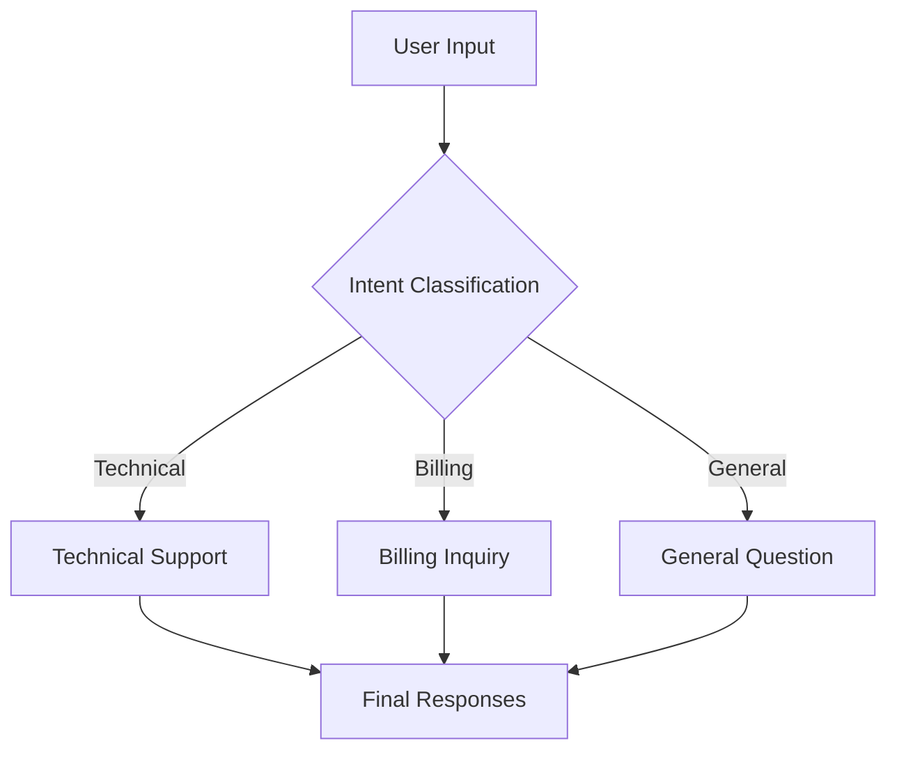
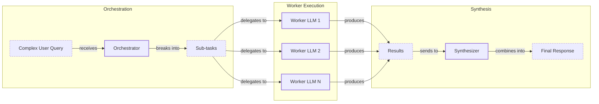

# Lesson 5: Basic Workflow Patterns

In our previous lessons, we built a foundation in AI Engineering. We explored the agent landscape, distinguished between rule-based workflows and autonomous agents, and covered context engineering. We also learned how to get reliable, structured outputs from an LLM. Now, we will build on that foundation by exploring the patterns that turn single LLM calls into robust, multi-step applications.

We will cover the essential building blocks for creating LLM workflows: chaining, parallelization, routing, and the orchestrator-worker pattern. You will learn why breaking down complex problems into smaller, manageable steps is more effective than relying on a single, monolithic prompt. This lesson will equip you with the mental models and practical code to start building more sophisticated AI systems.

## The Challenge with Complex Single LLM Calls

When you start building with LLMs, it’s tempting to cram all your instructions into one massive prompt. You ask the model to generate questions, find answers, and cite sources all in a single call. While this can work for simple demos, it quickly becomes unreliable in production.

Complex prompts are brittle. They are hard to debug when they fail, difficult to update, and more likely to suffer from issues like "lost-in-the-middle," where the model ignores information buried in a long context [[1]](https://dev.to/thousand_miles_ai/the-lost-in-the-middle-problem-why-llms-ignore-the-middle-of-your-context-window-3al2). This happens because of a phenomenon known as "context rot," where performance degrades as context length increases. The underlying reason is attention weight dilution: as the context grows, the attention a model can pay to any single piece of information diminishes, making it physically harder for it to focus on relevant details buried in the middle [[2]](https://www.morphllm.com/context-rot), [[3]](https://www.firecrawl.dev/blog/context-engineering). Trying to do too much at once increases the chances of inconsistent or incomplete results.

Let’s demonstrate this with an example. We’ll ask a Gemini model to generate a ten-question FAQ from several articles on renewable energy, complete with answers and source citations.

1.  First, we set up our environment. We will use `gemini-2.5-flash`, which is fast and cost-effective.
    ```python
    from lessons.utils import env
    import asyncio
    from enum import Enum
    import random
    import time
    from pydantic import BaseModel, Field
    from google import genai
    from google.genai import types
    from lessons.utils import pretty_print

    env.load(required_env_vars=["GOOGLE_API_KEY"])
    client = genai.Client()
    MODEL_ID = "gemini-2.5-flash"
    ```
2.  Next, we define our source content—three mock webpages about solar, wind, and energy storage.
    ```python
    webpage_1 = {
        "title": "The Benefits of Solar Energy",
        "content": "...",
    }
    webpage_2 = {
        "title": "Understanding Wind Turbines",
        "content": "...",
    }
    webpage_3 = {
        "title": "Energy Storage Solutions",
        "content": "...",
    }
    all_sources = [webpage_1, webpage_2, webpage_3]
    combined_content = "\n\n".join(
        [f"Source Title: {source['title']}\nContent: {source['content']}" for source in all_sources]
    )
    ```
3.  We create a complex prompt that asks the model to perform all three tasks—question generation, answering, and sourcing—in one go.
    ```python
    class FAQ(BaseModel):
        question: str = Field(description="The question to be answered")
        answer: str = Field(description="The answer to the question")
        sources: list[str] = Field(description="The sources used to answer the question")

    class FAQList(BaseModel):
        faqs: list[FAQ] = Field(description="A list of FAQs")

    n_questions = 10
    prompt_complex = f"""
    Based on the provided content from three webpages, generate a list of exactly {n_questions} frequently asked questions (FAQs).
    For each question, provide a concise answer derived ONLY from the text.
    After each answer, you MUST include a list of the 'Source Title's that were used to formulate that answer.

    <provided_content>
    {combined_content}
    </provided_content>
    """.strip()

    config = types.GenerateContentConfig(
        response_mime_type="application/json",
        response_schema=FAQList
    )
    response_complex = client.models.generate_content(
        model=MODEL_ID,
        contents=prompt_complex,
        config=config
    )
    result_complex = response_complex.parsed
    ```
    It outputs:
    ```json
    {
      "question": "Why is energy storage crucial for renewable energy sources like solar and wind?",
      "answer": "Effective energy storage is key to unlocking the full potential of renewable sources because it allows storing excess energy when plentiful and releasing it when needed, which is crucial for a stable power grid.",
      "sources": [
        "Energy Storage Solutions",
        "Understanding Wind Turbines"
      ]
    }
    ```
While the output seems reasonable, this approach is fragile. For instance, the model might miss that an answer is derived from multiple sources, or it might fail to generate the correct number of questions. As complexity grows, so does the rate of failure.

## The Power of Modularity: Why Chain LLM Calls?

A more robust solution is to break the problem down. This is the core idea behind prompt chaining: connecting multiple LLM calls in a sequence, where each step’s output feeds into the next [[4]](https://medium.com/@fabiolalli/a-practical-guide-to-prompt-engineering-techniques-and-their-use-cases-5f8574e2cd9a). This is analogous to the Saga pattern in distributed systems, which breaks a complex transaction into a sequence of smaller steps [[5]](https://www.linkedin.com/top-content/artificial-intelligence/understanding-ai-systems/deep-dive-into-llm-system-architecture/). This divide-and-conquer strategy makes your system more manageable and reliable.

Chaining offers several advantages [[6]](https://www.decodingai.com/p/stop-building-ai-agents-use-these), [[7]](https://datalearningscience.com/p/design-pattern-prompt-chaining-building):
*   **Modularity:** Each LLM call handles one specific sub-task, making the system easier to build and maintain.
*   **Accuracy:** Simple, focused prompts are less confusing for the model, leading to more accurate results.
*   **Debugging:** When something goes wrong, you can isolate the problem to a specific step in the chain.
*   **Flexibility:** You can swap out, update, or optimize individual components without rewriting the entire workflow. You could even use a cheaper model for simple steps and a more powerful one for complex generation.

However, this approach is not without trade-offs. Chaining increases latency because you are making multiple sequential API calls. It can also increase costs due to higher token usage across multiple prompts. Furthermore, there is a risk of information loss, where important context from an early step gets diluted or lost by the end of the chain [[8]](https://futureagi.substack.com/p/how-tool-chaining-fails-in-production), [[4]](https://medium.com/@fabiolalli/a-practical-guide-to-prompt-engineering-techniques-and-their-use-cases-5f8574e2cd9a).

## Building a Sequential Workflow: FAQ Generation Pipeline

Let's refactor our FAQ generation task into a three-step sequential workflow:
1.  Generate a list of questions.
2.  For each question, generate an answer.
3.  For each answer, identify the sources.

This modular approach gives us more control and produces more consistent results.

```mermaid
flowchart LR
  "Input Content" --> "Generate Questions"
  "Generate Questions" --> "Answer Questions"
  "Answer Questions" --> "Find Sources"
```
Image 1: A flowchart illustrating the sequential FAQ generation pipeline.

Here is how we implement this pipeline.

1.  First, we create a function dedicated to generating questions from the source content.
    ```python
    class QuestionList(BaseModel):
        questions: list[str] = Field(description="A list of questions")

    prompt_generate_questions = """
    Based on the content below, generate a list of {n_questions} relevant and distinct questions that a user might have.

    <provided_content>
    {combined_content}
    </provided_content>
    """.strip()

    def generate_questions(content: str, n_questions: int = 10) -> list[str]:
        config = types.GenerateContentConfig(
            response_mime_type="application/json",
            response_schema=QuestionList
        )
        response_questions = client.models.generate_content(
            model=MODEL_ID,
            contents=prompt_generate_questions.format(n_questions=n_questions, combined_content=content),
            config=config
        )
        return response_questions.parsed.questions
    ```
2.  Next, a function to answer a given question based on the same content.
    ```python
    prompt_answer_question = """
    Using ONLY the provided content below, answer the following question.
    The answer should be concise and directly address the question.

    <question>
    {question}
    </question>

    <provided_content>
    {combined_content}
    </provided_content>
    """.strip()

    def answer_question(question: str, content: str) -> str:
        answer_response = client.models.generate_content(
            model=MODEL_ID,
            contents=prompt_answer_question.format(question=question, combined_content=content),
        )
        return answer_response.text
    ```
3.  Then, a function to find the sources for a given question-and-answer pair.
    ```python
    class SourceList(BaseModel):
        sources: list[str] = Field(description="A list of source titles that were used to answer the question")

    prompt_find_sources = """
    You will be given a question and an answer that was generated from a set of documents.
    Your task is to identify which of the original documents were used to create the answer.

    <question>
    {question}
    </question>

    <answer>
    {answer}
    </answer>

    <provided_content>
    {combined_content}
    </provided_content>
    """.strip()

    def find_sources(question: str, answer: str, content: str) -> list[str]:
        config = types.GenerateContentConfig(
            response_mime_type="application/json",
            response_schema=SourceList
        )
        sources_response = client.models.generate_content(
            model=MODEL_ID,
            contents=prompt_find_sources.format(question=question, answer=answer, combined_content=content),
            config=config
        )
        return sources_response.parsed.sources
    ```
4.  Finally, we combine these functions into a single sequential workflow.
    ```python
    def sequential_workflow(content, n_questions=10) -> list[FAQ]:
        questions = generate_questions(content, n_questions)
        final_faqs = []
        for question in questions:
            answer = answer_question(question, content)
            sources = find_sources(question, answer, content)
            faq = FAQ(question=question, answer=answer, sources=sources)
            final_faqs.append(faq)
        return final_faqs

    start_time = time.monotonic()
    sequential_faqs = sequential_workflow(combined_content, n_questions=4)
    end_time = time.monotonic()
    print(f"Sequential processing completed in {end_time - start_time:.2f} seconds")
    ```
    It outputs:
    ```text
    Sequential processing completed in 22.20 seconds
    ```
This workflow is more predictable and easier to debug, but it is slow. Each question requires two separate LLM calls (one for the answer, one for the sources), and they run one after another.

## Optimizing Sequential Workflows With Parallel Processing

We can significantly speed up our workflow by running independent tasks in parallel. This approach is often called a Scatter-Gather pattern, where a central component distributes tasks to multiple workers and then collects their results [[5]](https://www.linkedin.com/top-content/artificial-intelligence/understanding-ai-systems/deep-dive-into-llm-system-architecture/). In our FAQ example, the processing for each question (answering and finding sources) is independent of the others. We can execute these tasks concurrently to reduce the total processing time.

We will use Python’s `asyncio` library to handle these parallel API calls. This allows us to start multiple requests without waiting for each one to finish, dramatically cutting down on idle time. This is particularly effective for LLM calls, which are I/O-bound. The program spends most of its time waiting for the API to respond, so a single process can manage many concurrent requests without being bottlenecked by its own computational power [[9]](https://online.stevens.edu/blog/building-self-healing-ai-orchestrator-reflexion-patterns/).

1.  First, we create asynchronous versions of our `answer_question` and `find_sources` functions.
    ```python
    async def answer_question_async(question: str, content: str) -> str:
        prompt = prompt_answer_question.format(question=question, combined_content=content)
        response = await client.aio.models.generate_content(
            model=MODEL_ID,
            contents=prompt
        )
        return response.text

    async def find_sources_async(question: str, answer: str, content: str) -> list[str]:
        prompt = prompt_find_sources.format(question=question, answer=answer, combined_content=content)
        config = types.GenerateContentConfig(
            response_mime_type="application/json",
            response_schema=SourceList
        )
        response = await client.aio.models.generate_content(
            model=MODEL_ID,
            contents=prompt,
            config=config
        )
        return response.parsed.sources
    ```
2.  Next, we define a function to process a single question in parallel. It generates the answer and then finds the sources.
    ```python
    async def process_question_parallel(question: str, content: str) -> FAQ:
        answer = await answer_question_async(question, content)
        sources = await find_sources_async(question, answer, content)
        return FAQ(
            question=question,
            answer=answer,
            sources=sources
        )
    ```
3.  Finally, we orchestrate the parallel execution for all questions.
    ```python
    async def parallel_workflow(content: str, n_questions: int = 10) -> list[FAQ]:
        questions = generate_questions(content, n_questions)
        tasks = [process_question_parallel(question, content) for question in questions]
        parallel_faqs = await asyncio.gather(*tasks)
        return parallel_faqs

    start_time = time.monotonic()
    parallel_faqs = await parallel_workflow(combined_content, n_questions=4)
    end_time = time.monotonic()
    print(f"Parallel processing completed in {end_time - start_time:.2f} seconds")
    ```
    It outputs:
    ```text
    Parallel processing completed in 8.98 seconds
    ```
As you can see, the parallel workflow is more than twice as fast. However, be mindful of API rate limits. Making too many concurrent requests can lead to errors [[10]](https://tianpan.co/blog/2026-03-11-llm-api-resilience-production). In production systems, you need to implement strategies like exponential backoff or use a request queue to manage your API calls effectively.

## Introducing Dynamic Behavior: Routing and Conditional Logic

Sequential and parallel workflows are powerful, but they follow a fixed path. What if your application needs to make decisions? This is where routing comes in. Routing uses conditional logic to direct an input to a specialized task or prompt based on its content.

This pattern continues the "divide-and-conquer" approach. Instead of a single, complex prompt that tries to handle every possible scenario, you create specialized prompts for different cases. An initial LLM call acts as a classifier, or a "router," to determine which specialized prompt to use next [[6]](https://www.decodingai.com/p/stop-building-ai-agents-use-these). In software architecture, this is the Dynamic Dispatch pattern, where a system selects an implementation at runtime [[5]](https://www.linkedin.com/top-content/artificial-intelligence/understanding-ai-systems/deep-dive-into-llm-system-architecture/). This keeps each component simple and optimized for a single responsibility, which improves overall system reliability.

## Building a Basic Routing Workflow

Let's build a simple routing system for a customer service chatbot. The goal is to classify an incoming user query into one of three categories—`Technical Support`, `Billing Inquiry`, or `General Question`—and then route it to a specialized handler.


Image 2: A flowchart illustrating a customer service routing workflow.

1.  First, we define a function to classify the user's intent. The LLM will return one of the predefined categories.
    ```python
    class IntentEnum(str, Enum):
        TECHNICAL_SUPPORT = "Technical Support"
        BILLING_INQUIRY = "Billing Inquiry"
        GENERAL_QUESTION = "General Question"

    class UserIntent(BaseModel):
        intent: IntentEnum = Field(description="The intent of the user's query")

    prompt_classification = """
    Classify the user's query into one of the following categories.

    <categories>
    {categories}
    </categories>

    <user_query>
    {user_query}
    </user_query>
    """.strip()

    def classify_intent(user_query: str) -> IntentEnum:
        prompt = prompt_classification.format(
            user_query=user_query,
            categories=[intent.value for intent in IntentEnum]
        )
        config = types.GenerateContentConfig(
            response_mime_type="application/json",
            response_schema=UserIntent
        )
        response = client.models.generate_content(
            model=MODEL_ID,
            contents=prompt,
            config=config
        )
        return response.parsed.intent
    ```
2.  Next, we define specialized prompts for each intent and a `handle_query` function that acts as our router.
    ```python
    prompt_technical_support = "..."
    prompt_billing_inquiry = "..."
    prompt_general_question = "..."

    def handle_query(user_query: str, intent: str) -> str:
        if intent == IntentEnum.TECHNICAL_SUPPORT:
            prompt = prompt_technical_support.format(user_query=user_query)
        elif intent == IntentEnum.BILLING_INQUIRY:
            prompt = prompt_billing_inquiry.format(user_query=user_query)
        else:
            prompt = prompt_general_question.format(user_query=user_query)
        
        response = client.models.generate_content(model=MODEL_ID, contents=prompt)
        return response.text
    ```
3.  Now, we can process a query. The system first classifies the intent and then routes it to the appropriate handler to generate a response.
    ```python
    query = "My internet connection is not working."
    intent = classify_intent(query)
    response = handle_query(query, intent)
    ```
    It outputs:
    ```text
    Hello there! I'm sorry to hear you're having trouble with your internet connection...
    To help me understand what's going on... could you please provide a few more details?
    ...
    ```
This routing pattern allows you to build more sophisticated, multi-path workflows that can adapt to different user inputs dynamically.

## Orchestrator-Worker Pattern: Dynamic Task Decomposition

The orchestrator-worker pattern takes dynamic behavior a step further. In this workflow, a central "orchestrator" LLM breaks down a complex task into smaller, unpredictable subtasks. It then delegates these subtasks to specialized "worker" LLMs, which can run in parallel, and finally, a "synthesizer" combines their results into a cohesive final response [[11]](https://agents.kour.me/orchestrator-worker/), [[12]](https://mlpills.substack.com/p/diy-17-orchestrator-worker-llm-agent). You can think of the orchestrator as a project manager that parses a high-level request, decomposes it, and delegates tasks to a team of specialized workers [[9]](https://online.stevens.edu/blog/building-self-healing-ai-orchestrator-reflexion-patterns/). This mirrors delegation principles from human organizations, where effective teams often have clear roles and limited size—similar to the "two-pizza team" concept [[13]](https://sebgnotes.substack.com/p/multi-agent-design-applying-human).

The key difference from simple parallelization is its flexibility. The subtasks are not predefined; the orchestrator determines them at runtime based on the specific input. This makes the pattern well-suited for complex queries where the necessary steps cannot be known in advance.


Image 3: A flowchart illustrating the Orchestrator-Worker pattern, showing the flow from a complex user query through task decomposition, parallel worker execution, and final synthesis.

However, this pattern adds complexity and is not for simple, predictable tasks due to the latency and cost of N+1 LLM calls. The orchestrator is also a single point of failure [[14]](https://gurusup.com/blog/agent-orchestration-patterns). Production systems require resiliency patterns like timeouts and retries to handle worker failures [[15]](https://gurusup.com/blog/multi-agent-orchestration-guide), [[16]](https://platform.claude.com/cookbook/patterns-agents-orchestrator-workers).

Let's implement this for a complex customer support query that involves a billing issue, a product return, and an order status update.

1.  The **Orchestrator** analyzes the user's query and breaks it down into a structured list of tasks.
    ```python
    def orchestrator(query: str) -> list[Task]:
        # ... (prompt defines possible query_types and parameters)
        prompt = prompt_orchestrator.format(query=query)
        # ... (LLM call with structured output schema)
        return response.parsed.tasks
    ```
2.  Specialized **Worker** functions handle each subtask. These functions often simulate calls to backend systems (e.g., fetching order status or generating a return authorization).
    ```python
    def handle_billing_worker(invoice_number: str, original_user_query: str) -> BillingTask:
        # ... (extracts concern, simulates opening an investigation)
        return task

    def handle_return_worker(product_name: str, reason_for_return: str) -> ReturnTask:
        # ... (simulates generating an RMA number)
        return task

    def handle_status_worker(order_id: str) -> StatusTask:
        # ... (simulates fetching order status)
        return task
    ```
3.  The **Synthesizer** takes the structured outputs from all workers and composes a single, user-friendly response.
    ```python
    def synthesizer(results: list[Task]) -> str:
        # ... (formats worker results into bullet points)
        prompt = prompt_synthesizer.format(formatted_results=formatted_results)
        # ... (LLM call to generate a cohesive message)
        return response.text
    ```
4.  The main pipeline function ties everything together.
    ```python
    def process_user_query(user_query):
        tasks_list = orchestrator(user_query)
        worker_results = []
        for task in tasks_list:
            if task.query_type == QueryTypeEnum.BILLING_INQUIRY:
                worker_results.append(handle_billing_worker(task.invoice_number, user_query))
            # ... (dispatch other workers)
        final_user_message = synthesizer(worker_results)
        pretty_print.wrapped(text=final_user_message, title="Final synthesized response")

    complex_customer_query = """
    Hi, I'm writing to you because I have a question about invoice #INV-7890. It seems higher than I expected.
    Also, I would like to return the 'SuperWidget 5000' I bought because it's not compatible with my system.
    Finally, can you give me an update on my order #A-12345?
    """
    process_user_query(complex_customer_query)
    ```
    It outputs:
    ```text
    Dear Customer,

    Thank you for reaching out. Here is a summary of the actions we've taken regarding your query:

    Regarding your BillingInquiry:
      - Invoice Number: INV-7890
      - Your Stated Concern: "The invoice seems higher than expected."
      - Our Action: An investigation (Case ID: INV_CASE_5682) has been opened regarding your concern.
      - Expected Resolution: We will get back to you within 2 business days.

    Regarding your ProductReturn:
      - Product: SuperWidget 5000
      - Reason for Return: "not compatible with my system"
      - Return Authorization (RMA): RMA-68480
      - Instructions: Please pack the 'SuperWidget 5000' securely in its original packaging if possible...

    Regarding your StatusUpdate:
      - Order ID: A-12345
      - Current Status: Shipped
      - Carrier: SuperFast Shipping
      - Tracking Number: SF691060
      - Delivery Estimate: Tomorrow

    We hope this information is helpful. Please let us know if you have any other questions.

    Best regards,
    The Support Team
    ```
This pattern provides a powerful and scalable way to handle complex, multi-part queries with a high degree of reliability and structure.

## Conclusion

In this lesson, we have explored the fundamental workflow patterns that form the backbone of modern LLM applications. We moved from the limitations of single, complex prompts to the power of modularity. You learned how to build sequential chains, optimize them with parallel processing, introduce dynamic logic with routing, and handle unpredictable tasks with the orchestrator-worker pattern.

These patterns are not just theoretical concepts; they are the practical building blocks you will use to create reliable, scalable, and maintainable AI systems. They represent the first major step beyond simple prompting and into the world of true AI engineering. In our upcoming lessons, we will continue to build on this foundation as we give our systems the ability to take action with tools, implement reasoning loops, and manage memory.

## References

- [1] The "Lost in the Middle" Problem — Why LLMs Ignore the Middle of Your Context Window. (2026). *DEV Community*. https://dev.to/thousand_miles_ai/the-lost-in-the-middle-problem-why-llms-ignore-the-middle-of-your-context-window-3al2
- [2] Context Rot is the Bottleneck. FlashCompact is the Solution. (n.d.). *Morph*. https://www.morphllm.com/context-rot
- [3] Context Engineering: The Art and Science of Crafting the Perfect Prompts. (n.d.). *Firecrawl*. https://www.firecrawl.dev/blog/context-engineering
- [4] A Practical Guide to Prompt Engineering Techniques and Their Use Cases. (n.d.). *Medium*. https://medium.com/@fabiolalli/a-practical-guide-to-prompt-engineering-techniques-and-their-use-cases-5f8574e2cd9a
- [5] Deep Dive into LLM System Architecture. (n.d.). *LinkedIn*. https://www.linkedin.com/top-content/artificial-intelligence/understanding-ai-systems/deep-dive-into-llm-system-architecture/
- [6] Stop Building AI Agents. Use These 5 Design Patterns Instead. (n.d.). *Decoding AI*. https://www.decodingai.com/p/stop-building-ai-agents-use-these
- [7] Design Pattern: Prompt Chaining. (n.d.). *Data Learning Science*. https://datalearningscience.com/p/design-pattern-prompt-chaining-building
- [8] How Tool Chaining Fails in Production LLM Agents and How to Fix It. (n.d.). *FutureAGI*. https://futureagi.substack.com/p/how-tool-chaining-fails-in-production
- [9] Building Self-Healing AI with Orchestrator-Reflexion Patterns. (n.d.). *Stevens Institute of Technology*. https://online.stevens.edu/blog/building-self-healing-ai-orchestrator-reflexion-patterns/
- [10] Tian, P. (2026, March 11). How to Build a Resilient LLM API Client in Production. *Tian Pan*. https://tianpan.co/blog/2026-03-11-llm-api-resilience-production
- [11] Pattern: Orchestrator-Worker (Coordinator). (n.d.). *Intelligence Patterns*. https://agents.kour.me/orchestrator-worker/
- [12] DIY #17: Orchestrator-Worker LLM Agent. (n.d.). *ML Pills*. https://mlpills.substack.com/p/diy-17-orchestrator-worker-llm-agent
- [13] Multi-Agent Design: Applying Human Organizational Structures to LLM-Powered Agent Teams. (n.d.). *Seb G's Notes*. https://sebgnotes.substack.com/p/multi-agent-design-applying-human
- [14] Agent Orchestration Patterns. (n.d.). *Gurus*. https://gurusup.com/blog/agent-orchestration-patterns
- [15] Multi-Agent Orchestration: A Guide for Production Teams. (n.d.). *Gurus*. https://gurusup.com/blog/multi-agent-orchestration-guide
- [16] Orchestrator-workers pattern. (n.d.). *Claude Cookbook*. https://platform.claude.com/cookbook/patterns-agents-orchestrator-workers