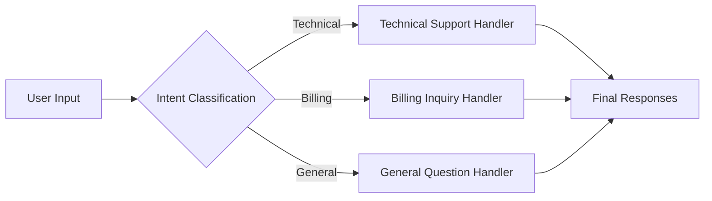
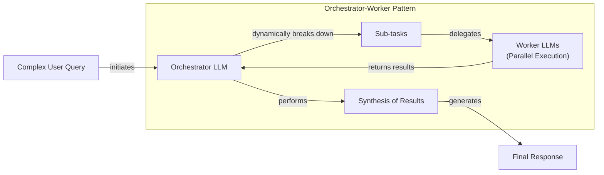

# Stop Building Complex Prompts, Use LLM Workflows Instead

In our previous lessons, we covered the landscape of AI engineering, the difference between workflows and agents, the art of context engineering, and how to get reliable structured outputs. Now, we will tackle the fundamental patterns for building multi-step LLM applications. This is where we move from single, isolated LLM calls to creating robust, modular systems.

Many engineers start by building a single, complex prompt that tries to do everything at once. We have been there. This approach feels intuitive, but it almost always leads to unreliable, hard-to-debug systems. You will constantly battle a reliability crisis.

This lesson will show you a better way. We will explore the core building blocks of LLM workflows: chaining, parallelization, routing, and the orchestrator-worker pattern. You will learn why breaking down complex tasks is more effective than relying on a single, monolithic prompt and how to implement these patterns from scratch using Google Gemini.

## The Challenge with Complex Single LLM Calls

A common mistake when starting with LLM applications is to cram all instructions into one large prompt. The thinking is, "The model is smart, it should figure it out." While this can work for simple demos, it quickly breaks down in production.

Trying to make an LLM perform multiple distinct steps in a single call introduces several problems:
- **Difficult Debugging:** When the output is wrong, it is hard to know which part of the instruction the model failed to follow.
- **Poor Modularity:** You cannot update or improve one part of the logic without rewriting the entire prompt, which might break other parts.
- **Contextual Blind Spots:** LLMs struggle to pay equal attention to all parts of a long prompt. This is known as the "lost-in-the-middle" problem, where information in the middle of the context is often ignored [[1]](https://dev.to/thousand_miles_ai/the-lost-in-the-middle-problem-why-llms-ignore-the-middle-of-your-context-window-3al2).
- **Higher Token Cost:** Complex prompts can be less token-efficient than a series of smaller, focused ones.
- **General Unreliability:** As prompt complexity increases, the model's ability to follow every instruction accurately decreases [[2]](https://arxiv.org/html/2505.13360v1).

Let's look at a practical example. We will start with our setup, which should be familiar from previous lessons.

1. First, we set up our environment and initialize the Gemini client. We will use `gemini-2.5-flash`, a fast and cost-effective model suitable for these tasks.
    ```python
    from lessons.utils import env
    from google import genai
    
    env.load(required_env_vars=["GOOGLE_API_KEY"])
    
    client = genai.Client()
    MODEL_ID = "gemini-2.5-flash"
    ```
2. Next, we define some mock webpage content about renewable energy that will serve as our knowledge base.
    ```python
    webpage_1 = {
        "title": "The Benefits of Solar Energy",
        "content": "Solar energy is a renewable powerhouse...",
    }
    
    webpage_2 = {
        "title": "Understanding Wind Turbines",
        "content": "Wind turbines are towering structures that capture kinetic energy...",
    }
    
    webpage_3 = {
        "title": "Energy Storage Solutions",
        "content": "Effective energy storage is the key to unlocking the full potential...",
    }
    
    all_sources = [webpage_1, webpage_2, webpage_3]
    combined_content = "\n\n".join(
        [f"Source Title: {source['title']}\nContent: {source['content']}" for source in all_sources]
    )
    ```
3. Now, we create a single, complex prompt that asks the LLM to generate questions, find answers, and cite sources all at once.
    ```python
    from google.genai import types
    from pydantic import BaseModel, Field
    
    class FAQ(BaseModel):
        question: str
        answer: str
        sources: list[str]
    
    class FAQList(BaseModel):
        faqs: list[FAQ]
    
    n_questions = 10
    prompt_complex = f"""
    Based on the provided content from three webpages, generate a list of exactly {n_questions} frequently asked questions (FAQs).
    For each question, provide a concise answer derived ONLY from the text.
    After each answer, you MUST include a list of the 'Source Title's that were used to formulate that answer.
    
    <provided_content>
    {combined_content}
    </provided_content>
    """.strip()
    
    config = types.GenerateContentConfig(
        response_mime_type="application/json",
        response_schema=FAQList
    )
    response_complex = client.models.generate_content(
        model=MODEL_ID,
        contents=prompt_complex,
        config=config
    )
    result_complex = response_complex.parsed
    ```
    It outputs:
    ```json
    {
      "question": "What is solar energy and how does it work?",
      "answer": "Solar energy is a renewable powerhouse that converts sunlight into electricity through photovoltaic (PV) panels.",
      "sources": [
        "The Benefits of Solar Energy"
      ]
    }
    ```
While this output seems reasonable, this monolithic approach is fragile. For instance, the model might fail to cite all relevant sources for an answer drawn from multiple documents. As instructions become more complex, the chance of such inaccuracies increases. A better approach is to break the problem down.

## The Power of Modularity: Why Chain LLM Calls?

Prompt chaining connects multiple LLM calls sequentially, like an assembly line where each station performs one task perfectly [[10]](https://datalearningscience.com/p/design-pattern-prompt-chaining-building). This "divide and conquer" strategy is simple but powerful: instead of asking one genius to read a library, you ask ten interns to each read one book [[11]](https://www.together.ai/blog/plan-divide-conquer). It brings the principles of modular software design to AI engineering [[3]](https://medium.com/@fabiolalli/a-practical-guide-to-prompt-engineering-techniques-and-their-use-cases-5f8574e2cd9a).

This approach offers several advantages over a single, complex prompt:
- **Improved Modularity:** Each LLM call is a self-contained unit focused on a specific sub-task, making the system easier to understand and maintain [[4]](https://www.decodingai.com/p/stop-building-ai-agents-use-these).
- **Enhanced Accuracy:** Simpler, targeted prompts reduce the cognitive load on the model, leading to more reliable outputs for each step [[4]](https://www.decodingai.com/p/stop-building-ai-agents-use-these).
- **Easier Debugging:** If a step fails, you can isolate the problematic prompt and fix it. This makes the system's behavior more predictable and easier to test [[4]](https://www.decodingai.com/p/stop-building-ai-agents-use-these), [[6]](https://mlpills.substack.com/p/issue-110-llm-workflow-patterns).
- **Increased Flexibility:** You can swap, update, or optimize individual components independently. For example, you could use a fast, cheap model for a simple classification step and a more powerful model for a complex generation step [[4]](https://www.decodingai.com/p/stop-building-ai-agents-use-these).

However, chaining is not without trade-offs. It increases latency because you are making multiple network calls. It can also increase costs and there is a risk of information being lost or distorted as it passes through the chain [[5]](https://futureagi.substack.com/p/how-tool-chaining-fails-in-production), [[3]](https://medium.com/@fabiolalli/a-practical-guide-to-prompt-engineering-techniques-and-their-use-cases-5f8574e2cd9a). Despite these downsides, the gains in reliability and maintainability often make it the right choice for production systems.

## Building a Sequential Workflow: FAQ Generation Pipeline

Let's refactor our FAQ generation task into a three-step sequential workflow:
1.  Generate Questions
2.  Answer Each Question
3.  Find Sources for Each Answer

This modular approach gives us more control and makes the process more robust.

Image 1: A Mermaid diagram illustrating the sequential FAQ generation pipeline.
```mermaid
flowchart LR
  "Input Content" --> "Generate Questions"
  "Generate Questions" --> "Answer Questions"
  "Answer Questions" --> "Find Sources"
```

1. First, we create a dedicated function to generate a list of questions from our content. This function's only job is to ask good questions.
    ```python
    class QuestionList(BaseModel):
        questions: list[str]
    
    prompt_generate_questions = """
    Based on the content below, generate a list of {n_questions} relevant and distinct questions that a user might have.
    
    <provided_content>
    {combined_content}
    </provided_content>
    """.strip()
    
    def generate_questions(content: str, n_questions: int = 10) -> list[str]:
        config = types.GenerateContentConfig(
            response_mime_type="application/json",
            response_schema=QuestionList
        )
        response_questions = client.models.generate_content(
            model=MODEL_ID,
            contents=prompt_generate_questions.format(n_questions=n_questions, combined_content=content),
            config=config
        )
        return response_questions.parsed.questions
    ```
2. Next, a function to answer a single question, constrained to use only the provided text.
    ```python
    prompt_answer_question = """
    Using ONLY the provided content below, answer the following question.
    The answer should be concise and directly address the question.
    
    <question>
    {question}
    </question>
    
    <provided_content>
    {combined_content}
    </provided_content>
    """.strip()
    
    def answer_question(question: str, content: str) -> str:
        answer_response = client.models.generate_content(
            model=MODEL_ID,
            contents=prompt_answer_question.format(question=question, combined_content=content),
        )
        return answer_response.text
    ```
3. Finally, a function to identify the source titles for a given question-and-answer pair.
    ```python
    class SourceList(BaseModel):
        sources: list[str]
    
    prompt_find_sources = """
    You will be given a question and an answer that was generated from a set of documents.
    Your task is to identify which of the original documents were used to create the answer.
    
    <question>
    {question}
    </question>
    
    <answer>
    {answer}
    </answer>
    
    <provided_content>
    {combined_content}
    </provided_content>
    """.strip()
    
    def find_sources(question: str, answer: str, content: str) -> list[str]:
        config = types.GenerateContentConfig(
            response_mime_type="application/json",
            response_schema=SourceList
        )
        sources_response = client.models.generate_content(
            model=MODEL_ID,
            contents=prompt_find_sources.format(question=question, answer=answer, combined_content=content),
            config=config
        )
        return sources_response.parsed.sources
    ```
4. We combine these functions into a sequential workflow.
    ```python
    import time
    
    def sequential_workflow(content, n_questions=10) -> list[FAQ]:
        questions = generate_questions(content, n_questions)
        final_faqs = []
        for question in questions:
            answer = answer_question(question, content)
            sources = find_sources(question, answer, content)
            faq = FAQ(question=question, answer=answer, sources=sources)
            final_faqs.append(faq)
        return final_faqs
    
    start_time = time.monotonic()
    sequential_faqs = sequential_workflow(combined_content, n_questions=4)
    end_time = time.monotonic()
    print(f"Sequential processing completed in {end_time - start_time:.2f} seconds")
    ```
    It outputs:
    ```text
    Sequential processing completed in 22.20 seconds
    ```
This chained workflow is more predictable and easier to debug, but it is slow. Each step runs one after the other, making the total execution time the sum of all individual calls.

## Optimizing Sequential Workflows With Parallel Processing

For tasks where sub-steps are independent, we can use parallelization to reduce latency. Think of it like cooking a large meal: instead of preparing the chicken, then the potatoes, then the salad one by one, you work on them all at the same time so they finish together [[12]](https://mlpills.substack.com/p/diy-17-parallelisation-with-langchain). In our FAQ example, answering each question is an independent task. We can process all of them concurrently.

1. We will use Python’s `asyncio` library to run our LLM calls in parallel. First, we need asynchronous versions of our `answer_question` and `find_sources` functions.
    ```python
    import asyncio
    
    async def answer_question_async(question: str, content: str) -> str:
        prompt = prompt_answer_question.format(question=question, combined_content=content)
        response = await client.aio.models.generate_content(
            model=MODEL_ID,
            contents=prompt
        )
        return response.text
    
    async def find_sources_async(question: str, answer: str, content: str) -> list[str]:
        prompt = prompt_find_sources.format(question=question, answer=answer, combined_content=content)
        config = types.GenerateContentConfig(
            response_mime_type="application/json",
            response_schema=SourceList
        )
        response = await client.aio.models.generate_content(
            model=MODEL_ID,
            contents=prompt,
            config=config
        )
        return response.parsed.sources
    
    async def process_question_parallel(question: str, content: str) -> FAQ:
        answer = await answer_question_async(question, content)
        sources = await find_sources_async(question, answer, content)
        return FAQ(question=question, answer=answer, sources=sources)
    ```
2. Now, we create a parallel workflow that generates the initial questions and then processes each one concurrently using `asyncio.gather`.
    ```python
    async def parallel_workflow(content: str, n_questions: int = 10) -> list[FAQ]:
        questions = generate_questions(content, n_questions)
        tasks = [process_question_parallel(question, content) for question in questions]
        parallel_faqs = await asyncio.gather(*tasks)
        return parallel_faqs
    
    start_time = time.monotonic()
    parallel_faqs = await parallel_workflow(combined_content, n_questions=4)
    end_time = time.monotonic()
    print(f"Parallel processing completed in {end_time - start_time:.2f} seconds")
    ```
    It outputs:
    ```text
    Parallel processing completed in 8.98 seconds
    ```
By running the tasks in parallel, we cut the processing time by more than half. From an engineering perspective, this offers massive benefits: it is often cheaper, as you can use smaller models as workers, and faster, since you avoid the high latency of a single large call [[11]](https://www.together.ai/blog/plan-divide-conquer). While sequential processing is easier to debug, parallelization offers a significant speed advantage for independent tasks [[6]](https://mlpills.substack.com/p/issue-110-llm-workflow-patterns).

<aside>
💡
When running many parallel calls, be mindful of API rate limits and concurrency issues. Beyond rate limits, which can be handled with exponential backoff [[7]](https://tianpan.co/blog/2026-03-11-llm-api-resilience-production), you must also manage potential race conditions or timeouts and handle non-deterministic outputs where the same input might yield different results [[4]](https://www.decodingai.com/p/stop-building-ai-agents-use-these), [[13]](https://galileo.ai/blog/debug-multi-agent-ai-systems). Production systems often use async semaphores or thread pools to manage these complexities gracefully.
</aside>

## Introducing Dynamic Behavior: Routing and Conditional Logic

So far, our workflows have been fixed. A sequential chain always executes the same steps, and a parallel workflow processes a known set of tasks. But many real-world applications require dynamic behavior. This is where routing comes in.

Routing uses conditional logic to direct an input down different paths, applying the "divide and conquer" principle. Instead of one massive prompt for all possibilities, we create specialized prompts and use a classifier to choose the right one [[4]](https://www.decodingai.com/p/stop-building-ai-agents-use-these). This approach borrows from Business Process Management (BPM) patterns like cascading routing, where a query is first sent to a cheap model and only escalated if needed [[14]](https://www.getmaxim.ai/articles/top-5-llm-routing-techniques/). An LLM itself can act as a highly effective classifier.

## Building a Basic Routing Workflow

Let's build a simple routing system for a customer service chatbot. The goal is to classify a user's intent and route their query to a specialized handler.

Image 2: A Mermaid diagram illustrating a routing workflow for customer service.


1. First, we define the possible intents and create a classifier function that uses the LLM to categorize a user's query. We use Pydantic to ensure the model's output conforms to our expected `UserIntent` schema.
    ```python
    from enum import Enum
    
    class IntentEnum(str, Enum):
        TECHNICAL_SUPPORT = "Technical Support"
        BILLING_INQUIRY = "Billing Inquiry"
        GENERAL_QUESTION = "General Question"
    
    class UserIntent(BaseModel):
        intent: IntentEnum
    
    prompt_classification = """
    Classify the user's query into one of the following categories.
    
    <categories>
    {categories}
    </categories>
    
    <user_query>
    {user_query}
    </user_query>
    """.strip()
    
    def classify_intent(user_query: str) -> IntentEnum:
        prompt = prompt_classification.format(
            user_query=user_query,
            categories=[intent.value for intent in IntentEnum]
        )
        config = types.GenerateContentConfig(
            response_mime_type="application/json",
            response_schema=UserIntent
        )
        response = client.models.generate_content(
            model=MODEL_ID, contents=prompt, config=config
        )
        return response.parsed.intent
    ```
2. Next, we define specialized prompts for each intent and a `handle_query` function that acts as our router.
    ```python
    prompt_technical_support = "..."
    prompt_billing_inquiry = "..."
    prompt_general_question = "..."
    
    def handle_query(user_query: str, intent: str) -> str:
        if intent == IntentEnum.TECHNICAL_SUPPORT:
            prompt = prompt_technical_support.format(user_query=user_query)
        elif intent == IntentEnum.BILLING_INQUIRY:
            prompt = prompt_billing_inquiry.format(user_query=user_query)
        else:
            prompt = prompt_general_question.format(user_query=user_query)
        
        response = client.models.generate_content(model=MODEL_ID, contents=prompt)
        return response.text
    ```
3. Now we can test the full routing workflow.
    ```python
    query = "My internet connection is not working."
    intent = classify_intent(query)
    response = handle_query(query, intent)
    ```
    It outputs:
    ```text
    Hello there! I'm sorry to hear you're having trouble with your internet connection...
    To help me understand what's going on... could you please provide a few more details?
    ```
This routing pattern allows us to build a more robust and maintainable system. Each handler can be developed and tested in isolation, and we can easily add new routes as our application grows.

## Orchestrator-Worker Pattern: Dynamic Task Decomposition

The orchestrator-worker pattern, a concept with roots in distributed computing's master-worker model, takes dynamic task handling a step further [[15]](https://www.confluent.io/blog/event-driven-multi-agent-systems/). Here, a central "orchestrator" LLM analyzes a complex query and dynamically breaks it down into a series of sub-tasks—a process also known as dynamic query decomposition [[16]](https://www.emergentmind.com/topics/dynamic-query-decomposition). These sub-tasks are then delegated to specialized "worker" components. Finally, a "synthesizer" combines the results into a cohesive response [[8]](https://agents.kour.me/orchestrator-worker/), [[9]](https://platform.claude.com/cookbook/patterns-agents-orchestrator-workers).

This pattern is one of the most widely deployed in production AI systems, especially for tasks like customer support automation [[17]](https://gurusup.com/blog/agent-orchestration-patterns). Its key advantage is flexibility; the orchestrator determines the plan at runtime based on the input [[9]](https://platform.claude.com/cookbook/patterns-agents-orchestrator-workers). However, it is not a silver bullet. You should avoid this pattern when latency must be minimal or when potential information loss between the orchestrator and workers is unacceptable [[18]](https://zencoder.ai/blog/multi-agent-orchestration-patterns).

Image 3: Flowchart of the orchestrator-worker pattern

Let's implement a simplified version for our customer service bot.

1. The orchestrator analyzes a complex query and decomposes it into a list of structured tasks.
    ```python
    class QueryTypeEnum(str, Enum):
        BILLING_INQUIRY = "BillingInquiry"
        PRODUCT_RETURN = "ProductReturn"
        STATUS_UPDATE = "StatusUpdate"
    
    class Task(BaseModel):
        query_type: QueryTypeEnum
        invoice_number: str | None = None
        product_name: str | None = None
        reason_for_return: str | None = None
        order_id: str | None = None
    
    class TaskList(BaseModel):
        tasks: list[Task]
    
    def orchestrator(query: str) -> list[Task]:
        # ... prompt that asks the LLM to break down the query into tasks ...
        response = client.models.generate_content(...)
        return response.parsed.tasks
    ```
2. We define simple worker functions that simulate handling each task type (e.g., creating a billing investigation, generating a return authorization, fetching an order status). These workers would typically interact with external APIs or databases.
    ```python
    def handle_billing_worker(invoice_number: str, original_user_query: str) -> BillingTask:
        # ... simulates opening an investigation and returns structured data ...
        return task
    
    def handle_return_worker(product_name: str, reason_for_return: str) -> ReturnTask:
        # ... simulates generating an RMA and returns structured data ...
        return task
    
    def handle_status_worker(order_id: str) -> StatusTask:
        # ... simulates fetching order status and returns structured data ...
        return task
    ```
3. A synthesizer LLM call takes the structured outputs from all workers and composes a single, user-friendly response.
    ```python
    def synthesizer(results: list[Task]) -> str:
        # ... prompt that combines worker results into a cohesive email ...
        response = client.models.generate_content(...)
        return response.text
    ```
4. Finally, we tie it all together in a main pipeline.
    ```python
    def process_user_query(user_query):
        # 1. Run orchestrator to get tasks
        tasks_list = orchestrator(user_query)
    
        # 2. Run workers based on tasks
        worker_results = []
        for task in tasks_list:
            if task.query_type == QueryTypeEnum.BILLING_INQUIRY:
                worker_results.append(handle_billing_worker(...))
            # ... other workers
    
        # 3. Run synthesizer to generate final response
        final_user_message = synthesizer(worker_results)
        print(final_user_message)
    
    complex_customer_query = """
    Hi, I have a question about invoice #INV-7890. It seems higher than I expected.
    Also, I would like to return the 'SuperWidget 5000' because it's not compatible with my system.
    Finally, can you give me an update on my order #A-12345?
    """
    process_user_query(complex_customer_query)
    ```
    It outputs:
    ```text
    Dear Customer,
    
    Thank you for reaching out. Here is a summary of the actions we've taken regarding your query:
    
    Regarding your BillingInquiry:
      - Invoice Number: INV-7890
      - Your Stated Concern: "The invoice seems higher than expected."
      - Our Action: An investigation (Case ID: INV_CASE_5678) has been opened regarding your concern.
      - Expected Resolution: We will get back to you within 2 business days.
    
    Regarding your ProductReturn:
      - Product: SuperWidget 5000
      - Reason for Return: "It's not compatible with my system."
      - Return Authorization (RMA): RMA-12345
      - Instructions: Please pack the 'SuperWidget 5000' securely...
    
    Regarding your StatusUpdate:
      - Order ID: A-12345
      - Current Status: Shipped
      - Carrier: SuperFast Shipping
      - Tracking Number: SF987654
      - Delivery Estimate: Tomorrow
    
    If you have any further questions, please let us know.
    
    Best regards,
    Support Team
    ```
This pattern provides a powerful and scalable way to handle complex, unpredictable user requests by combining dynamic planning with specialized execution.

## Conclusion

We have explored the four fundamental patterns for building LLM workflows: chaining, parallelization, routing, and the orchestrator-worker model. These are not just theoretical concepts; they are the practical building blocks for creating reliable, modular, and scalable AI applications. By moving away from monolithic prompts and embracing these structured patterns, you gain more control, improve accuracy, and make your systems far easier to debug and maintain.

These workflows are the foundation upon which more complex agentic systems are built. In our upcoming lessons, we will see how these patterns enable agents to use tools (Lesson 6), perform complex reasoning (Lesson 7), and manage memory (Lesson 9). Mastering these basic ingredients is the first real step on your journey from a Python developer to a proficient AI Engineer.

## References

- [1] The "Lost in the Middle" Problem — Why LLMs Ignore the Middle of Your Context Window. (2026). *dev.to*. [https://dev.to/thousand_miles_ai/the-lost-in-the-middle-problem-why-llms-ignore-the-middle-of-your-context-window-3al2](https://dev.to/thousand_miles_ai/the-lost-in-the-middle-problem-why-llms-ignore-the-middle-of-your-context-window-3al2)
- [2] Underspecification in Instruction-Following. (2025). *arXiv*. [https://arxiv.org/html/2505.13360v1](https://arxiv.org/html/2505.13360v1)
- [3] A Practical Guide to Prompt Engineering Techniques. (2024). *Medium*. [https://medium.com/@fabiolalli/a-practical-guide-to-prompt-engineering-techniques-and-their-use-cases-5f8574e2cd9a](https://medium.com/@fabiolalli/a-practical-guide-to-prompt-engineering-techniques-and-their-use-cases-5f8574e2cd9a)
- [4] Stop Building AI Agents. Use These 5 LLM Workflows Instead. (2025). *Decoding AI*. [https://www.decodingai.com/p/stop-building-ai-agents-use-these](https://www.decodingai.com/p/stop-building-ai-agents-use-these)
- [5] How Tool Chaining Fails in Production LLM Agents. (2026). *FutureAGI*. [https://futureagi.substack.com/p/how-tool-chaining-fails-in-production](https://futureagi.substack.com/p/how-tool-chaining-fails-in-production)
- [6] LLM Workflow Patterns. (2025). *ML Pills*. [https://mlpills.substack.com/p/issue-110-llm-workflow-patterns](https://mlpills.substack.com/p/issue-110-llm-workflow-patterns)
- [7] Tian Pan. (2026). LLM API Resilience in Production. [https://tianpan.co/blog/2026-03-11-llm-api-resilience-production](https://tianpan.co/blog/2026-03-11-llm-api-resilience-production)
- [8] Pattern: Orchestrator-Worker (Coordinator). (2025). *Intelligence Patterns*. [https://agents.kour.me/orchestrator-worker/](https://agents.kour.me/orchestrator-worker/)
- [9] Orchestrator-Workers. (2025). *Claude Cookbook*. [https://platform.claude.com/cookbook/patterns-agents-orchestrator-workers](https://platform.claude.com/cookbook/patterns-agents-orchestrator-workers)
- [10] Design Pattern: Prompt Chaining. (2025). *Data Learning Science*. [https://datalearningscience.com/p/design-pattern-prompt-chaining-building](https://datalearningscience.com/p/design-pattern-prompt-chaining-building)
- [11] When Does Divide and Conquer Work for Long Context LLM?. (2026). *Together AI*. [https://www.together.ai/blog/plan-divide-conquer](https://www.together.ai/blog/plan-divide-conquer)
- [12] DIY #17 Parallelisation with LangChain. (2025). *ML Pills*. [https://mlpills.substack.com/p/diy-17-parallelisation-with-langchain](https://mlpills.substack.com/p/diy-17-parallelisation-with-langchain)
- [13] How to Debug Multi-Agent AI Systems. (2025). *Galileo*. [https://galileo.ai/blog/debug-multi-agent-ai-systems](https://galileo.ai/blog/debug-multi-agent-ai-systems)
- [14] Top 5 LLM Routing Techniques To Know. (2025). *Maxim*. [https://www.getmaxim.ai/articles/top-5-llm-routing-techniques/](https://www.getmaxim.ai/articles/top-5-llm-routing-techniques/)
- [15] Event-Driven Multi-Agent Systems. (2025). *Confluent*. [https://www.confluent.io/blog/event-driven-multi-agent-systems/](https://www.confluent.io/blog/event-driven-multi-agent-systems/)
- [16] Dynamic Query Decomposition. (2025). *Emergent Mind*. [https://www.emergentmind.com/topics/dynamic-query-decomposition](https://www.emergentmind.com/topics/dynamic-query-decomposition)
- [17] Agent Orchestration Patterns. (2025). *GuruSup*. [https://gurusup.com/blog/agent-orchestration-patterns](https://gurusup.com/blog/agent-orchestration-patterns)
- [18] Multi-Agent Orchestration Patterns. (2025). *Zencoder*. [https://zencoder.ai/blog/multi-agent-orchestration-patterns](https://zencoder.ai/blog/multi-agent-orchestration-patterns)