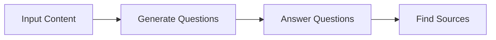
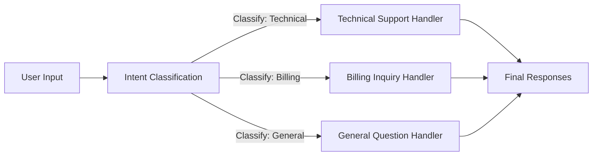
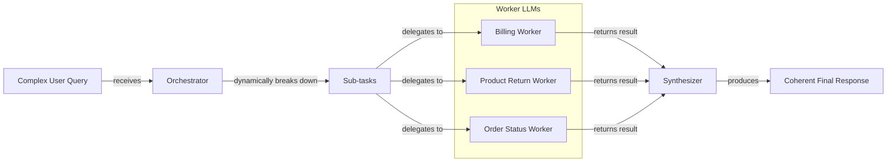

# Lesson 5: Basic Workflow Patterns

In our previous lessons, we laid the groundwork for AI Engineering. We explored the agent landscape, differentiated between rule-based LLM workflows and autonomous AI agents, managed information flow with context engineering, and ensured reliable data extraction with structured outputs. Now, we will tackle the fundamental components for building these systems: basic workflow patterns.

This lesson explores how to construct sophisticated and reliable LLM applications by moving beyond single, complex prompts. We will cover chaining multiple LLM calls, parallelizing them for speed, implementing routing with conditional logic, and using the orchestrator-worker pattern for dynamic tasks. These techniques are the building blocks for almost any production-grade AI system.

## The Challenge with Complex Single LLM Calls

Attempting to solve a complex, multi-step problem with a single, large LLM call is a common mistake. While it might seem efficient, this approach often leads to unreliable and hard-to-maintain systems. A single "mega-prompt" can struggle with several issues, including difficulty in pinpointing errors, a lack of modularity, and an increased likelihood of the "lost-in-the-middle" problem where the model ignores information in long contexts [[8]].

Let's demonstrate this with an example. Our goal is to generate a Frequently Asked Questions (FAQ) page from several documents about renewable energy.

1. First, we set up our environment by initializing the Google Gemini client. We will use `gemini-2.5-flash`, which is fast and cost-effective for these examples.
    ```python
    import asyncio
    from enum import Enum
    import random
    import time
    
    from pydantic import BaseModel, Field
    from google import genai
    from google.genai import types
    
    from lessons.utils import env
    
    env.load(required_env_vars=["GOOGLE_API_KEY"])
    
    client = genai.Client()
    
    MODEL_ID = "gemini-2.5-flash"
    ```
    We will also use mock data representing three webpages on renewable energy.

2. Now, we create a complex prompt that asks the model to generate questions, find answers, and cite sources all in one go.
    ```python
    # This prompt tries to do everything at once: generate questions, find answers,
    # and cite sources. This complexity can often confuse the model.
    n_questions = 10
    prompt_complex = f"""
    Based on the provided content from three webpages, generate a list of exactly {n_questions} frequently asked questions (FAQs).
    For each question, provide a concise answer derived ONLY from the text.
    After each answer, you MUST include a list of the 'Source Title's that were used to formulate that answer.
    
    <provided_content>
    {combined_content}
    </provided_content>
    """.strip()
    
    # Pydantic classes for structured outputs
    class FAQ(BaseModel):
        """A FAQ is a question and answer pair, with a list of sources used to answer the question."""
        question: str = Field(description="The question to be answered")
        answer: str = Field(description="The answer to the question")
        sources: list[str] = Field(description="The sources used to answer the question")
    
    class FAQList(BaseModel):
        """A list of FAQs"""
        faqs: list[FAQ] = Field(description="A list of FAQs")
    
    # Generate FAQs
    config = types.GenerateContentConfig(
        response_mime_type="application/json",
        response_schema=FAQList
    )
    response_complex = client.models.generate_content(
        model=MODEL_ID,
        contents=prompt_complex,
        config=config
    )
    result_complex = response_complex.parsed
    ```
    It outputs:
    ```json
    {
      "question": "Why is energy storage crucial for renewable energy sources like solar and wind?",
      "answer": "Effective energy storage is key to unlocking the full potential of renewable sources because it allows storing excess energy when plentiful and releasing it when needed, which is crucial for a stable power grid.",
      "sources": [
        "Energy Storage Solutions",
        "Understanding Wind Turbines"
      ]
    }
    ```
While this output seems reasonable, the more complex the instructions, the higher the chance of inaccuracies. For instance, the model might miss that an answer is derived from multiple sources, citing only one. This lack of reliability makes single-prompt solutions a poor choice for production systems.

## The Power of Modularity: Why Chain LLM Calls?

A more manageable solution is prompt chaining, which breaks a complex task into a sequence of smaller, focused sub-tasks. The output of one LLM call becomes the input for the next, creating a "chain" of operations [[9]]. This is a divide-and-conquer strategy that brings several benefits.

Chaining improves modularity, as each LLM call handles one specific job [[10]]. This makes the system easier to debug; if something goes wrong, you can isolate the issue to a specific link in the chain. It also enhances accuracy because simpler, targeted prompts are less likely to confuse the model [[10]]. This step-by-step process also helps reduce hallucinations by grounding the model's reasoning at each stage, allowing for validation before proceeding [[11]]. This modularity offers flexibility, allowing you to swap or optimize individual components independently. For instance, you could use a cheaper model for a simple classification step and a more powerful one for complex generation.

However, this approach has trade-offs. Chaining increases latency and cost due to multiple API calls. There is also a risk of information loss, where context from early steps gets diluted or lost by the end of the chain [[12]].

## Building a Sequential Workflow: FAQ Generation Pipeline

Let's refactor our FAQ generation task into a three-step sequential workflow: Generate Questions → Answer Questions → Find Sources. This approach gives us more control and produces more reliable results.


Image 1: A flowchart illustrating the sequential FAQ generation pipeline.

1. First, we define a function to generate a list of questions from the provided content. This function's only job is to create relevant questions.
    ```python
    class QuestionList(BaseModel):
        """A list of questions"""
        questions: list[str] = Field(description="A list of questions")
    
    prompt_generate_questions = """
    Based on the content below, generate a list of {n_questions} relevant and distinct questions that a user might have.
    
    <provided_content>
    {combined_content}
    </provided_content>
    """.strip()
    
    def generate_questions(content: str, n_questions: int = 10) -> list[str]:
        """
        Generate a list of questions based on the provided content.
        """
        config = types.GenerateContentConfig(
            response_mime_type="application/json",
            response_schema=QuestionList
        )
        response_questions = client.models.generate_content(
            model=MODEL_ID,
            contents=prompt_generate_questions.format(n_questions=n_questions, combined_content=content),
            config=config
        )
    
        return response_questions.parsed.questions
    ```

2. Next, a function to answer a single question based on the content.
    ```python
    prompt_answer_question = """
    Using ONLY the provided content below, answer the following question.
    The answer should be concise and directly address the question.
    
    <question>
    {question}
    </question>
    
    <provided_content>
    {combined_content}
    </provided_content>
    """.strip()
    
    def answer_question(question: str, content: str) -> str:
        """
        Generate an answer for a specific question using only the provided content.
        """
        answer_response = client.models.generate_content(
            model=MODEL_ID,
            contents=prompt_answer_question.format(question=question, combined_content=content),
        )
        return answer_response.text
    ```

3. Finally, a function to identify the source documents for a given answer.
    ```python
    class SourceList(BaseModel):
        """A list of source titles that were used to answer the question"""
        sources: list[str] = Field(description="A list of source titles that were used to answer the question")
    
    prompt_find_sources = """
    You will be given a question and an answer that was generated from a set of documents.
    Your task is to identify which of the original documents were used to create the answer.
    
    <question>
    {question}
    </question>
    
    <answer>
    {answer}
    </answer>
    
    <provided_content>
    {combined_content}
    </provided_content>
    """.strip()
    
    def find_sources(question: str, answer: str, content: str) -> list[str]:
        """
        Identify which sources were used to generate an answer.
        """
        config = types.GenerateContentConfig(
            response_mime_type="application/json",
            response_schema=SourceList
        )
        sources_response = client.models.generate_content(
            model=MODEL_ID,
            contents=prompt_find_sources.format(question=question, answer=answer, combined_content=content),
            config=config
        )
        return sources_response.parsed.sources
    ```

4. We combine these functions into a complete sequential workflow.
    ```python
    def sequential_workflow(content, n_questions=10) -> list[FAQ]:
        """
        Execute the complete sequential workflow for FAQ generation.
        """
        questions = generate_questions(content, n_questions)
    
        final_faqs = []
        for question in questions:
            answer = answer_question(question, content)
            sources = find_sources(question, answer, content)
    
            faq = FAQ(
                question=question,
                answer=answer,
                sources=sources
            )
            final_faqs.append(faq)
    
        return final_faqs
    
    start_time = time.monotonic()
    sequential_faqs = sequential_workflow(combined_content, n_questions=4)
    end_time = time.monotonic()
    print(f"Sequential processing completed in {end_time - start_time:.2f} seconds")
    ```
    It outputs:
    ```text
    Sequential processing completed in 22.20 seconds
    ```
    The workflow took over 20 seconds to process just four questions. While this modular approach is more reliable, its latency is a clear drawback.

## Optimizing Sequential Workflows With Parallel Processing

We can optimize the sequential workflow by running independent steps in parallel. In our FAQ example, once the questions are generated, answering each one and finding its sources are independent tasks. We can process them concurrently to significantly reduce the total execution time.

1. We will use Python’s `asyncio` library to create asynchronous versions of our `answer_question` and `find_sources` functions.
    ```python
    async def answer_question_async(question: str, content: str) -> str:
        """
        Async version of answer_question function.
        """
        prompt = prompt_answer_question.format(question=question, combined_content=content)
        response = await client.aio.models.generate_content(
            model=MODEL_ID,
            contents=prompt
        )
        return response.text
    
    async def find_sources_async(question: str, answer: str, content: str) -> list[str]:
        """
        Async version of find_sources function.
        """
        prompt = prompt_find_sources.format(question=question, answer=answer, combined_content=content)
        config = types.GenerateContentConfig(
            response_mime_type="application/json",
            response_schema=SourceList
        )
        response = await client.aio.models.generate_content(
            model=MODEL_ID,
            contents=prompt,
            config=config
        )
        return response.parsed.sources
    
    async def process_question_parallel(question: str, content: str) -> FAQ:
        """
        Process a single question by generating answer and finding sources in parallel.
        """
        answer = await answer_question_async(question, content)
        sources = await find_sources_async(question, answer, content)
        return FAQ(
            question=question,
            answer=answer,
            sources=sources
        )
    ```

2. The parallel workflow first generates all questions sequentially, then processes each question concurrently.
    ```python
    async def parallel_workflow(content: str, n_questions: int = 10) -> list[FAQ]:
        """
        Execute the complete parallel workflow for FAQ generation.
        """
        questions = generate_questions(content, n_questions)
    
        tasks = [process_question_parallel(question, content) for question in questions]
        parallel_faqs = await asyncio.gather(*tasks)
    
        return parallel_faqs
    
    start_time = time.monotonic()
    parallel_faqs = await parallel_workflow(combined_content, n_questions=4)
    end_time = time.monotonic()
    print(f"Parallel processing completed in {end_time - start_time:.2f} seconds")
    ```
    It outputs:
    ```text
    Parallel processing completed in 8.98 seconds
    ```
The parallel workflow completed in under 9 seconds, a significant improvement over the 22 seconds required for the sequential version. While parallelization offers a speed advantage, it is important to be mindful of API rate limits. Making too many concurrent calls can lead to errors, so production systems need robust error handling and backoff strategies [[13]].

## Introducing Dynamic Behavior: Routing and Conditional Logic

Not all inputs should be treated the same. Routing, or conditional logic, directs a workflow down different paths based on the input's characteristics [[10]]. This allows you to use specialized prompts and handlers for different tasks, which is another application of the "divide-and-conquer" principle.

Instead of a single prompt for every scenario, routing uses an initial LLM call to classify the input. The workflow then "branches" to the most appropriate handler. This keeps each component focused on a single responsibility, improving performance and maintainability. Production systems often use fallback chains, automatically failing over to a backup model to ensure reliability if the primary one is unavailable [[14]].

## Building a Basic Routing Workflow

Let's build a simple routing system for customer service. The goal is to classify a user's query and route it to the correct specialized handler.


Image 2: A flowchart illustrating a routing workflow for customer service intent classification.

1. First, we define a function that uses an LLM to classify the user's intent. We use Pydantic and an `Enum` to ensure the output is one of our predefined categories.
    ```python
    class IntentEnum(str, Enum):
        TECHNICAL_SUPPORT = "Technical Support"
        BILLING_INQUIRY = "Billing Inquiry"
        GENERAL_QUESTION = "General Question"
    
    class UserIntent(BaseModel):
        intent: IntentEnum = Field(description="The intent of the user's query")
    
    prompt_classification = """
    Classify the user's query into one of the following categories.
    
    <categories>
    {categories}
    </categories>
    
    <user_query>
    {user_query}
    </user_query>
    """.strip()
    
    def classify_intent(user_query: str) -> IntentEnum:
        """Uses an LLM to classify a user query."""
        prompt = prompt_classification.format(
            user_query=user_query,
            categories=[intent.value for intent in IntentEnum]
        )
        config = types.GenerateContentConfig(
            response_mime_type="application/json",
            response_schema=UserIntent
        )
        response = client.models.generate_content(
            model=MODEL_ID,
            contents=prompt,
            config=config
        )
        return response.parsed.intent
    ```

2. Next, we define specialized handlers for each intent and a `handle_query` function to route the request.
    ```python
    def handle_query(user_query: str, intent: str) -> str:
        """Routes a query to the correct handler based on its classified intent."""
        if intent == IntentEnum.TECHNICAL_SUPPORT:
            prompt = prompt_technical_support.format(user_query=user_query)
        elif intent == IntentEnum.BILLING_INQUIRY:
            prompt = prompt_billing_inquiry.format(user_query=user_query)
        else: # Also handles General Question
            prompt = prompt_general_question.format(user_query=user_query)
        
        response = client.models.generate_content(
            model=MODEL_ID,
            contents=prompt
        )
        return response.text
    ```

3. Let's test it with a technical support query.
    ```python
    query = "My internet connection is not working."
    intent = classify_intent(query)
    response = handle_query(query, intent)
    ```
    The system correctly classifies the intent as `TECHNICAL_SUPPORT` and routes it to the appropriate handler, which generates a helpful first response asking for more details. This modular design is far more robust than a single monolithic prompt.

## Orchestrator-Worker Pattern: Dynamic Task Decomposition

The orchestrator-worker pattern introduces a higher level of dynamic behavior, acting like a project manager for LLMs [[16]]. A central "orchestrator" LLM analyzes a complex query and dynamically breaks it down into smaller subtasks [[15]]. These subtasks are then delegated to specialized "worker" components, which can execute in parallel. Finally, a "synthesizer" combines the results into a single, coherent response [[17]].

This pattern is ideal for unpredictable tasks where the necessary steps cannot be determined in advance [[17]]. The process typically involves two phases: first, the orchestrator analyzes the input and plans the subtasks, and second, the workers execute them [[18]]. Unlike simple parallelization with predefined tasks, the orchestrator's key advantage is its flexibility; it decides the subtasks at runtime based on the specific input.


Image 3: A flowchart illustrating the orchestrator-worker pattern.

While powerful, this pattern adds complexity. A common strategy is using a capable model for the orchestrator and faster, cheaper models for workers to optimize cost [[17]]. The orchestrator can also become a bottleneck or single point of failure, and its context window can limit the number of subtasks it manages [[19]]. An error in one worker can also propagate, compromising the final output [[16]].

Let's implement this for a complex customer service query that involves multiple distinct requests.

1. The orchestrator analyzes the user's query and deconstructs it into a list of structured tasks.
    ```python
    def orchestrator(query: str) -> list[Task]:
        """Breaks down a complex query into a list of tasks."""
        prompt = prompt_orchestrator.format(query=query)
        config = types.GenerateContentConfig(
            response_mime_type="application/json",
            response_schema=TaskList
        )
        response = client.models.generate_content(
            model=MODEL_ID,
            contents=prompt,
            config=config
        )
        return response.parsed.tasks
    ```

2. We define specialized worker functions (`handle_billing_worker`, `handle_return_worker`, `handle_status_worker`) that simulate performing actions like opening an investigation or generating a return authorization.

3. The synthesizer function takes the structured outputs from all workers and uses an LLM to craft a single, user-friendly email.
    ```python
    def synthesizer(results: list[Task]) -> str:
        """Combines structured results from workers into a single user-facing message."""
        # ... formats results into bullet points ...
        formatted_results = "\n\n".join(bullet_points)
        prompt = prompt_synthesizer.format(formatted_results=formatted_results)
        response = client.models.generate_content(model=MODEL_ID, contents=prompt)
        return response.text
    ```

4. The main pipeline function ties everything together.
    ```python
    def process_user_query(user_query):
        """Processes a query using the Orchestrator-Worker-Synthesizer pattern."""
        # 1. Run orchestrator
        tasks_list = orchestrator(user_query)
    
        # 2. Run workers
        worker_results = []
        for task in tasks_list:
            if task.query_type == QueryTypeEnum.BILLING_INQUIRY:
                worker_results.append(handle_billing_worker(task.invoice_number, user_query))
            # ... other workers
    
        # 3. Run synthesizer
        if worker_results:
            final_user_message = synthesizer(worker_results)
    ```

5. When we run a complex query through the pipeline, the orchestrator correctly identifies three separate tasks. The workers process each task, and the synthesizer combines their outputs into one clear response. This demonstrates how the pattern can handle multifaceted, unpredictable requests in a structured and reliable way.

## Conclusion

We have explored four fundamental patterns for building LLM workflows: chaining, parallelization, routing, and orchestrator-worker. Each pattern offers a way to break down complex problems into smaller, more manageable parts, leading to more reliable, debuggable, and maintainable AI systems.

The core takeaway is simple: modularity beats monolithic prompts. By composing simple, focused LLM calls into structured workflows, you gain control and predictability. These patterns are not just theoretical concepts; they are the practical building blocks you will use to ship production-ready AI applications. In the upcoming lessons, we will build on this foundation as we give our systems the ability to take action with tools, a concept we will cover in Lesson 6.

## References

- [1]  https://github.com/towardsai/course-ai-agents/blob/dev/lessons/05_workflow_patterns/notebook.ipynb
- [2]  https://www.promptingguide.ai/techniques/prompt_chaining
- [3]  https://www.anthropic.com/engineering/building-effective-agents
- [4]  https://docs.anthropic.com/en/docs/build-with-claude/prompt-engineering/claude-4-best-practices
- [5]  https://langchain-ai.github.io/langgraphjs/tutorials/workflows
- [6]  https://github.com/hugobowne/building-with-ai/blob/main/notebooks/01-agentic-continuum.ipynb
- [7]  https://docs.anthropic.com/en/docs/build-with-claude/prompt-engineering/chain-prompts
- [8]  https://dev.to/thousand_miles_ai/the-lost-in-the-middle-problem-why-llms-ignore-the-middle-of-your-context-window-3al2
- [9]  https://medium.com/@fabiolalli/a-practical-guide-to-prompt-engineering-techniques-and-their-use-cases-5f8574e2cd9a
- [10] https://www.decodingai.com/p/stop-building-ai-agents-use-these
- [11] https://medium.com/@shivangis2208/from-prompts-to-systems-prompt-chaining-in-agent-design-da493651214d
- [12] https://futureagi.substack.com/p/how-tool-chaining-fails-in-production
- [13] https://tianpan.co/blog/2026-03-11-llm-api-resilience-production
- [14] https://www.getmaxim.ai/articles/top-5-llm-routing-techniques/
- [15] https://agents.kour.me/orchestrator-worker/
- [16] https://online.stevens.edu/blog/building-self-healing-ai-orchestrator-reflexion-patterns/
- [17] https://mlpills.substack.com/p/diy-17-orchestrator-worker-llm-agent
- [18] https://platform.claude.com/cookbook/patterns-agents-orchestrator-workers
- [19] https://gurusup.com/blog/agent-orchestration-patterns
- [20] https://aclanthology.org/2025.gem-1.14.pdf
- [21] https://wand.ai/blog/compounding-error-effect-in-large-language-models-a-growing-challenge
- [22] https://datalearningscience.com/p/design-pattern-prompt-chaining-building