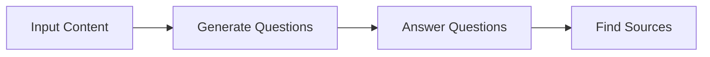
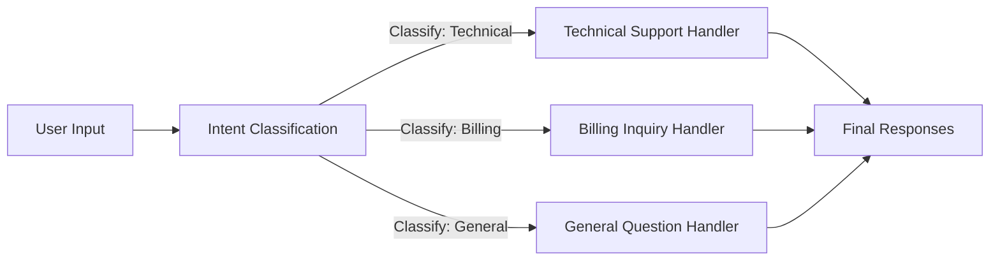
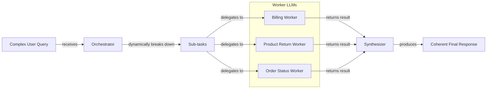

# Lesson 5: Basic Workflow Patterns

In our previous lessons, we laid the groundwork for AI Engineering. We explored the agent landscape, differentiated between rule-based LLM workflows and autonomous AI agents, managed information flow with context engineering, and ensured reliable data extraction with structured outputs. Now, we will tackle the fundamental components for building these systems: basic workflow patterns.

This lesson explores how to construct sophisticated and reliable LLM applications by moving beyond single, complex prompts. We will cover chaining multiple LLM calls, parallelizing them for speed, implementing routing with conditional logic, and using the orchestrator-worker pattern for dynamic tasks. These techniques are the building blocks for almost any production-grade AI system.

## The Challenge with Complex Single LLM Calls

Attempting to solve a complex, multi-step problem with a single, large LLM call is a common mistake. While it might seem efficient, this approach often leads to unreliable and hard-to-maintain systems. A single "mega-prompt" is sensitive to small changes and can struggle with several issues. For example, studies show that accuracy can drop significantly as you add more requirements to a single prompt [[1]].

This approach also makes it difficult to pinpoint errors and lacks modularity. Furthermore, long contexts increase the likelihood of the "lost-in-the-middle" problem, where the model ignores information buried in the middle of the prompt [[2]]. Larger context windows do not solve this; they can actually worsen it by creating a larger "middle" for information to get lost in [[2]].

Let's demonstrate this with an example. Our goal is to generate a Frequently Asked Questions (FAQ) page from several documents about renewable energy.

1.  First, we set up our environment by initializing the Google Gemini client. We will use `gemini-2.5-flash`, which is fast and cost-effective.
    ```python
    from google import genai
    # ... other imports
    
    client = genai.Client()
    MODEL_ID = "gemini-2.5-flash"
    ```
    We will also use mock data representing three webpages on renewable energy.

2.  Now, we create a complex prompt that asks the model to generate questions, find answers, and cite sources all in one go.
    ```python
    # This prompt tries to do everything at once, which can confuse the model.
    n_questions = 10
    prompt_complex = f"""
    Based on the provided content, generate a list of exactly {n_questions} FAQs.
    For each question, provide a concise answer derived ONLY from the text.
    After each answer, you MUST include a list of the 'Source Title's used.
    
    <provided_content>
    {combined_content}
    </provided_content>
    """.strip()
    
    # ... Pydantic classes and client call ...
    response_complex = client.models.generate_content(...)
    ```
    It outputs:
    ```json
    {
      "question": "Why is energy storage crucial for renewable energy sources like solar and wind?",
      "answer": "Effective energy storage is key to unlocking the full potential of renewable sources because it allows storing excess energy when plentiful and releasing it when needed, which is crucial for a stable power grid.",
      "sources": [
        "Energy Storage Solutions",
        "Understanding Wind Turbines"
      ]
    }
    ```
While this output seems reasonable, the more complex the instructions, the higher the chance of inaccuracies. For instance, the model might miss that an answer is derived from multiple sources. This lack of reliability makes single-prompt solutions a poor choice for production systems.

## The Power of Modularity: Why Chain LLM Calls?

A more manageable solution is prompt chaining, which breaks a complex task into a sequence of smaller, focused sub-tasks. The output of one LLM call becomes the input for the next, creating a "chain" of operations [[3]]. This is a divide-and-conquer strategy that brings several benefits.

Chaining creates modularity by assigning each LLM call a specific job, making the system easier to debug and more flexible [[4]]. Simpler, targeted prompts also lead to higher accuracy [[4]]. This step-by-step process helps reduce hallucinations by grounding the model's reasoning at each stage [[5]]. You can even optimize costs by using cheaper models for simpler steps.

However, this approach has trade-offs. Chaining increases latency and cost due to multiple API calls. There is also a risk of information loss, where context from early steps gets diluted by the end of the chain [[6]]. Furthermore, some instructions may lose their intended meaning when split across multiple, isolated prompts.

## Building a Sequential Workflow: FAQ Generation Pipeline

Let's refactor our FAQ generation task into a three-step sequential workflow: Generate Questions → Answer Questions → Find Sources. This approach gives us more control and produces more reliable results.


Image 1: A flowchart illustrating the sequential FAQ generation pipeline.

This workflow is implemented by creating three distinct functions, each with a single responsibility.

1.  First, we define a function to generate a list of questions from the provided content. This function's only job is to create relevant questions.
    ```python
    def generate_questions(content: str, n_questions: int = 10) -> list[str]:
        """
        Generate a list of questions based on the provided content.
        """
        # ... LLM call to generate a list of questions
        return response_questions.parsed.questions
    ```

2.  Next, we create a function to answer a single question based on the content. This prompt is highly focused, reducing the chance of the model getting confused.
    ```python
    def answer_question(question: str, content: str) -> str:
        """
        Generate an answer for a specific question using only the provided content.
        """
        # ... LLM call to answer a single question
        return answer_response.text
    ```

3.  Finally, a function identifies which source documents were used for a given answer. This isolates the citation task, improving its accuracy.
    ```python
    def find_sources(question: str, answer: str, content: str) -> list[str]:
        """
        Identify which sources were used to generate an answer.
        """
        # ... LLM call to find sources for a given question and answer
        return sources_response.parsed.sources
    ```

4.  We combine these functions into a complete sequential workflow that iterates through each question, generating an answer and finding its sources one by one.
    ```python
    def sequential_workflow(content, n_questions=10) -> list[FAQ]:
        """
        Execute the complete sequential workflow for FAQ generation.
        """
        questions = generate_questions(content, n_questions)
        final_faqs = []
        for question in questions:
            answer = answer_question(question, content)
            sources = find_sources(question, answer, content)
            # ... append to final_faqs
        return final_faqs
    
    # ... execute workflow
    print(f"Sequential processing completed in {end_time - start_time:.2f} seconds")
    ```
    It outputs:
    ```text
    Sequential processing completed in 22.20 seconds
    ```
The workflow took over 20 seconds to process just four questions. While this modular approach is more reliable, its latency is a clear drawback.

## Optimizing Sequential Workflows With Parallel Processing

We can optimize the sequential workflow by running independent steps in parallel. In our FAQ example, once the questions are generated, answering each one and finding its sources are independent tasks. We can process them concurrently to significantly reduce the total execution time.

To achieve this, we use Python’s `asyncio` library to make our API calls non-blocking.

1.  We start by creating asynchronous versions of our `answer_question` and `find_sources` functions. The `async` keyword allows these functions to be paused and resumed, enabling other tasks to run in the meantime.
    ```python
    async def answer_question_async(question: str, content: str) -> str:
        # ... uses client.aio.models.generate_content
        return response.text
    
    async def find_sources_async(question: str, answer: str, content: str) -> list[str]:
        # ... uses client.aio.models.generate_content
        return response.parsed.sources
    ```

2.  We then create a function that processes a single question by calling the answer and source-finding functions concurrently.
    ```python
    async def process_question_parallel(question: str, content: str) -> FAQ:
        answer = await answer_question_async(question, content)
        sources = await find_sources_async(question, answer, content)
        return FAQ(question=question, answer=answer, sources=sources)
    ```

3.  The main parallel workflow first generates all questions, then uses `asyncio.gather` to execute the `process_question_parallel` function for all questions at the same time.
    ```python
    async def parallel_workflow(content: str, n_questions: int = 10) -> list[FAQ]:
        questions = generate_questions(content, n_questions)
        tasks = [process_question_parallel(question, content) for question in questions]
        parallel_faqs = await asyncio.gather(*tasks)
        return parallel_faqs
    
    # ... execute async workflow
    print(f"Parallel processing completed in {end_time - start_time:.2f} seconds")
    ```
    It outputs:
    ```text
    Parallel processing completed in 8.98 seconds
    ```
The parallel workflow completed in under 9 seconds, a significant improvement over the 22 seconds required for the sequential version. While parallelization offers a speed advantage, it is important to be mindful of API rate limits. Making too many concurrent calls can lead to errors, so production systems need robust error handling and backoff strategies [[7]].

## Introducing Dynamic Behavior: Routing and Conditional Logic

Not all inputs should be treated the same. Routing, or conditional logic, directs a workflow down different paths based on the input's characteristics [[4]]. This allows you to use specialized prompts and handlers for different tasks, which is another application of the "divide-and-conquer" principle.

Instead of a single prompt for every scenario, routing uses an initial LLM call to classify the input. The workflow then "branches" to the most appropriate handler. This keeps each component focused on a single responsibility, improving performance and maintainability. Production systems often use fallback chains, automatically failing over to a backup model to ensure reliability if the primary one is unavailable [[8]].

## Building a Basic Routing Workflow

Let's build a simple routing system for customer service. The goal is to classify a user's query and route it to the correct specialized handler. This ensures that each type of request gets the most appropriate response.


Image 2: A flowchart illustrating a routing workflow for customer service intent classification.

1.  First, we define a function that uses an LLM to classify the user's intent. We use Pydantic and an `Enum` to ensure the output is one of our predefined categories: `Technical Support`, `Billing Inquiry`, or `General Question`.
    ```python
    def classify_intent(user_query: str) -> IntentEnum:
        """Uses an LLM to classify a user query."""
        # ... LLM call with a prompt to classify the query
        return response.parsed.intent
    ```

2.  Next, we define specialized prompts for each intent and a `handle_query` function that routes the request based on the classification. This function acts as the traffic controller of our workflow.
    ```python
    def handle_query(user_query: str, intent: str) -> str:
        """Routes a query to the correct handler based on its classified intent."""
        if intent == IntentEnum.TECHNICAL_SUPPORT:
            prompt = prompt_technical_support.format(user_query=user_query)
        elif intent == IntentEnum.BILLING_INQUIRY:
            prompt = prompt_billing_inquiry.format(user_query=user_query)
        else: # Also handles General Question
            prompt = prompt_general_question.format(user_query=user_query)
        
        # ... LLM call with the selected prompt
        return response.text
    ```

3.  When we test this with a query like "My internet connection is not working," the system correctly classifies the intent as `TECHNICAL_SUPPORT`. It then routes it to the appropriate handler, which generates a helpful first response asking for more details. This modular design is far more robust than a single monolithic prompt.

## Orchestrator-Worker Pattern: Dynamic Task Decomposition

The orchestrator-worker pattern introduces a higher level of dynamic behavior, acting like a project manager for LLMs [[9]]. A central "orchestrator" LLM analyzes a complex query and dynamically breaks it down into smaller subtasks [[10]]. These subtasks are then delegated to specialized "worker" components, which can execute in parallel. Finally, a "synthesizer" combines the results into a single, coherent response [[11]].

This pattern is ideal for unpredictable tasks where the necessary steps cannot be determined in advance [[11]]. The process typically involves two phases: first, the orchestrator analyzes the input and plans the subtasks, and second, the workers execute them [[12]]. Unlike simple parallelization with predefined tasks, the orchestrator's key advantage is its flexibility; it decides the subtasks at runtime based on the specific input.


Image 3: A flowchart illustrating the orchestrator-worker pattern.

Let's implement this for a complex customer service query.

1.  The orchestrator analyzes the user's query and deconstructs it into a list of structured tasks.
    ```python
    def orchestrator(query: str) -> list[Task]:
        """Breaks down a complex query into a list of tasks."""
        # ... LLM call to deconstruct query into tasks
        return response.parsed.tasks
    ```

2.  We define specialized worker functions (`handle_billing_worker`, `handle_return_worker`, `handle_status_worker`) that simulate performing actions like opening an investigation or generating a return authorization.

3.  The synthesizer function takes the structured outputs from all workers and uses an LLM to craft a single, user-friendly email.
    ```python
    def synthesizer(results: list[Task]) -> str:
        """Combines structured results from workers into a single user-facing message."""
        # ... LLM call to synthesize results into a cohesive message
        return response.text
    ```

4.  The main pipeline function ties everything together, coordinating the entire workflow from decomposition to synthesis.
    ```python
    def process_user_query(user_query):
        """Processes a query using the Orchestrator-Worker-Synthesizer pattern."""
        tasks_list = orchestrator(user_query)
        worker_results = [run_worker(task) for task in tasks_list]
        final_user_message = synthesizer(worker_results)
        # ...
    ```
When we run a complex query through the pipeline, the orchestrator correctly identifies three separate tasks. The workers process each task, and the synthesizer combines their outputs into one clear response. This demonstrates how the pattern can handle multifaceted, unpredictable requests in a structured and reliable way.

## Conclusion

We have explored four fundamental patterns for building LLM workflows: chaining, parallelization, routing, and orchestrator-worker. Each pattern offers a way to break down complex problems into smaller, more manageable parts, leading to more reliable, debuggable, and maintainable AI systems.

The core takeaway is simple: modularity beats monolithic prompts. By composing simple, focused LLM calls into structured workflows, you gain control and predictability. These patterns are not just theoretical concepts; they are the practical building blocks you will use to ship production-ready AI applications. In the upcoming lessons, we will build on this foundation as we give our systems the ability to take action with tools, a concept we will cover in Lesson 6.

## References

- [1] https://arxiv.org/html/2505.13360v1
- [2] https://dev.to/thousand_miles_ai/the-lost-in-the-middle-problem-why-llms-ignore-the-middle-of-your-context-window-3al2
- [3] https://medium.com/@fabiolalli/a-practical-guide-to-prompt-engineering-techniques-and-their-use-cases-5f8574e2cd9a
- [4] https://www.decodingai.com/p/stop-building-ai-agents-use-these
- [5] https://medium.com/@shivangis2208/from-prompts-to-systems-prompt-chaining-in-agent-design-da493651214d
- [6] https://futureagi.substack.com/p/how-tool-chaining-fails-in-production
- [7] https://tianpan.co/blog/2026-03-11-llm-api-resilience-production
- [8] https://www.getmaxim.ai/articles/top-5-llm-routing-techniques/
- [9] https://agents.kour.me/orchestrator-worker/
- [10] https://online.stevens.edu/blog/building-self-healing-ai-orchestrator-reflexion-patterns/
- [11] https://mlpills.substack.com/p/diy-17-orchestrator-worker-llm-agent
- [12] https://platform.claude.com/cookbook/patterns-agents-orchestrator-workers
- [13] https://github.com/towardsai/course-ai-agents/blob/dev/lessons/05_workflow_patterns/notebook.ipynb
- [14] https://www.promptingguide.ai/techniques/prompt_chaining
- [15] https://www.anthropic.com/engineering/building-effective-agents
- [16] https://docs.anthropic.com/en/docs/build-with-claude/prompt-engineering/claude-4-best-practices
- [17] https://langchain-ai.github.io/langgraphjs/tutorials/workflows
- [18] https://github.com/hugobowne/building-with-ai/blob/main/notebooks/01-agentic-continuum.ipynb
- [19] https://docs.anthropic.com/en/docs/build-with-claude/prompt-engineering/chain-prompts