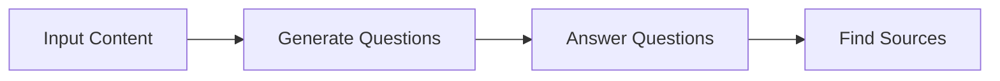
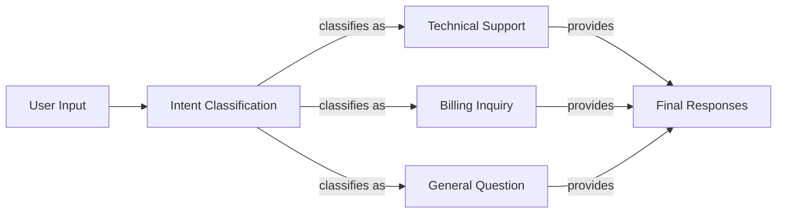
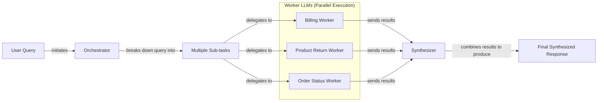

# Stop Writing Complex Prompts: A Guide to AI Workflow Patterns

In our previous lessons, we built a foundation in AI Engineering. We explored the agent landscape, distinguished between rule-based workflows and autonomous agents, and covered context engineering. Now, we will tackle a fundamental challenge: getting structured, reliable information *out* of an LLM and building robust systems on top.

When you start building AI applications, the first instinct is often to write a single, complex prompt that does everything. We've been there. We once built a system with a massive prompt that was supposed to generate questions, find answers, and cite sources all in one go. It seemed to work in demos, but in production, it was a different story. The outputs were inconsistent, debugging was a nightmare, and every small change required a complete overhaul of the monolithic prompt.

This is a common pitfall. A single, all-in-one prompt creates a "Jack of all trades, master of none" agent that struggles with reliability. This lesson will show you a better way. We will break down complex tasks into manageable, modular workflows using patterns like chaining, parallelization, routing, and orchestration. You will learn to build systems that are not just more reliable and easier to debug but also faster and more flexible.

In this lesson, we will cover:
- The problems with complex, single LLM calls.
- Why modularity through prompt chaining is a more robust approach.
- How to build a sequential FAQ generation pipeline.
- How to speed up workflows with parallel processing.
- How to introduce dynamic logic with routing.
- How to use the orchestrator-worker pattern for dynamic task decomposition.

## The Challenge with Complex Single LLM Calls

Relying on a single, large prompt for a multi-step task creates an unreliable system. While it might seem efficient to ask an LLM to do everything at once, this approach introduces several engineering challenges that make production systems brittle. The principle is the same one software development learned long ago: monolithic applications do not scale [[13]](https://developers.googleblog.com/developers-guide-to-multi-agent-patterns-in-adk/).

First, a monolithic prompt makes it difficult to pinpoint errors. If the final output is wrong, was it because the model misunderstood the first instruction, failed on the third, or misinterpreted the source material? Without clear intermediate steps, debugging becomes a guessing game. A 2025 study on failed LLM agent trajectories found that error propagation was the most common failure pattern, making it the single biggest barrier to building dependable agents [[7]](https://futureagi.substack.com/p/how-tool-chaining-fails-in-production). This cascading failure problem is the primary bottleneck to agent reliability.

Second, this approach lacks modularity. You cannot update or optimize one part of the task without rewriting the entire prompt, which risks breaking other parts. This tight coupling makes the system difficult to maintain and evolve. If you want to swap out the model used for just one sub-task, you are forced to re-validate the entire complex prompt.

Furthermore, long and complex prompts are more susceptible to the "lost-in-the-middle" problem. Research from Stanford and UC Berkeley confirmed that LLMs pay the most attention to the beginning and end of their context window, while information in the middle is often overlooked [[1]](https://dev.to/thousand_miles_ai/the-lost-in-the-middle-problem-why-llms-ignore-the-middle-of-your-context-window-3al2). This U-shaped performance curve is a result of architectural biases like causal attention masking, where earlier tokens get more cumulative attention, and positional encoding decay, which weakens the signal from middle tokens. As your prompt grows, critical instructions or source data can get lost, leading to inaccurate or incomplete results.

Finally, trying to cram too many instructions into a single call often leads to higher token consumption and degraded performance. Studies show that as the number of requirements in a prompt increases, an LLM's ability to follow all of them diminishes. For example, one analysis found that gpt-4o's accuracy dropped from 98.7% on a single requirement to 85% when following 19 requirements at once [[2]](https://arxiv.org/html/2505.13360v1). This is due to the model's limited instruction-following capabilities and the potential for conflicting constraints.

Let's see this in practice. We will build an FAQ generator from a few mock webpages on renewable energy.

1.  First, we set up our environment by initializing the Gemini client. We will use `gemini-1.5-flash`, which is fast and cost-effective for these examples.
    ```python
    from lessons.utils import env
    import google.generai as genai
    from google.genai import types
    from pydantic import BaseModel, Field
    
    env.load(required_env_vars=["GOOGLE_API_KEY"])
    
    client = genai.Client()
    
    MODEL_ID = "gemini-1.5-flash"
    ```

2.  Next, we define our mock source content.
    ```python
    webpage_1 = {
        "title": "The Benefits of Solar Energy",
        "content": """
        Solar energy is a renewable powerhouse, offering numerous environmental and economic benefits.
        By converting sunlight into electricity through photovoltaic (PV) panels, it reduces reliance on fossil fuels,
        thereby cutting down greenhouse gas emissions. Homeowners who install solar panels can significantly
        lower their monthly electricity bills, and in some cases, sell excess power back to the grid.
        While the initial installation cost can be high, government incentives and long-term savings make
        it a financially viable option for many. Solar power is also a key component in achieving energy
        independence for nations worldwide.
        """,
    }
    
    webpage_2 = {
        "title": "Understanding Wind Turbines",
        "content": """
        Wind turbines are towering structures that capture kinetic energy from the wind and convert it into
        electrical power. They are a critical part of the global shift towards sustainable energy.
        Turbines can be installed both onshore and offshore, with offshore wind farms generally producing more
        consistent power due to stronger, more reliable winds. The main challenge for wind energy is its
        intermittency. It only generates power when the wind blows. This necessitates the use of energy
        storage solutions, like large-scale batteries, to ensure a steady supply of electricity.
        """,
    }
    
    webpage_3 = {
        "title": "Energy Storage Solutions",
        "content": """
        Effective energy storage is the key to unlocking the full potential of renewable sources like solar
        and wind. Because these sources are intermittent, storing excess energy when it's plentiful and
        releasing it when it's needed is crucial for a stable power grid. The most common form of
        large-scale storage is pumped-hydro storage, but battery technologies, particularly lithium-ion,
        are rapidly becoming more affordable and widespread. These batteries can be used in homes, businesses,
        and at the utility scale to balance energy supply and demand, making our energy system more
        resilient and reliable.
        """,
    }
    
    all_sources = [webpage_1, webpage_2, webpage_3]
    
    combined_content = "\n\n".join(
        [f"Source Title: {source['title']}\nContent: {source['content']}" for source in all_sources]
    )
    ```

3.  Now, we write a single, complex prompt that asks the model to generate questions, find answers, and cite sources all at once. We use Pydantic models for structured output, a concept we covered in Lesson 4.
    ```python
    class FAQ(BaseModel):
        """A FAQ is a question and answer pair, with a list of sources used to answer the question."""
        question: str = Field(description="The question to be answered")
        answer: str = Field(description="The answer to the question")
        sources: list[str] = Field(description="The sources used to answer the question")
    
    class FAQList(BaseModel):
        """A list of FAQs"""
        faqs: list[FAQ] = Field(description="A list of FAQs")
    
    n_questions = 10
    prompt_complex = f"""
    Based on the provided content from three webpages, generate a list of exactly {n_questions} frequently asked questions (FAQs).
    For each question, provide a concise answer derived ONLY from the text.
    After each answer, you MUST include a list of the 'Source Title's that were used to formulate that answer.
    
    <provided_content>
    {combined_content}
    </provided_content>
    """.strip()
    
    config = types.GenerateContentConfig(
        response_mime_type="application/json",
        response_schema=FAQList
    )
    response_complex = client.models.generate_content(
        model=MODEL_ID,
        contents=prompt_complex,
        config=config
    )
    result_complex = response_complex.parsed
    ```
    It outputs:
    ```json
    {
      "question": "What is solar energy and how does it work?",
      "answer": "Solar energy is a renewable powerhouse that converts sunlight into electricity through photovoltaic (PV) panels.",
      "sources": [
        "The Benefits of Solar Energy"
      ]
    }
    {
      "question": "What are the environmental benefits of using solar energy?",
      "answer": "Solar energy reduces reliance on fossil fuels, thereby cutting down greenhouse gas emissions.",
      "sources": [
        "The Benefits of Solar Energy"
      ]
    }
    ```

While this output looks acceptable, the approach is fragile. As instructions become more complex, a single prompt is more likely to fail. For instance, the model might correctly answer a question using information from two sources but only cite one. This kind of subtle error is common with monolithic prompts and hard to fix without making the prompt even more convoluted. A better approach is to break the problem down.

## The Power of Modularity: Why Chain LLM Calls?

Instead of a single, complex prompt, we can use prompt chaining. This technique breaks a large task into a sequence of smaller, more focused sub-tasks. The output of one LLM call becomes the input for the next, creating a workflow or "chain" [[3]](https://medium.com/@fabiolalli/a-practical-guide-to-prompt-engineering-techniques-and-their-use-cases-5f8574e2cd9a), [[4]](https://www.scrum.org/resources/blog/10-prompt-engineering-techniques-super-simple-explanation). This is a divide-and-conquer strategy that brings the principles of modular software design to AI engineering, turning what could be a single-prompt "toy" into a reliable automation [[6]](https://datalearningscience.com/p/design-pattern-prompt-chaining-building).

This modular approach offers several advantages for building reliable systems [[5]](https://www.decodingai.com/p/stop-building-ai-agents-use-these). First, it improves accuracy. Simpler, targeted prompts are less confusing for the LLM, leading to more consistent and correct outputs for each sub-task. Second, it makes debugging far easier. If a workflow fails, you can inspect the output of each step to pinpoint exactly where the error occurred. This level of observability is critical for production systems. Third, it increases flexibility. You can swap, update, or optimize individual components of the chain without affecting the others. For example, you could use a fast, cheap model for a simple classification step and a more powerful model for a complex generation step, optimizing for both cost and performance.

However, prompt chaining is not without its trade-offs. It can increase latency and cost because it requires multiple LLM calls instead of one. There is also a risk of information loss or error propagation; a mistake in an early step can cascade through the rest of the chain [[7]](https://futureagi.substack.com/p/how-tool-chaining-fails-in-production), [[3]](https://medium.com/@fabiolalli/a-practical-guide-to-prompt-engineering-techniques-and-their-use-cases-5f8574e2cd9a), [[8]](https://wand.ai/blog/compounding-error-effect-in-large-language-models-a-growing-challenge). For example, if a summarization step loses a key detail, a subsequent translation step will not be able to recover it. This is known as the compounding error effect, where small inaccuracies accumulate and grow with each step in a sequence. To mitigate this, it is a good practice to validate the output at each step using Pydantic or another schema validation tool. Despite these challenges, for most complex tasks, the gains in reliability and maintainability far outweigh the downsides.

## Building a Sequential Workflow: FAQ Generation Pipeline

Let's refactor our FAQ generation task into a three-step sequential workflow. This modular design will give us more control and make the process more reliable. The pipeline will consist of the following stages:
1.  **Generate Questions:** The first LLM call will read the source content and generate a list of relevant questions.
2.  **Answer Questions:** For each question, a second LLM call will generate a concise answer based on the content.
3.  **Find Sources:** For each question-and-answer pair, a third LLM call will identify the source titles used, ensuring traceability.

This step-by-step process mirrors how a human would approach the task, breaking a large problem into manageable parts. By isolating each function, we can develop, test, and optimize each component independently before integrating them into the final workflow. This modularity is a core principle of robust software engineering and is equally critical when building with LLMs.


Image 1: A sequential workflow for FAQ generation.

We will now implement each of these stages as a separate function, then combine them into a single, cohesive pipeline. This approach not only improves the reliability of the output but also makes the system easier to test and maintain.

1.  First, we create a function dedicated to generating questions. This prompt has a single, clear responsibility: to extract potential user questions from the provided text. By focusing on one task, we reduce the cognitive load on the model and increase the likelihood of getting a high-quality list of questions. We define a `QuestionList` Pydantic model to ensure the output is a list of strings, leveraging the structured output techniques we learned in the previous lesson.
    ```python
    class QuestionList(BaseModel):
        """A list of questions"""
        questions: list[str] = Field(description="A list of questions")
    
    prompt_generate_questions = """
    Based on the content below, generate a list of {n_questions} relevant and distinct questions that a user might have.
    
    <provided_content>
    {combined_content}
    </provided_content>
    """.strip()
    
    def generate_questions(content: str, n_questions: int = 10) -> list[str]:
        """
        Generate a list of questions based on the provided content.
        """
        config = types.GenerateContentConfig(
            response_mime_type="application/json",
            response_schema=QuestionList
        )
        response_questions = client.models.generate_content(
            model=MODEL_ID,
            contents=prompt_generate_questions.format(n_questions=n_questions, combined_content=content),
            config=config
        )
    
        return response_questions.parsed.questions
    
    questions = generate_questions(combined_content, n_questions=10)
    ```
    It outputs:
    ```text
    ['What are the primary environmental and economic benefits of solar energy?', 'How do homeowners financially benefit from installing solar panels?', 'What is the main process by which wind turbines generate electricity?', 'What is the primary challenge of wind energy, and how is it addressed?', 'Why is effective energy storage crucial for renewable energy sources like solar and wind?', 'What are some common large-scale energy storage methods mentioned?', 'Are there government incentives available for solar panel installation?', 'What is the difference in power consistency between onshore and offshore wind farms?', 'How do energy storage solutions make the energy system more resilient and reliable?', 'Can excess solar power generated by homeowners be sold back to the grid?']
    ```

2.  Next, we define a function to answer a single question. This function takes a question and the source content as input, and its sole purpose is to generate a concise and accurate answer. This separation of concerns ensures that the model is not distracted by other tasks like generating questions or finding sources. The prompt explicitly instructs the model to use *only* the provided content, which helps to ground the answer and reduce the risk of hallucinations.
    ```python
    prompt_answer_question = """
    Using ONLY the provided content below, answer the following question.
    The answer should be concise and directly address the question.
    
    <question>
    {question}
    </question>
    
    <provided_content>
    {combined_content}
    </provided_content>
    """.strip()
    
    def answer_question(question: str, content: str) -> str:
        """
        Generate an answer for a specific question using only the provided content.
        """
        answer_response = client.models.generate_content(
            model=MODEL_ID,
            contents=prompt_answer_question.format(question=question, combined_content=content),
        )
        return answer_response.text
    
    test_question = questions[0]
    test_answer = answer_question(test_question, combined_content)
    ```
    It outputs:
    ```text
    The primary environmental benefit of solar energy is cutting down greenhouse gas emissions by reducing reliance on fossil fuels. Economically, it allows homeowners to significantly lower their monthly electricity bills and potentially sell excess power back to the grid.
    ```

3.  Finally, we create a function to find the sources for a given answer. This step is crucial for building trust and ensuring traceability. It takes the question and the generated answer as input and identifies which of the original documents were used. This allows for easy verification and helps ground the model's responses in factual data. Again, we use a Pydantic model, `SourceList`, to enforce a structured output.
    ```python
    class SourceList(BaseModel):
        """A list of source titles that were used to answer the question"""
        sources: list[str] = Field(description="A list of source titles that were used to answer the question")
    
    prompt_find_sources = """
    You will be given a question and an answer that was generated from a set of documents.
    Your task is to identify which of the original documents were used to create the answer.
    
    <question>
    {question}
    </question>
    
    <answer>
    {answer}
    </answer>
    
    <provided_content>
    {combined_content}
    </provided_content>
    """.strip()
    
    def find_sources(question: str, answer: str, content: str) -> list[str]:
        """
        Identify which sources were used to generate an answer.
        """
        config = types.GenerateContentConfig(
            response_mime_type="application/json",
            response_schema=SourceList
        )
        sources_response = client.models.generate_content(
            model=MODEL_ID,
            contents=prompt_find_sources.format(question=question, answer=answer, combined_content=content),
            config=config
        )
        return sources_response.parsed.sources
    
    test_sources = find_sources(test_question, test_answer, combined_content)
    ```
    It outputs:
    ```text
    ['The Benefits of Solar Energy']
    ```

4.  Now, we combine these functions into a complete sequential workflow. We will loop through each generated question, answer it, and find its sources one by one. This orchestration logic ties our modular components together into a functioning pipeline. We will also measure the execution time to establish a baseline for later comparison.
    ```python
    import time
    
    def sequential_workflow(content, n_questions=10) -> list[FAQ]:
        """
        Execute the complete sequential workflow for FAQ generation.
        """
        questions = generate_questions(content, n_questions)
    
        final_faqs = []
        for question in questions:
            answer = answer_question(question, content)
            sources = find_sources(question, answer, content)
    
            faq = FAQ(
                question=question,
                answer=answer,
                sources=sources
            )
            final_faqs.append(faq)
    
        return final_faqs
    
    start_time = time.monotonic()
    sequential_faqs = sequential_workflow(combined_content, n_questions=4)
    end_time = time.monotonic()
    print(f"Sequential processing completed in {end_time - start_time:.2f} seconds")
    ```
    It outputs:
    ```text
    Sequential processing completed in 13.91 seconds
    ```
    Here is one of the final FAQ objects:
    ```json
    {
      "question": "What are the main differences between onshore and offshore wind farms, and what is the biggest challenge associated with wind energy generation?",
      "answer": "Offshore wind farms generally produce more consistent power than onshore wind farms due to stronger, more reliable winds. The biggest challenge associated with wind energy generation is its intermittency, as it only generates power when the wind blows.",
      "sources": [
        "Understanding Wind Turbines"
      ]
    }
    ```

This modular approach is more robust and easier to debug than the single-prompt version. Each step is simple, testable, and has a clear purpose. However, processing each question sequentially took nearly 14 seconds for just four questions. For a real application handling hundreds of FAQs, this would be far too slow. We can do better.

## Optimizing Sequential Workflows With Parallel Processing

While the sequential workflow improves reliability, it can be slow. Since answering each question is an independent task, we do not need to wait for one to finish before starting the next. By running these steps in parallel, we can significantly reduce the overall processing time. This is a common optimization strategy for I/O-bound tasks like making API calls to an LLM [[10]](https://santhalakshminarayana.github.io/blog/concurrency-patterns-python), [[11]](https://medium.com/@sizanmahmud08/python-concurrency-showdown-asyncio-vs-threading-vs-multiprocessing-which-should-you-choose-in-31205161899a).

LLM API calls are I/O-bound because the program spends most of its time waiting for a response from the network, not performing CPU-intensive calculations. Python's `asyncio` library is perfectly suited for this scenario. It allows us to manage thousands of concurrent operations within a single thread by using an event loop to switch between tasks whenever one is waiting for I/O. This cooperative multitasking avoids the overhead of creating and managing multiple OS threads, making it a highly efficient way to handle concurrent network requests.

We will refactor our workflow to use `asyncio`. Instead of processing questions one by one, we will fire off the "answer" and "find sources" calls for all questions at the same time. This will allow us to overlap the network waiting times, leading to a much faster total execution time.

1.  First, we need asynchronous versions of our `answer_question` and `find_sources` functions. The `google-genai` library provides an `aio` (asynchronous I/O) client for this purpose, which allows us to use `await` for non-blocking API calls. The `async def` syntax defines a coroutine, a special function that can be paused and resumed.
    ```python
    import asyncio
    
    async def answer_question_async(question: str, content: str) -> str:
        """
        Async version of answer_question function.
        """
        prompt = prompt_answer_question.format(question=question, combined_content=content)
        response = await client.aio.models.generate_content(
            model=MODEL_ID,
            contents=prompt
        )
        return response.text
    
    async def find_sources_async(question: str, answer: str, content: str) -> list[str]:
        """
        Async version of find_sources function.
        """
        prompt = prompt_find_sources.format(question=question, answer=answer, combined_content=content)
        config = types.GenerateContentConfig(
            response_mime_type="application/json",
            response_schema=SourceList
        )
        response = await client.aio.models.generate_content(
            model=MODEL_ID,
            contents=prompt,
            config=config
        )
        return response.parsed.sources
    ```

2.  Next, we create a coroutine that processes a single question. It first `await`s the answer, and once the answer is received, it `await`s the sources. This ensures the two dependent calls for a single question happen in the correct order, but multiple instances of this function can run concurrently for different questions.
    ```python
    async def process_question_parallel(question: str, content: str) -> FAQ:
        """
        Process a single question by generating answer and finding sources in parallel.
        """
        answer = await answer_question_async(question, content)
        sources = await find_sources_async(question, answer, content)
        return FAQ(
            question=question,
            answer=answer,
            sources=sources
        )
    ```

3.  Finally, we assemble the full parallel workflow. The `generate_questions` step remains sequential, as we need the questions before we can answer them. However, we then use `asyncio.gather` to execute `process_question_parallel` for all questions concurrently. This function collects all the asynchronous tasks and runs them at the same time, waiting for all to complete before returning the results.
    ```python
    async def parallel_workflow(content: str, n_questions: int = 10) -> list[FAQ]:
        """
        Execute the complete parallel workflow for FAQ generation.
        """
        questions = generate_questions(content, n_questions)
    
        tasks = [process_question_parallel(question, content) for question in questions]
        parallel_faqs = await asyncio.gather(*tasks)
    
        return parallel_faqs
    
    start_time = time.monotonic()
    parallel_faqs = await parallel_workflow(combined_content, n_questions=4)
    end_time = time.monotonic()
    print(f"Parallel processing completed in {end_time - start_time:.2f} seconds")
    ```
    It outputs:
    ```text
    Parallel processing completed in 5.37 seconds
    ```

By running the independent tasks in parallel, we reduced the execution time from 13.91 seconds to just 5.37 seconds. This is a significant improvement that makes the application much more responsive.

Here is a quick comparison:

| Approach | Pros | Cons |
| --- | --- | --- |
| **Sequential** | Predictable, easier to debug. | Higher total processing time. |
| **Parallel** | Much faster, better resource use. | More complex error handling, risk of hitting rate limits. |

⚠️ A quick note on rate limits: when making many parallel API calls, you can easily exceed the limits imposed by your LLM provider (e.g., requests per minute). Production systems need robust error handling, such as exponential backoff with jitter, to manage these limits gracefully [[9]](https://tianpan.co/blog/2026-03-11-llm-api-resilience-production). This involves retrying failed requests with a randomized delay to avoid overwhelming the server.

## Introducing Dynamic Behavior: Routing and Conditional Logic

So far, our workflows have been fixed. A sequential chain always executes the same steps, and a parallel workflow runs the same tasks concurrently. But what if your application needs to handle different types of input in different ways? This is where routing comes in.

Routing introduces conditional logic to your workflow. Instead of a single, linear path, you can create branches that direct the flow based on the input or an intermediate state. This allows you to use specialized prompts and tools for specific scenarios, following the same "divide-and-conquer" principle. A common pattern is to use an initial LLM call as a classifier to decide which branch to take [[12]](https://www.vellum.ai/blog/how-to-build-intent-detection-for-your-chatbot), [[13]](https://developers.googleblog.com/developers-guide-to-multi-agent-patterns-in-adk/). This is often called the Coordinator or Dispatcher pattern, where a central agent analyzes user intent and routes the request to a specialist.

For example, a customer support system could classify an incoming query as "Technical Support," "Billing Inquiry," or "General Question" and route it to a specialized handler for each case. This is far more effective than trying to create a single, monolithic prompt that can handle every possible type of customer query. By separating concerns, you can optimize each handler's prompt for its specific task, leading to better performance and easier maintenance. This modularity also makes it simpler to add new categories or update existing logic without disrupting the entire system. You can even include a default or "catch-all" route to handle unexpected inputs gracefully, making your system more robust.

## Building a Basic Routing Workflow

Let's build a simple routing system for a customer service bot. The workflow will first classify the user's intent and then pass the query to a specialized handler. This pattern is extremely common in production applications for directing traffic to the correct logic path, ensuring that each request is handled by the component best suited for the job.


Image 2: A routing workflow for customer service intent classification.

1.  First, we define the possible intents and use an LLM to classify the user's query. We use an `Enum` and Pydantic models to ensure the classification is one of our expected values. This creates a strong contract for the output of our classification step, preventing unexpected values from breaking our routing logic. The prompt clearly lists the available categories, guiding the model to make a valid selection.
    ```python
    from enum import Enum
    
    class IntentEnum(str, Enum):
        """Defines the allowed values for the 'intent' field."""
        TECHNICAL_SUPPORT = "Technical Support"
        BILLING_INQUIRY = "Billing Inquiry"
        GENERAL_QUESTION = "General Question"
    
    class UserIntent(BaseModel):
        """Defines the expected response schema for the intent classification."""
        intent: IntentEnum = Field(description="The intent of the user's query")
    
    prompt_classification = """
    Classify the user's query into one of the following categories.
    
    <categories>
    {categories}
    </categories>
    
    <user_query>
    {user_query}
    </user_query>
    """.strip()
    
    def classify_intent(user_query: str) -> IntentEnum:
        """Uses an LLM to classify a user query."""
        prompt = prompt_classification.format(
            user_query=user_query,
            categories=[intent.value for intent in IntentEnum]
        )
        config = types.GenerateContentConfig(
            response_mime_type="application/json",
            response_schema=UserIntent
        )
        response = client.models.generate_content(
            model=MODEL_ID,
            contents=prompt,
            config=config
        )
        return response.parsed.intent
    
    query_1 = "My internet connection is not working."
    intent_1 = classify_intent(query_1)
    ```
    It outputs:
    ```text
    IntentEnum.TECHNICAL_SUPPORT
    ```

2.  Next, we define specialized prompts for each intent. Each prompt is tailored to handle a specific type of query, giving the model a clear and focused role. For technical support, the prompt asks for troubleshooting details. For billing, it requests an account number. This specialization is much more effective than a single, generic prompt trying to handle all cases.
    ```python
    prompt_technical_support = """
    You are a helpful technical support agent.
    
    Here's the user's query:
    <user_query>
    {user_query}
    </user_query>
    
    Provide a helpful first response, asking for more details like what troubleshooting steps they have already tried.
    """.strip()
    
    prompt_billing_inquiry = """
    You are a helpful billing support agent.
    
    Here's the user's query:
    <user_query>
    {user_query}
    </user_query>
    
    Acknowledge their concern and inform them that you will need to look up their account, asking for their account number.
    """.strip()
    
    prompt_general_question = """
    You are a general assistant.
    
    Here's the user's query:
    <user_query>
    {user_query}
    </user_query>
    
    Apologize that you are not sure how to help.
    """.strip()
    ```

3.  Finally, we create a `handle_query` function that acts as our router. It takes the user's query and the classified intent, then calls the appropriate handler. This simple conditional logic is the core of the routing pattern. If the intent does not match any of our defined handlers, it falls back to the general-purpose response, ensuring the system always provides a reply.
    ```python
    def handle_query(user_query: str, intent: str) -> str:
        """Routes a query to the correct handler based on its classified intent."""
        if intent == IntentEnum.TECHNICAL_SUPPORT:
            prompt = prompt_technical_support.format(user_query=user_query)
        elif intent == IntentEnum.BILLING_INQUIRY:
            prompt = prompt_billing_inquiry.format(user_query=user_query)
        else:
            prompt = prompt_general_question.format(user_query=user_query)
        
        response = client.models.generate_content(
            model=MODEL_ID,
            contents=prompt
        )
        return response.text
    
    response_1 = handle_query(query_1, intent_1)
    ```
    It outputs:
    ```text
    Hello! I'm sorry to hear you're having trouble with your internet connection. To help me troubleshoot, could you please tell me a bit more about the issue? For example, have you already tried restarting your router or modem?
    ```
This routing pattern allows us to build a more sophisticated and reliable system by directing tasks to specialized components, keeping each part of our application simple and focused.

## Orchestrator-Worker Pattern: Dynamic Task Decomposition

The patterns we have seen so far—chaining, parallelization, and routing—are powerful, but they rely on pre-defined workflows. What if you have a complex task where the necessary sub-tasks cannot be known in advance? This requires a more dynamic approach.

The orchestrator-worker pattern uses a central LLM, the "orchestrator," to analyze a complex query and dynamically break it down into smaller sub-tasks. It then delegates these sub-tasks to specialized "worker" components, which can be other LLM calls or external tools. Once the workers complete their tasks, a final "synthesizer" step combines their outputs into a single, coherent response [[14]](https://mlpills.substack.com/p/diy-17-orchestrator-worker-llm-agent), [[15]](https://platform.claude.com/cookbook/patterns-agents-orchestrator-workers), [[16]](https://agents.kour.me/orchestrator-worker/).

The key advantage here is flexibility. Unlike a fixed parallel workflow, the orchestrator determines the sub-tasks at runtime based on the specific input. This is ideal for handling unpredictable, multi-part user queries, such as a customer request that involves a billing question, a product return, and an order status update all at once. The orchestrator acts like a project manager, assessing the overall goal and assigning specific, manageable tasks to the team members best equipped to handle them. This pattern is particularly well-suited for complex domains like coding, where the number and nature of file changes depend entirely on the task at hand.

Let's implement this pattern for our customer support example.


Image 3: A flowchart illustrating the orchestrator-worker pattern, showing query decomposition, parallel worker execution, and final synthesis.

1.  First, we define the orchestrator. Its job is to parse a complex user query and break it down into a list of structured tasks. We will use Pydantic models to define the task schema, ensuring the output is predictable and easy for our workers to consume. The prompt clearly defines the available `query_type` values and their required parameters, guiding the LLM to produce a valid task list.
    ```python
    import random
    
    class QueryTypeEnum(str, Enum):
        """The type of query to be handled."""
        BILLING_INQUIRY = "BillingInquiry"
        PRODUCT_RETURN = "ProductReturn"
        STATUS_UPDATE = "StatusUpdate"
    
    class Task(BaseModel):
        """A task to be performed."""
        query_type: QueryTypeEnum = Field(description="The type of query to be handled.")
        invoice_number: str | None = Field(description="The invoice number to be used for the billing inquiry.", default=None)
        product_name: str | None = Field(description="The name of the product to be returned.", default=None)
        reason_for_return: str | None = Field(description="The reason for returning the product.", default=None)
        order_id: str | None = Field(description="The order ID to be used for the status update.", default=None)
    
    class TaskList(BaseModel):
        """A list of tasks to be performed."""
        tasks: list[Task] = Field(description="A list of tasks to be performed.")
    
    prompt_orchestrator = f"""
    You are a master orchestrator. Your job is to break down a complex user query into a list of sub-tasks.
    Each sub-task must have a "query_type" and its necessary parameters.
    
    The possible "query_type" values and their required parameters are:
    1. "{QueryTypeEnum.BILLING_INQUIRY.value}": Requires "invoice_number".
    2. "{QueryTypeEnum.PRODUCT_RETURN.value}": Requires "product_name" and "reason_for_return".
    3. "{QueryTypeEnum.STATUS_UPDATE.value}": Requires "order_id".
    
    Here's the user's query.
    
    <user_query>
    {{query}}
    </user_query>
    """.strip()
    
    
    def orchestrator(query: str) -> list[Task]:
        """Breaks down a complex query into a list of tasks."""
        prompt = prompt_orchestrator.format(query=query)
        config = types.GenerateContentConfig(
            response_mime_type="application/json",
            response_schema=TaskList
        )
        response = client.models.generate_content(
            model=MODEL_ID,
            contents=prompt,
            config=config
        )
        return response.parsed.tasks
    ```

2.  Next, we define our specialized workers. Each worker is a function that handles one type of task. The billing worker uses an LLM call to extract the user's specific concern from the original query and then simulates opening an investigation, returning a structured `BillingTask` object.
    ```python
    class BillingTask(BaseModel):
        query_type: QueryTypeEnum = Field(default=QueryTypeEnum.BILLING_INQUIRY)
        invoice_number: str
        user_concern: str
        action_taken: str
        resolution_eta: str
    
    prompt_billing_worker_extractor = """
    You are a specialized assistant. A user has a query regarding invoice '{invoice_number}'.
    From the full user query provided below, extract the specific concern or question the user has voiced about this particular invoice.
    Respond with ONLY the extracted concern/question. If no specific concern is mentioned beyond a general inquiry about the invoice, state 'General inquiry regarding the invoice'.
    
    Here's the user's query:
    <user_query>
    {original_user_query}
    </user_query>
    
    Extracted concern about invoice {invoice_number}:
    """.strip()
    
    def handle_billing_worker(invoice_number: str, original_user_query: str) -> BillingTask:
        extraction_prompt = prompt_billing_worker_extractor.format(
            invoice_number=invoice_number, original_user_query=original_user_query
        )
        response = client.models.generate_content(model=MODEL_ID, contents=extraction_prompt)
        extracted_concern = response.text
        investigation_id = f"INV_CASE_{random.randint(1000, 9999)}"
        eta_days = 2
        return BillingTask(
            invoice_number=invoice_number,
            user_concern=extracted_concern,
            action_taken=f"An investigation (Case ID: {investigation_id}) has been opened regarding your concern.",
            resolution_eta=f"{eta_days} business days",
        )
    ```

3.  The return worker simulates generating a Return Merchandise Authorization (RMA) number and providing shipping instructions. In a real application, this would involve calling an external API.
    ```python
    class ReturnTask(BaseModel):
        query_type: QueryTypeEnum = Field(default=QueryTypeEnum.PRODUCT_RETURN)
        product_name: str
        reason_for_return: str
        rma_number: str
        shipping_instructions: str
    
    def handle_return_worker(product_name: str, reason_for_return: str) -> ReturnTask:
        rma_number = f"RMA-{random.randint(10000, 99999)}"
        shipping_instructions = (
            f"Please pack the '{product_name}' securely in its original packaging if possible. "
            f"Include all accessories and manuals. Write the RMA number ({rma_number}) clearly on the outside of the package. "
            "Ship to: Returns Department, 123 Automation Lane, Tech City, TC 98765."
        )
        return ReturnTask(
            product_name=product_name,
            reason_for_return=reason_for_return,
            rma_number=rma_number,
            shipping_instructions=shipping_instructions,
        )
    ```

4.  The status worker simulates fetching order details from a backend system, returning a structured `StatusTask` object with the latest information.
    ```python
    class StatusTask(BaseModel):
        query_type: QueryTypeEnum = Field(default=QueryTypeEnum.STATUS_UPDATE)
        order_id: str
        current_status: str
        carrier: str
        tracking_number: str
        expected_delivery: str
    
    def handle_status_worker(order_id: str) -> StatusTask:
        possible_statuses = [
            {"status": "Shipped", "carrier": "SuperFast Shipping", "tracking": f"SF{random.randint(100000, 999999)}", "delivery_estimate": "Tomorrow"},
            {"status": "Delivered", "carrier": "Local Courier", "tracking": f"LC{random.randint(10000, 99999)}", "delivery_estimate": "Delivered yesterday"},
        ]
        status_details = random.choice(possible_statuses)
        return StatusTask(
            order_id=order_id,
            current_status=status_details["status"],
            carrier=status_details["carrier"],
            tracking_number=status_details["tracking"],
            expected_delivery=status_details["delivery_estimate"],
        )
    ```

5.  After the workers run, the synthesizer takes their structured outputs and uses an LLM to combine them into a single, human-readable response. This step is crucial for presenting the information to the user in a clear and friendly manner.
    ```python
    prompt_synthesizer = """
    You are a master communicator. Combine several distinct pieces of information from our support team into a single, well-formatted, and friendly email to a customer.
    
    Here are the points to include, based on the actions taken for their query:
    <points>
    {formatted_results}
    </points>
    
    Combine these points into one cohesive response.
    Start with a friendly greeting (e.g., "Dear Customer," or "Hi there,") and end with a polite closing (e.g., "Sincerely," or "Best regards,").
    Ensure the tone is helpful and professional.
    """.strip()
    
    def synthesizer(results: list) -> str:
        bullet_points = []
        for res in results:
            point = f"Regarding your {res.query_type.value}:\n"
            if isinstance(res, BillingTask):
                point += f"  - Invoice Number: {res.invoice_number}\n  - Your Stated Concern: \"{res.user_concern}\"\n  - Our Action: {res.action_taken}\n  - Expected Resolution: We will get back to you within {res.resolution_eta}."
            elif isinstance(res, ReturnTask):
                point += f"  - Product: {res.product_name}\n  - Reason for Return: \"{res.reason_for_return}\"\n  - Return Authorization (RMA): {res.rma_number}\n  - Instructions: {res.shipping_instructions}"
            elif isinstance(res, StatusTask):
                point += f"  - Order ID: {res.order_id}\n  - Current Status: {res.current_status}\n"
                if res.carrier != "N/A": point += f"  - Carrier: {res.carrier}\n"
                if res.tracking_number != "N/A": point += f"  - Tracking Number: {res.tracking_number}\n"
                point += f"  - Delivery Estimate: {res.expected_delivery}"
            bullet_points.append(point)
        
        formatted_results = "\n\n".join(bullet_points)
        prompt = prompt_synthesizer.format(formatted_results=formatted_results)
        response = client.models.generate_content(model=MODEL_ID, contents=prompt)
        return response.text
    ```

6.  Finally, we tie everything together in a main processing function that orchestrates the entire flow from query to final response.
    ```python
    def process_user_query(user_query):
        tasks_list = orchestrator(user_query)
        worker_results = []
        for task in tasks_list:
            if task.query_type == QueryTypeEnum.BILLING_INQUIRY:
                worker_results.append(handle_billing_worker(task.invoice_number, user_query))
            elif task.query_type == QueryTypeEnum.PRODUCT_RETURN:
                worker_results.append(handle_return_worker(task.product_name, task.reason_for_return))
            elif task.query_type == QueryTypeEnum.STATUS_UPDATE:
                worker_results.append(handle_status_worker(task.order_id))
        final_user_message = synthesizer(worker_results)
        print(final_user_message)
    ```

7.  Let's test it with a complex query that requires all three workers.
    ```python
    complex_customer_query = """
    Hi, I'm writing to you because I have a question about invoice #INV-7890. It seems higher than I expected.
    Also, I would like to return the 'SuperWidget 5000' I bought because it's not compatible with my system.
    Finally, can you give me an update on my order #A-12345?
    """.strip()
    
    process_user_query(complex_customer_query)
    ```
    The orchestrator deconstructs the query into three distinct tasks, which are then processed by the workers. The synthesizer generates the final, consolidated response:
    ```text
    Hi there,
    
    Thank you for reaching out to us. Here's a summary of the actions we've taken regarding your query:
    
    Regarding your BillingInquiry:
      - Invoice Number: INV-7890
      - Your Stated Concern: "The invoice seems higher than I expected."
      - Our Action: An investigation (Case ID: INV_CASE_8338) has been opened regarding your concern.
      - Expected Resolution: We will get back to you within 2 business days.
    
    Regarding your ProductReturn:
      - Product: SuperWidget 5000
      - Reason for Return: "it's not compatible with my system"
      - Return Authorization (RMA): RMA-89196
      - Instructions: Please pack the 'SuperWidget 5000' securely in its original packaging if possible. Include all accessories and manuals. Write the RMA number (RMA-89196) clearly on the outside of the package. Ship to: Returns Department, 123 Automation Lane, Tech City, TC 98765.
    
    Regarding your StatusUpdate:
      - Order ID: A-12345
      - Current Status: Delivered
      - Carrier: Local Courier
      - Tracking Number: LC61298
      - Delivery Estimate: Delivered yesterday
    
    We hope this information is helpful. Please let us know if you have any other questions.
    
    Best regards,
    The Support Team
    ```
The orchestrator-worker pattern provides a scalable and flexible architecture for building sophisticated AI systems that can handle complex, unpredictable tasks by breaking them down into manageable, specialized components.

## Conclusion

We have journeyed from the pitfalls of single, complex prompts to the power of modular AI workflows. You have learned that breaking down tasks into smaller, focused steps is key to building reliable and maintainable systems. We started with simple prompt chaining, then accelerated our workflow with parallelization. We introduced dynamic behavior with routing and, finally, tackled unpredictable tasks with the orchestrator-worker pattern.

These patterns are not just theoretical concepts; they are the fundamental building blocks you will use to construct nearly any LLM-powered application. As we have seen, these workflow-based approaches can solve a vast majority of production problems more reliably and controllably than a single, monolithic agent [[5]](https://www.decodingai.com/p/stop-building-ai-agents-use-these). In the upcoming lessons, we will build upon this foundation, exploring how to give these workflows the ability to use tools, reason about their actions, and manage memory. Mastering these patterns is your first major step from being a prompt engineer to becoming a true AI engineer.

## References

- [1] https://dev.to/thousand_miles_ai/the-lost-in-the-middle-problem-why-llms-ignore-the-middle-of-your-context-window-3al2
- [2] https://arxiv.org/html/2505.13360v1
- [3] https://medium.com/@fabiolalli/a-practical-guide-to-prompt-engineering-techniques-and-their-use-cases-5f8574e2cd9a
- [4] https://www.scrum.org/resources/blog/10-prompt-engineering-techniques-super-simple-explanation
- [5] https://www.decodingai.com/p/stop-building-ai-agents-use-these
- [6] https://datalearningscience.com/p/design-pattern-prompt-chaining-building
- [7] https://futureagi.substack.com/p/how-tool-chaining-fails-in-production
- [8] https://wand.ai/blog/compounding-error-effect-in-large-language-models-a-growing-challenge
- [9] https://tianpan.co/blog/2026-03-11-llm-api-resilience-production
- [10] https://santhalakshminarayana.github.io/blog/concurrency-patterns-python
- [11] https://medium.com/@sizanmahmud08/python-concurrency-showdown-asyncio-vs-threading-vs-multiprocessing-which-should-you-choose-in-31205161899a
- [12] https://www.vellum.ai/blog/how-to-build-intent-detection-for-your-chatbot
- [13] https://developers.googleblog.com/developers-guide-to-multi-agent-patterns-in-adk/
- [14] https://mlpills.substack.com/p/diy-17-orchestrator-worker-llm-agent
- [15] https://platform.claude.com/cookbook/patterns-agents-orchestrator-workers
- [16] https://agents.kour.me/orchestrator-worker/