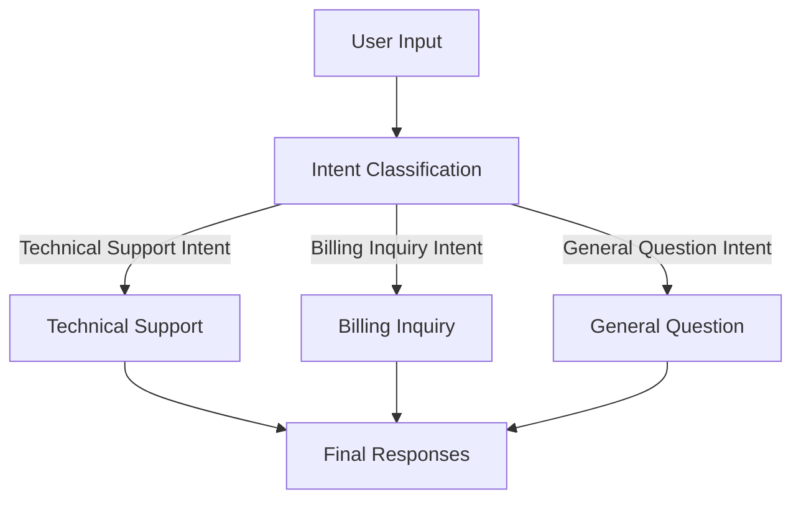
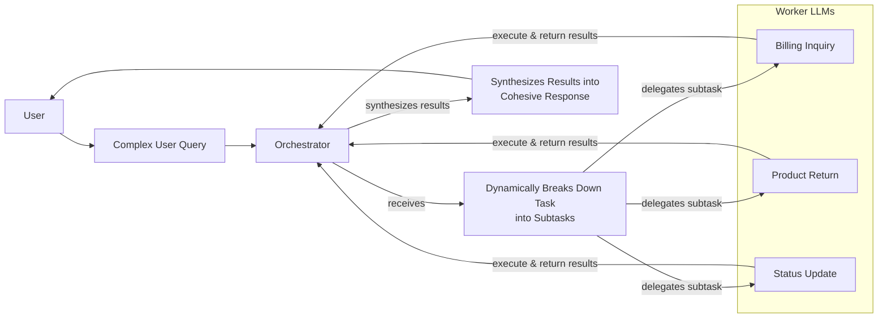

# Stop Building Monolithic LLM Calls. Use These 4 Workflow Patterns Instead.

In our last few lessons, we have laid the foundation for AI Engineering. We explored the agent landscape, distinguished between rule-based workflows and autonomous agents, and covered context engineering. Now, we will tackle a fundamental challenge: building reliable, multi-step applications by moving beyond single, monolithic LLM calls.

Many engineers starting with LLMs fall into the trap of writing a single, massive prompt that tries to do everything at once. We have been there. On an early project, we tried to build a system that would take a long technical document, generate a summary, extract key entities, create a list of FAQs, and format everything into a single JSON object—all in one go. The result was a mess of inconsistent outputs, high latency, and a debugging nightmare.

This is a common failure mode. While it’s tempting to throw a complex task at a powerful model and hope for the best, this approach is brittle and doesn’t scale. Production-grade AI requires a more structured, modular approach.

This lesson will show you how to build robust LLM applications using four foundational workflow patterns. We will cover how to chain multiple LLM calls, run them in parallel, route them with conditional logic, and orchestrate them with a central controller. These patterns are the building blocks for 95% of the production systems we see today, providing the control and reliability that single prompts lack.

We will explore:
- The challenges of complex, single LLM calls.
- The power of modularity and prompt chaining.
- How to build a sequential FAQ generation pipeline.
- How to optimize it with parallel processing.
- How to add dynamic behavior with routing.
- How to use the orchestrator-worker pattern for dynamic tasks.

## The Challenge with Complex Single LLM Calls

A single, complex prompt that asks an LLM to perform multiple distinct operations is often a recipe for unreliability. This approach, while simple to prototype, introduces several problems that make it unsuitable for production environments.

First, debugging becomes incredibly difficult. When a monolithic prompt fails, it is hard to pinpoint which instruction or part of the logic caused the error. You are left guessing whether the model misunderstood the formatting requirements, failed to extract an entity correctly, or generated a poor summary. This lack of visibility makes iterative improvement slow and frustrating.

Second, this design lacks modularity. If you want to improve one part of the task—say, enhance the summary generation—you have to modify the entire prompt. This risks unintentionally breaking other parts of the logic. A modular system, by contrast, allows you to update or swap out individual components without affecting the rest of the workflow.

Furthermore, long and complex prompts are more susceptible to the "lost in the middle" problem [[2]](https://dev.to/thousand_miles_ai/the-lost-in-the-middle-problem-why-llms-ignore-the-middle-of-your-context-window-3al2). LLMs pay the most attention to the beginning and end of their context window, and information buried in the middle is often overlooked. When you cram too many instructions and too much context into a single call, you increase the chance that the model will ignore critical details. Studies have shown this U-shaped performance curve persists even in models with very large context windows [[2]](https://dev.to/thousand_miles_ai/the-lost-in-the-middle-problem-why-llms-ignore-the-middle-of-your-context-window-3al2).

Finally, monolithic prompts can be inefficient. They often require more tokens to describe the entire complex task, and you might be forced to use a powerful, expensive model for every part of the task, even when simpler, cheaper models would suffice for some sub-steps.

To see this in practice, let's start with our setup.

1.  We will use the `google-genai` library to interact with Google's Gemini models. We will use `gemini-2.5-flash`, which is fast and cost-effective for the tasks in this lesson. Remember to set up your `GOOGLE_API_KEY` in your environment.

    ```python
    import asyncio
    from enum import Enum
    import random
    import time
    
    from pydantic import BaseModel, Field
    from google import genai
    from google.genai import types
    
    from lessons.utils import env
    
    env.load(required_env_vars=["GOOGLE_API_KEY"])
    
    client = genai.Client()
    MODEL_ID = "gemini-2.5-flash"
    ```

2.  Next, we will use mock content from three webpages about renewable energy as our source material.

    ```python
    webpage_1 = {
        "title": "The Benefits of Solar Energy",
        "content": """
        Solar energy is a renewable powerhouse, offering numerous environmental and economic benefits.
        By converting sunlight into electricity through photovoltaic (PV) panels, it reduces reliance on fossil fuels,
        thereby cutting down greenhouse gas emissions. Homeowners who install solar panels can significantly
        lower their monthly electricity bills, and in some cases, sell excess power back to the grid.
        While the initial installation cost can be high, government incentives and long-term savings make
        it a financially viable option for many. Solar power is also a key component in achieving energy
        independence for nations worldwide.
        """,
    }
    
    webpage_2 = {
        "title": "Understanding Wind Turbines",
        "content": """
        Wind turbines are towering structures that capture kinetic energy from the wind and convert it into
        electrical power. They are a critical part of the global shift towards sustainable energy.
        Turbines can be installed both onshore and offshore, with offshore wind farms generally producing more
        consistent power due to stronger, more reliable winds. The main challenge for wind energy is its
        intermittency—it only generates power when the wind blows. This necessitates the use of energy
        storage solutions, like large-scale batteries, to ensure a steady supply of electricity.
        """,
    }
    
    webpage_3 = {
        "title": "Energy Storage Solutions",
        "content": """
        Effective energy storage is the key to unlocking the full potential of renewable sources like solar
        and wind. Because these sources are intermittent, storing excess energy when it's plentiful and
        releasing it when it's needed is crucial for a stable power grid. The most common form of
        large-scale storage is pumped-hydro storage, but battery technologies, particularly lithium-ion,
        are rapidly becoming more affordable and widespread. These batteries can be used in homes, businesses,
        and at the utility scale to balance energy supply and demand, making our energy system more
        resilient and reliable.
        """,
    }
    
    all_sources = [webpage_1, webpage_2, webpage_3]
    
    combined_content = "\n\n".join(
        [f"Source Title: {source['title']}\nContent: {source['content']}" for source in all_sources]
    )
    ```

3.  Now, let's create a complex prompt that asks the LLM to generate questions, find answers, and cite sources all in one call. We will use Pydantic for structured output, a concept we covered in Lesson 4.

    ```python
    class FAQ(BaseModel):
        """A FAQ is a question and answer pair, with a list of sources used to answer the question."""
        question: str = Field(description="The question to be answered")
        answer: str = Field(description="The answer to the question")
        sources: list[str] = Field(description="The sources used to answer the question")
    
    class FAQList(BaseModel):
        """A list of FAQs"""
        faqs: list[FAQ] = Field(description="A list of FAQs")
    
    n_questions = 10
    prompt_complex = f"""
    Based on the provided content from three webpages, generate a list of exactly {n_questions} frequently asked questions (FAQs).
    For each question, provide a concise answer derived ONLY from the text.
    After each answer, you MUST include a list of the 'Source Title's that were used to formulate that answer.
    
    <provided_content>
    {combined_content}
    </provided_content>
    """.strip()
    
    config = types.GenerateContentConfig(
        response_mime_type="application/json",
        response_schema=FAQList
    )
    response_complex = client.models.generate_content(
        model=MODEL_ID,
        contents=prompt_complex,
        config=config
    )
    result_complex = response_complex.parsed
    ```

    It outputs:

    ```json
    {
      "question": "What is solar energy and how does it work?",
      "answer": "Solar energy is a renewable powerhouse that converts sunlight into electricity through photovoltaic (PV) panels.",
      "sources": [
        "The Benefits of Solar Energy"
      ]
    }
    {
      "question": "What are the environmental benefits of using solar energy?",
      "answer": "Solar energy reduces reliance on fossil fuels, thereby cutting down greenhouse gas emissions.",
      "sources": [
        "The Benefits of Solar Energy"
      ]
    }
    ...
    ```

While this output might look acceptable at first glance, this approach is fragile. The more instructions we add, the higher the chance of inconsistent formatting or factual inaccuracies. For example, the model might fail to cite a source correctly or hallucinate an answer not present in the text. This unreliability makes it a poor choice for production systems.

## The Power of Modularity: Why Chain LLM Calls?

The solution to the unreliability of monolithic prompts is modularity. Instead of asking one LLM call to do everything, we break the task into a series of smaller, more focused steps. This is the core idea behind **prompt chaining**: connecting multiple LLM calls sequentially, where the output of one step becomes the input for the next [[36]](https://www.decodingai.com/p/stop-building-ai-agents-use-these), [[41]](https://medium.com/@fabiolalli/a-practical-guide-to-prompt-engineering-techniques-and-their-use-cases-5f8574e2cd9a). It’s a simple "divide and conquer" strategy that brings traditional software engineering principles into the world of AI.

This approach offers several key benefits.

First, it improves **modularity**. Each LLM call in the chain is responsible for a single, well-defined sub-task. This separation of concerns makes the system easier to understand, maintain, and update. You can work on the "question generation" prompt without worrying about breaking the "answer generation" logic.

Second, it enhances **accuracy**. Simpler, more targeted prompts are less confusing for the LLM, which generally leads to more reliable and higher-quality outputs. Research and empirical evidence show that breaking down complex tasks into smaller steps consistently improves performance [[56]](https://www.decodingai.com/p/stop-building-ai-agents-use-these), [[59]](https://blog.udemy.com/prompt-chaining/). Instead of juggling multiple instructions, the model can focus its full attention on one thing at a time.

Third, it makes **debugging** much easier. If the final output is incorrect, you can inspect the output of each intermediate step to pinpoint exactly where things went wrong. This traceability is essential for identifying and fixing issues in a production environment.

Finally, chaining offers greater **flexibility and optimization**. You can swap individual components of the chain, or even use different models for different steps. For instance, you could use a fast, cheap model for a simple classification task and a more powerful, expensive model for a complex content generation step. This allows you to balance cost, latency, and quality effectively [[36]](https://www.decodingai.com/p/stop-building-ai-agents-use-these).

However, prompt chaining is not without its trade-offs. One downside is increased latency, as you have to wait for multiple sequential API calls to complete. It can also increase costs due to the higher number of calls and total tokens used. Another risk is **context degradation**; as information is passed from one step to the next, important details can be lost or diluted, especially in long chains [[22]](https://futureagi.substack.com/p/how-tool-chaining-fails-in-production). We will explore techniques to mitigate this, such as using structured state objects, in future lessons on agent memory.

## Building a Sequential Workflow: FAQ Generation Pipeline

Let's apply the principle of prompt chaining to our FAQ generation task. We will break the monolithic prompt into a three-step sequential workflow:
1.  **Generate Questions**: Create a list of questions based on the source content.
2.  **Answer Questions**: For each question, generate a concise answer.
3.  **Find Sources**: For each question-answer pair, identify the source documents.

Image 1: A flowchart illustrating the sequential FAQ generation pipeline.
```mermaid
flowchart LR
  "Input Content" --> "Generate Questions"
  "Generate Questions" --> "Answer Questions"
  "Answer Questions" --> "Find Sources"
```

This modular approach allows us to create specialized prompts for each sub-task, leading to more reliable and traceable results.

1.  First, we create a function to generate a list of questions. This prompt is simple and focused, asking only for questions.

    ```python
    class QuestionList(BaseModel):
        """A list of questions"""
        questions: list[str] = Field(description="A list of questions")
    
    prompt_generate_questions = """
    Based on the content below, generate a list of {n_questions} relevant and distinct questions that a user might have.
    
    <provided_content>
    {combined_content}
    </provided_content>
    """.strip()
    
    def generate_questions(content: str, n_questions: int = 10) -> list[str]:
        """
        Generate a list of questions based on the provided content.
    
        Args:
            content: The combined content from all sources
    
        Returns:
            list: A list of generated questions
        """
        config = types.GenerateContentConfig(
            response_mime_type="application/json",
            response_schema=QuestionList
        )
        response_questions = client.models.generate_content(
            model=MODEL_ID,
            contents=prompt_generate_questions.format(n_questions=n_questions, combined_content=content),
            config=config
        )
    
        return response_questions.parsed.questions
    ```

2.  Next, a function to answer a given question. This prompt instructs the model to use *only* the provided content, which helps ground the response and reduce hallucinations.

    ```python
    prompt_answer_question = """
    Using ONLY the provided content below, answer the following question.
    The answer should be concise and directly address the question.
    
    <question>
    {question}
    </question>
    
    <provided_content>
    {combined_content}
    </provided_content>
    """.strip()
    
    def answer_question(question: str, content: str) -> str:
        """
        Generate an answer for a specific question using only the provided content.
    
        Args:
            question: The question to answer
            content: The combined content from all sources
    
        Returns:
            str: The generated answer
        """
        answer_response = client.models.generate_content(
            model=MODEL_ID,
            contents=prompt_answer_question.format(question=question, combined_content=content),
        )
        return answer_response.text
    ```

3.  Finally, a function to identify the sources for a given answer. This step adds a layer of verifiability.

    ```python
    class SourceList(BaseModel):
        """A list of source titles that were used to answer the question"""
        sources: list[str] = Field(description="A list of source titles that were used to answer the question")
    
    prompt_find_sources = """
    You will be given a question and an answer that was generated from a set of documents.
    Your task is to identify which of the original documents were used to create the answer.
    
    <question>
    {question}
    </question>
    
    <answer>
    {answer}
    </answer>
    
    <provided_content>
    {combined_content}
    </provided_content>
    """.strip()
    
    def find_sources(question: str, answer: str, content: str) -> list[str]:
        """
        Identify which sources were used to generate an answer.
    
        Args:
            question: The original question
            answer: The generated answer
            content: The combined content from all sources
    
        Returns:
            list: A list of source titles that were used
        """
        config = types.GenerateContentConfig(
            response_mime_type="application/json",
            response_schema=SourceList
        )
        sources_response = client.models.generate_content(
            model=MODEL_ID,
            contents=prompt_find_sources.format(question=question, answer=answer, combined_content=content),
            config=config
        )
        return sources_response.parsed.sources
    ```

4.  Now, we combine these functions into a sequential workflow. We iterate through each generated question, answering it and finding its sources one by one.

    ```python
    def sequential_workflow(content, n_questions=10) -> list[FAQ]:
        """
        Execute the complete sequential workflow for FAQ generation.
    
        Args:
            content: The combined content from all sources
    
        Returns:
            list: A list of FAQs with questions, answers, and sources
        """
        # Generate questions
        questions = generate_questions(content, n_questions)
    
        # Answer and find sources for each question sequentially
        final_faqs = []
        for question in questions:
            # Generate an answer for the current question
            answer = answer_question(question, content)
    
            # Identify the sources for the generated answer
            sources = find_sources(question, answer, content)
    
            faq = FAQ(
                question=question,
                answer=answer,
                sources=sources
            )
            final_faqs.append(faq)
    
        return final_faqs
    
    # Execute the sequential workflow (measure time for comparison)
    start_time = time.monotonic()
    sequential_faqs = sequential_workflow(combined_content, n_questions=4)
    end_time = time.monotonic()
    print(f"Sequential processing completed in {end_time - start_time:.2f} seconds")
    ```

    It outputs:

    ```text
    Sequential processing completed in 22.20 seconds
    ```

    And the resulting `sequential_faqs` contains a list of well-structured FAQ objects. By breaking the task down, we have created a more robust, debuggable, and maintainable system. However, processing each question one after the other is slow.

## Optimizing Sequential Workflows With Parallel Processing

The sequential workflow improves reliability, but it is not efficient. Since answering each question is an independent task, we do not need to wait for one to finish before starting the next. This is a perfect opportunity for parallelization.

By running these independent sub-tasks concurrently, we can significantly reduce the total processing time. We will use Python’s `asyncio` library to make asynchronous API calls to the Gemini model, allowing us to process multiple questions in parallel.

A word of caution: when making many parallel calls, you can easily hit API rate limits, especially with free-tier accounts. Production systems need robust error handling with strategies like exponential backoff and jitter to manage these limits gracefully [[9]](https://tianpan.co/blog/2026-03-11-llm-api-resilience-production). We will keep our example small to avoid this issue.

1.  First, we need asynchronous versions of our `answer_question` and `find_sources` functions. The `google-genai` library provides an `aio` client for this purpose.

    ```python
    async def answer_question_async(question: str, content: str) -> str:
        """
        Async version of answer_question function.
        """
        prompt = prompt_answer_question.format(question=question, combined_content=content)
        response = await client.aio.models.generate_content(
            model=MODEL_ID,
            contents=prompt
        )
        return response.text
    
    async def find_sources_async(question: str, answer: str, content: str) -> list[str]:
        """
        Async version of find_sources function.
        """
        prompt = prompt_find_sources.format(question=question, answer=answer, combined_content=content)
        config = types.GenerateContentConfig(
            response_mime_type="application/json",
            response_schema=SourceList
        )
        response = await client.aio.models.generate_content(
            model=MODEL_ID,
            contents=prompt,
            config=config
        )
        return response.parsed.sources
    ```

2.  Next, we create a function that processes a single question by running the answer and source-finding steps concurrently.

    ```python
    async def process_question_parallel(question: str, content: str) -> FAQ:
        """
        Process a single question by generating answer and finding sources in parallel.
        """
        answer = await answer_question_async(question, content)
        sources = await find_sources_async(question, answer, content)
        return FAQ(
            question=question,
            answer=answer,
            sources=sources
        )
    ```

3.  Finally, we define our parallel workflow. It first generates the questions synchronously and then uses `asyncio.gather` to execute the processing for all questions concurrently.

    ```python
    async def parallel_workflow(content: str, n_questions: int = 10) -> list[FAQ]:
        """
        Execute the complete parallel workflow for FAQ generation.
    
        Args:
            content: The combined content from all sources
    
        Returns:
            list: A list of FAQs with questions, answers, and sources
        """
        # Generate questions (this step remains synchronous)
        questions = generate_questions(content, n_questions)
    
        # Process all questions in parallel
        tasks = [process_question_parallel(question, content) for question in questions]
        parallel_faqs = await asyncio.gather(*tasks)
    
        return parallel_faqs
    
    # Execute the parallel workflow (measure time for comparison)
    start_time = time.monotonic()
    parallel_faqs = await parallel_workflow(combined_content, n_questions=4)
    end_time = time.monotonic()
    print(f"Parallel processing completed in {end_time - start_time:.2f} seconds")
    ```

    It outputs:

    ```text
    Parallel processing completed in 8.98 seconds
    ```

By running the tasks in parallel, we reduced the execution time from 22.20 seconds to just 8.98 seconds—a 2.5x speedup. For a larger number of questions, the improvement would be even more dramatic. This demonstrates the trade-off: parallel processing is faster and utilizes resources better, but it adds complexity to error handling and requires careful management of API rate limits. Sequential processing is slower but more predictable and easier to debug.

## Introducing Dynamic Behavior: Routing and Conditional Logic

So far, our workflows have been static. The FAQ generation pipeline follows a fixed, linear path. But what if our application needs to handle different types of inputs in different ways? Trying to optimize a single prompt to handle multiple distinct cases is inefficient and often leads to degraded performance. This is where routing comes in.

Routing introduces conditional logic into our workflows, allowing us to dynamically select a processing path based on the input [[36]](https://www.decodingai.com/p/stop-building-ai-agents-use-these). It is another application of the "divide and conquer" principle. Instead of one monolithic prompt, we create specialized prompts for each case and use a classifier to direct the input to the appropriate one.

While using an LLM as the classifier is a common approach, routing can be implemented using several techniques. These include rule-based routing using heuristics like query length, semantic routing via vector embeddings, or even cost-aware routing that sends a query to a more powerful model only when a cheaper one returns a low-confidence score [[61]](https://www.getmaxim.ai/articles/top-5-llm-routing-techniques/). For specialized domains, fine-tuning a smaller classifier model on proprietary data can also improve accuracy [[62]](https://aws.amazon.com/blogs/machine-learning/multi-llm-routing-strategies-for-generative-ai-applications-on-aws/).

An LLM call itself can serve as this classifier. We can prompt a model to analyze an input and categorize it, and then use that classification in our application code to trigger the correct downstream logic. This creates a branching workflow, where different inputs are handled by specialized experts. For example, a customer support system might route a query about a billing issue to a billing-specialized prompt, while a technical problem goes to a technical support prompt. This ensures each query gets the most relevant and accurate response.

In production, this often evolves into a cascade pattern: a fast, cheap method like semantic search handles the initial broad categorization, followed by a fine-tuned classifier for more specific cases, with a powerful LLM as a final backstop for the most ambiguous inputs [[63]](https://tianpan.co/blog/2026-04-16-intent-classification-agent-routers). This tiered approach balances cost, latency, and accuracy.

## Building a Basic Routing Workflow

Let's build a simple routing workflow for a customer service system. The goal is to classify an incoming user query into one of three intents—`Technical Support`, `Billing Inquiry`, or `General Question`—and then route it to a specialized handler.

Image 2: A flowchart illustrating a routing workflow for customer service intent classification.


This pattern keeps our prompts focused and maintainable. Each handler can be optimized for its specific task without interfering with the others.

1.  First, we define our intents and create a Pydantic model for the classifier's output. We then write a prompt and a function that uses the LLM to classify a user's query.

    ```python
    class IntentEnum(str, Enum):
        """
        Defines the allowed values for the 'intent' field.
        Inheriting from 'str' ensures that the values are treated as strings.
        """
        TECHNICAL_SUPPORT = "Technical Support"
        BILLING_INQUIRY = "Billing Inquiry"
        GENERAL_QUESTION = "General Question"
    
    class UserIntent(BaseModel):
        """
        Defines the expected response schema for the intent classification.
        """
        intent: IntentEnum = Field(description="The intent of the user's query")
    
    prompt_classification = """
    Classify the user's query into one of the following categories.
    
    <categories>
    {categories}
    </categories>
    
    <user_query>
    {user_query}
    </user_query>
    """.strip()
    
    
    def classify_intent(user_query: str) -> IntentEnum:
        """Uses an LLM to classify a user query."""
        prompt = prompt_classification.format(
            user_query=user_query,
            categories=[intent.value for intent in IntentEnum]
        )
        config = types.GenerateContentConfig(
            response_mime_type="application/json",
            response_schema=UserIntent
        )
        response = client.models.generate_content(
            model=MODEL_ID,
            contents=prompt,
            config=config
        )
        return response.parsed.intent
    ```

2.  Next, we define specialized prompts for each intent. Each prompt is tailored to provide a helpful response for its specific category.

    ```python
    prompt_technical_support = """
    You are a helpful technical support agent.
    
    Here's the user's query:
    <user_query>
    {user_query}
    </user_query>
    
    Provide a helpful first response, asking for more details like what troubleshooting steps they have already tried.
    """.strip()
    
    prompt_billing_inquiry = """
    You are a helpful billing support agent.
    
    Here's the user's query:
    <user_query>
    {user_query}
    </user_query>
    
    Acknowledge their concern and inform them that you will need to look up their account, asking for their account number.
    """.strip()
    
    prompt_general_question = """
    You are a general assistant.
    
    Here's the user's query:
    <user_query>
    {user_query}
    </user_query>
    
    Apologize that you are not sure how to help.
    """.strip()
    ```

3.  Finally, we create a `handle_query` function that acts as our router. It takes the user query and the classified intent, and then calls the appropriate LLM with the specialized prompt.

    ```python
    def handle_query(user_query: str, intent: str) -> str:
        """Routes a query to the correct handler based on its classified intent."""
        if intent == IntentEnum.TECHNICAL_SUPPORT:
            prompt = prompt_technical_support.format(user_query=user_query)
        elif intent == IntentEnum.BILLING_INQUIRY:
            prompt = prompt_billing_inquiry.format(user_query=user_query)
        elif intent == IntentEnum.GENERAL_QUESTION:
            prompt = prompt_general_question.format(user_query=user_query)
        else:
            prompt = prompt_general_question.format(user_query=user_query)
        response = client.models.generate_content(
            model=MODEL_ID,
            contents=prompt
        )
        return response.text
    ```

4.  Let's test it with a few different queries.

    ```python
    query_1 = "My internet connection is not working."
    query_2 = "I think there is a mistake on my last invoice."
    
    intent_1 = classify_intent(query_1)
    intent_2 = classify_intent(query_2)
    
    response_1 = handle_query(query_1, intent_1)
    response_2 = handle_query(query_2, intent_2)
    ```

    For the first query, the system correctly identifies the intent as `Technical Support` and generates a helpful response asking for more details. For the second, it identifies `Billing Inquiry` and responds by asking for an account number. This simple routing workflow demonstrates how to build more intelligent and specialized AI systems.

    To optimize this further, you could even combine multiple classification decisions into a single LLM call. For instance, you could ask the model to determine both the *intent* (e.g., technical) and the *depth* (e.g., simple vs. complex) in one structured output, minimizing API latency [[64]](https://docs.nvidia.com/aiq-blueprint/2.0.0/architecture/agents/intent-classifier.html).

## Orchestrator-Worker Pattern: Dynamic Task Decomposition

The final pattern we will explore is the orchestrator-worker pattern. This is a more advanced workflow where a central "orchestrator" LLM dynamically breaks down a complex task into smaller sub-tasks and delegates them to specialized "worker" LLMs or functions [[16]](https://agents.kour.me/orchestrator-worker/), [[36]](https://www.decodingai.com/p/stop-building-ai-agents-use-these). After the workers complete their tasks, often in parallel, the orchestrator synthesizes their results into a cohesive final output.

Image 3: A flowchart illustrating the orchestrator-worker pattern, showing dynamic task decomposition, delegation to specialized worker LLMs, and result synthesis.


This pattern is powerful for complex problems where the necessary steps cannot be predicted in advance. The key difference from simple parallelization is its flexibility: the orchestrator determines the sub-tasks at runtime based on the specific input [[19]](https://platform.claude.com/cookbook/patterns-agents-orchestrator-workers). Think of it like a project manager who assesses a request, breaks it down into assignments, gives them to the right team members, and then assembles their work into a final deliverable.

This process is analogous to how an operating system's task scheduler manages computational resources. The orchestrator acts as a "traffic controller," deciding which tasks to run, when, and where, potentially prioritizing them based on complexity or system load [[65]](https://latitude.so/blog/how-task-scheduling-optimizes-llm-workflows). While this pattern uses a centralized coordinator, other approaches exist, such as decentralized patterns where agents dynamically hand off tasks to each other without a central orchestrator [[66]](https://beam.ai/agentic-insights/multi-agent-orchestration-patterns-production).

Let's build a customer support system using this pattern. A user might have a single query that involves multiple issues, like a billing question, a product return, and an order status request.

1.  First, we define the orchestrator. Its job is to analyze the user's query and break it down into a structured list of tasks, each with a specific type and the necessary parameters.

    ```python
    class QueryTypeEnum(str, Enum):
        """The type of query to be handled."""
        BILLING_INQUIRY = "BillingInquiry"
        PRODUCT_RETURN = "ProductReturn"
        STATUS_UPDATE = "StatusUpdate"
    
    class Task(BaseModel):
        """A task to be performed."""
        query_type: QueryTypeEnum = Field(description="The type of query to be handled.")
        invoice_number: str | None = Field(description="The invoice number to be used for the billing inquiry.", default=None)
        product_name: str | None = Field(description="The name of the product to be returned.", default=None)
        reason_for_return: str | None = Field(description="The reason for returning the product.", default=None)
        order_id: str | None = Field(description="The order ID to be used for the status update.", default=None)
    
    class TaskList(BaseModel):
        """A list of tasks to be performed."""
        tasks: list[Task] = Field(description="A list of tasks to be performed.")
    
    prompt_orchestrator = f"""
    You are a master orchestrator. Your job is to break down a complex user query into a list of sub-tasks.
    Each sub-task must have a "query_type" and its necessary parameters.
    
    The possible "query_type" values and their required parameters are:
    1. "{QueryTypeEnum.BILLING_INQUIRY.value}": Requires "invoice_number".
    2. "{QueryTypeEnum.PRODUCT_RETURN.value}": Requires "product_name" and "reason_for_return".
    3. "{QueryTypeEnum.STATUS_UPDATE.value}": Requires "order_id".
    
    Here's the user's query.
    
    <user_query>
    {{query}}
    </user_query>
    """.strip()
    
    
    def orchestrator(query: str) -> list[Task]:
        """Breaks down a complex query into a list of tasks."""
        prompt = prompt_orchestrator.format(query=query)
        config = types.GenerateContentConfig(
            response_mime_type="application/json",
            response_schema=TaskList
        )
        response = client.models.generate_content(
            model=MODEL_ID,
            contents=prompt,
            config=config
        )
        return response.parsed.tasks
    ```

2.  Next, we define our specialized workers. In a real application, these would interact with backend systems, databases, or external APIs. For this example, we will simulate their behavior. We will have a `handle_billing_worker`, a `handle_return_worker`, and a `handle_status_worker`. Each takes specific inputs and returns a structured output. This specialization can also extend to the models themselves; for instance, a simple data-lookup task might be delegated to a small, fast model, while a complex analysis task goes to a more powerful one to optimize cost and performance [[67]](https://labelyourdata.com/articles/llm-fine-tuning/llm-orchestration).

3.  After the workers have done their jobs, we need a synthesizer. This component takes the structured results from all workers and uses an LLM to craft a single, coherent, and user-friendly response.

    ```python
    prompt_synthesizer = """
    You are a master communicator. Combine several distinct pieces of information from our support team into a single, well-formatted, and friendly email to a customer.
    
    Here are the points to include, based on the actions taken for their query:
    <points>
    {formatted_results}
    </points>
    
    Combine these points into one cohesive response.
    Start with a friendly greeting (e.g., "Dear Customer," or "Hi there,") and end with a polite closing (e.g., "Sincerely," or "Best regards,").
    Ensure the tone is helpful and professional.
    """.strip()
    
    
    def synthesizer(results: list[Task]) -> str:
        # ... (implementation to format results and call the LLM)
        ...
    ```

4.  Finally, we tie everything together in a main pipeline function. This function calls the orchestrator, dispatches tasks to the appropriate workers, collects their results, and passes them to the synthesizer.

    ```python
    def process_user_query(user_query):
        """Processes a query using the Orchestrator-Worker-Synthesizer pattern."""
    
        # 1. Run orchestrator
        tasks_list = orchestrator(user_query)
        
        # 2. Run workers
        worker_results = []
        if tasks_list:
            for task in tasks_list:
                if task.query_type == QueryTypeEnum.BILLING_INQUIRY:
                    worker_results.append(handle_billing_worker(task.invoice_number, user_query))
                # ... (other worker dispatches)
    
        # 3. Run synthesizer
        if worker_results:
            final_user_message = synthesizer(worker_results)
            # ... (print final response)
    ```

5.  Let's test it with a complex query that triggers all three workers.

    ```python
    complex_customer_query = """
    Hi, I'm writing to you because I have a question about invoice #INV-7890. It seems higher than I expected.
    Also, I would like to return the 'SuperWidget 5000' I bought because it's not compatible with my system.
    Finally, can you give me an update on my order #A-12345?
    """.strip()
    
    process_user_query(complex_customer_query)
    ```

The orchestrator correctly identifies the three distinct tasks and extracts the necessary parameters. The workers then process these tasks, and the synthesizer combines their outputs into a single, helpful email to the customer. This pattern allows us to build sophisticated systems that can handle complex, multi-part queries dynamically and reliably.

## Conclusion

In this lesson, we have moved beyond simple, monolithic prompts and explored four foundational patterns for building robust LLM workflows. We have seen how breaking down complex tasks into smaller, manageable steps is key to creating reliable and maintainable AI applications.

We started with **prompt chaining**, a sequential pattern that improves modularity and makes debugging easier. We then optimized this with **parallelization**, significantly reducing latency for independent tasks. We introduced dynamic behavior with **routing**, using an LLM as a classifier to direct inputs to specialized handlers. Finally, we explored the **orchestrator-worker** pattern, a flexible approach for dynamically decomposing and delegating complex tasks.

These four patterns—chaining, parallelization, routing, and orchestration—are not just theoretical concepts; they are the bread and butter of production AI engineering. They are the core components of any modern Generative AI platform, which combines models, databases, and actions into reliable pipelines [[68]](https://huyenchip.com/2024/07/25/genai-platform.html). They provide the control, reliability, and scalability needed to move from simple prototypes to powerful applications. As you continue your journey as an AI Engineer, you will find yourself using and combining these patterns to solve a wide range of problems.

In our next lesson, we will take another step up the agentic continuum. We will learn how to give our workflows the ability to interact with the outside world by teaching them how to use tools through function calling.

## References

- [1] Gozzi, M., & Di Maio, F. (2024). Comparative Analysis of Prompt Strategies for Large Language Models: Single-Task vs. Multitask Prompts. Electronics, 13(23), 4712. [https://www.mdpi.com/2079-9292/13/23/4712](https://www.mdpi.com/2079-9292/13/23/4712)
- [2] The "Lost in the Middle" Problem — Why LLMs Ignore the Middle of Your Context Window. (2026). dev.to. [https://dev.to/thousand_miles_ai/the-lost-in-the-middle-problem-why-llms-ignore-the-middle-of-your-context-window-3al2](https://dev.to/thousand_miles_ai/the-lost-in-the-middle-problem-why-llms-ignore-the-middle-of-your-context-window-3al2)
- [3] FLARE. (n.d.). Aclanthology.org. [https://aclanthology.org/2025.ommm-1.4.pdf](https://aclanthology.org/2025.ommm-1.4.pdf)
- [4] ZeMPE. (n.d.). Aclanthology.org. [https://aclanthology.org/2025.gem-1.14.pdf](https://aclanthology.org/2025.gem-1.14.pdf)
- [5] Underspecification analysis. (2025). Arxiv.org. [https://arxiv.org/html/2505.13360v1](https://arxiv.org/html/2505.13360v1)
- [7] Gemini Rate Limiting. (n.d.). Google AI. [https://discuss.ai.google.dev/t/challenges-with-rate-limiting-and-handling-api-responses-in-high-volume-requests/61903](https://discuss.ai.google.dev/t/challenges-with-rate-limiting-and-handling-api-responses-in-high-volume-requests/61903)
- [8] Vertex AI Rate Limiting. (n.d.). Stack Overflow. [https://stackoverflow.com/questions/79924021/429-on-vertex-ai-api-how-to-send-5-20-parallel-gemini-api-requests-without-hitt](https://stackoverflow.com/questions/79924021/429-on-vertex-ai-api-how-to-send-5-20-parallel-gemini-api-requests-without-hitt)
- [9] Tian, P. (2026). LLM API Resilience in Production. [https://tianpan.co/blog/2026-03-11-llm-api-resilience-production](https://tianpan.co/blog/2026-03-11-llm-api-resilience-production)
- [11] LLM-Based Prompt Routing. (n.d.). Emergent Mind. [https://www.emergentmind.com/topics/llm-based-prompt-routing](https://www.emergentmind.com/topics/llm-based-prompt-routing)
- [12] Vellum AI. (n.d.). How to Build Intent Detection for Your Chatbot. [https://www.vellum.ai/blog/how-to-build-intent-detection-for-your-chatbot](https://www.vellum.ai/blog/how-to-build-intent-detection-for-your-chatbot)
- [13] Top 5 LLM Routing Techniques. (n.d.). getmaxim.ai. [https://www.getmaxim.ai/articles/top-5-llm-routing-techniques/](https://www.getmaxim.ai/articles/top-5-llm-routing-techniques/)
- [14] Universal Model Routing. (2025). Arxiv.org. [https://arxiv.org/html/2502.08773v1](https://arxiv.org/html/2502.08773v1)
- [15] Multi-LLM routing strategies on AWS. (n.d.). AWS. [https://aws.amazon.com/blogs/machine-learning/multi-llm-routing-strategies-for-generative-ai-applications-on-aws/](https://aws.amazon.com/blogs/machine-learning/multi-llm-routing-strategies-for-generative-ai-applications-on-aws/)
- [16] Kour, G. (n.d.). Pattern: Orchestrator-Worker (Coordinator). [https://agents.kour.me/orchestrator-worker/](https://agents.kour.me/orchestrator-worker/)
- [17] DIY #17: Orchestrator-Worker LLM Agent. (n.d.). mlpills.substack.com. [https://mlpills.substack.com/p/diy-17-orchestrator-worker-llm-agent](https://mlpills.substack.com/p/diy-17-orchestrator-worker-llm-agent)
- [18] Building Self-Healing AI. (n.d.). Stevens Institute of Technology. [https://online.stevens.edu/blog/building-self-healing-ai-orchestrator-reflexion-patterns/](https://online.stevens.edu/blog/building-self-healing-ai-orchestrator-reflexion-patterns/)
- [19] Orchestrator-Workers Pattern. (n.d.). Claude Cookbook. [https://platform.claude.com/cookbook/patterns-agents-orchestrator-workers](https://platform.claude.com/cookbook/patterns-agents-orchestrator-workers)
- [20] ZenML. (2025). LLMOps in Production: 457 Case Studies. [https://www.zenml.io/blog/llmops-in-production-457-case-studies-of-what-actually-works](https://www.zenml.io/blog/llmops-in-production-457-case-studies-of-what-actually-works)
- [21] ZenML. (n.d.). More LLMOps Case Studies. [https://www.zenml.io/blog/llmops-in-production-287-more-case-studies-of-what-actually-works](https://www.zenml.io/blog/llmops-in-production-287-more-case-studies-of-what-actually-works)
- [22] How Tool Chaining Fails in Production. (n.d.). futureagi.substack.com. [https://futureagi.substack.com/p/how-tool-chaining-fails-in-production](https://futureagi.substack.com/p/how-tool-chaining-fails-in-production)
- [23] ChainRAG. (n.d.). Aclanthology.org. [https://aclanthology.org/2025.acl-long.1089.pdf](https://aclanthology.org/2025.acl-long.1089.pdf)
- [24] Context Engineering Strategies. (n.d.). Milvus. [https://milvus.io/blog/keeping-ai-agents-grounded-context-engineering-strategies-that-prevent-context-rot-using-milvus.md](https://milvus.io/blog/keeping-ai-agents-grounded-context-engineering-strategies-that-prevent-context-rot-using-milvus.md)
- [25] Context Rot. (n.d.). morphllm.com. [https://www.morphllm.com/context-rot](https://www.morphllm.com/context-rot)
- [26] Santhala, K. (2024). Concurrency Patterns in Python with Asyncio. [https://santhalakshminarayana.github.io/blog/concurrency-patterns-python](https://santhalakshminarayana.github.io/blog/concurrency-patterns-python)
- [27] Python Concurrency Showdown. (n.d.). Medium. [https://medium.com/@sizanmahmud08/python-concurrency-showdown-asyncio-vs-threading-vs-multiprocessing-which-should-you-choose-in-31205161899a](https://medium.com/@sizanmahmud08/python-concurrency-showdown-asyncio-vs-threading-vs-multiprocessing-which-should-you-choose-in-31205161899a)
- [28] Python Concurrency and Parallelism. (n.d.). testdriven.io. [https://testdriven.io/blog/python-concurrency-parallelism/](https://testdriven.io/blog/python-concurrency-parallelism/)
- [29] Concurrency and Parallelism in Python. (n.d.). dev.to. [https://dev.to/nkpydev/concurrency-and-parallelism-in-python-threads-multiprocessing-and-async-programming-64d](https://dev.to/nkpydev/concurrency-and-parallelism-in-python-threads-multiprocessing-and-async-programming-64d)
- [30] Concurrency in Async/Await and Threading. (2025). JetBrains. [https://blog.jetbrains.com/pycharm/2025/06/concurrency-in-async-await-and-threading/](https://blog.jetbrains.com/pycharm/2025/06/concurrency-in-async-await-and-threading/)
- [31] Orchestrator-Workers Pattern Details. (n.d.). Claude Cookbook. [https://platform.claude.com/cookbook/patterns-agents-orchestrator-workers](https://platform.claude.com/cookbook/patterns-agents-orchestrator-workers)
- [32] DIY #17: Orchestrator-Worker LLM Agent Implementation. (n.d.). mlpills.substack.com. [https://mlpills.substack.com/p/diy-17-orchestrator-worker-llm-agent](https://mlpills.substack.com/p/diy-17-orchestrator-worker-llm-agent)
- [34] Advanced Customer Support LLM. (n.d.). Socure. [https://www.socure.com/tech-blog/build-advanced-customer-support-llm-multi-agent-workflow](https://www.socure.com/tech-blog/build-advanced-customer-support-llm-multi-agent-workflow)
- [35] AI Agent Orchestration Patterns. (n.d.). Product School. [https://productschool.com/blog/artificial-intelligence/ai-agent-orchestration-patterns](https://productschool.com/blog/artificial-intelligence/ai-agent-orchestration-patterns)
- [36] Iusztin, P. (n.d.). Stop Building AI Agents. Use These Workflow Patterns Instead. Decoding AI. [https://www.decodingai.com/p/stop-building-ai-agents-use-these](https://www.decodingai.com/p/stop-building-ai-agents-use-these)
- [38] Choosing the Right Orchestration Pattern. (n.d.). kore.ai. [https://www.kore.ai/blog/choosing-the-right-orchestration-pattern-for-multi-agent-systems](https://www.kore.ai/blog/choosing-the-right-orchestration-pattern-for-multi-agent-systems)
- [39] Building Self-Healing AI with Reflexion. (n.d.). Stevens Institute of Technology. [https://online.stevens.edu/blog/building-self-healing-ai-orchestrator-reflexion-patterns/](https://online.stevens.edu/blog/building-self-healing-ai-orchestrator-reflexion-patterns/)
- [40] Five Proven Prompt Engineering Techniques. (n.d.). Lenny's Newsletter. [https://www.lennysnewsletter.com/p/five-proven-prompt-engineering-techniques](https://www.lennysnewsletter.com/p/five-proven-prompt-engineering-techniques)
- [41] Lalli, F. (n.d.). A Practical Guide to Prompt Engineering Techniques. Medium. [https://medium.com/@fabiolalli/a-practical-guide-to-prompt-engineering-techniques-and-their-use-cases-5f8574e2cd9a](https://medium.com/@fabiolalli/a-practical-guide-to-prompt-engineering-techniques-and-their-use-cases-5f8574e2cd9a)
- [42] 10 Prompt Engineering Techniques. (n.d.). scrum.org. [https://www.scrum.org/resources/blog/10-prompt-engineering-techniques-super-simple-explanation](https://www.scrum.org/resources/blog/10-prompt-engineering-techniques-super-simple-explanation)
- [44] Prompt Engineering Techniques. (n.d.). k2view.com. [https://www.k2view.com/blog/prompt-engineering-techniques/](https://www.k2view.com/blog/prompt-engineering-techniques/)
- [45] Orchestrating Multi-Step LLM Chains. (n.d.). Deepchecks. [https://deepchecks.com/orchestrating-multi-step-llm-chains-best-practices/](https://deepchecks.com/orchestrating-multi-step-llm-chains-best-practices/)
- [46] LLM Workflow Patterns. (n.d.). mlpills.substack.com. [https://mlpills.substack.com/p/issue-110-llm-workflow-patterns](https://mlpills.substack.com/p/issue-110-llm-workflow-patterns)
- [47] Compounding Error Effect in LLMs. (n.d.). wand.ai. [https://wand.ai/blog/compounding-error-effect-in-large-language-models-a-growing-challenge](https://wand.ai/blog/compounding-error-effect-in-large-language-models-a-growing-challenge)
- [48] SPRINT. (n.d.). Stanford University. [https://scalingintelligence.stanford.edu/pubs/sprint.pdf](https://scalingintelligence.stanford.edu/pubs/sprint.pdf)
- [49] Multi-Agent Patterns in ADK. (n.d.). Google Developers Blog. [https://developers.googleblog.com/developers-guide-to-multi-agent-patterns-in-adk/](https://developers.googleblog.com/developers-guide-to-multi-agent-patterns-in-adk/)
- [50] Agentic AI Design Patterns. (n.d.). LinkedIn. [https://www.linkedin.com/posts/chiragsubramanian_agentic-ai-design-patterns-my-practical-activity-7416830806939230208-nRFc](https://www.linkedin.com/posts/chiragsubramanian_agentic-ai-design-patterns-my-practical-activity-7416830806939230208-nRFc)
- [51] Stop Building AI Agents (Routing). (n.d.). Decoding AI. [https://www.decodingai.com/p/stop-building-ai-agents-use-these](https://www.decodingai.com/p/stop-building-ai-agents-use-these)
- [52] LLM Workflow Patterns (Orchestrator-Worker). (n.d.). mlpills.substack.com. [https://mlpills.substack.com/p/issue-110-llm-workflow-patterns](https://mlpills.substack.com/p/issue-110-llm-workflow-patterns)
- [53] Orchestrator-Workers Pattern Prompting. (n.d.). Claude Cookbook. [https://platform.claude.com/cookbook/patterns-agents-orchestrator-workers](https://platform.claude.com/cookbook/patterns-agents-orchestrator-workers)
- [54] Building Effective Agents. (n.d.). Anthropic. [https://www.anthropic.com/engineering/building-effective-agents](https://www.anthropic.com/engineering/building-effective-agents)
- [55] AI Prompt Orchestration Techniques. (n.d.). scoutos.com. [https://www.scoutos.com/blog/ai-prompt-orchestration-techniques-and-tools-you-need](https://www.scoutos.com/blog/ai-prompt-orchestration-techniques-and-tools-you-need)
- [56] Iusztin, P. (n.d.). Stop Building AI Agents (Pedagogy). Decoding AI. [https://www.decodingai.com/p/stop-building-ai-agents-use-these](https://www.decodingai.com/p/stop-building-ai-agents-use-these)
- [57] LLM Workflow Patterns (Pedagogy). (n.d.). mlpills.substack.com. [https://mlpills.substack.com/p/issue-110-llm-workflow-patterns](https://mlpills.substack.com/p/issue-110-llm-workflow-patterns)
- [58] Design Pattern: Prompt Chaining. (n.d.). datalearningscience.com. [https://datalearningscience.com/p/design-pattern-prompt-chaining-building](https://datalearningscience.com/p/design-pattern-prompt-chaining-building)
- [59] Prompt Chaining. (n.d.). Udemy. [https://blog.udemy.com/prompt-chaining/](https://blog.udemy.com/prompt-chaining/)
- [60] Prompt Chaining Pattern. (n.d.). agentic-design.ai. [https://agentic-design.ai/patterns/prompt-chaining](https://agentic-design.ai/patterns/prompt-chaining)
- [61] Top 5 LLM Routing Techniques. (n.d.). getmaxim.ai. [https://www.getmaxim.ai/articles/top-5-llm-routing-techniques/](https://www.getmaxim.ai/articles/top-5-llm-routing-techniques/)
- [62] Multi-LLM routing strategies on AWS. (n.d.). AWS. [https://aws.amazon.com/blogs/machine-learning/multi-llm-routing-strategies-for-generative-ai-applications-on-aws/](https://aws.amazon.com/blogs/machine-learning/multi-llm-routing-strategies-for-generative-ai-applications-on-aws/)
- [63] Tian, P. (2026). Intent Classification for Agent Routers. [https://tianpan.co/blog/2026-04-16-intent-classification-agent-routers](https://tianpan.co/blog/2026-04-16-intent-classification-agent-routers)
- [64] NVIDIA AI-Q Blueprint: Intent Classifier. (n.d.). NVIDIA Docs. [https://docs.nvidia.com/aiq-blueprint/2.0.0/architecture/agents/intent-classifier.html](https://docs.nvidia.com/aiq-blueprint/2.0.0/architecture/agents/intent-classifier.html)
- [65] How Task Scheduling Optimizes LLM Workflows. (n.d.). Latitude. [https://latitude.so/blog/how-task-scheduling-optimizes-llm-workflows](https://latitude.so/blog/how-task-scheduling-optimizes-llm-workflows)
- [66] Multi-Agent Orchestration Patterns for Production. (n.d.). Beam.ai. [https://beam.ai/agentic-insights/multi-agent-orchestration-patterns-production](https://beam.ai/agentic-insights/multi-agent-orchestration-patterns-production)
- [67] LLM Orchestration Explained. (n.d.). Label Your Data. [https://labelyourdata.com/articles/llm-fine-tuning/llm-orchestration](https://labelyourdata.com/articles/llm-fine-tuning/llm-orchestration)
- [68] Huyen, C. (2024). Building a Generative AI Platform. [https://huyenchip.com/2024/07/25/genai-platform.html](https://huyenchip.com/2024/07/25/genai-platform.html)