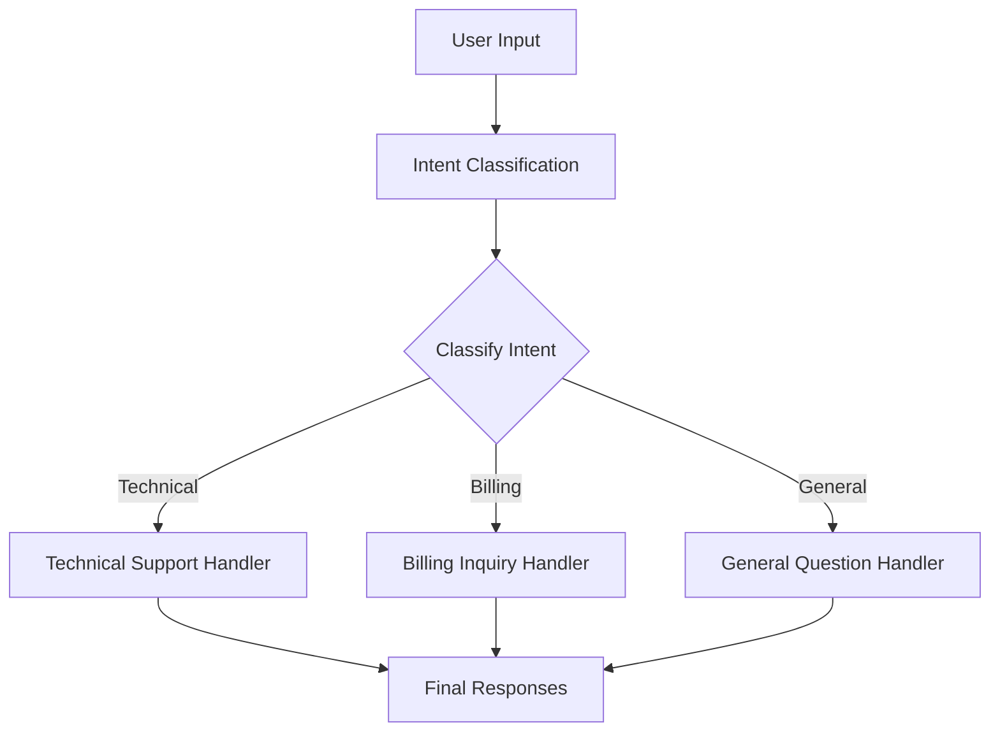
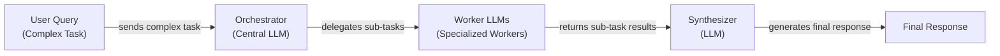

# Lesson 5: Basic Workflow Patterns

In the previous lessons, we laid the groundwork for AI Engineering. We explored the agent landscape, differentiated between rule-based LLM workflows and autonomous AI agents, managed information flow with context engineering, and ensured reliable data extraction using structured outputs. Now, it is time to assemble these foundational components into robust, multi-step systems.

In real-world applications, a single LLM call rarely solves a complex problem. You cannot just throw a 10-page document at a model and expect a perfect summary, analysis, and action plan in one go. This approach is brittle, hard to debug, and often produces unreliable results. To build production-grade AI, we need to think more like software engineers: break down large problems into smaller, manageable, and testable components.

This is where workflow patterns come in. They provide a structured way to orchestrate multiple LLM calls and other processing steps. In this lesson, we will explore the fundamental patterns that form the backbone of almost every sophisticated AI application:

*   **Sequential Chaining:** Decomposing a task into a linear sequence of steps.
*   **Parallelization:** Executing independent tasks concurrently to improve speed.
*   **Routing:** Using conditional logic to direct workflows down different paths.
*   **Orchestrator-Worker:** Dynamically breaking down complex queries into subtasks for specialized workers.

We will demonstrate these patterns with practical examples using the Google Gemini API, building a reliable FAQ generation pipeline and a dynamic customer support router from scratch. By the end, you will have the mental models and coding patterns to move beyond single prompts and start building scalable, maintainable AI workflows.

## The Challenge with Complex Single LLM Calls

Attempting to solve a multi-step problem with a single, complex prompt is a common pitfall. While it might seem efficient, this monolithic approach often leads to unreliable and hard-to-maintain systems. The core issue is that you are asking the LLM to juggle multiple distinct tasks—like understanding, extracting, reasoning, and formatting—all at once. This cognitive overload increases the likelihood of errors.

These are some of the common problems with single-call systems:

*   **Difficult Debugging:** When a monolithic prompt fails, it is hard to pinpoint the exact cause. Was it a misunderstanding of one instruction? A formatting error? A reasoning failure? Without clear intermediate steps, debugging becomes a frustrating process of trial and error.
*   **Lack of Modularity:** A single prompt is an all-or-nothing system. You cannot easily swap out or improve one part of the logic without rewriting the entire prompt, making the system brittle and difficult to iterate on.
*   **The "Lost in the Middle" Problem:** As we discussed in Lesson 3, LLMs struggle to pay equal attention to all parts of a long context. Important details buried in the middle of a complex prompt are often ignored, leading to incomplete or inaccurate outputs [[1]](https://dev.to/thousand_miles_ai/the-lost-in-the-middle-problem-why-llms-ignore-the-middle-of-your-context-window-3al2).
*   **Increased Token Consumption:** Large, all-encompassing prompts can be token-inefficient, as you bundle instructions and context for every possible sub-task, even those that are not relevant to a specific input.
*   **Lower Reliability:** Research and empirical evidence consistently show that as prompt complexity increases, the model's ability to follow all instructions degrades. Simpler, more focused prompts yield more predictable results, as prompts with less syntactic complexity help models retrieve information more consistently and minimize the risk of misinterpretation [[2]](https://www.mdpi.com/2079-9292/13/23/4712).

To see this in practice, let's build a simple FAQ generator. We will start by giving the LLM three mock webpages about renewable energy and asking it to generate questions, find answers, and cite sources, all in a single call.

1.  First, we set up our environment by initializing the Gemini client and defining our model. We will use `gemini-1.5-flash`, which is fast and cost-effective for these kinds of tasks. We also define our mock data.

    ```python
    import asyncio
    from enum import Enum
    import random
    import time
    
    from pydantic import BaseModel, Field
    from google import genai
    from google.genai import types
    
    from lessons.utils import env
    
    env.load(required_env_vars=["GOOGLE_API_KEY"])
    
    client = genai.Client()
    
    MODEL_ID = "gemini-1.5-flash"
    
    webpage_1 = {
        "title": "The Benefits of Solar Energy",
        "content": """
        Solar energy is a renewable powerhouse...
        """,
    }
    
    webpage_2 = {
        "title": "Understanding Wind Turbines",
        "content": """
        Wind turbines are towering structures...
        """,
    }
    
    webpage_3 = {
        "title": "Energy Storage Solutions",
        "content": """
        Effective energy storage is the key to unlocking...
        """,
    }
    
    all_sources = [webpage_1, webpage_2, webpage_3]
    
    combined_content = "\n\n".join(
        [f"Source Title: {source['title']}\nContent: {source['content']}" for source in all_sources]
    )
    ```

2.  Next, we define Pydantic models for our structured output, which we covered in Lesson 4. This helps ensure the LLM returns data in a predictable format.

    ```python
    class FAQ(BaseModel):
        """A FAQ is a question and answer pair, with a list of sources used to answer the question."""
        question: str = Field(description="The question to be answered")
        answer: str = Field(description="The answer to the question")
        sources: list[str] = Field(description="The sources used to answer the question")
    
    class FAQList(BaseModel):
        """A list of FAQs"""
        faqs: list[FAQ] = Field(description="A list of FAQs")
    ```

3.  Now, we write our complex, single-call prompt. It asks the model to perform three distinct tasks: generate questions, provide answers, and cite sources.

    ```python
    n_questions = 10
    prompt_complex = f"""
    Based on the provided content from three webpages, generate a list of exactly {n_questions} frequently asked questions (FAQs).
    For each question, provide a concise answer derived ONLY from the text.
    After each answer, you MUST include a list of the 'Source Title's that were used to formulate that answer.
    
    <provided_content>
    {combined_content}
    </provided_content>
    """.strip()
    
    config = types.GenerateContentConfig(
        response_mime_type="application/json",
        response_schema=FAQList
    )
    response_complex = client.models.generate_content(
        model=MODEL_ID,
        contents=prompt_complex,
        config=config
    )
    result_complex = response_complex.parsed
    ```

    It outputs:

    ```text
     {
        "question": "What is solar energy and how does it work?",
        "answer": "Solar energy is a renewable powerhouse that converts sunlight into electricity through photovoltaic (PV) panels.",
        "sources": [
          "The Benefits of Solar Energy"
        ]
      }
    ...
    ```

While this output looks reasonable, this approach is fragile. If we increased the number of questions or added more instructions, the model's performance would likely degrade. For instance, it might fail to cite sources correctly or generate answers that are not grounded in the provided text. This unreliability makes monolithic prompts a poor choice for production systems.

## The Power of Modularity: Why Chain LLM Calls?

A more robust approach is to break down complex tasks using a "divide and conquer" strategy. This is the core idea behind prompt chaining: connecting multiple LLM calls in a sequence, where the output of one step becomes the input for the next. This pattern is a direct application of the pipeline design pattern from software engineering, adapted for LLM workflows. You can think of it as an assembly line for AI, where you build complex results from simple, specialized steps [[3]](https://datalearningscience.com/p/design-pattern-prompt-chaining-building). This modular approach mirrors how humans solve complex problems—by tackling one small piece at a time.

Adopting a chained workflow provides several key advantages for building reliable AI systems [[4]](https://www.decodingai.com/p/stop-building-ai-agents-use-these):

*   **Improved Modularity:** Each LLM call is a self-contained component with a single responsibility. This makes the system easier to understand, maintain, and update. If you want to improve question generation, you only need to modify that specific prompt, without touching the answering or sourcing logic.
*   **Enhanced Accuracy:** Simpler, targeted prompts are less confusing for the LLM. By asking the model to focus on one specific sub-task at a time, you significantly increase the reliability and quality of its output. This structured approach guides the LLM through a chain of reasoning, leading to a more comprehensive answer than a single, broad prompt could provide [[5]](https://www.datacamp.com/tutorial/prompt-chaining-llm).
*   **Easier Debugging:** When a chained workflow fails, you can inspect the output of each step to pinpoint exactly where the error occurred. This clear traceability is invaluable for debugging and makes it much easier to fix issues compared to a single, opaque LLM call.
*   **Increased Flexibility:** A modular design allows you to swap components easily. You could, for example, use a fast, cost-effective model like Gemini Flash for a simple classification step, and a more powerful model like Gemini Pro for a complex reasoning step, optimizing for both cost and performance.

However, prompt chaining is not without its trade-offs. The most obvious are increased latency and cost, as you are making multiple API calls instead of one. Longer chains also introduce the risk of "context degradation," where important information from early steps is lost or distorted by the time it reaches the end of the chain [[6]](https://futureagi.substack.com/p/how-tool-chaining-fails-in-production), [[7]](https://wand.ai/blog/compounding-error-effect-in-large-language-models-a-growing-challenge). If one step produces a poor result, that error can propagate and compound through subsequent steps.

Despite these challenges, the benefits of control, reliability, and maintainability make prompt chaining a foundational pattern in AI engineering. It provides the structure needed to move from simple prototypes to production-ready applications.

## Building a Sequential Workflow: FAQ Generation Pipeline

Now, let's refactor our complex FAQ example into a robust sequential workflow. We will break the task into three distinct, chained steps:
1.  Generate a list of questions.
2.  For each question, generate an answer.
3.  For each question-answer pair, identify the sources.

This modular approach makes each step simpler and more reliable.

1.  First, we create a function dedicated solely to generating questions from the provided content. The prompt is focused and has a single objective. We use a Pydantic model, `QuestionList`, to ensure the output is a clean list of strings.

    ```python
    class QuestionList(BaseModel):
        """A list of questions"""
        questions: list[str] = Field(description="A list of questions")
    
    prompt_generate_questions = """
    Based on the content below, generate a list of {n_questions} relevant and distinct questions that a user might have.
    
    <provided_content>
    {combined_content}
    </provided_content>
    """.strip()
    
    def generate_questions(content: str, n_questions: int = 10) -> list[str]:
        """
        Generate a list of questions based on the provided content.
        """
        config = types.GenerateContentConfig(
            response_mime_type="application/json",
            response_schema=QuestionList
        )
        response_questions = client.models.generate_content(
            model=MODEL_ID,
            contents=prompt_generate_questions.format(n_questions=n_questions, combined_content=content),
            config=config
        )
    
        return response_questions.parsed.questions
    
    questions = generate_questions(combined_content, n_questions=10)
    ```

    It outputs:

    ```text
        What are the primary environmental and economic benefits of solar energy?
    ...
        Can excess solar power generated by homeowners be sold back to the grid?
    ```

2.  Next, we define a function to answer a single question. This prompt instructs the model to use *only* the provided content, which helps ground the answer and reduce hallucinations.

    ```python
    prompt_answer_question = """
    Using ONLY the provided content below, answer the following question.
    The answer should be concise and directly address the question.
    
    <question>
    {question}
    </question>
    
    <provided_content>
    {combined_content}
    </provided_content>
    """.strip()
    
    def answer_question(question: str, content: str) -> str:
        """
        Generate an answer for a specific question using only the provided content.
        """
        answer_response = client.models.generate_content(
            model=MODEL_ID,
            contents=prompt_answer_question.format(question=question, combined_content=content),
        )
        return answer_response.text
    
    test_question = questions[0]
    test_answer = answer_question(test_question, combined_content)
    ```

    It outputs:

    ```text
    The primary environmental benefit of solar energy is cutting down greenhouse gas emissions by reducing reliance on fossil fuels. Economically, it allows homeowners to significantly lower their monthly electricity bills and potentially sell excess power back to the grid.
    ```

3.  Finally, we create a function to identify the sources for a given question and answer. This separation ensures the sourcing logic is handled independently, making it more accurate and easier to verify.

    ```python
    class SourceList(BaseModel):
        """A list of source titles that were used to answer the question"""
        sources: list[str] = Field(description="A list of source titles that were used to answer the question")
    
    prompt_find_sources = """
    You will be given a question and an answer that was generated from a set of documents.
    Your task is to identify which of the original documents were used to create the answer.
    
    <question>
    {question}
    </question>
    
    <answer>
    {answer}
    </answer>
    
    <provided_content>
    {combined_content}
    </provided_content>
    """.strip()
    
    def find_sources(question: str, answer: str, content: str) -> list[str]:
        """
        Identify which sources were used to generate an answer.
        """
        config = types.GenerateContentConfig(
            response_mime_type="application/json",
            response_schema=SourceList
        )
        sources_response = client.models.generate_content(
            model=MODEL_ID,
            contents=prompt_find_sources.format(question=question, answer=answer, combined_content=content),
            config=config
        )
        return sources_response.parsed.sources
    
    test_sources = find_sources(test_question, test_answer, combined_content)
    ```

    It outputs:

    ```text
    ['The Benefits of Solar Energy']
    ```

This sequential pipeline is illustrated in the diagram below.

```mermaid
flowchart LR
  "Input Content" --> "Generate Questions"
  "Generate Questions" --> "Answer Questions"
  "Answer Questions" --> "Find Sources"
  "Find Sources" --> "Final FAQs"
```

Image 1: A flowchart illustrating the sequential FAQ generation pipeline.

Now, we can assemble these functions into a complete workflow. The `sequential_workflow` function orchestrates the chain: it first generates all questions, then iterates through them one by one to generate an answer and find the corresponding sources.

```python
def sequential_workflow(content, n_questions=10) -> list[FAQ]:
    """
    Execute the complete sequential workflow for FAQ generation.
    """
    # Generate questions
    questions = generate_questions(content, n_questions)

    # Answer and find sources for each question sequentially
    final_faqs = []
    for question in questions:
        # Generate an answer for the current question
        answer = answer_question(question, content)

        # Identify the sources for the generated answer
        sources = find_sources(question, answer, content)

        faq = FAQ(
            question=question,
            answer=answer,
            sources=sources
        )
        final_faqs.append(faq)

    return final_faqs

start_time = time.monotonic()
sequential_faqs = sequential_workflow(combined_content, n_questions=4)
end_time = time.monotonic()
print(f"Sequential processing completed in {end_time - start_time:.2f} seconds")
```

It outputs:

```text
Sequential processing completed in 22.20 seconds
...
 {
    "question": "What are the primary financial benefits of installing solar panels for homeowners, and are there any initial costs to consider?",
    "answer": "The primary financial benefits of installing solar panels for homeowners are significantly lowered monthly electricity bills and, in some cases, the ability to sell excess power back to the grid. The initial installation cost can be high.",
    "sources": [
      "The Benefits of Solar Energy"
    ]
  }
...
```

By breaking the problem down, we have created a workflow that is far more reliable and easier to debug. Each step has a clear purpose and a verifiable output. However, it took over 20 seconds to process just four questions. Since the processing for each question is independent of the others, we can do much better.

## Optimizing Sequential Workflows With Parallel Processing

While our sequential workflow is reliable, its performance is limited because it processes each question one at a time. The answering and sourcing steps for one question do not depend on the results of another. This independence is a perfect opportunity for optimization through parallelization. By executing these tasks concurrently, we can dramatically reduce the total processing time.

For I/O-bound operations like making API calls to an LLM, Python's `asyncio` library is the ideal tool. It allows us to manage thousands of concurrent tasks efficiently within a single thread, avoiding the overhead of traditional multi-threading. We will refactor our workflow to process all the question-answer-source chains in parallel.

1.  First, we create asynchronous versions of our `answer_question` and `find_sources` functions. The logic remains the same, but we use `await client.aio.models.generate_content` to make the API calls non-blocking.

    ```python
    async def answer_question_async(question: str, content: str) -> str:
        """
        Async version of answer_question function.
        """
        prompt = prompt_answer_question.format(question=question, combined_content=content)
        response = await client.aio.models.generate_content(
            model=MODEL_ID,
            contents=prompt
        )
        return response.text
    
    async def find_sources_async(question: str, answer: str, content:str) -> list[str]:
        """
        Async version of find_sources function.
        """
        prompt = prompt_find_sources.format(question=question, answer=answer, combined_content=content)
        config = types.GenerateContentConfig(
            response_mime_type="application/json",
            response_schema=SourceList
        )
        response = await client.aio.models.generate_content(
            model=MODEL_ID,
            contents=prompt,
            config=config
        )
        return response.parsed.sources
    ```

2.  Next, we create a wrapper function, `process_question_parallel`, that combines the answering and sourcing steps for a single question.

    ```python
    async def process_question_parallel(question: str, content: str) -> FAQ:
        """
        Process a single question by generating answer and finding sources in parallel.
        """
        answer = await answer_question_async(question, content)
        sources = await find_sources_async(question, answer, content)
        return FAQ(
            question=question,
            answer=answer,
            sources=sources
        )
    ```

3.  Finally, we update our main workflow function. After generating the initial list of questions (which remains a synchronous step), we create a list of asynchronous tasks—one for each question. `asyncio.gather` runs all these tasks concurrently and waits for them all to complete.

    ```python
    async def parallel_workflow(content: str, n_questions: int = 10) -> list[FAQ]:
        """
        Execute the complete parallel workflow for FAQ generation.
        """
        # Generate questions (this step remains synchronous)
        questions = generate_questions(content, n_questions)
    
        # Process all questions in parallel
        tasks = [process_question_parallel(question, content) for question in questions]
        parallel_faqs = await asyncio.gather(*tasks)
    
        return parallel_faqs
    
    start_time = time.monotonic()
    parallel_faqs = await parallel_workflow(combined_content, n_questions=4)
    end_time = time.monotonic()
    print(f"Parallel processing completed in {end_time - start_time:.2f} seconds")
    ```

    It outputs:

    ```text
    Parallel processing completed in 8.98 seconds
    ...
     {
        "question": "What are the primary environmental and economic benefits of using solar energy?",
        "answer": "The primary environmental benefit of solar energy is cutting down greenhouse gas emissions by reducing reliance on fossil fuels.\n\nThe primary economic benefits include significantly lower monthly electricity bills, the ability to sell excess power back to the grid, long-term savings, and contributing to energy independence for nations.",
        "sources": [
          "The Benefits of Solar Energy"
        ]
      }
    ...
    ```

By running the tasks in parallel, we reduced the execution time from 22.20 seconds to just 8.98 seconds—a more than 2x speedup. This highlights the key trade-off between sequential and parallel processing [[8]](https://deepchecks.com/orchestrating-multi-step-llm-chains-best-practices/), [[9]](https://mlpills.substack.com/p/issue-110-llm-workflow-patterns/):

*   **Sequential Processing:** Offers a predictable execution order and is easier to debug, but at the cost of higher latency.
*   **Parallel Processing:** Provides a significant reduction in processing time by leveraging better resource utilization, but can be more complex to implement and debug.

<aside>
💡

A critical consideration for parallel workflows is API rate limiting. When you send many requests concurrently, you are more likely to hit the provider's rate limits (e.g., requests per minute). Production systems must implement robust error handling, such as exponential backoff with jitter, to manage these limits gracefully [[10]](https://tianpan.co/blog/2026-03-11-llm-api-resilience-production).

</aside>

## Introducing Dynamic Behavior: Routing and Conditional Logic

So far, our workflows have been deterministic: every input follows the same pre-defined path, whether sequential or parallel. However, many real-world applications require dynamic behavior. We need a way to change the workflow's path based on the content of the input. This is where routing comes in.

Routing uses conditional logic to direct an input to a specialized processing path. In AI workflows, we can use an LLM itself to act as a classifier, analyzing the input and deciding which branch to take. This allows us to maintain the "divide and conquer" principle by keeping our prompts highly specialized for different types of tasks, rather than creating a single, monolithic prompt that tries to handle every possible case.

For example, in a customer support system, a query about a billing error requires a very different response and set of actions than a technical question about a product. Instead of a single prompt trying to handle both, a router can first classify the user's intent ("Billing Inquiry" or "Technical Support") and then pass the query to a specialized handler. This ensures the user receives a more relevant and effective response. This pattern is essential for building adaptable and intelligent systems [[4]](https://www.decodingai.com/p/stop-building-ai-agents-use-these), [[11]](https://www.emergentmind.com/topics/llm-based-prompt-routing).

## Building a Basic Routing Workflow

Let's build a simple routing system for a customer service chatbot. The goal is to classify an incoming user query into one of three categories—Technical Support, Billing Inquiry, or General Question—and then route it to a specialized handler prompt.

This workflow is illustrated in the diagram below.



Image 2: A flowchart illustrating a basic routing workflow for customer service.

1.  First, we define the possible intents using a Python `Enum` and a Pydantic model to structure the classifier's output. This ensures the classification result is always one of our predefined categories.

    ```python
    class IntentEnum(str, Enum):
        TECHNICAL_SUPPORT = "Technical Support"
        BILLING_INQUIRY = "Billing Inquiry"
        GENERAL_QUESTION = "General Question"
    
    class UserIntent(BaseModel):
        intent: IntentEnum = Field(description="The intent of the user's query")
    ```

2.  Next, we create the `classify_intent` function. It takes a user query and uses the LLM to categorize it according to our defined intents.

    ```python
    prompt_classification = """
    Classify the user's query into one of the following categories.
    
    <categories>
    {categories}
    </categories>
    
    <user_query>
    {user_query}
    </user_query>
    """.strip()
    
    
    def classify_intent(user_query: str) -> IntentEnum:
        """Uses an LLM to classify a user query."""
        prompt = prompt_classification.format(
            user_query=user_query,
            categories=[intent.value for intent in IntentEnum]
        )
        config = types.GenerateContentConfig(
            response_mime_type="application/json",
            response_schema=UserIntent
        )
        response = client.models.generate_content(
            model=MODEL_ID,
            contents=prompt,
            config=config
        )
        return response.parsed.intent
    
    query_1 = "My internet connection is not working."
    intent_1 = classify_intent(query_1)
    ```

    It outputs:

    ```text
    IntentEnum.TECHNICAL_SUPPORT
    ```

3.  Now, we define three specialized handler prompts. Each prompt is tailored to a specific intent, providing a much more focused and helpful response than a single generic prompt could.

    ```python
    prompt_technical_support = """
    You are a helpful technical support agent.
    
    Here's the user's query:
    <user_query>
    {user_query}
    </user_query>
    
    Provide a helpful first response, asking for more details like what troubleshooting steps they have already tried.
    """.strip()
    
    prompt_billing_inquiry = """
    You are a helpful billing support agent.
    
    Here's the user's query:
    <user_query>
    {user_query}
    </user_query>
    
    Acknowledge their concern and inform them that you will need to look up their account, asking for their account number.
    """.strip()
    
    prompt_general_question = """
    You are a general assistant.
    
    Here's the user's query:
    <user_query>
    {user_query}
    </user_query>
    
    Apologize that you are not sure how to help.
    """.strip()
    ```

4.  Finally, the `handle_query` function acts as our router. It takes the user query and the classified intent, and uses a simple `if/elif/else` block to select the correct handler prompt.

    ```python
    def handle_query(user_query: str, intent: str) -> str:
        """Routes a query to the correct handler based on its classified intent."""
        if intent == IntentEnum.TECHNICAL_SUPPORT:
            prompt = prompt_technical_support.format(user_query=user_query)
        elif intent == IntentEnum.BILLING_INQUIRY:
            prompt = prompt_billing_inquiry.format(user_query=user_query)
        else: # Also handles GENERAL_QUESTION
            prompt = prompt_general_question.format(user_query=user_query)
        
        response = client.models.generate_content(
            model=MODEL_ID,
            contents=prompt
        )
        return response.text
    
    response_1 = handle_query(query_1, intent_1)
    ```

    It outputs:

    ```text
    Hello there! I'm sorry to hear you're having trouble with your internet connection. To help me assist you, could you please tell me what troubleshooting steps you've already tried?
    ```

This simple routing workflow demonstrates how to add dynamic behavior to your AI applications. However, in a production system, this `if/elif/else` structure would need more robust error handling. A common practice is to use the classifier's confidence score. If confidence is below a set threshold, the workflow can trigger a fallback, like asking for clarification or routing to a human agent, to prevent cascading errors and improve reliability [[12]](https://medium.com/@mr.murga/enhancing-intent-classification-and-error-handling-in-agentic-llm-applications-df2917d0a3cc).

## Orchestrator-Worker Pattern: Dynamic Task Decomposition

Routing is effective when you have a set of pre-defined paths. But what happens when the sub-tasks themselves are unpredictable and need to be determined at runtime? For these complex scenarios, we need a more flexible pattern: the **orchestrator-worker**.

In this pattern, a central "orchestrator" LLM analyzes a high-level goal and dynamically breaks it down into a series of smaller, executable sub-tasks. It then delegates each sub-task to a specialized "worker," which could be another LLM call or a traditional software tool. Finally, a "synthesizer" component gathers the results from all the workers and assembles them into a coherent final response [[13]](https://agents.kour.me/orchestrator-worker/), [[14]](https://mlpills.substack.com/p/diy-17-orchestrator-worker-llm-agent).

The key advantage of this pattern is its dynamic nature. Unlike static parallelization where the tasks are fixed, the orchestrator determines the plan on the fly. This is critical for real-world tasks that demand complex planning. For instance, on a recent agent benchmark, even GPT-4 had a success rate of only 14% while humans exceeded 92%, highlighting the challenge of monolithic approaches [[15]](https://www.sciencedirect.com/science/article/abs/pii/S0893608025000796). This makes it incredibly powerful for handling complex, multifaceted queries where the necessary steps cannot be known in advance [[14]](https://mlpills.substack.com/p/diy-17-orchestrator-worker-llm-agent), [[16]](https://platform.claude.com/cookbook/patterns-agents-orchestrator-workers).

However, this pattern is not a free lunch. Task decomposition introduces additional components, which increases system complexity and can add latency. Care must be taken to avoid over-engineering the workflow, which can sacrifice the contextual richness that LLMs provide when they have the complete context [[17]](https://www.amazon.science/blog/how-task-decomposition-and-smaller-llms-can-make-ai-more-affordable).



Image 3: A flowchart illustrating the orchestrator-worker pattern.

Let's implement this pattern to handle a complex customer service query that involves a billing issue, a product return, and an order status request all in one message.

1.  First, we define the **Orchestrator**. Its job is to parse the user's query and break it down into a structured list of tasks. We use Pydantic models to define the exact format for each task, ensuring the orchestrator's output is machine-readable.

    ```python
    class QueryTypeEnum(str, Enum):
        BILLING_INQUIRY = "BillingInquiry"
        PRODUCT_RETURN = "ProductReturn"
        STATUS_UPDATE = "StatusUpdate"
    
    class Task(BaseModel):
        query_type: QueryTypeEnum
        invoice_number: str | None = None
        product_name: str | None = None
        reason_for_return: str | None = None
        order_id: str | None = None
    
    class TaskList(BaseModel):
        tasks: list[Task]
    
    prompt_orchestrator = f"""
    You are a master orchestrator. Your job is to break down a complex user query into a list of sub-tasks.
    Each sub-task must have a "query_type" and its necessary parameters.
    
    The possible "query_type" values and their required parameters are:
    1. "{QueryTypeEnum.BILLING_INQUIRY.value}": Requires "invoice_number".
    2. "{QueryTypeEnum.PRODUCT_RETURN.value}": Requires "product_name" and "reason_for_return".
    3. "{QueryTypeEnum.STATUS_UPDATE.value}": Requires "order_id".
    
    <user_query>
    {{query}}
    </user_query>
    """.strip()
    
    def orchestrator(query: str) -> list[Task]:
        """Breaks down a complex query into a list of tasks."""
        prompt = prompt_orchestrator.format(query=query)
        config = types.GenerateContentConfig(
            response_mime_type="application/json",
            response_schema=TaskList
        )
        response = client.models.generate_content(
            model=MODEL_ID,
            contents=prompt,
            config=config
        )
        return response.parsed.tasks
    ```

2.  Next, we implement our specialized **Workers**. Each worker is a function designed to handle one specific task type. In a real application, these workers would interact with backend systems, databases, or external APIs. Here, we simulate those actions. For example, the `handle_billing_worker` simulates opening an investigation and returns a structured Pydantic object with the results.

    ```python
    # Billing Worker
    def handle_billing_worker(invoice_number: str, original_user_query: str) -> BillingTask:
        # ... (implementation simulates opening an investigation)
    
    # Product Return Worker
    def handle_return_worker(product_name: str, reason_for_return: str) -> ReturnTask:
        # ... (implementation simulates generating an RMA number)
    
    # Order Status Worker
    def handle_status_worker(order_id: str) -> StatusTask:
        # ... (implementation simulates fetching order status)
    ```

3.  The **Synthesizer** is another LLM call responsible for taking the structured outputs from all the workers and composing a single, user-friendly response.

    ```python
    prompt_synthesizer = """
    You are a master communicator. Combine several distinct pieces of information from our support team into a single, well-formatted, and friendly email to a customer.
    
    <points>
    {formatted_results}
    </points>
    
    Combine these points into one cohesive response.
    """.strip()
    
    def synthesizer(results: list[BaseModel]) -> str:
        # ... (implementation formats worker results and calls the LLM)
    ```

4.  Finally, we create the main pipeline function, `process_user_query`, that orchestrates the entire flow. It calls the orchestrator, dispatches tasks to the appropriate workers, and then uses the synthesizer to generate the final response.

    ```python
    def process_user_query(user_query):
        """Processes a query using the Orchestrator-Worker-Synthesizer pattern."""
    
        # 1. Run orchestrator
        tasks_list = orchestrator(user_query)
    
        # 2. Run workers
        worker_results = []
        for task in tasks_list:
            if task.query_type == QueryTypeEnum.BILLING_INQUIRY:
                worker_results.append(handle_billing_worker(task.invoice_number, user_query))
            elif task.query_type == QueryTypeEnum.PRODUCT_RETURN:
                worker_results.append(handle_return_worker(task.product_name, task.reason_for_return))
            elif task.query_type == QueryTypeEnum.STATUS_UPDATE:
                worker_results.append(handle_status_worker(task.order_id))
    
        # 3. Run synthesizer
        final_user_message = synthesizer(worker_results)
    ```

Let's test it with our complex query:

```python
complex_customer_query = """
Hi, I'm writing to you because I have a question about invoice #INV-7890. It seems higher than I expected.
Also, I would like to return the 'SuperWidget 5000' I bought because it's not compatible with my system.
Finally, can you give me an update on my order #A-12345?
""".strip()

process_user_query(complex_customer_query)
```

The output shows the entire process:

```text
Deconstructed task 1:
{
  "query_type": "BillingInquiry",
  "invoice_number": "INV-7890",
  ...
}
... and so on for the other 2 tasks.

Worker result 1:
{
  "query_type": "BillingInquiry",
  "invoice_number": "INV-7890",
  "user_concern": "The invoice seems higher than expected.",
  "action_taken": "An investigation (Case ID: INV_CASE_5681) has been opened...",
  "resolution_eta": "2 business days"
}
... and so on for the other 2 results.

Final synthesized response:
Dear Customer,

Thank you for reaching out. Here is an update on your requests:

- Regarding your billing inquiry for invoice #INV-7890, we have opened an investigation (Case ID: INV_CASE_5681) and will get back to you within 2 business days.

- For your return of 'SuperWidget 5000', your Return Authorization is RMA-51833. Please follow the instructions to pack and ship the item.

- Your order #A-12345 was delivered yesterday by Local Courier (Tracking: LC58963).

If you have any further questions, please don't hesitate to ask.

Best regards,
Your Support Team
```

This pattern demonstrates a sophisticated way to handle complex user requests. In a production environment, this can be implemented using a robust, event-driven architecture. Instead of direct function calls, the orchestrator can publish task events to a data streaming platform like Apache Kafka. Workers act as independent consumers that pull tasks from a queue. This decouples the components, enabling automatic scaling, fault tolerance, and resilient processing [[18]](https://www.confluent.io/blog/event-driven-multi-agent-systems/).

## Conclusion

We have journeyed from the pitfalls of single, monolithic prompts to the power of modular, multi-step workflows. By breaking down complex problems, we gain reliability, debuggability, and control. We started with **sequential chaining**, turning a brittle FAQ generation task into a predictable pipeline. Then, we supercharged it with **parallelization**, drastically cutting down latency by processing independent tasks concurrently.

We then introduced dynamic behavior with **routing**, using an LLM to classify user intent and direct requests to specialized handlers. Finally, we explored the **orchestrator-worker** pattern, a flexible approach for dynamically decomposing complex queries into sub-tasks at runtime. These patterns are not just theoretical concepts; they are the fundamental building blocks you will use to construct nearly any production-grade AI application.

In our next lesson, we will take a major step forward on the path to building true AI agents. We will equip our workflows with the ability to interact with the outside world by giving them **tools and function calling** capabilities. This is where our systems will learn to not just process information, but to take action.

## References

- [1]  https://dev.to/thousand_miles_ai/the-lost-in-the-middle-problem-why-llms-ignore-the-middle-of-your-context-window-3al2
- [2]  https://www.mdpi.com/2079-9292/13/23/4712
- [3]  https://datalearningscience.com/p/design-pattern-prompt-chaining-building
- [4]  https://www.decodingai.com/p/stop-building-ai-agents-use-these
- [5]  https://www.datacamp.com/tutorial/prompt-chaining-llm
- [6]  https://futureagi.substack.com/p/how-tool-chaining-fails-in-production
- [7]  https://wand.ai/blog/compounding-error-effect-in-large-language-models-a-growing-challenge
- [8]  https://deepchecks.com/orchestrating-multi-step-llm-chains-best-practices/
- [9]  https://mlpills.substack.com/p/issue-110-llm-workflow-patterns/
- [10]  https://tianpan.co/blog/2026-03-11-llm-api-resilience-production
- [11]  https://www.emergentmind.com/topics/llm-based-prompt-routing
- [12]  https://medium.com/@mr.murga/enhancing-intent-classification-and-error-handling-in-agentic-llm-applications-df2917d0a3cc
- [13]  https://agents.kour.me/orchestrator-worker/
- [14]  https://mlpills.substack.com/p/diy-17-orchestrator-worker-llm-agent
- [15]  https://www.sciencedirect.com/science/article/abs/pii/S0893608025000796
- [16]  https://platform.claude.com/cookbook/patterns-agents-orchestrator-workers
- [17]  https://www.amazon.science/blog/how-task-decomposition-and-smaller-llms-can-make-ai-more-affordable
- [18]  https://www.confluent.io/blog/event-driven-multi-agent-systems/
- [Basic Multi-LLM Workflows](https://github.com/hugobowne/building-with-ai/blob/main/notebooks/01-agentic-continuum.ipynb)
- [Building Effective Agents - Anthropic](https://www.anthropic.com/engineering/building-effective-agents)
- [Chain Prompts - Anthropic](https://docs.anthropic.com/en/docs/build-with-claude/prompt-engineering/chain-prompts)
- [Claude 4 Best Practices](https://docs.anthropic.com/en/docs/build-with-claude/prompt-engineering/claude-4-best-practices)
- [LangGraph Workflows](https://langchain-ai.github.io/langgraphjs/tutorials/workflows)
- [Notebook code for the lesson](https://github.com/towardsai/course-ai-agents/blob/dev/lessons/05_workflow_patterns/notebook.ipynb)
- [Prompt Chaining Guide](https://www.promptingguide.ai/techniques/prompt_chaining)