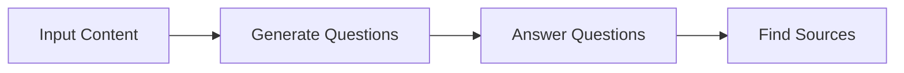
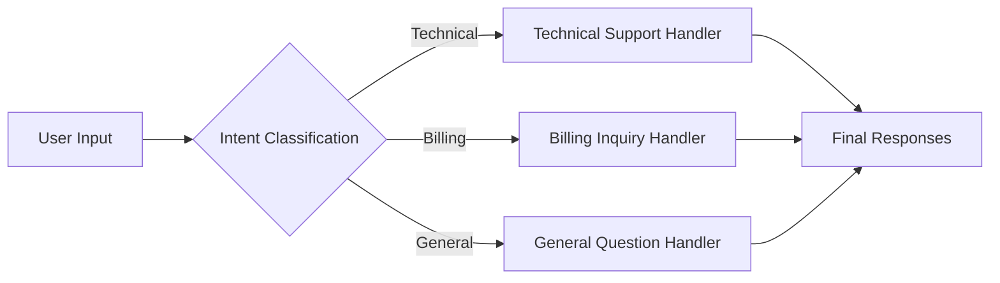
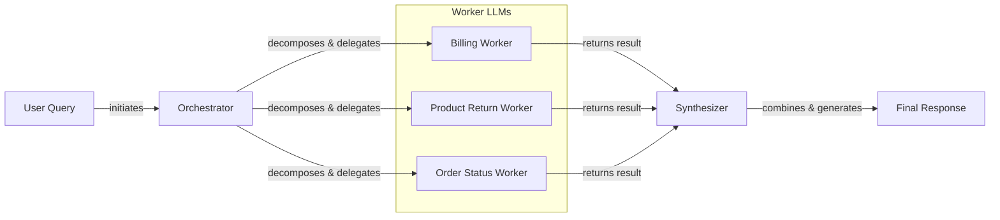

# Lesson 5: The Building Blocks of LLM Workflows

In our previous lessons, we laid the groundwork for AI Engineering. We explored the agent landscape, differentiated between rule-based LLM workflows and autonomous AI agents, and covered context engineering and structured outputs. These concepts taught us how to manage the flow of information *into* an LLM and get reliable data *out* of it. Now, it is time to connect these individual calls into something more powerful.

You are moving from single, isolated LLM calls to building multi-step, intelligent systems. In this lesson, we will explore the fundamental patterns for creating these systems: chaining, parallelization, routing, and the orchestrator-worker model. These are the building blocks that allow you to solve complex problems that a single prompt, no matter how well-crafted, simply cannot handle.

We will show you why breaking down tasks is more effective than relying on monolithic prompts. We will build a sequential workflow for generating FAQs, optimize it with parallel processing, and then implement a dynamic routing system for a customer service scenario, all using the Google Gemini library. By the end, you will have the foundational skills to construct sophisticated and reliable LLM applications.

## The Challenge with Complex Single LLM Calls

When you first start building with LLMs, the temptation is to solve everything with a single, complex prompt. You try to cram every instruction, every piece of context, and every output requirement into one massive call. We have been there. On an early project, we assumed a model with a huge context window could handle anything we threw at it. The result was a slow, expensive, and unreliable system.

This monolithic approach fails for several important reasons. First, it creates a black box. When the output is wrong, it is nearly impossible to debug. You do not know which part of the instruction the model failed to follow, leading to frustrating and time-consuming trial-and-error. This lack of transparency is a major barrier to building production-grade systems, where identifying and fixing errors quickly is essential. One study on GPT-4 Turbo found that few-shot prompts, which include multiple examples in a single call, had a 52.9% error rate, with over 70% of those errors being simple parsing failures. In contrast, simpler zero-shot prompts had an error rate of only 1.4% [[3]](https://aclanthology.org/2025.ommm-1.4.pdf).

Second, it is not modular. If you need to update one part of the logic, you have to rewrite and re-test the entire prompt. This is inefficient and highly error-prone. A small change intended to improve one aspect of the output can have unintended negative consequences on another. This tight coupling makes the system brittle and difficult to maintain over time.

Furthermore, complex prompts are highly susceptible to the "lost-in-the-middle" problem. Research from Stanford and UC Berkeley has shown that LLMs exhibit a U-shaped accuracy curve when processing long contexts [[2]](https://dev.to/thousand_miles_ai/the-lost-in-the-middle-problem-why-llms-ignore-the-middle-of-your-context-window-3al2). They recall information from the beginning and end of a prompt much more effectively than from the middle. This architectural bias stems from two main factors: causal attention masking, which gives more cumulative weight to earlier tokens, and positional encoding decay, which weakens attention to distant tokens [[6]](https://openreview.net/forum?id=YufVk7I6Ii). The middle of the context becomes a "dead zone" where critical details can be overlooked.

Finally, empirical studies consistently show that as prompt complexity increases, error rates rise. A single, all-encompassing prompt often leads to higher token consumption and less reliable outputs, as the model struggles to juggle multiple distinct tasks at once. Studies have shown that accuracy can drop significantly as the number of requirements in a single prompt increases, and that even minor changes to output formatting can cause performance to plummet [[1]](https://www.mdpi.com/2079-9292/13/23/4712), [[4]](https://aclanthology.org/2025.gem-1.14.pdf), [[5]](https://arxiv.org/html/2505.13360v1).

Let's look at a practical example.

1.  First, we set up our environment by initializing the Gemini client and defining the model we will use. We will use `gemini-1.5-flash`, which is fast and cost-effective for these examples.
    ```python
    import asyncio
    from enum import Enum
    import random
    import time
    
    from pydantic import BaseModel, Field
    from google import genai
    from google.genai import types
    
    from lessons.utils import env, pretty_print
    
    env.load(required_env_vars=["GOOGLE_API_KEY"])
    
    client = genai.Client()
    
    MODEL_ID = "gemini-1.5-flash"
    ```

2.  Next, we will create three mock webpages about renewable energy that will serve as our source content for generating a FAQ.
    ```python
    webpage_1 = {
        "title": "The Benefits of Solar Energy",
        "content": """
        Solar energy is a renewable powerhouse...
        """,
    }
    
    webpage_2 = {
        "title": "Understanding Wind Turbines",
        "content": """
        Wind turbines are towering structures...
        """,
    }
    
    webpage_3 = {
        "title": "Energy Storage Solutions",
        "content": """
        Effective energy storage is the key...
        """,
    }
    
    all_sources = [webpage_1, webpage_2, webpage_3]
    
    combined_content = "\n\n".join(
        [f"Source Title: {source['title']}\nContent: {source['content']}" for source in all_sources]
    )
    ```

3.  Now, we will try to generate questions, find answers, and cite sources all in a single, complex prompt. We will use Pydantic models, which we learned about in Lesson 4, to structure the output.
    ```python
    class FAQ(BaseModel):
        """A FAQ is a question and answer pair, with a list of sources used to answer the question."""
        question: str = Field(description="The question to be answered")
        answer: str = Field(description="The answer to the question")
        sources: list[str] = Field(description="The sources used to answer the question")
    
    class FAQList(BaseModel):
        """A list of FAQs"""
        faqs: list[FAQ] = Field(description="A list of FAQs")
    
    n_questions = 10
    prompt_complex = f"""
    Based on the provided content from three webpages, generate a list of exactly {n_questions} frequently asked questions (FAQs).
    For each question, provide a concise answer derived ONLY from the text.
    After each answer, you MUST include a list of the 'Source Title's that were used to formulate that answer.
    
    <provided_content>
    {combined_content}
    </provided_content>
    """.strip()
    
    config = types.GenerateContentConfig(
        response_mime_type="application/json",
        response_schema=FAQList
    )
    response_complex = client.models.generate_content(
        model=MODEL_ID,
        contents=prompt_complex,
        config=config
    )
    result_complex = response_complex.parsed
    ```
    It outputs:
    ```json
    {
      "question": "Why is energy storage crucial for renewable energy sources like solar and wind?",
      "answer": "Effective energy storage is key to unlocking the full potential of renewable sources because it allows storing excess energy when plentiful and releasing it when needed, which is crucial for a stable power grid.",
      "sources": [
        "Energy Storage Solutions"
      ]
    }
    ```

While this output looks acceptable, it hides a subtle inaccuracy. The answer mentions both solar and wind, but the model only cited "Energy Storage Solutions." A more accurate answer would also cite "Understanding Wind Turbines," which explicitly mentions the need for storage solutions due to wind's intermittency. With more complex instructions, these small errors compound, leading to unreliable systems. This is why we need a more modular approach.

## The Power of Modularity: Why Chain LLM Calls?

The solution to the problems of monolithic prompts is modularity. Instead of asking an LLM to do everything at once, we break down the complex task into a series of smaller, simpler sub-tasks. This is the core idea behind prompt chaining: connecting multiple LLM calls sequentially, where the output of one step becomes the input for the next [[7]](https://www.promptingguide.ai/techniques/prompt_chaining). It is a classic "divide and conquer" strategy applied to AI engineering, mirroring established software architecture patterns like Pipes and Filters, where components with single responsibilities are chained together to process data [[8]](https://aws.amazon.com/blogs/compute/application-integration-patterns-for-microservices-orchestration-and-coordination/).

This approach is also conceptually similar to Business Process Management (BPM), a field dedicated to modeling, analyzing, and optimizing end-to-end business operations. Just as BPM deconstructs complex business operations into a sequence of well-defined tasks and decision points, prompt chaining deconstructs a complex cognitive task for an LLM [[9]](https://thescipub.com/abstract/jcssp.2025.1921.1932).

This modular approach offers several powerful benefits [[10]](https://www.decodingai.com/p/stop-building-ai-agents-use-these), [[11]](https://docs.anthropic.com/en/docs/build-with-claude/prompt-engineering/chain-prompts):

-   **Improved Modularity:** Each LLM call focuses on a single, well-defined task. This separation of concerns makes the system easier to understand, maintain, and update.
-   **Enhanced Accuracy:** Simpler, more targeted prompts reduce the cognitive load on the model, leading to more accurate and reliable outputs for each step [[1]](https://www.mdpi.com/2079-9292/13/23/4712).
-   **Easier Debugging:** When something goes wrong, you can isolate the problem to a specific link in the chain. This makes debugging exponentially easier than trying to troubleshoot a single, massive prompt.
-   **Increased Flexibility:** You can swap, update, or optimize individual components of the chain without affecting the others. For example, you could use a fast, cheap model for a simple classification step and a more powerful, expensive model for a complex generation step, a practice known as specialization [[12]](https://vrungta.substack.com/p/llm-chaining-a-pragmatic-decision).

However, chaining is not without its trade-offs. It can increase latency, as you are making multiple sequential API calls. It can also be more expensive due to the increased number of calls and total token usage. There is also a risk of information loss or context degradation between steps; an error in an early step can propagate and compound throughout the chain, a phenomenon known as a cascading failure [[13]](https://futureagi.substack.com/p/how-tool-chaining-fails-in-production), [[14]](https://wand.ai/blog/compounding-error-effect-in-large-language-models-a-growing-challenge). We will explore strategies to mitigate this, like using structured state objects, in future lessons on memory.

Despite these drawbacks, the gains in reliability, maintainability, and control make chaining a foundational pattern for building production-grade AI systems.

## Building a Sequential Workflow: FAQ Generation Pipeline

Let's put theory into practice by refactoring our FAQ generation task into a three-step sequential workflow. This modular design is a common pattern seen in production systems, from generating enterprise research reports to automating content creation pipelines [[15]](https://www.zenml.io/blog/llmops-in-production-457-case-studies-of-what-actually-works). The sequence will be:

1.  **Generate Questions:** The first LLM call will read the source content and generate a list of relevant questions.
2.  **Answer Questions:** For each question, a second LLM call will generate a concise answer based on the content.
3.  **Find Sources:** For each question-answer pair, a third LLM call will identify the original source titles.

Image 1: A flowchart illustrating the sequential FAQ generation pipeline.


This approach ensures each step is focused and produces a clean, verifiable output for the next. By breaking down the task, we gain better control and can debug each part of the process independently. This is an essential practice for building reliable systems.

1.  First, we create a function to generate a list of questions. The prompt is simple and focused: it just asks for a specified number of questions based on the provided content. We use a Pydantic model, `QuestionList`, to ensure the output is a well-formed list of strings. This enforces the contract between the LLM and our code, a concept we covered in Lesson 4.
    ```python
    class QuestionList(BaseModel):
        """A list of questions"""
        questions: list[str] = Field(description="A list of questions")
    
    prompt_generate_questions = """
    Based on the content below, generate a list of {n_questions} relevant and distinct questions that a user might have.
    
    <provided_content>
    {combined_content}
    </provided_content>
    """.strip()
    
    def generate_questions(content: str, n_questions: int = 10) -> list[str]:
        """
        Generate a list of questions based on the provided content.
        """
        config = types.GenerateContentConfig(
            response_mime_type="application/json",
            response_schema=QuestionList
        )
        response_questions = client.models.generate_content(
            model=MODEL_ID,
            contents=prompt_generate_questions.format(n_questions=n_questions, combined_content=content),
            config=config
        )
        return response_questions.parsed.questions
    ```
    Testing this function gives us a clean list of questions to work with. This list will be the input for the next stage of our pipeline, demonstrating the "chaining" of outputs to inputs.
    ```python
    questions = generate_questions(combined_content, n_questions=10)
    ```
    It outputs:
    ```text
    What are the primary environmental and economic benefits of solar energy?
    How do homeowners financially benefit from installing solar panels?
    ...
    ```

2.  Next, we define a function to answer a single question. This prompt instructs the model to use *only* the provided content, which helps ground the answer and reduce the risk of hallucinations. The instruction for a concise answer helps keep the output focused and relevant, preventing the model from adding unnecessary information.
    ```python
    prompt_answer_question = """
    Using ONLY the provided content below, answer the following question.
    The answer should be concise and directly address the question.
    
    <question>
    {question}
    </question>
    
    <provided_content>
    {combined_content}
    </provided_content>
    """.strip()
    
    def answer_question(question: str, content: str) -> str:
        """
        Generate an answer for a specific question using only the provided content.
        """
        answer_response = client.models.generate_content(
            model=MODEL_ID,
            contents=prompt_answer_question.format(question=question, combined_content=content),
        )
        return answer_response.text
    ```

3.  Our final step is a function to identify the sources for a given question and answer. This "auditing" step is important for building trust and transparency into our system. It allows us to verify where the information for each answer came from, which is a key requirement for many enterprise applications.
    ```python
    class SourceList(BaseModel):
        """A list of source titles that were used to answer the question"""
        sources: list[str] = Field(description="A list of source titles that were used to answer the question")
    
    prompt_find_sources = """
    You will be given a question and an answer that was generated from a set of documents.
    Your task is to identify which of the original documents were used to create the answer.
    
    <question>
    {question}
    </question>
    
    <answer>
    {answer}
    </answer>
    
    <provided_content>
    {combined_content}
    </provided_content>
    """.strip()
    
    def find_sources(question: str, answer: str, content: str) -> list[str]:
        """
        Identify which sources were used to generate an answer.
        """
        config = types.GenerateContentConfig(
            response_mime_type="application/json",
            response_schema=SourceList
        )
        sources_response = client.models.generate_content(
            model=MODEL_ID,
            contents=prompt_find_sources.format(question=question, answer=answer, combined_content=content),
            config=config
        )
        return sources_response.parsed.sources
    ```

4.  Now, we assemble these functions into our complete sequential workflow. The `sequential_workflow` function orchestrates the entire process: it calls `generate_questions` once, then iterates through the list of questions, calling `answer_question` and `find_sources` for each one. This step-by-step execution allows for clear visibility into the process and makes it easy to inspect intermediate results.
    ```python
    def sequential_workflow(content, n_questions=10) -> list[FAQ]:
        """
        Execute the complete sequential workflow for FAQ generation.
        """
        questions = generate_questions(content, n_questions)
        final_faqs = []
        for question in questions:
            answer = answer_question(question, content)
            sources = find_sources(question, answer, content)
            faq = FAQ(question=question, answer=answer, sources=sources)
            final_faqs.append(faq)
        return final_faqs
    
    start_time = time.monotonic()
    sequential_faqs = sequential_workflow(combined_content, n_questions=4)
    end_time = time.monotonic()
    print(f"Sequential processing completed in {end_time - start_time:.2f} seconds")
    ```
    It outputs:
    ```text
    Sequential processing completed in 22.20 seconds
    ```
    The final output is a structured list of `FAQ` objects, each with a question, a grounded answer, and accurate source citations. For example, for the question about energy storage, the model now correctly identifies both "Understanding Wind Turbines" and "Energy Storage Solutions" as sources. By breaking the problem down, we have built a more reliable and debuggable system. However, as you can see from the execution time, it is not very fast.

## Optimizing Sequential Workflows With Parallel Processing

The sequential workflow is reliable, but its main drawback is latency. Each step runs one after another, so the total time is the sum of all individual LLM calls. For our 4-question example, this took over 20 seconds. This is too slow for many real-time applications.

We can speed this up with parallelization. The key insight is that once we have the list of questions, the process of answering each question and finding its sources is independent of the others. We can execute these tasks concurrently [[11]](https://docs.anthropic.com/en/docs/build-with-claude/prompt-engineering/chain-prompts). This pattern is particularly effective for I/O-bound operations like API calls, where the program would otherwise spend a lot of time waiting for network responses. For tasks like LLM calls, which are network-bound, `asyncio` is generally more efficient than threading because it avoids the overhead of managing operating system threads [[16]](https://santhalakshminarayana.github.io/blog/concurrency-patterns-python), [[17]](https://medium.com/@sizanmahmud08/python-concurrency-showdown-asyncio-vs-threading-vs-multiprocessing-which-should-you-choose-in-31205161899a).

We will use Python's `asyncio` library to run these independent sub-tasks in parallel. This allows us to overlap the waiting time of the API calls, drastically reducing the total execution time.

1.  First, we need asynchronous versions of our `answer_question` and `find_sources` functions. The `google-genai` library provides an `aio` (asynchronous I/O) client for this purpose. The `async def` syntax defines a coroutine, a special function that can be paused and resumed, which is the foundation of asynchronous programming in Python.
    ```python
    async def answer_question_async(question: str, content: str) -> str:
        """
        Async version of answer_question function.
        """
        prompt = prompt_answer_question.format(question=question, combined_content=content)
        response = await client.aio.models.generate_content(
            model=MODEL_ID,
            contents=prompt
        )
        return response.text
    
    async def find_sources_async(question: str, answer: str, content: str) -> list[str]:
        """
        Async version of find_sources function.
        """
        prompt = prompt_find_sources.format(question=question, answer=answer, combined_content=content)
        config = types.GenerateContentConfig(
            response_mime_type="application/json",
            response_schema=SourceList
        )
        response = await client.aio.models.generate_content(
            model=MODEL_ID,
            contents=prompt,
            config=config
        )
        return response.parsed.sources
    ```

2.  Next, we create a coroutine that processes a single question. It calls our two async functions sequentially, as we still need the answer before we can find its sources. The `await` keyword pauses the function, allowing the event loop to run other tasks while waiting for the API call to complete.
    ```python
    async def process_question_parallel(question: str, content: str) -> FAQ:
        """
        Process a single question by generating answer and finding sources in parallel.
        """
        answer = await answer_question_async(question, content)
        sources = await find_sources_async(question, answer, content)
        return FAQ(
            question=question,
            answer=answer,
            sources=sources
        )
    ```

3.  Finally, we build our main parallel workflow. It first generates the questions synchronously. Then, it creates a list of tasks, where each task is a call to `process_question_parallel`. `asyncio.gather(*tasks)` is the key component here. It schedules all these tasks to run on the asyncio event loop concurrently and waits for them all to finish before returning the results.
    ```python
    async def parallel_workflow(content: str, n_questions: int = 10) -> list[FAQ]:
        """
        Execute the complete parallel workflow for FAQ generation.
        """
        questions = generate_questions(content, n_questions)
        tasks = [process_question_parallel(question, content) for question in questions]
        parallel_faqs = await asyncio.gather(*tasks)
        return parallel_faqs
    
    start_time = time.monotonic()
    parallel_faqs = await parallel_workflow(combined_content, n_questions=4)
    end_time = time.monotonic()
    print(f"Parallel processing completed in {end_time - start_time:.2f} seconds")
    ```
    It outputs:
    ```text
    Parallel processing completed in 8.98 seconds
    ```

The parallel workflow completed in just under 9 seconds. This was more than twice as fast as the sequential version. This demonstrates the power of parallelization for optimizing workflows with independent sub-tasks. While sequential processing is predictable and easier to debug, the performance gains from parallel execution are often essential for production applications.

However, be careful in production. Firing off many parallel requests can quickly exhaust your API rate limits. Real-world systems need robust error handling, rate limit management, and strategies like exponential backoff with jitter to avoid overwhelming the API and causing cascading failures [[18]](https://tianpan.co/blog/2026-03-11-llm-api-resilience-production).

## Introducing Dynamic Behavior: Routing and Conditional Logic

So far, our workflows have been static. They follow a fixed path, either sequentially or in parallel. But many real-world applications require dynamic behavior. You need to make decisions and change the workflow's path based on the user's input or the output of a previous step. This is where routing, or conditional logic, comes in.

Routing allows you to direct a workflow down different branches based on some criteria, much like a decision tree in traditional programming [[11]](https://docs.anthropic.com/en/docs/build-with-claude/prompt-engineering/chain-prompts), [[19]](https://arxiv.org/html/2501.16247v1). For example, a customer support system might first classify a user's query as a "billing issue," a "technical problem," or a "general question." Based on that classification, it routes the query to a specialized handler with a prompt tailored to that specific type of issue. This pattern is used in high-stakes domains from financial trading engines that select analysis paths based on economic regimes to content operations systems that route assets based on complexity [[20]](https://rpc.cfainstitute.org/research/the-automation-ahead-content-series/agentic-ai-for-finance), [[21]](https://www.aprimo.com/blog/how-llms-are-changing-content-operations).

This is another application of the "divide and conquer" principle. Instead of trying to write a single, massive prompt that can handle every possible type of customer query, you create smaller, specialized prompts for each category. This improves accuracy and maintainability. You can even use an LLM call to perform the initial classification, making the routing decision itself intelligent. This also enables cost optimization by routing simple queries to cheaper, faster models and complex ones to more powerful models [[22]](https://www.getmaxim.ai/articles/top-5-llm-routing-techniques/). This dynamic selection of models or pathways is a core concept in advanced AI systems, often referred to as LLM-based prompt routing [[23]](https://www.emergentmind.com/topics/llm-based-prompt-routing).

## Building a Basic Routing Workflow

Let's build a simple routing workflow for a customer service chatbot. The system will first classify the user's intent and then pass the query to a specialized handler. This pattern is common in production systems for directing user requests to the correct department or automated process, forming the basis of more complex multi-LLM strategies [[24]](https://www.vellum.ai/blog/how-to-build-intent-detection-for-your-chatbot), [[25]](https://aws.amazon.com/blogs/machine-learning/multi-llm-routing-strategies-for-generative-ai-applications-on-aws/).

Image 2: A flowchart illustrating a customer service routing workflow.


This diagram shows the logical flow: an incoming query is classified, and based on its intent, it is funneled to one of several specialized handlers, each designed to address a specific type of request.

1.  First, we define the possible intents and create a classification function. We use an `Enum` and a Pydantic model to ensure the LLM's output is constrained to our predefined categories. This creates a strong contract for our classifier, making the routing logic more robust and preventing unexpected classification values from breaking our system.
    ```python
    class IntentEnum(str, Enum):
        """
        Defines the allowed values for the 'intent' field.
        """
        TECHNICAL_SUPPORT = "Technical Support"
        BILLING_INQUIRY = "Billing Inquiry"
        GENERAL_QUESTION = "General Question"
    
    class UserIntent(BaseModel):
        """
        Defines the expected response schema for the intent classification.
        """
        intent: IntentEnum = Field(description="The intent of the user's query")
    
    prompt_classification = """
    Classify the user's query into one of the following categories.
    
    <categories>
    {categories}
    </categories>
    
    <user_query>
    {user_query}
    </user_query>
    """.strip()
    
    def classify_intent(user_query: str) -> IntentEnum:
        """Uses an LLM to classify a user query."""
        prompt = prompt_classification.format(
            user_query=user_query,
            categories=[intent.value for intent in IntentEnum]
        )
        config = types.GenerateContentConfig(
            response_mime_type="application/json",
            response_schema=UserIntent
        )
        response = client.models.generate_content(
            model=MODEL_ID,
            contents=prompt,
            config=config
        )
        return response.parsed.intent
    ```

2.  Next, we define specialized prompts for each intent. Each prompt gives the LLM a specific persona (e.g., "technical support agent") and a clear goal. This specialization is key to improving the quality and relevance of the responses, as each prompt is optimized for a single, well-defined task.
    ```python
    prompt_technical_support = """
    You are a helpful technical support agent.

    Here's the user's query:
    <user_query>
    {user_query}
    </user_query>

    Provide a helpful first response, asking for more details like what troubleshooting steps they have already tried.
    """.strip()
    
    prompt_billing_inquiry = """
    You are a helpful billing support agent.

    Here's the user's query:
    <user_query>
    {user_query}
    </user_query>

    Acknowledge their concern and inform them that you will need to look up their account, asking for their account number.
    """.strip()
    
    prompt_general_question = """
    You are a general assistant.

    Here's the user's query:
    <user_query>
    {user_query}
    </user_query>

    Apologize that you are not sure how to help.
    """.strip()
    ```

3.  Finally, we create a `handle_query` function that acts as our router. It takes the classified intent and the original query and, using a simple `if/elif` block, calls the appropriate specialized prompt. We also include a default fallback to handle any unexpected classifications gracefully, which is an important practice for production reliability.
    ```python
    def handle_query(user_query: str, intent: str) -> str:
        """Routes a query to the correct handler based on its classified intent."""
        if intent == IntentEnum.TECHNICAL_SUPPORT:
            prompt = prompt_technical_support.format(user_query=user_query)
        elif intent == IntentEnum.BILLING_INQUIRY:
            prompt = prompt_billing_inquiry.format(user_query=user_query)
        else:
            prompt = prompt_general_question.format(user_query=user_query)
        
        response = client.models.generate_content(
            model=MODEL_ID,
            contents=prompt
        )
        return response.text
    ```

4.  Let's test it with a few different queries.
    ```python
    query_1 = "My internet connection is not working."
    intent_1 = classify_intent(query_1)
    response_1 = handle_query(query_1, intent_1)
    ```
    The query "My internet connection is not working" is correctly classified as `TECHNICAL_SUPPORT`, and the system provides a helpful troubleshooting response:
    ```text
    Hello there! I'm sorry to hear you're having trouble with your internet connection. That can definitely be frustrating. To help me understand what's going on... could you please provide a few more details? ... Have you already tried any troubleshooting steps yourself?
    ```
    This routing pattern allows us to build a more robust and specialized system that can handle a variety of inputs gracefully. However, LLM-based classifiers can fail with ambiguous or compound queries (e.g., "I need to return an item and also change my shipping address") [[26]](https://pub.towardsai.net/intent-classification-isnt-enough-failure-modes-in-a-whatsapp-llm-pipeline-that-had-to-ask-before-2131e1df13ef). For a small number of well-defined intents, a traditional, deterministic rule engine can be more reliable and cost-effective than an LLM call [[27]](https://dev.to/shravaniparsi/code-chains-graphs-state-machines-an-engineers-field-guide-to-ai-patterns-31ai).

## Orchestrator-Worker Pattern: Dynamic Task Decomposition

The orchestrator-worker pattern is a more advanced workflow that combines elements of routing and parallelization with dynamic task generation [[28]](https://agents.kour.me/orchestrator-worker/). This pattern draws heavily from established concepts in software engineering, such as Service-Oriented Architecture (SOA) and the Saga pattern for managing distributed transactions [[29]](https://www.salesforce.com/blog/soa-principles/), [[30]](https://medium.com/gett-engineering/architectural-patterns-orchestration-saga-0d03894ce9e8). In this model, a central "orchestrator" LLM analyzes a complex user query and breaks it down into a series of smaller, independent sub-tasks.

These sub-tasks are then dispatched to specialized "worker" components, which can be other LLM calls or traditional code functions. Finally, a "synthesizer" LLM combines the results from the workers into a single, coherent response [[31]](https://mlpills.substack.com/p/diy-17-orchestrator-worker-llm-agent). This hierarchical structure enables a clear separation of concerns: the orchestrator handles high-level planning, while workers focus on execution. This pattern is particularly powerful for complex, multifaceted tasks where subtasks are unpredictable and must be determined at runtime [[32]](https://online.stevens.edu/blog/building-self-healing-ai-orchestrator-reflexion-patterns/).

Image 3: A flowchart illustrating the orchestrator-worker pattern, showing the flow from a user query through an orchestrator, parallel worker LLMs, a synthesizer, to a final response.


The key difference between this and simple parallelization is flexibility. The sub-tasks are not pre-defined; the orchestrator determines them at runtime based on the specific user input [[11]](https://docs.anthropic.com/en/docs/build-with-claude/prompt-engineering/chain-prompts). This makes the pattern ideal for unpredictable, multi-faceted queries where the required steps cannot be known in advance.

Let's build an example for a customer service system that can handle complex queries involving billing, returns, and order status all at once.

1.  First, we define the `Task` schemas and the orchestrator prompt. The orchestrator's job is to parse the user query and generate a structured list of tasks for the workers. Its prompt clearly defines the available task types and their required parameters, guiding the LLM to produce a valid plan. This structured output is essential for reliable delegation [[33]](https://platform.claude.com/cookbook/patterns-agents-orchestrator-workers).
    ```python
    class QueryTypeEnum(str, Enum):
        """The type of query to be handled."""
        BILLING_INQUIRY = "BillingInquiry"
        PRODUCT_RETURN = "ProductReturn"
        STATUS_UPDATE = "StatusUpdate"
    
    class Task(BaseModel):
        """A task to be performed."""
        query_type: QueryTypeEnum = Field(description="The type of query to be handled.")
        invoice_number: str | None = Field(description="The invoice number to be used for the billing inquiry.", default=None)
        product_name: str | None = Field(description="The name of the product to be returned.", default=None)
        reason_for_return: str | None = Field(description="The reason for returning the product.", default=None)
        order_id: str | None = Field(description="The order ID to be used for the status update.", default=None)
    
    class TaskList(BaseModel):
        """A list of tasks to be performed."""
        tasks: list[Task] = Field(description="A list of tasks to be performed.")
    
    prompt_orchestrator = f"""
    You are a master orchestrator. Your job is to break down a complex user query into a list of sub-tasks.
    Each sub-task must have a "query_type" and its necessary parameters.
    
    The possible "query_type" values and their required parameters are:
    1. "{QueryTypeEnum.BILLING_INQUIRY.value}": Requires "invoice_number".
    2. "{QueryTypeEnum.PRODUCT_RETURN.value}": Requires "product_name" and "reason_for_return".
    3. "{QueryTypeEnum.STATUS_UPDATE.value}": Requires "order_id".
    
    Here's the user's query.
    
    <user_query>
    {{query}}
    </user_query>
    """.strip()
    
    
    def orchestrator(query: str) -> list[Task]:
        """Breaks down a complex query into a list of tasks."""
        prompt = prompt_orchestrator.format(query=query)
        config = types.GenerateContentConfig(
            response_mime_type="application/json",
            response_schema=TaskList
        )
        response = client.models.generate_content(
            model=MODEL_ID,
            contents=prompt,
            config=config
        )
        return response.parsed.tasks
    ```

2.  Next, we implement the workers. Each worker is a function that handles a specific task type. In a real application, these workers might call external APIs or query databases. Here, we will simulate those actions. For instance, the `handle_billing_worker` uses an LLM to extract the specific user concern before simulating the creation of an investigation case.
    ```python
    class BillingTask(BaseModel):
        """A billing inquiry task to be performed."""
        query_type: QueryTypeEnum = Field(description="The type of task to be performed.", default=QueryTypeEnum.BILLING_INQUIRY)
        invoice_number: str = Field(description="The invoice number to be used for the billing inquiry.")
        user_concern: str = Field(description="The concern or question the user has voiced about the invoice.")
        action_taken: str = Field(description="The action taken to address the user's concern.")
        resolution_eta: str = Field(description="The estimated time to resolve the concern.")
    
    prompt_billing_worker_extractor = """
    You are a specialized assistant. A user has a query regarding invoice '{invoice_number}'.
    From the full user query provided below, extract the specific concern or question the user has voiced about this particular invoice.
    Respond with ONLY the extracted concern/question. If no specific concern is mentioned beyond a general inquiry about the invoice, state 'General inquiry regarding the invoice'.
    
    Here's the user's query:
    <user_query>
    {original_user_query}
    </user_query>
    
    Extracted concern about invoice {invoice_number}:
    """.strip()
    
    
    def handle_billing_worker(invoice_number: str, original_user_query: str) -> BillingTask:
        """
        Handles a billing inquiry.
        """
        extraction_prompt = prompt_billing_worker_extractor.format(
            invoice_number=invoice_number, original_user_query=original_user_query
        )
        response = client.models.generate_content(model=MODEL_ID, contents=extraction_prompt)
        extracted_concern = response.text
    
        # Simulate backend action: opening an investigation
        investigation_id = f"INV_CASE_{random.randint(1000, 9999)}"
        eta_days = 2
    
        task = BillingTask(
            invoice_number=invoice_number,
            user_concern=extracted_concern,
            action_taken=f"An investigation (Case ID: {investigation_id}) has been opened regarding your concern.",
            resolution_eta=f"{eta_days} business days",
        )
    
        return task
    
    # ... implementations for handle_return_worker and handle_status_worker ...
    ```

3.  The synthesizer's role is to take the structured outputs from all the workers and compose a single, user-friendly response. It receives a list of completed task objects and uses another LLM call to weave them into a cohesive narrative. This final step is key to providing a seamless user experience [[34]](https://www.socure.com/tech-blog/build-advanced-customer-support-llm-multi-agent-workflow).
    ```python
    prompt_synthesizer = """
    You are a master communicator. Combine several distinct pieces of information from our support team into a single, well-formatted, and friendly email to a customer.
    
    Here are the points to include, based on the actions taken for their query:
    <points>
    {formatted_results}
    </points>
    
    Combine these points into one cohesive response.
    Start with a friendly greeting (e.g., "Dear Customer," or "Hi there,") and end with a polite closing (e.g., "Sincerely," or "Best regards,").
    Ensure the tone is helpful and professional.
    """.strip()
    
    
    def synthesizer(results: list[Task]) -> str:
        """Combines structured results from workers into a single user-facing message."""
        # ... format worker results and call LLM with synthesizer prompt ...
    ```

4.  Finally, we tie everything together in a main processing pipeline. Let's test it with a query that requires all three workers.
    ```python
    complex_customer_query = """
    Hi, I'm writing to you because I have a question about invoice #INV-7890. It seems higher than I expected.
    Also, I would like to return the 'SuperWidget 5000' I bought because it's not compatible with my system.
    Finally, can you give me an update on my order #A-12345?
    """.strip()
    
    process_user_query(complex_customer_query)
    ```
    The orchestrator first deconstructs the query into three distinct tasks: a billing inquiry, a product return, and a status update. Each task is then processed by its corresponding worker. The synthesizer then combines the structured results into a single, comprehensive email to the customer, addressing all parts of their original query.

    The final synthesized response looks like this:
    ```text
    Hi there,

    Thanks for reaching out! Here's a summary of the actions we've taken regarding your requests:

    Regarding your BillingInquiry:
      - Invoice Number: INV-7890
      - Your Stated Concern: "The invoice seems higher than expected."
      - Our Action: An investigation (Case ID: INV_CASE_5046) has been opened regarding your concern.
      - Expected Resolution: We will get back to you within 2 business days.

    Regarding your ProductReturn:
      - Product: SuperWidget 5000
      - Reason for Return: "not compatible with my system"
      - Return Authorization (RMA): RMA-61947
      - Instructions: Please pack the 'SuperWidget 5000' securely...

    Regarding your StatusUpdate:
      - Order ID: A-12345
      - Current Status: Delivered
      - Carrier: Local Courier
      - Tracking Number: LC93740
      - Delivery Estimate: Delivered yesterday

    If you have any other questions, please let us know.

    Best regards,
    The Support Team
    ```
    This pattern provides a powerful and scalable way to handle complex, unpredictable user requests. However, its success hinges on the orchestrator's ability to decompose tasks correctly. A poor decomposition—creating subtasks that are too broad, too granular, or nonsensical—can cause the entire workflow to fail, even if the individual workers are robust [[35]](https://orq.ai/blog/why-do-multi-agent-llm-systems-fail).

## Conclusion

In this lesson, we have moved beyond single LLM calls and explored the fundamental workflow patterns that form the backbone of reliable AI applications. We started by understanding the limitations of monolithic prompts and used the power of modularity through prompt chaining. We built a sequential FAQ generator and then optimized it with parallel processing to reduce latency.

We then introduced dynamic behavior with routing, creating a customer service bot that intelligently directs queries to specialized handlers. Finally, we explored the orchestrator-worker pattern, a flexible and powerful architecture for handling complex, unpredictable tasks.

The patterns we covered—chaining, parallelization, routing, and orchestration—are the practical building blocks you will use every day as an AI Engineer. They solve the vast majority of production problems by giving you control, modularity, and reliability [[10]](https://www.decodingai.com/p/stop-building-ai-agents-use-these).

Now that you know how to structure workflows, the next logical step is to give these workflows the ability to interact with the outside world. In our next lesson, we will explore tools and function calling, learning how to empower your LLM systems to take real-world actions.

## References

- [1] Gozzi, M., & Di Maio, F. (2024). Comparative Analysis of Prompt Strategies for Large Language Models: Single-Task vs. Multitask Prompts. *Electronics*, *13*(23), 4712. https://www.mdpi.com/2079-9292/13/23/4712
- [2] The 'Lost in the Middle' Problem: Why LLMs Ignore the Middle of Your Context Window. (2025). *dev.to*. https://dev.to/thousand_miles_ai/the-lost-in-the-middle-problem-why-llms-ignore-the-middle-of-your-context-window-3al2
- [3] FLARE: A Framework for Large-Scale Analysis and Remediation of Errors in Text-based Systems. (2025). *aclanthology.org*. https://aclanthology.org/2025.ommm-1.4.pdf
- [4] ZeMPE: A Benchmark for Zero-Shot Multi-Problem Prompts. (2025). *aclanthology.org*. https://aclanthology.org/2025.gem-1.14.pdf
- [5] Underspecification in Instruction-Following Models. (2025). *arxiv.org*. https://arxiv.org/html/2505.13360v1
- [6] Position Bias in Transformers: An Architectural Perspective. (2025). *openreview.net*. https://openreview.net/forum?id=YufVk7I6Ii
- [7] Saravia, E. (n.d.). Prompt Chaining Guide. *promptingguide.ai*. https://www.promptingguide.ai/techniques/prompt_chaining
- [8] Application integration patterns for microservices: Orchestration and coordination. (n.d.). *aws.amazon.com*. https://aws.amazon.com/blogs/compute/application-integration-patterns-for-microservices-orchestration-and-coordination/
- [9] The Role of Large Language Models in Business Process Management: A Systematic Literature Review. (2025). *thescipub.com*. https://thescipub.com/abstract/jcssp.2025.1921.1932
- [10] Iusztin, P. (n.d.). Stop Building AI Agents. Use These LLM Workflows Instead. *decodingai.com*. https://www.decodingai.com/p/stop-building-ai-agents-use-these
- [11] Anthropic. (n.d.). Building effective agents. *anthropic.com*. https://www.anthropic.com/engineering/building-effective-agents
- [12] LLM Chaining: A Pragmatic Decision Framework. (n.d.). *vrungta.substack.com*. https://vrungta.substack.com/p/llm-chaining-a-pragmatic-decision
- [13] How Tool Chaining Fails in Production LLM Agents and How to Fix It. (n.d.). *futureagi.substack.com*. https://futureagi.substack.com/p/how-tool-chaining-fails-in-production
- [14] Compounding Error Effect in Large Language Models. (n.d.). *wand.ai*. https://wand.ai/blog/compounding-error-effect-in-large-language-models-a-growing-challenge
- [15] Concurrency Patterns in Python. (n.d.). *santhalakshminarayana.github.io*. https://santhalakshminarayana.github.io/blog/concurrency-patterns-python
- [16] Python Concurrency Showdown: Asyncio vs. Threading vs. Multiprocessing. (n.d.). *medium.com*. https://medium.com/@sizanmahmud08/python-concurrency-showdown-asyncio-vs-threading-vs-multiprocessing-which-should-you-choose-in-31205161899a
- [17] Tian, P. (2026). LLM API Resilience in Production. *tianpan.co*. https://tianpan.co/blog/2026-03-11-llm-api-resilience-production
- [18] Constructing Zero-shot Decision Trees with Large Language Models for Tabular Data Classification. (2025). *arxiv.org*. https://arxiv.org/html/2501.16247v1
- [19] Agentic AI for Finance. (n.d.). *rpc.cfainstitute.org*. https://rpc.cfainstitute.org/research/the-automation-ahead-content-series/agentic-ai-for-finance
- [20] How LLMs are Changing Content Operations. (n.d.). *aprimo.com*. https://www.aprimo.com/blog/how-llms-are-changing-content-operations
- [21] Top 5 LLM Routing Techniques. (n.d.). *getmaxim.ai*. https://www.getmaxim.ai/articles/top-5-llm-routing-techniques/
- [22] LLM-Based Prompt Routing. (n.d.). *emergentmind.com*. https://www.emergentmind.com/topics/llm-based-prompt-routing
- [23] A Beginner's Guide to LLM Intent Classification for Chatbots. (n.d.). *vellum.ai*. https://www.vellum.ai/blog/how-to-build-intent-detection-for-your-chatbot
- [24] Multi-LLM routing strategies for generative AI applications on AWS. (n.d.). *aws.amazon.com*. https://aws.amazon.com/blogs/machine-learning/multi-llm-routing-strategies-for-generative-ai-applications-on-aws/
- [25] Intent classification isn’t enough. (n.d.). *towardsai.net*. https://pub.towardsai.net/intent-classification-isnt-enough-failure-modes-in-a-whatsapp-llm-pipeline-that-had-to-ask-before-2131e1df13ef
- [26] Code, Chains, Graphs, & State Machines: An Engineer's Field Guide to AI Patterns. (n.d.). *dev.to*. https://dev.to/shravaniparsi/code-chains-graphs-state-machines-an-engineers-field-guide-to-ai-patterns-31ai
- [27] Kour, M. (n.d.). Pattern: Orchestrator-Worker (Coordinator). *agents.kour.me*. https://agents.kour.me/orchestrator-worker/
- [28] SOA Principles. (n.d.). *salesforce.com*. https://www.salesforce.com/blog/soa-principles/
- [29] Architectural Patterns. Orchestration Saga. (n.d.). *medium.com*. https://medium.com/gett-engineering/architectural-patterns-orchestration-saga-0d03894ce9e8
- [30] DIY #17: Orchestrator-Worker LLM Agent. (n.d.). *mlpills.substack.com*. https://mlpills.substack.com/p/diy-17-orchestrator-worker-llm-agent
- [31] Building self-healing AI orchestrator with Reflexion patterns. (n.d.). *online.stevens.edu*. https://online.stevens.edu/blog/building-self-healing-ai-orchestrator-reflexion-patterns/
- [32] Pattern: Orchestrator-Workers. (n.d.). *platform.claude.com*. https://platform.claude.com/cookbook/patterns-agents-orchestrator-workers
- [33] Build advanced customer support LLM multi-agent workflow. (n.d.). *socure.com*. https://www.socure.com/tech-blog/build-advanced-customer-support-llm-multi-agent-workflow
- [34] Why do multi-agent LLM systems fail? (n.d.). *orq.ai*. https://orq.ai/blog/why-do-multi-agent-llm-systems-fail

</article>