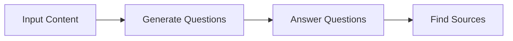
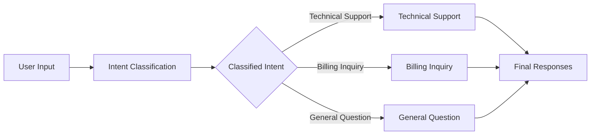
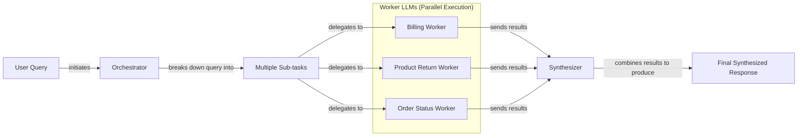

# Basic AI Workflow Patterns: From Prompt Chaining to Orchestration

In our previous lessons, we laid the groundwork for AI Engineering. We explored the agent landscape, distinguished between rule-based LLM workflows and autonomous agents, managed context flow, and enforced reliable data extraction with structured outputs. Now, we will tackle the fundamental patterns for composing these components into robust applications.

A common mistake when starting out is to build a single, complex prompt that tries to do everything at once. This monolithic approach is the AI equivalent of a "big ball of mud" in software engineering. It’s hard to debug, impossible to maintain, and scales poorly. When it fails, and it will, you are left untangling a mess of instructions with no clear indication of what went wrong.

This lesson introduces a more disciplined, modular approach. We will explore the foundational patterns for building multi-step LLM workflows: sequential prompt chaining, parallel processing, conditional routing, and the orchestrator-worker pattern. By breaking down complex problems into smaller, manageable sub-tasks, you can build systems that are more reliable, transparent, and easier to optimize. In this lesson, we will cover why this modularity is important and demonstrate how to implement these patterns from scratch using Google Gemini, including a sequential workflow for FAQ generation, a parallel version to optimize for speed, a routing system for customer service, and an orchestrator-worker system for dynamic task decomposition.

## The Challenge with Complex Single LLM Calls

Attempting to solve a multi-step problem with a single, complex LLM call is often a recipe for unreliability. While it might work for a simple demo, this approach introduces several challenges in a production environment. Monolithic prompts are difficult to debug. When the model produces an incorrect or incomplete output, it is hard to pinpoint which part of the instruction it failed to follow. They also lack modularity. If you need to update one part of the logic, you risk breaking another, making the system brittle and hard to maintain.

Furthermore, long and complex prompts are more susceptible to the "lost-in-the-middle" problem. Research from Stanford and UC Berkeley showed that LLMs exhibit a U-shaped accuracy curve, paying most attention to the beginning and end of their context while systematically under-attending to the middle [[1]](https://dev.to/thousand_miles_ai/the-lost-in-the-middle-problem-why-llms-ignore-the-middle-of-your-context-window-3al2). This bias, caused by architectural factors like causal attention masking and positional encoding decay, means important instructions can be ignored simply because of their position in the prompt. Early tokens accumulate more attention because they are seen by all subsequent tokens, while middle tokens get lost in a "dead zone," too far from the beginning or end to receive strong attention signals.

This issue is compounded as prompt complexity increases. A 2025 study on prompt underspecification found that as more requirements are added to a single prompt, an LLM's ability to follow all of them degrades. For example, gpt-4o's accuracy dropped from 98.7% on a single requirement to 85% when following 19 requirements at once [[2]](https://arxiv.org/html/2505.13360v1). This happens because of limited instruction-following capabilities and potential conflicts between constraints. Trying to do too much at once increases the cognitive load on the model, leading to higher error rates and inconsistent performance. Studies have shown that complex, multi-example prompts can lead to a 52.9% error rate, primarily due to parsing failures, which is 38 times higher than simpler zero-shot prompts [[3]](https://aclanthology.org/2025.ommm-1.4.pdf).

Let's demonstrate this with a practical example. We will ask the model to generate a set of Frequently Asked Questions (FAQs) from several documents about renewable energy. The prompt will instruct the model to perform three tasks at once: generate questions, provide answers, and cite the sources for each answer.

1.  First, we set up our environment. We will use the `google-genai` library to interact with Google's Gemini models. For these examples, `gemini-2.5-flash` is a great choice as it is fast and cost-effective.
    ```python
    from lessons.utils import env
    from google import genai
    from google.genai import types
    from pydantic import BaseModel, Field
    
    env.load(required_env_vars=["GOOGLE_API_KEY"])
    client = genai.Client()
    MODEL_ID = "gemini-2.5-flash"
    ```
    We also define mock webpages that will serve as our source content.
    ```python
    webpage_1 = {
        "title": "The Benefits of Solar Energy",
        "content": """...""",
    }
    webpage_2 = {
        "title": "Understanding Wind Turbines",
        "content": """...""",
    }
    webpage_3 = {
        "title": "Energy Storage Solutions",
        "content": """...""",
    }
    all_sources = [webpage_1, webpage_2, webpage_3]
    combined_content = "\n\n".join(
        [f"Source Title: {source['title']}\nContent: {source['content']}" for source in all_sources]
    )
    ```

2.  Next, we define Pydantic models for our structured output and create a complex prompt that asks the model to do everything in one shot.
    ```python
    class FAQ(BaseModel):
        question: str
        answer: str
        sources: list[str]
    
    class FAQList(BaseModel):
        faqs: list[FAQ]
    
    n_questions = 10
    prompt_complex = f"""
    Based on the provided content from three webpages, generate a list of exactly {n_questions} frequently asked questions (FAQs).
    For each question, provide a concise answer derived ONLY from the text.
    After each answer, you MUST include a list of the 'Source Title's that were used to formulate that answer.
    
    <provided_content>
    {combined_content}
    </provided_content>
    """.strip()
    ```

3.  Finally, we call the model and inspect the output.
    ```python
    config = types.GenerateContentConfig(
        response_mime_type="application/json",
        response_schema=FAQList
    )
    response_complex = client.models.generate_content(
        model=MODEL_ID,
        contents=prompt_complex,
        config=config
    )
    result_complex = response_complex.parsed
    ```
    It outputs:
    ```json
    {
      "question": "Why is energy storage crucial for renewable energy sources like solar and wind?",
      "answer": "Effective energy storage is key to unlocking the full potential of renewable sources because it allows storing excess energy when plentiful and releasing it when needed, which is essential for a stable power grid.",
      "sources": [
        "Energy Storage Solutions",
        "Understanding Wind Turbines"
      ]
    }
    ```

While the output might seem acceptable at first glance, this approach is fragile. If the model fails to cite a source correctly or generates a question unrelated to the content, it is difficult to determine which part of the prompt failed. For example, the answer above correctly uses two sources, but a monolithic prompt might easily miss one. As the complexity of instructions increases, so does the likelihood of such errors.

## The Power of Modularity: Why Chain LLM Calls?

A more robust solution is to break the problem down using a "divide and conquer" strategy. This is the core idea behind prompt chaining, a workflow pattern where you connect multiple LLM calls sequentially. The output of one step becomes the input for the next, creating a processing pipeline [[4]](https://www.decodingai.com/p/stop-building-ai-agents-use-these), [[5]](https://medium.com/@fabiolalli/a-practical-guide-to-prompt-engineering-techniques-and-their-use-cases-5f8574e2cd9a). This modular approach mirrors how humans tackle complex tasks: by breaking them into smaller, more manageable steps. Research shows this can improve accuracy by over 15% compared to monolithic prompts [[6]](https://agentic-design.ai/patterns/prompt-chaining).

The benefits of prompt chaining are significant for building reliable systems [[4]](https://www.decodingai.com/p/stop-building-ai-agents-use-these), [[7]](https://datalearningscience.com/p/design-pattern-prompt-chaining-building):
-   **Improved Modularity:** Each LLM call in the chain focuses on a single, well-defined sub-task. This separation of concerns makes the system easier to understand, test, and maintain.
-   **Enhanced Accuracy:** Simpler, targeted prompts reduce the cognitive load on the model, leading to more accurate and reliable outputs for each step. This approach can turn "single-prompt toys into 95% reliable automations" [[7]](https://datalearningscience.com/p/design-pattern-prompt-chaining-building).
-   **Easier Debugging:** When a failure occurs, you can isolate the problem to a specific link in the chain. This makes it much faster to identify and fix issues compared to debugging one large, complex prompt.
-   **Increased Flexibility:** You can swap, update, or optimize individual components of the chain without affecting the others. For instance, you could use a fast, cheap model for a simple classification step and a more powerful model for a complex generation step.

However, chaining is not without its trade-offs. Each additional LLM call adds latency and cost to the overall process. There is also a risk of information loss or "context degradation" between steps. This is a well-documented problem where important details from an early step might be forgotten or distorted by a later one, leading to cascading failures [[8]](https://futureagi.substack.com/p/how-tool-chaining-fails-in-production). A summary from the first step might lose nuance that was important for the translation in the second step. In sequential processing, small inaccuracies can propagate and accumulate, making the final answer exponentially more prone to error [[9]](https://wand.ai/blog/compounding-error-effect-in-large-language-models-a-growing-challenge). Despite these challenges, for most production use cases, the gains in reliability and maintainability far outweigh the drawbacks.

## Building a Sequential Workflow: FAQ Generation Pipeline

Let's refactor our FAQ generation task into a three-step sequential workflow:
1.  **Generate Questions**: The first LLM call will read the source content and generate a list of relevant questions.
2.  **Answer Questions**: For each question, a second LLM call will generate a concise answer based on the content.
3.  **Find Sources**: For each question-and-answer pair, a third LLM call will identify the original source titles used.

This approach gives us clear, inspectable outputs at each stage, making the entire process more transparent and easier to debug. By breaking the problem down, we reduce the complexity of each individual LLM call, which in turn increases the reliability of the final output. This pattern is foundational for building deterministic data processing pipelines, where each step performs a specific transformation.


Image 1: A sequential workflow for FAQ generation.

1.  First, we create a function dedicated to generating questions. The prompt is simple and focused only on this task. We define a `QuestionList` Pydantic model to ensure the output is a structured list of strings. This focused prompt is less likely to confuse the model and more likely to produce a high-quality list of questions that are directly relevant to the provided content. By isolating this step, we can easily evaluate and refine the quality of the questions without worrying about the downstream tasks of answering or sourcing. This modularity is key to building a maintainable system.
    ```python
    class QuestionList(BaseModel):
        questions: list[str]
    
    prompt_generate_questions = """
    Based on the content below, generate a list of {n_questions} relevant and distinct questions that a user might have.
    
    <provided_content>
    {combined_content}
    </provided_content>
    """.strip()
    
    def generate_questions(content: str, n_questions: int = 10) -> list[str]:
        config = types.GenerateContentConfig(
            response_mime_type="application/json",
            response_schema=QuestionList
        )
        response_questions = client.models.generate_content(
            model=MODEL_ID,
            contents=prompt_generate_questions.format(n_questions=n_questions, combined_content=content),
            config=config
        )
        return response_questions.parsed.questions
    ```
    Testing this function gives us a clean list of questions to work with:
    ```text
    [
        "What are the primary environmental and economic benefits of solar energy?",
        "How do homeowners financially benefit from installing solar panels?",
        ...
    ]
    ```

2.  Next, a function to answer a single question. This prompt is instructed to use *only* the provided content, which helps ground the model and reduce hallucinations. By focusing the model's attention on a specific question and a limited context, we increase the probability of getting a factual and concise answer. This step is repeated for every question generated in the previous step. This separation allows us to use a potentially different model or a more fine-tuned prompt for answering, independent of the question generation logic.
    ```python
    prompt_answer_question = """
    Using ONLY the provided content below, answer the following question.
    The answer should be concise and directly address the question.
    
    <question>
    {question}
    </question>
    
    <provided_content>
    {combined_content}
    </provided_content>
    """.strip()
    
    def answer_question(question: str, content: str) -> str:
        answer_response = client.models.generate_content(
            model=MODEL_ID,
            contents=prompt_answer_question.format(question=question, combined_content=content),
        )
        return answer_response.text
    ```

3.  The final function in our chain identifies the sources for a given question and answer. This separation ensures that citation is a distinct, verifiable step. Instead of asking the model to answer and cite simultaneously, we provide the already-generated answer and ask the model to trace it back to the source documents. This improves the accuracy of citations, as the model's task is now a simpler matching exercise rather than a complex multi-task generation. This also allows for independent validation of the sourcing logic.
    ```python
    class SourceList(BaseModel):
        sources: list[str]
    
    prompt_find_sources = """
    You will be given a question and an answer that was generated from a set of documents.
    Your task is to identify which of the original documents were used to create the answer.
    
    <question>
    {question}
    </question>
    
    <answer>
    {answer}
    </answer>
    
    <provided_content>
    {combined_content}
    </provided_content>
    """.strip()
    
    def find_sources(question: str, answer: str, content: str) -> list[str]:
        config = types.GenerateContentConfig(
            response_mime_type="application/json",
            response_schema=SourceList
        )
        sources_response = client.models.generate_content(
            model=MODEL_ID,
            contents=prompt_find_sources.format(question=question, answer=answer, combined_content=content),
            config=config
        )
        return sources_response.parsed.sources
    ```

4.  Now, we combine these functions into a single sequential workflow. We iterate through each generated question, answering it and finding its sources one by one. This loop represents the "chain" in prompt chaining. The `sequential_workflow` function orchestrates the entire process, ensuring that the output of each step is correctly passed as input to the next. This clear, linear flow makes the logic easy to follow and debug.
    ```python
    import time
    
    def sequential_workflow(content, n_questions=10) -> list[FAQ]:
        questions = generate_questions(content, n_questions)
        final_faqs = []
        for question in questions:
            answer = answer_question(question, content)
            sources = find_sources(question, answer, content)
            faq = FAQ(question=question, answer=answer, sources=sources)
            final_faqs.append(faq)
        return final_faqs
    
    start_time = time.monotonic()
    sequential_faqs = sequential_workflow(combined_content, n_questions=4)
    end_time = time.monotonic()
    print(f"Sequential processing completed in {end_time - start_time:.2f} seconds")
    ```
    It outputs:
    ```text
    Sequential processing completed in 22.20 seconds
    ```
    The final result is a structured list of `FAQ` objects, where each step of the generation process can be individually inspected and validated. This modular pipeline is far more robust than our initial monolithic approach. The total execution time reflects the cumulative latency of making several sequential API calls for each of the four questions. While this is slower than a single call, the improvement in reliability and maintainability is a worthwhile trade-off for most production applications.

## Optimizing Sequential Workflows With Parallel Processing

While the sequential workflow improves reliability, it can be slow, especially with a large number of questions, since each question is processed one at a time. We can speed this up by identifying independent steps and running them in parallel [[10]](https://mlpills.substack.com/p/issue-110-llm-workflow-patterns).

In our FAQ pipeline, the processing for each question (answering and source-finding) is independent of the others. This makes it a perfect candidate for parallelization. We can use Python's `asyncio` library to make concurrent API calls. This reduces the total execution time from the sum of all calls to the time of the longest single call. This is particularly useful for batch processing tasks where latency is a concern. The tasks are I/O-bound, meaning they spend most of their time waiting for a network response from the LLM API. `asyncio` is highly efficient for such tasks because it uses a single-threaded event loop to manage multiple operations, avoiding the overhead of creating and managing multiple OS threads [[11]](https://medium.com/@sizanmahmud08/python-concurrency-showdown-asyncio-vs-threading-vs-multiprocessing-which-should-you-choose-in-31205161899a), [[12]](https://testdriven.io/blog/python-concurrency-parallelism/).

⚠️ A quick note on rate limits: when making many parallel calls, you might hit the API rate limits of your provider (e.g., requests per minute). Production systems need to handle this with strategies like exponential backoff with jitter to manage request throttling gracefully [[13]](https://tianpan.co/blog/2026-03-11-llm-api-resilience-production). This involves retrying failed requests with a randomized delay to avoid overwhelming the server.

1.  First, we create asynchronous versions of our `answer_question` and `find_sources` functions using `async def` and `await`. An asynchronous function, or coroutine, can be paused while waiting for an I/O operation (like an API call) to complete, allowing other code to run. The Gemini client provides an `aio` (asynchronous I/O) version for this purpose, which allows us to make non-blocking API requests.
    ```python
    import asyncio
    
    async def answer_question_async(question: str, content: str) -> str:
        prompt = prompt_answer_question.format(question=question, combined_content=content)
        response = await client.aio.models.generate_content(
            model=MODEL_ID,
            contents=prompt
        )
        return response.text
    
    async def find_sources_async(question: str, answer: str, content: str) -> list[str]:
        prompt = prompt_find_sources.format(question=question, answer=answer, combined_content=content)
        config = types.GenerateContentConfig(
            response_mime_type="application/json",
            response_schema=SourceList
        )
        response = await client.aio.models.generate_content(
            model=MODEL_ID,
            contents=prompt,
            config=config
        )
        return response.parsed.sources
    ```

2.  Next, we define a function to process a single question in parallel. It first awaits the answer, then uses that answer to await the sources. This function encapsulates the logic for one unit of parallel work.
    ```python
    async def process_question_parallel(question: str, content: str) -> FAQ:
        answer = await answer_question_async(question, content)
        sources = await find_sources_async(question, answer, content)
        return FAQ(question=question, answer=answer, sources=sources)
    ```

3.  Finally, we create the main parallel workflow. After generating the initial list of questions synchronously, we create a list of asynchronous tasks—one for each question—and run them all concurrently using `asyncio.gather`. This function collects all the awaitable tasks and runs them at the same time, waiting for all of them to complete before returning the results.
    ```python
    async def parallel_workflow(content: str, n_questions: int = 10) -> list[FAQ]:
        questions = generate_questions(content, n_questions)
        tasks = [process_question_parallel(question, content) for question in questions]
        parallel_faqs = await asyncio.gather(*tasks)
        return parallel_faqs
    
    start_time = time.monotonic()
    parallel_faqs = await parallel_workflow(combined_content, n_questions=4)
    end_time = time.monotonic()
    print(f"Parallel processing completed in {end_time - start_time:.2f} seconds")
    ```
    It outputs:
    ```text
    Parallel processing completed in 8.98 seconds
    ```
By running the independent steps in parallel, we cut the execution time by more than half. This demonstrates the trade-off. Sequential processing is simpler and easier to debug. Parallel processing offers a major speed advantage at the cost of increased complexity in error handling and rate limit management [[14]](https://deepchecks.com/orchestrating-multi-step-llm-chains-best-practices/). While independent subtasks don't have a chain of dependencies that can propagate errors, debugging can be harder due to multiple concurrent paths [[10]](https://mlpills.substack.com/p/issue-110-llm-workflow-patterns).

## Introducing Dynamic Behavior: Routing and Conditional Logic

So far, our workflows have been static. Every input follows the same linear or parallel path. But what if you need to handle different types of inputs in different ways? A customer support system, for example, should not treat a billing inquiry the same way it treats a technical support request. This is where routing comes in.

Routing introduces conditional logic into your workflow, allowing you to dynamically direct an input down a specialized path based on its content or characteristics [[4]](https://www.decodingai.com/p/stop-building-ai-agents-use-these). This is another application of the "divide and conquer" principle. Instead of creating a single, complex prompt that tries to handle all possible scenarios, you create multiple, smaller prompts, each specialized for a specific task. An initial LLM call often acts as a classifier, or "router," to determine which path the input should take. This LLM-based classification uses the model's semantic understanding to map unstructured natural language to a predefined set of categories or intents [[15]](https://www.vellum.ai/blog/how-to-build-intent-detection-for-your-chatbot).

This pattern offers several advantages. It keeps prompts specialized, which improves accuracy and makes them easier to maintain. It also enables more efficient resource allocation. For example, you can route simple queries to a smaller, faster model and reserve more powerful models for complex tasks, optimizing both cost and latency [[16]](https://www.getmaxim.ai/articles/top-5-llm-routing-techniques/). This branching logic is a key step toward building more intelligent and adaptive AI systems that can respond appropriately to a wide range of inputs. It transforms a rigid pipeline into a dynamic system that can make decisions.

## Building a Basic Routing Workflow

Let's build a simple routing system for a customer service chatbot. The goal is to classify an incoming user query into one of three intents—`Technical Support`, `Billing Inquiry`, or `General Question`—and then pass it to a specialized handler. This ensures that each type of query receives a tailored and appropriate response. This is a common pattern for creating more intelligent and responsive customer-facing bots.


Image 2: A routing workflow for customer service intent classification.

1.  First, we define our possible intents using a Pydantic model with an `Enum`. This ensures our classification is constrained to a known set of values, providing type safety. We then create a classification function that uses the LLM to assign an intent to a user query. The prompt explicitly lists the possible categories, which helps the model make a more accurate classification by constraining its output space.
    ```python
    from enum import Enum
    
    class IntentEnum(str, Enum):
        TECHNICAL_SUPPORT = "Technical Support"
        BILLING_INQUIRY = "Billing Inquiry"
        GENERAL_QUESTION = "General Question"
    
    class UserIntent(BaseModel):
        intent: IntentEnum
    
    prompt_classification = """
    Classify the user's query into one of the following categories.
    
    <categories>
    {categories}
    </categories>
    
    <user_query>
    {user_query}
    </user_query>
    """.strip()
    
    def classify_intent(user_query: str) -> IntentEnum:
        prompt = prompt_classification.format(
            user_query=user_query,
            categories=[intent.value for intent in IntentEnum]
        )
        config = types.GenerateContentConfig(
            response_mime_type="application/json",
            response_schema=UserIntent
        )
        response = client.models.generate_content(
            model=MODEL_ID,
            contents=prompt,
            config=config
        )
        return response.parsed.intent
    ```

2.  Next, we define specialized prompts for each handler. The technical support prompt is designed to gather more information for troubleshooting. The billing prompt aims to verify the user's account. The general question prompt provides a polite fallback. Having a fallback is important for handling queries that do not fit neatly into any category, ensuring a graceful user experience [[15]](https://www.vellum.ai/blog/how-to-build-intent-detection-for-your-chatbot).
    ```python
    prompt_technical_support = """
    You are a helpful technical support agent.

    Here's the user's query:
    <user_query>
    {user_query}
    </user_query>

    Provide a helpful first response, asking for more details like what troubleshooting steps they have already tried.
    """.strip()

    prompt_billing_inquiry = """
    You are a helpful billing support agent.

    Here's the user's query:
    <user_query>
    {user_query}
    </user_query>

    Acknowledge their concern and inform them that you will need to look up their account, asking for their account number.
    """.strip()

    prompt_general_question = """
    You are a general assistant.

    Here's the user's query:
    <user_query>
    {user_query}
    </user_query>

    Apologize that you are not sure how to help.
    """.strip()
    ```

3.  The `handle_query` function acts as our router. It takes the user query and the classified intent, and then calls the appropriate specialized prompt using a simple `if/elif/else` structure. This is the conditional logic that directs the workflow.
    ```python
    def handle_query(user_query: str, intent: str) -> str:
        if intent == IntentEnum.TECHNICAL_SUPPORT:
            prompt = prompt_technical_support.format(user_query=user_query)
        elif intent == IntentEnum.BILLING_INQUIRY:
            prompt = prompt_billing_inquiry.format(user_query=user_query)
        else: # Default to general question
            prompt = prompt_general_question.format(user_query=user_query)
        
        response = client.models.generate_content(
            model=MODEL_ID,
            contents=prompt
        )
        return response.text
    ```

4.  Let's test it with a few different queries. We will trace a technical query from start to finish.
    ```python
    query_1 = "My internet connection is not working."
    intent_1 = classify_intent(query_1)
    response_1 = handle_query(query_1, intent_1)
    ```
    For a technical query, the system correctly classifies the intent and routes it to the technical support handler, which asks for more details.
    ```text
    Intent: IntentEnum.TECHNICAL_SUPPORT
    Response: Hello there! I'm sorry to hear you're having trouble with your internet connection... To help me understand what's going on... could you please provide a few more details? ... Have you already tried any troubleshooting steps yourself?
    ```
    For a billing query, it routes to the billing handler.
    ```python
    query_2 = "I think there is a mistake on my last invoice."
    # ...
    ```
    It outputs:
    ```text
    Intent: IntentEnum.BILLING_INQUIRY
    Response: I'm sorry to hear you think there might be a mistake on your last invoice. I can definitely help you look into that! To access your account and investigate the charges, could you please provide your account number?
    ```
This routing pattern allows you to build much more sophisticated and context-aware applications by directing tasks to the most appropriate logic, keeping each component simple and focused.

## Orchestrator-Worker Pattern: Dynamic Task Decomposition

The final pattern we will explore is the orchestrator-worker pattern. This is a more advanced workflow where a central "orchestrator" LLM dynamically breaks down a complex task into smaller sub-tasks. It then delegates these sub-tasks to specialized "worker" components, which can be other LLMs or tools, and finally, a "synthesizer" LLM combines the results into a single, coherent response [[17]](https://agents.kour.me/orchestrator-worker/), [[18]](https://mlpills.substack.com/p/diy-17-orchestrator-worker-llm-agent).

This pattern is ideal for unpredictable, multifaceted tasks where the exact steps cannot be determined in advance [[18]](https://mlpills.substack.com/p/diy-17-orchestrator-worker-llm-agent). While it shares similarities with parallelization, its key advantage is flexibility. Instead of executing a fixed set of parallel tasks, the orchestrator analyzes the input at runtime and decides which workers are needed and what their specific instructions should be [[19]](https://platform.claude.com/cookbook/patterns-agents-orchestrator-workers). This allows the system to adapt to a wide variety of complex inputs, making it a powerful architecture for building sophisticated agents. For example, a coding agent might use an orchestrator to analyze a user's request, determine which files need to be modified, and then delegate the actual code changes to specialized workers. This pattern enables both specialization and parallelization, but with a layer of intelligent, dynamic coordination that fixed workflows lack [[18]](https://mlpills.substack.com/p/diy-17-orchestrator-worker-llm-agent).


Image 3: A flowchart illustrating the orchestrator-worker pattern, showing query decomposition, parallel worker execution, and final synthesis.

Let's implement this for a complex customer support query that involves a billing issue, a product return, and an order status request all in one message.

1.  The **Orchestrator** is responsible for parsing the user's query and breaking it down into a list of structured `Task` objects. Its prompt defines the available `query_type` values and the parameters required for each. This step is where the "dynamic decomposition" happens. The LLM analyzes the free-form text and converts it into a machine-readable plan, a list of actions for the workers to execute.
    ```python
    class Task(BaseModel):
        query_type: QueryTypeEnum
        # ... other fields for different query types
    
    class TaskList(BaseModel):
        tasks: list[Task]
    
    prompt_orchestrator = f"""
    You are a master orchestrator. Your job is to break down a complex user query into a list of sub-tasks...
    <user_query>
    {{query}}
    </user_query>
    """.strip()
    
    def orchestrator(query: str) -> list[Task]:
        # ... LLM call to generate a TaskList
    ```

2.  We have three specialized **Workers**:
    -   `handle_billing_worker`: Extracts the specific billing concern, simulates opening an investigation, and returns a structured `BillingTask` object.
    -   `handle_return_worker`: Simulates generating a Return Merchandise Authorization (RMA) number and provides shipping instructions in a `ReturnTask` object.
    -   `handle_status_worker`: Simulates fetching order details from a backend system and returns them in a `StatusTask` object.
    Each worker is a simple Python function that could, in a real application, interact with databases or external APIs. They are specialists that do one thing well. For example, the billing worker first uses an LLM to intelligently extract the user's specific concern from the broader query before performing its main action. This shows how workers themselves can be small, focused AI workflows.

3.  The **Synthesizer** takes the structured outputs from all the workers and uses a final LLM call to combine them into a single, user-friendly email. Its job is to translate the structured, internal data from the workers into a natural language response for the customer [[18]](https://mlpills.substack.com/p/diy-17-orchestrator-worker-llm-agent). This step is important for ensuring the final output is coherent and professional, rather than just a raw dump of worker results.
    ```python
    prompt_synthesizer = """
    You are a master communicator. Combine several distinct pieces of information from our support team into a single, well-formatted, and friendly email to a customer.
    
    Here are the points to include...
    <points>
    {formatted_results}
    </points>
    """.strip()
    
    def synthesizer(results: list[BaseModel]) -> str:
        # ... formats worker results and calls LLM
    ```

4.  The main pipeline function, `process_user_query`, ties everything together. It calls the orchestrator, dispatches tasks to the appropriate workers based on `query_type`, collects the results, and passes them to the synthesizer.
    ```python
    def process_user_query(user_query):
        # 1. Run orchestrator
        tasks_list = orchestrator(user_query)
        # 2. Run workers based on task_list
        worker_results = []
        for task in tasks_list:
            if task.query_type == QueryTypeEnum.BILLING_INQUIRY:
                worker_results.append(handle_billing_worker(task.invoice_number, user_query))
            # ... other workers
        # 3. Run synthesizer
        final_user_message = synthesizer(worker_results)
    ```

5.  Let's test it with our complex query.
    ```python
    complex_customer_query = """
    Hi, I'm writing to you because I have a question about invoice #INV-7890. It seems higher than I expected.
    Also, I would like to return the 'SuperWidget 5000' I bought because it's not compatible with my system.
    Finally, can you give me an update on my order #A-12345?
    """.strip()
    
    process_user_query(complex_customer_query)
    ```
    The orchestrator correctly identifies the three distinct tasks and their parameters. The workers execute their specialized logic, and the synthesizer combines their structured outputs into a single, helpful response.
    ```text
    Final synthesized response:
    
    Dear Customer,
    
    Thank you for reaching out to us. Here is an update on your recent requests:
    
    Regarding your BillingInquiry:
      - Invoice Number: INV-7890
      - Your Stated Concern: "It seems higher than I expected."
      - Our Action: An investigation (Case ID: INV_CASE_5326) has been opened regarding your concern.
      - Expected Resolution: We will get back to you within 2 business days.
    
    Regarding your ProductReturn:
      - Product: SuperWidget 5000
      - Reason for Return: "it's not compatible with my system"
      - Return Authorization (RMA): RMA-61921
      - Instructions: Please pack the 'SuperWidget 5000' securely...
    
    Regarding your StatusUpdate:
      - Order ID: A-12345
      - Current Status: Shipped
      - Carrier: SuperFast Shipping
      - Tracking Number: SF259160
      - Delivery Estimate: Tomorrow
    
    If you have any further questions, please don't hesitate to contact us.
    
    Best regards,
    The Support Team
    ```
This pattern provides a powerful way to build scalable and maintainable AI systems that can handle complex, unpredictable user requests by dynamically decomposing them into manageable parts.

## Conclusion

In this lesson, we moved beyond single, monolithic prompts and explored the fundamental workflow patterns that underpin reliable AI applications. We have seen that by breaking down complex tasks into smaller, specialized steps, we gain modularity, debuggability, and control.

You have learned how to implement four key patterns:
-   **Prompt Chaining:** For sequential tasks where order matters.
-   **Parallelization:** To speed up workflows with independent sub-tasks.
-   **Routing:** To dynamically handle different types of inputs with specialized logic.
-   **Orchestrator-Worker:** For complex, unpredictable tasks that require dynamic decomposition and delegation.

These patterns are not just theoretical concepts; they are the practical building blocks used in 95% of production AI systems [[4]](https://www.decodingai.com/p/stop-building-ai-agents-use-these). Mastering them is an important step on your journey as an AI Engineer. In the upcoming lessons, we will build upon this foundation. We will give our workflows the ability to interact with the outside world using tools (Lesson 6), imbue them with planning and reasoning capabilities (Lesson 7), and provide them with memory to learn from past interactions (Lesson 9).

## References

- [1] https://dev.to/thousand_miles_ai/the-lost-in-the-middle-problem-why-llms-ignore-the-middle-of-your-context-window-3al2
- [2] https://arxiv.org/html/2505.13360v1
- [3] https://aclanthology.org/2025.ommm-1.4.pdf
- [4] https://www.decodingai.com/p/stop-building-ai-agents-use-these
- [5] https://medium.com/@fabiolalli/a-practical-guide-to-prompt-engineering-techniques-and-their-use-cases-5f8574e2cd9a
- [6] https://agentic-design.ai/patterns/prompt-chaining
- [7] https://datalearningscience.com/p/design-pattern-prompt-chaining-building
- [8] https://futureagi.substack.com/p/how-tool-chaining-fails-in-production
- [9] https://wand.ai/blog/compounding-error-effect-in-large-language-models-a-growing-challenge
- [10] https://mlpills.substack.com/p/issue-110-llm-workflow-patterns
- [11] https://medium.com/@sizanmahmud08/python-concurrency-showdown-asyncio-vs-threading-vs-multiprocessing-which-should-you-choose-in-31205161899a
- [12] https://testdriven.io/blog/python-concurrency-parallelism/
- [13] https://tianpan.co/blog/2026-03-11-llm-api-resilience-production
- [14] https://deepchecks.com/orchestrating-multi-step-llm-chains-best-practices/
- [15] https://www.vellum.ai/blog/how-to-build-intent-detection-for-your-chatbot
- [16] https://www.getmaxim.ai/articles/top-5-llm-routing-techniques/
- [17] https://agents.kour.me/orchestrator-worker/
- [18] https://mlpills.substack.com/p/diy-17-orchestrator-worker-llm-agent
- [19] https://platform.claude.com/cookbook/patterns-agents-orchestrator-workers