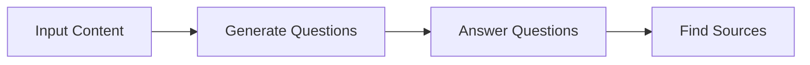
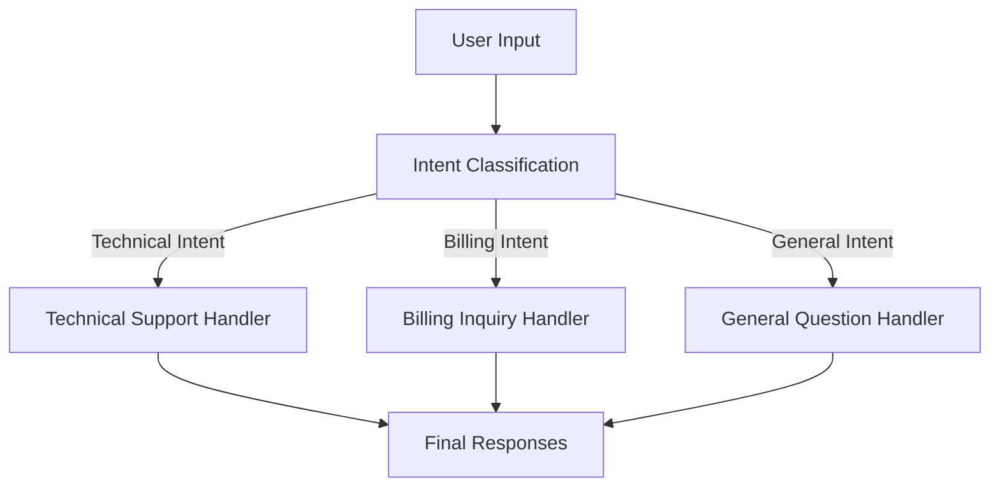

# Lesson 5: Basic Workflow Ingredients

In our last lesson, we covered structured outputs, the essential technique for getting reliable, machine-readable data out of an LLM. You now have a solid foundation for both providing context *to* a model and getting predictable results *from* it. With these building blocks, we can move from single LLM calls to building multi-step, production-grade systems.

This lesson is about the fundamental patterns for composing those calls: chaining, parallelization, routing, and orchestration. These are the core ingredients of almost every complex LLM application you will encounter. Mastering them is the first major step toward building sophisticated and reliable AI. We will show you how to break down complex problems into manageable pieces, a skill that separates prototypes from products.

In this lesson, we will cover the following:
- The problems with complex, single-prompt LLM calls.
- How to build sequential workflows by chaining LLM calls.
- How to speed up workflows with parallel processing.
- How to implement dynamic logic using routing.
- How to use the orchestrator-worker pattern for complex, unpredictable tasks.

## The Challenge with Complex Single LLM Calls

When you first start building with LLMs, the temptation is to write a single, massive prompt that does everything at once. It feels efficient. You have a complex task—like generating a FAQ from a set of documents—so you write a detailed set of instructions asking the model to generate questions, find the answers, and cite the sources, all in one go.

This approach often works for a demo, but it quickly falls apart in production. Relying on a single, complex LLM call introduces several problems.

First, it creates a black box that is difficult to debug. When the output is wrong, it is hard to pinpoint which part of the instruction the model failed to follow. Was the question bad? Was the answer incorrect? Or did it just fail to find the right source? Without intermediate steps, you are left guessing. This lack of transparency makes it nearly impossible to build reliable systems, as you cannot systematically identify and fix the root cause of failures.

Second, this monolithic approach lacks modularity. If you want to improve just one part of the process, like the question generation, you have to rewrite and re-test the entire prompt. This is slow and unpredictable, as a small change intended to fix one issue can inadvertently break another. Studies have shown that even minor variations in prompt formatting can cause significant swings in performance, making iterative development on a single, complex prompt a frustrating exercise [[3]](https://aclanthology.org/2025.ommm-1.4.pdf).

Third, long and complex prompts are more susceptible to performance degradation. As we discussed in Lesson 3 on Context Engineering, models can suffer from the "lost-in-the-middle" problem, where they pay less attention to information buried in a long context [[2]](https://dev.to/thousand_miles_ai/the-lost-in-the-middle-problem-why-llms-ignore-the-middle-of-your-context-window-3al2). A single prompt trying to do too much can easily become a "long context" and lead to unreliable outputs. The model might ignore critical instructions or fail to use all the provided information, resulting in incomplete or inaccurate responses.

Finally, research indicates that as the number of requirements in a single prompt increases, the model's accuracy tends to drop [[5]](https://arxiv.org/html/2505.13360v1). Each additional instruction adds cognitive load, and models can struggle to follow all constraints perfectly, especially when instructions are conditional or conflicting. This often leads to higher error rates compared to breaking the task into simpler, focused steps [[1]](https://www.mdpi.com/2079-9292/13/23/4712).

Let’s look at a practical example. We will start with our setup, which involves importing the necessary libraries, creating the Gemini client, and defining our model.

1.  First, we set up our environment and initialize the Gemini client. We will use `gemini-2.5-flash` for these examples, as it is fast and cost-effective.
    ```python
    import asyncio
    from enum import Enum
    import random
    import time
    
    from pydantic import BaseModel, Field
    from google import genai
    from google.genai import types
    
    from lessons.utils import env
    
    env.load(required_env_vars=["GOOGLE_API_KEY"])
    
    client = genai.Client()
    
    MODEL_ID = "gemini-2.5-flash"
    ```
2.  Next, we define our source content: three mock web pages about renewable energy. We will combine their content to serve as the knowledge base for our FAQ generation task.
    ```python
    webpage_1 = {
        "title": "The Benefits of Solar Energy",
        "content": """
        Solar energy is a renewable powerhouse, offering numerous environmental and economic benefits.
        By converting sunlight into electricity through photovoltaic (PV) panels, it reduces reliance on fossil fuels,
        thereby cutting down greenhouse gas emissions. Homeowners who install solar panels can significantly
        lower their monthly electricity bills, and in some cases, sell excess power back to the grid.
        While the initial installation cost can be high, government incentives and long-term savings make
        it a financially viable option for many. Solar power is also a key component in achieving energy
        independence for nations worldwide.
        """,
    }
    
    webpage_2 = {
        "title": "Understanding Wind Turbines",
        "content": """
        Wind turbines are towering structures that capture kinetic energy from the wind and convert it into
        electrical power. They are a critical part of the global shift towards sustainable energy.
        Turbines can be installed both onshore and offshore, with offshore wind farms generally producing more
        consistent power due to stronger, more reliable winds. The main challenge for wind energy is its
        intermittency—it only generates power when the wind blows. This necessitates the use of energy
        storage solutions, like large-scale batteries, to ensure a steady supply of electricity.
        """,
    }
    
    webpage_3 = {
        "title": "Energy Storage Solutions",
        "content": """
        Effective energy storage is the key to unlocking the full potential of renewable sources like solar
        and wind. Because these sources are intermittent, storing excess energy when it's plentiful and
        releasing it when it's needed is crucial for a stable power grid. The most common form of
        large-scale storage is pumped-hydro storage, but battery technologies, particularly lithium-ion,
        are rapidly becoming more affordable and widespread. These batteries can be used in homes, businesses,
        and at the utility scale to balance energy supply and demand, making our energy system more
        resilient and reliable.
        """,
    }
    
    all_sources = [webpage_1, webpage_2, webpage_3]
    
    # We'll combine the content for the LLM to process
    combined_content = "\n\n".join(
        [f"Source Title: {source['title']}\nContent: {source['content']}" for source in all_sources]
    )
    ```
3.  Now, we create a single, complex prompt that asks the LLM to do everything at once. We also define Pydantic models to get a structured JSON output, a technique we covered in Lesson 4.
    ```python
    # This prompt tries to do everything at once: generate questions, find answers,
    # and cite sources. This complexity can often confuse the model.
    n_questions = 10
    prompt_complex = f"""
    Based on the provided content from three webpages, generate a list of exactly {n_questions} frequently asked questions (FAQs).
    For each question, provide a concise answer derived ONLY from the text.
    After each answer, you MUST include a list of the 'Source Title's that were used to formulate that answer.
    
    <provided_content>
    {combined_content}
    </provided_content>
    """.strip()
    
    # Pydantic classes for structured outputs
    class FAQ(BaseModel):
        """A FAQ is a question and answer pair, with a list of sources used to answer the question."""
        question: str = Field(description="The question to be answered")
        answer: str = Field(description="The answer to the question")
        sources: list[str] = Field(description="The sources used to answer the question")
    
    class FAQList(BaseModel):
        """A list of FAQs"""
        faqs: list[FAQ] = Field(description="A list of FAQs")
    
    # Generate FAQs
    config = types.GenerateContentConfig(
        response_mime_type="application/json",
        response_schema=FAQList
    )
    response_complex = client.models.generate_content(
        model=MODEL_ID,
        contents=prompt_complex,
        config=config
    )
    result_complex = response_complex.parsed
    ```
    It outputs:
    ```json
    {
      "question": "What is solar energy and how does it work?",
      "answer": "Solar energy is a renewable powerhouse that converts sunlight into electricity through photovoltaic (PV) panels.",
      "sources": [
        "The Benefits of Solar Energy"
      ]
    }
    ...
    {
      "question": "Why is energy storage crucial for renewable energy sources like solar and wind?",
      "answer": "Effective energy storage is key to unlocking the full potential of renewable sources because it allows storing excess energy when plentiful and releasing it when needed, which is crucial for a stable power grid.",
      "sources": [
        "Energy Storage Solutions",
        "Understanding Wind Turbines"
      ]
    }
    ```
While the output seems reasonable, this approach is brittle. The more complex the instructions, the higher the chance of failure. For example, the model might occasionally miss a source or generate a question that is not directly answerable from the text. This is a classic "divide and conquer" problem, which leads us to our first workflow pattern: prompt chaining.

## The Power of Modularity: Why Chain LLM Calls?

Instead of relying on a single prompt, we can break down the task into a series of smaller, more focused steps. This is called **prompt chaining**: a workflow where multiple LLM calls are connected sequentially, with the output of one step feeding into the next [[41]](https://medium.com/@fabiolalli/a-practical-guide-to-prompt-engineering-techniques-and-their-use-cases-5f8574e2cd9a). This modular approach is a more reliable and manageable way to build complex systems [[36]](https://www.decodingai.com/p/stop-building-ai-agents-use-these).

The benefits of this divide-and-conquer strategy are significant.

First, it improves **modularity**. Each LLM call is responsible for a single, well-defined sub-task. This separation of concerns makes the system easier to understand, maintain, and update. You can work on one component without affecting the others. This is a core principle of good software engineering, and it applies just as much to AI systems. Companies like AppFolio and Athena Intelligence use modular, graph-based orchestration to manage complex workflows, which allows them to debug and scale their systems effectively [[20]](https://www.zenml.io/blog/llmops-in-production-457-case-studies-of-what-actually-works).

Second, it enhances **accuracy**. Simpler, more targeted prompts reduce the cognitive load on the LLM, leading to more reliable and higher-quality outputs for each step [[58]](https://datalearningscience.com/p/design-pattern-prompt-chaining-building). This increased reliability at the component level translates to a more robust system overall. Research has shown that breaking down tasks can improve accuracy by over 15% compared to monolithic prompts [[60]](https://agentic-design.ai/patterns/prompt-chaining).

Third, it makes **debugging** much easier. If something goes wrong, you can inspect the inputs and outputs of each step to isolate the point of failure. This transparency is essential for building production-grade applications. Observability tools like LangSmith are designed specifically for this, providing visibility into multi-step chains and helping teams optimize performance and token usage [[21]](https://www.zenml.io/blog/llmops-in-production-287-more-case-studies-of-what-actually-works).

Finally, chaining offers greater **flexibility**. You can swap out individual components, experiment with different models for different steps, or insert programmatic logic between calls. For instance, you could use a cheaper, faster model for a simple classification task and a more capable, expensive model for a complex generation task within the same workflow.

However, chaining is not without its trade-offs. It can increase latency, as you have to wait for multiple LLM calls to complete sequentially. It can also be more expensive due to the increased number of API calls and total tokens used. Another risk is context degradation, where important information from early steps gets lost or diluted in later stages of the chain [[22]](https://futureagi.substack.com/p/how-tool-chaining-fails-in-production). In production GenAI platforms, these trade-offs are often managed with techniques like caching intermediate results to reduce both latency and cost [[72]](https://huyenchip.com/2024/07/25/genai-platform.html). Despite these downsides, the gains in reliability and maintainability often make prompt chaining the superior choice for complex tasks.

## Building a Sequential Workflow: FAQ Generation Pipeline

Let's refactor our FAQ generation example into a three-step sequential workflow:
1.  **Generate Questions**: Create a list of questions based on the source content.
2.  **Answer Questions**: For each question, generate a concise answer.
3.  **Find Sources**: For each question-answer pair, identify the original source documents.

This modular structure allows us to focus on one task at a time, leading to more consistent and traceable results. By breaking down the problem, we give the LLM a simpler, more focused task at each stage, which increases the reliability of the final output. This step-by-step process also makes the entire workflow easier to debug and maintain.


Image 1: A flowchart illustrating the sequential FAQ generation pipeline.

### Generate Questions

First, we create a function that focuses solely on generating a list of relevant questions from the provided content. This isolates the creative task of question ideation from the more analytical tasks of answering and sourcing. By doing this, we can fine-tune the question generation prompt independently to control for quality, relevance, and diversity without affecting the other parts of the workflow.

1.  We start by defining a Pydantic model to structure the list of questions we expect from the LLM. This ensures the output is a clean, usable list of strings.
    ```python
    class QuestionList(BaseModel):
        """A list of questions"""
        questions: list[str] = Field(description="A list of questions")
    ```
2.  Next, we create a targeted prompt for question generation. It asks for a specific number of questions and makes it clear that the output should be based only on the provided content.
    ```python
    prompt_generate_questions = """
    Based on the content below, generate a list of {n_questions} relevant and distinct questions that a user might have.
    
    <provided_content>
    {combined_content}
    </provided_content>
    """.strip()
    ```
3.  Finally, we wrap this logic in a function that takes the content and the desired number of questions, calls the Gemini API with the appropriate configuration for structured output, and returns the parsed list of questions.
    ```python
    def generate_questions(content: str, n_questions: int = 10) -> list[str]:
        """
        Generate a list of questions based on the provided content.
    
        Args:
            content: The combined content from all sources
    
        Returns:
            list: A list of generated questions
        """
        config = types.GenerateContentConfig(
            response_mime_type="application/json",
            response_schema=QuestionList
        )
        response_questions = client.models.generate_content(
            model=MODEL_ID,
            contents=prompt_generate_questions.format(n_questions=n_questions, combined_content=content),
            config=config
        )
    
        return response_questions.parsed.questions
    ```
    A test run gives us a clean list of questions, ready for the next step in our pipeline:
    ```text
    - What are the primary environmental and economic benefits of solar energy?
    - How do homeowners financially benefit from installing solar panels?
    - What is the main process by which wind turbines generate electricity?
    ...
    ```

### Answer Questions

With a list of questions, our next step is to generate an answer for each one. This function takes a single question and the source content, and returns a concise answer. By separating this step, we ensure that the model's focus is entirely on generating an accurate and relevant answer for a single, specific question, rather than trying to juggle multiple tasks at once.

1.  The prompt for this step is straightforward. It instructs the model to answer a specific question using only the provided context, emphasizing conciseness and directness. This helps prevent the model from adding extraneous information or hallucinating details not present in the source material.
    ```python
    prompt_answer_question = """
    Using ONLY the provided content below, answer the following question.
    The answer should be concise and directly address the question.
    
    <question>
    {question}
    </question>
    
    <provided_content>
    {combined_content}
    </provided_content>
    """.strip()
    ```
2.  The corresponding function makes a simple LLM call. Since we are expecting a plain text answer, we do not need to configure a response schema. This keeps the function simple and efficient.
    ```python
    def answer_question(question: str, content: str) -> str:
        """
        Generate an answer for a specific question using only the provided content.
    
        Args:
            question: The question to answer
            content: The combined content from all sources
    
        Returns:
            str: The generated answer
        """
        answer_response = client.models.generate_content(
            model=MODEL_ID,
            contents=prompt_answer_question.format(question=question, combined_content=content),
        )
        return answer_response.text
    ```
    For the question `"What are the primary environmental and economic benefits of solar energy?"`, it produces a focused answer, demonstrating the effectiveness of a targeted prompt:
    ```text
    The primary environmental benefit of solar energy is cutting down greenhouse gas emissions by reducing reliance on fossil fuels. Economically, it allows homeowners to significantly lower their monthly electricity bills and potentially sell excess power back to the grid.
    ```

### Find Sources

The final step is to identify which of the original documents were used to create the answer. This is crucial for traceability and allows users to verify the information. This step essentially acts as a quality check, ensuring that the generated answer is grounded in the provided context. It also adds a layer of transparency, which is vital for building user trust.

1.  We define another Pydantic model for the expected output, a list of source titles. This ensures we get a clean, parsable list.
    ```python
    class SourceList(BaseModel):
        """A list of source titles that were used to answer the question"""
        sources: list[str] = Field(description="A list of source titles that were used to answer the question")
    ```
2.  The prompt asks the model to act as a fact-checker, comparing the question and answer against the source content and identifying the documents that support the answer. This is a form of self-correction or evaluation built directly into the workflow.
    ```python
    prompt_find_sources = """
    You will be given a question and an answer that was generated from a set of documents.
    Your task is to identify which of the original documents were used to create the answer.
    
    <question>
    {question}
    </question>
    
    <answer>
    {answer}
    </answer>
    
    <provided_content>
    {combined_content}
    </provided_content>
    """.strip()
    ```
3.  The function for this step returns a list of source titles, using the Gemini API's structured output feature to ensure a valid JSON response.
    ```python
    def find_sources(question: str, answer: str, content: str) -> list[str]:
        """
        Identify which sources were used to generate an answer.
    
        Args:
            question: The original question
            answer: The generated answer
            content: The combined content from all sources
    
        Returns:
            list: A list of source titles that were used
        """
        config = types.GenerateContentConfig(
            response_mime_type="application/json",
            response_schema=SourceList
        )
        sources_response = client.models.generate_content(
            model=MODEL_ID,
            contents=prompt_find_sources.format(question=question, answer=answer, combined_content=content),
            config=config
        )
        return sources_response.parsed.sources
    ```
    For our example question and answer, it correctly identifies the source, confirming that the answer was derived from the correct document:
    ```text
    ['The Benefits of Solar Energy']
    ```

### Executing the Workflow

Now, we combine these functions into a complete sequential workflow. The code first generates all the questions, then iterates through each one, calling the `answer_question` function followed by the `find_sources` function. This step-by-step execution ensures that each part of the process is completed correctly before moving to the next, providing a clear and auditable trail.

```python
def sequential_workflow(content, n_questions=10) -> list[FAQ]:
    """
    Execute the complete sequential workflow for FAQ generation.

    Args:
        content: The combined content from all sources

    Returns:
        list: A list of FAQs with questions, answers, and sources
    """
    # Generate questions
    questions = generate_questions(content, n_questions)

    # Answer and find sources for each question sequentially
    final_faqs = []
    for question in questions:
        # Generate an answer for the current question
        answer = answer_question(question, content)

        # Identify the sources for the generated answer
        sources = find_sources(question, answer, content)

        faq = FAQ(
            question=question,
            answer=answer,
            sources=sources
        )
        final_faqs.append(faq)

    return final_faqs

# Execute the sequential workflow (measure time for comparison)
start_time = time.monotonic()
sequential_faqs = sequential_workflow(combined_content, n_questions=4)
end_time = time.monotonic()
print(f"Sequential processing completed in {end_time - start_time:.2f} seconds")
```
It outputs:
```text
Sequential processing completed in 22.20 seconds
```
The final result is a well-structured list of FAQs, where each entry is generated and verified through a clear, multi-step process. While this approach is reliable, processing each question one by one took over 20 seconds. This latency might be acceptable for some applications, but for others, we need a faster solution. This leads us to our next pattern: parallelization.

## Optimizing Sequential Workflows With Parallel Processing

The sequential workflow is robust, but its latency grows linearly with the number of questions. Since the processing for each question (answering and finding sources) is independent of the others, we can run these tasks in parallel to significantly reduce the total execution time. This is a common optimization strategy for I/O-bound tasks like making API calls, where the program would otherwise spend most of its time waiting for network responses [[28]](https://testdriven.io/blog/python-concurrency-parallelism/).

We can use Python’s `asyncio` library to perform these network-bound LLM calls concurrently. Instead of waiting for each question to be fully processed before starting the next, we can initiate the calls for all questions at once and wait for them all to complete. This approach is particularly effective for batch processing scenarios where you have multiple, independent items to process. By overlapping the waiting times for each API call, we can achieve a substantial speedup.

### Implementing Parallel Processing

First, we need asynchronous versions of our `answer_question` and `find_sources` functions. The `google-genai` library provides an `aio` (asynchronous I/O) client for this purpose, which allows us to make non-blocking API calls. This is the key to enabling concurrent execution.

1.  We define `async` versions of our core functions. The logic remains the same, but we use the `async` and `await` keywords to handle the asynchronous operations. This tells the Python event loop that it can work on other tasks while waiting for the API response, which is the essence of cooperative multitasking [[26]](https://santhalakshminarayana.github.io/blog/concurrency-patterns-python).
    ```python
    async def answer_question_async(question: str, content: str) -> str:
        """
        Async version of answer_question function.
        """
        prompt = prompt_answer_question.format(question=question, combined_content=content)
        response = await client.aio.models.generate_content(
            model=MODEL_ID,
            contents=prompt
        )
        return response.text
    
    async def find_sources_async(question: str, answer: str, content: str) -> list[str]:
        """
        Async version of find_sources function.
        """
        prompt = prompt_find_sources.format(question=question, answer=answer, combined_content=content)
        config = types.GenerateContentConfig(
            response_mime_type="application/json",
            response_schema=SourceList
        )
        response = await client.aio.models.generate_content(
            model=MODEL_ID,
            contents=prompt,
            config=config
        )
        return response.parsed.sources
    ```
2.  Next, we create a function to process a single question in parallel. It generates the answer and finds the sources asynchronously. This function encapsulates the logic for one unit of work that can be run concurrently with others.
    ```python
    async def process_question_parallel(question: str, content: str) -> FAQ:
        """
        Process a single question by generating answer and finding sources in parallel.
        """
        answer = await answer_question_async(question, content)
        sources = await find_sources_async(question, answer, content)
        return FAQ(
            question=question,
            answer=answer,
            sources=sources
        )
    ```

### Executing the Parallel Workflow

With these async functions, we can now build our parallel workflow. The `generate_questions` step remains synchronous, as we need the questions before we can process them. However, we then use `asyncio.gather` to run `process_question_parallel` for all questions concurrently [[27]](https://medium.com/@sizanmahmud08/python-concurrency-showdown-asyncio-vs-threading-vs-multiprocessing-which-should-you-choose-in-31205161899a). This function collects all the asynchronous tasks and runs them, waiting for all to complete before returning the results.

```python
async def parallel_workflow(content: str, n_questions: int = 10) -> list[FAQ]:
    """
    Execute the complete parallel workflow for FAQ generation.

    Args:
        content: The combined content from all sources

    Returns:
        list: A list of FAQs with questions, answers, and sources
    """
    # Generate questions (this step remains synchronous)
    questions = generate_questions(content, n_questions)

    # Process all questions in parallel
    tasks = [process_question_parallel(question, content) for question in questions]
    parallel_faqs = await asyncio.gather(*tasks)

    return parallel_faqs

# Execute the parallel workflow (measure time for comparison)
start_time = time.monotonic()
parallel_faqs = await parallel_workflow(combined_content, n_questions=4)
end_time = time.monotonic()
print(f"Parallel processing completed in {end_time - start_time:.2f} seconds")
```
It outputs:
```text
Parallel processing completed in 8.98 seconds
```
By running the tasks in parallel, we reduced the total processing time from 22.20 seconds to just 8.98 seconds—a significant improvement.

This comparison highlights the trade-offs. Sequential processing is simpler and more predictable, making it easier to debug. Parallel processing is much faster but introduces complexity in error handling and resource management. For applications where latency is critical, parallelization is an effective optimization technique.

One important caveat: when making many concurrent API calls, you are more likely to hit rate limits [[9]](https://tianpan.co/blog/2026-03-11-llm-api-resilience-production). Production systems need robust error handling, such as exponential backoff with jitter, to manage these limits gracefully [[8]](https://stackoverflow.com/questions/79924021/429-on-vertex-ai-api-how-to-send-5-20-parallel-gemini-api-requests-without-hitt). This also includes handling individual task failures within a parallel batch so that one failed call does not bring down the entire workflow [[71]](https://www.buildmvpfast.com/blog/prompt-chaining-patterns-production-ai-sequential-parallel-conditional-2026).

## Introducing Dynamic Behavior: Routing and Conditional Logic

So far, our workflows have been deterministic: every input goes through the same sequence of steps. But what if we need to handle different types of inputs differently? This is where **routing** comes in.

Routing introduces conditional logic into our workflows. Instead of a fixed path, we can create branches that direct the input to specialized handlers based on its characteristics. This is another application of the "divide and conquer" principle. By routing different types of requests to different, specialized prompts, we avoid creating a single, monolithic prompt that has to handle every possible case. This keeps our prompts focused and optimized for a single responsibility, which generally improves performance and reliability [[36]](https://www.decodingai.com/p/stop-building-ai-agents-use-these).

The router itself is often an LLM call that classifies the input. For example, a customer support system could classify an incoming query as a "billing issue," "technical problem," or "general question," and then route it to a specialized agent trained to handle that specific type of inquiry [[12]](https://www.vellum.ai/blog/how-to-build-intent-detection-for-your-chatbot). This ensures that the user gets the most relevant and accurate response.

While simple intent classification is a common starting point, routing can be more sophisticated. Strategies can include routing based on a model's confidence score, query complexity, or even cost considerations, directing requests to more capable models only when necessary [[62]](https://www.getmaxim.ai/articles/top-5-llm-routing-techniques/). In production, a common architecture is the "cascade pattern," which uses a sequence of routers—starting with a fast, cheap method like semantic search and escalating to a more powerful LLM-based classifier only for ambiguous cases [[63]](https://tianpan.co/blog/2026-04-16-intent-classification-agent-routers).

The router itself, often an LLM call, can be optimized by fine-tuning it on domain-specific data to improve its accuracy on specialized queries [[65]](https://aws.amazon.com/blogs/machine-learning/multi-llm-routing-strategies-for-generative-ai-applications-on-aws/). This allows us to build dynamic systems that can adapt their behavior based on the user's intent.

## Building a Basic Routing Workflow

Let's build a simple routing workflow for a customer service system. The goal is to classify a user's query and then route it to the appropriate specialized handler. This is a classic use case for routing, as customer support requests can vary widely in nature.


Image 2: A flowchart illustrating a routing workflow for customer service queries.

### Intent Classification

First, we need a classifier. We will use an LLM to determine the user's intent from their query. This initial step is critical, as the accuracy of the entire workflow depends on it.

1.  We define the possible intents using a Python `Enum` and a Pydantic model for the structured output. This ensures that the classifier's output is constrained to a known set of categories, making the routing logic robust.
    ```python
    class IntentEnum(str, Enum):
        """
        Defines the allowed values for the 'intent' field.
        Inheriting from 'str' ensures that the values are treated as strings.
        """
        TECHNICAL_SUPPORT = "Technical Support"
        BILLING_INQUIRY = "Billing Inquiry"
        GENERAL_QUESTION = "General Question"
    
    class UserIntent(BaseModel):
        """
        Defines the expected response schema for the intent classification.
        """
        intent: IntentEnum = Field(description="The intent of the user's query")
    ```
2.  The classification prompt asks the model to categorize the user's query into one of our predefined intents. Providing the list of categories directly in the prompt helps the model understand the expected output format.
    ```python
    prompt_classification = """
    Classify the user's query into one of the following categories.
    
    <categories>
    {categories}
    </categories>
    
    <user_query>
    {user_query}
    </user_query>
    """.strip()
    ```
3.  The `classify_intent` function takes a user query and returns the classified intent. It uses the Gemini API's structured output feature to ensure the response conforms to our `UserIntent` Pydantic model.
    ```python
    def classify_intent(user_query: str) -> IntentEnum:
        """Uses an LLM to classify a user query."""
        prompt = prompt_classification.format(
            user_query=user_query,
            categories=[intent.value for intent in IntentEnum]
        )
        config = types.GenerateContentConfig(
            response_mime_type="application/json",
            response_schema=UserIntent
        )
        response = client.models.generate_content(
            model=MODEL_ID,
            contents=prompt,
            config=config
        )
        return response.parsed.intent
    ```
    Testing with a few sample queries shows the classifier works as expected:
    - `"My internet connection is not working."` → `TECHNICAL_SUPPORT`
    - `"I think there is a mistake on my last invoice."` → `BILLING_INQUIRY`
    - `"What are your opening hours?"` → `GENERAL_QUESTION`

This simple classification works well, but a production system might need more nuance. For instance, instead of forcing a choice, you could use confidence thresholds to implement a three-stage logic: `ALLOW` the request if confidence is high, `ABSTAIN` and ask for clarification if confidence is medium, or `DENY` if the query is out-of-scope [[61]](https://huggingface.co/blog/perfecXion/intentguard). This prevents the system from confidently misrouting ambiguous queries. This single-call approach for classification is common in production systems, as it minimizes round-trip latency compared to more complex, multi-step classification schemes [[64]](https://docs.nvidia.com/aiq-blueprint/2.0.0/architecture/agents/intent-classifier.html).

### Defining Specialized Handlers

Now that we can classify the intent, we need to create specialized prompts for each case. We will have one handler for technical support, one for billing, and a general fallback. Each handler is an expert in its domain, providing a more tailored and helpful response than a single, general-purpose prompt could.

1.  We define three distinct prompts, each with a specific persona and goal. The technical support prompt asks for more details, the billing prompt requests an account number, and the general prompt provides a polite refusal.
    ```python
    prompt_technical_support = """
    You are a helpful technical support agent.
    
    Here's the user's query:
    <user_query>
    {user_query}
    </user_query>
    
    Provide a helpful first response, asking for more details like what troubleshooting steps they have already tried.
    """.strip()
    
    prompt_billing_inquiry = """
    You are a helpful billing support agent.
    
- [1] Comparative Analysis of Prompt Strategies for Large Language Models: Single-Task vs. Multitask Prompts. (2024). MDPI. https://www.mdpi.com/2079-9292/13/23/4712
- [2] Liu, N. F., Lin, K., Hewitt, J., Paranjape, A., Bevilacqua, M., Petroni, F., & Liang, P. (2023). Lost in the Middle: How Language Models Use Long Contexts. arXiv. https://dev.to/thousand_miles_ai/the-lost-in-the-middle-problem-why-llms-ignore-the-middle-of-your-context-window-3al2
- [3] Sclar, M., Choi, Y., Tsvetkov, Y., & Suhr, A. (2023). Quantifying Language Models’ Sensitivity to Spurious Features in Prompt Design or: How I learned to start worrying about prompt formatting. arXiv. https://aclanthology.org/2025.ommm-1.4.pdf
- [4] Zhong, W., Cui, C., Zha, Z., Chen, J., & Li, Y. (2024). ZeMPE: A Zero-Shot Multiple-Problem Evaluation of Large Language Models. arXiv. https://aclanthology.org/2025.gem-1.14.pdf
- [5] Chen, L., Chen, Y., Chen, J., & Wang, W. Y. (2025). When Large Language Models Follow Rules with Conflicting Human Interests. arXiv. https://arxiv.org/html/2505.13360v1
- [7] Challenges with rate limiting and handling API responses in high volume requests. (2024). Google for Developers. https://discuss.ai.google.dev/t/challenges-with-rate-limiting-and-handling-api-responses-in-high-volume-requests/61903
- [8] 429 on Vertex AI API - how to send 5-20 parallel gemini-api requests without hitting rate limit? (2024). Stack Overflow. https://stackoverflow.com/questions/79924021/429-on-vertex-ai-api-how-to-send-5-20-parallel-gemini-api-requests-without-hitt
- [9] Pan, T. (2026). LLM API Resilience in Production: Rate Limits, Failover, and the Hidden Costs of Naive Retry Logic. https://tianpan.co/blog/2026-03-11-llm-api-resilience-production
- [11] LLM-Based Prompt Routing. (2024). Emergent Mind. https://www.emergentmind.com/topics/llm-based-prompt-routing
- [12] A Beginner's Guide to LLM Intent Classification for Chatbots. (2024). Vellum AI. https://www.vellum.ai/blog/how-to-build-intent-detection-for-your-chatbot
- [14] Bajaj, A., Chen, Z., & Chen, W. (2025). Universal Model Routing with Mixture of Experts. arXiv. https://arxiv.org/html/2502.08773v1
- [15] Multi-LLM routing strategies for generative AI applications on AWS. (2024). AWS Machine Learning Blog. https://aws.amazon.com/blogs/machine-learning/multi-llm-routing-strategies-for-generative-ai-applications-on-aws/
- [16] Pattern: Orchestrator-Worker (Coordinator). (2024). Kour.me. https://agents.kour.me/orchestrator-worker/
- [17] DIY #17 Orchestrator-Worker LLM Agent. (2024). ML Pills. https://mlpills.substack.com/p/diy-17-orchestrator-worker-llm-agent
- [18] Building a Self-Healing AI Orchestrator with Reflexion Patterns. (2024). Stevens Institute of Technology. https://online.stevens.edu/blog/building-self-healing-ai-orchestrator-reflexion-patterns/
- [19] Orchestrator-Workers. (2024). Claude Cookbook. https://platform.claude.com/cookbook/patterns-agents-orchestrator-workers
- [20] LLMOps in Production: 457 Case Studies of What Actually Works. (2025). ZenML. https://www.zenml.io/blog/llmops-in-production-457-case-studies-of-what-actually-works
- [21] LLMOps in Production: 287 More Case Studies of What Actually Works. (2024). ZenML. https://www.zenml.io/blog/llmops-in-production-287-more-case-studies-of-what-actually-works
- [22] How Tool Chaining Fails in Production. (2024). FutureAGI. https://futureagi.substack.com/p/how-tool-chaining-fails-in-production
- [23] ChainRAG: A Progressive Retrieval Framework for Large Language Models. (2025). ACL Anthology. https://aclanthology.org/2025.acl-long.1089.pdf
- [24] Keeping AI Agents Grounded: Context Engineering Strategies that Prevent Context Rot Using Milvus. (2024). Milvus.io. https://milvus.io/blog/keeping-ai-agents-grounded-context-engineering-strategies-that-prevent-context-rot-using-milvus.md
- [25] Context Rot. (2024). Morph. https://www.morphllm.com/context-rot
- [26] Asynchronous or Concurrency Patterns in Python with Asyncio. (2024). Santhana Narayana. https://santhalakshminarayana.github.io/blog/concurrency-patterns-python
- [27] Python Concurrency Showdown: Asyncio vs. Threading vs. Multiprocessing. (2024). Medium. https://medium.com/@sizanmahmud08/python-concurrency-showdown-asyncio-vs-threading-vs-multiprocessing-which-should-you-choose-in-31205161899a
- [28] Concurrency and Parallelism in Python. (2024). TestDriven.io. https://testdriven.io/blog/python-concurrency-parallelism/
- [29] Concurrency and Parallelism in Python: Threads, Multiprocessing, and Async Programming. (2024). Dev.to. https://dev.to/nkpydev/concurrency-and-parallelism-in-python-threads-multiprocessing-and-async-programming-64d
- [30] Concurrency in async/await and threading. (2025). JetBrains. https://blog.jetbrains.com/pycharm/2025/06/concurrency-in-async-await-and-threading/
- [31] Orchestrator-Workers. (2024). Claude Cookbook. https://platform.claude.com/cookbook/patterns-agents-orchestrator-workers
- [32] DIY #17 Orchestrator-Worker LLM Agent. (2024). ML Pills. https://mlpills.substack.com/p/diy-17-orchestrator-worker-llm-agent
- [34] Build Advanced Customer Support LLM with Multi-Agent Workflow. (2024). Socure. https://www.socure.com/tech-blog/build-advanced-customer-support-llm-multi-agent-workflow
- [35] AI Agent Orchestration Patterns. (2024). Product School. https://productschool.com/blog/artificial-intelligence/ai-agent-orchestration-patterns
- [36] Stop Building AI Agents. Use These 5 LLM Workflows Instead. (2024). Decoding AI. https://www.decodingai.com/p/stop-building-ai-agents-use-these
- [38] Choosing the Right Orchestration Pattern for Multi-Agent Systems. (2024). Kore.ai. https://www.kore.ai/blog/choosing-the-right-orchestration-pattern-for-multi-agent-systems
- [39] Building a Self-Healing AI Orchestrator with Reflexion Patterns. (2024). Stevens Institute of Technology. https://online.stevens.edu/blog/building-self-healing-ai-orchestrator-reflexion-patterns/
- [40] Five Proven Prompt Engineering Techniques. (2024). Lenny's Newsletter. https://www.lennysnewsletter.com/p/five-proven-prompt-engineering-techniques
- [41] A Practical Guide to Prompt Engineering Techniques and Their Use Cases. (2024). Medium. https://medium.com/@fabiolalli/a-practical-guide-to-prompt-engineering-techniques-and-their-use-cases-5f8574e2cd9a
- [42] 10 Prompt Engineering Techniques for Super Simple Explanation. (2024). Scrum.org. https://www.scrum.org/resources/blog/10-prompt-engineering-techniques-super-simple-explanation
- [44] Prompt Engineering Techniques. (2024). K2View. https://www.k2view.com/blog/prompt-engineering-techniques/
- [45] Orchestrating Multi-Step LLM Chains: Best Practices. (2024). Deepchecks. https://deepchecks.com/orchestrating-multi-step-llm-chains-best-practices/
- [46] LLM Workflow Patterns. (2024). ML Pills. https://mlpills.substack.com/p/issue-110-llm-workflow-patterns
- [47] Compounding Error Effect in Large Language Models: A Growing Challenge. (2024). W&B. https://wand.ai/blog/compounding-error-effect-in-large-language-models-a-growing-challenge
- [48] SPRINT: Structured Planning and Parallel Execution in Reasoning Models. (2024). Stanford University. https://scalingintelligence.stanford.edu/pubs/sprint.pdf
- [49] A Developer's Guide to Multi-Agent Patterns in ADK. (2024). Google for Developers Blog. https://developers.googleblog.com/developers-guide-to-multi-agent-patterns-in-adk/
- [50] Agentic AI Design Patterns. (2024). LinkedIn. https://www.linkedin.com/posts/chiragsubramanian_agentic-ai-design-patterns-my-practical-activity-7416830806939230208-nRFc
- [51] Stop Building AI Agents. Use These 5 LLM Workflows Instead. (2024). Decoding AI. https://www.decodingai.com/p/stop-building-ai-agents-use-these
- [52] LLM Workflow Patterns. (2024). ML Pills. https://mlpills.substack.com/p/issue-110-llm-workflow-patterns
- [53] Orchestrator-Workers. (2024). Claude Cookbook. https://platform.claude.com/cookbook/patterns-agents-orchestrator-workers
- [54] Building Effective Agents. (2024). Anthropic. https://www.anthropic.com/engineering/building-effective-agents
- [55] AI Prompt Orchestration Techniques and Tools You Need. (2024). Scoutos. https://www.scoutos.com/blog/ai-prompt-orchestration-techniques-and-tools-you-need
- [56] Stop Building AI Agents. Use These 5 LLM Workflows Instead. (2024). Decoding AI. https://www.decodingai.com/p/stop-building-ai-agents-use-these
- [57] LLM Workflow Patterns. (2024). ML Pills. https://mlpills.substack.com/p/issue-110-llm-workflow-patterns
- [58] Design Pattern: Prompt Chaining - Building Reliable LLM Workflows. (2024). Data Learning Science. https://datalearningscience.com/p/design-pattern-prompt-chaining-building
- [59] Prompt Chaining. (2024). Udemy. https://blog.udemy.com/prompt-chaining/
- [60] Prompt Chaining. (2024). Agentic Design. https://agentic-design.ai/patterns/prompt-chaining
- [61] IntentGuard: A Guardrail for Out-of-Distribution Intents. (2024). Hugging Face. https://huggingface.co/blog/perfecXion/intentguard
- [62] Top 5 LLM Routing Techniques. (2024). Maxim.ai. https://www.getmaxim.ai/articles/top-5-llm-routing-techniques/
- [63] Intent Classification for Agent Routers. (2026). Tian Pan. https://tianpan.co/blog/2026-04-16-intent-classification-agent-routers
- [64] Intent Classifier Agent. (2024). NVIDIA AI-Q Blueprint. https://docs.nvidia.com/aiq-blueprint/2.0.0/architecture/agents/intent-classifier.html
- [65] Multi-LLM routing strategies for generative AI applications on AWS. (2024). AWS Machine Learning Blog. https://aws.amazon.com/blogs/machine-learning/multi-llm-routing-strategies-for-generative-ai-applications-on-aws/
- [66] How Task Scheduling Optimizes LLM Workflows. (2024). Latitude. https://latitude.so/blog/how-task-scheduling-optimizes-llm-workflows
- [68] LLM Orchestration. (2024). Label Your Data. https://labelyourdata.com/articles/llm-fine-tuning/llm-orchestration
- [69] Multi-Agent Orchestration Patterns for Production. (2024). Beam.ai. https://beam.ai/agentic-insights/multi-agent-orchestration-patterns-production
- [70] Decentralized adaptive task allocation for multi-agent systems. (2025). Nature. https://www.nature.com/articles/s41598-025-21709-9
- [71] Prompt Chaining Patterns for Production AI. (2026). Build MVP Fast. https://www.buildmvpfast.com/blog/prompt-chaining-patterns-production-ai-sequential-parallel-conditional-2026
- [72] Building a Generative AI Platform. (2024). Huyen Chip. https://huyenchip.com/2024/07/25/genai-platform.html
- [73] Agentic System Workflow Patterns. (2024). LinkedIn. https://www.linkedin.com/posts/aurimas-griciunas_you-must-know-these-%F0%9D%97%94%F0%9D%97%B4%F0%9D%97%B2%F0%9D%97%BB%F0%9D%98%81%F0%9D%97%B6%F0%9D%97%B0-%F0%9D%97%A6%F0%9D%98%86%F0%9D%98%80-activity-7372231823138918400-pUE3

</article>