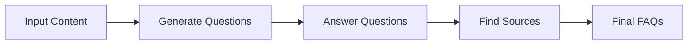
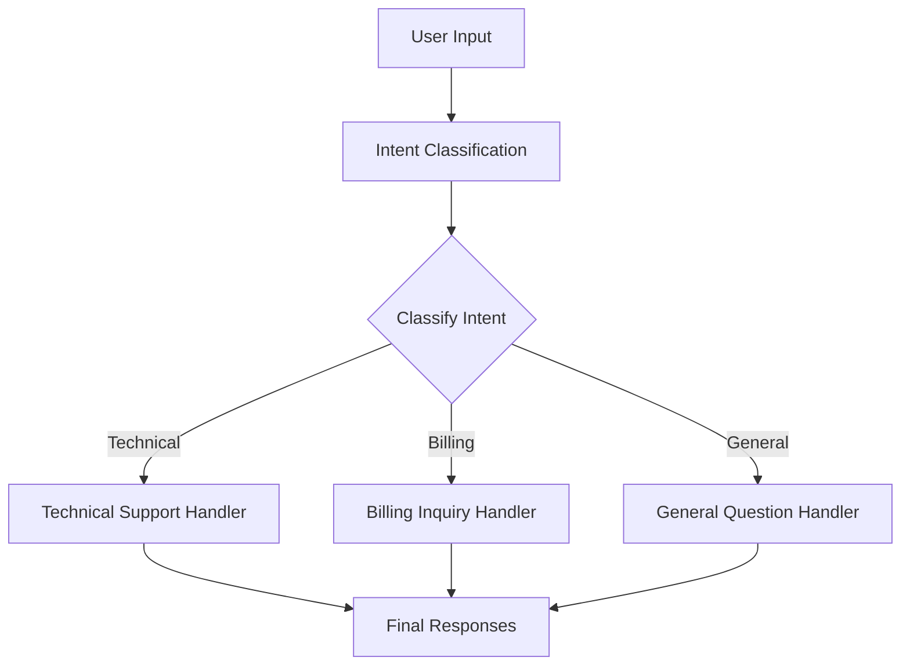
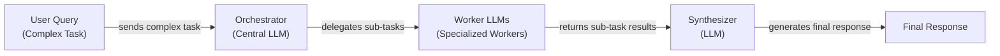

# Lesson 5: Basic Workflow Patterns

In the previous lessons, we explored the landscape of AI engineering, distinguished between LLM workflows and AI agents, managed context, and enforced structured outputs. These are the foundational skills for building any AI application. Now, we move from individual components to connecting them into cohesive, reliable systems.

A common mistake when starting with LLMs is to cram too many instructions into a single, complex prompt. We have been there. On an early project, we tried to build a content generation system with one massive prompt that was supposed to do everything: research, write, format, and add SEO keywords. The result was a slow, expensive, and unreliable mess. The model would frequently get confused, miss steps, or "hallucinate" details.

This experience taught us a critical lesson: reliability comes from modularity. Instead of building monolithic prompts, we need to design workflows that break down complex problems into smaller, manageable steps. This is the core of real-world AI engineering.

This lesson introduces the fundamental building blocks for creating these robust systems. We will cover four essential workflow patterns: prompt chaining for sequential tasks, parallelization for speed, routing for conditional logic, and the orchestrator-worker pattern for dynamic task decomposition. By the end of this lesson, you will know how to move beyond single LLM calls and start building multi-step, production-grade AI workflows from scratch.

## The Challenge with Complex Single LLM Calls

Attempting to solve a multi-step problem with a single, complex LLM call is often the first approach engineers try. While it seems efficient, this monolithic strategy is unreliable and introduces several challenges in production systems.

First, debugging becomes difficult. When a single prompt is responsible for multiple tasks—like generating questions, finding answers, and citing sources—pinpointing the exact cause of a failure is nearly impossible. If the final output is wrong, was it because the model misunderstood the question generation part, failed at answering, or couldn't find the right source? Without clear intermediate steps, you are left guessing. This lack of visibility makes it hard to iterate and improve the system.

Second, this approach lacks modularity. You cannot update or optimize one part of the process without rewriting the entire prompt, which risks breaking other parts. For complex tasks, a single prompt often lacks the necessary depth and context for a good answer, making the system hard to maintain and improve over time [[61]](https://www.datacamp.com/tutorial/prompt-chaining-llm). This is especially true in few-shot prompting scenarios, where complex examples can overwhelm the model and lead to parsing failures [[3]](https://aclanthology.org/2025.ommm-1.4.pdf).

Furthermore, long and complex prompts are more susceptible to the "lost-in-the-middle" problem [[2]](https://dev.to/thousand_miles_ai/the-lost-in-the-middle-problem-why-llms-ignore-the-middle-of-your-context-window-3al2). As we discussed in Lesson 3, LLMs pay the most attention to the beginning and end of their context window. When a prompt is overloaded with instructions and data, critical details in the middle can be overlooked, leading to lower accuracy [[36]](https://www.decodingai.com/p/stop-building-ai-agents-use-these).

This issue is rooted in the architecture of transformer models, where causal attention masking and positional encoding decay create a "dead zone" in the middle of the context [[2]](https://dev.to/thousand_miles_ai/the-lost-in-the-middle-problem-why-llms-ignore-the-middle-of-your-context-window-3al2). This also increases token consumption, making each call more expensive and slower. Research has shown that as the number of requirements in a single prompt increases, model accuracy drops significantly. For example, one study found that GPT-4o's accuracy fell from 98.7% with one requirement to 85% with 19 requirements [[5]](https://arxiv.org/html/2505.13360v1).

Let's demonstrate this with a practical example. We will use the Google Gemini API to generate a Frequently Asked Questions (FAQ) list from a set of documents about renewable energy.

1.  First, we set up our environment by initializing the Gemini client and defining the model we will use. For these examples, we will use `gemini-2.5-flash`, which is fast and cost-effective.

    ```python
    from lessons.utils import env
    from google import genai
    from google.genai import types
    from pydantic import BaseModel, Field
    
    env.load(required_env_vars=["GOOGLE_API_KEY"])
    
    client = genai.Client()
    
    MODEL_ID = "gemini-2.5-flash"
    ```

2.  Next, we define three mock webpages that will serve as our source content.

    ```python
    webpage_1 = {
        "title": "The Benefits of Solar Energy",
        "content": """
        Solar energy is a renewable powerhouse, offering numerous environmental and economic benefits.
        By converting sunlight into electricity through photovoltaic (PV) panels, it reduces reliance on fossil fuels,
        thereby cutting down greenhouse gas emissions. Homeowners who install solar panels can significantly
        lower their monthly electricity bills, and in some cases, sell excess power back to the grid.
        While the initial installation cost can be high, government incentives and long-term savings make
        it a financially viable option for many. Solar power is also a key component in achieving energy
        independence for nations worldwide.
        """,
    }
    
    webpage_2 = {
        "title": "Understanding Wind Turbines",
        "content": """
        Wind turbines are towering structures that capture kinetic energy from the wind and convert it into
        electrical power. They are a critical part of the global shift towards sustainable energy.
        Turbines can be installed both onshore and offshore, with offshore wind farms generally producing more
        consistent power due to stronger, more reliable winds. The main challenge for wind energy is its
        intermittency—it only generates power when the wind blows. This necessitates the use of energy
        storage solutions, like large-scale batteries, to ensure a steady supply of electricity.
        """,
    }
    
    webpage_3 = {
        "title": "Energy Storage Solutions",
        "content": """
        Effective energy storage is the key to unlocking the full potential of renewable sources like solar
        and wind. Because these sources are intermittent, storing excess energy when it's plentiful and
        releasing it when it's needed is crucial for a stable power grid. The most common form of
        large-scale storage is pumped-hydro storage, but battery technologies, particularly lithium-ion,
        are rapidly becoming more affordable and widespread. These batteries can be used in homes, businesses,
        and at the utility scale to balance energy supply and demand, making our energy system more
        resilient and reliable.
        """,
    }
    
    all_sources = [webpage_1, webpage_2, webpage_3]
    
    combined_content = "\n\n".join(
        [f"Source Title: {source['title']}\nContent: {source['content']}" for source in all_sources]
    )
    ```

3.  Now, we create a single, complex prompt that asks the LLM to generate questions, find answers, and cite sources all at once. We use Pydantic models, which we covered in Lesson 4, to structure the output.

    ```python
    # Pydantic classes for structured outputs
    class FAQ(BaseModel):
        """A FAQ is a question and answer pair, with a list of sources used to answer the question."""
        question: str = Field(description="The question to be answered")
        answer: str = Field(description="The answer to the question")
        sources: list[str] = Field(description="The sources used to answer the question")
    
    class FAQList(BaseModel):
        """A list of FAQs"""
        faqs: list[FAQ] = Field(description="A list of FAQs")
    
    n_questions = 10
    prompt_complex = f"""
    Based on the provided content from three webpages, generate a list of exactly {n_questions} frequently asked questions (FAQs).
    For each question, provide a concise answer derived ONLY from the text.
    After each answer, you MUST include a list of the 'Source Title's that were used to formulate that answer.
    
    <provided_content>
    {combined_content}
    </provided_content>
    """.strip()
    
    config = types.GenerateContentConfig(
        response_mime_type="application/json",
        response_schema=FAQList
    )
    response_complex = client.models.generate_content(
        model=MODEL_ID,
        contents=prompt_complex,
        config=config
    )
    result_complex = response_complex.parsed
    ```

    It outputs:

    ```json
    {
      "question": "Why is energy storage crucial for renewable energy sources like solar and wind?",
      "answer": "Effective energy storage is key to unlocking the full potential of renewable sources because it allows storing excess energy when plentiful and releasing it when needed, which is crucial for a stable power grid.",
      "sources": [
        "Energy Storage Solutions"
      ]
    }
    ```

While this output appears correct, it hides a subtle flaw. The answer mentions that storage is crucial for both solar and wind, but it only cites "Energy Storage Solutions". The "Understanding Wind Turbines" source also explicitly mentions the need for storage, but the model missed this connection. As prompt complexity grows, these small inaccuracies accumulate, leading to unreliable systems. This is why a modular approach is essential.

## The Power of Modularity: Why Chain LLM Calls?

To build more reliable systems, we need to move away from monolithic prompts and embrace modularity. The simplest way to do this is with prompt chaining, which is a direct application of the pipeline design pattern from software engineering, adapted for LLM workflows [[62]](https://datalearningscience.com/p/design-pattern-prompt-chaining-building). It treats the task like an assembly line, where you connect multiple LLM calls sequentially and the output of one step becomes the input for the next [[41]](https://medium.com/@fabiolalli/a-practical-guide-to-prompt-engineering-techniques-and-their-use-cases-5f8574e2cd9a), [[56]](https://www.decodingai.com/p/stop-building-ai-agents-use-these). This is a classic "divide and conquer" strategy applied to AI engineering.

This approach offers several key advantages. First, it improves **modularity**. Each LLM call in the chain focuses on a single, well-defined sub-task. This separation of concerns makes the system easier to understand, maintain, and update. You can modify one step of the chain without worrying about unintended side effects on others.

Second, it enhances **accuracy**. Simple, straightforward prompts are often more effective than complex ones, as they minimize the risk of misinterpretation [[1]](https://www.mdpi.com/2079-9292/13/23/4712). Targeted prompts are less confusing for the LLM, which generally leads to higher-quality outputs for each step [[56]](https://www.decodingai.com/p/stop-building-ai-agents-use-these). A model asked only to generate questions is more likely to produce good questions than a model asked to do three things at once. This mirrors the concept of "bounded rationality" in psychology, which suggests that decision-making is improved by breaking down complex problems into smaller parts to avoid cognitive overload [[63]](https://biomedeng.jmir.org/2026/1/e88053).

Third, it makes **debugging** much easier. If the final output is incorrect, you can inspect the intermediate results at each step. This allows for intermediate validation, where you can check the output at each stage before passing it to the next prompt [[64]](https://medium.com/@shivangis2208/from-prompts-to-systems-prompt-chaining-in-agent-design-da493651214d). This transparency is essential for pinpointing failures and fixing problems in production [[46]](https://mlpills.substack.com/p/issue-110-llm-workflow-patterns).

Finally, prompt chaining provides **flexibility**. You can swap individual components, such as using a different model for a specific step. For instance, a fast, cost-effective model like Gemini Flash could be used for a simple classification task, while a more powerful model like Gemini Pro could be reserved for complex content generation [[36]](https://www.decodingai.com/p/stop-building-ai-agents-use-these).

However, this pattern is not without its trade-offs. Chaining multiple calls increases latency, as you must wait for each step to complete sequentially. It also increases costs, since you are making more API calls and potentially using more total tokens. There is also a risk of information loss or error propagation; a mistake in an early step can cascade and affect all subsequent steps [[22]](https://futureagi.substack.com/p/how-tool-chaining-fails-in-production), [[47]](https://wand.ai/blog/compounding-error-effect-in-large-language-models-a-growing-challenge). Additionally, some instructions may only make sense together and can lose their meaning when split into separate prompts. Despite these downsides, the gains in reliability and maintainability often make chaining the superior choice for complex tasks.

## Building a Sequential Workflow: FAQ Generation Pipeline

Let's put theory into practice by refactoring our FAQ generation task into a sequential workflow. Instead of one complex prompt, we will create a three-step chain:

1.  **Generate Questions**: The first LLM call will read the source content and generate a list of relevant questions.
2.  **Answer Questions**: For each question, a second LLM call will generate a concise answer based on the content.
3.  **Find Sources**: For each question-and-answer pair, a third LLM call will identify the original source titles.

This modular approach gives us more control and makes the entire process easier to debug. This decomposition technique is a proven method for breaking down complex content generation tasks into focused sub-tasks [[42]](https://www.scrum.org/resources/blog/10-prompt-engineering-techniques-super-simple-explanation).

Image 1: A flowchart illustrating the sequential FAQ generation pipeline.


Let's walk through the implementation step-by-step.

1.  First, we create a function dedicated to generating questions. The prompt is focused on a single task: producing a list of relevant questions from the provided text. We use a Pydantic model, `QuestionList`, to ensure the output is a clean list of strings. This structured approach, as we learned in Lesson 4, is key to building reliable pipelines.

    ```python
    class QuestionList(BaseModel):
        """A list of questions"""
        questions: list[str] = Field(description="A list of questions")
    
    prompt_generate_questions = """
    Based on the content below, generate a list of {n_questions} relevant and distinct questions that a user might have.
    
    <provided_content>
    {combined_content}
    </provided_content>
    """.strip()
    
    def generate_questions(content: str, n_questions: int = 10) -> list[str]:
        """
        Generate a list of questions based on the provided content.
        """
        config = types.GenerateContentConfig(
            response_mime_type="application/json",
            response_schema=QuestionList
        )
        response_questions = client.models.generate_content(
            model=MODEL_ID,
            contents=prompt_generate_questions.format(n_questions=n_questions, combined_content=content),
            config=config
        )
    
        return response_questions.parsed.questions
    
    questions = generate_questions(combined_content, n_questions=10)
    ```

    It outputs:

    ```text
    ['What are the primary environmental and economic benefits of solar energy?', 'How do homeowners financially benefit from installing solar panels?', 'What is the main process by which wind turbines generate electricity?', 'What is the primary challenge of wind energy, and how is it addressed?', 'Why is effective energy storage crucial for renewable energy sources like solar and wind?', 'What are some common large-scale energy storage methods mentioned?', 'Are there government incentives available for solar panel installation?', 'What is the difference in power consistency between onshore and offshore wind farms?', "How do energy storage solutions make the energy system more resilient and reliable?", 'Can excess solar power generated by homeowners be sold back to the grid?']
    ```

2.  Next, we define a function to answer a single question. This prompt is highly focused: given the source content and one question, it must produce a concise answer. This specialization improves accuracy, as the model is not distracted by other tasks.

    ```python
    prompt_answer_question = """
    Using ONLY the provided content below, answer the following question.
    The answer should be concise and directly address the question.
    
    <question>
    {question}
    </question>
    
    <provided_content>
    {combined_content}
    </provided_content>
    """.strip()
    
    def answer_question(question: str, content: str) -> str:
        """
        Generate an answer for a specific question using only the provided content.
        """
        answer_response = client.models.generate_content(
            model=MODEL_ID,
            contents=prompt_answer_question.format(question=question, combined_content=content),
        )
        return answer_response.text
    
    test_question = questions[0]
    test_answer = answer_question(test_question, combined_content)
    ```

    It outputs:

    ```text
    The primary environmental benefit of solar energy is cutting down greenhouse gas emissions by reducing reliance on fossil fuels. Economically, it allows homeowners to significantly lower their monthly electricity bills and potentially sell excess power back to the grid.
    ```

3.  Our third function is responsible for source attribution. It takes a question and its generated answer and identifies which of the original documents were used. This separation is important for traceability. If the source is wrong, we know exactly which part of the chain failed.

    ```python
    class SourceList(BaseModel):
        """A list of source titles that were used to answer the question"""
        sources: list[str] = Field(description="A list of source titles that were used to answer the question")
    
    prompt_find_sources = """
    You will be given a question and an answer that was generated from a set of documents.
    Your task is to identify which of the original documents were used to create the answer.
    
    <question>
    {question}
    </question>
    
    <answer>
    {answer}
    </answer>
    
    <provided_content>
    {combined_content}
    </provided_content>
    """.strip()
    
    def find_sources(question: str, answer: str, content: str) -> list[str]:
        """
        Identify which sources were used to generate an answer.
        """
        config = types.GenerateContentConfig(
            response_mime_type="application/json",
            response_schema=SourceList
        )
        sources_response = client.models.generate_content(
            model=MODEL_ID,
            contents=prompt_find_sources.format(question=question, answer=answer, combined_content=content),
            config=config
        )
        return sources_response.parsed.sources
    
    test_sources = find_sources(test_question, test_answer, combined_content)
    ```

    It outputs:

    ```text
    ['The Benefits of Solar Energy']
    ```

4.  Finally, we combine these functions into a single sequential workflow. We first generate all the questions, then loop through each one to generate an answer and find its sources. This step-by-step execution makes the process transparent and easy to follow.

    ```python
    import time
    
    def sequential_workflow(content, n_questions=10) -> list[FAQ]:
        """
        Execute the complete sequential workflow for FAQ generation.
        """
        questions = generate_questions(content, n_questions)
    
        final_faqs = []
        for question in questions:
            answer = answer_question(question, content)
            sources = find_sources(question, answer, content)
    
            faq = FAQ(
                question=question,
                answer=answer,
                sources=sources
            )
            final_faqs.append(faq)
    
        return final_faqs
    
    start_time = time.monotonic()
    sequential_faqs = sequential_workflow(combined_content, n_questions=4)
    end_time = time.monotonic()
    print(f"Sequential processing completed in {end_time - start_time:.2f} seconds")
    ```

    It outputs:

    ```text
    Sequential processing completed in 22.20 seconds
    ```

    Here is one of the generated FAQs. Notice that this time, the model correctly identifies both "Understanding Wind Turbines" and "Energy Storage Solutions" as sources for the answer about energy storage, fixing the subtle error from our single-prompt approach.

    ```json
    {
      "question": "Why is energy storage essential for renewable energy sources like solar and wind, and what are the common types of large-scale storage solutions?",
      "answer": "Energy storage is essential for renewable sources like solar and wind because these sources are intermittent, meaning they only generate power when conditions are favorable (e.g., when the sun shines or the wind blows). Storing excess energy when it's plentiful and releasing it when needed is crucial for ensuring a stable and steady supply of electricity and unlocking their full potential for a stable power grid.\n\nCommon types of large-scale storage solutions include pumped-hydro storage and battery technologies, particularly lithium-ion.",
      "sources": [
        "Understanding Wind Turbines",
        "Energy Storage Solutions"
      ]
    }
    ```

This sequential workflow is more robust and transparent. However, processing four questions took over 22 seconds. The answering and sourcing steps for each question are independent of each other, which means we can run them in parallel to speed things up.

## Optimizing Sequential Workflows With Parallel Processing

The sequential workflow improves reliability, but it can be slow. Since the processing for each question (answering and finding sources) is an independent task, we do not need to wait for one to finish before starting the next. This is a perfect opportunity to introduce parallelization.

By running these independent tasks concurrently, we can significantly reduce the total execution time. For this, we will use Python’s built-in `asyncio` library, which is ideal for handling I/O-bound operations like API calls [[27]](https://medium.com/@sizanmahmud08/python-concurrency-showdown-asyncio-vs-threading-vs-multiprocessing-which-should-you-choose-in-31205161899a). LLM API calls are network-bound, meaning the program spends most of its time waiting for a response from the server. `asyncio` allows the program to start other API calls while waiting, rather than sitting idle. This overlapping of wait times is what leads to a dramatic speedup.

1.  First, we create asynchronous versions of our `answer_question` and `find_sources` functions. The logic is the same, but we use `async def` to define them as coroutines and `await` to call them. This syntax tells Python that these functions can be paused and resumed, allowing the event loop to manage multiple operations at once. We also create a new coroutine, `process_question_parallel`, that combines these two async calls for a single question.

    ```python
    import asyncio
    
    async def answer_question_async(question: str, content: str) -> str:
        """
        Async version of answer_question function.
        """
        prompt = prompt_answer_question.format(question=question, combined_content=content)
        response = await client.aio.models.generate_content(
            model=MODEL_ID,
            contents=prompt
        )
        return response.text
    
    async def find_sources_async(question: str, answer: str, content: str) -> list[str]:
        """
        Async version of find_sources function.
        """
        prompt = prompt_find_sources.format(question=question, answer=answer, combined_content=content)
        config = types.GenerateContentConfig(
            response_mime_type="application/json",
            response_schema=SourceList
        )
        response = await client.aio.models.generate_content(
            model=MODEL_ID,
            contents=prompt,
            config=config
        )
        return response.parsed.sources
    
    async def process_question_parallel(question: str, content: str) -> FAQ:
        """
        Process a single question by generating answer and finding sources in parallel.
        """
        answer = await answer_question_async(question, content)
        sources = await find_sources_async(question, answer, content)
        return FAQ(
            question=question,
            answer=answer,
            sources=sources
        )
    ```

2.  Next, we define the main parallel workflow. It starts by generating the questions synchronously, as before. Then, it creates a list of asynchronous tasks—one for each question—and uses `asyncio.gather` to execute them all concurrently. `asyncio.gather` is a high-level function that runs a list of awaitable objects (in our case, the `process_question_parallel` coroutines) concurrently and returns their results once all have completed.

    ```python
    async def parallel_workflow(content: str, n_questions: int = 10) -> list[FAQ]:
        """
        Execute the complete parallel workflow for FAQ generation.
        """
        # Generate questions (this step remains synchronous)
        questions = generate_questions(content, n_questions)
    
        # Process all questions in parallel
        tasks = [process_question_parallel(question, content) for question in questions]
        parallel_faqs = await asyncio.gather(*tasks)
    
        return parallel_faqs
    
    start_time = time.monotonic()
    # In a Jupyter notebook, you can `await` top-level async functions directly.
    parallel_faqs = await parallel_workflow(combined_content, n_questions=4)
    end_time = time.monotonic()
    print(f"Parallel processing completed in {end_time - start_time:.2f} seconds")
    ```

    It outputs:

    ```text
    Parallel processing completed in 8.98 seconds
    ```

By running the tasks in parallel, we cut the execution time from 22 seconds to just under 9 seconds—a significant improvement.

This comparison highlights the trade-offs. Sequential processing is predictable and easier to debug. However, for performance-critical applications, parallel processing is a powerful optimization [[45]](https://deepchecks.com/orchestrating-multi-step-llm-chains-best-practices/). This gain is often measured in **throughput**, or the number of tasks completed per unit of time [[65]](https://www.mdpi.com/1999-4893/18/4/182). The key is to identify which parts of your workflow are independent, though it is important to remember that communication and synchronization overhead can limit the benefits, especially for small, quick tasks [[66]](https://arxiv.org/html/2504.03647v1).

<aside>
💡

When making many parallel API calls, be mindful of rate limits. Most API providers, including Google Gemini, restrict the number of requests you can make per minute. If you exceed this limit, your requests will fail. Production systems should implement strategies like exponential backoff with jitter to handle rate-limiting errors gracefully [[9]](https://tianpan.co/blog/2026-03-11-llm-api-resilience-production).

</aside>

## Introducing Dynamic Behavior: Routing and Conditional Logic

So far, our workflows have been linear. Every input goes through the same sequence of steps. But what if you need to handle different types of inputs in different ways? For example, a customer support system shouldn't treat a billing question the same way it treats a technical issue. This is where routing comes in.

Routing introduces conditional logic into your workflow, allowing you to create different processing paths based on the input [[51]](https://www.decodingai.com/p/stop-building-ai-agents-use-these). It is another application of the "divide and conquer" principle. Instead of trying to create a single, massive prompt that can handle every possible scenario, you create multiple smaller, specialized prompts, each designed for a specific task. An initial LLM call then acts as a classifier, analyzing the input and directing it to the most appropriate specialized handler.

This pattern is incredibly useful for building dynamic and adaptable systems. By separating concerns, you can optimize each path independently, leading to better performance and maintainability. It also makes the system more robust, as you can include a default or fallback route to handle unexpected or unclassifiable inputs [[36]](https://www.decodingai.com/p/stop-building-ai-agents-use-these). There are several routing strategies, including semantic routing based on embeddings, intent-based routing, and cascading routes that start with cheaper models and escalate to more powerful ones if needed [[13]](https://www.getmaxim.ai/articles/top-5-llm-routing-techniques/).

A common way to implement this is with confidence-based routing. The router LLM not only classifies the intent but also provides a confidence score. If the score is below a certain threshold, the query can be escalated to a more powerful (and expensive) model or trigger a fallback mechanism, such as asking the user for clarification [[67]](https://arxiv.org/html/2410.13284v2), [[68]](https://medium.com/@mr.murga/enhancing-intent-classification-and-error-handling-in-agentic-llm-applications-df2917d0a3cc). This adds a layer of reliability, though it is worth noting that a model's stated confidence does not always correlate with correctness [[69]](https://arxiv.org/html/2410.13284v3).

In the next section, we will build a simple routing workflow for a customer support system to see this pattern in action.

## Building a Basic Routing Workflow

Let's build a practical example of a routing workflow. We will create a system for a customer support chatbot that first classifies a user's intent and then routes the query to a specialized handler. This ensures that each type of request gets the most appropriate response.

Our system will handle three intents:

-   **Technical Support**: For issues like a broken internet connection.
-   **Billing Inquiry**: For questions about invoices and payments.
-   **General Question**: For all other queries.

This approach allows us to tailor the interaction for each specific need, providing a much better user experience than a one-size-fits-all response [[12]](https://www.vellum.ai/blog/how-to-build-intent-detection-for-your-chatbot).

Image 2: A flowchart illustrating a basic routing workflow for customer service.


1.  First, we define our intents and create a classification function. We use an `Enum` and a Pydantic model to ensure the LLM's output is structured and valid. The `classify_intent` function asks the model to categorize the user's query into one of our predefined intents. This initial classification step is the core of the routing logic.

    ```python
    from enum import Enum
    
    class IntentEnum(str, Enum):
        """Defines the allowed values for the 'intent' field."""
        TECHNICAL_SUPPORT = "Technical Support"
        BILLING_INQUIRY = "Billing Inquiry"
        GENERAL_QUESTION = "General Question"
    
    class UserIntent(BaseModel):
        """Defines the expected response schema for the intent classification."""
        intent: IntentEnum = Field(description="The intent of the user's query")
    
    prompt_classification = """
    Classify the user's query into one of the following categories.
    
    <categories>
    {categories}
    </categories>
    
    <user_query>
    {user_query}
    </user_query>
    """.strip()
    
    
    def classify_intent(user_query: str) -> IntentEnum:
        """Uses an LLM to classify a user query."""
        prompt = prompt_classification.format(
            user_query=user_query,
            categories=[intent.value for intent in IntentEnum]
        )
        config = types.GenerateContentConfig(
            response_mime_type="application/json",
            response_schema=UserIntent
        )
        response = client.models.generate_content(
            model=MODEL_ID,
            contents=prompt,
            config=config
        )
        return response.parsed.intent
    
    query_1 = "My internet connection is not working."
    intent_1 = classify_intent(query_1)
    ```

    It outputs:

    ```text
    IntentEnum.TECHNICAL_SUPPORT
    ```

2.  Next, we define specialized prompts for each handler. The technical support prompt is designed to gather more information for troubleshooting. The billing prompt prepares the user to provide account details. The general prompt provides a polite default response for out-of-scope questions. Each prompt is tailored to its specific purpose.

    ```python
    prompt_technical_support = """
    You are a helpful technical support agent.
    
    Here's the user's query:
    <user_query>
    {user_query}
    </user_query>
    
    Provide a helpful first response, asking for more details like what troubleshooting steps they have already tried.
    """.strip()
    
    prompt_billing_inquiry = """
    You are a helpful billing support agent.
    
    Here's the user's query:
    <user_query>
    {user_query}
    </user_query>
    
    Acknowledge their concern and inform them that you will need to look up their account, asking for their account number.
    """.strip()
    
    prompt_general_question = """
    You are a general assistant.
    
    Here's the user's query:
    <user_query>
    {user_query}
    </user_query>
    
    Apologize that you are not sure how to help.
    """.strip()
    ```

3.  Finally, we create the `handle_query` function. This function acts as our router. It takes the user's query and the classified intent, then uses a simple `if/elif/else` block to select the correct prompt and generate the final response. This conditional logic is what makes the workflow dynamic.

    ```python
    def handle_query(user_query: str, intent: str) -> str:
        """Routes a query to the correct handler based on its classified intent."""
        if intent == IntentEnum.TECHNICAL_SUPPORT:
            prompt = prompt_technical_support.format(user_query=user_query)
        elif intent == IntentEnum.BILLING_INQUIRY:
            prompt = prompt_billing_inquiry.format(user_query=user_query)
        else:
            prompt = prompt_general_question.format(user_query=user_query)
        
        response = client.models.generate_content(
            model=MODEL_ID,
            contents=prompt
        )
        return response.text
    
    response_1 = handle_query(query_1, intent_1)
    ```

    It outputs:

    ```text
    Hello! I'm sorry to hear you're having trouble with your internet connection. I can definitely help you troubleshoot that.
    
    To get started, could you tell me a bit more about what's happening? For example:
    
    *   Have you already tried restarting your modem and router?
    *   Are other devices in your home also unable to connect?
    *   Are you seeing any specific error messages on your device?
    
    Any details you can provide will help me narrow down the problem.
    ```

This routing workflow is simple yet powerful. It allows us to build a more intelligent and context-aware system by directing user queries to the most capable handler, improving both efficiency and user experience [[12]](https://www.vellum.ai/blog/how-to-build-intent-detection-for-your-chatbot).

## Orchestrator-Worker Pattern: Dynamic Task Decomposition

The patterns we have discussed so far rely on pre-defined workflows. But what happens when you face a complex problem where the steps cannot be predicted in advance? Even powerful models like GPT-4 struggle with tasks requiring complex planning, with some benchmarks showing success rates as low as 14% compared to over 90% for humans [[70]](https://www.sciencedirect.com/science/article/abs/pii/S0893608025000796). This is where the orchestrator-worker pattern comes in.

In this pattern, a central LLM, the "orchestrator," dynamically breaks down a complex task into smaller, logical subtasks. It then delegates each subtask to a specialized "worker," which can be another LLM call or a different tool. Finally, a "synthesizer" LLM combines the results from the workers into a single, cohesive response [[16]](https://agents.kour.me/orchestrator-worker/), [[32]](https://mlpills.substack.com/p/diy-17-orchestrator-worker-llm-agent).

Image 3: A flowchart illustrating the orchestrator-worker pattern.


The key advantage of this pattern is its flexibility [[19]](https://platform.claude.com/cookbook/patterns-agents-orchestrator-workers). The orchestrator determines the necessary steps at runtime based on the input, making it ideal for multifaceted queries. However, this dynamism adds complexity and potential latency [[71]](https://www.amazon.science/blog/how-task-decomposition-and-smaller-llms-can-make-ai-more-affordable). In production, this is often managed with an event-driven architecture using tools like Apache Kafka for scalability and resilience [[72]](https://www.confluent.io/blog/event-driven-multi-agent-systems/), [[73]](https://www.linkedin.com/posts/seanf_the-orchestrator-worker-pattern-is-a-well-known-activity-7294775230353313792-_zFL).

Let's build a system that can handle such a query.

1.  First, we define the orchestrator. Its job is to parse a complex user query and break it down into a structured list of tasks using Pydantic models. The prompt explicitly defines the available task types and their required parameters, guiding the LLM to produce a machine-readable plan.

    ```python
    import random
    
    class QueryTypeEnum(str, Enum):
        BILLING_INQUIRY = "BillingInquiry"
        PRODUCT_RETURN = "ProductReturn"
        STATUS_UPDATE = "StatusUpdate"
    
    class Task(BaseModel):
        query_type: QueryTypeEnum
        invoice_number: str | None = None
        product_name: str | None = None
        reason_for_return: str | None = None
        order_id: str | None = None
    
    class TaskList(BaseModel):
        tasks: list[Task]
    
    prompt_orchestrator = f"""
    You are a master orchestrator. Your job is to break down a complex user query into a list of sub-tasks.
    Each sub-task must have a "query_type" and its necessary parameters.
    
    The possible "query_type" values and their required parameters are:
    1. "{QueryTypeEnum.BILLING_INQUIRY.value}": Requires "invoice_number".
    2. "{QueryTypeEnum.PRODUCT_RETURN.value}": Requires "product_name" and "reason_for_return".
    3. "{QueryTypeEnum.STATUS_UPDATE.value}": Requires "order_id".
    
    <user_query>
    {{query}}
    </user_query>
    """.strip()
    
    def orchestrator(query: str) -> list[Task]:
        prompt = prompt_orchestrator.format(query=query)
        config = types.GenerateContentConfig(
            response_mime_type="application/json",
            response_schema=TaskList
        )
        response = client.models.generate_content(
            model=MODEL_ID,
            contents=prompt,
            config=config
        )
        return response.parsed.tasks
    ```

2.  Next, we implement our specialized workers. Each worker is a function that handles one type of task. In a real application, these workers would interact with databases, APIs, or other backend systems. For this example, we will simulate their actions (e.g., opening an investigation, generating an RMA number) and have them return structured data using Pydantic models.

    ```python
    class BillingTask(BaseModel):
        query_type: QueryTypeEnum = QueryTypeEnum.BILLING_INQUIRY
        invoice_number: str
        user_concern: str
        action_taken: str
        resolution_eta: str
    
    def handle_billing_worker(invoice_number: str, original_user_query: str) -> BillingTask:
        # This function would contain logic to handle billing inquiries.
        # For simplicity, we simulate the action.
        investigation_id = f"INV_CASE_{random.randint(1000, 9999)}"
        return BillingTask(
            invoice_number=invoice_number,
            user_concern="The invoice amount seems higher than expected.",
            action_taken=f"An investigation (Case ID: {investigation_id}) has been opened.",
            resolution_eta="2 business days",
        )
    
    class ReturnTask(BaseModel):
        query_type: QueryTypeEnum = QueryTypeEnum.PRODUCT_RETURN
        product_name: str
        reason_for_return: str
        rma_number: str
        shipping_instructions: str
    
    def handle_return_worker(product_name: str, reason_for_return: str) -> ReturnTask:
        # This function simulates handling a product return.
        rma_number = f"RMA-{random.randint(10000, 99999)}"
        return ReturnTask(
            product_name=product_name,
            reason_for_return=reason_for_return,
            rma_number=rma_number,
            shipping_instructions="Please pack the item securely and ship to our returns center.",
        )
    
    class StatusTask(BaseModel):
        query_type: QueryTypeEnum = QueryTypeEnum.STATUS_UPDATE
        order_id: str
        current_status: str
        carrier: str
        tracking_number: str
        expected_delivery: str
    
    def handle_status_worker(order_id: str) -> StatusTask:
        # This function simulates fetching an order status.
        return StatusTask(
            order_id=order_id,
            current_status="Shipped",
            carrier="SuperFast Shipping",
            tracking_number=f"SF{random.randint(100000, 999999)}",
            expected_delivery="Tomorrow",
        )
    ```

3.  The synthesizer's role is to take the structured outputs from all the workers and compose a single, user-friendly response. It receives a list of Pydantic objects and uses an LLM to generate a natural language summary that combines all the information.

    ```python
    prompt_synthesizer = """
    You are a master communicator. Combine several distinct pieces of information from our support team into a single, well-formatted, and friendly email to a customer.
    
    <points>
    {formatted_results}
    </points>
    
    Combine these points into one cohesive response.
    """.strip()
    
    def synthesizer(results: list) -> str:
        # Format the results from workers into a string for the synthesizer prompt.
        formatted_results = "\n\n".join([res.model_dump_json(indent=2) for res in results])
        prompt = prompt_synthesizer.format(formatted_results=formatted_results)
        response = client.models.generate_content(model=MODEL_ID, contents=prompt)
        return response.text
    ```

4.  Finally, we tie everything together in a main processing pipeline. This function takes a user query, runs the orchestrator to get the list of tasks, dispatches each task to the correct worker, and then uses the synthesizer to create the final response.

    ```python
    def process_user_query(user_query):
        tasks_list = orchestrator(user_query)
    
        worker_results = []
        for task in tasks_list:
            if task.query_type == QueryTypeEnum.BILLING_INQUIRY:
                worker_results.append(handle_billing_worker(task.invoice_number, user_query))
            elif task.query_type == QueryTypeEnum.PRODUCT_RETURN:
                worker_results.append(handle_return_worker(task.product_name, task.reason_for_return))
            elif task.query_type == QueryTypeEnum.STATUS_UPDATE:
                worker_results.append(handle_status_worker(task.order_id))
    
        final_user_message = synthesizer(worker_results)
        print(final_user_message)
    
    complex_customer_query = """
    Hi, I have a question about invoice #INV-7890. It seems higher than I expected.
    Also, I would like to return the 'SuperWidget 5000' because it's not compatible with my system.
    Finally, can you give me an update on my order #A-12345?
    """.strip()
    
    process_user_query(complex_customer_query)
    ```

    It outputs:

    ```text
    Hello,
    
    Thank you for reaching out. Here is an update on your requests:
    
    **Regarding your billing inquiry for invoice #INV-7890:**
    We understand your concern that the invoice amount seems higher than expected. We have opened an investigation (Case ID: INV_CASE_5691) to look into this for you. We expect to have a resolution for you within 2 business days.
    
    **Regarding your product return for 'SuperWidget 5000':**
    We have processed your return request for the 'SuperWidget 5000' due to incompatibility. Your RMA number is RMA-64213. Please pack the item securely and ship it to our returns center.
    
    **Regarding your order status for order #A-12345:**
    Your order has been shipped! It is being handled by SuperFast Shipping with tracking number SF642958. You can expect delivery tomorrow.
    
    We appreciate your patience and will be in touch soon regarding your invoice investigation.
    
    Best regards,
    The Support Team
    ```

This orchestrator-worker pattern allows us to build highly dynamic and scalable systems that can handle complex, unpredictable tasks by breaking them down into manageable pieces.

## Conclusion

In this lesson, we have moved from single LLM calls to building structured, multi-step workflows. We have seen how breaking down complex problems into smaller, more focused tasks improves reliability, debuggability, and performance.

We started by demonstrating the pitfalls of a single, monolithic prompt and then showed how to refactor it into a sequential **prompt chain**. We then optimized that chain by running independent steps in **parallel**, significantly reducing latency. We introduced dynamic behavior with a **routing** workflow that directs inputs to specialized handlers. Finally, we explored the **orchestrator-worker** pattern, which provides the flexibility to dynamically decompose and delegate unpredictable tasks.

These four patterns—chaining, parallelization, routing, and orchestration—are the fundamental building blocks of almost any production-grade AI system. Mastering them is a crucial step on your journey as an AI Engineer. They provide the control and modularity needed to build applications that are not only powerful but also robust and maintainable.

In our next lesson, we will build on these concepts by giving our workflows the ability to interact with the outside world. We will dive into agent tools and function calling, learning how to empower LLMs to take action.

## References

- [1]  https://www.mdpi.com/2079-9292/13/23/4712
- [2]  https://dev.to/thousand_miles_ai/the-lost-in-the-middle-problem-why-llms-ignore-the-middle-of-your-context-window-3al2
- [3]  https://aclanthology.org/2025.ommm-1.4.pdf
- [4]  https://aclanthology.org/2025.gem-1.14.pdf
- [5]  https://arxiv.org/html/2505.13360v1
- [9]  https://tianpan.co/blog/2026-03-11-llm-api-resilience-production
- [11]  https://www.emergentmind.com/topics/llm-based-prompt-routing
- [12]  https://www.vellum.ai/blog/how-to-build-intent-detection-for-your-chatbot
- [13]  https://www.getmaxim.ai/articles/top-5-llm-routing-techniques/
- [14]  https://arxiv.org/html/2502.08773v1
- [15]  https://aws.amazon.com/blogs/machine-learning/multi-llm-routing-strategies-for-generative-ai-applications-on-aws/
- [16]  https://agents.kour.me/orchestrator-worker/
- [17]  https://mlpills.substack.com/p/diy-17-orchestrator-worker-llm-agent
- [18]  https://online.stevens.edu/blog/building-self-healing-ai-orchestrator-reflexion-patterns/
- [19]  https://platform.claude.com/cookbook/patterns-agents-orchestrator-workers
- [22]  https://futureagi.substack.com/p/how-tool-chaining-fails-in-production
- [26]  https://santhalakshminarayana.github.io/blog/concurrency-patterns-python
- [27]  https://medium.com/@sizanmahmud08/python-concurrency-showdown-asyncio-vs-threading-vs-multiprocessing-which-should-you-choose-in-31205161899a
- [31]  https://platform.claude.com/cookbook/patterns-agents-orchestrator-workers
- [32]  https://mlpills.substack.com/p/diy-17-orchestrator-worker-llm-agent
- [35]  https://productschool.com/blog/artificial-intelligence/ai-agent-orchestration-patterns
- [36]  https://www.decodingai.com/p/stop-building-ai-agents-use-these
- [40]  https://www.lennysnewsletter.com/p/five-proven-prompt-engineering-techniques
- [41]  https://medium.com/@fabiolalli/a-practical-guide-to-prompt-engineering-techniques-and-their-use-cases-5f8574e2cd9a
- [42]  https://www.scrum.org/resources/blog/10-prompt-engineering-techniques-super-simple-explanation
- [45]  https://deepchecks.com/orchestrating-multi-step-llm-chains-best-practices/
- [46]  https://mlpills.substack.com/p/issue-110-llm-workflow-patterns
- [47]  https://wand.ai/blog/compounding-error-effect-in-large-language-models-a-growing-challenge
- [49]  https://developers.googleblog.com/developers-guide-to-multi-agent-patterns-in-adk/
- [51]  https://www.decodingai.com/p/stop-building-ai-agents-use-these
- [53]  https://platform.claude.com/cookbook/patterns-agents-orchestrator-workers
- [56]  https://www.decodingai.com/p/stop-building-ai-agents-use-these
- [57]  https://mlpills.substack.com/p/issue-110-llm-workflow-patterns
- [58]  https://datalearningscience.com/p/design-pattern-prompt-chaining-building
- [59]  https://blog.udemy.com/prompt-chaining/
- [60]  https://agentic-design.ai/patterns/prompt-chaining
- [61]  https://www.datacamp.com/tutorial/prompt-chaining-llm
- [62]  https://datalearningscience.com/p/design-pattern-prompt-chaining-building
- [63]  https://biomedeng.jmir.org/2026/1/e88053
- [64]  https://medium.com/@shivangis2208/from-prompts-to-systems-prompt-chaining-in-agent-design-da493651214d
- [65]  https://www.mdpi.com/1999-4893/18/4/182
- [66]  https://arxiv.org/html/2504.03647v1
- [67]  https://arxiv.org/html/2410.13284v2
- [68]  https://medium.com/@mr.murga/enhancing-intent-classification-and-error-handling-in-agentic-llm-applications-df2917d0a3cc
- [69]  https://arxiv.org/html/2410.13284v3
- [70]  https://www.sciencedirect.com/science/article/abs/pii/S0893608025000796
- [71]  https://www.amazon.science/blog/how-task-decomposition-and-smaller-llms-can-make-ai-more-affordable
- [72]  https://www.confluent.io/blog/event-driven-multi-agent-systems/
- [73]  https://www.linkedin.com/posts/seanf_the-orchestrator-worker-pattern-is-a-well-known-activity-7294775230353313792-_zFL