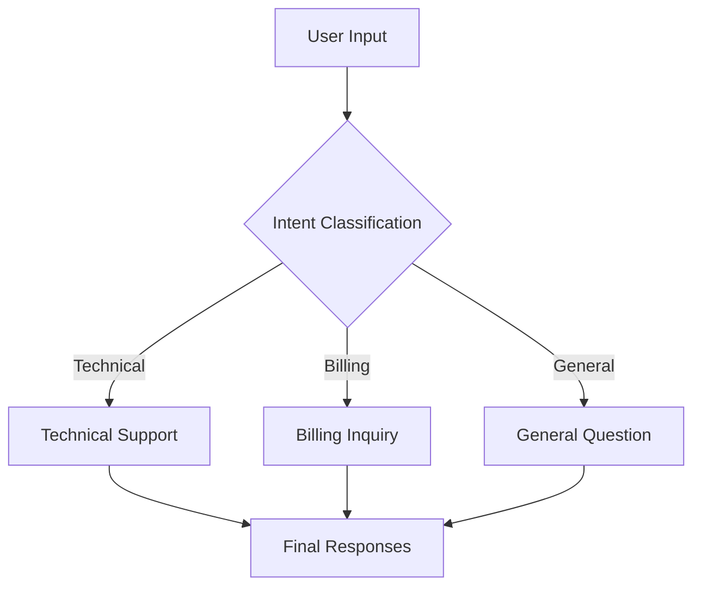
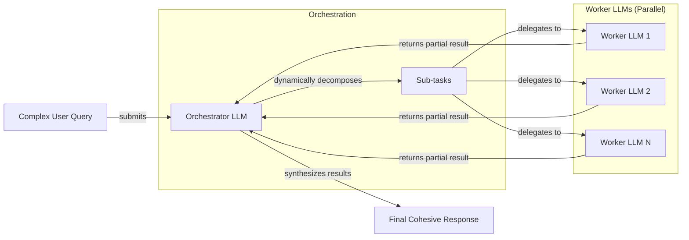

# Lesson 5: Basic Workflow Patterns

In our previous lessons, we laid the groundwork for AI Engineering. We explored the agent landscape, distinguished between rule-based LLM workflows and autonomous AI agents, and covered context engineering. We also saw how to get reliable, structured information out of an LLM. Now, we will build on that foundation by assembling these components into basic, yet powerful, workflows.

This lesson explores the fundamental patterns for building multi-step LLM applications: chaining, parallelization, routing, and the orchestrator-worker pattern. These techniques are the building blocks for almost any production-grade AI system. By mastering them, you move from making single, isolated LLM calls to architecting robust, modular, and reliable applications that can solve complex problems.

We will cover:
- The challenges of using a single, complex LLM call.
- Why modularity through prompt chaining is a better approach.
- How to build a sequential workflow for FAQ generation.
- How to optimize workflows with parallel processing.
- How to introduce dynamic behavior with routing.
- How to implement the powerful orchestrator-worker pattern.

## The Challenge with Complex Single LLM Calls

When first starting with LLMs, it’s tempting to solve complex problems with a single, massive prompt. You write a long list of instructions, provide all the context, and hope for the best. While this can work for simple demos, it quickly breaks down in production. A single, monolithic prompt trying to handle a multi-step task is problematic for several reasons.

First, debugging becomes a nightmare. When the output is wrong, it’s nearly impossible to pinpoint which part of the instruction the model failed to follow. Was it the data extraction, the summarization, or the formatting? With a single call, the entire process is a black box, making it difficult to isolate and fix failures. This is a common challenge noted in production case studies, where teams at companies like Acxiom and AppFolio turned to tools like LangSmith for observability to debug complex, multi-step workflows [[17]](https://www.zenml.io/blog/llmops-in-production-457-case-studies-of-what-actually-works).

Second, this approach lacks modularity. If you want to improve one part of the task, you have to rewrite the entire prompt, which might negatively affect other parts. Swapping out a model or updating a single step becomes a major engineering effort, creating a brittle and unmaintainable system.

Third, and perhaps most critically, LLM performance degrades with long and complex contexts. Models are prone to the "lost-in-the-middle" problem, where they forget instructions or details buried in the middle of a long prompt. This isn't just an anecdotal observation; a 2023 study from Stanford, UC Berkeley, and Samaya AI demonstrated a clear U-shaped performance curve where information at the beginning and end of the context is recalled far more accurately than information in the middle [[1]](https://dev.to/thousand_miles_ai/the-lost-in-the-middle-problem-why-llms-ignore-the-middle-of-your-context-window-3al2). This bias is rooted in the Transformer architecture itself, stemming from causal attention masking (where early tokens get more cumulative attention) and the distance-based decay of positional encodings like Rotary Positional Encodings (RoPE) [[1]](https://dev.to/thousand_miles_ai/the-lost-in-the-middle-problem-why-llms-ignore-the-middle-of-your-context-window-3al2).

Finally, a single complex prompt is often inefficient and unreliable. It can lead to higher token consumption and increased latency as the model struggles to process convoluted instructions. The more complex the task, the more likely the LLM is to hallucinate, miss a step, or fail to produce the desired output format. Empirical studies confirm this: as the number of requirements in a prompt increases, model accuracy drops significantly [[2]](https://arxiv.org/html/2505.13360v1). For a single long call, the probability of correctness can decay exponentially with each additional step, making modular decomposition essential for reliable error mitigation [[3]](https://arxiv.org/html/2511.09030v1).

Let’s look at a practical example. We will use the Google Gemini API to build our examples.

1.  First, we set up our environment by initializing the Gemini client and defining our model ID. We will use `gemini-1.5-flash`, which is fast and cost-effective for these tasks.
    ```python
    import asyncio
    from enum import Enum
    import random
    import time
    import os
    
    from pydantic import BaseModel, Field
    from google import genai
    from google.generative_ai import types
    
    # Load GOOGLE_API_KEY from .env file
    from lessons.utils import env
    env.load(required_env_vars=["GOOGLE_API_KEY"])
    
    client = genai
    client.configure(api_key=os.environ["GOOGLE_API_KEY"])
    
    MODEL_ID = "gemini-1.5-flash"
    ```
2.  Next, we create some mock data. These three webpages on renewable energy will be our source content.
    ```python
    webpage_1 = {
        "title": "The Benefits of Solar Energy",
        "content": """
        Solar energy is a renewable powerhouse, offering numerous environmental and economic benefits.
        By converting sunlight into electricity through photovoltaic (PV) panels, it reduces reliance on fossil fuels,
        thereby cutting down greenhouse gas emissions. Homeowners who install solar panels can significantly
        lower their monthly electricity bills, and in some cases, sell excess power back to the grid.
        While the initial installation cost can be high, government incentives and long-term savings make
        it a financially viable option for many. Solar power is also a key component in achieving energy
        independence for nations worldwide.
        """,
    }
    
    webpage_2 = {
        "title": "Understanding Wind Turbines",
        "content": """
        Wind turbines are towering structures that capture kinetic energy from the wind and convert it into
        electrical power. They are a critical part of the global shift towards sustainable energy.
        Turbines can be installed both onshore and offshore, with offshore wind farms generally producing more
        consistent power due to stronger, more reliable winds. The main challenge for wind energy is its
        intermittency—it only generates power when the wind blows. This necessitates the use of energy
        storage solutions, like large-scale batteries, to ensure a steady supply of electricity.
        """,
    }
    
    webpage_3 = {
        "title": "Energy Storage Solutions",
        "content": """
        Effective energy storage is the key to unlocking the full potential of renewable sources like solar
        and wind. Because these sources are intermittent, storing excess energy when it's plentiful and
        releasing it when it's needed is crucial for a stable power grid. The most common form of
        large-scale storage is pumped-hydro storage, but battery technologies, particularly lithium-ion,
        are rapidly becoming more affordable and widespread. These batteries can be used in homes, businesses,
        and at the utility scale to balance energy supply and demand, making our energy system more
        resilient and reliable.
        """,
    }
    
    all_sources = [webpage_1, webpage_2, webpage_3]
    
    # We'll combine the content for the LLM to process
    combined_content = "\n\n".join(
        [f"Source Title: {source['title']}\nContent: {source['content']}" for source in all_sources]
    )
    ```
3.  Now, here is a complex prompt that asks the LLM to generate questions, find answers, and cite sources all in a single call.
    ```python
    # Pydantic classes for structured outputs
    class FAQ(BaseModel):
        """A FAQ is a question and answer pair, with a list of sources used to answer the question."""
        question: str = Field(description="The question to be answered")
        answer: str = Field(description="The answer to the question")
        sources: list[str] = Field(description="The sources used to answer the question")
    
    class FAQList(BaseModel):
        """A list of FAQs"""
        faqs: list[FAQ] = Field(description="A list of FAQs")
    
    n_questions = 10
    prompt_complex = f"""
    Based on the provided content from three webpages, generate a list of exactly {n_questions} frequently asked questions (FAQs).
    For each question, provide a concise answer derived ONLY from the text.
    After each answer, you MUST include a list of the 'Source Title's that were used to formulate that answer.
    
    <provided_content>
    {combined_content}
    </provided_content>
    """.strip()
    
    model = genai.GenerativeModel(MODEL_ID)
    
    # Generate FAQs
    generation_config = types.GenerationConfig(
        response_mime_type="application/json",
    )
    
    response_complex = model.generate_content(
        prompt_complex,
        generation_config=generation_config,
        tools=[FAQList]
    )
    
    # The result is automatically parsed into a Pydantic object
    result_complex = response_complex.candidates[0].content.parts[0].function_call
    ```
    It outputs:
    ```json
    {
      "question": "What is solar energy and how does it work?",
      "answer": "Solar energy is a renewable powerhouse that converts sunlight into electricity through photovoltaic (PV) panels.",
      "sources": [
        "The Benefits of Solar Energy"
      ]
    }
    {
      "question": "What are the environmental benefits of using solar energy?",
      "answer": "Solar energy reduces reliance on fossil fuels, thereby cutting down greenhouse gas emissions.",
      "sources": [
        "The Benefits of Solar Energy"
      ]
    }
    ...
    ```
While the output might look acceptable at first glance, this approach is brittle. The more instructions you add, the more likely the model is to make a mistake. For example, it might fail to cite a source correctly or generate fewer questions than requested. This lack of reliability makes single-call systems a poor choice for production.

## The Power of Modularity: Why Chain LLM Calls?

A more robust solution is to break down the complex task into a series of smaller, simpler steps. This is the core idea behind prompt chaining: connecting multiple LLM calls sequentially, where the output of one step becomes the input for the next [[4]](https://medium.com/@fabiolalli/a-practical-guide-to-prompt-engineering-techniques-and-their-use-cases-5f8574e2cd9a), [[5]](https://www.decodingai.com/p/stop-building-ai-agents-use-these). It’s a classic "divide and conquer" strategy applied to AI engineering, mirroring established software architecture patterns like Pipes and Filters, where data flows through a series of independent, single-responsibility components [[6]](https://aws.amazon.com/blogs/compute/application-integration-patterns-for-microservices-orchestration-and-coordination/).

This modular approach has several benefits that directly address the shortcomings of monolithic prompts.
- **Improved Modularity:** Each LLM call focuses on a specific, well-defined sub-task. This makes the system easier to build, test, and maintain. You can work on each component in isolation, confident that improvements won't break the entire workflow.
- **Enhanced Accuracy:** Simpler, targeted prompts lead to more reliable outputs. An LLM is much better at doing one thing well than three things at once [[5]](https://www.decodingai.com/p/stop-building-ai-agents-use-these). An empirical study comparing single-task and multitask prompts across five different LLMs found that for 3 out of 5 models, the single-task approach yielded better results, confirming that simpler prompts often outperform complex ones [[18]](https://www.mdpi.com/2079-9292/13/23/4712).
- **Easier Debugging:** If a step fails, you can isolate the problem to a specific link in the chain. This makes debugging exponentially easier than trying to figure out what went wrong in a single, massive prompt.
- **Increased Flexibility:** You can swap, update, or optimize individual components independently. For instance, you could use a cheaper, faster model for a simple classification step and a more powerful model for complex content generation.

However, chaining is not without its trade-offs. The primary downsides are increased latency and cost. Making multiple API calls takes longer and consumes more tokens than a single call. There is also a risk of information loss or "context drift" as data is passed between steps; an error or a subtle misinterpretation in an early step can cascade and affect the entire chain [[7]](https://futureagi.substack.com/p/how-tool-chaining-fails-in-production). Furthermore, some instructions may only make sense when presented together, losing their intended meaning when split across multiple prompts. Despite these challenges, the gains in reliability and maintainability often make chaining the superior choice for production systems.

## Building a Sequential Workflow: FAQ Generation Pipeline

Let's refactor our FAQ generation example into a three-step sequential workflow. This hands-on approach will make the benefits of modularity concrete. Our new pipeline will be:
1.  **Generate Questions:** Create a list of questions based on the source content.
2.  **Answer Questions:** For each question, generate a concise answer.
3.  **Find Sources:** For each question-answer pair, identify the source documents.

Image 1: The sequential FAQ generation pipeline.
```mermaid
flowchart LR
  "Input Content" --> "Generate Questions"
  "Generate Questions" --> "Answer Questions"
  "Answer Questions" --> "Find Sources"
```
This structure makes each step focused and manageable, turning a complex task into a clear, linear process.

1.  First, we create a function dedicated solely to generating questions. The prompt is simple and direct: given the content, produce a list of relevant questions. We use a Pydantic model, `QuestionList`, to ensure the output is a well-formed list of strings. This is the first link in our chain.
    ```python
    class QuestionList(BaseModel):
        """A list of questions"""
        questions: list[str] = Field(description="A list of questions")
    
    prompt_generate_questions = """
    Based on the content below, generate a list of {n_questions} relevant and distinct questions that a user might have.
    
    <provided_content>
    {combined_content}
    </provided_content>
    """.strip()
    
    def generate_questions(content: str, n_questions: int = 10) -> list[str]:
        """
        Generate a list of questions based on the provided content.
        """
        model = genai.GenerativeModel(MODEL_ID)
        response_questions = model.generate_content(
            prompt_generate_questions.format(n_questions=n_questions, combined_content=content),
            generation_config=generation_config,
            tools=[QuestionList]
        )
        
        function_call = response_questions.candidates[0].content.parts[0].function_call
        question_list = QuestionList.from_dict(function_call.args)
        return question_list.questions
    
    # Test the function
    questions = generate_questions(combined_content, n_questions=10)
    ```
    It outputs:
    ```text
    ['What are the primary environmental and economic benefits of solar energy?', 'How do homeowners financially benefit from installing solar panels?', 'What is the main process by which wind turbines generate electricity?', 'What is the primary challenge of wind energy, and how is it addressed?', 'Why is effective energy storage crucial for renewable energy sources like solar and wind?', 'What are some common large-scale energy storage methods mentioned?', 'Are there government incentives available for solar panel installation?', 'What is the difference in power consistency between onshore and offshore wind farms?', 'How do energy storage solutions make the energy system more resilient and reliable?', 'Can excess solar power generated by homeowners be sold back to the grid?']
    ```
2.  Next, we build the second link: a function to answer a single question. This prompt is highly focused, instructing the model to use only the provided content to generate a concise answer. This isolation prevents the model from pulling in outside knowledge and keeps the response grounded in our source material.
    ```python
    prompt_answer_question = """
    Using ONLY the provided content below, answer the following question.
    The answer should be concise and directly address the question.
    
    <question>
    {question}
    </question>
    
    <provided_content>
    {combined_content}
    </provided_content>
    """.strip()
    
    def answer_question(question: str, content: str) -> str:
        """
        Generate an answer for a specific question using only the provided content.
        """
        model = genai.GenerativeModel(MODEL_ID)
        answer_response = model.generate_content(
            prompt_answer_question.format(question=question, combined_content=content),
        )
        return answer_response.text
    
    # Test the function
    test_question = questions[0]
    test_answer = answer_question(test_question, combined_content)
    ```
    It outputs:
    ```text
    The primary environmental benefit of solar energy is cutting down greenhouse gas emissions by reducing reliance on fossil fuels. Economically, it allows homeowners to significantly lower their monthly electricity bills and potentially sell excess power back to the grid.
    ```
3.  The final link in our chain is the `find_sources` function. This step adds crucial traceability to our system. The prompt takes a question and its generated answer, then asks the model to identify which of the original source titles were used. This is a form of self-verification, ensuring we can always trace an answer back to its origin.
    ```python
    class SourceList(BaseModel):
        """A list of source titles that were used to answer the question"""
        sources: list[str] = Field(description="A list of source titles that were used to answer the question")
    
    prompt_find_sources = """
    You will be given a question and an answer that was generated from a set of documents.
    Your task is to identify which of the original documents were used to create the answer.
    
    <question>
    {question}
    </question>
    
    <answer>
    {answer}
    </answer>
    
    <provided_content>
    {combined_content}
    </provided_content>
    """.strip()
    
    def find_sources(question: str, answer: str, content: str) -> list[str]:
        """
        Identify which sources were used to generate an answer.
        """
        model = genai.GenerativeModel(MODEL_ID)
        sources_response = model.generate_content(
            prompt_find_sources.format(question=question, answer=answer, combined_content=content),
            generation_config=generation_config,
            tools=[SourceList]
        )
        
        function_call = sources_response.candidates[0].content.parts[0].function_call
        source_list = SourceList.from_dict(function_call.args)
        return source_list.sources
    
    # Test the function
    test_sources = find_sources(test_question, test_answer, combined_content)
    ```
    It outputs:
    ```text
    ['The Benefits of Solar Energy']
    ```
4.  Now, we tie these functions together in our main `sequential_workflow`. The logic is straightforward: we first call `generate_questions` once. Then, we loop through each question, calling `answer_question` and `find_sources` in sequence. This step-by-step execution ensures that each part of the task is completed before moving to the next, giving us a clear and predictable flow.
    ```python
    def sequential_workflow(content, n_questions=10) -> list[FAQ]:
        """
        Execute the complete sequential workflow for FAQ generation.
        """
        # Generate questions
        questions = generate_questions(content, n_questions)
    
        # Answer and find sources for each question sequentially
        final_faqs = []
        for question in questions:
            # Generate an answer for the current question
            answer = answer_question(question, content)
    
            # Identify the sources for the generated answer
            sources = find_sources(question, answer, content)
    
            faq = FAQ(
                question=question,
                answer=answer,
                sources=sources
            )
            final_faqs.append(faq)
    
        return final_faqs
    
    # Execute the sequential workflow
    start_time = time.monotonic()
    sequential_faqs = sequential_workflow(combined_content, n_questions=4)
    end_time = time.monotonic()
    print(f"Sequential processing completed in {end_time - start_time:.2f} seconds")
    ```
    It outputs:
    ```text
    Sequential processing completed in 17.58 seconds
    ```
This modular approach is far more robust than our initial monolithic prompt. Each step is simple, testable, and easier to debug. If the answers are poor, we can focus on improving the `answer_question` prompt without touching the other components. If source attribution is failing, we can refine the `find_sources` logic in isolation. The total execution time for four questions is about 17-22 seconds, which sets a clear baseline for our next optimization.

## Optimizing Sequential Workflows With Parallel Processing

The sequential workflow is reliable, but it can be slow. Since answering each question is an independent task, we don’t need to wait for one to finish before starting the next. We can run these steps in parallel to significantly reduce the total processing time. This pattern is ideal for independent subtasks where speed is a priority, such as summarizing multiple documents concurrently before a final synthesis step [[19]](https://deepchecks.com/orchestrating-multi-step-llm-chains-best-practices/).

However, parallelization introduces new challenges. Making many concurrent API calls can quickly exhaust your rate limits. Production systems must implement robust rate limiting and exponential backoff strategies with jitter to handle this gracefully [[8]](https://tianpan.co/blog/2026-03-11-llm-api-resilience-production). For I/O-bound tasks like API calls, Python's `asyncio` library is an excellent choice. It allows you to manage thousands of concurrent operations efficiently within a single thread, avoiding the overhead of traditional multi-threading [[9]](https://medium.com/@sizanmahmud08/python-concurrency-showdown-asyncio-vs-threading-vs-multiprocessing-which-should-you-choose-in-31205161899a), [[20]](https://santhalakshminarayana.github.io/blog/concurrency-patterns-python).

1.  Let's implement a parallel version of our workflow. We will create asynchronous versions of our `answer_question` and `find_sources` functions using `async def`. The `google-genai` library provides an `aio` (asynchronous I/O) client for this purpose, allowing us to use `await` for non-blocking API calls. The `process_question_parallel` function encapsulates the logic for a single question, sequentially awaiting the answer and then the sources, but it will be run concurrently for multiple questions.
    ```python
    async def answer_question_async(question: str, content: str) -> str:
        """
        Async version of answer_question function.
        """
        model = genai.GenerativeModel(MODEL_ID)
        prompt = prompt_answer_question.format(question=question, combined_content=content)
        response = await model.generate_content_async(prompt)
        return response.text
    
    async def find_sources_async(question: str, answer: str, content: str) -> list[str]:
        """
        Async version of find_sources function.
        """
        model = genai.GenerativeModel(MODEL_ID)
        prompt = prompt_find_sources.format(question=question, answer=answer, combined_content=content)
        response = await model.generate_content_async(
            prompt,
            generation_config=generation_config,
            tools=[SourceList]
        )
        
        function_call = response.candidates[0].content.parts[0].function_call
        source_list = SourceList.from_dict(function_call.args)
        return source_list.sources
    
    async def process_question_parallel(question: str, content: str) -> FAQ:
        """
        Process a single question by generating an answer and finding sources.
        Note: Answering and finding sources happen sequentially for a single question,
        but multiple questions are processed in parallel.
        """
        answer = await answer_question_async(question, content)
        sources = await find_sources_async(question, answer, content)
        return FAQ(
            question=question,
            answer=answer,
            sources=sources
        )
    ```
2.  Now, we define the `parallel_workflow`. The `generate_questions` step remains synchronous, as we need the list of questions before we can process them. Then, we create a list of tasks—one for each question—and use `asyncio.gather(*tasks)` to execute them all concurrently. `asyncio.gather` waits for all the tasks to complete and returns their results in a list.
    ```python
    async def parallel_workflow(content: str, n_questions: int = 10) -> list[FAQ]:
        """
        Execute the complete parallel workflow for FAQ generation.
        """
        # Generate questions (this step remains synchronous)
        questions = generate_questions(content, n_questions)
    
        # Process all questions in parallel
        tasks = [process_question_parallel(question, content) for question in questions]
        parallel_faqs = await asyncio.gather(*tasks)
    
        return parallel_faqs
    
    # Execute the parallel workflow
    start_time = time.monotonic()
    parallel_faqs = await parallel_workflow(combined_content, n_questions=4)
    end_time = time.monotonic()
    print(f"Parallel processing completed in {end_time - start_time:.2f} seconds")
    ```
    It outputs:
    ```text
    Parallel processing completed in 7.97 seconds
    ```
By running the tasks in parallel, we cut the execution time from over 17 seconds to around 8 seconds. This is a more than 2x speedup. For a larger number of questions, the time savings would be even more significant as the total time would be dictated by the longest-running task, not the sum of all tasks. This demonstrates the power of parallelization for optimizing I/O-bound workflows. While both sequential and parallel approaches produce the same results, parallel processing is significantly faster and makes better use of resources, though it does add complexity to error handling and requires careful management of API rate limits.

## Introducing Dynamic Behavior: Routing and Conditional Logic

Sequential and parallel workflows are powerful, but they are fixed. The steps are predefined. What if your application needs to make decisions and change its behavior based on the user's input? A system that can dynamically adapt its processing path is necessary.

Routing, or conditional logic, introduces this dynamic element to your workflows [[5]](https://www.decodingai.com/p/stop-building-ai-agents-use-these). It allows you to classify an input and direct it down a specific path to a specialized prompt or handler. This is another application of the "divide and conquer" principle. Instead of trying to create a single, complex prompt that handles all possible inputs, you create multiple, simpler prompts, each optimized for a specific case. An initial LLM call acts as a classifier or router to decide which path to take, much like a decision tree in traditional programming [[21]](https://medium.com/data-science/tackle-complex-llm-decision-making-with-language-agent-tree-search-lats-gpt4-o-0bc648c46ea4).

This pattern is essential for building applications that can handle a variety of user intents, such as customer support bots that need to distinguish between billing questions, technical issues, and general inquiries [[10]](https://www.vellum.ai/blog/how-to-build-intent-detection-for-your-chatbot). However, it's important to be pragmatic. For a small, well-defined number of intents (e.g., fewer than 50), a traditional rule-based engine or a simple classifier can be more performant and cost-effective than an LLM-based router [[11]](https://dev.to/shravaniparsi/code-chains-graphs-state-machines-an-engineers-field-guide-to-ai-patterns-31ai). Simple LLM-based intent classification can also fail when a user query contains multiple, compound intents, requiring more advanced patterns to deconstruct the request [[12]](https://pub.towardsai.net/intent-classification-isnt-enough-failure-modes-in-a-whatsapp-llm-pipeline-that-had-to-ask-before-2131e1df13ef).

## Building a Basic Routing Workflow

Let's build a simple routing system for a customer service chatbot. The system will classify a user's query into one of three intents—`Technical Support`, `Billing Inquiry`, or `General Question`—and route it to the appropriate handler. This creates a more intelligent and efficient support system.

Image 2: A routing workflow for customer service.

This diagram shows how a single input can be directed to different processing paths based on its classified intent.

1.  First, we define our intents using a Python `Enum` for clarity and a Pydantic model, `UserIntent`, to enforce the structure of the classifier's output. The `classify_intent` function takes a user query and uses the LLM to categorize it into one of the predefined intents. The prompt is designed to be clear and restrictive, asking the model to choose only from the provided categories.
    ```python
    class IntentEnum(str, Enum):
        """Defines the allowed values for the 'intent' field."""
        TECHNICAL_SUPPORT = "Technical Support"
        BILLING_INQUIRY = "Billing Inquiry"
        GENERAL_QUESTION = "General Question"
    
    class UserIntent(BaseModel):
        """Defines the expected response schema for the intent classification."""
        intent: IntentEnum = Field(description="The intent of the user's query")
    
    prompt_classification = """
    Classify the user's query into one of the following categories.
    
    <categories>
    {categories}
    </categories>
    
    <user_query>
    {user_query}
    </user_query>
    """.strip()
    
    def classify_intent(user_query: str) -> IntentEnum:
        """Uses an LLM to classify a user query."""
        prompt = prompt_classification.format(
            user_query=user_query,
            categories=[intent.value for intent in IntentEnum]
        )
        model = genai.GenerativeModel(MODEL_ID)
        response = model.generate_content(
            prompt,
            generation_config=generation_config,
            tools=[UserIntent]
        )
        
        function_call = response.candidates[0].content.parts[0].function_call
        user_intent = UserIntent.from_dict(function_call.args)
        return user_intent.intent
    
    # Test queries
    query_1 = "My internet connection is not working."
    query_2 = "I think there is a mistake on my last invoice."
    query_3 = "What are your opening hours?"
    
    intent_1 = classify_intent(query_1)
    intent_2 = classify_intent(query_2)
    intent_3 = classify_intent(query_3)
    ```
    It outputs:
    ```text
    Query 1 -> Technical Support
    Query 2 -> Billing Inquiry
    Query 3 -> General Question
    ```
2.  Next, we define specialized prompts for each intent. Each prompt is tailored to provide an appropriate first response for that specific type of query. The technical support prompt asks for troubleshooting details, the billing prompt asks for an account number, and the general prompt provides a polite fallback. This separation of concerns is key to the routing pattern's effectiveness.
    ```python
    prompt_technical_support = """
    You are a helpful technical support agent.
    
    Here's the user's query:
    <user_query>
    {user_query}
    </user_query>
    
    Provide a helpful first response, asking for more details like what troubleshooting steps they have already tried.
    """.strip()
    
    prompt_billing_inquiry = """
    You are a helpful billing support agent.
    
    Here's the user's query:
    <user_query>
    {user_query}
    </user_query>
    
    Acknowledge their concern and inform them that you will need to look up their account, asking for their account number.
    """.strip()
    
    prompt_general_question = """
    You are a general assistant.
    
    Here's the user's query:
    <user_query>
    {user_query}
    </user_query>
    
    Apologize that you are not sure how to help.
    """.strip()
    ```
3.  Finally, we create a `handle_query` function that acts as our router. It takes the user query and the classified intent, then uses a simple `if/elif/else` block to select the correct prompt. This function calls the LLM with the specialized prompt, ensuring the user receives a contextually appropriate response.
    ```python
    def handle_query(user_query: str, intent: str) -> str:
        """Routes a query to the correct handler based on its classified intent."""
        if intent == IntentEnum.TECHNICAL_SUPPORT:
            prompt = prompt_technical_support.format(user_query=user_query)
        elif intent == IntentEnum.BILLING_INQUIRY:
            prompt = prompt_billing_inquiry.format(user_query=user_query)
        else:
            prompt = prompt_general_question.format(user_query=user_query)
        
        model = genai.GenerativeModel(MODEL_ID)
        response = model.generate_content(prompt)
        return response.text
    
    # Generate responses
    response_1 = handle_query(query_1, intent_1)
    response_2 = handle_query(query_2, intent_2)
    response_3 = handle_query(query_3, intent_3)
    ```
    For the query "My internet connection is not working," the system correctly classifies the intent as `Technical Support` and generates a helpful response:
    ```text
    Hello there! I'm sorry to hear you're having trouble with your internet connection. To help me troubleshoot, could you tell me a bit more about what's happening? For example, have you tried restarting your router?
    ```
This routing pattern allows us to build more sophisticated and context-aware applications. By separating concerns, we can create highly specialized and effective prompts for each scenario, leading to better performance and a more reliable system. In practice, however, intent classifiers are a common point of failure, especially when dealing with ambiguous phrasing or queries that combine multiple intents, which can lead to cascading errors downstream [[12]](https://pub.towardsai.net/intent-classification-isnt-enough-failure-modes-in-a-whatsapp-llm-pipeline-that-had-to-ask-before-2131e1df13ef).

## Orchestrator-Worker Pattern: Dynamic Task Decomposition

The patterns we have seen so far—chaining, parallelization, and routing—are powerful building blocks. The orchestrator-worker pattern combines them to create highly flexible and dynamic systems. This pattern is not new; it mirrors well-established concepts in microservices like the Orchestration Saga pattern, where a central service coordinates a sequence of transactions across distributed services [[15]](https://medium.com/gett-engineering/architectural-patterns-orchestration-saga-0d03894ce9e8). In an LLM workflow, a central "orchestrator" LLM analyzes a complex task, dynamically breaks it down into smaller subtasks, delegates them to specialized "worker" LLMs, and finally synthesizes their results into a cohesive response [[13]](https://agents.kour.me/orchestrator-worker/), [[14]](https://platform.claude.com/cookbook/patterns-agents-orchestrator-workers).

Image 3: The orchestrator-worker pattern.

This pattern is ideal for unpredictable tasks where the exact steps cannot be known in advance. The key difference from simple parallelization is its flexibility: the subtasks are not predefined but are determined at runtime by the orchestrator based on the specific input. This allows the system to adapt to novel or complex user requests that don't fit a rigid workflow.

Let's build a customer service system using this pattern. The orchestrator will parse a complex user query that involves multiple distinct issues and delegate each one to a specialized worker.

1.  First, we define the `orchestrator`. Its job is to analyze a user query and break it down into a list of structured tasks. We use Pydantic models to define the exact format for each task type (`BillingInquiry`, `ProductReturn`, `StatusUpdate`). The prompt clearly instructs the LLM on the available task types and their required parameters, turning the user's free-form text into a machine-readable plan.
    ```python
    class QueryTypeEnum(str, Enum):
        BILLING_INQUIRY = "BillingInquiry"
        PRODUCT_RETURN = "ProductReturn"
        STATUS_UPDATE = "StatusUpdate"
    
    class Task(BaseModel):
        query_type: QueryTypeEnum
        invoice_number: str | None = None
        product_name: str | None = None
        reason_for_return: str | None = None
        order_id: str | None = None
    
    class TaskList(BaseModel):
        tasks: list[Task]
    
    prompt_orchestrator = f"""
    You are a master orchestrator. Your job is to break down a complex user query into a list of sub-tasks.
    Each sub-task must have a "query_type" and its necessary parameters.
    
    The possible "query_type" values and their required parameters are:
    1. "{QueryTypeEnum.BILLING_INQUIRY.value}": Requires "invoice_number".
    2. "{QueryTypeEnum.PRODUCT_RETURN.value}": Requires "product_name" and "reason_for_return".
    3. "{QueryTypeEnum.STATUS_UPDATE.value}": Requires "order_id".
    
    Here's the user's query.
    
    <user_query>
    {{query}}
    </user_query>
    """.strip()
    
    def orchestrator(query: str) -> list[Task]:
        """Breaks down a complex query into a list of tasks."""
        prompt = prompt_orchestrator.format(query=query)
        model = genai.GenerativeModel(MODEL_ID)
        response = model.generate_content(
            prompt,
            generation_config=generation_config,
            tools=[TaskList]
        )
        function_call = response.candidates[0].content.parts[0].function_call
        task_list = TaskList.from_dict(function_call.args)
        return task_list.tasks
    ```
2.  Next, we implement our specialized workers. Each worker is a Python function that handles a specific task type. In a real-world application, these workers would interact with backend systems, databases, or external APIs. For this example, they simulate these actions (like opening an investigation or generating a return authorization) and return structured data. This separation of concerns is crucial: the orchestrator plans, and the workers execute.
    ```python
    # Billing Worker
    def handle_billing_worker(invoice_number: str, original_user_query: str) -> dict:
        # ... (implementation simulates opening an investigation)
        pass
    
    # Product Return Worker
    def handle_return_worker(product_name: str, reason_for_return: str) -> dict:
        # ... (implementation simulates generating an RMA)
        pass
    
    # Order Status Worker
    def handle_status_worker(order_id: str) -> dict:
        # ... (implementation simulates fetching order status)
        pass
    ```
3.  The `synthesizer` is another LLM-powered component. Its job is to take the structured outputs from all the workers and compose a single, friendly, and coherent email to the customer. This final step is critical for user experience, as it transforms a series of internal actions into a single, easy-to-understand response.
    ```python
    prompt_synthesizer = """
    You are a master communicator. Combine several distinct pieces of information from our support team into a single, well-formatted, and friendly email to a customer.
    
    Here are the points to include, based on the actions taken for their query:
    <points>
    {formatted_results}
    </points>
    
    Combine these points into one cohesive response.
    """.strip()
    
    def synthesizer(results: list) -> str:
        """Combines structured results from workers into a single user-facing message."""
        # ... (implementation formats worker results and calls LLM)
        pass
    ```
4.  Finally, we put it all together in the main pipeline. The `process_user_query` function coordinates the entire flow. It calls the orchestrator to get the plan, loops through the tasks to dispatch the appropriate workers (which could be done in parallel), and then calls the synthesizer to generate the final response. Let's test it with a complex query that touches on all three of our worker specializations.
    ```python
    complex_customer_query = """
    Hi, I'm writing to you because I have a question about invoice #INV-7890. It seems higher than I expected.
    Also, I would like to return the 'SuperWidget 5000' I bought because it's not compatible with my system.
    Finally, can you give me an update on my order #A-12345?
    """.strip()
    
    def process_user_query(user_query):
        # 1. Run orchestrator to get tasks
        tasks_list = orchestrator(user_query)
    
        # 2. Run workers based on tasks
        worker_results = []
        for task in tasks_list:
            if task.query_type == QueryTypeEnum.BILLING_INQUIRY:
                worker_results.append(handle_billing_worker(task.invoice_number, user_query))
            elif task.query_type == QueryTypeEnum.PRODUCT_RETURN:
                worker_results.append(handle_return_worker(task.product_name, task.reason_for_return))
            elif task.query_type == QueryTypeEnum.STATUS_UPDATE:
                worker_results.append(handle_status_worker(task.order_id))
    
        # 3. Run synthesizer to create final response
        final_user_message = synthesizer(worker_results)
        print(final_user_message)
    
    process_user_query(complex_customer_query)
    ```
The orchestrator correctly deconstructs the query into three distinct tasks: a `BillingInquiry`, a `ProductReturn`, and a `StatusUpdate`. Each task is then processed by its corresponding worker, and the synthesizer combines the results into a single, comprehensive response. This pattern allows for incredible flexibility and scalability. However, the orchestrator itself can become a single point of failure. A poor decomposition of the initial query—creating subtasks that are too broad, too granular, or irrelevant—can lead to a completely incoherent final output, even if individual workers succeed at their flawed tasks [[16]](https://orq.ai/blog/why-do-multi-agent-llm-systems-fail).

## Conclusion

In this lesson, we have moved beyond single LLM calls and explored the foundational patterns for building robust, multi-step AI workflows. We have learned that breaking down complex tasks is almost always better than relying on a single, monolithic prompt.

We started with **prompt chaining**, a sequential pattern that improves reliability and debuggability by assigning one sub-task to each LLM call. We then saw how to speed up these workflows with **parallelization**, executing independent tasks concurrently. We introduced **routing** to add dynamic, conditional logic to our systems, allowing them to adapt their behavior based on user input. Finally, we combined these ideas into the powerful **orchestrator-worker** pattern, enabling dynamic task decomposition for complex and unpredictable problems.

These patterns—chaining, parallelization, routing, and orchestration—are not just theoretical concepts; they are the essential building blocks you will use to engineer reliable and scalable AI applications. They provide the control and modularity needed to move from simple prototypes to production-grade systems.

In our next lesson, we will take another big step forward by giving our workflows the ability to interact with the outside world. We will dive into agent tools and function calling, learning how to empower LLMs to take action.

## References
- [1] The "Lost in the Middle" Problem — Why LLMs Ignore the Middle of Your Context Window (https://dev.to/thousand_miles_ai/the-lost-in-the-middle-problem-why-llms-ignore-the-middle-of-your-context-window-3al2)
- [2] Instruction-Following Evaluation for Large Language Models (https://arxiv.org/html/2505.13360v1)
- [3] When is it Better to Use Multiple Small Language Models (SLMs) Instead of a Single Large One (LLM)? (https://arxiv.org/html/2511.09030v1)
- [4] A Practical Guide to Prompt Engineering Techniques and their Use-Cases (https://medium.com/@fabiolalli/a-practical-guide-to-prompt-engineering-techniques-and-their-use-cases-5f8574e2cd9a)
- [5] Stop Building AI Agents. Use These Instead. (https://www.decodingai.com/p/stop-building-ai-agents-use-these)
- [6] Application integration patterns for microservices: Orchestration and Coordination (https://aws.amazon.com/blogs/compute/application-integration-patterns-for-microservices-orchestration-and-coordination/)
- [7] How Tool-Chaining Fails in Production (https://futureagi.substack.com/p/how-tool-chaining-fails-in-production)
- [8] Building LLM applications for production (https://tianpan.co/blog/2026-03-11-llm-api-resilience-production)
- [9] Python Concurrency Showdown: Asyncio vs. Threading vs. Multiprocessing (https://medium.com/@sizanmahmud08/python-concurrency-showdown-asyncio-vs-threading-vs-multiprocessing-which-should-you-choose-in-31205161899a)
- [10] How to Build Intent Detection for Your Chatbot (https://www.vellum.ai/blog/how-to-build-intent-detection-for-your-chatbot)
- [11] Code, Chains, Graphs & State Machines: An Engineer's Field Guide to AI Patterns (https://dev.to/shravaniparsi/code-chains-graphs-state-machines-an-engineers-field-guide-to-ai-patterns-31ai)
- [12] Intent Classification Isn't Enough: Failure Modes in a WhatsApp LLM Pipeline That Had to Ask Before Recommending (https://pub.towardsai.net/intent-classification-isnt-enough-failure-modes-in-a-whatsapp-llm-pipeline-that-had-to-ask-before-2131e1df13ef)
- [13] Orchestrator-Worker (https://agents.kour.me/orchestrator-worker/)
- [14] Orchestrator-Workers (https://platform.claude.com/cookbook/patterns-agents-orchestrator-workers)
- [15] Architectural Patterns: Orchestration Saga (https://medium.com/gett-engineering/architectural-patterns-orchestration-saga-0d03894ce9e8)
- [16] Why Do Multi-Agent LLM Systems Fail? (https://orq.ai/blog/why-do-multi-agent-llm-systems-fail)
- [17] LLMOps in Production: 457 Case Studies of What Actually Works (https://www.zenml.io/blog/llmops-in-production-457-case-studies-of-what-actually-works)
- [18] Comparative Analysis of Prompt Strategies for Large Language Models: Single-Task vs. Multitask Prompts (https://www.mdpi.com/2079-9292/13/23/4712)
- [19] Orchestrating Multi-Step LLM Chains: Best Practices (https://deepchecks.com/orchestrating-multi-step-llm-chains-best-practices/)
- [20] Concurrency Patterns in Python (https://santhalakshminarayana.github.io/blog/concurrency-patterns-python)
- [21] Tackle Complex LLM Decision-Making with Language Agent Tree Search (LATS) & GPT4-o (https://medium.com/data-science/tackle-complex-llm-decision-making-with-language-agent-tree-search-lats-gpt4-o-0bc648c46ea4)