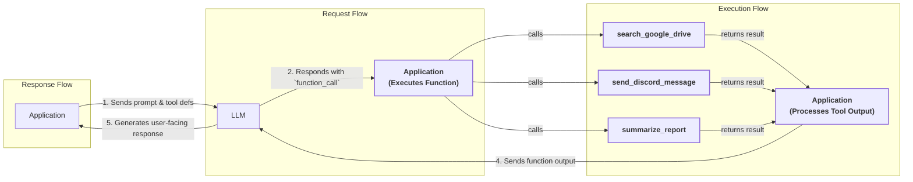
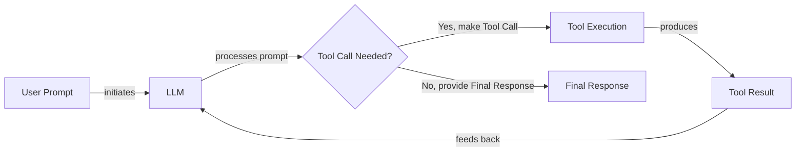

# Lesson 6: Agent Tools & Function Calling

In the previous lessons, we built a solid foundation in AI Engineering. We navigated the agent landscape, distinguished between rule-based LLM workflows and autonomous agents, and explored context engineering and structured outputs. We now have a system that can understand complex instructions and produce reliable, machine-readable data. But something is still missing. Our AI can think, but it cannot *act*.

This lesson introduces tools, the components that give an AI agent its hands and senses. Tools, also known as function calling, are what transform an LLM from a simple text generator into an agent that can interact with the external world. This capability is the critical link that allows an agent to go beyond its static training data and affect its environment [[8]](https://www.deeplearning.ai/the-batch/agentic-design-patterns-part-3-tool-use/). Understanding how an agent works with these tools is not just a technical detail; it is a fundamental skill for any AI engineer who wants to build, debug, and monitor production-grade applications. We will open this black box by implementing tool calling from scratch, then see how to build robust systems with modern APIs like Gemini.

## Why Agents Need Tools

LLMs have a fundamental limitation: they are sophisticated pattern matchers and text generators. They are trained on a static dataset, which means their knowledge is frozen in time and confined to the text they have seen [[15]](https://lnu.diva-portal.org/smash/get/diva2:1801354/FULLTEXT01.pdf). They cannot, on their own, browse the web for today's weather, check your calendar for an open slot, or query a database for the latest sales figures. This is where tools come in.

Think of the LLM as the brain of an agent. It can reason, plan, and understand language. But to perceive and interact with the world, it needs hands and senses. Tools provide this capability. They are the bridge between the LLM's internal reasoning and the external environment, allowing it to execute actions and retrieve fresh information. With tools, an LLM becomes a true AI agent that can interact with the environment and execute specific instructions [[5]](https://www.newsletter.swirlai.com/p/building-ai-agents-from-scratch-part).

https://substackcdn.com/image/fetch/f_auto,q_auto:good,fl_progressive:steep/https%3A%2F%2Fsubstack-post-media.s3.amazonaws.com%2Fpublic%2Fimages%2F3eb64772-fbb5-4f2d-8120-d473c74fe124_2926x2198.png
Image 1: An AI Agent's core components, with the LLM at the center. (Source [https://www.newsletter.swirlai.com/p/building-ai-agents-from-scratch-part](https://www.newsletter.swirlai.com/p/building-ai-agents-from-scratch-part) [[5]](https://www.newsletter.swirlai.com/p/building-ai-agents-from-scratch-part))

As illustrated in Image 1, an agent is composed of several building blocks with the LLM at its core. The LLM acts as the reasoning engine, deciding which steps to take to solve a user's intent. Tools are the functions the agent can call to enhance its reasoning capabilities, connecting it to the outside world.

Some of the most common capabilities enabled by tools include:

*   **Accessing real-time information:** Calling external APIs to get current data, like weather forecasts, stock prices, or news updates [[16]](https://medium.com/@yugalnandurkar5/llm-engineering-part-i-fa48d4307d26).
*   **Interacting with data stores:** Querying external systems like a PostgreSQL database, a Snowflake data warehouse, or an S3 data lake. This is a core component of an agent's long-term memory.
*   **Executing code:** Running Python or JavaScript in a sandboxed environment to perform precise calculations, manipulate data, or generate visualizations [[12]](https://arxiv.org/html/2507.08034v1).
*   **Controlling external systems:** Interacting with other software through APIs to send emails, schedule meetings, or manage project tasks.

## Implementing tool calls from scratch

The best way to understand how tools work is to build them from the ground up. In this section, we will implement a complete tool-calling flow from scratch. We will define a tool, create a schema for it, and write the logic that allows an LLM to decide when and how to use it. This hands-on approach will demystify what happens inside frameworks like LangChain or the Gemini SDK.

The process of calling a tool involves a five-step conversation between your application and the LLM [[45]](https://www.philschmid.de/gemini-function-calling):

1.  **Application:** You send the LLM a prompt that includes the user's request and a list of available tools defined by their schemas.
2.  **LLM:** The model analyzes the request and, if it decides a tool is needed, responds with a `function_call` object specifying the tool's name and the arguments to use.
3.  **Application:** Your code parses this response, identifies the requested tool, and executes the corresponding function with the provided arguments.
4.  **Application:** You send the output from the function execution back to the LLM.
5.  **LLM:** The model uses the tool's output to generate a final, user-facing response that completes the original request.

This request-execute-respond flow is the foundation of how agents take action.


Image 2: A flowchart illustrating the 5-step tool calling process with request-execute-respond flow highlighted and example tool calls.

Now, let's implement this flow. We will build a simple agent that can search for a document on a mock Google Drive, summarize it, and send the summary to a Discord channel.

1.  First, we set up our environment by installing the necessary libraries and configuring the Gemini API client. We will use the `gemini-2.5-flash` model, which is fast, cost-effective, and supports tool use. We also define a sample financial document to simulate what our search tool might find.
    ```python
    import json
    from typing import Any
    
    from google import genai
    from google.genai import types
    from pydantic import BaseModel, Field
    
    from lessons.utils import env, pretty_print
    
    env.load(required_env_vars=["GOOGLE_API_KEY"])
    
    client = genai.Client()
    
    MODEL_ID = "gemini-2.5-flash"
    
    DOCUMENT = """
    # Q3 2023 Financial Performance Analysis
    
    The Q3 earnings report shows a 20% increase in revenue and a 15% growth in user engagement, 
    beating market expectations. These impressive results reflect our successful product strategy 
    and strong market positioning.
    
    Our core business segments demonstrated remarkable resilience, with digital services leading 
    the growth at 25% year-over-year. The expansion into new markets has proven particularly 
    successful, contributing to 30% of the total revenue increase.
    
    Customer acquisition costs decreased by 10% while retention rates improved to 92%, 
    marking our best performance to date. These metrics, combined with our healthy cash flow 
    position, provide a strong foundation for continued growth into Q4 and beyond.
    """
    ```

2.  Next, we define our three tools as simple Python functions. For this example, the functions are mocked to return hardcoded data, which allows us to focus on the tool-calling logic itself. The function signature and docstrings are important, as the LLM will use them to understand what each tool does.
    ```python
    def search_google_drive(query: str) -> dict:
        """
        Searches for a file on Google Drive and returns its content or a summary.
    
        Args:
            query (str): The search query to find the file, e.g., 'Q3 earnings report'.
    
        Returns:
            dict: A dictionary representing the search results, including file names and summaries.
        """
        return {
            "files": [
                {
                    "name": "Q3_Earnings_Report_2024.pdf",
                    "id": "file12345",
                    "content": DOCUMENT,
                }
            ]
        }
    ```
    ```python
    def send_discord_message(channel_id: str, message: str) -> dict:
        """
        Sends a message to a specific Discord channel.
    
        Args:
            channel_id (str): The ID of the channel to send the message to, e.g., '#finance'.
            message (str): The content of the message to send.
    
        Returns:
            dict: A dictionary confirming the action, e.g., {"status": "success"}.
        """
        return {
            "status": "success",
            "status_code": 200,
            "channel": channel_id,
            "message_preview": f"{message[:50]}...",
        }
    ```
    ```python
    def summarize_financial_report(text: str) -> str:
        """
        Summarizes a financial report.
    
        Args:
            text (str): The text to summarize.
    
        Returns:
            str: The summary of the text.
        """
        return "The Q3 2023 earnings report shows strong performance across all metrics with 20% revenue growth, 15% user engagement increase, 25% digital services growth, and improved retention rates of 92%."
    ```

3.  For the LLM to use these functions, we must describe them in a format it understands. We create a JSON schema for each tool that details its `name`, `description`, and `parameters`. This schema acts as a contract, telling the model what the tool does, what inputs it needs, and what to expect in return. This is the industry-standard approach for modern LLM providers like OpenAI and Gemini [[44]](https://platform.openai.com/docs/guides/function-calling), [[2]](https://ai.google.dev/gemini-api/docs/function-calling).
    ```python
    search_google_drive_schema = {
        "name": "search_google_drive",
        "description": "Searches for a file on Google Drive and returns its content or a summary.",
        "parameters": {
            "type": "object",
            "properties": {
                "query": {
                    "type": "string",
                    "description": "The search query to find the file, e.g., 'Q3 earnings report'.",
                }
            },
            "required": ["query"],
        },
    }
    ```
    ```python
    send_discord_message_schema = {
        "name": "send_discord_message",
        "description": "Sends a message to a specific Discord channel.",
        "parameters": {
            "type": "object",
            "properties": {
                "channel_id": {
                    "type": "string",
                    "description": "The ID of the channel to send the message to, e.g., '#finance'.",
                },
                "message": {
                    "type": "string",
                    "description": "The content of the message to send.",
                },
            },
            "required": ["channel_id", "message"],
        },
    }
    ```
    ```python
    summarize_financial_report_schema = {
        "name": "summarize_financial_report",
        "description": "Summarizes a financial report.",
        "parameters": {
            "type": "object",
            "properties": {
                "text": {
                    "type": "string",
                    "description": "The text to summarize.",
                },
            },
            "required": ["text"],
        },
    }
    ```

4.  We then aggregate these definitions into a tool registry. This involves creating a dictionary to map tool names to their handler functions (`TOOLS_BY_NAME`) and a list of all tool schemas (`TOOLS_SCHEMA`) to be passed to the LLM.
    ```python
    TOOLS = {
        "search_google_drive": {
            "handler": search_google_drive,
            "declaration": search_google_drive_schema,
        },
        "send_discord_message": {
            "handler": send_discord_message,
            "declaration": send_discord_message_schema,
        },
        "summarize_financial_report": {
            "handler": summarize_financial_report,
            "declaration": summarize_financial_report_schema,
        },
    }
    TOOLS_BY_NAME = {tool_name: tool["handler"] for tool_name, tool in TOOLS.items()}
    TOOLS_SCHEMA = [tool["declaration"] for tool in TOOLS.values()]
    ```

5.  The `TOOLS_BY_NAME` mapping looks like this.
    ```text
    Tool name: search_google_drive
    Tool handler: <function search_google_drive at 0x104c7df80>
    ---------------------------------------------------------------------------
    Tool name: send_discord_message
    Tool handler: <function send_discord_message at 0x104c7de40>
    ---------------------------------------------------------------------------
    Tool name: summarize_financial_report
    Tool handler: <function summarize_financial_report at 0x1274f5c60>
    ---------------------------------------------------------------------------
    ```

6.  Here is an example schema for `search_google_drive` from `TOOLS_SCHEMA`.
    ```json
    {
      "name": "search_google_drive",
      "description": "Searches for a file on Google Drive and returns its content or a summary.",
      "parameters": {
        "type": "object",
        "properties": {
          "query": {
            "type": "string",
            "description": "The search query to find the file, e.g., 'Q3 earnings report'."
          }
        },
        "required": [
          "query"
        ]
      }
    }
    ```

7.  Now, we need a system prompt to instruct the LLM on how to use these tools. This prompt explains when to use tools, how to select them, and critically, the exact format for requesting a tool call. We enclose the list of available tools in `<tool_definitions>` tags.
    ```python
    TOOL_CALLING_SYSTEM_PROMPT = """
    You are a helpful AI assistant with access to tools that enable you to take actions and retrieve information to better 
    assist users.
    
    ## Tool Usage Guidelines
    
    **When to use tools:**
    - When you need information that is not in your training data
    - When you need to perform actions in external systems and environments
    - When you need real-time, dynamic, or user-specific data
    - When computational operations are required
    
    **Tool selection:**
    - Choose the most appropriate tool based on the user's specific request
    - If multiple tools could work, select the one that most directly addresses the need
    - Consider the order of operations for multi-step tasks
    
    **Parameter requirements:**
    - Provide all required parameters with accurate values
    - Use the parameter descriptions to understand expected formats and constraints
    - Ensure data types match the tool's requirements (strings, numbers, booleans, arrays)
    
    ## Tool Call Format
    
    When you need to use a tool, output ONLY the tool call in this exact format:
    
    ```tool_call
    {{"name": "tool_name", "args": {{"param1": "value1", "param2": "value2"}}}}
    ```
    
    **Critical formatting rules:**
    - Use double quotes for all JSON strings
    - Ensure the JSON is valid and properly escaped
    - Include ALL required parameters
    - Use correct data types as specified in the tool definition
    - Do not include any additional text or explanation in the tool call
    
    ## Response Behavior
    
    - If no tools are needed, respond directly to the user with helpful information
    - If tools are needed, make the tool call first, then provide context about what you're doing
    - After receiving tool results, provide a clear, user-friendly explanation of the outcome
    - If a tool call fails, explain the issue and suggest alternatives when possible
    
    ## Available Tools
    
    <tool_definitions>
    {tools}
    </tool_definitions>
    
    Remember: Your goal is to be maximally helpful to the user. Use tools when they add value, but don't use them unnecessarily. Always prioritize accuracy and user experience.
    """
    ```

8.  In practice, the LLM *decides* which tool to call based on the `description` field in the schema. This is why writing clear and articulate tool descriptions is so important. When multiple tools are available, their descriptions must be mutually exclusive to avoid confusion. For instance, two tools described as "Tool used to search documents" and "Tool used to search files" would be ambiguous. Better descriptions would be "Tool used to search documents on Google Drive" and "Tool used to search files on the local disk" [[20]](https://mbrenndoerfer.com/writing/function-calling-llm-structured-tools).
    
    This need for clarity becomes essential as you scale to dozens or even hundreds of tools per agent, a topic we will explore in more detail in Parts 2 and 3 of the course. As Anthropic's engineering team notes, if a tool's purpose isn't obvious to a junior developer, it won't be obvious to the model either [[25]](https://www.anthropic.com/research/building-effective-agents). By providing explicit descriptions and clear system prompts, you guide the agent to make the right choice. Once a tool is selected, the LLM *generates* the function name and arguments as a structured JSON output. This capability is not magic. It is a result of extensive instruction fine-tuning, where models are specifically trained to interpret schemas and produce valid tool calls.
    
9.  Let's test our setup. We provide a user prompt asking the agent to find a report and share insights.
    ```python
    USER_PROMPT = """
    Can you help me find the latest quarterly report and share key insights with the team?
    """
    
    messages = [TOOL_CALLING_SYSTEM_PROMPT.format(tools=str(TOOLS_SCHEMA)), USER_PROMPT]
    
    response = client.models.generate_content(
        model=MODEL_ID,
        contents=messages,
    )
    ```
    The model correctly identifies the `search_google_drive` tool and generates the required arguments.
    ```text
    ```tool_call
    {"name": "search_google_drive", "args": {"query": "latest quarterly report"}}
    ```
    ```

10. Here is another example with a more complex request.
    ```python
    USER_PROMPT = """
    Please find the Q3 earnings report on Google Drive and send a summary of it to 
    the #finance channel on Discord.
    """
    
    messages = [TOOL_CALLING_SYSTEM_PROMPT.format(tools=str(TOOLS_SCHEMA)), USER_PROMPT]
    
    response = client.models.generate_content(
        model=MODEL_ID,
        contents=messages,
    )
    ```
    The model correctly identifies that the first step is to search for the document.
    ```text
    ```tool_call
    {"name": "search_google_drive", "args": {"query": "Q3 earnings report"}}
    ```
    ```

11. Now we need to parse the LLM's response and execute the tool. First, we extract the JSON string from the Markdown block.
    ```python
    def extract_tool_call(response_text: str) -> str:
        """
        Extracts the tool call from the response text.
        """
        return response_text.split("```tool_call")[1].split("```")[0].strip()
    
    tool_call_str = extract_tool_call(response.text)
    ```
    It outputs:
    ```text
    '{"name": "search_google_drive", "args": {"query": "Q3 earnings report"}}'
    ```

12. Next, we parse the JSON string into a Python dictionary.
    ```python
    tool_call = json.loads(tool_call_str)
    ```
    It outputs:
    ```text
    {'name': 'search_google_drive', 'args': {'query': 'Q3 earnings report'}}
    ```

13. Now we can execute the function. We retrieve the function handler from our `TOOLS_BY_NAME` dictionary.
    ```python
    tool_handler = TOOLS_BY_NAME[tool_call["name"]]
    ```
    It outputs:
    ```text
    <function search_google_drive at 0x104c7df80>
    ```

14. Finally, we call the function using the arguments generated by the LLM.
    ```python
    tool_result = tool_handler(**tool_call["args"])
    ```
    The mocked tool returns the content of our sample document.
    ```json
    {
      "files": [
        {
          "name": "Q3_Earnings_Report_2024.pdf",
          "id": "file12345",
          "content": "\n# Q3 2023 Financial Performance Analysis\n\nThe Q3 earnings report shows a 20% increase in revenue and a 15% growth in user engagement, \nbeating market expectations. These impressive results reflect our successful product strategy \nand strong market positioning.\n\nOur core business segments demonstrated remarkable resilience, with digital services leading \nthe growth at 25% year-over-year. The expansion into new markets has proven particularly \nsuccessful, contributing to 30% of the total revenue increase.\n\nCustomer acquisition costs decreased by 10% while retention rates improved to 92%, \nmarking our best performance to date. These metrics, combined with our healthy cash flow \nposition, provide a strong foundation for continued growth into Q4 and beyond.\n"
        }
      ]
    }
    ```

15. We can wrap these steps into a single `call_tool` function for convenience.
    ```python
    def call_tool(response_text: str, tools_by_name: dict) -> Any:
        """
        Call a tool based on the response from the LLM.
        """
    
        tool_call_str = extract_tool_call(response_text)
        tool_call = json.loads(tool_call_str)
        tool_name = tool_call["name"]
        tool_args = tool_call["args"]
        tool = tools_by_name[tool_name]
    
        return tool(**tool_args)
    ```

16. Using this function, we can execute the tool call in one line.
    ```python
    call_tool(response.text, tools_by_name=TOOLS_BY_NAME)
    ```
    The output is the same as before.
    ```json
    {
      "files": [
        {
          "name": "Q3_Earnings_Report_2024.pdf",
          "id": "file12345",
          "content": "\n# Q3 2023 Financial Performance Analysis\n\nThe Q3 earnings report shows a 20% increase in revenue and a 15% growth in user engagement, \nbeating market expectations. These impressive results reflect our successful product strategy \nand strong market positioning.\n\nOur core business segments demonstrated remarkable resilience, with digital services leading \nthe growth at 25% year-over-year. The expansion into new markets has proven particularly \nsuccessful, contributing to 30% of the total revenue increase.\n\nCustomer acquisition costs decreased by 10% while retention rates improved to 92%, \nmarking our best performance to date. These metrics, combined with our healthy cash flow \nposition, provide a strong foundation for continued growth into Q4 and beyond.\n"
        }
      ]
    }
    ```

17. The final step is to send this result back to the LLM. The model can then interpret the tool's output and either generate a final answer or decide on the next action to take.
    ```python
    response = client.models.generate_content(
        model=MODEL_ID,
        contents=f"Interpret the tool result: {json.dumps(tool_result, indent=2)}",
    )
    ```
    It outputs:
    ```text
    The tool result provides the content of a file named `Q3_Earnings_Report_2024.pdf`.
    
    This document is a **Q3 2023 Financial Performance Analysis** and details exceptionally strong results, significantly beating market expectations.
    
    **Key highlights from the report include:**
    
    *   **Revenue Growth:** A 20% increase in revenue.
    *   **User Engagement:** 15% growth in user engagement.
    *   **Core Business Performance:** Digital services led growth at 25% year-over-year.
    *   **Market Expansion Success:** New markets contributed 30% of the total revenue increase.
    *   **Efficiency & Retention:**
        *   Customer acquisition costs decreased by 10%.
        *   Retention rates improved to 92%, marking the best performance to date.
    *   **Financial Health:** The company maintains a healthy cash flow position.
    
    The report attributes these impressive results to a successful product strategy and strong market positioning, indicating a robust foundation for continued growth into Q4 and beyond.
    ```

This is the basic concept behind tool calling. We have successfully implemented the entire flow from scratch, giving our LLM the ability to take its first action.

## Implementing a small tool calling framework from scratch

Manually defining a JSON schema for every function is repetitive and error-prone. Production frameworks like LangGraph automate this process. As a natural next step in our from-scratch implementation, we will build a simple `@tool` decorator that automatically generates schemas from Python functions.

The goal is to decorate a function and have our framework extract its name, docstring, and parameters to build the schema. This approach respects the Don't Repeat Yourself (DRY) principle by creating a single source of truth for both the function's implementation and its description, making our code cleaner and more maintainable. This is a common pattern seen in libraries like LangChain and the OpenAI Agents SDK, where decorators inspect function signatures and docstrings to create tool definitions automatically [[23]](https://docs.langchain.com/oss/python/langchain/tools), [[21]](https://openai.github.io/openai-agents-python/tools/).

The decorator pattern is a powerful feature in Python that allows you to add functionality to an existing function without modifying its source code. A decorator is essentially a function that takes another function as an argument, adds some functionality, and then returns the modified function or a new function. In our case, the `@tool` decorator will wrap our plain Python functions, inspect their properties, and attach a schema to them, effectively turning them into tools for our agent. This abstraction simplifies tool creation and management, allowing us to focus on the logic of our tools rather than the boilerplate of schema definition.

Now, let's dig into the code and rewrite the implementation from the previous section using `@tool` decorators.

1.  First, we define a `ToolFunction` class to wrap our decorated functions and hold their generated schemas. This class will store both the callable function and its schema, making it easy to manage our tools.
    ```python
    from inspect import Parameter, signature
    from typing import Any, Callable, Dict, Optional
    
    
    class ToolFunction:
        def __init__(self, func: Callable, schema: Dict[str, Any]) -> None:
            self.func = func
            self.schema = schema
            self.__name__ = func.__name__
            self.__doc__ = func.__doc__
    
        def __call__(self, *args: Any, **kwargs: Any) -> Any:
            return self.func(*args, **kwargs)
    ```

2.  Next, we create the `@tool` decorator. Our decorator will inspect the signature of the function it wraps using Python's `inspect` module. It extracts parameter names and determines if they are required by checking if they have a default value. It then uses the function's name and docstring to build the JSON schema and returns a `ToolFunction` object. This is a simplified implementation; production libraries like Pydantic AI use more advanced techniques to parse type hints and docstring sections for more detailed schemas [[22]](https://pydantic.dev/docs/ai/tools-toolsets/tools/).
    ```python
    def tool(description: Optional[str] = None) -> Callable[[Callable], ToolFunction]:
        """
        A decorator that creates a tool schema from a function.
    
        Args:
            description: Optional override for the function's docstring
    
        Returns:
            A decorator function that wraps the original function and adds a schema
        """
    
        def decorator(func: Callable) -> ToolFunction:
            # Get function signature
            sig = signature(func)
    
            # Create parameters schema
            properties = {}
            required = []
    
            for param_name, param in sig.parameters.items():
                # Skip self for methods
                if param_name == "self":
                    continue
    
                param_schema = {
                    "type": "string",  # Default to string, can be enhanced with type hints
                    "description": f"The {param_name} parameter",  # Default description
                }
    
                # Add to required if parameter has no default value
                if param.default == Parameter.empty:
                    required.append(param_name)
    
                properties[param_name] = param_schema
    
            # Create the tool schema
            schema = {
                "name": func.__name__,
                "description": description or func.__doc__ or f"Executes the {func.__name__} function.",
                "parameters": {
                    "type": "object",
                    "properties": properties,
                    "required": required,
                },
            }
    
            return ToolFunction(func, schema)
    
        return decorator
    ```

3.  Now, we can redefine our tools using this new decorator. The code is much cleaner as the schemas are generated automatically.
    ```python
    @tool()
    def search_google_drive_example(query: str) -> dict:
        """Search for files in Google Drive."""
        return {"files": ["Q3 earnings report"]}
    
    
    @tool()
    def send_discord_message_example(channel_id: str, message: str) -> dict:
        """Send a message to a Discord channel."""
        return {"message": "Message sent successfully"}
    
    
    @tool()
    def summarize_financial_report_example(text: str) -> str:
        """Summarize the contents of a financial report."""
        return "Financial report summarized successfully"
    ```

4.  We then create our tool registry from the decorated functions.
    ```python
    tools = [
        search_google_drive_example,
        send_discord_message_example,
        summarize_financial_report_example,
    ]
    tools_by_name = {tool.schema["name"]: tool.func for tool in tools}
    tools_schema = [tool.schema for tool in tools]
    ```

5.  The decorated function is now a `ToolFunction` object.
    ```python
    type(search_google_drive_example)
    ```
    It outputs:
    ```text
    __main__.ToolFunction
    ```

6.  This object contains the generated schema, which is identical to the one we defined manually, and a reference to the original function handler.
    ```python
    print(json.dumps(search_google_drive_example.schema, indent=2))
    print(search_google_drive_example.func)
    ```
    It outputs:
    ```json
    {
      "name": "search_google_drive_example",
      "description": "Search for files in Google Drive.",
      "parameters": {
        "type": "object",
        "properties": {
          "query": {
            "type": "string",
            "description": "The query parameter"
          }
        },
        "required": [
          "query"
        ]
      }
    }
    <function search_google_drive_example at 0x127509520>
    ```

7.  Let's test our new framework. We use the same user prompt as before.
    ```python
    USER_PROMPT = """
    Please find the Q3 earnings report on Google Drive and send a summary of it to 
    the #finance channel on Discord.
    """
    
    messages = [TOOL_CALLING_SYSTEM_PROMPT.format(tools=str(tools_schema)), USER_PROMPT]
    
    response = client.models.generate_content(
        model=MODEL_ID,
        contents=messages,
    )
    ```
    The LLM responds with the correct tool call, just as it did with our manual schemas.
    ```text
    ```tool_call
    {"name": "search_google_drive_example", "args": {"query": "Q3 earnings report"}}
    ```
    ```

8.  We can execute the tool using our existing `call_tool` function.
    ```python
    call_tool(response.text, tools_by_name=tools_by_name)
    ```
    It outputs:
    ```json
    {
      "files": [
        "Q3 earnings report"
      ]
    }
    ```

Voilà! We have built our own small tool-calling framework. This implementation is conceptually similar to what production frameworks like LangGraph do under the scenes to simplify tool definition.

## Implementing production-level tool calls with Gemini

Implementing tool calling from scratch is a great way to learn, but for production systems, it is best to use the native capabilities of modern LLM APIs. Instead of engineering a complex system prompt, we can use Gemini's `GenerateContentConfig` to declare our tools. This approach is more robust, requires less code, and is optimized by the provider for their specific models.

For a production-grade application, you would likely choose a framework like LangChain over a from-scratch implementation. LangChain provides abstractions like `create_tool_calling_agent` and `AgentExecutor` that manage the entire tool-calling loop, including history management and error handling, making the process much simpler [[45]](https://www.philschmid.de/gemini-function-calling). However, understanding the native API is still valuable, as it gives you a deeper insight into what these frameworks are doing under the hood.

1.  First, let's see how to use the schemas we defined earlier with Gemini's native API. We create a `Tool` object containing our function declarations and pass it to a `GenerateContentConfig`. We also set the `mode` to `"ANY"` in the `ToolConfig` to force the model to call a tool instead of generating a text response. This is useful when you are certain a tool must be used.
    ```python
    tools = [
        types.Tool(
            function_declarations=[
                types.FunctionDeclaration(**search_google_drive_schema),
                types.FunctionDeclaration(**send_discord_message_schema),
            ]
        )
    ]
    config = types.GenerateContentConfig(
        tools=tools,
        # Force the model to call 'any' function, instead of chatting.
        tool_config=types.ToolConfig(function_calling_config=types.FunctionCallingConfig(mode="ANY")),
    )
    ```

2.  With this configuration, our prompt becomes much simpler. We no longer need the lengthy system prompt that explains how to format tool calls; we can just send the user's request directly. The API provider handles the complex prompt engineering internally, ensuring it is optimized for each specific model.
    ```python
    response = client.models.generate_content(
        model=MODEL_ID,
        contents=USER_PROMPT,
        config=config,
    )
    ```

3.  The response contains a `function_call` object that is easy to parse and execute.
    ```python
    response_message_part = response.candidates[0].content.parts[0]
    function_call = response_message_part.function_call
    ```
    It outputs:
    ```text
    FunctionCall(id=None, args={'query': 'Q3 earnings report'}, name='search_google_drive')
    ```

4.  To simplify things even further, the `google-genai` Python SDK can automatically generate the required schema from a Python function’s signature, type hints, and docstring. This means we can pass our Python functions directly to the `GenerateContentConfig` object, just as we did with our `@tool` decorator.
    ```python
    config = types.GenerateContentConfig(
        tools=[search_google_drive, send_discord_message],
        tool_config=types.ToolConfig(function_calling_config=types.FunctionCallingConfig(mode="ANY")),
    )
    ```

5.  Now, let's put it all together. We define a simplified `call_tool` function that works with Gemini's native `FunctionCall` object.
    ```python
    def call_tool(function_call) -> Any:
        tool_name = function_call.name
        tool_args = {key: value for key, value in function_call.args.items()}
    
        tool_handler = TOOLS_BY_NAME[tool_name]
    
        return tool_handler(**tool_args)
    ```

6.  We can now execute the entire flow in just a few lines of code.
    ```python
    response = client.models.generate_content(
        model=MODEL_ID,
        contents=USER_PROMPT,
        config=config,
    )
    function_call = response.candidates[0].content.parts[0].function_call
    tool_result = call_tool(function_call)
    ```
    The output is the same as our manual implementation.
    ```json
    {
      "files": [
        {
          "name": "Q3_Earnings_Report_2024.pdf",
          "id": "file12345",
          "content": "..."
        }
      ]
    }
    ```

By using the native SDK, we reduced dozens of lines of code to just a few, creating a more robust and maintainable system. All popular APIs, including those from OpenAI and Anthropic, follow a similar logic for tool use, though their interfaces may have minor differences [[37]](https://myengineeringpath.dev/tools/gemini-guide/), [[44]](https://platform.openai.com/docs/guides/function-calling). This means the concepts you have learned here are easily transferable to your API of choice.

## Using Pydantic models as tools for on-demand structured outputs

Connecting this lesson with what we learned in Lesson 4, we can use a Pydantic model as a tool. This is an elegant and powerful pattern for generating structured data on-demand within an agentic workflow. It allows an agent to take multiple intermediate steps using unstructured outputs, which are easily interpreted by an LLM, and then dynamically decide when to generate the final answer in a structured, validated format.

This pattern is often used in agents that need to return structured data after a series of actions, ensuring the final output has a predictable schema that can be easily used by downstream components in your application. For example, a research agent might first use web search and scraping tools to gather information, and then, as a final step, call a Pydantic-based tool to organize the findings into a structured report. Pydantic AI, a library for building agentic applications, leverages this pattern by allowing each member of a union of output types to be registered as a separate tool, maximizing the model's ability to respond correctly [[39]](https://pydantic.dev/docs/ai/core-concepts/output/).

```mermaid
flowchart LR
  %% Start
  A["User Prompt"]

  %% AI Agent Processing
  B["AI Agent<br/>(Process Prompt)"]

  %% Multi-Tool Loop
  subgraph "AI Agent's Multi-Tool Loop"
    C["Call Various Tools<br/>(e.g., search_google_drive, summarize_financial_report)"]
    D["Unstructured Tool Results"]
    E{"Continue Loop or Final Output?"}
    F["Call Tool for Structured Output<br/>(using DocumentMetadata Pydantic model)"]
  end

  %% Final Output
  G["Structured Output"]

  %% Connections
  A -- "initiates" --> B
  B -- "starts processing" --> C

  C -- "returns" --> D
  D -- "analyzed by agent" --> E

  E -- "More tools needed" --> C
  E -- "Generate final structured output" --> F

  F -- "produces" --> G

  %% Visual grouping
  classDef input
  classDef process
  classDef toolcall
  classDef output

  class A input
  class B process
  class C,F toolcall
  class D output
  class G output
  class E process
```
Image 3: A flowchart illustrating an AI agent's multi-tool loop, including intermediate tool calls and a final structured output tool call.

Let's see how to implement this.

1.  First, we define our `DocumentMetadata` Pydantic model, just as we did in Lesson 4.
    ```python
    class DocumentMetadata(BaseModel):
        """A class to hold structured metadata for a document."""
    
        summary: str = Field(description="A concise, 1-2 sentence summary of the document.")
        tags: list[str] = Field(description="A list of 3-5 high-level tags relevant to the document.")
        keywords: list[str] = Field(description="A list of specific keywords or concepts mentioned.")
        quarter: str = Field(description="The quarter of the financial year described in the document (e.g., Q3 2023).")
        growth_rate: str = Field(description="The growth rate of the company described in the document (e.g., 10%).")
    ```

2.  Next, we define our `extraction_tool`. Instead of a Python function, our "tool" is a function declaration whose parameters are defined by the Pydantic model's JSON schema.
    ```python
    extraction_tool = types.Tool(
        function_declarations=[
            types.FunctionDeclaration(
                name="extract_metadata",
                description="Extracts structured metadata from a financial document.",
                parameters=DocumentMetadata.model_json_schema(),
            )
        ]
    )
    config = types.GenerateContentConfig(
        tools=[extraction_tool],
        tool_config=types.ToolConfig(function_calling_config=types.FunctionCallingConfig(mode="ANY")),
    )
    ```

3.  We prompt the model to analyze the document and extract its metadata.
    ```python
    prompt = f"""
    Please analyze the following document and extract its metadata.
    
    Document:
    --- 
    {DOCUMENT}
    --- 
    """
    
    response = client.models.generate_content(model=MODEL_ID, contents=prompt, config=config)
    ```

4.  The model responds with a `function_call` to our `extract_metadata` tool, with the arguments populated from the document.
    ```text
    Function Name: `extract_metadata
    Function Arguments: `{
      "growth_rate": "20%",
      "summary": "The Q3 2023 earnings report shows a 20% increase in revenue and 15% growth in user engagement, driven by successful product strategy and market expansion. This performance provides a strong foundation for continued growth.",
      "quarter": "Q3 2023",
      "keywords": [
        "Revenue",
        "User Engagement",
        "Market Expansion",
        "Customer Acquisition",
        "Retention Rates",
        "Digital Services",
        "Cash Flow"
      ],
      "tags": [
        "Financials",
        "Earnings",
        "Growth",
        "Business Strategy",
        "Market Analysis"
      ]
    }`
    ```

5.  We can then validate these arguments by instantiating our Pydantic model, creating a structured, type-safe Python object.
    ```python
    function_call = response.candidates[0].content.parts[0].function_call
    
    try:
        document_metadata = DocumentMetadata(**function_call.args)
        print("Validation successful!")
    except Exception as e:
        print(f"Validation failed: {e}")
    ```
    It outputs:
    ```text
    Validation successful!
    ```

This pattern combines the reliability of structured outputs with the flexibility of agentic tool use, and you will see it frequently in production systems.

## The downsides of running tools in a loop

So far, we have focused on single-turn interactions where the agent calls one tool. To build a true AI agent, we need to allow it to chain multiple tools together, running them in a loop and using the output of one step to inform the next. This gives the agent flexibility to handle complex, multi-step tasks. This execution pattern is the foundation of every major autonomous AI system in production today [[43]](https://blogs.oracle.com/developers/what-is-the-ai-agent-loop-the-core-architecture-behind-autonomous-ai-systems).


Image 4: A flowchart illustrating a sequential tool calling loop in an AI agent, showing the process from user prompt to final response, including tool execution and result feedback to the LLM.

Let's implement a loop where the agent first searches for a report, then summarizes it, and finally sends the summary to Discord.

1.  First, we configure the model with all three of our tools.
    ```python
    tools = [
        types.Tool(
            function_declarations=[
                types.FunctionDeclaration(**search_google_drive_schema),
                types.FunctionDeclaration(**send_discord_message_schema),
                types.FunctionDeclaration(**summarize_financial_report_schema),
            ]
        )
    ]
    config = types.GenerateContentConfig(
        tools=tools,
        tool_config=types.ToolConfig(function_calling_config=types.FunctionCallingConfig(mode="ANY")),
    )
    ```

2.  Our user prompt now describes a multi-step task.
    ```python
    USER_PROMPT = """
    Please find the Q3 earnings report on Google Drive and send a summary of it to 
    the #finance channel on Discord.
    """
    
    messages = [types.Content(role="user", parts=[types.Part(text=USER_PROMPT)])]
    ```

3.  We implement a loop that continues as long as the model requests tool calls. In each iteration, we execute the requested tool and append both the tool call and its result to the message history before calling the model again. This history allows the model to maintain context across steps.
    ```python
    max_iterations = 3
    while max_iterations > 0:
        response = client.models.generate_content(
            model=MODEL_ID,
            contents=messages,
            config=config,
        )
        response_message_part = response.candidates[0].content.parts[0]
        
        # Check if the model response contains a function call
        if not hasattr(response_message_part, "function_call"):
            break # Exit loop if no function call
    
        messages.append(response.candidates[0].content)
        
        tool_result = call_tool(response_message_part.function_call)
        
        function_response_part = types.Part.from_function_response(
            name=response_message_part.function_call.name,
            response={"result": tool_result},
        )
        messages.append(types.Content(role="user", parts=[function_response_part]))
        
        max_iterations -= 1
    ```
    The agent successfully chains the tools: first it calls `search_google_drive`, then `summarize_financial_report`, and finally `send_discord_message`.
    ```text
    Function Name: `search_google_drive
    ...
    Tool Result: {'files': [...]}
    ...
    Function Name: `summarize_financial_report
    ...
    Tool Result: The Q3 2023 earnings report shows strong performance...
    ...
    Function Name: `send_discord_message
    ...
    Tool Result: {'status': 'success', ...}
    ```

While powerful, this simple sequential loop has significant limitations. It does not allow the LLM to interpret the output of each tool before deciding on the next action. The agent immediately moves to the next function call without pausing to think about what it learned or whether it should change its strategy. This can lead to several failure modes in production [[42]](https://myengineeringpath.dev/genai-engineer/agentic-patterns/):

*   **Unbounded loops:** Without a termination condition or a maximum step count, an agent can get stuck calling tools indefinitely, never converging on an answer. This is a common failure mode for agents that cannot find the information they need. Always configure a maximum iteration count to prevent this.
*   **Silent tool failure:** A tool might return an error, but the agent, lacking a mechanism to handle the failure, might try another tool, receive another error, and then confidently return a hallucinated answer based on no valid data. A robust agent needs explicit error handling to manage these situations.
*   **Inability to decompose dependent tasks:** The agent cannot evaluate whether an action succeeded or adapt its strategy based on the outcome. For example, if the search tool failed to find the document, a smarter agent would stop and inform the user, rather than attempting to summarize a non-existent file [[43]](https://blogs.oracle.com/developers/what-is-the-ai-agent-loop-the-core-architecture-behind-autonomous-ai-systems).

<aside>
💡
To optimize tool calling, we can run independent tools in parallel. For example, if a user asks for the latest financial news and current stock prices, an agent could call a news API and a stock API simultaneously, as the two tasks do not depend on each other. This reduces overall latency.
</aside>

These limitations motivated the development of more sophisticated patterns like **ReAct** (Reasoning and Acting). The ReAct pattern explicitly interleaves reasoning steps with tool calls, allowing the agent to think through a problem, formulate a plan, execute an action, and observe the outcome before deciding what to do next. We will explore this powerful pattern in detail in Lessons 7 and 8.

## Popular tools used within the industry

Now that we understand the mechanics of tool use, let's ground this knowledge in the real world by exploring some of the most common categories of tools used in production AI systems.

### Knowledge & Memory Access

These tools connect an agent to external knowledge sources, allowing it to retrieve information that goes beyond its training data. This is a critical component of Retrieval-Augmented Generation (RAG) systems, which we will cover in Lesson 10, and an agent's memory, which we will explore in Lesson 9.

*   **Vector and Graph Databases:** Tools that query vector databases for semantic search or graph databases to traverse relationships between data points. For example, the Neo4j Context Provider for the Microsoft Agent Framework can search a knowledge graph to retrieve not just text chunks, but also structured company data like products and risk factors by traversing the graph after a vector search [[9]](https://neo4j.com/blog/agentic-ai/connected-context-and-persistent-memory-neo4j-providers-for-the-microsoft-agent-framework/). This allows an agent to find relevant documents or understand complex connections in a knowledge base.
*   **Text-to-SQL:** This powerful pattern gives an agent the ability to interact with traditional relational databases. The agent generates a SQL query based on a user's natural language request, executes it, and uses the result to answer the question. This democratizes data access for non-technical users, empowering them to get insights from data assets without needing to know SQL [[11]](https://promethium.ai/guides/text-to-sql-basics-benefits/).

### Web Search & Browsing

To access up-to-the-minute information, agents need to be connected to the internet.

*   **Search APIs:** Tools that interface with search engines like Google, Bing, or Brave allow an agent to find recent articles, facts, and data. For example, ChatGPT uses the Bing Search API to answer questions about current events, recognizing when its internal knowledge is outdated and a fresh search is needed [[13]](https://mantraideas.com/llm-web-search/).
*   **Web Scraping:** These tools can fetch the content of a webpage, parse the HTML, and extract specific information. This is essential for research agents that need to synthesize information from multiple online sources. When implementing web scraping tools, it is important to include ethical considerations, such as respecting `robots.txt` files and the website's terms of service to avoid overloading servers or accessing restricted content.

### Code Execution

Giving an agent the ability to write and execute code unlocks a vast range of capabilities, especially for data analysis and computation.

*   **Python Interpreter:** A common tool is a sandboxed Python environment where the agent can run code. This is essential for performing precise mathematical calculations, manipulating data with libraries like Pandas, or creating visualizations with Matplotlib. The Athena Framework, for instance, integrates computational tools like Wolfram Alpha to achieve 83% accuracy in mathematical reasoning, significantly outperforming models like GPT-4o [[12]](https://arxiv.org/html/2507.08034v1). While Python is the most popular, this pattern can be adapted for other languages like JavaScript. However, executing LLM-generated code carries security risks. It is critical to run the code in a secure, isolated sandbox to prevent it from accessing sensitive information or executing malicious commands on the host system.

### Other Popular Tools

The possibilities for tools are nearly endless and can be tailored to any domain.

*   **External APIs:** Enterprise AI applications often integrate with tools for interacting with calendars, sending emails, or managing tasks in project management software like Jira. This allows an agent to become a true assistant, performing actions on behalf of the user, such as scheduling a meeting based on calendar availability or creating a new ticket in a project board.
*   **File System Operations:** Productivity-focused agents can be given tools to read and write files, list directories, and interact with the user's local operating system. For critical actions like deleting a file, it is a best practice to implement a human-in-the-loop confirmation step, where the agent asks for user approval before proceeding.

## Conclusion

Tool calling is at the heart of modern AI agents. It is the mechanism that elevates an LLM from a passive text generator to an active participant that can retrieve information, perform actions, and interact with the world. Mastering this skill is fundamental to building, monitoring, and debugging capable AI applications.

In this lesson, we have deconstructed tool use from first principles. We have seen how to define tools, how an LLM decides which one to call, and how to execute its requests. But simply calling tools in a sequence is not enough. To build truly intelligent agents, we need them to reason about their actions. In the next lesson, we will explore the theory behind planning and the ReAct pattern, which gives agents the ability to think before they act. We will continue to build on these concepts when we cover agent memory in Lesson 9 and advanced RAG in Lesson 10.

## References

- [1] https://www.philschmid.de/gemini-function-calling
- [2] https://ai.google.dev/gemini-api/docs/function-calling
- [3] https://www.youtube.com/watch?v=ApoDzZP8_ck
- [4] https://arxiv.org/pdf/2401.17464v3
- [5] https://www.newsletter.swirlai.com/p/building-ai-agents-from-scratch-part
- [6] https://www.youtube.com/watch?v=h8gMhXYAv1k
- [7] https://dev.to/jamesli/react-vs-plan-and-execute-a-practical-comparison-of-llm-agent-patterns-4gh9
- [8] https://www.deeplearning.ai/the-batch/agentic-design-patterns-part-3-tool-use/
- [9] https://neo4j.com/blog/agentic-ai/connected-context-and-persistent-memory-neo4j-providers-for-the-microsoft-agent-framework/
- [10] https://www.ruh.ai/blogs/how-vector-databases-are-rewiring-the-tech-industry
- [11] https://promethium.ai/guides/text-to-sql-basics-benefits/
- [12] https://arxiv.org/html/2507.08034v1
- [13] https://mantraideas.com/llm-web-search/
- [14] https://medium.com/@anicomanesh/how-llm-reasoning-powers-the-agentic-ai-revolution-cbefd10ebf3f
- [15] https://lnu.diva-portal.org/smash/get/diva2:1801354/FULLTEXT01.pdf
- [16] https://medium.com/@yugalnandurkar5/llm-engineering-part-i-fa48d4307d26
- [17] https://community.openai.com/t/prompting-best-practices-for-tool-use-function-calling/1123036
- [18] https://medium.com/@hariomshahu101/building-production-ready-llm-applications-bulletproof-llm-tool-calling-with-advanced-json-b95ce8889f4e
- [19] https://tetrate.io/learn/ai/llm-output-parsing-structured-generation
- [20] https://mbrenndoerfer.com/writing/function-calling-llm-structured-tools
- [21] https://openai.github.io/openai-agents-python/tools/
- [22] https://pydantic.dev/docs/ai/tools-toolsets/tools/
- [23] https://docs.langchain.com/oss/python/langchain/tools
- [24] https://reference.langchain.com/python/langchain-core/tools/convert/tool
- [25] https://www.anthropic.com/research/building-effective-agents
- [26] https://techinfotech.tech.blog/2025/06/09/best-practices-to-build-llm-tools-in-2025/
- [27] https://www.lilbigthings.com/post/anthropic-vs-openai
- [28] https://is4.ai/blog/our-blog-1/openai-api-vs-anthropic-api-comparison-117
- [29] https://portkey.ai/blog/open-ai-responses-api-vs-chat-completions-vs-anthropic-anthropic-messages-api
- [30] https://pub.towardsai.net/tool-descriptions-are-critical-making-better-llm-tools-research-capability-b315851471e7
- [31] https://apxml.com/courses/building-advanced-llm-agent-tools/chapter-1-llm-agent-tooling-foundations/tool-input-output-schemas
- [32] https://medium.com/@abhaychougule0907/underlying-factors-behind-inconsistency-in-llm-responses-with-multi-tool-calling-628ce7b4de76
- [33] https://arxiv.org/html/2505.18135v2
- [34] https://www.decodingai.com/p/tool-calling-from-scratch-to-production
- [35] https://apxml.com/courses/prompt-engineering-llm-application-development/chapter-4-interacting-with-llm-apis/overview-common-llm-apis
- [36] https://www.getorchestra.io/guides/llm-providers-gen-ai-platforms-compared
- [37] https://myengineeringpath.dev/tools/gemini-guide/
- [38] https://futuresearch.ai/blog/llm-provider-quirks/
- [39] https://pydantic.dev/docs/ai/core-concepts/output/
- [40] https://pydantic.dev/docs/ai/guides/multi-agent-applications/
- [41] https://discuss.ai.google.dev/t/response-schema-from-pydantic/50028
- [42] https://myengineeringpath.dev/genai-engineer/agentic-patterns/
- [43] https://blogs.oracle.com/developers/what-is-the-ai-agent-loop-the-core-architecture-behind-autonomous-ai-systems
- [44] https://platform.openai.com/docs/guides/function-calling
- [45] https://www.philschmid.de/gemini-function-calling