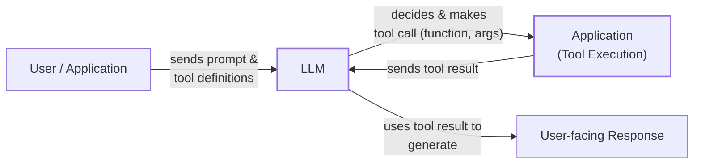
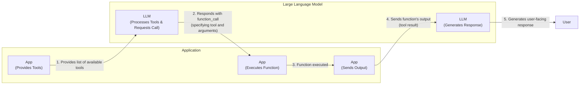
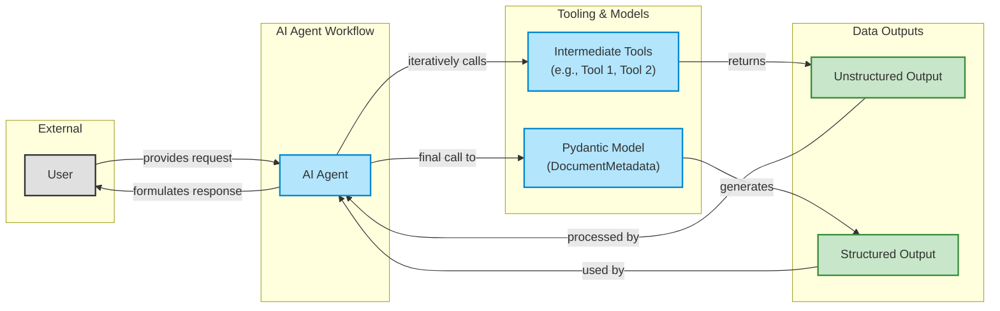
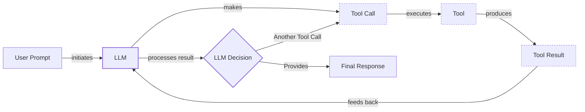

# Lesson 6: Agent Tools & Function Calling

In our previous lessons, we built a solid foundation in AI Engineering. We navigated the agent landscape, distinguished between LLM workflows and AI agents, and mastered context engineering and structured outputs. Now, we will explore one of the most essential building blocks of any AI Agent: **Tools**. This is where we give our LLM the ability to take action, transforming it from a passive text generator into an agent that can interact with the external world.

For an AI Engineer, understanding how tools work is not optional. It is the key to building, improving, and debugging AI applications that do more than just talk. In this lesson, we will open the black box of tool use. We will start by implementing function calling from scratch to see how an LLM decides which tool to use and how it generates the right parameters. Then, we will move to production-grade implementations using modern APIs like Gemini, explore advanced patterns like using Pydantic models for on-demand structured data, and see how to chain multiple tools together.

## Understanding why agents need tools

LLMs have a fundamental limitation: they are pattern matchers and text generators. They are trained on vast amounts of text and are incredibly good at processing and generating language, but they cannot perform actions or access real-time information on their own. They live inside their own textual universe. This is where tools come in.

Think of the LLM as the brain of an agent. Tools are its hands and senses, allowing it to perceive and act in the world beyond its training data. They are the bridge between the LLM's internal reasoning and the external environment. By giving an LLM access to tools, we transform it into an AI agent capable of executing specific instructions and interacting with other systems.

This represents a new kind of software development. Traditional functions are deterministic: given the same input, they produce the same output. Tools, however, form a contract between a deterministic system (the tool's code) and a non-deterministic one (the agent). The agent might call the tool, answer from memory, or ask a clarifying question, introducing variability. Our goal as engineers is to design tools that are ergonomic for agents, increasing the chance they will be used effectively [[1]](https://www.anthropic.com/engineering/writing-tools-for-agents).



Image 1: A high-level flowchart illustrating how LLM tools work.

Modern AI agents are powered by a diverse range of tools that extend their capabilities far beyond simple text generation. Here are a few common examples:

-   **Accessing real-time information:** Tools can call external APIs to get today's weather, the latest news, or stock prices [[2]](https://lnu.diva-portal.org/smash/get/diva2:1801354/FULLTEXT01.pdf).
-   **Interacting with external databases:** They can query a PostgreSQL database, a Snowflake data warehouse, or an S3 data lake [[3]](https://neo4j.com/blog/agentic-ai/connected-context-and-persistent-memory-neo4j-providers-for-the-microsoft-agent-framework/), [[4]](https://promethium.ai/guides/text-to-sql-basics-benefits/).
-   **Accessing long-term memory:** Tools can connect to an agent's memory to recall past interactions or user preferences, enabling more personalized and context-aware responses [[5]](https://www.ruh.ai/blogs/how-vector-databases-are-rewiring-the-tech-industry).
-   **Executing code:** A Python interpreter tool allows an agent to perform precise calculations like basic math, sorting, filtering, and grouping, or even create data visualizations [[6]](https://medium.com/@anicomanesh/how-llm-reasoning-powers-the-agentic-ai-revolution-cbefd10ebf3f).

## Implementing tool calls from scratch

The best way to understand how an LLM uses tools is to build the mechanism from scratch. Our goal is to provide the model with a list of available functions and let it decide which one to call, along with the correct arguments, to fulfill a user's request.

The process, often called function calling, follows a five-step flow. First, your application sends the user's prompt to the LLM, along with definitions of the available tools. The LLM then analyzes the request and, if it decides a tool is needed, responds not with a text answer but with a structured request to call a specific function with certain arguments. Your application receives this request, executes the actual function, and sends the result back to the LLM. Finally, the LLM uses this output to generate a final, user-facing response.



Image 2: A flowchart illustrating the 5-step request-execute-respond flow of calling a tool between an Application and a Large Language Model.

Let's implement this flow. We will create a simple agent that can search for a financial report in a mock Google Drive, summarize it, and send the summary to a Discord channel.

<aside>
💡

You can find all the code for this lesson in the accompanying [Jupyter Notebook on GitHub](https://github.com/towardsai/course-ai-agents/blob/dev/lessons/06_tools/notebook.ipynb).

</aside>

1.  First, we set up our environment by importing the necessary libraries and initializing the Gemini client. We will use the `gemini-2.5-flash` model, which is fast and cost-effective. We also define a sample `DOCUMENT` to simulate the content of a file we might find.
    ```python
    import json
    from typing import Any
    
    from google import genai
    from google.genai import types
    from pydantic import BaseModel, Field
    
    from lessons.utils import env, pretty_print
    
    env.load(required_env_vars=["GOOGLE_API_KEY"])
    
    client = genai.Client()
    
    MODEL_ID = "gemini-2.5-flash"
    
    DOCUMENT = """
    # Q3 2023 Financial Performance Analysis
    
    The Q3 earnings report shows a 20% increase in revenue and a 15% growth in user engagement, 
    beating market expectations. These impressive results reflect our successful product strategy 
    and strong market positioning.
    
    Our core business segments demonstrated remarkable resilience, with digital services leading 
    the growth at 25% year-over-year. The expansion into new markets has proven particularly 
    successful, contributing to 30% of the total revenue increase.
    
    Customer acquisition costs decreased by 10% while retention rates improved to 92%, 
    marking our best performance to date. These metrics, combined with our healthy cash flow 
    position, provide a strong foundation for continued growth into Q4 and beyond.
    """
    ```

2.  Next, we define our three mock tools as Python functions. The function signature and docstring are important, as the LLM uses this information to understand what each tool does.
    ```python
    def search_google_drive(query: str) -> dict:
        """
        Searches for a file on Google Drive and returns its content or a summary.
    
        Args:
            query (str): The search query to find the file, e.g., 'Q3 earnings report'.
    
        Returns:
            dict: A dictionary representing the search results, including file names and summaries.
        """
    
        # In a real scenario, this would interact with the Google Drive API.
        # Here, we mock the response for demonstration.
        return {
            "files": [
                {
                    "name": "Q3_Earnings_Report_2024.pdf",
                    "id": "file12345",
                    "content": DOCUMENT,
                }
            ]
        }
    ```
    ```python
    def send_discord_message(channel_id: str, message: str) -> dict:
        """
        Sends a message to a specific Discord channel.
    
        Args:
            channel_id (str): The ID of the channel to send the message to, e.g., '#finance'.
            message (str): The content of the message to send.
    
        Returns:
            dict: A dictionary confirming the action, e.g., {"status": "success"}.
        """
    
        # Mocking a successful API call to Discord.
        return {
            "status": "success",
            "status_code": 200,
            "channel": channel_id,
            "message_preview": f"{message[:50]}...",
        }
    ```
    ```python
    def summarize_financial_report(text: str) -> str:
        """
        Summarizes a financial report.
    
        Args:
            text (str): The text to summarize.
    
        Returns:
            str: The summary of the text.
        """
    
        return "The Q3 2023 earnings report shows strong performance across all metrics \
    with 20% revenue growth, 15% user engagement increase, 25% digital services growth, and \
    improved retention rates of 92%."
    ```

3.  For the LLM to use these functions, we must describe them in a format it understands. This is done using a JSON schema, which is the industry standard for APIs from providers like OpenAI and Google [[7]](https://tetrate.io/learn/ai/llm-output-parsing-structured-generation), [[8]](https://ai.google.dev/gemini-api/docs/function-calling). The schema defines the tool's `name`, `description`, and `parameters`, including argument names, types, and whether they are required.
    ```python
    search_google_drive_schema = {
        "name": "search_google_drive",
        "description": "Searches for a file on Google Drive and returns its content or a summary.",
        "parameters": {
            "type": "object",
            "properties": {
                "query": {
                    "type": "string",
                    "description": "The search query to find the file, e.g., 'Q3 earnings report'.",
                }
            },
            "required": ["query"],
        },
    }
    ```
    ```python
    send_discord_message_schema = {
        "name": "send_discord_message",
        "description": "Sends a message to a specific Discord channel.",
        "parameters": {
            "type": "object",
            "properties": {
                "channel_id": {
                    "type": "string",
                    "description": "The ID of the channel to send the message to, e.g., '#finance'.",
                },
                "message": {
                    "type": "string",
                    "description": "The content of the message to send.",
                },
            },
            "required": ["channel_id", "message"],
        },
    }
    ```
    ```python
    summarize_financial_report_schema = {
        "name": "summarize_financial_report",
        "description": "Summarizes a financial report.",
        "parameters": {
            "type": "object",
            "properties": {
                "text": {
                    "type": "string",
                    "description": "The text to summarize.",
                },
            },
            "required": ["text"],
        },
    }
    ```

4.  We then create a tool registry to map tool names to their corresponding functions and schemas. This makes it easy to look up and execute the correct function later.
    ```python
    TOOLS = {
        "search_google_drive": {
            "handler": search_google_drive,
            "declaration": search_google_drive_schema,
        },
        "send_discord_message": {
            "handler": send_discord_message,
            "declaration": send_discord_message_schema,
        },
        "summarize_financial_report": {
            "handler": summarize_financial_report,
            "declaration": summarize_financial_report_schema,
        },
    }
    TOOLS_BY_NAME = {tool_name: tool["handler"] for tool_name, tool in TOOLS.items()}
    TOOLS_SCHEMA = [tool["declaration"] for tool in TOOLS.values()]
    ```
    The `TOOLS_BY_NAME` mapping gives us quick access to the function handlers, while `TOOLS_SCHEMA` provides a list of all tool definitions for the LLM.

5.  Next, we create a system prompt to instruct the LLM on how to use these tools. This prompt includes guidelines on when to use tools, how to format the tool call, and the schemas of all available tools enclosed in `<tool_definitions>` tags.
    ```python
    TOOL_CALLING_SYSTEM_PROMPT = """
    You are a helpful AI assistant with access to tools that enable you to take actions and retrieve information to better 
    assist users.
    
    ## Tool Usage Guidelines
    
    **When to use tools:**
    - When you need information that is not in your training data
    - When you need to perform actions in external systems and environments
    - When you need real-time, dynamic, or user-specific data
    - When computational operations are required
    
    **Tool selection:**
    - Choose the most appropriate tool based on the user's specific request
    - If multiple tools could work, select the one that most directly addresses the need
    - Consider the order of operations for multi-step tasks
    
    **Parameter requirements:**
    - Provide all required parameters with accurate values
    - Use the parameter descriptions to understand expected formats and constraints
    - Ensure data types match the tool's requirements (strings, numbers, booleans, arrays)
    
    ## Tool Call Format
    
    When you need to use a tool, output ONLY the tool call in this exact format:
    
    ```tool_call
    {{"name": "tool_name", "args": {{"param1": "value1", "param2": "value2"}}}}
    ```
    
    **Critical formatting rules:**
    - Use double quotes for all JSON strings
    - Ensure the JSON is valid and properly escaped
    - Include ALL required parameters
    - Use correct data types as specified in the tool definition
    - Do not include any additional text or explanation in the tool call
    
    ## Response Behavior
    
    - If no tools are needed, respond directly to the user with helpful information
    - If tools are needed, make the tool call first, then provide context about what you're doing
    - After receiving tool results, provide a clear, user-friendly explanation of the outcome
    - If a tool call fails, explain the issue and suggest alternatives when possible
    
    ## Available Tools
    
    <tool_definitions>
    {tools}
    </tool_definitions>
    
    Remember: Your goal is to be maximally helpful to the user. Use tools when they add value, but don't use them unnecessarily. Always prioritize accuracy and user experience.
    """
    ```

6.  Now, let's look at how this works in practice. The LLM's decision-making process is guided by the information we provide. Based on the `description` field in the tool schema, it *decides* which tool is most appropriate for a given user query. This is why writing clear, articulate, and distinct tool descriptions is so important [[9]](https://composio.dev/blog/how-to-build-tools-for-ai-agents-a-field-guide), [[10]](https://www.anthropic.com/research/building-effective-agents). If you have two tools with vague descriptions like "search documents" and "search files," the LLM will get confused. Explicit descriptions like "search documents on Google Drive" and "search files on the local disk" remove ambiguity. This becomes essential as you scale to dozens or even hundreds of tools per agent [[11]](https://mbrenndoerfer.com/writing/function-calling-llm-structured-tools).

    Recent research provides a deeper reason for this: ambiguity can be framed as a "missing concept" problem in the LLM's latent space. An ambiguous query like "Who won the war between Ethiopia and Italy?" might have multiple valid interpretations (the First or Second Italo-Ethiopian War), but the LLM often defaults to a single one because the concepts needed to see the ambiguity are not activated. A clear description acts as a trigger, helping the model activate the correct concepts and select the right tool [[12]](https://arxiv.org/html/2505.11679v2).

    A useful mental model is that *everything* about your tools is a prompt [[13]](https://pub.towardsai.net/tool-descriptions-are-critical-making-better-llm-tools-research-capability-b315851471e7). This extends beyond the description to include parameter names, return values, and even error messages. For example, using unambiguous parameter names like `user_id` instead of a generic `user` helps. At scale, namespacing tools by service (e.g., `asana_search`, `jira_search`) is a powerful technique to help agents distinguish between functions with similar purposes. Even error messages should be prompt-engineered to be helpful, guiding the agent on how to fix its mistake rather than returning an opaque error code [[1]](https://www.anthropic.com/engineering/writing-tools-for-agents).

    Once a tool is selected, the model *generates* the function name and arguments as a structured output, like JSON. This capability is not magic; LLMs are specifically instruction-tuned on massive datasets of tool-use demonstrations to learn how to interpret schemas and produce these structured calls [[11]](https://mbrenndoerfer.com/writing/function-calling-llm-structured-tools).

7.  Let's test it with a couple of prompts. First, a simple one.
    ```python
    USER_PROMPT = """
    Can you help me find the latest quarterly report and share key insights with the team?
    """
    
    messages = [TOOL_CALLING_SYSTEM_PROMPT.format(tools=str(TOOLS_SCHEMA)), USER_PROMPT]
    
    response = client.models.generate_content(
        model=MODEL_ID,
        contents=messages,
    )
    ```
    The LLM correctly identifies the `search_google_drive` tool and generates the required arguments:
    ```text
    ```tool_call
    {"name": "search_google_drive", "args": {"query": "latest quarterly report"}}
    ```
    ```

8.  Now for a more complex prompt that requires multiple steps.
    ```python
    USER_PROMPT = """
    Please find the Q3 earnings report on Google Drive and send a summary of it to 
    the #finance channel on Discord.
    """
    
    messages = [TOOL_CALLING_SYSTEM_PROMPT.format(tools=str(TOOLS_SCHEMA)), USER_PROMPT]
    
    response = client.models.generate_content(
        model=MODEL_ID,
        contents=messages,
    )
    ```
    The model again identifies the first logical step, which is to search for the report.
    ```text
    ```tool_call
    {"name": "search_google_drive", "args": {"query": "Q3 earnings report"}}
    ```
    ```

9.  Now we need to parse this response and execute the function. First, we extract the JSON string from the Markdown block.
    ```python
    def extract_tool_call(response_text: str) -> str:
        """
        Extracts the tool call from the response text.
        """
        return response_text.split("```tool_call")[1].split("```")[0].strip()
    
    
    tool_call_str = extract_tool_call(response.text)
    ```
    This gives us `'{"name": "search_google_drive", "args": {"query": "Q3 earnings report"}}'`.

10. We parse this string into a Python dictionary and use it to find the correct tool handler in our `TOOLS_BY_NAME` registry.
    ```python
    tool_call = json.loads(tool_call_str)
    tool_handler = TOOLS_BY_NAME[tool_call["name"]]
    ```
    The `tool_handler` is now a direct reference to our `search_google_drive` function.

11. Finally, we execute the function with the arguments provided by the LLM.
    ```python
    tool_result = tool_handler(**tool_call["args"])
    ```
    The tool returns the mocked content of the financial report.

12. We can wrap this logic in a helper function, `call_tool`, to streamline the process.
    ```python
    def call_tool(response_text: str, tools_by_name: dict) -> Any:
        """
        Call a tool based on the response from the LLM.
        """
    
        tool_call_str = extract_tool_call(response_text)
        tool_call = json.loads(tool_call_str)
        tool_name = tool_call["name"]
        tool_args = tool_call["args"]
        tool = tools_by_name[tool_name]
    
        return tool(**tool_args)
    ```

13. The final step in the loop is to send the tool's output back to the LLM. This allows the model to interpret the results and decide on the next action or formulate a final response for the user.
    ```python
    response = client.models.generate_content(
        model=MODEL_ID,
        contents=f"Interpret the tool result: {json.dumps(tool_result, indent=2)}",
    )
    ```
    The LLM then provides a human-readable summary based on the document content it received from the tool. That's the basic concept behind tool calling.

## Implementing a small tool calling framework from scratch

Manually defining JSON schemas for every function is tedious and error-prone. Production frameworks like LangGraph and protocols like MCP (Model Context Protocol) solve this by using a `@tool` decorator to automatically generate and register schemas from Python functions [[14]](https://openai.github.io/openai-agents-python/tools/), [[15]](https://strandsagents.com/docs/user-guide/concepts/tools/custom-tools/). This approach respects the Don't Repeat Yourself (DRY) principle by creating a single source of truth from the function's signature and docstring.

Let's build our own simple framework by creating a `@tool` decorator. This will give us a deeper appreciation for what these frameworks do under the hood. The decorator will inspect a Python function, extract its name, docstring, and parameters, and then construct the JSON schema automatically.

1.  First, we define a `ToolFunction` class to wrap our function and its generated schema. This class will hold both the callable function and its metadata, making it easy to manage.
    ```python
    from inspect import Parameter, signature
    from typing import Any, Callable, Dict, Optional
    
    
    class ToolFunction:
        def __init__(self, func: Callable, schema: Dict[str, Any]) -> None:
            self.func = func
            self.schema = schema
            self.__name__ = func.__name__
            self.__doc__ = func.__doc__
    
        def __call__(self, *args: Any, **kwargs: Any) -> Any:
            return self.func(*args, **kwargs)
    ```

2.  Next, we implement the `@tool` decorator. It inspects the function's signature using Python's `inspect` module to build the parameters schema and uses the docstring for the description. It identifies required parameters by checking if they have a default value.
    ```python
    def tool(description: Optional[str] = None) -> Callable[[Callable], ToolFunction]:
        """
        A decorator that creates a tool schema from a function.
    
        Args:
            description: Optional override for the function's docstring
    
        Returns:
            A decorator function that wraps the original function and adds a schema
        """
    
        def decorator(func: Callable) -> ToolFunction:
            # Get function signature
            sig = signature(func)
    
            # Create parameters schema
            properties = {}
            required = []
    
            for param_name, param in sig.parameters.items():
                # Skip self for methods
                if param_name == "self":
                    continue
    
                param_schema = {
                    "type": "string",  # Default to string, can be enhanced with type hints
                    "description": f"The {param_name} parameter",  # Default description
                }
    
                # Add to required if parameter has no default value
                if param.default == Parameter.empty:
                    required.append(param_name)
    
                properties[param_name] = param_schema
    
            # Create the tool schema
            schema = {
                "name": func.__name__,
                "description": description or func.__doc__ or f"Executes the {func.__name__} function.",
                "parameters": {
                    "type": "object",
                    "properties": properties,
                    "required": required,
                },
            }
    
            return ToolFunction(func, schema)
    
        return decorator
    ```

3.  Now, we can redefine our tools by simply applying the decorator. The code is much cleaner and more maintainable.
    ```python
    @tool()
    def search_google_drive_example(query: str) -> dict:
        """Search for files in Google Drive."""
        return {"files": ["Q3 earnings report"]}
    
    
    @tool()
    def send_discord_message_example(channel_id: str, message: str) -> dict:
        """Send a message to a Discord channel."""
        return {"message": "Message sent successfully"}
    
    
    @tool()
    def summarize_financial_report_example(text: str) -> str:
        """Summarize the contents of a financial report."""
        return "Financial report summarized successfully"
    
    
    tools = [
        search_google_drive_example,
        send_discord_message_example,
        summarize_financial_report_example,
    ]
    tools_by_name = {tool.schema["name"]: tool.func for tool in tools}
    tools_schema = [tool.schema for tool in tools]
    ```
    Our decorated function is now a `ToolFunction` object. It holds both the executable function (`.func`) and its auto-generated schema (`.schema`), which is identical to the one we created manually.

4.  We can now use this auto-generated schema with our LLM. The process is the same as before, but the setup is far more elegant.
    ```python
    USER_PROMPT = """
    Please find the Q3 earnings report on Google Drive and send a summary of it to 
    the #finance channel on Discord.
    """
    
    messages = [TOOL_CALLING_SYSTEM_PROMPT.format(tools=str(tools_schema)), USER_PROMPT]
    
    response = client.models.generate_content(
        model=MODEL_ID,
        contents=messages,
    )
    ```
    The model returns the same tool call as before, which we can execute with our `call_tool` function. Voilà! We have our own small, but effective, tool-calling framework.

## Implementing production-level tool calls with Gemini

While building a framework from scratch provides great insight, production systems should use the native tool-calling capabilities of modern LLM APIs like Gemini or OpenAI. These APIs are optimized for their specific models, making them more robust, efficient, and easier to use [[16]](https://www.decodingai.com/p/tool-calling-from-scratch-to-production).

Let's see how to achieve the same result using Gemini's native interface. Instead of manually crafting a system prompt, we pass our tool schemas directly to the API via a `GenerateContentConfig` object. This not only simplifies our code but also ensures we are using the most optimized method for the model, as the provider handles the underlying prompt engineering.

1.  First, we define the configuration, passing our list of tool schemas. We can also set the `mode` to `"ANY"` in the `tool_config` to force the model to call a tool instead of generating a text response.
    ```python
    from google.genai import types
    
    tools = [
        types.Tool(
            function_declarations=[
                types.FunctionDeclaration(**search_google_drive_schema),
                types.FunctionDeclaration(**send_discord_message_schema),
            ]
        )
    ]
    config = types.GenerateContentConfig(
        tools=tools,
        # Force the model to call 'any' function, instead of chatting.
        tool_config=types.ToolConfig(function_calling_config=types.FunctionCallingConfig(mode="ANY")),
    )
    ```

2.  Now, we can call the model with a much simpler prompt. The API handles the complex instructions internally.
    ```python
    USER_PROMPT = """
    Please find the Q3 earnings report on Google Drive and send a summary of it to 
    the #finance channel on Discord.
    """
    
    response = client.models.generate_content(
        model=MODEL_ID,
        contents=USER_PROMPT,
        config=config,
    )
    ```

3.  The response contains a `function_call` object with the tool name and arguments, which we can access directly.
    ```python
    response_message_part = response.candidates[0].content.parts[0]
    function_call = response_message_part.function_call
    ```
    It outputs:
    ```text
    FunctionCall(id=None, args={'query': 'Q3 earnings report'}, name='search_google_drive')
    ```

4.  To simplify things even further, the `google-genai` SDK can automatically generate the schema from a Python function's signature, type hints, and docstring, just like our custom decorator. We can pass our functions directly to the `GenerateContentConfig`.
    ```python
    config = types.GenerateContentConfig(
        tools=[search_google_drive, send_discord_message]
    )
    ```

5.  We can then create a simplified `call_tool` function to execute the `FunctionCall` object.
    ```python
    def call_tool(function_call) -> Any:
        tool_name = function_call.name
        tool_args = {key: value for key, value in function_call.args.items()}
    
        tool_handler = TOOLS_BY_NAME[tool_name]
    
        return tool_handler(**tool_args)
    
    
    tool_result = call_tool(function_call)
    ```
    By using the native SDK, we reduced dozens of lines of code to just a few, creating a more robust and maintainable system. Other popular APIs from providers like OpenAI and Anthropic follow a similar logic, making these concepts easily transferable to your API of choice [[17]](https://apxml.com/courses/prompt-engineering-llm-application-development/chapter-4-interacting-with-llm-apis/overview-common-llm-apis), [[18]](https://myengineeringpath.dev/tools/gemini-guide/).

## Using Pydantic models as tools for on-demand structured outputs

In Lesson 4, we learned how to generate structured outputs. A powerful and elegant pattern is to treat a Pydantic model as a tool. This is particularly useful in agentic workflows where you might perform several intermediate steps that produce unstructured text, which is easy for an LLM to process, but then require a final, validated, structured output for use in downstream application logic [[19]](https://pydantic.dev/docs/ai/core-concepts/output/).

This approach allows an agent to dynamically decide when to switch from free-form reasoning to generating a structured response, combining the flexibility of tool use with the reliability of Pydantic's data validation. For example, an agent could first use a web search tool to gather information, then a summarization tool to process it, and finally call a Pydantic-based tool to structure the final findings into a clean, predictable format.



Image 3: A flowchart illustrating an AI agent's workflow where it calls multiple tools in a loop, processing unstructured outputs before generating structured output via a Pydantic model and formulating a final response.

Let's see how to implement this.

1.  First, we define our `DocumentMetadata` Pydantic model, just as we did in Lesson 4.
    ```python
    class DocumentMetadata(BaseModel):
        """A class to hold structured metadata for a document."""
    
        summary: str = Field(description="A concise, 1-2 sentence summary of the document.")
        tags: list[str] = Field(description="A list of 3-5 high-level tags relevant to the document.")
        keywords: list[str] = Field(description="A list of specific keywords or concepts mentioned.")
        quarter: str = Field(description="The quarter of the financial year described in the document (e.g., Q3 2023).")
        growth_rate: str = Field(description="The growth rate of the company described in the document (e.g., 10%).")
    ```

2.  Next, we define our extraction "tool." We create a `FunctionDeclaration` whose parameters are defined by the JSON schema generated from our Pydantic model using `DocumentMetadata.model_json_schema()`.
    ```python
    # The Pydantic class 'DocumentMetadata' is now our 'tool'
    extraction_tool = types.Tool(
        function_declarations=[
            types.FunctionDeclaration(
                name="extract_metadata",
                description="Extracts structured metadata from a financial document.",
                parameters=DocumentMetadata.model_json_schema(),
            )
        ]
    )
    config = types.GenerateContentConfig(
        tools=[extraction_tool],
        tool_config=types.ToolConfig(function_calling_config=types.FunctionCallingConfig(mode="ANY")),
    )
    ```

3.  We prompt the model to analyze the document. The Gemini API, guided by our config, will recognize that it needs to "call" the `extract_metadata` tool and will generate the arguments conforming to our Pydantic schema.
    ```python
    prompt = f"""
    Please analyze the following document and extract its metadata.
    
    Document:
    --- 
    {DOCUMENT}
    --- 
    """
    
    response = client.models.generate_content(model=MODEL_ID, contents=prompt, config=config)
    response_message_part = response.candidates[0].content.parts[0]
    ```

4.  Finally, we can take the arguments from the `function_call` and directly validate them with our `DocumentMetadata` model, creating a type-safe Python object.
    ```python
    if hasattr(response_message_part, "function_call"):
        function_call = response_message_part.function_call
    
        try:
            document_metadata = DocumentMetadata(**function_call.args)
            print("Validation successful!")
        except Exception as e:
            print(f"Validation failed: {e}")
    ```
    This pattern is extremely common in production AI agents that need to return reliable, structured data after performing a series of actions.

## The downsides of running tools in a loop

So far, we have focused on single-turn interactions. But the real power of agents comes from their ability to perform multi-step tasks by chaining multiple tool calls together. This allows an agent to break down a complex problem, gather information, and act on it iteratively, adapting its approach based on the results of previous actions. This is the final piece of the puzzle we need to build a real AI agent.



Image 4: A flowchart illustrating a generic tool calling loop.

Let's implement a loop where the agent first finds a report, then summarizes it, and finally sends the summary to Discord.

1.  We define a `config` object that includes all three of our tools: `search_google_drive`, `send_discord_message`, and `summarize_financial_report`.
    ```python
    tools = [
        types.Tool(
            function_declarations=[
                types.FunctionDeclaration(**search_google_drive_schema),
                types.FunctionDeclaration(**send_discord_message_schema),
                types.FunctionDeclaration(**summarize_financial_report_schema),
            ]
        )
    ]
    config = types.GenerateContentConfig(
        tools=tools,
        tool_config=types.ToolConfig(function_calling_config=types.FunctionCallingConfig(mode="ANY")),
    )
    ```

2.  The user prompt requires all three actions.
    ```python
    USER_PROMPT = """
    Please find the Q3 earnings report on Google Drive and send a summary of it to 
    the #finance channel on Discord.
    """
    messages = [USER_PROMPT]
    ```

3.  We implement a loop that continues as long as the model requests a function call. In each iteration, we execute the tool, append the result to our message history, and send the updated history back to the model for the next step.
    ```python
    response = client.models.generate_content(
        model=MODEL_ID,
        contents=messages,
        config=config,
    )
    response_message_part = response.candidates[0].content.parts[0]
    messages.append(response.candidates[0].content)
    
    # Loop until the model stops requesting function calls
    max_iterations = 3
    while hasattr(response_message_part, "function_call") and max_iterations > 0:
        tool_result = call_tool(response_message_part.function_call)
    
        function_response_part = types.Part.from_function_response(
            name=response_message_part.function_call.name,
            response={"result": tool_result},
        )
        messages.append(function_response_part)
    
        # Ask the LLM to continue
        response = client.models.generate_content(
            model=MODEL_ID,
            contents=messages,
            config=config,
        )
    
        response_message_part = response.candidates[0].content.parts[0]
        messages.append(response.candidates[0].content)
        max_iterations -= 1
    ```
    This loop successfully chains the tools: the agent first calls `search_google_drive`, then `summarize_financial_report` on the result, and finally `send_discord_message` with the summary.

However, this simple sequential loop has significant limitations [[20]](https://myengineeringpath.dev/genai-engineer/agentic-patterns/), [[21]](https://blogs.oracle.com/developers/what-is-the-ai-agent-loop-the-core-architecture-behind-autonomous-ai-systems). It does not provide an explicit opportunity for the model to *reason* about the output of a tool before deciding on the next action. The agent immediately moves to the next function call without pausing to think about what it has learned or whether its strategy should change. This can lead to documented failure modes like "iteration anomalies," where the agent gets stuck in repetitive, non-progressive loops, or "context pollution," where irrelevant information from early tool calls degrades the quality of later decisions [[22]](https://arxiv.org/html/2509.13941v1), [[23]](https://docs.kamiwaza.ai/assets/files/How_do_LLMs_fail_in_agentic_scenarios-eff27cdb81518717588e1fcdee00aec4.pdf).

For instance, if the tools are independent (e.g., fetching financial news and stock prices), they could be run in parallel to reduce latency. Our simple loop can't handle that. These limitations motivated the development of more sophisticated agentic patterns like **ReAct** (Reason + Act), which interleaves explicit reasoning steps with tool calls. We will dive deep into ReAct in Lessons 7 and 8.

## Popular tools used within the industry

Before listing specific categories, it is worth noting a key design principle for effective tools: consolidation. Instead of creating many granular tools that wrap single API endpoints, it is often better to build fewer, higher-impact tools that handle common, multi-step workflows. For example, a single `schedule_event` tool that finds user availability and books a room is more agent-ergonomic than separate `list_users`, `list_events`, and `create_event` tools [[1]](https://www.anthropic.com/engineering/writing-tools-for-agents).

To ground this in the real world, let's look at the most common categories of tools that power production AI agents.

1.  **Knowledge & Memory Access:** These tools connect the agent to external knowledge sources, forming the backbone of most RAG systems. This includes querying vector databases for semantic search, document stores for raw text, or graph databases like Neo4j to understand relationships between entities [[3]](https://neo4j.com/blog/agentic-ai/connected-context-and-persistent-memory-neo4j-providers-for-the-microsoft-agent-framework/). A popular advanced pattern is text-to-SQL, where the agent generates and executes SQL queries against traditional databases, effectively giving it access to vast amounts of structured enterprise data [[4]](https://promethium.ai/guides/text-to-sql-basics-benefits/). These concepts are closely tied to agent memory and RAG, which we will cover in detail in Lessons 9 and 10.

2.  **Web Search & Browsing:** Omnipresent in chatbots and research agents, these tools allow an agent to access up-to-date information from the internet. This is typically done by interfacing with search engine APIs (like Google, Bing, or Brave Search) or by using web scraping tools to fetch and parse content directly from web pages [[24]](https://arxiv.org/html/2507.08034v1). When implementing web scraping, it is important to handle dynamic content and respect `robots.txt` files, while also considering the ethical implications of accessing and using web data.

3.  **Code Execution:** This is one of the most powerful tool types. Giving an agent a Python interpreter in a sandboxed environment allows it to perform complex tasks. These tasks are notoriously difficult for LLMs alone. This turns the agent into a powerful data analyst capable of data manipulation, statistical analysis, and creating visualizations [[6]](https://medium.com/@anicomanesh/how-llm-reasoning-powers-the-agentic-ai-revolution-cbefd10ebf3f). While Python is most common, interpreters for other languages like JavaScript are also used. The architecture of such a sandboxed environment is important for security, isolating the code execution to prevent unintended side effects on the host system.

4.  **External API Integrations:** For enterprise AI applications, tools that interact with external APIs are essential. This includes connecting to calendars, sending emails, interacting with project management software like Jira, or accessing CRM data [[25]](https://medium.com/@yugalnandurkar5/llm-engineering-part-i-fa48d4307d26). Productivity apps also frequently use tools for file system operations, such as reading and writing local files, to integrate seamlessly into a user's workflow. A common pattern for critical actions, like sending an email or deleting a file, is to implement a human-in-the-loop step that requires user confirmation before execution.

## Conclusion

Tool calling is the cornerstone of modern AI agents. It is the mechanism that elevates LLMs from being mere text generators to active participants that can interact with the world. Mastering how to define, call, and orchestrate tools is arguably the most important skill for building, monitoring, and debugging capable AI applications. A deep understanding of tool orchestration allows you to trace an agent's decisions, identify failure points when a tool is misused, and ultimately build more reliable systems.

In this lesson, we have gone from the fundamentals to production-ready implementations. But a simple tool-calling loop is just the beginning. To build truly intelligent agents, we need to give them the ability to reason about their actions. That is exactly what we will cover in our next lesson, where we will introduce the theory behind planning and the powerful ReAct pattern, which enables agents to think step-by-step and dynamically adapt their strategy.

## References

-   [1] https://www.anthropic.com/engineering/writing-tools-for-agents
-   [2] https://lnu.diva-portal.org/smash/get/diva2:1801354/FULLTEXT01.pdf
-   [3] https://neo4j.com/blog/agentic-ai/connected-context-and-persistent-memory-neo4j-providers-for-the-microsoft-agent-framework/
-   [4] https://promethium.ai/guides/text-to-sql-basics-benefits/
-   [5] https://www.ruh.ai/blogs/how-vector-databases-are-rewiring-the-tech-industry
-   [6] https://medium.com/@anicomanesh/how-llm-reasoning-powers-the-agentic-ai-revolution-cbefd10ebf3f
-   [7] https://tetrate.io/learn/ai/llm-output-parsing-structured-generation
-   [8] https://ai.google.dev/gemini-api/docs/function-calling
-   [9] https://composio.dev/blog/how-to-build-tools-for-ai-agents-a-field-guide
-   [10] https://www.anthropic.com/research/building-effective-agents
-   [11] https://mbrenndoerfer.com/writing/function-calling-llm-structured-tools
-   [12] https://arxiv.org/html/2505.11679v2
-   [13] https://pub.towardsai.net/tool-descriptions-are-critical-making-better-llm-tools-research-capability-b315851471e7
-   [14] https://openai.github.io/openai-agents-python/tools/
-   [15] https://strandsagents.com/docs/user-guide/concepts/tools/custom-tools/
-   [16] https://www.decodingai.com/p/tool-calling-from-scratch-to-production
-   [17] https://apxml.com/courses/prompt-engineering-llm-application-development/chapter-4-interacting-with-llm-apis/overview-common-llm-apis
-   [18] https://myengineeringpath.dev/tools/gemini-guide/
-   [19] https://pydantic.dev/docs/ai/core-concepts/output/
-   [20] https://myengineeringpath.dev/genai-engineer/agentic-patterns/
-   [21] https://blogs.oracle.com/developers/what-is-the-ai-agent-loop-the-core-architecture-behind-autonomous-ai-systems
-   [22] https://arxiv.org/html/2509.13941v1
-   [23] https://docs.kamiwaza.ai/assets/files/How_do_LLMs_fail_in_agentic_scenarios-eff27cdb81518717588e1fcdee00aec4.pdf
-   [24] https://arxiv.org/html/2507.08034v1
-   [25] https://medium.com/@yugalnandurkar5/llm-engineering-part-i-fa48d4307d26