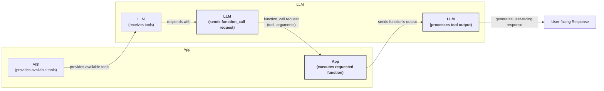
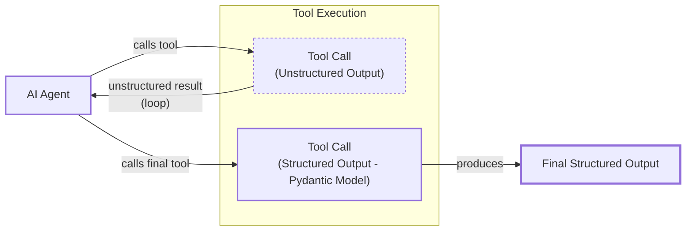
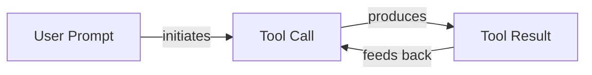

# Lesson 6: Agent Tools & Function Calling

In our previous lessons, we built a solid foundation in AI Engineering. We explored the agent landscape, distinguished between rule-based LLM workflows and autonomous agents, mastered context engineering, and learned to get reliable structured outputs. We also implemented the basic patterns for building LLM workflows, like chaining and routing.

Now, we will tackle one of the most critical building blocks of any AI Agent: **Tools**. Tools, also known as function calling, are what give an LLM the ability to take action. They transform a model from a passive text generator into an active participant that can interact with the external world. For an AI Engineer, understanding how to build, use, and debug tools is fundamental. It’s the skill that allows you to move beyond simple chatbots and create agents that can search for information, execute code, and interact with other software.

## Why Agents Need Tools

LLMs have a fundamental limitation: they are sophisticated pattern matchers and text generators, but they cannot perform actions on their own. Their knowledge is confined to the data they were trained on, and they have no direct way to interact with the outside world. This is where tools come in. They act as the bridge between the LLM's internal reasoning and the external environment.

Think of the LLM as the brain of an agent. It can think, reason, and plan. But a brain alone cannot affect the world. It needs "hands and senses" to perceive and act. Tools provide these hands and senses, allowing the agent to:

-   **Access real-time information:** Use APIs to get current data like today's weather, the latest news, or stock prices [[19]](https://lnu.diva-portal.org/smash/get/diva2:1801354/FULLTEXT01.pdf).
-   **Interact with external systems:** Query databases, connect to a data warehouse, or read from a data lake.
-   **Access long-term memory:** Retrieve information from vector or graph databases to remember past conversations and user preferences, a topic we will cover in Lesson 9 [[11]](https://neo4j.com/blog/agentic-ai/connected-context-and-persistent-memory-neo4j-providers-for-the-microsoft-agent-framework/).
-   **Execute code:** Run Python or JavaScript in a sandboxed environment to perform precise calculations, manipulate data, or create visualizations [[16]](https://arxiv.org/html/2507.08034v1).

By equipping an agent with tools, we transform it from a simple language model into a system that can solve real-world problems.

## Implementing Tool Calls From Scratch

The best way to understand how tools work is to build them from scratch. We will implement a simple tool-calling mechanism to see how an LLM decides which tool to use, how it generates the correct parameters, and how we execute the corresponding function.

The process of calling a tool involves a multi-step conversation between our application and the LLM:

1.  **You:** Send the LLM a prompt and a list of available tools.
2.  **LLM:** Responds with a `function_call` request, specifying the tool and arguments.
3.  **You:** Execute the requested function in your code.
4.  **You:** Send the function's output back to the LLM.
5.  **LLM:** Uses the tool's output to generate a final, user-facing response.



Image 1: A flowchart illustrating the 5-step process of implementing tool calls from scratch, highlighting the request-execute-respond flow.

Let's walk through this process with a practical example. We will build a simple agent that can search for a financial report on Google Drive and send a summary to a Discord channel.

<aside>
💡

You can find all the code for this lesson in the accompanying [Jupyter Notebook on GitHub](https://github.com/towardsai/course-ai-agents/blob/dev/lessons/06_tools/notebook.ipynb).

</aside>

1.  First, we set up our environment by installing the necessary libraries and configuring our Gemini API key. We will use the `gemini-2.5-flash` model, which is fast and cost-effective for our examples. We also define a sample `DOCUMENT` to simulate the content of a financial report.
    ```python
    import json
    from typing import Any

    from google import genai
    from google.genai import types
    from pydantic import BaseModel, Field

    from lessons.utils import env

    env.load(required_env_vars=["GOOGLE_API_KEY"])

    client = genai.Client()

    MODEL_ID = "gemini-2.5-flash"

    DOCUMENT = """
    # Q3 2023 Financial Performance Analysis

    The Q3 earnings report shows a 20% increase in revenue and a 15% growth in user engagement, 
    beating market expectations. These impressive results reflect our successful product strategy 
    and strong market positioning.

    Our core business segments demonstrated remarkable resilience, with digital services leading 
    the growth at 25% year-over-year. The expansion into new markets has proven particularly 
    successful, contributing to 30% of the total revenue increase.

    Customer acquisition costs decreased by 10% while retention rates improved to 92%, 
    marking our best performance to date. These metrics, combined with our healthy cash flow 
    position, provide a strong foundation for continued growth into Q4 and beyond.
    """
    ```

2.  Next, we define our tools as simple Python functions. For this demonstration, we will mock their behavior. The function signature and docstrings are critical, as the LLM will use them to understand what each tool does.
    ```python
    def search_google_drive(query: str) -> dict:
        """
        Searches for a file on Google Drive and returns its content or a summary.

        Args:
            query (str): The search query to find the file, e.g., 'Q3 earnings report'.

        Returns:
            dict: A dictionary representing the search results, including file names and summaries.
        """
        return {
            "files": [
                {
                    "name": "Q3_Earnings_Report_2024.pdf",
                    "id": "file12345",
                    "content": DOCUMENT,
                }
            ]
        }
    ```
    We define two more mock functions: `send_discord_message` to send a message to a channel and `summarize_financial_report` to create a summary.
    ```python
    def send_discord_message(channel_id: str, message: str) -> dict:
        """
        Sends a message to a specific Discord channel.

        Args:
            channel_id (str): The ID of the channel to send the message to, e.g., '#finance'.
            message (str): The content of the message to send.

        Returns:
            dict: A dictionary confirming the action, e.g., {"status": "success"}.
        """
        return {
            "status": "success",
            "status_code": 200,
            "channel": channel_id,
            "message_preview": f"{message[:50]}...",
        }


    def summarize_financial_report(text: str) -> str:
        """
        Summarizes a financial report.

        Args:
            text (str): The text to summarize.

        Returns:
            str: The summary of the text.
        """
        return "The Q3 2023 earnings report shows strong performance across all metrics with 20% revenue growth, 15% user engagement increase, 25% digital services growth, and improved retention rates of 92%."
    ```

3.  Now, we need to describe these functions to the LLM. We do this by creating a **schema** for each tool, typically in JSON format. The schema tells the LLM the tool's name, what it does (`description`), and what arguments it expects (`parameters`). This is the industry standard for modern APIs like OpenAI and Gemini [[3]](https://ai.google.dev/gemini-api/docs/function-calling), [[72]](https://www.decodingai.com/p/tool-calling-from-scratch-to-production).
    ```python
    search_google_drive_schema = {
        "name": "search_google_drive",
        "description": "Searches for a file on Google Drive and returns its content or a summary.",
        "parameters": {
            "type": "object",
            "properties": {
                "query": {
                    "type": "string",
                    "description": "The search query to find the file, e.g., 'Q3 earnings report'.",
                }
            },
            "required": ["query"],
        },
    }
    ```
    We create similar schemas for `send_discord_message` and `summarize_financial_report`.

4.  We then aggregate our tools into a registry. This makes it easy to manage them and provide them to the LLM.
    ```python
    TOOLS = {
        "search_google_drive": {
            "handler": search_google_drive,
            "declaration": search_google_drive_schema,
        },
        "send_discord_message": {
            "handler": send_discord_message,
            "declaration": send_discord_message_schema,
        },
        "summarize_financial_report": {
            "handler": summarize_financial_report,
            "declaration": summarize_financial_report_schema,
        },
    }
    TOOLS_BY_NAME = {tool_name: tool["handler"] for tool_name, tool in TOOLS.items()}
    TOOLS_SCHEMA = [tool["declaration"] for tool in TOOLS.values()]
    ```
    The `TOOLS_BY_NAME` dictionary maps tool names to their Python functions, and `TOOLS_SCHEMA` is a list of all our tool schemas.

5.  Next, we create a system prompt to instruct the LLM on how to use these tools. This prompt explains when to use tools, how to select them, and the exact format for requesting a tool call.
    ```python
    TOOL_CALLING_SYSTEM_PROMPT = """
    You are a helpful AI assistant with access to tools that enable you to take actions and retrieve information to better 
    assist users.

    ## Tool Usage Guidelines

    **When to use tools:**
    - When you need information that is not in your training data
    - When you need to perform actions in external systems and environments
    - When you need real-time, dynamic, or user-specific data
    - When computational operations are required

    **Tool selection:**
    - Choose the most appropriate tool based on the user's specific request
    - If multiple tools could work, select the one that most directly addresses the need
    - Consider the order of operations for multi-step tasks

    **Parameter requirements:**
    - Provide all required parameters with accurate values
    - Use the parameter descriptions to understand expected formats and constraints
    - Ensure data types match the tool's requirements (strings, numbers, booleans, arrays)

    ## Tool Call Format

    When you need to use a tool, output ONLY the tool call in this exact format:

    ```tool_call
    {{"name": "tool_name", "args": {{"param1": "value1", "param2": "value2"}}}}
    ```

    **Critical formatting rules:**
    - Use double quotes for all JSON strings
    - Ensure the JSON is valid and properly escaped
    - Include ALL required parameters
    - Use correct data types as specified in the tool definition
    - Do not include any additional text or explanation in the tool call

    ## Response Behavior

    - If no tools are needed, respond directly to the user with helpful information
    - If tools are needed, make the tool call first, then provide context about what you're doing
    - After receiving tool results, provide a clear, user-friendly explanation of the outcome
    - If a tool call fails, explain the issue and suggest alternatives when possible

    ## Available Tools

    <tool_definitions>
    {tools}
    </tool_definitions>

    Remember: Your goal is to be maximally helpful to the user. Use tools when they add value, but don't use them unnecessarily. Always prioritize accuracy and user experience.
    """
    ```

6.  The LLM uses the `description` field in the schema to decide which tool is most appropriate for a user's query. This is why clear, specific, and distinct descriptions are essential. Vague descriptions like "search for documents" can confuse the model, especially when multiple search tools are available. Explicit descriptions like "search for documents on Google Drive" versus "search files on the local disk" prevent ambiguity and improve tool selection accuracy. This becomes even more important as the number of tools scales to 50 or 100 [[69]](https://mbrenndoerfer.com/writing/function-calling-llm-structured-tools). The model is specifically instruction-tuned to interpret these schemas and generate structured tool calls in JSON format.

7.  Let's test it. We send a user prompt along with our system prompt to the model.
    ```python
    USER_PROMPT = """
    Please find the Q3 earnings report on Google Drive and send a summary of it to 
    the #finance channel on Discord.
    """

    messages = [TOOL_CALLING_SYSTEM_PROMPT.format(tools=str(TOOLS_SCHEMA)), USER_PROMPT]

    response = client.models.generate_content(
        model=MODEL_ID,
        contents=messages,
    )
    ```
    The LLM correctly identifies the `search_google_drive` tool and generates the required arguments. It outputs:
    ```text
    ```tool_call
    {"name": "search_google_drive", "args": {"query": "Q3 earnings report"}}
    ```
    ```

8.  Now we need to parse this response and execute the function. We will create a helper function to extract the JSON string from the Markdown block.
    ```python
    def extract_tool_call(response_text: str) -> str:
        """
        Extracts the tool call from the response text.
        """
        return response_text.split("```tool_call")[1].split("```")[0].strip()
    ```

9.  We use this function to get the JSON string and then parse it into a Python dictionary.
    ```python
    tool_call_str = extract_tool_call(response.text)
    tool_call = json.loads(tool_call_str)
    ```

10. Next, we retrieve the corresponding Python function from our `TOOLS_BY_NAME` registry and call it with the arguments provided by the LLM.
    ```python
    tool_handler = TOOLS_BY_NAME[tool_call["name"]]
    tool_result = tool_handler(**tool_call["args"])
    ```
    The `tool_result` contains the content of the financial report we defined earlier.

11. We can wrap this logic in a single `call_tool` function for convenience.
    ```python
    def call_tool(response_text: str, tools_by_name: dict) -> Any:
        """
        Call a tool based on the response from the LLM.
        """
        tool_call_str = extract_tool_call(response_text)
        tool_call = json.loads(tool_call_str)
        tool_name = tool_call["name"]
        tool_args = tool_call["args"]
        tool = tools_by_name[tool_name]

        return tool(**tool_args)
    ```

12. Finally, we send the tool's output back to the LLM. The model uses this new information to generate a final response or decide on the next step.
    ```python
    response = client.models.generate_content(
        model=MODEL_ID,
        contents=f"Interpret the tool result: {json.dumps(tool_result, indent=2)}",
    )
    ```
    The LLM then provides a helpful summary based on the document content. This completes the basic cycle of tool calling.

## Implementing a Small Tool Calling Framework From Scratch

Manually defining JSON schemas for every function is tedious and error-prone. Production frameworks like LangGraph solve this by using a `@tool` decorator to automatically generate schemas from function signatures and docstrings [[29]](https://docs.langchain.com/oss/python/langchain/tools). This approach follows the Don't Repeat Yourself (DRY) principle by keeping the function definition as the single source of truth [[26]](https://openai.github.io/openai-agents-python/tools/).

Let's build our own simple framework to replicate this behavior.

1.  We will start by defining a `ToolFunction` class to hold both the function and its generated schema.
    ```python
    from inspect import Parameter, signature
    from typing import Any, Callable, Dict, Optional


    class ToolFunction:
        def __init__(self, func: Callable, schema: Dict[str, Any]) -> None:
            self.func = func
            self.schema = schema
            self.__name__ = func.__name__
            self.__doc__ = func.__doc__

        def __call__(self, *args: Any, **kwargs: Any) -> Any:
            return self.func(*args, **kwargs)
    ```

2.  Next, we create the `@tool` decorator. This function inspects the decorated function's signature (`__name__`, `__doc__`, parameters) and automatically constructs the JSON schema.
    ```python
    def tool(description: Optional[str] = None) -> Callable[[Callable], ToolFunction]:
        """
        A decorator that creates a tool schema from a function.

        Args:
            description: Optional override for the function's docstring

        Returns:
            A decorator function that wraps the original function and adds a schema
        """

        def decorator(func: Callable) -> ToolFunction:
            # Get function signature
            sig = signature(func)

            # Create parameters schema
            properties = {}
            required = []

            for param_name, param in sig.parameters.items():
                # Skip self for methods
                if param_name == "self":
                    continue

                param_schema = {
                    "type": "string",  # Default to string, can be enhanced with type hints
                    "description": f"The {param_name} parameter",  # Default description
                }

                # Add to required if parameter has no default value
                if param.default == Parameter.empty:
                    required.append(param_name)

                properties[param_name] = param_schema

            # Create the tool schema
            schema = {
                "name": func.__name__,
                "description": description or func.__doc__ or f"Executes the {func.__name__} function.",
                "parameters": {
                    "type": "object",
                    "properties": properties,
                    "required": required,
                },
            }

            return ToolFunction(func, schema)

        return decorator
    ```

3.  Now, we can redefine our tools using this decorator. The code is much cleaner and easier to maintain.
    ```python
    @tool()
    def search_google_drive_example(query: str) -> dict:
        """Search for files in Google Drive."""
        return {"files": ["Q3 earnings report"]}


    @tool()
    def send_discord_message_example(channel_id: str, message: str) -> dict:
        """Send a message to a Discord channel."""
        return {"message": "Message sent successfully"}


    @tool()
    def summarize_financial_report_example(text: str) -> str:
        """Summarize the contents of a financial report."""
        return "Financial report summarized successfully"
    ```

4.  We collect the decorated functions into a list and create our `tools_by_name` and `tools_schema` mappings as before.
    ```python
    tools = [
        search_google_drive_example,
        send_discord_message_example,
        summarize_financial_report_example,
    ]
    tools_by_name = {tool.schema["name"]: tool.func for tool in tools}
    tools_schema = [tool.schema for tool in tools]
    ```
    The decorated function `search_google_drive_example` is now a `ToolFunction` object containing both the schema and the original function handler.

5.  Let's test our new framework. We use the same user prompt and system prompt structure.
    ```python
    USER_PROMPT = """
    Please find the Q3 earnings report on Google Drive and send a summary of it to 
    the #finance channel on Discord.
    """

    messages = [TOOL_CALLING_SYSTEM_PROMPT.format(tools=str(tools_schema)), USER_PROMPT]

    response = client.models.generate_content(
        model=MODEL_ID,
        contents=messages,
    )
    ```
    The LLM response is the same, requesting to call `search_google_drive_example`.

6.  We can use our existing `call_tool` function to execute the tool and get the result.
    ```python
    call_tool(response.text, tools_by_name=tools_by_name)
    ```
    It outputs:
    ```json
    {
      "files": [
        "Q3 earnings report"
      ]
    }
    ```
Voilà. We have built a small, reusable tool-calling framework. This implementation is conceptually similar to how frameworks like LangChain and protocols like MCP handle tool registration and schema generation under the hood [[72]](https://www.decodingai.com/p/tool-calling-from-scratch-to-production). However, it's worth noting an industry trend: as LLMs gain more powerful native capabilities like reliable function calling and larger context windows, the need for heavy abstraction frameworks is diminishing. Many engineers are now moving towards using direct model APIs or lightweight, purpose-built agent SDKs, reducing dependency on monolithic libraries that were originally designed to compensate for earlier model limitations [[77]](https://www.mindstudio.ai/blog/llm-frameworks-replaced-by-agent-sdks/).

## Implementing Production-Level Tool Calls with Gemini

While building a framework from scratch is a great learning exercise, in production, we leverage the native capabilities of LLM APIs like Gemini or OpenAI. These APIs handle the complex prompt engineering internally, ensuring optimal performance for their specific models. This makes our code more robust, maintainable, and often more efficient [[2]](https://www.philschmid.de/gemini-function-calling).

Let's see how to implement tool calling using Gemini's native SDK.

1.  Instead of crafting a large system prompt, we define our tools and pass them to a `GenerateContentConfig` object. We can still use the manually defined schemas. We also set the tool-calling mode to `"ANY"` to force the model to call a function.
    ```python
    tools = [
        types.Tool(
            function_declarations=[
                types.FunctionDeclaration(**search_google_drive_schema),
                types.FunctionDeclaration(**send_discord_message_schema),
            ]
        )
    ]
    config = types.GenerateContentConfig(
        tools=tools,
        tool_config=types.ToolConfig(function_calling_config=types.FunctionCallingConfig(mode="ANY")),
    )
    ```

2.  We can now call the model with a much simpler prompt, as all tool-related instructions are handled by the configuration.
    ```python
    USER_PROMPT = """
    Please find the Q3 earnings report on Google Drive and send a summary of it to 
    the #finance channel on Discord.
    """
    response = client.models.generate_content(
        model=MODEL_ID,
        contents=USER_PROMPT,
        config=config,
    )
    ```

3.  The response contains a `function_call` object, which is a structured representation of the tool request.
    ```python
    response_message_part = response.candidates[0].content.parts[0]
    function_call = response_message_part.function_call
    ```
    It outputs:
    ```
    FunctionCall(id=None, args={'query': 'Q3 earnings report'}, name='search_google_drive')
    ```

4.  To simplify this even further, the `google-genai` SDK can automatically generate the schema from a Python function’s signature, type hints, and docstring, just like our custom decorator. We can pass our functions directly to the `GenerateContentConfig` object.
    ```python
    config = types.GenerateContentConfig(
        tools=[search_google_drive, send_discord_message, summarize_financial_report]
    )
    ```

5.  We can then define a simplified `call_tool` function to execute the `function_call` object returned by the SDK.
    ```python
    def call_tool(function_call) -> Any:
        tool_name = function_call.name
        tool_args = {key: value for key, value in function_call.args.items()}
        tool_handler = TOOLS_BY_NAME[tool_name]
        return tool_handler(**tool_args)
    
    tool_result = call_tool(function_call)
    ```
    By leveraging the native SDK, we reduced dozens of lines of code to just a few, creating a more robust and maintainable system. When deploying such systems at scale, cost and latency become critical. For high-volume applications, you can optimize by routing simple tasks to cheaper, faster models like Gemini Flash Lite, while reserving more powerful models for complex reasoning [[78]](https://www.mindstudio.ai/blog/what-is-gemini-3-1-flash-lite/), [[79]](https://www.mindstudio.ai/blog/gpt-5-4-vs-gemini-3-1-pro-agentic-workflows/). Gemini models also allow you to configure reasoning levels, trading response time for reasoning depth to meet specific latency needs [[80]](https://blog.promptlayer.com/benchmarking-gemini-3-1-pro-latency-cost-and-reasoning-trade-offs/).

Other popular APIs from providers like OpenAI and Anthropic follow a similar logic, making these concepts easily transferable to your API of choice [[75]](https://myengineeringpath.dev/tools/gemini-guide/), [[73]](https://apxml.com/courses/prompt-engineering-llm-application-development/chapter-4-interacting-with-llm-apis/overview-common-llm-apis).

## Using Pydantic Models as Tools for On-Demand Structured Outputs

We can combine the power of tool calling with the structured outputs we learned about in Lesson 4. A common and elegant pattern is to treat a Pydantic model as a tool. This is useful in agentic scenarios where an agent performs several intermediate steps and then, at the end, needs to output a final answer in a reliable, structured format [[5]](https://pydantic.dev/docs/ai/core-concepts/output/).

This pattern allows the agent to work with unstructured text for its internal reasoning, which is easier for an LLM to process, and then dynamically decide when to call the "extraction" tool to produce a final, validated Pydantic object for downstream use in your application.



Image 2: A flowchart illustrating an AI agent calling multiple tools in a loop, where only the last one is a tool call for structured outputs.

Let's see how to implement this.

1.  First, we define our `DocumentMetadata` Pydantic model, just as we did in Lesson 4.
    ```python
    class DocumentMetadata(BaseModel):
        """A class to hold structured metadata for a document."""

        summary: str = Field(description="A concise, 1-2 sentence summary of the document.")
        tags: list[str] = Field(description="A list of 3-5 high-level tags relevant to the document.")
        keywords: list[str] = Field(description="A list of specific keywords or concepts mentioned.")
        quarter: str = Field(description="The quarter of the financial year described in the document (e.g., Q3 2023).")
        growth_rate: str = Field(description="The growth rate of the company described in the document (e.g., 10%).")
    ```

2.  We then create a tool declaration where the parameters are defined by the Pydantic model's JSON schema.
    ```python
    extraction_tool = types.Tool(
        function_declarations=[
            types.FunctionDeclaration(
                name="extract_metadata",
                description="Extracts structured metadata from a financial document.",
                parameters=DocumentMetadata.model_json_schema(),
            )
        ]
    )
    config = types.GenerateContentConfig(
        tools=[extraction_tool],
        tool_config=types.ToolConfig(function_calling_config=types.FunctionCallingConfig(mode="ANY")),
    )
    ```

3.  We prompt the model to analyze the document and extract the metadata.
    ```python
    prompt = f"""
    Please analyze the following document and extract its metadata.

    Document:
    --- 
    {DOCUMENT}
    --- 
    """

    response = client.models.generate_content(model=MODEL_ID, contents=prompt, config=config)
    ```

4.  The model responds with a function call to our `extract_metadata` tool, with the arguments populated according to the document's content.
    ```python
    function_call = response.candidates[0].content.parts[0].function_call
    ```
    The arguments are a dictionary matching the `DocumentMetadata` schema.

5.  Finally, we can validate these arguments and parse them into a Pydantic object.
    ```python
    try:
        document_metadata = DocumentMetadata(**function_call.args)
        print("Validation successful!")
    except Exception as e:
        print(f"Validation failed: {e}")
    ```
    This pattern gives us the flexibility of agentic reasoning combined with the reliability of structured, validated outputs.

## The Downsides of Running Tools in a Loop

So far, we have focused on single-turn interactions. However, real-world tasks often require multiple steps. A natural progression is to run tools in a loop, allowing the agent to chain multiple actions together. At each step, the LLM can decide which tool to use next based on the results of the previous one. This gives the agent flexibility and allows it to handle complex, multi-step problems.



Image 3: A flowchart illustrating a continuous tool calling loop.

Let's implement a loop where the agent first searches for the report, then summarizes it, and finally sends the summary to Discord.

1.  We define a `config` object with all three of our tools: `search_google_drive`, `summarize_financial_report`, and `send_discord_message`.
    ```python
    tools = [
        types.Tool(
            function_declarations=[
                types.FunctionDeclaration(**search_google_drive_schema),
                types.FunctionDeclaration(**send_discord_message_schema),
                types.FunctionDeclaration(**summarize_financial_report_schema),
            ]
        )
    ]
    config = types.GenerateContentConfig(
        tools=tools,
        tool_config=types.ToolConfig(function_calling_config=types.FunctionCallingConfig(mode="ANY")),
    )
    ```

2.  We start with the same user prompt as before and initialize our message history.
    ```python
    USER_PROMPT = """
    Please find the Q3 earnings report on Google Drive and send a summary of it to 
    the #finance channel on Discord.
    """

    messages = [USER_PROMPT]
    ```

3.  We then run a loop. In each iteration, we call the model, execute the requested tool, add the result back to the message history, and repeat until the model stops requesting tool calls or we hit a maximum number of iterations.
    ```python
    response = client.models.generate_content(
        model=MODEL_ID,
        contents=messages,
        config=config,
    )
    response_message_part = response.candidates[0].content.parts[0]
    messages.append(response.candidates[0].content)

    max_iterations = 3
    while hasattr(response_message_part, "function_call") and max_iterations > 0:
        tool_result = call_tool(response_message_part.function_call)

        function_response_part = types.Part.from_function_response(
            name=response_message_part.function_call.name,
            response={"result": tool_result},
        )
        messages.append(function_response_part)

        response = client.models.generate_content(
            model=MODEL_ID,
            contents=messages,
            config=config,
        )

        response_message_part = response.candidates[0].content.parts[0]
        messages.append(response.candidates[0].content)
        max_iterations -= 1
    ```
    The agent successfully executes the three tools in sequence: first searching, then summarizing, and finally sending the message.

However, this simple looping approach has significant limitations [[10]](https://blogs.oracle.com/developers/what-is-the-ai-agent-loop-the-core-architecture-behind-autonomous-ai-systems), [[9]](https://myengineeringpath.dev/genai-engineer/agentic-patterns/):
-   **No intermediate reasoning:** The agent calls the next tool immediately after receiving the result from the previous one. It does not pause to "think" about the result, evaluate its progress, or adjust its plan. This can lead to inefficient or incorrect actions.
-   **Limited planning:** The agent decides on the next step greedily, based only on the immediate past. It cannot form a high-level plan or consider alternative strategies.
-   **Risk of infinite loops:** Without proper termination conditions, the agent can get stuck in a loop, repeatedly calling the same tools without making progress.

These issues are amplified in real-world scenarios where tools have complex dependencies, such as in robotics, where the output of one action dynamically affects the parameters for the next [[81]](https://aclanthology.org/2026.findings-eacl.248.pdf). Lessons from that field show the importance of agents that can reason over intermediate results to correct their own mistakes, a capability that simple loops lack [[82]](https://arxiv.org/html/2601.19510v1). The agent needs a way to pause, reflect on the tool output, and decide if its initial plan is still valid.

<aside>
💡

To optimize tool execution, we can run independent tools in parallel. For example, if a user asks for today's weather and top news headlines, an agent could call the weather API and the news API simultaneously, reducing overall latency. This requires a more advanced orchestration logic but is a common pattern in production systems [[79]](https://www.mindstudio.ai/blog/gpt-5-4-vs-gemini-3-1-pro-agentic-workflows/).

</aside>

These challenges motivated the development of more sophisticated agentic patterns like **ReAct** (Reasoning and Acting). The ReAct pattern explicitly interleaves steps of reasoning (thought) and action (tool use), allowing the agent to formulate a plan, execute a step, observe the outcome, and then update its plan accordingly. We will dive deep into the theory behind ReAct in Lesson 7 and implement it from scratch in Lesson 8.

## Popular Tools Used Within the Industry

Now that we have a solid understanding of how tools work, let's look at some of the most common categories of tools used in real-world AI applications.

-   **Knowledge & Memory Access:** These tools connect agents to external knowledge, forming the basis of RAG. They can query vector databases for semantic search or generate SQL to interact with relational databases (**text-to-SQL**), democratizing data access [[11]](https://neo4j.com/blog/agentic-ai/connected-context-and-persistent-memory-neo4j-providers-for-the-microsoft-agent-framework/), [[13]](https://promethium.ai/guides/text-to-sql-basics-benefits/). This is also expanding into the visual domain, with multimodal models enabling retrieval based on image similarity or by parsing text and objects within images [[83]](https://arxiv.org/html/2508.10955v1). We will explore RAG in detail in Lessons 9 and 10.
-   **Web Search & Browsing:** This is one of the most common tool categories. Agents use tools to interface with search engine APIs (like Google, Bing, or Brave) to access up-to-the-minute information from the internet. More advanced tools can even "browse" by scraping web pages to extract specific data, which is essential for research agents [[16]](https://arxiv.org/html/2507.08034v1).
-   **Code Execution:** Giving an agent a code interpreter is powerful but carries significant security risks. The agent executes code in a sandboxed environment to perform complex calculations or data analysis, overcoming the LLM's inherent limitations with precise logic [[18]](https://medium.com/@anicomanesh/how-llm-reasoning-powers-the-agentic-ai-revolution-cbefd10ebf3f). Production systems require robust sandboxing using containers (Docker), lightweight VMs (Firecracker), or WebAssembly, each with different latency and isolation trade-offs [[84]](https://mbrenndoerfer.com/writing/code-execution-sandboxed-feedback-iterative-refinement-safety). These environments must enforce strict resource limits on CPU, memory, and network access to prevent denial-of-service attacks. However, a major failure mode is **prompt injection**, where malicious instructions hidden in data cause the agent to execute harmful code [[85]](https://www.redfoxsec.com/blog/prompt-injection-in-production-real-world-case-studies-from-llm-deployments). According to the OWASP Top 10 for LLMs, this vulnerability represents a critical threat [[86]](https://www.invicti.com/blog/web-security/owasp-top-10-risks-llm-security-2025). A robust defense requires a multi-layered approach: sanitizing inputs, applying least-privilege permissions, and using a secondary validator to approve actions before execution [[87]](https://arxiv.org/html/2603.11619v1).
-   **Scientific Discovery:** Agents are deployed in labs to automate research. Systems like ChemCrow use chemistry tools to plan syntheses, while frameworks like ToolUniverse help orchestrate complex scientific workflows [[88]](https://medium.com/@khayyam.h/ai-agents-for-scientific-workflow-automation-from-hypothesis-to-experiment-c1ab5043dc00), [[89]](https://kempnerinstitute.harvard.edu/research/deeper-learning/from-models-to-scientists-building-ai-agents-for-scientific-discovery/).
-   **Multimodal Tools:** Agents are no longer limited to text. Using vision tools, they can interpret images and videos to perform tasks like analyzing a manufacturing line for defects or converting a flowchart diagram directly into code [[90]](https://dev.to/getstreamhq/best-visual-ai-agents-in-2026-real-time-multimodal-tools-44g6), [[91]](https://codewave.com/insights/advancements-multimodal-agentic-ai-systems/). This works by tokenizing visual data so the underlying Transformer architecture can process it [[92]](https://cset.georgetown.edu/article/multimodality-tool-use-and-autonomous-agents/).
-   **External APIs and File Systems:** Tools can connect agents to countless external services through their APIs. This is common in enterprise applications, where agents might interact with calendars, send emails, or create tasks in project management software. Similarly, tools can provide access to a local file system, allowing an agent to read, write, and list files, which is useful for productivity applications that need to interact with a user's operating system [[20]](https://medium.com/@yugalnandurkar5/llm-engineering-part-i-fa48d4307d26).

## Conclusion

Tool calling is a core concept in AI engineering. It is what elevates an LLM from a text generator to an agent that can act and interact with the world. By understanding how to define, call, and orchestrate tools—from manual implementations to native SDKs—you gain the ability to build, monitor, and debug truly powerful AI applications.

The limitations of simple tool loops naturally lead to the need for more advanced reasoning capabilities. In our next lesson, we will explore the theory behind planning and the ReAct pattern, which gives agents the ability to "think" before they act. This will set the stage for building even more sophisticated and reliable agents as we continue our journey.

## References

- [1] Ntinopoulos, V., et al. (2025). Large language models for data extraction from unstructured and semi-structured electronic health records. *BMJ Health & Care Informatics*, 32(1). [https://pmc.ncbi.nlm.nih.gov/articles/PMC11751965/](https://pmc.ncbi.nlm.nih.gov/articles/PMC11751965/)
- [2] Schmid, P. (2025). Function Calling Guide: Google DeepMind Gemini 2.0 Flash. [https://www.philschmid.de/gemini-function-calling](https://www.philschmid.de/gemini-function-calling)
- [3] Google AI for Developers. (n.d.). Function calling with the Gemini API. [https://ai.google.dev/gemini-api/docs/function-calling](https://ai.google.dev/gemini-api/docs/function-calling)
- [4] OpenAI. (n.d.). Function calling with OpenAI's API. [https://platform.openai.com/docs/guides/function-calling](https://platform.openai.com/docs/guides/function-calling)
- [5] Pydantic. (n.d.). Output. [https://pydantic.dev/docs/ai/core-concepts/output/](https://pydantic.dev/docs/ai/core-concepts/output/)
- [6] Gao, Y., et al. (2024). Efficient Tool Use with Chain-of-Abstraction Reasoning. *arXiv*. [https://arxiv.org/pdf/2401.17464v3](https://arxiv.org/pdf/2401.17464v3)
- [7] The Neural Maze. (2025). *Tool Calling Agent From Scratch* [Video]. YouTube. [https://www.youtube.com/watch?v=ApoDzZP8_ck](https://www.youtube.com/watch?v=ApoDzZP8_ck)
- [8] Swirl AI. (2024). Building AI Agents from scratch - Part 1: Tool use. [https://www.newsletter.swirlai.com/p/building-ai-agents-from-scratch-part](https://www.newsletter.swirlai.com/p/building-ai-agents-from-scratch-part)
- [9] Li, J. (2024). ReAct vs Plan-and-Execute: A Practical Comparison of LLM Agent Patterns. *DEV Community*. [https://dev.to/jamesli/react-vs-plan-and-execute-a-practical-comparison-of-llm-agent-patterns-4gh9](https://dev.to/jamesli/react-vs-plan-and-execute-a-practical-comparison-of-llm-agent-patterns-4gh9)
- [10] Oracle Developers. (n.d.). What is the AI agent loop? The core architecture behind autonomous AI systems. [https://blogs.oracle.com/developers/what-is-the-ai-agent-loop-the-core-architecture-behind-autonomous-ai-systems](https://blogs.oracle.com/developers/what-is-the-ai-agent-loop-the-core-architecture-behind-autonomous-ai-systems)
- [11] Knight, R., & Bittencourt, G. (2026). Connected Context and Persistent Memory: Neo4j Providers for the Microsoft Agent Framework. *Neo4j Blog*. [https://neo4j.com/blog/agentic-ai/connected-context-and-persistent-memory-neo4j-providers-for-the-microsoft-agent-framework/](https://neo4j.com/blog/agentic-ai/connected-context-and-persistent-memory-neo4j-providers-for-the-microsoft-agent-framework/)
- [12] IBM Technology. (2025). *What is Tool Calling? Connecting LLMs to Your Data* [Video]. YouTube. [https://www.youtube.com/watch?v=h8gMhXYAv1k](https://www.youtube.com/watch?v=h8gMhXYAv1k)
- [13] Promethium. (2025). Text-to-SQL: What It Is, How It Works, and Why It Matters in 2025. [https://promethium.ai/guides/text-to-sql-basics-benefits/](https://promethium.ai/guides/text-to-sql-basics-benefits/)
- [14] Ng, A. (2024). Agentic Design Patterns Part 3, Tool Use. *The Batch*. [https://www.deeplearning.ai/the-batch/agentic-design-patterns-part-3-tool-use/](https://www.deeplearning.ai/the-batch/agentic-design-patterns-part-3-tool-use/)
- [15] Pydantic. (n.d.). Tools. [https://pydantic.dev/docs/ai/tools-toolsets/tools/](https://pydantic.dev/docs/ai/tools-toolsets/tools/)
- [16] arXiv. (2025). *[2507.08034v1] Tool-Augmented Large Language Models: A Survey*. [https://arxiv.org/html/2507.08034v1](https://arxiv.org/html/2507.08034v1)
- [17] Pydantic. (n.d.). Multi-Agent Applications. [https://pydantic.dev/docs/ai/guides/multi-agent-applications/](https://pydantic.dev/docs/ai/guides/multi-agent-applications/)
- [18] Manesh, A. (2024). How LLM Reasoning Powers the Agentic AI Revolution. *Medium*. [https://medium.com/@anicomanesh/how-llm-reasoning-powers-the-agentic-ai-revolution-cbefd10ebf3f](https://medium.com/@anicomanesh/how-llm-reasoning-powers-the-agentic-ai-revolution-cbefd10ebf3f)
- [19] Diva Portal. (2023). *Extending Large Language Models with APIs*. [https://lnu.diva-portal.org/smash/get/diva2:1801354/FULLTEXT01.pdf](https://lnu.diva-portal.org/smash/get/diva2:1801354/FULLTEXT01.pdf)
- [20] Nandurkar, Y. (2024). LLM Engineering Part-I. *Medium*. [https://medium.com/@yugalnandurkar5/llm-engineering-part-i-fa48d4307d26](https://medium.com/@yugalnandurkar5/llm-engineering-part-i-fa48d4307d26)
- [21] OpenAI Community. (2024). *Prompting best practices for tool use/function calling*. [https://community.openai.com/t/prompting-best-practices-for-tool-use-function-calling/1123036](https://community.openai.com/t/prompting-best-practices-for-tool-use-function-calling/1123036)
- [22] Shahu, H. (2024). Building Production-Ready LLM Applications: Bulletproof LLM Tool Calling with Advanced JSON. *Medium*. [https://medium.com/@hariomshahu101/building-production-ready-llm-applications-bulletproof-llm-tool-calling-with-advanced-json-b95ce8889f4e](https://medium.com/@hariomshahu101/building-production-ready-llm-applications-bulletproof-llm-tool-calling-with-advanced-json-b95ce8889f4e)
- [23] Tetrate. (n.d.). LLM Output Parsing & Structured Generation. [https://tetrate.io/learn/ai/llm-output-parsing-structured-generation](https://tetrate.io/learn/ai/llm-output-parsing-structured-generation)
- [24] APXML. (n.d.). Tool Input and Output Schemas. [https://apxml.com/courses/building-advanced-llm-agent-tools/chapter-1-llm-agent-tooling-foundations/tool-input-output-schemas](https://apxml.com/courses/building-advanced-llm-agent-tools/chapter-1-llm-agent-tooling-foundations/tool-input-output-schemas)
- [25] Brenndoerfer, M. (2024). Function Calling & Other Structured LLM Tools. [https://mbrenndoerfer.com/writing/function-calling-llm-structured-tools](https://mbrenndoerfer.com/writing/function-calling-llm-structured-tools)
- [26] OpenAI. (n.d.). Tools. *openai-agents-python*. [https://openai.github.io/openai-agents-python/tools/](https://openai.github.io/openai-agents-python/tools/)
- [27] Strands. (n.d.). Custom Tools. *strands-agents*. [https://strandsagents.com/docs/user-guide/concepts/tools/custom-tools/](https://strandsagents.com/docs/user-guide/concepts/tools/custom-tools/)
- [28] Pydantic. (n.d.). Tools. *Pydantic AI*. [https://pydantic.dev/docs/ai/tools-toolsets/tools/](https://pydantic.dev/docs/ai/tools-toolsets/tools/)
- [29] LangChain. (n.d.). Tools. *LangChain OSS*. [https://docs.langchain.com/oss/python/langchain/tools](https://docs.langchain.com/oss/python/langchain/tools)
- [30] LangChain. (n.d.). Convert to Tool. *LangChain Core*. [https://reference.langchain.com/python/langchain-core/tools/convert/tool](https://reference.langchain.com/python/langchain-core/tools/convert/tool)
- [31] Glaforge, G. (2023). Calling functions with Gemini. [https://glaforge.dev/posts/2023/12/22/gemini-function-calling/](https://glaforge.dev/posts/2023/12/22/gemini-function-calling/)
- [32] Anthropic. (2024). Building effective agents. [https://www.anthropic.com/research/building-effective-agents](https://www.anthropic.com/research/building-effective-agents)
- [33] techinfotech. (2025). Best practices to build LLM tools in 2025. *Tech Info*. [https://techinfotech.tech.blog/2025/06/09/best-practices-to-build-llm-tools-in-2025/](https://techinfotech.tech.blog/2025/06/09/best-practices-to-build-llm-tools-in-2025/)
- [34] lil' big things. (n.d.). Anthropic vs. OpenAI. [https://www.lilbigthings.com/post/anthropic-vs-openai](https://www.lilbigthings.com/post/anthropic-vs-openai)
- [35] is4.ai. (n.d.). OpenAI API vs Anthropic API Comparison. [https://is4.ai/blog/our-blog-1/openai-api-vs-anthropic-api-comparison-117](https://is4.ai/blog/our-blog-1/openai-api-vs-anthropic-api-comparison-117)
- [36] MG Software. (n.d.). OpenAI API vs. Anthropic API. [https://www.mgsoftware.nl/en/vergelijking/openai-api-vs-anthropic-api](https://www.mgsoftware.nl/en/vergelijking/openai-api-vs-anthropic-api)
- [37] SFAI. (n.d.). OpenAI API vs. Anthropic API. [https://sfailabs.com/guides/openai-api-vs-anthropic-api](https://sfailabs.com/guides/openai-api-vs-anthropic-api)
- [38] Portkey.ai. (n.d.). OpenAI Responses API vs. Chat Completions vs. Anthropic Messages API. [https://portkey.ai/blog/open-ai-responses-api-vs-chat-completions-vs-anthropic-anthropic-messages-api](https://portkey.ai/blog/open-ai-responses-api-vs-chat-completions-vs-anthropic-anthropic-messages-api)
- [39] myengineeringpath.dev. (n.d.). Agentic Patterns. [https://myengineeringpath.dev/genai-engineer/agentic-patterns/](https://myengineeringpath.dev/genai-engineer/agentic-patterns/)
- [40] Google AI for Developers. (n.d.). Discuss AI. [https://discuss.ai.google.dev/t/response-schema-from-pydantic/50028](https://discuss.ai.google.dev/t/response-schema-from-pydantic/50028)
- [41] Ruh.ai. (n.d.). How Vector Databases Are Rewiring the Tech Industry. [https://www.ruh.ai/blogs/how-vector-databases-are-rewiring-the-tech-industry](https://www.ruh.ai/blogs/how-vector-databases-are-rewiring-the-tech-industry)
- [42] Instaclustr. (n.d.). Top 10 Open Source Vector Databases. [https://www.instaclustr.com/education/vector-database/top-10-open-source-vector-databases/](https://www.instaclustr.com/education/vector-database/top-10-open-source-vector-databases/)
- [43] Towards AI. (n.d.). Tool Descriptions Are Critical. [https://pub.towardsai.net/tool-descriptions-are-critical-making-better-llm-tools-research-capability-b315851471e7](https://pub.towardsai.net/tool-descriptions-are-critical-making-better-llm-tools-research-capability-b315851471e7)
- [44] Medium. (n.d.). Underlying factors behind inconsistency in LLM responses with multi-tool calling. [https://medium.com/@abhaychougule0907/underlying-factors-behind-inconsistency-in-llm-responses-with-multi-tool-calling-628ce7b4de76](https://medium.com/@abhaychougule0907/underlying-factors-behind-inconsistency-in-llm-responses-with-multi-tool-calling-628ce7b4de76)
- [45] arXiv. (2025). *[2505.18135v2] Tool Descriptions Are Critical*. [https://arxiv.org/html/2505.18135v2](https://arxiv.org/html/2505.18135v2)
- [46] APXML. (n.d.). Overview of Common LLM APIs. [https://apxml.com/courses/prompt-engineering-llm-application-development/chapter-4-interacting-with-llm-apis/overview-common-llm-apis](https://apxml.com/courses/prompt-engineering-llm-application-development/chapter-4-interacting-with-llm-apis/overview-common-llm-apis)
- [47] Orchestra. (2025). LLM Providers & Gen AI Platforms Compared. [https://www.getorchestra.io/guides/llm-providers-gen-ai-platforms-compared](https://www.getorchestra.io/guides/llm-providers-gen-ai-platforms-compared)
- [48] myengineeringpath.dev. (n.d.). Gemini Guide. [https://myengineeringpath.dev/tools/gemini-guide/](https://myengineeringpath.dev/tools/gemini-guide/)
- [49] FutureSearch. (n.d.). LLM API Differences That Break Your Code. [https://futuresearch.ai/blog/llm-provider-quirks/](https://futuresearch.ai/blog/llm-provider-quirks/)
- [50] Towards AI. (n.d.). Course AI Agents. [https://github.com/towardsai/course-ai-agents/blob/dev/lessons/06_tools/notebook.ipynb](https://github.com/towardsai/course-ai-agents/blob/dev/lessons/06_tools/notebook.ipynb)
- [51] GitHub. (n.d.). Swirl AI Engineers Handbook. [https://github.com/swirl-ai/ai-angineers-handbook](https://github.com/swirl-ai/ai-angineers-handbook)
- [52] GitHub. (n.d.). Swirl AI Engineers Handbook - Tool Use. [https://github.com/swirl-ai/ai-angineers-handbook/tree/main/building_agents_from_scratch/tool_use](https://github.com/swirl-ai/ai-angineers-handbook/tree/main/building_agents_from_scratch/tool_use)
- [53] GitHub. (n.d.). Swirl AI Engineers Handbook - Notebook. [https://github.com/swirl-ai/ai-angineers-handbook/blob/main/building_agents_from_scratch/tool_use/notebooks/tool_use.ipynb](https://github.com/swirl-ai/ai-angineers-handbook/blob/main/building_agents_from_scratch/tool_use/notebooks/tool_use.ipynb)
- [54] OpenAI. (n.d.). Function calling. [https://platform.openai.com/docs/guides/function-calling](https://platform.openai.com/docs/guides/function-calling)
- [55] OpenAI. (n.d.). Tool search. [https://developers.openai.com/api/docs/guides/tools-tool-search](https://developers.openai.com/api/docs/guides/tools-tool-search)
- [56] OpenAI. (n.d.). Images. [https://developers.openai.com/api/docs/guides/images](https://developers.openai.com/api/docs/guides/images)
- [57] OpenAI. (n.d.). File inputs. [https://developers.openai.com/api/docs/guides/file-inputs](https://developers.openai.com/api/docs/guides/file-inputs)
- [58] OpenAI. (n.d.). Tools. [https://developers.openai.com/api/docs/guides/tools](https://developers.openai.com/api/docs/guides/tools)
- [59] OpenAI. (n.d.). Web search. [https://developers.openai.com/api/docs/guides/tools-web-search](https://developers.openai.com/api/docs/guides/tools-web-search)
- [60] OpenAI. (n.d.). Code interpreter. [https://developers.openai.com/api/docs/guides/tools-code-interpreter](https://developers.openai.com/api/docs/guides/tools-code-interpreter)
- [61] OpenAI. (n.d.). Remote MCP. [https://developers.openai.com/api/docs/guides/tools-remote-mcp](https://developers.openai.com/api/docs/guides/tools-remote-mcp)
- [62] JSON Schema. (n.d.). [https://json-schema.org/](https://json-schema.org/)
- [63] OpenAI. (n.d.). Reasoning. [https://developers.openai.com/api/docs/guides/reasoning](https://developers.openai.com/api/docs/guides/reasoning)
- [64] OpenAI. (n.d.). Fine-tuning. [https://developers.openai.com/api/docs/guides/fine-tuning](https://developers.openai.com/api/docs/guides/fine-tuning)
- [65] OpenAI Cookbook. (n.d.). Fine-tuning for function calling. [https://developers.openai.com/cookbook/examples/fine_tuning_for_function_calling](https://developers.openai.com/cookbook/examples/fine_tuning_for_function_calling)
- [66] OpenAI. (n.d.). Fine-tuning examples. [https://developers.openai.com/api/docs/guides/fine-tuning#fine-tuning-examples](https://developers.openai.com/api/docs/guides/fine-tuning#fine-tuning-examples)
- [67] OpenAI. (n.d.). Structured outputs. [https://developers.openai.com/api/docs/guides/structured-outputs](https://developers.openai.com/api/docs/guides/structured-outputs)
- [68] OpenAI. (n.d.). Supported schemas. [https://developers.openai.com/api/docs/guides/structured-outputs?context=with_parse#supported-schemas](https://developers.openai.com/api/docs/guides/structured-outputs?context=with_parse#supported-schemas)
- [69] Brenndoerfer, M. (n.d.). Function Calling & Other Structured LLM Tools. [https://mbrenndoerfer.com/writing/function-calling-llm-structured-tools](https://mbrenndoerfer.com/writing/function-calling-llm-structured-tools)
- [70] OpenAI. (n.d.). Prompt caching. [https://developers.openai.com/api/docs/guides/prompt-caching](https://developers.openai.com/api/docs/guides/prompt-caching)
- [71] OpenAI. (n.d.). How we use your data. [https://developers.openai.com/api/docs/models#how-we-use-your-data](https://developers.openai.com/api/docs/models#how-we-use-your-data)
- [72] Iusztin, P. (2025). Tool Calling from Scratch to Production. *Decoding AI*. [https://www.decodingai.com/p/tool-calling-from-scratch-to-production](https://www.decodingai.com/p/tool-calling-from-scratch-to-production)
- [73] APXML. (n.d.). Overview of Common LLM APIs. [https://apxml.com/courses/prompt-engineering-llm-application-development/chapter-4-interacting-with-llm-apis/overview-common-llm-apis](https://apxml.com/courses/prompt-engineering-llm-application-development/chapter-4-interacting-with-llm-apis/overview-common-llm-apis)
- [74] Orchestra. (2025). LLM Providers & Gen AI Platforms Compared. [https://www.getorchestra.io/guides/llm-providers-gen-ai-platforms-compared](https://www.getorchestra.io/guides/llm-providers-gen-ai-platforms-compared)
- [75] myengineeringpath.dev. (n.d.). Gemini Guide. [https://myengineeringpath.dev/tools/gemini-guide/](https://myengineeringpath.dev/tools/gemini-guide/)
- [76] FutureSearch. (n.d.). LLM API Differences That Break Your Code. [https://futuresearch.ai/blog/llm-provider-quirks/](https://futuresearch.ai/blog/llm-provider-quirks/)
- [77] MindStudio. (n.d.). LLM Frameworks are Being Replaced by Agent SDKs. [https://www.mindstudio.ai/blog/llm-frameworks-replaced-by-agent-sdks/](https://www.mindstudio.ai/blog/llm-frameworks-replaced-by-agent-sdks/)
- [78] MindStudio. (n.d.). What Is Gemini 1.5 Flash Lite? [https://www.mindstudio.ai/blog/what-is-gemini-3-1-flash-lite/](https://www.mindstudio.ai/blog/what-is-gemini-3-1-flash-lite/)
- [79] MindStudio. (n.d.). GPT-4o vs. Gemini 1.5 Pro for Agentic Workflows. [https://www.mindstudio.ai/blog/gpt-5-4-vs-gemini-3-1-pro-agentic-workflows/](https://www.mindstudio.ai/blog/gpt-5-4-vs-gemini-3-1-pro-agentic-workflows/)
- [80] PromptLayer. (n.d.). Benchmarking Gemini 1.5 Pro: Latency, Cost, and Reasoning Trade-offs. [https://blog.promptlayer.com/benchmarking-gemini-3-1-pro-latency-cost-and-reasoning-trade-offs/](https://blog.promptlayer.com/benchmarking-gemini-3-1-pro-latency-cost-and-reasoning-trade-offs/)
- [81] ACL Anthology. (2026). Tool-LMM: A Large Language Model for Tool-oriented Task Planning. [https://aclanthology.org/2026.findings-eacl.248.pdf](https://aclanthology.org/2026.findings-eacl.248.pdf)
- [82] arXiv. (2026). *[2601.19510v1] ALRM: An Agentic Learning Framework for Robotic Manipulation*. [https://arxiv.org/html/2601.19510v1](https://arxiv.org/html/2601.19510v1)
- [83] arXiv. (2025). *[2508.10955v1] A Survey on Retrieval-Augmented Generation for Large Language Models*. [https://arxiv.org/html/2508.10955v1](https://arxiv.org/html/2508.10955v1)
- [84] Brenndoerfer, M. (2026). Code Execution: Sandboxed Feedback and Iterative Refinement. [https://mbrenndoerfer.com/writing/code-execution-sandboxed-feedback-iterative-refinement-safety](https://mbrenndoerfer.com/writing/code-execution-sandboxed-feedback-iterative-refinement-safety)
- [85] Redfox Security. (2025). Prompt Injection in Production. [https://www.redfoxsec.com/blog/prompt-injection-in-production-real-world-case-studies-from-llm-deployments](https://www.redfoxsec.com/blog/prompt-injection-in-production-real-world-case-studies-from-llm-deployments)
- [86] Invicti. (2025). OWASP Top 10 Risks for LLM Security in 2025. [https://www.invicti.com/blog/web-security/owasp-top-10-risks-llm-security-2025](https://www.invicti.com/blog/web-security/owasp-top-10-risks-llm-security-2025)
- [87] arXiv. (2026). *[2603.11619v1] Taming OpenClaw: Security Analysis and Mitigation of Autonomous LLM Agent Threats*. [https://arxiv.org/html/2603.11619v1](https://arxiv.org/html/2603.11619v1)
- [88] Hayyam, K. (2025). AI Agents for Scientific Workflow Automation: From Hypothesis to Experiment. *Medium*. [https://medium.com/@khayyam.h/ai-agents-for-scientific-workflow-automation-from-hypothesis-to-experiment-c1ab5043dc00](https://medium.com/@khayyam.h/ai-agents-for-scientific-workflow-automation-from-hypothesis-to-experiment-c1ab5043dc00)
- [89] Kempner Institute. (n.d.). From Models to Scientists: Building AI Agents for Scientific Discovery. [https://kempnerinstitute.harvard.edu/research/deeper-learning/from-models-to-scientists-building-ai-agents-for-scientific-discovery/](https://kempnerinstitute.harvard.edu/research/deeper-learning/from-models-to-scientists-building-ai-agents-for-scientific-discovery/)
- [90] Stream. (2026). Best Visual AI Agents in 2026: Real-Time Multimodal Tools. *DEV Community*. [https://dev.to/getstreamhq/best-visual-ai-agents-in-2026-real-time-multimodal-tools-44g6](https://dev.to/getstreamhq/best-visual-ai-agents-in-2026-real-time-multimodal-tools-44g6)
- [91] Codewave. (n.d.). Advancements in Multimodal Agentic AI Systems. [https://codewave.com/insights/advancements-multimodal-agentic-ai-systems/](https://codewave.com/insights/advancements-multimodal-agentic-ai-systems/)
- [92] CSET. (n.d.). Multimodality, Tool Use, and Autonomous Agents. [https://cset.georgetown.edu/article/multimodality-tool-use-and-autonomous-agents/](https://cset.georgetown.edu/article/multimodality-tool-use-and-autonomous-agents/)