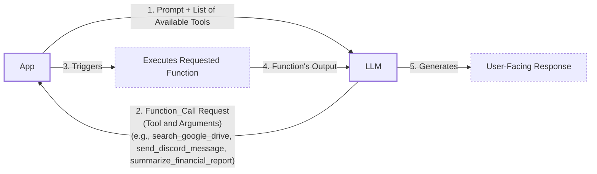
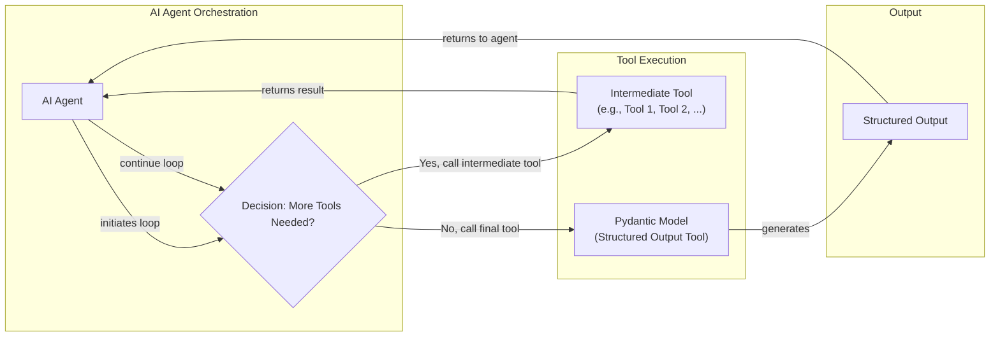
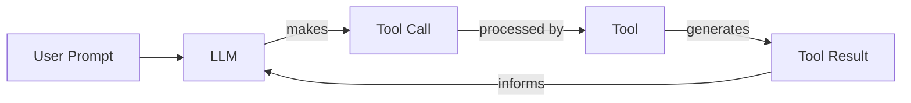

# Lesson 6: Agent Tools & Function Calling

In our previous lessons, we built a solid foundation in AI Engineering. We navigated the agent landscape, distinguished between LLM workflows and autonomous agents, mastered context engineering, ensured reliable data extraction with structured outputs, and implemented basic workflow patterns. Now, you are ready to give your systems the ability to act.

So far, our applications have been passive, processing information but never interacting with the outside world. In this lesson, we will change that by exploring agent tools, also known as function calling. Tools are what transform an LLM from a simple text generator into an agent that can take action. Understanding how an agent works with these tools is critical for building, debugging, and monitoring any real-world AI application. We will open this black box, starting from first principles.

## Understanding Why Agents Need Tools

LLMs have a fundamental limitation: they are sophisticated pattern matchers and text generators. They cannot, by themselves, perform actions or interact with the external world. Just as our ancestors developed tools to surpass the limitations of their bodies, LLMs need tools to extend their capabilities beyond pure text generation [[13]](https://thegradient.pub/grounding-large-language-models-in-a-cognitive-foundation/). They are brains in a vat, powerful thinkers with no hands or senses. This is where tools come in.

Tools are the bridge between an LLM's internal reasoning and the external environment. They serve as the agent's "hands and senses," allowing it to perceive and act in the world beyond its training data. This analogy is rooted in cognitive science, which views such systems as loosely brain-like cognitive architectures where the LLM acts as a central cognitive engine [[14]](https://www.alignmentforum.org/posts/ogHr8SvGqg9pW5wsT/capabilities-and-alignment-of-llm-cognitive-architectures). However, the analogy has its limits; unlike human brains, LLMs have a "dis-embodied cognition" and are not subject to the same environmental and processing constraints as biological agents [[15]](https://www.nature.com/articles/s41562-024-01882-z). With tools, an LLM evolves into an AI agent capable of executing specific instructions and affecting its environment.

This capability is essential because LLMs, on their own, lack several key abilities. They are unaware of the current time and date, perform poorly at precise mathematical calculations, and cannot access current events or specific knowledge bases outside their training data [[19]](https://lnu.diva-portal.org/smash/get/diva2:1801354/FULLTEXT01.pdf). Tools overcome these limitations by connecting the LLM to the real world [[16]](https://arxiv.org/html/2507.08034v1).

This unlocks a vast range of applications. Modern AI agents use tools to:
-   Access real-time information through APIs, like checking today's weather or fetching the latest news.
-   Interact with external databases, from a simple PostgreSQL database to a massive Snowflake data warehouse.
-   Access the agent's long-term memory to retrieve information beyond the immediate context window.
-   Execute code in languages like Python or JavaScript.
-   Perform precise calculations that go beyond their training, from basic arithmetic to complex statistical analysis.

## Implementing tool calls from scratch

The best way to understand how tools work is to build them from scratch. We will start by implementing a simple tool-calling framework before moving on to production-ready solutions. We will learn how a tool is defined, how its schema is communicated to the LLM, how the model decides which tool to call, and how we execute that call and interpret its output.

Our goal is to provide the LLM with a list of available tools and let it decide which one to use, generating the correct arguments to call the corresponding function. The high-level process involves five steps:

1.  **App:** Send a prompt to the LLM that includes a list of available tools.
2.  **LLM:** Respond with a `function_call` request, specifying the tool to use and the arguments for it.
3.  **App:** Execute the requested function in your application's code.
4.  **App:** Send the function's output back to the LLM as context.
5.  **LLM:** Use the tool's output to generate a final, user-facing response.

This request-execute-respond flow is the foundation of all tool-using agents.


Image 1: A 5-step flowchart illustrating the tool calling process between an App and an LLM.

Now, let's implement this flow. We will build a simple agent that can search for a financial report on Google Drive, summarize it, and send the summary to a Discord channel.

<aside>
💡

You can find all the code for this lesson in the accompanying [Jupyter Notebook on GitHub](https://github.com/towardsai/course-ai-agents/blob/dev/lessons/06_tools/notebook.ipynb).

</aside>

1.  First, we set up our environment by importing the necessary libraries and initializing the Gemini client. We will use the `gemini-2.5-flash` model, which is fast and cost-effective. We also define a sample `DOCUMENT` to mock the content of a financial report.
    ```python
    import json
    from typing import Any
    
    from google import genai
    from google.genai import types
    from pydantic import BaseModel, Field
    
    from lessons.utils import pretty_print
    
    client = genai.Client()
    
    MODEL_ID = "gemini-2.5-flash"
    
    DOCUMENT = """
    # Q3 2023 Financial Performance Analysis
    
    The Q3 earnings report shows a 20% increase in revenue and a 15% growth in user engagement, 
    beating market expectations. These impressive results reflect our successful product strategy 
    and strong market positioning.
    
    Our core business segments demonstrated remarkable resilience, with digital services leading 
    the growth at 25% year-over-year. The expansion into new markets has proven particularly 
    successful, contributing to 30% of the total revenue increase.
    
    Customer acquisition costs decreased by 10% while retention rates improved to 92%, 
    marking our best performance to date. These metrics, combined with our healthy cash flow 
    position, provide a strong foundation for continued growth into Q4 and beyond.
    """
    ```
2.  Next, we define our three mock tools as Python functions. To keep the focus on the tool-calling mechanism, we will simulate their behavior instead of implementing actual API calls.
    ```python
    def search_google_drive(query: str) -> dict:
        """
        Searches for a file on Google Drive and returns its content or a summary.
    
        Args:
            query (str): The search query to find the file, e.g., 'Q3 earnings report'.
    
        Returns:
            dict: A dictionary representing the search results, including file names and summaries.
        """
        return {
            "files": [
                {
                    "name": "Q3_Earnings_Report_2024.pdf",
                    "id": "file12345",
                    "content": DOCUMENT,
                }
            ]
        }
    ```
    ```python
    def send_discord_message(channel_id: str, message: str) -> dict:
        """
        Sends a message to a specific Discord channel.
    
        Args:
            channel_id (str): The ID of the channel to send the message to, e.g., '#finance'.
            message (str): The content of the message to send.
    
        Returns:
            dict: A dictionary confirming the action, e.g., {"status": "success"}.
        """
        return {
            "status": "success",
            "status_code": 200,
            "channel": channel_id,
            "message_preview": f"{message[:50]}...",
        }
    ```
    ```python
    def summarize_financial_report(text: str) -> str:
        """
        Summarizes a financial report.
    
        Args:
            text (str): The text to summarize.
    
        Returns:
            str: The summary of the text.
        """
        return "The Q3 2023 earnings report shows strong performance across all metrics with 20% revenue growth, 15% user engagement increase, 25% digital services growth, and improved retention rates of 92%."
    ```
3.  For the LLM to understand and use these functions, we must provide it with a schema for each tool. The schema, typically defined in JSON, describes what the tool does, what parameters it accepts, their types, and which are required. This schema is the industry standard for modern LLM providers like OpenAI and Gemini [[1]](https://ai.google.dev/gemini-api/docs/function-calling), [[2]](https://platform.openai.com/docs/guides/function-calling).
    ```python
    search_google_drive_schema = {
        "name": "search_google_drive",
        "description": "Searches for a file on Google Drive and returns its content or a summary.",
        "parameters": {
            "type": "object",
            "properties": {
                "query": {
                    "type": "string",
                    "description": "The search query to find the file, e.g., 'Q3 earnings report'.",
                }
            },
            "required": ["query"],
        },
    }
    ```
    ```python
    send_discord_message_schema = {
        "name": "send_discord_message",
        "description": "Sends a message to a specific Discord channel.",
        "parameters": {
            "type": "object",
            "properties": {
                "channel_id": {
                    "type": "string",
                    "description": "The ID of the channel to send the message to, e.g., '#finance'.",
                },
                "message": {
                    "type": "string",
                    "description": "The content of the message to send.",
                },
            },
            "required": ["channel_id", "message"],
        },
    }
    ```
    ```python
    summarize_financial_report_schema = {
        "name": "summarize_financial_report",
        "description": "Summarizes a financial report.",
        "parameters": {
            "type": "object",
            "properties": {
                "text": {
                    "type": "string",
                    "description": "The text to summarize.",
                },
            },
            "required": ["text"],
        },
    }
    ```
4.  We then create a tool registry to map tool names to their corresponding functions and schemas.
    ```python
    TOOLS = {
        "search_google_drive": {
            "handler": search_google_drive,
            "declaration": search_google_drive_schema,
        },
        "send_discord_message": {
            "handler": send_discord_message,
            "declaration": send_discord_message_schema,
        },
        "summarize_financial_report": {
            "handler": summarize_financial_report,
            "declaration": summarize_financial_report_schema,
        },
    }
    TOOLS_BY_NAME = {tool_name: tool["handler"] for tool_name, tool in TOOLS.items()}
    TOOLS_SCHEMA = [tool["declaration"] for tool in TOOLS.values()]
    ```
5.  The `TOOLS_BY_NAME` dictionary provides a quick way to access a tool's function handler by its name.
    It outputs:
    ```text
    Tool name: search_google_drive
    Tool handler: <function search_google_drive at 0x104c7df80>
    ---------------------------------------------------------------------------
    Tool name: send_discord_message
    Tool handler: <function send_discord_message at 0x104c7de40>
    ---------------------------------------------------------------------------
    Tool name: summarize_financial_report
    Tool handler: <function summarize_financial_report at 0x1274f5c60>
    ---------------------------------------------------------------------------
    ```
6.  The `TOOLS_SCHEMA` list contains the JSON schemas for all our tools, which we will pass to the LLM.
    It outputs:
    ```json
    {
      "name": "search_google_drive",
      "description": "Searches for a file on Google Drive and returns its content or a summary.",
      "parameters": {
        "type": "object",
        "properties": {
          "query": {
            "type": "string",
            "description": "The search query to find the file, e.g., 'Q3 earnings report'."
          }
        },
        "required": [
          "query"
        ]
      }
    }
    ```
7.  Next, we create a system prompt to instruct the LLM on how to use these tools. This prompt includes guidelines for when to use tools, how to select them, and the exact format for requesting a tool call.
    ```python
    TOOL_CALLING_SYSTEM_PROMPT = """
    You are a helpful AI assistant with access to tools that enable you to take actions and retrieve information to better 
    assist users.
    
    ## Tool Usage Guidelines
    
    **When to use tools:**
    - When you need information that is not in your training data
    - When you need to perform actions in external systems and environments
    - When you need real-time, dynamic, or user-specific data
    - When computational operations are required
    
    **Tool selection:**
    - Choose the most appropriate tool based on the user's specific request
    - If multiple tools could work, select the one that most directly addresses the need
    - Consider the order of operations for multi-step tasks
    
    **Parameter requirements:**
    - Provide all required parameters with accurate values
    - Use the parameter descriptions to understand expected formats and constraints
    - Ensure data types match the tool's requirements (strings, numbers, booleans, arrays)
    
    ## Tool Call Format
    
    When you need to use a tool, output ONLY the tool call in this exact format:
    
    ```tool_call
    {{"name": "tool_name", "args": {{"param1": "value1", "param2": "value2"}}}}
    ```
    
    **Critical formatting rules:**
    - Use double quotes for all JSON strings
    - Ensure the JSON is valid and properly escaped
    - Include ALL required parameters
    - Use correct data types as specified in the tool definition
    - Do not include any additional text or explanation in the tool call
    
    ## Response Behavior
    
    - If no tools are needed, respond directly to the user with helpful information
    - If tools are needed, make the tool call first, then provide context about what you're doing
    - After receiving tool results, provide a clear, user-friendly explanation of the outcome
    - If a tool call fails, explain the issue and suggest alternatives when possible
    
    ## Available Tools
    
    <tool_definitions>
    {tools}
    </tool_definitions>
    
    Remember: Your goal is to be maximally helpful to the user. Use tools when they add value, but don't use them unnecessarily. Always prioritize accuracy and user experience.
    """
    ```
8.  The LLM's decision-making process for tool use is guided by two main factors. First, it uses the `description` field in the tool schema to *decide* if a tool is appropriate for the user's query. This is why writing clear, articulate, and distinct tool descriptions is vital. Vague descriptions like "Tool to search documents" and "Tool to search files" can confuse the model. Instead, be explicit: "Tool to search documents on Google Drive" and "Tool to search files on the local disk." A real-world case study scaling an agent to 53 tools found that performance collapsed until they implemented "tool scoping," a middleware that shows the model only the 6-18 tools relevant to the user's current context. This protects the model's limited "attention budget" from being consumed by irrelevant tool definitions [[16]](https://dev.to/breeze_nik/scaling-an-ai-agent-to-53-tools-without-making-it-dumber-4d4). Second, being specific in the user prompt itself, such as saying "search documents on Google Drive," helps the agent make the right choice. This clarity becomes crucial as the number of tools scales. Once a tool is selected, the LLM *generates* the function name and arguments as a structured output, like JSON. This capability is not magic; it is the same next-token prediction mechanism as text generation, but fine-tuned on specialized datasets to produce schema-conforming JSON instead of human language [[17]](https://mbrenndoerfer.com/writing/function-calling-llm-structured-tools). Fine-tuning teaches the model not just the output format, but the judgment of when and how to invoke tools correctly [[3]](https://composio.dev/blog/how-to-build-tools-for-ai-agents-a-field-guide), [[4]](https://www.anthropic.com/research/building-effective-agents), [[18]](https://blog.neosage.io/p/an-engineers-guide-to-fine-tuning). While simple prompting with a schema can work, it is often unreliable, as the model might still make formatting mistakes [[27]](https://medium.com/@emrekaratas-ai/structured-output-generation-in-llms-json-schema-and-grammar-based-decoding-6a5c58b698a6). Fine-tuning, on the other hand, embeds structural consistency and domain-native reasoning directly into the model's weights, making it specifically reliable for your tasks [[28]](https://blog.neosage.io/p/an-engineers-guide-to-fine-tuning).

9.  Let's test this with a simple prompt.
    ```python
    USER_PROMPT = """
    Can you help me find the latest quarterly report and share key insights with the team?
    """
    
    messages = [TOOL_CALLING_SYSTEM_PROMPT.format(tools=str(TOOLS_SCHEMA)), USER_PROMPT]
    
    response = client.models.generate_content(
        model=MODEL_ID,
        contents=messages,
    )
    ```
10. The model correctly identifies the `search_google_drive` tool and generates the necessary arguments.
    It outputs:
    ```text
    ```tool_call
    {"name": "search_google_drive", "args": {"query": "latest quarterly report"}}
    ```
    ```
11. Let's try a more complex, multi-step prompt.
    ```python
    USER_PROMPT = """
    Please find the Q3 earnings report on Google Drive and send a summary of it to 
    the #finance channel on Discord.
    """
    
    messages = [TOOL_CALLING_SYSTEM_PROMPT.format(tools=str(TOOLS_SCHEMA)), USER_PROMPT]
    
    response = client.models.generate_content(
        model=MODEL_ID,
        contents=messages,
    )
    ```
12. The LLM correctly determines that the first step is to search for the report.
    It outputs:
    ```text
    ```tool_call
    {"name": "search_google_drive", "args": {"query": "Q3 earnings report"}}
    ```
    ```
13. Now, we need to parse this response and execute the function. We start by extracting the JSON string from the Markdown block.
    ```python
    def extract_tool_call(response_text: str) -> str:
        """
        Extracts the tool call from the response text.
        """
        return response_text.split("```tool_call")[1].split("```")[0].strip()
    
    
    tool_call_str = extract_tool_call(response.text)
    ```
    It outputs:
    ```text
    '{"name": "search_google_drive", "args": {"query": "Q3 earnings report"}}'
    ```
14. Next, we parse the string into a Python dictionary.
    ```python
    tool_call = json.loads(tool_call_str)
    ```
    It outputs:
    ```json
    {'name': 'search_google_drive', 'args': {'query': 'Q3 earnings report'}}
    ```
15. We retrieve the corresponding function handler from our `TOOLS_BY_NAME` registry.
    ```python
    tool_handler = TOOLS_BY_NAME[tool_call["name"]]
    ```
16. The handler is a reference to our original Python function.
    It outputs:
    ```text
    <function __main__.search_google_drive(query: str) -> dict>
    ```
17. Finally, we execute the function using the arguments provided by the LLM.
    ```python
    tool_result = tool_handler(**tool_call["args"])
    ```
18. The tool returns the mocked content of the financial report.
    It outputs:
    ```json
    {
      "files": [
        {
          "name": "Q3_Earnings_Report_2024.pdf",
          "id": "file12345",
          "content": "\n# Q3 2023 Financial Performance Analysis\n\nThe Q3 earnings report shows a 20% increase in revenue and a 15% growth in user engagement, \nbeating market expectations. These impressive results reflect our successful product strategy \nand strong market positioning.\n\nOur core business segments demonstrated remarkable resilience, with digital services leading \nthe growth at 25% year-over-year. The expansion into new markets has proven particularly \nsuccessful, contributing to 30% of the total revenue increase.\n\nCustomer acquisition costs decreased by 10% while retention rates improved to 92%, \nmarking our best performance to date. These metrics, combined with our healthy cash flow \nposition, provide a strong foundation for continued growth into Q4 and beyond.\n"
        }
      ]
    }
    ```
19. We can wrap these steps into a single helper function, `call_tool`, to streamline the process.
    ```python
    def call_tool(response_text: str, tools_by_name: dict) -> Any:
        """
        Call a tool based on the response from the LLM.
        """
    
        tool_call_str = extract_tool_call(response_text)
        tool_call = json.loads(tool_call_str)
        tool_name = tool_call["name"]
        tool_args = tool_call["args"]
        tool = tools_by_name[tool_name]
    
        return tool(**tool_args)
    ```
20. Using this function gives us the same result as before.
    ```python
    call_tool(response.text, tools_by_name=TOOLS_BY_NAME)
    ```
21. After executing a tool, we typically send the result back to the LLM. This allows the model to interpret the information and decide on the next step or formulate a final answer for the user.
    ```python
    response = client.models.generate_content(
        model=MODEL_ID,
        contents=f"Interpret the tool result: {json.dumps(tool_result, indent=2)}",
    )
    ```
22. The LLM then provides a natural language interpretation of the tool's output.
    It outputs:
    ```text
    The tool result provides the content of a file named `Q3_Earnings_Report_2024.pdf`.
    
    This document is a **Q3 2023 Financial Performance Analysis** and details exceptionally strong results, significantly beating market expectations.
    
    **Key highlights from the report include:**
    
    *   **Revenue Growth:** A 20% increase in revenue.
    *   **User Engagement:** 15% growth in user engagement.
    *   **Core Business Performance:** Digital services led growth at 25% year-over-year.
    *   **Market Expansion Success:** New markets contributed 30% of the total revenue increase.
    *   **Efficiency & Retention:**
        *   Customer acquisition costs decreased by 10%.
        *   Retention rates improved to 92%, marking the best performance to date.
    *   **Financial Health:** The company maintains a healthy cash flow position.
    
    The report attributes these impressive results to a successful product strategy and strong market positioning, indicating a robust foundation for continued growth into Q4 and beyond.
    ```

That is the basic concept of tool calling. We have successfully implemented a simple but complete function-calling flow from scratch.

## Implementing a small tool calling framework from scratch

Manually defining JSON schemas for every tool is tedious and violates the Don't Repeat Yourself (DRY) principle. Production frameworks like LangGraph solve this by using a `@tool` decorator to automatically generate and register schemas from Python functions. This approach aligns with lessons from robotics, where abstracting away low-level tool implementation details allows the agent to focus on high-level planning [[19]](https://www2.eecs.berkeley.edu/Pubs/TechRpts/2025/EECS-2025-59.pdf). For instance, robotics research shows that a tool's design—its "morphology"—shapes what an agent can perceive and do, just as a robot's physical body determines its capabilities [[30]](https://radar.gesda.global/robotics-and-the-challenge-of-embodied-intelligence/). This highlights that tool interfaces are not just computational add-ons but are integral to an agent's cognitive process [[31]](https://www.oaepublish.com/articles/ir.2026.05).

The industry is also moving toward standardization with protocols like MCP (Model Context Protocol), which defines a common language for how AIs discover and call tools, replacing brittle, hand-wired API workflows with semantic tools that agents can dynamically interpret [[5]](https://ai.google.dev/gemini-api/docs/function-calling#model_context_protocol_(mcp)), [[20]](https://writer.com/engineering/mcp-gateways/). MCP provides a unified, platform-independent specification, so tool providers do not need separate SDKs for each framework, lowering the barrier to entry for new tools and enabling a more modular ecosystem [[32]](https://blog.kakao.vc/How-MCP-and-A2A-Are-Reshaping-Startup-Opportunities). This allows for swappable agents that use proxy layers to route requests, similar to microservices for AI [[33]](https://dev.to/stevengonsalvez/exploring-the-mcp-ecosystem-looking-under-the-hood-10bj).

Let's build our own `@tool` decorator to create a small, reusable tool-calling framework. Our goal is to automatically generate a tool schema from a function's signature, type hints, and docstring.

1.  First, we define a `ToolFunction` class to wrap our decorated functions. This class will store both the original function and its generated schema.
    ```python
    from inspect import Parameter, signature
    from typing import Any, Callable, Dict, Optional
    
    
    class ToolFunction:
        def __init__(self, func: Callable, schema: Dict[str, Any]) -> None:
            self.func = func
            self.schema = schema
            self.__name__ = func.__name__
            self.__doc__ = func.__doc__
    
        def __call__(self, *args: Any, **kwargs: Any) -> Any:
            return self.func(*args, **kwargs)
    ```
2.  Next, we create the `@tool` decorator. A decorator in Python is a function that takes another function as input and extends its behavior without explicitly modifying it. Our decorator will inspect the function's signature and docstring to build the JSON schema automatically.
    ```python
    def tool(description: Optional[str] = None) -> Callable[[Callable], ToolFunction]:
        """
        A decorator that creates a tool schema from a function.
    
        Args:
            description: Optional override for the function's docstring
    
        Returns:
            A decorator function that wraps the original function and adds a schema
        """
    
        def decorator(func: Callable) -> ToolFunction:
            # Get function signature
            sig = signature(func)
    
            # Create parameters schema
            properties = {}
            required = []
    
            for param_name, param in sig.parameters.items():
                # Skip self for methods
                if param_name == "self":
                    continue
    
                param_schema = {
                    "type": "string",  # Default to string, can be enhanced with type hints
                    "description": f"The {param_name} parameter",  # Default description
                }
    
                # Add to required if parameter has no default value
                if param.default == Parameter.empty:
                    required.append(param_name)
    
                properties[param_name] = param_schema
    
            # Create the tool schema
            schema = {
                "name": func.__name__,
                "description": description or func.__doc__ or f"Executes the {func.__name__} function.",
                "parameters": {
                    "type": "object",
                    "properties": properties,
                    "required": required,
                },
            }
    
            return ToolFunction(func, schema)
    
        return decorator
    ```
3.  Now, we can redefine our tools using this new decorator. The code is much cleaner and more maintainable.
    ```python
    @tool()
    def search_google_drive_example(query: str) -> dict:
        """Search for files in Google Drive."""
        return {"files": ["Q3 earnings report"]}
    
    
    @tool()
    def send_discord_message_example(channel_id: str, message: str) -> dict:
        """Send a message to a Discord channel."""
        return {"message": "Message sent successfully"}
    
    
    @tool()
    def summarize_financial_report_example(text: str) -> str:
        """Summarize the contents of a financial report."""
        return "Financial report summarized successfully"
    
    
    tools = [
        search_google_drive_example,
        send_discord_message_example,
        summarize_financial_report_example,
    ]
    tools_by_name = {tool.schema["name"]: tool.func for tool in tools}
    tools_schema = [tool.schema for tool in tools]
    ```
4.  After decoration, our function is wrapped in a `ToolFunction` object.
    It outputs:
    ```text
    __main__.ToolFunction
    ```
5.  This object contains the auto-generated schema, which is identical to the one we created manually.
    It outputs:
    ```json
    {
      "name": "search_google_drive_example",
      "description": "Search for files in Google Drive.",
      "parameters": {
        "type": "object",
        "properties": {
          "query": {
            "type": "string",
            "description": "The query parameter"
          }
        },
        "required": [
          "query"
        ]
      }
    }
    ```
6.  It also holds a reference to the original function handler.
    It outputs:
    ```text
    <function __main__.search_google_drive_example(query: str) -> dict>
    ```
7.  Let's test our new framework with the same multi-step prompt.
    ```python
    USER_PROMPT = """
    Please find the Q3 earnings report on Google Drive and send a summary of it to 
    the #finance channel on Discord.
    """
    
    messages = [TOOL_CALLING_SYSTEM_PROMPT.format(tools=str(tools_schema)), USER_PROMPT]
    
    response = client.models.generate_content(
        model=MODEL_ID,
        contents=messages,
    )
    ```
8.  The LLM responds with the correct tool call, just as before.
    It outputs:
    ```text
    ```tool_call
    {"name": "search_google_drive_example", "args": {"query": "Q3 earnings report"}}
    ```
    ```
9.  We can use our existing `call_tool` function to execute it.
    ```python
    call_tool(response.text, tools_by_name=tools_by_name)
    ```
    It outputs:
    ```json
    {
      "files": [
        "Q3 earnings report"
      ]
    }
    ```
Voilà! We have built a small, practical tool-calling framework. This implementation is conceptually similar to what production frameworks like LangGraph do under the hood, giving us a deeper understanding of how they work.

## Implementing production-level tool calls with Gemini

While building a framework from scratch is a great learning exercise, production applications should use the native tool-calling capabilities of modern LLM APIs like Gemini. This approach is simpler, more robust, and more efficient, as the provider optimizes the underlying prompting for their specific models.

Let's refactor our implementation to use Gemini's native `GenerateContentConfig`. This configuration object allows us to define available tools and control how the model interacts with them, making our code cleaner and more powerful.

1.  First, we define the tools and configuration for the Gemini API. We can pass our manually defined schemas directly to the `Tool` and `GenerateContentConfig` objects. We will also set the `tool_config` to `ANY` mode, which forces the model to call a function instead of generating a free-form text response. Other available modes are `AUTO` (the default, where the model decides) and `NONE` (which disables tool calling) [[1]](https://ai.google.dev/gemini-api/docs/function-calling).
    ```python
    from google.genai import types
    
    tools = [
        types.Tool(
            function_declarations=[
                types.FunctionDeclaration(**search_google_drive_schema),
                types.FunctionDeclaration(**send_discord_message_schema),
            ]
        )
    ]
    config = types.GenerateContentConfig(
        tools=tools,
        # Force the model to call 'any' function, instead of chatting.
        tool_config=types.ToolConfig(function_calling_config=types.FunctionCallingConfig(mode="ANY")),
    )
    ```
2.  With this configuration, we no longer need our lengthy `TOOL_CALLING_SYSTEM_PROMPT`. We can send the user's prompt directly to the model, and the Gemini API handles the tool-use instructions internally.
    ```python
    USER_PROMPT = """
    Please find the Q3 earnings report on Google Drive and send a summary of it to 
    the #finance channel on Discord.
    """
    
    response = client.models.generate_content(
        model=MODEL_ID,
        contents=USER_PROMPT,
        config=config,
    )
    
    response_message_part = response.candidates[0].content.parts[0]
    function_call = response_message_part.function_call
    ```
3.  The response contains a `FunctionCall` object with the tool name and arguments.
    It outputs:
    ```text
    FunctionCall(id=None, args={'query': 'Q3 earnings report'}, name='search_google_drive')
    ```
4.  To simplify this even further, the `google-genai` Python SDK can automatically generate schemas from Python functions, just like our custom decorator. The SDK also offers an automatic function calling feature that handles the entire execution loop for you. When enabled (which it is by default for Python functions), the SDK detects a tool call, executes the corresponding function, sends the result back to the model, and returns the final user-facing response, all in a single `generate_content` call. This is particularly powerful for compositional function calling, where the model needs to chain multiple tools together to solve a complex problem [[1]](https://ai.google.dev/gemini-api/docs/function-calling).
    ```python
    def call_tool(function_call) -> Any:
        tool_name = function_call.name
        tool_args = {key: value for key, value in function_call.args.items()}
    
        tool_handler = TOOLS_BY_NAME[tool_name]
    
        return tool_handler(**tool_args)

    tool_result = call_tool(function_call)
    ```
    It outputs:
    ```json
    {
      "files": [
        {
          "name": "Q3_Earnings_Report_2024.pdf",
          "id": "file12345",
          "content": "\n# Q3 2023 Financial Performance Analysis\n\nThe Q3 earnings report shows a 20% increase in revenue and a 15% growth in user engagement, \nbeating market expectations. These impressive results reflect our successful product strategy \nand strong market positioning.\n\nOur core business segments demonstrated remarkable resilience, with digital services leading \nthe growth at 25% year-over-year. The expansion into new markets has proven particularly \nsuccessful, contributing to 30% of the total revenue increase.\n\nCustomer acquisition costs decreased by 10% while retention rates improved to 92%, \nmarking our best performance to date. These metrics, combined with our healthy cash flow \nposition, provide a strong foundation for continued growth into Q4 and beyond.\n"
        }
      ]
    }
    ```
By using the native SDK, we reduced dozens of lines of code to just a few, creating a more robust and maintainable system. Other popular APIs from OpenAI and Anthropic follow a similar logic, making these concepts easily transferable to your API of choice [[1]](https://ai.google.dev/gemini-api/docs/function-calling), [[2]](https://platform.openai.com/docs/guides/function-calling).

## Using Pydantic models as tools for on-demand structured outputs

Connecting this lesson with what we learned about structured outputs in Lesson 4, we can use a Pydantic model *as a tool*. This elegant pattern is useful in agentic scenarios where you perform several intermediate steps and then dynamically decide to produce a final, structured answer. The agent can use other tools for reasoning and data gathering, and when it is ready to conclude, it "calls" the Pydantic tool to format its findings into a validated, machine-readable object. This approach leverages the model's tool-calling capability to return structured data on demand [[6]](https://pydantic.dev/docs/ai/core-concepts/output/).

There are several ways to achieve this, such as using the model's native structured output feature or injecting the schema into the prompt. However, using a Pydantic model as a tool is often the most reliable method, as it is supported by virtually all models and has been shown to work well in practice [[6]](https://pydantic.dev/docs/ai/core-concepts/output/).


Image 2: A flowchart illustrating an AI agent calling multiple tools in a loop, with the last one being a structured output tool.

Let's see how to implement this pattern.

1.  First, we define our `DocumentMetadata` Pydantic model, just as we did in Lesson 4.
    ```python
    class DocumentMetadata(BaseModel):
        """A class to hold structured metadata for a document."""
    
        summary: str = Field(description="A concise, 1-2 sentence summary of the document.")
        tags: list[str] = Field(description="A list of 3-5 high-level tags relevant to the document.")
        keywords: list[str] = Field(description="A list of specific keywords or concepts mentioned.")
        quarter: str = Field(description="The quarter of the financial year described in the document (e.g., Q3 2023).")
        growth_rate: str = Field(description="The growth rate of the company described in the document (e.g., 10%).")
    ```
2.  We then create a tool declaration for a function named `extract_metadata`. The key step here is using `DocumentMetadata.model_json_schema()` as the `parameters` for this function. This tells the LLM that to "call" this tool, it must generate a JSON object that conforms to our Pydantic model's schema.
    ```python
    extraction_tool = types.Tool(
        function_declarations=[
            types.FunctionDeclaration(
                name="extract_metadata",
                description="Extracts structured metadata from a financial document.",
                parameters=DocumentMetadata.model_json_schema(),
            )
        ]
    )
    config = types.GenerateContentConfig(
        tools=[extraction_tool],
        tool_config=types.ToolConfig(function_calling_config=types.FunctionCallingConfig(mode="ANY")),
    )
    ```
3.  We prompt the model to analyze the document and extract metadata. The model sees the `extract_metadata` tool and understands that its job is to produce a structured output matching the Pydantic schema.
    ```python
    prompt = f"""
    Please analyze the following document and extract its metadata.
    
    Document:
    --- 
    {DOCUMENT}
    --- 
    """
    
    response = client.models.generate_content(model=MODEL_ID, contents=prompt, config=config)
    response_message_part = response.candidates[0].content.parts[0]
    
    if hasattr(response_message_part, "function_call"):
        function_call = response_message_part.function_call
    ```
4.  The model's response is a function call to `extract_metadata`, with the arguments being the structured data we wanted.
    It outputs:
    ```text
    Function Name: `extract_metadata
    Function Arguments: `{
        "growth_rate": "20%",
        "summary": "The Q3 2023 earnings report shows a 20% increase in revenue and 15% growth in user engagement, driven by successful product strategy and market expansion. This performance provides a strong foundation for continued growth.",
        "quarter": "Q3 2023",
        "keywords": [
            "Revenue",
            "User Engagement",
            "Market Expansion",
            "Customer Acquisition",
            "Retention Rates",
            "Digital Services",
            "Cash Flow"
        ],
        "tags": [
            "Financials",
            "Earnings",
            "Growth",
            "Business Strategy",
            "Market Analysis"
        ]
    }`
    ```
5.  We can then validate these arguments by instantiating our `DocumentMetadata` model, ensuring the data is correct and complete.
    ```python
    try:
        document_metadata = DocumentMetadata(**function_call.args)
        print("Validation successful!")
    except Exception as e:
        print(f"Validation failed: {e}")
    ```
    It outputs:
    ```text
    Validation successful!
    ```
This pattern is a powerful way to combine the flexibility of agentic reasoning with the reliability of structured data, and it is frequently used in production AI systems [[6]](https://pydantic.dev/docs/ai/core-concepts/output/).

## The downsides of running tools in a loop

So far, we have focused on single-turn interactions where the agent calls one tool. The next logical step is to enable multi-step tasks by allowing the agent to run tools in a loop, chaining them together and deciding which tool to use at each step based on the output of the previous one. This is the final piece of the puzzle needed to build a true AI agent.


Image 3: A flowchart illustrating a sequential tool calling loop.

This looping mechanism gives the agent flexibility and adaptability, allowing it to tackle complex problems that require a sequence of actions. Let's implement this loop.

1.  We configure our agent with all three tools: `search_google_drive`, `send_discord_message`, and `summarize_financial_report`.
    ```python
    tools = [
        types.Tool(
            function_declarations=[
                types.FunctionDeclaration(**search_google_drive_schema),
                types.FunctionDeclaration(**send_discord_message_schema),
                types.FunctionDeclaration(**summarize_financial_report_schema),
            ]
        )
    ]
    config = types.GenerateContentConfig(
        tools=tools,
        tool_config=types.ToolConfig(function_calling_config=types.FunctionCallingConfig(mode="ANY")),
    )
    ```
2.  Our user prompt now describes a multi-step task.
    ```python
    USER_PROMPT = """
    Please find the Q3 earnings report on Google Drive and send a summary of it to 
    the #finance channel on Discord.
    """
    
    messages = [USER_PROMPT]
    ```
3.  We start by making the first call to the LLM.
    ```python
    response = client.models.generate_content(
        model=MODEL_ID,
        contents=messages,
        config=config,
    )
    response_message_part = response.candidates[0].content.parts[0]
    messages.append(response.candidates[0].content)
    ```
4.  The model correctly identifies the first action: searching Google Drive.
    It outputs:
    ```text
    Function Name: `search_google_drive
    Function Arguments: `{
        "query": "Q3 earnings report"
    }`
    ```
5.  Now, we implement a `while` loop that continues as long as the model requests a function call. Inside the loop, we execute the tool, append the result to our message history, and call the model again to determine the next step.
    ```python
    max_iterations = 3
    while hasattr(response_message_part, "function_call") and max_iterations > 0:
        tool_result = call_tool(response_message_part.function_call)
    
        function_response_part = types.Part.from_function_response(
            name=response_message_part.function_call.name,
            response={"result": tool_result},
        )
        messages.append(function_response_part)
    
        response = client.models.generate_content(
            model=MODEL_ID,
            contents=messages,
            config=config,
        )
    
        response_message_part = response.candidates[0].content.parts[0]
        messages.append(response.candidates[0].content)
    
        max_iterations -= 1
    ```
    The loop executes as follows:
    -   **Iteration 1:** Calls `search_google_drive` and gets the document content. The LLM then requests `summarize_financial_report`.
    -   **Iteration 2:** Calls `summarize_financial_report` and gets the summary. The LLM then requests `send_discord_message`.
    -   **Iteration 3:** Calls `send_discord_message` with the summary. The LLM, having completed the task, does not request another tool.

While powerful, this simple sequential loop has significant limitations that cause it to fail in production. It cannot iterate on results or recover from failure; a failed tool call or an empty result cannot trigger a revised strategy because the model has no visibility into downstream outcomes [[8]](https://blogs.oracle.com/developers/what-is-the-ai-agent-loop-the-core-architecture-behind-autonomous-ai-systems). Furthermore, without a termination condition, an agent can get stuck in an unbounded loop, endlessly calling tools without converging on an answer, burning tokens and producing nothing [[7]](https://myengineeringpath.dev/genai-engineer/agentic-patterns/). The agent immediately moves to the next function call without "thinking" about what it has learned or whether it should adjust its strategy.

This approach also struggles to decompose dependent tasks, as real-world workflows require gathering information, making decisions based on that information, and then acting—a process that is inherently a loop, not a straight line [[8]](https://blogs.oracle.com/developers/what-is-the-ai-agent-loop-the-core-architecture-behind-autonomous-ai-systems). For tasks where tools are independent, a better approach is to run them in parallel to reduce latency, such as fetching financial news and stock prices simultaneously.

These limitations are what drove the development of more sophisticated agentic patterns like **ReAct** (Reasoning and Acting). ReAct explicitly interleaves reasoning steps with tool calls, allowing the agent to think through problems more deliberately. We will explore this powerful pattern in detail in Lessons 7 and 8.

## Popular tools used within the industry

To ground these concepts in the real world, let's look at some of the most popular tool categories used by AI engineers today.

### Knowledge & Memory Access
These tools connect agents to external knowledge sources, allowing them to retrieve information that is not in their training data. This includes querying vector databases for semantic search, document stores for raw files, or graph databases to understand relationships between entities. A knowledge graph, for instance, can store connections between unstructured text and structured entities, enabling retrieval via relationships that simple vector search would miss [[29]](https://neo4j.com/blog/agentic-ai/connected-context-and-persistent-memory-neo4j-providers-for-the-microsoft-agent-framework/). A common pattern in this category is **text-to-SQL**, where the agent translates a natural language question into a SQL query to fetch data from a traditional database, democratizing data access for non-technical users [[9]](https://promethium.ai/guides/text-to-sql-basics-benefits/). These tools are the foundation of RAG and agentic RAG systems, which we will cover in Lessons 9 and 10.

### Web Search & Browsing
These are some of the most common tools, giving agents access to the live internet. They typically interface with search engine APIs like Google, Bing, or Brave to fetch up-to-date information. More advanced versions include web scraping tools that can extract and parse content directly from web pages [[10]](https://mantraideas.com/llm-web-search/). However, these tools can be brittle; one study found that general-purpose AIs with browsing capabilities achieved 0% to 75% accuracy on identical scraping tasks across multiple attempts, highlighting the challenge of data quality at scale [[21]](https://tendem.ai/blog/why-pure-ai-scraping-fails). Ethical web scraping also requires respecting `robots.txt` files, implementing delays between requests to avoid overwhelming servers, and adhering to guidelines like the U.S. 'Common Rule' to protect privacy and minimize harm [[22]](https://cimentadaj.github.io/dataharvesting/ethical-issues.html), [[34]](https://arxiv.org/html/2410.23432v1). Unethical scraping can also lead to legal issues like copyright infringement [[35]](https://www.secureitworld.com/article/ethical-web-scraping-best-practices-and-legal-considerations/).

### Code Execution
A code execution tool, most commonly a sandboxed Python interpreter, gives an agent powerful computational capabilities. The agent can write and execute code to perform mathematical calculations, manipulate data, run statistical analyses, or even generate data visualizations [[11]](https://arxiv.org/html/2507.08034v1). While incredibly powerful, this tool requires careful implementation to mitigate security risks like unauthorized filesystem access, network data exfiltration, or kernel-level exploits [[36]](https://northflank.com/blog/remote-code-execution-sandbox). Production systems face a trilemma between security, performance, and operational simplicity. Running code in standard containers is fast but insecure, while stronger isolation using technologies like gVisor or Firecracker microVMs adds latency [[23]](https://www.softwareseni.com/ai-agents-in-production-the-sandboxing-problem-no-one-has-solved/). Platforms like E2B and Modal have emerged to solve this problem, with Firecracker now considered the de facto standard for executing untrusted LLM-generated code [[24]](https://www.bunnyshell.com/guides/sandboxed-environments-ai-coding/).

### Other Popular Tools
Beyond these categories, agents can be equipped with a vast array of tools for specific tasks. For enterprise AI applications, this often means integrating with external APIs for calendars, email, or project management systems. Productivity-focused agents might use tools for file system operations, like reading and writing local files. For critical actions, such as sending an email or modifying a database, it is a best practice to include a human-in-the-loop confirmation step. In high-stakes domains like finance, this is often implemented as a "tool-call gatekeeper" that enforces hard constraints, such as maximum trade sizes or API rate limits, before execution [[12]](https://medium.com/@yugalnandurkar5/llm-engineering-part-i-fa48d4307d26), [[25]](https://rpc.cfainstitute.org/research/the-automation-ahead-content-series/agentic-ai-for-finance). For example, emerging agentic systems in Decentralized Finance (DeFi) can analyze large volumes of public on-chain data to inform trading strategies [[37]](https://arxiv.org/html/2603.13942v1).

## Conclusion

Tool calling is at the heart of modern AI agents. It is the mechanism that allows them to act, learn, and interact with the world. Mastering tool implementation and orchestration is one of the most critical skills for an AI engineer, as it is foundational to building, monitoring, and debugging capable AI applications. As the ecosystem matures around standards like MCP, the way we build, consume, and monetize tools will continue to evolve [[26]](https://a16z.com/a-deep-dive-into-mcp-and-the-future-of-ai-tooling/).

The simple tool-calling loops we built today are powerful, but their limitations reveal the need for more advanced patterns. In our next lesson, we will explore the theory behind planning and the ReAct framework, which introduces explicit reasoning steps, enabling agents to tackle more complex problems with greater reliability. This will be our next step toward building truly intelligent and autonomous systems.

## References

- [1] [Function calling with the Gemini API](https://ai.google.dev/gemini-api/docs/function-calling)
- [2] [Function calling with OpenAI's API](https://platform.openai.com/docs/guides/function-calling)
- [3] [How to Build Tools for AI Agents: A Field Guide](https://composio.dev/blog/how-to-build-tools-for-ai-agents-a-field-guide)
- [4] [Building effective agents](https://www.anthropic.com/research/building-effective-agents)
- [5] [Model context protocol (MCP)](https://ai.google.dev/gemini-api/docs/function-calling#model_context_protocol_(mcp))
- [6] [Output](https://pydantic.dev/docs/ai/core-concepts/output/)
- [7] [Agentic Design Patterns — Visual Architecture Guide](https://myengineeringpath.dev/genai-engineer/agentic-patterns/)
- [8] [What is the AI agent loop? The core architecture behind autonomous AI systems](https://blogs.oracle.com/developers/what-is-the-ai-agent-loop-the-core-architecture-behind-autonomous-ai-systems)
- [9] [Text-to-SQL: The Basics, Benefits, and How It's Evolving](https://promethium.ai/guides/text-to-sql-basics-benefits/)
- [10] [How LLMs Search the Web for Up-to-Date Information](https://mantraideas.com/llm-web-search/)
- [11] [Integrating External Tools with Large Language Models (LLM) to Improve Accuracy](https://arxiv.org/html/2507.08034v1)
- [12] [LLM Engineering Part I: The Emergence of Agentic AI and Function Calling](https://medium.com/@yugalnandurkar5/llm-engineering-part-i-fa48d4307d26)
- [13] [Grounding Large Language Models in a Cognitive Foundation](https://thegradient.pub/grounding-large-language-models-in-a-cognitive-foundation/)
- [14] [Capabilities and alignment of LLM-based cognitive architectures](https://www.alignmentforum.org/posts/ogHr8SvGqg9pW5wsT/capabilities-and-alignment-of-llm-cognitive-architectures)
- [15] [Human-like intuitive behaviour and reasoning biases in large language models](https://www.nature.com/articles/s41562-024-01882-z)
- [16] [Scaling an AI agent to 53 tools without making it dumber](https://dev.to/breeze_nik/scaling-an-ai-agent-to-53-tools-without-making-it-dumber-4d4)
- [17] [Function Calling & Other Structured LLM Outputs](https://mbrenndoerfer.com/writing/function-calling-llm-structured-tools)
- [18] [An Engineer's Guide to Fine-tuning Large Language Models](https://blog.neosage.io/p/an-engineers-guide-to-fine-tuning)
- [19] [An Embodied Generalist Agent in a 3D World](https://www2.eecs.berkeley.edu/Pubs/TechRpts/2025/EECS-2025-59.pdf)
- [20] [Gateways to another world: MCP and the future of agentic AI](https://writer.com/engineering/mcp-gateways/)
- [21] [Why pure AI scraping fails and what to do about it](https://tendem.ai/blog/why-pure-ai-scraping-fails)
- [22] [Ethical issues in web-scraping](https://cimentadaj.github.io/dataharvesting/ethical-issues.html)
- [23] [AI Agents in Production: The Sandboxing Problem No One Has Solved](https://www.softwareseni.com/ai-agents-in-production-the-sandboxing-problem-no-one-has-solved/)
- [24] [Sandboxed Environments for AI Coding Assistants](https://www.bunnyshell.com/guides/sandboxed-environments-ai-coding/)
- [25] [Agentic AI for Finance](https://rpc.cfainstitute.org/research/the-automation-ahead-content-series/agentic-ai-for-finance)
- [26] [A Deep Dive Into MCP and the Future of AI Tooling](https://a16z.com/a-deep-dive-into-mcp-and-the-future-of-ai-tooling/)
- [27] [Structured Output Generation in LLMs: JSON Schema and Grammar-based Decoding](https://medium.com/@emrekaratas-ai/structured-output-generation-in-llms-json-schema-and-grammar-based-decoding-6a5c58b698a6)
- [28] [An Engineer's Guide to Fine-tuning Large Language Models](https://blog.neosage.io/p/an-engineers-guide-to-fine-tuning)
- [29] [Agentic AI: Connected Context and Persistent Memory with Neo4j Providers for the Microsoft Agent Framework](https://neo4j.com/blog/agentic-ai/connected-context-and-persistent-memory-neo4j-providers-for-the-microsoft-agent-framework/)
- [30] [Robotics and the challenge of embodied intelligence](https://radar.gesda.global/robotics-and-the-challenge-of-embodied-intelligence/)
- [31] [Embodied AI: a review of a new paradigm for AI](https://www.oaepublish.com/articles/ir.2026.05)
- [32] [How MCP and A2A Are Reshaping Startup Opportunities](https://blog.kakao.vc/How-MCP-and-A2A-Are-Reshaping-Startup-Opportunities)
- [33] [Exploring the MCP Ecosystem: Looking Under the Hood](https://dev.to/stevengonsalvez/exploring-the-mcp-ecosystem-looking-under-the-hood-10bj)
- [34] [Ethical and Scientific Considerations for Web Scraping in Research](https://arxiv.org/html/2410.23432v1)
- [35] [Ethical Web Scraping: Best Practices and Legal Considerations](https://www.secureitworld.com/article/ethical-web-scraping-best-practices-and-legal-considerations/)
- [36] [Remote Code Execution Sandbox](https://northflank.com/blog/remote-code-execution-sandbox)
- [37] [Agentic Finance: A Survey](https://arxiv.org/html/2603.13942v1)