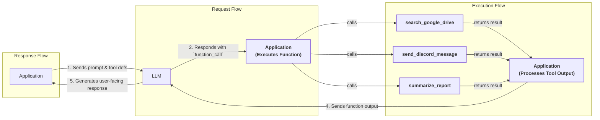
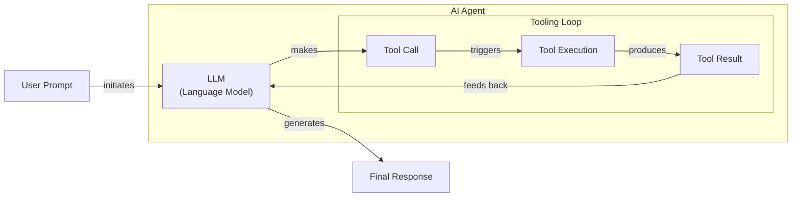

# Lesson 6: Agent Tools & Function Calling

In our previous lessons, we covered the essentials of AI Engineering, from distinguishing between LLM workflows and AI agents to mastering context engineering and structured outputs. We learned how to build basic workflows by chaining, routing, and parallelizing LLM calls. Now, we will take the next step and give our systems the ability to interact with the world.

This lesson is about tools, also known as function calling. For an AI Engineer, tools are what transform an LLM from a simple text generator into an agent that can take action. Understanding how they work is an essential skill for building, debugging, and monitoring production-ready applications. By implementing tool calling from scratch, we will open the black box to understand how an LLM decides which tool to use, generates the correct parameters, and executes functions. This is one of the most important building blocks of any AI Agent, and mastering it is fundamental.

## Understanding Why Agents Need Tools

LLMs have a fundamental limitation: they are powerful pattern matchers and text generators, but they cannot perform actions or access information outside of their training data. They live in a world of text, unable to check today's weather, search a real-time database, or send an email. To bridge this gap, we use tools.

Think of the LLM as the brain of an agent. Tools are its hands and senses, allowing it to perceive and act in the world beyond its textual interface. They are the bridge between the LLM's internal reasoning and the external environment. By giving an LLM access to tools, we transform it into an AI agent capable of executing complex, real-world tasks. This capability enables the agent to interact with and influence its surroundings, moving beyond its static knowledge base.

Image 1: A high-level overview of how tool calling works, showing the interaction between an application and an LLM. (Source: [What is Tool Calling? Connecting LLMs to Your Data [[57]](https://www.youtube.com/watch?v=h8gMhXYAv1k)])

This capability unlocks a wide range of applications. Modern AI agents use tools to:
-   **Access real-time information** through APIs, like checking the weather or reading the latest news [[19]](https://lnu.diva-portal.org/smash/get/diva2:1801354/FULLTEXT01.pdf).
-   **Interact with external databases** and other storage solutions to retrieve or store data.
-   **Access an agent's long-term memory** to recall facts from past conversations, going beyond the limitations of the context window.
-   **Execute code** in a sandboxed environment to perform precise calculations or data manipulation [[16]](https://arxiv.org/html/2507.08034v1).

The core idea is simple: we provide the agent with a set of functions it can call, and it learns to decide when and how to use them to fulfill a user's request. This allows the agent to go beyond its internal knowledge and affect its environment.

## Implementing tool calls from scratch

The best way to understand how tools work is to build the mechanism from scratch. Our goal is to provide an LLM with a list of available tools and let it decide which one to use and with what arguments.

The process of calling a tool unfolds in five steps:
1.  **Application:** You send the LLM a prompt that includes a list of available tool definitions.
2.  **LLM:** It analyzes the prompt and responds with a `function_call` request, specifying the tool's name and the arguments it needs.
3.  **Application:** Your code receives this request, parses it, and executes the corresponding function with the provided arguments.
4.  **Application:** You send the function's output back to the LLM as new context.
5.  **LLM:** It uses the tool's output to generate a final, user-facing response.

This flow allows the LLM to gather information or perform actions to better answer the user's query.


Image 2: A flowchart illustrating the 5-step tool calling process with request-execute-respond flow highlighted and example tool calls.

Now, let's dig into the code. We will implement a simple example where we mock searching for a document on Google Drive and sending its summary to a Discord channel.

<aside>
💡

You can find all the code for this lesson in the accompanying [Jupyter Notebook on GitHub](https://github.com/towardsai/course-ai-agents/blob/dev/lessons/06_tools/notebook.ipynb).

</aside>

1.  First, we set up our environment by initializing the Gemini client and defining our model and a sample document to work with. We use `gemini-2.5-flash`, which is fast, cost-effective, and supports advanced features like tool use.

    ```python
    import json
    from typing import Any
    
    from google import genai
    from google.genai import types
    from pydantic import BaseModel, Field
    
    from lessons.utils import env, pretty_print
    
    env.load(required_env_vars=["GOOGLE_API_KEY"])
    
    client = genai.Client()
    
    MODEL_ID = "gemini-2.5-flash"
    
    DOCUMENT = """
    # Q3 2023 Financial Performance Analysis
    
    The Q3 earnings report shows a 20% increase in revenue and a 15% growth in user engagement, 
    beating market expectations. These impressive results reflect our successful product strategy 
    and strong market positioning.
    
    Our core business segments demonstrated remarkable resilience, with digital services leading 
    the growth at 25% year-over-year. The expansion into new markets has proven particularly 
    successful, contributing to 30% of the total revenue increase.
    
    Customer acquisition costs decreased by 10% while retention rates improved to 92%, 
    marking our best performance to date. These metrics, combined with our healthy cash flow 
    position, provide a strong foundation for continued growth into Q4 and beyond.
    """
    ```

2.  Next, we define three mock functions. The function signature and docstrings are crucial, as the LLM uses them to understand what each tool does. To keep the code simple and focused on the tool-calling mechanism, these functions return hardcoded data.

    ```python
    def search_google_drive(query: str) -> dict:
        """
        Searches for a file on Google Drive and returns its content or a summary.
    
        Args:
            query (str): The search query to find the file, e.g., 'Q3 earnings report'.
    
        Returns:
            dict: A dictionary representing the search results, including file names and summaries.
        """
        return {
            "files": [
                {
                    "name": "Q3_Earnings_Report_2024.pdf",
                    "id": "file12345",
                    "content": DOCUMENT,
                }
            ]
        }
    ```

    ```python
    def send_discord_message(channel_id: str, message: str) -> dict:
        """
        Sends a message to a specific Discord channel.
    
        Args:
            channel_id (str): The ID of the channel to send the message to, e.g., '#finance'.
            message (str): The content of the message to send.
    
        Returns:
            dict: A dictionary confirming the action, e.g., {"status": "success"}.
        """
        return {
            "status": "success",
            "status_code": 200,
            "channel": channel_id,
            "message_preview": f"{message[:50]}...",
        }
    ```

    ```python
    def summarize_financial_report(text: str) -> str:
        """
        Summarizes a financial report.
    
        Args:
            text (str): The text to summarize.
    
        Returns:
            str: The summary of the text.
        """
        return "The Q3 2023 earnings report shows strong performance across all metrics with 20% revenue growth, 15% user engagement increase, 25% digital services growth, and improved retention rates of 92%."
    ```

3.  For the LLM to use these functions, we must describe them in a format it understands. We create a JSON schema for each tool, which includes its name, a description of what it does, and a definition of its parameters. This schema is the industry standard for modern LLM providers like OpenAI and Gemini.

    ```python
    search_google_drive_schema = {
        "name": "search_google_drive",
        "description": "Searches for a file on Google Drive and returns its content or a summary.",
        "parameters": {
            "type": "object",
            "properties": {
                "query": {
                    "type": "string",
                    "description": "The search query to find the file, e.g., 'Q3 earnings report'.",
                }
            },
            "required": ["query"],
        },
    }
    
    send_discord_message_schema = {
        "name": "send_discord_message",
        "description": "Sends a message to a specific Discord channel.",
        "parameters": {
            "type": "object",
            "properties": {
                "channel_id": {
                    "type": "string",
                    "description": "The ID of the channel to send the message to, e.g., '#finance'.",
                },
                "message": {
                    "type": "string",
                    "description": "The content of the message to send.",
                },
            },
            "required": ["channel_id", "message"],
        },
    }
    
    summarize_financial_report_schema = {
        "name": "summarize_financial_report",
        "description": "Summarizes a financial report.",
        "parameters": {
            "type": "object",
            "properties": {
                "text": {
                    "type": "string",
                    "description": "The text to summarize.",
                },
            },
            "required": ["text"],
        },
    }
    ```

4.  We then aggregate these schemas and their corresponding functions into a tool registry. This makes it easy for our application to find and execute the correct function when the LLM requests it.

    ```python
    TOOLS = {
        "search_google_drive": {
            "handler": search_google_drive,
            "declaration": search_google_drive_schema,
        },
        "send_discord_message": {
            "handler": send_discord_message,
            "declaration": send_discord_message_schema,
        },
        "summarize_financial_report": {
            "handler": summarize_financial_report,
            "declaration": summarize_financial_report_schema,
        },
    }
    TOOLS_BY_NAME = {tool_name: tool["handler"] for tool_name, tool in TOOLS.items()}
    TOOLS_SCHEMA = [tool["declaration"] for tool in TOOLS.values()]
    ```

    The `TOOLS_BY_NAME` mapping gives us quick access to function handlers. It outputs:

    ```text
    {'search_google_drive': <function search_google_drive at 0x...>, 'send_discord_message': <function send_discord_message at 0x...>, 'summarize_financial_report': <function summarize_financial_report at 0x...>}
    ```

    And `TOOLS_SCHEMA` contains the list of schemas we will pass to the LLM. Here is the schema for `search_google_drive`:

    ```json
    {
      "name": "search_google_drive",
      "description": "Searches for a file on Google Drive and returns its content or a summary.",
      "parameters": {
        "type": "object",
        "properties": {
          "query": {
            "type": "string",
            "description": "The search query to find the file, e.g., 'Q3 earnings report'."
          }
        },
        "required": [
          "query"
        ]
      }
    }
    ```

5.  Now we create a system prompt to instruct the LLM on how to use these tools. This prompt includes guidelines for when to use tools, the exact format for a tool call, and the list of available tool schemas.

    ```python
    TOOL_CALLING_SYSTEM_PROMPT = """
    You are a helpful AI assistant with access to tools that enable you to take actions and retrieve information to better 
    assist users.
    
    ## Tool Usage Guidelines
    
    **When to use tools:**
    - When you need information that is not in your training data
    - When you need to perform actions in external systems and environments
    - When you need real-time, dynamic, or user-specific data
    - When computational operations are required
    
    **Tool selection:**
    - Choose the most appropriate tool based on the user's specific request
    - If multiple tools could work, select the one that most directly addresses the need
    - Consider the order of operations for multi-step tasks
    
    **Parameter requirements:**
    - Provide all required parameters with accurate values
    - Use the parameter descriptions to understand expected formats and constraints
    - Ensure data types match the tool's requirements (strings, numbers, booleans, arrays)
    
    ## Tool Call Format
    
    When you need to use a tool, output ONLY the tool call in this exact format:
    
    <tool_call>
    {{"name": "tool_name", "args": {{"param1": "value1", "param2": "value2"}}}}
    </tool_call>
    
    **Critical formatting rules:**
    - Use double quotes for all JSON strings
    - Ensure the JSON is valid and properly escaped
    - Include ALL required parameters
    - Use correct data types as specified in the tool definition
    - Do not include any additional text or explanation in the tool call
    
    ## Response Behavior
    
    - If no tools are needed, respond directly to the user with helpful information
    - If tools are needed, make the tool call first, then provide context about what you're doing
    - After receiving tool results, provide a clear, user-friendly explanation of the outcome
    - If a tool call fails, explain the issue and suggest alternatives when possible
    
    ## Available Tools
    
    <tool_definitions>
    {tools}
    </tool_definitions>
    
    Remember: Your goal is to be maximally helpful to the user. Use tools when they add value, but don't use them unnecessarily. Always prioritize accuracy and user experience.
    """
    ```

    Based on the `description` field from the tool schema, the LLM *decides* if a tool call is appropriate. This is why writing clear and articulate tool descriptions is so important. When multiple tools are available, their descriptions must be mutually distinguishing to avoid confusion. For example, `Tool used to search documents on Google Drive` and `Tool used to search files on disk` are far better than two generic descriptions like `Tool used to search files`. This clarity becomes even more important as the number of tools scales to 50 or 100 per agent.

    Once a tool is selected, the LLM *generates* the function name and arguments as a structured JSON output. This capability is not magic; models are specifically instruction fine-tuned to interpret tool schemas and produce valid tool calls.

6.  Let's test it. We send a user prompt along with our system prompt to the model.

    ```python
    USER_PROMPT = """
    Can you help me find the latest quarterly report and share key insights with the team?
    """
    
    messages = [TOOL_CALLING_SYSTEM_PROMPT.format(tools=str(TOOLS_SCHEMA)), USER_PROMPT]
    
    response = client.models.generate_content(
        model=MODEL_ID,
        contents=messages,
    )
    ```

    The LLM correctly identifies the `search_google_drive` tool and generates the required arguments. It outputs:

    ```text
    <tool_call>
    {"name": "search_google_drive", "args": {"query": "latest quarterly report"}}
    </tool_call>
    ```

7.  With a more complex prompt, the model still correctly identifies the first step.

    ```python
    USER_PROMPT = """
    Please find the Q3 earnings report on Google Drive and send a summary of it to 
    the #finance channel on Discord.
    """
    
    messages = [TOOL_CALLING_SYSTEM_PROMPT.format(tools=str(TOOLS_SCHEMA)), USER_PROMPT]
    
    response = client.models.generate_content(
        model=MODEL_ID,
        contents=messages,
    )
    ```

    It outputs:

    ```text
    <tool_call>
    {"name": "search_google_drive", "args": {"query": "Q3 earnings report"}}
    </tool_call>
    ```

8.  Now we need to parse this response and execute the function. First, we extract the JSON string from the response text.

    ```python
    def extract_tool_call(response_text: str) -> str:
        """
        Extracts the tool call from the response text.
        """
        return response_text.split("<tool_call>")[1].split("</tool_call>")[0].strip()
    
    tool_call_str = extract_tool_call(response.text)
    ```

    This gives us the clean JSON string:

    ```text
    '{"name": "search_google_drive", "args": {"query": "Q3 earnings report"}}'
    ```

9.  Next, we parse the string into a Python dictionary.

    ```python
    tool_call = json.loads(tool_call_str)
    ```

    It outputs:

    ```text
    {'name': 'search_google_drive', 'args': {'query': 'Q3 earnings report'}}
    ```

10. We use the tool name to retrieve the correct function handler from our `TOOLS_BY_NAME` registry.

    ```python
    tool_handler = TOOLS_BY_NAME[tool_call["name"]]
    ```

    This gives us a reference to our Python function. It outputs:

    ```text
    <function search_google_drive at 0x...>
    ```

11. Finally, we call the function using the arguments generated by the LLM.

    ```python
    tool_result = tool_handler(**tool_call["args"])
    ```

    The function executes and returns the mocked file content. It outputs:
    ```json
    {
      "files": [
        {
          "name": "Q3_Earnings_Report_2024.pdf",
          "id": "file12345",
          "content": "\n# Q3 2023 Financial Performance Analysis\n\nThe Q3 earnings report shows a 20% increase in revenue and a 15% growth in user engagement, \nbeating market expectations. These impressive results reflect our successful product strategy \nand strong market positioning.\n\nOur core business segments demonstrated remarkable resilience, with digital services leading \nthe growth at 25% year-over-year. The expansion into new markets has proven particularly \nsuccessful, contributing to 30% of the total revenue increase.\n\nCustomer acquisition costs decreased by 10% while retention rates improved to 92%, \nmarking our best performance to date. These metrics, combined with our healthy cash flow \nposition, provide a strong foundation for continued growth into Q4 and beyond.\n"
        }
      ]
    }
    ```

12. We can wrap these steps in a helper function to streamline the process.

    ```python
    def call_tool(response_text: str, tools_by_name: dict) -> Any:
        """
        Call a tool based on the response from the LLM.
        """
    
        tool_call_str = extract_tool_call(response_text)
        tool_call = json.loads(tool_call_str)
        tool_name = tool_call["name"]
        tool_args = tool_call["args"]
        tool = tools_by_name[tool_name]
    
        return tool(**tool_args)
    ```

    Calling this function gives us the same result as before.

13. The final step in the loop is to send the tool's result back to the LLM so it can interpret the information and decide on the next action or formulate a final answer.

    ```python
    response = client.models.generate_content(
        model=MODEL_ID,
        contents=f"Interpret the tool result: {json.dumps(tool_result, indent=2)}",
    )
    ```

    The LLM now provides a user-friendly summary based on the document content. It outputs:

    ```text
    The tool result provides the content of a file named `Q3_Earnings_Report_2024.pdf`.
    
    This document is a **Q3 2023 Financial Performance Analysis** and details exceptionally strong results, significantly beating market expectations.
    
    **Key highlights from the report include:**
    
    *   **Revenue Growth:** A 20% increase in revenue.
    *   **User Engagement:** 15% growth in user engagement.
    *   **Core Business Performance:** Digital services led growth at 25% year-over-year.
    *   **Market Expansion Success:** New markets contributed 30% of the total revenue increase.
    *   **Efficiency & Retention:**
        *   Customer acquisition costs decreased by 10%.
        *   Retention rates improved to 92%, marking the best performance to date.
    *   **Financial Health:** The company maintains a healthy cash flow position.
    
    The report attributes these impressive results to a successful product strategy and strong market positioning, indicating a robust foundation for continued growth into Q4 and beyond.
    ```

This is the basic concept behind tool calling. We have successfully implemented a simple but complete function-calling flow from scratch.

## Implementing a small tool calling framework from scratch

Manually defining JSON schemas for every tool is tedious and violates the Don't Repeat Yourself (DRY) principle. Modern agentic frameworks like LangGraph and other protocols solve this by using a `@tool` decorator that automatically generates schemas from Python function signatures and docstrings.

Let's build our own simple decorator to create a small tool-calling framework. This will give us a single, standardized place to compute schemas, making our code cleaner and more maintainable. The goal is to decorate a function and have its schema automatically generated and registered, similar to the `TOOLS` registry we built manually.

A Python decorator is a function that takes another function as input and extends its behavior without explicitly modifying it. It's a powerful feature for adding functionality like logging, timing, or, in our case, schema generation. The `@` syntax is just a more readable way of applying a decorator. For example, writing `@tool()` above a function `my_function` is equivalent to `my_function = tool()(my_function)`. The decorator wraps the original function, returning a new object that contains the added functionality.

1.  First, we define a wrapper class `ToolFunction` and a decorator function named `tool`. The decorator inspects a function's signature and docstring to automatically build the JSON schema. This process is similar to what production libraries like LangChain or the OpenAI Agents SDK do under the hood [[26]](https://openai.github.io/openai-agents-python/tools/), [[29]](https://docs.langchain.com/oss/python/langchain/tools).

    ```python
    from inspect import Parameter, signature
    from typing import Any, Callable, Dict, Optional
    
    
    class ToolFunction:
        def __init__(self, func: Callable, schema: Dict[str, Any]) -> None:
            self.func = func
            self.schema = schema
            self.__name__ = func.__name__
            self.__doc__ = func.__doc__
    
        def __call__(self, *args: Any, **kwargs: Any) -> Any:
            return self.func(*args, **kwargs)
    
    
    def tool(description: Optional[str] = None) -> Callable[[Callable], ToolFunction]:
        """
        A decorator that creates a tool schema from a function.
    
        Args:
            description: Optional override for the function's docstring
    
        Returns:
            A decorator function that wraps the original function and adds a schema
        """
    
        def decorator(func: Callable) -> ToolFunction:
            # Get function signature
            sig = signature(func)
    
            # Create parameters schema
            properties = {}
            required = []
    
            for param_name, param in sig.parameters.items():
                # Skip self for methods
                if param_name == "self":
                    continue
    
                param_schema = {
                    "type": "string",  # Default to string, can be enhanced with type hints
                    "description": f"The {param_name} parameter",  # Default description
                }
    
                # Add to required if parameter has no default value
                if param.default == Parameter.empty:
                    required.append(param_name)
    
                properties[param_name] = param_schema
    
            # Create the tool schema
            schema = {
                "name": func.__name__,
                "description": description or func.__doc__ or f"Executes the {func.__name__} function.",
                "parameters": {
                    "type": "object",
                    "properties": properties,
                    "required": required,
                },
            }
    
            return ToolFunction(func, schema)
    
        return decorator
    ```

2.  Now, we can redefine our tools by simply applying the `@tool()` decorator to each function.

    ```python
    @tool()
    def search_google_drive_example(query: str) -> dict:
        """Search for files in Google Drive."""
        return {"files": ["Q3 earnings report"]}
    
    
    @tool()
    def send_discord_message_example(channel_id: str, message: str) -> dict:
        """Send a message to a Discord channel."""
        return {"message": "Message sent successfully"}
    
    
    @tool()
    def summarize_financial_report_example(text: str) -> str:
        """Summarize the contents of a financial report."""
        return "Financial report summarized successfully"
    ```

3.  We collect the decorated functions and build our `tools_by_name` and `tools_schema` mappings as before.

    ```python
    tools = [
        search_google_drive_example,
        send_discord_message_example,
        summarize_financial_report_example,
    ]
    tools_by_name = {tool.schema["name"]: tool.func for tool in tools}
    tools_schema = [tool.schema for tool in tools]
    ```

4.  The decorated function is now a `ToolFunction` object.

    ```python
    type(search_google_drive_example)
    ```

    It outputs:

    ```text
    __main__.ToolFunction
    ```

    This object contains both the generated schema and the original function handler. The schema is identical to the one we created manually. It outputs:

    ```json
    {
      "name": "search_google_drive_example",
      "description": "Search for files in Google Drive.",
      "parameters": {
        "type": "object",
        "properties": {
          "query": {
            "type": "string",
            "description": "The query parameter"
          }
        },
        "required": [
          "query"
        ]
      }
    }
    ```

    And we can still access the underlying function. It outputs:

    ```text
    <function __main__.search_google_drive_example(query: str) -> dict>
    ```

5.  Let's test our new framework with the LLM.

    ```python
    USER_PROMPT = """
    Please find the Q3 earnings report on Google Drive and send a summary of it to 
    the #finance channel on Discord.
    """
    
    messages = [TOOL_CALLING_SYSTEM_PROMPT.format(tools=str(tools_schema)), USER_PROMPT]
    
    response = client.models.generate_content(
        model=MODEL_ID,
        contents=messages,
    )
    ```

    It outputs:

    ```text
    <tool_call>
    {"name": "search_google_drive_example", "args": {"query": "Q3 earnings report"}}
    </tool_call>
    ```

6.  We can use our existing `call_tool` function to execute the response.

    ```python
    call_tool(response.text, tools_by_name=tools_by_name)
    ```

    It outputs:

    ```json
    {
      "files": [
        "Q3 earnings report"
      ]
    }
    ```

Voilà! We have our little tool-calling framework. This implementation is similar to what you would find under the scenes in many popular agentic frameworks.

## Implementing production-level tool calls with Gemini

While building from scratch is a great learning exercise, in production, we typically use the native tool-calling capabilities of APIs like Gemini or OpenAI. This approach is more robust, efficient, and requires less code, as the provider optimizes the underlying prompts for their specific models. This ensures the best performance and reliability without manual prompt engineering.

Let's see how to achieve the same result using Gemini's native API.

1.  Instead of crafting a complex system prompt, we define a `GenerateContentConfig` object and pass our tool schemas directly to it. The `ToolConfig` allows us to control the function-calling behavior. Here, we set the `mode` to `"ANY"` to force the model to call a tool instead of generating a chat response. Other modes include `"AUTO"` (the default, where the model decides) and `"NONE"` (to disable tool use) [[10]](https://ai.google.dev/gemini-api/docs/function-calling).

    ```python
    from google.genai import types
    
    tools = [
        types.Tool(
            function_declarations=[
                types.FunctionDeclaration(**search_google_drive_schema),
                types.FunctionDeclaration(**send_discord_message_schema),
            ]
        )
    ]
    config = types.GenerateContentConfig(
        tools=tools,
        tool_config=types.ToolConfig(function_calling_config=types.FunctionCallingConfig(mode="ANY")),
    )
    ```

2.  We can now call the model with a simple user prompt, without the lengthy system prompt. This is more robust because we are certain the LLM is instructed correctly on how to use the tools.

    ```python
    USER_PROMPT = """
    Please find the Q3 earnings report on Google Drive and send a summary of it to 
    the #finance channel on Discord.
    """
    response = client.models.generate_content(
        model=MODEL_ID,
        contents=USER_PROMPT,
        config=config,
    )
    ```

3.  The response contains a `function_call` object that is easy to parse and execute.

    ```python
    response_message_part = response.candidates[0].content.parts[0]
    function_call = response_message_part.function_call
    ```

    It outputs:

    ```text
    FunctionCall(id=None, args={'query': 'Q3 earnings report'}, name='search_google_drive')
    ```

4.  To simplify even further, the `google-genai` Python SDK can automatically generate the schema from a Python function’s signature, type hints, and docstring. We can pass our functions directly to the `GenerateContentConfig` object, just like with our custom decorator.

    ```python
    config = types.GenerateContentConfig(
        tools=[search_google_drive, send_discord_message, summarize_financial_report],
        tool_config=types.ToolConfig(function_calling_config=types.FunctionCallingConfig(mode="ANY")),
    )
    ```

5.  We create a simplified `call_tool` function to handle Gemini's native `FunctionCall` object.

    ```python
    def call_tool(function_call) -> Any:
        tool_name = function_call.name
        tool_args = {key: value for key, value in function_call.args.items()}
    
        tool_handler = TOOLS_BY_NAME[tool_name]
    
        return tool_handler(**tool_args)
    ```

6.  Executing the tool call is now straightforward.

    ```python
    tool_result = call_tool(function_call)
    ```
    It outputs:
    ```json
    {
      "files": [
        {
          "name": "Q3_Earnings_Report_2024.pdf",
          "id": "file12345",
          "content": "\n# Q3 2023 Financial Performance Analysis\n\nThe Q3 earnings report shows a 20% increase in revenue and a 15% growth in user engagement, \nbeating market expectations. These impressive results reflect our successful product strategy \nand strong market positioning.\n\nOur core business segments demonstrated remarkable resilience, with digital services leading \nthe growth at 25% year-over-year. The expansion into new markets has proven particularly \nsuccessful, contributing to 30% of the total revenue increase.\n\nCustomer acquisition costs decreased by 10% while retention rates improved to 92%, \nmarking our best performance to date. These metrics, combined with our healthy cash flow \nposition, provide a strong foundation for continued growth into Q4 and beyond.\n"
        }
      ]
    }
    ```

By using the native SDK, we reduced dozens of lines of code to just a few, creating a more robust and maintainable system. Other popular APIs from providers like OpenAI and Anthropic follow a similar logic, making these concepts easily transferable to your API of choice [[21]](https://community.openai.com/t/prompting-best-practices-for-tool-use-function-calling/1123036), [[35]](https://is4.ai/blog/our-blog-1/openai-api-vs-anthropic-api-comparison-117).

## Using Pydantic models as tools for on-demand structured outputs

We can combine the power of tool calling with the structured data validation of Pydantic, which we covered in Lesson 4. A common and elegant pattern is to treat a Pydantic model as a tool. This allows an agent to perform several intermediate steps using unstructured tool outputs, which are easy for an LLM to interpret. Then, it can dynamically decide when to generate a final, structured answer that your application can reliably parse.

This pattern is perfect for agentic scenarios where the final output needs to be machine-readable for downstream processing, such as updating a database or rendering a UI component. For example, an agent might first search for a document, then summarize it, and finally use a Pydantic tool to extract key entities into a clean, validated object before finishing its task.

```mermaid
flowchart LR
  %% Start
  A["User Prompt"]

  %% AI Agent Processing
  B["AI Agent<br/>(Process Prompt)"]

  %% Multi-Tool Loop
  subgraph "AI Agent's Multi-Tool Loop"
    C["Call Various Tools<br/>(e.g., search_google_drive, summarize_financial_report)"]
    D["Unstructured Tool Results"]
    E{"Continue Loop or Final Output?"}
    F["Call Tool for Structured Output<br/>(using DocumentMetadata Pydantic model)"]
  end

  %% Final Output
  G["Structured Output"]

  %% Connections
  A -- "initiates" --> B
  B -- "starts processing" --> C

  C -- "returns" --> D
  D -- "analyzed by agent" --> E

  E -- "More tools needed" --> C
  E -- "Generate final structured output" --> F

  F -- "produces" --> G

  %% Visual grouping
  classDef input
  classDef process
  classDef toolcall
  classDef output

  class A input
  class B process
  class C,F toolcall
  class D output
  class G output
  class E process
```
Image 3: A flowchart illustrating an AI agent's multi-tool loop, including intermediate tool calls and a final structured output tool call.

Let's see how to implement this.

1.  First, we define our `DocumentMetadata` Pydantic model, just as we did in Lesson 4.

    ```python
    class DocumentMetadata(BaseModel):
        """A class to hold structured metadata for a document."""
    
        summary: str = Field(description="A concise, 1-2 sentence summary of the document.")
        tags: list[str] = Field(description="A list of 3-5 high-level tags relevant to the document.")
        keywords: list[str] = Field(description="A list of specific keywords or concepts mentioned.")
        quarter: str = Field(description="The quarter of the financial year described in the document (e.g., Q3 2023).")
        growth_rate: str = Field(description="The growth rate of the company described in the document (e.g., 10%).")
    ```

2.  Next, we create a tool definition where the function's parameters are defined by the Pydantic model's JSON schema. This is the same technique we used in Lesson 4 to guide the LLM's structured output.

    ```python
    extraction_tool = types.Tool(
        function_declarations=[
            types.FunctionDeclaration(
                name="extract_metadata",
                description="Extracts structured metadata from a financial document.",
                parameters=DocumentMetadata.model_json_schema(),
            )
        ]
    )
    config = types.GenerateContentConfig(
        tools=[extraction_tool],
        tool_config=types.ToolConfig(function_calling_config=types.FunctionCallingConfig(mode="ANY")),
    )
    ```

3.  We prompt the model to analyze the document and extract the metadata.

    ```python
    prompt = f"""
    Please analyze the following document and extract its metadata.
    
    Document:
    --- 
    {DOCUMENT}
    --- 
    """
    
    response = client.models.generate_content(model=MODEL_ID, contents=prompt, config=config)
    ```

4.  The model responds with a call to our `extract_metadata` function, with the arguments perfectly matching our Pydantic schema.

    ```python
    response_message_part = response.candidates[0].content.parts[0]
    function_call = response_message_part.function_call
    ```

    The function call arguments look like this:

    ```json
    {
      "growth_rate": "20%",
      "summary": "The Q3 2023 earnings report shows a 20% increase in revenue and 15% growth in user engagement, driven by successful product strategy and market expansion. This performance provides a strong foundation for continued growth.",
      "quarter": "Q3 2023",
      "keywords": [
        "Revenue",
        "User Engagement",
        "Market Expansion",
        "Customer Acquisition",
        "Retention Rates",
        "Digital Services",
        "Cash Flow"
      ],
      "tags": [
        "Financials",
        "Earnings",
        "Growth",
        "Business Strategy",
        "Market Analysis"
      ]
    }
    ```

5.  We can now validate this data by instantiating our `DocumentMetadata` model directly from the function call arguments.

    ```python
    try:
        document_metadata = DocumentMetadata(**function_call.args)
        print("Validation successful!")
    except Exception as e:
        print(f"Validation failed: {e}")
    ```

    It outputs:

    ```text
    Validation successful!
    ```

This pattern provides a robust and reliable way to get structured data from an agent, ensuring that the final output is always in the format your application expects.

## The downsides of running tools in a loop

So far, we have focused on single-turn interactions where the agent calls one tool. To build a true AI agent, we need to handle multi-step tasks that require chaining multiple tools together. A tool-calling loop enables this. The agent can call a tool, receive the result, and then decide on the next tool to call based on the new information.

This approach offers flexibility and allows the agent to tackle complex problems that cannot be solved in a single step.


Image 4: A flowchart illustrating a sequential tool calling loop in an AI agent.

Let's implement a loop to handle our previous request: "Please find the Q3 earnings report on Google Drive and send a summary of it to the #finance channel on Discord."

1.  We set up our configuration with all three available tools: `search_google_drive`, `send_discord_message`, and `summarize_financial_report`.

    ```python
    tools = [
        types.Tool(
            function_declarations=[
                types.FunctionDeclaration(**search_google_drive_schema),
                types.FunctionDeclaration(**send_discord_message_schema),
                types.FunctionDeclaration(**summarize_financial_report_schema),
            ]
        )
    ]
    config = types.GenerateContentConfig(
        tools=tools,
        tool_config=types.ToolConfig(function_calling_config=types.FunctionCallingConfig(mode="ANY")),
    )
    ```

2.  We start with the user's prompt and maintain a `messages` history.

    ```python
    USER_PROMPT = """
    Please find the Q3 earnings report on Google Drive and send a summary of it to 
    the #finance channel on Discord.
    """
    messages = [USER_PROMPT]
    ```

3.  We implement a loop that continues as long as the model requests a tool call. Inside the loop, we execute the tool, add the result to our message history, and send it back to the model for the next step.

    ```python
    response = client.models.generate_content(
        model=MODEL_ID,
        contents=messages,
        config=config,
    )
    response_message_part = response.candidates[0].content.parts[0]
    messages.append(response.candidates[0].content)
    
    max_iterations = 3
    while hasattr(response_message_part, "function_call") and max_iterations > 0:
        # Execute the tool call
        tool_result = call_tool(response_message_part.function_call)
    
        # Add the tool result to the message history
        function_response_part = types.Part.from_function_response(
            name=response_message_part.function_call.name,
            response={"result": tool_result},
        )
        messages.append(function_response_part)
    
        # Ask the LLM to continue
        response = client.models.generate_content(
            model=MODEL_ID,
            contents=messages,
            config=config,
        )
    
        response_message_part = response.candidates[0].content.parts[0]
        messages.append(response.candidates[0].content)
        max_iterations -= 1
    ```

The agent successfully completes the task by chaining the tools in the correct order:
1.  **Function Call:** `search_google_drive` with `query: "Q3 earnings report"`
2.  **Tool Result:** Returns the content of the financial document.
3.  **Function Call:** `summarize_financial_report` with the document text.
4.  **Tool Result:** Returns the summary.
5.  **Function Call:** `send_discord_message` with `channel_id: "#finance"` and the summary.
6.  **Tool Result:** Returns a success status.

While powerful, this simple sequential loop has notable limitations. The agent acts immediately on each step without an explicit opportunity to reason about the results. It cannot plan ahead, consider alternative strategies, or recover from errors effectively. This "act-first, think-later" approach can lead to several production failure modes [[9]](https://myengineeringpath.dev/genai-engineer/agentic-patterns/):
- **Unbounded loops:** Without a termination condition, an agent might loop indefinitely, calling tools without ever converging on an answer. This is why we added a `max_iterations` counter.
- **Silent tool failure:** If a tool returns an error, a naive loop might simply try another tool, potentially returning a confident-sounding answer based on no valid data. There is no explicit failure handling.
- **Myopic decision-making:** The agent only sees the result of the last action, which can cause it to lose sight of the overall goal in long, complex tasks.

<aside>
💡

To optimize tool calling, we can run independent tools in parallel. For example, if a user asks for today's weather and top news headlines, an agent could call a weather API and a news API simultaneously, reducing overall latency.

</aside>

These limitations motivated the development of more sophisticated agentic patterns like **ReAct** (Reason + Act). ReAct introduces an explicit "thought" step between actions, allowing the agent to reason about what it has learned and plan its next move. We will explore this powerful pattern in detail in Lessons 7 and 8.

## Popular tools used within the industry

To ground this lesson in the real world, let's look at some of the most popular tool categories used in production AI systems.

### Knowledge & Memory Access

These tools connect an agent to external knowledge sources, allowing it to go beyond its training data. This is a core component of most agentic systems.
-   **Vector Databases:** Agents query vector databases to perform semantic searches over large document collections. This mechanism is the foundation of Retrieval-Augmented Generation (RAG), where an agent uses a tool to retrieve relevant document chunks to augment its context before generating an answer [[12]](https://www.ruh.ai/blogs/how-vector-databases-are-rewiring-the-tech-industry).
-   **Graph Databases:** Knowledge graphs, often stored in databases like Neo4j, allow agents to retrieve structured information by traversing relationships between entities. For example, after finding a relevant text chunk via vector search, the agent can follow connections in the graph to gather related products, risk factors, or company details, providing richer context than isolated text [[11]](https://neo4j.com/blog/agentic-ai/connected-context-and-persistent-memory-neo4j-providers-for-the-microsoft-agent-framework/).
-   **Text-to-SQL:** For structured data in traditional databases, text-to-SQL tools translate a user's natural language query into a SQL query, execute it, and return the results. This democratizes data access for non-technical users, empowering them to get insights without needing to write SQL [[13]](https://promethium.ai/guides/text-to-sql-basics-benefits/).

These tools are closely related to agent memory and RAG, which we will cover in-depth in Lessons 9 and 10.

### Web Search & Browsing

To access up-to-the-minute information, agents need to interact with the internet.
-   **Search APIs:** Tools that interface with search engines like Google, Bing, or Brave are ubiquitous in chatbots and research agents. Instead of literally opening a browser, the agent calls a search API, which returns structured data like JSON, allowing it to answer questions about current events or find information not present in its static knowledge base [[17]](https://mantraideas.com/llm-web-search/).
-   **Web Scraping:** These tools fetch and parse content directly from web pages, enabling agents to extract specific data, monitor changes, or analyze website structures. When implementing scrapers, it's important to consider ethical guidelines, such as respecting a website's `robots.txt` file and terms of service to avoid overloading servers or accessing restricted content.

### Code Execution

Giving an agent the ability to write and execute code is a powerful way to extend its capabilities.
-   **Python Interpreter:** A common tool is a sandboxed Python interpreter. This allows the agent to perform precise calculations, manipulate data with libraries like Pandas, and even create data visualizations. A recent paper, "Athena," demonstrated that an LLM framework with access to computational tools achieved 83% accuracy in mathematical reasoning, significantly outperforming models like GPT-4o (53%) [[16]](https://arxiv.org/html/2507.08034v1). Security is a major consideration; code is always executed in a restricted environment (like a Docker container or a microVM) with no network access and strict resource limits to prevent malicious or runaway code from affecting the host system.

### Other Popular Tools

-   **External APIs:** Enterprise AI applications often integrate with calendars, email clients, and project management tools (like Jira or Asana) to automate workflows and assist with productivity tasks. This allows an agent to create a calendar event, send an email, or update a project ticket based on a user's request [[20]](https://medium.com/@yugalnandurkar5/llm-engineering-part-i-fa48d4307d26).
-   **File System Operations:** Tools that allow an agent to read, write, and list files on a local or remote file system are common in productivity apps that need to interact with a user's operating system. For critical operations like deleting a file, it is a best practice to implement a human-in-the-loop step, where the agent must ask for confirmation before proceeding.

## Conclusion

Tool calling is the core mechanism that allows AI agents to interact with the world, turning them from passive text generators into active problem-solvers. Understanding how to define, implement, and orchestrate tools is one of the most important skills for an AI Engineer. It is what enables you to build, monitor, and debug robust AI applications that deliver real value. This foundational knowledge is essential for creating systems that can reason, act, and adapt in complex environments.

In our next lesson, we will build upon this foundation by exploring the theory behind agentic planning and the ReAct pattern, which adds a crucial layer of reasoning to the tool-calling loop. We will also continue to see how tools, memory, and retrieval work together as we dive deeper into RAG and agent memory in future lessons.

## References

- [1] Ntinopoulos, V., Biefer, H. R. C., Tudorache, I., Papadopoulos, N., Odavic, D., Risteski, P., Haeussler, A., & Dzemali, O. (2025). Large language models for data extraction from unstructured and semi-structured electronic health records: a multiple model performance evaluation. BMJ Health & Care Informatics, 32(1), e101139. https://pmc.ncbi.nlm.nih.gov/articles/PMC11751965/
- [2] Evaluation of LLM-based Strategies for the Extraction of Food Product Information from Online Shops. (n.d.). arXiv. https://arxiv.org/html/2506.21585v1
- [3] Team, S. (2024, August 29). Type Safety in Python: Pydantic vs. Data Classes vs. Annotations vs. TypedDicts | Speakeasy. Speakeasy. https://www.speakeasy.com/blog/pydantic-vs-dataclasses
- [4] Validators approach in Python - Pydantic vs. Dataclasses. (n.d.). Codetain - End-to-end Software Development. https://codetain.com/blog/validators-approach-in-python-pydantic-vs-dataclasses/
- [5] Automating Knowledge Graphs with LLM Outputs. (n.d.). Prompts.ai. https://www.prompts.ai/en/blog-details/automating-knowledge-graphs-with-llm-outputs
- [6] Kelly, C. (2025, February 13). Structured Outputs: everything you should know. Humanloop: LLM Evals Platform for Enterprises. https://humanloop.com/blog/structured-outputs
- [7] Structured Outputs in vLLM: Guiding AI Responses. (n.d.). Red Hat Developer. https://developers.redhat.com/articles/2025/06/03/structured-outputs-vllm-guiding-ai-responses
- [8] Best practices for prompt engineering with the OpenAI API. (n.d.). OpenAI Help Center. https://help.openai.com/en/articles/6654000-best-practices-for-prompt-engineering-with-the-openai-api
- [9] Agentic Design Patterns — Visual Architecture Guide. myengineeringpath.dev. https://myengineeringpath.dev/genai-engineer/agentic-patterns/
- [10] Function calling with the Gemini API. Google AI for Developers. https://ai.google.dev/gemini-api/docs/function-calling
- [11] Connected Context and Persistent Memory: Neo4j Providers for the Microsoft Agent Framework. Neo4j. https://neo4j.com/blog/agentic-ai/connected-context-and-persistent-memory-neo4j-providers-for-the-microsoft-agent-framework/
- [12] How vector databases are rewiring the tech industry. ruh.ai. https://www.ruh.ai/blogs/how-vector-databases-are-rewiring-the-tech-industry
- [13] Text-to-SQL: The Basics, How It Works, and Key Benefits. Promethium. https://promethium.ai/guides/text-to-sql-basics-benefits/
- [14] Sharma, A. (2024, October 10). When should I use function calling, structured outputs or JSON mode? Vellum AI Blog. https://www.vellum.ai/blog/when-should-i-use-function-calling-structured-outputs-or-json-mode
- [15] Structured Output in vertexAI BatchPredictionJob. (n.d.). Google Cloud Community. https://www.googlecloudcommunity.com/gc/AI-ML/Structured-Output-in-vertexAI-BatchPredictionJob/m-p/866640
- [16] Niketan, N., & Batatia, H. (2025). Integrating External Tools with Large Language Models (LLM) to Improve Accuracy. arXiv. https://arxiv.org/html/2507.08034v1
- [17] LLM Web Search. mantraideas.com. https://mantraideas.com/llm-web-search/
- [18] Performance. (n.d.). Pydantic. https://docs.pydantic.dev/latest/concepts/performance/
- [19] How LLMs interact with external APIs. lnu.diva-portal.org. https://lnu.diva-portal.org/smash/get/diva2:1801354/FULLTEXT01.pdf
- [20] LLM Engineering Part I. Medium. https://medium.com/@yugalnandurkar5/llm-engineering-part-i-fa48d4307d26
- [21] Prompting best practices for tool use / function calling. OpenAI Community. https://community.openai.com/t/prompting-best-practices-for-tool-use-function-calling/1123036
- [22] Building robust LLM tool calling with advanced JSON. Medium. https://medium.com/@hariomshahu101/building-production-ready-llm-applications-bulletproof-llm-tool-calling-with-advanced-json-b95ce8889f4e
- [23] LLM Output Parsing and Structured Generation. Tetrate. https://tetrate.io/learn/ai/llm-output-parsing-structured-generation
- [24] Building AI Agents from scratch - Part 1: Tool use. Swirl AI. https://www.newsletter.swirlai.com/p/building-ai-agents-from-scratch-part
- [25] Function Calling: How LLMs use structured tools. mbrenndoerfer.com. https://mbrenndoerfer.com/writing/function-calling-llm-structured-tools
- [26] Tools. OpenAI Agents SDK. https://openai.github.io/openai-agents-python/tools/
- [27] What is Tool Calling? Connecting LLMs to Your Data. (2024, July 22). YouTube. https://www.youtube.com/watch?v=h8gMhXYAv1k
- [28] Tools. Pydantic. https://pydantic.dev/docs/ai/tools-toolsets/tools/
- [29] Tools. LangChain. https://docs.langchain.com/oss/python/langchain/tools
- [30] langchain_core.tools.convert.tool. LangChain. https://reference.langchain.com/python/langchain-core/tools/convert/tool
- [31] ReAct vs Plan-and-Execute: A Practical Comparison of LLM Agent Patterns. dev.to. https://dev.to/jamesli/react-vs-plan-and-execute-a-practical-comparison-of-llm-agent-patterns-4gh9
- [32] Building effective agents. Anthropic. https://www.anthropic.com/research/building-effective-agents
- [33] Best Practices to Build LLM Tools in 2025. techinfotech.tech.blog. https://techinfotech.tech.blog/2025/06/09/best-practices-to-build-llm-tools-in-2025/
- [34] Anthropic vs OpenAI. lilbigthings.com. https://www.lilbigthings.com/post/anthropic-vs-openai
- [35] OpenAI API vs Anthropic API Comparison. is4.ai. https://is4.ai/blog/our-blog-1/openai-api-vs-anthropic-api-comparison-117
- [36] Agentic Design Patterns Part 3, Tool Use. DeepLearning.AI. https://www.deeplearning.ai/the-batch/agentic-design-patterns-part-3-tool-use/
- [37] Efficient Tool Use with Chain-of-Abstraction Reasoning. arXiv. https://arxiv.org/pdf/2401.17464v3
- [38] OpenAI Responses API vs Chat Completions vs Anthropic Messages API. Portkey.ai. https://portkey.ai/blog/open-ai-responses-api-vs-chat-completions-vs-anthropic-anthropic-messages-api
- [39] Tool Descriptions are Critical. Towards AI. https://pub.towardsai.net/tool-descriptions-are-critical-making-better-llm-tools-research-capability-b315851471e7
- [40] Tool Input and Output Schema. APXML. https://apxml.com/courses/building-advanced-llm-agent-tools/chapter-1-llm-agent-tooling-foundations/tool-input-output-schemas
- [41] Function Calling: How LLMs use structured tools. mbrenndoerfer.com. https://mbrenndoerfer.com/writing/function-calling-llm-structured-tools
- [42] Underlying Factors Behind Inconsistency in LLM Responses With Multi-Tool Calling. Medium. https://medium.com/@abhaychougule0907/underlying-factors-behind-inconsistency-in-llm-responses-with-multi-tool-calling-628ce7b4de76
- [43] How to Write Tool Descriptions for LLM Agents? arXiv. https://arxiv.org/html/2505.18135v2
- [44] Tool Calling from Scratch to Production. Decoding AI. https://www.decodingai.com/p/tool-calling-from-scratch-to-production
- [45] Overview of Common LLM APIs. APXML. https://apxml.com/courses/prompt-engineering-llm-application-development/chapter-4-interacting-with-llm-apis/overview-common-llm-apis
- [46] LLM Providers & Gen AI Platforms Compared. getorchestra.io. https://www.getorchestra.io/guides/llm-providers-gen-ai-platforms-compared
- [47] Gemini Guide. myengineeringpath.dev. https://myengineeringpath.dev/tools/gemini-guide/
- [48] LLM API Differences That Break Your Code. futuresearch.ai. https://futuresearch.ai/blog/llm-provider-quirks/
- [49] Function Calling Guide: Google DeepMind Gemini 2.0 Flash. philschmid.de. https://www.philschmid.de/gemini-function-calling
- [50] Output. Pydantic. https://pydantic.dev/docs/ai/core-concepts/output/
- [51] How can a Pydantic model be registered as a tool using DocumentMetadata.model_json_schema() to enable on-demand structured outputs in multi-step agent loops with the Gemini SDK?. https://pydantic.dev/docs/ai/guides/multi-agent-applications/
- [52] How can a Pydantic model be registered as a tool using DocumentMetadata.model_json_schema() to enable on-demand structured outputs in multi-step agent loops with the Gemini SDK?. https://discuss.ai.google.dev/t/response-schema-from-pydantic/50028
- [53] What are the three main limitations of running tools sequentially in a loop without intermediate LLM interpretation, and how do they motivate more sophisticated patterns like ReAct?. https://blogs.oracle.com/developers/what-is-the-ai-agent-loop-the-core-architecture-behind-autonomous-ai-systems
- [54] How LLM Reasoning Powers the Agentic AI Revolution. Medium. https://medium.com/@anicomanesh/how-llm-reasoning-powers-the-agentic-ai-revolution-cbefd10ebf3f
- [55] Function calling with OpenAI's API. OpenAI Platform. https://platform.openai.com/docs/guides/function-calling
- [56] Building AI Agents from scratch - Part 1: Tool use. Swirl AI. https://www.newsletter.swirlai.com/p/building-ai-agents-from-scratch-part
- [57] What is Tool Calling? Connecting LLMs to Your Data. (2024, July 22). YouTube. https://www.youtube.com/watch?v=h8gMhXYAv1k
- [58] ReAct vs Plan-and-Execute: A Practical Comparison of LLM Agent Patterns. dev.to. https://dev.to/jamesli/react-vs-plan-and-execute-a-practical-comparison-of-llm-agent-patterns-4gh9
- [59] Agentic Design Patterns Part 3, Tool Use. DeepLearning.AI. https://www.deeplearning.ai/the-batch/agentic-design-patterns-part-3-tool-use/
- [60] Efficient Tool Use with Chain-of-Abstraction Reasoning. arXiv. https://arxiv.org/pdf/2401.17464v3
</article>