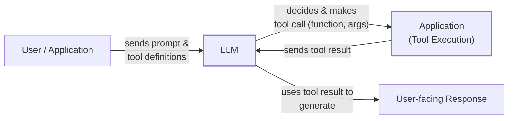
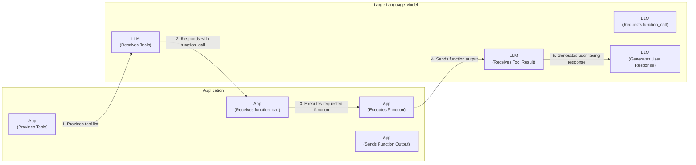
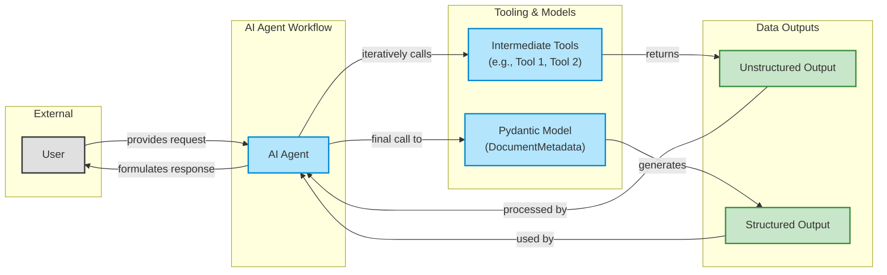
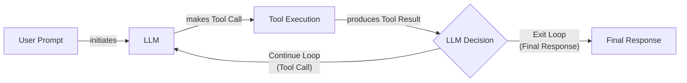

# Tool Calling: From Scratch to Production-Ready AI Agents

In our previous lessons, we built a solid foundation in AI Engineering. We explored the landscape of AI agents, distinguished between rule-based LLM workflows and autonomous agents, and mastered context engineering and structured outputs. Now, we will tackle the next fundamental step: giving our agents the ability to act.

Tools, also known as function calling, are what transform an LLM from a simple text generator into an agent that can interact with the external world. For an AI Engineer, understanding how an agent works with tools is critical to building, debugging, and monitoring robust applications. This lesson will open that black box, showing you how tool use works from first principles to production-ready implementations.

We will start by implementing tool calling from scratch to understand how an LLM decides which tool to call and how it generates the correct parameters. We will then build a small framework using decorators, use the native capabilities of modern APIs like Gemini, and chain multiple tools together. Finally, we will discuss the limitations of simple tool loops, which will set the stage for more advanced reasoning patterns.

## Understanding why agents need tools

LLMs have a fundamental limitation: they are powerful pattern matchers and text generators, but they cannot perform actions or access real-time information on their own. They are, in essence, brains in a jar. This is where tools come in. Tools are the bridge between the LLM’s internal reasoning and the external world, acting as its "hands and senses" to perceive and act beyond its textual interface. With tools, an LLM becomes an AI agent [[1]](https://www.deeplearning.ai/the-batch/agentic-design-patterns-part-3-tool-use/).



Image 1: A high-level flowchart illustrating how LLM tools work.

This pattern is a cornerstone of modern AI agents, enabling a wide range of capabilities. By integrating with external tools, LLMs can overcome their inherent limitations and ground their responses in real-world data and actions [[16]](https://arxiv.org/html/2507.08034v1). Some of the most popular tool categories include:

*   **Accessing real-time information** through external APIs, like fetching today's weather or the latest news. This is impossible for a model with a static training data cutoff, as it has no knowledge of events that occurred after its training was completed [[19]](https://lnu.diva-portal.org/smash/get/diva2:1801354/FULLTEXT01.pdf).
*   **Interacting with databases** and other data stores, from a PostgreSQL database to a Snowflake data warehouse, to retrieve or modify data. This allows agents to answer questions based on private, domain-specific knowledge, such as a company's internal product documentation or customer records [[11]](https://neo4j.com/blog/agentic-ai/connected-context-and-persistent-memory-neo4j-providers-for-the-microsoft-agent-framework/).
*   **Accessing the agent's long-term memory** to recall information beyond the current context window, a topic we will cover in Lesson 9. This gives agents a sense of continuity across conversations, allowing them to remember user preferences or past interactions [[12]](https://www.ruh.ai/blogs/how-vector-databases-are-rewiring-the-tech-industry).
*   **Executing code** in languages like Python or JavaScript to perform precise calculations, data manipulation, or statistical analysis. This externalizes cognitive work, allowing the model to "think" via execution rather than just pattern matching. For example, an agent can write and run code to calculate compound interest or generate a data visualization, tasks that are prone to error if attempted through pure text generation [[18]](https://medium.com/@anicomanesh/how-llm-reasoning-powers-the-agentic-ai-revolution-cbefd10ebf3f).

This theoretical understanding sets the stage for the practical implementation, which is where we will head next.

## Implementing tool calls from scratch

The best way to understand how tools work is to build the mechanism from scratch. Our goal is to provide an LLM with a list of available functions and let it decide which one to use and with what arguments to fulfill a user's request.

The high-level process involves five steps [[33]](https://www.youtube.com/watch?v=h8gMhXYAv1k):

1.  **You:** Send the LLM a prompt and a list of available tools, including their descriptions and parameters.
2.  **LLM:** Responds with a `function_call` request, specifying the tool to use and the arguments to pass.
3.  **You:** Execute the requested function in your application code.
4.  **You:** Send the function's output back to the LLM as context.
5.  **LLM:** Uses the tool's output to generate a final, user-facing response.



Image 2: A flowchart illustrating the 5-step request-execute-respond flow between an App and an LLM.

Let's implement a simple example where we mock searching for a financial document on Google Drive and sending its summary to a Discord channel.

<aside>
💡

You can find the code for this lesson in the accompanying [Jupyter Notebook on GitHub](https://github.com/towardsai/course-ai-agents/blob/dev/lessons/06_tools/notebook.ipynb) [[8]](https://github.com/towardsai/course-ai-agents/blob/dev/lessons/06_tools/notebook.ipynb).

</aside>

First, we set up our environment by initializing the Gemini client and defining our model and a sample document to simulate a PDF file. We will use `gemini-2.5-flash`, which is fast, cost-effective, and supports tool use.

```python
import json
from typing import Any

from google import genai
from google.genai import types
from pydantic import BaseModel, Field

from lessons.utils import pretty_print

client = genai.Client()

MODEL_ID = "gemini-2.5-flash"

DOCUMENT = """
# Q3 2023 Financial Performance Analysis

The Q3 earnings report shows a 20% increase in revenue and a 15% growth in user engagement, 
beating market expectations. These impressive results reflect our successful product strategy 
and strong market positioning.

Our core business segments demonstrated remarkable resilience, with digital services leading 
the growth at 25% year-over-year. The expansion into new markets has proven particularly 
successful, contributing to 30% of the total revenue increase.

Customer acquisition costs decreased by 10% while retention rates improved to 92%, 
marking our best performance to date. These metrics, combined with our healthy cash flow 
position, provide a strong foundation for continued growth into Q4 and beyond.
"""
```

Next, we define three mocked Python functions that will act as our tools. The function signature and docstrings are critical, as the LLM uses them to understand what each tool does. To keep the code simple and focus on the tool-calling mechanism, these functions return hardcoded values instead of interacting with real APIs.

```python
def search_google_drive(query: str) -> dict:
    """
    Searches for a file on Google Drive and returns its content or a summary.

    Args:
        query (str): The search query to find the file, e.g., 'Q3 earnings report'.

    Returns:
        dict: A dictionary representing the search results, including file names and summaries.
    """

    # In a real scenario, this would interact with the Google Drive API.
    # Here, we mock the response for demonstration.
    return {
        "files": [
            {
                "name": "Q3_Earnings_Report_2024.pdf",
                "id": "file12345",
                "content": DOCUMENT,
            }
        ]
    }
```

```python
def send_discord_message(channel_id: str, message: str) -> dict:
    """
    Sends a message to a specific Discord channel.

    Args:
        channel_id (str): The ID of the channel to send the message to, e.g., '#finance'.
        message (str): The content of the message to send.

    Returns:
        dict: A dictionary confirming the action, e.g., {"status": "success"}.
    """

    # Mocking a successful API call to Discord.
    return {
        "status": "success",
        "status_code": 200,
        "channel": channel_id,
        "message_preview": f"{message[:50]}...",
    }
```

```python
def summarize_financial_report(text: str) -> str:
    """
    Summarizes a financial report.

    Args:
        text (str): The text to summarize.

    Returns:
        str: The summary of the text.
    """

    return "The Q3 2023 earnings report shows strong performance across all metrics \
with 20% revenue growth, 15% user engagement increase, 25% digital services growth, and \
improved retention rates of 92%."
```

For each function, we define a schema in JSON format. This schema is the contract we provide to the LLM. It details the tool's name, a description of what it does, and the parameters it expects, including their names, types, and whether they are required. This is an industry-standard approach used by APIs from OpenAI, Anthropic, and Google [[23]](https://tetrate.io/learn/ai/llm-output-parsing-structured-generation), [[42]](https://apxml.com/courses/prompt-engineering-llm-application-development/chapter-4-interacting-with-llm-apis/overview-common-llm-apis).

```python
search_google_drive_schema = {
    "name": "search_google_drive",
    "description": "Searches for a file on Google Drive and returns its content or a summary.",
    "parameters": {
        "type": "object",
        "properties": {
            "query": {
                "type": "string",
                "description": "The search query to find the file, e.g., 'Q3 earnings report'.",
            }
        },
        "required": ["query"],
    },
}
```

```python
send_discord_message_schema = {
    "name": "send_discord_message",
    "description": "Sends a message to a specific Discord channel.",
    "parameters": {
        "type": "object",
        "properties": {
            "channel_id": {
                "type": "string",
                "description": "The ID of the channel to send the message to, e.g., '#finance'.",
            },
            "message": {
                "type": "string",
                "description": "The content of the message to send.",
            },
        },
        "required": ["channel_id", "message"],
    },
}
```

```python
summarize_financial_report_schema = {
    "name": "summarize_financial_report",
    "description": "Summarizes a financial report.",
    "parameters": {
        "type": "object",
        "properties": {
            "text": {
                "type": "string",
                "description": "The text to summarize.",
            },
        },
        "required": ["text"],
    },
}
```

We then aggregate these definitions into a tool registry for easy access. This registry will hold our tool handlers (the Python functions) and their corresponding schemas.

```python
TOOLS = {
    "search_google_drive": {
        "handler": search_google_drive,
        "declaration": search_google_drive_schema,
    },
    "send_discord_message": {
        "handler": send_discord_message,
        "declaration": send_discord_message_schema,
    },
    "summarize_financial_report": {
        "handler": summarize_financial_report,
        "declaration": summarize_financial_report_schema,
    },
}
TOOLS_BY_NAME = {tool_name: tool["handler"] for tool_name, tool in TOOLS.items()}
TOOLS_SCHEMA = [tool["declaration"] for tool in TOOLS.values()]
```

The `TOOLS_BY_NAME` dictionary maps tool names to their Python function handlers, allowing us to call the correct function dynamically.
It outputs:

```text
Tool name: search_google_drive
Tool handler: <function search_google_drive at 0x104c7df80>
---------------------------------------------------------------------------
Tool name: send_discord_message
Tool handler: <function send_discord_message at 0x104c7de40>
---------------------------------------------------------------------------
Tool name: summarize_financial_report
Tool handler: <function summarize_financial_report at 0x1274f5c60>
---------------------------------------------------------------------------
```

The `TOOLS_SCHEMA` list contains the JSON schemas that we will pass to the LLM. Here is the schema for our `search_google_drive` tool.
It outputs:

```text
[93m-------------------------------- `search_google_drive` Tool Schema -------------------------------- [0m
{
"name": "search_google_drive",
"description": "Searches for a file on Google Drive and returns its content or a summary.",
"parameters": {
  "type": "object",
  "properties": {
    "query": {
      "type": "string",
      "description": "The search query to find the file, e.g., 'Q3 earnings report'."
    }
  },
  "required": [
    "query"
  ]
}
}
[93m---------------------------------------------------------------------------------------------------- [0m
```

Next, we create a system prompt that instructs the LLM on how to use these tools. It includes guidelines on when to use tools, how to select them, the expected output format for a tool call, and the list of available tools enclosed in XML tags.

```python
TOOL_CALLING_SYSTEM_PROMPT = """
You are a helpful AI assistant with access to tools that enable you to take actions and retrieve information to better 
assist users.

## Tool Usage Guidelines

**When to use tools:**
- When you need information that is not in your training data
- When you need to perform actions in external systems and environments
- When you need real-time, dynamic, or user-specific data
- When computational operations are required

**Tool selection:**
- Choose the most appropriate tool based on the user's specific request
- If multiple tools could work, select the one that most directly addresses the need
- Consider the order of operations for multi-step tasks

**Parameter requirements:**
- Provide all required parameters with accurate values
- Use the parameter descriptions to understand expected formats and constraints
- Ensure data types match the tool's requirements (strings, numbers, booleans, arrays)

## Tool Call Format

When you need to use a tool, output ONLY the tool call in this exact format:

<tool_call>
{{"name": "tool_name", "args": {{"param1": "value1", "param2": "value2"}}}}
</tool_call>

**Critical formatting rules:**
- Use double quotes for all JSON strings
- Ensure the JSON is valid and properly escaped
- Include ALL required parameters
- Use correct data types as specified in the tool definition
- Do not include any additional text or explanation in the tool call

## Response Behavior

- If no tools are needed, respond directly to the user with helpful information
- If tools are needed, make the tool call first, then provide context about what you're doing
- After receiving tool results, provide a clear, user-friendly explanation of the outcome
- If a tool call fails, explain the issue and suggest alternatives when possible

## Available Tools

<tool_definitions>
{tools}
</tool_definitions>

Remember: Your goal is to be maximally helpful to the user. Use tools when they add value, but don't use them unnecessarily. Always prioritize accuracy and user experience.
"""
```

Now let's break down how this works. The LLM *decides* which tool to use based on the `description` field in the schema. This is why clear, articulate, and mutually exclusive descriptions are essential for building reliable agents, especially when scaling to dozens or even hundreds of tools [[31]](https://composio.dev/blog/how-to-build-tools-for-ai-agents-a-field-guide), [[61]](https://mbrenndoerfer.com/writing/function-calling-llm-structured-tools). Confusing descriptions like "search documents" versus "search files" will lead to incorrect tool selection. Instead, be explicit: "search documents on Google Drive" versus "search files on the local disk." Once a tool is selected, the LLM *generates* the function name and arguments as a structured output, like JSON. Models are specifically instruction-tuned to interpret these schemas and produce valid tool calls [[23]](https://tetrate.io/learn/ai/llm-output-parsing-structured-generation). Recent research frames this challenge as a "missing concept problem." An ambiguous query like "Who won the war between Ethiopia and Italy?" lacks the necessary concepts—"First War" or "Second War"—for the LLM to resolve it. Clear tool descriptions effectively inject these missing concepts into the LLM's latent space at runtime, allowing it to make the correct choice [[43]](https://arxiv.org/html/2505.11679v2). This aligns with concepts from Human-Computer Interaction (HCI), where a well-designed button or menu provides an "affordance"—a clear signal of what actions are possible. Your tool schema acts as an affordance for the LLM, bridging the "execution gulf" between its intent and the concrete function call it must generate [[50]](https://arxiv.org/html/2309.14459v1). As you scale, a practical technique to maintain clarity is namespacing. Grouping related tools with a common prefix (e.g., `gdrive_search_files`, `gdrive_create_doc`) helps the agent distinguish between tools that perform similar actions on different services, such as `jira_search_tickets` [[32]](https://www.anthropic.com/research/building-effective-agents).

Let's test it. We send a user prompt along with our system prompt to the model.

```python
USER_PROMPT = """
Can you help me find the latest quarterly report and share key insights with the team?
"""

messages = [TOOL_CALLING_SYSTEM_PROMPT.format(tools=str(TOOLS_SCHEMA)), USER_PROMPT]

response = client.models.generate_content(
    model=MODEL_ID,
    contents=messages,
)
```

The LLM correctly identifies the `search_google_drive` tool and generates the required arguments.
It outputs:

```text
[93m-------------------------------------- LLM Tool Call Response -------------------------------------- [0m
<tool_call>
{"name": "search_google_drive", "args": {"query": "latest quarterly report"}}
</tool_call>
[93m---------------------------------------------------------------------------------------------------- [0m
```

Here is another example for a more complex query that requires multiple steps.

```python
USER_PROMPT = """
Please find the Q3 earnings report on Google Drive and send a summary of it to 
the #finance channel on Discord.
"""

messages = [TOOL_CALLING_SYSTEM_PROMPT.format(tools=str(TOOLS_SCHEMA)), USER_PROMPT]

response = client.models.generate_content(
    model=MODEL_ID,
    contents=messages,
)
```

The model correctly identifies the first step: searching for the report.
It outputs:

```text
[93m-------------------------------------- LLM Tool Call Response -------------------------------------- [0m
<tool_call>
{"name": "search_google_drive", "args": {"query": "Q3 earnings report"}}
</tool_call>
[93m---------------------------------------------------------------------------------------------------- [0m
```

Now, we need to parse the LLM's response. We start by extracting the JSON string from the XML tags.

```python
def extract_tool_call(response_text: str) -> str:
    """
    Extracts the tool call from the response text.
    """
    return response_text.split("<tool_call>")[1].split("</tool_call>")[0].strip()


tool_call_str = extract_tool_call(response.text)
```

We parse the string into a Python dictionary.

```python
tool_call = json.loads(tool_call_str)
```

Next, we retrieve the correct function handler from our `TOOLS_BY_NAME` registry.

```python
tool_handler = TOOLS_BY_NAME[tool_call["name"]]
```

The handler is a direct reference to our Python function.
It outputs:

```text
<function __main__.search_google_drive(query: str) -> dict>
```

We execute the function using the arguments generated by the LLM.

```python
tool_result = tool_handler(**tool_call["args"])
```

The tool returns the mocked document content.
It outputs:

```text
[93m-------------------------------------- LLM Tool Call Response -------------------------------------- [0m
{
"files": [
  {
    "name": "Q3_Earnings_Report_2024.pdf",
    "id": "file12345",
    "content": "\n# Q3 2023 Financial Performance Analysis\n\nThe Q3 earnings report shows a 20% increase in revenue and a 15% growth in user engagement, \nbeating market expectations. These impressive results reflect our successful product strategy \nand strong market positioning.\n\nOur core business segments demonstrated remarkable resilience, with digital services leading \nthe growth at 25% year-over-year. The expansion into new markets has proven particularly \nsuccessful, contributing to 30% of the total revenue increase.\n\nCustomer acquisition costs decreased by 10% while retention rates improved to 92%, \nmarking our best performance to date. These metrics, combined with our healthy cash flow \nposition, provide a strong foundation for continued growth into Q4 and beyond.\n"
  }
]
}
[93m---------------------------------------------------------------------------------------------------- [0m
```

We can wrap these steps in a single `call_tool` function to streamline the process.

```python
def call_tool(response_text: str, tools_by_name: dict) -> Any:
    """
    Call a tool based on the response from the LLM.
    """

    tool_call_str = extract_tool_call(response_text)
    tool_call = json.loads(tool_call_str)
    tool_name = tool_call["name"]
    tool_args = tool_call["args"]
    tool = tools_by_name[tool_name]

    return tool(**tool_args)
```

Using this function, we can execute the tool call in one line, and the output is the same as before.

```python
pretty_print.wrapped(
    json.dumps(call_tool(response.text, tools_by_name=TOOLS_BY_NAME), indent=2), title="LLM Tool Call Response"
)
```

After executing a tool, we typically send the result back to the LLM. This allows it to interpret the output, formulate a final response, or decide on the next action.

```python
response = client.models.generate_content(
    model=MODEL_ID,
    contents=f"Interpret the tool result: {json.dumps(tool_result, indent=2)}",
)
```

The LLM provides a human-readable summary based on the tool's output.
It outputs:

```text
[93m-------------------------------------- LLM Tool Call Response -------------------------------------- [0m
The tool result provides the content of a file named `Q3_Earnings_Report_2024.pdf`.

This document is a **Q3 2023 Financial Performance Analysis** and details exceptionally strong results, significantly beating market expectations.

**Key highlights from the report include:**

*   **Revenue Growth:** A 20% increase in revenue.
*   **User Engagement:** 15% growth in user engagement.
*   **Core Business Performance:** Digital services led growth at 25% year-over-year.
*   **Market Expansion Success:** New markets contributed 30% of the total revenue increase.
*   **Efficiency & Retention:**
    *   Customer acquisition costs decreased by 10%.
    *   Retention rates improved to 92%, marking the best performance to date.
*   **Financial Health:** The company maintains a healthy cash flow position.

The report attributes these impressive results to a successful product strategy and strong market positioning, indicating a robust foundation for continued growth into Q4 and beyond.
[93m---------------------------------------------------------------------------------------------------- [0m
```

This is the basic concept of tool calling. We have successfully implemented it from scratch, but as you can see, it involves a lot of manual work.

## Implementing a small tool calling framework from scratch

Manually defining JSON schemas for every function is tedious and error-prone. Production frameworks like LangGraph and protocols like MCP (Model Context Protocol), which we will cover in Part 2 of the course, solve this by using a `@tool` decorator to automatically generate and register schemas from Python functions [[26]](https://openai.github.io/openai-agents-python/tools/), [[29]](https://docs.langchain.com/oss/python/langchain/tools). This approach is not just a convenience; it is a core software engineering principle.

Let's build our own simple framework to automate this process. The goal is to decorate a function and have its schema generated from its signature and docstring. This approach follows the Don't Repeat Yourself (DRY) principle by creating a single source of truth for both the tool's implementation and its definition [[27]](https://strandsagents.com/docs/user-guide/concepts/tools/custom-tools/). Instead of maintaining separate function code and schema definitions, which can easily fall out of sync, the decorator ensures that the schema always reflects the current state of the function. This makes the system more robust and easier to maintain.

We start by defining a `ToolFunction` class to wrap our decorated functions and their schemas. This class will hold both the callable function and its generated schema, making it a self-contained tool object.

```python
from inspect import Parameter, signature
from typing import Any, Callable, Dict, Optional


class ToolFunction:
    def __init__(self, func: Callable, schema: Dict[str, Any]) -> None:
        self.func = func
        self.schema = schema
        self.__name__ = func.__name__
        self.__doc__ = func.__doc__

    def __call__(self, *args: Any, **kwargs: Any) -> Any:
        return self.func(*args, **kwargs)
```

Next, we create the `@tool` decorator. It inspects the function's signature and docstring to build the JSON schema automatically. This process, known as introspection, allows our framework to dynamically understand the function's requirements without manual intervention. Python's `inspect` module provides the necessary tools to examine live objects, including functions, and extract information about their arguments and type hints. This is the same technique used by libraries like Pydantic to perform runtime validation and schema generation [[28]](https://pydantic.dev/docs/ai/tools-toolsets/tools/).

```python
def tool(description: Optional[str] = None) -> Callable[[Callable], ToolFunction]:
    """
    A decorator that creates a tool schema from a function.

    Args:
        description: Optional override for the function's docstring

    Returns:
        A decorator function that wraps the original function and adds a schema
    """

    def decorator(func: Callable) -> ToolFunction:
        # Get function signature
        sig = signature(func)

        # Create parameters schema
        properties = {}
        required = []

        for param_name, param in sig.parameters.items():
            # Skip self for methods
            if param_name == "self":
                continue

            param_schema = {
                "type": "string",  # Default to string, can be enhanced with type hints
                "description": f"The {param_name} parameter",  # Default description
            }

            # Add to required if parameter has no default value
            if param.default == Parameter.empty:
                required.append(param_name)

            properties[param_name] = param_schema

        # Create the tool schema
        schema = {
            "name": func.__name__,
            "description": description or func.__doc__ or f"Executes the {func.__name__} function.",
            "parameters": {
                "type": "object",
                "properties": properties,
                "required": required,
            },
        }

        return ToolFunction(func, schema)

    return decorator
```

Now, we can redefine our tools using the new decorator. The code is much cleaner and more maintainable, as the schema is now implicitly defined by the function itself.

```python
@tool()
def search_google_drive_example(query: str) -> dict:
    """Search for files in Google Drive."""
    return {"files": ["Q3 earnings report"]}


@tool()
def send_discord_message_example(channel_id: str, message: str) -> dict:
    """Send a message to a Discord channel."""
    return {"message": "Message sent successfully"}


@tool()
def summarize_financial_report_example(text: str) -> str:
    """Summarize the contents of a financial report."""
    return "Financial report summarized successfully"


tools = [
    search_google_drive_example,
    send_discord_message_example,
    summarize_financial_report_example,
]
tools_by_name = {tool.schema["name"]: tool.func for tool in tools}
tools_schema = [tool.schema for tool in tools]
```

The decorated function is now a `ToolFunction` object, which contains both the schema and the original function handler. The `search_google_drive_example` tool now has the type `__main__.ToolFunction` and its schema is automatically generated, identical to the one we created manually.
It outputs:

```text
[93m----------------------------------- Search Google Driv...
<tool_call>
{"name": "search_google_drive_example", "args": {"query": "Q3 earnings report"}}
</tool_call>
...
```

We can access the underlying function via the `.func` attribute.
It outputs:

```text
<function __main__.search_google_drive_example(query: str) -> dict>
```

Let's test our new framework. We use the same user prompt as before, passing the auto-generated `tools_schema` to the system prompt.

```python
USER_PROMPT = """
Please find the Q3 earnings report on Google Drive and send a summary of it to 
the #finance channel on Discord.
"""

messages = [TOOL_CALLING_SYSTEM_PROMPT.format(tools=str(tools_schema)), USER_PROMPT]

response = client.models.generate_content(
    model=MODEL_ID,
    contents=messages,
)
```

The model's response is identical, showing that our automated schema generation works correctly.
It outputs:

```text
[93m-------------------------------------- LLM Tool Call Response -------------------------------------- [0m
<tool_call>
{"name": "search_google_drive_example", "args": {"query": "Q3 earnings report"}}
</tool_call>
[93m---------------------------------------------------------------------------------------------------- [0m
```

We can execute the tool call just as we did before, using our `call_tool` helper function.

```python
pretty_print.wrapped(
    json.dumps(call_tool(response.text, tools_by_name=tools_by_name), indent=2), title="LLM Tool Call Response"
)
```

It outputs:

```text
[93m-------------------------------------- LLM Tool Call Response -------------------------------------- [0m
{
"files": [
  "Q3 earnings report"
]
}
[93m---------------------------------------------------------------------------------------------------- [0m
```

Voilà! We have built a small, yet functional, tool-calling framework. This implementation is conceptually similar to what modern libraries like LangChain's `langchain-core` do under the hood [[30]](https://reference.langchain.com/python/langchain-core/tools/convert/tool).

## Implementing production-level tool calls with Gemini

In production, it is best to use the native tool-calling capabilities of your chosen LLM provider, such as Gemini or OpenAI. These APIs are optimized for their specific models, making them more robust, efficient, and easier to maintain than a from-scratch implementation [[64]](https://www.decodingai.com/p/tool-calling-from-scratch-to-production). By relying on the provider's implementation, you offload the complexity of prompt engineering and schema management, ensuring that your tool definitions are always compatible with the latest model updates.

Let's see how to use Gemini's native API. We will replace our manual system prompt with Gemini's `GenerateContentConfig`.

First, we define the tools and configuration, passing our manually created schemas to the `types.Tool` object. The `ToolConfig` allows us to control the function-calling behavior. Here, we set the `mode` to `"ANY"` to force the model to call a function, which is useful when you know an action is required to answer the user's query. Other modes include `AUTO` (the default, where the model decides) and `NONE` (to disable tool use) [[2]](https://ai.google.dev/gemini-api/docs/function-calling).

```python
tools = [
    types.Tool(
        function_declarations=[
            types.FunctionDeclaration(**search_google_drive_schema),
            types.FunctionDeclaration(**send_discord_message_schema),
        ]
    )
]
config = types.GenerateContentConfig(
    tools=tools,
    # Force the model to call 'any' function, instead of chatting.
    tool_config=types.ToolConfig(function_calling_config=types.FunctionCallingConfig(mode="ANY")),
)
```

We can now call the model with a much simpler prompt. The API configuration handles the tool instructions, so we no longer need our lengthy system prompt. This makes the code cleaner and more focused on the user's intent.

```python
response = client.models.generate_content(
    model=MODEL_ID,
    contents=USER_PROMPT,
    config=config,
)
```

The response contains a `function_call` object, which we can parse and execute.
It outputs:

```text
FunctionCall(id=None, args={'query': 'Q3 earnings report'}, name='search_google_drive')
```

To simplify this even further, the `google-genai` SDK can automatically generate the schema from a Python function's signature, type hints, and docstring, just like our custom decorator [[14]](https://www.philschmid.de/gemini-function-calling). We can pass our functions directly to the `GenerateContentConfig` object, eliminating the need for manual schema definition entirely.

```python
from google.genai import types
config = types.GenerateContentConfig(
    tools=[search_google_drive, send_discord_message]
)
```

When we call the model with this new configuration, the result is the same. The `function_call` object contains the tool name and arguments.

```python
response_message_part = response.candidates[0].content.parts[0]
function_call = response_message_part.function_call
```

It outputs:

```text
FunctionCall(id=None, args={'query': 'Q3 earnings report'}, name='search_google_drive')
```

We can simplify our `call_tool` function to work directly with Gemini's `FunctionCall` object.

```python
def call_tool(function_call) -> any:
    tool_name = function_call.name
    tool_args = {key: value for key, value in function_call.args.items()}

    tool_handler = TOOLS_BY_NAME[tool_name]

    return tool_handler(**tool_args)
```

Executing the tool call is now straightforward.

```python
tool_result = call_tool(response_message_part.function_call)
```

It outputs:

```text
[93m------------------------------------------- Tool Result ------------------------------------------- [0m
{
"files": [
  {
    "name": "Q3_Earnings_Report_2024.pdf",
    "id": "file12345",
    "content": "\n# Q3 2023 Financial Performance Analysis\n\nThe Q3 earnings report shows a 20% increase in revenue and a 15% growth in user engagement, \nbeating market expectations. These impressive results reflect our successful product strategy \nand strong market positioning.\n\nOur core business segments demonstrated remarkable resilience, with digital services leading \nthe growth at 25% year-over-year. The expansion into new markets has proven particularly \nsuccessful, contributing to 30% of the total revenue increase.\n\nCustomer acquisition costs decreased by 10% while retention rates improved to 92%, \nmarking our best performance to date. These metrics, combined with our healthy cash flow \nposition, provide a strong foundation for continued growth into Q4 and beyond.\n"
  }
]
}
[93m---------------------------------------------------------------------------------------------------- [0m
```

By using the native SDK, we reduced dozens of lines of code to just a few, creating a more robust and maintainable system. Other popular APIs from OpenAI and Anthropic follow a similar logic, making these concepts easily transferable [[48]](https://myengineeringpath.dev/tools/gemini-guide/), [[34]](https://is4.ai/blog/our-blog-1/openai-api-vs-anthropic-api-comparison-117).

Now that we have mastered native tool calling, let's explore a powerful pattern that combines this capability with the structured outputs we covered in a previous lesson.

## Using Pydantic models as tools for on-demand structured outputs

Connecting this lesson with what we learned in Lesson 4, we can use a Pydantic model as a tool to generate structured outputs on demand. This is a powerful pattern in agentic workflows where you might perform several intermediate steps with unstructured text before needing a structured, validated output for a final step or for downstream processing [[5]](https://pydantic.dev/docs/ai/core-concepts/output/). This approach gives you the flexibility of free-form reasoning during intermediate steps while ensuring the final output is reliable and machine-readable. For example, an agent might first use a search tool, then a summarization tool, and finally call a Pydantic-based tool to format the summary into a structured report.



Image 3: A flowchart illustrating an AI agent's workflow where it calls multiple tools in a loop, processing unstructured outputs before generating structured output via a Pydantic model and formulating a final response.

Let's see how to implement this.

First, we define our `DocumentMetadata` Pydantic model, just as we did in Lesson 4. This model serves as the schema for our structured output.

```python
class DocumentMetadata(BaseModel):
    """A class to hold structured metadata for a document."""

    summary: str = Field(description="A concise, 1-2 sentence summary of the document.")
    tags: list[str] = Field(description="A list of 3-5 high-level tags relevant to the document.")
    keywords: list[str] = Field(description="A list of specific keywords or concepts mentioned.")
    quarter: str = Field(description="The quarter of the financial year described in the document (e.g., Q3 2023).")
    growth_rate: str = Field(description="The growth rate of the company described in the document (e.g., 10%).")
```

We create a tool declaration for our Pydantic model. The `parameters` of this tool are derived directly from the Pydantic model's JSON schema using `.model_json_schema()`. This method automatically generates a schema that the LLM can understand, bridging the gap between our Python class and the API's requirements [[36]](https://discuss.ai.google.dev/t/response-schema-from-pydantic/50028).

```python
# The Pydantic class 'DocumentMetadata' is now our 'tool'
extraction_tool = types.Tool(
    function_declarations=[
        types.FunctionDeclaration(
            name="extract_metadata",
            description="Extracts structured metadata from a financial document.",
            parameters=DocumentMetadata.model_json_schema(),
        )
    ]
)
config = types.GenerateContentConfig(
    tools=[extraction_tool],
    tool_config=types.ToolConfig(function_calling_config=types.FunctionCallingConfig(mode="ANY")),
)
```

We prompt the model to analyze the document and extract the metadata.

```python
prompt = f"""
Please analyze the following document and extract its metadata.

Document:
--- 
{DOCUMENT}
--- 
"""

response = client.models.generate_content(model=MODEL_ID, contents=prompt, config=config)
response_message_part = response.candidates[0].content.parts[0]
```

The model responds with a function call to our `extract_metadata` tool, with arguments that match the `DocumentMetadata` schema.
It outputs:

```text
[93m------------------------------------------ Function Call ------------------------------------------ [0m
 [38;5;208mFunction Name: [0m `extract_metadata
 [38;5;208mFunction Arguments: [0m `{
"growth_rate": "20%",
"summary": "The Q3 2023 earnings report shows a 20% increase in revenue and 15% growth in user engagement, driven by successful product strategy and market expansion. This performance provides a strong foundation for continued growth.",
"quarter": "Q3 2023",
"keywords": [
  "Revenue",
  "User Engagement",
  "Market Expansion",
  "Customer Acquisition",
  "Retention Rates",
  "Digital Services",
  "Cash Flow"
],
"tags": [
  "Financials",
  "Earnings",
  "Growth",
  "Business Strategy",
  "Market Analysis"
]
}`
[93m---------------------------------------------------------------------------------------------------- [0m
```

We can then validate these arguments and create a Pydantic object, ensuring the data is structured and correct.

```python
if hasattr(response_message_part, "function_call"):
    function_call = response_message_part.function_call

    try:
        document_metadata = DocumentMetadata(**function_call.args)
        pretty_print.wrapped(document_metadata.model_dump_json(indent=2), title="Pydantic Validated Object")
    except Exception as e:
        pretty_print.wrapped(f"Validation failed: {e}", title="Validation Error")
else:
    pretty_print.wrapped("The model did not call the extraction tool.", title="No Function Call")
```

This pattern is frequently used in AI agents that require reliable, structured data for their final output.

## The downsides of running tools in a loop

So far, we have focused on single-turn interactions. A natural progression is to run tools in a loop, allowing an agent to chain multiple actions together. This is the final piece of the puzzle needed to build a true AI agent, enabling it to handle complex, multi-step tasks by letting the LLM decide which tool to call at each step based on the results of previous actions [[10]](https://blogs.oracle.com/developers/what-is-the-ai-agent-loop-the-core-architecture-behind-autonomous-ai-systems). This iterative process gives the agent flexibility and adaptability.



Image 4: A flowchart illustrating a generic tool calling loop, showing the LLM's decision to either make another tool call or provide a final response.

Let's implement a loop for our previous example: finding a report on Google Drive and sending a summary to Discord.

First, we configure the model with all three of our available tools.

```python
tools = [
    types.Tool(
        function_declarations=[
            types.FunctionDeclaration(**search_google_drive_schema),
            types.FunctionDeclaration(**send_discord_message_schema),
            types.FunctionDeclaration(**summarize_financial_report_schema),
        ]
    )
]
config = types.GenerateContentConfig(
    tools=tools,
    tool_config=types.ToolConfig(function_calling_config=types.FunctionCallingConfig(mode="ANY")),
)
```

The user's intent requires multiple steps.

```python
USER_PROMPT = """
Please find the Q3 earnings report on Google Drive and send a summary of it to 
the #finance channel on Discord.
"""

messages = [USER_PROMPT]
```

We make the first call to the LLM.

```python
response = client.models.generate_content(
    model=MODEL_ID,
    contents=messages,
    config=config,
)
response_message_part = response.candidates[0].content.parts[0]
messages.append(response.candidates[0].content)
```

The model correctly identifies the first step: search Google Drive.
It outputs:

```text
[93m------------------------------------------ Function Call ------------------------------------------ [0m
 [38;5;208mFunction Name: [0m `search_google_drive
 [38;5;208mFunction Arguments: [0m `{
"query": "Q3 earnings report"
}`
[93m---------------------------------------------------------------------------------------------------- [0m
```

Now, we implement the loop. At each step, we execute the requested tool, append the result to our message history, and send it back to the LLM to decide the next action.

```python
# Loop until the model stops requesting function calls or we reach the max number of iterations
max_iterations = 3
while hasattr(response_message_part, "function_call") and max_iterations > 0:
    tool_result = call_tool(response_message_part.function_call)

    # Add the tool result to the messages
    function_response_part = types.Part.from_function_response(
        name=response_message_part.function_call.name,
        response={"result": tool_result},
    )
    messages.append(function_response_part)

    # Ask the LLM to continue with the next step
    response = client.models.generate_content(
        model=MODEL_ID,
        contents=messages,
        config=config,
    )

    response_message_part = response.candidates[0].content.parts[0]
    messages.append(response.candidates[0].content)

    max_iterations -= 1
```

The agent successfully chains the tools: first it searches for the document, then summarizes it, and finally sends the message to Discord.
It outputs:

```text
[93m------------------------------------------- Tool Result ------------------------------------------- [0m
{
"files": [
  {
    "name": "Q3_Earnings_Report_2024.pdf",
    "id": "file12345",
    "content": "..."
  }
]
}
[93m---------------------------------------------------------------------------------------------------- [0m
[93m------------------------------------------ Function Call ------------------------------------------ [0m
 [38;5;208mFunction Name: [0m `summarize_financial_report
[93m---------------------------------------------------------------------------------------------------- [0m
[93m------------------------------------------- Tool Result ------------------------------------------- [0m
The Q3 2023 earnings report shows strong performance...
[93m---------------------------------------------------------------------------------------------------- [0m
[93m------------------------------------------ Function Call ------------------------------------------ [0m
 [38;5;208mFunction Name: [0m `send_discord_message
[93m---------------------------------------------------------------------------------------------------- [0m
```

While this loop enables multi-step tasks, it has significant limitations [[9]](https://myengineeringpath.dev/genai-engineer/agentic-patterns/). The agent immediately moves to the next function call without pausing to reason about what it has learned or whether its strategy should change. This can lead to inefficient tool use, getting stuck in loops, or failing to handle unexpected outcomes. This lack of reflection is a common failure mode in agentic systems. Research has identified several recurring issues in simple loops, including "iteration anomalies" where the agent gets stuck in repetitive, non-progressive cycles, and "context pollution" where irrelevant information from early tool calls degrades the quality of later decisions [[45]](https://arxiv.org/html/2509.13941v1), [[46]](https://docs.kamiwaza.ai/assets/files/How_do_LLMs_fail_in_agentic_scenarios-eff27cdb81518717588e1fcdee00aec4.pdf). For instance, if a tool fails due to an invalid parameter, a simple loop has no recovery mechanism. A robust implementation should ensure that tools return helpful, actionable error messages. Instead of an opaque `HTTP 500` error, a good error response guides the agent: "Error: Invalid channel_id. Expected format is '#channel-name'. Please try again." This transforms a failure into a self-correcting opportunity [[32]](https://www.anthropic.com/research/building-effective-agents).

A quick note: to optimize this further, we could run independent tool calls in parallel. For instance, if a user asks for both financial news and current stock prices, these two API calls do not depend on each other and can be executed simultaneously to reduce latency.

The limitations of simple, sequential tool loops pushed the industry to develop more sophisticated patterns. The most foundational of these is **ReAct** (Reason and Act), which explicitly interleaves reasoning steps with tool calls. This allows the agent to think through problems more deliberately, and we will explore it in detail in Lessons 7 and 8.

## Popular tools used within the industry

To ground these concepts in the real world, let's survey some of the most popular tool categories used across the industry. A key principle in designing effective tools is to avoid merely wrapping every available API endpoint. Instead, you should build tools that map to high-impact workflows. This often means consolidating multiple low-level operations into a single, more powerful tool. For example, rather than separate `list_users`, `find_availability`, and `create_event` tools, a single `schedule_event` tool is far more efficient for an agent to use [[32]](https://www.anthropic.com/research/building-effective-agents).

### Knowledge & Memory Access

These tools connect the agent to external knowledge sources, overcoming the limitations of its training data. This is a core component of agentic RAG systems, which we will explore in Lessons 9 and 10. Agents can query vector databases like Qdrant or Neo4j to retrieve semantically similar documents, providing relevant context for a user's query [[12]](https://www.ruh.ai/blogs/how-vector-databases-are-rewiring-the-tech-industry). Knowledge graphs in databases like Neo4j allow agents to traverse relationships between entities, surfacing structured context that simple vector search would miss. For example, after finding a relevant text chunk about a company's financial performance, a graph-based tool can follow connections to retrieve related risk factors, products, and key executives, providing a much richer context than the text alone [[11]](https://neo4j.com/blog/agentic-ai/connected-context-and-persistent-memory-neo4j-providers-for-the-microsoft-agent-framework/). For structured data in traditional databases, text-to-SQL tools allow an agent to construct and execute SQL queries from natural language, democratizing data access for non-technical users [[13]](https://promethium.ai/guides/text-to-sql-basics-benefits/).

### Web Search & Browsing

These tools are omnipresent in modern chatbots and research agents, giving them access to the live internet. Tools that interface with search engines like Google, Bing, or Brave allow agents to retrieve up-to-date information on any topic, from current events to product reviews [[16]](https://arxiv.org/html/2507.08034v1). Beyond simple search, agents can use web scraping tools to fetch and parse the content of web pages, extracting specific information that a search API summary might not provide. This enables deeper research and analysis capabilities, allowing an agent to synthesize information from multiple sources to answer complex questions.

### Code Execution

Code execution tools give agents powerful computational and data manipulation capabilities. A sandboxed Python environment is one of the most powerful tools an agent can have. It allows the agent to perform precise calculations, run statistical analyses, manipulate data, and even generate visualizations, far surpassing the native arithmetic abilities of an LLM [[18]](https://medium.com/@anicomanesh/how-llm-reasoning-powers-the-agentic-ai-revolution-cbefd10ebf3f). This externalizes cognitive work, allowing the model to "think" via execution rather than just pattern matching. For security, it is critical that this code runs in a sandboxed environment to prevent it from accessing sensitive system resources. While Python is most common, this pattern is adapted for other languages like JavaScript as well.

### Other Popular Tools

This category covers a wide range of integrations that allow agents to take action in the real world. This includes tools for interacting with external APIs for calendars, email, or project management software like Jira, which are staples of enterprise AI applications [[20]](https://medium.com/@yugalnandurkar5/llm-engineering-part-i-fa48d4307d26). Productivity-focused agents often need tools to read and write files or list directories on a user's local machine, enabling tasks like organizing documents or summarizing notes. For actions with significant consequences, such as sending an email or modifying a database record, it is a best practice to implement a human-in-the-loop pattern, where the agent must seek confirmation from a user before executing the tool.

## Conclusion

Tool calling is a foundational skill for any AI Engineer. It is what elevates an LLM from a passive text generator to an active agent capable of interacting with its environment. By understanding how to define, call, and orchestrate tools—from scratch and with production-grade APIs—you can build AI applications that are more powerful, reliable, and useful. Mastering tool orchestration is not just about making an LLM do things; it is about designing a system where the LLM can reason effectively about its capabilities and limitations.

The limitations of simple tool loops, however, highlight the need for more advanced agentic patterns. In our next lesson, we will explore the theory behind planning and the ReAct framework, which introduces explicit reasoning steps between actions. This will set the stage for building more sophisticated agents that can think, act, and adapt to complex, real-world problems.

## References

- [1]  https://www.deeplearning.ai/the-batch/agentic-design-patterns-part-3-tool-use/
- [2]  https://ai.google.dev/gemini-api/docs/function-calling
- [3]  https://platform.openai.com/docs/guides/function-calling
- [4]  https://www.youtube.com/watch?v=ApoDzZP8_ck
- [5]  https://pydantic.dev/docs/ai/core-concepts/output/
- [6]  https://arxiv.org/pdf/2401.17464v3
- [7]  https://www.newsletter.swirlai.com/p/building-ai-agents-from-scratch-part
- [8]  https://github.com/towardsai/course-ai-agents/blob/dev/lessons/06_tools/notebook.ipynb
- [9]  https://myengineeringpath.dev/genai-engineer/agentic-patterns/
- [10]  https://blogs.oracle.com/developers/what-is-the-ai-agent-loop-the-core-architecture-behind-autonomous-ai-systems
- [11]  https://neo4j.com/blog/agentic-ai/connected-context-and-persistent-memory-neo4j-providers-for-the-microsoft-agent-framework/
- [12]  https://www.ruh.ai/blogs/how-vector-databases-are-rewiring-the-tech-industry
- [13]  https://promethium.ai/guides/text-to-sql-basics-benefits/
- [14]  https://www.philschmid.de/gemini-function-calling
- [15]  https://pydantic.dev/docs/ai/guides/multi-agent-applications/
- [16]  https://arxiv.org/html/2507.08034v1
- [17]  https://openai.github.io/openai-agents-python/tools/
- [18]  https://medium.com/@anicomanesh/how-llm-reasoning-powers-the-agentic-ai-revolution-cbefd10ebf3f
- [19]  https://lnu.diva-portal.org/smash/get/diva2:1801354/FULLTEXT01.pdf
- [20]  https://medium.com/@yugalnandurkar5/llm-engineering-part-i-fa48d4307d26
- [21]  https://community.openai.com/t/prompting-best-practices-for-tool-use-function-calling/1123036
- [22]  https://medium.com/@hariomshahu101/building-production-ready-llm-applications-bulletproof-llm-tool-calling-with-advanced-json-b95ce8889f4e
- [23]  https://tetrate.io/learn/ai/llm-output-parsing-structured-generation
- [24]  https://dev.to/jamesli/react-vs-plan-and-execute-a-practical-comparison-of-llm-agent-patterns-4gh9
- [25]  https://mbrenndoerfer.com/writing/function-calling-llm-structured-tools
- [26]  https://openai.github.io/openai-agents-python/tools/
- [27]  https://strandsagents.com/docs/user-guide/concepts/tools/custom-tools/
- [28]  https://pydantic.dev/docs/ai/tools-toolsets/tools/
- [29]  https://docs.langchain.com/oss/python/langchain/tools
- [30]  https://reference.langchain.com/python/langchain-core/tools/convert/tool
- [31]  https://composio.dev/blog/how-to-build-tools-for-ai-agents-a-field-guide
- [32]  https://www.anthropic.com/research/building-effective-agents
- [33]  https://www.youtube.com/watch?v=h8gMhXYAv1k
- [34]  https://is4.ai/blog/our-blog-1/openai-api-vs-anthropic-api-comparison-117
- [35]  https://portkey.ai/blog/open-ai-responses-api-vs-chat-completions-vs-anthropic-anthropic-messages-api
- [36]  https://discuss.ai.google.dev/t/response-schema-from-pydantic/50028
- [37]  https://pub.towardsai.net/tool-descriptions-are-critical-making-better-llm-tools-research-capability-b315851471e7
- [38]  https://apxml.com/courses/building-advanced-llm-agent-tools/chapter-1-llm-agent-tooling-foundations/tool-input-output-schemas
- [39]  https://medium.com/@abhaychougule0907/underlying-factors-behind-inconsistency-in-llm-responses-with-multi-tool-calling-628ce7b4de76
- [40]  https://arxiv.org/html/2505.18135v2
- [41]  https://www.decodingai.com/p/tool-calling-from-scratch-to-production
- [42]  https://apxml.com/courses/prompt-engineering-llm-application-development/chapter-4-interacting-with-llm-apis/overview-common-llm-apis
- [43]  https://arxiv.org/html/2505.11679v2
- [44]  https://arxiv.org/html/2309.14459v1
- [45]  https://arxiv.org/html/2509.13941v1
- [46]  https://docs.kamiwaza.ai/assets/files/How_do_LLMs_fail_in_agentic_scenarios-eff27cdb81518717588e1fcdee00aec4.pdf
- [47]  https://www.getorchestra.io/guides/llm-providers-gen-ai-platforms-compared
- [48]  https://myengineeringpath.dev/tools/gemini-guide/
- [49]  https://futuresearch.ai/blog/llm-provider-quirks/
- [50]  https://arxiv.org/html/2309.14459v1
- [51]  https://www.anthropic.com/engineering/writing-tools-for-agents
- [52]  https://ijirt.org/publishedpaper/IJIRT174415_PAPER.pdf
- [53]  https://www.cs.tufts.edu/~remco/publications/2012/VAST2012-HumanComplexity.pdf
- [54]  https://www.getmaxim.ai/articles/exploring-the-future-of-ai-agents-trends-and-innovations-in-ai-agent-development/
- [55]  https://gradientflow.substack.com/p/from-tool-chaining-to-true-agentic
- [56]  https://dev.to/aniruddhaadak/multimodal-ai-systems-beyond-text-only-intelligence-3o6l
- [57]  https://www.kellton.com/kellton-tech-blog/rise-of-multimodal-ai-agents-next-frontier-of-ai
- [58]  https://mbrenndoerfer.com/writing/function-calling-llm-structured-tools
- [59]  https://pub.towardsai.net/tool-descriptions-are-critical-making-better-llm-tools-research-capability-b315851471e7
- [60]  https://apxml.com/courses/building-advanced-llm-agent-tools/chapter-1-llm-agent-tooling-foundations/tool-input-output-schemas
- [61]  https://mbrenndoerfer.com/writing/function-calling-llm-structured-tools
- [62]  https://medium.com/@abhaychougule0907/underlying-factors-behind-inconsistency-in-llm-responses-with-multi-tool-calling-628ce7b4de76
- [63]  https://arxiv.org/html/2505.18135v2
- [64]  https://www.decodingai.com/p/tool-calling-from-scratch-to-production
- [65]  https://apxml.com/courses/prompt-engineering-llm-application-development/chapter-4-interacting-with-llm-apis/overview-common-llm-apis
- [66]  https://www.getorchestra.io/guides/llm-providers-gen-ai-platforms-compared
- [67]  https://myengineeringpath.dev/tools/gemini-guide/
- [68]  https://futuresearch.ai/blog/llm-provider-quirks/