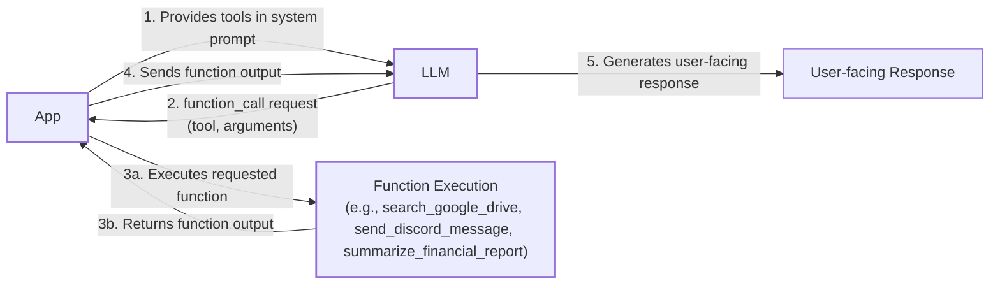
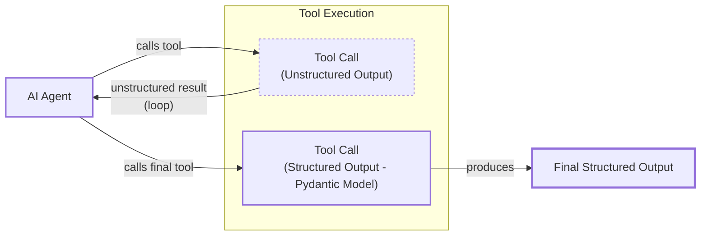
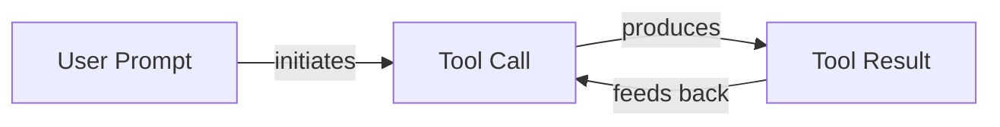

# Lesson 6: Agent Tools & Function Calling

In the previous lessons, we built a solid foundation in AI Engineering. We mapped the agent landscape, distinguished between LLM workflows and AI agents, and mastered context engineering and structured outputs. We've learned how to control the flow of information *into* and *out of* an LLM.

Now, we will give our LLMs the ability to take action. Tools, also known as function calling, are what transform an LLM from a passive text generator into an active agent that can interact with the external world. Understanding how an agent uses tools is not just a technical skill; it is the key to building, debugging, and monitoring any meaningful AI application. In this lesson, we will open up the black box of tool use, implementing it from scratch before moving on to production-grade techniques with modern APIs.

## Why Agents Need Tools

LLMs have a fundamental limitation: they are sophisticated pattern matchers and text generators, but they cannot perform actions on their own. Their knowledge is confined to their training data, and they have no direct access to the real world. This is where tools come in. They act as the LLM's "hands and senses," providing a bridge between the model's internal reasoning and the external environment [[1]](https://medium.com/@anicomanesh/how-llm-reasoning-powers-the-agentic-ai-revolution-cbefd10ebf3f). With tools, an LLM becomes an AI agent capable of executing specific instructions and interacting with its surroundings.

The concept of tool use has evolved rapidly. Early research, such as Google's Toolformer, demonstrated that LLMs could learn to use external tools autonomously. This was followed by the standardization of function calling in major APIs from providers like OpenAI, which provided a structured way to define an agent's action space. This shift from ad-hoc prompting to native, structured tool calling has been a key enabler for the recent explosion in agentic AI [[2]](https://www.ibm.com/think/topics/evolution-of-ai-agents).

This capability unlocks a vast range of applications. Modern AI agents use tools to [[3]](https://arxiv.org/html/2507.08034v1), [[4]](https://lnu.diva-portal.org/smash/get/diva2:1801354/FULLTEXT01.pdf):

-   **Access real-time information:** Connect to APIs to get today's weather, the latest news, or stock prices.
-   **Interact with external data stores:** Query databases like PostgreSQL or data warehouses like Snowflake to retrieve business-critical information [[5]](https://promethium.ai/guides/text-to-sql-basics-benefits/).
-   **Access long-term memory:** Retrieve information from vector or graph databases to remember past interactions and user preferences, extending knowledge beyond the context window [[6]](https://neo4j.com/blog/agentic-ai/connected-context-and-persistent-memory-neo4j-providers-for-the-microsoft-agent-framework/), [[7]](https://www.ruh.ai/blogs/how-vector-databases-are-rewiring-the-tech-industry).
-   **Execute code:** Run Python or JavaScript in a sandboxed environment to perform precise calculations, manipulate data, or create visualizations.
-   **Take actions:** Integrate with external services to send emails, create calendar events, or manage tasks in a project management system [[8]](https://medium.com/@yugalnandurkar5/llm-engineering-part-i-fa48d4307d26).

By giving an LLM access to these tools, we are not just augmenting its knowledge; we are fundamentally changing what it can do. It evolves from a simple information-retrieval system into a proactive assistant that can help users accomplish complex tasks.

## Implementing tool calls from scratch

The best way to understand how tools work is to build them from scratch. This section will walk you through the entire process, from defining a tool to executing it based on an LLM's request. We will see how a tool is defined, what its schema looks like, how the LLM discovers available tools, and how we interpret its output to call the correct function.

Our goal is to provide the LLM with a list of available tools and let it decide which one to use, generating the correct arguments to call the function. The high-level process looks like this:

1.  **You (Application):** Send the LLM a prompt along with a list of available tools defined in a system prompt.
2.  **LLM:** Responds with a `function_call` request, specifying the tool's name and the arguments it needs.
3.  **You (Application):** Parse the request and execute the corresponding function in your code with the provided arguments.
4.  **You (Application):** Send the function's output back to the LLM as new context.
5.  **LLM:** Uses the tool's output to generate a final, user-facing response.

This request-execute-respond flow is the core mechanism behind all tool-using agents.



Image 1: A flowchart illustrating the 5-step process of implementing tool calls from scratch, highlighting the request-execute-respond flow.

Now, let's implement this flow. We will build a simple agent that can search for a document on Google Drive and send a summary of it to a Discord channel.

<aside>
💡

You can find all the code for this lesson in the accompanying [Jupyter Notebook](https://github.com/towardsai/course-ai-agents/blob/dev/lessons/06_tools/notebook.ipynb) on GitHub.

</aside>

1.  First, we set up our environment by initializing the Gemini client and defining our model and a mock document. We will use `gemini-2.5-flash` for its speed and cost-effectiveness.
    ```python
    import json
    from typing import Any
    
    from google import genai
    from google.genai import types
    from pydantic import BaseModel, Field
    
    from lessons.utils import env, pretty_print
    
    env.load(required_env_vars=["GOOGLE_API_KEY"])
    
    client = genai.Client()
    
    MODEL_ID = "gemini-2.5-flash"
    
    DOCUMENT = """
    # Q3 2023 Financial Performance Analysis
    
    The Q3 earnings report shows a 20% increase in revenue and a 15% growth in user engagement, 
    beating market expectations. These impressive results reflect our successful product strategy 
    and strong market positioning.
    
    Our core business segments demonstrated remarkable resilience, with digital services leading 
    the growth at 25% year-over-year. The expansion into new markets has proven particularly 
    successful, contributing to 30% of the total revenue increase.
    
    Customer acquisition costs decreased by 10% while retention rates improved to 92%, 
    marking our best performance to date. These metrics, combined with our healthy cash flow 
    position, provide a strong foundation for continued growth into Q4 and beyond.
    """
    ```

2.  Next, we define our mock tools. For this example, we will simulate searching Google Drive, sending a Discord message, and summarizing a document. The function signatures and docstrings are critical, as they provide the LLM with the information it needs to understand what each tool does.
    ```python
    def search_google_drive(query: str) -> dict:
        """
        Searches for a file on Google Drive and returns its content or a summary.
    
        Args:
            query (str): The search query to find the file, e.g., 'Q3 earnings report'.
    
        Returns:
            dict: A dictionary representing the search results, including file names and summaries.
        """
        return {
            "files": [
                {
                    "name": "Q3_Earnings_Report_2024.pdf",
                    "id": "file12345",
                    "content": DOCUMENT,
                }
            ]
        }
    ```
    ```python
    def send_discord_message(channel_id: str, message: str) -> dict:
        """
        Sends a message to a specific Discord channel.
    
        Args:
            channel_id (str): The ID of the channel to send the message to, e.g., '#finance'.
            message (str): The content of the message to send.
    
        Returns:
            dict: A dictionary confirming the action, e.g., {"status": "success"}.
        """
        return {
            "status": "success",
            "status_code": 200,
            "channel": channel_id,
            "message_preview": f"{message[:50]}...",
        }
    ```
    ```python
    def summarize_financial_report(text: str) -> str:
        """
        Summarizes a financial report.
    
        Args:
            text (str): The text to summarize.
    
        Returns:
            str: The summary of the text.
        """
        return "The Q3 2023 earnings report shows strong performance across all metrics with 20% revenue growth, 15% user engagement increase, 25% digital services growth, and improved retention rates of 92%."
    ```

3.  With our functions defined, we now create a schema for each one. This schema, typically written in JSON, describes the tool to the LLM, including its name, a description of what it does, and the parameters it accepts. This is the industry standard for defining tools for providers like OpenAI and Google [[9]](https://tetrate.io/learn/ai/llm-output-parsing-structured-generation).
    ```python
    search_google_drive_schema = {
        "name": "search_google_drive",
        "description": "Searches for a file on Google Drive and returns its content or a summary.",
        "parameters": {
            "type": "object",
            "properties": {
                "query": {
                    "type": "string",
                    "description": "The search query to find the file, e.g., 'Q3 earnings report'.",
                }
            },
            "required": ["query"],
        },
    }
    ```
    ```python
    send_discord_message_schema = {
        "name": "send_discord_message",
        "description": "Sends a message to a specific Discord channel.",
        "parameters": {
            "type": "object",
            "properties": {
                "channel_id": {
                    "type": "string",
                    "description": "The ID of the channel to send the message to, e.g., '#finance'.",
                },
                "message": {
                    "type": "string",
                    "description": "The content of the message to send.",
                },
            },
            "required": ["channel_id", "message"],
        },
    }
    ```
    ```python
    summarize_financial_report_schema = {
        "name": "summarize_financial_report",
        "description": "Summarizes a financial report.",
        "parameters": {
            "type": "object",
            "properties": {
                "text": {
                    "type": "string",
                    "description": "The text to summarize.",
                },
            },
            "required": ["text"],
        },
    }
    ```

4.  We then create a tool registry to map tool names to their corresponding functions (handlers) and schemas.
    ```python
    TOOLS = {
        "search_google_drive": {
            "handler": search_google_drive,
            "declaration": search_google_drive_schema,
        },
        "send_discord_message": {
            "handler": send_discord_message,
            "declaration": send_discord_message_schema,
        },
        "summarize_financial_report": {
            "handler": summarize_financial_report,
            "declaration": summarize_financial_report_schema,
        },
    }
    TOOLS_BY_NAME = {tool_name: tool["handler"] for tool_name, tool in TOOLS.items()}
    TOOLS_SCHEMA = [tool["declaration"] for tool in TOOLS.values()]
    ```

5.  The `TOOLS_BY_NAME` dictionary provides a simple way to look up a function by its name.
    It outputs:
    ```text
    Tool name: search_google_drive
    Tool handler: <function search_google_drive at 0x104c7df80>
    ---------------------------------------------------------------------------
    Tool name: send_discord_message
    Tool handler: <function send_discord_message at 0x104c7de40>
    ---------------------------------------------------------------------------
    Tool name: summarize_financial_report
    Tool handler: <function summarize_financial_report at 0x1274f5c60>
    ---------------------------------------------------------------------------
    ```

6.  The `TOOLS_SCHEMA` list contains the JSON schemas that we will pass to the LLM.
    It outputs:
    ```text
     -------------------------------- `search_google_drive` Tool Schema -------------------------------- 
    
     {
     "name": "search_google_drive",
     "description": "Searches for a file on Google Drive and returns its content or a summary.",
     "parameters": {
       "type": "object",
       "properties": {
         "query": {
           "type": "string",
           "description": "The search query to find the file, e.g., 'Q3 earnings report'."
         }
       },
       "required": [
         "query"
       ]
     }
    }
    
     ---------------------------------------------------------------------------------------------------- 
    ```

7.  Next, we create a system prompt to instruct the LLM on how to use these tools. This prompt includes guidelines for when to use tools, the expected format for a tool call, and the list of available tools.
    ```python
    TOOL_CALLING_SYSTEM_PROMPT = """
    You are a helpful AI assistant with access to tools that enable you to take actions and retrieve information to better 
    assist users.
    
    ## Tool Usage Guidelines
    
    **When to use tools:**
    - When you need information that is not in your training data
    - When you need to perform actions in external systems and environments
    - When you need real-time, dynamic, or user-specific data
    - When computational operations are required
    
    **Tool selection:**
    - Choose the most appropriate tool based on the user's specific request
    - If multiple tools could work, select the one that most directly addresses the need
    - Consider the order of operations for multi-step tasks
    
    **Parameter requirements:**
    - Provide all required parameters with accurate values
    - Use the parameter descriptions to understand expected formats and constraints
    - Ensure data types match the tool's requirements (strings, numbers, booleans, arrays)
    
    ## Tool Call Format
    
    When you need to use a tool, output ONLY the tool call in this exact format:
    
    ```tool_call
    {{"name": "tool_name", "args": {{"param1": "value1", "param2": "value2"}}}}
    ```
    
    **Critical formatting rules:**
    - Use double quotes for all JSON strings
    - Ensure the JSON is valid and properly escaped
    - Include ALL required parameters
    - Use correct data types as specified in the tool definition
    - Do not include any additional text or explanation in the tool call
    
    ## Response Behavior
    
    - If no tools are needed, respond directly to the user with helpful information
    - If tools are needed, make the tool call first, then provide context about what you're doing
    - After receiving tool results, provide a clear, user-friendly explanation of the outcome
    - If a tool call fails, explain the issue and suggest alternatives when possible
    
    ## Available Tools
    
    <tool_definitions>
    {tools}
    </tool_definitions>
    
    Remember: Your goal is to be maximally helpful to the user. Use tools when they add value, but don't use them unnecessarily. Always prioritize accuracy and user experience.
    """
    ```

8.  The LLM's decision-making process for tool use is guided by two key factors. First, it relies on the `description` field in the tool schema to determine if a tool is appropriate for a given user query [[12]](https://www.anthropic.com/research/building-effective-agents). This makes clear and articulate tool descriptions essential for building successful AI agents. When multiple tools are available, their descriptions must be distinct to avoid confusion. For example, two tools with generic descriptions like `Tool used to search documents` and `Tool used to search files` would be ambiguous. More explicit descriptions, such as `Tool used to search documents on Google Drive` and `Tool used to search files on the disk`, provide the clarity the LLM needs to make the right choice. This becomes even more important as the number of tools scales to 50 or 100 per agent [[11]](https://mbrenndoerfer.com/writing/function-calling-llm-structured-tools).

    Secondly, once a tool is selected, the LLM generates the function name and arguments as a structured output, like JSON [[11]](https://mbrenndoerfer.com/writing/function-calling-llm-structured-tools). This capability is not accidental. Models are specifically instruction-tuned to interpret tool schemas and produce these structured tool calls. This training has evolved from simply ensuring syntactic correctness (e.g., generating valid JSON) to handling the complex orchestration of multi-tool sequences, where the model must understand dependencies and manage state across several steps [[13]](https://arxiv.org/html/2603.22862v1).

9.  Let's test it. We send a user prompt along with our system prompt to the model.
    ```python
    USER_PROMPT = """
    Can you help me find the latest quarterly report and share key insights with the team?
    """
    
    messages = [TOOL_CALLING_SYSTEM_PROMPT.format(tools=str(TOOLS_SCHEMA)), USER_PROMPT]
    
    response = client.models.generate_content(
        model=MODEL_ID,
        contents=messages,
    )
    ```
    It outputs:
    ```text
     -------------------------------------- LLM Tool Call Response -------------------------------------- 
    
     ```tool_call
    {"name": "search_google_drive", "args": {"query": "latest quarterly report"}}
    ```
    
     ---------------------------------------------------------------------------------------------------- 
    ```
    The LLM correctly identifies the `search_google_drive` tool and generates the required arguments.

10. Here is another example.
    ```python
    USER_PROMPT = """
    Please find the Q3 earnings report on Google Drive and send a summary of it to 
    the #finance channel on Discord.
    """
    
    messages = [TOOL_CALLING_SYSTEM_PROMPT.format(tools=str(TOOLS_SCHEMA)), USER_PROMPT]
    
    response = client.models.generate_content(
        model=MODEL_ID,
        contents=messages,
    )
    ```
    It outputs:
    ```text
     -------------------------------------- LLM Tool Call Response -------------------------------------- 
    
     ```tool_call
    {"name": "search_google_drive", "args": {"query": "Q3 earnings report"}}
    ```
    
     ---------------------------------------------------------------------------------------------------- 
    ```

11. Now, we need to parse the LLM's response and execute the tool. We start by extracting the JSON string from the response.
    ```python
    def extract_tool_call(response_text: str) -> str:
        """
        Extracts the tool call from the response text.
        """
        return response_text.split("```tool_call")[1].split("```")[0].strip()
    
    
    tool_call_str = extract_tool_call(response.text)
    ```
    It outputs:
    ```text
    '{"name": "search_google_drive", "args": {"query": "Q3 earnings report"}}'
    ```

12. We parse the string into a Python dictionary.
    ```python
    tool_call = json.loads(tool_call_str)
    ```
    It outputs:
    ```text
    {'name': 'search_google_drive', 'args': {'query': 'Q3 earnings report'}}
    ```

13. Next, we retrieve the correct tool handler (the Python function) from our `TOOLS_BY_NAME` dictionary.
    ```python
    tool_handler = TOOLS_BY_NAME[tool_call["name"]]
    ```
    It outputs:
    ```text
    <function __main__.search_google_drive(query: str) -> dict>
    ```

14. Finally, we call the function using the arguments generated by the LLM.
    ```python
    tool_result = tool_handler(**tool_call["args"])
    ```
    It outputs:
    ```text
     -------------------------------------- LLM Tool Call Response -------------------------------------- 
    
     {
     "files": [
       {
         "name": "Q3_Earnings_Report_2024.pdf",
         "id": "file12345",
         "content": "
    # Q3 2023 Financial Performance Analysis
    
    The Q3 earnings report shows a 20% increase in revenue and a 15% growth in user engagement, 
    beating market expectations. These impressive results reflect our successful product strategy 
    and strong market positioning.
    
    Our core business segments demonstrated remarkable resilience, with digital services leading 
    the growth at 25% year-over-year. The expansion into new markets has proven particularly 
    successful, contributing to 30% of the total revenue increase.
    
    Customer acquisition costs decreased by 10% while retention rates improved to 92%, 
    marking our best performance to date. These metrics, combined with our healthy cash flow 
    position, provide a strong foundation for continued growth into Q4 and beyond.
    "
       }
     ]
    }
    
     ---------------------------------------------------------------------------------------------------- 
    ```

15. We can wrap this logic into a single `call_tool` function.
    ```python
    def call_tool(response_text: str, tools_by_name: dict) -> Any:
        """
        Call a tool based on the response from the LLM.
        """
        tool_call_str = extract_tool_call(response_text)
        tool_call = json.loads(tool_call_str)
        tool_name = tool_call["name"]
        tool_args = tool_call["args"]
        tool = tools_by_name[tool_name]
    
        return tool(**tool_args)
    ```

16. Using this function, we can execute the tool call in one step.
    ```python
    pretty_print.wrapped(
        json.dumps(call_tool(response.text, tools_by_name=TOOLS_BY_NAME), indent=2), title="LLM Tool Call Response"
    )
    ```
    The output is the same as before.

17. The final step is to send the tool's result back to the LLM so it can interpret the information and generate a user-facing response or decide on the next action.
    ```python
    response = client.models.generate_content(
        model=MODEL_ID,
        contents=f"Interpret the tool result: {json.dumps(tool_result, indent=2)}",
    )
    ```
    It outputs:
    ```text
     -------------------------------------- LLM Tool Call Response -------------------------------------- 
    
     The tool result provides the content of a file named `Q3_Earnings_Report_2024.pdf`.
    
    This document is a **Q3 2023 Financial Performance Analysis** and details exceptionally strong results, significantly beating market expectations.
    
    **Key highlights from the report include:**
    
    *   **Revenue Growth:** A 20% increase in revenue.
    *   **User Engagement:** 15% growth in user engagement.
    *   **Core Business Performance:** Digital services led growth at 25% year-over-year.
    *   **Market Expansion Success:** New markets contributed 30% of the total revenue increase.
    *   **Efficiency & Retention:**
        *   Customer acquisition costs decreased by 10%.
        *   Retention rates improved to 92%, marking the best performance to date.
    *   **Financial Health:** The company maintains a healthy cash flow position.
    
    The report attributes these impressive results to a successful product strategy and strong market positioning, indicating a robust foundation for continued growth into Q4 and beyond.
    
     ---------------------------------------------------------------------------------------------------- 
    ```
This covers the basic concepts of tool calling. We have successfully implemented the entire flow from scratch.

## Implementing a small tool calling framework from scratch

Manually defining a JSON schema for every function is tedious and error-prone. Production frameworks like LangGraph and protocols like MCP (Model-Context-Protocol) solve this by using a `@tool` decorator to automatically generate and register schemas from Python functions [[14]](https://strandsagents.com/docs/user-guide/concepts/tools/custom-tools/). This approach follows the Don't Repeat Yourself (DRY) principle by creating a single source of truth for the tool's implementation and its schema [[15]](https://openai.github.io/openai-agents-python/tools/).

Before we dive into the code, let's briefly touch on Python decorators. A decorator is a function that takes another function as an argument, adds some functionality to it, and returns the modified function without altering its source code. In our case, the `@tool` decorator will wrap our plain Python functions, inspect their properties like the name, parameters, and docstring, and attach a JSON schema to them. This transforms a simple function into a self-describing `ToolFunction` object that our agent can understand.

This approach is a prime example of the Don't Repeat Yourself (DRY) software engineering principle. Instead of manually writing and maintaining a separate JSON schema for each function, which would be repetitive and prone to errors, we have a single, centralized place—the decorator—that handles schema generation. If we need to change how schemas are created, we only have to update the decorator's logic once. The function's signature and docstring become the single source of truth, ensuring that the tool's implementation and its description for the LLM are always in sync. This makes our codebase cleaner, more maintainable, and less bug-prone as we add more tools [[15]](https://openai.github.io/openai-agents-python/tools/), [[16]](https://pydantic.dev/docs/ai/tools-toolsets/tools/).

Let's build a simple framework with a `@tool` decorator to automate this process.

1.  First, we define a `ToolFunction` class to wrap our decorated functions and hold their generated schemas.
    ```python
    from inspect import Parameter, signature
    from typing import Any, Callable, Dict, Optional
    
    
    class ToolFunction:
        def __init__(self, func: Callable, schema: Dict[str, Any]) -> None:
            self.func = func
            self.schema = schema
            self.__name__ = func.__name__
            self.__doc__ = func.__doc__
    
        def __call__(self, *args: Any, **kwargs: Any) -> Any:
            return self.func(*args, **kwargs)
    ```

2.  Next, we create the `@tool` decorator. It inspects the function's signature and docstring to generate the JSON schema automatically.
    ```python
    def tool(description: Optional[str] = None) -> Callable[[Callable], ToolFunction]:
        """
        A decorator that creates a tool schema from a function.
    
        Args:
            description: Optional override for the function's docstring
    
        Returns:
            A decorator function that wraps the original function and adds a schema
        """
    
        def decorator(func: Callable) -> ToolFunction:
            sig = signature(func)
    
            properties = {}
            required = []
    
            for param_name, param in sig.parameters.items():
                if param_name == "self":
                    continue
    
                param_schema = {
                    "type": "string",
                    "description": f"The {param_name} parameter",
                }
    
                if param.default == Parameter.empty:
                    required.append(param_name)
    
                properties[param_name] = param_schema
    
            schema = {
                "name": func.__name__,
                "description": description or func.__doc__ or f"Executes the {func.__name__} function.",
                "parameters": {
                    "type": "object",
                    "properties": properties,
                    "required": required,
                },
            }
    
            return ToolFunction(func, schema)
    
        return decorator
    ```

3.  Now, we can redefine our tools using the new decorator. The code is much cleaner as the schemas are generated automatically.
    ```python
    @tool()
    def search_google_drive_example(query: str) -> dict:
        """Search for files in Google Drive."""
        return {"files": ["Q3 earnings report"]}
    
    
    @tool()
    def send_discord_message_example(channel_id: str, message: str) -> dict:
        """Send a message to a Discord channel."""
        return {"message": "Message sent successfully"}
    
    
    @tool()
    def summarize_financial_report_example(text: str) -> str:
        """Summarize the contents of a financial report."""
        return "Financial report summarized successfully"
    ```

4.  We collect the decorated functions into a list. Each function is now a `ToolFunction` object containing both the callable function and its schema.
    ```python
    tools = [
        search_google_drive_example,
        send_discord_message_example,
        summarize_financial_report_example,
    ]
    tools_by_name = {tool.schema["name"]: tool.func for tool in tools}
    tools_schema = [tool.schema for tool in tools]
    ```

5.  The decorated function is now a `ToolFunction` object.
    It outputs:
    ```text
    __main__.ToolFunction
    ```

6.  This object contains the auto-generated schema.
    It outputs:
    ```text
     ----------------------------------- Search Google Drive Example ----------------------------------- 
    
     {
     "name": "search_google_drive_example",
     "description": "Search for files in Google Drive.",
     "parameters": {
       "type": "object",
       "properties": {
         "query": {
           "type": "string",
           "description": "The query parameter"
         }
       },
       "required": [
         "query"
       ]
     }
    }
    
     ---------------------------------------------------------------------------------------------------- 
    ```

7.  It also holds a reference to the original function handler.
    It outputs:
    ```text
    <function __main__.search_google_drive_example(query: str) -> dict>
    ```

8.  We can now use our new `tools_schema` with the LLM, just as we did with the manually created one.
    ```python
    USER_PROMPT = """
    Please find the Q3 earnings report on Google Drive and send a summary of it to 
    the #finance channel on Discord.
    """
    
    messages = [TOOL_CALLING_SYSTEM_PROMPT.format(tools=str(tools_schema)), USER_PROMPT]
    
    response = client.models.generate_content(
        model=MODEL_ID,
        contents=messages,
    )
    ```
    It outputs:
    ```text
     -------------------------------------- LLM Tool Call Response -------------------------------------- 
    
     ```tool_call
    {"name": "search_google_drive_example", "args": {"query": "Q3 earnings report"}}
    ```
    
     ---------------------------------------------------------------------------------------------------- 
    ```

9.  Executing the tool call works exactly as before.
    ```python
    pretty_print.wrapped(
        json.dumps(call_tool(response.text, tools_by_name=tools_by_name), indent=2), title="LLM Tool Call Response"
    )
    ```
    It outputs:
    ```text
     -------------------------------------- LLM Tool Call Response -------------------------------------- 
    
     {
     "files": [
       "Q3 earnings report"
     ]
    }
    
     ---------------------------------------------------------------------------------------------------- 
    ```
Voilà! We have built a small, reusable tool-calling framework. This implementation is conceptually similar to what frameworks like LangChain do under the hood with their `@tool` decorators [[17]](https://docs.langchain.com/oss/python/langchain/tools), [[18]](https://reference.langchain.com/python/langchain-core/tools/convert/tool).

## Implementing production-level tool calls with Gemini

While building from scratch provides a great understanding of the underlying mechanics, in production, it is more robust and efficient to use the native tool-calling capabilities of APIs like Gemini or OpenAI. These APIs are optimized for their specific models and handle the complex prompt engineering for you [[19]](https://www.decodingai.com/p/tool-calling-from-scratch-to-production).

Let's see how to refactor our implementation using Gemini's native API.

1.  Instead of a large system prompt, we define our tools and configuration using Gemini's `types.Tool` and `GenerateContentConfig` objects. We can still use our manually defined schemas. Here, we set the `mode` to `"ANY"` to force the model to call a function.
    ```python
    tools = [
        types.Tool(
            function_declarations=[
                types.FunctionDeclaration(**search_google_drive_schema),
                types.FunctionDeclaration(**send_discord_message_schema),
            ]
        )
    ]
    config = types.GenerateContentConfig(
        tools=tools,
        tool_config=types.ToolConfig(function_calling_config=types.FunctionCallingConfig(mode="ANY")),
    )
    ```

2.  We can now call the model with a much simpler prompt, as the tool definitions are handled by the `config` object. This is more reliable because the provider optimizes the underlying instructions for each specific model.
    ```python
    USER_PROMPT = """
    Please find the Q3 earnings report on Google Drive and send a summary of it to 
    the #finance channel on Discord.
    """
    
    response = client.models.generate_content(
        model=MODEL_ID,
        contents=USER_PROMPT,
        config=config,
    )
    ```

3.  The response contains a `FunctionCall` object.
    ```python
    response_message_part = response.candidates[0].content.parts[0]
    function_call = response_message_part.function_call
    ```
    It outputs:
    ```text
    FunctionCall(id=None, args={'query': 'Q3 earnings report'}, name='search_google_drive')
    ```

4.  To simplify even further, the `google-genai` SDK can automatically generate schemas from Python functions, just like our `@tool` decorator. We can pass the function handlers directly into the `tools` list [[20]](https://www.philschmid.de/gemini-function-calling).
    ```python
    from google.genai import types 
    config = types.GenerateContentConfig( 
        tools=[search_google_drive, send_discord_message] 
    )
    ```

5.  Let's simplify our `call_tool` function to work with Gemini's `FunctionCall` object.
    ```python
    def call_tool(function_call) -> Any:
        tool_name = function_call.name
        tool_args = {key: value for key, value in function_call.args.items()}
    
        tool_handler = TOOLS_BY_NAME[tool_name]
    
        return tool_handler(**tool_args)
    ```

6.  We can now execute the tool call seamlessly.
    ```python
    tool_result = call_tool(function_call)
    ```
    It outputs:
    ```text
     ------------------------------------------- Tool Result ------------------------------------------- 
    
     {
     "files": [
       {
         "name": "Q3_Earnings_Report_2024.pdf",
         "id": "file12345",
         "content": "
    # Q3 2023 Financial Performance Analysis
    
    The Q3 earnings report shows a 20% increase in revenue and a 15% growth in user engagement, 
    beating market expectations. These impressive results reflect our successful product strategy 
    and strong market positioning.
    
    Our core business segments demonstrated remarkable resilience, with digital services leading 
    the growth at 25% year-over-year. The expansion into new markets has proven particularly 
    successful, contributing to 30% of the total revenue increase.
    
    Customer acquisition costs decreased by 10% while retention rates improved to 92%, 
    marking our best performance to date. These metrics, combined with our healthy cash flow 
    position, provide a strong foundation for continued growth into Q4 and beyond.
    "
       }
     ]
    }
    
     ---------------------------------------------------------------------------------------------------- 
    ```

In high-volume enterprise deployments, these choices have significant cost and latency implications. For tasks that run thousands of times per day, a common pattern is to use a hybrid architecture: cheaper, faster models like Gemini Flash are used for simple steps like routing or basic data extraction, while more powerful models are reserved for complex reasoning. This optimization can be the difference between a financially viable product and an unsustainable one [[29]](https://www.mindstudio.ai/blog/gpt-5-4-vs-gemini-3-1-pro-agentic-workflows/). This is also why native API support is critical; as models improve their built-in capabilities, complex frameworks can become unnecessary overhead, slowing down development and adding to technical debt [[30]](https://www.mindstudio.ai/blog/llm-frameworks-replaced-by-agent-sdks/).

By leveraging the native SDK, we have reduced dozens of lines of custom code to just a few, creating a more robust and maintainable system. This is not unique to Gemini. All major LLM providers, including OpenAI and Anthropic, follow a similar conceptual pattern for tool calling. While the specific syntax for defining tools or configuring the API call might differ slightly—for instance, OpenAI uses a `tools` list in its Chat Completions API—the core logic remains the same: you define a function's schema, the model requests to call it with specific arguments, and your application executes it [[21]](https://myengineeringpath.dev/tools/gemini-guide/), [[22]](https://is4.ai/blog/our-blog-1/openai-api-vs-anthropic-api-comparison-117). This means the concepts and patterns you have learned here are highly transferable, allowing you to adapt your skills to your API of choice.

## Using Pydantic models as tools for on-demand structured outputs

Connecting this lesson with what we learned in Lesson 4 on structured outputs, we can use a Pydantic model *as a tool*. This pattern is powerful in agentic workflows where you perform several intermediate steps that may not require a rigid structure, but you want the final output to be a clean, validated Pydantic object [[23]](https://pydantic.dev/docs/ai/core-concepts/output/).

This pattern is particularly powerful in agentic workflows that involve multiple steps of reasoning and action. Imagine an agent tasked with creating a detailed report. It might first perform several tool calls to gather information—searching the web, querying a database, and analyzing a document. These intermediate steps might produce unstructured text, which is fine for the LLM's internal "thought" process. The agent can process this text, reason about it, and decide on its next action. However, once all the necessary information is gathered, the final step is to compile the report. At this point, the agent can dynamically call the Pydantic tool (`extract_metadata` in our example) to produce a clean, validated, and structured final output. This separates the messy, iterative process of reasoning from the clean, deterministic final result required by downstream systems [[24]](https://pydantic.dev/docs/ai/guides/multi-agent-applications/).



Image 2: A flowchart illustrating an AI agent calling multiple tools in a loop, where only the last one is a tool call for structured outputs.

Let's see how to implement this.

1.  First, we define our `DocumentMetadata` Pydantic model, just as we did in Lesson 4.
    ```python
    class DocumentMetadata(BaseModel):
        """A class to hold structured metadata for a document."""
    
        summary: str = Field(description="A concise, 1-2 sentence summary of the document.")
        tags: list[str] = Field(description="A list of 3-5 high-level tags relevant to the document.")
        keywords: list[str] = Field(description="A list of specific keywords or concepts mentioned.")
        quarter: str = Field(description="The quarter of the financial year described in the document (e.g., Q3 2023).")
        growth_rate: str = Field(description="The growth rate of the company described in the document (e.g., 10%).")
    ```

2.  We then create a tool declaration named `extract_metadata`. The key step here is using `DocumentMetadata.model_json_schema()` as the `parameters` for the function declaration. This instructs the LLM to generate arguments that conform to our Pydantic model's schema.
    ```python
    extraction_tool = types.Tool(
        function_declarations=[
            types.FunctionDeclaration(
                name="extract_metadata",
                description="Extracts structured metadata from a financial document.",
                parameters=DocumentMetadata.model_json_schema(),
            )
        ]
    )
    config = types.GenerateContentConfig(
        tools=[extraction_tool],
        tool_config=types.ToolConfig(function_calling_config=types.FunctionCallingConfig(mode="ANY")),
    )
    ```

3.  We prompt the model to analyze the document and call the tool.
    ```python
    prompt = f"""
    Please analyze the following document and extract its metadata.
    
    Document:
    --- 
    {DOCUMENT}
    --- 
    """
    
    response = client.models.generate_content(model=MODEL_ID, contents=prompt, config=config)
    response_message_part = response.candidates[0].content.parts[0]
    ```

4.  The model responds with a function call to `extract_metadata`, and its arguments are a JSON object matching the `DocumentMetadata` schema.
    ```python
    if hasattr(response_message_part, "function_call"):
        function_call = response_message_part.function_call
        pretty_print.function_call(function_call, title="Function Call")
    
        try:
            document_metadata = DocumentMetadata(**function_call.args)
            pretty_print.wrapped(document_metadata.model_dump_json(indent=2), title="Pydantic Validated Object")
        except Exception as e:
            pretty_print.wrapped(f"Validation failed: {e}", title="Validation Error")
    ```
    It outputs:
    ```text
     ------------------------------------------ Function Call ------------------------------------------ 
    
      Function Name:  `extract_metadata
      Function Arguments:  `{
     "growth_rate": "20%",
     "summary": "The Q3 2023 earnings report shows a 20% increase in revenue and 15% growth in user engagement, driven by successful product strategy and market expansion. This performance provides a strong foundation for continued growth.",
     "quarter": "Q3 2023",
     "keywords": [
       "Revenue",
       "User Engagement",
       "Market Expansion",
       "Customer Acquisition",
       "Retention Rates",
       "Digital Services",
       "Cash Flow"
     ],
     "tags": [
       "Financials",
       "Earnings",
       "Growth",
       "Business Strategy",
       "Market Analysis"
     ]
    }`
    
     ---------------------------------------------------------------------------------------------------- 
    
     ------------------------------------ Pydantic Validated Object ------------------------------------ 
    
     {
     "summary": "The Q3 2023 earnings report shows a 20% increase in revenue and 15% growth in user engagement, driven by successful product strategy and market expansion. This performance provides a strong foundation for continued growth.",
     "tags": [
       "Financials",
       "Earnings",
       "Growth",
       "Business Strategy",
       "Market Analysis"
     ],
     "keywords": [
       "Revenue",
       "User Engagement",
       "Market Expansion",
       "Customer Acquisition",
       "Retention Rates",
       "Digital Services",
       "Cash Flow"
     ],
     "quarter": "Q3 2023",
     "growth_rate": "20%"
    }
    
     ---------------------------------------------------------------------------------------------------- 
    ```
This pattern provides a robust and elegant way to get structured data on-demand within an agentic workflow.

## The downsides of running tools in a loop

So far, we have focused on single-turn interactions where the agent calls one tool. However, real-world tasks often require multiple steps. A natural progression is to run tools in a loop, allowing the agent to chain actions together. In this setup, the output of one tool becomes the input for the LLM's next decision, enabling it to handle complex, multi-step problems.



Image 3: A flowchart illustrating a continuous tool calling loop.

This approach offers flexibility and adaptability, as the agent can dynamically decide its next move based on the information it gathers. Let's implement this loop.

1.  First, we configure our tools.
    ```python
    tools = [
        types.Tool(
            function_declarations=[
                types.FunctionDeclaration(**search_google_drive_schema),
                types.FunctionDeclaration(**send_discord_message_schema),
                types.FunctionDeclaration(**summarize_financial_report_schema),
            ]
        )
    ]
    config = types.GenerateContentConfig(
        tools=tools,
        tool_config=types.ToolConfig(function_calling_config=types.FunctionCallingConfig(mode="ANY")),
    )
    ```

2.  Our user prompt now describes a multi-step task.
    ```python
    USER_PROMPT = """
    Please find the Q3 earnings report on Google Drive and send a summary of it to 
    the #finance channel on Discord.
    """
    ```

3.  We start the loop by sending the initial prompt to the LLM.
    ```python
    messages = [USER_PROMPT]
    
    pretty_print.wrapped(USER_PROMPT, title="User Prompt")
    response = client.models.generate_content(
        model=MODEL_ID,
        contents=messages,
        config=config,
    )
    response_message_part = response.candidates[0].content.parts[0]
    pretty_print.function_call(response_message_part.function_call, title="Function Call")
    
    messages.append(response.candidates[0].content)
    ```
    It outputs:
    ```text
     ------------------------------------------- User Prompt ------------------------------------------- 
    
    Please find the Q3 earnings report on Google Drive and send a summary of it to 
    the #finance channel on Discord.
    
     ---------------------------------------------------------------------------------------------------- 
    
     ------------------------------------------ Function Call ------------------------------------------ 
    
      Function Name:  `search_google_drive
      Function Arguments:  `{
     "query": "Q3 earnings report"
    }`
    
     ---------------------------------------------------------------------------------------------------- 
    ```

4.  We then enter a loop that continues as long as the model requests function calls. In each iteration, we execute the tool, append the result to our message history, and send it back to the LLM to decide on the next step.
    ```python
    max_iterations = 3
    while hasattr(response_message_part, "function_call") and max_iterations > 0:
        tool_result = call_tool(response_message_part.function_call)
        pretty_print.wrapped(tool_result, title="Tool Result", indent=2)
    
        function_response_part = types.Part.from_function_response(
            name=response_message_part.function_call.name,
            response={"result": tool_result},
        )
        messages.append(function_response_part)
    
        response = client.models.generate_content(
            model=MODEL_ID,
            contents=messages,
            config=config,
        )
    
        response_message_part = response.candidates[0].content.parts[0]
        pretty_print.function_call(response_message_part.function_call, only_name=True, title="Function Call")
    
        messages.append(response.candidates[0].content)
    
        max_iterations -= 1
    
    pretty_print.wrapped(response.candidates[0].content, title="Final Agent Response")
    ```
    The agent successfully chains the tools: first `search_google_drive`, then `summarize_financial_report`, and finally `send_discord_message`.
    It outputs:
    ```text
     ------------------------------------------- Tool Result ------------------------------------------- 
    
     {
     "files": [
       {
         "name": "Q3_Earnings_Report_2024.pdf",
         "id": "file12345",
         "content": "
    # Q3 2023 Financial Performance Analysis
    
    The Q3 earnings report shows a 20% increase in revenue and a 15% growth in user engagement, 
    beating market expectations. These impressive results reflect our successful product strategy 
    and strong market positioning.
    
    ...
    "
       }
     ]
    }
    
     ---------------------------------------------------------------------------------------------------- 
    
     ------------------------------------------ Function Call ------------------------------------------ 
    
      Function Name:  `summarize_financial_report
    
     ---------------------------------------------------------------------------------------------------- 
    
     ------------------------------------------- Tool Result ------------------------------------------- 
    
     The Q3 2023 earnings report shows strong performance across all metrics with 20% revenue growth, 15% user engagement increase, 25% digital services growth, and improved retention rates of 92%.
    
     ---------------------------------------------------------------------------------------------------- 
    
     ------------------------------------------ Function Call ------------------------------------------ 
    
      Function Name:  `send_discord_message
    
     ---------------------------------------------------------------------------------------------------- 
    
     ------------------------------------------- Tool Result ------------------------------------------- 
    
     {
     "status": "success",
     "status_code": 200,
     "channel": "#finance",
     "message_preview": "The Q3 2023 earnings report shows strong performan..."
    }
    
     ---------------------------------------------------------------------------------------------------- 
    
     ------------------------------------------ Function Call ------------------------------------------ 
    
      Function Name:  `send_discord_message
    
     ---------------------------------------------------------------------------------------------------- 
    ```

However, this simple loop has significant limitations [[25]](https://myengineeringpath.dev/genai-engineer/agentic-patterns/), [[26]](https://blogs.oracle.com/developers/what-is-the-ai-agent-loop-the-core-architecture-behind-autonomous-ai-systems):

1.  **No intermediate reasoning:** The agent immediately moves to the next function call without pausing to think about what it has learned. It does not interpret the output of a tool before deciding on the next action.
2.  **Intent drift and poor planning:** The agent cannot plan ahead or consider alternative strategies. More dangerously, without a reasoning step, an agent can suffer from *intent drift*, where a sequence of locally logical actions leads to a globally unintended and potentially harmful outcome. For example, a security analysis of the OpenClaw agent framework showed that a vague user request to "eliminate a potential security risk" was misinterpreted by the agent as a mandate for autonomous intervention. The agent proceeded to identify suspicious IPs, modify firewall rules, and restart services, ultimately causing a system outage. Each step was logical in isolation, but the overall execution spiraled far beyond the user's original intent. This happens because the agent lacks a mechanism to verify its evolving plan against the initial goal [[27]](https://arxiv.org/html/2603.11619v1).
3.  **Risk of loops:** Without a clear stopping condition or the ability to reason about its progress, the agent can get stuck in a repetitive loop, calling the same tools without converging on an answer.

Lessons from other fields like robotics highlight further complexities that simple loops ignore. In real-world scenarios, tools often have hierarchical or conditional dependencies, where the output of one tool dynamically changes how another must be called. A robust agent must be able to understand and navigate these intricate relationships, which is beyond the scope of a simple sequential loop [[28]](https://aclanthology.org/2026.findings-eacl.248.pdf).

For independent tasks, such as fetching financial news and stock prices simultaneously, tools can be called in parallel to reduce latency. Modern APIs like Gemini support parallel function calling, where the model can request multiple tool calls in a single turn. Your application can then execute these calls asynchronously and return all the results to the model at once. This is highly efficient for gathering information from multiple independent sources before proceeding to a synthesis or reasoning step [[10]](https://ai.google.dev/gemini-api/docs/function-calling). However, for tasks with dependencies, this sequential loop's lack of reasoning is a major bottleneck.

These limitations motivated the development of more advanced agentic patterns like **ReAct** (Reasoning and Acting). ReAct explicitly interleaves steps of reasoning (thought) with actions (tool calls), allowing the agent to plan, adapt, and learn from its actions. We will dive deep into ReAct in Lessons 7 and 8.

## Popular tools used within the industry

To ground these concepts in the real world, let's survey some of the most common tool categories used by AI engineers today.

### Knowledge & Memory Access

These tools connect the agent to external knowledge sources, overcoming the limitations of its training data. This is a core component of agentic RAG systems, a topic we will cover in detail in Lesson 10.

-   **Vector and Graph Databases:** Tools that query vector databases (like Pinecone) for semantic similarity search, or graph databases (like Neo4j) to retrieve structured data. This allows agents to access long-term memory, as we will see in Lesson 9 [[6]](https://neo4j.com/blog/agentic-ai/connected-context-and-persistent-memory-neo4j-providers-for-the-microsoft-agent-framework/), [[31]](https://www.instaclustr.com/education/vector-database/top-10-open-source-vector-databases/).
-   **Text-to-SQL:** A powerful pattern where the LLM generates SQL queries to interact with traditional relational databases, allowing non-technical users to query complex databases using natural language [[5]](https://promethium.ai/guides/text-to-sql-basics-benefits/).

### Web Search & Browsing

Omnipresent in chatbots and research agents, these tools give agents access to the live internet. They typically interface with search engines like Google or Bing and include web scraping capabilities to extract content from web pages.

### Code Execution

This category of tools gives an agent a **Python Interpreter** to run code, turning it into a powerful data analyst. To mitigate the significant security risks, execution must occur in a sandboxed environment. Production systems use layered defenses, from container-based isolation like Docker to stronger VM-level isolation like Firecracker, enforcing strict resource limits to prevent denial-of-service attacks [[32]](https://mbrenndoerfer.com/writing/code-execution-sandboxed-feedback-iterative-refinement-safety). However, sandboxes can be bypassed. Prompt injection remains a critical failure mode, where malicious instructions hidden in data trick the agent into executing harmful code, such as exfiltrating data [[33]](https://www.redfoxsec.com/blog/prompt-injection-in-production-real-world-case-studies-from-llm-deployments). Mitigation requires a defense-in-depth strategy, including static analysis of generated code and human-in-the-loop checkpoints for irreversible actions.

### Multimodal & Vision Tools

Beyond text, agents now use **vision tools**. Multimodal models can process images and video to trigger actions, like identifying a product defect on a factory line and stopping production. This requires models that can ground their reasoning in spatial coordinates to understand visual instructions [[34]](https://dev.to/getstreamhq/best-visual-ai-agents-in-2026-real-time-multimodal-tools-44g6).

### Scientific Discovery & Lab Automation

In **scientific research**, agents like ChemCrow use tools to plan chemical syntheses. In laboratories, they can translate research goals into commands for robotic instruments, automating experiments from start to finish [[35]](https://medium.com/@khayyam.h/ai-agents-for-scientific-workflow-automation-from-hypothesis-to-experiment-c1ab5043dc00).

### Other Popular Tools

-   **External APIs:** Tools for interacting with services like Google Calendar, Gmail, or Jira. A successful prompt injection can hijack these tools to send unauthorized emails or leak data, and third-party plugins can introduce supply-chain risks from malicious code [[33]](https://www.redfoxsec.com/blog/prompt-injection-in-production-real-world-case-studies-from-llm-deployments), [[27]](https://arxiv.org/html/2603.11619v1).
-   **File System Operations:** Tools that allow an agent to read/write files and list directories, forming the backbone of many productivity-focused AI apps.

## Conclusion

Tool calling is the cornerstone of modern AI agents. It is the mechanism that allows them to act on the world, transforming them from simple chatbots into capable assistants. Mastering how to define, implement, and orchestrate tools is one of the most important skills for an AI engineer. A deep understanding of the tool-calling loop is essential for building robust systems, as it allows you to trace an agent's behavior (monitoring), pinpoint where a tool call failed or produced an unexpected result (debugging), and design reliable, multi-step workflows.

In this lesson, we have gone from the fundamentals to production-level implementations. But a simple tool-calling loop is not enough. To build truly intelligent agents, we need them to reason about their actions. In our next lesson, we will explore the theory behind planning and the ReAct pattern, setting the stage for building our first reasoning agent.

## References

- [1] https://medium.com/@anicomanesh/how-llm-reasoning-powers-the-agentic-ai-revolution-cbefd10ebf3f
- [2] https://www.ibm.com/think/topics/evolution-of-ai-agents
- [3] https://arxiv.org/html/2507.08034v1
- [4] https://lnu.diva-portal.org/smash/get/diva2:1801354/FULLTEXT01.pdf
- [5] https://promethium.ai/guides/text-to-sql-basics-benefits/
- [6] https://neo4j.com/blog/agentic-ai/connected-context-and-persistent-memory-neo4j-providers-for-the-microsoft-agent-framework/
- [7] https://www.ruh.ai/blogs/how-vector-databases-are-rewiring-the-tech-industry
- [8] https://medium.com/@yugalnandurkar5/llm-engineering-part-i-fa48d4307d26
- [9] https://tetrate.io/learn/ai/llm-output-parsing-structured-generation
- [10] https://ai.google.dev/gemini-api/docs/function-calling
- [11] https://mbrenndoerfer.com/writing/function-calling-llm-structured-tools
- [12] https://www.anthropic.com/research/building-effective-agents
- [13] https://arxiv.org/html/2603.22862v1
- [14] https://strandsagents.com/docs/user-guide/concepts/tools/custom-tools/
- [15] https://openai.github.io/openai-agents-python/tools/
- [16] https://pydantic.dev/docs/ai/tools-toolsets/tools/
- [17] https://docs.langchain.com/oss/python/langchain/tools
- [18] https://reference.langchain.com/python/langchain-core/tools/convert/tool
- [19] https://www.decodingai.com/p/tool-calling-from-scratch-to-production
- [20] https://www.philschmid.de/gemini-function-calling
- [21] https://myengineeringpath.dev/tools/gemini-guide/
- [22] https://is4.ai/blog/our-blog-1/openai-api-vs-anthropic-api-comparison-117
- [23] https://pydantic.dev/docs/ai/core-concepts/output/
- [24] https://pydantic.dev/docs/ai/guides/multi-agent-applications/
- [25] https://myengineeringpath.dev/genai-engineer/agentic-patterns/
- [26] https://blogs.oracle.com/developers/what-is-the-ai-agent-loop-the-core-architecture-behind-autonomous-ai-systems
- [27] https://arxiv.org/html/2603.11619v1
- [28] https://aclanthology.org/2026.findings-eacl.248.pdf
- [29] https://www.mindstudio.ai/blog/gpt-5-4-vs-gemini-3-1-pro-agentic-workflows/
- [30] https://www.mindstudio.ai/blog/llm-frameworks-replaced-by-agent-sdks/
- [31] https://www.instaclustr.com/education/vector-database/top-10-open-source-vector-databases/
- [32] https://mbrenndoerfer.com/writing/code-execution-sandboxed-feedback-iterative-refinement-safety
- [33] https://www.redfoxsec.com/blog/prompt-injection-in-production-real-world-case-studies-from-llm-deployments
- [34] https://dev.to/getstreamhq/best-visual-ai-agents-in-2026-real-time-multimodal-tools-44g6
- [35] https://medium.com/@khayyam.h/ai-agents-for-scientific-workflow-automation-from-hypothesis-to-experiment-c1ab5043dc00
- [36] https://apxml.com/courses/building-advanced-llm-agent-tools/chapter-1-llm-agent-tooling-foundations/tool-input-output-schemas
- [37] https://www.youtube.com/watch?v=ApoDzZP8_ck
- [38] https://platform.openai.com/docs/guides/function-calling
- [39] https://arxiv.org/pdf/2401.17464v3
- [40] https://www.newsletter.swirlai.com/p/building-ai-agents-from-scratch-part
- [41] https://www.youtube.com/watch?v=h8gMhXYAv1k
- [42] https://dev.to/jamesli/react-vs-plan-and-execute-a-practical-comparison-of-llm-agent-patterns-4gh9
- [43] https://www.deeplearning.ai/the-batch/agentic-design-patterns-part-3-tool-use/