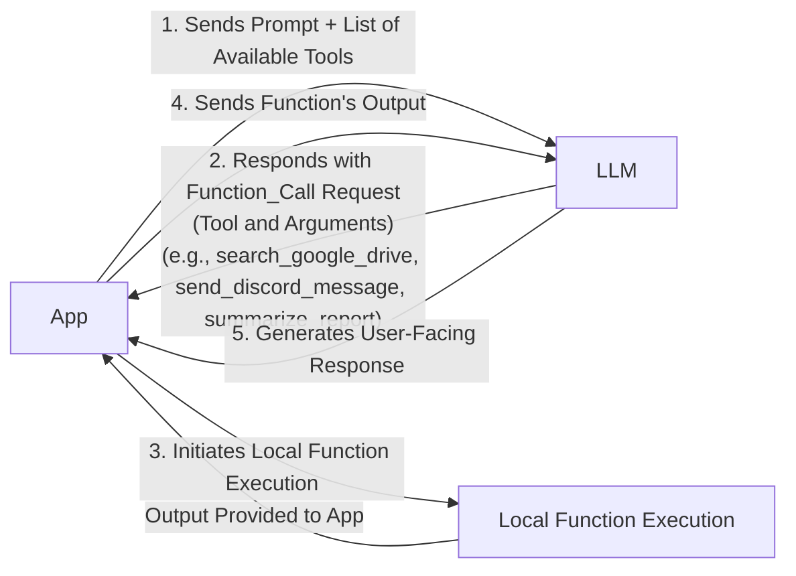
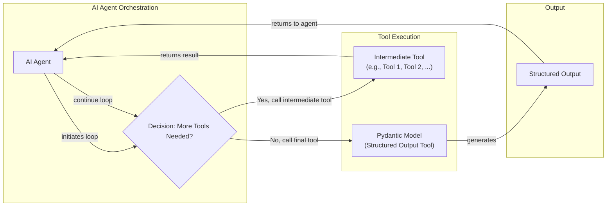
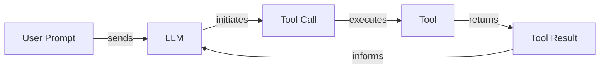

# Lesson 6: Agent Tools & Function Calling

In the previous lessons, we built a solid foundation in AI Engineering. We started by mapping the agent landscape, distinguished between structured LLM workflows and autonomous agents, and explored the critical arts of context engineering and structured outputs. These components are the building blocks for creating intelligent systems that can process and understand information. Now, we will add the most critical piece: action.

This lesson is about tools, also known as function calling. Tools are what transform an LLM from a passive text generator into an active agent capable of interacting with the external world. For an AI Engineer, understanding how to equip an agent with the right tools, and how the agent decides to use them, is a foundational skill. It is the key to moving beyond simple prototypes and building AI that can perform meaningful tasks. We will open the black box of tool use, starting from scratch to see how it works under the hood before moving to production-ready implementations.

## Understanding Why Agents Need Tools

LLMs have a fundamental limitation: they are sophisticated pattern matchers and text generators. They are trained on vast datasets and store knowledge within their weights, but they cannot perform actions or access real-time information on their own. They are, in essence, brains in a jar. Without tools, LLMs are master interpolators, but to act in novel situations or create new knowledge, they need tools for exact calculations and interaction. These capabilities allow them to move beyond understanding to invention [[1]](https://thegradient.pub/grounding-large-language-models-in-a-cognitive-foundation/). Tools provide the mechanism to bridge this gap.

The LLM is the brain, while tools are its "hands and senses," allowing it to perceive and act in the world beyond its textual interface. By giving an LLM access to tools, we transform it into an AI agent that can interact with its environment to execute specific instructions [[2]](https://www.youtube.com/watch?v=h8gMhXYAv1k). This integration of external capabilities is what elevates an LLM from a simple information processor to a dynamic problem-solver that can engage with real-world systems.

This capability unlocks a wide range of applications. Modern AI agents use tools to:
-   Access real-time information through APIs, like checking today's weather or fetching the latest news [[3]](https://arxiv.org/html/2507.08034v1).
-   Interact with external databases or data warehouses, such as querying a PostgreSQL database or a Snowflake data warehouse.
-   Access the agent's long-term memory to retrieve information beyond the immediate context window.
-   Execute code (Python, JavaScript) to perform precise calculations that go beyond their training data, such as basic math, sorting, filtering, or grouping data [[4]](https://www.deeplearning.ai/the-batch/agentic-design-patterns-part-3-tool-use/).

By integrating these external capabilities, agents overcome the static nature of their training data. They are no longer limited to the knowledge they were trained on but can actively seek out current information, perform computations, and take actions, making them far more powerful and useful in practical applications.

## Implementing Tool Calls from Scratch

The best way to understand how tools work is to build the mechanism from scratch. Our goal is to provide an LLM with a list of available tools and let it decide which one to use, generating the correct arguments to call the function. We will learn how a tool is defined, how its schema is structured, how the LLM discovers available tools, and how we call them and interpret their output.

The process of calling a tool involves a five-step dialogue between our application (App) and the LLM:

1.  **App:** Sends a prompt to the LLM that includes a list of available tools and their descriptions.
2.  **LLM:** Analyzes the prompt and responds with a `function_call` request, specifying the name of the tool to use and the arguments it needs.
3.  **App:** Parses this request and executes the corresponding function locally.
4.  **App:** Sends the output from the function back to the LLM as new context.
5.  **LLM:** Uses the function's output to generate a final, user-facing response [[5]](https://platform.openai.com/docs/guides/function-calling).

This flow is illustrated in the diagram below.


Image 1: A flowchart illustrating the 5-step process of tool calling between an App and an LLM.

Now, let's implement this. We will build a simple agent that can search for a financial report on Google Drive, summarize it, and send the summary to a Discord channel.

<aside>
💡

You can find the code for this lesson in the `lessons/06_tools/notebook.ipynb` file in the course's GitHub repository.

</aside>

1.  First, we set up our environment by initializing the Gemini client. We will use the `gemini-2.5-flash` model, which is fast and cost-effective. We also define a sample `DOCUMENT` to mock the content of a file we might find.

    ```python
    import json
    from typing import Any
    
    from google import genai
    from google.genai import types
    from pydantic import BaseModel, Field
    
    from lessons.utils import env, pretty_print
    
    env.load(required_env_vars=["GOOGLE_API_KEY"])
    
    client = genai.Client()
    
    MODEL_ID = "gemini-2.5-flash"
    
    DOCUMENT = """
    # Q3 2023 Financial Performance Analysis
    
    The Q3 earnings report shows a 20% increase in revenue and a 15% growth in user engagement, 
    beating market expectations. These impressive results reflect our successful product strategy 
    and strong market positioning.
    
    Our core business segments demonstrated remarkable resilience, with digital services leading 
    the growth at 25% year-over-year. The expansion into new markets has proven particularly 
    successful, contributing to 30% of the total revenue increase.
    
    Customer acquisition costs decreased by 10% while retention rates improved to 92%, 
    marking our best performance to date. These metrics, combined with our healthy cash flow 
    position, provide a strong foundation for continued growth into Q4 and beyond.
    """
    ```

2.  Next, we define three mock functions to simulate our tools. To keep the code simple and focused on the tool-calling logic, these functions return hardcoded responses instead of making real API calls.

    ```python
    def search_google_drive(query: str) -> dict:
        """
        Searches for a file on Google Drive and returns its content or a summary.
    
        Args:
            query (str): The search query to find the file, e.g., 'Q3 earnings report'.
    
        Returns:
            dict: A dictionary representing the search results, including file names and summaries.
        """
        return {
            "files": [
                {
                    "name": "Q3_Earnings_Report_2024.pdf",
                    "id": "file12345",
                    "content": DOCUMENT,
                }
            ]
        }
    ```

    ```python
    def send_discord_message(channel_id: str, message: str) -> dict:
        """
        Sends a message to a specific Discord channel.
    
        Args:
            channel_id (str): The ID of the channel to send the message to, e.g., '#finance'.
            message (str): The content of the message to send.
    
        Returns:
            dict: A dictionary confirming the action, e.g., {"status": "success"}.
        """
        return {
            "status": "success",
            "status_code": 200,
            "channel": channel_id,
            "message_preview": f"{message[:50]}...",
        }
    ```

    ```python
    def summarize_financial_report(text: str) -> str:
        """
        Summarizes a financial report.
    
        Args:
            text (str): The text to summarize.
    
        Returns:
            str: The summary of the text.
        """
        return "The Q3 2023 earnings report shows strong performance across all metrics with 20% revenue growth, 15% user engagement increase, 25% digital services growth, and improved retention rates of 92%."
    ```

3.  For the LLM to use these functions, we must describe them in a format it understands. This is done using a JSON schema, which is the industry standard for APIs like OpenAI and Gemini. The schema defines the tool's `name`, `description`, and `parameters`, including argument names, types, and whether they are required [[6]](https://ai.google.dev/gemini-api/docs/function-calling).

    ```python
    search_google_drive_schema = {
        "name": "search_google_drive",
        "description": "Searches for a file on Google Drive and returns its content or a summary.",
        "parameters": {
            "type": "object",
            "properties": {
                "query": {
                    "type": "string",
                    "description": "The search query to find the file, e.g., 'Q3 earnings report'.",
                }
            },
            "required": ["query"],
        },
    }
    
    send_discord_message_schema = {
        "name": "send_discord_message",
        "description": "Sends a message to a specific Discord channel.",
        "parameters": {
            "type": "object",
            "properties": {
                "channel_id": {
                    "type": "string",
                    "description": "The ID of the channel to send the message to, e.g., '#finance'.",
                },
                "message": {
                    "type": "string",
                    "description": "The content of the message to send.",
                },
            },
            "required": ["channel_id", "message"],
        },
    }
    
    summarize_financial_report_schema = {
        "name": "summarize_financial_report",
        "description": "Summarizes a financial report.",
        "parameters": {
            "type": "object",
            "properties": {
                "text": {
                    "type": "string",
                    "description": "The text to summarize.",
                },
            },
            "required": ["text"],
        },
    }
    ```

4.  We then create a tool registry to map tool names to their corresponding functions and schemas.

    ```python
    TOOLS = {
        "search_google_drive": {
            "handler": search_google_drive,
            "declaration": search_google_drive_schema,
        },
        "send_discord_message": {
            "handler": send_discord_message,
            "declaration": send_discord_message_schema,
        },
        "summarize_financial_report": {
            "handler": summarize_financial_report,
            "declaration": summarize_financial_report_schema,
        },
    }
    TOOLS_BY_NAME = {tool_name: tool["handler"] for tool_name, tool in TOOLS.items()}
    TOOLS_SCHEMA = [tool["declaration"] for tool in TOOLS.values()]
    ```

    The `TOOLS_BY_NAME` mapping looks like this:

    ```python
    {'search_google_drive': <function search_google_drive at 0x...>, 
     'send_discord_message': <function send_discord_message at 0x...>, 
     'summarize_financial_report': <function summarize_financial_report at 0x...>}
    ```

    And here is the schema for our `search_google_drive` tool:

    ```json
    {
        "name": "search_google_drive",
        "description": "Searches for a file on Google Drive and returns its content or a summary.",
        "parameters": {
            "type": "object",
            "properties": {
                "query": {
                    "type": "string",
                    "description": "The search query to find the file, e.g., 'Q3 earnings report'."
                }
            },
            "required": [ "query" ]
        }
    }
    ```

5.  Next, we create a system prompt that instructs the LLM on how to use these tools. This prompt includes guidelines, the expected output format for a tool call, and the list of available tool schemas.

    ```python
    TOOL_CALLING_SYSTEM_PROMPT = """
    You are a helpful AI assistant with access to tools that enable you to take actions and retrieve information to better 
    assist users.
    
    ## Tool Usage Guidelines
    
    **When to use tools:**
    - When you need information that is not in your training data
    - When you need to perform actions in external systems and environments
    - When you need real-time, dynamic, or user-specific data
    - When computational operations are required
    
    **Tool selection:**
    - Choose the most appropriate tool based on the user's specific request
    - If multiple tools could work, select the one that most directly addresses the need
    - Consider the order of operations for multi-step tasks
    
    **Parameter requirements:**
    - Provide all required parameters with accurate values
    - Use the parameter descriptions to understand expected formats and constraints
    - Ensure data types match the tool's requirements (strings, numbers, booleans, arrays)
    
    ## Tool Call Format
    
    When you need to use a tool, output ONLY the tool call in this exact format:
    
    ```tool_call
    {{"name": "tool_name", "args": {{"param1": "value1", "param2": "value2"}}}}
    ```
    
    **Critical formatting rules:**
    - Use double quotes for all JSON strings
    - Ensure the JSON is valid and properly escaped
    - Include ALL required parameters
    - Use correct data types as specified in the tool definition
    - Do not include any additional text or explanation in the tool call
    
    ## Response Behavior
    
    - If no tools are needed, respond directly to the user with helpful information
    - If tools are needed, make the tool call first, then provide context about what you're doing
    - After receiving tool results, provide a clear, user-friendly explanation of the outcome
    - If a tool call fails, explain the issue and suggest alternatives when possible
    
    ## Available Tools
    
    <tool_definitions>
    {tools}
    </tool_definitions>
    
    Remember: Your goal is to be maximally helpful to the user. Use tools when they add value, but don't use them unnecessarily. Always prioritize accuracy and user experience.
    """
    ```

6.  The LLM's decision to use a tool is not random. It relies entirely on the `description` field in the tool schema to determine if a tool is appropriate for the user's query. This makes writing clear, articulate, and distinct tool descriptions one of the most important aspects of building reliable agents. Vague or overlapping descriptions are a primary source of failure. For example, two tools with descriptions like "search documents" and "search files" would likely confuse the model. A better approach is to be explicit: "search documents on Google Drive" and "search files on the local disk" [[7]](https://www.anthropic.com/research/building-effective-agents), [[8]](https://composio.dev/blog/how-to-build-tools-for-ai-agents-a-field-guide).

    This clarity becomes even more critical as the number of tools grows. Research on agents with large toolsets has shown that tool definitions can consume over 70% of the context window, competing with the user's message for the model’s limited attention budget. In one study, filtering the toolset to only the most relevant options tripled tool-selection accuracy [[9]](https://arxiv.org/abs/2505.03275). Once a tool is selected, the LLM generates the function name and arguments as a structured output, like JSON. This capability is not magic. Models are specifically instruction fine-tuned to interpret tool schemas and produce valid tool calls. This is achieved through supervised fine-tuning on datasets of conversation traces containing tool calls. The process teaches the model to shift its next-token prediction from natural language to the structured, schema-conforming JSON format required for a valid call [[10]](https://mbrenndoerfer.com/writing/function-calling-llm-structured-tools).

7.  Let's test it. We send a user prompt along with our system prompt to the model.

    ```python
    USER_PROMPT = """
    Can you help me find the latest quarterly report and share key insights with the team?
    """
    
    messages = [TOOL_CALLING_SYSTEM_PROMPT.format(tools=str(TOOLS_SCHEMA)), USER_PROMPT]
    
    response = client.models.generate_content(
        model=MODEL_ID,
        contents=messages,
    )
    ```

    The LLM correctly identifies the `search_google_drive` tool and generates the required arguments.

    ```text
    ```tool_call
    {"name": "search_google_drive", "args": {"query": "latest quarterly report"}}
    ```
    ```

8.  With a more complex prompt, the model still correctly identifies the first step.

    ```python
    USER_PROMPT = """
    Please find the Q3 earnings report on Google Drive and send a summary of it to 
    the #finance channel on Discord.
    """
    
    messages = [TOOL_CALLING_SYSTEM_PROMPT.format(tools=str(TOOLS_SCHEMA)), USER_PROMPT]
    
    response = client.models.generate_content(
        model=MODEL_ID,
        contents=messages,
    )
    ```

    It outputs:

    ```text
    ```tool_call
    {"name": "search_google_drive", "args": {"query": "Q3 earnings report"}}
    ```
    ```

9.  Now, we need to parse this response and execute the tool. First, we extract the JSON string from the `tool_call` block.

    ```python
    def extract_tool_call(response_text: str) -> str:
        """
        Extracts the tool call from the response text.
        """
        return response_text.split("```tool_call")[1].split("```")[0].strip()
    
    tool_call_str = extract_tool_call(response.text)
    ```

    This gives us a string: `'{"name": "search_google_drive", "args": {"query": "Q3 earnings report"}}'`.

10. We parse this string into a Python dictionary.

    ```python
    tool_call = json.loads(tool_call_str)
    ```

    Which outputs: `{'name': 'search_google_drive', 'args': {'query': 'Q3 earnings report'}}`.

11. Next, we retrieve the corresponding Python function from our `TOOLS_BY_NAME` registry.

    ```python
    tool_handler = TOOLS_BY_NAME[tool_call["name"]]
    ```

    The `tool_handler` is now a reference to our `search_google_drive` function.

12. Finally, we call the function with the arguments generated by the LLM.

    ```python
    tool_result = tool_handler(**tool_call["args"])
    ```

    The tool returns the mocked document content:

    ```json
    {
        "files": [
          {
            "name": "Q3_Earnings_Report_2024.pdf",
            "id": "file12345",
            "content": "\n# Q3 2023 Financial Performance Analysis\n\nThe Q3 earnings report shows a 20% increase in revenue and a 15% growth in user engagement, \nbeating market expectations..."
          }
        ]
    }
    ```

13. We can wrap this entire execution logic into a single helper function.

    ```python
    def call_tool(response_text: str, tools_by_name: dict) -> Any:
        """
        Call a tool based on the response from the LLM.
        """
        tool_call_str = extract_tool_call(response_text)
        tool_call = json.loads(tool_call_str)
        tool_name = tool_call["name"]
        tool_args = tool_call["args"]
        tool = tools_by_name[tool_name]
    
        return tool(**tool_args)
    ```

14. Using this function, we can execute the tool call in one step.

    ```python
    call_tool(response.text, tools_by_name=TOOLS_BY_NAME)
    ```

15. The final step in the cycle is to send the tool's result back to the LLM. This allows the model to interpret the information and either formulate a final response or decide on the next action.

    ```python
    response = client.models.generate_content(
        model=MODEL_ID,
        contents=f"Interpret the tool result: {json.dumps(tool_result, indent=2)}",
    )
    ```

    The LLM then provides a human-readable summary of the document's content:

    ```text
    The tool result provides the content of a file named `Q3_Earnings_Report_2024.pdf`.
    
    This document is a **Q3 2023 Financial Performance Analysis** and details exceptionally strong results, significantly beating market expectations.
    
    **Key highlights from the report include:**
    *   **Revenue Growth:** A 20% increase in revenue.
    *   **User Engagement:** 15% growth in user engagement.
    ...
    ```

This is the fundamental concept of tool calling. We have successfully implemented it from scratch.

## Implementing a Small Tool Calling Framework from Scratch

The manual approach we just walked through is a great way to understand the mechanics of tool calling, but it is not scalable. Manually defining a JSON schema for every function is tedious and error-prone. Production frameworks like LangGraph and protocols like Model Context Protocol (MCP) solve this by using a `@tool` decorator to automatically generate schemas from function signatures and docstrings [[11]](https://a16z.com/a-deep-dive-into-mcp-and-the-future-of-ai-tooling/). This approach follows the Don't Repeat Yourself (DRY) principle by creating a single source of truth for the tool's definition: the function itself.

Before we dive into the code, it is worth understanding how Python decorators work. A decorator is a function that takes another function as an argument, adds some functionality to it, and returns the modified function without altering its source code. In our case, the `@tool` decorator will wrap our plain Python functions, inspect their signature and docstring, and attach a `schema` attribute to them. This allows us to treat any decorated function as a tool-ready object, complete with the metadata the LLM needs.

Let's build our own simple framework to automate this process.

1.  We start by defining a `ToolFunction` class to hold both the callable function and its generated schema. This class will act as a container, making it easy to access both the function's logic and its description.

    ```python
    from inspect import Parameter, signature
    from typing import Any, Callable, Dict, Optional
    
    
    class ToolFunction:
        def __init__(self, func: Callable, schema: Dict[str, Any]) -> None:
            self.func = func
            self.schema = schema
            self.__name__ = func.__name__
            self.__doc__ = func.__doc__
    
        def __call__(self, *args: Any, **kwargs: Any) -> Any:
            return self.func(*args, **kwargs)
    ```

2.  Next, we create the `@tool` decorator. It inspects a function's signature and docstring to build the JSON schema automatically. It extracts the function name, parameters, and description, and assembles them into the same schema structure we created manually in the previous section.

    ```python
    def tool(description: Optional[str] = None) -> Callable[[Callable], ToolFunction]:
        """
        A decorator that creates a tool schema from a function.
    
        Args:
            description: Optional override for the function's docstring
    
        Returns:
            A decorator function that wraps the original function and adds a schema
        """
    
        def decorator(func: Callable) -> ToolFunction:
            sig = signature(func)
            properties = {}
            required = []
    
            for param_name, param in sig.parameters.items():
                if param_name == "self":
                    continue
    
                param_schema = {
                    "type": "string",  # Default to string, can be enhanced
                    "description": f"The {param_name} parameter",
                }
    
                if param.default == Parameter.empty:
                    required.append(param_name)
    
                properties[param_name] = param_schema
    
            schema = {
                "name": func.__name__,
                "description": description or func.__doc__ or f"Executes the {func.__name__} function.",
                "parameters": {
                    "type": "object",
                    "properties": properties,
                    "required": required,
                },
            }
    
            return ToolFunction(func, schema)
    
        return decorator
    ```

3.  Now, we can redefine our tools by simply applying the decorator to our Python functions. The code becomes much cleaner and more maintainable, as the function's definition and its tool schema are co-located.

    ```python
    @tool()
    def search_google_drive_example(query: str) -> dict:
        """Search for files in Google Drive."""
        return {"files": ["Q3 earnings report"]}
    
    
    @tool()
    def send_discord_message_example(channel_id: str, message: str) -> dict:
        """Send a message to a Discord channel."""
        return {"message": "Message sent successfully"}
    
    
    @tool()
    def summarize_financial_report_example(text: str) -> str:
        """Summarize the contents of a financial report."""
        return "Financial report summarized successfully"
    
    
    tools = [
        search_google_drive_example,
        send_discord_message_example,
        summarize_financial_report_example,
    ]
    ```

4.  The decorated function is now a `ToolFunction` object.

    ```python
    type(search_google_drive_example)
    ```

    It outputs: `__main__.ToolFunction`.

    This object contains the auto-generated schema, which is identical to the one we defined manually:

    ```json
    {
      "name": "search_google_drive_example",
      "description": "Search for files in Google Drive.",
      "parameters": {
        "type": "object",
        "properties": {
          "query": {
            "type": "string",
            "description": "The query parameter"
          }
        },
        "required": [ "query" ]
      }
    }
    ```

    It also contains a reference to the original function handler:

    ```python
    search_google_drive_example.func
    ```

    It outputs: `<function __main__.search_google_drive_example(query: str) -> dict>`.

5.  We prepare the schemas and handlers for the LLM call, just as before. This part of the logic remains the same, demonstrating the modularity of our approach.

    ```python
    tools_by_name = {tool.schema["name"]: tool.func for tool in tools}
    tools_schema = [tool.schema for tool in tools]
    ```

6.  Let's test our new framework with the same multi-step prompt.

    ```python
    USER_PROMPT = """
    Please find the Q3 earnings report on Google Drive and send a summary of it to 
    the #finance channel on Discord.
    """
    
    messages = [TOOL_CALLING_SYSTEM_PROMPT.format(tools=str(tools_schema)), USER_PROMPT]
    
    response = client.models.generate_content(
        model=MODEL_ID,
        contents=messages,
    )
    ```

    The model correctly identifies the tool to call:

    ```text
    ```tool_call
    {"name": "search_google_drive_example", "args": {"query": "Q3 earnings report"}}
    ```
    ```

7.  We can execute it using our `call_tool` function without any changes.

    ```python
    call_tool(response.text, tools_by_name=tools_by_name)
    ```

    It outputs: `{'files': ['Q3 earnings report']}`.

Voilà! We have built a small, reusable tool-calling framework. This implementation is conceptually similar to what frameworks like LangGraph do behind the scenes, providing a much cleaner and more scalable way to define tools. This automation is not just a convenience; it is a crucial step toward building complex agents with many tools, where manual schema management would be impractical.

## Implementing Production-Level Tool Calls with Gemini

While building from scratch is a great learning exercise, in production you will almost always use the native tool-calling features of an API like Gemini or OpenAI. This approach is more robust, requires less code, and is optimized by the provider for their specific models [[6]](https://ai.google.dev/gemini-api/docs/function-calling). By offloading the schema management and prompt engineering to the API, you can focus on your application's core logic. The provider takes care of optimizing the underlying prompts and logic for each specific model, a task that can become a significant burden if you are managing it yourself, especially with open-source models.

Let's see how to achieve the same results using Gemini's native capabilities.

1.  Instead of crafting a detailed system prompt, we define a `GenerateContentConfig` object and pass our tool schemas directly to it. This object is the central place for configuring generation parameters. We can also set the `mode` to `"ANY"` within the `ToolConfig` to force the model to call a function, which is useful when you know an action is required.

    ```python
    tools = [
        types.Tool(
            function_declarations=[
                types.FunctionDeclaration(**search_google_drive_schema),
                types.FunctionDeclaration(**send_discord_message_schema),
            ]
        )
    ]
    config = types.GenerateContentConfig(
        tools=tools,
        tool_config=types.ToolConfig(function_calling_config=types.FunctionCallingConfig(mode="ANY")),
    )
    ```

2.  With this configuration, our prompt becomes much simpler. We no longer need to manually instruct the model on how to format tool calls; the API handles it internally. This makes the code cleaner and less prone to errors from complex prompt formatting.

    ```python
    USER_PROMPT = """
    Please find the Q3 earnings report on Google Drive and send a summary of it to 
    the #finance channel on Discord.
    """
    
    response = client.models.generate_content(
        model=MODEL_ID,
        contents=USER_PROMPT,
        config=config,
    )
    ```

3.  The response contains a `function_call` object with the tool name and arguments.

    ```python
    response_message_part = response.candidates[0].content.parts[0]
    function_call = response_message_part.function_call
    ```

    It outputs: `FunctionCall(id=None, args={'query': 'Q3 earnings report'}, name='search_google_drive')`.

4.  To simplify even further, the `google-genai` Python SDK can automatically generate the schema from a Python function’s signature, type hints, and docstring. This means we can pass our functions directly to the `GenerateContentConfig` object, just like with our custom `@tool` decorator [[12]](https://www.philschmid.de/gemini-function-calling).

    ```python
    config = types.GenerateContentConfig(
        tools=[search_google_drive, send_discord_message]
    )
    ```

5.  We can then define a simplified `call_tool` function to execute the `function_call` object from the Gemini response.

    ```python
    def call_tool(function_call) -> any:
        tool_name = function_call.name
        tool_args = {key: value for key, value in function_call.args.items()}
    
        tool_handler = TOOLS_BY_NAME[tool_name]
    
        return tool_handler(**tool_args)
    
    tool_result = call_tool(function_call)
    ```

    The output is the same as our manual implementation. By leveraging the native SDK, we reduced dozens of lines of code to just a few, creating a more robust and maintainable system. Other popular APIs from OpenAI and Anthropic follow a similar logic, making these concepts easily transferable [[13]](https://www.decodingai.com/p/tool-calling-from-scratch-to-production). While the specific syntax for defining tools might differ slightly, the core pattern remains the same: you provide function schemas, the model decides when to call them, and your code executes the action.

## Using Pydantic Models as Tools for On-Demand Structured Outputs

Connecting this lesson with what we learned about structured outputs in Lesson 4, we can use a Pydantic model as a tool. This is a powerful pattern for agentic workflows where you might perform several intermediate steps and then, when ready, generate a final, validated, structured output. This pattern is especially useful in multi-step agent loops where you need to ensure the final output is machine-readable and conforms to a strict schema for downstream processing [[14]](https://pydantic.dev/docs/ai/core-concepts/output/).

This approach lets an agent use tools to gather information or perform actions, with outputs as unstructured text that is easy for an LLM to interpret. Once the task is complete, the agent can call a final "tool" that is actually a Pydantic model. This forces the final answer into a structured format that your application's downstream components can easily consume. It bridges the gap between the agent's reasoning process and your application's data model, ensuring reliability and type safety at the final step.


Image 2: A flowchart illustrating an AI agent calling multiple tools in a loop, with the last one being a structured output tool.

Let's see how to implement this.

1.  First, we define our `DocumentMetadata` Pydantic model, just as we did in Lesson 4. This model will serve as the schema for our final structured output.

    ```python
    class DocumentMetadata(BaseModel):
        """A class to hold structured metadata for a document."""
    
        summary: str = Field(description="A concise, 1-2 sentence summary of the document.")
        tags: list[str] = Field(description="A list of 3-5 high-level tags relevant to the document.")
        keywords: list[str] = Field(description="A list of specific keywords or concepts mentioned.")
        quarter: str = Field(description="The quarter of the financial year described in the document (e.g., Q3 2023).")
        growth_rate: str = Field(description="The growth rate of the company described in the document (e.g., 10%).")
    ```

2.  Next, we create a tool declaration where the `parameters` are derived from the Pydantic model's JSON schema. This tells the LLM that `extract_metadata` is a tool it can call, and that the arguments for this tool must match the structure of our `DocumentMetadata` model.

    ```python
    extraction_tool = types.Tool(
        function_declarations=[
            types.FunctionDeclaration(
                name="extract_metadata",
                description="Extracts structured metadata from a financial document.",
                parameters=DocumentMetadata.model_json_schema(),
            )
        ]
    )
    config = types.GenerateContentConfig(
        tools=[extraction_tool],
        tool_config=types.ToolConfig(function_calling_config=types.FunctionCallingConfig(mode="ANY")),
    )
    ```

3.  We prompt the model to analyze the document and use our new tool.

    ```python
    prompt = f"""
    Please analyze the following document and extract its metadata.
    
    Document:
    --- 
    {DOCUMENT}
    --- 
    """
    
    response = client.models.generate_content(model=MODEL_ID, contents=prompt, config=config)
    ```

4.  The model responds with a function call for `extract_metadata`, and its arguments conform to our Pydantic schema. We can then validate these arguments by instantiating our `DocumentMetadata` model.

    ```python
    response_message_part = response.candidates[0].content.parts[0]
    
    if hasattr(response_message_part, "function_call"):
        function_call = response_message_part.function_call
        pretty_print.function_call(function_call, title="Function Call")
    
        try:
            document_metadata = DocumentMetadata(**function_call.args)
            pretty_print.wrapped(document_metadata.model_dump_json(indent=2), title="Pydantic Validated Object")
        except Exception as e:
            pretty_print.wrapped(f"Validation failed: {e}", title="Validation Error")
    ```

    The function call looks like this:

    ```text
    Function Name: `extract_metadata`
    Function Arguments: `{
        "growth_rate": "20%",
        "summary": "The Q3 2023 earnings report shows a 20% increase in revenue and 15% growth in user engagement, driven by successful product strategy and market expansion. This performance provides a strong foundation for continued growth.",
        "quarter": "Q3 2023",
        ...
    }`
    ```

    And after validation, we get a clean Pydantic object, which confirms the data is structured correctly. This pattern is frequently used to ensure agents produce reliable, machine-readable final outputs.

## The Downsides of Running Tools in a Loop

So far, we have focused on single-turn interactions. However, the real power of agents comes from their ability to perform multi-step tasks by chaining multiple tool calls together. This allows an agent to break down a complex problem, execute a sequence of actions, and use the output of one tool as the input for the next. This sequential process allows for flexibility and adaptability, as the agent can adjust its plan based on intermediate results. This is the last piece of the puzzle we need to build a real AI agent.


Image 3: A flowchart illustrating a sequential tool calling loop.

Let's implement a loop to handle our previous request: find the Q3 report, summarize it, and post it to Discord.

1.  We start with a configuration that includes all three of our tools.

    ```python
    tools = [
        types.Tool(
            function_declarations=[
                types.FunctionDeclaration(**search_google_drive_schema),
                types.FunctionDeclaration(**send_discord_message_schema),
                types.FunctionDeclaration(**summarize_financial_report_schema),
            ]
        )
    ]
    config = types.GenerateContentConfig(
        tools=tools,
        tool_config=types.ToolConfig(function_calling_config=types.FunctionCallingConfig(mode="ANY")),
    )
    ```

2.  The user prompt remains the same.

    ```python
    USER_PROMPT = """
    Please find the Q3 earnings report on Google Drive and send a summary of it to 
    the #finance channel on Discord.
    """
    
    messages = [USER_PROMPT]
    ```

3.  We initiate the first call to the LLM.

    ```python
    response = client.models.generate_content(
        model=MODEL_ID,
        contents=messages,
        config=config,
    )
    response_message_part = response.candidates[0].content.parts[0]
    messages.append(response.candidates[0].content)
    ```

    As expected, the model first calls `search_google_drive`.

4.  Now, we loop. As long as the model requests a function call, we execute it, append the result to our message history, and call the model again. We add a limit to prevent infinite loops.

    ```python
    max_iterations = 3
    while hasattr(response_message_part, "function_call") and max_iterations > 0:
        tool_result = call_tool(response_message_part.function_call)
    
        function_response_part = types.Part.from_function_response(
            name=response_message_part.function_call.name,
            response={"result": tool_result},
        )
        messages.append(function_response_part)
    
        response = client.models.generate_content(
            model=MODEL_ID,
            contents=messages,
            config=config,
        )
    
        response_message_part = response.candidates[0].content.parts[0]
        messages.append(response.candidates[0].content)
    
        max_iterations -= 1
    ```

    Tracing the execution, we see the agent correctly follows the plan:
    -   **Call 1:** `search_google_drive` with `query: "Q3 earnings report"`.
    -   **Call 2:** `summarize_financial_report` with the content from the previous step.
    -   **Call 3:** `send_discord_message` with the channel `#finance` and the summary.

While powerful, this simple loop has significant limitations. It assumes a tool should be called at every step and offers no explicit opportunity for the model to reason about the results before acting again [[15]](https://myengineeringpath.dev/genai-engineer/agentic-patterns/). The agent immediately moves to the next function call without pausing to think about what it has learned or whether it should change its strategy. This "myopia" can lead to several problems: the agent might lose sight of the overall goal, get stuck in a repetitive loop, or fail to recover from a tool error because it cannot step back and reconsider its approach. This reactive, step-by-step execution is inefficient for complex tasks that require foresight and planning.

To further optimize, if tools are independent, they can be run in parallel to reduce latency. For example, fetching financial news and stock prices can happen simultaneously. This is a common pattern in more advanced agent architectures where an orchestrator can identify independent sub-tasks and delegate them to worker agents that execute in parallel.

These limitations—the lack of intermediate reasoning and planning—pushed the industry to develop more sophisticated patterns. The most prominent of these is **ReAct** (Reasoning and Acting), which explicitly interleaves thought, action, and observation. We will explore the theory behind ReAct in Lesson 7 and implement it from scratch in Lesson 8.

## Popular Tools Used Within the Industry

We have covered the mechanics of tool use, but what kinds of tools are being built in the real world? Understanding the landscape of available tools helps ground these concepts and reveals what is possible. Here are some of the most popular categories.

1.  **Knowledge & Memory Access:** These tools connect agents to external knowledge sources, overcoming the limitations of their training data. This includes querying vector databases for semantic search, document stores for metadata filtering, or graph databases to understand relationships between entities. A common pattern is text-to-SQL, where an LLM generates SQL queries to interact with traditional databases [[16]](https://promethium.ai/guides/text-to-sql-basics-benefits/). These tools are fundamental to RAG and agentic RAG systems, which we will cover in Lessons 9 and 10.

2.  **Web Search & Browsing:** Omnipresent in modern chatbots and research agents, these tools give agents access to the live internet. They typically interface with search engine APIs (like Google, Bing, or Brave) or use web scraping libraries to fetch and parse content directly from web pages [[17]](https://mantraideas.com/llm-web-search/). This requires robust engineering, as general-purpose AI scrapers can have low accuracy, with one study showing a range of 0% to 75% on identical URLs [[18]](https://tendem.ai/blog/why-pure-ai-scraping-fails). Ethical practices like respecting `robots.txt` and rate-limiting are also essential to avoid overwhelming servers [[19]](https://cimentadaj.github.io/dataharvesting/ethical-issues.html). This enables agents to answer questions about current events or research topics beyond their static knowledge cutoff.

3.  **Code Execution:** A powerful category of tools allows agents to write and execute code, usually Python, in a sandboxed environment. In production, sandboxing is a critical security boundary. The choice of technology involves a trade-off between security and performance. While standard containers are fast, they share the host kernel, creating security risks. Stronger isolation is achieved with technologies like gVisor or hardware-virtualized microVMs like Firecracker, which is used by platforms such as E2B to provide secure sandboxes with sub-200ms cold starts [[20]](https://www.softwareseni.com/ai-agents-in-production-the-sandboxing-problem-no-one-has-solved/). This is invaluable for tasks requiring precise calculations, data manipulation, statistical analysis, or data visualization [[21]](https://medium.com/@anicomanesh/how-llm-reasoning-powers-the-agentic-ai-revolution-cbefd10ebf3f). Instead of approximating an answer, the agent can generate code to compute it exactly, verify its logic, and even create charts to present the results.

4.  **Other Popular Tools:** The possibilities are nearly endless. Enterprise AI applications frequently use tools to interact with external APIs for calendars, email, or project management systems. Productivity apps might use tools for file system operations, like reading and writing files. For critical actions, these tools often include safeguards like “tool-call gatekeepers” to enforce constraints (e.g., maximum trade sizes) or a human-in-the-loop step requiring user confirmation before execution [[22]](https://rpc.cfainstitute.org/research/the-automation-ahead-content-series/agentic-ai-for-finance). The design of these tool interfaces can even draw lessons from robotics, where abstracting low-level implementation details allows the agent to focus on high-level planning.

## Conclusion

Tool calling is the engine of modern AI agents. It is the mechanism that allows them to act, learn, and interact with the world. Mastering this skill is not just about understanding an API. It is about learning how to design the bridge between an LLM's reasoning and the vast landscape of external data and functionality. A well-orchestrated set of tools is what makes an agent's behavior predictable and observable, which is essential for building, monitoring, and debugging robust AI applications.

This lesson has laid the groundwork. However, as we saw, simply calling tools in a loop is not enough. To build truly robust agents, we need to give them the ability to reason about their actions. In our next lesson, we will dive into the theory behind planning and the ReAct pattern. We will explore how interleaving `Thought`, `Action`, and `Observation` steps allows an agent to build a mental model of its task, recover from errors, and execute much more complex plans than the simple loops we built today.

## References

- [1] Grounding Large Language Models in a Cognitive Foundation. (https://thegradient.pub/grounding-large-language-models-in-a-cognitive-foundation/)
- [2] What is Tool Calling? Connecting LLMs to Your Data. (https://www.youtube.com/watch?v=h8gMhXYAv1k)
- [3] ToolEmu: An Instruction-Tuned Generalist Agent for Diverse Tool Use. (https://arxiv.org/html/2507.08034v1)
- [4] Agentic Design Patterns Part 3, Tool Use. (https://www.deeplearning.ai/the-batch/agentic-design-patterns-part-3-tool-use/)
- [5] Function calling with OpenAI's API. (https://platform.openai.com/docs/guides/function-calling)
- [6] Function calling with the Gemini API. (https://ai.google.dev/gemini-api/docs/function-calling)
- [7] Building Effective Agents. (https://www.anthropic.com/research/building-effective-agents)
- [8] How to build tools for AI agents: a field guide. (https://composio.dev/blog/how-to-build-tools-for-ai-agents-a-field-guide)
- [9] RAG-MCP: Retrieval-Augmented Generation for Model Context Protocol. (https://arxiv.org/abs/2505.03275)
- [10] Function Calling: How LLMs Can Use External Tools. (https://mbrenndoerfer.com/writing/function-calling-llm-structured-tools)
- [11] A Deep Dive Into MCP and the Future of AI Tooling. (https://a16z.com/a-deep-dive-into-mcp-and-the-future-of-ai-tooling/)
- [12] Function Calling Guide: Google DeepMind Gemini 2.0 Flash. (https://www.philschmid.de/gemini-function-calling)
- [13] Tool Calling: From Scratch to Production. (https://www.decodingai.com/p/tool-calling-from-scratch-to-production)
- [14] Output. (https://pydantic.dev/docs/ai/core-concepts/output/)
- [15] Agentic Design Patterns — Visual Architecture Guide. (https://myengineeringpath.dev/genai-engineer/agentic-patterns/)
- [16] Text-to-SQL: Basics, Benefits, and How It Works. (https://promethium.ai/guides/text-to-sql-basics-benefits/)
- [17] How to Give LLMs Access to Web Search. (https://mantraideas.com/llm-web-search/)
- [18] Why Pure AI Scraping Fails & How to Fix It. (https://tendem.ai/blog/why-pure-ai-scraping-fails)
- [19] Ethical issues when harvesting data. (https://cimentadaj.github.io/dataharvesting/ethical-issues.html)
- [20] AI Agents in Production: The Sandboxing Problem No One Has Solved. (https://www.softwareseni.com/ai-agents-in-production-the-sandboxing-problem-no-one-has-solved/)
- [21] How LLM Reasoning Powers the Agentic AI Revolution. (https://medium.com/@anicomanesh/how-llm-reasoning-powers-the-agentic-ai-revolution-cbefd10ebf3f)
- [22] Agentic AI for Finance. (https://rpc.cfainstitute.org/research/the-automation-ahead-content-series/agentic-ai-for-finance)