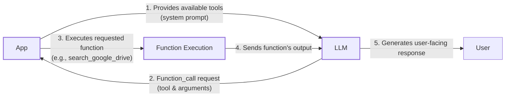
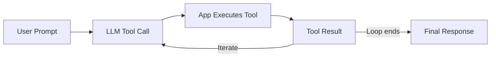

# Lesson 6: Agent Tools & Function Calling

In previous lessons, we covered context engineering and structured outputs. Now, we will give our agents the ability to act by connecting them to the external world with tools. This transforms them from simple text generators into systems that can perform tasks. This lesson shows how to implement tool usage from scratch and with Gemini's native API, opening the black box.

## Understanding Why Agents Need Tools

LLMs have a fundamental limitation: they are pattern matchers and text generators confined to their training data. They cannot, by themselves, perform actions to interact with the external world. They need help through additional engineering. Tools provide this capability, acting as the bridge between an LLM's internal reasoning and the external world.

Think of the LLM as the brain of an agent, while tools are its hands and senses. With tools, an LLM evolves into an AI agent that can interact with its environment. Popular tools allow agents to access APIs for real-time data, query databases, retrieve from long-term memory, and execute code for precise calculations.

## Implementing Tool Calls From Scratch

The best way to understand how tools work is to build them from scratch. The process involves providing the LLM with a list of available functions and letting it decide which one to use and with what arguments.

At a high level, the process of calling a tool involves five steps:

1.  **You:** Provide the LLM with a list of available tools via the system prompt.
2.  **LLM:** Responds with a `function_call` request, specifying the tool and arguments.
3.  **You:** Execute the requested function in your application code.
4.  **You:** Send the function's output back to the LLM.
5.  **LLM:** Uses the tool's output to generate a final, user-facing response.


Image 1: A flowchart illustrating the 5 steps of the tool calling process, highlighting the request-execute-respond flow.

Let's implement a simple example where we mock searching for a document on Google Drive and sending its summary to a Discord channel.

<aside>
💡

You can find all the code for this lesson in the accompanying [GitHub repository notebook](https://github.com/towardsai/course-ai-agents/blob/dev/lessons/06_tools/notebook.ipynb).

</aside>

1.  First, we set up our environment by initializing the Gemini client and defining a model ID. We also define a sample `DOCUMENT` to mock the content of a file.
    ```python
    import json
    from typing import Any
    
    from google import genai
    from google.genai import types
    from pydantic import BaseModel, Field
    
    # Load API key from .env file
    from lessons.utils import env
    env.load(required_env_vars=["GOOGLE_API_KEY"])
    
    client = genai.Client()
    
    MODEL_ID = "gemini-2.5-flash"
    
    DOCUMENT = """
    # Q3 2023 Financial Performance Analysis
    
    The Q3 earnings report shows a 20% increase in revenue and a 15% growth in user engagement, 
    beating market expectations...
    """
    ```

2.  Next, we define three mock functions. The function signature and docstrings are crucial, as the LLM uses them to understand what each tool does.
    ```python
    def search_google_drive(query: str) -> dict:
        """
        Searches for a file on Google Drive and returns its content or a summary.
    
        Args:
            query (str): The search query to find the file, e.g., 'Q3 earnings report'.
    
        Returns:
            dict: A dictionary representing the search results.
        """
        return {
            "files": [{"name": "Q3_Earnings_Report_2024.pdf", "id": "file12345", "content": DOCUMENT}]
        }
    ```
    ```python
    def send_discord_message(channel_id: str, message: str) -> dict:
        """
        Sends a message to a specific Discord channel.
    
        Args:
            channel_id (str): The ID of the channel to send the message to.
            message (str): The content of the message to send.
    
        Returns:
            dict: A dictionary confirming the action.
        """
        return {"status": "success", "channel": channel_id}
    ```
    ```python
    def summarize_financial_report(text: str) -> str:
        """
        Summarizes a financial report.
    
        Args:
            text (str): The text to summarize.
    
        Returns:
            str: The summary of the text.
        """
        return "The Q3 2023 earnings report shows strong performance with 20% revenue growth..."
    ```

3.  We then define a JSON schema for each function. This schema tells the LLM what the tool does and how to call it. This is an industry standard used by APIs from OpenAI, Google, and Anthropic [[1]](https://platform.openai.com/docs/guides/function-calling)[[3]](https://ai.google.dev/gemini-api/docs/function-calling).
    ```python
    search_google_drive_schema = {
        "name": "search_google_drive",
        "description": "Searches for a file on Google Drive and returns its content or a summary.",
        "parameters": {
            "type": "object",
            "properties": {"query": {"type": "string", "description": "The search query..."}},
            "required": ["query"],
        },
    }
    
    send_discord_message_schema = {
        "name": "send_discord_message",
        "description": "Sends a message to a specific Discord channel.",
        "parameters": {
            "type": "object",
            "properties": {
                "channel_id": {"type": "string", "description": "The ID of the channel..."},
                "message": {"type": "string", "description": "The content of the message..."},
            },
            "required": ["channel_id", "message"],
        },
    }
    
    summarize_financial_report_schema = {
        "name": "summarize_financial_report",
        "description": "Summarizes a financial report.",
        "parameters": {
            "type": "object",
            "properties": {"text": {"type": "string", "description": "The text to summarize."}},
            "required": ["text"],
        },
    }
    ```

4.  We aggregate our tools and their schemas into dictionaries for easy access.
    ```python
    TOOLS = {
        "search_google_drive": {"handler": search_google_drive, "declaration": search_google_drive_schema},
        "send_discord_message": {"handler": send_discord_message, "declaration": send_discord_message_schema},
        "summarize_financial_report": {"handler": summarize_financial_report, "declaration": summarize_financial_report_schema},
    }
    TOOLS_BY_NAME = {tool_name: tool["handler"] for tool_name, tool in TOOLS.items()}
    TOOLS_SCHEMA = [tool["declaration"] for tool in TOOLS.values()]
    ```
    The `TOOLS_BY_NAME` mapping gives us a quick way to access the function handlers.
    ```text
    {'search_google_drive': <function search_google_drive at ...>, 
     'send_discord_message': <function send_discord_message at ...>, 
     'summarize_financial_report': <function summarize_financial_report at ...>}
    ```
    And `TOOLS_SCHEMA` contains the JSON definitions for the LLM.
    ```json
    {
        "name": "search_google_drive",
        "description": "Searches for a file on Google Drive and returns its content or a summary.",
        "parameters": {
            "type": "object",
            "properties": {
                "query": {
                    "type": "string",
                    "description": "The search query to find the file, e.g., 'Q3 earnings report'."
                }
            },
            "required": [
                "query"
            ]
        }
    }
    ```

5.  Next, we create a system prompt that instructs the LLM on how to use these tools.
    ```python
    TOOL_CALLING_SYSTEM_PROMPT = """
    You are a helpful AI assistant with access to tools...
    
    ## Tool Call Format
    When you need to use a tool, output ONLY the tool call in this exact format:
    
    ```tool_call
    {{"name": "tool_name", "args": {{"param1": "value1"}}}}
    ```
    
    ## Available Tools
    <tool_definitions>
    {tools}
    </tool_definitions>
    """
    ```
    Based on the `description` in the schema, the LLM *decides* if a tool is appropriate. Clear and distinct descriptions are critical to avoid confusion, especially when scaling to many tools. For example, `Tool used to search documents on Google Drive` is better than a generic `Tool used to search documents`. Once a tool is selected, the LLM *generates* the function name and arguments as a structured JSON output. Models are instruction-fine-tuned to interpret these schemas and produce the correct tool call format [[2]](https://arxiv.org/pdf/2401.17464v3).

6.  Let's send a prompt to the model.
    ```python
    USER_PROMPT = "Can you help me find the latest quarterly report and share key insights with the team?"
    messages = [TOOL_CALLING_SYSTEM_PROMPT.format(tools=str(TOOLS_SCHEMA)), USER_PROMPT]
    
    response = client.models.generate_content(model=MODEL_ID, contents=messages)
    ```
    The model correctly identifies the first step and returns a tool call.
    ```text
    ```tool_call
    {"name": "search_google_drive", "args": {"query": "latest quarterly report"}}
    ```
    ```
    Let's try another prompt for a multi-step task.
    ```python
    USER_PROMPT = """
    Please find the Q3 earnings report on Google Drive and send a summary of it to 
    the #finance channel on Discord.
    """
    messages = [TOOL_CALLING_SYSTEM_PROMPT.format(tools=str(TOOLS_SCHEMA)), USER_PROMPT]
    response = client.models.generate_content(model=MODEL_ID, contents=messages)
    ```
    It again identifies the first logical step.
    ```text
    ```tool_call
    {"name": "search_google_drive", "args": {"query": "Q3 earnings report"}}
    ```
    ```

7.  We then parse this response, retrieve the corresponding function handler, and execute it with the arguments provided by the LLM.
    ```python
    def call_tool(response_text: str, tools_by_name: dict) -> Any:
        """Call a tool based on the response from the LLM."""
        tool_call_str = response_text.split("```tool_call")[1].split("```")[0].strip()
        tool_call = json.loads(tool_call_str)
        tool_name = tool_call["name"]
        tool_args = tool_call["args"]
        tool = tools_by_name[tool_name]
        return tool(**tool_args)
    
    tool_result = call_tool(response.text, tools_by_name=TOOLS_BY_NAME)
    ```
    This returns the content of our mock document. Typically, this result is then sent back to the LLM to inform the next step, allowing it to generate a summary or decide on another action.

## Implementing a Tool Calling Framework From Scratch

Manually defining a JSON schema for every function is tedious and violates the Don't Repeat Yourself (DRY) principle. Production frameworks like LangGraph solve this with a `@tool` decorator that automatically generates schemas from Python functions.

Let's build a simplified version. The goal is to wrap a function and automatically extract its name, docstring, and parameters to build the schema, creating a `ToolFunction` object that holds both the schema and the callable function.

1.  We define a `ToolFunction` class to hold the function and its generated schema.
    ```python
    from typing import Any, Callable, Dict
    
    class ToolFunction:
        def __init__(self, func: Callable, schema: Dict[str, Any]) -> None:
            self.func = func
            self.schema = schema
            self.__name__ = func.__name__
            self.__doc__ = func.__doc__
    
        def __call__(self, *args: Any, **kwargs: Any) -> Any:
            return self.func(*args, **kwargs)
    ```

2.  Next, we create the `@tool` decorator. It inspects the function's signature to determine parameter names and requirements, and uses the docstring for the description, building the JSON schema automatically.
    ```python
    from inspect import Parameter, signature
    from typing import Any, Callable, Dict, Optional
    
    def tool(description: Optional[str] = None) -> Callable[[Callable], ToolFunction]:
        """A decorator that creates a tool schema from a function."""
        def decorator(func: Callable) -> ToolFunction:
            sig = signature(func)
            properties = {}
            required = []
    
            for param_name, param in sig.parameters.items():
                if param.default == Parameter.empty:
                    required.append(param_name)
                properties[param_name] = {
                    "type": "string",
                    "description": f"The {param_name} parameter",
                }
    
            schema = {
                "name": func.__name__,
                "description": description or func.__doc__ or f"Executes the {func.__name__} function.",
                "parameters": {"type": "object", "properties": properties, "required": required},
            }
            return ToolFunction(func, schema)
        return decorator
    ```

3.  Now, we can redefine our tools using the decorator, which is much cleaner.
    ```python
    @tool()
    def search_google_drive_example(query: str) -> dict:
        """Search for files in Google Drive."""
        return {"files": ["Q3 earnings report"]}
    
    @tool()
    def send_discord_message_example(channel_id: str, message: str) -> dict:
        """Send a message to a Discord channel."""
        return {"message": "Message sent successfully"}
    
    @tool()
    def summarize_financial_report_example(text: str) -> str:
        """Summarize the contents of a financial report."""
        return "Financial report summarized successfully"
    
    tools = [
        search_google_drive_example,
        send_discord_message_example,
        summarize_financial_report_example,
    ]
    tools_by_name = {tool.schema["name"]: tool.func for tool in tools}
    tools_schema = [tool.schema for tool in tools]
    ```
    The decorated function `search_google_drive_example` is now a `ToolFunction` object.
    ```text
    <class '__main__.ToolFunction'>
    ```
    It contains the auto-generated schema and the original function handler.
    ```json
    {
      "name": "search_google_drive_example",
      "description": "Search for files in Google Drive.",
      "parameters": {
        "type": "object",
        "properties": {
          "query": {
            "type": "string",
            "description": "The query parameter"
          }
        },
        "required": [
          "query"
        ]
      }
    }
    ```
    ```text
    <function __main__.search_google_drive_example(query: str) -> dict>
    ```

4.  When we call the LLM with the new `tools_schema`, it works just as before, but our code is now more maintainable.
    ```python
    USER_PROMPT = "Please find the Q3 earnings report on Google Drive and send a summary of it to the #finance channel on Discord."
    messages = [TOOL_CALLING_SYSTEM_PROMPT.format(tools=str(tools_schema)), USER_PROMPT]
    response = client.models.generate_content(model=MODEL_ID, contents=messages)
    ```
    It outputs:
    ```text
    ```tool_call
    {"name": "search_google_drive_example", "args": {"query": "Q3 earnings report"}}
    ```
    ```

## Implementing Production-Level Tool Calls with Gemini

While building from scratch is insightful, production applications should use the native tool-calling features of APIs like Gemini. This approach is more robust and efficient, as the provider optimizes the underlying prompts for their models [[3]](https://ai.google.dev/gemini-api/docs/function-calling).

Instead of crafting a complex system prompt, we can pass our tool schemas directly to Gemini's `GenerateContentConfig`. This bypasses manual prompt engineering and ensures the model receives instructions in the optimal format.

1.  The `google-genai` Python SDK simplifies this even further by allowing us to pass the Python functions directly. It automatically generates the schema from the function's signature, type hints, and docstring, just as our decorator did.
    ```python
    from google.genai import types 
    
    config = types.GenerateContentConfig(
        tools=[search_google_drive, send_discord_message]
    )
    ```

2.  Now, the call to the model is much cleaner, as we no longer need the long system prompt. The Gemini API returns a `FunctionCall` object directly.
    ```python
    response = client.models.generate_content(
        model=MODEL_ID,
        contents=USER_PROMPT,
        config=config,
    )
    function_call = response.candidates[0].content.parts[0].function_call
    ```

3.  We can then create a simplified `call_tool` function to execute the call by parsing the `FunctionCall` object.
    ```python
    from typing import Any
    
    def call_tool(function_call: Any) -> Any:
        tool_name = function_call.name
        tool_args = {key: value for key, value in function_call.args.items()}
        tool_handler = TOOLS_BY_NAME[tool_name]
        return tool_handler(**tool_args)
    
    tool_result = call_tool(function_call)
    ```
    Using the native SDK reduces dozens of lines of code to just a few, creating a more robust system. Popular APIs from OpenAI and Anthropic follow a similar logic, so these concepts are easily transferable [[1]](https://platform.openai.com/docs/guides/function-calling)[[4]](https://www.anthropic.com/research/building-effective-agents).

## Using Pydantic Models as Tools for On-Demand Structured Outputs

In Lesson 4, we learned to generate structured outputs. A powerful pattern is treating a Pydantic model as a tool. This allows an agent to perform intermediate steps and then call a final "tool" to format the output into a reliable Pydantic object when it has all the necessary information. This combines the flexibility of multi-step reasoning with the reliability of structured data extraction.

```mermaid
flowchart LR
  %% Start of the process
  User["User Prompt"] --> "sends" Agent["AI Agent"]

  subgraph "Tool Orchestration Loop"
    Agent -- "calls" --> Tool1["Tool 1<br/>(e.g., Search Google Drive)"]
    Tool1 -- "returns" --> Result1["Tool 1 Result<br/>(unstructured)"]
    Result1 -- "feedback" --> Agent

    Agent -- "calls" --> Tool2["Tool 2<br/>(e.g., Summarize Report)"]
    Tool2 -- "returns" --> Result2["Tool 2 Result<br/>(unstructured)"]
    Result2 -- "feedback" --> Agent

    Result2 -. "intermediate tool calls" .-> Agent

    Agent -- "calls final tool" --> ToolN["Tool N<br/>(Pydantic Model for Structured Output, e.g., DocumentMetadata)"]
  end

  %% Final output generation
  ToolN -- "produces" --> Output["Structured Output<br/>(e.g., DocumentMetadata object)"]
```
Image 2: A diagram illustrating an AI agent that calls multiple tools in a loop, leading to a structured output.

1.  First, we define our `DocumentMetadata` Pydantic model.
    ```python
    from pydantic import BaseModel, Field
    
    class DocumentMetadata(BaseModel):
        """A class to hold structured metadata for a document."""
        summary: str = Field(description="A concise, 1-2 sentence summary...")
        tags: list[str] = Field(description="A list of 3-5 high-level tags...")
        keywords: list[str] = Field(description="A list of specific keywords...")
        quarter: str = Field(description="The quarter of the financial year...")
        growth_rate: str = Field(description="The growth rate of the company...")
    ```

2.  We then create a tool declaration where the `parameters` are derived from the Pydantic model's JSON schema.
    ```python
    from google.genai import types
    
    extraction_tool = types.Tool(
        function_declarations=[
            types.FunctionDeclaration(
                name="extract_metadata",
                description="Extracts structured metadata from a financial document.",
                parameters=DocumentMetadata.model_json_schema(),
            )
        ]
    )
    config = types.GenerateContentConfig(
        tools=[extraction_tool],
        tool_config=types.ToolConfig(function_calling_config=types.FunctionCallingConfig(mode="ANY")),
    )
    ```

3.  When prompted, the model calls our `extract_metadata` tool with arguments matching the Pydantic schema. We can then validate and instantiate the Pydantic object directly from the tool call's arguments.
    ```python
    prompt = f"Please analyze the following document and extract its metadata.\n\nDocument:\n---\n{DOCUMENT}\n---"
    response = client.models.generate_content(model=MODEL_ID, contents=prompt, config=config)
    function_call = response.candidates[0].content.parts[0].function_call
    document_metadata = DocumentMetadata(**function_call.args)
    ```

## The Downsides of Running Tools in a Loop

So far, we have focused on single-turn interactions. For an agent to handle complex tasks, it needs to chain multiple tools together, using the output of one tool to inform the input of the next. This is achieved by running tools in a loop, which provides flexibility and adaptability.


Image 3: A flowchart illustrating a sequential tool calling loop.

Let's implement a loop where the agent first searches for the report, then summarizes it, and finally sends the summary to Discord.

1.  We set up the configuration with all three tools.
    ```python
    from google.genai import types
    
    tools = [
        types.Tool(
            function_declarations=[
                types.FunctionDeclaration(**search_google_drive_schema),
                types.FunctionDeclaration(**send_discord_message_schema),
                types.FunctionDeclaration(**summarize_financial_report_schema),
            ]
        )
    ]
    config = types.GenerateContentConfig(
        tools=tools,
        tool_config=types.ToolConfig(function_calling_config=types.FunctionCallingConfig(mode="ANY")),
    )
    ```

2.  We initialize the conversation history and loop, executing tool calls and feeding results back to the model until it stops requesting actions.
    ```python
    USER_PROMPT = "Please find the Q3 earnings report on Google Drive and send a summary of it to the #finance channel on Discord."
    messages = [USER_PROMPT]
    
    response = client.models.generate_content(model=MODEL_ID, contents=messages, config=config)
    response_message_part = response.candidates[0].content.parts[0]
    messages.append(response.candidates[0].content)
    
    max_iterations = 3
    while hasattr(response_message_part, "function_call") and max_iterations > 0:
        tool_result = call_tool(response_message_part.function_call)
        function_response_part = types.Part.from_function_response(
            name=response_message_part.function_call.name,
            response={"result": tool_result},
        )
        messages.append(function_response_part)
    
        response = client.models.generate_content(model=MODEL_ID, contents=messages, config=config)
        response_message_part = response.candidates[0].content.parts[0]
        messages.append(response.candidates[0].content)
        max_iterations -= 1
    ```
    This loop works for sequential tasks, but it has a major limitation: it assumes the agent should call a tool at each step and doesn't allow the LLM to *reason* about a tool's output before deciding on the next action. The agent immediately moves to the next function call without pausing to think. To optimize, independent tool calls can be run in parallel, which reduces latency. These limitations lead to more sophisticated patterns like **ReAct** (Reasoning and Acting), which explicitly interleaves reasoning steps with tool calls. We will explore ReAct in detail in Lessons 7 and 8.

## Popular Tools Used Within the Industry

To ground this in the real world, let's look at common tool categories used in production AI systems.

**Knowledge & Memory Access** tools connect agents to information. They can query vector databases for semantic search, document stores, or traditional databases via text-to-SQL. This is fundamental for RAG and long-term memory, which we will cover in Lessons 9 and 10.

**Web Search & Browsing** tools give agents access to the live internet by interfacing with search engine APIs or using web scraping tools. This is essential for research agents that need up-to-date information.

**Code Execution** tools, like a Python interpreter, allow an agent to execute code for calculations or data manipulation. This is powerful but introduces security risks, so it must be run in a sandboxed environment.

**Other Popular Tools** allow agents to interact with almost any external API, enabling them to manage calendars, send emails, or operate project management software. They can also perform file system operations, like reading and writing files.

## Conclusion

Tool calling allows an AI agent to interact with the world, making it an essential skill for any AI Engineer. Now that our agent can act, it is time to teach it how to think. In Lesson 7, we will explore planning and reasoning with the ReAct pattern.

## References

- [1] Function calling with OpenAI's API (https://platform.openai.com/docs/guides/function-calling)
- [2] Efficient Tool Use with Chain-of-Abstraction Reasoning (https://arxiv.org/pdf/2401.17464v3)
- [3] Function calling with the Gemini API (https://ai.google.dev/gemini-api/docs/function-calling)
- [4] Building effective agents (https://www.anthropic.com/research/building-effective-agents)
</article>