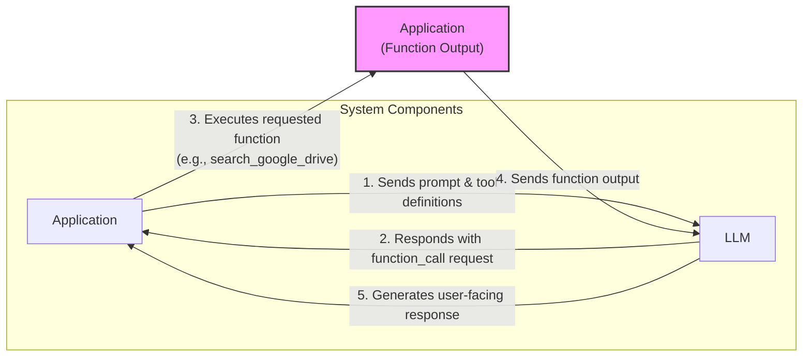
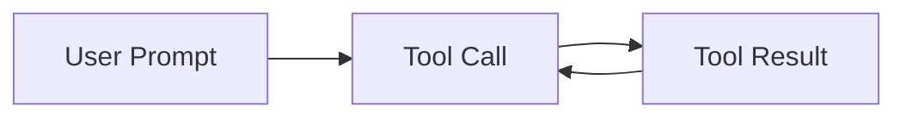

# Lesson 6: Agent Tools & Function Calling

In our previous lessons, we explored AI engineering fundamentals like workflows, context engineering, and structured outputs. Now, we will give our AI systems the ability to interact with the world. This lesson explores tool use, or function calling, which transforms an LLM from a text generator into an agent that can take action. Understanding this is a foundational skill for building and debugging any AI application.

## Understanding Why Agents Need Tools

LLMs have a fundamental limitation: they are simple pattern matchers and text generators. They cannot, on their own, perform actions or access real-time information from the external world. This is where tools come in. Think of the LLM as the brain of an agent. Tools are its "hands and senses," allowing it to perceive and act beyond its textual interface. They are the bridge between the LLM's internal reasoning and the external environment, transforming it into an AI agent. While tutorials often focus on reasoning, a key engineering challenge is execution: securely handling authentication, managing API errors, and ensuring reliability [[49]](https://composio.dev/content/ai-agent-tool-calling-guide).

Popular tools allow agents to access real-time APIs, interact with storage like a PostgreSQL database or S3 data lake, access long-term memory, and execute code for precise calculations.

## Implementing Tool Calls From Scratch

The best way to understand how tools work is to build them from scratch. We will implement a simple tool-calling framework before showing you how to use a modern LLM API like Gemini. We will learn how a tool is defined, how its schema guides the LLM, and how to execute the LLM's chosen action.

The process of calling a tool involves a five-step flow between your application and the LLM:

1.  **Application:** Sends a prompt and a list of available tool definitions to the LLM.
2.  **LLM:** Responds with a `function_call` request, specifying the tool and arguments.
3.  **Application:** Executes the requested function in your code.
4.  **Application:** Sends the function's output back to the LLM.
5.  **LLM:** Uses the tool's output to generate a final, user-facing response.


Image 1: A flowchart illustrating the 5-step request-execute-respond flow of calling a tool.

Let's implement an example where we mock searching documents on Google Drive and sending their summaries to Discord. We start by setting up our environment and defining three mock functions: `search_google_drive`, `send_discord_message`, and `summarize_financial_report`. The docstrings are crucial, as the LLM uses them to understand what each tool does.

```python
import json
from typing import Any
from google import genai
from google.genai import types
from pydantic import BaseModel, Field
from lessons.utils import pretty_print

client = genai.Client()
MODEL_ID = "gemini-2.5-flash"
DOCUMENT = """
# Q3 2023 Financial Performance Analysis
The Q3 earnings report shows a 20% increase in revenue...
"""

def search_google_drive(query: str) -> dict:
    """
    Searches for a file on Google Drive and returns its content or a summary.
    ...
    """
    # Mocked implementation
    return {"files": [{"name": "Q3_Earnings_Report_2024.pdf", "id": "file12345", "content": DOCUMENT}]}

def send_discord_message(channel_id: str, message: str) -> dict:
    """
    Sends a message to a specific Discord channel.
    ...
    """
    # Mocked implementation
    return {"status": "success", "channel": channel_id, "message_preview": f"{message[:50]}..."}

def summarize_financial_report(text: str) -> str:
    """
    Summarizes a financial report.
    ...
    """
    # Mocked implementation
    return "The Q3 2023 earnings report shows strong performance..."
```

For each function, we define a schema in JSON format. This schema tells the LLM what the tool does (via `description`) and how to call it (via `parameters`). This is the industry standard for APIs like OpenAI and Gemini.

```python
search_google_drive_schema = {
    "name": "search_google_drive",
    "description": "Searches for a file on Google Drive and returns its content or a summary.",
    "parameters": {
        "type": "object",
        "properties": {"query": {"type": "string", "description": "The search query..."}},
        "required": ["query"],
    },
}
# ... (schemas for other tools) ...
```

We then create a tool registry to manage our tools. This structure makes it easy to access tool functions and their schemas within our application.

```python
TOOLS = {
    "search_google_drive": {"handler": search_google_drive, "declaration": search_google_drive_schema},
    "send_discord_message": {"handler": send_discord_message, "declaration": send_discord_message_schema},
    "summarize_financial_report": {"handler": summarize_financial_report, "declaration": summarize_financial_report_schema},
}
TOOLS_BY_NAME = {tool_name: tool["handler"] for tool_name, tool in TOOLS.items()}
TOOLS_SCHEMA = [tool["declaration"] for tool in TOOLS.values()]
```

Next, we create a system prompt to instruct the LLM on how to use these tools. This prompt is critical as it serves as the instruction manual for the agent, defining when to use tools, how to select them, and the exact JSON format for tool calls.

```python
TOOL_CALLING_SYSTEM_PROMPT = """
You are a helpful AI assistant with access to tools...
...
## Available Tools
<tool_definitions>
{tools}
</tool_definitions>
...
"""
```

Based on the `description` field from the tool schema, the LLM *decides* if a tool call is appropriate. This is why clear, distinguishing descriptions are vital, especially when scaling to dozens of tools. The LLM then *generates* the function name and arguments as a structured JSON output, a capability enabled by instruction fine-tuning.

```python
USER_PROMPT = "Please find the Q3 earnings report on Google Drive and send a summary of it to the #finance channel on Discord."
messages = [TOOL_CALLING_SYSTEM_PROMPT.format(tools=str(TOOLS_SCHEMA)), USER_PROMPT]
response = client.models.generate_content(model=MODEL_ID, contents=messages)
```
It outputs:
```text
[93m-------------------------------------- LLM Tool Call Response -------------------------------------- [0m
```tool_call
{"name": "search_google_drive", "args": {"query": "Q3 earnings report"}}
```
[93m---------------------------------------------------------------------------------------------------- [0m
```

To execute this, we parse the LLM's response, extract the tool name and arguments, find the corresponding function in our `TOOLS_BY_NAME` registry, and call it. We can wrap these steps in a helper function.

```python
def call_tool(response_text: str, tools_by_name: dict) -> Any:
    tool_call_str = response_text.split("```tool_call")[1].split("```")[0].strip()
    tool_call = json.loads(tool_call_str)
    tool_name = tool_call["name"]
    tool_args = tool_call["args"]
    tool = tools_by_name[tool_name]
    return tool(**tool_args)

tool_result = call_tool(response.text, tools_by_name=TOOLS_BY_NAME)
```

The final step is to send the tool's result back to the LLM so it can formulate a response or decide on the next action. This covers the basic concept of tool calling from scratch.

## Implementing a Tool Calling Framework From Scratch

Manually defining JSON schemas for every tool is tedious and doesn't scale. Production frameworks like LangGraph use decorators like `@tool` to automatically generate and register these schemas. This approach respects the Don't Repeat Yourself (DRY) principle by creating a single, standardized way to define tools.

Let's build our own simple framework by implementing a `@tool` decorator. It will inspect a function's signature and docstring to automatically construct the JSON schema we previously built by hand.

First, we define a `ToolFunction` class to wrap our functions and hold their generated schema.

```python
from inspect import Parameter, signature
from typing import Any, Callable, Dict, Optional

class ToolFunction:
    def __init__(self, func: Callable, schema: Dict[str, Any]) -> None:
        self.func = func
        self.schema = schema
        self.__name__ = func.__name__
        self.__doc__ = func.__doc__

    def __call__(self, *args: Any, **kwargs: Any) -> Any:
        return self.func(*args, **kwargs)
```

Next, we create the `@tool` decorator. It inspects the function to generate the schema automatically.

```python
def tool(description: Optional[str] = None) -> Callable[[Callable], ToolFunction]:
    """A decorator that creates a tool schema from a function."""
    def decorator(func: Callable) -> ToolFunction:
        sig = signature(func)
        properties = {}
        required = []
        for param_name, param in sig.parameters.items():
            if param.default == Parameter.empty:
                required.append(param_name)
            properties[param_name] = {"type": "string", "description": f"The {param_name} parameter"}
        
        schema = {
            "name": func.__name__,
            "description": description or func.__doc__ or f"Executes the {func.__name__} function.",
            "parameters": {"type": "object", "properties": properties, "required": required},
        }
        return ToolFunction(func, schema)
    return decorator
```

Now, we can redefine our tools using the new decorator. The code is cleaner, and the schema generation is handled for us.

```python
@tool()
def search_google_drive_example(query: str) -> dict:
    """Search for files in Google Drive."""
    return {"files": ["Q3 earnings report"]}

@tool()
def send_discord_message_example(channel_id: str, message: str) -> dict:
    """Send a message to a Discord channel."""
    return {"message": "Message sent successfully"}

@tool()
def summarize_financial_report_example(text: str) -> str:
    """Summarize the contents of a financial report."""
    return "Financial report summarized successfully"

tools = [search_google_drive_example, send_discord_message_example, summarize_financial_report_example]
tools_by_name = {tool.schema["name"]: tool.func for tool in tools}
tools_schema = [tool.schema for tool in tools]
```

The decorated function is now a `ToolFunction` object containing the schema and the original function handler, which is accessible via the `.func` attribute. The flow with the LLM remains the same, but our tool definition is much cleaner and more maintainable. Voilà! We have our little tool calling framework.

## Implementing Production-Level Tool Calls with Gemini

While building from scratch is a great learning exercise, production systems should use the native tool-calling capabilities of APIs like Gemini. This approach is more robust, requires less code, and is optimized by the provider. Instead of writing a complex system prompt, we can use Gemini's `GenerateContentConfig` to define our tools.

First, we define the `tools` and `config` objects for the Gemini API, using our manually defined schemas.

```python
tools = [
    types.Tool(
        function_declarations=[
            types.FunctionDeclaration(**search_google_drive_schema),
            types.FunctionDeclaration(**send_discord_message_schema),
        ]
    )
]
config = types.GenerateContentConfig(
    tools=tools,
    tool_config=types.ToolConfig(function_calling_config=types.FunctionCallingConfig(mode="ANY")),
)
```

With this config, we can pass the user's request directly to the model, as the tool instructions are handled by the API. The model returns a `FunctionCall` object.

```python
response = client.models.generate_content(
    model=MODEL_ID,
    contents=USER_PROMPT,
    config=config,
)
```
It outputs:
```text
FunctionCall(id=None, args={'query': 'Q3 earnings report'}, name='search_google_drive')
```

To simplify even further, the `google-genai` SDK can generate the schema automatically from a Python function's signature, type hints, and docstring. We can pass our functions directly to the `GenerateContentConfig` object.

```python
config = types.GenerateContentConfig(
 tools=[search_google_drive, send_discord_message]
)
```

We can then create a simplified `call_tool` function to execute the call.

```python
def call_tool(function_call) -> Any:
    tool_name = function_call.name
    tool_args = {key: value for key, value in function_call.args.items()}
    tool_handler = TOOLS_BY_NAME[tool_name]
    return tool_handler(**tool_args)
```

By using the native SDK, we reduced dozens of lines of code to just a few. Other popular APIs from OpenAI and Anthropic follow a similar logic, so these concepts are transferable.

## Using Pydantic Models as Tools for On-Demand Structured Outputs

Connecting this lesson with what we learned about structured outputs in Lesson 4, we can use a Pydantic model as a tool. This is an elegant pattern for agentic workflows that perform several intermediate steps before producing a final, structured answer. The agent can use tools that return unstructured text for its internal reasoning, and then, when ready, call a Pydantic model "tool" to format the final output.

```mermaid
flowchart LR
  %% Start of the process
  Start["Start"] --> AI_Agent["AI Agent"]

  %% AI Agent's main loop
  subgraph "AI Agent Orchestration Loop"
    AI_Agent -- "initiates tool call" --> Tool_Call_Unstructured["Tool Call<br/>(Unstructured Output)"]
    Tool_Call_Unstructured -- "returns output" --> Process_Unstructured["Process Unstructured Output"]
    Process_Unstructured -- "informs agent" --> AI_Agent_Decision{"AI Agent<br/>Decides to Continue?"}

    AI_Agent_Decision -- "Yes<br/>(more unstructured calls)" --> AI_Agent
  end

  %% Exit loop for structured output
  AI_Agent_Decision -- "No<br/>(final structured call)" --> Last_Tool_Call_Structured["Last Tool Call<br/>(Structured Output)"]

  %% Structured output generation
  subgraph "Structured Output Generation"
    Last_Tool_Call_Structured -- "uses schema" --> Pydantic_Model["Pydantic Model<br/>(e.g., DocumentMetadata)"]
    Last_Tool_Call_Structured -- "produces" --> Structured_Output["Structured Output<br/>(DocumentMetadata)"]
  end

  Structured_Output --> End["End"]

  %% Visual grouping
  classDef agent_node stroke-width:2px
  classDef structured_data stroke-dasharray:3,3

  class AI_Agent agent_node
  class Pydantic_Model,Structured_Output structured_data
```


Image 2: A flowchart illustrating an AI agent calling multiple tools in a loop, with the last tool call generating structured output using a Pydantic model.

We define a `DocumentMetadata` Pydantic model and treat it as a tool by creating a `FunctionDeclaration` whose parameters are defined by the model's JSON schema.

```python
class DocumentMetadata(BaseModel):
    """A class to hold structured metadata for a document."""
    summary: str = Field(description="A concise, 1-2 sentence summary of the document.")
    tags: list[str] = Field(description="A list of 3-5 high-level tags relevant to the document.")
    # ... other fields

extraction_tool = types.Tool(
    function_declarations=[
        types.FunctionDeclaration(
            name="extract_metadata",
            description="Extracts structured metadata from a financial document.",
            parameters=DocumentMetadata.model_json_schema(),
        )
    ]
)
config = types.GenerateContentConfig(tools=[extraction_tool], tool_config=...)
```

When we prompt the model to analyze a document, it returns a `function_call` with arguments that match our Pydantic schema. We can then validate these arguments and parse them directly into a `DocumentMetadata` object, ensuring the agent produces a reliable, structured final output.

## The Downsides of Running Tools in a Loop

So far, we have focused on single-turn interactions. For an AI system to function as a true agent, it needs to perform multi-step tasks by calling tools sequentially. This allows the LLM to chain actions, using the output of one tool to decide on the next, giving it flexibility to handle complex problems.


Image 3: A flowchart illustrating a sequential tool calling loop.

Let's implement a loop where an agent finds a report on Google Drive, summarizes it, and sends the summary to Discord. We configure the model with all three tools and start with a user prompt that requires multiple steps.

```python
USER_PROMPT = """
Please find the Q3 earnings report on Google Drive and send a summary of it to 
the #finance channel on Discord.
"""
messages = [USER_PROMPT]
response = client.models.generate_content(model=MODEL_ID, contents=messages, config=config)
```

We then enter a loop, executing tool calls and feeding the results back to the model until it stops requesting actions or hits a max iteration limit.

```python
messages.append(response.candidates[0].content)
max_iterations = 3
while hasattr(response.candidates[0].content.parts[0], "function_call") and max_iterations > 0:
    # ... (execute tool and get result) ...
    messages.append(function_response_part)
    # ... (call model again with updated messages) ...
    messages.append(response.candidates[0].content)
    max_iterations -= 1
```

The loop proceeds as expected: finding the document, summarizing it, and finally sending the message. However, this simple loop has significant limitations. It does not give the LLM a chance to "think" or reason about the output of a tool before deciding on the next action. The agent immediately moves to the next function call without pausing to reflect on what it has learned. This can lead to inefficient tool use or getting stuck in loops.

For tasks where tools are independent, they can be run in parallel to reduce latency. For example, an agent could fetch financial news from one API while simultaneously getting stock prices from another. Our simple sequential loop doesn't support this. This simple request-execute-respond flow is a foundational concept. More advanced agentic loops evolve this into a 6-step process that includes an initial **Tool Discovery** step, where the agent first searches for the most relevant tools before deciding which one to call [[49]](https://composio.dev/content/ai-agent-tool-calling-guide).

These downsides led to the development of more advanced patterns like ReAct (Reasoning and Acting), which explicitly interleaves reasoning steps with actions. We will explore ReAct in detail in lessons 7 and 8.

## Popular Tools Used Within the Industry

To ground these concepts in the real world, here are some popular categories of tools used in production AI systems:

1.  **Knowledge & Memory Access:** These tools connect agents to external knowledge. While RAG is for **reading** from static sources like documents, tool calling is for **acting** or fetching dynamic data, for example, by using text-to-SQL to query a live database. We will cover memory and RAG in-depth in Lessons 9 and 10 [[49]](https://composio.dev/content/ai-agent-tool-calling-guide).
2.  **Web Search & Browsing:** Common in research agents and chatbots, these tools use search engine APIs or scrape web pages to give agents access to up-to-date information.
3.  **Code Execution:** A Python interpreter tool lets an agent write and run code in a sandbox, which is useful for data analysis, calculations, and visualization.
4.  **Standardization Protocols:** As the number of tools and agents grows, protocols like the Model Context Protocol (MCP) are emerging to standardize how they connect. Think of MCP as the USB-C for AI agents—a common interface that allows any compliant tool to "plug in" to any compliant agent [[49]](https://composio.dev/content/ai-agent-tool-calling-guide).
5.  **Other Popular Tools:** This category includes integrations with external APIs (calendars, email) and file system operations for reading and writing local files. For any tool that performs sensitive actions, a **Human-in-the-Loop** pattern is a critical safety measure, requiring user approval before execution [[49]](https://composio.dev/content/ai-agent-tool-calling-guide).

## Conclusion

Tool calling is the core mechanism that allows an LLM to act in the world, transforming it into an agent. Mastering how to define, call, and orchestrate tools is a critical skill for any AI Engineer. In our next lesson, we will explore planning and ReAct agents.

## References

- [1] [Function Calling Guide: Google DeepMind Gemini 2.0 Flash](https://www.philschmid.de/gemini-function-calling)
- [2] [Function calling with the Gemini API](https://ai.google.dev/gemini-api/docs/function-calling)
- [3] [Output - Pydantic AI](https://pydantic.dev/docs/ai/core-concepts/output/)
- [4] [Response schema from Pydantic](https://discuss.ai.google.dev/t/response-schema-from-pydantic/50028)
- [5] [Multi-Agent Applications - Pydantic AI](https://pydantic.dev/docs/ai/guides/multi-agent-applications/)
- [6] [Tools - Pydantic AI](https://pydantic.dev/docs/ai/tools-toolsets/tools/)
- [7] [Agentic Design Patterns — Visual Architecture Guide](https://myengineeringpath.dev/genai-engineer/agentic-patterns/)
- [8] [What is the AI agent loop? The core architecture behind autonomous AI systems](https://blogs.oracle.com/developers/what-is-the-ai-agent-loop-the-core-architecture-behind-autonomous-ai-systems)
- [9] [Agentic AI: Connected Context and Persistent Memory](https://neo4j.com/blog/agentic-ai/connected-context-and-persistent-memory-neo4j-providers-for-the-microsoft-agent-framework/)
- [10] [How Vector Databases Are Rewiring the Tech Industry](https://www.ruh.ai/blogs/how-vector-databases-are-rewiring-the-tech-industry)
- [11] [Text-to-SQL: What It Is, How It Works, and Why It Matters in 2025](https://promethium.ai/guides/text-to-sql-basics-benefits/)
- [12] [Unlocking the Power of Your Data with LangChain and SQL](https://www.linkedin.com/posts/amanc_sql-datascience-artificialintelligence-activity-7390564257819652096-scgG)
- [13] [Top 10 Open Source Vector Databases](https://www.instaclustr.com/education/vector-database/top-10-open-source-vector-databases/)
- [14] [Tool-Augmented-LLMs](https://arxiv.org/html/2507.08034v1)
- [15] [How LLMs Use Web Search to Answer Your Questions](https://mantraideas.com/llm-web-search/)
- [16] [How LLM Reasoning Powers the Agentic AI Revolution](https://medium.com/@anicomanesh/how-llm-reasoning-powers-the-agentic-ai-revolution-cbefd10ebf3f)
- [17] [Extending LLM’s capabilities with external tools](https://lnu.diva-portal.org/smash/get/diva2:1801354/FULLTEXT01.pdf)
- [18] [LLM Engineering: Part I](https://medium.com/@yugalnandurkar5/llm-engineering-part-i-fa48d4307d26)
- [19] [Prompting best practices for tool use / function calling](https://community.openai.com/t/prompting-best-practices-for-tool-use-function-calling/1123036)
- [20] [Building Production-Ready LLM Applications: Bulletproof LLM Tool Calling with Advanced JSON](https://medium.com/@hariomshahu101/building-production-ready-llm-applications-bulletproof-llm-tool-calling-with-advanced-json-b95ce8889f4e)
- [21] [LLM Output Parsing and Structured Generation](https://tetrate.io/learn/ai/llm-output-parsing-structured-generation)
- [22] [Tool Input and Output Schema Design](https://apxml.com/courses/building-advanced-llm-agent-tools/chapter-1-llm-agent-tooling-foundations/tool-input-output-schemas)
- [23] [Function Calling: How LLMs Can Use External Tools](https://mbrenndoerfer.com/writing/function-calling-llm-structured-tools)
- [24] [Tools - OpenAI Agents SDK](https://openai.github.io/openai-agents-python/tools/)
- [25] [Custom Tools - Strands](https://strandsagents.com/docs/user-guide/concepts/tools/custom-tools/)
- [26] [langchain.tools - LangChain](https://docs.langchain.com/oss/python/langchain/tools)
- [27] [langchain_core.tools.convert.tool - LangChain](https://reference.langchain.com/python/langchain-core/tools/convert/tool)
- [28] [Building effective agents - Anthropic](https://www.anthropic.com/research/building-effective-agents)
- [29] [Best Practices to Build LLM Tools in 2025](https://techinfotech.tech.blog/2025/06/09/best-practices-to-build-llm-tools-in-2025/)
- [30] [Tool Descriptions are Critical: Making Better LLM Tools](https://pub.towardsai.net/tool-descriptions-are-critical-making-better-llm-tools-research-capability-b315851471e7)
- [31] [Underlying Factors Behind Inconsistency in LLM Responses with Multi-Tool Calling](https://medium.com/@abhaychougule0907/underlying-factors-behind-inconsistency-in-llm-responses-with-multi-tool-calling-628ce7b4de76)
- [32] [Editing Tool Descriptions is Not Enough](https://arxiv.org/html/2505.18135v2)
- [33] [Tool Calling: From Scratch to Production](https://www.decodingai.com/p/tool-calling-from-scratch-to-production)
- [34] [Overview of Common LLM APIs (OpenAI, Anthropic, etc.)](https://apxml.com/courses/prompt-engineering-llm-application-development/chapter-4-interacting-with-llm-apis/overview-common-llm-apis)
- [35] [LLM Providers & Gen AI Platforms Compared](https://www.getorchestra.io/guides/llm-providers-gen-ai-platforms-compared)
- [36] [Google Gemini Guide](https://myengineeringpath.dev/tools/gemini-guide/)
- [37] [LLM API Differences That Break Your Code: Anthropic vs OpenAI vs Google](https://futuresearch.ai/blog/llm-provider-quirks/)
- [38] [Notebook: Lesson 6 - Tools](https://github.com/towardsai/course-ai-agents/blob/dev/lessons/06_tools/notebook.ipynb)
- [39] [Tool Calling Agent From Scratch - YouTube](https://www.youtube.com/watch?v=ApoDzZP8_ck)
- [40] [Building AI Agents from scratch - Part 1: Tool use](https://www.newsletter.swirlai.com/p/building-ai-agents-from-scratch-part)
- [41] [Efficient Tool Use with Chain-of-Abstraction Reasoning](https://arxiv.org/pdf/2401.17464v3)
- [42] [Function calling with OpenAI's API](https://platform.openai.com/docs/guides/function-calling)
- [43] [Gemini Function Calling - Guillaume Laforge](https://glaforge.dev/posts/2023/12/22/gemini-function-calling/)
- [44] [Anthropic vs OpenAI: Which is the Best AI Platform for Your Business?](https://www.lilbigthings.com/post/anthropic-vs-openai)
- [45] [OpenAI API vs Anthropic API Comparison](https://is4.ai/blog/our-blog-1/openai-api-vs-anthropic-api-comparison-117)
- [46] [Comparison: OpenAI API vs. Anthropic API](https://www.mgsoftware.nl/en/vergelijking/openai-api-vs-anthropic-api)
- [47] [OpenAI API vs Anthropic API: A Developer's Guide](https://sfailabs.com/guides/openai-api-vs-anthropic-api)
- [48] [OpenAI Responses API vs Chat Completions vs Anthropic Messages API](https://portkey.ai/blog/open-ai-responses-api-vs-chat-completions-vs-anthropic-anthropic-messages-api)
- [49] [AI Agent Tool Calling Guide](https://composio.dev/content/ai-agent-tool-calling-guide)

</article>