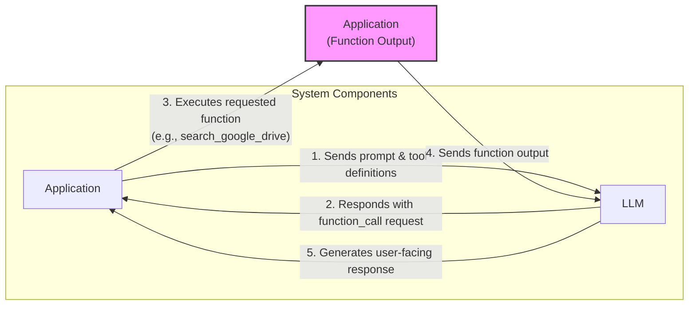
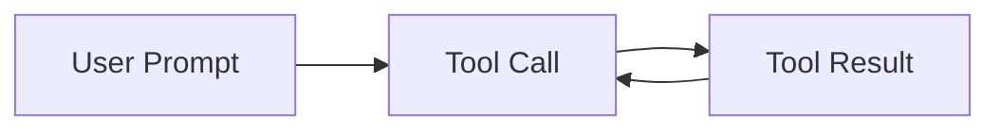

# Lesson 6: Agent Tools & Function Calling

In the last few lessons, we explored the fundamentals of AI Engineering. We learned the difference between LLM workflows and AI agents, mastered context engineering, and ensured reliable data extraction with structured outputs. Now, we will give our AI systems the ability to interact with the world.

This lesson explores tool use, also known as function calling. Tools transform an LLM from a simple text generator into an agent that can take action. By implementing tool calling from scratch, you will understand how an agent decides which tool to use and how to generate the correct parameters to call it. This is a foundational skill for building, debugging, and monitoring any AI application.

## Understanding Why Agents Need Tools

LLMs have a fundamental limitation: they are pattern matchers and text generators. They cannot, on their own, perform actions or access real-time information from the external world. They need help through additional engineering, which is where tools come in. While tutorials often focus on the LLM's reasoning, a key engineering challenge is in the execution: securely handling authentication, managing API errors, and ensuring reliability. [[49]](https://composio.dev/content/ai-agent-tool-calling-guide)

Think of the LLM as the brain of an agent. Tools are its "hands and senses," allowing it to perceive and act in the world beyond its training data. They are the bridge between the LLM's internal reasoning and the external environment. With tools, an LLM becomes an AI agent.

Popular tools that power modern AI agents allow them to:
- Access real-time information through APIs (e.g., today's weather, latest news).
- Interact with external databases or other storage solutions.
- Access the agent's long-term memory.
- Execute code (e.g., Python, JavaScript) for precise calculations or data manipulation.

## Implementing Tool Calls From Scratch

The best way to understand how tools work is to build them from scratch. We will implement a simple tool-calling framework before showing you how to use a modern LLM API like Gemini. We will learn how a tool is defined, how its schema guides the LLM, and how to execute the LLM's chosen action.

The process of calling a tool involves a five-step flow between your application and the LLM:

1.  **Application:** Sends a prompt and a list of available tool definitions to the LLM.
2.  **LLM:** Responds with a `function_call` request, specifying the tool and arguments.
3.  **Application:** Executes the requested function in your code.
4.  **Application:** Sends the function's output back to the LLM.
5.  **LLM:** Uses the tool's output to generate a final, user-facing response.


Image 1: A flowchart illustrating the 5-step request-execute-respond flow of calling a tool.

Let's implement an example where we mock searching documents on Google Drive and sending their summaries to Discord.

1.  First, we set up our environment by initializing the Gemini client and defining constants. We will use a sample document to mock the content of a file.
    ```python
    import json
    from typing import Any

    from google import genai
    from google.genai import types
    from pydantic import BaseModel, Field

    from lessons.utils import pretty_print

    client = genai.Client()

    MODEL_ID = "gemini-2.5-flash"

    DOCUMENT = """
    # Q3 2023 Financial Performance Analysis

    The Q3 earnings report shows a 20% increase in revenue and a 15% growth in user engagement, 
    beating market expectations. These impressive results reflect our successful product strategy 
    and strong market positioning.

    Our core business segments demonstrated remarkable resilience, with digital services leading 
    the growth at 25% year-over-year. The expansion into new markets has proven particularly 
    successful, contributing to 30% of the total revenue increase.

    Customer acquisition costs decreased by 10% while retention rates improved to 92%, 
    marking our best performance to date. These metrics, combined with our healthy cash flow 
    position, provide a strong foundation for continued growth into Q4 and beyond.
    """
    ```

2.  Next, we define three mock functions. The docstrings are crucial, as the LLM uses them to understand what each tool does.
    ```python
    def search_google_drive(query: str) -> dict:
        """
        Searches for a file on Google Drive and returns its content or a summary.

        Args:
            query (str): The search query to find the file, e.g., 'Q3 earnings report'.

        Returns:
            dict: A dictionary representing the search results, including file names and summaries.
        """
        return {
            "files": [
                {
                    "name": "Q3_Earnings_Report_2024.pdf",
                    "id": "file12345",
                    "content": DOCUMENT,
                }
            ]
        }
    ```
    ```python
    def send_discord_message(channel_id: str, message: str) -> dict:
        """
        Sends a message to a specific Discord channel.

        Args:
            channel_id (str): The ID of the channel to send the message to, e.g., '#finance'.
            message (str): The content of the message to send.

        Returns:
            dict: A dictionary confirming the action, e.g., {"status": "success"}.
        """
        return {
            "status": "success",
            "status_code": 200,
            "channel": channel_id,
            "message_preview": f"{message[:50]}...",
        }
    ```
    ```python
    def summarize_financial_report(text: str) -> str:
        """
        Summarizes a financial report.

        Args:
            text (str): The text to summarize.

        Returns:
            str: The summary of the text.
        """
        return "The Q3 2023 earnings report shows strong performance across all metrics with 20% revenue growth, 15% user engagement increase, 25% digital services growth, and improved retention rates of 92%."
    ```

3.  For each function, we define a schema in JSON format. This schema tells the LLM what the tool does (via `description`) and how to call it (via `parameters`). This is the industry standard for APIs like OpenAI and Gemini.
    ```python
    search_google_drive_schema = {
        "name": "search_google_drive",
        "description": "Searches for a file on Google Drive and returns its content or a summary.",
        "parameters": {
            "type": "object",
            "properties": {
                "query": {
                    "type": "string",
                    "description": "The search query to find the file, e.g., 'Q3 earnings report'.",
                }
            },
            "required": ["query"],
        },
    }
    ```
    ```python
    send_discord_message_schema = {
        "name": "send_discord_message",
        "description": "Sends a message to a specific Discord channel.",
        "parameters": {
            "type": "object",
            "properties": {
                "channel_id": {
                    "type": "string",
                    "description": "The ID of the channel to send the message to, e.g., '#finance'.",
                },
                "message": {
                    "type": "string",
                    "description": "The content of the message to send.",
                },
            },
            "required": ["channel_id", "message"],
        },
    }
    ```
    ```python
    summarize_financial_report_schema = {
        "name": "summarize_financial_report",
        "description": "Summarizes a financial report.",
        "parameters": {
            "type": "object",
            "properties": {
                "text": {
                    "type": "string",
                    "description": "The text to summarize.",
                },
            },
            "required": ["text"],
        },
    }
    ```

4.  We then create a tool registry to map tool names to their corresponding functions and schemas.
    ```python
    TOOLS = {
        "search_google_drive": {
            "handler": search_google_drive,
            "declaration": search_google_drive_schema,
        },
        "send_discord_message": {
            "handler": send_discord_message,
            "declaration": send_discord_message_schema,
        },
        "summarize_financial_report": {
            "handler": summarize_financial_report,
            "declaration": summarize_financial_report_schema,
        },
    }
    TOOLS_BY_NAME = {tool_name: tool["handler"] for tool_name, tool in TOOLS.items()}
    TOOLS_SCHEMA = [tool["declaration"] for tool in TOOLS.values()]
    ```
    The `TOOLS_BY_NAME` mapping provides a quick way to access a tool's function by its name.
    It outputs:
    ```text
    Tool name: search_google_drive
    Tool handler: <function search_google_drive at 0x104c7df80>
    ---------------------------------------------------------------------------
    Tool name: send_discord_message
    Tool handler: <function send_discord_message at 0x104c7de40>
    ---------------------------------------------------------------------------
    Tool name: summarize_financial_report
    Tool handler: <function summarize_financial_report at 0x1274f5c60>
    ---------------------------------------------------------------------------
    ```
    The `TOOLS_SCHEMA` list contains the JSON schemas for all available tools, which we will pass to the LLM.
    It outputs:
    ```text
    [93m-------------------------------- `search_google_drive` Tool Schema -------------------------------- [0m
    {
    "name": "search_google_drive",
    "description": "Searches for a file on Google Drive and returns its content or a summary.",
    "parameters": {
      "type": "object",
      "properties": {
        "query": {
          "type": "string",
          "description": "The search query to find the file, e.g., 'Q3 earnings report'."
        }
      },
      "required": [
        "query"
      ]
    }
    }
    [93m---------------------------------------------------------------------------------------------------- [0m
    ```

5.  Next, we create a system prompt to instruct the LLM on how to use these tools. This prompt includes guidelines, the required output format, and the definitions of available tools enclosed in XML tags.
    ```python
    TOOL_CALLING_SYSTEM_PROMPT = """
    You are a helpful AI assistant with access to tools that enable you to take actions and retrieve information to better 
    assist users.

    ## Tool Usage Guidelines

    **When to use tools:**
    - When you need information that is not in your training data
    - When you need to perform actions in external systems and environments
    - When you need real-time, dynamic, or user-specific data
    - When computational operations are required

    **Tool selection:**
    - Choose the most appropriate tool based on the user's specific request
    - If multiple tools could work, select the one that most directly addresses the need
    - Consider the order of operations for multi-step tasks

    **Parameter requirements:**
    - Provide all required parameters with accurate values
    - Use the parameter descriptions to understand expected formats and constraints
    - Ensure data types match the tool's requirements (strings, numbers, booleans, arrays)

    ## Tool Call Format

    When you need to use a tool, output ONLY the tool call in this exact format:

    ```tool_call
    {{"name": "tool_name", "args": {{"param1": "value1", "param2": "value2"}}}}
    ```

    **Critical formatting rules:**
    - Use double quotes for all JSON strings
    - Ensure the JSON is valid and properly escaped
    - Include ALL required parameters
    - Use correct data types as specified in the tool definition
    - Do not include any additional text or explanation in the tool call

    ## Response Behavior

    - If no tools are needed, respond directly to the user with helpful information
    - If tools are needed, make the tool call first, then provide context about what you're doing
    - After receiving tool results, provide a clear, user-friendly explanation of the outcome
    - If a tool call fails, explain the issue and suggest alternatives when possible

    ## Available Tools

    <tool_definitions>
    {tools}
    </tool_definitions>

    Remember: Your goal is to be maximally helpful to the user. Use tools when they add value, but don't use them unnecessarily. Always prioritize accuracy and user experience.
    """
    ```

6.  The LLM decides whether to use a tool based on the `description` field in the schema, making clear and distinct descriptions essential. For example, `Tool used to search documents on Google Drive` is much better than `Tool used to search files`. When scaling to dozens of tools, this clarity is critical. The LLM then generates the function name and arguments as a structured JSON output, a capability enabled by instruction fine-tuning.
    When scaling to dozens of tools, providing all schemas in the prompt becomes inefficient. This "context explosion" increases costs and can degrade accuracy. A pattern called **Tool Search** avoids this by letting the agent dynamically find the right tool from a large registry when needed. [[49]](https://composio.dev/content/ai-agent-tool-calling-guide)
    ```python
    USER_PROMPT = """
    Can you help me find the latest quarterly report and share key insights with the team?
    """

    messages = [TOOL_CALLING_SYSTEM_PROMPT.format(tools=str(TOOLS_SCHEMA)), USER_PROMPT]

    response = client.models.generate_content(
        model=MODEL_ID,
        contents=messages,
    )
    ```
    It outputs:
    ```text
    [93m-------------------------------------- LLM Tool Call Response -------------------------------------- [0m
    ```tool_call
    {"name": "search_google_drive", "args": {"query": "latest quarterly report"}}
    ```
    [93m---------------------------------------------------------------------------------------------------- [0m
    ```
    With a more complex prompt, the LLM still correctly identifies the first step.
    ```python
    USER_PROMPT = """
    Please find the Q3 earnings report on Google Drive and send a summary of it to 
    the #finance channel on Discord.
    """

    messages = [TOOL_CALLING_SYSTEM_PROMPT.format(tools=str(TOOLS_SCHEMA)), USER_PROMPT]

    response = client.models.generate_content(
        model=MODEL_ID,
        contents=messages,
    )
    ```
    It outputs:
    ```text
    [93m-------------------------------------- LLM Tool Call Response -------------------------------------- [0m
    ```tool_call
    {"name": "search_google_drive", "args": {"query": "Q3 earnings report"}}
    ```
    [93m---------------------------------------------------------------------------------------------------- [0m
    ```

7.  Now we need to parse the LLM's response and execute the function. We start by extracting the JSON string.
    ```python
    def extract_tool_call(response_text: str) -> str:
        """
        Extracts the tool call from the response text.
        """
        return response_text.split("```tool_call")[1].split("```")[0].strip()


    tool_call_str = extract_tool_call(response.text)
    ```
    This gives us a clean JSON string, which we parse into a Python dictionary.
    ```python
    tool_call = json.loads(tool_call_str)
    ```
    It outputs:
    ```text
    {'name': 'search_google_drive', 'args': {'query': 'Q3 earnings report'}}
    ```
    Next, we get the function handler from our `TOOLS_BY_NAME` dictionary.
    ```python
    tool_handler = TOOLS_BY_NAME[tool_call["name"]]
    ```
    It outputs:
    ```text
    <function __main__.search_google_drive(query: str) -> dict>
    ```
    Finally, we call the function with the arguments provided by the LLM.
    ```python
    tool_result = tool_handler(**tool_call["args"])
    ```
    It outputs:
    ```text
    [93m-------------------------------------- LLM Tool Call Response -------------------------------------- [0m
    {
    "files": [
      {
        "name": "Q3_Earnings_Report_2024.pdf",
        "id": "file12345",
        "content": "
    # Q3 2023 Financial Performance Analysis

    The Q3 earnings report shows a 20% increase in revenue and a 15% growth in user engagement, 
    beating market expectations. These impressive results reflect our successful product strategy 
    and strong market positioning.

    Our core business segments demonstrated remarkable resilience, with digital services leading 
    the growth at 25% year-over-year. The expansion into new markets has proven particularly 
    successful, contributing to 30% of the total revenue increase.

    Customer acquisition costs decreased by 10% while retention rates improved to 92%, 
    marking our best performance to date. These metrics, combined with our healthy cash flow 
    position, provide a strong foundation for continued growth into Q4 and beyond.
    "
      }
    ]
    }
    [93m---------------------------------------------------------------------------------------------------- [0m
    ```

8.  We can wrap these steps in a single helper function.
    ```python
    def call_tool(response_text: str, tools_by_name: dict) -> Any:
        """
        Call a tool based on the response from the LLM.
        """

        tool_call_str = extract_tool_call(response_text)
        tool_call = json.loads(tool_call_str)
        tool_name = tool_call["name"]
        tool_args = tool_call["args"]
        tool = tools_by_name[tool_name]

        return tool(**tool_args)
    ```
    Using this function gives us the same result as before.
    ```python
    pretty_print.wrapped(
        json.dumps(call_tool(response.text, tools_by_name=TOOLS_BY_NAME), indent=2), title="LLM Tool Call Response"
    )
    ```
    It outputs:
    ```text
    [93m-------------------------------------- LLM Tool Call Response -------------------------------------- [0m
    {
    "files": [
      {
        "name": "Q3_Earnings_Report_2024.pdf",
        "id": "file12345",
        "content": "
    # Q3 2023 Financial Performance Analysis

    The Q3 earnings report shows a 20% increase in revenue and a 15% growth in user engagement, 
    beating market expectations. These impressive results reflect our successful product strategy 
    and strong market positioning.

    Our core business segments demonstrated remarkable resilience, with digital services leading 
    the growth at 25% year-over-year. The expansion into new markets has proven particularly 
    successful, contributing to 30% of the total revenue increase.

    Customer acquisition costs decreased by 10% while retention rates improved to 92%, 
    marking our best performance to date. These metrics, combined with our healthy cash flow 
    position, provide a strong foundation for continued growth into Q4 and beyond.
    "
      }
    ]
    }
    [93m---------------------------------------------------------------------------------------------------- [0m
    ```

9.  The final step is to send the tool's result back to the LLM so it can formulate a response or decide on the next action.
    ```python
    response = client.models.generate_content(
        model=MODEL_ID,
        contents=f"Interpret the tool result: {json.dumps(tool_result, indent=2)}",
    )
    ```
    It outputs:
    ```text
    [93m-------------------------------------- LLM Tool Call Response -------------------------------------- [0m
    The tool result provides the content of a file named `Q3_Earnings_Report_2024.pdf`.

    This document is a **Q3 2023 Financial Performance Analysis** and details exceptionally strong results, significantly beating market expectations.

    **Key highlights from the report include:**

    *   **Revenue Growth:** A 20% increase in revenue.
    *   **User Engagement:** 15% growth in user engagement.
    *   **Core Business Performance:** Digital services led growth at 25% year-over-year.
    *   **Market Expansion Success:** New markets contributed 30% of the total revenue increase.
    *   **Efficiency & Retention:**
        *   Customer acquisition costs decreased by 10%.
        *   Retention rates improved to 92%, marking the best performance to date.
    *   **Financial Health:** The company maintains a healthy cash flow position.

    The report attributes these impressive results to a successful product strategy and strong market positioning, indicating a robust foundation for continued growth into Q4 and beyond.
    [93m---------------------------------------------------------------------------------------------------- [0m
    ```
This covers the basic concept of tool calling from scratch.

## Implementing a Tool Calling Framework From Scratch

Manually defining JSON schemas for every tool is tedious and doesn't scale well. Production frameworks like LangGraph use decorators like `@tool` to automatically generate and register these schemas. This approach respects the Don't Repeat Yourself (DRY) principle by creating a single, standardized way to define tools.

Let's build our own simple framework by implementing a `@tool` decorator.

1.  First, we define a `ToolFunction` class to wrap our functions and hold their generated schema.
    ```python
    from inspect import Parameter, signature
    from typing import Any, Callable, Dict, Optional


    class ToolFunction:
        def __init__(self, func: Callable, schema: Dict[str, Any]) -> None:
            self.func = func
            self.schema = schema
            self.__name__ = func.__name__
            self.__doc__ = func.__doc__

        def __call__(self, *args: Any, **kwargs: Any) -> Any:
            return self.func(*args, **kwargs)
    ```

2.  Next, we create the `@tool` decorator. It inspects a function's signature and docstring to automatically generate the JSON schema.
    ```python
    def tool(description: Optional[str] = None) -> Callable[[Callable], ToolFunction]:
        """
        A decorator that creates a tool schema from a function.

        Args:
            description: Optional override for the function's docstring

        Returns:
            A decorator function that wraps the original function and adds a schema
        """

        def decorator(func: Callable) -> ToolFunction:
            # Get function signature
            sig = signature(func)

            # Create parameters schema
            properties = {}
            required = []

            for param_name, param in sig.parameters.items():
                # Skip self for methods
                if param_name == "self":
                    continue

                param_schema = {
                    "type": "string",  # Default to string, can be enhanced with type hints
                    "description": f"The {param_name} parameter",  # Default description
                }

                # Add to required if parameter has no default value
                if param.default == Parameter.empty:
                    required.append(param_name)

                properties[param_name] = param_schema

            # Create the tool schema
            schema = {
                "name": func.__name__,
                "description": description or func.__doc__ or f"Executes the {func.__name__} function.",
                "parameters": {
                    "type": "object",
                    "properties": properties,
                    "required": required,
                },
            }

            return ToolFunction(func, schema)

        return decorator
    ```

3.  Now, we can redefine our tools using the new decorator. The code is cleaner, and the schema generation is handled automatically, which is a significant improvement for maintainability.
    ```python
    @tool()
    def search_google_drive_example(query: str) -> dict:
        """Search for files in Google Drive."""
        return {"files": ["Q3 earnings report"]}


    @tool()
    def send_discord_message_example(channel_id: str, message: str) -> dict:
        """Send a message to a Discord channel."""
        return {"message": "Message sent successfully"}


    @tool()
    def summarize_financial_report_example(text: str) -> str:
        """Summarize the contents of a financial report."""
        return "Financial report summarized successfully"


    tools = [
        search_google_drive_example,
        send_discord_message_example,
        summarize_financial_report_example,
    ]
    tools_by_name = {tool.schema["name"]: tool.func for tool in tools}
    tools_schema = [tool.schema for tool in tools]
    ```

4.  The decorated function is now a `ToolFunction` object containing the schema and the original function handler.
    It outputs:
    ```text
    [93m----------------------------------- Search Google Drive Example ----------------------------------- [0m
    {
    "name": "search_google_drive_example",
    "description": "Search for files in Google Drive.",
    "parameters": {
      "type": "object",
      "properties": {
        "query": {
          "type": "string",
          "description": "The query parameter"
        }
      },
      "required": [
        "query"
      ]
    }
    }
    [93m---------------------------------------------------------------------------------------------------- [0m
    ```
    The original function is accessible via the `.func` attribute.
    It outputs:
    ```text
    <function __main__.search_google_drive_example(query: str) -> dict>
    ```

5.  We can now use this new setup with the LLM. The flow is the same, but our tool definition is much cleaner.
    ```python
    USER_PROMPT = """
    Please find the Q3 earnings report on Google Drive and send a summary of it to 
    the #finance channel on Discord.
    """

    messages = [TOOL_CALLING_SYSTEM_PROMPT.format(tools=str(tools_schema)), USER_PROMPT]

    response = client.models.generate_content(
        model=MODEL_ID,
        contents=messages,
    )
    ```
    It outputs:
    ```text
    [93m-------------------------------------- LLM Tool Call Response -------------------------------------- [0m
    ```tool_call
    {"name": "search_google_drive_example", "args": {"query": "Q3 earnings report"}}
    ```
    [93m---------------------------------------------------------------------------------------------------- [0m
    ```
    Executing the tool call works just as before.
    ```python
    pretty_print.wrapped(
        json.dumps(call_tool(response.text, tools_by_name=tools_by_name), indent=2), title="LLM Tool Call Response"
    )
    ```
    It outputs:
    ```text
    [93m-------------------------------------- LLM Tool Call Response -------------------------------------- [0m
    {
    "files": [
      "Q3 earnings report"
    ]
    }
    [93m---------------------------------------------------------------------------------------------------- [0m
    ```
Voilà! We have our little tool calling framework, similar to what you might find under the hood in LangGraph.

## Implementing Production-Level Tool Calls with Gemini

While building from scratch is a great learning exercise, production systems should use the native tool-calling capabilities of APIs like Gemini. This approach is more robust, requires less code, and is optimized by the provider.

Instead of writing a complex system prompt, we can use Gemini's `GenerateContentConfig` to define our tools.

1.  First, we define the `tools` and `config` objects for the Gemini API. We still use our manually defined schemas for now.
    ```python
    tools = [
        types.Tool(
            function_declarations=[
                types.FunctionDeclaration(**search_google_drive_schema),
                types.FunctionDeclaration(**send_discord_message_schema),
            ]
        )
    ]
    config = types.GenerateContentConfig(
        tools=tools,
        # Force the model to call 'any' function, instead of chatting.
        tool_config=types.ToolConfig(function_calling_config=types.FunctionCallingConfig(mode="ANY")),
    )
    ```

2.  With this config, our prompt becomes much simpler. We can pass the user's request directly, as the tool instructions are handled by the API.
    ```python
    response = client.models.generate_content(
        model=MODEL_ID,
        contents=USER_PROMPT,
        config=config,
    )
    ```
    The model returns a `FunctionCall` object.
    It outputs:
    ```text
    FunctionCall(id=None, args={'query': 'Q3 earnings report'}, name='search_google_drive')
    ```

3.  To simplify even further, the `google-genai` SDK can generate the schema automatically from a Python function's signature, type hints, and docstring, just like our custom decorator. We can pass our functions directly to the `GenerateContentConfig` object.
    ```python
    config = types.GenerateContentConfig(
     tools=[search_google_drive, send_discord_message]
    )
    ```
    The model's response contains a `function_call` object with the name and arguments.
    ```python
    response_message_part = response.candidates[0].content.parts[0]
    function_call = response_message_part.function_call
    ```
    We can access the handler and call it with the provided arguments.
    ```python
    tool_handler = TOOLS_BY_NAME[function_call.name]
    tool_handler(**function_call.args)
    ```
    It outputs:
    ```text
    {'files': [{'name': 'Q3_Earnings_Report_2024.pdf',
       'id': 'file12345',
       'content': '\n# Q3 2023 Financial Performance Analysis\n\nThe Q3 earnings report shows a 20% increase in revenue and a 15% growth in user engagement, \nbeating market expectations. These impressive results reflect our successful product strategy \nand strong market positioning.\n\nOur core business segments demonstrated remarkable resilience, with digital services leading \nthe growth at 25% year-over-year. The expansion into new markets has proven particularly \nsuccessful, contributing to 30% of the total revenue increase.\n\nCustomer acquisition costs decreased by 10% while retention rates improved to 92%, \nmarking our best performance to date. These metrics, combined with our healthy cash flow \nposition, provide a strong foundation for continued growth into Q4 and beyond.\n'}]}
    ```

4.  We can then create a simplified `call_tool` function to execute the call.
    ```python
    def call_tool(function_call) -> Any:
        tool_name = function_call.name
        tool_args = {key: value for key, value in function_call.args.items()}
        tool_handler = TOOLS_BY_NAME[tool_name]
        return tool_handler(**tool_args)
    
    tool_result = call_tool(function_call)
    ```
    The output is the same as our manual implementation. By leveraging the native SDK, we reduced dozens of lines of code to just a few, creating a more robust and maintainable system. Other APIs from OpenAI and Anthropic follow a similar logic, so these concepts are transferable.

## Using Pydantic Models as Tools for On-Demand Structured Outputs

Connecting this lesson with what we learned about structured outputs in Lesson 4, we can use a Pydantic model as a tool. This is a powerful pattern for agentic workflows where you need to perform several intermediate steps before producing a final, structured answer. The agent can use tools that return unstructured text for its internal reasoning and then, when ready, call a final "tool" that is actually a Pydantic model to format the output.

This approach gives you the flexibility of free-form text for reasoning and the reliability of structured data for the final output.

```mermaid
flowchart LR
  %% Start of the process
  Start["Start"] --> AI_Agent["AI Agent"]

  %% AI Agent's main loop
  subgraph "AI Agent Orchestration Loop"
    AI_Agent -- "initiates tool call" --> Tool_Call_Unstructured["Tool Call<br/>(Unstructured Output)"]
    Tool_Call_Unstructured -- "returns output" --> Process_Unstructured["Process Unstructured Output"]
    Process_Unstructured -- "informs agent" --> AI_Agent_Decision{"AI Agent<br/>Decides to Continue?"}

    AI_Agent_Decision -- "Yes<br/>(more unstructured calls)" --> AI_Agent
  end

  %% Exit loop for structured output
  AI_Agent_Decision -- "No<br/>(final structured call)" --> Last_Tool_Call_Structured["Last Tool Call<br/>(Structured Output)"]

  %% Structured output generation
  subgraph "Structured Output Generation"
    Last_Tool_Call_Structured -- "uses schema" --> Pydantic_Model["Pydantic Model<br/>(e.g., DocumentMetadata)"]
    Last_Tool_Call_Structured -- "produces" --> Structured_Output["Structured Output<br/>(DocumentMetadata)"]
  end

  Structured_Output --> End["End"]

  %% Visual grouping
  classDef agent_node stroke-width:2px
  classDef structured_data stroke-dasharray:3,3

  class AI_Agent agent_node
  class Pydantic_Model,Structured_Output structured_data
```


Image 2: A flowchart illustrating an AI agent calling multiple tools in a loop, with the last tool call generating structured output using a Pydantic model.

Let's see how to implement this.

1.  We define a `DocumentMetadata` Pydantic model.
    ```python
    class DocumentMetadata(BaseModel):
        """A class to hold structured metadata for a document."""

        summary: str = Field(description="A concise, 1-2 sentence summary of the document.")
        tags: list[str] = Field(description="A list of 3-5 high-level tags relevant to the document.")
        keywords: list[str] = Field(description="A list of specific keywords or concepts mentioned.")
        quarter: str = Field(description="The quarter of the financial year described in the document (e.g., Q3 2023).")
        growth_rate: str = Field(description="The growth rate of the company described in the document (e.g., 10%).")
    ```

2.  We treat this Pydantic model as a tool by creating a `FunctionDeclaration` whose parameters are defined by the model's JSON schema.
    ```python
    extraction_tool = types.Tool(
        function_declarations=[
            types.FunctionDeclaration(
                name="extract_metadata",
                description="Extracts structured metadata from a financial document.",
                parameters=DocumentMetadata.model_json_schema(),
            )
        ]
    )
    config = types.GenerateContentConfig(
        tools=[extraction_tool],
        tool_config=types.ToolConfig(function_calling_config=types.FunctionCallingConfig(mode="ANY")),
    )
    ```

3.  We prompt the model to analyze the document and call our `extract_metadata` tool.
    ```python
    prompt = f"""
    Please analyze the following document and extract its metadata.

    Document:
    --- 
    {DOCUMENT}
    --- 
    """

    response = client.models.generate_content(model=MODEL_ID, contents=prompt, config=config)
    ```
    The model returns a `function_call` with arguments that match our Pydantic schema.
    It outputs:
    ```text
    [93m------------------------------------------ Function Call ------------------------------------------ [0m
     [38;5;208mFunction Name: [0m `extract_metadata
     [38;5;208mFunction Arguments: [0m `{
    "growth_rate": "20%",
    "summary": "The Q3 2023 earnings report shows a 20% increase in revenue and 15% growth in user engagement, driven by successful product strategy and market expansion. This performance provides a strong foundation for continued growth.",
    "quarter": "Q3 2023",
    "keywords": [
      "Revenue",
      "User Engagement",
      "Market Expansion",
      "Customer Acquisition",
      "Retention Rates",
      "Digital Services",
      "Cash Flow"
    ],
    "tags": [
      "Financials",
      "Earnings",
      "Growth",
      "Business Strategy",
      "Market Analysis"
    ]
    }`
    [93m---------------------------------------------------------------------------------------------------- [0m
    ```

4.  We can then validate these arguments and parse them into a `DocumentMetadata` object.
    ```python
    if hasattr(response_message_part, "function_call"):
        function_call = response_message_part.function_call
        try:
            document_metadata = DocumentMetadata(**function_call.args)
            pretty_print.wrapped(document_metadata.model_dump_json(indent=2), title="Pydantic Validated Object")
        except Exception as e:
            pretty_print.wrapped(f"Validation failed: {e}", title="Validation Error")
    ```
    It outputs:
    ```text
    [93m------------------------------------ Pydantic Validated Object ------------------------------------ [0m
    {
    "summary": "The Q3 2023 earnings report shows a 20% increase in revenue and 15% growth in user engagement, driven by successful product strategy and market expansion. This performance provides a strong foundation for continued growth.",
    "tags": [
      "Financials",
      "Earnings",
      "Growth",
      "Business Strategy",
      "Market Analysis"
    ],
    "keywords": [
      "Revenue",
      "User Engagement",
      "Market Expansion",
      "Customer Acquisition",
      "Retention Rates",
      "Digital Services",
      "Cash Flow"
    ],
    "quarter": "Q3 2023",
    "growth_rate": "20%"
    }
    [93m---------------------------------------------------------------------------------------------------- [0m
    ```
This pattern is frequently used to ensure that agents requiring multiple steps produce reliable, structured final outputs.

## The Downsides of Running Tools in a Loop

So far, we have focused on single-turn interactions. For an AI system to function as a true agent, it needs to perform multi-step tasks by calling tools sequentially. This allows the LLM to chain actions, using the output of one tool to decide on the next, giving it flexibility to handle complex problems.


Image 3: A flowchart illustrating a sequential tool calling loop.

Let's implement a loop where an agent finds a report on Google Drive, summarizes it, and sends the summary to Discord.

1.  First, we configure the model with all three of our tools.
    ```python
    tools = [
        types.Tool(
            function_declarations=[
                types.FunctionDeclaration(**search_google_drive_schema),
                types.FunctionDeclaration(**send_discord_message_schema),
                types.FunctionDeclaration(**summarize_financial_report_schema),
            ]
        )
    ]
    config = types.GenerateContentConfig(
        tools=tools,
        tool_config=types.ToolConfig(function_calling_config=types.FunctionCallingConfig(mode="ANY")),
    )
    ```

2.  We start with a user prompt that requires multiple steps.
    ```python
    USER_PROMPT = """
    Please find the Q3 earnings report on Google Drive and send a summary of it to 
    the #finance channel on Discord.
    """
    messages = [USER_PROMPT]
    response = client.models.generate_content(
        model=MODEL_ID,
        contents=messages,
        config=config,
    )
    ```
    The model first calls `search_google_drive`.
    It outputs:
    ```text
    [93m------------------------------------------ Function Call ------------------------------------------ [0m
     [38;5;208mFunction Name: [0m `search_google_drive
     [38;5;208mFunction Arguments: [0m `{
    "query": "Q3 earnings report"
    }`
    [93m---------------------------------------------------------------------------------------------------- [0m
    ```

3.  We then enter a loop, executing tool calls and feeding the results back to the model until it stops requesting actions or hits a max iteration limit.
    ```python
    messages.append(response.candidates[0].content)

    max_iterations = 3
    while hasattr(response_message_part, "function_call") and max_iterations > 0:
        tool_result = call_tool(response_message_part.function_call)
        
        function_response_part = types.Part.from_function_response(
            name=response_message_part.function_call.name,
            response={"result": tool_result},
        )
        messages.append(function_response_part)

        response = client.models.generate_content(
            model=MODEL_ID,
            contents=messages,
            config=config,
        )

        response_message_part = response.candidates[0].content.parts[0]
        messages.append(response.candidates[0].content)
        max_iterations -= 1
    ```
    The loop proceeds as expected: finding the document, summarizing it, and finally sending the message.
    It outputs:
    ```text
    [93m------------------------------------------- Tool Result ------------------------------------------- [0m
    {
    "files": [
      {
        "name": "Q3_Earnings_Report_2024.pdf",
        "id": "file12345",
        "content": "..."
      }
    ]
    }
    [93m---------------------------------------------------------------------------------------------------- [0m
    [93m------------------------------------------ Function Call ------------------------------------------ [0m
     [38;5;208mFunction Name: [0m `summarize_financial_report
    [93m---------------------------------------------------------------------------------------------------- [0m
    [93m------------------------------------------- Tool Result ------------------------------------------- [0m
    The Q3 2023 earnings report shows strong performance...
    [93m---------------------------------------------------------------------------------------------------- [0m
    [93m------------------------------------------ Function Call ------------------------------------------ [0m
     [38;5;208mFunction Name: [0m `send_discord_message
    [93m---------------------------------------------------------------------------------------------------- [0m
    ```
However, this simple loop has significant limitations. It does not give the LLM a chance to "think" or reason about the output of a tool before deciding on the next action. The agent immediately moves to the next function call without pausing to reflect on what it has learned. This can lead to inefficient tool use or getting stuck in loops. For tasks where tools are independent, they can be run in parallel to reduce latency, but this loop doesn't support that.

This simple request-execute-respond flow is a foundational concept. More advanced agentic loops evolve this into a 6-step process that includes an initial **Tool Discovery** step, where the agent first searches for the most relevant tools before deciding which one to call. [[49]](https://composio.dev/content/ai-agent-tool-calling-guide)

These downsides led to the development of more advanced patterns like ReAct (Reasoning and Acting), which explicitly interleaves reasoning steps with actions. We will explore ReAct in detail in lessons 7 and 8.

## Popular Tools Used Within the Industry

To ground these concepts in the real world, here are some popular categories of tools used in production AI systems:

1.  **Knowledge & Memory Access:** These tools connect agents to external knowledge. While RAG is for **reading** from static sources like documents, tool calling is for **acting** or fetching dynamic data, for example, by using text-to-SQL to query a live database. We will cover memory and RAG in-depth in Lessons 9 and 10. [[49]](https://composio.dev/content/ai-agent-tool-calling-guide)
2.  **Web Search & Browsing:** Common in research agents and chatbots, these tools use search engine APIs or scrape web pages to give agents access to up-to-date information.
3.  **Code Execution:** A Python interpreter tool lets an agent write and run code in a sandbox, which is useful for data analysis, calculations, and visualization.
4.  **Other Popular Tools:** This category includes integrations with external APIs (calendars, email) and file system operations for reading and writing local files.

For any tool that performs sensitive actions, such as deleting files, a **Human-in-the-Loop** pattern is a critical safety measure, requiring user approval before execution. [[49]](https://composio.dev/content/ai-agent-tool-calling-guide)

## Conclusion

Tool calling is at the core of building AI agents. It is the mechanism that allows an LLM to go beyond generating text and start taking action in the world. Understanding how to define, call, and orchestrate tools is one of the most important skills for an AI Engineer.

In our next lesson, we will build on this foundation by exploring planning and reasoning patterns like ReAct, which address the limitations of the simple loops we have discussed here.

## References

- [1] https://www.philschmid.de/gemini-function-calling
- [2] https://ai.google.dev/gemini-api/docs/function-calling
- [3] https://pydantic.dev/docs/ai/core-concepts/output/
- [4] https://discuss.ai.google.dev/t/response-schema-from-pydantic/50028
- [5] https://pydantic.dev/docs/ai/guides/multi-agent-applications/
- [6] https://pydantic.dev/docs/ai/tools-toolsets/tools/
- [7] https://myengineeringpath.dev/genai-engineer/agentic-patterns/
- [8] https://blogs.oracle.com/developers/what-is-the-ai-agent-loop-the-core-architecture-behind-autonomous-ai-systems
- [9] https://neo4j.com/blog/agentic-ai/connected-context-and-persistent-memory-neo4j-providers-for-the-microsoft-agent-framework/
- [10] https://www.ruh.ai/blogs/how-vector-databases-are-rewiring-the-tech-industry
- [11] https://promethium.ai/guides/text-to-sql-basics-benefits/
- [12] https://www.linkedin.com/posts/amanc_sql-datascience-artificialintelligence-activity-7390564257819652096-scgG
- [13] https://www.instaclustr.com/education/vector-database/top-10-open-source-vector-databases/
- [14] https://arxiv.org/html/2507.08034v1
- [15] https://mantraideas.com/llm-web-search/
- [16] https://medium.com/@anicomanesh/how-llm-reasoning-powers-the-agentic-ai-revolution-cbefd10ebf3f
- [17] https://lnu.diva-portal.org/smash/get/diva2:1801354/FULLTEXT01.pdf
- [18] https://medium.com/@yugalnandurkar5/llm-engineering-part-i-fa48d4307d26
- [19] https://community.openai.com/t/prompting-best-practices-for-tool-use-function-calling/1123036
- [20] https://medium.com/@hariomshahu101/building-production-ready-llm-applications-bulletproof-llm-tool-calling-with-advanced-json-b95ce8889f4e
- [21] https://tetrate.io/learn/ai/llm-output-parsing-structured-generation
- [22] https://apxml.com/courses/building-advanced-llm-agent-tools/chapter-1-llm-agent-tooling-foundations/tool-input-output-schemas
- [23] https://mbrenndoerfer.com/writing/function-calling-llm-structured-tools
- [24] https://openai.github.io/openai-agents-python/tools/
- [25] https://strandsagents.com/docs/user-guide/concepts/tools/custom-tools/
- [26] https://docs.langchain.com/oss/python/langchain/tools
- [27] https://reference.langchain.com/python/langchain-core/tools/convert/tool
- [28] https://www.anthropic.com/research/building-effective-agents
- [29] https://techinfotech.tech.blog/2025/06/09/best-practices-to-build-llm-tools-in-2025/
- [30] https://pub.towardsai.net/tool-descriptions-are-critical-making-better-llm-tools-research-capability-b315851471e7
- [31] https://medium.com/@abhaychougule0907/underlying-factors-behind-inconsistency-in-llm-responses-with-multi-tool-calling-628ce7b4de76
- [32] https://arxiv.org/html/2505.18135v2
- [33] https://www.decodingai.com/p/tool-calling-from-scratch-to-production
- [34] https://apxml.com/courses/prompt-engineering-llm-application-development/chapter-4-interacting-with-llm-apis/overview-common-llm-apis
- [35] https://www.getorchestra.io/guides/llm-providers-gen-ai-platforms-compared
- [36] https://myengineeringpath.dev/tools/gemini-guide/
- [37] https://futuresearch.ai/blog/llm-provider-quirks/
- [38] https://github.com/towardsai/course-ai-agents/blob/dev/lessons/06_tools/notebook.ipynb
- [39] https://www.youtube.com/watch?v=ApoDzZP8_ck
- [40] https://www.newsletter.swirlai.com/p/building-ai-agents-from-scratch-part
- [41] https://arxiv.org/pdf/2401.17464v3
- [42] https://platform.openai.com/docs/guides/function-calling
- [43] https://glaforge.dev/posts/2023/12/22/gemini-function-calling/
- [44] https://www.lilbigthings.com/post/anthropic-vs-openai
- [45] https://is4.ai/blog/our-blog-1/openai-api-vs-anthropic-api-comparison-117
- [46] https://www.mgsoftware.nl/en/vergelijking/openai-api-vs-anthropic-api
- [47] https://sfailabs.com/guides/openai-api-vs-anthropic-api
- [48] https://portkey.ai/blog/open-ai-responses-api-vs-chat-completions-vs-anthropic-anthropic-messages-api
- [49] https://composio.dev/content/ai-agent-tool-calling-guide