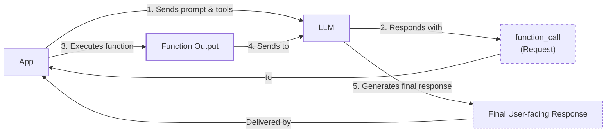
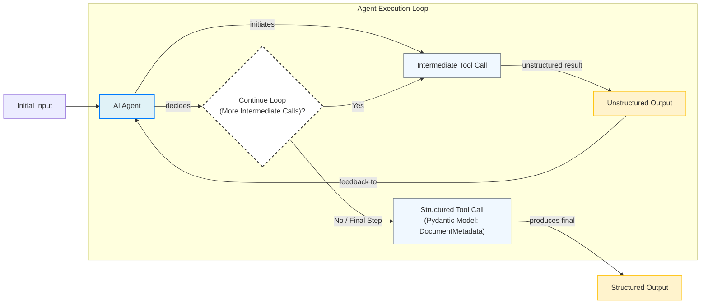
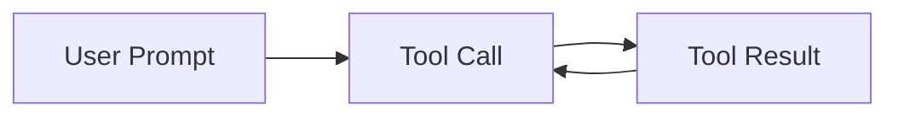

# Lesson 6: Agent Tools & Function Calling

In our previous lessons, we covered the fundamentals of AI Engineering, from understanding the agentic landscape to the importance of context engineering and structured outputs. We've seen how to build basic LLM workflows by chaining components together. Now, we will explore one of the most critical building blocks of any AI Agent: **Tools**.

Tools, also known as function calling, give LLMs the ability to take action, transforming them from text generators into agents that interact with the external world. In this lesson, we will open the black box to understand how an agent works with tools, from implementing the mechanism from scratch to using production-ready APIs.

## Understanding Why Agents Need Tools

LLMs have a fundamental limitation: they are pattern matchers and text generators. By themselves, they cannot perform actions or access real-time information. They operate on the data they were trained on, which is static and quickly becomes outdated. Tools provide this bridge.

The LLM is the brain of an agent, responsible for reasoning and decision-making. Tools are the agent's "hands and senses," allowing it to perceive and act in the world beyond its pre-trained knowledge [[1]](https://www.youtube.com/watch?v=h8gMhXYAv1k). With tools, an LLM becomes an AI agent that can execute specific instructions and interact with its environment.

This capability unlocks a wide range of applications that power modern AI agents, such as:
- Accessing real-time information via APIs (e.g., today's weather, latest news) [[2]](https://www.deeplearning.ai/the-batch/agentic-design-patterns-part-3-tool-use/).
- Interacting with external databases or other storage solutions [[3]](https://arxiv.org/html/2507.08034v1).
- Accessing the agent's long-term memory to remember information beyond its context window.
- Executing code (e.g., Python, JavaScript) for precise calculations or data manipulation [[2]](https://www.deeplearning.ai/the-batch/agentic-design-patterns-part-3-tool-use/).

## Implementing Tool Calls From Scratch

The best way to understand how tools work is to implement them from scratch. Our goal is to provide the LLM with a list of available functions and let it decide which one to use, generating the correct arguments to call it.

The high-level process of calling a tool involves five steps:

1.  **App:** Sends a prompt to the LLM, including a list of available tools and their definitions.
2.  **LLM:** Analyzes the request and responds with a `function_call`, specifying the tool to use and the arguments.
3.  **App:** Parses the `function_call` and executes the corresponding function in the application code. This execution step is where reliability is enforced. Unlike the probabilistic nature of the LLM, the tool function itself is deterministic code, allowing for security checks, data validation, or even human-in-the-loop confirmation before an action is taken [[6]](https://www.zimuel.it/blog/tool_calling_AI_agents).
4.  **App:** Sends the function's output back to the LLM as context.
5.  **LLM:** Uses the tool's output to generate a final, user-facing response.


Image 1: A flowchart illustrating the 5-step tool calling process, highlighting the request-execute-respond flow.

Let's walk through a code example where we implement this flow. We will create a simple agent that can search for documents and send summaries to a Discord channel.

1.  First, we set up our environment by initializing the Gemini client. We will use the `gemini-2.5-flash` model, which is fast and supports tool use. We also define a sample `DOCUMENT` to mock the content of a file.
    ```python
    import json
    from typing import Any
    
    from google import genai
    from google.genai import types
    from pydantic import BaseModel, Field
    
    from lessons.utils import pretty_print
    
    client = genai.Client()
    
    MODEL_ID = "gemini-2.5-flash"
    
    DOCUMENT = """
    # Q3 2023 Financial Performance Analysis
    
    The Q3 earnings report shows a 20% increase in revenue and a 15% growth in user engagement, 
    beating market expectations. These impressive results reflect our successful product strategy 
    and strong market positioning.
    
    Our core business segments demonstrated remarkable resilience, with digital services leading 
    the growth at 25% year-over-year. The expansion into new markets has proven particularly 
    successful, contributing to 30% of the total revenue increase.
    
    Customer acquisition costs decreased by 10% while retention rates improved to 92%, 
    marking our best performance to date. These metrics, combined with our healthy cash flow 
    position, provide a strong foundation for continued growth into Q4 and beyond.
    """
    ```

2.  Next, we define three mock functions to simulate our tools: `search_google_drive`, `send_discord_message`, and `summarize_financial_report`.
    ```python
    def search_google_drive(query: str) -> dict:
        """
        Searches for a file on Google Drive and returns its content or a summary.
    
        Args:
            query (str): The search query to find the file, e.g., 'Q3 earnings report'.
    
        Returns:
            dict: A dictionary representing the search results, including file names and summaries.
        """
        return {
            "files": [
                {
                    "name": "Q3_Earnings_Report_2024.pdf",
                    "id": "file12345",
                    "content": DOCUMENT,
                }
            ]
        }
    
    
    def send_discord_message(channel_id: str, message: str) -> dict:
        """
        Sends a message to a specific Discord channel.
    
        Args:
            channel_id (str): The ID of the channel to send the message to, e.g., '#finance'.
            message (str): The content of the message to send.
    
        Returns:
            dict: A dictionary confirming the action, e.g., {"status": "success"}.
        """
        return {
            "status": "success",
            "status_code": 200,
            "channel": channel_id,
            "message_preview": f"{message[:50]}...",
        }
    
    
    def summarize_financial_report(text: str) -> str:
        """
        Summarizes a financial report.
    
        Args:
            text (str): The text to summarize.
    
        Returns:
            str: The summary of the text.
        """
        return "The Q3 2023 earnings report shows strong performance across all metrics with 20% revenue growth, 15% user engagement increase, 25% digital services growth, and improved retention rates of 92%."
    ```

3.  For the LLM to use these functions, we must provide their definitions in a format it understands. This is done using a JSON schema, an industry standard for APIs from providers like OpenAI and Google [[4]](https://tetrate.io/learn/ai/llm-output-parsing-structured-generation), [[5]](https://ai.google.dev/gemini-api/docs/function-calling). The schema includes the function's name, a description of what it does, and its parameters.
    ```python
    search_google_drive_schema = {
        "name": "search_google_drive",
        "description": "Searches for a file on Google Drive and returns its content or a summary.",
        "parameters": {
            "type": "object",
            "properties": {
                "query": {
                    "type": "string",
                    "description": "The search query to find the file, e.g., 'Q3 earnings report'.",
                }
            },
            "required": ["query"],
        },
    }
    
    send_discord_message_schema = {
        "name": "send_discord_message",
        "description": "Sends a message to a specific Discord channel.",
        "parameters": {
            "type": "object",
            "properties": {
                "channel_id": {
                    "type": "string",
                    "description": "The ID of the channel to send the message to, e.g., '#finance'.",
                },
                "message": {
                    "type": "string",
                    "description": "The content of the message to send.",
                },
            },
            "required": ["channel_id", "message"],
        },
    }
    
    summarize_financial_report_schema = {
        "name": "summarize_financial_report",
        "description": "Summarizes a financial report.",
        "parameters": {
            "type": "object",
            "properties": {
                "text": {
                    "type": "string",
                    "description": "The text to summarize.",
                },
            },
            "required": ["text"],
        },
    }
    ```

4.  We then create a tool registry to map tool names to their function handlers and schemas. This makes it easy to look up and execute the correct function later.
    ```python
    TOOLS = {
        "search_google_drive": {
            "handler": search_google_drive,
            "declaration": search_google_drive_schema,
        },
        "send_discord_message": {
            "handler": send_discord_message,
            "declaration": send_discord_message_schema,
        },
        "summarize_financial_report": {
            "handler": summarize_financial_report,
            "declaration": summarize_financial_report_schema,
        },
    }
    TOOLS_BY_NAME = {tool_name: tool["handler"] for tool_name, tool in TOOLS.items()}
    TOOLS_SCHEMA = [tool["declaration"] for tool in TOOLS.values()]
    ```
    The `TOOLS_BY_NAME` mapping looks like this:
    ```json
    {'search_google_drive': <function search_google_drive at 0x...>, 
     'send_discord_message': <function send_discord_message at 0x...>, 
     'summarize_financial_report': <function summarize_financial_report at 0x...>}
    ```
    And here is an example schema from `TOOLS_SCHEMA`:
    ```json
    {
      "name": "search_google_drive",
      "description": "Searches for a file on Google Drive and returns its content or a summary.",
      "parameters": {
        "type": "object",
        "properties": {
          "query": {
            "type": "string",
            "description": "The search query to find the file, e.g., 'Q3 earnings report'."
          }
        },
        "required": [
          "query"
        ]
      }
    }
    ```

5.  Next, we define a system prompt that tells the LLM how to behave. It includes guidelines on when to use tools, the expected format for a tool call, and the list of available tools.
    ```python
    TOOL_CALLING_SYSTEM_PROMPT = """
    You are a helpful AI assistant with access to tools that enable you to take actions and retrieve information to better 
    assist users.
    
    ## Tool Usage Guidelines
    
    **When to use tools:**
    - When you need information that is not in your training data
    - When you need to perform actions in external systems and environments
    - When you need real-time, dynamic, or user-specific data
    - When computational operations are required
    
    **Tool selection:**
    - Choose the most appropriate tool based on the user's specific request
    - If multiple tools could work, select the one that most directly addresses the need
    - Consider the order of operations for multi-step tasks
    
    **Parameter requirements:**
    - Provide all required parameters with accurate values
    - Use the parameter descriptions to understand expected formats and constraints
    - Ensure data types match the tool's requirements (strings, numbers, booleans, arrays)
    
    ## Tool Call Format
    
    When you need to use a tool, output ONLY the tool call in this exact format:
    
    <tool_call>
    {{"name": "tool_name", "args": {{"param1": "value1", "param2": "value2"}}}}
    </tool_call>
    
    **Critical formatting rules:**
    - Use double quotes for all JSON strings
    - Ensure the JSON is valid and properly escaped
    - Include ALL required parameters
    - Use correct data types as specified in the tool definition
    - Do not include any additional text or explanation in the tool call
    
    ## Response Behavior
    
    - If no tools are needed, respond directly to the user with helpful information
    - If tools are needed, make the tool call first, then provide context about what you're doing
    - After receiving tool results, provide a clear, user-friendly explanation of the outcome
    - If a tool call fails, explain the issue and suggest alternatives when possible
    
    ## Available Tools
    
    <tool_definitions>
    {tools}
    </tool_definitions>
    
    Remember: Your goal is to be maximally helpful to the user. Use tools when they add value, but don't use them unnecessarily. Always prioritize accuracy and user experience.
    """
    ```

6.  Based on the `description` field in the tool schema, the LLM decides if a tool is appropriate to fulfill the user's query. This is why clear and distinct tool descriptions are critical for building successful AI agents. Vague descriptions like "search documents" can confuse the LLM, whereas specific ones like "search documents on Google Drive" provide the necessary clarity [[7]](https://www.anthropic.com/research/building-effective-agents), [[8]](https://mbrenndoerfer.com/writing/function-calling-llm-structured-tools). This becomes even more important as you scale to dozens or hundreds of tools. Once a tool is selected, the LLM generates the function name and arguments as a structured output, like JSON. This capability is enabled by instruction fine-tuning, which trains the model to interpret schemas and produce these structured tool calls [[8]](https://mbrenndoerfer.com/writing/function-calling-llm-structured-tools).

7.  Let's test this with a couple of examples. First, we ask the agent to find a report and share insights.
    ```python
    USER_PROMPT = """
    Can you help me find the latest quarterly report and share key insights with the team?
    """
    
    messages = [TOOL_CALLING_SYSTEM_PROMPT.format(tools=str(TOOLS_SCHEMA)), USER_PROMPT]
    
    response = client.models.generate_content(
        model=MODEL_ID,
        contents=messages,
    )
    ```
    The LLM correctly identifies the `search_google_drive` tool and generates the required arguments:
    ```text
    <tool_call>
    {"name": "search_google_drive", "args": {"query": "latest quarterly report"}}
    </tool_call>
    ```
    Now, for a more complex request, let's ask the agent to find the report and send a summary to Discord.
    ```python
    USER_PROMPT = """
    Please find the Q3 earnings report on Google Drive and send a summary of it to 
    the #finance channel on Discord.
    """
    
    messages = [TOOL_CALLING_SYSTEM_PROMPT.format(tools=str(TOOLS_SCHEMA)), USER_PROMPT]
    
    response = client.models.generate_content(
        model=MODEL_ID,
        contents=messages,
    )
    ```
    The LLM again identifies the `search_google_drive` tool first, as it needs to retrieve the document before it can summarize and send it.
    ```text
    <tool_call>
    {"name": "search_google_drive", "args": {"query": "Q3 earnings report"}}
    </tool_call>
    ```

8.  Now we need to parse this response and execute the function. We create a helper function to extract the JSON string, parse it into a Python dictionary, find the corresponding function handler, and call it with the arguments provided by the LLM.
    ```python
    def extract_tool_call(response_text: str) -> str:
        """
        Extracts the tool call from the response text.
        """
        return response_text.split("<tool_call>")[1].split("</tool_call>")[0].strip()
    
    
    def call_tool(response_text: str, tools_by_name: dict) -> Any:
        """
        Call a tool based on the response from the LLM.
        """
    
        tool_call_str = extract_tool_call(response_text)
        tool_call = json.loads(tool_call_str)
        tool_name = tool_call["name"]
        tool_args = tool_call["args"]
        tool = tools_by_name[tool_name]
    
        return tool(**tool_args)
    
    tool_result = call_tool(response.text, tools_by_name=TOOLS_BY_NAME)
    ```
    The `tool_result` contains the content of the financial report found on our mock Google Drive.

9.  Finally, the tool result is sent back to the LLM to formulate a response or decide on the next step.
    ```python
    response = client.models.generate_content(
        model=MODEL_ID,
        contents=f"Interpret the tool result: {json.dumps(tool_result, indent=2)}",
    )
    ```
    The LLM provides a summary based on the document content:
    ```text
    The tool result provides the content of a file named `Q3_Earnings_Report_2024.pdf`.
    
    This document is a **Q3 2023 Financial Performance Analysis** and details exceptionally strong results, significantly beating market expectations.
    
    **Key highlights from the report include:**
    
    *   **Revenue Growth:** A 20% increase in revenue.
    *   **User Engagement:** 15% growth in user engagement.
    ...
    ```
This covers the basic concept of tool calling. We've successfully built a simple tool-using agent from the ground up.

## Implementing a Tool Calling Framework From Scratch

Manually defining JSON schemas for every tool is tedious and error-prone. Production frameworks like LangGraph automate this process using decorators. Let's build a simple `@tool` decorator to automatically generate schemas from our Python functions. This approach respects the Don't Repeat Yourself (DRY) principle by deriving the schema directly from the function's signature and docstring [[9]](https://openai.github.io/openai-agents-python/tools/), [[10]](https://docs.langchain.com/oss/python/langchain/tools). This is the modern, recommended approach because it significantly reduces the risk of human error in schema definition and ensures cleaner, more readable code. Auto-generated schemas are also more likely to be compatible with function-calling models from providers like OpenAI and Anthropic [[11]](https://towardsai.net/p/machine-learning/how-tools-turn-into-agents-what-actually-happens-at-runtime).

1.  We will define a `ToolFunction` class to wrap our function and its schema, and a `@tool` decorator to perform the schema extraction.
    ```python
    from inspect import Parameter, signature
    from typing import Any, Callable, Dict, Optional
    
    
    class ToolFunction:
        def __init__(self, func: Callable, schema: Dict[str, Any]) -> None:
            self.func = func
            self.schema = schema
            self.__name__ = func.__name__
            self.__doc__ = func.__doc__
    
        def __call__(self, *args: Any, **kwargs: Any) -> Any:
            return self.func(*args, **kwargs)
    
    
    def tool(description: Optional[str] = None) -> Callable[[Callable], ToolFunction]:
        """
        A decorator that creates a tool schema from a function.
        """
    
        def decorator(func: Callable) -> ToolFunction:
            sig = signature(func)
            properties = {}
            required = []
    
            for param_name, param in sig.parameters.items():
                if param_name == "self":
                    continue
    
                param_schema = {
                    "type": "string",
                    "description": f"The {param_name} parameter",
                }
    
                if param.default == Parameter.empty:
                    required.append(param_name)
    
                properties[param_name] = param_schema
    
            schema = {
                "name": func.__name__,
                "description": description or func.__doc__ or f"Executes the {func.__name__} function.",
                "parameters": {
                    "type": "object",
                    "properties": properties,
                    "required": required,
                },
            }
    
            return ToolFunction(func, schema)
    
        return decorator
    ```

2.  Now, we can redefine our tools by simply applying the `@tool` decorator.
    ```python
    @tool()
    def search_google_drive_example(query: str) -> dict:
        """Search for files in Google Drive."""
        return {"files": ["Q3 earnings report"]}
    
    
    @tool()
    def send_discord_message_example(channel_id: str, message: str) -> dict:
        """Send a message to a Discord channel."""
        return {"message": "Message sent successfully"}
    
    
    @tool()
    def summarize_financial_report_example(text: str) -> str:
        """Summarize the contents of a financial report."""
        return "Financial report summarized successfully"
    
    
    tools = [
        search_google_drive_example,
        send_discord_message_example,
        summarize_financial_report_example,
    ]
    tools_by_name = {tool.schema["name"]: tool.func for tool in tools}
    tools_schema = [tool.schema for tool in tools]
    ```

3.  The decorated function is now a `ToolFunction` object, which wraps our original function and its schema. Let's inspect it.
    ```python
    type(search_google_drive_example)
    ```
    It outputs:
    ```text
    __main__.ToolFunction
    ```
    This object contains the auto-generated schema:
    ```python
    pretty_print.wrapped(json.dumps(search_google_drive_example.schema, indent=2), title="Search Google Drive Example")
    ```
    It outputs:
    ```json
    {
      "name": "search_google_drive_example",
      "description": "Search for files in Google Drive.",
      "parameters": {
        "type": "object",
        "properties": {
          "query": {
            "type": "string",
            "description": "The query parameter"
          }
        },
        "required": [
          "query"
        ]
      }
    }
    ```
    And it still holds a reference to the original callable function.
    ```python
    search_google_drive_example.func
    ```
    It outputs:
    ```text
    <function __main__.search_google_drive_example(query: str) -> dict>
    ```

4.  We can now use this automatically generated schema to call the LLM, just as we did before.
    ```python
    USER_PROMPT = """
    Please find the Q3 earnings report on Google Drive and send a summary of it to 
    the #finance channel on Discord.
    """
    
    messages = [TOOL_CALLING_SYSTEM_PROMPT.format(tools=str(tools_schema)), USER_PROMPT]
    
    response = client.models.generate_content(
        model=MODEL_ID,
        contents=messages,
    )
    ```
    It outputs:
    ```text
    <tool_call>
    {"name": "search_google_drive_example", "args": {"query": "Q3 earnings report"}}
    </tool_call>
    ```
    Voilà! We have a small, reusable tool-calling framework. While decorators are ideal for most cases, for more complex tools that might involve multiple related methods or require internal state, some frameworks allow you to subclass a base `Tool` class. This gives you more control than a simple function decorator can provide [[12]](https://huggingface.co/docs/smolagents/tutorials/tools).

## Implementing Production-Level Tool Calls with Gemini

While building from scratch is insightful, production systems leverage the native tool-calling capabilities of APIs like Gemini or OpenAI. These APIs handle the complex prompt engineering internally, ensuring optimal performance for their specific models [[13]](https://www.decodingai.com/p/tool-calling-from-scratch-to-production).

Let's see how to use Gemini's native API. Instead of a large system prompt, we provide our tools in a `GenerateContentConfig` object.

1.  First, we define our tools and configuration using the schemas we created earlier.
    ```python
    tools = [
        types.Tool(
            function_declarations=[
                types.FunctionDeclaration(**search_google_drive_schema),
                types.FunctionDeclaration(**send_discord_message_schema),
            ]
        )
    ]
    config = types.GenerateContentConfig(
        tools=tools,
        tool_config=types.ToolConfig(function_calling_config=types.FunctionCallingConfig(mode="ANY")),
    )
    ```

2.  We can now call the model with a simple user prompt, and the API handles the tool-use instructions.
    ```python
    USER_PROMPT = """
    Please find the Q3 earnings report on Google Drive and send a summary of it to 
    the #finance channel on Discord.
    """
    response = client.models.generate_content(
        model=MODEL_ID,
        contents=USER_PROMPT,
        config=config,
    )
    function_call = response.candidates[0].content.parts[0].function_call
    ```
    The `function_call` object contains the tool name and arguments.

3.  We can then manually execute the function by looking up the handler and passing the arguments.
    ```python
    tool_handler = TOOLS_BY_NAME[function_call.name]
    tool_result = tool_handler(**function_call.args)
    ```
    This gives us the expected output from our `search_google_drive` function.

4.  To simplify this, we can use our `call_tool` helper function.
    ```python
    def call_tool(function_call) -> Any:
        tool_name = function_call.name
        tool_args = function_call.args
        tool_handler = TOOLS_BY_NAME[tool_name]
        return tool_handler(**tool_args)
    
    tool_result = call_tool(function_call)
    ```

5.  To make it even simpler, the `google-genai` SDK can generate the schema automatically from Python functions. We can pass the functions directly to the `GenerateContentConfig`.
    ```python
    config = types.GenerateContentConfig(
        tools=[search_google_drive, send_discord_message, summarize_financial_report]
    )
    ```
    By leveraging the native SDK, we reduced dozens of lines of code to just a few, creating a more robust and maintainable system. Other popular APIs from OpenAI and Anthropic follow a similar logic, making these concepts easily transferable [[14]](https://apxml.com/courses/prompt-engineering-llm-application-development/chapter-4-interacting-with-llm-apis/overview-common-llm-apis), [[15]](https://futuresearch.ai/blog/llm-provider-quirks/).

## Using Pydantic Models as Tools for On-Demand Structured Outputs

Connecting this lesson with what we learned about structured outputs in Lesson 4, we can use a Pydantic model as a tool. This is a powerful pattern for agentic workflows where you need to perform several intermediate steps before producing a final, structured answer [[16]](https://pydantic.dev/docs/ai/core-concepts/output/). The agent can use tools for reasoning and data gathering, and then, when it has all the information, call the Pydantic "tool" to format the final output.


Image 2: Diagram illustrating an AI agent in a loop calling multiple tools, with a final structured output step.

Let's see how to implement this.

1.  First, we define our `DocumentMetadata` Pydantic model.
    ```python
    class DocumentMetadata(BaseModel):
        """A class to hold structured metadata for a document."""
    
        summary: str = Field(description="A concise, 1-2 sentence summary of the document.")
        tags: list[str] = Field(description="A list of 3-5 high-level tags relevant to the document.")
        keywords: list[str] = Field(description="A list of specific keywords or concepts mentioned.")
        quarter: str = Field(description="The quarter of the financial year described in the document (e.g., Q3 2023).")
        growth_rate: str = Field(description="The growth rate of the company described in the document (e.g., 10%).")
    ```

2.  We register this model as a tool by creating a `FunctionDeclaration` whose parameters are defined by the model's JSON schema.
    ```python
    extraction_tool = types.Tool(
        function_declarations=[
            types.FunctionDeclaration(
                name="extract_metadata",
                description="Extracts structured metadata from a financial document.",
                parameters=DocumentMetadata.model_json_schema(),
            )
        ]
    )
    config = types.GenerateContentConfig(
        tools=[extraction_tool],
        tool_config=types.ToolConfig(function_calling_config=types.FunctionCallingConfig(mode="ANY")),
    )
    ```

3.  When we prompt the LLM to analyze a document, it will now call our `extract_metadata` tool, and its arguments will conform to the `DocumentMetadata` schema.
    ```python
    prompt = f"""
    Please analyze the following document and extract its metadata.
    
    Document:
    --- 
    {DOCUMENT}
    --- 
    """
    
    response = client.models.generate_content(model=MODEL_ID, contents=prompt, config=config)
    function_call = response.candidates[0].content.parts[0].function_call
    
    document_metadata = DocumentMetadata(**function_call.args)
    ```
    This gives us a validated Pydantic object, ensuring the final output is reliable and easy to use in downstream application logic.

## The Downsides of Running Tools in a Loop

So far, we have focused on single tool calls. A natural next step is to run tools in a loop, allowing an agent to perform multi-step tasks by chaining multiple tool calls. The LLM can decide which tool to use at each step based on the results of previous ones. This is the final piece needed to build a real AI agent [[17]](https://blogs.oracle.com/developers/what-is-the-ai-agent-loop-the-core-architecture-behind-autonomous-ai-systems).


Image 3: A flowchart illustrating a sequential tool calling loop.

Let's implement a loop where an agent finds a report and sends a summary to Discord.

1.  We configure our tools and prompt the model with a multi-step task.
    ```python
    tools = [
        types.Tool(
            function_declarations=[
                types.FunctionDeclaration(**search_google_drive_schema),
                types.FunctionDeclaration(**send_discord_message_schema),
                types.FunctionDeclaration(**summarize_financial_report_schema),
            ]
        )
    ]
    config = types.GenerateContentConfig(
        tools=tools,
        tool_config=types.ToolConfig(function_calling_config=types.FunctionCallingConfig(mode="ANY")),
    )
    
    USER_PROMPT = """
    Please find the Q3 earnings report on Google Drive and send a summary of it to 
    the #finance channel on Discord.
    """
    messages = [USER_PROMPT]
    ```

2.  We create a loop that continues as long as the model requests a function call. In each iteration, we execute the tool, add the result to our message history, and call the model again.
    ```python
    response = client.models.generate_content(
        model=MODEL_ID,
        contents=messages,
        config=config,
    )
    response_message_part = response.candidates[0].content.parts[0]
    messages.append(response.candidates[0].content)
    
    max_iterations = 3
    while hasattr(response_message_part, "function_call") and max_iterations > 0:
        tool_result = call_tool(response_message_part.function_call)
    
        function_response_part = types.Part.from_function_response(
            name=response_message_part.function_call.name,
            response={"result": tool_result},
        )
        messages.append(function_response_part)
    
        response = client.models.generate_content(
            model=MODEL_ID,
            contents=messages,
            config=config,
        )
    
        response_message_part = response.candidates[0].content.parts[0]
        messages.append(response.candidates[0].content)
        max_iterations -= 1
    ```
    The agent successfully sequences the tool calls: `search_google_drive` -> `summarize_financial_report` -> `send_discord_message`.

However, this simple loop has significant limitations. It assumes a tool should be called at every step and gives the LLM no opportunity to reason about the results before acting again [[18]](https://myengineeringpath.dev/genai-engineer/agentic-patterns/). The agent immediately moves to the next function call without pausing to think about what it learned or whether it should change its strategy. This can lead to inefficient tool use or getting stuck in loops. This mirrors challenges in robotics, where production systems require robust infrastructure for error handling, retries, and execution tracing to manage complex, iterative tasks—features often absent in simple agent loops [[19]](https://arxiv.org/pdf/2601.20334).

To reduce latency, independent tool calls can be executed in parallel. In a sequential loop, the total time is the sum of all individual call times. In parallel, the total time is determined by the slowest single call, which can lead to significant speedups [[20]](https://www.codeant.ai/blogs/parallel-tool-calling). For this to work safely, the agent must distinguish between read-only tools (like search or read_file) that can be parallelized, and state-modifying tools (like write_file) that must be serialized to prevent race conditions [[21]](https://agentic-patterns.com/patterns/parallel-tool-call-learning/). These limitations motivated the development of patterns like **ReAct** (Reason+Act), which we will explore in detail in Lessons 7 and 8.

## Popular Tools Used Within the Industry

To ground this in the real world, here are some of the most common tool categories used by AI engineers today:

1.  **Knowledge & Memory Access:** These tools connect agents to external knowledge, from querying vector databases for RAG to using text-to-SQL for interacting with traditional databases like PostgreSQL [[22]](https://promethium.ai/guides/text-to-sql-basics-benefits/). They are foundational for knowledge-aware agents, which we cover in Lessons 9 and 10.
2.  **Web Search & Browsing:** Tools that interface with search APIs (Google, Bing, Brave) or scrape web content are essential for research agents and chatbots that need access to up-to-date information [[23]](https://mantraideas.com/llm-web-search/).
3.  **Code Execution:** A Python interpreter tool allows an agent to write and run code. This is invaluable for data analysis, calculations, and visualization tasks. However, it also introduces security risks, which is why code is always executed in a sandboxed environment to prevent unintended side effects [[24]](https://medium.com/@anicomanesh/how-llm-reasoning-powers-the-agentic-ai-revolution-cbefd10ebf3f).
4.  **Other Popular Tools:**
    - Interacting with external APIs (e.g., calendar, email, project management) is common in enterprise AI applications [[25]](https://lnu.diva-portal.org/smash/get/diva2:1801354/FULLTEXT01.pdf).
    - File system operations (read/write files, list directories) are present in productivity AI apps that interact with our OS.
    - Human-in-the-loop tools allow the agent to request human feedback, approval, or clarification. This is crucial for high-stakes tasks where full autonomy is too risky [[6]](https://www.zimuel.it/blog/tool_calling_AI_agents).

The rise of agentic systems is also reshaping API design. The variable nature of LLM-driven tools is making features like streaming mandatory, a shift from traditional REST APIs [[26]](https://www.linkedin.com/posts/sraocti_the-llm-api-challenge-and-opportunity-activity-7350301497047339008-iaiy).

## Conclusion

Tool calling is a core AI engineering concept, allowing agents to take meaningful action. Understanding how to define, implement, and orchestrate tools is essential for building, monitoring, and debugging any AI application.

In our next lesson, we will build on this foundation by exploring the theory behind planning and the ReAct pattern, which adds a crucial reasoning step to the agentic loop.

## References

- [1] What is Tool Calling? Connecting LLMs to Your Data. (2024, May 15). YouTube. https://www.youtube.com/watch?v=h8gMhXYAv1k
- [2] Agentic Design Patterns Part 3, Tool Use. (n.d.). DeepLearning.AI. https://www.deeplearning.ai/the-batch/agentic-design-patterns-part-3-tool-use/
- [3] To, B., et al. (2025). Integrating Large Language Models with External Tools. arXiv. https://arxiv.org/html/2507.08034v1
- [4] LLM Output Parsing and Structured Generation. (n.d.). Tetrate. https://tetrate.io/learn/ai/llm-output-parsing-structured-generation
- [5] Function calling with the Gemini API. (n.d.). Google AI for Developers. https://ai.google.dev/gemini-api/docs/function-calling
- [6] Tool Calling for AI agents. (2024, June 3). Zimuel. https://www.zimuel.it/blog/tool_calling_AI_agents
- [7] Building Effective Agents. (2024, July 23). Anthropic. https://www.anthropic.com/research/building-effective-agents
- [8] Brenndoerfer, M. (2024, March 11). Function Calling & Other LLM Tools for Structured Output. mb-universe. https://mbrenndoerfer.com/writing/function-calling-llm-structured-tools
- [9] Tools. (n.d.). OpenAI Agents SDK. https://openai.github.io/openai-agents-python/tools/
- [10] Tools. (n.d.). LangChain. https://docs.langchain.com/oss/python/langchain/tools
- [11] How Tools turn into Agents: What Actually Happens at Runtime. (2024, July 27). Towards AI. https://towardsai.net/p/machine-learning/how-tools-turn-into-agents-what-actually-happens-at-runtime
- [12] Tools. (n.d.). Hugging Face. https://huggingface.co/docs/smolagents/tutorials/tools
- [13] Tool Calling: From Scratch to Production. (n.d.). Decoding AI. https://www.decodingai.com/p/tool-calling-from-scratch-to-production
- [14] Overview of Common LLM APIs (OpenAI, Anthropic, etc.). (n.d.). APXML. https://apxml.com/courses/prompt-engineering-llm-application-development/chapter-4-interacting-with-llm-apis/overview-common-llm-apis
- [15] LLM API Differences That Break Your Code: Anthropic vs OpenAI vs Google. (n.d.). FutureSearch. https://futuresearch.ai/blog/llm-provider-quirks/
- [16] Output. (n.d.). Pydantic. https://pydantic.dev/docs/ai/core-concepts/output/
- [17] What Is the AI Agent Loop? The Core Architecture Behind Autonomous AI Systems. (2026, March 16). Oracle Blogs. https://blogs.oracle.com/developers/what-is-the-ai-agent-loop-the-core-architecture-behind-autonomous-ai-systems
- [18] Agentic Design Patterns — Visual Architecture Guide. (n.d.). My Engineering Path. https://myengineeringpath.dev/genai-engineer/agentic-patterns/
- [19] Bajaj, P., et al. (2026). What You See is What You Get: A Vision of Foundation Models for Embodied AI. arXiv. https://arxiv.org/pdf/2601.20334
- [20] Parallel Tool Calling in LLMs: The Secret to Faster, Smarter Agents. (2024, July 23). CodeAnt AI. https://www.codeant.ai/blogs/parallel-tool-calling
- [21] Parallel Tool Call Learning. (n.d.). Agentic Patterns. https://agentic-patterns.com/patterns/parallel-tool-call-learning/
- [22] Text-to-SQL: What It Is, How It Works, and Why It Matters in 2025. (2025, November 13). Promethium. https://promethium.ai/guides/text-to-sql-basics-benefits/
- [23] The Ultimate Guide to LLM Web Search in 2025. (2025, May 22). Mantra Ideas. https://mantraideas.com/llm-web-search/
- [24] Manesh, A. (2024, May 28). How LLM Reasoning Powers the Agentic AI Revolution. Medium. https://medium.com/@anicomanesh/how-llm-reasoning-powers-the-agentic-ai-revolution-cbefd10ebf3f
- [25] Fager, A., & Broo, H. (2023). A study on how Large Language Models can be used in the context of Enterprise Systems. DiVA. https://lnu.diva-portal.org/smash/get/diva2:1801354/FULLTEXT01.pdf
- [26] Rao, S. (2024, July 24). The LLM API Challenge (and Opportunity). LinkedIn. https://www.linkedin.com/posts/sraocti_the-llm-api-challenge-and-opportunity-activity-7350301497047339008-iaiy