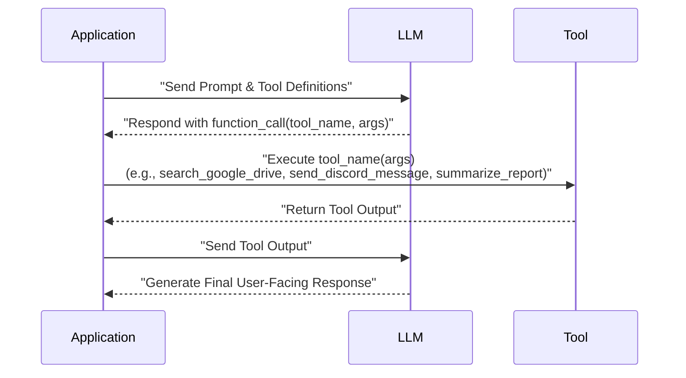
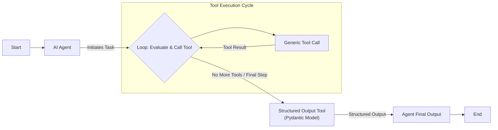
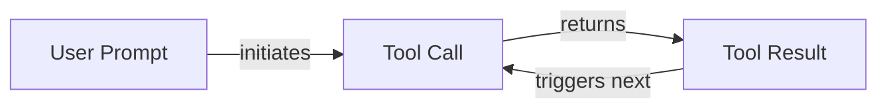

# Lesson 6: Agent Tools & Function Calling

In previous lessons, we learned to manage information flow *to* an LLM and get reliable data *from* it. Now, we will explore a critical building block of any AI Agent: giving it the ability to take action. This capability is the stepping stone that transforms a reactive text generator into a proactive agent that can autonomously execute complex tasks [[23]](https://fireworks.ai/blog/function-calling).

This lesson explores **Tools**, also known as **Function Calling**. This is the mechanism that transforms an LLM from a passive text generator into an active agent that can interact with the external world. We will open the black box by implementing tool calling from scratch to understand how an agent decides which action to take, generates the correct parameters, and executes it.

## Understanding Why Agents Need Tools

LLMs have a fundamental limitation: they are pattern matchers whose knowledge is frozen at the time of training. By themselves, they cannot interact with the outside world or access real-time information, which can lead to factual inaccuracies or "hallucinations" [[24]](https://www.digital-alpha.com/a-deep-dive-into-function-calling-with-llms/). They are like a brain in a jar, capable of reasoning but unable to act. This is where tools come in.

Tools are the "hands and senses" of an LLM, allowing it to perceive and act in the world beyond its training data [[1]](https://www.youtube.com/watch?v=h8gMhXYAv1k). They are the bridge between the model's internal reasoning and the external environment. With tools, an LLM becomes an AI agent that can execute instructions and interact with other systems.

Popular tools that power modern AI agents include:
*   Accessing real-time information through APIs (e.g., weather, news) [[2]](https://arxiv.org/html/2507.08034v1).
*   Interacting with external databases or data warehouses [[3]](https://promethium.ai/guides/text-to-sql-basics-benefits/).
*   Accessing the agent's long-term memory to recall information beyond its context window [[4]](https://neo4j.com/blog/agentic-ai/connected-context-and-persistent-memory-neo4j-providers-for-the-microsoft-agent-framework/).
*   Executing code for precise calculations or data manipulation [[5]](https://medium.com/@anicomanesh/how-llm-reasoning-powers-the-agentic-ai-revolution-cbefd10ebf3f).

## Implementing Tool Calls from Scratch

The best way to understand how tools work is to build the mechanism from scratch. Our goal is to provide the LLM with a list of available tools and let it decide which one to use, generating the correct arguments needed to call the function. The high-level process looks like this:

1.  **Application:** You send the LLM a prompt and a list of available tool definitions.
2.  **LLM:** It responds with a `function_call` request, specifying the tool's name and arguments.
3.  **Application:** You execute the requested function in your code.
4.  **Application:** You send the function's output back to the LLM.
5.  **LLM:** It uses the tool's output to generate a final, user-facing response [[6]](https://www.philschmid.de/gemini-function-calling).


Image 1: A sequence diagram illustrating the 5-step request-execute-respond flow of calling a tool.

Let's implement a simple example where we mock searching for a document on Google Drive and sending its summary to a Discord channel.

<aside>
💡

You can find the code for this lesson in the accompanying [Jupyter Notebook](https://github.com/towardsai/course-ai-agents/blob/dev/lessons/06_tools/notebook.ipynb) in the course repository.

</aside>

1.  First, we set up our environment by initializing the Gemini client. We will use `gemini-2.5-flash` for its speed and cost-effectiveness. We also define a `DOCUMENT` constant to mock the content of a file.
    ```python
    import json
    from typing import Any
    
    from google import genai
    from google.genai import types
    from pydantic import BaseModel, Field
    
    from lessons.utils import env
    
    env.load(required_env_vars=["GOOGLE_API_KEY"])
    
    client = genai.Client()
    
    MODEL_ID = "gemini-2.5-flash"
    
    DOCUMENT = """
    # Q3 2023 Financial Performance Analysis
    
    The Q3 earnings report shows a 20% increase in revenue and a 15% growth in user engagement, 
    beating market expectations. These impressive results reflect our successful product strategy 
    and strong market positioning.
    
    Our core business segments demonstrated remarkable resilience, with digital services leading 
    the growth at 25% year-over-year. The expansion into new markets has proven particularly 
    successful, contributing to 30% of the total revenue increase.
    
    Customer acquisition costs decreased by 10% while retention rates improved to 92%, 
    marking our best performance to date. These metrics, combined with our healthy cash flow 
    position, provide a strong foundation for continued growth into Q4 and beyond.
    """
    ```

2.  Next, we define three mock functions. The function signatures and docstrings are essential, as the LLM uses them to understand what each tool does.
    ```python
    def search_google_drive(query: str) -> dict:
        """
        Searches for a file on Google Drive and returns its content or a summary.
    
        Args:
            query (str): The search query to find the file, e.g., 'Q3 earnings report'.
    
        Returns:
            dict: A dictionary representing the search results, including file names and summaries.
        """
        return {
            "files": [
                {
                    "name": "Q3_Earnings_Report_2024.pdf",
                    "id": "file12345",
                    "content": DOCUMENT,
                }
            ]
        }
    ```
    ```python
    def send_discord_message(channel_id: str, message: str) -> dict:
        """
        Sends a message to a specific Discord channel.
    
        Args:
            channel_id (str): The ID of the channel to send the message to, e.g., '#finance'.
            message (str): The content of the message to send.
    
        Returns:
            dict: A dictionary confirming the action, e.g., {"status": "success"}.
        """
        return {
            "status": "success",
            "status_code": 200,
            "channel": channel_id,
            "message_preview": f"{message[:50]}...",
        }
    ```
    ```python
    def summarize_financial_report(text: str) -> str:
        """
        Summarizes a financial report.
    
        Args:
            text (str): The text to summarize.
    
        Returns:
            str: The summary of the text.
        """
        return "The Q3 2023 earnings report shows strong performance across all metrics..."
    ```

3.  For each function, we create a JSON schema. This schema tells the LLM what the tool does (via `description`) and how to call it (via `parameters`). This format is an industry standard used by major providers like OpenAI and Google [[7]](https://platform.openai.com/docs/guides/function-calling), [[8]](https://ai.google.dev/gemini-api/docs/function-calling).
    ```python
    search_google_drive_schema = {
        "name": "search_google_drive",
        "description": "Searches for a file on Google Drive and returns its content or a summary.",
        "parameters": {
            "type": "object",
            "properties": {
                "query": {
                    "type": "string",
                    "description": "The search query to find the file, e.g., 'Q3 earnings report'.",
                }
            },
            "required": ["query"],
        },
    }
    ```

4.  We then aggregate our tools and their schemas into registries for easy access.
    ```python
    TOOLS_BY_NAME = {
        "search_google_drive": search_google_drive,
        "send_discord_message": send_discord_message,
        "summarize_financial_report": summarize_financial_report
    }
    TOOLS_SCHEMA = [search_google_drive_schema, send_discord_message_schema, summarize_financial_report_schema]
    ```

5.  Now, we create a system prompt that instructs the LLM on how to use these tools. It includes guidelines, the required output format, and the list of available tool schemas, often wrapped in XML tags for clarity.
    ```python
    TOOL_CALLING_SYSTEM_PROMPT = """
    You are a helpful AI assistant with access to tools...
    
    ## Tool Call Format
    When you need to use a tool, output ONLY the tool call in this exact format:
    <tool_call>
    {{"name": "tool_name", "args": {{"param1": "value1", "param2": "value2"}}}}
    </tool_call>
    
    ## Available Tools
    <tool_definitions>
    {tools}
    </tool_definitions>
    """
    ```

6.  Based on the `description` field in the schema, the LLM *decides* if a tool is appropriate for the user's query. This is why clear and distinct tool descriptions are vital. This aligns with a core design principle for tools: each tool should follow the Single Responsibility Principle, handling one specific task well [[25]](https://medium.com/@zhihao.zhou.bupt/the-smart-principles-designing-interfaces-that-llms-understand-aca00630c8c9). Multi-purpose "god tools" with complex parameters tend to confuse the model, making selection harder [[26]](https://apxml.com/courses/building-advanced-llm-agent-tools/chapter-1-llm-agent-tooling-foundations/designing-tool-interfaces). Vague descriptions like "search documents" versus explicit ones like "search documents on Google Drive" also prevent ambiguity [[9]](https://www.anthropic.com/research/building-effective-agents), [[10]](https://pub.towardsai.net/tool-descriptions-are-critical-making-better-llm-tools-research-capability-b315851471e7).

7.  These design principles become critical as you scale to dozens or even hundreds of tools per agent. As the number of available tools grows, an LLM's ability to select the correct one degrades, sometimes falling off an "accuracy cliff" once a certain threshold is passed [[27]](https://arxiv.org/html/2509.21199v3). The sheer number of choices increases the computational complexity and can strain the model's context window [[28]](https://aclanthology.org/2025.findings-acl.811.pdf). Once a tool is selected, the LLM *generates* the function name and arguments as a structured JSON output. This capability is enabled by instruction fine-tuning, where models are specifically trained to interpret schemas and produce valid tool calls [[11]](https://arxiv.org/pdf/2401.17464v3).

8.  Let's test it. We send a user prompt along with our system prompt to the model.
    ```python
    USER_PROMPT = """
    Please find the Q3 earnings report on Google Drive and send a summary of it to 
    the #finance channel on Discord.
    """
    
    messages = [TOOL_CALLING_SYSTEM_PROMPT.format(tools=str(TOOLS_SCHEMA)), USER_PROMPT]
    
    response = client.models.generate_content(
        model=MODEL_ID,
        contents=messages,
    )
    ```
    The LLM correctly identifies the `search_google_drive` tool and generates the required arguments:
    ```text
    <tool_call>
    {"name": "search_google_drive", "args": {"query": "Q3 earnings report"}}
    </tool_call>
    ```

9.  Finally, we need to parse this response and execute the function. We create a helper function `call_tool` that extracts the tool name and arguments, finds the corresponding Python function in our `TOOLS_BY_NAME` registry, and executes it.
    ```python
    def call_tool(response_text: str, tools_by_name: dict) -> Any:
        """
        Call a tool based on the response from the LLM.
        """
        tool_call_str = response_text.split("<tool_call>")[1].split("</tool_call>")[0].strip()
        tool_call = json.loads(tool_call_str)
        tool_name = tool_call["name"]
        tool_args = tool_call["args"]
        tool = tools_by_name[tool_name]
    
        return tool(**tool_args)
    
    tool_result = call_tool(response.text, tools_by_name=TOOLS_BY_NAME)
    ```
    The `tool_result` is then sent back to the LLM, which uses it to formulate a final response or decide on the next step. This completes the basic tool-calling loop.

## Implementing a Tool Calling Framework from Scratch

Manually defining a JSON schema for every function is tedious, error-prone, and violates the Don't Repeat Yourself (DRY) software principle [[12]](https://openai.github.io/openai-agents-python/tools/), [[13]](https://pydantic.dev/docs/ai/tools-toolsets/tools/). If the function's signature changes, you must remember to update the schema, creating a maintenance burden. Production frameworks like LangGraph solve this by using decorators to automatically generate schemas from function signatures and docstrings, keeping the function as the single source of truth [[1]](https://www.youtube.com/watch?v=h8gMhXYAv1k).

Let's build a simple `@tool` decorator to create our own mini-framework.

1.  First, we define a `ToolFunction` class. This class acts as a container, bundling the executable function (`.func`) with its machine-readable description (`.schema`). This turns a standard Python function into a self-contained, portable "tool". Then, we create the `@tool` decorator, which inspects a function's signature and docstring using Python's `inspect` module to build the schema automatically.
    ```python
    from inspect import Parameter, signature
    from typing import Any, Callable, Dict, Optional
    
    
    class ToolFunction:
        def __init__(self, func: Callable, schema: Dict[str, Any]) -> None:
            self.func = func
            self.schema = schema
            self.__name__ = func.__name__
            self.__doc__ = func.__doc__
    
        def __call__(self, *args: Any, **kwargs: Any) -> Any:
            return self.func(*args, **kwargs)
    
    
    def tool(description: Optional[str] = None) -> Callable[[Callable], ToolFunction]:
        """
        A decorator that creates a tool schema from a function.
        """
    
        def decorator(func: Callable) -> ToolFunction:
            sig = signature(func)
            properties = {}
            required = []
    
            for param_name, param in sig.parameters.items():
                if param.default == Parameter.empty:
                    required.append(param_name)
                properties[param_name] = {"type": "string", "description": f"The {param_name} parameter"}
    
            schema = {
                "name": func.__name__,
                "description": description or func.__doc__,
                "parameters": {"type": "object", "properties": properties, "required": required},
            }
    
            return ToolFunction(func, schema)
    
        return decorator
    ```

2.  Now, we can decorate our functions directly. The decorator wraps each function in a `ToolFunction` object, which holds both the callable function and its schema. We can inspect the object to see the generated schema and the original function handler.
    ```python
    @tool()
    def search_google_drive_example(query: str) -> dict:
        """Search for files in Google Drive."""
        return {"files": ["Q3 earnings report"]}
    
    tools = [search_google_drive_example, ...]
    tools_by_name = {tool.schema["name"]: tool.func for tool in tools}
    tools_schema = [tool.schema for tool in tools]
    ```

3.  We can now use `tools_schema` with our `TOOL_CALLING_SYSTEM_PROMPT` as before. The LLM receives the auto-generated schemas and makes tool calls, which we execute using `tools_by_name`. This implementation is conceptually similar to what frameworks like LangChain do internally [[14]](https://docs.langchain.com/oss/python/langchain/tools).

## Implementing Production-Level Tool Calls with Gemini

While building from scratch is a good learning exercise, production systems should use the native tool-calling features of APIs like Gemini. This is more robust, as the provider optimizes the underlying prompting and logic for their specific models [[15]](https://www.newsletter.swirlai.com/p/building-ai-agents-from-scratch-part).

Let's see how to achieve the same result with Gemini's native SDK.

1.  Instead of crafting a large system prompt, we pass our tool schemas directly to a `GenerateContentConfig` object. This configuration bypasses the need for a custom system prompt because the tool definitions are passed directly in the API call. The provider then uses its own optimized, internal prompt to instruct the model.
    ```python
    from google.genai import types
    
    tools = [
        types.Tool(
            function_declarations=[
                types.FunctionDeclaration(**search_google_drive_schema),
                types.FunctionDeclaration(**send_discord_message_schema),
            ]
        )
    ]
    config = types.GenerateContentConfig(
        tools=tools,
        tool_config=types.ToolConfig(function_calling_config=types.FunctionCallingConfig(mode="ANY")),
    )
    
    response = client.models.generate_content(
        model=MODEL_ID,
        contents=USER_PROMPT,
        config=config,
    )
    function_call = response.candidates[0].content.parts[0].function_call
    ```

2.  The `google-genai` SDK simplifies this even further by accepting Python functions directly, automatically generating the schema from type hints and docstrings. This reduces dozens of lines of code to just a few.
    ```python
    from google.genai import types
    
    # Pass the functions directly
    config = types.GenerateContentConfig(
        tools=[search_google_drive, send_discord_message, summarize_financial_report]
    )
    
    response = client.models.generate_content(
        model=MODEL_ID,
        contents=USER_PROMPT,
        config=config,
    )
    function_call = response.candidates[0].content.parts[0].function_call
    ```

3.  The returned `function_call` object contains the `name` of the tool to execute and its `args`. We can then create a simplified `call_tool` function to execute it.
    ```python
    def call_tool(function_call) -> any:
        tool_name = function_call.name
        tool_args = {key: value for key, value in function_call.args.items()}
        tool_handler = TOOLS_BY_NAME[tool_name]
        return tool_handler(**tool_args)
    
    tool_result = call_tool(function_call)
    ```
    While object names and configuration parameters might differ slightly, the core logic of defining a schema, passing it to the model, receiving a structured call, and executing it is a consistent pattern across all major LLM providers like OpenAI and Anthropic [[16]](https://apxml.com/courses/prompt-engineering-llm-application-development/chapter-4-interacting-with-llm-apis/overview-common-llm-apis), [[17]](https://myengineeringpath.dev/tools/gemini-guide/).

## Using Pydantic Models as Tools for On-Demand Structured Outputs

Connecting this lesson with what we learned about structured outputs in Lesson 4, we can treat a Pydantic model as a tool. This is a powerful pattern in agentic workflows where you perform several intermediate steps and then dynamically decide to generate a final, structured answer [[18]](https://discuss.ai.google.dev/t/response-schema-from-pydantic/50028).

This approach allows the agent to reason freely during intermediate steps and then "call" the Pydantic tool only when it's ready to produce a validated, machine-readable output for downstream systems.


Image 2: A flowchart illustrating an AI agent that calls multiple tools in a loop, with the final tool call being for structured outputs using a Pydantic model.

1.  We define our `DocumentMetadata` Pydantic model and create a tool declaration from its JSON schema.
    ```python
    class DocumentMetadata(BaseModel):
        """A class to hold structured metadata for a document."""
        summary: str = Field(description="A concise, 1-2 sentence summary of the document.")
        tags: list[str] = Field(description="A list of 3-5 high-level tags relevant to the document.")
        # ... other fields
    
    extraction_tool = types.Tool(
        function_declarations=[
            types.FunctionDeclaration(
                name="extract_metadata",
                description="Extracts structured metadata from a financial document.",
                parameters=DocumentMetadata.model_json_schema(),
            )
        ]
    )
    config = types.GenerateContentConfig(tools=[extraction_tool], ...)
    ```

2.  When we prompt the model to analyze a document, it will now generate a call to our `extract_metadata` tool.
    ```python
    prompt = f"Please analyze the following document and extract its metadata.\n\nDocument:\n---\n{DOCUMENT}\n---"
    response = client.models.generate_content(model=MODEL_ID, contents=prompt, config=config)
    
    function_call = response.candidates[0].content.parts[0].function_call
    document_metadata = DocumentMetadata(**function_call.args)
    ```
    The arguments from the function call are then used to instantiate a validated `DocumentMetadata` object, bridging the gap between the LLM's output and our application's data model.

## The Downsides of Running Tools in a Loop

So far, we have focused on single tool calls. A natural progression is to run tools in a loop, allowing an agent to chain multiple actions together. At each step, the LLM can decide which tool to use based on the output of previous tools. This is the final piece we need to build a real AI agent.


Image 3: A flowchart illustrating a sequential tool calling loop.

Let's implement a loop where the agent first searches for a report, then summarizes it, and finally sends the summary to Discord.

1.  We set up a loop that continues as long as the model requests a tool call.
    ```python
    USER_PROMPT = """
    Please find the Q3 earnings report on Google Drive and send a summary of it to 
    the #finance channel on Discord.
    """
    messages = [USER_PROMPT]
    response = client.models.generate_content(model=MODEL_ID, contents=messages, config=config)
    response_message_part = response.candidates[0].content.parts[0]
    
    max_iterations = 3
    while hasattr(response_message_part, "function_call") and max_iterations > 0:
        tool_result = call_tool(response_message_part.function_call)
    
        function_response_part = types.Part.from_function_response(
            name=response_message_part.function_call.name,
            response={"result": tool_result},
        )
        messages.append(function_response_part)
    
        response = client.models.generate_content(
            model=MODEL_ID, contents=messages, config=config
        )
        response_message_part = response.candidates[0].content.parts[0]
        messages.append(response.candidates[0].content)
        max_iterations -= 1
    ```
    This loop enables the agent to handle a multi-step task by sequentially calling `search_google_drive`, `summarize_financial_report`, and `send_discord_message`.

2.  However, this simple loop is limited. The agent acts without interpreting each tool's output, moving to the next call without pausing to think. This can lead to inefficient tool usage or getting stuck in loops [[19]](https://myengineeringpath.dev/genai-engineer/agentic-patterns/), [[20]](https://blogs.oracle.com/developers/what-is-the-ai-agent-loop-the-core-architecture-behind-autonomous-ai-systems).

3.  When tools are independent, they can be run in parallel to reduce latency. With sequential calls, total latency is the sum of all individual call times. In parallel, it's only the duration of the slowest call [[31]](https://www.codeant.ai/blogs/parallel-tool-calling). For instance, an agent could fetch financial news and stock prices simultaneously.

These limitations—especially the lack of intermediate reasoning—pushed the industry to develop more sophisticated patterns. The most foundational of these is **ReAct** (Reasoning and Acting), which we will explore in detail in Lessons 7 and 8.

## Popular Tools Used Within the Industry

To ground these concepts in the real world, here are some popular categories of tools used in production AI systems:

1.  **Knowledge & Memory Access:** These tools connect agents to external knowledge. Examples include querying vector databases for Retrieval-Augmented Generation (RAG), or using text-to-SQL to interact with traditional databases like PostgreSQL [[3]](https://promethium.ai/guides/text-to-sql-basics-benefits/), [[4]](https://neo4j.com/blog/agentic-ai/connected-context-and-persistent-memory-neo4j-providers-for-the-microsoft-agent-framework/). We will cover memory and RAG in Lessons 9 and 10.
2.  **Web Search & Browsing:** These are common in research agents and chatbots. Tools can interface with search engine APIs (Google, Bing) or scrape content directly from web pages [[21]](https://mantraideas.com/llm-web-search/).
3.  **Code Execution:** A Python interpreter tool allows an agent to run code in a sandboxed environment, which is invaluable for calculations, data manipulation, and visualization [[2]](https://arxiv.org/html/2507.08034v1).
4.  **External APIs:** Many enterprise applications use tools to interact with external services like calendars, email clients, and project management software, enabling agents to perform actions like scheduling meetings or creating tasks [[22]](https://medium.com/@yugalnandurkar5/llm-engineering-part-i-fa48d4307d26).

## Conclusion

Tool calling is a foundational skill in AI engineering, transforming LLMs into agents that can act. Mastering it is essential for building, monitoring, and debugging AI applications. In our next lesson, we will build on this foundation to explore planning and reasoning with the ReAct pattern.

## References

- [1] What is Tool Calling? Connecting LLMs to Your Data. (https://www.youtube.com/watch?v=h8gMhXYAv1k)
- [2] Integrating External Tools with Large Language Models (LLM) to Improve Accuracy. (https://arxiv.org/html/2507.08034v1)
- [3] Text-to-SQL: What It Is, How It Works, and Why It Matters in 2025. (https://promethium.ai/guides/text-to-sql-basics-benefits/)
- [4] Connected Context and Persistent Memory: Neo4j Providers for the Microsoft Agent Framework. (https://neo4j.com/blog/agentic-ai/connected-context-and-persistent-memory-neo4j-providers-for-the-microsoft-agent-framework/)
- [5] How LLM Reasoning Powers the Agentic AI Revolution. (https://medium.com/@anicomanesh/how-llm-reasoning-powers-the-agentic-ai-revolution-cbefd10ebf3f)
- [6] Function Calling Guide: Google DeepMind Gemini 2.0 Flash. (https://www.philschmid.de/gemini-function-calling)
- [7] Function calling with OpenAI's API. (https://platform.openai.com/docs/guides/function-calling)
- [8] Function calling with the Gemini API. (https://ai.google.dev/gemini-api/docs/function-calling)
- [9] Building effective agents. (https://www.anthropic.com/research/building-effective-agents)
- [10] Tool Descriptions are Critical: Making Better LLM Tools for Research Capability. (https://pub.towardsai.net/tool-descriptions-are-critical-making-better-llm-tools-research-capability-b315851471e7)
- [11] Efficient Tool Use with Chain-of-Abstraction Reasoning. (https://arxiv.org/pdf/2401.17464v3)
- [12] Tools. (https://openai.github.io/openai-agents-python/tools/)
- [13] The simplest way to register tools via the Agent constructor is to pass a list of functions.... (https://pydantic.dev/docs/ai/tools-toolsets/tools/)
- [14] Tools. (https://docs.langchain.com/oss/python/langchain/tools)
- [15] Building AI Agents from scratch - Part 1: Tool use. (https://www.newsletter.swirlai.com/p/building-ai-agents-from-scratch-part)
- [16] Overview of Common LLM APIs (OpenAI, Anthropic, etc.). (https://apxml.com/courses/prompt-engineering-llm-application-development/chapter-4-interacting-with-llm-apis/overview-common-llm-apis)
- [17] Google Gemini Guide: API, Pricing, Models & Examples. (https://myengineeringpath.dev/tools/gemini-guide/)
- [18] Response schema from Pydantic. (https://discuss.ai.google.dev/t/response-schema-from-pydantic/50028)
- [19] Agentic Design Patterns — Visual Architecture Guide. (https://myengineeringpath.dev/genai-engineer/agentic-patterns/)
- [20] What Is the AI Agent Loop? The Core Architecture Behind Autonomous AI Systems. (https://blogs.oracle.com/developers/what-is-the-ai-agent-loop-the-core-architecture-behind-autonomous-ai-systems)
- [21] How LLMs Use Web Search to Answer Your Questions. (https://mantraideas.com/llm-web-search/)
- [22] LLM Engineering Part I. (https://medium.com/@yugalnandurkar5/llm-engineering-part-i-fa48d4307d26)
- [23] Function Calling: The Step Towards Agentic AI. (https://fireworks.ai/blog/function-calling)
- [24] A Deep Dive into Function Calling with LLMs. (https://www.digital-alpha.com/a-deep-dive-into-function-calling-with-llms/)
- [25] The SMART Principles: Designing Interfaces that LLMs Understand. (https://medium.com/@zhihao.zhou.bupt/the-smart-principles-designing-interfaces-that-llms-understand-aca00630c8c9)
- [26] Designing Tool Interfaces. (https://apxml.com/courses/building-advanced-llm-agent-tools/chapter-1-llm-agent-tooling-foundations/designing-tool-interfaces)
- [27] Fano-style bounds on LLM single-pass reasoning accuracy. (https://arxiv.org/html/2509.21199v3)
- [28] How to Build Good Tools for Multi-tool LLMs. (https://aclanthology.org/2025.findings-acl.811.pdf)
- [29] Open Responses: Towards Interoperable, Multi-Provider LLM Interfaces. (https://supergok.com/open-responses-llm-interoperability/)
- [30] LLM-Rosetta: A Universal Translator for Cross-Provider LLM API Translation. (https://arxiv.org/html/2604.09360v1)
- [31] How to Reduce Latency With Parallel Tool Calling. (https://www.codeant.ai/blogs/parallel-tool-calling)
- [32] The biggest advance in AI since the LLM. (https://garymarcus.substack.com/p/the-biggest-advance-in-ai-since-the)
- [33] Tool Calling Agent From Scratch. (https://www.youtube.com/watch?v=ApoDzZP8_ck)
- [34] Response schema from Pydantic. (https://pydantic.dev/docs/ai/tools-toolsets/tools/)
- [35] Underlying Factors Behind Inconsistency in LLM Responses with Multi-Tool Calling. (https://medium.com/@abhaychougule0907/underlying-factors-behind-inconsistency-in-llm-responses-with-multi-tool-calling-628ce7b4de76)
- [36] How to Make Language Models Use Tools? A Survey of In-context Learning, Fine-tuning, and Distillation. (https://arxiv.org/html/2505.18135v2)
- [37] LLM Providers & Gen AI Platforms Compared. (https://www.getorchestra.io/guides/llm-providers-gen-ai-platforms-compared)
- [38] LLM API Differences That Break Your Code: Anthropic vs OpenAI vs Google. (https://futuresearch.ai/blog/llm-provider-quirks/)
- [39] By default, Pydantic AI leverages the model’s tool calling capability to make it return structured data.. (https://pydantic.dev/docs/ai/core-concepts/output/)
- [40] In multi-agent applications, structured outputs are used with unions registered as tools for agent communication in loops.. (https://pydantic.dev/docs/ai/guides/multi-agent-applications/)
- [41] How Vector Databases Are Rewiring the Tech Industry. (https://www.ruh.ai/blogs/how-vector-databases-are-rewiring-the-tech-industry)
- [42] Top 10 Open-Source Vector Databases. (https://www.instaclustr.com/education/vector-database/top-10-open-source-vector-databases/)
- [43] Extending Large Language Models with APIs: A Paradigm Shift in AI. (https://lnu.diva-portal.org/smash/get/diva2:1801354/FULLTEXT01.pdf)
- [44] Prompting Best Practices for Tool Use / Function Calling. (https://community.openai.com/t/prompting-best-practices-for-tool-use-function-calling/1123036)
- [45] Building Production-Ready LLM Applications: Bulletproof LLM Tool Calling with Advanced JSON Validation and Retry Strategies. (https://medium.com/@hariomshahu101/building-production-ready-llm-applications-bulletproof-llm-tool-calling-with-advanced-json-b95ce8889f4e)
- [46] LLM Output Parsing: A Guide to Structured Generation. (https://tetrate.io/learn/ai/llm-output-parsing-structured-generation)
- [47] Tool Input and Output Schema Design. (https://apxml.com/courses/building-advanced-llm-agent-tools/chapter-1-llm-agent-tooling-foundations/tool-input-output-schemas)
- [48] Function Calling with LLMs: Structured Tools for Reliable Agents. (https://mbrenndoerfer.com/writing/function-calling-llm-structured-tools)
- [49] Custom Tools. (https://strandsagents.com/docs/user-guide/concepts/tools/custom-tools/)
- [50] langchain_core.tools.convert.tool. (https://reference.langchain.com/python/langchain-core/tools/convert/tool)
- [51] How to build tools for AI agents: A field guide. (https://composio.dev/blog/how-to-build-tools-for-ai-agents-a-field-guide)
- [52] Best Practices to Build LLM Tools in 2025. (https://techinfotech.tech.blog/2025/06/09/best-practices-to-build-llm-tools-in-2025/)
- [53] How does Gemini's GenerateContentConfig and native SDK support for direct function passing simplify production-level tool calling compared to manual schema definition and system prompts?. (https://glaforge.dev/posts/2023/12/22/gemini-function-calling/)