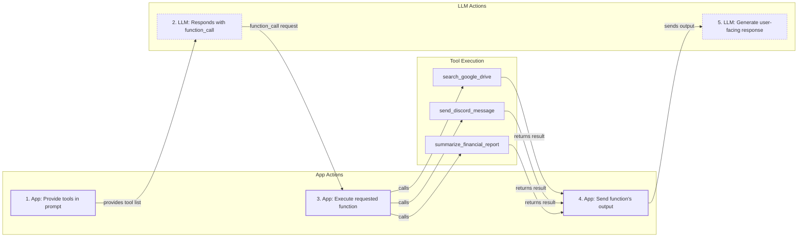
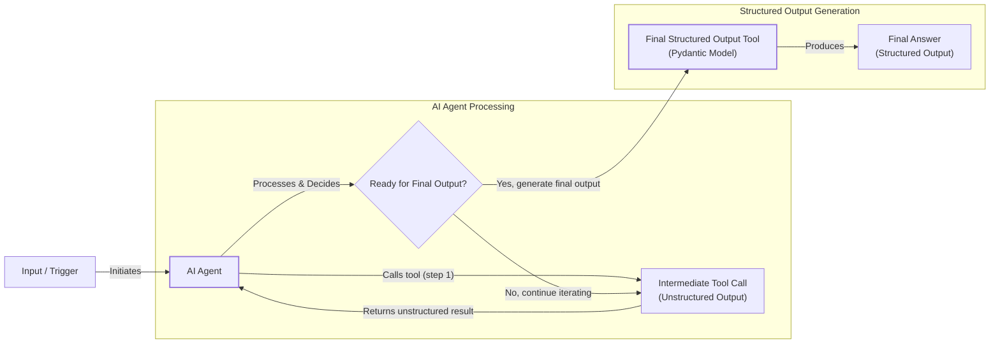
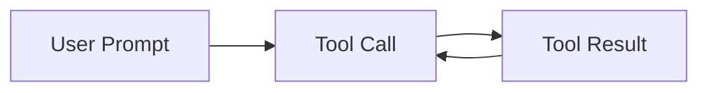

# Lesson 6: Agent Tools & Function Calling

In our previous lessons, we built a solid foundation in AI Engineering. We explored the difference between rule-based workflows and autonomous agents, mastered context engineering to manage information flow, and learned to produce structured outputs for reliable data extraction. Now, it's time to give our AI systems the ability to act. This lesson introduces tools, the components that transform a passive LLM into an active agent capable of interacting with the external world.

## Why Agents Need Tools

LLMs have a fundamental limitation: they are sophisticated pattern matchers and text generators, but they cannot perform actions or access real-time information on their own [[1]](https://lnu.diva-portal.org/smash/get/diva2:1801354/FULLTEXT01.pdf). They are, in essence, brains in a jar. Tools are the bridge between the LLM's internal reasoning and the external world, giving it "hands and senses" to perceive and act beyond its training data [[2]](https://medium.com/@anicomanesh/how-llm-reasoning-powers-the-agentic-ai-revolution-cbefd10ebf3f). With tools, an LLM becomes an AI agent.

This capability unlocks a new class of applications. Agents can use tools to:
- Access real-time information via APIs, like checking today's weather or fetching the latest news [[1]](https://lnu.diva-portal.org/smash/get/diva2:1801354/FULLTEXT01.pdf).
- Interact with external databases and data warehouses [[3]](https://www.ruh.ai/blogs/how-vector-databases-are-rewiring-the-tech-industry).
- Retrieve information from long-term memory to overcome context window limitations [[3]](https://www.ruh.ai/blogs/how-vector-databases-are-rewiring-the-tech-industry).
- Execute code to perform precise calculations or data manipulation [[4]](https://arxiv.org/html/2507.08034v1).
Image 1: An LLM acts as a reasoning engine, deciding which tools to use to interact with the world. (Source [Swirl AI [5]](https://www.newsletter.swirlai.com/p/building-ai-agents-from-scratch-part))

## Implementing Tool Calls from Scratch

The best way to understand how an LLM uses tools is to build the mechanism from scratch. Our goal is to provide the model with a list of functions it can call, let it decide which one is appropriate for a user's request, and have it generate the correct arguments for that function.

The high-level process involves five steps:
1.  **App:** You send the LLM a prompt that includes a list of available tools and their definitions.
2.  **LLM:** The model analyzes the request and, if it decides a tool is needed, responds with a `function_call` containing the tool's name and the arguments to use.
3.  **App:** Your application code parses this response and executes the requested function with the provided arguments.
4.  **App:** You send the function's output back to the LLM as additional context.
5.  **LLM:** The model uses this output to generate a final, user-facing response [[6]](https://www.decodingai.com/p/tool-calling-from-scratch-to-production).


Image 2: A flowchart illustrating the 5 steps of tool calling, highlighting the request-execute-respond flow between the App and LLM, including example tools.

Let's implement this flow. We'll create a simple agent that can search for a financial report on Google Drive and send a summary to a Discord channel.

1. First, we set up our Gemini client and define a sample document to simulate a file found on Google Drive.
    ```python
    import json
    from typing import Any
    
    from google import genai
    from google.genai import types
    from pydantic import BaseModel, Field
    
    client = genai.Client()
    
    MODEL_ID = "gemini-2.5-flash"
    
    DOCUMENT = """
    # Q3 2023 Financial Performance Analysis
    
    The Q3 earnings report shows a 20% increase in revenue and a 15% growth in user engagement, 
    beating market expectations. These impressive results reflect our successful product strategy 
    and strong market positioning.
    
    Our core business segments demonstrated remarkable resilience, with digital services leading 
    the growth at 25% year-over-year. The expansion into new markets has proven particularly 
    successful, contributing to 30% of the total revenue increase.
    
    Customer acquisition costs decreased by 10% while retention rates improved to 92%, 
    marking our best performance to date. These metrics, combined with our healthy cash flow 
    position, provide a strong foundation for continued growth into Q4 and beyond.
    """
    ```

2. Next, we define our Python functions. For this example, the functions are mocked to keep the focus on the tool-calling logic.
    ```python
    def search_google_drive(query: str) -> dict:
        """
        Searches for a file on Google Drive and returns its content or a summary.
    
        Args:
            query (str): The search query to find the file, e.g., 'Q3 earnings report'.
    
        Returns:
            dict: A dictionary representing the search results, including file names and summaries.
        """
        return {
            "files": [
                {
                    "name": "Q3_Earnings_Report_2024.pdf",
                    "id": "file12345",
                    "content": DOCUMENT,
                }
            ]
        }
    ```
    ```python
    def send_discord_message(channel_id: str, message: str) -> dict:
        """
        Sends a message to a specific Discord channel.
    
        Args:
            channel_id (str): The ID of the channel to send the message to, e.g., '#finance'.
            message (str): The content of the message to send.
    
        Returns:
            dict: A dictionary confirming the action, e.g., {"status": "success"}.
        """
        return {
            "status": "success",
            "status_code": 200,
            "channel": channel_id,
            "message_preview": f"{message[:50]}...",
        }
    ```
    ```python
    def summarize_financial_report(text: str) -> str:
        """
        Summarizes a financial report.
    
        Args:
            text (str): The text to summarize.
    
        Returns:
            str: The summary of the text.
        """
        return "The Q3 2023 earnings report shows strong performance across all metrics with 20% revenue growth, 15% user engagement increase, 25% digital services growth, and improved retention rates of 92%."
    ```

3. We then define a schema for each function. This schema, typically written in JSON, tells the LLM what the tool does (`description`), what parameters it expects, their types, and which are required. This is the industry standard for APIs like OpenAI and Gemini [[7]](https://tetrate.io/learn/ai/llm-output-parsing-structured-generation), [[6]](https://www.decodingai.com/p/tool-calling-from-scratch-to-production).
    ```python
    search_google_drive_schema = {
        "name": "search_google_drive",
        "description": "Searches for a file on Google Drive and returns its content or a summary.",
        "parameters": {
            "type": "object",
            "properties": {
                "query": {
                    "type": "string",
                    "description": "The search query to find the file, e.g., 'Q3 earnings report'.",
                }
            },
            "required": ["query"],
        },
    }
    ```
    ```python
    send_discord_message_schema = {
        "name": "send_discord_message",
        "description": "Sends a message to a specific Discord channel.",
        "parameters": {
            "type": "object",
            "properties": {
                "channel_id": {
                    "type": "string",
                    "description": "The ID of the channel to send the message to, e.g., '#finance'.",
                },
                "message": {
                    "type": "string",
                    "description": "The content of the message to send.",
                },
            },
            "required": ["channel_id", "message"],
        },
    }
    ```
    ```python
    summarize_financial_report_schema = {
        "name": "summarize_financial_report",
        "description": "Summarizes a financial report.",
        "parameters": {
            "type": "object",
            "properties": {
                "text": {
                    "type": "string",
                    "description": "The text to summarize.",
                },
            },
            "required": ["text"],
        },
    }
    ```

4. We create a tool registry to map tool names to their handlers and schemas.
    ```python
    TOOLS = {
        "search_google_drive": {
            "handler": search_google_drive,
            "declaration": search_google_drive_schema,
        },
        "send_discord_message": {
            "handler": send_discord_message,
            "declaration": send_discord_message_schema,
        },
        "summarize_financial_report": {
            "handler": summarize_financial_report,
            "declaration": summarize_financial_report_schema,
        },
    }
    TOOLS_BY_NAME = {tool_name: tool["handler"] for tool_name, tool in TOOLS.items()}
    TOOLS_SCHEMA = [tool["declaration"] for tool in TOOLS.values()]
    ```
    The `TOOLS_BY_NAME` mapping looks like this:
    ```
    {'search_google_drive': <function search_google_drive at ...>, 'send_discord_message': <function send_discord_message at ...>, 'summarize_financial_report': <function summarize_financial_report at ...>}
    ```
    And here is the schema for `search_google_drive`:
    ```json
    {
      "name": "search_google_drive",
      "description": "Searches for a file on Google Drive and returns its content or a summary.",
      "parameters": {
        "type": "object",
        "properties": {
          "query": {
            "type": "string",
            "description": "The search query to find the file, e.g., 'Q3 earnings report'."
          }
        },
        "required": [
          "query"
        ]
      }
    }
    ```

5. Now, we create a system prompt to instruct the LLM on how to use these tools. This prompt includes guidelines, the expected output format, and the schemas of all available tools.
    ```python
    TOOL_CALLING_SYSTEM_PROMPT = """
    You are a helpful AI assistant with access to tools that enable you to take actions and retrieve information to better 
    assist users.
    
    ## Tool Usage Guidelines
    
    **When to use tools:**
    - When you need information that is not in your training data
    - When you need to perform actions in external systems and environments
    - When you need real-time, dynamic, or user-specific data
    - When computational operations are required
    
    **Tool selection:**
    - Choose the most appropriate tool based on the user's specific request
    - If multiple tools could work, select the one that most directly addresses the need
    - Consider the order of operations for multi-step tasks
    
    **Parameter requirements:**
    - Provide all required parameters with accurate values
    - Use the parameter descriptions to understand expected formats and constraints
    - Ensure data types match the tool's requirements (strings, numbers, booleans, arrays)
    
    ## Tool Call Format
    
    When you need to use a tool, output ONLY the tool call in this exact format:
    
    <tool_call>
    {{"name": "tool_name", "args": {{"param1": "value1", "param2": "value2"}}}}
    </tool_call>
    
    **Critical formatting rules:**
    - Use double quotes for all JSON strings
    - Ensure the JSON is valid and properly escaped
    - Include ALL required parameters
    - Use correct data types as specified in the tool definition
    - Do not include any additional text or explanation in the tool call
    
    ## Response Behavior
    
    - If no tools are needed, respond directly to the user with helpful information
    - If tools are needed, make the tool call first, then provide context about what you're doing
    - After receiving tool results, provide a clear, user-friendly explanation of the outcome
    - If a tool call fails, explain the issue and suggest alternatives when possible
    
    ## Available Tools
    
    <tool_definitions>
    {tools}
    </tool_definitions>
    
    Remember: Your goal is to be maximally helpful to the user. Use tools when they add value, but don't use them unnecessarily. Always prioritize accuracy and user experience.
    """
    ```
    Based on the `description` field in the tool schema, the LLM *decides* if a tool is appropriate for the user's query. This is why clear and distinct tool descriptions are essential, especially when an agent has access to many tools. Generic descriptions like "search documents" and "search files" can confuse the model. More explicit descriptions like "search documents on Google Drive" and "search files on the local disk" provide the necessary clarity for accurate tool selection [[8]](https://mbrenndoerfer.com/writing/function-calling-llm-structured-tools), [[9]](https://medium.com/@abhaychougule0907/underlying-factors-behind-inconsistency-in-llm-responses-with-multi-tool-calling-628ce7b4de76).

    This becomes even more important as the number of tools scales to 50 or 100 [[8]](https://mbrenndoerfer.com/writing/function-calling-llm-structured-tools). Once a tool is selected, the LLM *generates* the function name and arguments in a structured format like JSON. The model's ability to interpret schemas and generate these structured calls comes from instruction fine-tuning, a process where it's specifically trained on examples of tool use [[8]](https://mbrenndoerfer.com/writing/function-calling-llm-structured-tools).

6. Let's test it with a simple prompt.
    ```python
    USER_PROMPT = """
    Can you help me find the latest quarterly report and share key insights with the team?
    """
    
    messages = [TOOL_CALLING_SYSTEM_PROMPT.format(tools=str(TOOLS_SCHEMA)), USER_PROMPT]
    
    response = client.models.generate_content(
        model=MODEL_ID,
        contents=messages,
    )
    ```
    It outputs:
    ```text
    <tool_call>
    {"name": "search_google_drive", "args": {"query": "latest quarterly report"}}
    </tool_call>
    ```

7. Now for a multi-step prompt.
    ```python
    USER_PROMPT = """
    Please find the Q3 earnings report on Google Drive and send a summary of it to 
    the #finance channel on Discord.
    """
    
    messages = [TOOL_CALLING_SYSTEM_PROMPT.format(tools=str(TOOLS_SCHEMA)), USER_PROMPT]
    
    response = client.models.generate_content(
        model=MODEL_ID,
        contents=messages,
    )
    ```
    The LLM correctly identifies the first step, which is to search for the report.
    ```text
    <tool_call>
    {"name": "search_google_drive", "args": {"query": "Q3 earnings report"}}
    </tool_call>
    ```

8. We then parse this response, get the correct function handler from our `TOOLS_BY_NAME` registry, and execute it.
    ```python
    def extract_tool_call(response_text: str) -> str:
        """
        Extracts the tool call from the response text.
        """
        return response_text.split("<tool_call>")[1].split("</tool_call>")[0].strip()
    
    tool_call_str = extract_tool_call(response.text)
    # '{"name": "search_google_drive", "args": {"query": "Q3 earnings report"}}'
    
    tool_call = json.loads(tool_call_str)
    # {'name': 'search_google_drive', 'args': {'query': 'Q3 earnings report'}}
    
    tool_handler = TOOLS_BY_NAME[tool_call["name"]]
    # <function search_google_drive at ...>
    
    tool_result = tool_handler(**tool_call["args"])
    ```
    The `tool_result` contains the content of the financial report.

9. We can wrap this logic in a helper function for convenience.
    ```python
    def call_tool(response_text: str, tools_by_name: dict) -> Any:
        """
        Call a tool based on the response from the LLM.
        """
    
        tool_call_str = extract_tool_call(response_text)
        tool_call = json.loads(tool_call_str)
        tool_name = tool_call["name"]
        tool_args = tool_call["args"]
        tool = tools_by_name[tool_name]
    
        return tool(**tool_args)
    
    call_tool(response.text, tools_by_name=TOOLS_BY_NAME)
    ```

10. Finally, the tool's result is sent back to the LLM to formulate a final response or decide on the next step.
    ```python
    response = client.models.generate_content(
        model=MODEL_ID,
        contents=f"Interpret the tool result: {json.dumps(tool_result, indent=2)}",
    )
    ```
    It outputs:
    ```text
    The tool result provides the content of a file named `Q3_Earnings_Report_2024.pdf`.
    
    This document is a **Q3 2023 Financial Performance Analysis** and details exceptionally strong results, significantly beating market expectations.
    
    **Key highlights from the report include:**
    
    *   **Revenue Growth:** A 20% increase in revenue.
    *   **User Engagement:** 15% growth in user engagement.
    *   **Core Business Performance:** Digital services led growth at 25% year-over-year.
    *   **Market Expansion Success:** New markets contributed 30% of the total revenue increase.
    *   **Efficiency & Retention:**
        *   Customer acquisition costs decreased by 10%.
        *   Retention rates improved to 92%, marking the best performance to date.
    *   **Financial Health:** The company maintains a healthy cash flow position.
    
    The report attributes these impressive results to a successful product strategy and strong market positioning, indicating a robust foundation for continued growth into Q4 and beyond.
    ```
This covers the basic concept of tool calling. We've successfully implemented it from scratch.

## Implementing a Tool Calling Framework from Scratch

Manually defining a JSON schema for every function is repetitive and error-prone, making it difficult to scale. Production frameworks like LangGraph address this by using a `@tool` decorator to automatically generate schemas from function signatures and docstrings [[10]](https://docs.langchain.com/oss/python/langchain/tools). This approach follows the Don't Repeat Yourself (DRY) principle by making the function itself the single source of truth, which is a core software engineering best practice [[11]](https://openai.github.io/openai-agents-python/tools/), [[12]](https://pydantic.dev/docs/ai/tools-toolsets/tools/).

Let's build a simple version of this framework. The decorator will inspect a function, extract its name, docstring, and parameters, and then build the schema. We'll use a `ToolFunction` class as a wrapper to hold both the original function and its generated schema, making it easy to manage within our system.

1.  First, we define the `ToolFunction` class and the `@tool` decorator. The decorator uses Python's built-in `inspect` module to analyze the function's signature and generate the corresponding schema.
    ```python
    from inspect import Parameter, signature
    from typing import Any, Callable, Dict, Optional
    
    
    class ToolFunction:
        def __init__(self, func: Callable, schema: Dict[str, Any]) -> None:
            self.func = func
            self.schema = schema
            self.__name__ = func.__name__
            self.__doc__ = func.__doc__
    
        def __call__(self, *args: Any, **kwargs: Any) -> Any:
            return self.func(*args, **kwargs)
    
    
    def tool(description: Optional[str] = None) -> Callable[[Callable], ToolFunction]:
        """
        A decorator that creates a tool schema from a function.
    
        Args:
            description: Optional override for the function's docstring
    
        Returns:
            A decorator function that wraps the original function and adds a schema
        """
    
        def decorator(func: Callable) -> ToolFunction:
            sig = signature(func)
            properties = {}
            required = []
    
            for param_name, param in sig.parameters.items():
                if param_name == "self":
                    continue
    
                param_schema = {
                    "type": "string",
                    "description": f"The {param_name} parameter",
                }
    
                if param.default == Parameter.empty:
                    required.append(param_name)
    
                properties[param_name] = param_schema
    
            schema = {
                "name": func.__name__,
                "description": description or func.__doc__ or f"Executes the {func.__name__} function.",
                "parameters": {
                    "type": "object",
                    "properties": properties,
                    "required": required,
                },
            }
    
            return ToolFunction(func, schema)
    
        return decorator
    ```

2.  Now, we can redefine our tools using this decorator. The code is much cleaner and more maintainable.
    ```python
    @tool()
    def search_google_drive_example(query: str) -> dict:
        """Search for files in Google Drive."""
        return {"files": ["Q3 earnings report"]}
    
    
    @tool()
    def send_discord_message_example(channel_id: str, message: str) -> dict:
        """Send a message to a Discord channel."""
        return {"message": "Message sent successfully"}
    
    
    @tool()
    def summarize_financial_report_example(text: str) -> str:
        """Summarize the contents of a financial report."""
        return "Financial report summarized successfully"
    
    
    tools = [
        search_google_drive_example,
        send_discord_message_example,
        summarize_financial_report_example,
    ]
    tools_by_name = {tool.schema["name"]: tool.func for tool in tools}
    tools_schema = [tool.schema for tool in tools]
    ```

3.  The decorated function `search_google_drive_example` is now a `ToolFunction` object. We can inspect it to see the automatically generated schema and the original function handler.
    ```python
    type(search_google_drive_example)
    # <class '__main__.ToolFunction'>
    
    search_google_drive_example.schema
    # {'name': 'search_google_drive_example', 'description': 'Search for files in Google Drive.', 'parameters': {'type': 'object', 'properties': {'query': {'type': 'string', 'description': 'The query parameter'}}, 'required': ['query']}}
    
    search_google_drive_example.func
    # <function __main__.search_google_drive_example(query: str) -> dict>
    ```
    As you can see, the schema is identical to the one we defined manually, but now it's generated directly from our Python code.

4.  We can use this new `tools_schema` with our existing `TOOL_CALLING_SYSTEM_PROMPT` to get the same result as before, but with more maintainable code.
    ```python
    messages = [TOOL_CALLING_SYSTEM_PROMPT.format(tools=str(tools_schema)), USER_PROMPT]
    
    response = client.models.generate_content(
        model=MODEL_ID,
        contents=messages,
    )
    ```
    It outputs:
    ```text
    <tool_call>
    {"name": "search_google_drive_example", "args": {"query": "Q3 earnings report"}}
    </tool_call>
    ```
Voilà! We have our little tool calling framework.

## Implementing Production-Level Tool Calls with Gemini

While building from scratch is a great learning exercise, in production you should use the native tool-calling features of APIs like Gemini or OpenAI. These APIs are optimized for their specific models and handle the complex prompt engineering for you, making your code more robust and efficient [[6]](https://www.decodingai.com/p/tool-calling-from-scratch-to-production), [[13]](https://apxml.com/courses/prompt-engineering-llm-application-development/chapter-4-interacting-with-llm-apis/overview-common-llm-apis). While implementation details differ slightly—OpenAI uses a `tools` parameter and Anthropic has a `tool_use` API—the core logic is the same across all major providers [[14]](https://myengineeringpath.dev/tools/gemini-guide/). This makes the concepts you've learned here easily transferable.

Let's refactor our implementation to use Gemini's native API.

1.  Instead of a large system prompt, we define a `GenerateContentConfig` object. The `google-genai` Python SDK can generate the schema automatically from a Python function’s signature, type hints, and docstring. We can pass our functions directly to the `tools` list.
    ```python
    from google.genai import types
    
    config = types.GenerateContentConfig(
        tools=[search_google_drive, send_discord_message]
    )
    ```

2.  Now, we can call the model with a much simpler prompt, passing the configuration object. This is more robust because the provider optimizes the tool-calling instructions for each specific model.
    ```python
    response = client.models.generate_content(
        model=MODEL_ID,
        contents=USER_PROMPT,
        config=config,
    )
    
    function_call = response.candidates[0].content.parts[0].function_call
    ```
    The `function_call` object returned by Gemini contains the name and arguments, ready for execution.

3.  We can simplify the execution process with a helper function that works directly with Gemini's `FunctionCall` object.
    ```python
    def call_tool(function_call) -> any:
        tool_name = function_call.name
        tool_args = {key: value for key, value in function_call.args.items()}
    
        tool_handler = TOOLS_BY_NAME[tool_name]
        return tool_handler(**tool_args)
    
    tool_result = call_tool(function_call)
    ```
By using the native SDK, we reduced dozens of lines of code to just a few, creating a more robust and maintainable system.

## Using Pydantic Models as Tools for On-Demand Structured Outputs

As we saw in Lesson 4, Pydantic is a powerful tool for ensuring structured outputs. We can combine this with tool calling to create a pattern where an agent performs several intermediate steps that produce unstructured text, then dynamically decides to call a final tool that outputs a structured Pydantic object [[15]](https://pydantic.dev/docs/ai/guides/multi-agent-applications/). This is an elegant and effective pattern for agentic workflows where the final output needs to be machine-readable for downstream processing, ensuring it conforms to a reliable schema.


Image 3: A flowchart illustrating an AI agent taking multiple intermediate steps using unstructured outputs and dynamically deciding when to output the final answer in a structured form as a Pydantic model.

Let's see how to implement this.

1.  We define a `DocumentMetadata` Pydantic model, just as we did in Lesson 4.
    ```python
    class DocumentMetadata(BaseModel):
        """A class to hold structured metadata for a document."""
    
        summary: str = Field(description="A concise, 1-2 sentence summary of the document.")
        tags: list[str] = Field(description="A list of 3-5 high-level tags relevant to the document.")
        keywords: list[str] = Field(description="A list of specific keywords or concepts mentioned.")
        quarter: str = Field(description="The quarter of the financial year described in the document (e.g., Q3 2023).")
        growth_rate: str = Field(description="The growth rate of the company described in the document (e.g., 10%).")
    ```

2.  We then treat this Pydantic model as a tool. We create a `FunctionDeclaration` where the `parameters` are derived from the Pydantic model's JSON schema.
    ```python
    extraction_tool = types.Tool(
        function_declarations=[
            types.FunctionDeclaration(
                name="extract_metadata",
                description="Extracts structured metadata from a financial document.",
                parameters=DocumentMetadata.model_json_schema(),
            )
        ]
    )
    config = types.GenerateContentConfig(
        tools=[extraction_tool],
        tool_config=types.ToolConfig(function_calling_config=types.FunctionCallingConfig(mode="ANY")),
    )
    ```

3.  When we prompt the model to analyze a document, it will call our `extract_metadata` tool and populate the arguments according to the Pydantic schema.
    ```python
    prompt = f"""
    Please analyze the following document and extract its metadata.
    
    Document:
    --- 
    {DOCUMENT}
    --- 
    """
    
    response = client.models.generate_content(model=MODEL_ID, contents=prompt, config=config)
    function_call = response.candidates[0].content.parts[0].function_call
    ```

4.  We can then validate the arguments and create a `DocumentMetadata` instance directly.
    ```python
    try:
        document_metadata = DocumentMetadata(**function_call.args)
        print("Validation successful!")
    except Exception as e:
        print(f"Validation failed: {e}")
    ```
    It outputs:
    ```text
    Validation successful!
    ```
This pattern is extremely powerful for building agents that need to return reliable, structured data at the end of a complex workflow.

## The Downsides of Running Tools in a Loop

So far, we've focused on single tool calls. For an agent to handle complex, multi-step tasks, it needs to be able to chain multiple tools together, using the output of one tool to inform the input of the next. This is typically done by running tool calls in a loop, which gives the agent flexibility and adaptability.


Image 4: A flowchart illustrating a tool calling loop.

Let's implement a loop to see how it works and understand its limitations.

1.  We'll use our `USER_PROMPT` from before, which requires multiple steps: find a report, summarize it, and send a message.
    ```python
    USER_PROMPT = """
    Please find the Q3 earnings report on Google Drive and send a summary of it to 
    the #finance channel on Discord.
    """
    
    messages = [USER_PROMPT]
    ```

2.  We run a loop that continues as long as the model requests a tool call, with a `max_iterations` guardrail to prevent infinite loops.
    ```python
    max_iterations = 3
    while max_iterations > 0:
        response = client.models.generate_content(
            model=MODEL_ID,
            contents=messages,
            config=config,
        )
        response_message_part = response.candidates[0].content.parts[0]
    
        if not hasattr(response_message_part, "function_call"):
            break
    
        # Add the tool call to the message history
        messages.append(response.candidates[0].content)
    
        # Execute the tool and get the result
        tool_result = call_tool(response_message_part.function_call)
    
        # Add the tool result to the message history
        function_response_part = types.Part.from_function_response(
            name=response_message_part.function_call.name,
            response={"result": tool_result},
        )
        messages.append(types.Content(parts=[function_response_part]))
    
        max_iterations -= 1
    ```
    This loop successfully executes the three required tool calls in sequence. The first call is to `search_google_drive`, which returns the document. The second is to `summarize_financial_report`, which returns the summary. The final call is to `send_discord_message`, which completes the task.

However, this simple loop has major downsides. It doesn't allow the LLM to interpret the output of each tool before deciding on the next action. The agent moves directly to the next function call without pausing to think about what it has learned or whether its strategy needs to change. This can lead to inefficient tool use or getting stuck in loops without making progress [[16]](https://myengineeringpath.dev/genai-engineer/agentic-patterns/), [[17]](https://blogs.oracle.com/developers/what-is-the-ai-agent-loop-the-core-architecture-behind-autonomous-ai-systems).

For tasks where tools are independent, they can be executed in parallel to reduce latency. For example, an agent could fetch financial news and stock prices simultaneously. But for dependent tasks, this sequential, non-reasoning approach is brittle. These limitations motivated the development of more advanced agentic patterns like **ReAct** (Reason and Act), which explicitly interleaves reasoning steps with tool calls. We will explore ReAct in detail in Lessons 7 and 8.

## Popular Tools Used Within the Industry

To ground this lesson in real-world applications, let's look at some of the most common categories of tools used in production AI agents today:

1.  **Knowledge & Memory Access:** These tools connect agents to external knowledge sources. This includes querying vector databases for RAG or using **text-to-SQL** to interact with relational databases like PostgreSQL [[18]](https://promethium.ai/guides/text-to-sql-basics-benefits/). We will cover memory and RAG in-depth in Lessons 9 and 10.

2.  **Web Search & Browsing:** These are essential for agents that need access to real-time information. Tools in this category interface with search engines like **Google Search** or **Brave Search** or use web scraping to extract content [[4]](https://arxiv.org/html/2507.08034v1).

3.  **Code Execution:** A code interpreter, typically for Python, is an essential tool. It allows an agent to perform precise calculations and data manipulation. It is critical to run this code in a **sandboxed environment** to prevent security risks [[2]](https://medium.com/@anicomanesh/how-llm-reasoning-powers-the-agentic-ai-revolution-cbefd10ebf3f).

4.  **Other Popular Tools:** In enterprise settings, agents often need to interact with other software systems. Tools can be built to call APIs for calendars, email, and project management software [[1]](https://lnu.diva-portal.org/smash/get/diva2:1801354/FULLTEXT01.pdf). For productivity, agents can use tools for file system operations. Finally, **human-in-the-loop** tools can be used to request approval or feedback, adding a layer of validation to critical tasks.

## Conclusion

Tool calling is a foundational component of modern AI agents. It's the mechanism that allows an LLM to move beyond text generation and take meaningful action in the world. Understanding how to define, implement, and orchestrate tools is an important skill for any AI Engineer. In our next lesson, we will build on this foundation by exploring planning and the ReAct pattern, which adds a crucial layer of reasoning to the tool-calling loop.

## References

- [1] https://lnu.diva-portal.org/smash/get/diva2:1801354/FULLTEXT01.pdf
- [2] https://medium.com/@anicomanesh/how-llm-reasoning-powers-the-agentic-ai-revolution-cbefd10ebf3f
- [3] https://www.ruh.ai/blogs/how-vector-databases-are-rewiring-the-tech-industry
- [4] https://arxiv.org/html/2507.08034v1
- [5] https://www.newsletter.swirlai.com/p/building-ai-agents-from-scratch-part
- [6] https://www.decodingai.com/p/tool-calling-from-scratch-to-production
- [7] https://tetrate.io/learn/ai/llm-output-parsing-structured-generation
- [8] https://mbrenndoerfer.com/writing/function-calling-llm-structured-tools
- [9] https://medium.com/@abhaychougule0907/underlying-factors-behind-inconsistency-in-llm-responses-with-multi-tool-calling-628ce7b4de76
- [10] https://docs.langchain.com/oss/python/langchain/tools
- [11] https://openai.github.io/openai-agents-python/tools/
- [12] https://pydantic.dev/docs/ai/tools-toolsets/tools/
- [13] https://apxml.com/courses/prompt-engineering-llm-application-development/chapter-4-interacting-with-llm-apis/overview-common-llm-apis
- [14] https://myengineeringpath.dev/tools/gemini-guide/
- [15] https://pydantic.dev/docs/ai/guides/multi-agent-applications/
- [16] https://myengineeringpath.dev/genai-engineer/agentic-patterns/
- [17] https://blogs.oracle.com/developers/what-is-the-ai-agent-loop-the-core-architecture-behind-autonomous-ai-systems
- [18] https://promethium.ai/guides/text-to-sql-basics-benefits/