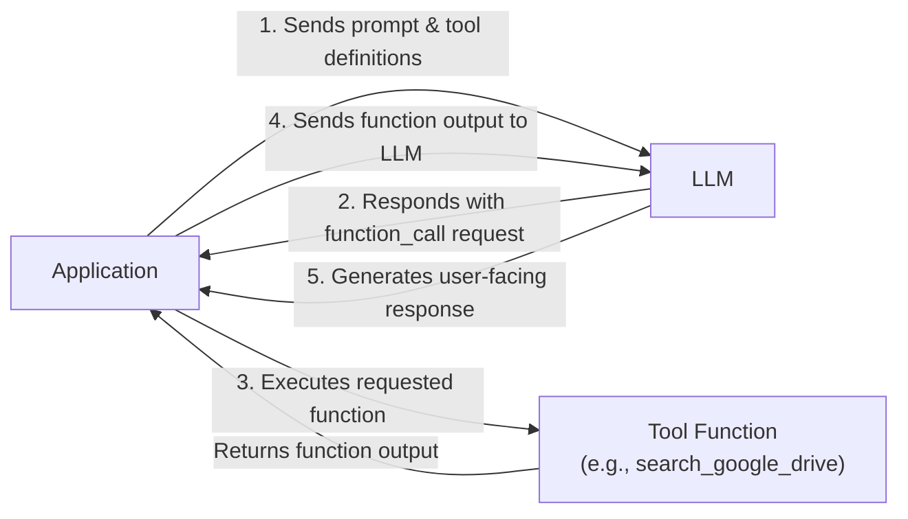
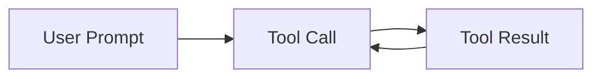

# Lesson 6: Agent Tools & Function Calling

In our previous lessons, we built a solid foundation in AI Engineering. We explored the landscape of AI agents, distinguished between LLM workflows and agents, managed context, and enforced reliable structured outputs. Now, we will give our agents the ability to act.

LLMs are powerful reasoning engines, but they are confined to the world of text. They can't check the weather, search a database, or send an email on their own. This is where tools, also known as function calling, come in. Tools are the bridge that connects an LLM's reasoning to the outside world, transforming it from a text generator into an agent that can perform actions. In this lesson, we will open the black box of tool use, implementing it from scratch before leveraging the native power of modern APIs like Gemini.

## Understanding Why Agents Need Tools

An LLM's fundamental limitation is that it's a pattern matcher and text generator. It can't, by itself, interact with external systems. Think of the LLM as the brain of an agent; it can reason and plan, but it needs tools to act as its "hands and senses" to perceive and affect the world. With tools, an LLM becomes an AI agent capable of executing tasks.

This capability unlocks a wide range of actions. Popular tools that power modern AI agents allow them to:
- Access real-time information via APIs, like checking today's weather.
- Interact with databases, from a simple PostgreSQL database to a massive Snowflake data warehouse.
- Access long-term memory to recall information beyond their immediate context window.
- Execute code in languages like Python or JavaScript for precise calculations or data manipulation.

## Implementing Tool Calls from Scratch

The best way to understand how tools work is to build the mechanism from scratch. The goal is to provide the LLM with a list of available functions and let it decide which one to use and with what arguments to fulfill a user's request.

The process involves a five-step loop between your application and the LLM:

1.  **Application:** Sends the user prompt and a list of tool definitions to the LLM.
2.  **LLM:** Responds with a `function_call` request, specifying the tool's name and arguments.
3.  **Application:** Executes the requested function with the provided arguments.
4.  **Application:** Sends the function's output back to the LLM.
5.  **LLM:** Uses the tool's output to generate a final, user-facing response.


Image 1: A flowchart illustrating the 5-step request-execute-respond flow of calling a tool.

Let's implement a simple example where we mock searching for a document on Google Drive and sending its summary to a Discord channel.

<aside>
💡

You can find the complete code for this lesson in the accompanying [Jupyter Notebook](https://github.com/towardsai/course-ai-agents/blob/dev/lessons/06_tools/notebook.ipynb) on GitHub.

</aside>

1.  First, we set up our Gemini client and define a mock document.
    ```python
    import json
    from typing import Any

    from google import genai
    from google.genai import types
    from pydantic import BaseModel, Field

    from lessons.utils import pretty_print
    
    # Code to load GOOGLE_API_KEY from .env file
    
    client = genai.Client()
    
    MODEL_ID = "gemini-2.5-flash"
    
    DOCUMENT = """
    # Q3 2023 Financial Performance Analysis
    
    The Q3 earnings report shows a 20% increase in revenue and a 15% growth in user engagement, 
    beating market expectations. These impressive results reflect our successful product strategy 
    and strong market positioning.
    
    Our core business segments demonstrated remarkable resilience, with digital services leading 
    the growth at 25% year-over-year. The expansion into new markets has proven particularly 
    successful, contributing to 30% of the total revenue increase.
    
    Customer acquisition costs decreased by 10% while retention rates improved to 92%, 
    marking our best performance to date. These metrics, combined with our healthy cash flow 
    position, provide a strong foundation for continued growth into Q4 and beyond.
    """
    ```

2.  We define three mock functions. The function signature and docstring are crucial, as the LLM uses them to understand what each tool does.
    ```python
    def search_google_drive(query: str) -> dict:
        """
        Searches for a file on Google Drive and returns its content or a summary.
    
        Args:
            query (str): The search query to find the file, e.g., 'Q3 earnings report'.
    
        Returns:
            dict: A dictionary representing the search results, including file names and summaries.
        """
        return {
            "files": [
                {
                    "name": "Q3_Earnings_Report_2024.pdf",
                    "id": "file12345",
                    "content": DOCUMENT,
                }
            ]
        }
    
    
    def send_discord_message(channel_id: str, message: str) -> dict:
        """
        Sends a message to a specific Discord channel.
    
        Args:
            channel_id (str): The ID of the channel to send the message to, e.g., '#finance'.
            message (str): The content of the message to send.
    
        Returns:
            dict: A dictionary confirming the action, e.g., {"status": "success"}.
        """
        return {
            "status": "success",
            "status_code": 200,
            "channel": channel_id,
            "message_preview": f"{message[:50]}...",
        }
    
    
    def summarize_financial_report(text: str) -> str:
        """
        Summarizes a financial report.
    
        Args:
            text (str): The text to summarize.
    
        Returns:
            str: The summary of the text.
        """
        return "The Q3 2023 earnings report shows strong performance across all metrics with 20% revenue growth, 15% user engagement increase, 25% digital services growth, and improved retention rates of 92%."
    ```

3.  Next, we define a JSON schema for each tool. This schema tells the LLM what the tool does (`description`), what parameters it needs, their types, and which are required. This is the industry standard used by major providers like OpenAI and Google [[1]](https://is4.ai/blog/our-blog-1/openai-api-vs-anthropic-api-comparison-117), [[2]](https://www.mgsoftware.nl/en/vergelijking/openai-api-vs-anthropic-api), [[3]](https://www.decodingai.com/p/tool-calling-from-scratch-to-production).
    ```python
    search_google_drive_schema = {
        "name": "search_google_drive",
        "description": "Searches for a file on Google Drive and returns its content or a summary.",
        "parameters": {
            "type": "object",
            "properties": {
                "query": {
                    "type": "string",
                    "description": "The search query to find the file, e.g., 'Q3 earnings report'.",
                }
            },
            "required": ["query"],
        },
    }
    
    send_discord_message_schema = {
        "name": "send_discord_message",
        "description": "Sends a message to a specific Discord channel.",
        "parameters": {
            "type": "object",
            "properties": {
                "channel_id": {
                    "type": "string",
                    "description": "The ID of the channel to send the message to, e.g., '#finance'.",
                },
                "message": {
                    "type": "string",
                    "description": "The content of the message to send.",
                },
            },
            "required": ["channel_id", "message"],
        },
    }
    
    summarize_financial_report_schema = {
        "name": "summarize_financial_report",
        "description": "Summarizes a financial report.",
        "parameters": {
            "type": "object",
            "properties": {
                "text": {
                    "type": "string",
                    "description": "The text to summarize.",
                },
            },
            "required": ["text"],
        },
    }
    ```

4.  We create a tool registry to map tool names to their handlers and schemas.
    ```python
    TOOLS = {
        "search_google_drive": {
            "handler": search_google_drive,
            "declaration": search_google_drive_schema,
        },
        "send_discord_message": {
            "handler": send_discord_message,
            "declaration": send_discord_message_schema,
        },
        "summarize_financial_report": {
            "handler": summarize_financial_report,
            "declaration": summarize_financial_report_schema,
        },
    }
    TOOLS_BY_NAME = {tool_name: tool["handler"] for tool_name, tool in TOOLS.items()}
    TOOLS_SCHEMA = [tool["declaration"] for tool in TOOLS.values()]
    ```
    The `TOOLS_BY_NAME` mapping provides a quick way to access a tool's function.
    
    The `TOOLS_SCHEMA` list contains the JSON definitions for the LLM. Here is the schema for our `search_google_drive` tool:
    ```json
    {
      "name": "search_google_drive",
      "description": "Searches for a file on Google Drive and returns its content or a summary.",
      "parameters": {
        "type": "object",
        "properties": {
          "query": {
            "type": "string",
            "description": "The search query to find the file, e.g., 'Q3 earnings report'."
          }
        },
        "required": [
          "query"
        ]
      }
    }
    ```

5.  We then craft a system prompt that instructs the LLM on how to use these tools. It includes guidelines, the expected output format, and the list of available tools.
    ```python
    TOOL_CALLING_SYSTEM_PROMPT = """
    You are a helpful AI assistant with access to tools that enable you to take actions and retrieve information to better 
    assist users.
    
    ## Tool Usage Guidelines
    ...
    ## Tool Call Format
    ...
    ## Response Behavior
    ...
    
    ## Available Tools
    <tool_definitions>
    {tools}
    </tool_definitions>
    
    Remember: Your goal is to be maximally helpful to the user. Use tools when they add value, but don't use them unnecessarily. Always prioritize accuracy and user experience.
    """
    ```

6.  Based on the `description` field in the tool schema, the LLM *decides* if a tool is appropriate. This is why clear and distinct tool descriptions are critical, especially as the number of tools grows. Vague descriptions like "search documents" can confuse the model, so be explicit: "search documents on Google Drive" [[4]](https://www.anthropic.com/research/building-effective-agents), [[5]](https://mbrenndoerfer.com/writing/function-calling-llm-structured-tools). Once a tool is selected, the LLM *generates* the function name and arguments as a structured output. This capability is enabled through extensive instruction fine-tuning, which teaches the model to interpret schemas and produce valid tool calls [[5]](https://mbrenndoerfer.com/writing/function-calling-llm-structured-tools). While this approach works for a few tools, it creates a "context explosion" at scale. Loading dozens of tool definitions into the prompt consumes expensive tokens and degrades the model's accuracy. For instance, tests show that accuracy can drop from over 88% to under 80% when a model must choose from a large toolset [[6]](https://composio.dev/content/ai-agent-tool-calling-guide).

7.  Let's test it. We send a user prompt along with our system prompt to the model.
    ```python
    USER_PROMPT = """
    Please find the Q3 earnings report on Google Drive and send a summary of it to 
    the #finance channel on Discord.
    """
    
    messages = [TOOL_CALLING_SYSTEM_PROMPT.format(tools=str(TOOLS_SCHEMA)), USER_PROMPT]
    
    response = client.models.generate_content(
        model=MODEL_ID,
        contents=messages,
    )
    ```
    The LLM correctly identifies the `search_google_drive` tool and generates the required arguments:
    ```text
    ```tool_call
      {"name": "search_google_drive", "args": {"query": "Q3 earnings report"}}
    ```
    ```

8.  Now we parse the response and execute the function.
    ```python
    def extract_tool_call(response_text: str) -> str:
        return response_text.split("```tool_call")[1].split("```")[0].strip()
    
    tool_call_str = extract_tool_call(response.text)
    tool_call = json.loads(tool_call_str)
    
    tool_handler = TOOLS_BY_NAME[tool_call["name"]]
    tool_result = tool_handler(**tool_call["args"])
    ```
    The `tool_result` contains the content of the financial report.

9.  We can wrap this logic in a helper function for convenience.
    ```python
    def call_tool(response_text: str, tools_by_name: dict) -> Any:
        tool_call_str = extract_tool_call(response_text)
        tool_call = json.loads(tool_call_str)
        tool_name = tool_call["name"]
        tool_args = tool_call["args"]
        tool = tools_by_name[tool_name]
    
        return tool(**tool_args)
    ```

10. Finally, the tool result is sent back to the LLM, which uses it to formulate a final response or decide on the next step.
    ```python
    response = client.models.generate_content(
        model=MODEL_ID,
        contents=f"Interpret the tool result: {json.dumps(tool_result, indent=2)}",
    )
    ```
    It outputs:
    ```text
    The tool result provides the content of a file named `Q3_Earnings_Report_2024.pdf`.
    
    This document is a **Q3 2023 Financial Performance Analysis** and details exceptionally strong results, significantly beating market expectations.
    
    **Key highlights from the report include:**
    
    *   **Revenue Growth:** A 20% increase in revenue.
    *   **User Engagement:** 15% growth in user engagement.
    ...
    ```
This is the basic concept behind tool calling. We have successfully implemented it from scratch.

## Implementing a Tool Calling Framework from Scratch

Manually defining JSON schemas for every tool is tedious and doesn't scale. Modern agentic frameworks like LangGraph solve this by using a `@tool` decorator to automatically generate schemas from function signatures and docstrings [[7]](https://docs.langchain.com/oss/python/langchain/tools), [[8]](https://openai.github.io/openai-agents-python/tools/). This approach follows the Don't Repeat Yourself (DRY) principle by creating a single source of truth for both the tool's implementation and its definition.

Let's build our own simple framework.

1.  First, we define a wrapper class and the decorator function. The `@tool` decorator will inspect a Python function, extract its name, docstring, and parameters, and generate a schema.
    ```python
    from inspect import Parameter, signature
    from typing import Any, Callable, Dict, Optional
    
    
    class ToolFunction:
        def __init__(self, func: Callable, schema: Dict[str, Any]) -> None:
            self.func = func
            self.schema = schema
            self.__name__ = func.__name__
            self.__doc__ = func.__doc__
    
        def __call__(self, *args: Any, **kwargs: Any) -> Any:
            return self.func(*args, **kwargs)
    
    
    def tool(description: Optional[str] = None) -> Callable[[Callable], ToolFunction]:
        """
        A decorator that creates a tool schema from a function.
        """
        def decorator(func: Callable) -> ToolFunction:
            sig = signature(func)
            properties = {}
            required = []
    
            for param_name, param in sig.parameters.items():
                if param_name == "self":
                    continue
    
                param_schema = {
                    "type": "string",
                    "description": f"The {param_name} parameter",
                }
    
                if param.default == Parameter.empty:
                    required.append(param_name)
    
                properties[param_name] = param_schema
    
            schema = {
                "name": func.__name__,
                "description": description or func.__doc__ or f"Executes the {func.__name__} function.",
                "parameters": {
                    "type": "object",
                    "properties": properties,
                    "required": required,
                },
            }
    
            return ToolFunction(func, schema)
    
        return decorator
    ```

2.  Now, we can redefine our tools using this decorator. The code is much cleaner.
    ```python
    @tool()
    def search_google_drive_example(query: str) -> dict:
        """Search for files in Google Drive."""
        return {"files": ["Q3 earnings report"]}
    
    
    @tool()
    def send_discord_message_example(channel_id: str, message: str) -> dict:
        """Send a message to a Discord channel."""
        return {"message": "Message sent successfully"}
    
    
    @tool()
    def summarize_financial_report_example(text: str) -> str:
        """Summarize the contents of a financial report."""
        return "Financial report summarized successfully"
    
    
    tools = [
        search_google_drive_example,
        send_discord_message_example,
        summarize_financial_report_example,
    ]
    tools_by_name = {tool.schema["name"]: tool.func for tool in tools}
    tools_schema = [tool.schema for tool in tools]
    ```

3.  The decorated function is now a `ToolFunction` object that holds both the schema and the original function.
    The schema is identical to the one we defined manually:
    ```json
    {
      "name": "search_google_drive_example",
      "description": "Search for files in Google Drive.",
      "parameters": {
        "type": "object",
        "properties": {
          "query": {
            "type": "string",
            "description": "The query parameter"
          }
        },
        "required": [
          "query"
        ]
      }
    }
    ```

4.  We can use this new setup just like before.
    ```python
    USER_PROMPT = """
    Please find the Q3 earnings report on Google Drive and send a summary of it to 
    the #finance channel on Discord.
    """
    
    messages = [TOOL_CALLING_SYSTEM_PROMPT.format(tools=str(tools_schema)), USER_PROMPT]
    
    response = client.models.generate_content(
        model=MODEL_ID,
        contents=messages,
    )
    ```
    It outputs the expected tool call:
    ```text
    ```tool_call
      {"name": "search_google_drive_example", "args": {"query": "Q3 earnings report"}}
    ```
    ```
    And executing it with our `call_tool` helper works perfectly. Voilà! We have our own little tool-calling framework.

## Implementing Production-Level Tool Calls with Gemini

While building from scratch is a great learning exercise, production systems should leverage the native tool-calling capabilities of APIs like Gemini or OpenAI. This approach is more robust, efficient, and requires less code, as the provider optimizes tool use for their specific models [[3]](https://www.decodingai.com/p/tool-calling-from-scratch-to-production).

Let's see how to achieve the same result using Gemini's native API.

1.  Instead of crafting a complex system prompt, we pass our tool schemas directly into a `GenerateContentConfig` object.
    ```python
    tools = [
        types.Tool(
            function_declarations=[
                types.FunctionDeclaration(**search_google_drive_schema),
                types.FunctionDeclaration(**send_discord_message_schema),
            ]
        )
    ]
    config = types.GenerateContentConfig(
        tools=tools,
        tool_config=types.ToolConfig(function_calling_config=types.FunctionCallingConfig(mode="ANY")),
    )
    ```

2.  The `google-genai` Python SDK simplifies this even further by allowing you to pass Python functions directly. It automatically generates the schema from the function's signature, type hints, and docstring, just like our custom decorator [[3]](https://www.decodingai.com/p/tool-calling-from-scratch-to-production).
    ```python
    from google.genai import types 
    config = types.GenerateContentConfig(
        tools=[search_google_drive, send_discord_message]
    )
    ```

3.  Now, we can call the model with a simple prompt. The configuration object handles the tool-use instructions.
    ```python
    response = client.models.generate_content(
        model=MODEL_ID,
        contents=USER_PROMPT,
        config=config,
    )
    
    function_call = response.candidates[0].content.parts[0].function_call
    ```
    The response contains a `FunctionCall` object with the name and arguments.

4.  We can then create a simplified `call_tool` function to execute the call.
    ```python
    def call_tool(function_call) -> any:
        tool_name = function_call.name
        tool_args = {key: value for key, value in function_call.args.items()}
        tool_handler = TOOLS_BY_NAME[tool_name]
        return tool_handler(**tool_args)
    
    tool_result = call_tool(function_call)
    ```
    The output is the same as our manual implementation. By leveraging the native SDK, we reduced dozens of lines of code to just a few, creating a more robust and maintainable system. Other popular APIs from OpenAI and Anthropic follow a similar logic, making these concepts easily transferable [[9]](https://apxml.com/courses/prompt-engineering-llm-application-development/chapter-4-interacting-with-llm-apis/overview-common-llm-apis), [[10]](https://myengineeringpath.dev/tools/gemini-guide/).

## Using Pydantic Models as Tools for On-Demand Structured Outputs

Connecting this lesson with what we learned about structured outputs in Lesson 4, we can use a Pydantic model *as a tool*. This pattern is powerful in agentic workflows where you might perform several intermediate steps with unstructured text and then dynamically decide to generate a final, structured answer [[11]](https://pydantic.dev/docs/ai/core-concepts/output/), [[12]](https://pydantic.dev/docs/ai/guides/multi-agent-applications/).

This allows the agent to reason freely during intermediate steps while ensuring the final output is a clean, validated Pydantic object that downstream systems can easily consume.

```mermaid
flowchart LR
  %% Start of the process
  Start["Start"] --> AI_Agent["AI Agent"]

  %% AI Agent's main loop
  subgraph "AI Agent Orchestration Loop"
    AI_Agent -- "initiates tool call" --> Tool_Call_Unstructured["Tool Call<br/>(Unstructured Output)"]
    Tool_Call_Unstructured -- "returns output" --> Process_Unstructured["Process Unstructured Output"]
    Process_Unstructured -- "informs agent" --> AI_Agent_Decision{"AI Agent<br/>Decides to Continue?"}

    AI_Agent_Decision -- "Yes<br/>(more unstructured calls)" --> AI_Agent
  end

  %% Exit loop for structured output
  AI_Agent_Decision -- "No<br/>(final structured call)" --> Last_Tool_Call_Structured["Last Tool Call<br/>(Structured Output)"]

  %% Structured output generation
  subgraph "Structured Output Generation"
    Last_Tool_Call_Structured -- "uses schema" --> Pydantic_Model["Pydantic Model<br/>(e.g., DocumentMetadata)"]
    Last_Tool_Call_Structured -- "produces" --> Structured_Output["Structured Output<br/>(DocumentMetadata)"]
  end

  Structured_Output --> End["End"]

  %% Visual grouping
  classDef agent_node stroke-width:2px
  classDef structured_data stroke-dasharray:3,3

  class AI_Agent agent_node
  class Pydantic_Model,Structured_Output structured_data
```


Image 2: A flowchart illustrating an AI agent calling multiple tools in a loop, with the last tool call generating structured output using a Pydantic model.

1.  Let's define a Pydantic model for our document metadata.
    ```python
    class DocumentMetadata(BaseModel):
        """A class to hold structured metadata for a document."""
        summary: str = Field(description="A concise, 1-2 sentence summary of the document.")
        tags: list[str] = Field(description="A list of 3-5 high-level tags relevant to the document.")
        keywords: list[str] = Field(description="A list of specific keywords or concepts mentioned.")
        quarter: str = Field(description="The quarter of the financial year described in the document (e.g., Q3 2023).")
        growth_rate: str = Field(description="The growth rate of the company described in the document (e.g., 10%).")
    ```

2.  We create a tool declaration where the parameters are defined by the Pydantic model's JSON schema.
    ```python
    extraction_tool = types.Tool(
        function_declarations=[
            types.FunctionDeclaration(
                name="extract_metadata",
                description="Extracts structured metadata from a financial document.",
                parameters=DocumentMetadata.model_json_schema(),
            )
        ]
    )
    config = types.GenerateContentConfig(
        tools=[extraction_tool],
        tool_config=types.ToolConfig(function_calling_config=types.FunctionCallingConfig(mode="ANY")),
    )
    ```

3.  When we prompt the model to analyze the document, it will call our `extract_metadata` tool with arguments that match the `DocumentMetadata` schema.
    ```python
    prompt = f"""
    Please analyze the following document and extract its metadata.
    
    Document:
    --- 
    {DOCUMENT}
    --- 
    """
    
    response = client.models.generate_content(model=MODEL_ID, contents=prompt, config=config)
    function_call = response.candidates[0].content.parts[0].function_call
    
    document_metadata = DocumentMetadata(**function_call.args)
    ```
    The `document_metadata` variable is now a validated Pydantic object, ready for use in our application.

## The Downsides of Running Tools in a Loop

So far, we have focused on single tool calls. A natural next step is to run tools in a loop, allowing an agent to perform multi-step tasks by chaining tools together. The LLM decides which tool to use at each step based on the output of the previous one. This gives the agent flexibility to handle complex workflows.


Image 3: A flowchart illustrating a sequential tool calling loop.

Let's implement a loop for our finance report task.

1.  First, we set up our tools and configuration.
    ```python
    tools = [
        types.Tool(
            function_declarations=[
                types.FunctionDeclaration(**search_google_drive_schema),
                types.FunctionDeclaration(**send_discord_message_schema),
                types.FunctionDeclaration(**summarize_financial_report_schema),
            ]
        )
    ]
    config = types.GenerateContentConfig(
        tools=tools,
        tool_config=types.ToolConfig(function_calling_config=types.FunctionCallingConfig(mode="ANY")),
    )
    ```

2.  We initialize the conversation and make the first call.
    ```python
    USER_PROMPT = """
    Please find the Q3 earnings report on Google Drive and send a summary of it to 
    the #finance channel on Discord.
    """
    messages = [USER_PROMPT]
    response = client.models.generate_content(
        model=MODEL_ID,
        contents=messages,
        config=config,
    )
    response_message_part = response.candidates[0].content.parts[0]
    messages.append(response.candidates[0].content)
    ```

3.  We then loop, executing tool calls and feeding results back to the model until it stops requesting tools or we hit a limit.
    ```python
    max_iterations = 3
    while hasattr(response_message_part, "function_call") and max_iterations > 0:
        tool_result = call_tool(response_message_part.function_call)
    
        function_response_part = types.Part.from_function_response(
            name=response_message_part.function_call.name,
            response={"result": tool_result},
        )
        messages.append(function_response_part)
    
        response = client.models.generate_content(
            model=MODEL_ID,
            contents=messages,
            config=config,
        )
    
        response_message_part = response.candidates[0].content.parts[0]
        messages.append(response.candidates[0].content)
        max_iterations -= 1
    ```
    This loop successfully executes the sequence: `search_google_drive` -> `summarize_financial_report` -> `send_discord_message`.

However, this simple loop has significant limitations [[13]](https://myengineeringpath.dev/genai-engineer/agentic-patterns/), [[14]](https://blogs.oracle.com/developers/what-is-the-ai-agent-loop-the-core-architecture-behind-autonomous-ai-systems). It doesn't allow the LLM to interpret each tool's output before deciding on the next action. The agent immediately moves to the next function call without pausing to think about what it learned or whether it should change its strategy. This lack of intermediate reasoning can lead to inefficient tool use or getting stuck in loops. For independent tasks, we could run tools in parallel to reduce latency, but this does not solve the core reasoning problem.

It's also important to distinguish tool calling from RAG. RAG is for **reading** static knowledge to provide context, like retrieving text from a PDF. Tool calling is for **acting** and fetching dynamic data—sending an email or checking a live stock price—actions a static vector database cannot perform [[6]](https://composio.dev/content/ai-agent-tool-calling-guide).

These limitations motivated the development of more sophisticated patterns like ReAct (Reason + Act), which we will explore in detail in Lessons 7 and 8.

## Popular Tools Used Within the Industry

To ground these concepts, here are common tool categories. **Knowledge & Memory Access** tools connect agents to information, querying vector databases for RAG or using text-to-SQL for traditional databases [[15]](https://neo4j.com/blog/agentic-ai/connected-context-and-persistent-memory-neo4j-providers-for-the-microsoft-agent-framework/), [[16]](https://promethium.ai/guides/text-to-sql-basics-benefits/). We will cover memory and RAG in Lessons 9 and 10. **Web Search & Browsing** tools interface with search APIs or scrape web pages, essential for research agents [[17]](https://mantraideas.com/llm-web-search/). **Code Execution**, typically a sandboxed Python interpreter, is invaluable for calculations and data manipulation [[18]](https://medium.com/@anicomanesh/how-llm-reasoning-powers-the-agentic-ai-revolution-cbefd10ebf3f). Finally, integrations with **External APIs** (calendars, email) and **File Systems** are common in enterprise and productivity apps [[19]](https://arxiv.org/html/2507.08034v1).

For sensitive actions like deleting a repository, a Human-in-the-Loop (HITL) flow is critical. The agent prepares the action but pauses for explicit human approval, preventing costly autonomous mistakes [[6]](https://composio.dev/content/ai-agent-tool-calling-guide).

## Conclusion

Tool calling is a foundational skill for any AI Engineer. It is what elevates an LLM from a passive text generator to an active agent that can interact with its environment. Understanding how to define, implement, and orchestrate tools is essential for building, monitoring, and debugging capable AI systems.

The simple loops we built today have their limits. To build truly intelligent agents, we need to give them the ability to reason about their actions. This leads us directly to our next topic in Lesson 7: Planning & Reasoning with the ReAct pattern.

## References

- [Function calling with the Gemini API](https://ai.google.dev/gemini-api/docs/function-calling)
- [Function calling with OpenAI's API](https://platform.openai.com/docs/guides/function-calling)
- [Tool Calling Agent From Scratch](https://www.youtube.com/watch?v=ApoDzZP8_ck)
- [Efficient Tool Use with Chain-of-Abstraction Reasoning](https://arxiv.org/pdf/2401.17464v3)
- [Building AI Agents from scratch - Part 1: Tool use](https://www.newsletter.swirlai.com/p/building-ai-agents-from-scratch-part)
- [What is Tool Calling? Connecting LLMs to Your Data](https://www.youtube.com/watch?v=h8gMhXYAv1k)
- [ReAct vs Plan-and-Execute: A Practical Comparison of LLM Agent Patterns](https://dev.to/jamesli/react-vs-plan-and-execute-a-practical-comparison-of-llm-agent-patterns-4gh9)
- [Agentic Design Patterns Part 3, Tool Use](https://www.deeplearning.ai/the-batch/agentic-design-patterns-part-3-tool-use/)
- [1] https://is4.ai/blog/our-blog-1/openai-api-vs-anthropic-api-comparison-117
- [2] https://www.mgsoftware.nl/en/vergelijking/openai-api-vs-anthropic-api
- [3] https://www.decodingai.com/p/tool-calling-from-scratch-to-production
- [4] https://www.anthropic.com/research/building-effective-agents
- [5] https://mbrenndoerfer.com/writing/function-calling-llm-structured-tools
- [6] https://composio.dev/content/ai-agent-tool-calling-guide
- [7] https://docs.langchain.com/oss/python/langchain/tools
- [8] https://openai.github.io/openai-agents-python/tools/
- [9] https://apxml.com/courses/prompt-engineering-llm-application-development/chapter-4-interacting-with-llm-apis/overview-common-llm-apis
- [10] https://myengineeringpath.dev/tools/gemini-guide/
- [11] https://pydantic.dev/docs/ai/core-concepts/output/
- [12] https://pydantic.dev/docs/ai/guides/multi-agent-applications/
- [13] https://myengineeringpath.dev/genai-engineer/agentic-patterns/
- [14] https://blogs.oracle.com/developers/what-is-the-ai-agent-loop-the-core-architecture-behind-autonomous-ai-systems
- [15] https://neo4j.com/blog/agentic-ai/connected-context-and-persistent-memory-neo4j-providers-for-the-microsoft-agent-framework/
- [16] https://promethium.ai/guides/text-to-sql-basics-benefits/
- [17] https://mantraideas.com/llm-web-search/
- [18] https://medium.com/@anicomanesh/how-llm-reasoning-powers-the-agentic-ai-revolution-cbefd10ebf3f
- [19] https://arxiv.org/html/2507.08034v1
- [2] https://www.philschmid.de/gemini-function-calling
- [4] https://glaforge.dev/posts/2023/12/22/gemini-function-calling/
- [7] https://discuss.ai.google.dev/t/response-schema-from-pydantic/50028
- [8] https://pydantic.dev/docs/ai/tools-toolsets/tools/
- [12] https://www.ruh.ai/blogs/how-vector-databases-are-rewiring-the-tech-industry
- [14] https://www.linkedin.com/posts/amanc_sql-datascience-artificialintelligence-activity-7390564257819652096-scgG
- [15] https://www.instaclustr.com/education/vector-database/top-10-open-source-vector-databases/
- [19] https://lnu.diva-portal.org/smash/get/diva2:1801354/FULLTEXT01.pdf
- [20] https://medium.com/@yugalnandurkar5/llm-engineering-part-i-fa48d4307d26
- [21] https://community.openai.com/t/prompting-best-practices-for-tool-use-function-calling/1123036
- [22] https://medium.com/@hariomshahu101/building-production-ready-llm-applications-bulletproof-llm-tool-calling-with-advanced-json-b95ce8889f4e
- [23] https://tetrate.io/learn/ai/llm-output-parsing-structured-generation
- [24] https://apxml.com/courses/building-advanced-llm-agent-tools/chapter-1-llm-agent-tooling-foundations/tool-input-output-schemas
- [25] https://mbrenndoerfer.com/writing/function-calling-llm-structured-tools
- [27] https://strandsagents.com/docs/user-guide/concepts/tools/custom-tools/
- [28] https://pydantic.dev/docs/ai/tools-toolsets/tools/
- [30] https://reference.langchain.com/python/langchain-core/tools/convert/tool
- [33] https://techinfotech.tech.blog/2025/06/09/best-practices-to-build-llm-tools-in-2025/
- [34] https://www.lilbigthings.com/post/anthropic-vs-openai
- [37] https://sfailabs.com/guides/openai-api-vs-anthropic-api
- [38] https://portkey.ai/blog/open-ai-responses-api-vs-chat-completions-vs-anthropic-anthropic-messages-api
- [44] https://pub.towardsai.net/tool-descriptions-are-critical-making-better-llm-tools-research-capability-b315851471e7
- [45] https://apxml.com/courses/building-advanced-llm-agent-tools/chapter-1-llm-agent-tooling-foundations/tool-input-output-schemas
- [47] https://medium.com/@abhaychougule0907/underlying-factors-behind-inconsistency-in-llm-responses-with-multi-tool-calling-628ce7b4de76
- [48] https://arxiv.org/html/2505.18135v2
- [51] https://www.getorchestra.io/guides/llm-providers-gen-ai-platforms-compared
- [53] https://futuresearch.ai/blog/llm-provider-quirks/
- [3] https://ai.google.dev/gemini-api/docs/function-calling