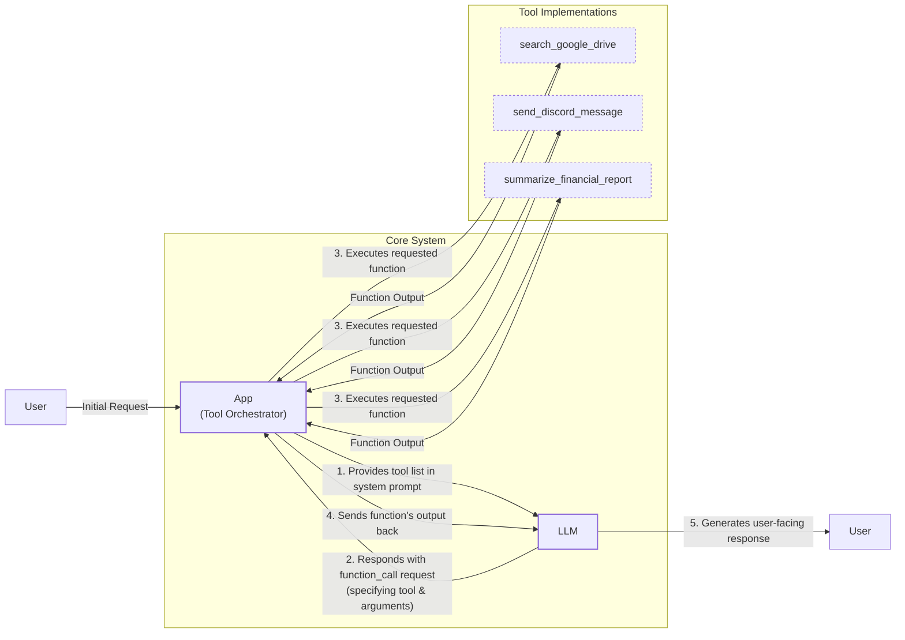
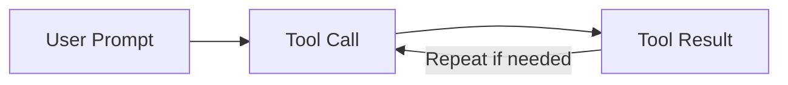

# Agent Tools & Function Calling: Giving Your LLM the Ability to Take Action

In our previous lessons, we explored context engineering and structured outputs, learning how to manage the information we feed into and get out of LLMs. Now, we will explore one of the most critical building blocks of any AI agent: tools.

Tools, also known as function calling, are what transform an LLM from a simple text generator into an agent that can take action in the external world. Understanding how an agent works with tools is essential for building, improving, and debugging modern AI applications. In this lesson, we’ll build this capability from the ground up.

## Understanding Why Agents Need Tools

LLMs have a fundamental limitation: they are powerful pattern matchers and text generators, but they cannot interact with the external world on their own. They need some additional engineering around them to perform actions. This is where tools come in. Think of the LLM as the brain, while tools are its "hands and senses," allowing it to perceive and act in the world beyond its training data [[18]](https://medium.com/@anicomanesh/how-llm-reasoning-powers-the-agentic-ai-revolution-cbefd10ebf3f).

Tools are the bridge between the LLM's internal reasoning and the external world. With them, an LLM becomes an AI agent that can execute specific instructions. Common examples include:
- Accessing real-time information via APIs (e.g., weather, news) [[19]](https://lnu.diva-portal.org/smash/get/diva2:1801354/FULLTEXT01.pdf).
- Interacting with databases or other storage solutions.
- Accessing an agent's long-term memory.
- Executing code or performing precise calculations [[16]](https://arxiv.org/html/2507.08034v1).

## Implementing Tool Calls from Scratch

The best way to understand how tools work is to implement them from scratch. Our goal is to provide the LLM with a list of available tools and let it decide which one to use and with what arguments.

The high-level process involves five steps:
1.  **App:** Provide a list of available tools to the LLM within the system prompt.
2.  **LLM:** Respond with a `function_call` request, specifying the tool and its arguments.
3.  **App:** Execute the requested function in your code.
4.  **App:** Send the function's output back to the LLM.
5.  **LLM:** Use the output to generate a final, user-facing response.


Image 1: Flowchart illustrating the 5-step request-execute-respond flow of calling a tool.

Let's implement a simple example where we mock searching for a document on Google Drive and sending its summary to Discord. In this flow, the application layer is responsible for more than just execution; it can enforce reliability through validation, security checks, or even incorporating a human feedback step before committing to an action [[76]](https://www.zimuel.it/blog/tool_calling_AI_agents).

<aside>
💡

You can find the code for this lesson in the accompanying [GitHub repository](https://github.com/towardsai/course-ai-agents/blob/dev/lessons/06_tools/notebook.ipynb).

</aside>

1. First, we set up our Gemini client, model ID, and a `DOCUMENT` constant to mock a PDF file.
    ```python
    import json
    from typing import Any
    
    from google import genai
    from google.genai import types
    from pydantic import BaseModel, Field
    
    from lessons.utils import env
    
    env.load(required_env_vars=["GOOGLE_API_KEY"])
    
    client = genai.Client()
    
    MODEL_ID = "gemini-2.5-flash"
    
    DOCUMENT = """
    # Q3 2023 Financial Performance Analysis
    
    The Q3 earnings report shows a 20% increase in revenue and a 15% growth in user engagement, 
    beating market expectations. These impressive results reflect our successful product strategy 
    and strong market positioning.
    
    Our core business segments demonstrated remarkable resilience, with digital services leading 
    the growth at 25% year-over-year. The expansion into new markets has proven particularly 
    successful, contributing to 30% of the total revenue increase.
    
    Customer acquisition costs decreased by 10% while retention rates improved to 92%, 
    marking our best performance to date. These metrics, combined with our healthy cash flow 
    position, provide a strong foundation for continued growth into Q4 and beyond.
    """
    ```
2. Next, we define three mocked tools that return hardcoded data.
    ```python
    def search_google_drive(query: str) -> dict:
        """
        Searches for a file on Google Drive and returns its content or a summary.
    
        Args:
            query (str): The search query to find the file, e.g., 'Q3 earnings report'.
    
        Returns:
            dict: A dictionary representing the search results, including file names and summaries.
        """
        return {
            "files": [
                {
                    "name": "Q3_Earnings_Report_2024.pdf",
                    "id": "file12345",
                    "content": DOCUMENT,
                }
            ]
        }
    
    
    def send_discord_message(channel_id: str, message: str) -> dict:
        """
        Sends a message to a specific Discord channel.
    
        Args:
            channel_id (str): The ID of the channel to send the message to, e.g., '#finance'.
            message (str): The content of the message to send.
    
        Returns:
            dict: A dictionary confirming the action, e.g., {"status": "success"}.
        """
        return {
            "status": "success",
            "status_code": 200,
            "channel": channel_id,
            "message_preview": f"{message[:50]}...",
        }
    
    
    def summarize_financial_report(text: str) -> str:
        """
        Summarizes a financial report.
    
        Args:
            text (str): The text to summarize.
    
        Returns:
            str: The summary of the text.
        """
        return "The Q3 2023 earnings report shows strong performance across all metrics with 20% revenue growth, 15% user engagement increase, 25% digital services growth, and improved retention rates of 92%."
    ```
3. For each tool, we create a JSON schema describing its purpose and parameters, which the LLM uses to decide how to call the function. This format is an industry standard [[23]](https://tetrate.io/learn/ai/llm-output-parsing-structured-generation), [[35]](https://is4.ai/blog/our-blog-1/openai-api-vs-anthropic-api-comparison-117).
    ```python
    search_google_drive_schema = {
        "name": "search_google_drive",
        "description": "Searches for a file on Google Drive and returns its content or a summary.",
        "parameters": {
            "type": "object",
            "properties": {
                "query": {
                    "type": "string",
                    "description": "The search query to find the file, e.g., 'Q3 earnings report'.",
                }
            },
            "required": ["query"],
        },
    }
    
    send_discord_message_schema = {
        "name": "send_discord_message",
        "description": "Sends a message to a specific Discord channel.",
        "parameters": {
            "type": "object",
            "properties": {
                "channel_id": {
                    "type": "string",
                    "description": "The ID of the channel to send the message to, e.g., '#finance'.",
                },
                "message": {
                    "type": "string",
                    "description": "The content of the message to send.",
                },
            },
            "required": ["channel_id", "message"],
        },
    }
    
    summarize_financial_report_schema = {
        "name": "summarize_financial_report",
        "description": "Summarizes a financial report.",
        "parameters": {
            "type": "object",
            "properties": {
                "text": {
                    "type": "string",
                    "description": "The text to summarize.",
                },
            },
            "required": ["text"],
        },
    }
    ```
4. We create a tool registry to map tool names to their handlers and schemas.
    ```python
    TOOLS = {
        "search_google_drive": {
            "handler": search_google_drive,
            "declaration": search_google_drive_schema,
        },
        "send_discord_message": {
            "handler": send_discord_message,
            "declaration": summarize_financial_report_schema,
        },
        "summarize_financial_report": {
            "handler": summarize_financial_report,
            "declaration": summarize_financial_report_schema,
        },
    }
    TOOLS_BY_NAME = {tool_name: tool["handler"] for tool_name, tool in TOOLS.items()}
    TOOLS_SCHEMA = [tool["declaration"] for tool in TOOLS.values()]
    ```
    The `TOOLS_BY_NAME` mapping looks like this:
    ```json
    {'search_google_drive': <function search_google_drive at 0x...>, 
     'send_discord_message': <function send_discord_message at 0x...>, 
     'summarize_financial_report': <function summarize_financial_report at 0x...>
    }
    ```
    And here is an example schema from `TOOLS_SCHEMA`:
    ```json
    {
      "name": "search_google_drive",
      "description": "Searches for a file on Google Drive and returns its content or a summary.",
      "parameters": {
        "type": "object",
        "properties": {
          "query": {
            "type": "string",
            "description": "The search query to find the file, e.g., 'Q3 earnings report'."
          }
        },
        "required": [
          "query"
        ]
      }
    }
    ```
5. We define a system prompt that instructs the LLM on tool usage, including the required format and available tool schemas.
    ```python
    TOOL_CALLING_SYSTEM_PROMPT = """
    You are a helpful AI assistant with access to tools that enable you to take actions and retrieve information to better 
    assist users.
    
    ## Tool Usage Guidelines
    
    **When to use tools:**
    - When you need information that is not in your training data
    - When you need to perform actions in external systems and environments
    - When you need real-time, dynamic, or user-specific data
    - When computational operations are required
    
    **Tool selection:**
    - Choose the most appropriate tool based on the user's specific request
    - If multiple tools could work, select the one that most directly addresses the need
    - Consider the order of operations for multi-step tasks
    
    **Parameter requirements:**
    - Provide all required parameters with accurate values
    - Use the parameter descriptions to understand expected formats and constraints
    - Ensure data types match the tool's requirements (strings, numbers, booleans, arrays)
    
    ## Tool Call Format
    
    When you need to use a tool, output ONLY the tool call in this exact format:
    
    ```tool_call
    {{"name": "tool_name", "args": {{"param1": "value1", "param2": "value2"}}}}
    ```
    
    **Critical formatting rules:**
    - Use double quotes for all JSON strings
    - Ensure the JSON is valid and properly escaped
    - Include ALL required parameters
    - Use correct data types as specified in the tool definition
    - Do not include any additional text or explanation in the tool call
    
    ## Response Behavior
    
    - If no tools are needed, respond directly to the user with helpful information
    - If tools are needed, make the tool call first, then provide context about what you're doing
    - After receiving tool results, provide a clear, user-friendly explanation of the outcome
    - If a tool call fails, explain the issue and suggest alternatives when possible
    
    ## Available Tools
    
    <tool_definitions>
    {tools}
    </tool_definitions>
    
    Remember: Your goal is to be maximally helpful to the user. Use tools when they add value, but don't use them unnecessarily. Always prioritize accuracy and user experience.
    """
    ```

Based on the `description` field, the LLM decides if a tool is appropriate. Clear and distinct tool descriptions are therefore critical. With poorly written or overlapping descriptions, the LLM can get confused. For example, generic descriptions like "search documents" are ambiguous; "search documents on Google Drive" is explicit. This clarity is essential when an agent has access to dozens of tools [[32]](https://www.anthropic.com/research/building-effective-agents), [[67]](https://mbrenndoerfer.com/writing/function-calling-llm-structured-tools). Once a tool is selected, the LLM generates the function name and arguments as a structured output. This capability comes from instruction fine-tuning, which trains the model to interpret schemas and produce valid tool calls.

6. Let's test it. We send a user prompt along with our system prompt to the model.
    ```python
    USER_PROMPT = """
    Can you help me find the latest quarterly report and share key insights with the team?
    """
    
    messages = [TOOL_CALLING_SYSTEM_PROMPT.format(tools=str(TOOLS_SCHEMA)), USER_PROMPT]
    
    response = client.models.generate_content(
        model=MODEL_ID,
        contents=messages,
    )
    ```
    The LLM correctly identifies the `search_google_drive` tool and generates the required arguments:
    ```text
    ```tool_call
    {"name": "search_google_drive", "args": {"query": "latest quarterly report"}}
    ```
    ```
    Here's another example:
    ```python
    USER_PROMPT = """
    Please find the Q3 earnings report on Google Drive and send a summary of it to 
    the #finance channel on Discord.
    """
    
    messages = [TOOL_CALLING_SYSTEM_PROMPT.format(tools=str(TOOLS_SCHEMA)), USER_PROMPT]
    
    response = client.models.generate_content(
        model=MODEL_ID,
        contents=messages,
    )
    ```
    The output is:
    ```text
    ```tool_call
    {"name": "search_google_drive", "args": {"query": "Q3 earnings report"}}
    ```
    ```
7. Now, we parse the LLM's response to execute the tool. First, we extract the JSON string.
    ```python
    def extract_tool_call(response_text: str) -> str:
        """
        Extracts the tool call from the response text.
        """
        return response_text.split("```tool_call")[1].split("```")[0].strip()
    
    tool_call_str = extract_tool_call(response.text)
    ```
    This gives us `'{"name": "search_google_drive", "args": {"query": "Q3 earnings report"}}'`.
8. We parse the string into a Python dictionary.
    ```python
    tool_call = json.loads(tool_call_str)
    ```
    This produces `{'name': 'search_google_drive', 'args': {'query': 'Q3 earnings report'}}`.
9. We retrieve the correct function handler from our `TOOLS_BY_NAME` registry.
    ```python
    tool_handler = TOOLS_BY_NAME[tool_call["name"]]
    ```
    The `tool_handler` is now a reference to our `search_google_drive` function.
10. Finally, we execute the function with the arguments provided by the LLM.
    ```python
    tool_result = tool_handler(**tool_call["args"])
    ```
    The output is:
    ```json
    {
      "files": [
        {
          "name": "Q3_Earnings_Report_2024.pdf",
          "id": "file12345",
          "content": "\n# Q3 2023 Financial Performance Analysis\n\nThe Q3 earnings report shows a 20% increase in revenue and a 15% growth in user engagement, \nbeating market expectations... \n"
        }
      ]
    }
    ```
11. We can wrap these steps in a helper function for convenience.
    ```python
    def call_tool(response_text: str, tools_by_name: dict) -> Any:
        """
        Call a tool based on the response from the LLM.
        """
    
        tool_call_str = extract_tool_call(response_text)
        tool_call = json.loads(tool_call_str)
        tool_name = tool_call["name"]
        tool_args = tool_call["args"]
        tool = tools_by_name[tool_name]
    
        return tool(**tool_args)
    ```
    Using this function gives us the same result as before.
    ```python
    call_tool(response.text, tools_by_name=TOOLS_BY_NAME)
    ```
12. The final step in the cycle is to send the tool's result back to the LLM, allowing it to formulate a final response or decide on the next action.
    ```python
    response = client.models.generate_content(
        model=MODEL_ID,
        contents=f"Interpret the tool result: {json.dumps(tool_result, indent=2)}",
    )
    ```
    The LLM interprets the result and provides a user-friendly summary:
    ```text
    The tool result provides the content of a file named `Q3_Earnings_Report_2024.pdf`.
    
    This document is a **Q3 2023 Financial Performance Analysis** and details exceptionally strong results, significantly beating market expectations.
    
    **Key highlights from the report include:**
    * **Revenue Growth:** A 20% increase in revenue.
    * **User Engagement:** 15% growth in user engagement.
    ...
    ```

This covers the basic concept of tool calling. We have successfully implemented function calling from scratch.

## Implementing a Tool Calling Framework from Scratch

Manually defining JSON schemas for every tool is tedious and doesn't scale well. Modern agent frameworks like LangGraph automate this process with a `@tool` decorator. This approach automatically generates and tracks schemas from decorated functions, respecting the Don't Repeat Yourself (DRY) principle by creating a single source of truth for tool definitions [[26]](https://openai.github.io/openai-agents-python/tools/), [[29]](https://docs.langchain.com/oss/python/langchain/tools). This approach not only cleans up the syntax but also improves precision. By automatically generating a structured schema from type annotations, it reduces ambiguity and the risk of model errors, ensuring seamless compatibility with function-calling APIs from providers like OpenAI and Google [[77]](https://towardsai.net/p/machine-learning/how-tools-turn-into-agents-what-actually-happens-at-runtime).

Let's build a simple framework with a `@tool` decorator to automate schema generation from a function's signature and docstring.

1. First, we define a `ToolFunction` class to wrap our decorated functions and store their schemas.
    ```python
    from inspect import Parameter, signature
    from typing import Any, Callable, Dict, Optional
    
    
    class ToolFunction:
        def __init__(self, func: Callable, schema: Dict[str, Any]) -> None:
            self.func = func
            self.schema = schema
            self.__name__ = func.__name__
            self.__doc__ = func.__doc__
    
        def __call__(self, *args: Any, **kwargs: Any) -> Any:
            return self.func(*args, **kwargs)
    ```
2. Next, we implement the `@tool` decorator. It inspects the function's signature and docstring to automatically generate the JSON schema.
    ```python
    def tool(description: Optional[str] = None) -> Callable[[Callable], ToolFunction]:
        """
        A decorator that creates a tool schema from a function.
    
        Args:
            description: Optional override for the function's docstring
    
        Returns:
            A decorator function that wraps the original function and adds a schema
        """
    
        def decorator(func: Callable) -> ToolFunction:
            sig = signature(func)
            properties = {}
            required = []
    
            for param_name, param in sig.parameters.items():
                if param_name == "self":
                    continue
    
                param_schema = {
                    "type": "string",
                    "description": f"The {param_name} parameter",
                }
    
                if param.default == Parameter.empty:
                    required.append(param_name)
    
                properties[param_name] = param_schema
    
            schema = {
                "name": func.__name__,
                "description": description or func.__doc__ or f"Executes the {func.__name__} function.",
                "parameters": {
                    "type": "object",
                    "properties": properties,
                    "required": required,
                },
            }
    
            return ToolFunction(func, schema)
    
        return decorator
    ```
3. Now, we can redefine our tools using the new decorator.
    ```python
    @tool()
    def search_google_drive_example(query: str) -> dict:
        """Search for files in Google Drive."""
        return {"files": ["Q3 earnings report"]}
    
    @tool()
    def send_discord_message_example(channel_id: str, message: str) -> dict:
        """Send a message to a Discord channel."""
        return {"message": "Message sent successfully"}
    
    @tool()
    def summarize_financial_report_example(text: str) -> str:
        """Summarize the contents of a financial report."""
        return "Financial report summarized successfully"
    
    
    tools = [
        search_google_drive_example,
        send_discord_message_example,
        summarize_financial_report_example,
    ]
    ```
4. The decorated `search_google_drive_example` is now a `ToolFunction` object. It contains the auto-generated schema, which is identical to the one we created manually, and a reference to the original function handler.
    ```python
    tools_by_name = {tool.schema["name"]: tool.func for tool in tools}
    tools_schema = [tool.schema for tool in tools]
    ```
    The schema is:
    ```json
    [
      {
        "name": "search_google_drive_example",
        "description": "Search for files in Google Drive.",
        "parameters": {
          "type": "object",
          "properties": {
            "query": {
              "type": "string",
              "description": "The query parameter"
            }
          },
          "required": [
            "query"
          ]
        }
      },
      ...
    ]
    ```
5. We can now use this auto-generated schema with the LLM.
    ```python
    USER_PROMPT = """
    Please find the Q3 earnings report on Google Drive and send a summary of it to 
    the #finance channel on Discord.
    """
    
    messages = [TOOL_CALLING_SYSTEM_PROMPT.format(tools=str(tools_schema)), USER_PROMPT]
    
    response = client.models.generate_content(
        model=MODEL_ID,
        contents=messages,
    )
    ```
    The model responds with the expected tool call:
    ```text
    ```tool_call
    {"name": "search_google_drive_example", "args": {"query": "Q3 earnings report"}}
    ```
    ```
6. We execute it using our existing `call_tool` function.
    ```python
    call_tool(response.text, tools_by_name=tools_by_name)
    ```
    It outputs:
    ```json
    {
      "files": [
        "Q3 earnings report"
      ]
    }
    ```

Voilà! We have our little tool-calling framework. This implementation is similar to what happens behind the scenes in frameworks like LangGraph.

## Implementing Production-Level Tool Calls with Gemini

In production, we use native API interfaces from Gemini or OpenAI. They handle the prompt engineering, making code more robust and maintainable [[70]](https://www.decodingai.com/p/tool-calling-from-scratch-to-production).

Let's see how to use Gemini's native tool-calling capabilities.

1.  Instead of crafting a system prompt, we define a `GenerateContentConfig` object and pass our tool schemas directly to it.
    ```python
    tools = [
        types.Tool(
            function_declarations=[
                types.FunctionDeclaration(**search_google_drive_schema),
                types.FunctionDeclaration(**send_discord_message_schema),
            ]
        )
    ]
    config = types.GenerateContentConfig(
        tools=tools,
        tool_config=types.ToolConfig(function_calling_config=types.FunctionCallingConfig(mode="ANY")),
    )
    ```
2.  We can now call the model with just the user prompt, as the `config` object handles the tool instructions.
    ```python
    response = client.models.generate_content(
        model=MODEL_ID,
        contents=USER_PROMPT,
        config=config,
    )
    ```
    The response contains a `FunctionCall` object:
    ```python
    FunctionCall(id=None, args={'query': 'Q3 earnings report'}, name='search_google_drive')
    ```
3.  To simplify even further, the `google-genai` SDK can automatically generate schemas from Python functions. We can pass our functions directly to the `GenerateContentConfig`, eliminating manual schema definitions entirely.
    ```python
    config = types.GenerateContentConfig(
        tools=[search_google_drive, send_discord_message]
    )
    ```
4.  We create a simplified `call_tool` function to execute the `FunctionCall` object returned by Gemini.
    ```python
    def call_tool(function_call) -> Any:
        tool_name = function_call.name
        tool_args = {key: value for key, value in function_call.args.items()}
        tool_handler = TOOLS_BY_NAME[tool_name]
        return tool_handler(**tool_args)
    
    tool_result = call_tool(response.candidates[0].content.parts[0].function_call)
    ```
    By using the native SDK, we reduced dozens of lines of code to just a few. Other APIs from OpenAI and Anthropic follow a similar logic, making these concepts transferable [[71]](https://apxml.com/courses/prompt-engineering-llm-application-development/chapter-4-interacting-with-llm-apis/overview-common-llm-apis), [[73]](https://myengineeringpath.dev/tools/gemini-guide/).

## Using Pydantic Models as Tools for On-Demand Structured Outputs

Connecting this lesson with what we learned about structured outputs in Lesson 4, we can treat a Pydantic model as a tool. This elegant pattern is useful in agentic scenarios where an agent performs several intermediate steps and then dynamically decides to output a final answer in a structured format. This ensures the final output has a predictable schema that can be easily used by downstream Python code.

Image 2 illustrates an agent that calls multiple tools in a loop, with the final call dedicated to generating a structured output via a Pydantic model.

```mermaid
flowchart LR
    %% AI Agent Initialization
    A["AI Agent"]

    %% Iterative Tool Calling Loop
    subgraph "Iterative Tool Calls"
        direction LR
        TCI["Tool Call (Iterative)"]
        PTO["Process Tool Output"]
        MTN{"More Tools Needed?"}
    end

    %% Final Structured Output
    FSO["Structured Output Tool Call"]
    PMO["Pydantic Model Output"]
    AFR["Agent Final Response"]

    A -- "starts process" --> TCI
    TCI -- "returns raw output" --> PTO
    PTO -- "evaluates & decides" --> MTN
    MTN -- "Yes (continue)" --> TCI
    MTN -- "No (final step)" --> FSO
    FSO -- "generates structured data" --> PMO
    PMO -- "provides" --> AFR

    %% Visual Grouping
    classDef agentNode stroke-width:2px
    classDef toolCallNode stroke-dasharray:3,3
    classDef finalOutputNode stroke-width:2px,font-weight:bold

    class A agentNode
    class TCI, FSO toolCallNode
    class PMO, AFR finalOutputNode
```
Image 2: A Mermaid diagram illustrating an AI agent that calls multiple tools in a loop, with the last tool call being for structured outputs using a Pydantic model.

Let's see how to implement this.

1.  We define a `DocumentMetadata` Pydantic model, just as we did in Lesson 4.
    ```python
    class DocumentMetadata(BaseModel):
        """A class to hold structured metadata for a document."""
    
        summary: str = Field(description="A concise, 1-2 sentence summary of the document.")
        tags: list[str] = Field(description="A list of 3-5 high-level tags relevant to the document.")
        keywords: list[str] = Field(description="A list of specific keywords or concepts mentioned.")
        quarter: str = Field(description="The quarter of the financial year described in the document (e.g., Q3 2023).")
        growth_rate: str = Field(description="The growth rate of the company described in the document (e.g., 10%).")
    ```
2.  We create an `extraction_tool` by passing the Pydantic model's JSON schema as the function's parameters.
    ```python
    extraction_tool = types.Tool(
        function_declarations=[
            types.FunctionDeclaration(
                name="extract_metadata",
                description="Extracts structured metadata from a financial document.",
                parameters=DocumentMetadata.model_json_schema(),
            )
        ]
    )
    config = types.GenerateContentConfig(
        tools=[extraction_tool],
        tool_config=types.ToolConfig(function_calling_config=types.FunctionCallingConfig(mode="ANY")),
    )
    ```
3.  We prompt the model to analyze the document and extract the metadata.
    ```python
    prompt = f"""
    Please analyze the following document and extract its metadata.
    
    Document:
    --- 
    {DOCUMENT}
    --- 
    """
    
    response = client.models.generate_content(model=MODEL_ID, contents=prompt, config=config)
    ```
4.  The model returns a `function_call` with the extracted data as arguments. We then validate this data by instantiating our `DocumentMetadata` model.
    ```python
    function_call = response.candidates[0].content.parts[0].function_call
    
    try:
        document_metadata = DocumentMetadata(**function_call.args)
        print("Validation successful!")
    except Exception as e:
        print(f"Validation failed: {e}")
    ```
    It outputs:
    ```text
    Validation successful!
    ```
This pattern is a powerful way to ensure reliable, structured outputs in complex agentic workflows [[5]](https://pydantic.dev/docs/ai/core-concepts/output/).

## The Downsides of Running Tools in a Loop

So far, we have focused on single-turn tool calls. The next step is to build a more sophisticated agent that can run tools in a loop, chaining them together to solve multi-step problems. This allows the LLM to decide which tool to use at each step based on the output of previous tools.


Image 3: A Mermaid diagram illustrating a sequential tool calling loop.

This approach offers flexibility and adaptability, but it has limitations. Let's implement a multi-step task where the agent must find a report on Google Drive and then post a summary to Discord.

1.  We configure the model with all available tools.
    ```python
    tools = [
        types.Tool(
            function_declarations=[
                types.FunctionDeclaration(**search_google_drive_schema),
                types.FunctionDeclaration(**send_discord_message_schema),
                types.FunctionDeclaration(**summarize_financial_report_schema),
            ]
        )
    ]
    config = types.GenerateContentConfig(
        tools=tools,
        tool_config=types.ToolConfig(function_calling_config=types.FunctionCallingConfig(mode="ANY")),
    )
    ```
2.  We define the user's multi-step request and initialize a message history.
    ```python
    USER_PROMPT = """
    Please find the Q3 earnings report on Google Drive and send a summary of it to 
    the #finance channel on Discord.
    """
    messages = [USER_PROMPT]
    ```
3.  We implement a loop that continues as long as the model requests a function call. In each iteration, we execute the tool, add the result to the message history, and call the model again.
    ```python
    response = client.models.generate_content(
        model=MODEL_ID, contents=messages, config=config
    )
    response_message_part = response.candidates[0].content.parts[0]
    messages.append(response.candidates[0].content)
    
    max_iterations = 3
    while hasattr(response_message_part, "function_call") and max_iterations > 0:
        tool_result = call_tool(response_message_part.function_call)
    
        function_response_part = types.Part.from_function_response(
            name=response_message_part.function_call.name,
            response={"result": tool_result},
        )
        messages.append(function_response_part)
    
        response = client.models.generate_content(
            model=MODEL_ID, contents=messages, config=config
        )
    
        response_message_part = response.candidates[0].content.parts[0]
        messages.append(response.candidates[0].content)
        max_iterations -= 1
    ```
    The agent successfully completes the task by first calling `search_google_drive`, then `summarize_financial_report`, and finally `send_discord_message`.

However, this simple sequential loop has significant drawbacks. It doesn't allow the LLM to interpret a tool's output before deciding on the next action, forcing it to act without thinking [[9]](https://myengineeringpath.dev/genai-engineer/agentic-patterns/), [[10]](https://blogs.oracle.com/developers/what-is-the-ai-agent-loop-the-core-architecture-behind-autonomous-ai-systems). This can lead to inefficient paths or getting stuck. Furthermore, it misses a key optimization: parallelism. When tool calls are independent, they can be executed simultaneously. For instance, if three API calls each take 200ms, a parallel approach takes only 200ms, while a sequential loop takes 600ms [[78]](https://airbyte.com/agentic-data/parallel-tool-calls-llm). This requires classifying tools as **read-only** (safe to parallelize) or **state-modifying** (must be sequential) [[79]](https://agentic-patterns.com/patterns/parallel-tool-call-learning/).

Lessons from robotics control systems also apply; reliable loops require features like error handling with retry logic and execution tracing for debugging, which are absent in our simple implementation [[80]](https://arxiv.org/pdf/2601.20334).

These limitations motivated the development of more advanced patterns like **ReAct** (Reasoning and Acting), which explicitly interleaves reasoning steps with tool calls. We will explore ReAct in detail in Lessons 7 and 8.

## Popular Tools Used Within the Industry

To ground this lesson in real-world applications, here are some of the most popular tool categories used by AI engineers today:

1.  **Knowledge & Memory Access:** Querying vector databases for RAG or using text-to-SQL to interact with traditional databases [[13]](https://promethium.ai/guides/text-to-sql-basics-benefits/). We cover memory and RAG in Lessons 9 and 10.

2.  **Web Search & Browsing:** Interfacing with search engine APIs (Google, Bing) and web scrapers to fetch online content for research agents or chatbots [[17]](https://mantraideas.com/llm-web-search/).

3.  **Code Execution:** Executing code in a sandboxed Python interpreter for calculations, data manipulation, and analysis, overcoming the mathematical limitations of LLMs [[16]](https://arxiv.org/html/2507.08034v1).

4.  **Other Popular Tools:** Integrating with external APIs (calendars, email) in enterprise apps or performing file system operations in productivity tools.

The rise of agentic systems also reshapes API design. APIs intended for LLMs must be built with clear semantics and the right level of granularity, allowing agents to request precise data without being overwhelmed by broad, inefficient endpoints [[81]](https://www.gravitee.io/blog/designing-apis-for-llm-apps).

## Conclusion

Tool calling is a core concept in AI engineering that gives LLMs the ability to act. We have seen how to implement it from scratch, use native API features for production-ready code, and chain tools together for multi-step tasks.

This is just the beginning. The limitations of simple tool loops lead to more advanced agentic patterns. In our next lesson, we will explore the theory behind planning and the ReAct framework, which allows agents to reason about their actions and build more robust strategies.

## References

- [1] Ntinopoulos, V., Biefer, H. R. C., Tudorache, I., Papadopoulos, N., Odavic, D., Risteski, P., Haeussler, A., & Dzemali, O. (2025). Large language models for data extraction from unstructured and semi-structured electronic health records: a multiple model performance evaluation. BMJ Health & Care Informatics, 32(1), e101139. https://pmc.ncbi.nlm.nih.gov/articles/PMC11751965/
- [2] Evaluation of LLM-based Strategies for the Extraction of Food Product Information from Online Shops. (n.d.). arXiv. https://arxiv.org/html/2506.21585v1
- [3] Team, S. (2024, August 29). Type Safety in Python: Pydantic vs. Data Classes vs. Annotations vs. TypedDicts | Speakeasy. Speakeasy. https://www.speakeasy.com/blog/pydantic-vs-dataclasses
- [4] Validators approach in Python - Pydantic vs. Dataclasses. (n.d.). Codetain - End-to-end Software Development. https://codetain.com/blog/validators-approach-in-python-pydantic-vs-dataclasses/
- [5] Output. (n.d.). Pydantic. https://pydantic.dev/docs/ai/core-concepts/output/
- [6] Multi-Agent Applications. (n.d.). Pydantic. https://pydantic.dev/docs/ai/guides/multi-agent-applications/
- [7] Response schema from pydantic. (n.d.). Google AI. https://discuss.ai.google.dev/t/response-schema-from-pydantic/50028
- [8] Tools. (n.d.). Pydantic. https://pydantic.dev/docs/ai/tools-toolsets/tools/
- [9] Agentic Design Patterns — Visual Architecture Guide. (n.d.). My Engineering Path. https://myengineeringpath.dev/genai-engineer/agentic-patterns/
- [10] What Is the AI Agent Loop? The Core Architecture Behind Autonomous AI Systems. (2026, March 16). Oracle. https://blogs.oracle.com/developers/what-is-the-ai-agent-loop-the-core-architecture-behind-autonomous-ai-systems
- [11] Agentic Design Patterns Part 3, Tool Use. (n.d.). DeepLearning.AI. https://www.deeplearning.ai/the-batch/agentic-design-patterns-part-3-tool-use/
- [12] Efficient Tool Use with Chain-of-Abstraction Reasoning. (2024). arXiv. https://arxiv.org/pdf/2401.17464v3
- [13] Text-to-SQL: What It Is, How It Works, and Why It Matters in 2025. (2025, November 13). Promethium. https://promethium.ai/guides/text-to-sql-basics-benefits/
- [14] ReAct vs Plan-and-Execute: A Practical Comparison of LLM Agent Patterns. (n.d.). DEV Community. https://dev.to/jamesli/react-vs-plan-and-execute-a-practical-comparison-of-llm-agent-patterns-4gh9
- [15] What is Tool Calling? Connecting LLMs to Your Data. (n.d.). YouTube. https://www.youtube.com/watch?v=h8gMhXYAv1k
- [16] To overcome these challenges, it is becoming necessary to integrate LLMs with external tools like calculators, calendars, and databases. (2025). arXiv. https://arxiv.org/html/2507.08034v1
- [17] Modern LLMs don’t just generate text—they can also “call functions” or use “tools.” (n.d.). Mantra Ideas. https://mantraideas.com/llm-web-search/
- [18] Instrumental reasoning manifests in three forms. (n.d.). Medium. https://medium.com/@anicomanesh/how-llm-reasoning-powers-the-agentic-ai-revolution-cbefd10ebf3f
- [19] LLMs show an impressive ability to understand the intention of the user, generate a custom answer to his queries or solve specific problems. (2023). LNU. https://lnu.diva-portal.org/smash/get/diva2:1801354/FULLTEXT01.pdf
- [20] The use of Large Language Models (LLMs) like GPT-4 and ChatGPT, combined with OpenAI Function Calling (now generally referred to as Tools), represents a paradigm shift in processing unstructured data from documents. (n.d.). Medium. https://medium.com/@yugalnandurkar5/llm-engineering-part-i-fa48d4307d26
- [21] Prompting best practices for tool use / function calling. (n.d.). OpenAI Community. https://community.openai.com/t/prompting-best-practices-for-tool-use-function-calling/1123036
- [22] Building Production-Ready LLM Applications: Bulletproof LLM Tool Calling with Advanced JSON. (n.d.). Medium. https://medium.com/@hariomshahu101/building-production-ready-llm-applications-bulletproof-llm-tool-calling-with-advanced-json-b95ce8889f4e
- [23] Function calling frames LLM interactions as tool usage with defined functions and parameter schemas in JSON Schema syntax. (n.d.). Tetrate. https://tetrate.io/learn/ai/llm-output-parsing-structured-generation
- [24] Tool schemas use JSON Schema for input definitions. (n.d.). APXML. https://apxml.com/courses/building-advanced-llm-agent-tools/chapter-1-llm-agent-tooling-foundations/tool-input-output-schemas
- [25] OpenAI-style function calling uses JSON structure. (n.d.). mbrenndoerfer.com. https://mbrenndoerfer.com/writing/function-calling-llm-structured-tools
- [26] Tools. (n.d.). OpenAI Agents SDK. https://openai.github.io/openai-agents-python/tools/
- [27] Custom Tools. (n.d.). Strands. https://strandsagents.com/docs/user-guide/concepts/tools/custom-tools/
- [28] Tools. (n.d.). Pydantic. https://pydantic.dev/docs/ai/tools-toolsets/tools/
- [29] Tools. (n.d.). LangChain. https://docs.langchain.com/oss/python/langchain/tools
- [30] Tool. (n.d.). LangChain. https://reference.langchain.com/python/langchain-core/tools/convert/tool
- [31] Building AI Agents from scratch - Part 1: Tool use. (2024, December 21). Swirl AI. https://www.newsletter.swirlai.com/p/building-ai-agents-from-scratch-part
- [32] Building effective agents. (n.d.). Anthropic. https://www.anthropic.com/research/building-effective-agents
- [33] Best practices to build LLM tools in 2025. (2025, June 9). Techinfotech. https://techinfotech.tech.blog/2025/06/09/best-practices-to-build-llm-tools-in-2025/
- [34] Anthropic vs OpenAI. (n.d.). lil'big things. https://www.lilbigthings.com/post/anthropic-vs-openai
- [35] OpenAI API vs Anthropic API Comparison. (n.d.). is4.ai. https://is4.ai/blog/our-blog-1/openai-api-vs-anthropic-api-comparison-117
- [36] OpenAI API vs Anthropic API. (n.d.). MG Software. https://www.mgsoftware.nl/en/vergelijking/openai-api-vs-anthropic-api
- [37] OpenAI API vs Anthropic API. (n.d.). SFAI Labs. https://sfailabs.com/guides/openai-api-vs-anthropic-api
- [38] OpenAI Responses API vs Chat Completions vs Anthropic Messages API. (n.d.). Portkey.ai. https://portkey.ai/blog/open-ai-responses-api-vs-chat-completions-vs-anthropic-anthropic-messages-api
- [39] Function Calling Guide: Google DeepMind Gemini 2.0 Flash. (n.d.). Phil Schmid. https://www.philschmid.de/gemini-function-calling
- [40] Function calling with the Gemini API. (n.d.). Google AI for Developers. https://ai.google.dev/gemini-api/docs/function-calling
- [41] Gemini Function Calling. (n.d.). Guillaume Laforge. https://glaforge.dev/posts/2023/12/22/gemini-function-calling/
- [65] Tool Descriptions Are Critical: Making Better LLM Tools. (n.d.). Towards AI. https://pub.towardsai.net/tool-descriptions-are-critical-making-better-llm-tools-research-capability-b315851471e7
- [66] Tool Input and Output Schema Design. (n.d.). APXML. https://apxml.com/courses/building-advanced-llm-agent-tools/chapter-1-llm-agent-tooling-foundations/tool-input-output-schemas
- [67] Function Call Generation. (n.d.). mbrenndoerfer.com. https://mbrenndoerfer.com/writing/function-calling-llm-structured-tools
- [68] Underlying Factors Behind Inconsistency in LLM Responses with Multi-Tool Calling. (n.d.). Medium. https://medium.com/@abhaychougule0907/underlying-factors-behind-inconsistency-in-llm-responses-with-multi-tool-calling-628ce7b4de76
- [69] Problem Setup. (2025). arXiv. https://arxiv.org/html/2505.18135v2
- [70] Tool Calling: From Scratch to Production. (n.d.). Decoding AI. https://www.decodingai.com/p/tool-calling-from-scratch-to-production
- [71] Overview of Common LLM APIs (OpenAI, Anthropic, etc.). (n.d.). APXML. https://apxml.com/courses/prompt-engineering-llm-application-development/chapter-4-interacting-with-llm-apis/overview-common-llm-apis
- [72] LLM Providers & Gen AI Platforms Compared. (2025, June 19). Orchestra. https://www.getorchestra.io/guides/llm-providers-gen-ai-platforms-compared
- [73] Function Calling. (n.d.). My Engineering Path. https://myengineeringpath.dev/tools/gemini-guide/
- [74] LLM API Differences That Break Your Code: Anthropic vs OpenAI vs Google. (n.d.). FutureSearch. https://futuresearch.ai/blog/llm-provider-quirks/
- [75] Tool Calling Agent From Scratch. (n.d.). YouTube. https://www.youtube.com/watch?v=ApoDzZP8_ck
- [76] Tool Calling for AI Agents. (n.d.). Zimuel. https://www.zimuel.it/blog/tool_calling_AI_agents
- [77] How Tools Turn into Agents: What Actually Happens at Runtime? (n.d.). Towards AI. https://towardsai.net/p/machine-learning/how-tools-turn-into-agents-what-actually-happens-at-runtime
- [78] Parallel Tool Calls: The Secret to Faster, More Efficient LLM Agents. (n.d.). Airbyte. https://airbyte.com/agentic-data/parallel-tool-calls-llm
- [79] Parallel Tool Call Learning. (n.d.). Agentic Patterns. https://agentic-patterns.com/patterns/parallel-tool-call-learning/
- [80] Towards Human-Level Task-and-Motion Planning in the Wild. (2026). arXiv. https://arxiv.org/pdf/2601.20334
- [81] Designing APIs for LLM apps. (n.d.). Gravitee. https://www.gravitee.io/blog/designing-apis-for-llm-apps