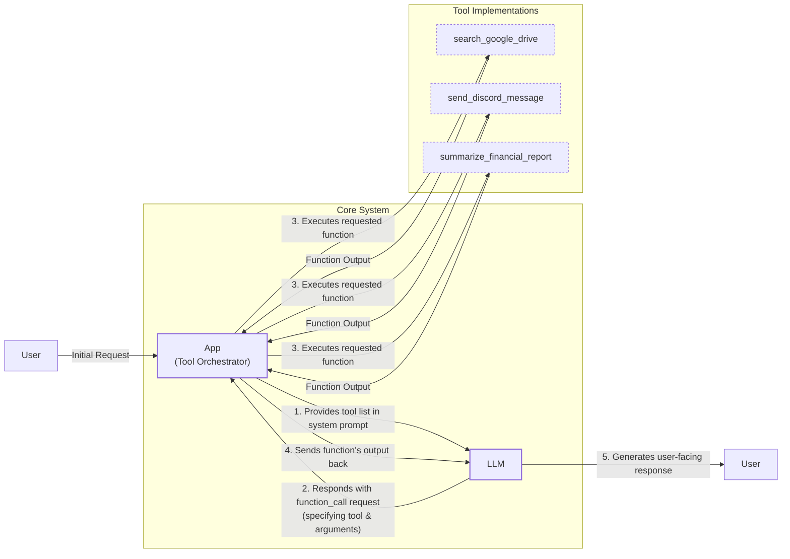
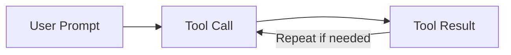

# Agent Tools & Function Calling: Giving Your LLM the Ability to Take Action

In previous lessons, we learned to manage the information we feed into and get out of LLMs. Now, we will explore a critical building block of any AI agent: tools. Also known as function calling, tools transform an LLM from a text generator into an agent that can act. Understanding how this works is essential for building modern AI applications.

## Understanding Why Agents Need Tools

LLMs have a fundamental limitation: they are powerful pattern matchers and text generators, but they cannot interact with the external world on their own. They need some additional engineering around them to perform actions. This is where tools come in. Think of the LLM as the brain, while tools are its "hands and senses," allowing it to perceive and act in the world beyond its training data [[1]](https://medium.com/@anicomanesh/how-llm-reasoning-powers-the-agentic-ai-revolution-cbefd10ebf3f).

Tools are the bridge between the LLM's internal reasoning and the external world. With them, an LLM becomes an AI agent that can execute specific instructions. Popular tools allow agents to access real-time information through APIs, interact with storage solutions like a PostgreSQL database or an S3 data lake, access long-term memory, execute code, and perform precise calculations beyond their training data [[2]](https://lnu.diva-portal.org/smash/get/diva2:1801354/FULLTEXT01.pdf), [[3]](https://arxiv.org/html/2507.08034v1).

## Implementing Tool Calls from Scratch

The best way to understand how tools work is to implement them from scratch. Our goal is to provide the LLM with a list of available tools and let it decide which one to use and with what arguments.

The high-level process involves five steps:
1.  **App:** Provide a list of available tools to the LLM within the system prompt.
2.  **LLM:** Respond with a `function_call` request, specifying the tool and its arguments.
3.  **App:** Execute the requested function in your code.
4.  **App:** Send the function's output back to the LLM.
5.  **LLM:** Use the output to generate a final, user-facing response.


Image 1: Flowchart illustrating the 5-step request-execute-respond flow of calling a tool.

Let's implement a simple example where we mock searching for a document on Google Drive and sending its summary to Discord. In this flow, the application layer is responsible for more than just execution; it can enforce reliability through validation, security checks, or even incorporating a human feedback step before committing to an action [[4]](https://www.zimuel.it/blog/tool_calling_AI_agents).

<aside>
💡

You can find the code for this lesson in the accompanying [GitHub repository](https://github.com/towardsai/course-ai-agents/blob/dev/lessons/06_tools/notebook.ipynb).

</aside>

1. We begin by setting up our environment and defining three mocked tools.
    ```python
    import json
    from typing import Any
    from google import genai
    from google.genai import types
    from pydantic import BaseModel, Field
    from lessons.utils import env
    
    env.load(required_env_vars=["GOOGLE_API_KEY"])
    client = genai.Client()
    MODEL_ID = "gemini-2.5-flash"
    
    DOCUMENT = "..." # Document content omitted for brevity
    
    def search_google_drive(query: str) -> dict:
        """Searches for a file on Google Drive..."""
        # Mocked implementation
        return {"files": [{"name": "Q3_Earnings_Report_2024.pdf", "id": "file12345", "content": DOCUMENT}]}
    
    def send_discord_message(channel_id: str, message: str) -> dict:
        """Sends a message to a specific Discord channel..."""
        # Mocked implementation
        return {"status": "success", "channel": channel_id}
    
    def summarize_financial_report(text: str) -> str:
        """Summarizes a financial report..."""
        # Mocked implementation
        return "The Q3 2023 earnings report shows strong performance..."
    ```
2. For each tool, we create a JSON schema describing its purpose and parameters. This format is an industry standard for defining tools for LLMs [[5]](https://tetrate.io/learn/ai/llm-output-parsing-structured-generation), [[6]](https://is4.ai/blog/our-blog-1/openai-api-vs-anthropic-api-comparison-117).
    ```python
    search_google_drive_schema = {
        "name": "search_google_drive",
        "description": "Searches for a file on Google Drive...",
        "parameters": {"type": "object", "properties": {"query": {"type": "string", "description": "The search query..."}}, "required": ["query"]},
    }
    # Other schemas omitted for brevity
    ```
3. We create a tool registry to map names to handlers and aggregate the schemas.
    ```python
    TOOLS = {
        "search_google_drive": {"handler": search_google_drive, "declaration": search_google_drive_schema},
        "send_discord_message": {"handler": send_discord_message, "declaration": send_discord_message_schema},
        "summarize_financial_report": {"handler": summarize_financial_report, "declaration": summarize_financial_report_schema},
    }
    TOOLS_BY_NAME = {tool_name: tool["handler"] for tool_name, tool in TOOLS.items()}
    TOOLS_SCHEMA = [tool["declaration"] for tool in TOOLS.values()]
    ```
4. We define a system prompt that instructs the LLM on how to use the tools. Based on the `description` field, the LLM decides if a tool is appropriate. Clear and distinct tool descriptions are therefore critical, especially when an agent has access to dozens of tools [[7]](https://www.anthropic.com/research/building-effective-agents), [[8]](https://mbrenndoerfer.com/writing/function-calling-llm-structured-tools).
    ```python
    TOOL_CALLING_SYSTEM_PROMPT = """
    You are a helpful AI assistant with access to tools...
    
    ## Available Tools
    <tool_definitions>
    {tools}
    </tool_definitions>
    ...
    """
    ```
5. Let's test it. We send a user prompt along with our system prompt to the model.
    ```python
    USER_PROMPT = "Please find the Q3 earnings report on Google Drive and send a summary of it to the #finance channel on Discord."
    messages = [TOOL_CALLING_SYSTEM_PROMPT.format(tools=str(TOOLS_SCHEMA)), USER_PROMPT]
    response = client.models.generate_content(model=MODEL_ID, contents=messages)
    ```
    The LLM correctly identifies the `search_google_drive` tool and generates the required arguments:
    ```text
    ```tool_call
    {"name": "search_google_drive", "args": {"query": "Q3 earnings report"}}
    ```
    ```
6. We then parse the LLM's response, execute the tool, and get the result.
    ```python
    def extract_tool_call(response_text: str) -> str:
        return response_text.split("```tool_call")[1].split("```")[0].strip()

    tool_call_str = extract_tool_call(response.text)
    tool_call = json.loads(tool_call_str)
    tool_handler = TOOLS_BY_NAME[tool_call["name"]]
    tool_result = tool_handler(**tool_call["args"])
    ```
7. The final step is to send the tool's result back to the LLM, allowing it to formulate a final response or decide on the next action.
    ```python
    response = client.models.generate_content(
        model=MODEL_ID,
        contents=f"Interpret the tool result: {json.dumps(tool_result, indent=2)}",
    )
    ```
    The LLM interprets the result and provides a user-friendly summary. This covers the basic concept of tool calling.

## Implementing a Tool Calling Framework from Scratch

Manually defining JSON schemas for every tool is cumbersome and violates the Don't Repeat Yourself (DRY) principle. Modern agent frameworks like LangGraph solve this with a `@tool` decorator that automatically generates a schema from a function's signature and docstring [[9]](https://openai.github.io/openai-agents-python/tools/), [[10]](https://docs.langchain.com/oss/python/langchain/tools). This approach creates a single source of truth for tool definitions and ensures compatibility with function-calling APIs [[11]](https://towardsai.net/p/machine-learning/how-tools-turn-into-agents-what-actually-happens-at-runtime).

Let's build our own simple framework to see how this works.

1.  First, we define a `ToolFunction` class to wrap our decorated functions and store their schemas, and a `@tool` decorator that inspects the function to generate the schema.
    ```python
    from inspect import Parameter, signature
    from typing import Any, Callable, Dict, Optional
    
    class ToolFunction:
        def __init__(self, func: Callable, schema: Dict[str, Any]) -> None:
            self.func = func
            self.schema = schema
            # ...
    
    def tool(description: Optional[str] = None) -> Callable[[Callable], ToolFunction]:
        def decorator(func: Callable) -> ToolFunction:
            # ... (schema generation logic) ...
            return ToolFunction(func, schema)
        return decorator
    ```
2.  Now, we can redefine our tools using the new decorator.
    ```python
    @tool()
    def search_google_drive_example(query: str) -> dict:
        """Search for files in Google Drive."""
        return {"files": ["Q3 earnings report"]}
    
    # ... other decorated functions
    
    tools = [search_google_drive_example, ...]
    tools_by_name = {tool.schema["name"]: tool.func for tool in tools}
    tools_schema = [tool.schema for tool in tools]
    ```
3.  The decorated function is now a `ToolFunction` object containing the auto-generated schema and a reference to the original handler. We can use this schema just as we did before.
    ```python
    messages = [TOOL_CALLING_SYSTEM_PROMPT.format(tools=str(tools_schema)), USER_PROMPT]
    response = client.models.generate_content(model=MODEL_ID, contents=messages)
    ```
    The model responds with the expected tool call, which we can execute. Voilà! We have our little tool-calling framework.

## Implementing Production-Level Tool Calls with Gemini

In production, we use native API interfaces from Gemini or OpenAI. They handle the prompt engineering, making code more robust and maintainable [[12]](https://www.decodingai.com/p/tool-calling-from-scratch-to-production).

Let's see how to use Gemini's native tool-calling capabilities.

1.  Instead of crafting a system prompt, we define a `GenerateContentConfig` object and pass our tool schemas directly to it.
    ```python
    tools = [
        types.Tool(
            function_declarations=[
                types.FunctionDeclaration(**search_google_drive_schema),
                # ...
            ]
        )
    ]
    config = types.GenerateContentConfig(
        tools=tools,
        tool_config=types.ToolConfig(function_calling_config=types.FunctionCallingConfig(mode="ANY")),
    )
    ```
2.  We can now call the model with just the user prompt, as the `config` object handles the tool instructions.
    ```python
    response = client.models.generate_content(
        model=MODEL_ID,
        contents=USER_PROMPT,
        config=config,
    )
    ```
3.  To simplify even further, the `google-genai` SDK can automatically generate schemas from Python functions. We can pass our functions directly to the `GenerateContentConfig`, eliminating manual schema definitions entirely.
    ```python
    config = types.GenerateContentConfig(
        tools=[search_google_drive, send_discord_message]
    )
    ```
4.  We create a simplified `call_tool` function to execute the `FunctionCall` object returned by Gemini.
    ```python
    def call_tool(function_call) -> Any:
        tool_name = function_call.name
        tool_args = {key: value for key, value in function_call.args.items()}
        tool_handler = TOOLS_BY_NAME[tool_name]
        return tool_handler(**tool_args)
    
    tool_result = call_tool(response.candidates[0].content.parts[0].function_call)
    ```
By using the native SDK, we reduced dozens of lines of code to just a few. Other APIs from OpenAI and Anthropic follow a similar logic, making these concepts transferable [[13]](https://apxml.com/courses/prompt-engineering-llm-application-development/chapter-4-interacting-with-llm-apis/overview-common-llm-apis), [[14]](https://myengineeringpath.dev/tools/gemini-guide/).

## Using Pydantic Models as Tools for On-Demand Structured Outputs

Connecting this lesson with what we learned about structured outputs in Lesson 4, we can treat a Pydantic model as a tool. This is an elegant pattern for agentic workflows where an agent performs several intermediate steps before dynamically deciding to return a final, validated answer in a structured format. This ensures the output has a predictable schema for downstream use [[15]](https://pydantic.dev/docs/ai/core-concepts/output/).

Image 2 illustrates an agent that calls multiple tools in a loop, with the final call dedicated to generating a structured output via a Pydantic model.

```mermaid
flowchart LR
    %% AI Agent Initialization
    A["AI Agent"]

    %% Iterative Tool Calling Loop
    subgraph "Iterative Tool Calls"
        direction LR
        TCI["Tool Call (Iterative)"]
        PTO["Process Tool Output"]
        MTN{"More Tools Needed?"}
    end

    %% Final Structured Output
    FSO["Structured Output Tool Call"]
    PMO["Pydantic Model Output"]
    AFR["Agent Final Response"]

    A -- "starts process" --> TCI
    TCI -- "returns raw output" --> PTO
    PTO -- "evaluates & decides" --> MTN
    MTN -- "Yes (continue)" --> TCI
    MTN -- "No (final step)" --> FSO
    FSO -- "generates structured data" --> PMO
    PMO -- "provides" --> AFR

    %% Visual Grouping
    classDef agentNode stroke-width:2px
    classDef toolCallNode stroke-dasharray:3,3
    classDef finalOutputNode stroke-width:2px,font-weight:bold

    class A agentNode
    class TCI, FSO toolCallNode
    class PMO, AFR finalOutputNode
```
Image 2: A Mermaid diagram illustrating an AI agent that calls multiple tools in a loop, with the last tool call being for structured outputs using a Pydantic model.

1.  We define a `DocumentMetadata` Pydantic model.
    ```python
    class DocumentMetadata(BaseModel):
        """A class to hold structured metadata for a document."""
        summary: str = Field(...)
        tags: list[str] = Field(...)
        # ... other fields
    ```
2.  We create an `extraction_tool` by passing the Pydantic model's JSON schema as the function's parameters.
    ```python
    extraction_tool = types.Tool(
        function_declarations=[
            types.FunctionDeclaration(
                name="extract_metadata",
                description="Extracts structured metadata from a financial document.",
                parameters=DocumentMetadata.model_json_schema(),
            )
        ]
    )
    config = types.GenerateContentConfig(tools=[extraction_tool], ...)
    ```
3.  After prompting the model, it returns a `function_call` with the extracted data as arguments. We then validate this data by instantiating our `DocumentMetadata` model.
    ```python
    function_call = response.candidates[0].content.parts[0].function_call
    document_metadata = DocumentMetadata(**function_call.args)
    ```

## The Downsides of Running Tools in a Loop

So far, we have focused on single-turn tool calls. The next step is to build a more sophisticated agent that can run tools in a loop, chaining them together to solve multi-step problems. This allows the LLM to decide which tool to use at each step based on the output of previous tools.


Image 3: A Mermaid diagram illustrating a sequential tool calling loop.

This approach offers flexibility, but it has limitations. Let's implement a multi-step task where the agent must find a report and post a summary.

1.  We configure the model with all available tools and define the user's multi-step request.
    ```python
    tools = [
        types.Tool(
            function_declarations=[
                types.FunctionDeclaration(**search_google_drive_schema),
                types.FunctionDeclaration(**send_discord_message_schema),
                types.FunctionDeclaration(**summarize_financial_report_schema),
            ]
        )
    ]
    config = types.GenerateContentConfig(tools=tools, ...)
    
    USER_PROMPT = "Please find the Q3 earnings report on Google Drive and send a summary of it to the #finance channel on Discord."
    messages = [USER_PROMPT]
    ```
2.  We implement a loop that continues as long as the model requests a function call.
    ```python
    response = client.models.generate_content(model=MODEL_ID, contents=messages, config=config)
    response_message_part = response.candidates[0].content.parts[0]
    messages.append(response.candidates[0].content)
    
    max_iterations = 3
    while hasattr(response_message_part, "function_call") and max_iterations > 0:
        tool_result = call_tool(response_message_part.function_call)
        function_response_part = types.Part.from_function_response(
            name=response_message_part.function_call.name,
            response={"result": tool_result},
        )
        messages.append(function_response_part)
        response = client.models.generate_content(model=MODEL_ID, contents=messages, config=config)
        response_message_part = response.candidates[0].content.parts[0]
        messages.append(response.candidates[0].content)
        max_iterations -= 1
    ```
The agent successfully completes the task by calling `search_google_drive`, `summarize_financial_report`, and `send_discord_message`. However, this simple sequential loop has significant drawbacks. It doesn't allow the LLM to interpret a tool's output before deciding on the next action, forcing it to act without thinking [[16]](https://myengineeringpath.dev/genai-engineer/agentic-patterns/), [[17]](https://blogs.oracle.com/developers/what-is-the-ai-agent-loop-the-core-architecture-behind-autonomous-ai-systems). This can lead to inefficient paths or getting stuck. A simple loop also misses a key optimization: parallelism. When tool calls are independent, they can be executed simultaneously to reduce latency [[18]](https://airbyte.com/agentic-data/parallel-tool-calls-llm).

These limitations motivated the development of more advanced patterns like **ReAct** (Reasoning and Acting), which explicitly interleaves reasoning steps with tool calls. We will explore ReAct in detail in Lessons 7 and 8.

## Popular Tools Used Within the Industry

To ground this lesson in real-world applications, here are some of the most popular tool categories used by AI engineers today.

One major category is **Knowledge and Memory Access**, where tools query vector databases, document stores, or graph databases to retrieve context. A popular pattern here is text-to-SQL, which allows an agent to construct queries and interact with classic databases [[19]](https://promethium.ai/guides/text-to-sql-basics-benefits/). These tools are closely related to the memory and retrieval techniques we will cover in Lessons 9 and 10.

**Web Search and Browsing** tools are also common, interfacing with search engine APIs like Google or Bing and using web scrapers to fetch online content. These are essential for research agents and chatbots that need up-to-date information [[20]](https://mantraideas.com/llm-web-search/).

**Code Execution** tools, such as a sandboxed Python interpreter, are invaluable for calculations, data manipulation, and analysis, overcoming the inherent mathematical limitations of LLMs [[3]](https://arxiv.org/html/2507.08034v1).

Finally, many agents use tools for **interacting with external APIs** like calendars and email, or for **file system operations**, which are common in productivity and enterprise applications. The rise of agentic systems also reshapes API design. APIs intended for LLMs must be built with clear semantics and the right level of granularity, allowing agents to request precise data without being overwhelmed by broad, inefficient endpoints [[21]](https://www.gravitee.io/blog/designing-apis-for-llm-apps).

## Conclusion

Tool calling is a core concept in AI engineering that gives LLMs the ability to act. We have seen how to implement it from scratch and chain tools for multi-step tasks. These foundations lead to more advanced patterns, which we will explore in our next lesson on planning and the ReAct framework.

## References

- [1] https://medium.com/@anicomanesh/how-llm-reasoning-powers-the-agentic-ai-revolution-cbefd10ebf3f
- [2] https://lnu.diva-portal.org/smash/get/diva2:1801354/FULLTEXT01.pdf
- [3] https://arxiv.org/html/2507.08034v1
- [4] https://www.zimuel.it/blog/tool_calling_AI_agents
- [5] https://tetrate.io/learn/ai/llm-output-parsing-structured-generation
- [6] https://is4.ai/blog/our-blog-1/openai-api-vs-anthropic-api-comparison-117
- [7] https://www.anthropic.com/research/building-effective-agents
- [8] https://mbrenndoerfer.com/writing/function-calling-llm-structured-tools
- [9] https://openai.github.io/openai-agents-python/tools/
- [10] https://docs.langchain.com/oss/python/langchain/tools
- [11] https://towardsai.net/p/machine-learning/how-tools-turn-into-agents-what-actually-happens-at-runtime
- [12] https://www.decodingai.com/p/tool-calling-from-scratch-to-production
- [13] https://apxml.com/courses/prompt-engineering-llm-application-development/chapter-4-interacting-with-llm-apis/overview-common-llm-apis
- [14] https://myengineeringpath.dev/tools/gemini-guide/
- [15] https://pydantic.dev/docs/ai/core-concepts/output/
- [16] https://myengineeringpath.dev/genai-engineer/agentic-patterns/
- [17] https://blogs.oracle.com/developers/what-is-the-ai-agent-loop-the-core-architecture-behind-autonomous-ai-systems
- [18] https://airbyte.com/agentic-data/parallel-tool-calls-llm
- [19] https://promethium.ai/guides/text-to-sql-basics-benefits/
- [20] https://mantraideas.com/llm-web-search/
- [21] https://www.gravitee.io/blog/designing-apis-for-llm-apps
- [22] https://www.philschmid.de/gemini-function-calling
- [23] https://ai.google.dev/gemini-api/docs/function-calling
- [24] https://glaforge.dev/posts/2023/12/22/gemini-function-calling/
- [25] https://pydantic.dev/docs/ai/guides/multi-agent-applications/
- [26] https://discuss.ai.google.dev/t/response-schema-from-pydantic/50028
- [27] https://reference.langchain.com/python/langchain-core/tools/convert/tool
- [28] https://www.newsletter.swirlai.com/p/building-ai-agents-from-scratch-part
- [29] https://techinfotech.tech.blog/2025/06/09/best-practices-to-build-llm-tools-in-2025/
- [30] https://www.lilbigthings.com/post/anthropic-vs-openai
- [31] https://www.mgsoftware.nl/en/vergelijking/openai-api-vs-anthropic-api
- [32] https://sfailabs.com/guides/openai-api-vs-anthropic-api
- [33] https://portkey.ai/blog/open-ai-responses-api-vs-chat-completions-vs-anthropic-anthropic-messages-api
- [34] https://pub.towardsai.net/tool-descriptions-are-critical-making-better-llm-tools-research-capability-b315851471e7
- [35] https://apxml.com/courses/building-advanced-llm-agent-tools/chapter-1-llm-agent-tooling-foundations/tool-input-output-schemas
- [36] https://medium.com/@abhaychougule0907/underlying-factors-behind-inconsistency-in-llm-responses-with-multi-tool-calling-628ce7b4de76
- [37] https://arxiv.org/html/2505.18135v2
- [38] https://www.getorchestra.io/guides/llm-providers-gen-ai-platforms-compared
- [39] https://futuresearch.ai/blog/llm-provider-quirks/
- [40] https://www.youtube.com/watch?v=ApoDzZP8_ck
- [41] https://arxiv.org/pdf/2401.17464v3
- [42] https://platform.openai.com/docs/guides/function-calling
- [43] https://www.youtube.com/watch?v=h8gMhXYAv1k
- [44] https://dev.to/jamesli/react-vs-plan-and-execute-a-practical-comparison-of-llm-agent-patterns-4gh9
- [45] https://www.deeplearning.ai/the-batch/agentic-design-patterns-part-3-tool-use/
- [46] https://strandsagents.com/docs/user-guide/concepts/tools/custom-tools/
- [47] https://community.openai.com/t/prompting-best-practices-for-tool-use-function-calling/1123036
- [48] https://medium.com/@hariomshahu101/building-production-ready-llm-applications-bulletproof-llm-tool-calling-with-advanced-json-b95ce8889f4e
- [49] https://apxml.com/courses/building-advanced-llm-agent-tools/chapter-1-llm-agent-tooling-foundations/tool-input-output-schemas
- [50] https://medium.com/@yugalnandurkar5/llm-engineering-part-i-fa48d4307d26
- [51] https://arxiv.org/pdf/2601.20334
- [52] https://www.gravitee.io/blog/designing-apis-for-llm-apps
- [53] https://agentic-patterns.com/patterns/parallel-tool-call-learning/
- [54] https://airbyte.com/agentic-data/parallel-tool-calls-llm
- [55] https://www.decodingai.com/p/tool-calling-from-scratch-to-production
- [56] https://www.youtube.com/watch?v=ApoDzZP8_ck
- [57] https://www.newsletter.swirlai.com/p/building-ai-agents-from-scratch-part
- [58] https://arxiv.org/pdf/2401.17464v3
- [59] https://platform.openai.com/docs/guides/function-calling
- [60] https://www.youtube.com/watch?v=h8gMhXYAv1k
- [61] https://dev.to/jamesli/react-vs-plan-and-execute-a-practical-comparison-of-llm-agent-patterns-4gh9
- [62] https://www.deeplearning.ai/the-batch/agentic-design-patterns-part-3-tool-use/

</article>