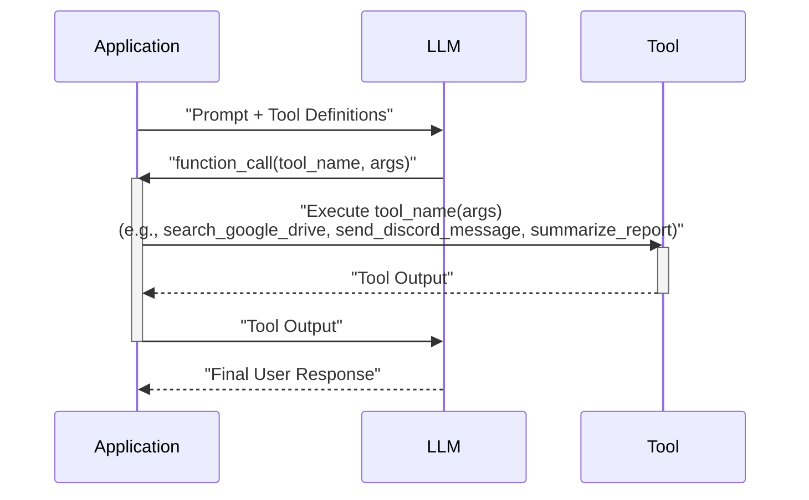
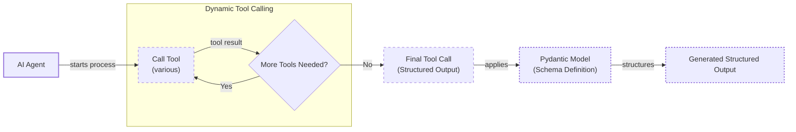
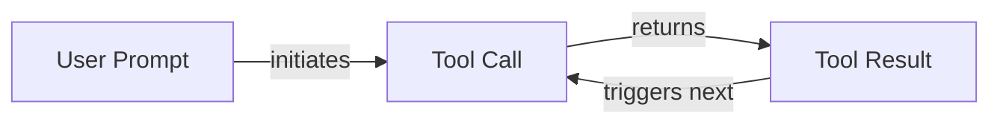

# Lesson 6: Agent Tools & Function Calling

In our previous lessons, we built a solid foundation in AI Engineering. We distinguished between rule-based LLM workflows and autonomous agents, mastered context engineering to manage information flow, and learned to enforce structured outputs for reliability. Now, we will explore one of the most critical components of any AI agent: tools. This is how we give our agents the ability to interact with the world.

This lesson will open the black box of tool use. We will implement function calling from scratch to understand how an LLM decides which action to take and with what parameters. We will then transition to production-ready implementations using modern APIs like Gemini, explore advanced patterns like using Pydantic models for on-demand structured data, and discuss the limitations of simple tool chaining.

## Understanding Why Agents Need Tools

LLMs have a fundamental limitation: they are powerful pattern matchers and text generators, but they cannot perform actions or access real-time information on their own. They are like a brain in a jar, full of knowledge but unable to interact with the external world. This is where tools come in. They act as the agent's "hands and senses," bridging the LLM's internal reasoning with external systems [[1]](https://www.youtube.com/watch?v=h8gMhXYAv1k).

This capability directly addresses core LLM weaknesses like fixed knowledge and a tendency to hallucinate. Tools provide access to up-to-date information, grounding the model's responses in factual, external data [[2]](https://www.digital-alpha.com/a-deep-dive-into-function-calling-with-llms/).

With tools, an LLM transforms into an AI agent that can execute instructions and affect its environment. Popular tools allow modern agents to:
- Access real-time information via APIs (e.g., weather, news).
- Interact with databases (e.g., PostgreSQL, Snowflake) or data lakes.
- Access long-term memory to retrieve information beyond the context window.
- Execute code for precise calculations or data manipulation.
- Perform actions like sending emails or creating calendar events [[3]](https://arxiv.org/html/2507.08034v1).

## Implementing Tool Calls from Scratch

The best way to understand how tools work is to build them from scratch. Our goal is to provide the LLM with a list of available functions and let it decide which one to use and with what arguments to fulfill a user's request. This process follows a five-step flow.

1.  **Application:** Send the LLM a prompt and a list of available tool definitions.
2.  **LLM:** Respond with a `function_call` request, specifying the tool and arguments.
3.  **Application:** Execute the requested function in your code.
4.  **Application:** Send the function's output back to the LLM.
5.  **LLM:** Use the tool's output to generate a final, user-facing response [[4]](https://www.philschmid.de/gemini-function-calling).

This request-execute-respond cycle is the foundation of tool use.


Image 1: A sequence diagram illustrating the 5-step request-execute-respond flow of calling a tool, including example tool calls.

Let's implement a simple example where we mock searching for a document on Google Drive and sending its summary to a Discord channel.

<aside>
💡

You can find the code for this lesson in the accompanying [Jupyter Notebook](https://github.com/towardsai/course-ai-agents/blob/dev/lessons/06_tools/notebook.ipynb).

</aside>

1.  First, we set up our environment by initializing the Gemini client. We will use the `gemini-2.5-flash` model and a sample financial document to mock our search results.
    ```python
    import json
    from typing import Any
    
    from google import genai
    from google.genai import types
    from pydantic import BaseModel, Field
    
    from lessons.utils import env, pretty_print
    
    env.load(required_env_vars=["GOOGLE_API_KEY"])
    
    client = genai.Client()
    MODEL_ID = "gemini-2.5-flash"
    
    DOCUMENT = """
    # Q3 2023 Financial Performance Analysis
    
    The Q3 earnings report shows a 20% increase in revenue and a 15% growth in user engagement, 
    beating market expectations. These impressive results reflect our successful product strategy 
    and strong market positioning.
    
    Our core business segments demonstrated remarkable resilience, with digital services leading 
    the growth at 25% year-over-year. The expansion into new markets has proven particularly 
    successful, contributing to 30% of the total revenue increase.
    
    Customer acquisition costs decreased by 10% while retention rates improved to 92%, 
    marking our best performance to date. These metrics, combined with our healthy cash flow 
    position, provide a strong foundation for continued growth into Q4 and beyond.
    """
    ```

2.  Next, we define three mocked Python functions that simulate our tools. The function signature and docstrings are essential, as the LLM uses them to understand what each tool does.
    ```python
    def search_google_drive(query: str) -> dict:
        """
        Searches for a file on Google Drive and returns its content or a summary.
    
        Args:
            query (str): The search query to find the file, e.g., 'Q3 earnings report'.
    
        Returns:
            dict: A dictionary representing the search results, including file names and summaries.
        """
        return {
            "files": [
                {
                    "name": "Q3_Earnings_Report_2024.pdf",
                    "id": "file12345",
                    "content": DOCUMENT,
                }
            ]
        }
    ```
    ```python
    def send_discord_message(channel_id: str, message: str) -> dict:
        """
        Sends a message to a specific Discord channel.
    
        Args:
            channel_id (str): The ID of the channel to send the message to, e.g., '#finance'.
            message (str): The content of the message to send.
    
        Returns:
            dict: A dictionary confirming the action, e.g., {"status": "success"}.
        """
        return {
            "status": "success",
            "status_code": 200,
            "channel": channel_id,
            "message_preview": f"{message[:50]}...",
        }
    ```
    ```python
    def summarize_financial_report(text: str) -> str:
        """
        Summarizes a financial report.
    
        Args:
            text (str): The text to summarize.
    
        Returns:
            str: The summary of the text.
        """
        return "The Q3 2023 earnings report shows strong performance across all metrics with 20% revenue growth, 15% user engagement increase, 25% digital services growth, and improved retention rates of 92%."
    ```

3.  For each function, we define a schema in JSON format. This schema tells the LLM what the tool does (via `description`) and how to call it (via `parameters`). This structure is the industry standard for APIs like OpenAI and Gemini [[5]](https://platform.openai.com/docs/guides/function-calling), [[6]](https://ai.google.dev/gemini-api/docs/function-calling).
    ```python
    search_google_drive_schema = {
        "name": "search_google_drive",
        "description": "Searches for a file on Google Drive and returns its content or a summary.",
        "parameters": {
            "type": "object",
            "properties": {
                "query": {
                    "type": "string",
                    "description": "The search query to find the file, e.g., 'Q3 earnings report'.",
                }
            },
            "required": ["query"],
        },
    }
    
    send_discord_message_schema = {
        "name": "send_discord_message",
        "description": "Sends a message to a specific Discord channel.",
        "parameters": {
            "type": "object",
            "properties": {
                "channel_id": {
                    "type": "string",
                    "description": "The ID of the channel to send the message to, e.g., '#finance'.",
                },
                "message": {
                    "type": "string",
                    "description": "The content of the message to send.",
                },
            },
            "required": ["channel_id", "message"],
        },
    }
    
    summarize_financial_report_schema = {
        "name": "summarize_financial_report",
        "description": "Summarizes a financial report.",
        "parameters": {
            "type": "object",
            "properties": {
                "text": {
                    "type": "string",
                    "description": "The text to summarize.",
                },
            },
            "required": ["text"],
        },
    }
    ```

4.  We then create a tool registry to map tool names to their handlers and schemas.
    ```python
    TOOLS = {
        "search_google_drive": {
            "handler": search_google_drive,
            "declaration": search_google_drive_schema,
        },
        "send_discord_message": {
            "handler": send_discord_message,
            "declaration": send_discord_message_schema,
        },
        "summarize_financial_report": {
            "handler": summarize_financial_report,
            "declaration": summarize_financial_report_schema,
        },
    }
    TOOLS_BY_NAME = {tool_name: tool["handler"] for tool_name, tool in TOOLS.items()}
    TOOLS_SCHEMA = [tool["declaration"] for tool in TOOLS.values()]
    ```
    The `TOOLS_BY_NAME` mapping looks like this:
    ```json
    {'search_google_drive': <function search_google_drive at 0x...>, 
     'send_discord_message': <function send_discord_message at 0x...>, 
     'summarize_financial_report': <function summarize_financial_report at 0x...>}
    ```
    And here is the schema for `search_google_drive`:
    ```json
    {
      "name": "search_google_drive",
      "description": "Searches for a file on Google Drive and returns its content or a summary.",
      "parameters": {
        "type": "object",
        "properties": {
          "query": {
            "type": "string",
            "description": "The search query to find the file, e.g., 'Q3 earnings report'."
          }
        },
        "required": [
          "query"
        ]
      }
    }
    ```

5.  Next, we craft a system prompt that tells the LLM how to use these tools. It includes usage guidelines, the expected output format, and the list of available tools enclosed in XML tags.
    ```python
    TOOL_CALLING_SYSTEM_PROMPT = """
    You are a helpful AI assistant with access to tools that enable you to take actions and retrieve information to better 
    assist users.
    
    ## Tool Usage Guidelines
    ...
    ## Tool Call Format
    ...
    ## Response Behavior
    ...
    ## Available Tools
    
    <tool_definitions>
    {tools}
    </tool_definitions>
    
    Remember: Your goal is to be maximally helpful to the user. Use tools when they add value, but don't use them unnecessarily. Always prioritize accuracy and user experience.
    """
    ```

6.  Now, let's see tool calling in action. The LLM decides which tool to call based on the `description` field in the schema. Clear and distinct descriptions are essential for building reliable agents, especially when scaling to dozens of tools [[7]](https://mbrenndoerfer.com/writing/function-calling-llm-structured-tools), [[8]](https://www.anthropic.com/research/building-effective-agents). Vague descriptions like "search documents" and "search files" would confuse the model. Instead, be explicit: "search documents on Google Drive" versus "search files on the local disk" [[9]](https://medium.com/@abhaychougule0907/underlying-factors-behind-inconsistency-in-llm-responses-with-multi-tool-calling-628ce7b4de76). Good tool design also favors atomicity: each tool should do one specific task. Complex "god tools" with many parameters confuse the model and hurt reliability [[10]](https://apxml.com/courses/building-advanced-llm-agent-tools/chapter-1-llm-agent-tooling-foundations/designing-tool-interfaces). Once a tool is selected, the LLM generates the function name and arguments as a structured JSON output. This capability is enabled by instruction fine-tuning, where models are trained to interpret schemas and produce tool calls [[7]](https://mbrenndoerfer.com/writing/function-calling-llm-structured-tools).
    ```python
    USER_PROMPT = """
    Can you help me find the latest quarterly report and share key insights with the team?
    """
    
    messages = [TOOL_CALLING_SYSTEM_PROMPT.format(tools=str(TOOLS_SCHEMA)), USER_PROMPT]
    
    response = client.models.generate_content(
        model=MODEL_ID,
        contents=messages,
    )
    ```
    The LLM correctly identifies the `search_google_drive` tool and generates the required arguments:
    ```json
    {
      "name": "search_google_drive",
      "args": {
        "query": "latest quarterly report"
      }
    }
    ```

7.  Let's try another prompt for a multi-step task.
    ```python
    USER_PROMPT = """
    Please find the Q3 earnings report on Google Drive and send a summary of it to 
    the #finance channel on Discord.
    """
    
    messages = [TOOL_CALLING_SYSTEM_PROMPT.format(tools=str(TOOLS_SCHEMA)), USER_PROMPT]
    
    response = client.models.generate_content(
        model=MODEL_ID,
        contents=messages,
    )
    ```
    The model again identifies the first logical step, which is to search for the report.
    ```json
    {
      "name": "search_google_drive",
      "args": {
        "query": "Q3 earnings report"
      }
    }
    ```

8.  To execute the tool, we first need to parse this response. We create a helper function to extract the JSON string and load it into a Python dictionary.
    ```python
    def extract_tool_call(response_text: str) -> str:
        return response_text.split("```tool_call")[1].split("```")[0].strip()
    
    tool_call_str = extract_tool_call(response.text)
    # '{"name": "search_google_drive", "args": {"query": "Q3 earnings report"}}'
    
    tool_call = json.loads(tool_call_str)
    # {'name': 'search_google_drive', 'args': {'query': 'Q3 earnings report'}}
    ```

9.  With the parsed tool call, we retrieve the corresponding function handler and execute it with the provided arguments.
    ```python
    tool_handler = TOOLS_BY_NAME[tool_call["name"]]
    # <function __main__.search_google_drive(query: str) -> dict>
    
    tool_result = tool_handler(**tool_call["args"])
    ```
    This returns the mocked content of the financial report. We can aggregate these steps into a single `call_tool` function for convenience.
    ```python
    def call_tool(response_text: str, tools_by_name: dict) -> Any:
        """
        Call a tool based on the response from the LLM.
        """
        tool_call_str = extract_tool_call(response_text)
        tool_call = json.loads(tool_call_str)
        tool_name = tool_call["name"]
        tool_args = tool_call["args"]
        tool = tools_by_name[tool_name]
    
        return tool(**tool_args)
    ```

10. Finally, we send the `tool_result` back to the LLM, which uses it to formulate a final response or decide on the next action.
    ```python
    response = client.models.generate_content(
        model=MODEL_ID,
        contents=f"Interpret the tool result: {json.dumps(tool_result, indent=2)}",
    )
    ```
    The LLM responds with a summary of the document it "found." This completes the basic tool-calling loop.

## Implementing a Tool Calling Framework from Scratch

Manually defining a JSON schema for every tool is tedious and error-prone, violating the "Don't Repeat Yourself" (DRY) principle. Production frameworks like LangGraph solve this by using a `@tool` decorator to automatically generate schemas from Python functions [[11]](https://pydantic.dev/docs/ai/tools-toolsets/tools/), [[12]](https://docs.langchain.com/oss/python/langchain/tools).

Let's build a simple version of this decorator. The goal is to inspect a function's signature and docstring to create the schema, then wrap it in a `ToolFunction` class that holds both the function and its schema. This approach provides a single source of truth and standardizes how we define tools. The decorator uses Python's built-in `inspect` module to access the function's metadata, such as its name, parameters, and docstring. This introspection capability is what allows us to dynamically build a machine-readable schema without manual effort. The `ToolFunction` class then acts as a container, bundling the executable function with its schema, creating a self-contained component that our agent can easily manage and use.

1.  First, we define the `ToolFunction` class and a `@tool` decorator. The decorator inspects the function's name, docstring, and parameters to build a schema dictionary automatically.
    ```python
    from inspect import Parameter, signature
    from typing import Any, Callable, Dict, Optional
    
    
    class ToolFunction:
        def __init__(self, func: Callable, schema: Dict[str, Any]) -> None:
            self.func = func
            self.schema = schema
            self.__name__ = func.__name__
            self.__doc__ = func.__doc__
    
        def __call__(self, *args: Any, **kwargs: Any) -> Any:
            return self.func(*args, **kwargs)
    
    
    def tool(description: Optional[str] = None) -> Callable[[Callable], ToolFunction]:
        """
        A decorator that creates a tool schema from a function.
        """
    
        def decorator(func: Callable) -> ToolFunction:
            sig = signature(func)
            properties = {}
            required = []
    
            for param_name, param in sig.parameters.items():
                if param_name == "self":
                    continue
                param_schema = {
                    "type": "string",
                    "description": f"The {param_name} parameter",
                }
                if param.default == Parameter.empty:
                    required.append(param_name)
                properties[param_name] = param_schema
    
            schema = {
                "name": func.__name__,
                "description": description or func.__doc__ or f"Executes the {func.__name__} function.",
                "parameters": {
                    "type": "object",
                    "properties": properties,
                    "required": required,
                },
            }
    
            return ToolFunction(func, schema)
    
        return decorator
    ```

2.  Now, we can redefine our tools using this decorator. The code becomes much cleaner and more maintainable.
    ```python
    @tool()
    def search_google_drive_example(query: str) -> dict:
        """Search for files in Google Drive."""
        return {"files": ["Q3 earnings report"]}
    
    
    @tool()
    def send_discord_message_example(channel_id: str, message: str) -> dict:
        """Send a message to a Discord channel."""
        return {"message": "Message sent successfully"}
    
    
    @tool()
    def summarize_financial_report_example(text: str) -> str:
        """Summarize the contents of a financial report."""
        return "Financial report summarized successfully"
    ```

3.  The decorated function is now a `ToolFunction` object containing both the schema and the original function handler.
    ```python
    type(search_google_drive_example)
    # __main__.ToolFunction
    
    search_google_drive_example.schema
    # {'name': 'search_google_drive_example', 'description': 'Search for files in Google Drive.', ...}
    
    search_google_drive_example.func
    # <function __main__.search_google_drive_example(query: str) -> dict>
    ```

4.  We create our tool registries and call the LLM just as before, but with the automatically generated schemas.
    ```python
    tools = [
        search_google_drive_example,
        send_discord_message_example,
        summarize_financial_report_example,
    ]
    tools_by_name = {tool.schema["name"]: tool.func for tool in tools}
    tools_schema = [tool.schema for tool in tools]
    
    USER_PROMPT = """
    Please find the Q3 earnings report on Google Drive and send a summary of it to 
    the #finance channel on Discord.
    """
    messages = [TOOL_CALLING_SYSTEM_PROMPT.format(tools=str(tools_schema)), USER_PROMPT]
    
    response = client.models.generate_content(
        model=MODEL_ID,
        contents=messages,
    )
    ```
    The LLM responds with the appropriate tool call, which we can execute using our `call_tool` function.
    ```json
    {
      "name": "search_google_drive_example",
      "args": {
        "query": "Q3 earnings report"
      }
    }
    ```
    This demonstrates how production systems simplify tool definition.

## Implementing Production-Level Tool Calls with Gemini

While building from scratch provides great insight, production applications should leverage the native tool-calling features of modern LLM APIs. Instead of manually engineering a system prompt, we can use Gemini's `GenerateContentConfig` to declare our tools. The provider then handles the complex prompt optimization behind the scenes, ensuring reliability and efficiency [[6]](https://ai.google.dev/gemini-api/docs/function-calling).

1.  First, we configure the Gemini API with our tools, passing the manually defined schemas.
    ```python
    tools = [
        types.Tool(
            function_declarations=[
                types.FunctionDeclaration(**search_google_drive_schema),
                types.FunctionDeclaration(**send_discord_message_schema),
            ]
        )
    ]
    config = types.GenerateContentConfig(
        tools=tools,
        tool_config=types.ToolConfig(function_calling_config=types.FunctionCallingConfig(mode="ANY")),
    )
    ```

2.  With this config, we can call the model using just the user prompt. The Gemini API handles the rest.
    ```python
    USER_PROMPT = """
    Please find the Q3 earnings report on Google Drive and send a summary of it to 
    the #finance channel on Discord.
    """
    response = client.models.generate_content(
        model=MODEL_ID,
        contents=USER_PROMPT,
        config=config,
    )
    function_call = response.candidates[0].content.parts[0].function_call
    ```
    The response contains a native `FunctionCall` object:
    ```
    FunctionCall(id=None, args={'query': 'Q3 earnings report'}, name='search_google_drive')
    ```

3.  The `google-genai` Python SDK simplifies this further by accepting Python functions directly. It automatically generates the required schema from the function's signature, type hints, and docstring, just like our custom decorator [[4]](https://www.philschmid.de/gemini-function-calling).
    ```python
    config = types.GenerateContentConfig(tools=[search_google_drive, send_discord_message])
    ```

4.  A simplified `call_tool` function can then execute the call.
    ```python
    def call_tool(function_call) -> any:
        tool_name = function_call.name
        tool_args = {key: value for key, value in function_call.args.items()}
        tool_handler = TOOLS_BY_NAME[tool_name]
        return tool_handler(**tool_args)
    
    tool_result = call_tool(function_call)
    ```
    The output is the same as our manual implementation. By leveraging the native SDK, we reduced dozens of lines of code to just a few, creating a more robust and maintainable system. This core logic is common across major APIs from providers like OpenAI and Anthropic. In fact, emerging standards like LLM-Rosetta aim to formalize this by translating between different provider formats, making these skills highly transferable [[13]](https://arxiv.org/html/2604.09360v1).

## Using Pydantic Models as Tools for On-Demand Structured Outputs

Connecting this lesson with Lesson 4 on structured outputs, we can use a Pydantic model as a tool. This pattern is powerful in agentic workflows where you perform several intermediate steps and only need a structured output at the end. The agent can dynamically decide when to call the "extraction tool" to format its final answer [[14]](https://pydantic.dev/docs/ai/core-concepts/output/), [[15]](https://discuss.ai.google.dev/t/response-schema-from-pydantic/50028).


Image 2: Flowchart illustrating an AI agent's workflow with dynamic tool calls and a final structured output generation using a Pydantic model.

1.  We define a `DocumentMetadata` Pydantic model, just as we did in Lesson 4.
    ```python
    class DocumentMetadata(BaseModel):
        """A class to hold structured metadata for a document."""
    
        summary: str = Field(description="A concise, 1-2 sentence summary of the document.")
        tags: list[str] = Field(description="A list of 3-5 high-level tags relevant to the document.")
        keywords: list[str] = Field(description="A list of specific keywords or concepts mentioned.")
        quarter: str = Field(description="The quarter of the financial year described in the document (e.g., Q3 2023).")
        growth_rate: str = Field(description="The growth rate of the company described in the document (e.g., 10%).")
    ```

2.  We create an `extraction_tool` by defining a function declaration whose parameters are the JSON schema of our Pydantic model.
    ```python
    extraction_tool = types.Tool(
        function_declarations=[
            types.FunctionDeclaration(
                name="extract_metadata",
                description="Extracts structured metadata from a financial document.",
                parameters=DocumentMetadata.model_json_schema(),
            )
        ]
    )
    config = types.GenerateContentConfig(
        tools=[extraction_tool],
        tool_config=types.ToolConfig(function_calling_config=types.FunctionCallingConfig(mode="ANY")),
    )
    ```

3.  When we prompt the model to analyze a document, it will call our `extract_metadata` tool. The arguments it generates will conform to our `DocumentMetadata` schema, which we can then validate and parse into a Pydantic object.
    ```python
    prompt = f"""
    Please analyze the following document and extract its metadata.
    
    Document:
    --- 
    {DOCUMENT}
    --- 
    """
    
    response = client.models.generate_content(model=MODEL_ID, contents=prompt, config=config)
    function_call = response.candidates[0].content.parts[0].function_call
    
    try:
        document_metadata = DocumentMetadata(**function_call.args)
        print("Validation successful!")
    except Exception as e:
        print(f"Validation failed: {e}")
    ```
    This pattern ensures the final agentic output is structured, validated, and ready for downstream use.

## The Downsides of Running Tools in a Loop

So far, we have focused on single-turn interactions. However, real-world tasks often require multiple steps. A natural progression is to run tools in a loop, allowing the agent to chain actions and decide the next step based on the previous one's output. This gives the agent flexibility to handle complex, multi-step tasks.


Image 3: A flowchart illustrating a sequential tool calling loop.

Let's implement this loop.

1.  We set up our tools and config as before.
    ```python
    tools = [
        types.Tool(
            function_declarations=[
                types.FunctionDeclaration(**search_google_drive_schema),
                types.FunctionDeclaration(**send_discord_message_schema),
                types.FunctionDeclaration(**summarize_financial_report_schema),
            ]
        )
    ]
    config = types.GenerateContentConfig(
        tools=tools,
        tool_config=types.ToolConfig(function_calling_config=types.FunctionCallingConfig(mode="ANY")),
    )
    ```

2.  We create a loop that continues as long as the model requests tool calls. In each iteration, we execute the tool and append the result to the message history before calling the model again.
    ```python
    USER_PROMPT = """
    Please find the Q3 earnings report on Google Drive and send a summary of it to 
    the #finance channel on Discord.
    """
    messages = [USER_PROMPT]
    
    response = client.models.generate_content(model=MODEL_ID, contents=messages, config=config)
    response_message_part = response.candidates[0].content.parts[0]
    messages.append(response.candidates[0].content)
    
    max_iterations = 3
    while hasattr(response_message_part, "function_call") and max_iterations > 0:
        tool_result = call_tool(response_message_part.function_call)
    
        function_response_part = types.Part.from_function_response(
            name=response_message_part.function_call.name,
            response={"result": tool_result},
        )
        messages.append(function_response_part)
    
        response = client.models.generate_content(model=MODEL_ID, contents=messages, config=config)
        response_message_part = response.candidates[0].content.parts[0]
        messages.append(response.candidates[0].content)
        max_iterations -= 1
    ```
    This loop chains three tool calls: `search_google_drive`, `summarize_financial_report`, and `send_discord_message`. The output shows the agent executing each step in sequence:
    ```text
    Function Call: `search_google_drive`
    Tool Result: {'files': [{'name': 'Q3_Earnings_Report_2024.pdf', ...}]}
    Function Call: `summarize_financial_report`
    Tool Result: 'The Q3 2023 earnings report shows strong performance...'
    Function Call: `send_discord_message`
    Tool Result: {'status': 'success', 'channel': '#finance', ...}
    ```
    However, this sequential approach has significant limitations [[16]](https://myengineeringpath.dev/genai-engineer/agentic-patterns/). It does not allow the LLM to interpret a tool's output before deciding on the next action, limiting its ability to plan or adapt its strategy. The agent just moves from one function call to the next. This can lead to inefficient tool use or getting stuck in loops [[17]](https://blogs.oracle.com/developers/what-is-the-ai-agent-loop-the-core-architecture-behind-autonomous-ai-systems).

For tasks where tools are independent, we could run them in parallel to reduce latency, like fetching financial news and stock prices simultaneously. For dependent tasks, this loop is insufficient. These limitations motivated the development of more sophisticated patterns like **ReAct** (Reasoning and Acting), which explicitly interleaves reasoning steps with tool calls. We will explore ReAct in detail in Lessons 7 and 8.

## Popular Tools Used Within the Industry

To ground these concepts in the real world, let's look at some popular tool categories used across the industry.

1.  **Knowledge & Memory Access:** These tools connect agents to external knowledge. This includes querying vector databases for RAG, graph databases for connected data, or using text-to-SQL to interact with traditional databases [[18]](https://neo4j.com/blog/agentic-ai/connected-context-and-persistent-memory-neo4j-providers-for-the-microsoft-agent-framework/), [[19]](https://promethium.ai/guides/text-to-sql-basics-benefits/). We will cover these topics in depth in Lesson 9 (Memory) and Lesson 10 (RAG).
2.  **Web Search & Browsing:** These tools are essential for research agents and chatbots. They interface with search engine APIs (Google, Bing, Brave) or use web scraping to fetch and parse content from web pages [[20]](https://mantraideas.com/llm-web-search/).
3.  **Code Execution:** A Python interpreter tool allows an agent to write and execute code. This is essential for calculations, data manipulation, and visualization, but requires running the code in a sandboxed environment to mitigate security risks [[21]](https://medium.com/@anicomanesh/how-llm-reasoning-powers-the-agentic-ai-revolution-cbefd10ebf3f).
4.  **Human-in-the-Loop:** This special class of tool allows the agent to pause and request human input. It can ask for clarification, seek approval for a critical action, or hand off a task it cannot complete. This is a key pattern for building safe and reliable agents.
5.  **Other Popular Tools:** Many enterprise AI applications interact with external APIs for calendars, email, and project management. Productivity apps often need tools for file system operations like reading and writing files [[22]](https://lnu.diva-portal.org/smash/get/diva2:1801354/FULLTEXT01.pdf).

## Conclusion

Tool calling is the core mechanism that transforms LLMs from passive text generators into active agents capable of interacting with the world. Understanding how to define, call, and orchestrate tools is a fundamental skill for any AI engineer.

We have seen the progression from manual, from-scratch implementations to robust, production-ready patterns using native APIs. In our next lesson, we will build on this foundation by exploring ReAct, a powerful pattern that enables agents to reason about their actions and build more complex plans.

## References

- [1] https://www.youtube.com/watch?v=h8gMhXYAv1k
- [2] https://www.digital-alpha.com/a-deep-dive-into-function-calling-with-llms/
- [3] https://arxiv.org/html/2507.08034v1
- [4] https://www.philschmid.de/gemini-function-calling
- [5] https://platform.openai.com/docs/guides/function-calling
- [6] https://ai.google.dev/gemini-api/docs/function-calling
- [7] https://mbrenndoerfer.com/writing/function-calling-llm-structured-tools
- [8] https://www.anthropic.com/research/building-effective-agents
- [9] https://medium.com/@abhaychougule0907/underlying-factors-behind-inconsistency-in-llm-responses-with-multi-tool-calling-628ce7b4de76
- [10] https://apxml.com/courses/building-advanced-llm-agent-tools/chapter-1-llm-agent-tooling-foundations/designing-tool-interfaces
- [11] https://pydantic.dev/docs/ai/tools-toolsets/tools/
- [12] https://docs.langchain.com/oss/python/langchain/tools
- [13] https://arxiv.org/html/2604.09360v1
- [14] https://pydantic.dev/docs/ai/core-concepts/output/
- [15] https://discuss.ai.google.dev/t/response-schema-from-pydantic/50028
- [16] https://myengineeringpath.dev/genai-engineer/agentic-patterns/
- [17] https://blogs.oracle.com/developers/what-is-the-ai-agent-loop-the-core-architecture-behind-autonomous-ai-systems
- [18] https://neo4j.com/blog/agentic-ai/connected-context-and-persistent-memory-neo4j-providers-for-the-microsoft-agent-framework/
- [19] https://promethium.ai/guides/text-to-sql-basics-benefits/
- [20] https://mantraideas.com/llm-web-search/
- [21] https://medium.com/@anicomanesh/how-llm-reasoning-powers-the-agentic-ai-revolution-cbefd10ebf3f
- [22] https://lnu.diva-portal.org/smash/get/diva2:1801354/FULLTEXT01.pdf
- [23] https://github.com/towardsai/course-ai-agents/blob/dev/lessons/06_tools/notebook.ipynb
- [24] https://www.youtube.com/watch?v=ApoDzZP8_ck
- [25] https://arxiv.org/pdf/2401.17464v3
- [26] https://www.newsletter.swirlai.com/p/building-ai-agents-from-scratch-part
- [27] dev.to/jamesli/react-vs-plan-and-execute-a-practical-comparison-of-llm-agent-patterns-4gh9
- [28] https://www.deeplearning.ai/the-batch/agentic-design-patterns-part-3-tool-use/