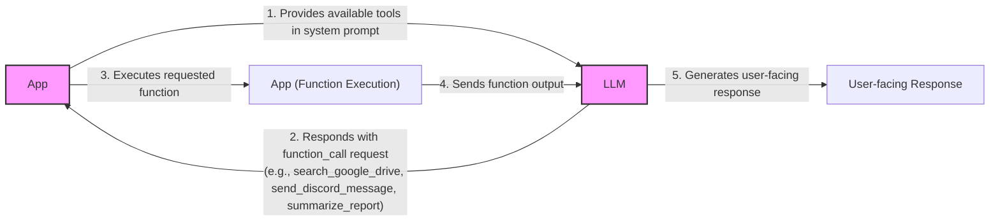
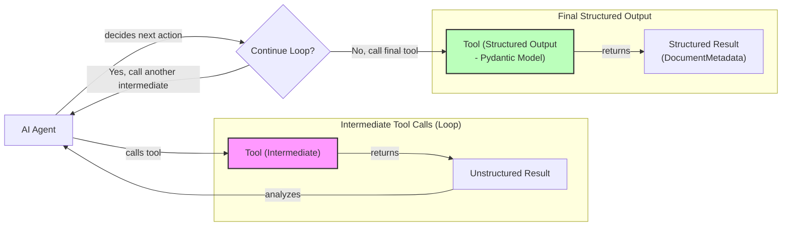
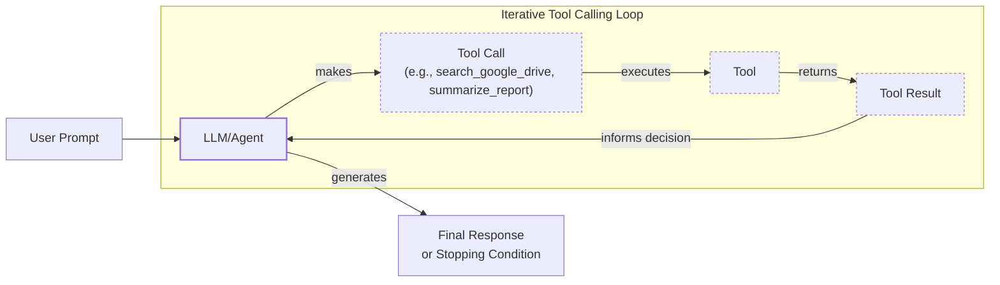

# Lesson 6: Agent Tools & Function Calling

In the previous lessons, we built a solid foundation in AI Engineering. We explored the agent landscape, distinguished between LLM workflows and AI agents, learned the art of context engineering, and ensured reliable data extraction with structured outputs. Now, we will take the next logical step: giving our LLMs the ability to *act*.

Tools, also known as function calling, are what transform an LLM from a passive text generator into an agent that can interact with the external world. Understanding how an agent works with these tools is critical for any AI Engineer who wants to build, improve, and monitor production-grade AI applications. In this lesson, we will open up this black box. We will start by implementing tool calling from scratch, then move to a production-ready approach with the Gemini API, and cover the most common tool categories used today.

## Why Agents Need Tools

LLMs have a fundamental limitation: they are powerful pattern matchers and text generators, but they cannot perform actions or interact with the external world on their own. They are trained on a static dataset and have no access to real-time information or external systems. This limitation is addressed by using tools. If the LLM is the agent's "brain," then tools are its "hands and senses," allowing it to perceive and act in the world beyond its pre-trained knowledge.

Tools are the bridge between an LLM's internal reasoning and the external environment. By giving an LLM access to tools, we transform it into an AI agent capable of executing specific instructions and interacting with the world. This allows agents to perform a wide range of tasks that would otherwise be impossible. The ability to use external APIs, databases, and even execute code grounds the LLM's responses in reality, making them more accurate and useful.

This process allows a user's natural language request to be translated into a structured command that an external system can execute.
Image 1: A diagram showing a user's natural language query being transformed by an LLM into a structured JSON tool call. (Source: [philschmid.de](https://www.philschmid.de/gemini-function-calling))

Some of the most common capabilities enabled by tools include:
*   Accessing real-time information through APIs, like checking today's weather or fetching the latest news. This overcomes the static nature of the LLM's training data.
*   Interacting with external databases and other storage solutions, such as querying a PostgreSQL database, a Snowflake data warehouse, or an S3 data lake.
*   Accessing an agent's long-term memory to retrieve information beyond its immediate context window, a topic we will explore in Lesson 9.
*   Executing code in languages like Python or JavaScript, which allows for precise calculations, data manipulation, and algorithmic tasks that LLMs struggle with.
*   Performing precise calculations beyond their training data, such as basic math, sorting, filtering, or grouping data, which addresses the LLM's weakness in arithmetic reasoning.

## Implementing Tool Calls from Scratch

The best way to understand how tools work is to build them from the ground up. This section will walk you through implementing a simple tool-calling framework from scratch. We will define our tools, create schemas for them, and guide the LLM to decide which tool to call and with what arguments.

The high-level process of calling a tool involves a five-step flow between your application and the LLM:

1.  **App:** You send a prompt to the LLM that includes a list of available tools in its system prompt.
2.  **LLM:** The model analyzes the prompt and responds with a `function_call` request, specifying the tool to use and the arguments it needs.
3.  **App:** Your application parses this request and executes the corresponding function with the provided arguments.
4.  **App:** The output from the function is sent back to the LLM.
5.  **LLM:** The model uses the tool's output to generate a final, user-facing response.


Image 2: A flowchart illustrating the 5-step request-execute-respond flow of calling a tool between an App and an LLM.

Let's implement this flow with a practical example. We will create a simple agent that can search for a financial report on Google Drive and send a summary to a Discord channel.

1.  First, we set up our environment by initializing the Gemini client and defining our model and a sample document to simulate a file found on Google Drive.
    ```python
    import json
    from typing import Any
    
    from google import genai
    from google.genai import types
    from pydantic import BaseModel, Field
    
    from lessons.utils import env
    
    env.load(required_env_vars=["GOOGLE_API_KEY"])
    
    client = genai.Client()
    
    MODEL_ID = "gemini-2.5-flash"
    
    DOCUMENT = """
    # Q3 2023 Financial Performance Analysis
    
    The Q3 earnings report shows a 20% increase in revenue and a 15% growth in user engagement, 
    beating market expectations. These impressive results reflect our successful product strategy 
    and strong market positioning.
    
    Our core business segments demonstrated remarkable resilience, with digital services leading 
    the growth at 25% year-over-year. The expansion into new markets has proven particularly 
    successful, contributing to 30% of the total revenue increase.
    
    Customer acquisition costs decreased by 10% while retention rates improved to 92%, 
    marking our best performance to date. These metrics, combined with our healthy cash flow 
    position, provide a strong foundation for continued growth into Q4 and beyond.
    """
    ```

2.  Next, we define three mock functions to simulate our tools. The function signature and docstring are important, as the LLM uses them to understand what each tool does.
    ```python
    def search_google_drive(query: str) -> dict:
        """
        Searches for a file on Google Drive and returns its content or a summary.
    
        Args:
            query (str): The search query to find the file, e.g., 'Q3 earnings report'.
    
        Returns:
            dict: A dictionary representing the search results, including file names and summaries.
        """
        return {
            "files": [
                {
                    "name": "Q3_Earnings_Report_2024.pdf",
                    "id": "file12345",
                    "content": DOCUMENT,
                }
            ]
        }
    ```
    ```python
    def send_discord_message(channel_id: str, message: str) -> dict:
        """
        Sends a message to a specific Discord channel.
    
        Args:
            channel_id (str): The ID of the channel to send the message to, e.g., '#finance'.
            message (str): The content of the message to send.
    
        Returns:
            dict: A dictionary confirming the action, e.g., {"status": "success"}.
        """
        return {
            "status": "success",
            "status_code": 200,
            "channel": channel_id,
            "message_preview": f"{message[:50]}...",
        }
    ```
    ```python
    def summarize_financial_report(text: str) -> str:
        """
        Summarizes a financial report.
    
        Args:
            text (str): The text to summarize.
    
        Returns:
            str: The summary of the text.
        """
        return "The Q3 2023 earnings report shows strong performance across all metrics with 20% revenue growth, 15% user engagement increase, 25% digital services growth, and improved retention rates of 92%."
    ```

3.  For the LLM to use these functions, we must provide their definitions in a format it can understand. This is done using a JSON schema, which is the industry standard for modern LLM providers like OpenAI and Gemini. The schema describes the tool's name, what it does, and the parameters it accepts.
    ```python
    search_google_drive_schema = {
        "name": "search_google_drive",
        "description": "Searches for a file on Google Drive and returns its content or a summary.",
        "parameters": {
            "type": "object",
            "properties": {
                "query": {
                    "type": "string",
                    "description": "The search query to find the file, e.g., 'Q3 earnings report'.",
                }
            },
            "required": ["query"],
        },
    }
    ```
    ```python
    send_discord_message_schema = {
        "name": "send_discord_message",
        "description": "Sends a message to a specific Discord channel.",
        "parameters": {
            "type": "object",
            "properties": {
                "channel_id": {
                    "type": "string",
                    "description": "The ID of the channel to send the message to, e.g., '#finance'.",
                },
                "message": {
                    "type": "string",
                    "description": "The content of the message to send.",
                },
            },
            "required": ["channel_id", "message"],
        },
    }
    ```
    ```python
    summarize_financial_report_schema = {
        "name": "summarize_financial_report",
        "description": "Summarizes a financial report.",
        "parameters": {
            "type": "object",
            "properties": {
                "text": {
                    "type": "string",
                    "description": "The text to summarize.",
                },
            },
            "required": ["text"],
        },
    }
    ```

4.  We then create a tool registry to manage our tools, mapping their names to their handler functions and schemas.
    ```python
    TOOLS = {
        "search_google_drive": {
            "handler": search_google_drive,
            "declaration": search_google_drive_schema,
        },
        "send_discord_message": {
            "handler": send_discord_message,
            "declaration": send_discord_message_schema,
        },
        "summarize_financial_report": {
            "handler": summarize_financial_report,
            "declaration": summarize_financial_report_schema,
        },
    }
    TOOLS_BY_NAME = {tool_name: tool["handler"] for tool_name, tool in TOOLS.items()}
    TOOLS_SCHEMA = [tool["declaration"] for tool in TOOLS.values()]
    ```
    The `TOOLS_BY_NAME` mapping looks like this:
    ```text
    Tool name: search_google_drive
    Tool handler: <function search_google_drive at 0x104c7df80>
    ---------------------------------------------------------------------------
    Tool name: send_discord_message
    Tool handler: <function send_discord_message at 0x104c7de40>
    ---------------------------------------------------------------------------
    Tool name: summarize_financial_report
    Tool handler: <function summarize_financial_report at 0x1274f5c60>
    ---------------------------------------------------------------------------
    ```
    And here is the schema for our `search_google_drive` tool:
    ```text
    {
      "name": "search_google_drive",
      "description": "Searches for a file on Google Drive and returns its content or a summary.",
      "parameters": {
        "type": "object",
        "properties": {
          "query": {
            "type": "string",
            "description": "The search query to find the file, e.g., 'Q3 earnings report'."
          }
        },
        "required": [
          "query"
        ]
      }
    }
    ```

5.  Next, we create a system prompt to instruct the LLM on how to use these tools. This prompt is the control panel for our agent. It includes guidelines on when to use tools, how to select them based on their descriptions, and the exact format for tool calls, which helps ensure the model's output is predictable and machine-readable.
    ```python
    TOOL_CALLING_SYSTEM_PROMPT = """
    You are a helpful AI assistant with access to tools that enable you to take actions and retrieve information to better 
    assist users.
    
    ## Tool Usage Guidelines
    
    **When to use tools:**
    - When you need information that is not in your training data
    - When you need to perform actions in external systems and environments
    - When you need real-time, dynamic, or user-specific data
    - When computational operations are required
    
    **Tool selection:**
    - Choose the most appropriate tool based on the user's specific request
    - If multiple tools could work, select the one that most directly addresses the need
    - Consider the order of operations for multi-step tasks
    
    **Parameter requirements:**
    - Provide all required parameters with accurate values
    - Use the parameter descriptions to understand expected formats and constraints
    - Ensure data types match the tool's requirements (strings, numbers, booleans, arrays)
    
    ## Tool Call Format
    
    When you need to use a tool, output ONLY the tool call in this exact format:
    
    <tool_call>
    {{"name": "tool_name", "args": {{"param1": "value1", "param2": "value2"}}}}
    </tool_call>
    
    **Critical formatting rules:**
    - Use double quotes for all JSON strings
    - Ensure the JSON is valid and properly escaped
    - Include ALL required parameters
    - Use correct data types as specified in the tool definition
    - Do not include any additional text or explanation in the tool call
    
    ## Response Behavior
    
    - If no tools are needed, respond directly to the user with helpful information
    - If tools are needed, make the tool call first, then provide context about what you're doing
    - After receiving tool results, provide a clear, user-friendly explanation of the outcome
    - If a tool call fails, explain the issue and suggest alternatives when possible
    
    ## Available Tools
    
    <tool_definitions>
    {tools}
    </tool_definitions>
    
    Remember: Your goal is to be maximally helpful to the user. Use tools when they add value, but don't use them unnecessarily. Always prioritize accuracy and user experience.
    """
    ```

6.  The LLM's decision-making process relies heavily on the `description` field within the tool schema. It uses this natural language description to determine whether a tool is relevant to the user's query. This is why writing clear, specific, and distinct tool descriptions is one of the most critical aspects of building reliable agents. Vague descriptions like "search documents" can easily confuse the model if another tool exists to "search files." A better approach is to be explicit: "search documents on Google Drive" versus "search files on the local disk." This clarity becomes essential as the number of tools grows, as it directly impacts the agent's ability to select the correct action. Once a tool is selected, the model generates the function name and arguments as a structured output, a behavior learned through extensive instruction fine-tuning on tool-use examples.

7.  Let's test our setup. We send a user prompt along with our system prompt to the model.
    ```python
    USER_PROMPT = """
    Can you help me find the latest quarterly report and share key insights with the team?
    """
    
    messages = [TOOL_CALLING_SYSTEM_PROMPT.format(tools=str(TOOLS_SCHEMA)), USER_PROMPT]
    
    response = client.models.generate_content(
        model=MODEL_ID,
        contents=messages,
    )
    ```
    The LLM correctly identifies the `search_google_drive` tool and generates the required arguments:
    ```text
    <tool_call>
    {"name": "search_google_drive", "args": {"query": "latest quarterly report"}}
    </tool_call>
    ```
    Here is another example:
    ```python
    USER_PROMPT = """
    Please find the Q3 earnings report on Google Drive and send a summary of it to 
    the #finance channel on Discord.
    """
    
    messages = [TOOL_CALLING_SYSTEM_PROMPT.format(tools=str(TOOLS_SCHEMA)), USER_PROMPT]
    
    response = client.models.generate_content(
        model=MODEL_ID,
        contents=messages,
    )
    ```
    It outputs:
    ```text
    <tool_call>
    {"name": "search_google_drive", "args": {"query": "Q3 earnings report"}}
    </tool_call>
    ```

8.  Now, we need to parse the LLM's response and execute the tool. First, we extract the JSON string from the response.
    ```python
    def extract_tool_call(response_text: str) -> str:
        """
        Extracts the tool call from the response text.
        """
        return response_text.split("<tool_call>")[1].split("</tool_call>")[0].strip()
    
    tool_call_str = extract_tool_call(response.text)
    ```
    It outputs:
    ```text
    '{"name": "search_google_drive", "args": {"query": "Q3 earnings report"}}'
    ```

9.  Next, we parse the string into a Python dictionary.
    ```python
    tool_call = json.loads(tool_call_str)
    ```
    It outputs:
    ```text
    {'name': 'search_google_drive', 'args': {'query': 'Q3 earnings report'}}
    ```

10. We retrieve the correct tool handler from our `TOOLS_BY_NAME` dictionary.
    ```python
    tool_handler = TOOLS_BY_NAME[tool_call["name"]]
    ```
    The handler is a reference to our Python function:
    ```text
    <function __main__.search_google_drive(query: str) -> dict>
    ```

11. Finally, we call the function with the arguments generated by the LLM.
    ```python
    tool_result = tool_handler(**tool_call["args"])
    ```
    It outputs:
    ```text
    {
      "files": [
        {
          "name": "Q3_Earnings_Report_2024.pdf",
          "id": "file12345",
          "content": "\n# Q3 2023 Financial Performance Analysis\n\nThe Q3 earnings report shows a 20% increase in revenue and a 15% growth in user engagement, \nbeating market expectations. These impressive results reflect our successful product strategy \nand strong market positioning.\n\nOur core business segments demonstrated remarkable resilience, with digital services leading \nthe growth at 25% year-over-year. The expansion into new markets has proven particularly \nsuccessful, contributing to 30% of the total revenue increase.\n\nCustomer acquisition costs decreased by 10% while retention rates improved to 92%, \nmarking our best performance to date. These metrics, combined with our healthy cash flow \nposition, provide a strong foundation for continued growth into Q4 and beyond.\n"
        }
      ]
    }
    ```

12. We can wrap these steps in a single helper function.
    ```python
    def call_tool(response_text: str, tools_by_name: dict) -> Any:
        """
        Call a tool based on the response from the LLM.
        """
        tool_call_str = extract_tool_call(response_text)
        tool_call = json.loads(tool_call_str)
        tool_name = tool_call["name"]
        tool_args = tool_call["args"]
        tool = tools_by_name[tool_name]
    
        return tool(**tool_args)
    ```
    Using this function gives us the same result:
    ```text
    {
      "files": [
        {
          "name": "Q3_Earnings_Report_2024.pdf",
          "id": "file12345",
          "content": "\n# Q3 2023 Financial Performance Analysis\n\nThe Q3 earnings report shows a 20% increase in revenue and a 15% growth in user engagement, \nbeating market expectations. These impressive results reflect our successful product strategy \nand strong market positioning.\n\nOur core business segments demonstrated remarkable resilience, with digital services leading \nthe growth at 25% year-over-year. The expansion into new markets has proven particularly \nsuccessful, contributing to 30% of the total revenue increase.\n\nCustomer acquisition costs decreased by 10% while retention rates improved to 92%, \nmarking our best performance to date. These metrics, combined with our healthy cash flow \nposition, provide a strong foundation for continued growth into Q4 and beyond.\n"
        }
      ]
    }
    ```

13. The final step is to send the tool's output back to the LLM so it can formulate a user-facing response or decide on the next action.
    ```python
    response = client.models.generate_content(
        model=MODEL_ID,
        contents=f"Interpret the tool result: {json.dumps(tool_result, indent=2)}",
    )
    ```
    It outputs:
    ```text
    The tool result provides the content of a file named `Q3_Earnings_Report_2024.pdf`.
    
    This document is a **Q3 2023 Financial Performance Analysis** and details exceptionally strong results, significantly beating market expectations.
    
    **Key highlights from the report include:**
    
    *   **Revenue Growth:** A 20% increase in revenue.
    *   **User Engagement:** 15% growth in user engagement.
    *   **Core Business Performance:** Digital services led growth at 25% year-over-year.
    *   **Market Expansion Success:** New markets contributed 30% of the total revenue increase.
    *   **Efficiency & Retention:**
        *   Customer acquisition costs decreased by 10%.
        *   Retention rates improved to 92%, marking the best performance to date.
    *   **Financial Health:** The company maintains a healthy cash flow position.
    
    The report attributes these impressive results to a successful product strategy and strong market positioning, indicating a robust foundation for continued growth into Q4 and beyond.
    ```

This is the basic concept behind tool calling. We have successfully implemented a simple but functional tool-calling system from scratch.

## Implementing a small tool calling framework from scratch

Manually defining a JSON schema for every function is tedious and doesn't scale well. Production frameworks like LangGraph and protocols like MCP (Model-Context-Protocol) solve this by using a `@tool` decorator to automatically generate and register schemas from Python functions. This approach respects the Don't Repeat Yourself (DRY) principle by creating a single, standardized way to define tools. This avoids code duplication and reduces the chance of errors that can arise from maintaining schemas and functions in separate places.

Let's build our own simple framework using a `@tool` decorator. Our goal is to automatically extract the schema from a function's signature and docstring, creating a tool registry just like we did manually in the previous section. This will give us a more maintainable and scalable way to manage our agent's capabilities.

1.  First, we define a `ToolFunction` class to wrap our decorated functions and hold their schemas. This class will act as a container for both the executable function and its machine-readable schema. It makes our tool objects more organized and easier to manage within the framework.
    ```python
    from inspect import Parameter, signature
    from typing import Any, Callable, Dict, Optional
    
    class ToolFunction:
        def __init__(self, func: Callable, schema: Dict[str, Any]) -> None:
            self.func = func
            self.schema = schema
            self.__name__ = func.__name__
            self.__doc__ = func.__doc__
    
        def __call__(self, *args: Any, **kwargs: Any) -> Any:
            return self.func(*args, **kwargs)
    ```

2.  Next, we create the `@tool` decorator. In Python, a decorator is a function that takes another function as an argument, adds some functionality to it, and returns the modified function. It's a powerful feature for extending behavior without permanently modifying the original function's code. In our case, the decorator will inspect the decorated function's signature using Python's built-in `inspect` module and parse its docstring to build the JSON schema automatically. This allows us to define the tool's behavior and its schema in one place, right in the function definition.
    ```python
    def tool(description: Optional[str] = None) -> Callable[[Callable], ToolFunction]:
        """
        A decorator that creates a tool schema from a function.
    
        Args:
            description: Optional override for the function's docstring
    
        Returns:
            A decorator function that wraps the original function and adds a schema
        """
    
        def decorator(func: Callable) -> ToolFunction:
            sig = signature(func)
            properties = {}
            required = []
    
            for param_name, param in sig.parameters.items():
                if param_name == "self":
                    continue
    
                param_schema = {
                    "type": "string",
                    "description": f"The {param_name} parameter",
                }
    
                if param.default == Parameter.empty:
                    required.append(param_name)
    
                properties[param_name] = param_schema
    
            schema = {
                "name": func.__name__,
                "description": description or func.__doc__ or f"Executes the {func.__name__} function.",
                "parameters": {
                    "type": "object",
                    "properties": properties,
                    "required": required,
                },
            }
    
            return ToolFunction(func, schema)
    
        return decorator
    ```

3.  Now, we can redefine our tools using the new decorator. This makes our code much cleaner and more intuitive.
    ```python
    @tool()
    def search_google_drive_example(query: str) -> dict:
        """Search for files in Google Drive."""
        return {"files": ["Q3 earnings report"]}
    
    @tool()
    def send_discord_message_example(channel_id: str, message: str) -> dict:
        """Send a message to a Discord channel."""
        return {"message": "Message sent successfully"}
    
    @tool()
    def summarize_financial_report_example(text: str) -> str:
        """Summarize the contents of a financial report."""
        return "Financial report summarized successfully"
    
    
    tools = [
        search_google_drive_example,
        send_discord_message_example,
        summarize_financial_report_example,
    ]
    ```

4.  The decorated function is now a `ToolFunction` object.
    ```python
    type(search_google_drive_example)
    ```
    It outputs:
    ```text
    __main__.ToolFunction
    ```
    This object contains the generated schema, which is identical to the one we defined manually:
    ```text
    {
      "name": "search_google_drive_example",
      "description": "Search for files in Google Drive.",
      "parameters": {
        "type": "object",
        "properties": {
          "query": {
            "type": "string",
            "description": "The query parameter"
          }
        },
        "required": [
          "query"
        ]
      }
    }
    ```
    It also holds a reference to the original function handler:
    ```text
    <function __main__.search_google_drive_example(query: str) -> dict>
    ```

5.  We can now create our tool registries and call the LLM just as before.
    ```python
    tools_by_name = {tool.schema["name"]: tool.func for tool in tools}
    tools_schema = [tool.schema for tool in tools]
    
    USER_PROMPT = """
    Please find the Q3 earnings report on Google Drive and send a summary of it to 
    the #finance channel on Discord.
    """
    
    messages = [TOOL_CALLING_SYSTEM_PROMPT.format(tools=str(tools_schema)), USER_PROMPT]
    
    response = client.models.generate_content(
        model=MODEL_ID,
        contents=messages,
    )
    ```
    The model responds with the correct tool call:
    ```text
    <tool_call>
    {"name": "search_google_drive_example", "args": {"query": "Q3 earnings report"}}
    </tool_call>
    ```

6.  Executing the tool call works exactly as it did in our manual implementation.
    ```python
    call_tool(response.text, tools_by_name=tools_by_name)
    ```
    It outputs:
    ```text
    {
      "files": [
        "Q3 earnings report"
      ]
    }
    ```

Voilà! We have built a small, reusable tool-calling framework. This implementation is conceptually similar to what production frameworks like LangGraph do under the hood.

## Implementing Production-Level Tool Calls with Gemini

While building from scratch is a great learning exercise, in production, you will typically use the native tool-calling features of an API like Gemini or OpenAI. These APIs are optimized by the vendor for their specific models, making them more robust, accurate, and often more cost-effective than a custom implementation. This native support abstracts away the complexity of prompt engineering for tool usage, allowing you to focus on your application's core logic. When you use a native API, the provider is responsible for creating and optimizing the underlying system prompt. This prompt can be complex and may change with new model versions, so offloading this maintenance is a significant advantage.

Let's see how to achieve the same result using Gemini's native capabilities.

1.  Instead of a lengthy system prompt, we define a `GenerateContentConfig` object and pass our tool schemas to it. We can also set the `mode` to `"ANY"` to force the model to call a tool instead of generating a text response.
    ```python
    tools = [
        types.Tool(
            function_declarations=[
                types.FunctionDeclaration(**search_google_drive_schema),
                types.FunctionDeclaration(**send_discord_message_schema),
            ]
        )
    ]
    config = types.GenerateContentConfig(
        tools=tools,
        tool_config=types.ToolConfig(function_calling_config=types.FunctionCallingConfig(mode="ANY")),
    )
    ```

2.  With this configuration, our prompt becomes much cleaner. We can now pass the user's query directly, as the tool instructions are handled by the API. This is more robust because the provider ensures the model is instructed in the most optimal way.
    ```python
    response = client.models.generate_content(
        model=MODEL_ID,
        contents=USER_PROMPT,
        config=config,
    )
    ```
    The model returns a `FunctionCall` object directly:
    ```text
    FunctionCall(id=None, args={'query': 'Q3 earnings report'}, name='search_google_drive')
    ```

3.  To simplify this even further, the `google-genai` SDK can automatically generate the schema from a Python function's signature, type hints, and docstring. We can pass our functions directly to the `GenerateContentConfig` object, just as we did with our custom decorator.
    ```python
    config = types.GenerateContentConfig(
        tools=[search_google_drive, send_discord_message]
    )
    ```

4.  The response from the model is a `FunctionCall` object containing the tool name and arguments.
    ```python
    response_message_part = response.candidates[0].content.parts[0]
    function_call = response_message_part.function_call
    ```
    It outputs:
    ```text
    FunctionCall(id=None, args={'query': 'Q3 earnings report'}, name='search_google_drive')
    ```
    We can access the arguments like this:
    ```text
    {'query': 'Q3 earnings report'}
    ```

5.  We can then get the handler from our `TOOLS_BY_NAME` registry and execute the function.
    ```python
    tool_handler = TOOLS_BY_NAME[function_call.name]
    tool_handler(**function_call.args)
    ```
    It outputs:
    ```text
    {'files': [{'name': 'Q3_Earnings_Report_2024.pdf', 'id': 'file12345', 'content': '...'}]}
    ```

6.  Let's create a simplified `call_tool` function to work with Gemini's native objects.
    ```python
    def call_tool(function_call) -> Any:
        tool_name = function_call.name
        tool_args = {key: value for key, value in function_call.args.items()}
        tool_handler = TOOLS_BY_NAME[tool_name]
        return tool_handler(**tool_args)
    
    tool_result = call_tool(function_call)
    ```
    It outputs:
    ```text
    {
      "files": [
        {
          "name": "Q3_Earnings_Report_2024.pdf",
          "id": "file12345",
          "content": "..."
        }
      ]
    }
    ```

By leveraging the native SDK, we reduced dozens of lines of code to just a few, creating a more robust and maintainable system. Other popular APIs from providers like OpenAI and Anthropic follow a similar logic, making these concepts easily transferable to your API of choice. The core pattern of defining tools via schemas, letting the model choose, executing the call, and returning the result is universal.

## Using Pydantic Models as Tools for On-Demand Structured Outputs

In Lesson 4, we learned how to generate structured outputs. A powerful and elegant pattern in agentic systems is to treat a Pydantic model as a tool. This allows an agent to perform several intermediate steps that may produce unstructured text—which is easy for an LLM to interpret—and then dynamically decide when to call a final tool that returns a structured Pydantic object. This final output is easy to parse and validate in your downstream application code, ensuring data integrity. This hybrid approach is valuable because LLMs often "think" better in natural language, making unstructured text ideal for intermediate reasoning steps. The final structured output is then generated for the benefit of your application's deterministic logic, such as updating a database or rendering a UI component.


Image 3: A flowchart illustrating an AI agent calling multiple tools in a loop, where only the last tool call is for structured outputs.

Let's see how to implement this pattern.

1.  First, we define our `DocumentMetadata` Pydantic model, just as we did in Lesson 4.
    ```python
    class DocumentMetadata(BaseModel):
        """A class to hold structured metadata for a document."""
    
        summary: str = Field(description="A concise, 1-2 sentence summary of the document.")
        tags: list[str] = Field(description="A list of 3-5 high-level tags relevant to the document.")
        keywords: list[str] = Field(description="A list of specific keywords or concepts mentioned.")
        quarter: str = Field(description="The quarter of the financial year described in the document (e.g., Q3 2023).")
        growth_rate: str = Field(description="The growth rate of the company described in the document (e.g., 10%).")
    ```

2.  Next, we create a tool definition for our Pydantic model. We use `DocumentMetadata.model_json_schema()` to generate the parameter schema, effectively telling the LLM to "call" our Pydantic model. This is the key step that connects the Pydantic model to the tool-calling mechanism.
    ```python
    extraction_tool = types.Tool(
        function_declarations=[
            types.FunctionDeclaration(
                name="extract_metadata",
                description="Extracts structured metadata from a financial document.",
                parameters=DocumentMetadata.model_json_schema(),
            )
        ]
    )
    config = types.GenerateContentConfig(
        tools=[extraction_tool],
        tool_config=types.ToolConfig(function_calling_config=types.FunctionCallingConfig(mode="ANY")),
    )
    ```

3.  We then prompt the model to analyze the document and extract the metadata.
    ```python
    prompt = f"""
    Please analyze the following document and extract its metadata.
    
    Document:
    --- 
    {DOCUMENT}
    --- 
    """
    
    response = client.models.generate_content(model=MODEL_ID, contents=prompt, config=config)
    response_message_part = response.candidates[0].content.parts[0]
    ```

4.  The model responds with a function call, where the arguments match the schema of our Pydantic model.
    ```text
    Function Name: `extract_metadata
    Function Arguments: `{
        "growth_rate": "20%",
        "summary": "The Q3 2023 earnings report shows a 20% increase in revenue and 15% growth in user engagement, driven by successful product strategy and market expansion. This performance provides a strong foundation for continued growth.",
        "quarter": "Q3 2023",
        "keywords": [
            "Revenue",
            "User Engagement",
            "Market Expansion",
            "Customer Acquisition",
            "Retention Rates",
            "Digital Services",
            "Cash Flow"
        ],
        "tags": [
            "Financials",
            "Earnings",
            "Growth",
            "Business Strategy",
            "Market Analysis"
        ]
    }`
    ```

5.  Finally, we can validate the arguments and create a `DocumentMetadata` instance. This is where Pydantic acts as a runtime data guard, ensuring the LLM's output is not just well-formed but also type-correct.
    ```python
    if hasattr(response_message_part, "function_call"):
        function_call = response_message_part.function_call
        try:
            document_metadata = DocumentMetadata(**function_call.args)
            print("Validation successful!")
        except Exception as e:
            print(f"Validation failed: {e}")
    ```
    It outputs:
    ```text
    Validation successful!
    ```
This pattern is frequently used in AI agents that need to return structured data after completing a series of actions.

## The Downsides of Running Tools in a Loop

So far, we have focused on single-turn interactions where the agent calls one tool. However, many real-world tasks require multiple steps. A natural progression is to run tools in a loop, allowing the agent to chain multiple actions together. At each step, the LLM can decide which tool to use next based on the output of the previous one. This approach provides flexibility, adaptability, and enables the agent to handle complex, multi-step tasks.


Image 4: A flowchart illustrating the iterative tool calling loop in an AI agent.

Let's implement a simple loop to handle our previous request: find the Q3 earnings report and send a summary to the #finance channel.

1.  We configure our agent with all three tools: `search_google_drive`, `send_discord_message`, and `summarize_financial_report`.
    ```python
    tools = [
        types.Tool(
            function_declarations=[
                types.FunctionDeclaration(**search_google_drive_schema),
                types.FunctionDeclaration(**send_discord_message_schema),
                types.FunctionDeclaration(**summarize_financial_report_schema),
            ]
        )
    ]
    config = types.GenerateContentConfig(
        tools=tools,
        tool_config=types.ToolConfig(function_calling_config=types.FunctionCallingConfig(mode="ANY")),
    )
    ```

2.  The user prompt remains the same.
    ```python
    USER_PROMPT = """
    Please find the Q3 earnings report on Google Drive and send a summary of it to 
    the #finance channel on Discord.
    """
    messages = [USER_PROMPT]
    ```

3.  We start the loop by sending the initial prompt to the model.
    ```python
    response = client.models.generate_content(
        model=MODEL_ID,
        contents=messages,
        config=config,
    )
    response_message_part = response.candidates[0].content.parts[0]
    messages.append(response.candidates[0].content)
    ```
    The first function call is to search for the report:
    ```text
    Function Name: `search_google_drive
    Function Arguments: `{
        "query": "Q3 earnings report"
    }`
    ```

4.  We then enter a `while` loop that continues as long as the model requests a function call. In each iteration, we execute the tool, append the result to our message history, and send it back to the model to determine the next step.
    ```python
    max_iterations = 3
    while hasattr(response_message_part, "function_call") and max_iterations > 0:
        tool_result = call_tool(response_message_part.function_call)
    
        function_response_part = types.Part.from_function_response(
            name=response_message_part.function_call.name,
            response={"result": tool_result},
        )
        messages.append(function_response_part)
    
        response = client.models.generate_content(
            model=MODEL_ID,
            contents=messages,
            config=config,
        )
    
        response_message_part = response.candidates[0].content.parts[0]
        messages.append(response.candidates[0].content)
        max_iterations -= 1
    ```
    The loop proceeds as follows:
    *   **Iteration 1:** Calls `search_google_drive` and gets the document content.
    *   **Iteration 2:** Calls `summarize_financial_report` with the document content.
    *   **Iteration 3:** Calls `send_discord_message` with the summary and channel ID.

While this loop is powerful, it has significant limitations. It does not allow the LLM to interpret the output of each tool before deciding on the next action. The agent moves directly to the next function call without pausing to think about what it has learned or whether it should adjust its strategy. This "myopic" or short-sighted behavior can lead to several problems. For example, if a tool returns an error, the agent will blindly pass that error to the next tool, likely causing the entire task to fail. This is a common failure mode known as silent tool failure.

Furthermore, this simple loop has a limited ability to plan ahead or consider multiple approaches to a problem. It can also lead to inefficiency, such as getting stuck in unbounded loops where it repeatedly calls a failing tool, wasting both time and computational resources. Production systems must include safeguards like maximum iteration limits to prevent this.

To further optimize tool calling, we can run independent tools in parallel. For example, if a user asks for financial news and current stock prices, these two tasks can be executed simultaneously to reduce latency. This requires a more sophisticated orchestration layer that can manage parallel execution and aggregate the results.

These limitations have pushed the industry to develop more sophisticated patterns like **ReAct** (Reasoning and Acting), which explicitly interleaves reasoning steps with actions. We will explore the theory behind ReAct in Lesson 7 and implement it from scratch in Lesson 8.

## Popular Tools Used Within the Industry

To ground this lesson in the real world, let's look at some of the most popular tool categories used by AI engineers today. These tools empower agents to perform a vast range of tasks, making them more capable and useful in practical applications.

### Knowledge & Memory Access
These tools connect agents to external knowledge sources, allowing them to retrieve information that is not in their training data. This includes querying vector databases for semantic search, document stores for retrieving full documents, or graph databases for understanding relationships between entities. A common pattern is text-to-SQL, where an LLM constructs SQL queries to interact with traditional relational databases, democratizing data access for non-technical users. These tools are fundamental to building memory and RAG systems, which we will cover in detail in Lesson 9 (Memory) and Lesson 10 (RAG).

### Web Search & Browsing
These tools give agents access to the live internet. They typically interface with search engine APIs like Google Search, Bing, or Brave Search to retrieve up-to-date information. More advanced versions include web scraping tools that can fetch and parse the content of web pages, allowing agents to extract specific data from websites. These are essential for research agents and chatbots that need access to up-to-the-minute information on topics like news, stock prices, or current events.

### Code Execution
A code interpreter tool, most commonly for Python, allows an agent to write and execute code in a sandboxed environment. This is essential for performing precise calculations, manipulating data, running statistical analyses, and even creating data visualizations. By offloading computational tasks to a code interpreter, the agent can overcome the inherent mathematical limitations of LLMs and provide more accurate, data-driven answers. While Python is the most popular, this pattern is also adapted for other languages like JavaScript.

### Other Popular Tools
Beyond these categories, agents can be equipped with a vast array of other tools. In enterprise applications, it is common to see integrations with external APIs for calendars, email, and project management systems, enabling agents to automate administrative tasks. Productivity-focused agents often have tools for file system operations, allowing them to read and write files or list directories, directly interacting with a user's operating system to manage local files and data.

## Conclusion

Tool calling is a cornerstone of modern AI engineering. It is the mechanism that elevates an LLM from a text generator to an active agent that can interact with its environment. A deep understanding of how to build, use, and debug tools is essential for creating robust and capable AI applications.

In this lesson, we have deconstructed tool use from the ground up. We started by manually implementing the entire flow, then built a small framework with a `@tool` decorator, and finally graduated to the production-ready native API of Gemini. We also saw how these concepts extend to multi-step tasks and their inherent limitations. These limitations lead directly to our next topic. In Lesson 7, we will explore the theory behind planning and the ReAct pattern, a more advanced agentic design that addresses the shortcomings of simple tool-calling loops.

</article>