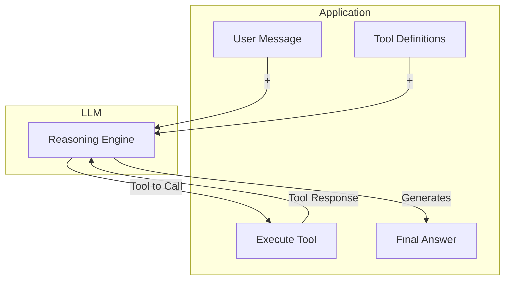
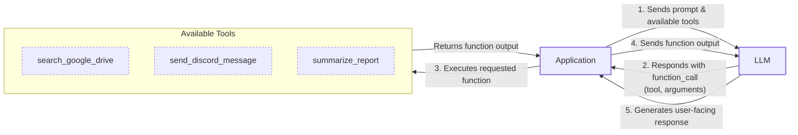
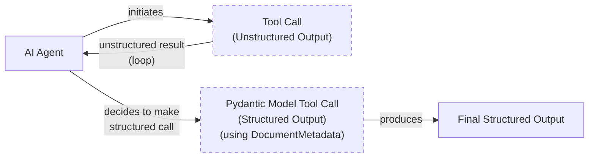
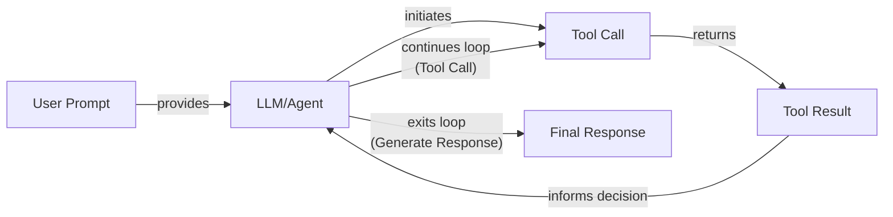

# Lesson 6: Agent Tools & Function Calling

In the last five lessons, we’ve built a solid foundation in AI Engineering. We started with the agent landscape, distinguished between LLM workflows and AI agents, and then dove into context engineering and structured outputs. We even implemented basic workflow patterns like chaining and routing. These concepts are the building blocks for creating predictable, rule-based AI systems.

Now, we are moving from systems that just process information to systems that can *act*. This lesson is about tools, also known as function calling. Tools are what give an LLM hands and senses, allowing it to interact with the outside world. Understanding how an agent uses tools is one of an AI engineer's most critical skills. It is the key to unlocking the full potential of AI, transforming a text generator into an agent that can browse the web, run code, or interact with any API you give it.

## Understanding Why Agents Need Tools

An LLM has a fundamental limitation: it is a text generator, a sophisticated pattern matcher trained on a static dataset. By itself, it cannot access real-time information, perform precise calculations, or interact with external systems. It lives inside its own textual world. This is where tools come in.

Think of the LLM as the brain of an operation. The tools are its hands and senses, allowing it to perceive and act in the world beyond its training data. Tools are the bridge between the LLM's internal reasoning and the external environment. When you give an LLM access to tools, it evolves from a simple model into an AI agent capable of executing complex tasks.

This interaction is illustrated in the diagram below. The application sends a user's message and a list of available tools to the LLM. The LLM then decides which tool to call and returns that instruction. The application executes the tool, sends the result back to the LLM, which then formulates a final answer for the user.


Image 1: A high-level overview of how an application and an LLM interact using tools.

This pattern is everywhere in modern AI agents. They use tools to:
- Access real-time information through APIs, like checking today's weather or fetching the latest news [[3]](https://www.philschmid.de/gemini-function-calling).
- Interact with external databases, data warehouses, or data lakes.
- Access their long-term memory to recall information beyond the current context window.
- Execute code, often in Python, to perform precise calculations, manipulate data, or create visualizations [[4]](https://arxiv.org/html/2507.08034v1).

## Implementing Tool Calls From Scratch

The best way to understand how tools work is to build them from scratch. In this section, we will implement a simple tool-calling mechanism to see how an LLM decides which tool to use, generates the correct parameters, and executes a function. We will learn how a tool is defined, what its schema looks like, and how to interpret the LLM's response.

The goal is to provide the LLM with a list of available tools and let it decide which one to use to fulfill a user's request. The high-level process involves five steps:

1.  **Application:** Send the LLM a prompt that includes a list of available tools.
2.  **LLM:** Respond with a `function_call` request, specifying the tool's name and the arguments to use.
3.  **Application:** Execute the requested function in your code.
4.  **Application:** Send the function's output back to the LLM.
5.  **LLM:** Use the tool's output to generate a final, user-facing response.


Image 2: A flowchart illustrating the 5-step request-execute-respond flow of calling a tool.

Let's implement this flow with a practical example. We will create a simple agent that can search for a financial report on Google Drive, summarize it, and send the summary to a Discord channel.

1.  First, we set up our environment by importing the necessary libraries and initializing the Gemini client. We will use the `gemini-2.5-flash` model for its speed and cost-effectiveness. We also define a sample `DOCUMENT` to mock the content of a file we might find.
    ```python
    import json
    from typing import Any
    
    from google import genai
    from google.genai import types
    from pydantic import BaseModel, Field
    
    from lessons.utils import pretty_print
    
    client = genai.Client()
    
    MODEL_ID = "gemini-2.5-flash"
    
    DOCUMENT = """
    # Q3 2023 Financial Performance Analysis
    
    The Q3 earnings report shows a 20% increase in revenue and a 15% growth in user engagement, 
    beating market expectations. These impressive results reflect our successful product strategy 
    and strong market positioning.
    
    Our core business segments demonstrated remarkable resilience, with digital services leading 
    the growth at 25% year-over-year. The expansion into new markets has proven particularly 
    successful, contributing to 30% of the total revenue increase.
    
    Customer acquisition costs decreased by 10% while retention rates improved to 92%, 
    marking our best performance to date. These metrics, combined with our healthy cash flow 
    position, provide a strong foundation for continued growth into Q4 and beyond.
    """
    ```

2.  Next, we define our three mock tools as Python functions. To keep things simple, these functions will return hardcoded data instead of making real API calls. The function signature and docstring are important, as the LLM will use them to understand what each tool does.
    ```python
    def search_google_drive(query: str) -> dict:
        """
        Searches for a file on Google Drive and returns its content or a summary.
    
        Args:
            query (str): The search query to find the file, e.g., 'Q3 earnings report'.
    
        Returns:
            dict: A dictionary representing the search results, including file names and summaries.
        """
        return {
            "files": [
                {
                    "name": "Q3_Earnings_Report_2024.pdf",
                    "id": "file12345",
                    "content": DOCUMENT,
                }
            ]
        }
    ```
    ```python
    def send_discord_message(channel_id: str, message: str) -> dict:
        """
        Sends a message to a specific Discord channel.
    
        Args:
            channel_id (str): The ID of the channel to send the message to, e.g., '#finance'.
            message (str): The content of the message to send.
    
        Returns:
            dict: A dictionary confirming the action, e.g., {"status": "success"}.
        """
        return {
            "status": "success",
            "status_code": 200,
            "channel": channel_id,
            "message_preview": f"{message[:50]}...",
        }
    ```
    ```python
    def summarize_financial_report(text: str) -> str:
        """
        Summarizes a financial report.
    
        Args:
            text (str): The text to summarize.
    
        Returns:
            str: The summary of the text.
        """
        return "The Q3 2023 earnings report shows strong performance across all metrics with 20% revenue growth, 15% user engagement increase, 25% digital services growth, and improved retention rates of 92%."
    ```

3.  For the LLM to use these functions, we must describe them in a format it understands. We define a JSON schema for each tool, which includes its name, a description of what it does, and the parameters it expects. This schema acts as a contract that tells the LLM how and when to call the function. This is an industry-standard practice used by major providers like OpenAI and Google [[1]](https://ai.google.dev/gemini-api/docs/function-calling), [[2]](https://platform.openai.com/docs/guides/function-calling).
    ```python
    search_google_drive_schema = {
        "name": "search_google_drive",
        "description": "Searches for a file on Google Drive and returns its content or a summary.",
        "parameters": {
            "type": "object",
            "properties": {
                "query": {
                    "type": "string",
                    "description": "The search query to find the file, e.g., 'Q3 earnings report'.",
                }
            },
            "required": ["query"],
        },
    }
    ```
    ```python
    send_discord_message_schema = {
        "name": "send_discord_message",
        "description": "Sends a message to a specific Discord channel.",
        "parameters": {
            "type": "object",
            "properties": {
                "channel_id": {
                    "type": "string",
                    "description": "The ID of the channel to send the message to, e.g., '#finance'.",
                },
                "message": {
                    "type": "string",
                    "description": "The content of the message to send.",
                },
            },
            "required": ["channel_id", "message"],
        },
    }
    ```
    ```python
    summarize_financial_report_schema = {
        "name": "summarize_financial_report",
        "description": "Summarizes a financial report.",
        "parameters": {
            "type": "object",
            "properties": {
                "text": {
                    "type": "string",
                    "description": "The text to summarize.",
                },
            },
            "required": ["text"],
        },
    }
    ```

4.  We then create a tool registry to map tool names to their corresponding functions and schemas. This makes it easy to look up and execute the correct function when the LLM requests it.
    ```python
    TOOLS = {
        "search_google_drive": {
            "handler": search_google_drive,
            "declaration": search_google_drive_schema,
        },
        "send_discord_message": {
            "handler": send_discord_message,
            "declaration": send_discord_message_schema,
        },
        "summarize_financial_report": {
            "handler": summarize_financial_report,
            "declaration": summarize_financial_report_schema,
        },
    }
    TOOLS_BY_NAME = {tool_name: tool["handler"] for tool_name, tool in TOOLS.items()}
    TOOLS_SCHEMA = [tool["declaration"] for tool in TOOLS.values()]
    ```
    The `TOOLS_BY_NAME` mapping gives us quick access to the function handlers.
    It outputs:
    ```text
    Tool name: search_google_drive
    Tool handler: <function search_google_drive at 0x104c7df80>
    ---------------------------------------------------------------------------
    Tool name: send_discord_message
    Tool handler: <function send_discord_message at 0x104c7de40>
    ---------------------------------------------------------------------------
    Tool name: summarize_financial_report
    Tool handler: <function summarize_financial_report at 0x1274f5c60>
    ---------------------------------------------------------------------------
    ```
    The `TOOLS_SCHEMA` list contains the JSON schemas we will pass to the LLM. Here is the schema for our `search_google_drive` tool.
    It outputs:
    ```text
     [93m-------------------------------- `search_google_drive` Tool Schema -------------------------------- [0m
     {
     "name": "search_google_drive",
     "description": "Searches for a file on Google Drive and returns its content or a summary.",
     "parameters": {
       "type": "object",
       "properties": {
         "query": {
           "type": "string",
           "description": "The search query to find the file, e.g., 'Q3 earnings report'."
         }
       },
       "required": [
         "query"
       ]
     }
   }
    [93m---------------------------------------------------------------------------------------------------- [0m
    ```

5.  Now, we need a system prompt to instruct the LLM on how to use these tools. This prompt explains the guidelines for tool usage, the expected format for a tool call, and provides the schemas for all available tools, wrapped in `<tool_definitions>` tags.
    ```python
    TOOL_CALLING_SYSTEM_PROMPT = """
    You are a helpful AI assistant with access to tools that enable you to take actions and retrieve information to better 
    assist users.
    
    ## Tool Usage Guidelines
    
    **When to use tools:**
    - When you need information that is not in your training data
    - When you need to perform actions in external systems and environments
    - When you need real-time, dynamic, or user-specific data
    - When computational operations are required
    
    **Tool selection:**
    - Choose the most appropriate tool based on the user's specific request
    - If multiple tools could work, select the one that most directly addresses the need
    - Consider the order of operations for multi-step tasks
    
    **Parameter requirements:**
    - Provide all required parameters with accurate values
    - Use the parameter descriptions to understand expected formats and constraints
    - Ensure data types match the tool's requirements (strings, numbers, booleans, arrays)
    
    ## Tool Call Format
    
    When you need to use a tool, output ONLY the tool call in this exact format:
    
    ```tool_call
    {{"name": "tool_name", "args": {{"param1": "value1", "param2": "value2"}}}}
    ```
    
    **Critical formatting rules:**
    - Use double quotes for all JSON strings
    - Ensure the JSON is valid and properly escaped
    - Include ALL required parameters
    - Use correct data types as specified in the tool definition
    - Do not include any additional text or explanation in the tool call
    
    ## Response Behavior
    
    - If no tools are needed, respond directly to the user with helpful information
    - If tools are needed, make the tool call first, then provide context about what you're doing
    - After receiving tool results, provide a clear, user-friendly explanation of the outcome
    - If a tool call fails, explain the issue and suggest alternatives when possible
    
    ## Available Tools
    
    <tool_definitions>
    {tools}
    </tool_definitions>
    
    Remember: Your goal is to be maximally helpful to the user. Use tools when they add value, but don't use them unnecessarily. Always prioritize accuracy and user experience.
    """
    ```

6.  The LLM's decision-making process relies heavily on the `description` field within each tool's schema. This is why writing clear, articulate, and distinct descriptions is one of the most important aspects of building reliable agents [[5]](https://www.anthropic.com/research/building-effective-agents). If you have two tools with vague descriptions like "search documents" and "search files," the model will likely get confused. Instead, be explicit: "search documents on Google Drive" versus "search files on the local disk." This clarity becomes crucial as the number of tools scales to 50 or 100, where ambiguity can lead to cascading failures [[6]](https://mbrenndoerfer.com/writing/function-calling-llm-structured-tools).

    Once the model selects a tool, it generates the function name and arguments as a structured output, typically JSON. This is possible because models are instruction-tuned on vast datasets of tool-use examples, teaching them to interpret schemas and produce the correct syntax for tool calls.

7.  Let's test our setup. We will ask the agent to find the latest quarterly report.
    ```python
    USER_PROMPT = """
    Can you help me find the latest quarterly report and share key insights with the team?
    """
    
    messages = [TOOL_CALLING_SYSTEM_PROMPT.format(tools=str(TOOLS_SCHEMA)), USER_PROMPT]
    
    response = client.models.generate_content(
        model=MODEL_ID,
        contents=messages,
    )
    ```
    The model correctly identifies the `search_google_drive` tool and generates the necessary arguments.
    It outputs:
    ```text
     [93m-------------------------------------- LLM Tool Call Response -------------------------------------- [0m
     ```tool_call
   {"name": "search_google_drive", "args": {"query": "latest quarterly report"}}
   ```
    [93m---------------------------------------------------------------------------------------------------- [0m
    ```

8.  Now, let's try a multi-step request.
    ```python
    USER_PROMPT = """
    Please find the Q3 earnings report on Google Drive and send a summary of it to 
    the #finance channel on Discord.
    """
    
    messages = [TOOL_CALLING_SYSTEM_PROMPT.format(tools=str(TOOLS_SCHEMA)), USER_PROMPT]
    
    response = client.models.generate_content(
        model=MODEL_ID,
        contents=messages,
    )
    ```
    The model decides to first search for the report.
    It outputs:
    ```text
     [93m-------------------------------------- LLM Tool Call Response -------------------------------------- [0m
     ```tool_call
   {"name": "search_google_drive", "args": {"query": "Q3 earnings report"}}
   ```
    [93m---------------------------------------------------------------------------------------------------- [0m
    ```

9.  To execute the tool, we first need to parse the LLM's response. We will create a helper function to extract the JSON string from the `tool_call` block.
    ```python
    def extract_tool_call(response_text: str) -> str:
        """
        Extracts the tool call from the response text.
        """
        return response_text.split("```tool_call")[1].split("```")[0].strip()
    
    
    tool_call_str = extract_tool_call(response.text)
    ```
    This gives us a clean JSON string.
    It outputs:
    ```text
    '{"name": "search_google_drive", "args": {"query": "Q3 earnings report"}}'
    ```

10. We then parse this string into a Python dictionary.
    ```python
    tool_call = json.loads(tool_call_str)
    ```
    It outputs:
    ```text
    {'name': 'search_google_drive', 'args': {'query': 'Q3 earnings report'}}
    ```

11. Now we can execute the function. We look up the tool's handler in our `TOOLS_BY_NAME` dictionary.
    ```python
    tool_handler = TOOLS_BY_NAME[tool_call["name"]]
    ```
    This gives us a reference to our `search_google_drive` function.
    It outputs:
    ```text
    <function __main__.search_google_drive(query: str) -> dict>
    ```

12. Finally, we call the function with the arguments provided by the LLM.
    ```python
    tool_result = tool_handler(**tool_call["args"])
    ```
    The tool returns the mocked document content.
    It outputs:
    ```text
     [93m-------------------------------------- LLM Tool Call Response -------------------------------------- [0m
     {
     "files": [
       {
         "name": "Q3_Earnings_Report_2024.pdf",
         "id": "file12345",
         "content": "\n# Q3 2023 Financial Performance Analysis\n\nThe Q3 earnings report shows a 20% increase in revenue and a 15% growth in user engagement, \nbeating market expectations. These impressive results reflect our successful product strategy \nand strong market positioning.\n\nOur core business segments demonstrated remarkable resilience, with digital services leading \nthe growth at 25% year-over-year. The expansion into new markets has proven particularly \nsuccessful, contributing to 30% of the total revenue increase.\n\nCustomer acquisition costs decreased by 10% while retention rates improved to 92%, \nmarking our best performance to date. These metrics, combined with our healthy cash flow \nposition, provide a strong foundation for continued growth into Q4 and beyond.\n"
       }
     ]
   }
    [93m---------------------------------------------------------------------------------------------------- [0m
    ```

13. We can wrap these steps in a single `call_tool` function for convenience.
    ```python
    def call_tool(response_text: str, tools_by_name: dict) -> Any:
        """
        Call a tool based on the response from the LLM.
        """
    
        tool_call_str = extract_tool_call(response_text)
        tool_call = json.loads(tool_call_str)
        tool_name = tool_call["name"]
        tool_args = tool_call["args"]
        tool = tools_by_name[tool_name]
    
        return tool(**tool_args)
    ```
    Using this function gives us the same result as before.
    It outputs:
    ```text
     [93m-------------------------------------- LLM Tool Call Response -------------------------------------- [0m
     {
     "files": [
       {
         "name": "Q3_Earnings_Report_2024.pdf",
         "id": "file12345",
         "content": "\n# Q3 2023 Financial Performance Analysis\n\nThe Q3 earnings report shows a 20% increase in revenue and a 15% growth in user engagement, \nbeating market expectations. These impressive results reflect our successful product strategy \nand strong market positioning.\n\nOur core business segments demonstrated remarkable resilience, with digital services leading \nthe growth at 25% year-over-year. The expansion into new markets has proven particularly \nsuccessful, contributing to 30% of the total revenue increase.\n\nCustomer acquisition costs decreased by 10% while retention rates improved to 92%, \nmarking our best performance to date. These metrics, combined with our healthy cash flow \nposition, provide a strong foundation for continued growth into Q4 and beyond.\n"
       }
     ]
   }
    [93m---------------------------------------------------------------------------------------------------- [0m
    ```

14. The final step is to send the tool's output back to the LLM. This allows the model to interpret the result and decide on the next action or formulate a final response for the user.
    ```python
    response = client.models.generate_content(
        model=MODEL_ID,
        contents=f"Interpret the tool result: {json.dumps(tool_result, indent=2)}",
    )
    ```
    It outputs:
    ```text
     [93m-------------------------------------- LLM Tool Call Response -------------------------------------- [0m
     The tool result provides the content of a file named `Q3_Earnings_Report_2024.pdf`.
   
   This document is a **Q3 2023 Financial Performance Analysis** and details exceptionally strong results, significantly beating market expectations.
   
   **Key highlights from the report include:**
   
   *   **Revenue Growth:** A 20% increase in revenue.
   *   **User Engagement:** 15% growth in user engagement.
   *   **Core Business Performance:** Digital services led growth at 25% year-over-year.
   *   **Market Expansion Success:** New markets contributed 30% of the total revenue increase.
   *   **Efficiency & Retention:**
       *   Customer acquisition costs decreased by 10%.
       *   Retention rates improved to 92%, marking the best performance to date.
   *   **Financial Health:** The company maintains a healthy cash flow position.
   
   The report attributes these impressive results to a successful product strategy and strong market positioning, indicating a robust foundation for continued growth into Q4 and beyond.
    [93m---------------------------------------------------------------------------------------------------- [0m
    ```

That is the basic concept behind tool calling. We have successfully implemented a function-calling mechanism from the ground up.

## Implementing a Tool Calling Framework From Scratch

Manually defining a JSON schema for every function is tedious and error-prone. Production frameworks like LangGraph automate this by using a `@tool` decorator. This decorator inspects a function's signature and docstring to generate the schema automatically, which is a much more scalable approach.

This approach follows the Don't Repeat Yourself (DRY) principle, a core tenet of software engineering. By defining the schema and implementation in one place—the function itself—we create a single source of truth that is easier to maintain. The decorator acts as a factory, taking a standard Python function and augmenting it with the metadata needed for the LLM to use it as a tool.

Let's build our own simple `@tool` decorator to create a small tool-calling framework. This will give you a deeper appreciation for the engineering that goes into libraries like LangChain or Pydantic AI [[7]](https://pydantic.dev/docs/ai/tools-toolsets/tools/).

1.  We start by defining a `ToolFunction` class to wrap our decorated functions. This class will hold both the function handler and its auto-generated schema. It acts as a container, bundling the executable code with its descriptive metadata.
    ```python
    from inspect import Parameter, signature
    from typing import Any, Callable, Dict, Optional
    
    
    class ToolFunction:
        def __init__(self, func: Callable, schema: Dict[str, Any]) -> None:
            self.func = func
            self.schema = schema
            self.__name__ = func.__name__
            self.__doc__ = func.__doc__
    
        def __call__(self, *args: Any, **kwargs: Any) -> Any:
            return self.func(*args, **kwargs)
    ```

2.  Next, we implement the `@tool` decorator. This function takes another function as input, inspects its signature (`__name__`, `__doc__`, parameters) using Python's built-in `inspect` module, and constructs a JSON schema [[8]](https://openai.github.io/openai-agents-python/tools/). It then returns a `ToolFunction` instance containing the original function and the new schema. This process transforms a plain function into a self-describing tool.
    ```python
    def tool(description: Optional[str] = None) -> Callable[[Callable], ToolFunction]:
        """
        A decorator that creates a tool schema from a function.
    
        Args:
            description: Optional override for the function's docstring
    
        Returns:
            A decorator function that wraps the original function and adds a schema
        """
    
        def decorator(func: Callable) -> ToolFunction:
            # Get function signature
            sig = signature(func)
    
            # Create parameters schema
            properties = {}
            required = []
    
            for param_name, param in sig.parameters.items():
                # Skip self for methods
                if param_name == "self":
                    continue
    
                param_schema = {
                    "type": "string",  # Default to string, can be enhanced with type hints
                    "description": f"The {param_name} parameter",  # Default description
                }
    
                # Add to required if parameter has no default value
                if param.default == Parameter.empty:
                    required.append(param_name)
    
                properties[param_name] = param_schema
    
            # Create the tool schema
            schema = {
                "name": func.__name__,
                "description": description or func.__doc__ or f"Executes the {func.__name__} function.",
                "parameters": {
                    "type": "object",
                    "properties": properties,
                    "required": required,
                },
            }
    
            return ToolFunction(func, schema)
    
        return decorator
    ```

3.  Now, we can redefine our tools using the new decorator. The code is much cleaner as we no longer need to write the schemas by hand. The decorator handles the boilerplate, letting us focus on the function's logic.
    ```python
    @tool()
    def search_google_drive_example(query: str) -> dict:
        """Search for files in Google Drive."""
        return {"files": ["Q3 earnings report"]}
    
    
    @tool()
    def send_discord_message_example(channel_id: str, message: str) -> dict:
        """Send a message to a Discord channel."""
        return {"message": "Message sent successfully"}
    
    
    @tool()
    def summarize_financial_report_example(text: str) -> str:
        """Summarize the contents of a financial report."""
        return "Financial report summarized successfully"
    
    
    tools = [
        search_google_drive_example,
        send_discord_message_example,
        summarize_financial_report_example,
    ]
    tools_by_name = {tool.schema["name"]: tool.func for tool in tools}
    tools_schema = [tool.schema for tool in tools]
    ```

4.  Our decorated function `search_google_drive_example` is now a `ToolFunction` object.
    It outputs:
    ```text
    __main__.ToolFunction
    ```
    This object contains the generated schema, which is identical to the one we created manually.
    It outputs:
    ```text
     [93m----------------------------------- Search Google Drive Example ----------------------------------- [0m
     {
     "name": "search_google_drive_example",
     "description": "Search for files in Google Drive.",
     "parameters": {
       "type": "object",
       "properties": {
         "query": {
           "type": "string",
           "description": "The query parameter"
         }
       },
       "required": [
         "query"
       ]
     }
   }
    [93m---------------------------------------------------------------------------------------------------- [0m
    ```
    It also holds a reference to the original function handler.
    It outputs:
    ```text
    <function __main__.search_google_drive_example(query: str) -> dict>
    ```

5.  We can now use this new, automated setup to call the LLM. The process is the same as before, but our code for defining tools is now much more scalable and maintainable.
    ```python
    USER_PROMPT = """
    Please find the Q3 earnings report on Google Drive and send a summary of it to 
    the #finance channel on Discord.
    """
    
    messages = [TOOL_CALLING_SYSTEM_PROMPT.format(tools=str(tools_schema)), USER_PROMPT]
    
    response = client.models.generate_content(
        model=MODEL_ID,
        contents=messages,
    )
    ```
    The LLM responds with the correct tool call.
    It outputs:
    ```text
     [93m-------------------------------------- LLM Tool Call Response -------------------------------------- [0m
     ```tool_call
   {"name": "search_google_drive_example", "args": {"query": "Q3 earnings report"}}
   ```
    [93m---------------------------------------------------------------------------------------------------- [0m
    ```
    And we execute it just as before.
    It outputs:
    ```text
     [93m-------------------------------------- LLM Tool Call Response -------------------------------------- [0m
     {
     "files": [
       "Q3 earnings report"
     ]
   }
    [93m---------------------------------------------------------------------------------------------------- [0m
    ```

Voilà! We have our own small tool-calling framework. This implementation is conceptually similar to what powerful libraries like LangGraph do under the hood.

## Implementing Production-Level Tool Calls with Gemini

While building from scratch is a great learning exercise, in production, it is almost always better to use the native tool-calling features of an API like Gemini or OpenAI. These APIs are optimized by the vendor for their specific models, making them more robust, accurate, and efficient. This is because the provider handles the complex prompt engineering required to instruct the model, ensuring it aligns perfectly with the model's training [[9]](https://www.decodingai.com/p/tool-calling-from-scratch-to-production).

Instead of manually engineering a system prompt, we can use Gemini's `GenerateContentConfig` to declare our available tools. This abstracts away the low-level details and lets us focus on the application logic. Let's see how this simplifies our implementation.

1.  First, we define a `Tool` object containing our function declarations and pass it to a `GenerateContentConfig`. We set the `mode` to `"ANY"` to force the model to call a tool instead of generating a text response. This gives us more control over the model's behavior.
    ```python
    tools = [
        types.Tool(
            function_declarations=[
                types.FunctionDeclaration(**search_google_drive_schema),
                types.FunctionDeclaration(**send_discord_message_schema),
            ]
        )
    ]
    config = types.GenerateContentConfig(
        tools=tools,
        tool_config=types.ToolConfig(function_calling_config=types.FunctionCallingConfig(mode="ANY")),
    )
    ```

2.  With the config in place, our call to the model becomes much simpler. We no longer need the lengthy `TOOL_CALLING_SYSTEM_PROMPT`; we can pass the user's prompt directly. The API handles the rest, making the code cleaner and less prone to prompt-related errors.
    ```python
    response = client.models.generate_content(
        model=MODEL_ID,
        contents=USER_PROMPT,
        config=config,
    )
    ```

3.  The `google-genai` SDK simplifies this even further. Instead of manually creating schemas, we can pass our Python functions directly to the `GenerateContentConfig`. The SDK automatically inspects the function's signature, type hints, and docstring to generate the schema, just like our custom `@tool` decorator did [[1]](https://ai.google.dev/gemini-api/docs/function-calling).
    ```python
    from google.genai import types 
    
    config = types.GenerateContentConfig( 
        tools=[search_google_drive, send_discord_message] 
    )
    ```

4.  The response from Gemini includes a `function_call` object that is easy to work with.
    ```python
    response_message_part = response.candidates[0].content.parts[0]
    function_call = response_message_part.function_call
    ```
    It outputs:
    ```text
    FunctionCall(id=None, args={'query': 'Q3 earnings report'}, name='search_google_drive')
    ```
    We can then define a simplified `call_tool` function to handle Gemini's native objects.
    ```python
    def call_tool(function_call) -> Any:
        tool_name = function_call.name
        tool_args = {key: value for key, value in function_call.args.items()}
    
        tool_handler = TOOLS_BY_NAME[tool_name]
    
        return tool_handler(**tool_args)
    ```

5.  Executing the tool is now straightforward.
    ```python
    tool_result = call_tool(response_message_part.function_call)
    ```
    It outputs:
    ```text
     [93m------------------------------------------- Tool Result ------------------------------------------- [0m
     {
     "files": [
       {
         "name": "Q3_Earnings_Report_2024.pdf",
         "id": "file12345",
         "content": "\n# Q3 2023 Financial Performance Analysis\n\nThe Q3 earnings report shows a 20% increase in revenue and a 15% growth in user engagement, \nbeating market expectations. These impressive results reflect our successful product strategy \nand strong market positioning.\n\nOur core business segments demonstrated remarkable resilience, with digital services leading \nthe growth at 25% year-over-year. The expansion into new markets has proven particularly \nsuccessful, contributing to 30% of the total revenue increase.\n\nCustomer acquisition costs decreased by 10% while retention rates improved to 92%, \nmarking our best performance to date. These metrics, combined with our healthy cash flow \nposition, provide a strong foundation for continued growth into Q4 and beyond.\n"
       }
     ]
   }
    [93m---------------------------------------------------------------------------------------------------- [0m
    ```
    By leveraging the native SDK, we have reduced dozens of lines of code to just a few, creating a more robust and maintainable system. Other popular APIs from OpenAI and Anthropic follow a similar logic, making these concepts easily transferable across different platforms [[10]](https://apxml.com/courses/prompt-engineering-llm-application-development/chapter-4-interacting-with-llm-apis/overview-common-llm-apis), [[11]](https://myengineeringpath.dev/tools/gemini-guide/).

## Using Pydantic Models as Tools for Structured Outputs

We can combine what we learned in this lesson with Lesson 4 on structured outputs. A powerful pattern in agentic systems is to treat a Pydantic model as a tool. This allows an agent to perform several intermediate steps that may produce unstructured text, and then, when it has all the necessary information, make a final call to a "tool" that is actually a Pydantic model. This forces the final output into a reliable, structured format.

This approach is ideal for tasks that require multi-step reasoning before producing a structured result, ensuring the final data is validated and easy for downstream systems to consume. It gives you the flexibility of free-form intermediate steps with the reliability of a validated final output [[12]](https://pydantic.dev/docs/ai/core-concepts/output/).


Image 3: A flowchart illustrating an AI agent calling multiple tools in a loop, where only the last one is a tool call for structured outputs.

Let's see how to implement this.

1.  First, we define our `DocumentMetadata` Pydantic model, just as we did in Lesson 4.
    ```python
    class DocumentMetadata(BaseModel):
        """A class to hold structured metadata for a document."""
    
        summary: str = Field(description="A concise, 1-2 sentence summary of the document.")
        tags: list[str] = Field(description="A list of 3-5 high-level tags relevant to the document.")
        keywords: list[str] = Field(description="A list of specific keywords or concepts mentioned.")
        quarter: str = Field(description="The quarter of the financial year described in the document (e.g., Q3 2023).")
        growth_rate: str = Field(description="The growth rate of the company described in the document (e.g., 10%).")
    ```

2.  Next, we create a tool declaration for a function named `extract_metadata`. The key here is that for the `parameters` of this function, we provide the JSON schema generated from our Pydantic model using `DocumentMetadata.model_json_schema()`.
    ```python
    extraction_tool = types.Tool(
        function_declarations=[
            types.FunctionDeclaration(
                name="extract_metadata",
                description="Extracts structured metadata from a financial document.",
                parameters=DocumentMetadata.model_json_schema(),
            )
        ]
    )
    config = types.GenerateContentConfig(
        tools=[extraction_tool],
        tool_config=types.ToolConfig(function_calling_config=types.FunctionCallingConfig(mode="ANY")),
    )
    ```

3.  We then prompt the model to analyze our document and extract the metadata.
    ```python
    prompt = f"""
    Please analyze the following document and extract its metadata.
    
    Document:
    --- 
    {DOCUMENT}
    --- 
    """
    
    response = client.models.generate_content(model=MODEL_ID, contents=prompt, config=config)
    ```

4.  The model responds by "calling" our `extract_metadata` tool, providing the extracted data as arguments that match our Pydantic schema.
    ```python
    response_message_part = response.candidates[0].content.parts[0]
    
    if hasattr(response_message_part, "function_call"):
        function_call = response_message_part.function_call
    ```
    It outputs:
    ```text
     [93m------------------------------------------ Function Call ------------------------------------------ [0m
      [38;5;208mFunction Name: [0m `extract_metadata
      [38;5;208mFunction Arguments: [0m `{
     "growth_rate": "20%",
     "summary": "The Q3 2023 earnings report shows a 20% increase in revenue and 15% growth in user engagement, driven by successful product strategy and market expansion. This performance provides a strong foundation for continued growth.",
     "quarter": "Q3 2023",
     "keywords": [
       "Revenue",
       "User Engagement",
       "Market Expansion",
       "Customer Acquisition",
       "Retention Rates",
       "Digital Services",
       "Cash Flow"
     ],
     "tags": [
       "Financials",
       "Earnings",
       "Growth",
       "Business Strategy",
       "Market Analysis"
     ]
   }`
    [93m---------------------------------------------------------------------------------------------------- [0m
    ```

5.  Finally, we can validate this data by instantiating our `DocumentMetadata` model with the arguments from the function call.
    ```python
    try:
        document_metadata = DocumentMetadata(**function_call.args)
        pretty_print.wrapped(document_metadata.model_dump_json(indent=2), title="Pydantic Validated Object")
    except Exception as e:
        pretty_print.wrapped(f"Validation failed: {e}", title="Validation Error")
    ```
    It outputs:
    ```text
     [93m------------------------------------ Pydantic Validated Object ------------------------------------ [0m
     {
     "summary": "The Q3 2023 earnings report shows a 20% increase in revenue and 15% growth in user engagement, driven by successful product strategy and market expansion. This performance provides a strong foundation for continued growth.",
     "tags": [
       "Financials",
       "Earnings",
       "Growth",
       "Business Strategy",
       "Market Analysis"
     ],
     "keywords": [
       "Revenue",
       "User Engagement",
       "Market Expansion",
       "Customer Acquisition",
       "Retention Rates",
       "Digital Services",
       "Cash Flow"
     ],
     "quarter": "Q3 2023",
     "growth_rate": "20%"
   }
    [93m---------------------------------------------------------------------------------------------------- [0m
    ```
This pattern is frequently used in production AI agents that require reliable, structured data as their final output.

## The Downsides of Running Tools in a Loop

So far, we have focused on single-turn interactions. However, the real power of agents comes from their ability to perform multi-step tasks by chaining multiple tool calls together in a loop. This allows an agent to break down a complex problem, gather information or take actions step-by-step, and use the output of one tool to inform the input of the next.


Image 4: A flowchart illustrating a tool calling loop by an LLM/Agent.

This iterative process gives agents flexibility and adaptability. But it also has significant limitations. Let's implement a multi-step tool loop and then discuss its downsides.

1.  We configure our model with all three tools: `search_google_drive`, `send_discord_message`, and `summarize_financial_report`.
    ```python
    tools = [
        types.Tool(
            function_declarations=[
                types.FunctionDeclaration(**search_google_drive_schema),
                types.FunctionDeclaration(**send_discord_message_schema),
                types.FunctionDeclaration(**summarize_financial_report_schema),
            ]
        )
    ]
    config = types.GenerateContentConfig(
        tools=tools,
        tool_config=types.ToolConfig(function_calling_config=types.FunctionCallingConfig(mode="ANY")),
    )
    ```

2.  Our user prompt requires multiple actions: find a report, summarize it, and send the summary to Discord.
    ```python
    USER_PROMPT = """
    Please find the Q3 earnings report on Google Drive and send a summary of it to 
    the #finance channel on Discord.
    """
    
    messages = [USER_PROMPT]
    ```

3.  We start the loop by sending the initial prompt to the model.
    ```python
    response = client.models.generate_content(
        model=MODEL_ID,
        contents=messages,
        config=config,
    )
    response_message_part = response.candidates[0].content.parts[0]
    messages.append(response.candidates[0].content)
    ```
    The model's first action is to search for the document.
    It outputs:
    ```text
     [93m------------------------------------------ Function Call ------------------------------------------ [0m
      [38;5;208mFunction Name: [0m `search_google_drive
      [38;5;208mFunction Arguments: [0m `{
     "query": "Q3 earnings report"
   }`
    [93m---------------------------------------------------------------------------------------------------- [0m
    ```

4.  We then enter a `while` loop. In each iteration, we execute the requested tool, append the result to our message history, and send the updated history back to the model to decide on the next step.
    ```python
    max_iterations = 3
    while hasattr(response_message_part, "function_call") and max_iterations > 0:
        tool_result = call_tool(response_message_part.function_call)
    
        function_response_part = types.Part.from_function_response(
            name=response_message_part.function_call.name,
            response={"result": tool_result},
        )
        messages.append(function_response_part)
    
        response = client.models.generate_content(
            model=MODEL_ID,
            contents=messages,
            config=config,
        )
    
        response_message_part = response.candidates[0].content.parts[0]
        messages.append(response.candidates[0].content)
    
        max_iterations -= 1
    ```
    The agent successfully chains the tools: it finds the document, summarizes it, and then sends the message.
    It outputs:
    ```text
     [93m------------------------------------------- Tool Result ------------------------------------------- [0m
     {
     "files": [
       {
         "name": "Q3_Earnings_Report_2024.pdf",
         "id": "file12345",
         "content": "\n# Q3 2023 Financial Performance Analysis\n\nThe Q3 earnings report shows a 20% increase in revenue and a 15% growth in user engagement, \nbeating market expectations. These impressive results reflect our successful product strategy \nand strong market positioning.\n\nOur core business segments demonstrated remarkable resilience, with digital services leading \nthe growth at 25% year-over-year. The expansion into new markets has proven particularly \nsuccessful, contributing to 30% of the total revenue increase.\n\nCustomer acquisition costs decreased by 10% while retention rates improved to 92%, \nmarking our best performance to date. These metrics, combined with our healthy cash flow \nposition, provide a strong foundation for continued growth into Q4 and beyond.\n"
       }
     ]
   }
    [93m---------------------------------------------------------------------------------------------------- [0m
     [93m------------------------------------------ Function Call ------------------------------------------ [0m
      [38;5;208mFunction Name: [0m `summarize_financial_report
    [93m---------------------------------------------------------------------------------------------------- [0m
     [93m------------------------------------------- Tool Result ------------------------------------------- [0m
     The Q3 2023 earnings report shows strong performance across all metrics with 20% revenue growth, 15% user engagement increase, 25% digital services growth, and improved retention rates of 92%.
    [93m---------------------------------------------------------------------------------------------------- [0m
     [93m------------------------------------------ Function Call ------------------------------------------ [0m
      [38;5;208mFunction Name: [0m `send_discord_message
    [93m---------------------------------------------------------------------------------------------------- [0m
    ```

While this simple loop works for sequential tasks, it has major flaws that become apparent in production. First, it cannot recover from failure. If a tool call fails or returns an unexpected result, the loop has no mechanism to revise its strategy [[13]](https://blogs.oracle.com/developers/what-is-the-ai-agent-loop-the-core-architecture-behind-autonomous-ai-systems). Second, it lacks a planning mechanism. The agent moves directly from one action to the next without an intermediate reasoning step, preventing it from thinking about what it has learned or adjusting its course. This can lead to inefficient tool use or getting stuck in infinite loops [[14]](https://myengineeringpath.dev/genai-engineer/agentic-patterns/).

Furthermore, this sequential approach is inefficient. If a task involves independent actions, like fetching financial news and stock prices simultaneously, a simple loop cannot execute them in parallel. This unnecessarily increases latency.

These limitations are why the industry has moved toward more sophisticated patterns like ReAct (Reasoning and Acting). ReAct explicitly interleaves "thought" steps with "action" steps, allowing the agent to reason about its progress and plan its next move more deliberately. We will dive deep into ReAct in Lessons 7 and 8.

## Popular Tools Used Within The Industry

We have covered the mechanics of tool use, but what kinds of tools are AI engineers building in the real world? Tools can be grouped into several key categories based on their function, each enabling agents to perform a different class of tasks.

**Knowledge & Memory Access:**
These tools are the agent's gateway to external data, forming its long-term memory. They connect the LLM to vector databases for semantic search, document stores for raw file retrieval, and knowledge graphs for understanding relationships between entities [[15]](https://neo4j.com/blog/agentic-ai/connected-context-and-persistent-memory-neo4j-providers-for-the-microsoft-agent-framework/). A powerful and increasingly common pattern in this category is text-to-SQL, which gives the agent the ability to construct and execute SQL queries against traditional relational databases, effectively democratizing data access for non-technical users [[16]](https://promethium.ai/guides/text-to-sql-basics-benefits/). These capabilities are fundamental to RAG, which we will cover in Lesson 10, and agent memory, the topic of Lesson 9.

**Web Search & Browsing:**
This is one of the most common and intuitive tool categories. These tools allow agents to access up-to-the-minute information from the internet by interfacing with search engine APIs like Google, Bing, or Brave. They can also include web scraping capabilities to fetch and parse content directly from web pages. This gives the agent a way to break free from its static training data and answer questions about current events, a feature essential for research agents and modern chatbots [[17]](https://mantraideas.com/llm-web-search/).

**Code Execution:**
A code interpreter tool, typically for Python, is invaluable for tasks requiring precise calculations, data manipulation, or visualization. It allows the agent to write and execute code in a sandboxed environment, overcoming the LLM's inherent limitations with complex math and logic [[4]](https://arxiv.org/html/2507.08034v1). This "executable reasoning" allows the model to validate its logic through empiricism rather than just pattern matching, leading to more accurate and reliable results in analytical tasks [[18]](https://medium.com/@anicomanesh/how-llm-reasoning-powers-the-agentic-ai-revolution-cbefd10ebf3f). While Python is the most common, this pattern can be adapted for other languages.

**Other Popular Tools:**
The possibilities are nearly endless. In enterprise settings, agents frequently interact with external APIs for calendars, email, and project management tools, automating routine business workflows [[19]](https://lnu.diva-portal.org/smash/get/diva2:1801354/FULLTEXT01.pdf). For productivity applications, agents might use tools for file system operations, like reading and writing files or listing directories on your operating system, turning the agent into a true digital assistant.

## Conclusion

Tool calling is a cornerstone of modern AI engineering. It is what elevates an LLM from a passive text generator to an active agent that can interact with its environment. By mastering how to define, implement, and orchestrate tools, you gain the ability to build, monitor, and debug truly capable AI applications.

This lesson is just the beginning. The simple tool-calling loop we built reveals the need for more advanced reasoning capabilities. In our next lesson, we will explore the theory behind planning and the ReAct pattern, which gives agents the ability to "think" before they act.

## References

- [1] Function calling with the Gemini API. (n.d.). Google AI for Developers. https://ai.google.dev/gemini-api/docs/function-calling
- [2] Function calling with OpenAI's API. (n.d.). OpenAI Platform. https://platform.openai.com/docs/guides/function-calling
- [3] Function Calling Guide: Google DeepMind Gemini 2.0 Flash. (n.d.). https://www.philschmid.de/gemini-function-calling
- [4] Integrating External Tools with Large Language Models (LLM) to Improve Accuracy. (n.d.). arXiv. https://arxiv.org/html/2507.08034v1
- [5] Building effective agents. (n.d.). Anthropic. https://www.anthropic.com/research/building-effective-agents
- [6] Function Calling, LLMs, and Structured Tools. (n.d.). https://mbrenndoerfer.com/writing/function-calling-llm-structured-tools
- [7] Tools. (n.d.). Pydantic. https://pydantic.dev/docs/ai/tools-toolsets/tools/
- [8] Tools. (n.d.). OpenAI Agents SDK. https://openai.github.io/openai-agents-python/tools/
- [9] Tool Calling from Scratch to Production. (n.d.). Decoding AI. https://www.decodingai.com/p/tool-calling-from-scratch-to-production
- [10] Overview of Common LLM APIs (OpenAI, Anthropic, etc.). (n.d.). https://apxml.com/courses/prompt-engineering-llm-application-development/chapter-4-interacting-with-llm-apis/overview-common-llm-apis
- [11] Google Gemini Guide. (n.d.). https://myengineeringpath.dev/tools/gemini-guide/
- [12] Output. (n.d.). Pydantic Docs. https://pydantic.dev/docs/ai/core-concepts/output/
- [13] What Is the AI Agent Loop? The Core Architecture Behind Autonomous AI Systems. (n.d.). Oracle Blogs. https://blogs.oracle.com/developers/what-is-the-ai-agent-loop-the-core-architecture-behind-autonomous-ai-systems
- [14] Agentic Design Patterns — Visual Architecture Guide. (n.d.). https://myengineeringpath.dev/genai-engineer/agentic-patterns/
- [15] Connected Context and Persistent Memory: Neo4j Providers for the Microsoft Agent Framework. (n.d.). Neo4j. https://neo4j.com/blog/agentic-ai/connected-context-and-persistent-memory-neo4j-providers-for-the-microsoft-agent-framework/
- [16] Text-to-SQL: The Basics, Benefits, and How It Works. (n.d.). Promethium. https://promethium.ai/guides/text-to-sql-basics-benefits/
- [17] How LLMs Use Web Search to Answer Your Questions. (n.d.). https://mantraideas.com/llm-web-search/
- [18] How LLM Reasoning Powers the Agentic AI Revolution. (n.d.). Medium. https://medium.com/@anicomanesh/how-llm-reasoning-powers-the-agentic-ai-revolution-cbefd10ebf3f
- [19] Extending Large Language Models with APIs. (n.d.). https://lnu.diva-portal.org/smash/get/diva2:1801354/FULLTEXT01.pdf